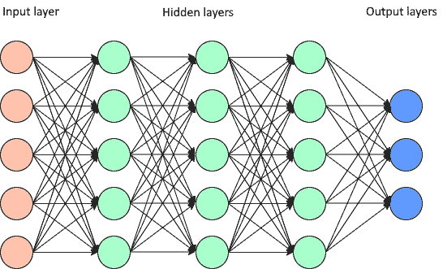
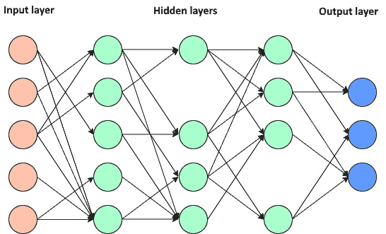
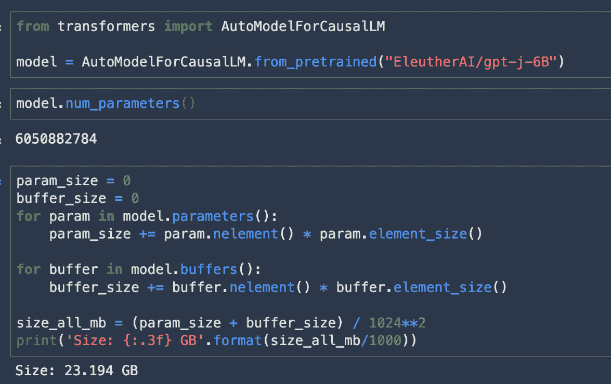
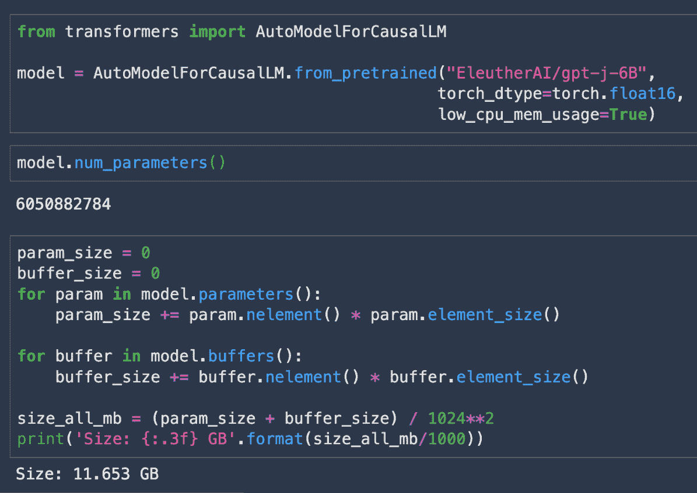
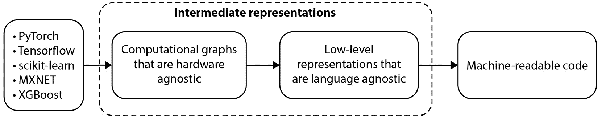
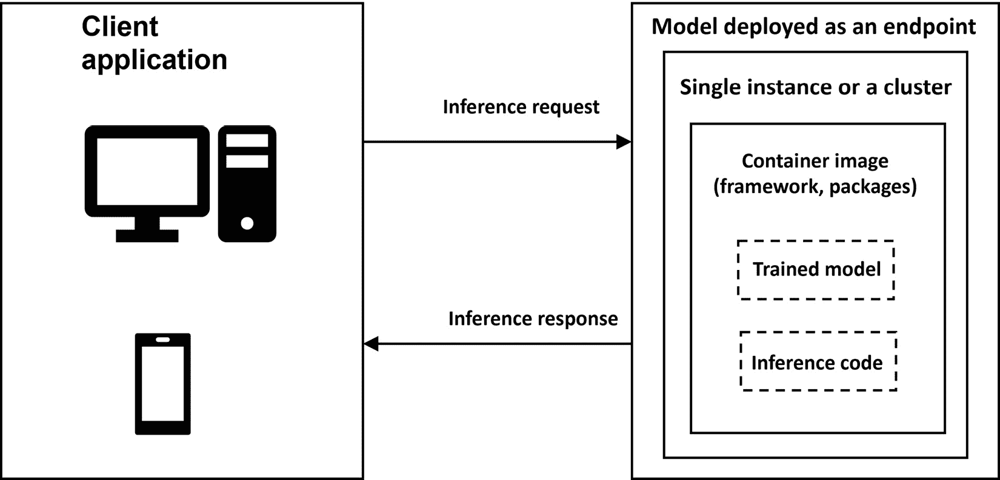
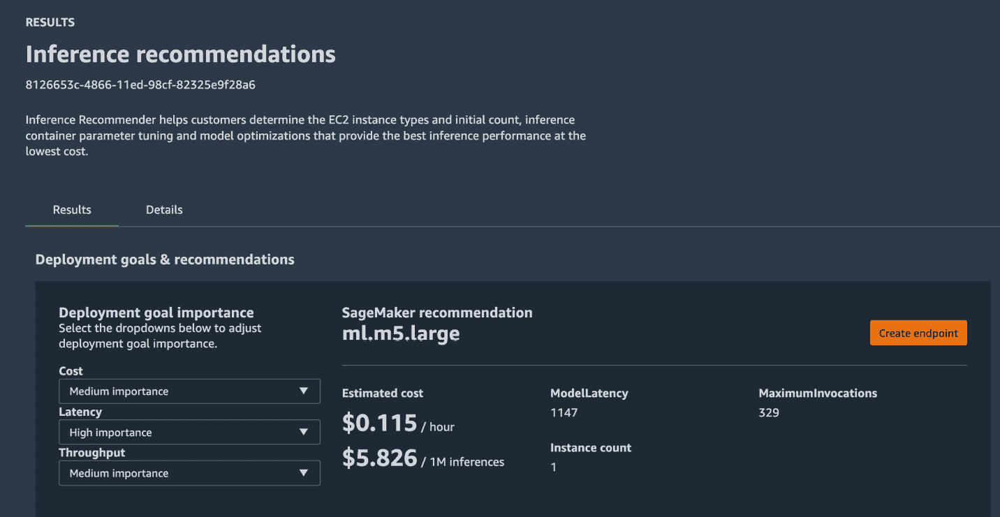

# 实时推理的性能优化

**机器学习**（**ML**）和**深度学习**（**DL**）模型几乎在所有行业中都得到应用，例如电子商务、制造业、生命科学和金融。因此，为了提高这些模型的表现，已经产生了有意义的创新。自 2018 年引入基于转换器的模型以来，这些模型最初是为**自然语言处理**（**NLP**）应用开发的，模型的规模和训练模型所需的数据集规模已经呈指数增长。**基于转换器**的模型现在也用于预测以及**计算机视觉**应用，除了 NLP。

让我们回顾一下这些模型规模的增长。**语言模型嵌入**（**ELMo**），于 2018 年推出，有*9360 万个参数*，而**生成预训练转换器**模型（也称为**GPT-3**），在 2020 年，有*1750 亿个参数*。今天，我们有了具有超过*1000 亿个参数*的深度学习模型，如**开关转换器**（[`arxiv.org/pdf/2101.03961.pdf`](https://arxiv.org/pdf/2101.03961.pdf)）。然而，用于训练和部署此类模型的硬件创新速度并没有跟上大型模型创新的速度。因此，我们需要复杂的技巧以成本效益和性能的方式训练和部署这些模型。

解决这一问题的方法之一是考虑减少模型的内存占用。此外，许多推理工作负载必须提供灵活性、高可用性以及随着企业服务数百万或数十亿用户的能力，特别是对于实时或近实时用例。我们需要了解用于部署的实例类型以及需要多少实例。我们还应该了解基于哪些关键指标来优化模型。

因此，为了共同解决上述场景，在本章中，我们将深入探讨以下主题：

+   减少深度学习模型的内存占用

+   优化模型的关键指标

+   选择实例类型、负载测试和模型性能调整

+   观察结果

重要提示

有关训练大型深度学习模型的详细信息，请参阅*第六章*，*机器学习模型的分布式训练*，其中我们详细介绍了该主题，并附带了一个示例。

# 技术要求

在开始本章之前，您应该具备以下先决条件：

+   一个网络浏览器（为了获得最佳体验，建议您使用 Chrome 或 Firefox 浏览器）

+   访问您在*第五章*，*数据分析*中使用的 AWS 账户

+   访问我们在*第五章*，*数据分析*中创建的 SageMaker Studio 开发环境

+   本章节的示例 Jupyter 笔记本可在配套的 GitHub 仓库中找到 ([`github.com/PacktPublishing/Applied-Machine-Learning-and-High-Performance-Computing-on-AWS/tree/main/Chapter09`](https://github.com/PacktPublishing/Applied-Machine-Learning-and-High-Performance-Computing-on-AWS/tree/main/Chapter09))

# 降低深度学习模型的内存占用

一旦我们训练了模型，我们需要部署模型以获取预测结果，这些结果随后被用来提供业务洞察。有时，我们的模型可能比市场上今天可用的单个 GPU 内存大小还要大。在这种情况下，你有两个选择——要么减小模型的内存占用，要么使用分布式部署技术。因此，在本节中，我们将讨论以下技术来减小模型的内存占用：

+   剪枝

+   量化

+   模型编译

让我们深入探讨这些技术的每一个，从剪枝开始。

## 剪枝

**剪枝**是一种消除深度学习模型中权重和参数的技术，这些权重和参数对模型性能的影响很小或没有，但对推理速度和模型大小有显著影响。剪枝方法背后的理念是使模型在内存和功耗上更高效，减少模型的存储需求和延迟。深度学习模型基本上是一个具有许多相互连接的隐藏层的神经网络。随着模型大小的增加，隐藏层的数量、参数以及层之间的权重连接也会增加。因此，剪枝方法倾向于移除未使用的参数和权重连接，而对模型的准确性影响不大，如图 *图 9*.1* 和 *图 9*.2* 所示。*图 9*.1 展示了剪枝前的神经网络：



图 9.1 – 剪枝前的简单神经网络

*图 9*.2 展示了剪枝后的相同神经网络：



图 9.2 – 剪枝后的简单神经网络

现在我们已经讨论了剪枝，接下来让我们看看量化。

## 量化

要训练一个神经网络，首先需要将数据通过前向传递传递到网络中，这会计算激活值，然后是反向传递，它使用激活值来计算梯度。激活值和梯度通常存储在浮点 32 中，这需要 4 字节内存。当你有具有数十亿或数万亿参数的模型时，这个数字相当可观。因此，**量化**是一种通过降低模型中权重、偏置和激活的精度来减小模型大小的技术，例如浮点 16 或 8，甚至到整数 8，这会显著减少内存占用。例如，具有 60 亿个可训练参数的 GPT-J-6B 模型大约需要 23 GB 的内存，如图 *图 9*.3* 所示。

*图 9.3* 展示了从 Hugging Face 库加载时的模型参数数量和大小：



图 9.3 – GPT-J-6B 模型的模型大小和参数数量

当使用 16 位浮点精度加载相同模型时，大约需要 11 GB 的内存，这大约是内存减少了一半，并且可以像 *图 9.4* 中所示的那样适应单个 GPU 的内存进行推理：



图 9.4 – GPT-J-6B 模型在 FP16 精度下的模型大小和参数数量

如 *图 9.3* 和 *图 9.4* 所示，量化可以是一种减少模型内存占用大小的有用技术。

现在，让我们看看另一种技术，称为模型编译。

## 模型编译

在我们进入模型编译之前，让我们首先了解编译。

**编译**是将人类可读的程序（一组指令）转换为机器可读程序的过程。这一核心思想被用作许多编程语言（如 C、C++ 和 Java）的骨干。这个过程还在程序的运行时环境中引入了效率，例如使其平台无关、减少程序内存大小等。大多数编程语言都自带 **编译器**，用于将代码编译成机器可读形式，因为编写编译器是一个繁琐的过程，需要深入理解编程语言以及硬件。

在编译机器学习模型时，使用了类似的想法。使用机器学习，编译器将神经网络的核心操作放置在 GPU 上，以最小化开销。这减少了模型占用的内存，提高了性能效率，并使其与硬件无关。这一概念在 *图 9.5* 中得到展示，其中编译器将使用 PyTorch、TensorFlow、XGBoost 等开发的模型转换为一种语言无关的中间表示，然后将其转换为机器可读的代码：



图 9.5 – 高级模型编译过程

模型编译消除了针对每个平台的特定硬件和软件配置微调模型所需的努力。现在有许多框架可供使用，可以编译您的模型，例如 **TVM** 和 **ONNX**，每个都有自己的优缺点。

注意

详细讨论编译器超出了本书的范围。有关 TVM 的详细信息，请参阅此链接：[`tvm.apache.org/`](https://tvm.apache.org/)。有关 ONNX 的详细信息，请参阅此链接：[`onnx.ai/`](https://onnx.ai/)。

让我们讨论 Amazon SageMaker 的一个功能，称为**SageMaker Neo**，它用于优化适用于多个平台的机器学习模型。Neo 自动优化各种框架（如 Gluon、Keras、PyTorch、TensorFlow 等）编写的模型，以便在不同的平台（如 Linux 和 Windows）以及许多不同的处理器上进行推理。有关 Neo 支持的框架或处理器的完整列表，请参阅此链接：[`docs.aws.amazon.com/sagemaker/latest/dg/neo-supported-devices-edge.html`](https://docs.aws.amazon.com/sagemaker/latest/dg/neo-supported-devices-edge.html)。

Neo 的工作方式是首先读取模型，将框架特定的操作和函数转换为无框架的中间表示，然后应用一系列优化。接下来，它将为优化操作生成二进制代码，将其写入共享对象库，并将模型定义和参数保存到单独的文件中（[`docs.aws.amazon.com/sagemaker/latest/dg/neo.html`](https://docs.aws.amazon.com/sagemaker/latest/dg/neo.html)）。

它还为每个目标平台提供了一个运行时，用于加载和执行编译后的模型。此外，它可以将参数优化为浮点 32 (`FP32`)、量化为整数 8 (`INT8`)或浮点 16 (`FP16`)。它可以将模型性能提高高达 25 倍，同时占用比 TensorFlow 或 PyTorch 等深度学习框架少十分之一的内存。为了进一步了解这一点，让我们从一个 PyTorch 的预训练图像分类模型开始，并使用 SageMaker Neo 对其进行优化。

注意

我们在*第八章*中提到了 SageMaker Neo，*优化和管理边缘部署的机器学习模型*。在这里，我们将使用相同的示例来详细解释它。完整的代码请参考 GitHub 链接：[`github.com/PacktPublishing/Applied-Machine-Learning-and-High-Performance-Computing-on-AWS/blob/main/Chapter08/sagemaker_notebook/1_compile_resnet_model_egde_manager.ipynb`](https://github.com/PacktPublishing/Applied-Machine-Learning-and-High-Performance-Computing-on-AWS/blob/main/Chapter08/sagemaker_notebook/1_compile_resnet_model_egde_manager.ipynb)。

按照以下步骤使用 SageMaker Neo 优化预训练模型：

1.  首先，我们将从 PyTorch 库中下载一个预训练模型，如下面的代码片段所示：

    ```py
    …
    ```

    ```py
    from torchvision.models import resnet18, ResNet18_Weights
    ```

    ```py
    #initialize the model
    ```

    ```py
    weights = ResNet18_Weights.DEFAULT
    ```

    ```py
    model = resnet18(weights)
    ```

    ```py
    …
    ```

1.  接下来，我们需要将模型保存为 SageMaker 所需的`model.tar.gz`格式，指定输入数据形状，并将模型上传到**Amazon S3**：

    ```py
    …
    ```

    ```py
    torch.save(model.state_dict(),
    ```

    ```py
               './output/resnet18-model.pt')
    ```

    ```py
    with tarfile.open("model.tar.gz", "w:gz") as f:
    ```

    ```py
        f.add("model.pth")
    ```

    ```py
    input_tensor = torch.zeros([1, 3, 224, 224])
    ```

    ```py
    model_uri = sagemaker_session.upload_data(
    ```

    ```py
        path="model.tar.gz", key_prefix=key_prefix)
    ```

    ```py
    print("S3 Path for Model: ", model_uri)
    ```

    ```py
    …
    ```

1.  一旦我们有了 SageMaker 格式的模型，我们将准备模型编译所需的参数。最重要的是，您需要提及`target_device`参数，因为 SageMaker Neo 将根据它为模型部署的特定硬件编译模型：

    ```py
    …
    ```

    ```py
    compilation_job_name = name_from_base("image-classification-neo")
    ```

    ```py
    prefix = key_prefix+'/'+compilation_job_name+"/model"
    ```

    ```py
    data_shape = '{"input0":[1,3,224,224]}'
    ```

    ```py
    target_device = "ml_c5"
    ```

    ```py
    framework = "PYTORCH"
    ```

    ```py
    framework_version = "1.8"
    ```

    ```py
    compiled_model_path = "s3://{}/{}/output".format(bucket, compilation_job_name)
    ```

    ```py
    print("S3 path for compiled model: ", compiled_model_path)
    ```

    ```py
    …
    ```

1.  接下来，我们将声明 SageMaker 提供的`PyTorchModel`对象，它将包含必要的配置，例如模型的 S3 路径、框架版本、推理脚本、Python 版本等：

    ```py
    …
    ```

    ```py
    from sagemaker.pytorch.model import PyTorchModel
    ```

    ```py
    from sagemaker.predictor import Predictor
    ```

    ```py
    sagemaker_model = PyTorchModel(
    ```

    ```py
        model_data=model_uri,
    ```

    ```py
        predictor_cls=Predictor,
    ```

    ```py
        framework_version=framework_version,
    ```

    ```py
        role=role,
    ```

    ```py
        sagemaker_session=sagemaker_session,
    ```

    ```py
        entry_point="inference.py",
    ```

    ```py
        source_dir="code",
    ```

    ```py
        py_version="py3",
    ```

    ```py
        env={"MMS_DEFAULT_RESPONSE_TIMEOUT": "500"},
    ```

    ```py
    )
    ```

    ```py
    …
    ```

1.  最后，我们将使用`PyTorchModel`对象创建编译作业，并将编译好的模型部署到`ml.c5.2xlarge`实例，因为模型是为`ml.c5`作为目标设备编译的：

    ```py
    …
    ```

    ```py
    sagemaker_client = boto3.client("sagemaker",
    ```

    ```py
        region_name=region)
    ```

    ```py
    target_arch = "X86_64"
    ```

    ```py
    target_os = 'LINUX'
    ```

    ```py
    response = sagemaker_client.create_compilation_job(
    ```

    ```py
        CompilationJobName=compilation_job_name,
    ```

    ```py
        RoleArn=role,
    ```

    ```py
        InputConfig={
    ```

    ```py
            "S3Uri": sagemaker_model.model_data,
    ```

    ```py
            "DataInputConfig": data_shape,
    ```

    ```py
            "Framework": framework,
    ```

    ```py
        },
    ```

    ```py
        OutputConfig={
    ```

    ```py
            "S3OutputLocation": compiled_model_path,
    ```

    ```py
            "TargetDevice": 'jetson_nano',
    ```

    ```py
            "TargetPlatform": {
    ```

    ```py
                "Arch": target_arch,
    ```

    ```py
                "Os": target_os
    ```

    ```py
            },
    ```

    ```py
        },
    ```

    ```py
        StoppingCondition={"MaxRuntimeInSeconds": 900},
    ```

    ```py
    )
    ```

    ```py
    print(response)
    ```

    ```py
    …
    ```

1.  一旦模型完成编译，您就可以部署编译好的模型进行推理。在这种情况下，我们将模型作为端点部署以进行**实时推理**：

    ```py
    …
    ```

    ```py
    predictor = compiled_model.deploy(
    ```

    ```py
        initial_instance_count=1,
    ```

    ```py
        instance_type="ml.c5.2xlarge")
    ```

    ```py
    …
    ```

注意

有关 SageMaker 提供的不同部署选项的更多详细信息，请参阅*第七章*，*大规模部署机器学习模型*。

1.  现在，一旦模型部署完成，我们可以像以下代码片段所示那样调用端点进行推理：

    ```py
    …
    ```

    ```py
    import numpy as np
    ```

    ```py
    import json
    ```

    ```py
    with open("horse_cart.jpg", "rb") as f:
    ```

    ```py
        payload = f.read()
    ```

    ```py
        payload = bytearray(payload)
    ```

    ```py
    response = runtime.invoke_endpoint(
    ```

    ```py
        EndpointName=ENDPOINT_NAME,
    ```

    ```py
        ContentType='application/octet-stream',
    ```

    ```py
        Body=payload,
    ```

    ```py
        Accept = 'application/json')
    ```

    ```py
    result = response['Body'].read()
    ```

    ```py
    result = json.loads(result)
    ```

    ```py
    print(result)
    ```

    ```py
    …
    ```

注意

由于我们已经将模型部署为实时端点，您将根据模型部署的实例付费。因此，如果您不使用端点，请确保使用以下代码片段将其删除。

1.  如果您不使用它，请使用以下代码片段删除端点：

    ```py
    …
    ```

    ```py
    # delete endpoint after testing the inference
    ```

    ```py
    import boto3
    ```

    ```py
    # Create a low-level SageMaker service client.
    ```

    ```py
    sagemaker_client = boto3.client('sagemaker',
    ```

    ```py
                                    region_name=region)
    ```

    ```py
    # Delete endpoint
    ```

    ```py
    sagemaker_client.delete_endpoint(
    ```

    ```py
        EndpointName=ENDPOINT_NAME)
    ```

    ```py
    …
    ```

现在我们已经了解了如何使用 SageMaker Neo 优化模型进行推理，让我们谈谈在尝试提高模型延迟时应该考虑的一些关键指标。下一节中介绍的思想适用于深度学习模型，即使您不使用 SageMaker Neo，因为您可能无法使用 Neo 编译所有模型。您可以在以下位置查看 SageMaker Neo 支持的模型和框架：[`docs.aws.amazon.com/sagemaker/latest/dg/neo-supported-cloud.html`](https://docs.aws.amazon.com/sagemaker/latest/dg/neo-supported-cloud.html)。

# 优化模型的关键指标

当涉及到实时推理时，为了提高性能，优化模型通常包括指标，如延迟、吞吐量和模型大小。为了优化模型大小，通常涉及有一个训练好的模型，检查模型的大小，如果它不适合单个 CPU/GPU 内存，您可以选择在*减少深度学习模型内存占用*部分讨论的任何技术来准备它以供部署。

对于部署，最佳实践之一是标准化环境。这涉及到使用容器来部署模型，无论您是在自己的服务器上部署还是使用 Amazon SageMaker。该过程在*图 9.6*中说明。6。



图 9.6 – 作为实时端点部署的模型

总结来说，我们首先将为部署准备模型，选择或创建一个容器以标准化环境，然后部署容器到实例（们）。因此，为了优化模型性能，寻找推理和实例指标都很重要。推理指标包括以下内容：

+   **调用次数**：发送到模型端点的请求数量。您可以通过使用**Amazon CloudWatch**中的总和统计来获取总请求数量，**Amazon CloudWatch**实时监控您在 AWS 上运行的资源或应用程序，包括 SageMaker（[`docs.aws.amazon.com/AmazonCloudWatch/latest/monitoring/WhatIsCloudWatch.html`](https://docs.aws.amazon.com/AmazonCloudWatch/latest/monitoring/WhatIsCloudWatch.html)）。

+   **每实例调用次数**：如果您的模型部署在多台机器上，那么了解发送到每个实例上的模型调用次数很重要。

+   **模型延迟**：这是模型响应所需的时间间隔。它包括发送请求的本地通信时间、模型在容器中完成推理以及从模型容器获取响应的时间：

*模型延迟 = 请求时间 + 模型在容器中完成推理所需的时间 + 从容器获取响应的时间*

+   **开销延迟**：这是端点收到请求后响应所需的时间减去模型延迟。它可能取决于多个因素，例如请求大小、请求频率、请求的认证/授权以及响应负载大小。

+   **最大调用次数**：这是每分钟对端点的最大请求数量。

+   **每小时成本**：这表示您端点的每小时预估成本。

+   **每推理成本**：这提供了您端点每推理的预估成本。

注意

成本指标以美元为单位提供成本。

除了推理指标外，您还应该根据所选实例类型优化实例指标，例如 GPU 利用率、GPU 内存、CPU 利用率和 CPU 内存。Amazon SageMaker 提供了超过 70 种实例，您可以从中选择来部署您的模型。这引发了一个额外的问题，即如何确定选择哪种实例类型和实例数量来部署模型以实现您的性能要求。让我们在下一节中讨论为您的模型选择最佳实例的方法。

# 选择实例类型、负载测试和模型性能调整

传统上，根据模型类型（ML 模型或 DL 模型）和模型大小，你可以根据经验猜测来测试模型在几个实例上的性能。这种方法速度快，但可能不是最佳方法。因此，为了优化此过程，你可以使用 Amazon SageMaker 的**推理推荐器**功能（[`docs.aws.amazon.com/sagemaker/latest/dg/inference-recommender.html`](https://docs.aws.amazon.com/sagemaker/latest/dg/inference-recommender.html)），该功能自动化了 SageMaker ML 实例上的负载测试和模型调整过程。它帮助你以最低的成本，根据你的性能要求，在优化的硬件上部署 ML 模型。

让我们通过使用预训练的图像分类模型来举例说明如何理解推理推荐器的工作原理。以下步骤概述了使用推理推荐器的过程：

1.  确定 ML 模型细节，例如框架和领域。以下是一个代码片段示例：

    ```py
    …
    ```

    ```py
    # ML model details
    ```

    ```py
    ml_domain = "COMPUTER_VISION"
    ```

    ```py
    ml_task = "IMAGE_CLASSIFICATION"
    ```

    ```py
    …
    ```

1.  取一个预训练模型，将其打包成 SageMaker 理解的压缩 TAR 文件（`*.tar.gz`）格式，并将模型上传到 Amazon S3。如果你已经在 SageMaker 上训练了模型，那么你可以跳过此步骤：

    ```py
    …
    ```

    ```py
    from torchvision.models import resnet18, ResNet18_Weights
    ```

    ```py
    #initialize the model
    ```

    ```py
    weights = ResNet18_Weights.DEFAULT
    ```

    ```py
    model = resnet18(weights)
    ```

    ```py
    torch.save(model.state_dict(), './output/resnet18-model.pt')
    ```

    ```py
    with tarfile.open("model.tar.gz", "w:gz") as f:
    ```

    ```py
        f.add("model.pth")
    ```

    ```py
    input_tensor = torch.zeros([1, 3, 224, 224])
    ```

    ```py
    model_uri = sagemaker_session.upload_data(path="model.tar.gz", key_prefix=key_prefix)
    ```

    ```py
    print("S3 Path for Model: ", model_uri)
    ```

    ```py
    …
    ```

1.  选择推理容器，它可以是 AWS 提供的预构建 Docker 容器或你自己的自定义容器。在我们的例子中，我们正在获取 AWS 提供的预构建 PyTorch 容器镜像：

    ```py
    …
    ```

    ```py
    instance_type = "ml.c5.xlarge"  # Note: you can use any CPU-based instance type here, this is just to get a CPU tagged image
    ```

    ```py
    container_uri = image_uris.retrieve(
    ```

    ```py
        "pytorch",
    ```

    ```py
        region,
    ```

    ```py
        version=framework_version,
    ```

    ```py
        py_version="py3",
    ```

    ```py
        instance_type=instance_type,
    ```

    ```py
        image_scope="inference",
    ```

    ```py
    )
    ```

    ```py
    container_uri
    ```

    ```py
    …
    ```

1.  创建一个样本有效载荷。在我们的例子中，我们有`.jpg`格式的图像，将它们压缩成 TAR 文件，并上传到 Amazon S3。在这个例子中，我们只使用了四张图像，但建议添加各种样本，以反映你的实际有效载荷：

    ```py
    !wget https://multimedia-commons.s3-us-west-2.amazonaws.com/data/images/139/019/1390196df443f2cf614f2255ae75fcf8.jpg -P /sample-payload
    ```

    ```py
    !wget https://multimedia-commons.s3-us-west-2.amazonaws.com/data/images/139/015/1390157d4caaf290962de5c5fb4c42.jpg -P /sample-payload
    ```

    ```py
    !wget https://multimedia-commons.s3-us-west-2.amazonaws.com/data/images/139/020/1390207be327f4c4df1259c7266473.jpg  -P /sample-payload
    ```

    ```py
    !wget https://multimedia-commons.s3-us-west-2.amazonaws.com/data/images/139/028/139028d865bafa3de66568eeb499f4a6.jpg  -P /sample-payload
    ```

按照以下代码片段压缩有效载荷，并将其上传到 S3：

```py
cd ./sample-payload/ && tar czvf ../{payload_archive_name} *
```

一旦我们有了 TAR 格式的有效载荷，让我们使用以下代码片段将其上传到 Amazon S3：

```py
…
sample_payload_url = sagemaker_session.upload_data(path=payload_archive_name, key_prefix="tf_payload")
…
```

1.  在**模型注册表**中注册模型，该注册表用于对生产中的模型进行编目、管理模型版本、关联元数据、管理模型的批准状态、将模型部署到生产环境，以及自动化模型部署过程（[`docs.aws.amazon.com/sagemaker/latest/dg/model-registry.html`](https://docs.aws.amazon.com/sagemaker/latest/dg/model-registry.html)）。在模型注册表中注册模型是一个两步过程，如下所示：

    1.  创建一个模型包组，它将包含模型的全部版本：

        ```py
        …
        ```

        ```py
        model_package_group_input_dict = {
        ```

        ```py
        "ModelPackageGroupName": model_package_group_name,
        ```

        ```py
        "ModelPackageGroupDescription": model_package_group_description,
        ```

        ```py
        }
        ```

        ```py
        create_model_package_group_response = sm_client.create_model_package_group(**model_package_group_input_dict)
        ```

        ```py
        …
        ```

    1.  将模型版本注册到模型包组中。要获取推荐的实例类型，你有两种选择——你既可以指定 Inference Recommender 要使用的实例列表，也可以不提供实例列表，它将根据 ML 领域和 ML 任务选择正确的实例。在我们的例子中，我们将使用用于图像分类算法的常见实例类型列表。这涉及三个步骤。

    1.  首先，创建一个输入字典，用于注册模型，如下面的代码片段所示：

        ```py
        …
        ```

        ```py
        model_approval_status = "PendingManualApproval"
        ```

        ```py
        # provide an input dictionary with configuration for registering the model
        ```

        ```py
        model_package_input_dict = {
        ```

        ```py
            "ModelPackageGroupName": model_package_group_name,
        ```

        ```py
            "Domain": ml_domain.upper(),
        ```

        ```py
            "Task": ml_task.upper(),
        ```

        ```py
            "SamplePayloadUrl": sample_payload_url,
        ```

        ```py
            "ModelPackageDescription": model_package_description,
        ```

        ```py
            "ModelApprovalStatus": model_approval_status,
        ```

        ```py
        }# optional – provide a list of instances
        ```

        ```py
        supported_realtime_inference_types = ["ml.c5.xlarge", "ml.m5.large", "ml.inf1.xlarge"]
        ```

        ```py
        ...
        ```

    1.  第二步是创建模型推理规范对象，这将包括提供有关容器、框架、模型输入、内容类型以及训练模型 S3 路径的详细信息：

        ```py
        #create model inference specification object
        ```

        ```py
        modelpackage_inference_specification = {
        ```

        ```py
            "InferenceSpecification": {
        ```

        ```py
                "Containers": [
        ```

        ```py
                    {
        ```

        ```py
                        "Image": container_uri,
        ```

        ```py
                        "Framework": "PYTORCH",
        ```

        ```py
                        "FrameworkVersion": framework_version,
        ```

        ```py
                        "ModelInput": {"DataInputConfig": data_input_configuration},
        ```

        ```py
                    }
        ```

        ```py
                ],
        ```

        ```py
                "SupportedContentTypes": "application/image",
        ```

        ```py
                "SupportedRealtimeInferenceInstanceTypes": supported_realtime_inference_types,  # optional
        ```

        ```py
            }
        ```

        ```py
        }
        ```

        ```py
        # Specify the model data
        ```

        ```py
        modelpackage_inference_specification["InferenceSpecification"]["Containers"][0]["ModelDataUrl"] = model_url
        ```

        ```py
        create_model_package_input_dict.update(modelpackage_inference_specification)
        ```

        ```py
        ...
        ```

    1.  最后，在提供推理规范后，我们将创建模型包。一旦模型包创建完成，你就可以获取模型包的 ARN，它也会在 SageMaker Studio UI 的**模型注册**下可见：

        ```py
        create_mode_package_response = sm_client.create_model_package(**model_package_input_dict)
        ```

        ```py
        model_package_arn = create_mode_package_response["ModelPackageArn"]
        ```

        ```py
        …
        ```

1.  现在，模型已经注册，我们将创建一个推理推荐器作业。有两种选择——你可以创建一个默认作业以获取实例推荐，或者你可以使用一个高级作业，其中你可以提供你的推理要求、调整环境变量并执行更广泛的负载测试。高级作业比默认作业花费更多时间，并且取决于你的流量模式和它将在哪些实例类型上运行负载测试的数量。

在本例中，我们将创建一个默认作业，这将返回一个包括环境变量、成本、吞吐量、模型延迟和最大调用次数的实例类型推荐列表。

以下代码片段展示了如何创建默认作业：

```py
…
response = sagemaker_client.create_inference_recommendations_job(
    JobName=str(default_job),
    JobDescription="",
    JobType="Default",
    RoleArn=role,
    InputConfig={"ModelPackageVersionArn": model_package_arn},
)
print(response)
…
```

注意

在 GitHub 仓库中提供了创建自定义负载测试的代码：[Applied-Machine-Learning-and-High-Performance-Computing-on-AWS/Chapter09/1_inference_recommender_custom_load_test.ipynb](http://Applied-Machine-Learning-and-High-Performance-Computing-on-AWS/Chapter09/1_inference_recommender_custom_load_test.ipynb)。

在下一节中，我们将讨论推理推荐器作业提供的结果。

# 观察结果

推理推荐器提供的推荐包括实例指标、性能指标和成本指标。

实例指标包括`InstanceType`、`InitialInstanceCount`和`EnvironmentParameters`，这些指标根据作业进行了调整以获得更好的性能。

性能指标包括`MaxInvocations`和`ModelLatency`，而成本指标包括`CostPerHour`和`CostPerInference`。

这些指标使你能够在成本和性能之间做出明智的权衡。例如，如果你的业务需求是整体价格性能，且注重吞吐量，那么你应该关注`CostPerInference`。如果你的需求是在延迟和吞吐量之间取得平衡，那么你应该关注`ModelLatency`和`MaxInvocations`指标。

你可以通过 API 调用或在 SageMaker Studio UI 中查看推理推荐器作业的结果。

以下代码片段用于观察结果：

```py
…
data = [
    {**x["EndpointConfiguration"], **x["ModelConfiguration"], **x["Metrics"]}
    for x in inference_recommender_job["InferenceRecommendations"]
]
df = pd.DataFrame(data)
…
```

你可以通过登录 SageMaker Studio，点击橙色三角形图标，并在下拉菜单中选择**模型注册**来观察 SageMaker Studio UI 中的结果：



图 9.7 – 推理推荐器结果

现在我们已经了解了如何使用 Amazon SageMaker 的推理推荐器功能来获取正确的实例类型和实例数量，让我们在下一节中查看本章涵盖的主题。

# 摘要

在本章中，我们讨论了各种优化机器学习和深度学习模型以实现实时推理的技术。我们讨论了不同的方法来减少深度学习模型的内存占用，例如剪枝和量化，随后深入探讨了模型编译。然后，我们讨论了可以帮助评估模型性能的关键指标。最后，我们深入探讨了如何使用 SageMaker 推理推荐器的功能来选择合适的实例、运行负载测试以及自动进行模型调优。

在下一章中，我们将讨论在 AWS 上可视化探索大量数据的方法。
