# 数据可视化

在前几章中，我们讨论了各种 AWS 服务和工具，这些工具可以帮助构建和运行高性能计算应用。我们讨论了存储、计算实例、数据处理、机器学习模型构建和托管，以及这些应用的边缘部署。所有这些应用，尤其是基于机器学习模型的应用，通常都需要某种类型的可视化。这种可视化可能从探索性数据分析到模型评估和比较，再到构建显示各种性能和业务指标的仪表板。

**数据可视化**对于发现各种业务洞察以及决定采取哪些特征工程步骤来训练提供良好结果的机器学习模型非常重要。AWS 提供了一些托管服务来构建数据可视化以及仪表板。

在本章中，我们将讨论这样一个选项，即 Amazon SageMaker Data Wrangler，它使数据科学、机器学习和分析领域的用户能够在不编写太多代码的情况下构建有洞察力的数据可视化。SageMaker Data Wrangler 提供了几个内置的可视化选项，以及通过几点击和很少的努力添加自定义可视化的能力。这有助于数据科学家进行探索性分析、特征工程和实验过程，这些过程涉及任何数据驱动用例。

此外，我们还将简要介绍 AWS 的图形优化实例的主题，因为这些实例可以与其他高性能计算应用（如游戏流和机器学习）一起用于创建动态实时数据可视化。

在本章中，我们将涵盖以下主题：

+   使用 Amazon SageMaker Data Wrangler 进行数据可视化

+   Amazon 的图形优化实例

# 使用 Amazon SageMaker Data Wrangler 进行数据可视化

**Amazon SageMaker Data Wrangler**是 SageMaker Studio 中的一个工具，它帮助数据科学家和机器学习从业者执行探索性数据分析和特征工程/转换。SageMaker Data Wrangler 是一个低代码/无代码工具，用户可以使用内置的绘图或特征工程能力，或者使用代码来制作自定义图表并执行自定义特征工程。在需要可视化的数据科学项目中，特别是那些需要执行探索性数据分析的大型数据集，SageMaker Data Wrangler 可以帮助通过几点击快速构建图表和可视化。我们可以将数据从各种数据源导入到 Data Wrangler 中，并执行诸如连接和过滤等操作。此外，还可以生成数据洞察和质量报告，以检测数据中是否存在任何异常。

在本节中，我们将通过一个示例来展示如何使用 SageMaker Data Wrangler 构建一个工作流程，以执行数据分析和可视化。

## SageMaker Data Wrangler 可视化选项

在 SageMaker Data Wrangler 中，首先，我们需要导入数据，然后构建一个工作流程以执行各种转换和可视化任务。在撰写本文时，数据可以从亚马逊 S3、亚马逊 Athena 和亚马逊 Redshift 导入到 SageMaker Data Wrangler 中。*图 10**.1*显示了亚马逊 SageMaker Data Wrangler 的**导入数据**界面。要添加来自亚马逊 Redshift 的数据，我们需要点击右上角的**添加数据源**按钮：

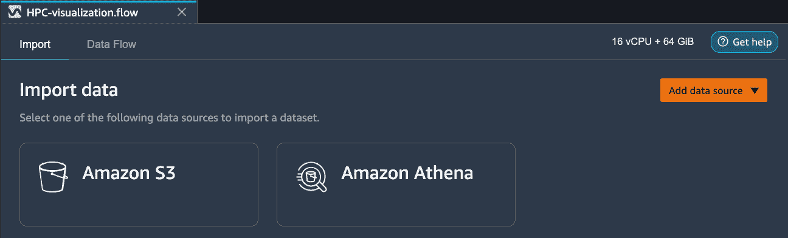

图 10.1 – SageMaker Data Wrangler 数据导入界面

接下来，我们将展示一个从亚马逊 S3 将数据导入 SageMaker Data Wrangler 的示例，然后说明对此数据的各种可视化选项。我们将使用加州大学欧文分校机器学习仓库中可用的*Adult*数据集([`archive.ics.uci.edu/ml/datasets/Adult`](https://archive.ics.uci.edu/ml/datasets/Adult))。此数据集将个人分为两类：该人是否每年收入超过 50,000 美元。数据集中有各种数值和分类特征。在导入数据时，我们可以选择是否要加载整个数据集或数据集的样本。*图 10**.2*显示了 SageMaker Data Wrangler 导入整个*Adult*数据集后创建的工作流程：

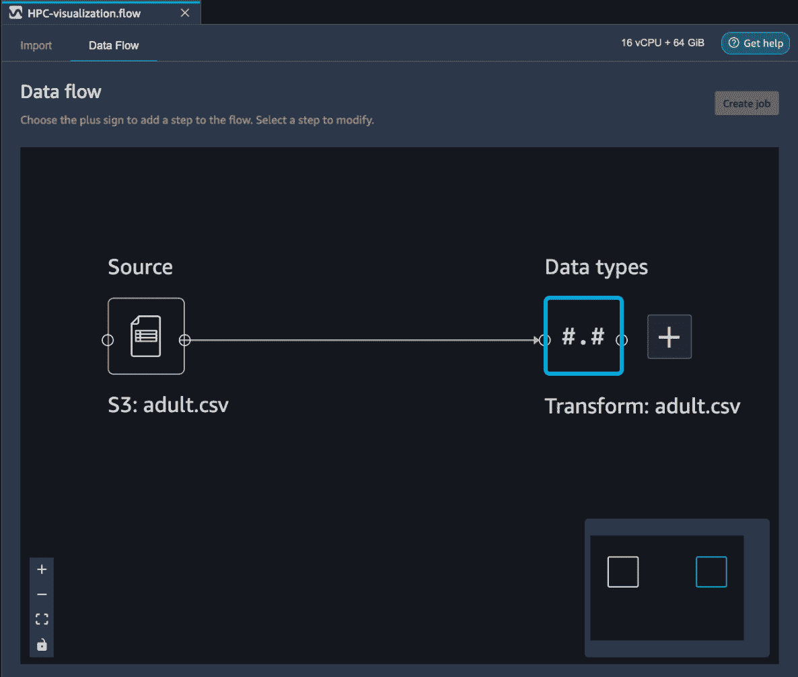

图 10.2 – 导入数据后 SageMaker Data Wrangler 创建的工作流程

通过在右侧的块上按下加号，我们可以将转换和可视化步骤添加到工作流程中，正如我们接下来将要演示的那样。

## 将可视化添加到 SageMaker Data Wrangler 的数据流中

在导入数据后，我们还可以在 SageMaker Data Wrangler 中查看数据，包括列（变量）类型。*图 10**.3*显示了 Adult 数据表的视图。此视图可以帮助数据科学家和分析人员快速查看数据并验证它：

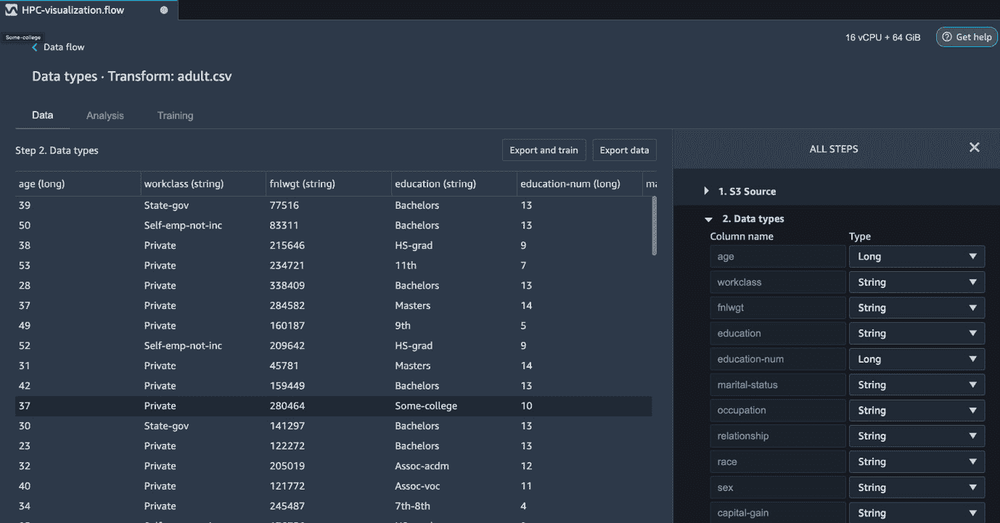

图 10.3 – 携带列类型的 Adult 数据表

要在我们的数据集上构建各种可视化，我们必须按下*图 10**.2*中显示的**Transform: adult.csv**块上的**+**号。这显示了 SageMaker Data Wrangler 中可用的各种分析和可视化选项。现在，我们将使用 SageMaker Data Wrangler 在*Adult*数据集上查看一些可视化示例。

### 直方图

一个`education-num`（教育年数）变量。我们还使用`income`目标变量来着色此分布，以显示收入如何依赖于教育年数：

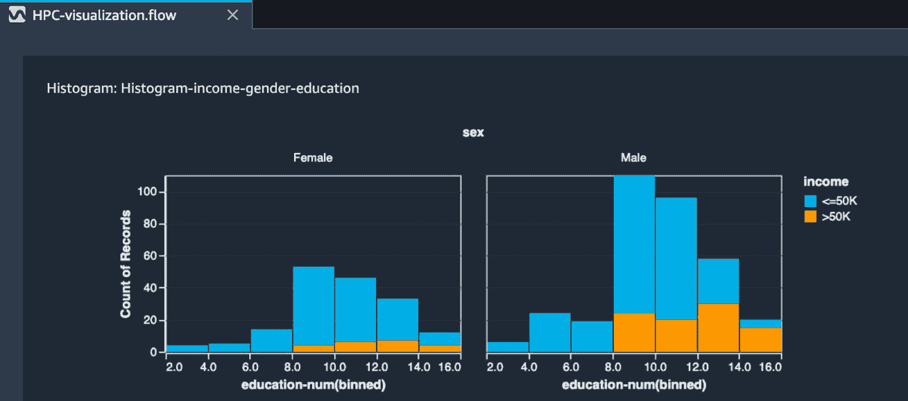

图 10.4 – 教育年限（education-num）的直方图，按两个类别（<=50k 和>50k）着色

除了颜色，我们还可以使用按收入着色的`education-num`。这是按`sex`变量分面，以分别显示男性和女性的分布：

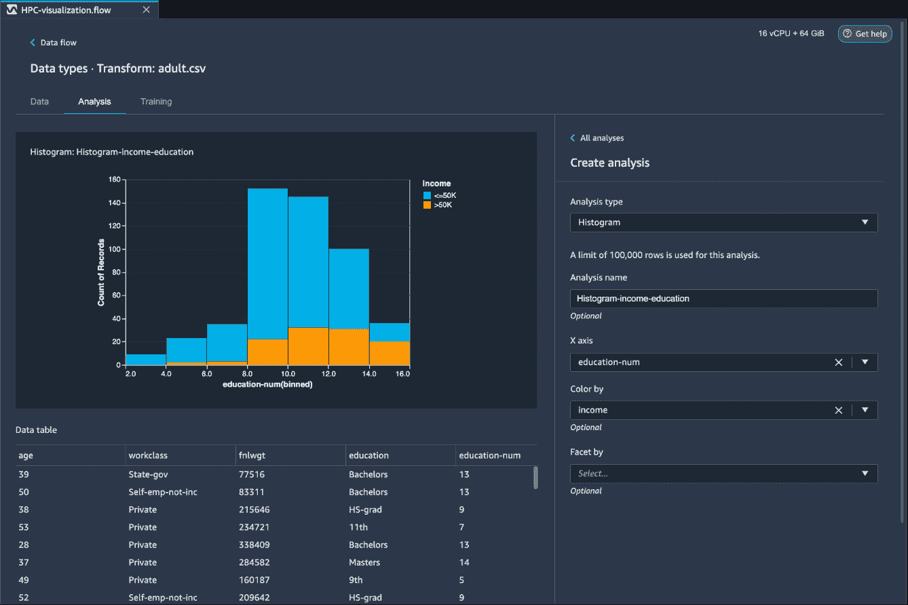

图 10.5 – 教育年限（education-num）的直方图，按两个类别（<=50k 和>50k）着色，并按性别分面

我们可以看到，通过这种方式只需点击几下就能创建多列的直方图，而且无需编写任何代码，这可以非常有助于进行快速探索性分析和在短时间内构建报告。这在多个高性能计算用例中通常是必需的，例如机器学习。

### 散点图

以`age`与`education-num`的关系，按`sex`分面：

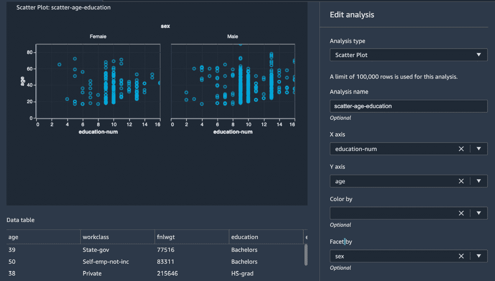

图 10.6 – 成人数据集中年龄与教育年限的散点图，按性别分面

结合直方图，散点图是极其有用的可视化工具，在机器学习的用例中进行探索性数据分析时被广泛使用。

### 多重共线性

在数据集中，当变量相互关联时，会出现**多重共线性**。在机器学习用例中，这很重要，因为如果检测到多重共线性，可以降低数据维度。数据维度降低有助于避免维度诅咒，以及提高机器学习模型的性能。此外，它还有助于减少模型训练时间、存储空间、内存需求和推理过程中的数据处理时间，从而降低总成本。在 SageMaker Data Wrangler 中，我们可以使用以下方法来检测变量中的多重共线性：

+   **方差膨胀** **因子** (**VIF**)

+   **主成分** **分析** (**PCA**)

+   Lasso 特征选择

接下来，我们将使用我们的*Adult*数据集在 SageMaker Data Wrangler 中展示这些方法的示例。

#### VIF

VIF 表示一个变量是否与其他变量相关。它是一个正数，值为一表示该变量与数据集中的其他变量不相关。大于一的值表示该变量与数据集中的其他变量相关。值越高，与其他变量的相关性越高。*图 10.7*显示了*Adult*数据集中数值变量的 VIF 图：

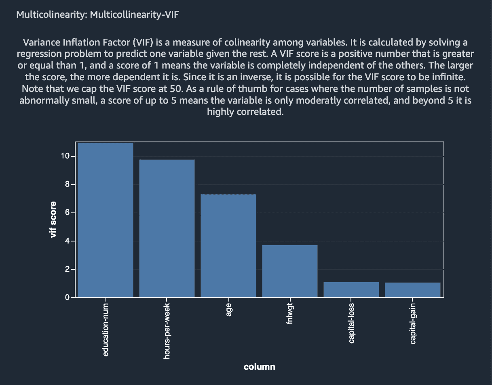

图 10.7 – 成人数据集中各种数值变量的 VIF

如图中所示，`education-num`、`hours-per-week`和`age`与其他变量高度相关，而`capital-gain`和`capital-loss`根据 VIF 分数与其他变量不相关。

#### PCA

PCA 是机器学习中应用最广泛的特征转换和降维方法之一。它通常不仅用作探索性数据分析工具，还用作监督学习问题中的预处理步骤。PCA 将数据投影到彼此正交的维度上。以这种方式生成的变量按方差（或奇异值）递减的顺序排列。这些方差可以用来确定变量中有多大的多重共线性。*图 10.8*展示了使用 SageMaker Data Wrangler 对我们的*Adult*数据集应用 PCA 的结果：

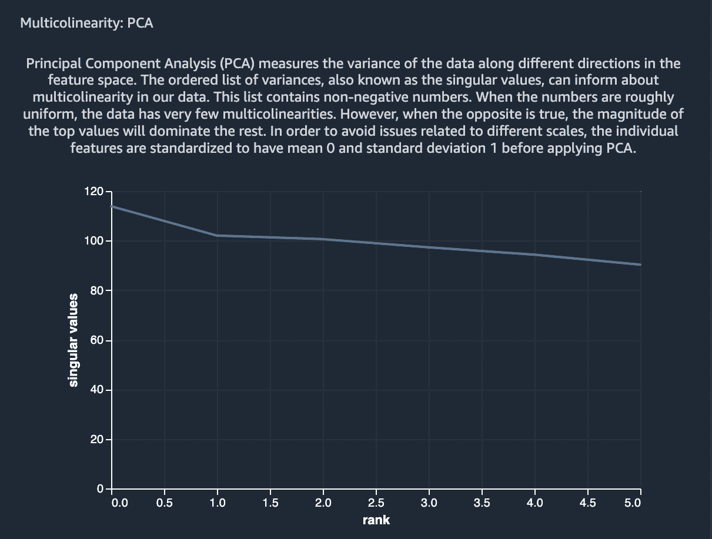

图 10.8 – 使用 SageMaker Data Wrangler 对 Adult 数据集进行 PCA 的结果

从这张图中可以推断出，大多数变量没有多重共线性，而少数变量有。

#### Lasso 特征选择

在 SageMaker Data Wrangler 中，我们可以使用 lasso 特征选择来找到数据集中对目标变量最有预测性的变量。它使用 L1 正则化方法为每个变量生成系数。系数分数越高，表示该特征对目标变量的预测性越强。就像 VIF 和 PCA 一样，lasso 特征选择在机器学习用例中通常用于降低数据集的维度。*图 10.9*展示了在 SageMaker Data Wrangler 中对我们的*Adult*数据集应用 lasso 特征选择的结果：

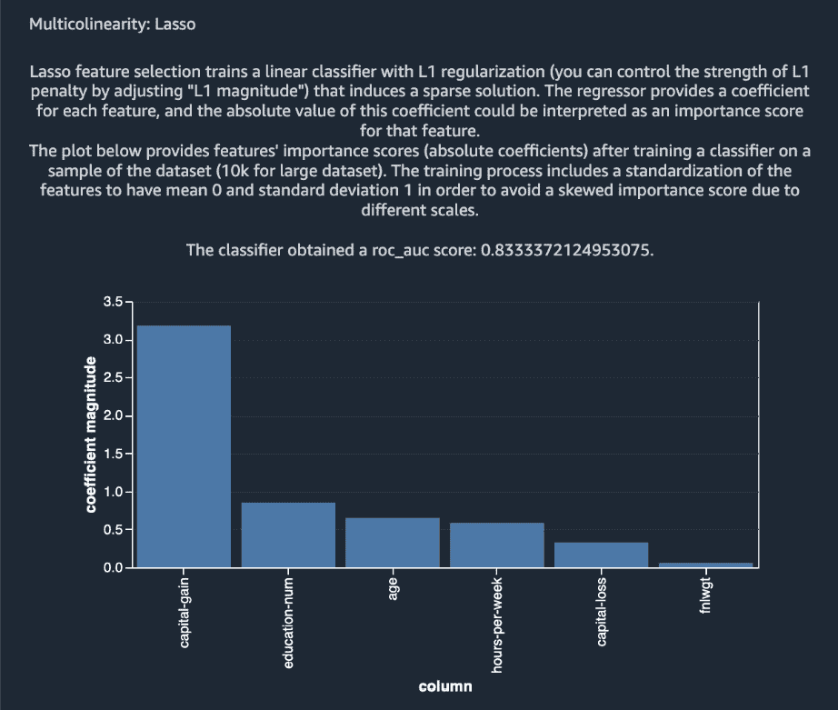

图 10.9 – 使用 SageMaker Data Wrangler 在 Adult 数据集上的 Lasso 特征选择结果

接下来，我们将讨论如何使用 SageMaker Data Wrangler 的快速模型功能来研究变量重要性。

### 快速模型

我们可以在 Data Wrangler 中使用**快速模型**来评估机器学习数据集的变量/特征重要性。快速模型根据监督学习问题类型训练随机森林回归器或随机森林分类器，并使用基尼重要性方法确定特征重要性分数。特征重要性分数介于 0 到 1 之间，特征重要性值越高，表示该特征对数据集的重要性越大。*图 10.10*展示了使用 SageMaker Data Wrangler 为我们*Adult*数据集创建的快速模型图：

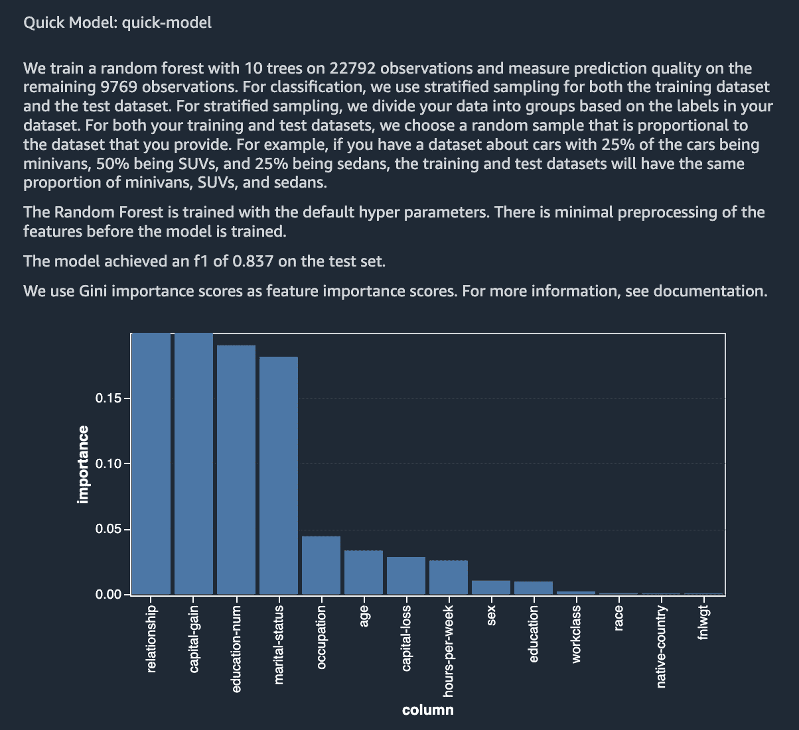

图 10.10 – 使用 SageMaker Data Wrangler 对 Adult 数据集的快速模型结果

快速模型可以帮助数据科学家快速评估特征的重要性，然后使用这些结果进行降维、模型性能改进或商业洞察。

### 偏差报告

使用 `sex` 变量（男性或女性），显示类别不平衡和两个其他指标：

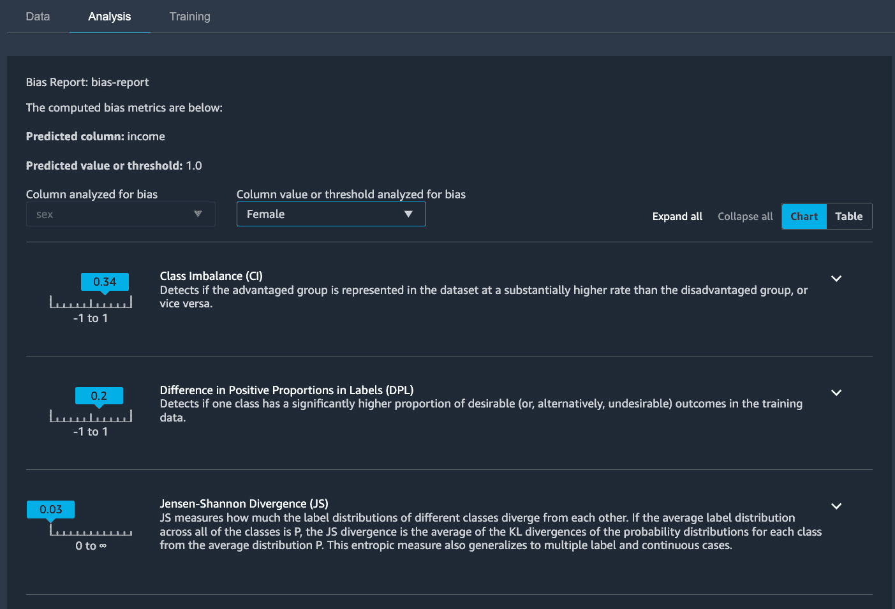

图 10.11 – 使用 SageMaker Data Wrangler 对 Adult 数据集进行的偏差报告

关于这些指标的更多信息，请参阅本章的 *进一步阅读* 部分。

### 数据质量及洞察力报告

我们也可以在 SageMaker Data Wrangler 中构建一个数据质量和洞察力报告。此报告显示了诸如表格摘要、重复行、目标变量的分布、异常样本、运行快速模型的结果、混淆矩阵（用于分类问题）、特征摘要以及特征重要性，以及特征详细图。*图 10.12* 展示了 *Adult* 数据集的表格摘要：

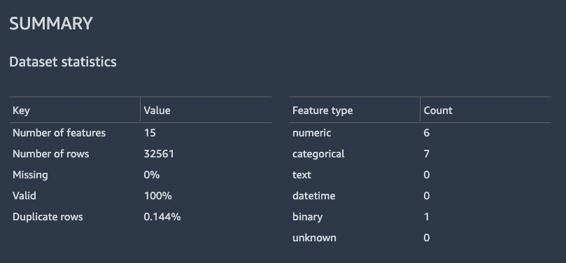

图 10.12 – 显示 Adult 数据集数据统计的表格摘要

*图 10.13* 展示了目标变量的直方图，以及 `occupation` 变量的各种值：

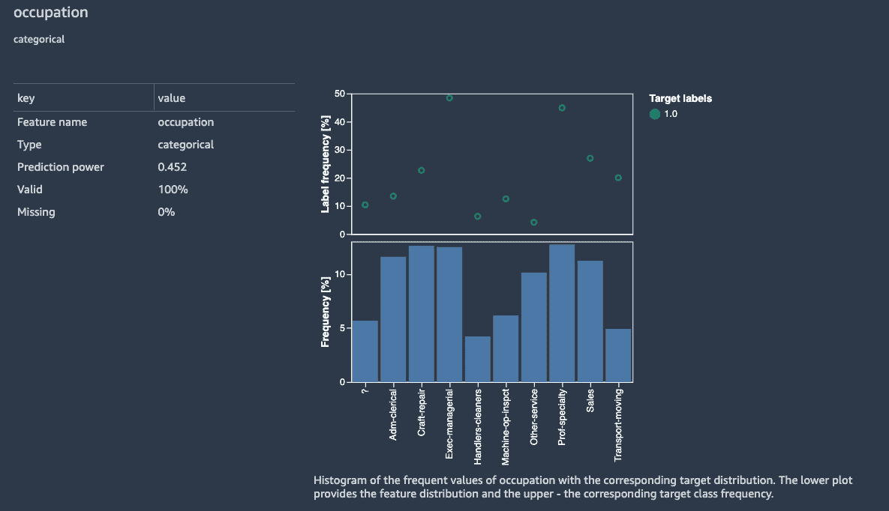

图 10.13 – 目标变量的直方图，以及职业变量的各种值

只需点击几下就能访问这些图表、指标和分布，这在执行探索性数据分析时节省了大量时间和精力。

## 数据流

随着我们在 SageMaker Data Wrangler 中的数据分析步骤增加，它们会在数据流中显示出来。*图 10.14* 中所示的数据流可视化是我们在此流程中已执行的一系列转换：

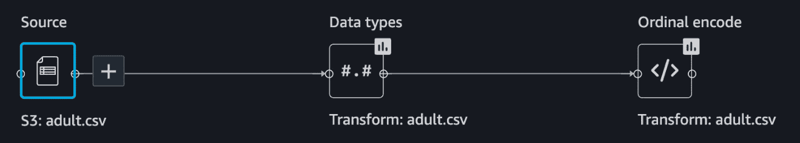

图 10.14 – 显示我们已在我们数据集上执行的一系列步骤的 SageMaker Data Wrangler 流程

我们可以点击单个框来查看工作流程中迄今为止执行的探索性分析步骤和数据转换。例如，点击中心框会显示 *图 10.15* 中的步骤：

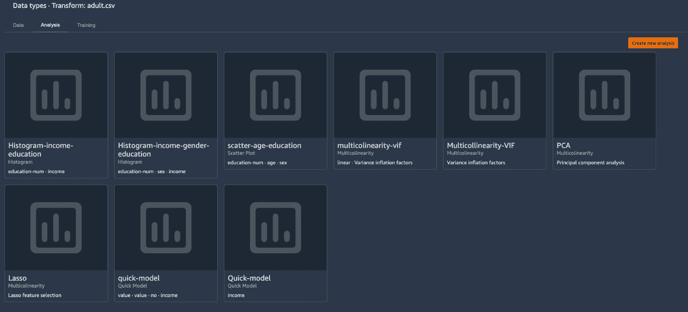

图 10.15 – 在 SageMaker Data Wrangler 中对我们数据集执行的各种探索性数据分析和数据转换步骤

点击 *图 10.14* 中显示的右侧框，会显示我们的偏差和数据质量报告，如 *图 10.16* 所示：

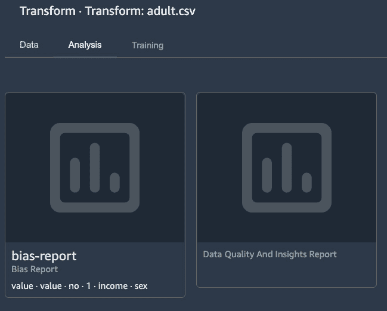

图 10.16 – SageMaker Data Wrangler 流中的偏差报告和数据质量及洞察报告步骤

SageMaker Data Wrangler 允许将这些步骤的结果导出到 SageMaker Feature Store 或 Amazon S3。此外，我们还可以将这些步骤作为代码导出到 SageMaker pipelines 或作为 Python 代码。

在本节中，我们讨论了使用 SageMaker Data Wrangler 在 Amazon SageMaker 中的各种可视化选项。Data Wrangler 中内置了多种可视化和分析选项，我们可以在机器学习用例中使用这些选项。在下一节中，我们将讨论亚马逊的图形优化实例选项。

# 亚马逊的图形优化实例

亚马逊提供了一系列图形优化实例，可用于高性能计算应用，如机器学习用例和需要图形密集型计算工作负载的应用。这些实例配备 NVIDIA GPU 或 AMD GPU，适用于需要高性能计算用例，如游戏流、图形渲染、机器学习等。

## 亚马逊图形优化实例的益处和关键特性

在本节中，我们将概述亚马逊图形优化实例的一些益处和关键特性：

+   **高性能和低成本**：配备良好 GPU 的机器通常购买成本很高，且由于成本高昂，难以扩展。亚马逊提供以低成本获得配备最先进 GPU 的高性能实例的选项。这些实例可用于运行图形密集型应用、构建可视化以及执行机器学习训练和推理。此外，这些实例还提供超过一兆字节的基于 NVMe 的固态存储，以便快速访问本地数据，这在高性能计算用例中通常是必需的。

虽然 AWS 提供了非常广泛的基于 GPU 的实例，可用于不同类型的高性能计算应用，但 P3、P3dn、P4 和 G4dn 实例特别适合在多个节点上执行分布式机器学习模型训练任务。此外，这些实例可以为具有极高吞吐量要求的应用提供高达每秒 400 Gbps 的网络带宽。

+   **全面管理服务**：亚马逊的图形优化实例可以作为**弹性计算云**（**EC2**）实例进行配置，适用于各种用例，包括机器学习、数值优化、图形渲染、游戏和流媒体。用户可以安装自定义内核和库，并根据需要管理它们。这些实例还支持 TensorFlow、PyTorch 和 MXNet 等常见深度学习框架的亚马逊机器镜像。此外，用户可以在 Amazon SageMaker 中使用这些实例来训练深度学习模型。当在 SageMaker 中用于训练作业时，这些实例由 AWS 全面管理，并且仅在训练作业期间使用，从而显著降低成本。

在下一节中，我们将总结本章所学内容。

# 摘要

在本章中，我们讨论了如何使用 Amazon SageMaker Data Wrangler 为分析和机器学习用例构建快速可视化。我们展示了 SageMaker Data Wrangler 中可用的各种探索性数据分析、绘图和数据转换选项。快速且轻松地构建这些可视化和偏差及质量报告对于数据科学家和机器学习领域的从业者来说非常重要，因为它有助于显著减少与探索性数据分析相关的成本和努力。此外，我们还讨论了适用于游戏流媒体、渲染和机器学习用例等高性能计算应用的亚马逊图形优化实例。

从下一章开始，我们将讨论高性能计算和应用的机器学习的各种应用，第一个是计算流体动力学。

# 进一步阅读

要了解更多关于本章讨论的主题，请参阅以下资源：

+   加州大学欧文分校机器学习仓库的成人数据集：[`archive.ics.uci.edu/ml/datasets/Adult`](https://archive.ics.uci.edu/ml/datasets/Adult)

+   Amazon SageMaker Data Wrangler：[`aws.amazon.com/sagemaker/data-wrangler/`](https://aws.amazon.com/sagemaker/data-wrangler/)

+   Amazon SageMaker Data Wrangler 文档：[`docs.aws.amazon.com/sagemaker/latest/dg/data-wrangler.html`](https://docs.aws.amazon.com/sagemaker/latest/dg/data-wrangler.html)

+   Amazon SageMaker Data Wrangler 可视化：[`docs.aws.amazon.com/sagemaker/latest/dg/data-wrangler-analyses.html`](https://docs.aws.amazon.com/sagemaker/latest/dg/data-wrangler-analyses.html)

+   在 SageMaker Data Wrangler 中使用的随机森林回归器：[`spark.apache.org/docs/latest/ml-classification-regression.html#random-forest-regression`](https://spark.apache.org/docs/latest/ml-classification-regression.html#random-forest-regression)

+   在 SageMaker Data Wrangler 中使用的随机森林分类器：[`spark.apache.org/docs/latest/ml-classification-regression.html#random-forest-classifier`](https://spark.apache.org/docs/latest/ml-classification-regression.html#random-forest-classifier)

+   数据偏差报告：[`docs.aws.amazon.com/sagemaker/latest/dg/data-bias-reports.html`](https://docs.aws.amazon.com/sagemaker/latest/dg/data-bias-reports.html)

+   Amazon EC2 G4 实例：[`aws.amazon.com/ec2/instance-types/g4/`](https://aws.amazon.com/ec2/instance-types/g4/)

# 第三部分：推动各行业创新

AWS 提供高性能存储、计算和网络服务，以服务于覆盖多个垂直领域的典型**高性能计算**（**HPC**）应用，包括多物理建模、基因组学、计算机辅助设计和仿真、以及天气建模和预测，以及如**机器学习**（**ML**）等应用。在本部分，我们涵盖了四个主要的 HPC 应用，它们如何在 AWS 上设置和解决，并在每个章节结束时介绍如何将 ML 的新兴研究与应用经典方法相结合来解决这些典型的 HPC 问题。

本部分包括以下章节：

+   *第十一章*, *计算流体动力学*

+   *第十二章*, *基因组学*

+   *第十三章*, *自动驾驶汽车*

+   *第十四章*, *数值优化*
