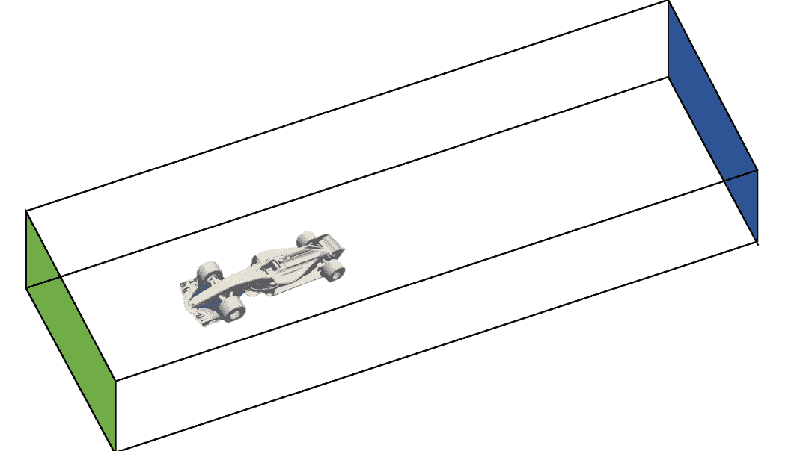
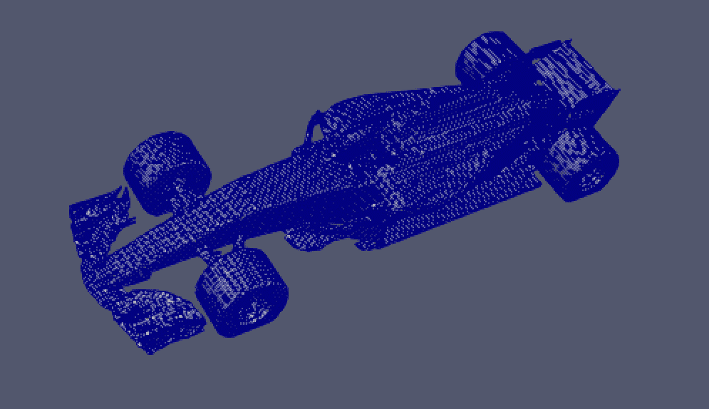
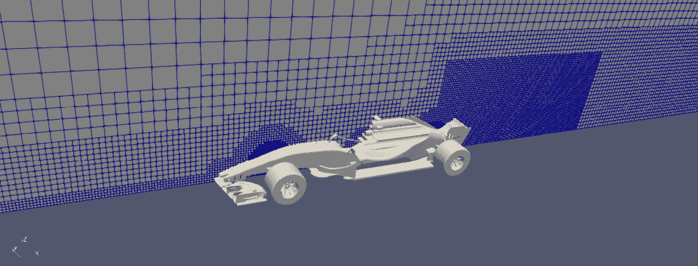
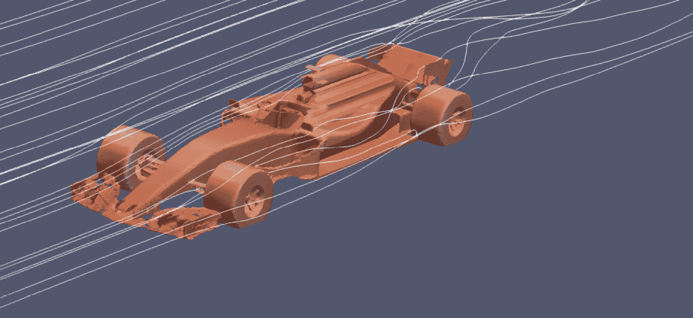
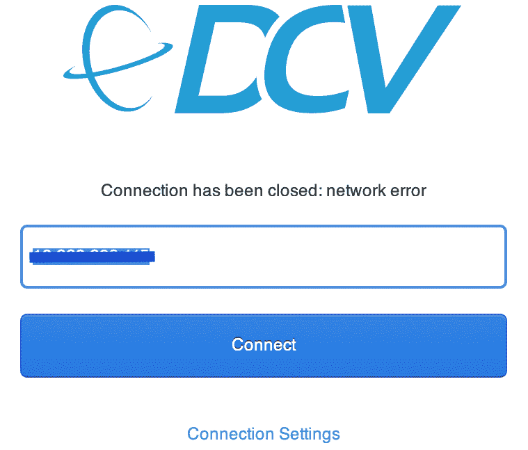
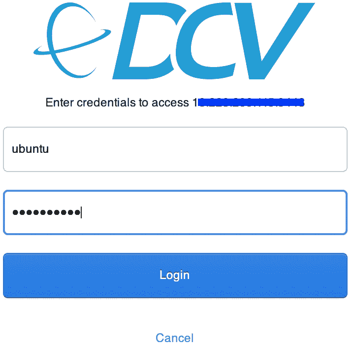
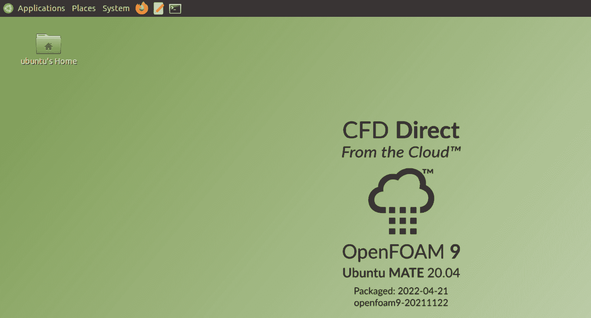

# 计算流体动力学

**计算流体动力学**（**CFD**）是一种分析流体（空气、水和其他流体）如何流过或穿过感兴趣物体的技术。CFD 是一个成熟的领域，起源于几十年前，并在与制造、医疗保健、环境以及涉及流体流动、化学反应或热力学反应和模拟的航空航天和汽车工业相关的学术领域中使用。鉴于该领域的进步和悠久的历史，本书的范围超出了讨论该领域许多方面的范围。然而，这些视频链接可能是读者了解 CFD 是什么以及一些 CFD 工具，以及 AWS 上的最佳实践的一个很好的途径：

+   [`www.youtube.com/watch?v=__7_aHrNUF4&ab_channel=AWSPublicSector`](https://www.youtube.com/watch?v=__7_aHrNUF4&ab_channel=AWSPublicSector)

+   [`www.youtube.com/watch?v=8rAvNbCJ7M0&ab_channel=AWSOnlineTechTalks`](https://www.youtube.com/watch?v=8rAvNbCJ7M0&ab_channel=AWSOnlineTechTalks)

在本章中，我们将回顾计算流体力学（CFD）领域，并探讨今天如何使用**机器学习**（**ML**）与 CFD 结合。此外，我们还将探讨一些您可以在 AWS 上运行 CFD 工具的方法。

本章将涵盖以下主题：

+   介绍计算流体力学（CFD）

+   检查在 AWS 上运行 CFD 的最佳实践

+   讨论如何将 ML 应用于 CFD

# 技术要求

在开始本章之前，您应具备以下先决条件：

+   熟悉 AWS 及其基本使用。

+   网络浏览器（为了获得最佳体验，建议您使用 Chrome 或 Firefox 浏览器）。

+   AWS 账户（如果您不熟悉如何开始使用 AWS 账户，可以访问此链接：[`aws.amazon.com/getting-started/`](https://aws.amazon.com/getting-started/)).

+   对 CFD 有一定的了解。尽管我们将提供 CFD 的简要概述，但本章最适合那些至少对 CFD 可以解决的典型用例有所了解的读者。

在下一节中，我们将通过一个示例应用问题——设计赛车！来介绍计算流体力学（CFD）。

# 介绍计算流体力学（CFD）

**CFD** 是使用数值分析预测流体流动。让我们来分解一下：

+   **预测**：与其他物理现象一样，流体流动可以通过数学建模和模拟。对于来自 ML 领域的读者来说，这与 ML 模型的 *预测* 不同。在这里，我们通过迭代求解一系列方程来构建物体内部或周围的流动。主要使用 **Navier-Stokes** 方程。

+   **数值分析**：为了实际解决这些方程，已经创建了几个工具——不出所料，这些工具被称为**求解器**。与任何一组工具一样，这些求解器有商业和**开源**两种版本。如今，编写任何与实际求解方程相关的代码是不常见的——类似于在开始解决你的机器学习问题之前，你不会编写自己的机器学习框架。这些求解器通过代码实现了数十年来研究过的数值或数学方法，这些方法有助于流体流动的分析。

现在，假设你是即将到来的赛车赛季一支新**一级方程式**（**F1**）车队的主教练，负责管理新车的研发设计。这辆车的研发设计必须满足许多新的 F1 规则，这些规则定义了车辆设计可以施加的限制。幸运的是，你有一个庞大的工程团队可以管理新车的研发和制造。最大的车队在制造任何部件之前，仅在概念设计上就花费了数百万美元。车队通常从基准设计开始，并迭代地改进这个设计。这种设计的迭代改进并不仅限于赛车车身的开发；想想你口袋或包里的最新版 iPhone，或者几代商用客机设计看起来相似但实际上却非常不同。你要求工程师使用**计算机辅助设计**（**CAD**）工具对现有车辆进行设计修改，经过一个月对潜在设计变更的工作后，他们向你展示了你团队最新车辆的设计（见图 *图 11**.1*）。这看起来很棒！


图 11.1 – F1 赛车设计

然而，你怎么知道这辆车在赛道上会表现更好呢？你可以跟踪的两个关键指标如下：

+   **阻力**：物体在流体流动中产生的阻力。**阻力系数**是一个无量纲量，用于量化阻力。对于你的 F1 赛车来说，更高的阻力系数更差，因为你的车会移动得更慢，假设其他所有因素保持不变。

+   **下压力**：将汽车推到赛道上的空气动力学力；下压力越高，越好，因为它在高速行驶或转弯时提供了更大的抓地力。

*图 11**.2* 展示了这两个力作用在 F1 赛车上的方向：


图 11.2 – F1 赛车的阻力和下压力方向

现在测量阻力和下压力的一种方法是将整辆车制造出来，在赛道上驾驶并使用力传感器进行测试，然后将结果反馈给团队——但如果您有其他的设计想法呢？或者是对您汽车某个部件的变体？您将需要重新构建这些部件，或者整辆车，然后进行相同的测试，或者在风洞中运行比例模型——这些选项可能非常耗时且成本高昂。这就是数值分析代码，如 CFD 工具变得有用的地方。使用 CFD 工具，您可以模拟汽车上的不同流动条件并计算阻力和下压力。

在 CFD 中，通常会在感兴趣的对象内部创建一个**流动域**。这可以类似于*图 11.3*中的**外部流动**（例如，车辆周围的流动）。另一方面，您可能有**内部流动**，其中域定义在对象本身内（例如，弯曲管道内的流动）。在*图 11.3*中，绿色和蓝色表面代表该域中的**入口**和**出口**。空气从**入口**流入，经过并绕过汽车，然后通过**出口**流出。



图 11.3 – 围绕 F1 赛车的 CFD 域定义

到目前为止，汽车和域是概念性的想法，需要以对象或文件的形式表示，以便 CFD 代码可以读取和使用。用于表示对象的典型文件格式是**立体光刻**（**STL**）文件格式。每个对象表示为一组三角形，每个三角形由一组 3D 点表示。在 STL 格式中的同一辆汽车如*图 11.4*所示——汽车现在是由数万个三角形组成的集合。



图 11.4 – STL 格式的 F1 赛车

我们现在可以使用这个汽车对象并对 CFD 域进行**网格化**。创建**网格**或**网格化**是在 CFD 域中创建网格点的过程，其中要解决与流体流动相关的数值方程。网格化是一个非常重要的过程，因为它可以直接影响结果，有时也可能导致数值模拟发散或无法求解。

注意

网格化技术和所使用的算法的细节超出了本书的范围。每个求解器工具都使用不同的网格化技术，并具有各种配置。团队花费大量时间获得高质量的网格，同时平衡网格的复杂性以确保更快的求解时间。

一旦构建了网格，它可能看起来类似于*图 11.5*。我们看到网格单元在车身附近有集中。请注意，这是一个网格的切片，实际的网格是一个 3D 体积，其边界在*图 11.3*中定义。



图 11.5 – 为 F1 赛车案例构建的 CFD 网格

一旦构建了网格，我们就可以使用 CFD 求解器计算围绕这辆 F1 赛车的流动，然后对这些结果进行后处理，以提供关于阻力下压力的预测。*图 11**.6*和*图 11**.7*显示了涉及流线（图像中的白色线条表示流体如何围绕车身流动）、速度切片（在感兴趣平面或截面上的速度大小）、车身上的压力（红色区域表示更高的压力）以及原始汽车几何形状的典型后处理图像。


图 11.6 – F1 赛车案例的后处理结果，显示流线和速度切片

*图 11**.7*展示了汽车表面的压力不同输出可视化，以及透视视图中的流线。



图 11.7 – F1 赛车案例的后处理结果，显示车身上的压力和流线

总结来说，运行 CFD 案例涉及以下步骤：

1.  加载和处理几何形状

1.  网格化 CFD 域

1.  使用求解器在域内求解流动

1.  使用后处理工具可视化结果

在下一节中，我们将讨论根据我们记录的最佳实践，在 AWS 上运行 CFD 分析的一些方法。

# 检查在 AWS 上运行 CFD 的最佳实践

由于 CFD 计算密集度很高，需要大规模扩展才能适用于依赖分析结果来做出产品设计决策的公司。AWS 允许客户使用多种商业和**开源**工具，按需以大规模（数千个核心）运行 CFD 模拟，无需任何容量规划或前期资本投资。您可以在以下位置找到有关 AWS 上 CFD 的许多有用链接：[`aws.amazon.com/hpc/cfd/`](https://aws.amazon.com/hpc/cfd/)。

如本章开头所强调的，有几种商业和开源工具可用于解决您的 CFD 问题，这些工具可以在 AWS 上大规模运行。以下是一些这些工具的例子：

+   西门子 SimCenter STAR-CCM+

+   Ansys Fluent

+   OpenFOAM（开源）

在本章中，我们将向您提供如何设置和使用*OpenFOAM*的示例。对于其他工具，请参阅 AWS 提供的此研讨会：[`cfd-on-pcluster.workshop.aws/`](https://cfd-on-pcluster.workshop.aws/)。

注意

注意，AWS **Well-Architected** 框架定义了在 AWS 上运行任何类型工作负载的最佳实践。它包括以下支柱在 AWS 上设计架构的最佳实践：**运营卓越**、**安全性**、**可靠性**、**性能效率**、**成本优化**和**可持续性**。

如果你不太熟悉“架构良好框架”，你可以在这里详细了解它：[`docs.aws.amazon.com/wellarchitected/latest/framework/welcome.html/`](https://docs.aws.amazon.com/wellarchitected/latest/framework/welcome.html/)。

我们现在将讨论两种在 AWS 上运行 CFD 仿真模拟的不同方法：使用 ParallelCluster 和使用 CFD Direct。

## 使用 AWS ParallelCluster

在 AWS 上，这些“架构良好”的最佳实践被封装在一个名为 AWS ParallelCluster 的解决方案中，你可以在你的 AWS 账户中启动它。ParallelCluster 允许你通过简单的**命令行界面**（**CLI**）配置和启动整个 HPC 集群。CLI 还允许你以安全的方式动态扩展 CFD（以及其他 HPC）应用所需的资源。流行的调度器，如 **AWS Batch** 或 **Slurm**，可以用于在 ParallelCluster 上提交和监控作业。以下是一些安装 ParallelCluster 的步骤（请注意，完整的步骤可以在 ParallelCluster 的官方 AWS 文档页面找到：[`docs.aws.amazon.com/parallelcluster/latest/ug/install-v3-pip.html`](https://docs.aws.amazon.com/parallelcluster/latest/ug/install-v3-pip.html)）。

### 步骤 1 – 创建 AWS Cloud9 IDE

这有助于我们访问指定实例类型上的完整 IDE，并使用临时、管理的凭证来启动 ParallelCluster。按照以下说明启动 AWS Cloud9 IDE：[`docs.aws.amazon.com/cloud9/latest/user-guide/setup-express.html`](https://docs.aws.amazon.com/cloud9/latest/user-guide/setup-express.html)。

一旦你创建了你的 Cloud9 IDE，按照以下说明导航到终端：[`docs.aws.amazon.com/cloud9/latest/user-guide/tour-ide.html#tour-ide-terminal`](https://docs.aws.amazon.com/cloud9/latest/user-guide/tour-ide.html#tour-ide-terminal)。

### 步骤 2 – 安装 ParallelCluster CLI

一旦你进入了终端，请执行以下操作：

1.  使用`pip`安装`ParallelCluster`：

    ```py
    ...
    ```

    ```py
    python3 -m pip install "aws-parallelcluster" --upgrade –-user
    ```

    ```py
    ...
    ```

1.  接下来，确保你已经安装了**节点版本管理器**（**NVM**）：

    ```py
    ...
    ```

    ```py
    curl -o- https://raw.githubusercontent.com/nvm-sh/nvm/v0.38.0/install.sh | bash
    ```

    ```py
    chmod ug+x ~/.nvm/nvm.sh
    ```

    ```py
    source ~/.nvm/nvm.sh
    ```

    ```py
    nvm install --lts
    ```

    ```py
    node –version
    ```

    ```py
    ...
    ```

1.  最后，验证`ParallelCluster`是否已成功安装：

    ```py
    pcluster version
    ```

    ```py
    {
    ```

    ```py
        "version": "3.1.3"
    ```

    ```py
    }
    ```

让我们继续到*步骤 3*。

### 步骤 3 – 配置你的 ParallelCluster

在你启动 ParallelCluster 之前，你需要使用 `configure` 命令定义参数：

```py
...
pcluster configure
...
```

命令行工具将询问你以下问题以创建一个配置（或简称 config）文件：

+   设置 ParallelCluster 的区域（例如，US-East-1）

+   **EC2 密钥对**使用（在此处了解更多关于**密钥对**的信息：[`docs.aws.amazon.com/AWSEC2/latest/UserGuide/ec2-key-pairs.html`](https://docs.aws.amazon.com/AWSEC2/latest/UserGuide/ec2-key-pairs.html)）

+   操作系统（例如，Amazon Linux 2、CentOS 7 或 Ubuntu）

+   主节点实例类型（例如，**c5n.18xlarge**）

+   是否要自动化 VPC 创建

+   子网配置（例如，将头节点或主节点放置在公共子网中，其余的计算集群在私有子网或子网中）

+   额外的共享存储卷（例如，FSx 配置）

这将创建一个可以在 `~/.parallelcluster` 中找到并修改的配置文件，在创建集群之前。以下是一个 ParallelCluster 配置文件的示例：

```py
...
Region: us-east-2
Image:
  Os: alinux2
HeadNode:
  InstanceType: c5.4xlarge
  Networking:
    SubnetId: subnet-0e6e79abb7ed2452c
  Ssh:
    KeyName: pcluster
Scheduling:
  Scheduler: slurm
  SlurmQueues:
  - Name: queue1
    ComputeResources:
    - Name: c54xlarge
      InstanceType: c5.4xlarge
      MinCount: 0
      MaxCount: 4
    - Name: m516xlarge
      InstanceType: m5.16xlarge
      MinCount: 0
      MaxCount: 2
    Networking:
      SubnetIds:
      - subnet-09299f6d9ecfb8122
...
```

深入了解 ParallelCluster 配置文件的复杂性，请参阅以下内容：[`aws.amazon.com/blogs/hpc/deep-dive-into-the-aws-parallelcluster-3-configuration-file/`](https://aws.amazon.com/blogs/hpc/deep-dive-into-the-aws-parallelcluster-3-configuration-file/)。

### 第 4 步 – 启动您的 ParallelCluster

一旦您已验证配置文件，请使用以下命令创建和启动 `ParallelCluster`：

```py
...
pcluster create-cluster --cluster-name mycluster --cluster-configuration config
{
  "cluster": {
    "clusterName": "mycluster",
    "cloudformationStackStatus": "CREATE_IN_PROGRESS",
    "cloudformationStackArn": "arn:aws:cloudformation:us-east-2:989279443319:stack/mycluster/c6fdb600-d49e-11ec-9c26-069b96033f9a",
    "region": "us-east-2",
    "version": "3.1.3",
    "clusterStatus": "CREATE_IN_PROGRESS"
  }
}...
```

在这里，我们的集群已被命名为 `mycluster`。这将基于您之前定义的配置文件启动一个包含所需资源的 CloudFormation 模板。AWS ParallelCluster 使用以下服务：

+   AWS Batch

+   AWS CloudFormation

+   Amazon CloudWatch

+   Amazon CloudWatch 日志

+   AWS CodeBuild

+   Amazon DynamoDB

+   Amazon 弹性块存储

+   Amazon **弹性计算云**（**EC2**）

+   Amazon 弹性容器注册

+   Amazon **弹性文件系统**（**EFS**）

+   Amazon FSx for Lustre

+   AWS 身份和访问管理

+   AWS Lambda

+   NICE DCV

+   Amazon Route 53

+   Amazon 简单存储服务

+   Amazon VPC

关于所使用服务的更多详细信息，请参阅本章 *参考文献* 部分提供的链接。AWS ParallelCluster 的简化架构图显示在 *图 11.8* 中。更多详细信息可以在以下博客中找到：[`aws.amazon.com/blogs/compute/running-simcenter-star-ccm-on-aws/`](https://aws.amazon.com/blogs/compute/running-simcenter-star-ccm-on-aws/)。否则，请参阅 ParallelCluster 的文档页面（[`docs.aws.amazon.com/parallelcluster/latest/ug/what-is-aws-parallelcluster.html`](https://docs.aws.amazon.com/parallelcluster/latest/ug/what-is-aws-parallelcluster.html)）。


图 11.8 – AWS ParallelCluster 架构

启动通常需要大约 10 分钟，可以在控制台以及 AWS 管理控制台上的 CloudFormation 页面上跟踪。在控制台上，以下消息将确认您的启动正在进行：

```py
pcluster list-clusters --query 'clusters[?clusterName==`mycluster`]'
[
  {
    "clusterName": "mycluster",
    "cloudformationStackStatus": "CREATE_IN_PROGRESS",
    "cloudformationStackArn": "arn:aws:cloudformation:us-east-2:<account_number>:stack/mycluster/c6fdb600-d49e-11ec-9c26-069b96033f9a",
    "region": "us-east-2",
    "version": "3.1.3",
    "clusterStatus": "CREATE_IN_PROGRESS"
  }
]
```

等待状态显示为 `"clusterStatus": "CREATE_COMPLETE"`

### 第 5 步 – 在集群上安装 OpenFOAM

要在您的集群上安装 OpenFOAM，请参阅以下内容：

1.  首先，将 **Secure Shell**（**SSH**）添加到您新创建的 ParallelCluster 的头节点：

    ```py
    pcluster ssh -n mycluster -i pcluster.pem
    ```

    ```py
    The authenticity of host '3.135.195.149 (3.135.195.149)' can't be established.
    ```

    ```py
    ECDSA key fingerprint is SHA256:DZPeIcVRpZDg3VMYhA+2zAvEoLnD3gI6mLVkMPkyg90.
    ```

    ```py
    ECDSA key fingerprint is MD5:87:16:df:e7:26:f5:a0:da:a8:3a:7c:c4:c8:92:60:34.
    ```

    ```py
    Are you sure you want to continue connecting (yes/no)? yes
    ```

    ```py
    Warning: Permanently added '3.135.195.149' (ECDSA) to the list of known hosts.
    ```

    ```py
    Last login: Sun May 15 22:36:41 2022
    ```

    ```py
    __|  __|_  )
    ```

    ```py
           _|  (     /   Amazon Linux 2 AMI
    ```

    ```py
          ___|\___|___|
    ```

1.  您现在位于 ParallelCluster 的头节点上。接下来，按照以下步骤下载 OpenFOAM 文件：

    ```py
    ...
    ```

    ```py
    wget https://sourceforge.net/projects/openfoam/files/v2012/OpenFOAM-v2012.tgz
    ```

    ```py
    wget https://sourceforge.net/projects/openfoam/files/v2012/ThirdParty-v2012.tgz
    ```

    ```py
    ...
    ```

1.  接下来，解压缩您刚刚下载的两个文件：

    ```py
    ...
    ```

    ```py
    tar -xf OpenFOAM-v2012.tgz
    ```

    ```py
    tar -xf ThirdParty-v2012.tgz
    ```

    ```py
    ...
    ```

1.  将目录更改到新提取的 OpenFOAM 文件夹，并编译 OpenFOAM：

    ```py
    ...
    ```

    ```py
    cd OpenFOAM-v2012
    ```

    ```py
    export WM_NCOMPPROCS=36
    ```

    ```py
    ./Allwmake
    ```

    ```py
    ...
    ```

要在所有节点上安装 OpenFOAM，你可以使用`sbatch`命令，并将前面的命令作为名为`compile.sh`的文件提交：例如，`sbatch compile.sh`。

安装完成后，你可以运行如*步骤 6*中所示的示例 CFD 应用程序。

### 步骤 6 – 运行示例 CFD 应用程序

在这里，我们将使用 ParallelCluster 运行一个示例 CFD 应用程序。首先，我们使用 SSH 访问我们刚刚创建的集群的头节点：

```py
...
pcluster ssh --cluster-name mycluster -i /path/to/keyfile.pem
...
```

确保你使用与*步骤 3*中创建的相同的`.pem`文件！

在这个案例中，我们将运行 OpenFOAM 的一个示例——摩托车上的不可压缩流动。此案例的案例文件可以在以下位置找到：[`static.us-east-1.prod.workshops.aws/public/a536ee90-eecd-4851-9b43-e7977e3a5929/static/motorBikeDemo.tgz`](https://static.us-east-1.prod.workshops.aws/public/a536ee90-eecd-4851-9b43-e7977e3a5929/static/motorBikeDemo.tgz)。

与此案例对应的几何体在*图 11.9*中显示。


图 11.9 – OpenFOAM 中摩托车案例的几何体

仅在头节点上运行案例，你可以运行以下命令：

```py
cp $FOAM_TUTORIALS/resources/geometry/motorBike.obj.gz constant/triSurface/
surfaceFeatureExtract
blockMesh
snappyHexMesh
checkMesh
potentialFoam
simpleFoam
```

我们将在后面的章节中详细介绍这些命令的功能。现在，我们的目标只是运行示例摩托车案例。

要在所有计算节点上并行运行相同的案例，你可以使用`sbatch`提交以下 shell 脚本（类似于提交安装 shell 脚本）。我们可以在脚本中定义一些输入参数，然后加载**OpenMPI**和**OpenFOAM**：

```py
...
#!/bin/bash
#SBATCH --job-name=foam
#SBATCH --ntasks=108
#SBATCH --output=%x_%j.out
#SBATCH --partition=compute
#SBATCH --constraint=c5.4xlarge
module load openmpi
source OpenFOAM-v2012/etc/bashrc
cp $FOAM_TUTORIALS/resources/geometry/motorBike.obj.gz constant/triSurface/
```

首先，我们使用`blockMesh`和`snappyHexMesh`工具对几何体进行网格划分（参见以下代码）：

```py
surfaceFeatureExtract  > ./log/surfaceFeatureExtract.log 2>&1
blockMesh  > ./log/blockMesh.log 2>&1
decomposePar -decomposeParDict system/decomposeParDict.hierarchical  > ./log/decomposePar.log 2>&1
mpirun -np $SLURM_NTASKS snappyHexMesh -parallel -overwrite -decomposeParDict system/decomposeParDict.hierarchical   > ./log/snappyHexMesh.log 2>&1
```

然后，我们使用`checkMesh`检查网格的质量，并对网格进行重新编号并打印出网格的摘要（参见代码）：

```py
mpirun -np $SLURM_NTASKS checkMesh -parallel -allGeometry -constant -allTopology -decomposeParDict system/decomposeParDict.hierarchical > ./log/checkMesh.log 2>&1
mpirun -np $SLURM_NTASKS redistributePar -parallel -overwrite -decomposeParDict system/decomposeParDict.ptscotch > ./log/decomposePar2.log 2>&1
mpirun -np $SLURM_NTASKS renumberMesh -parallel -overwrite -constant -decomposeParDict system/decomposeParDict.ptscotch > ./log/renumberMesh.log 2>&1
mpirun -np $SLURM_NTASKS patchSummary -parallel -decomposeParDict system/decomposeParDict.ptscotch > ./log/patchSummary.log 2>&1
ls -d processor* | xargs -i rm -rf ./{}/0
ls -d processor* | xargs -i cp -r 0.orig ./{}/0
```

最后，我们通过`potentialFoam`和`simpleFoam`二进制文件运行 OpenFOAM，如下所示：

```py
mpirun -np $SLURM_NTASKS potentialFoam -parallel -noFunctionObjects -initialiseUBCs -decomposeParDict system/decomposeParDict.ptscotch > ./log/potentialFoam.log 2>&1s
mpirun -np $SLURM_NTASKS simpleFoam -parallel  -decomposeParDict system/decomposeParDict.ptscotch > ./log/simpleFoam.log 2>&1
...
```

你可以按照以下 AWS 工作坊中的说明来可视化 CFD 案例的结果：[`catalog.us-east-1.prod.workshops.aws/workshops/21c996a7-8ec9-42a5-9fd6-00949d151bc2/en-US/openfoam/openfoam-visualization`](https://catalog.us-east-1.prod.workshops.aws/workshops/21c996a7-8ec9-42a5-9fd6-00949d151bc2/en-US/openfoam/openfoam-visualization)。

接下来，让我们讨论 CFD Direct。

## 使用 CFD Direct

在上一节中，我们看到了如何使用 ParallelCluster 在 AWS 上运行 CFD 模拟。现在，我们将探讨如何在 AWS Marketplace 上的 CFD Direct 产品中运行 CFD：[`aws.amazon.com/marketplace/pp/prodview-ojxm4wfrodtj4`](https://aws.amazon.com/marketplace/pp/prodview-ojxm4wfrodtj4)。CFD Direct 提供了一个基于 Ubuntu 的 Amazon EC2 镜像，其中包含了运行 CFD 所需的典型工具。

执行以下步骤开始操作：

1.  点击上面的链接访问 CFD Direct 的 Marketplace 产品，然后点击**继续** **订阅**。

1.  然后，按照提供的说明操作，并点击 **继续配置**（保留所有选项为默认），然后点击 **继续启动**。类似于 ParallelCluster，请记住使用正确的 EC2 密钥对，以便您能够 SSH 进入为您启动的实例。


图 11.10 – CFD Direct AWS Marketplace 提供的产品（截至 2022 年 8 月 5 日的截图）

按照说明获取更多关于使用 CFD Direct 的图像的帮助，请参阅[`cfd.direct/cloud/aws/`](https://cfd.direct/cloud/aws/)。

要首次连接到实例，请使用以下说明：[`cfd.direct/cloud/aws/connect/`](https://cfd.direct/cloud/aws/connect/)。

在以下教程中，我们将使用 NICE DCV 客户端作为远程桌面与 EC2 实例进行交互。

安装 NICE DCV 的步骤如下：

1.  首先，SSH 进入您刚刚启动的实例，然后下载并安装服务器。例如，对于 Ubuntu 20.04，请使用以下命令：

    ```py
    wget https://d1uj6qtbmh3dt5.cloudfront.net/nice-dcv-ubuntu2004-x86_64.tgz
    ```

1.  然后，执行以下命令以提取 `tar` 文件：

    ```py
    tar -xvzf nice-dcv-2022.0-12123-ubuntu2004-x86_64.tgz && cd nice-dcv-2022.0-12123-ubuntu2004-x86_64
    ```

1.  通过执行以下命令安装 NICE DCV：

    ```py
    sudo apt install ./nice-dcv-server_2022.0.12123-1_amd64.ubuntu2004.deb
    ```

1.  要启动 NICE DCV 服务器，请使用以下命令：

    ```py
    sudo systemctl start dcvserver
    ```

1.  最后，使用以下命令启动会话：

    ```py
    dcv create-session cfd
    ```

1.  找到您启动的 EC2 实例的公网 IP，并使用任何 NICE DCV 客户端连接到该实例（见 *图 11**.11*）：



图 11.11 – 使用公网 IP 连接到 EC2 实例

1.  接下来，使用 Ubuntu 的用户名和密码（见 *图 11**.12*）。如果您尚未设置密码，请在 SSH 终端上使用 `passwd` 命令。



图 11.12 – 输入 Ubuntu 的用户名和密码

1.  如果提示，选择您想要连接的会话。在这里，我们启动了一个名为 `cfd` 的会话。现在您应该能看到预装了 OpenFOAM 9 的 Ubuntu 桌面。



图 11.13 – 由 CFD Direct 提供的 Ubuntu 桌面

1.  要定位所有要尝试的 OpenFOAM 教程，请使用以下命令：

    ```py
    echo $FOAM_TUTORIALS
    ```

    ```py
    /opt/openfoam9/tutorials
    ```

1.  我们将在以下目录中运行一个基本的翼型教程：

    ```py
    /opt/openfoam9/tutorials/incompressible/simpleFoam/airFoil2D/
    ```

目录设置与典型的 OpenFOAM 案例类似，包含以下内容（在 Ubuntu 上使用 `tree` 命令进行探索）：

```py
/opt/openfoam9/tutorials/incompressible/simpleFoam/airFoil2D/
|-- 0
|   |-- U
|   |-- nuTilda
|   |-- nut
|   `-- p
|-- Allclean
|-- Allrun
|-- constant
|   |-- momentumTransport
|   |-- polyMesh
|   |   |-- boundary
|   |   |-- cells
|   |   |-- faces
|   |   |-- neighbour
|   |   |-- owner
|   |   `-- points
|   `-- transportProperties
`-- system
    |-- controlDict
    |-- fvSchemes
    `-- fvSolution
```

让我们探索一些这些文件，因为这将帮助您了解任何 OpenFOAM 案例的结构。名为 `0` 的文件夹代表我们将要解决这些关键量的初始条件（即，时间步长 0）：

+   **速度** (**U**)

+   **压力** (**p**)

这些文件看起来是什么样子？让我们看看 `U`（速度）文件：

```py
FoamFile
{
    format      ascii;
    class       volVectorField;
    object      U;
}
dimensions      [0 1 -1 0 0 0 0];
internalField   uniform (25.75 3.62 0);
boundaryField
{
    inlet
    {
        type            freestreamVelocity;
        freestreamValue $internalField;
    }
    outlet
    {
        type            freestreamVelocity;
        freestreamValue $internalField;
    }
    walls
    {
        type            noSlip;
    }
    frontAndBack
    {
        type            empty;
    }
}
```

如我们所见，该文件定义了 CFD 域的尺寸、自由流速度，以及入口、出口和壁面边界条件。

`Airfoil2D` 文件夹还包含一个名为 `constant` 的文件夹；此文件夹包含我们将要创建的 CFD 网格的特定文件。`momentumTransport` 文件定义了解决此问题所使用的模型类型：

```py
simulationType RAS;
RAS
{
    model           SpalartAllmaras;
    turbulence      on;
    printCoeffs     on;
}
```

在这里，我们使用 **Reynolds-Averaged Flow** （**RAF**）类型的 `SpalartAllmaras` 湍流模型。有关更多信息，请访问 [`www.openfoam.com/documentation/guides/latest/doc/guide-turbulence-ras-spalart-allmaras.html`](https://www.openfoam.com/documentation/guides/latest/doc/guide-turbulence-ras-spalart-allmaras.html)。

`polyMesh` 文件夹内的 `boundary` 文件包含了墙壁本身的定义；这是为了让模拟知道表面 *入口* 或 *墙壁* 代表什么。`polyMesh` 文件夹中还有其他几个文件，我们将在本节中不进行探讨。

在 `System` 文件夹内，`controlDict` 文件定义了为此案例运行的应用程序。OpenFOAM 包含超过 200 个编译应用程序；其中许多是求解器以及代码的前处理和后处理。

最后，我们来到了 OpenFOAM 案例中最重要的一些文件之一：`Allrun` 可执行文件。`Allrun` 文件是一个 shell 脚本，按照我们之前定义的顺序运行每个典型 CFD 应用程序的步骤 – 导入几何形状、创建网格、解决 CFD 问题以及后处理结果。

根据您在 `ControlDict` 文件中定义的输出间隔，将在同一目录中输出几个输出文件夹，对应于模拟中的不同时间戳。CFD 求解器将解决问题，直到收敛或达到最大时间步数。输出文件夹将类似于我们之前创建的 `timestep 0` 文件夹。为了可视化这些结果，我们使用一个名为 `ParaView` 的工具：

1.  首先，让我们看看我们创建的网格（见图 *11*.14）。OpenFOAM 中包含的负责创建此网格的可执行文件是 `blockmesh` 和 `snappyhexmesh`。您也可以手动运行这些命令，而不是运行 `Allrun` 文件。


图 11.14 – OpenFOAM 中 Airfoil 2D 案例的网格

1.  太好了 – 使用 `SimpleFoam` 可执行文件解决问题后，让我们看一下翼型周围的压力分布（见图 *11*.15）：


图 11.15 – OpenFOAM 中 Airfoil 2D 案例的压力分布

1.  最后，我们可以使用 `ParaView` 来可视化速度分布，以及流线（见图 *11*.16）：


图 11.16 – OpenFOAM 中 Airfoil 2D 案例的速度分布

注意，这些图表是通过使用`paraFoam`可执行文件初始化`ParaView`后进行后处理的，它能够自动理解由 OpenFOAM 案例格式化的输出。

现在让我们看看一个稍微复杂一些的案例——汽车周围的流动：

1.  首先，让我们看看车辆的几何形状（*图 11.17* 和 *图 11.18*）：


图 11.17 – 车辆几何形状（透视视图）


图 11.18 – 车辆几何形状（侧面视图）

1.  接下来，我们可以使用`blockmesh`和`snappyhexmesh`命令来创建围绕汽车的 CFD 网格（参见*图 11.19*）：


图 11.19 – 为车辆案例创建的网格

1.  然后，我们可以运行`Allrun`文件来解决问题。最后，我们将可视化输出（*图 11.20* 和 *图 11.21*）：


图 11.20 – 为车辆案例创建的流线（黑色）和压力分布（透视视图）


图 11.21 – 为车辆案例创建的流线（黑色）和压力分布（侧面视图）

以下案例所需的文件可以在 GitHub 仓库提供的 ZIP 文件中找到：[`github.com/PacktPublishing/Applied-Machine-Learning-and-High-Performance-Computing-on-AWS/tree/main/Chapter11/runs`](https://github.com/PacktPublishing/Applied-Machine-Learning-and-High-Performance-Computing-on-AWS/tree/main/Chapter11/runs)。

在下一节中，我们将讨论与使用 CFD 工具的机器学习和深度学习相关的 CFD 领域的某些进展。

# 讨论如何将机器学习应用于 CFD

CFD（计算流体动力学）作为一个存在了几十年的领域，已经发展成熟，对各个领域的公司非常有用，并且已经通过云服务提供商大规模实施。最近在机器学习（ML）方面的进步已经应用于 CFD，在本节中，我们将为读者提供关于这个领域的文章的指引。

总体来看，我们看到深度学习技术以两种主要方式得到应用：

+   使用深度学习将输入映射到输出。在本章中，我们探讨了翼型上的流动并可视化了这些结果。如果我们有足够的输入变化并将输出保存为图像，我们可以使用**自编码器**或**生成对抗网络（GANs**）来生成这些图像。例如，以下论文使用 GANs 来预测使用稀疏数据的翼型流动：[`www.sciencedirect.com/science/article/pii/S1000936121000728`](https://www.sciencedirect.com/science/article/pii/S1000936121000728)。正如我们在*图 11.22*中看到的那样，CFD 和 GAN 预测的流动场在视觉上非常相似：


图 11.22 – 由训练好的 GAN（左）和 CFD（右）生成的压力分布

同样，Autodesk 训练了一个包含 800 多个汽车示例的网络，可以瞬间预测新汽车体的流动和阻力：[`dl.acm.org/doi/10.1145/3197517.3201325`](https://dl.acm.org/doi/10.1145/3197517.3201325)（参见*图 11.23*）。


图 11.23 – 预测各种汽车形状的流动场和阻力系数

+   第二种创新的一般类型不仅仅是将输入映射到输出，而是实际上将机器学习技术作为 CFD 求解器本身的一部分。例如，NVIDIA 的 SIMNET([`arxiv.org/abs/2012.07938`](https://arxiv.org/abs/2012.07938))论文描述了如何使用深度学习来模拟定义流体流动和其他物理现象的实际**偏微分方程**(**PDEs**)。参见*图 11.24*中的示例结果，展示了 SIMNET 对散热片的流动。参数化训练运行比商业和开源求解器更快，对新几何形状的推理是瞬时的。


图 11.24 – OpenFOAM 与 NVIDIA 的 SIMNET 在速度（顶部行）和温度（底部行）比较

让我们总结一下在本章中学到的内容。

# 摘要

在本章中，我们提供了对 CFD 世界的概述，然后探讨了多种使用 AWS 解决 CFD 问题的方法（使用 ParallelCluster 和 EC2 上的 CFD Direct）。最后，我们讨论了一些将 CFD 领域与 ML 联系起来的最新进展。虽然本书的范围不包括对 CFD 的更多细节，但我们希望读者能受到启发，更深入地探索这里探讨的主题。

在下一章中，我们将专注于使用 HPC 的基因组学应用。具体来说，我们将讨论药物发现，并对蛋白质结构预测问题进行详细的讲解。

# 参考文献

+   *AWS* *Batch*: [`docs.aws.amazon.com/parallelcluster/latest/ug/aws-services-v3.html#aws-batch-v3`](https://docs.aws.amazon.com/parallelcluster/latest/ug/aws-services-v3.html#aws-batch-v3)

+   *AWS* *CloudFormation*: [`docs.aws.amazon.com/parallelcluster/latest/ug/aws-services-v3.html#aws-services-cloudformation-v3`](https://docs.aws.amazon.com/parallelcluster/latest/ug/aws-services-v3.html#aws-services-cloudformation-v3)

+   *Amazon* *CloudWatch*: [`docs.aws.amazon.com/parallelcluster/latest/ug/aws-services-v3.html#amazon-cloudwatch-v3`](https://docs.aws.amazon.com/parallelcluster/latest/ug/aws-services-v3.html#amazon-cloudwatch-v3)

+   *Amazon CloudWatch Logs*: [`docs.aws.amazon.com/parallelcluster/latest/ug/aws-services-v3.html#amazon-cloudwatch-logs-v3`](https://docs.aws.amazon.com/parallelcluster/latest/ug/aws-services-v3.html#amazon-cloudwatch-logs-v3)

+   *AWS CodeBuild*: [`docs.aws.amazon.com/parallelcluster/latest/ug/aws-services-v3.html#aws-codebuild-v3`](https://docs.aws.amazon.com/parallelcluster/latest/ug/aws-services-v3.html#aws-codebuild-v3)

+   *Amazon DynamoDB*: [`docs.aws.amazon.com/parallelcluster/latest/ug/aws-services-v3.html#amazon-dynamodb-v3`](https://docs.aws.amazon.com/parallelcluster/latest/ug/aws-services-v3.html#amazon-dynamodb-v3)

+   *Amazon Elastic Block Store*: [`docs.aws.amazon.com/parallelcluster/latest/ug/aws-services-v3.html#amazon-elastic-block-store-ebs-v3`](https://docs.aws.amazon.com/parallelcluster/latest/ug/aws-services-v3.html#amazon-elastic-block-store-ebs-v3)

+   *Amazon Elastic Container Registry*: [`docs.aws.amazon.com/parallelcluster/latest/ug/aws-services-v3.html#amazon-elastic-container-registry-ecr-v3`](https://docs.aws.amazon.com/parallelcluster/latest/ug/aws-services-v3.html#amazon-elastic-container-registry-ecr-v3)

+   *Amazon EFS*: [`docs.aws.amazon.com/parallelcluster/latest/ug/aws-services-v3.html#amazon-efs-v3`](https://docs.aws.amazon.com/parallelcluster/latest/ug/aws-services-v3.html#amazon-efs-v3)

+   *Amazon FSx for Lustre*: [`docs.aws.amazon.com/parallelcluster/latest/ug/aws-services-v3.html#amazon-fsx-for-lustre-v3`](https://docs.aws.amazon.com/parallelcluster/latest/ug/aws-services-v3.html#amazon-fsx-for-lustre-v3)
