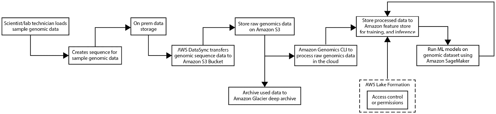
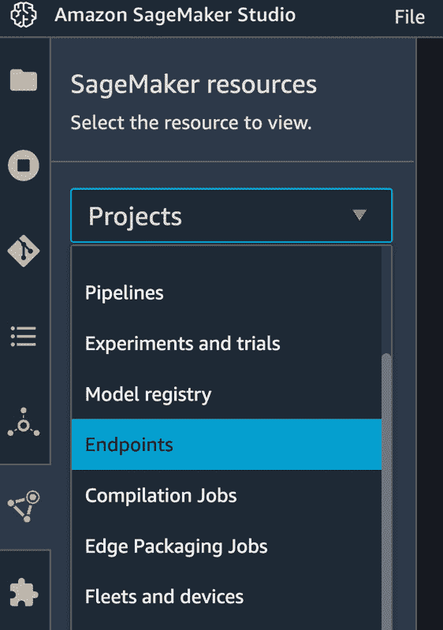
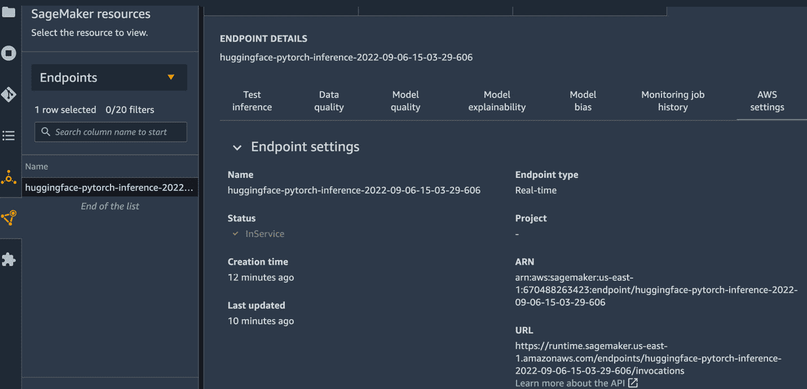
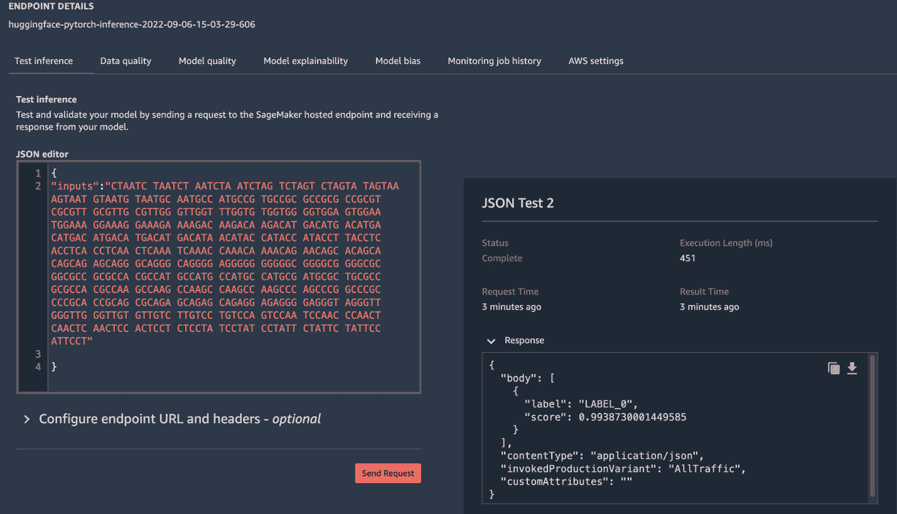
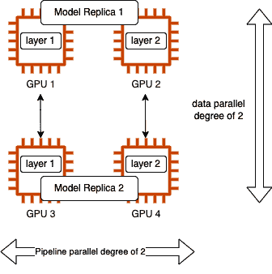
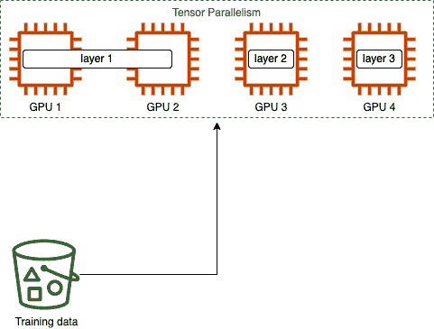

# 基因组学

**基因组学**是研究生物体基因组或遗传物质的科学。在人类中，遗传物质以**脱氧核糖核酸**（**DNA**）的形式储存。这些是构成人类个体的指令，人类基因组中有 99.9%是相同的，只有 0.1%是不同的，这导致了诸如眼色等身体特征的差异。大多数这些变异是无害的，但一些变异可能导致健康问题，例如镰状细胞性贫血。因此，分析此类信息可以用于预测或预防疾病，或提供个性化治疗，也称为**精准医疗**。DNA 中存在四种化学碱基，即**腺嘌呤**（**A**）、**胸腺嘧啶**（**T**）、**胞嘧啶**（**C**）和**鸟嘌呤**（**G**）。它们总是以特定的方式结合；例如，腺嘌呤总是与胸腺嘧啶结合，而胞嘧啶与鸟嘌呤结合。这些化学碱基的组合构成了 DNA 序列。

**测序**是基因组学的核心。为了理解它的含义，**人类基因组计划**（[`www.ncbi.nlm.nih.gov/pmc/articles/PMC6875757/pdf/arhw-19-3-190.pdf`](https://www.ncbi.nlm.nih.gov/pmc/articles/PMC6875757/pdf/arhw-19-3-190.pdf)）于 1989 年启动，目标是 15 年内测序一个人类基因组。这项工作在 2001 年的 12 年内完成，涉及数千名科学家。随着下一代测序技术的发展，现在可以在大约一天内生成整个人类基因组。单个人类基因组大约有 30 亿个碱基对长；其他生物体，如老鼠或牛，也有类似的大小。

由于生成基因组序列的时间和成本显著降低，这导致了大量数据的生成。因此，为了分析如此大量的数据，我们需要强大的机器和大量的经济高效的存储。好消息是 DNA 测序数据是公开可用的，其中最大的存储库之一是**国家生物技术信息中心**（**NCBI**）。我们可以使用统计和**机器学习**（**ML**）模型从基因组数据中获得见解，这可能需要大量的计算。这提出了两个主要挑战：需要大数据和大规模的 ML 模型来进行预测，例如预测启动子或预测掩蔽的 DNA 序列。

因此，本章将通过涵盖以下主题来帮助您应对这些挑战：

+   在 AWS 上管理大型基因组数据

+   设计基因组学架构

+   将机器学习应用于基因组学

# 技术要求

在开始本章之前，您应该具备以下先决条件：

+   网络浏览器（为了获得最佳体验，建议您使用 Chrome 或 Firefox 浏览器）

+   访问您在 *第五章*，*数据分析* 中使用的 AWS 账户

+   访问我们在**第五章**（[B18493_05.xhtml#_idTextAnchor095]）*数据分析*中创建的 SageMaker Studio 开发环境

+   本章的示例 Jupyter 笔记本可在配套的 GitHub 仓库中找到（[`github.com/PacktPublishing/Applied-Machine-Learning-and-High-Performance-Computing-on-AWS/tree/main/Chapter06`](https://github.com/PacktPublishing/Applied-Machine-Learning-and-High-Performance-Computing-on-AWS/tree/main/Chapter06)）

# 在 AWS 上管理大型基因组数据

除了基因组数据集的大规模之外，管理它所面临的挑战还包括可发现性、可访问性、可用性，以及将其存储在允许可扩展数据处理同时保持关键数据安全的存储系统中。*负责和安全地共享基因组与健康数据是加速研究和改善人类健康的关键目标*，这是**全球基因组与健康联盟**（**GA4GH**）的一个明确目标。这种方法需要两个重要的事情：一是对领域有深入的技术理解，二是访问计算和存储资源。你还可以在**AWS 开放数据注册表**（[`registry.opendata.aws/`](https://registry.opendata.aws/)）上找到由 AWS 托管的许多基因组数据集。

在您可以使用云服务对基因组数据集进行任何处理之前，您需要确保它已传输并存储在 AWS 云上。对于存储数据，我们建议使用**Amazon Simple Storage Services**（**Amazon S3**），因为下一代测序仪产生的基因组数据以文件形式持久化，许多基因组数据分析工具也以文件作为输入，并将输出写回文件。例如，使用机器学习模型进行数据分析可能涉及以大型 DNA 序列文件作为输入，并将推理或预测结果存储在文件中，对于这种情况，Amazon S3 是一个自然的选择。

您可以通过启用服务器端加密来安全地存储基因组数据，无论是使用**Amazon S3 管理的加密密钥**（**SSE-S3**）还是**AWS 密钥管理服务**（**AWS KMS**）密钥。此外，Amazon S3 还允许您通过将不常访问的数据存储在**Amazon S3 标准-不经常访问**（**S3 Standard-IA**）层或存档到低成本存储选项，例如当数据未使用时存档到**Amazon S3 Glacier Deep Archive**，来启用数据生命周期，从而显著降低成本。这种模式在**第四章**（[B18493_04.xhtml#_idTextAnchor074]）*数据存储*的*分层存储以优化成本*部分有详细讨论。

对于将基因组数据传输到 Amazon S3，您可以使用在**第二章**（[B18493_02.xhtml#_idTextAnchor035]）*数据管理和传输*中讨论的 AWS DataSync 服务。

让我们更详细地看看将机器学习模型应用于基因组数据集的详细架构。

# 设计基因组学架构

在本节中，我们将描述一个示例参考架构，用于在 AWS 云中以安全和经济的方式传输、存储、处理和获取基因组数据集的见解。*图 12*.*1*显示了示例基因组数据处理流程：



图 12.1 – 基因组数据处理流程

*图 12*.*1*显示了以下工作流程：

1.  科学家或实验室技术人员将收集样本基因组数据，例如皮肤细胞，在实验室中准备它，然后将其加载到测序仪中。

1.  然后，测序仪将生成一个序列，这可能是短的 DNA 片段。这些通常被称为**reads**，因为您正在读取 DNA。

1.  DNA 序列存储在本地数据存储系统中。

1.  然后，AWS DataSync 服务将基因组数据安全地传输到云端；有关更多详细信息，请参阅*第二章*，*数据管理* *和传输*。

1.  然后将原始基因组数据存储在 Amazon S3 上。您可以使用 AWS Analytics 工具进行数据处理。

1.  Amazon Genomics CLI 是一个专为在云中处理 PB 级原始基因组数据而构建的开源工具。有关详细信息，请参阅此链接：[`aws.amazon.com/genomics-cli/`](https://aws.amazon.com/genomics-cli/)。

1.  可选地，我们建议将处理过的基因组数据存储在**Amazon Feature Store**上，这是一个用于存储、共享、版本控制和管理的完全托管服务，用于存储、共享、版本控制和管理的机器学习特征，以便在机器学习应用之间重用特征。

1.  您可以使用**AWS Lake Formation**服务在 Amazon S3 或 Amazon Feature Store 上存储的基因组数据上添加细粒度的访问控制策略，根据您的业务需求。有关 AWS Lake Formation 的详细信息，请参阅此链接：[`aws.amazon.com/lake-formation`](https://aws.amazon.com/lake-formation)。

1.  一旦数据被处理并存储在 Amazon Feature Store 或 Amazon S3 上，您可以使用**Amazon SageMaker**运行如**DNABERT**（[`www.biorxiv.org/content/10.1101/2020.09.17.301879v1`](https://www.biorxiv.org/content/10.1101/2020.09.17.301879v1)）等机器学习模型，以获得更深入的见解或预测掩码 DNA 序列。该机器学习模型可以处理一批基因组数据，进行推理，并将结果存储回 Amazon S3。

1.  此外，您可以将未使用的数据存档到 Amazon S3 Glacier Deep Archive，以在数据存储上实现显著的成本节约。

注意

本章不涉及对 Amazon Genomics CLI、AWS Lake Formation 和 Amazon Feature Store 的详细讨论；然而，我们将在本章的*将机器学习应用于基因组*部分使用 DNABERT 模型。

让我们学习如何将机器学习模型应用于基因组应用，并使用预训练的机器学习模型预测 DNA 序列中的掩码序列。

# 将机器学习应用于基因组

在我们深入探讨机器学习模型细节之前，让我们首先了解基因组数据，它以 DNA 的形式存储在每一个生物体中。DNA 中存在四种化学碱基，即`ACTCCACAGTACCTCCGAGA`。人类基因组的一个完整序列大约有 30 亿个**碱基对**（**bp**）长，大约需要 200 GB 的数据存储空间([`www.science.org/doi/10.1126/science.abj6987`](https://www.science.org/doi/10.1126/science.abj6987))。

然而，对于分析 DNA 序列，我们不需要完整的基因组序列。通常，我们只分析人类 DNA 的一部分；例如，为了确定毛发生长或皮肤生长，实验室技术人员会取一小部分人类皮肤并准备它通过下一代测序仪，然后读取 DNA 并生成 DNA 序列，这些是 DNA 的短片段。机器学习模型可用于各种任务，例如 DNA 分类、**启动子识别**、解释人类基因组中的结构变异、精准医疗、癌症研究等等。

在本节中，我们将展示如何使用 Amazon SageMaker 对 DNABERT 模型进行微调，以执行近端启动子识别任务。DNABERT 基于在 DNA 序列上微调的 BERT 模型，如研究论文*监督启动子识别：一个基准框架*（[`bmcbioinformatics.biomedcentral.com/track/pdf/10.1186/s12859-022-04647-5.pdf`](https://bmcbioinformatics.biomedcentral.com/track/pdf/10.1186/s12859-022-04647-5.pdf)）中概述的。因此，让我们以在 Amazon SageMaker 服务上使用 DNA 序列数据部署预训练的 DNABERT 模型进行启动子识别为例。

Amazon SageMaker 是 AWS 提供的一项完全托管服务，旨在协助机器学习从业者构建、训练和部署机器学习模型。尽管它为机器学习的每个阶段提供了功能和集成开发环境，但其本质上是高度模块化的，这意味着如果您已经有一个训练好的模型，您可以使用 **SageMaker 托管** 功能来部署模型，以便在您的模型上执行推理/预测。有关 SageMaker 提供的各种部署选项的详细信息，请参阅*第七章*，*大规模部署机器学习模型*。

我们将部署由**Hugging Face**提供的 DNABERT 预训练模型版本，Hugging Face 是一个拥有 65K+预训练 transformer 模型的 AI 社区。Amazon SageMaker 为 Hugging Face 提供了一方深度学习容器，用于训练和推理。这些容器包括 Hugging Face 预训练 transformer 模型、分词器和数据集库。有关所有可用容器的列表，您可以参考此链接：[`github.com/aws/deep-learning-containers/blob/master/available_images.md`](https://github.com/aws/deep-learning-containers/blob/master/available_images.md)。这些容器定期维护和更新，包括安全补丁，并减轻了机器学习实践者的繁重工作。

通过几行配置代码，您可以在 Amazon SageMaker 上部署 Hugging Face 库中的预训练模型，并开始使用您的模型进行预测。Amazon SageMaker 为部署 ML 模型提供了许多功能。例如，在**实时推理**的情况下，当您选择将模型作为 API 部署时，设置**自动扩展策略**以根据模型调用的数量调整部署的实例数量。此外，您可以使用 Amazon SageMaker 托管功能进行**蓝绿部署**、添加**安全护栏**、**自动回滚**等操作。有关部署推理模型的详细信息，请参阅此链接：[`docs.aws.amazon.com/sagemaker/latest/dg/deploy-model.html`](https://docs.aws.amazon.com/sagemaker/latest/dg/deploy-model.html)。现在我们已经了解了使用 Amazon SageMaker 部署模型和 Hugging Face 集成的优势，让我们看看我们如何部署用于促进识别的预训练 DNABERT 模型。

注意

部署模型的完整代码可在 GitHub 上找到：[`github.com/PacktPublishing/Applied-Machine-Learning-and-High-Performance-Computing-on-AWS/blob/main/Chapter12/dnabert.ipynb`](https://github.com/PacktPublishing/Applied-Machine-Learning-and-High-Performance-Computing-on-AWS/blob/main/Chapter12/dnabert.ipynb)。

我们需要遵循三个步骤来部署由 Hugging Face 库在 Amazon SageMaker 上提供的预训练 transformer 模型进行实时推理：

1.  提供模型中心配置，其中我们提供 Hugging Face 模型 ID 和任务——在我们的案例中，是文本分类。

1.  创建一个由 SageMaker API 提供的`HuggingFaceModel`类，其中我们提供参数，如 transformer 版本、PyTorch 版本、Python 版本、中心配置和角色。

1.  最后，我们使用`deploy()` API，其中我们提供要部署的实例数量和实例类型。

以下代码片段展示了我们刚刚概述的三个步骤：

```py
…
from sagemaker.huggingface import HuggingFaceModel
import sagemaker
role = sagemaker.get_execution_role()
# Step 1: Hub Model configuration. https://huggingface.co/models
hub = {
     'HF_MODEL_ID':'AidenH20/DNABERT-500down',
     'HF_TASK':'text-classification'
}
# Step 2: create Hugging Face Model Class
huggingface_model = HuggingFaceModel(
     transformers_version='4.17.0',
     pytorch_version='1.10.2',
     py_version='py38',
     env=hub,
     role=role,
)
# Step 3: deploy model to SageMaker Inference
predictor = huggingface_model.deploy(
     initial_instance_count=1, # number of instances
     instance_type='ml.m5.xlarge' # ec2 instance type
)
…
```

使用此代码片段，我们基本上告诉 SageMaker 部署在`'HF_MODEL_ID'`中提供的 Hugging Face 模型，用于`'HF_TASK'`中提到的任务；在我们的案例中，是`text classification`，因为我们希望通过提供 DNA 序列来对启动子区域进行分类。`HuggingFaceModel`类定义了模型将要部署的容器。最后，`deploy()` API 启动由`HuggingFaceModel`类定义的 Hugging Face 容器，并将存储在 hub 配置中的模型加载到由 ML 实践者提供的初始实例数量和实例类型。 

注意

即使模型已部署，也可以更新模型作为 API 部署的实例数量。

模型部署后，您可以使用 SageMaker 提供的`predict()` API 对模型进行推理或预测，如下面的代码片段所示：

```py
…
dna_sequence = 'CTAATC TAATCT AATCTA ATCTAG TCTAGT CTAGTA TAGTAA AGTAAT GTAATG TAATGC AATGCC ATGCCG TGCCGC GCCGCG CCGCGT CGCGTT GCGTTG CGTTGG GTTGGT TTGGTG TGGTGG GGTGGA GTGGAA TGGAAA GGAAAG GAAAGA AAAGAC AAGACA AGACAT GACATG ACATGA CATGAC ATGACA TGACAT GACATA ACATAC CATACC ATACCT TACCTC ACCTCA CCTCAA CTCAAA TCAAAC CAAACA AAACAG AACAGC ACAGCA CAGCAG AGCAGG GCAGGG CAGGGG AGGGGG GGGGGC GGGGCG GGGCGC GGCGCC GCGCCA CGCCAT GCCATG CCATGC CATGCG ATGCGC TGCGCC GCGCCA CGCCAA GCCAAG CCAAGC CAAGCC AAGCCC AGCCCG GCCCGC CCCGCA CCGCAG CGCAGA GCAGAG CAGAGG AGAGGG GAGGGT AGGGTT GGGTTG GGTTGT GTTGTC TTGTCC TGTCCA GTCCAA TCCAAC CCAACT CAACTC AACTCC ACTCCT CTCCTA TCCTAT CCTATT CTATTC TATTCC ATTCCT'
predictor.predict({
     'inputs': dna_sequence
})
…
```

输出将是具有最高概率的标签。在我们的案例中，是`LABEL_0`或`LABEL_1`，表示 DNA 序列中是否存在启动子区域。

注意

上述代码将模型作为 API 部署在长时间运行的实例上，因此如果您不使用端点，请务必将其删除；否则，您将为此付费。

您还可以通过在左侧导航面板中点击橙色三角形图标（**SageMaker 资源**）并选择**端点**，在 SageMaker Studio 上查看端点详情，如图所示：



图 12.2 – 在 SageMaker Studio 上访问端点

这将显示所有 SageMaker 端点（作为 API 部署用于实时推理的模型）。双击端点名称将显示通过调用后台的`DescribeEndpoint()` API 的详细信息。SageMaker Studio UI 向您展示了大量选项，例如**测试推理**、**数据质量**、**模型质量**、**模型可解释性**、**模型偏差**、**监控作业历史记录**和**AWS 设置**。这些选项卡上的数据基于您启用的功能；例如，要了解数据和模型质量，您需要启用 SageMaker 的模型监控功能，该功能根据您设置的日程安排监控作为实时端点部署的模型，将其与基线统计数据进行比较，并将报告存储在 S3 中。有关模型监控的详细信息，请参阅此链接：[`docs.aws.amazon.com/sagemaker/latest/dg/model-monitor.html`](https://docs.aws.amazon.com/sagemaker/latest/dg/model-monitor.html)。

另一方面，**AWS 设置**选项卡将始终包含模型端点元数据，例如端点名称、类型、状态、创建时间、最后更新时间、**Amazon Resource Name**（**ARN**）、端点运行时设置、端点配置设置、生产变体（如果你有同一模型的多个变体）、实例详细信息（类型和实例数量）、模型名称和血统，根据适用情况。*图 12.3* 展示了一些与端点相关的元数据：



图 12.3 – SageMaker 端点详细信息

此外，如果你想从 SageMaker Studio UI 快速测试你的模型，你可以点击 **测试推理**，在 **JSON 编辑器**中提供 JSON 格式的有效载荷（输入请求），如图 *图 12.4* 所示，并快速查看模型提供的响应：



图 12.4 – 从 SageMaker Studio UI 进行测试推理

现在我们已经了解了如何在亚马逊 SageMaker 上部署和测试 Hugging Face 模型库中的预训练模型，让我们再举一个例子，看看如何微调 Hugging Face 库中的预训练模型，并部署微调后的模型。对于本节，我们将使用一个基于 BERT 的、在蛋白质序列上训练的模型，称为 **ProtBERT**，该模型发表在以下研究论文中：[`www.biorxiv.org/content/10.1101/2020.07.12.199554v3`](https://www.biorxiv.org/content/10.1101/2020.07.12.199554v3)。

蛋白质结构、功能和相互作用的研究被称为 **蛋白质组学**，它借助基因组学研究，因为蛋白质是基因组的功能性产物。蛋白质组学和基因组学都用于预防疾病，并且是药物发现活动的一部分。尽管有很多任务有助于药物发现、蛋白质分类和二级结构识别，但它们发挥着至关重要的作用。在下一节中，我们将了解如何使用亚马逊 SageMaker 的分布式训练功能微调大型蛋白质模型（Hugging Face 库），以预测蛋白质的二级结构。

## 蛋白质序列的二级结构预测

蛋白质序列由 20 种必需的 **氨基酸** 组成，每种氨基酸由一个大写字母表示。它们组合形成一个蛋白质序列，你可以用它来进行蛋白质分类或预测蛋白质的二级结构，以及其他任务。蛋白质序列基于约束条件形成特定的 3D 结构，这些约束条件是为了执行特定功能而优化的。你可以将这些约束条件视为自然语言中的语法规则或意义，这使我们能够使用 **自然语言处理**（**NLP**）技术来处理蛋白质序列。

在本节中，我们将重点调整`prot_t5_xl_uniref50`模型，该模型大约有*110 亿个参数*，您可以使用相同的训练脚本以不同的配置调整较小的`prot_bert_bfd`模型，该模型大约有*4.2 亿个参数*，以适应模型的大小。调整`prot_t5_xl_uniref50`模型的代码在 GitHub 仓库中提供：[`github.com/PacktPublishing/Applied-Machine-Learning-and-High-Performance-Computing-on-AWS/tree/main/Chapter12`](https://github.com/PacktPublishing/Applied-Machine-Learning-and-High-Performance-Computing-on-AWS/tree/main/Chapter12)。

要使用 Hugging Face 库中的模型创建 SageMaker 训练作业，我们需要一个来自 SageMaker SDK 的 Hugging Face 估计器。估计器类将根据我们提供的配置处理所有训练任务。例如，要使用基本配置训练 Hugging Face 模型，我们需要提供以下参数：

+   `entry_point`: 这是我们将指定用于训练模型的训练脚本的位置。

+   `source_dir`: 这是训练脚本或其他辅助文件所在文件夹的名称。

+   `instance_type`: 这是训练脚本将在云中运行的机器类型。

+   `instance_count`: 这是将用于运行训练作业的云中机器的数量。如果计数大于`1`，则将自动启动一个集群。

+   `transfomer_version`, `pytorch_version`, `py_version`: 这些参数决定了容器中将存在的 transformers、PyTorch 和 Python 的版本。根据这些参数的值，SageMaker 将获取适当的容器，并将其部署到云中的实例（机器）上。

+   `hyperparameters`: 这定义了将传递给训练脚本的命名参数。

以下代码片段将这些参数正式化为 SageMaker 训练作业：

```py
...
huggingface_estimator = HuggingFace(entry_point='train.py',
                           source_dir='./code',
                           instance_type='ml.g5.12xlarge',
                           instance_count=1,
                           role=role,
                           transformers_version='4.12',
                           pytorch_version='1.9',
                           py_version='py38',
                           hyperparameters=hyperparameters)
...
```

一旦定义了估计器，您就可以提供您数据的 S3 位置（路径）以启动训练作业。SageMaker 为训练作业提供了一些非常有用的环境变量，包括以下内容：

+   `SM_MODEL_DIR`: 这提供了训练作业将存储模型工件的位置，一旦作业完成，该文件夹中存储的模型将直接上传到 S3 输出位置。

+   `SM_NUM_GPUS`: 这表示主机可用的 GPU 数量。

+   `SM_CHANNEL_XXXX`: 这表示指定通道的输入数据路径。例如，在我们的案例中，`data`将对应于`SM_CHANNEL_DATA`环境变量，该变量被训练脚本使用，如下面的代码片段所示：

    ```py
    …
    ```

    ```py
    # starting the train job with our uploaded datasets as input
    ```

    ```py
    huggingface_estimator.fit({'data': data_input_path})
    ```

    ```py
    …
    ```

当我们在 Hugging Face 估计器上调用`fit()`方法时，SageMaker 将首先提供临时的计算环境，并将训练脚本和数据复制到计算环境中。然后它将启动训练，将训练好的模型保存到估计器类中提供的 S3 输出位置，最后，拆除所有资源，这样用户只需为训练任务运行的时间付费。 

注意

有关 SageMaker Hugging Face 估计器的更多信息，以及如何利用 SageMaker SDK 实例化估计器，请参阅 AWS 文档([`docs.aws.amazon.com/sagemaker/latest/dg/hugging-face.html`](https://docs.aws.amazon.com/sagemaker/latest/dg/hugging-face.html))和 SageMaker SDK 文档([`sagemaker.readthedocs.io/en/stable/frameworks/huggingface/sagemaker.huggingface.html#hugging-face-estimator`](https://sagemaker.readthedocs.io/en/stable/frameworks/huggingface/sagemaker.huggingface.html#hugging-face-estimator))。

我们将扩展这个基本配置，使用 SageMaker 的分布式训练功能微调`prot_t5_xl_uniref50`，该模型具有*110 亿参数*。

在我们深入代码之前，让我们首先了解一些我们将用于训练模型的概念。由于这是一个大模型，第一步是了解模型的大小，这将帮助我们确定它是否可以适应单块 GPU 内存。SageMaker 模型并行文档([`docs.aws.amazon.com/sagemaker/latest/dg/model-parallel-intro.html`](https://docs.aws.amazon.com/sagemaker/latest/dg/model-parallel-intro.html))提供了估计模型大小的好方法。对于使用**自动混合精度**（**AMP**）和**16 位浮点数**（**FP16**）大小的**Adam 优化器**的训练任务，我们可以使用以下分解来计算每参数所需的内存，大约为 20 字节：

+   一个 FP16 参数 ~ 16 位或 2 字节

+   一个 FP16 梯度 ~ 16 位或 2 字节

+   一个基于 Adam 优化器的 FP32 优化器状态 ~ 64 位或 8 字节

+   一个参数 FP32 副本 ~ 32 位或 4 字节（用于**优化器应用**（**OA**）操作）

+   一个梯度 FP32 副本 ~ 32 位或 4 字节（用于 OA 操作）

因此，我们这个拥有 110 亿参数的模型将需要超过 220 GB 的内存，这比目前单块 GPU 上可用的典型 GPU 内存要大。即使我们能够获得具有超过 220 GB GPU 内存的机器，这也不会具有成本效益，而且我们无法扩展我们的训练任务。在这里需要理解的一个另一个约束是批大小，因为我们至少需要一个数据批次在内存中才能开始训练。使用较小的批大小会降低 GPU 利用率并降低训练效率，因为模型可能无法收敛。

因此，我们必须将我们的模型分割成多个 GPU，为了增加批量大小，我们还需要对数据进行分片。所以，我们将采用一种混合方法，该方法将利用数据并行和模型并行的两种方法。这种方法在*第六章*《机器学习模型的分布式训练》中已有详细解释。

由于我们的模型大小为 220 GB，我们将在训练作业中使用一种机制，以优化内存以避免**内存不足**（**OOM**）错误。为了内存优化，SageMaker 模型并行库提供了两种类型的模型并行性，即流水线并行性和张量并行性，以及内存节省技术，如激活检查点、激活卸载和优化器状态分片。让我们了解每个术语：

+   如果配置中提供的`partitions`参数值为`2`，则模型将在 4 个 GPU 上分成 2 个分区，这意味着它将有 2 个模型副本。由于在这种情况下，GPU 的数量大于分区的数量，我们必须将`ddp`参数设置为`true`。否则，训练作业将给出错误。启用`ddp`的流水线并行性在*图 12.5*中得到了说明：



图 12.5 – 展示了模型和数据并行的混合方法

+   **张量并行性**：这种方法与流水线并行性具有相同的概念，并且更进一步，将我们模型的最大层分割并放置在不同的节点上。这一概念在*图 12.6*中得到了说明：



图 12.6 – 张量并行性将模型的张量（层）分割到多个 GPU 上

+   **激活检查点**：通过清除层的激活并在反向传播期间重新计算，这有助于减少内存使用。对于任何深度学习模型，数据首先在正向传播中通过中间层，这些层计算输出，也称为激活。这些激活需要被存储，因为它们在反向传播期间用于计算梯度。现在，在内存中存储大型模型的激活可以显著增加内存使用，并可能导致瓶颈。为了克服这个问题，激活检查点或梯度检查点技术就派上用场了，它可以清除中间层的激活。

注意

激活检查点会导致额外的计算时间，以减少内存使用。

+   **激活卸载**：这使用激活检查点，在模型训练期间仅在 GPU 内存中保留少量激活。在正向传递期间，将检查点激活卸载到 CPU 内存，在特定微批数据的反向传递期间将它们加载回 GPU。

+   **优化器状态分片**：这是另一种有用的内存节省技术，它将描述由权重集定义的优化器状态分割到数据并行设备组中。它只能在使用状态优化器的情况下使用，例如 Adam 或 FP16。

注意

由于优化器状态分片将优化器状态分割到数据并行设备组中，它只有在数据并行度大于一的情况下才会变得有用。

在模型并行中理解的一个重要概念是**微批**，它是数据批次的一个较小子集。在训练过程中，你将一定数量的数据记录正向和反向通过层，称为批次或有时称为小批量。完整遍历你的数据集称为**一个 epoch**。SageMaker 模型并行将批次分割成更小的子集，这些子集称为微批。然后，这些微批通过**管道调度器**传递以提高 GPU 利用率。管道调度器在*第六章*中详细解释，*机器学习模型的分布式训练*。

因此，现在我们了解了 SageMaker 模型并行库使用的内存节省技术，让我们看看如何在代码中使用它们。以下代码片段以简单的方式将所有内存节省技术组合在一起：

```py
…
# configuration for running training on smdistributed Model Parallel
mpi_options = {
    "enabled": True,
    "processes_per_host": 8,
}
smp_options = {
    "enabled":True,
    "parameters": {
        "microbatches": 1,
        "placement_strategy": "cluster",
        "pipeline": "interleaved",
        "optimize": "memory",
        "partitions": 4,
        "ddp": True,
        # "tensor_parallel_degree": 2,
        "shard_optimizer_state": True,
        "activation_checkpointing": True,
        "activation_strategy": "each",
        "activation_offloading": True,
    }
}
distribution = {
    "smdistributed": {"modelparallel": smp_options},
    "mpi": mpi_options
}
…
```

所有节省内存的技术都在代码片段中突出显示，你首先必须确保将`optimize`参数设置为`memory`。这指示 SageMaker 模型拆分算法优化内存消耗。一旦设置完成，你就可以通过将它们的值设置为`true`来简单地启用其他内存节省功能。

然后，你将`distribution`配置提供给`HuggingFace`估计器类，如下面的代码片段所示：

```py
…
huggingface_estimator = HuggingFace(entry_point='train.py',
                           source_dir='./code',
                           instance_type='ml.g5.48xlarge',
                           instance_count=1,
                           role=role,
                           transformers_version='4.12',
                           pytorch_version='1.9',
                           py_version='py38',
                           distribution= distribution,
                           hyperparameters=hyperparameters)
huggingface_estimator.fit({'data': data_input_path})
…
```

如你所见，我们还提供了`train.py`训练脚本作为估计器的`entry_point`。在*第六章*中，*机器学习模型的分布式训练*，我们了解到当我们使用模型并行时，我们必须使用 SageMaker 模型并行结构更新我们的训练脚本。在这个例子中，因为我们使用`HuggingFace`估计器和`Trainer` API 进行模型训练，它内置了对 SageMaker 模型并行的支持。因此，我们只需导入 Hugging Face 的`Trainer` API 并提供与模型训练相关的配置，根据`HuggingFace`估计器中提供的模型并行配置，它将在模型训练期间调用 SageMaker 模型并行结构。

在我们的`train.py`脚本中，首先，我们需要导入`Trainer`模块，如下面的代码片段所示：

```py
…
from transformers.sagemaker import SageMakerTrainingArguments as TrainingArguments
from transformers.sagemaker import SageMakerTrainer as Trainer
…
```

由于我们正在训练一个基于 T5 的 BERT 模型（`prot_t5_xl_uniref50`），我们还需要从`transformers`库中导入`T5Tokenizer`和`T5ForConditionalGeneration`模块：

```py
…
from transformers import AutoTokenizer, T5ForConditionalGeneration, AutoModelForTokenClassification, BertTokenizerFast, EvalPrediction, T5Tokenizer
…
```

下一步是将蛋白质序列转换为 PyTorch DataLoader，并将它们加载进去。在获得`DataLoader`中的数据后，我们将提供`TrainingArguments`，如下面的代码片段所示，它将被`Trainer` API 使用：

```py
…
training_args = TrainingArguments(
    output_dir='./results',         # output directory
    num_train_epochs=2,              # total number of training epochs
    per_device_train_batch_size=1,   # batch size per device during training
    per_device_eval_batch_size=1,   # batch size for evaluation
    warmup_steps=200,                # number of warmup steps for learning rate scheduler
    learning_rate=3e-05,             # learning rate
    weight_decay=0.0,                # strength of weight decay
    logging_dir='./logs',            # directory for storing logs
    logging_steps=200,               # How often to print logs
    do_train=True,                   # Perform training
    do_eval=True,                    # Perform evaluation
    evaluation_strategy="epoch",     # evalute after each epoch
    gradient_accumulation_steps=32,  # total number of steps before back propagation
    fp16=True,                       # Use mixed precision
    fp16_opt_level="02",             # mixed precision mode
    run_name="ProBert-T5-XL",      # experiment name
    seed=3,                         # Seed for experiment reproducibility
    load_best_model_at_end=True,
    metric_for_best_model="eval_accuracy",
    greater_is_better=True,
    save_strategy="epoch",
    max_grad_norm=0,
    dataloader_drop_last=True,
    )
…
```

如您所见，`TrainingArguments`包含一系列超参数，例如 epoch 数量、学习率、权重衰减、评估策略等，这些参数将用于模型训练。有关`TrainingArguments` API 的不同超参数的详细信息，您可以参考此 URL：[`huggingface.co/docs/transformers/v4.24.0/en/main_classes/trainer#transformers.TrainingArguments`](https://huggingface.co/docs/transformers/v4.24.0/en/main_classes/trainer#transformers.TrainingArguments)。确保在提供`TrainingArguments`时，`dataloader_drop_last`的值设置为`true`。这将确保批大小可以被微批次整除，并将`fp16`设置为`true`将使用自动混合精度进行模型训练，这也有助于减少内存占用，因为浮点 16 位需要 2 个字节来存储一个参数。

现在，我们将定义`Trainer` API，它接受`TrainingArguments`以及训练和验证数据集作为输入：

```py
…
trainer = Trainer(
    model_init=model_init,                # the instantiated Transformers model to be trained
    args=training_args,                   # training arguments, defined above
    train_dataset=train_dataset,          # training dataset
    eval_dataset=val_dataset,             # evaluation dataset
    compute_metrics = compute_metrics,    # evaluation metrics
    )
…
```

一旦定义了`Trainer` API，模型训练将通过`train()`方法启动，一旦训练完成，我们将使用`save_model()`方法将训练好的模型保存到指定的模型目录：

```py
…
trainer.train()
trainer.save_model(args.model_dir)
…
```

`save_model()` API 接受模型路径作为参数，该路径来自`SM_MODEL_DIR` SageMaker 容器环境变量，并解析为`model_dir`变量。然后，存储在此路径中的模型工件将被复制到`HuggingFace`估计器中指定的 S3 路径，随后所有资源，如训练实例，都将被拆除，这样用户只需为训练作业的持续时间付费。

注意

我们正在训练一个非常大的模型`prot_t5_xl_uniref50`，在非常大的实例`ml.g5.48xlarge`上，该实例是一个具有 8 个 GPU 和 768 GB GPU 内存的 NVIDIA A10G 张量核心机器，具有 110 亿个参数。尽管我们使用了模型并行，但模型的训练将需要超过 10 个小时，您将为此承担费用。或者，您可以使用较小的模型，例如`prot_bert_bfd`，它大约有 4.2 亿个参数，并在蛋白质序列上预训练。由于它是一个相对较小的模型，可以适应单个 GPU 内存，因此您只能使用如*第六章**，* *机器学习模型的分布式训练* *中描述的 SageMaker 分布式数据并行库。

模型训练完成后，您可以使用 SageMaker 的`HuggingFaceModel`类来部署模型，如本章“将机器学习应用于基因组学”主部分中所述，或者简单地使用`huggingface_estimator.deploy()` API，如下面的代码片段所示：

```py
…
predictor = huggingface_estimator.deploy(1,"ml.g4dn.xlarge")
…
```

模型部署后，您可以使用`predictor`变量进行预测：

```py
…
predictor.predict(input_sequence)
…
```

注意

所讨论的部署选项都将模型作为 API 部署到长期运行的实例上进行实时推理。因此，如果您不使用端点，请确保将其删除；否则，您将为此承担费用。

现在我们已经了解了机器学习在基因组学中的应用，接下来让我们回顾一下到目前为止所学的知识。

# 摘要

在本章中，我们首先了解了基因组学的概念以及如何在 AWS 上存储和管理大量基因组数据。我们还讨论了使用 AWS 服务进行数据传输、存储、分析和将机器学习应用于基因组数据的端到端架构设计。然后，我们关注了如何使用 Amazon SageMaker 和几行代码部署用于基因组学的大规模最先进模型，例如 DNABERT，用于启动子识别任务，以及如何使用代码和 SageMaker Studio UI 测试您的端点。

然后，我们转向了解蛋白质组学，这是研究蛋白质序列、结构和它们的功能的学科。我们通过一个使用具有 110 亿参数的 Hugging Face 预训练模型预测蛋白质二级结构的示例来了解蛋白质组学。由于这是一个内存需求超过 220 GB 的大模型，我们探索了 SageMaker 模型并行库提供的各种内存节省技术，如激活检查点、激活卸载、优化器状态分片和张量并行。然后，我们使用这些技术来训练我们的模型以预测蛋白质结构。我们还了解了 SageMaker 如何与 Hugging Face 集成，并使其能够轻松使用最先进模型，否则在训练过程中需要做大量的繁重工作。

在下一章中，我们将回顾另一个领域，即自动驾驶汽车，并了解 AWS 提供的高性能计算能力如何用于大规模训练和部署机器学习模型。
