# 13

# 自动驾驶汽车

现在，几乎每家汽车公司都在使用**自动驾驶汽车**（**AV**）系统和**高级驾驶辅助系统**（**ADAS**）来推进他们汽车中的技术。这包括从定速巡航到多个安全特性，以及你们可能都熟悉的完全自动驾驶。如果您不熟悉这些概念，我们鼓励您参加以下速成课程——试驾一辆具有完全自动驾驶能力的汽车，以欣赏构建这些系统所涉及的技术和复杂性。目前，在 AV 和 ADAS 系统中大量投资的公司需要大量的计算资源来测试、模拟和开发相关技术，然后再将其部署到他们的汽车中。许多公司正在转向云服务，以满足这些大规模应用对按需、弹性计算的需求。前几章已经涵盖了存储、网络和计算，并介绍了机器学习。

在本章中，我们将广泛介绍 AV 系统和 ADAS 是什么，以及 AWS 计算和 ML 服务如何帮助设计 AV/ADAS 架构。具体来说，我们将涵盖以下主题：

+   介绍 AV 系统

+   支持 AV 系统的 AWS 服务

+   设计 AV 系统的架构

+   机器学习在 AV 系统中的应用

到本章结束时，你将了解以下内容：

+   AV 系统中的高级技术

+   可以用于创建和测试与 AV 相关的软件的 AWS 服务

+   机器学习在 AV 开发中的应用

# 技术要求

在开始本章之前，你应该具备以下先决条件：

+   熟悉 AWS 及其基本使用。

+   一个网络浏览器。（为了获得最佳体验，建议您使用 Chrome 或 Firefox 浏览器。）

+   一个 AWS 账户。（如果您不熟悉如何开始 AWS 账户，您可以访问此链接：[`aws.amazon.com/getting-started/`](https://aws.amazon.com/getting-started/)。）

# 介绍 AV 系统

如我们之前提到的，几家汽车公司已经在他们的车辆中实施 ADAS 和 AV 系统。因此，在这个领域正在进行大量的研究和开发，但本节将向你介绍关键术语和概念，以便我们进一步探讨机器学习在这里的涉及情况。

首先，让我们从高层次上讨论 ADAS 和 AV。对于刚开始接触这个领域的人来说，有几个问题线索会导致混淆，如下所示：

+   AV 系统和 ADAS 是否是同一件事？

+   ADAS 是否包含在 AV 系统中？

+   公司通常会先开发 ADAS 系统，然后再开发 AV 系统吗？

+   AV 系统中是否存在不同的自动化级别？

在我们能够回答这些问题之前，让我们进一步深入探讨。为了自动化驾驶体验的任何一部分，无论是汽车还是集装箱卡车，以下组件的创新变得必要：

+   驾驶辅助或自动驾驶硬件

+   驾驶辅助或自动驾驶软件

+   数据和计算服务

在添加这些技术时，第一步是添加正确的硬件。通常，这包括雷达、激光雷达和**摄像头传感器**的组合。

+   **无线电探测与测距**，或称为**雷达**，使用无线电波来估计周围物体的距离和速度。雷达根据其范围分为短程、中程和长程。短程雷达用于停车距离辅助和盲点监控等功能。长程雷达用于车道保持、自动制动等。

+   **光探测与测距**，或称为**激光雷达**，与雷达类似，但使用从表面反射的光来确定物体距离。高分辨率激光雷达还可以与**深度学习**（**DL**）算法一起使用，以确定物体的形状，正如我们将在本章后面学到的那样。

+   最后，车辆周围安装了摄像头，用于低级任务，如停车，以及高级任务，如完全自动驾驶（当使用完整的摄像头阵列和正确的深度学习算法时）。特斯拉公司的首席执行官埃隆·马斯克，该公司是一家拥有大量已售出具有自动驾驶功能的汽车的公司，著名地更喜欢特斯拉汽车只设计有摄像头系统——没有雷达或激光雷达——因为他表示，人类只依赖视觉来驾驶。以下图显示了特斯拉较老的系统架构，现在它严重依赖于基于计算机视觉的系统，而不是激光雷达。

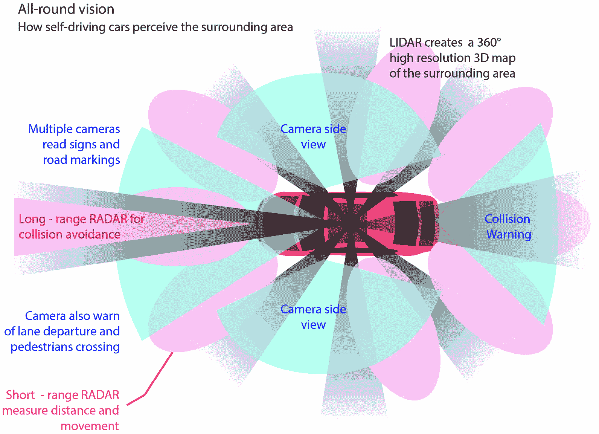

图 13.1 – 安装在自动驾驶车辆上的摄像头、雷达和激光雷达传感器。

在典型的汽车底盘上，你可以想象这些传感器被安装的情况，如*图 13.1*所示。正如我们所见，有几个摄像头、雷达和激光雷达传感器，它们被用来实现车辆的多种自动驾驶级别。*那么，这些自动驾驶级别是什么？*

除了之前定义的一些硬件（传感器）之外，还需要一个复杂的软件堆栈来构建和维护自动驾驶车辆开发所需的功能。这些功能被**汽车工程师协会**（**SAE**）分类，并且被广泛采用。SAE 定义了（2014 年及以后修订）五个级别的自动驾驶（见此处：[`www.sae.org/blog/sae-j3016-update`](https://www.sae.org/blog/sae-j3016-update)）：

+   **级别 0**：提供警告和有限辅助的功能，例如，自动紧急制动、盲点警告和车道偏离警告。

+   **第一级 – 基本驾驶辅助**：驾驶员可以抬起脚离开踏板，但需要保持手在方向盘上以接管，例如车道保持或定速巡航。请注意，定速巡航也可以是*自适应*的，与前方车辆保持安全距离。

+   **第二级 – 有限自动化**：系统控制转向、制动和驾驶，但仅限于有限场景。然而，驾驶员必须随时准备接管，以确保安全。

+   **第三级 – 低级自动化**：系统可以在更多情况下导航，例如在高速公路驾驶外，还可以在交通中驾驶。驾驶员仍需要在某些情况下接管驾驶。

+   **第四级 – 高级自动化**：系统在所有情况下控制车辆，驾驶员仅在遇到未知情况时很少需要接管。这项技术旨在用于无人出租车和卡车，尽管驾驶员仍然在场，以减少工作量和疲劳。

+   **第五级 – 完全自动化**：系统可以处理所有驾驶情况，无需驾驶员在场。

注意

为了澄清本章开头提出的一个问题，ADAS 可能是更大 AV 系统的一部分或独立使用。它们主要关注低级自动化任务和驾驶员辅助，如自适应定速巡航或驾驶员警觉性警告系统。

下图显示了 SAE 对自动化水平的定义：

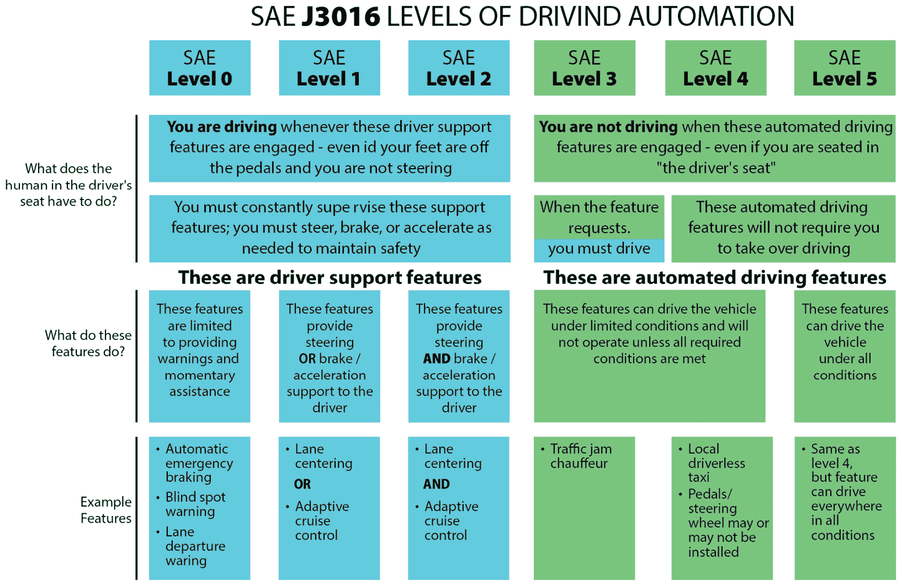

图 13.2 – 自动化水平 SAE。来源：[`www.sae.org/blog/sae-j3016-update`](https://www.sae.org/blog/sae-j3016-update)

在本节中，我们以高级别介绍了 AV 系统相关的基本概念，包括这些系统开发所需的硬件和软件组件。在下一节中，我们将探讨支持 AV 系统开发的 AWS 服务。

# 支持 AV 系统的 AWS 服务

AV 系统和 ADAS 的开发和测试需要一个具有高度可扩展计算、存储和网络功能的云平台。作为高性能计算应用，这些组件在之前的章节中已有详细阐述。作为回顾，本章仍涉及以下相关主题：

+   *第三章*，*计算和网络*（参见关于架构模式和计算实例的主题）

+   *第四章*，*数据存储*（参见关于 Amazon S3 和 FSx for Lustre 的主题）

+   *第五章*，*数据分析与预处理*（参见关于大规模数据处理的主题）

+   *第六章*至*第九章*（涵盖在云和边缘的分布式训练和部署）

在本节中，我们将突出介绍一些更多服务，包括我们在自动驾驶和 ADAS 开发背景下讨论的服务。一辆单一的自驾驶汽车每天可以生成数 TB 的数据。这些数据被用于以下链接中讨论的自动驾驶开发工作流程（[`aws.amazon.com/blogs/architecture/field-notes-building-an-autonomous-driving-and-adas-data-lake-on-aws/`](https://aws.amazon.com/blogs/architecture/field-notes-building-an-autonomous-driving-and-adas-data-lake-on-aws/)），并包括以下内容：

+   数据采集和摄取

+   数据处理和分析

+   标记

+   地图开发

+   模型和算法开发

+   模拟

+   验证和验证

+   部署和编排

随着数据规模的不断扩展，客户寻求在所有上述活动的中心寻找可扩展的、几乎无限容量的数据存储。例如，Lyft Level 5 管理着来自汽车传感器的**PB**（**PB**）存储数据，存储在**Amazon S3**中。Amazon S3 也是构建自动驾驶领域应用**数据湖**概念的核心，这将在下一节中讨论。

*但客户最初是如何将数据放入 Amazon S3 的* *呢*？

对于这一点，客户有多种选择。在自动驾驶领域，客户使用**Snow**系列设备（**SnowBall**、**SnowCone**和**SnowMobile**）将高达 PB 的数据传输到 Amazon S3。拥有本地系统的客户也可以使用**Amazon Outposts**来临时托管和处理这些数据，并使用与云类似的 API，同时还可以使用**Amazon Direct Connect**通过专用网络连接安全地将数据传输到 Amazon S3。这里突出的一些用例来自使用 AWS 进行实际自动驾驶开发的公司公开引用（有关更多信息，请参阅*参考文献*部分）。

客户还可以使用**AWS IoT FleetWise**，这是一种在撰写本文时仍在预览中的服务，可以轻松地从车辆收集和传输数据到云中，几乎实时。使用 IoT FleetWise，客户首先使用 FleetWise 设计器对车辆传感器进行建模，然后在车辆上运行的兼容边缘设备上安装**IoT FleetWise Edge Agent**，定义数据模式和条件以收集数据，并将这些数据流式传输到**Amazon Timestream**或 Amazon S3。

收集的数据可以是原始或处理过的传感器数据、图像、音频、视频、雷达或激光雷达数据。一旦这些数据存储在 Amazon S3 上，就可以在用于下游任务之前进行处理、分析和标记。例如，TuSimple 等几家客户使用 Amazon **弹性计算云**（**EC2**）来完成各种与自动驾驶相关的处理任务。试图优化处理成本并使用如此规模数据的客户广泛使用 EC2 Spot Instances。2020 年，Lyft Level 5 报告称，他们超过 75%的计算车队都在使用 EC2 Spot Instances 以降低运营成本（有关用例的链接，请参阅*参考文献*部分）。

对于基于图像和视频的预处理工作负载，可以使用几个预训练的机器学习模型，但需要访问基于 GPU 的实例。例如，丰田研究院广泛使用 P3 和 P4 实例来构建高度可扩展和性能优异的云应用。像 Momenta 这样的公司也使用 Amazon EMR 来创建如安全驾驶辅助决策服务之类的分析服务。

对于数据标注（主要是图像、视频和 3D 激光雷达数据），客户使用 AWS 上的**Amazon SageMaker Ground Truth**，它为这些标注用例提供专门的模板，访问私有、供应商或公共标注工作者池，以及几种辅助标注能力，以加快这些耗时任务并降低成本。

客户还使用管道来编排端到端预处理、训练或后处理工作流程。一个可以帮助创建、管理和大规模运行这些管道的服务是 Amazon **Managed Workflows for Apache Airflow**或**MWAA**。MWAA 是 Apache Airflow 的托管编排服务，使得在云中大规模设置和操作端到端数据管道变得非常简单。使用 MWAA 的替代方案包括 AWS 服务，如**Step Functions**和**Amazon SageMaker Pipelines**。

模型训练、模拟、模型编译、验证和验证工作流程可以利用**Amazon EC2**或以下托管服务之一 – **Amazon SageMaker**、**Amazon Elastic Kubernetes Service**（**EKS**）、**Amazon Elastic Container Service**（**ECS**）和/或**AWS Batch**。

在下一节中，我们将讨论 AWS 上自动驾驶开发的一个参考架构，它汇集了许多这些服务。

# 设计自动驾驶系统架构

在本节中，我们将讨论 AWS 发布的名为*自动驾驶数据湖参考架构*的参考架构，其链接可在*参考文献*部分找到。

完整的架构在*图 13.3*中得到了复制：

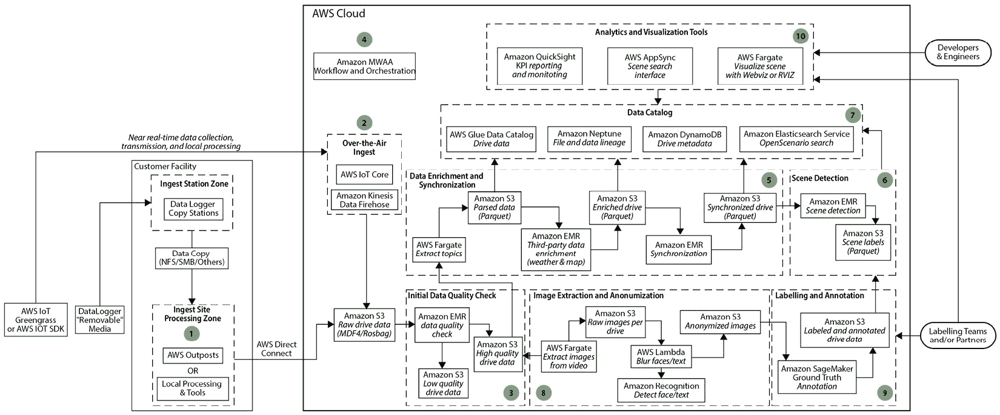

图 13.3 – 自动驾驶数据湖参考架构

在本节中，我们将深入探讨该架构的某些部分，以进一步详细讨论。让我们从数据采集开始：

+   *图 13.4*展示了汽车可能安装有数据记录器或某些可移除的存储介质，用于存储传感器的数据。可以使用定制硬件或 AWS Outposts 来处理存储在一个或多个行程中的数据。对于接近实时，可以使用**AWS IoT core**以及**Amazon Kinesis Firehose**将数据传输到 Amazon S3。客户还可以使用在本章前面提到的 Amazon Direct Connect，以安全快速地将数据传输到 Amazon S3。

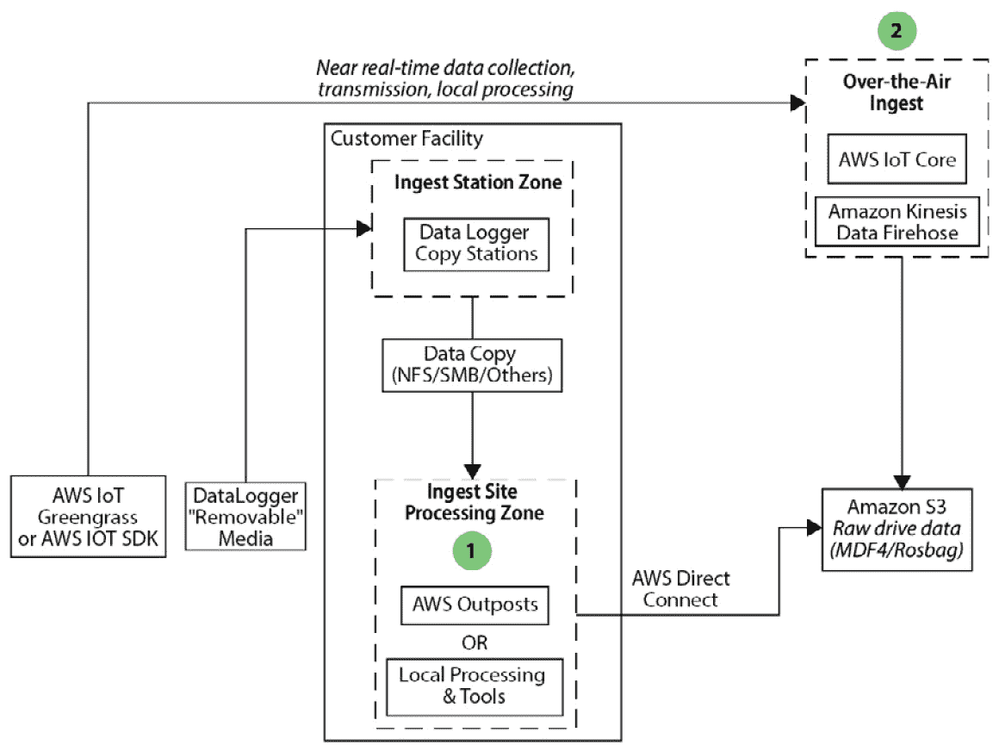

图 13.4 – 数据采集 – 步骤 1 和 2

+   *图 13.5* 展示了如何使用 **Amazon EMR** 来过滤传入的原始数据。例如，可以使用自定义 PySpark 代码评估数据质量，并将其丢弃到不同的桶中。

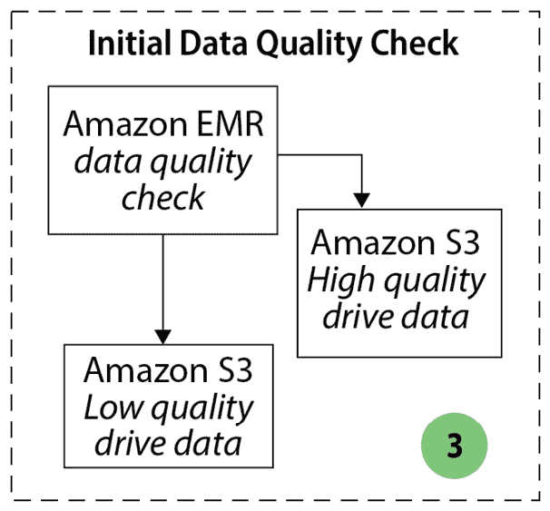

图 13.5 – 初始数据处理 – 步骤 3

+   *图 13.6* 展示了 *步骤 5* 和 *步骤 6*，其中数据进一步清理和丰富（例如，使用特定位置或天气数据）。鉴于收集到的数据量很大，可以在 Amazon EMR 中使用另一个处理步骤来识别对下游步骤（如机器学习）有趣的场景。

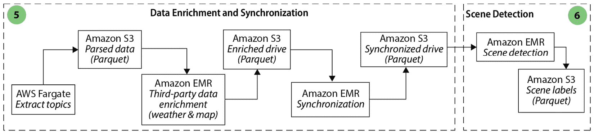

图 13.6 – 数据丰富 – 步骤 5 和 6

+   *图 13.7* 展示了如何使用 Amazon MWAA 来编排这些端到端的数据处理工作流程（*步骤 4*）。在许多中间步骤中生成的数据可以存储在 **AWS Glue 数据目录** 中，并且这些数据的历史可以存储在 **Amazon Neptune** 中作为图（*步骤 7*）。

+   最后，数据可以预先处理以供 Fargate 任务中的可视化工具使用，**AWS AppSync** 和 **Amazon QuickSight** 提供可视化和 KPI 报告功能。

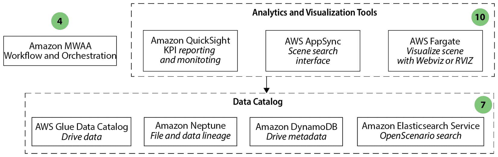

图 13.7 – 工作流程编排、数据目录和可视化工具 – 分别为步骤 4、7 和 10

+   *图 13.8* 展示了如何使用 **Amazon Fargate** 任务从视频中提取图像或图像序列，使用预训练模型或借助 **Amazon Rekognition** 来模糊和匿名化图像的某些部分（如面部或车牌）。对于自动驾驶系统客户，还可以进行进一步的预标注，其中可以使用开源中可用的预训练模型来识别行人、汽车、卡车、路标等。

这有助于加快标注过程，因为大部分的标注工作只是调整现有的标签，而不是从头创建所有标签（如边界框）。这种高质量的标注数据是创建机器学习驱动的 ADAS 和自动驾驶系统时最重要的步骤，这些系统可能包含多个模型。关于自动驾驶系统中的机器学习的更多细节将在下一节讨论。

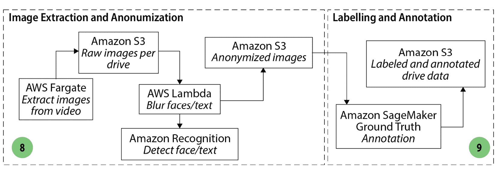

图 13.8 – 标注和标注数据上的机器学习 – 步骤 8 和 9

在下一节中，我们将讨论机器学习在自动驾驶系统中的应用和用例。

# 应用到自动驾驶系统中的机器学习

开发能够安全操作自动驾驶汽车的**深度神经网络**（**DNNs**）是一项高度复杂的技术挑战。从业者需要 PB 级的真实世界传感器数据，数百万甚至数百万的**虚拟中央处理器**（**vCPU**）小时，以及数千个加速器芯片或**图形处理单元**（**GPU**）小时来训练这些 DNNs（也称为*模型*或*算法*）。最终目标是确保这些模型可以比人类驾驶员更安全地自主驾驶车辆。

在本节中，我们将讨论在 AWS 上开发与端到端 AV/ADAS 开发工作流程相关的模型所涉及的内容。

## 模型开发

自动驾驶汽车（AVs）通常通过五个关键过程来运行，每个过程可能涉及机器学习（ML）的不同程度：

+   定位和地图构建

+   感知

+   预测

+   规划

+   控制

每个步骤都需要不同的支持数据和基础设施来高效地生成一个或多个功能模型。例如，虽然感知堆栈建立在需要分布式计算基础设施来支持深度学习训练的大型计算机视觉模型之上，但控制步骤消耗了通用 GPU 和针对深度学习优化的、具有大内存的 GPU 卡，在一个在线或离线的**强化学习**（**RL**）工作流程中。

在下一节中，我们将探讨基于云的 ML 环境如何利用 AWS 克服一些挑战，以实现自动驾驶汽车（AV）的成功开发。

### 挑战

在构建基于深度学习（DL）的 AV 模型方面有三个主要挑战：

+   将 TB 或更多的训练数据输入到运行在大型高性能计算基础设施上的 ML 框架中

+   弹性扩展计算基础设施，以线性方式扩展到数千个加速器，利用高带宽网络

+   ML 框架训练的编排

大量的数据也意味着需要大量的资源来进行标注，因此让我们接下来讨论这个挑战。

#### 标注大量数据

车辆传感器和仿真数据包含图像和视频流、来自雷达和激光雷达的点云，以及来自惯性测量传感器、GPS 和车辆**控制器区域网络**（**CAN**）总线的时间序列数据。在 8 小时的特定测试驾驶中，AV 可能通过这些传感器收集超过 40 TB 的数据。根据公司规模，测试车队可能从几辆车到近 1000 辆车不等。在这样的规模下，AV 数据湖每年增长 PB 级。总的来说，这些数据按时间索引并存储为用于模型训练的场景或情景。为了构建最终能够驾驶车辆的模型和代理，这些数据需要得到处理和标注。

第一个挑战是在训练过程中尽可能快地将这些标注数据集提供给机器学习（ML）框架，以便它能够处理数据批次。仅在一个特定任务中训练一个模型所需的数据量就可能超过数百 TB，这使得预先获取并将数据加载到内存中变得不可行。机器学习框架和计算硬件加速器的组合决定了从源读取此类数据批次的速度，以适应特定模型任务。

今天，您可以在 Amazon SageMaker Ground Truth 上使用几个内置的标签模板来标注图像、视频和 LiDAR 数据。有关可以使用 AWS 服务预处理和标注高分辨率视频文件的描述，请访问*参考文献*部分中的链接。特别是对于 LiDAR 用例，您可以使用同时使用多个机载摄像头捕获的 LiDAR 以及图像数据的数据。Amazon SageMaker Ground Truth 可以将包含 3D 点云数据的帧与多达八个摄像头源同步。一旦原始数据清单准备就绪，您就可以使用 SageMaker Ground Truth 进行 3D 目标检测、目标跟踪和 3D 点云的语义分割。与标准的 SageMaker Ground Truth 标注工作一样，您可以使用完全私有的劳动力或受信任的供应商来完成您的标注任务。*图 13.9*.9 是一个使用 3D 边界框以及三个投影侧视图和对应时间戳的摄像头图像对车辆进行标注的示例：

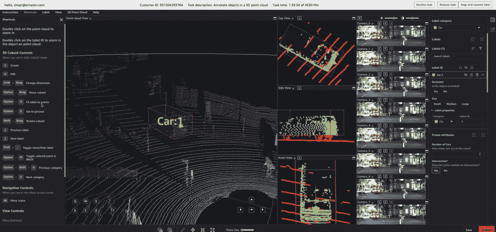

图 13.9 – Amazon SageMaker Ground Truth 标注作业，用于自动驾驶工作负载的 LiDAR 和摄像头数据

有关使用 Ground Truth 标注 3D 点云数据的更多信息，请参阅*参考文献*部分中的链接。

#### 使用大量数据进行训练

通常，在自动驾驶车辆（AV）的背景下，深度学习（DL）任务可以与*感知*（寻找有关环境或障碍物的信息）和*定位*（以高精度确定你在世界中的位置）相关联。正在开发一些最先进的深度学习模型，用于检测其他车辆、道路、行人、标志和物体，并描述这些二维物体在 3D 世界中的位置。*KITTI* *基准测试*通常用于测试新的算法和针对自动驾驶车辆相关用例的方法，例如语义分割和目标检测。可以在 AWS 开放数据注册表中找到对 KITTI 数据集（以及其他类似的数据集，如*奥迪 A2D2 自动驾驶数据集*）的访问。

在大型开源数据集上训练大型语义分割和目标检测模型，例如在 **Common Objects in Context**（**COCO**）数据集上的 **Mask R-CNN**，可以在单个多 GPU 实例上实现每秒 60 张图像的吞吐量——大约 35 MB/s。对于更简单的架构，由于训练网络的规模较小，训练吞吐量可以达到每秒数千张图像。这在使用构成更大模型（如 *Mask R-CNN*）骨干的 *ResNet* 模型进行图像分类的情况下是正确的。最近，一些模型如 *DeepManta* 已被用于在车辆姿态估计等其他相关任务上获得高分——这些方法和论文的链接可以在 *参考文献* 部分找到。

在较低的数据传输速率下，训练作业可以直接从 Amazon S3 获取数据对象。Amazon S3 是 AWS 上自动驾驶汽车开发的基础数据服务，如本博客文章 *构建自动驾驶数据湖* 中所述（请参阅 *参考文献* 部分）。

一些数据加载器直接提供对 Amazon S3 的连接，例如 TensorFlow，用于 TFRecord 风格的数据集。然而，这需要优化每个数据文件的大小以及工作进程的数量，以最大化 Amazon S3 的吞吐量，这可能会使数据加载管道复杂且可扩展性降低。当水平扩展数据读取器时，可以直接从 S3 读取以实现数百 GB/s 的总吞吐量，但会在训练过程的 CPU 利用率上做出妥协。本博客 ([`aws.amazon.com/blogs/machine-learning/optimizing-i-o-for-gpu-performance-tuning-of-deep-learning-training-in-amazon-sagemaker/`](https://aws.amazon.com/blogs/machine-learning/optimizing-i-o-for-gpu-performance-tuning-of-deep-learning-training-in-amazon-sagemaker/)) 解释了如何优化 I/O 以提高 GPU 性能。Mobileye 在他们的 reinvent 视频中解释了他们在 Amazon SageMaker 上使用 TFRecord 数据集和 Pipe 模式来训练大型 DNN，从而实现了更快的训练和开发时间提高 10 倍，该视频包含在 *参考文献* 部分。

为了获得更直接的架构，AWS 提供了利用 ML 框架原生支持 *POSIX 兼容* 文件系统接口的 **FSx for Lustre**（有关 FSx 和 POSIX 兼容的更多信息，请参阅 *参考文献* 部分）。FSx for Lustre 是一个高吞吐量、低延迟的分布式文件系统，可以从现有的 S3 数据中配置，使整个数据集作为文件对 DNN 训练工作员可用。这些文件可以使用任何主要的 ML 框架数据读取器进行迭代，例如 PyTorch 数据集或 DataLoader。

FSx for Lustre 可以将其基线聚合带宽扩展到 200 GB/s，用于 1 PB 的训练数据集，每个 TiB 的训练数据有 1.3 GB/s 的突发速度。提供的 FSx for Lustre 部署越大，聚合带宽就越高，从而实现 PB 级网络布线。FSx for Lustre 使用来自自动驾驶数据湖的数据子集进行初始化，并在训练过程中生成和记录模型工件或数据转换时，使用数据存储库任务进行同步。关于 Amazon ML 解决方案实验室如何帮助现代汽车使用 SageMaker 的分布式训练库和 FSx for Lustre，以 10 倍的速度仅用 5 倍的实例数量训练模型的真实世界示例，请参阅*参考文献*部分的使用案例链接。

需要一个 PB 级数据存储库的需求也来自于需要扩展处理这些数据的计算工作者的数量。以每秒 60 张图片的速度，单个工作者需要超过 6.5 小时才能在*COCO*数据集的 118,000 张图片上完成训练，考虑到需要十二个 epoch 才能达到合理的准确率。在每次训练迭代中扩展图片数量对于实现合理的训练时间至关重要。考虑到基于深度学习的模型构建的实验性和迭代性，需要多次训练运行才能构建单个模型。大规模训练通常意味着运行训练实验的高成本。Amazon SageMaker 为训练和部署都提供了节省成本的功能。

Lyft Level 5 的 ML 系统负责人 Alex Bain 表示：“通过使用 Amazon SageMaker 分布式训练，我们将模型训练时间从几天缩短到几个小时。通过在 AWS 上运行我们的机器学习工作负载，我们简化了我们的开发周期并降低了成本，最终加速了我们将自动驾驶能力交付给客户的使命。”

想了解更多关于成本节约的使用案例，请访问以下博客文章：[`aws.amazon.com/blogs/aws/amazon-sagemaker-leads-way-in-machine-learning/`](https://aws.amazon.com/blogs/aws/amazon-sagemaker-leads-way-in-machine-learning/)。

Amazon SageMaker 提供了连接到存储数据的常见文件系统的连接，例如 Amazon S3、EFS 和 FSx for Lustre。当运行长时间的训练作业时，选择合适的存储服务可以加快整体训练时间。如果训练数据已经在 EFS 中，通常会在 EFS 上继续预处理数据，并通过将 SageMaker 指向 EFS 来训练模型。当数据在 Amazon S3 中时，客户可以选择直接从 S3 使用这些数据，以利用 SageMaker 上的功能，如快速文件模式、管道模式、数据洗牌或通过 S3 键进行分片以进行分布式训练（有关这些模式的更多信息请参阅*参考*部分）。客户还可以使用 FSx for Lustre，因为它会自动使数据可供 SageMaker 训练实例使用，并避免任何重复的数据复制。当多个 epoch 使用略微不同的数据子集，这些子集适合实例内存，或者在分布式训练的情况下，FSx for Lustre 通过挂载一个数据可供训练代码访问的卷，提供了对数据集的极快和一致访问。

#### 规模化

使用分布式训练策略时，集群内的许多计算节点读取数据批次，对它们进行训练，并在训练过程中同步模型参数。这些集群的计算单位不是单个计算实例，有时称为*节点*，而是单个 GPU。这是因为深度神经网络（DNNs）需要硬件加速进行训练。因此，分布式发生在多 GPU 计算实例内部和之间。

亚马逊的 EC2 服务提供了云中最广泛的计算平台，拥有 17 种不同的计算实例系列。每个系列都是为了少数几个特定的工作负载而设计的，并包含一定比例的 vCPU、GPU（对于某些实例）、内存、存储和网络。对于完整的端到端 AV 开发，公司主要依赖于 C、M、R、G 和 P 实例系列。

对于机器学习模型的训练，公司利用**深度学习亚马逊机器镜像**（**DLAMI**）在*P 系列*中启动基于 NVIDIA GPU 的 EC2 实例。每个 EC2 P 系列实例代都集成了最新的 NVIDIA 技术，包括 p2 实例（Tesla K80）和 p3 实例（Volta V100），以及最近发布的 p4d（配备 A100 GPU）。

AWS 和 NVIDIA 持续合作，以实现数据并行和模型并行训练的最先进模型训练时间（参见*参考文献*部分的博客链接）。SageMaker 分布式训练包括用于分布式数据并行和模型并行训练模式的库。这些用于数据和模型并行训练的库扩展了 SageMaker 的训练能力，因此您可以通过对训练脚本进行少量代码更改来训练大规模模型。对于对此主题感兴趣的读者，AWS 深度引擎团队以下视频介绍了 AWS 库，该库对数据和模型并行训练都很有用：[`youtu.be/nz1EwsS5OiA`](https://youtu.be/nz1EwsS5OiA)。

在单个 GPU 级别上，优化内存消耗有助于提高吞吐量。对于可以批处理的数据进行模型训练，这意味着在 GPU 内存耗尽之前，每轮迭代可以处理更多的图像。因此，GPU 内存越高，可实现的训练吞吐量就越大，这有利于使用大内存 GPU 节点。

在多个 GPU 之间，实例内部和实例之间的快速通信使得在训练过程中梯度同步更快。因此，网络是增强每个迭代步骤速度的可扩展性的关键方面。此类基础设施类似于紧密耦合的高性能计算（HPC）基础设施。

AWS 提供支持云上 HPC 和加速计算的 EC2 实例。AWS 已经展示了 Mask R-CNN 等模型的最快训练时间，以及使用 EC2 **p3dn.24xlarge** 实例的大规模 GPU 实例的近线性可扩展性。该实例具有 8 个 NVIDIA V100 GPU，每个 GPU 有 32 GB 的内存，并且可以利用**AWS 弹性网络适配器**（**EFA**）网络接口。EFA 是一个定制的操作系统旁路硬件接口，它增强了实例间通信的性能，每张卡达到 100 千兆比特每秒的带宽，并且与 ML 应用中使用的通信库（如 MPI 和**NVIDIA 集体通信库**（**NCCL**））原生集成。

AWS 推出了最新一代（2020 年）的 NVIDIA GPU 硬件**通用可用性**（**GA**）与 EC2 p4d 实例。该实例将云中的机器学习训练提升到了新的水平，包括 8 个配备 40 GB 内存的 NVIDIA A100 GPU 以及改进的网络堆栈。p4d 实例不再只有一个网络接口卡，而是拥有 4 个 EFA 卡，总带宽达到每秒 400 Gbps。在实例内部，p4d 系列还通过 NVlink 网格拓扑结构增加了 GPU 到 GPU 的通信带宽，适用于使用 NCCL 的机器学习框架。新的 p4d 实例设计相比**p3dn.24xlarge**在主干模型上的训练吞吐量提高了高达 3.8 倍，这对于在自动驾驶车辆开发过程中的数据标注阶段使用的计算机视觉任务，如语义分割，至关重要。有关 p4d 设计和基准测试结果的更多信息，请参阅这篇深度分析博客。

在 2020 年 12 月的 AWS re:Invent 大会上，AWS 宣布了计划使 Intel Habana Gaudi 加速器和自建的训练芯片可用，这些芯片将提供比云中任何计算实例更多的**万亿次浮点运算**（**TFLOPS**）。2020 年，AWS 与 NVIDIA 合作，将 Mask R-CNN 在云上的训练时间缩短到 PyTorch 上的 6 分钟 45 秒和 TensorFlow 上的 6 分钟 12 秒（见*参考文献*部分链接）。有关在 Amazon SageMaker 上使用最小代码更改进行数据并行和模型并行训练的更多信息，请参阅*参考文献*部分链接的 SageMaker 分布式训练文档。

#### 编排

训练自动驾驶深度神经网络（DNN）的最终挑战是在大规模上管理和编排紧密耦合的高性能计算（HPC）基础设施。AWS 提供了一套服务解决方案，您可以利用这些服务构建和管理大规模的自动驾驶 DNN 训练集群，包括 Amazon EKS、Amazon ECS、AWS Batch 和 AWS Parallel Cluster 等工具。这些主题在前面的章节中已经详细讨论过，此处不再重复。

基础设施管理挑战还包括在整个模型开发过程中集成 AV 堆栈的上游和下游任务的能力。例如，感知模型堆栈的验证可能包括在线驾驶模拟。当将模拟环境集成到模型构建部署中时，分布式计算的要求从紧密耦合的高性能计算转变为高度并行化的、尴尬的并行批处理模拟和客户端-服务器架构。有效地集成服务对于将自动驾驶系统开发从研究练习转变为可扩展、生产就绪的管道变得至关重要。

这些选项为您提供了灵活性，可以帮助您以最快的速度和最稳健的基础设施构建一个可扩展且多样化的机器学习平台，供您的数据科学家团队使用。无论您是使用像 Amazon SageMaker 这样的托管机器学习平台，还是在 Kubernetes 上管理自己的平台，针对自动驾驶车辆（AV）的机器学习部署和编排必须具备以下特点：

+   持续训练和再训练功能

+   持续部署

+   持续监控

关于 AWS 上 MLOps 的更多信息，请参阅[`aws.amazon.com/sagemaker/mlops/`](https://aws.amazon.com/sagemaker/mlops/)。

对于自动驾驶车辆（AV）而言，以下是一个典型的跨越几周的机器学习工作流程示例：

1.  新或更新的数据集。

1.  数据集整理和场景选择。

1.  预标签和数据整理，其中使用预训练模型为人工标注者提供粗略质量标签的数据，以及在某些情况下从图像和视频数据集中隐藏敏感信息。

1.  标签和主动学习（更多信息请参阅[`aws.amazon.com/sagemaker/data-labeling/`](https://aws.amazon.com/sagemaker/data-labeling/))。

1.  为各种任务进行分布式训练（参见*第五章*，*数据分析*）。

1.  模型测试：

    +   软件在环测试

    +   硬件在环测试

    +   路上测试

1.  数据集收集，并返回到*步骤 1*。

关于这些步骤的更多信息，您可能对阅读 AWS 的实际客户 Aurora 如何使用他们的 Aurora Driver 平台实现自动驾驶功能感兴趣，请参阅[`www.cnet.com/roadshow/news/aurora-drive-aws-autonomous-vehicle-development/`](https://www.cnet.com/roadshow/news/aurora-drive-aws-autonomous-vehicle-development/)和[`www.youtube.com/watch?v=WAELZY_TJ04`](https://www.youtube.com/watch?v=WAELZY_TJ04)。

*第六章*，*机器学习模型的分布式训练*，讨论了分布式训练，*第八章*，*优化和管理边缘部署的机器学习模型*，讨论了边缘模型部署；这两者都与之前步骤（*步骤 5-9*）中列出的主题非常相关。在模型测试中，可以使用 AWS 上的工具进行软件在环测试，这将在下一节中通过一个您可以跟随的动手示例进行讨论。

#### 软件在环（SITL）模拟

在本节中，我们将讨论一种针对自动驾驶车辆客户非常有用的特定类型的**软件在环**（**SITL**）测试。请注意，这并不是全球自动驾驶车辆客户正在运行的唯一类型的模拟。一些可能涉及感知任务、规划或地图制作任务，以及在进行**硬件在环**（**HITL**）或路上测试之前，进行端到端软件任务。

在本节中，我们将介绍如何设置一个高保真驾驶环境模拟，甚至可以在模拟环境中测试一些 AV 的 DL 模型！为此，您必须遵循两个高级步骤：

1.  创建一个包含您的模拟环境的容器。

1.  使用 RoboMaker 运行您的模拟。

设置完成后，您可以交互式地与您的模拟进行工作，将环境作为 RL 循环的一部分使用，甚至为未来的 ML 实验生成合成数据。

在我们介绍步骤之前，这里有一些基础知识：

+   *什么是 AWS RoboMaker？* **RoboMaker**是一个基于云的模拟服务，您可以在其中运行模拟而无需管理任何基础设施。更多信息可以在[`aws.amazon.com/robomaker/`](https://aws.amazon.com/robomaker/)找到。RoboMaker 为以下要点中讨论的高保真模拟器提供基于 GPU 的计算。

+   针对 AV 和制造相关的模拟，RoboMaker 允许您使用模拟器，例如 CARLA（我们将在本节中使用），AirSim，Aslan，Summit，DeepDrive 或*Ignition*，Drake 或 NVIDIA Isaac Sim，甚至您使用高保真渲染引擎（如 Unity 或 Unreal Engine）创建的定制模拟。这些模拟器和工具的链接可以在*参考文献*部分找到。

+   **CARLA**是一个开源项目，常用于 AV 研究中模拟环境中的车辆，并测试 AV 的 DL 或 RL 模型。CARLA 提供了一个 API，允许用户控制模拟的所有方面，如驾驶、环境、交通和行人，并允许用户在车辆上配置传感器，如激光雷达、摄像头和 GPS。

太好了，现在让我们开始运行 CARLA 在 RoboMaker 上的步骤！

## 第 1 步 - 构建并将 CARLA 容器推送到 Amazon ECR

要构建我们的定制模拟容器，我们需要两个文件：

+   一个 Dockerfile

+   一个 shell 脚本，用于构建并将客户的 Docker 容器推送到 ECR（您也可以使用自己的管道来完成此步骤）

在这里，我们将在 SageMaker 笔记本实例上构建容器，但您也可以使用来自本地笔记本电脑或 EC2 实例的相同脚本，前提是您已设置正确的权限。为了演示这一步骤，我们假设您已经熟悉 SageMaker 笔记本。

下面是查看 CARLA Dockerfile 时的样子。`writefile`命令将以下代码写入一个名为`Dockerfile`的新文件中：

```py
%%writefile Dockerfile
FROM carlasim/carla:0.9.11
USER root
# see https://github.com/NVIDIA/nvidia-docker/issues/1632
RUN rm /etc/apt/sources.list.d/cuda.list
RUN rm /etc/apt/sources.list.d/nvidia-ml.list
# install dependencies
RUN apt update && \
      apt install -y python3-pip \
      libjpeg-dev \
      libtiff5-dev \
      libomp-dev \
      fontconfig
# fix ALSA errors
RUN echo pcm.!default { type plug slave.pcm "null" } >> /etc/asound.conf
# install NICE DCV (for RoboMaker)
RUN apt update -y && apt upgrade -y && apt install -y wget pgp
RUN wget https://d1uj6qtbmh3dt5.cloudfront.net/NICE-GPG-KEY
RUN gpg --import NICE-GPG-KEY
RUN wget https://d1uj6qtbmh3dt5.cloudfront.net/2021.1/Servers/nice-dcv-2021.1-10598-ubuntu1804-x86_64.tgz
RUN tar -xvzf nice-dcv-2021.1-10598-ubuntu1804-x86_64.tgz
RUN apt update && apt install -y ./nice-dcv-2021.1-10598-ubuntu1804-x86_64/nice-dcv-gl_2021.1.937-1_amd64.ubuntu1804.deb \
                                 ./nice-dcv-2021.1-10598-ubuntu1804-x86_64/nice-dcv-gltest_2021.1.275-1_amd64.ubuntu1804.deb
# install opengl
RUN apt update && apt install -y libglfw3 libglfw3-dev
# install xterm
RUN apt update && apt install -y xterm
# run as user carla
USER carla
# install example dependencies
RUN python3 -m pip install -U pip
RUN cd ~/PythonAPI/examples && python3 -m pip install -r requirements.txt
# set path to carla python API
ENV PYTHONPATH=/home/carla/PythonAPI/carla/dist/carla-0.9.11-py3.7-linux-x86_64.egg
ENTRYPOINT ["/bin/bash", "-c"]
```

如您所见，我们首先使用 CARLA 基础镜像并安装一些额外的依赖项：

```py
FROM carlasim/carla:0.9.11
```

第二个必需的文件是一个构建并推送容器的脚本。首先，我们定义脚本的参数（容器名称）和一些输入，例如区域、账户以及要构建的 Docker 容器的全名：

```py
%%sh
# The name of our algorithm
algorithm_name=$1
account=$(aws sts get-caller-identity --query Account --output text)
# Get the region defined in the current configuration (default to us-west-2 if none defined)
region=$(aws configure get region)
fullname="${account}.dkr.ecr.${region}.amazonaws.com/${algorithm_name}:latest"
```

然后，我们创建仓库并登录：

```py
# If the repository doesn't exist in ECR, create it.
aws ecr describe-repositories --repository-names "${algorithm_name}" > /dev/null 2>&1
if [ $? -ne 0 ]
then
    aws ecr create-repository --repository-name "${algorithm_name}" > /dev/null
fi
# Get the login command from ECR and execute it directly
aws ecr get-login-password --region ${region}|docker login --username AWS --password-stdin ${fullname}
```

最后，我们将构建并将容器推送到 ECR：

```py
# Build the docker image locally with the image name and then push it to ECR
# with the full name.
docker build  -t ${algorithm_name} .
docker tag ${algorithm_name} ${fullname}
docker push ${fullname}
echo ${fullname}
```

此 shell 脚本接受您的容器名称作为参数，根据本地的 Dockerfile 构建容器，并将容器推送到 ECR 中的存储库。一旦您在笔记本实例或安装了 Docker 的任何地方有了这两个脚本，您可以运行以下命令：

```py
./build_and_push.sh carlasim
```

这将输出您刚刚构建的容器的位置，类似于以下内容：

```py
<account_number>.dkr.ecr.<region>.amazonaws.com/carlasim:latest
```

复制此输出，因为您在*步骤 2 – 在 RoboMaker 上配置和运行 CARLA*时需要它。

## 步骤 2 – 在 RoboMaker 上配置和运行 CARLA

要在 RoboMaker 上配置和运行 CARLA 仿真，请按照以下步骤操作：

1.  导航到 AWS 上的**AWS RoboMaker**控制台 – [`aws.amazon.com/robomaker/`](https://aws.amazon.com/robomaker/)（如果需要，请登录您的 AWS 账户）。

1.  接下来，查找`carsimrole`：

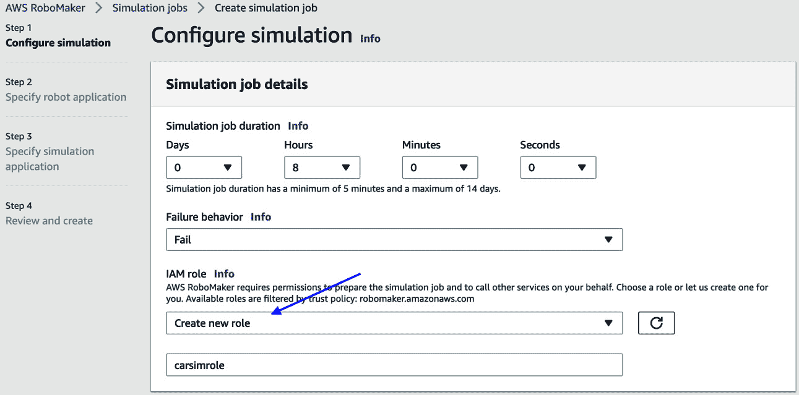

图 13.10 – 在 AWS RoboMaker 上创建仿真作业

1.  在同一屏幕上，滚动到计算选项，并确保您选择了 CPU 和 GPU，滑块对应于`s3://carlasim-bucket/output`；确保您浏览到的存储桶是您有权访问的，而不是本例中显示的存储桶：

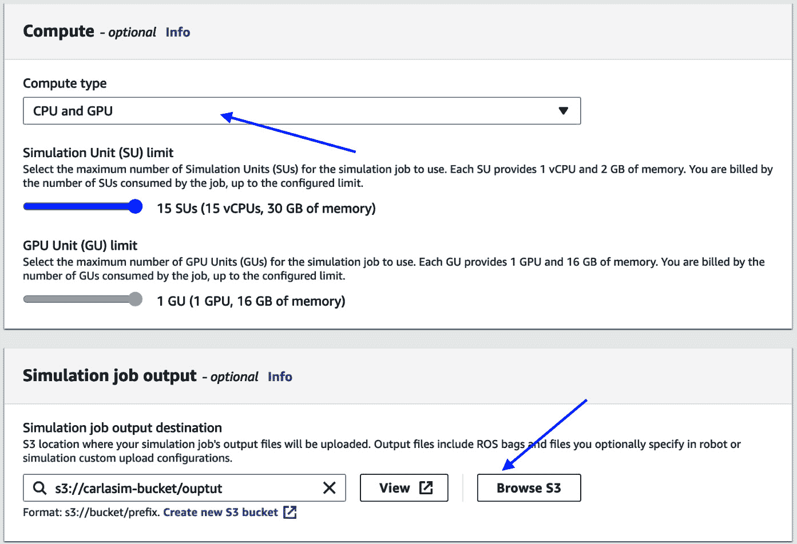

图 13.11 – 配置仿真作业的计算选项和输出位置

1.  在**指定机器人应用**页面，为机器人应用选择**无**（见图*图 13*.12*）：

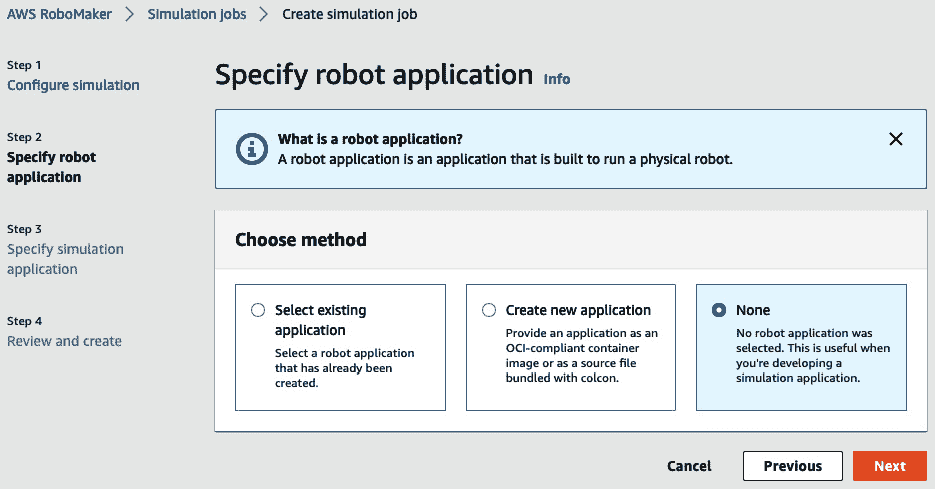

图 13.12 – 为机器人应用选择“无”

1.  转到**指定仿真应用**页面，如图*图 13*.13*所示：

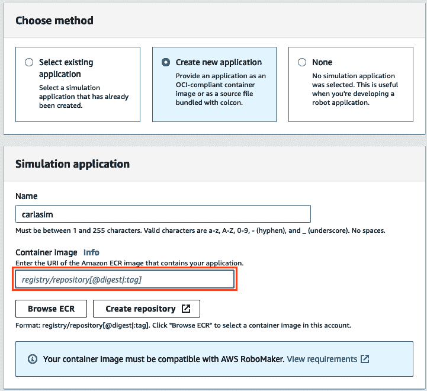

图 13.13 – 创建新的仿真应用

1.  选择**创建新应用**，并添加从*步骤 1*中复制的 ECR 仓库链接。如果您已经有一个仿真应用，您可以从下拉菜单中选择它，如图*图 13*.14*所示：

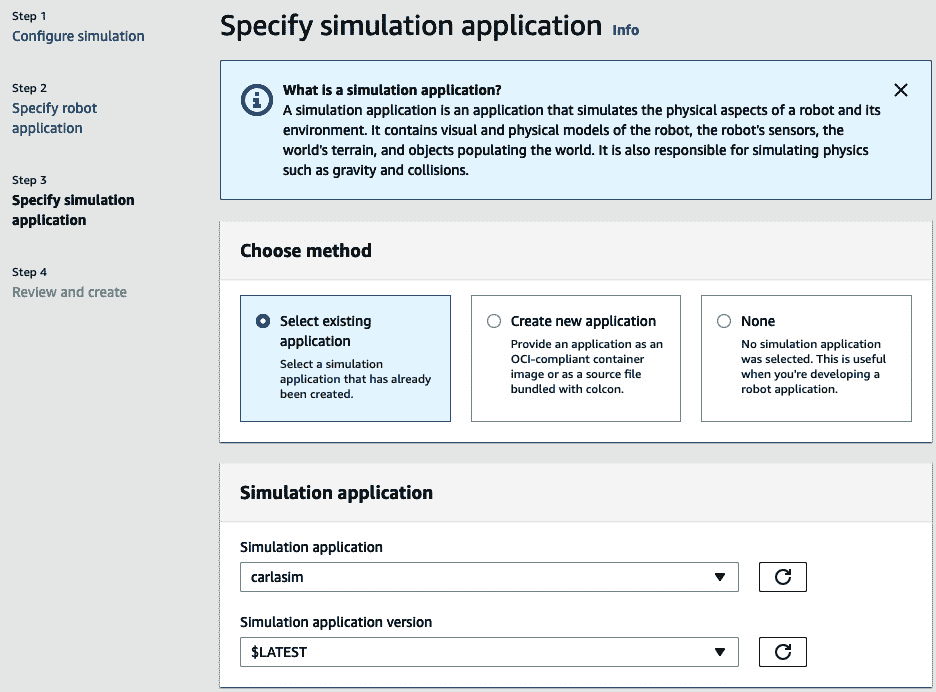

图 13.14 – 从下拉菜单中选择配置仿真应用

1.  滚动到**仿真应用配置**部分，输入以下内容作为您的启动命令，如图*图 13*.15*所示，并记得勾选运行带有流会话的选项：

    ```py
    ./CarlaUE4.sh -opengl
    ```

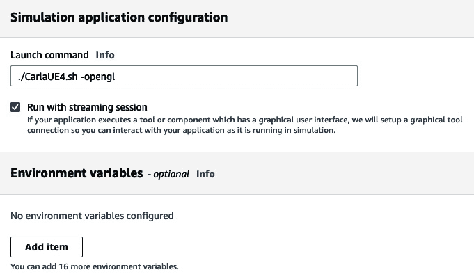

图 13.15 – 在仿真应用配置部分输入启动命令

1.  在**仿真应用工具**部分，创建两个终端，选项如图*图 13*.16*所示：

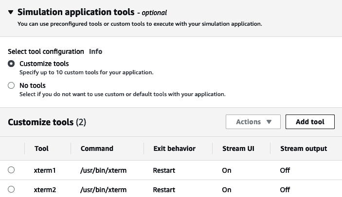

图 13.16 – 添加两个自定义工具以访问终端

1.  最后，点击**下一步**进入摘要屏幕，然后点击**创建**。创建您的模拟环境的过程将需要几分钟。一旦创建完成，您应该会看到您的模拟作业已创建，如图*图 13**.17*所示：

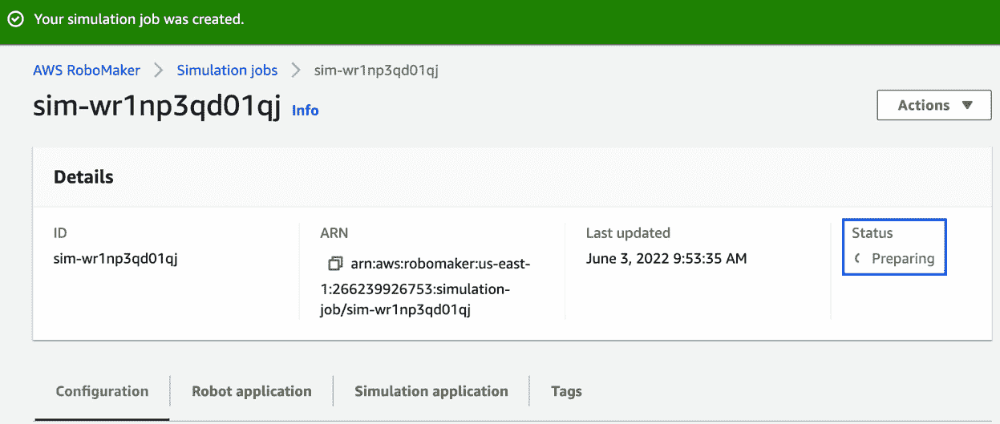

图 13.17 – 等待创建模拟作业

1.  一旦模拟创建完成，并且**状态**字段显示为**运行中**，点击**模拟应用程序**部分中的**连接**按钮，如图*图 13**.18*所示。您还可以访问终端来运行脚本或监控模拟环境。

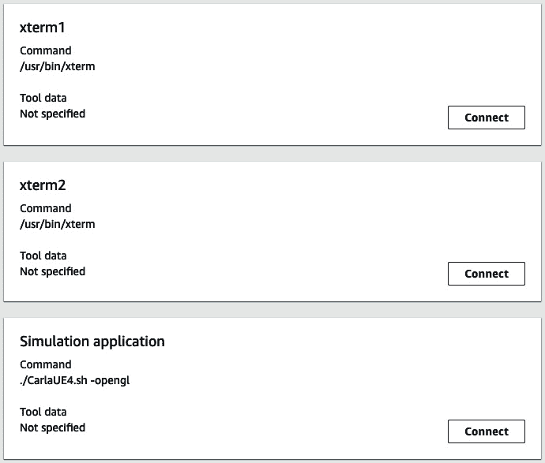

图 13.18 – 连接到主模拟应用程序或创建的终端

1.  点击**PythonAPI**文件夹，如图*图 13**.19*所示。

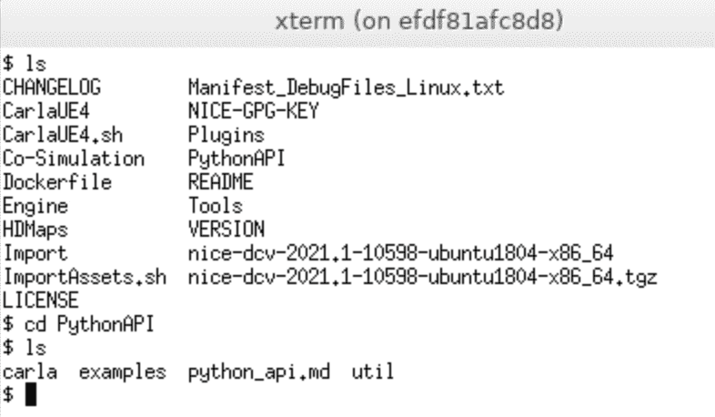

图 13.19 – 模拟作业内的 CARLA Python 示例

访问入门指南以了解 Python API 以及包含的示例（[`carla.readthedocs.io/en/0.9.2/getting_started/`](https://carla.readthedocs.io/en/0.9.2/getting_started/))。*图 13**.20*到*图 13**.22*提供了示例。

+   *图 13.20*展示了一个示例应用，您可以在 CARLA 模拟中手动驾驶特斯拉赛博卡车，与其他 264 辆车一起：

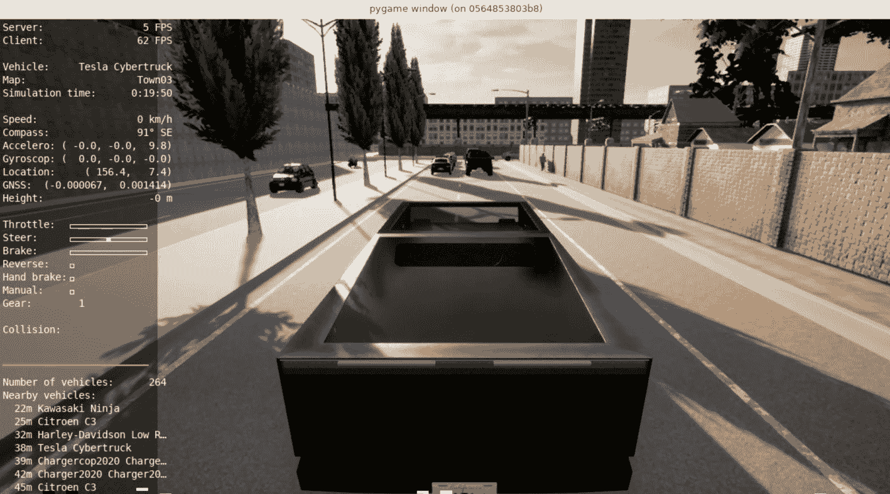

图 13.20 – 在 CARLA 模拟中手动驾驶特斯拉赛博卡车

+   *图 13.21*展示了一个示例应用，它通过我们创建的一个终端应用程序使用 Python 程序生成交通：

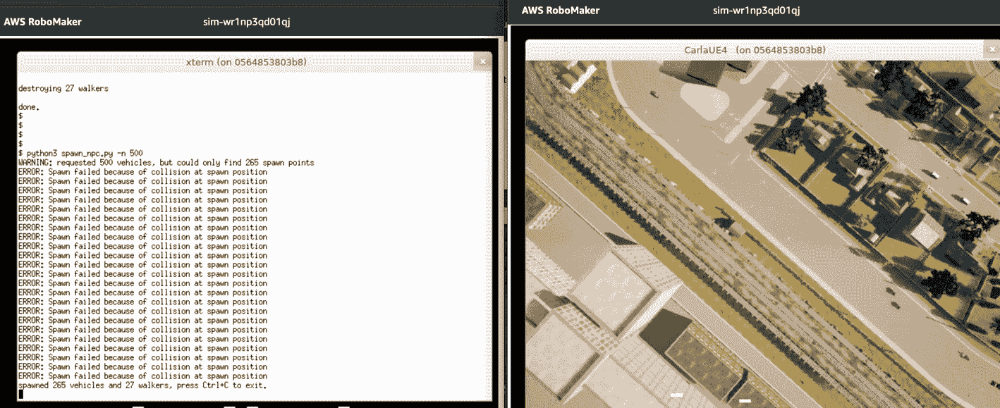

图 13.21 – 使用 Python 代码在 CARLA 模拟世界中生成交通

+   *图 13.22*展示了一个模拟应用程序，它模拟了模拟中车辆周围的激光雷达数据：


图 13.22 – 模拟汽车周围的激光雷达数据

作为下一步，阅读如何在教程中了解如何使用 RL 模型来控制您的汽车以用于自动驾驶用例：[`carla.readthedocs.io/en/latest/tuto_G_rllib_integration/`](https://carla.readthedocs.io/en/latest/tuto_G_rllib_integration/)

让我们总结一下本章到目前为止所学到的所有内容。

# 摘要

在本章中，我们从高层次讨论了 AV 和 ADAS 系统，并提供了在 AWS 上构建这些系统的一些参考架构。我们还讨论了实践者在云中训练与 AV 相关的机器学习模型时面临的三个主要挑战：向运行在大型、高性能计算基础设施上的机器学习框架提供 TB 或更多的训练数据，弹性地线性扩展计算基础设施以利用高带宽网络，以及编排机器学习框架的训练。

最后，我们向您展示了如何利用 AWS 上的工具运行 SITL 模拟来测试您的机器学习模型。

在下一章中，我们将专注于在 AWS 上解决数值优化问题。

# 参考文献

如需了解本章讨论的主题的更多信息，请访问以下链接：

+   *AWS 上自动驾驶和 ADAS 开发第一部分：实现 *Scale*: [`aws.amazon.com/blogs/industries/autonomous-vehicle-and-adas-development-on-aws-part-1-achieving-scale/`](https://aws.amazon.com/blogs/industries/autonomous-vehicle-and-adas-development-on-aws-part-1-achieving-scale/)

+   *在 AWS 上构建自动驾驶和 ADAS 数据湖*: [`aws.amazon.com/blogs/architecture/field-notes-building-an-autonomous-driving-and-adas-data-lake-on-aws/`](https://aws.amazon.com/blogs/architecture/field-notes-building-an-autonomous-driving-and-adas-data-lake-on-aws/)

+   *在 AWS 上为自动驾驶开发实现硬件在环测试*: [`aws.amazon.com/blogs/architecture/field-notes-implementing-hardware-in-the-loop-for-autonomous-driving-development-on-aws/`](https://aws.amazon.com/blogs/architecture/field-notes-implementing-hardware-in-the-loop-for-autonomous-driving-development-on-aws/)

+   *高级驾驶辅助系统（**ADAS**）: [`www.gartner.com/en/information-technology/glossary/advanced-driver-assistance-systems-adass`](https://www.gartner.com/en/information-technology/glossary/advanced-driver-assistance-systems-adass)

+   *CARLA* *文档*: [`carla.readthedocs.io/en/0.9.2/getting_started/`](https://carla.readthedocs.io/en/0.9.2/getting_started/)

+   使用 *Amazon Web Services* 进行高度自动化和自动驾驶车辆开发: [`pages.awscloud.com/rs/112-TZM-766/images/Autonomous_Vehicle_Development_with_AWS.pdf`](https://pages.awscloud.com/rs/112-TZM-766/images/Autonomous_Vehicle_Development_with_AWS.pdf)

+   *AWS IoT* *FleetWise*: [`aws.amazon.com/iot-fleetwise/`](https://aws.amazon.com/iot-fleetwise/)

+   *Lyft 使用 Amazon EC2 Spot 实例增加模拟容量，降低成本*: [`aws.amazon.com/solutions/case-studies/Lyft-level-5-spot/`](https://aws.amazon.com/solutions/case-studies/Lyft-level-5-spot/)

+   *自动驾驶数据湖参考* *架构*: [`d1.awsstatic.com/architecture-diagrams/ArchitectureDiagrams/autonomous-driving-data-lake-ra.pdf?did=wp_card&trk=wp_card`](https://d1.awsstatic.com/architecture-diagrams/ArchitectureDiagrams/autonomous-driving-data-lake-ra.pdf?did=wp_card&trk=wp_card)

+   *自动化自动驾驶车辆* *开发* *的数据摄取和标注*: [`aws.amazon.com/blogs/architecture/field-notes-automating-data-ingestion-and-labeling-for-autonomous-vehicle-development/`](https://aws.amazon.com/blogs/architecture/field-notes-automating-data-ingestion-and-labeling-for-autonomous-vehicle-development/)

+   *使用真实标签标注 3D 点* *云*: [`docs.aws.amazon.com/sagemaker/latest/dg/sms-point-cloud.html`](https://docs.aws.amazon.com/sagemaker/latest/dg/sms-point-cloud.html)

+   *Mask RCNN* *论文*: [`arxiv.org/abs/1703.06870`](https://arxiv.org/abs/1703.06870)

+   *COCO* *数据集*: [`cocodataset.org`](https://cocodataset.org)

+   *KITTI 数据集*: [`registry.opendata.aws/kitti/`](https://registry.opendata.aws/kitti/) 和 [`www.cvlibs.net/datasets/kitti/`](http://www.cvlibs.net/datasets/kitti/)

+   *A2D2* *数据集*: [`registry.opendata.aws/aev-a2d2/`](https://registry.opendata.aws/aev-a2d2/)

+   *ResNet*: [`arxiv.org/abs/1512.03385`](https://arxiv.org/abs/1512.03385)

+   *DeepManta*: [`arxiv.org/abs/1703.07570`](https://arxiv.org/abs/1703.07570)

+   *在 KITTI 汽车上进行车辆姿态估计* *困难*: [`paperswithcode.com/sota/vehicle-pose-estimation-on-kitti-cars-hard`](https://paperswithcode.com/sota/vehicle-pose-estimation-on-kitti-cars-hard).

+   *在* *AWS* *上构建自动驾驶和 ADAS 数据湖*: [`aws.amazon.com/blogs/architecture/field-notes-building-an-autonomous-driving-and-adas-data-lake-on-aws/`](https://aws.amazon.com/blogs/architecture/field-notes-building-an-autonomous-driving-and-adas-data-lake-on-aws/)

+   *TFRecord* *数据集*: [`www.tensorflow.org/api_docs/python/tf/data/TFRecordDataset`](https://www.tensorflow.org/api_docs/python/tf/data/TFRecordDataset)

+   *为 Amazon* *S3* *设计性能模式*: [`docs.aws.amazon.com/AmazonS3/latest/userguide/optimizing-performance-design-patterns.html`](https://docs.aws.amazon.com/AmazonS3/latest/userguide/optimizing-performance-design-patterns.html)

+   *将我们的机器学习迁移到云端激发* *创新*: [`www.mobileye.com/blog/moving-our-machine-learning-to-the-cloud-inspired-innovation/`](https://www.mobileye.com/blog/moving-our-machine-learning-to-the-cloud-inspired-innovation/)

+   *Lustre 用户* *指南*: [`docs.aws.amazon.com/fsx/latest/LustreGuide/what-is.html`](https://docs.aws.amazon.com/fsx/latest/LustreGuide/what-is.html)

+   *Pytorch* *DataLoader*: [`pytorch.org/docs/stable/data.html`](https://pytorch.org/docs/stable/data.html)

+   *将更改导出到数据* *仓库*：[`docs.aws.amazon.com/fsx/latest/LustreGuide/export-changed-data-meta-dra.html`](https://docs.aws.amazon.com/fsx/latest/LustreGuide/export-changed-data-meta-dra.html)

+   *现代汽车公司使用 Amazon SageMaker 减少自动驾驶模型训练时间*：[`aws.amazon.com/de/blogs/machine-learning/hyundai-reduces-training-time-for-autonomous-driving-models-using-amazon-sagemaker/`](https://aws.amazon.com/de/blogs/machine-learning/hyundai-reduces-training-time-for-autonomous-driving-models-using-amazon-sagemaker/)

+   *访问训练* *数据*：[`docs.aws.amazon.com/sagemaker/latest/dg/model-access-training-data.html`](https://docs.aws.amazon.com/sagemaker/latest/dg/model-access-training-data.html)

+   *Amazon EC2 P4 实例*：[`aws.amazon.com/ec2/instance-types/p4/`](https://aws.amazon.com/ec2/instance-types/p4/)

+   *AWS 和 NVIDIA 实现了 Mask R-CNN 和 T5-3B 的最快训练时间*：[`aws.amazon.com/blogs/machine-learning/aws-and-nvidia-achieve-the-fastest-training-times-for-mask-r-cnn-and-t5-3b/`](https://aws.amazon.com/blogs/machine-learning/aws-and-nvidia-achieve-the-fastest-training-times-for-mask-r-cnn-and-t5-3b/)

+   *NVLink 和 NVSwitch*：[`www.nvidia.com/en-us/data-center/nvlink/`](https://www.nvidia.com/en-us/data-center/nvlink/)

+   *NVIDIA 集成通信库（**NCCL**）*：[`developer.nvidia.com/nccl`](https://developer.nvidia.com/nccl)

+   *AWS re:Invent*：[`reinvent.awsevents.com/`](https://reinvent.awsevents.com/)

+   *Amazon EC2 DL1 实例*：[`aws.amazon.com/ec2/instance-types/habana-gaudi/`](https://aws.amazon.com/ec2/instance-types/habana-gaudi/)

+   *分布式训练* *库*：[`aws.amazon.com/sagemaker/distributed-training/`](https://aws.amazon.com/sagemaker/distributed-training/)

+   *CARLA*：[`carla.org/`](http://carla.org/)

+   *AirSim*：[`github.com/microsoft/AirSim`](https://github.com/microsoft/AirSim)

+   *阿斯兰项目*：[`github.com/project-aslan/Aslan`](https://github.com/project-aslan/Aslan)

+   *SUMMIT 模拟器*：[`github.com/AdaCompNUS/summit`](https://github.com/AdaCompNUS/summit)

+   *Deepdrive*：[`github.com/deepdrive/deepdrive`](https://github.com/deepdrive/deepdrive)

+   *Gazebo*：[`gazebosim.org/home`](https://gazebosim.org/home)

+   *Drake*：[`drake.mit.edu/`](https://drake.mit.edu/)

+   *NVIDIA Isaac 模拟器*：[`developer.nvidia.com/isaac-sim`](https://developer.nvidia.com/isaac-sim)

+   *Unity*：[`unity.com/`](https://unity.com/)

+   *虚幻引擎*：[`www.unrealengine.com/`](https://www.unrealengine.com/)
