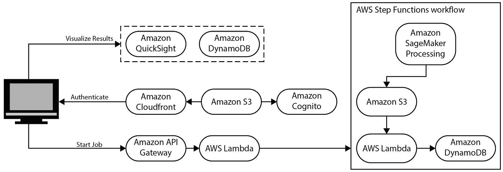

# 数值优化

在我们的日常生活中，无论是跑腿还是做家务，人的大脑总是在执行某种形式的优化。例如，大脑可能会优化前往单个或多个目的地的路线。它也可以优化我们在杂货店购买物品的成本，或者，例如，按周或按月预算我们的收入和支出。另一个例子是尝试优化睡眠量，以便我们的思维在第二天工作项目时保持清醒。简而言之，我们每天都在优化多个任务和日程，甚至不知道或思考过这一点。同样，自然界也在优化其过程。例如，地球围绕太阳以最佳路径运行，以保持各种引力之间的平衡。

**优化**在技术产业中也发挥着重要作用。许多大型优化问题由小型和大型企业解决。例如，送快递到我们家的快递员遵循由优化问题确定的路线和时间表，该优化问题在多个约束条件下解决了一个方程（无论是数值还是解析），以得出那个最佳路线。同样，股票交易是另一个例子，其中的行动可以是卖出、持有或购买特定公司的股票，以实现长期或短期收益的最大化。

在本章中，我们将讨论优化的一般概念，同时更多地关注数值优化、其示例、用例，以及其在应用机器学习中的应用。本章将涵盖以下主题：

+   优化简介

+   常见的数值优化算法

+   大规模数值优化问题的示例用例

+   在 AWS 上使用高性能计算进行数值优化

+   机器学习和数值优化

# 优化简介

如本章引言所述，优化是我们日常生活中和各个科学领域解决大量问题的重要工具。优化问题有许多组成部分，我们将在以下小节中讨论。

## 目标或目标函数

优化的过程始于定义一个目标或目标函数，例如货币收益、路线或路径、时间表、物品等等。选择目标或目标函数在很大程度上取决于问题领域，以及我们试图解决的问题的具体性。除了目标函数外，我们还需要知道我们是最大化还是最小化目标函数。同样，这也取决于具体的问题领域和目标函数。对于一个以成本为目标函数的优化问题，我们的目标很可能是最小化它，而如果我们的目标函数是收入或利润，我们希望最大化它。

对于我们的路由优化示例，一个组织可能专注于解决最大化配送物品数量的问题，而另一个组织可能希望最小化每配送的燃料成本。因此，尽管两个问题的领域相同，但目标不同。很多时候，目标可能相互关联或依赖。例如，在路由优化问题中，配送物品的数量和每配送的燃料成本似乎相互依赖。试图在给定的时间内配送尽可能多的物品也意味着路线需要定义得尽可能短，这意味着车辆将行驶短距离来配送物品，因此每配送的燃料成本将会较低。

## 变量

任何优化问题的目标函数通常都是几个变量的函数。通过改变这些变量的值，目标函数的值也会改变。例如，对于路由优化问题，一个变量可以是车辆的速度。如果增加车辆速度，车辆完成的配送数量将会增加，从而提高目标函数的值。数值优化问题通过改变这些变量的值来尝试达到优化函数的最优值。从数学上讲，我们可以定义目标函数 ，它将一组变量 *X* 映射到实空间 ：

我们的目标或目的是找到变量 *X* 的值，以最小化或最大化（取决于问题）我们的目标函数 。因此，对于最大化情况，优化问题可以写成如下形式：

对于最小化情况，优化问题可以写成如下形式：

## 约束

在之前讨论的路由优化问题中，车辆的速度将基于道路允许的最高速度有一个上限。车辆不应超过这个速度限制。这将是对优化目标函数的一个约束。任何优化问题要么有约束（约束优化）要么没有（无约束优化）。通常，大规模数值优化问题有几个约束。在存在约束的情况下，优化问题的目标就变成了在满足所有约束的条件下找到目标函数的最佳值。以下定义了一些示例约束：

+   **线性约束**：变量  和  大于或等于零，并且它们的和小于 100：

+   **非线性约束**：变量  的平方大于 ：

现实世界中的大规模数值优化问题通常既有线性约束也有非线性约束。

## 建模优化问题

在任何优化问题中，最困难且最重要的任务之一是制定或建模问题本身。这个过程包括识别变量、约束条件和目标函数。了解问题域以及对我们试图解决的商业问题的良好理解对于制定良好的优化问题至关重要。一个非常简单的公式不会帮助我们获得好的结果，而一个过于复杂的公式可能会导致我们无法找到解决方案或得到一个不良的解决方案，即使是在现代机器上，也可能需要非常长的时间来数值求解问题。

## 优化算法

在制定问题之后，下一步是选择一个优化算法，然后使用软件工具在包含我们的变量和约束的数据上运行它。没有一种算法可以解决所有的优化问题。选择正确的算法是在合理的时间内获得良好解决方案的重要因素。同样，也有几个开源和商业工具实现了优化算法。根据我们的预算和可用资源，我们应该选择合适的软件工具来解决优化问题。一旦算法执行完毕并且我们得到了结果，下一步是确保所有约束条件以及最优性条件都得到满足。如果我们得到的不是一个最优解，我们还可以对解进行敏感性分析，以改进它。

## 局部和全局最优解

我们优化问题试图解决的目标函数通常具有多个最优值。例如，如果我们的优化问题是最小化问题，并且我们的目标函数是凸函数，那么它将只有一个最小值，称为**全局最小值**，可以使用基于微积分的方法或如梯度下降、爬山法等已知算法找到。

*图 14.1* 展示了一元凸目标函数的全局最小值的情况，而 *图 14.2* 展示了两个变量的凸目标函数：

图 14.1 – 一元凸目标函数的全局最小值

图 14.2 – 两个变量的凸目标函数的全局最小值

我们在日常生活中遇到并处理的许多优化问题都具有非凸目标函数。这些目标函数有多个最优值，称为**局部最优解**。*图 14*.*3* 和 *图 14*.*4* 展示了具有一个变量的目标函数的示例，这些函数具有多个局部最小值：

图 14.3 – 具有多个局部最小值的目标函数

图 14.4 – 具有多个局部最小值的目标函数

*图 14*.*5* 和 *图 14*.*6* 展示了具有两个变量的目标函数的示例，这些函数具有多个局部最小值：

图 14.5 – 显示多个局部最小值的非凸目标函数

图 14.6 – 非凸目标函数的另一个示例，显示多个局部最小值

对于具有非凸目标函数的优化问题，找到全局最小值并不容易。无论我们使用哪种算法，我们很可能会得到一个局部最小值作为解。然而，有一些算法通过迭代过程来找到良好的局部最小值。随机重启爬山法和模拟退火法就是这样的算法。这些迭代算法可以在多台机器或处理器上运行——不仅可以在短时间内找到良好的局部最优解，还可以同时搜索目标函数搜索空间中的多个位置。

在下一节中，我们将了解一些常用的数值优化算法。

# 常见的数值优化算法

几种数值优化算法已实现于开源和商业销售的优化软件工具中。其中许多算法基于启发式搜索，这是一种与经典方法相比快速解决问题的技术。基于启发式的算法试图找到一个近似解，因为精确解非常难以找到。基于启发式方法提供的解被认为足够好以解决问题；然而，这通常不是最佳解。在本节中，我们将简要讨论这些算法中的一些。有关这些算法及其数学公式的详细讨论，您可以参考本章“进一步阅读”部分中引用的文章和文本。

## 随机重启爬山法

在**爬山法**中，我们从一点开始，，并在的邻域内搜索。如果在的邻域内任何方向的目标函数值增加，我们就向增加的方向移动。当目标函数的值在任意方向上不再增加时，我们停止。这是相对于我们的起点而言的目标函数的局部最优值。这种方法也称为**最速上升爬山法**。算法非常简单：

*图 14.7*显示了爬山到局部最大值的示例：

图 14.7 – 目标函数中爬山到局部最优的示例

对于最小化问题的情况，算法在目标函数中搜索一个山谷（或局部最小值）。请注意，图**14.7**中找到的最优值是一个局部最优值，它取决于我们从哪里开始搜索。

**随机重启爬山法**是爬山法的扩展，在该方法中，在找到一个最优值后，算法在变量空间的不同位置重新开始。这通常会导致达到不同的最优值，如图**14.8**所示：

图 14.8 – 从两个不同的变量值开始随机重启爬山，然后使用爬山法到达附近的最佳值

即使算法在**图 14.8**中达到了全局最优值，但这并不总是如此。然而，如果我们多次运行随机重启爬山法，最终得到的局部最优值可能会比只尝试爬山一次更好。由于随机重启爬山法每次都从变量随机选择不同的值开始，因此每个迭代可以在不同的处理器和线程上运行，以加快算法的速度。

## 模拟退火

在随机重启动爬山法中，我们只向一个方向移动——即向局部最大值（或最小值，取决于问题类型）的方向。这意味着算法只利用信息，而不探索其邻近区域之外。由于完全不探索，算法有很大机会陷入局部最优值并停留在那里。在 **模拟退火** 中，算法也会探索。它并不总是试图改进当前的目标函数值（向局部最优方向移动），但它有时也会向目标函数值变差的方向移动（与局部最优方向相反）。模拟退火算法的描述如下。

对于有限的迭代次数，执行以下操作：

1.  在当前点  的邻域  中采样新点 

1.  使用接受概率函数给出的概率跳转到新点，该函数为 ，其中 *T* 是温度参数，它控制我们跳转的频率，而 *f* 是目标函数的值：

1.  降低温度，

在前面的表达式中，如果新点的目标函数值大于当前值，则我们跳转到新点。如果新点的目标函数值小于当前值，我们以以下概率跳转到新点：

现在，让我们看看温度对模拟退火的影响。

### 温度 T 的影响

以下是在模拟退火中温度 *T* 的影响：

+   如果 *T* 很大，指数将接近 1，并且我们会以很高的概率跳转，无论新点的目标函数值  如何。这非常类似于当  时随机游走。

+   如果 *T* 很小，指数将非常小，我们很少跳转到新点。这非常类似于当  时爬山法。

在算法运行过程中，*T* 通常会缓慢降低。当 *T* 很大时，我们在目标函数空间中跳跃得相当频繁，并且有很大机会最终落在全局最优值或目标函数的良好局部最优值附近。当我们把 *T* 降低到很小的值时，我们可能非常接近全局最优值，因此我们只在其附近寻找。达到某一点，，的概率如下：

在这里，将概率缩放到 0 到 1 之间。从该表达式可以看出，目标函数的值（在全局最大值的情况下）越大，我们最终停留在该点，的概率就越大。对于最小化任务的情况也是一样的。

*图 14.9* 展示了模拟退火的概念，以及根据新选点是否改进目标函数，移动到新点的概率：

图 14.9 – 在模拟退火过程中，当选择相邻点作为下一个点时移动到新点的概率

接下来让我们讨论禁忌搜索。

## 禁忌搜索

**禁忌搜索**是另一种基于启发式的数值优化方法，在概念上与模拟退火相似。就像模拟退火一样，我们允许移动到一个目标函数值变差解。在禁忌搜索中，进行局部搜索时，不允许回到之前访问过的解。维护一个禁忌列表，其中包含在局部搜索期间不允许探索的规则和解决方案，因此这种方法被称为禁忌搜索。

## 进化方法

进化算法是基于群体的算法，它使用候选解和一些适应度函数，通过变异和重组来进化/改进解。进化方法在数值优化问题中应用相当广泛，通常在几次迭代内就能找到一个好的局部最优解。遗传算法是进化算法中非常知名且广泛使用的一类。遗传算法在数值优化领域以及机器学习领域有多个应用。它们可以使用二进制以及非二进制表示。遗传算法通常使用两个解，并应用交叉算子来这些解以得到更好的解。

在下一节中，我们将讨论大规模数值优化问题的各种应用和用例。

# 大规模数值优化问题的示例用例

在上一节中，我们讨论了一些常用的数值优化方法。还有一些我们没有涉及，我们建议您查看*参考文献*部分，以了解关于多种数值优化方法的优秀文本。一些非常常见的大规模优化问题已在垂直领域实现并解决，例如物流、制造、电信、医疗保健和生命科学、金融服务等。在本节中，我们将讨论一些非常常见的实际大规模数值优化用例和应用。我们将讨论以下用例：

+   确定销售人员从一个城市到下一个城市最佳路线的旅行销售人员问题

+   技术人员通过车辆旅行并在地理位置执行各种工作的调度优化问题

+   汇总线优化，以确定在汇总线上制造的最佳类型和数量的零件

我们将首先讨论一个最古老且最常研究的数值优化问题，称为旅行销售人员问题。

## 旅行销售人员优化问题

旅行销售人员问题是研究最广泛的组合优化问题之一，首次于 1930 年提出。它属于 NP-hard 问题类别；该问题的决策版本属于 NP-complete 问题类别。在旅行销售人员问题中，我们给定一组城市（或位置），从一个城市出发，每个城市恰好访问一次，然后返回起点城市以找到完成此任务的最短路线。例如，如图*图 14.10*所示，在美国地图上，我们想要从城市 A 出发，经过所有标记的城市，然后沿着最短的可能路线返回城市 A：

图 14.10 – 显示任意城市 A 至 O 的美国地图

尽管这个问题看起来容易解决，但它是一个 NP-hard 问题。旅行销售人员可以采取多种组合来访问每个城市恰好一次，但通常只有一个解决方案能够以最短的可能路线完成这项任务。旅行销售人员问题可以用几种不同的方式来表述。它可以表述为一个无向加权图，其中城市是图的顶点，连接城市的路线是边，并按城市之间的距离进行加权。然后它可以作为一个以给定顶点开始和结束的最小化问题来解决，每个顶点恰好访问一次。

另一种将旅行推销员问题建模的方法是将其作为一个整数线性规划问题。可以使用几种不同的表述，例如米勒-塔克泽林（Miller-Tucker-Zemlin）表述和丹齐格-富尔克森-约翰逊（Dantzig-Fulkerson-Johnson）表述。当城市数量较少且城市间只有少量路径时，可以在很短的时间内找到精确解。然而，随着城市数量和城市间路径数量的增加，在合理的时间内找到精确解几乎变得不可能。在这种情况下，数值方法试图找到问题的近似解或次优解。*图 14.11*展示了在*图 14.10*中所示城市之间找到的一条这样的路线。对于这个问题，可能存在可能的最短路线，但*图 14.11*中显示的路线是相当合理的，并且很可能是最短的可能路线，或者非常接近最短的可能路线：

图 14.11 – 旅行推销员问题的示例，展示了在地图上从 A 标记到 O 标记的城市之间的一条非常好的路线（可能是可能的最短路线）

旅行推销员问题在各个领域都有多个应用，例如规划、物流、制造、DNA 测序等。还有多种开源和商业销售的软件工具可用于解决旅行推销员问题，以及将其扩展到行业中存在的其他类似问题。旅行推销员问题最常见的实际扩展之一是车辆路径问题。在下一节中，我们将讨论车辆路径问题的一个更复杂的扩展，称为工人调度优化问题。

## 工人调度优化

车辆路径问题旨在为车队找到最优的路线，以便向客户进行配送。这在物流领域是一个非常常见的问题，例如，像美国邮政服务（**United States Postal Service**，简称**USPS**）、联合包裹服务公司（**United Parcel Service**，简称**UPS**）、联邦快递公司（FedEx Corporation）等组织，每天都需要向不同地理位置的客户配送多个包裹。这个问题可以使用各种商业目标来表述，例如，在最大化分配给司机/车辆的配送数量和最小化总燃料成本的同时，及时地配送包裹。这些组织通常将这个问题表述为一个优化问题，并在每天（有时一天内多次）解决它，以便向客户配送，同时也在一定约束条件下最大化其盈利性。

与旅行者问题类似，寻找车辆路径问题的解决方案也是 NP 难的。然而，几个数值优化软件工具可以在合理的时间内找到一个非常好的局部最优解。此外，使用高性能和分布式计算，软件可以编写为同时在多个处理器和机器上开始寻找各种解决方案，然后汇总并从找到的各种局部最优解中找到最佳的一个。

通常，车辆路径问题也会通过一些修改来扩展，以解决更加复杂的问题。其中一个例子就是技术人员或工人调度优化问题。在工人调度优化问题中，目标是派遣技术人员或工人到客户位置并完成一些需要时间才能完成的任务。这对于像电力、燃气、互联网、电信等服务提供组织来说是一个非常普遍的问题。这些组织根据工作人员的居住地设有几个工人/技术人员中心或车库。每天到达的工作需要根据他们的日程、技能和技能熟练程度分配给这些工人，因为不是所有的工作都是一样的。所有工人在不同类型的工作中都有相同的技能水平。此外，在所有这些工作中，都有一个需要满足客户满意度的固定时间窗口。此外，不同的工作完成所需的时间不同，还需要考虑前往客户位置所需的时间，这可能会因一天中的时间而异。

*图 14*.*12* 展示了一个示例，其中有一个位于中心的工人中心，以及一些在给定一天需要由工人/技术人员服务的客户位置：

图 14.12 – 工作人员/技术人员优化问题的示例

我们现在将正式概述这些约束条件，并讨论一些可以用来解决这个问题的目标函数。

### 工作人员优化问题的可能客观指标

工作人员优化问题可以根据业务需求具有几个目标函数/指标。我们将在下面列出其中的一些：

+   **最小化总燃料成本**：使用这个目标函数，目标是找到一个非平凡解，以最小化任何给定一天所有车辆每项工作的总燃料成本。燃料成本将取决于工人和车辆的数量、工作的数量、工作的位置、到达工作的路线、工作的顺序以及工人的日程安排。通常，最小化燃料成本是完成给定一天最大数量工作的间接结果，因为如果算法可以为特定工人打包大量工作，那么该特定车辆的每项工作的燃料成本就会很低，因此所有工人的每项工作的总燃料成本也会很低。

+   **最大化给定一天完成的工作数量**：为了最大化利润并保持客户满意，服务组织需要以尽可能少的工作转移到下一天为前提，最大化给定一天完成的工作数量。这也取决于给定一天可用的工人数量、工人技能以及执行工作所采取的路线。

+   **最大化工人效率**：这个目标依赖于最大化给定一天完成的工作数量。这个目标函数的目的是最大化每个工人在给定一天完成的工作数量，这也取决于技术人员的日程安排、技能、竞争力水平、起始位置以及技术人员需要行驶的距离。

+   **复合目标函数**：在复合目标函数中，目标是显式优化一组目标函数的组合，例如最大化工人效率、最小化距离或燃料成本。有时，复合目标函数中的各个项也可能相互对立。例如，增加一个可能会减少另一个，依此类推。在这种情况下，我们可能需要与复合函数中包含的不同目标函数相关的惩罚项，并优化由此产生的惩罚项组合。

现在，让我们看看一些对于制定工人调度优化问题可能很重要的约束。

### 工人调度优化问题的重要约束

以下是一些工人调度优化问题的重要约束。虽然约束涵盖了最常见的约束，但根据具体用例，可能会有额外的约束：

+   **工作数量**：给定一天给定工人中心的总工作数量很重要，它会影响工人效率数字、行驶距离以及燃料成本。任何给定一天可以实际完成的工作数量也严重依赖于该天的工作数量。

+   **给定一天可用的工人数量**：有多少工人在给定的一天内可以执行工作是另一个重要的约束条件，它对工人效率、旅行距离和燃料成本有重大影响。

+   **工人排班**：除了可用的工人数量外，每个工人的排班也是另一个重要的约束条件。一些工人可能从早上 8 点开始上班，而另一些则从 10 点开始，依此类推。同样，每个工人每天可能工作的小时数也可能不同。有些人可能工作 8 小时，而其他人可能工作 6 小时。此外，通常，工人也有休息时间，如午餐和其他定期休息。这些休息时间也可能在不同的时间，这进一步增加了与排班相关的约束，使优化问题更加复杂。

+   **工作类型**：通常有几种不同的工作类型。例如，对于电信组织，可能会有新的服务安装或旧服务维修工作。此外，几个服务提供组织提供多种产品和服务。例如，电信组织通常提供互联网、有线电视服务和家庭电话服务。这些不同的工作类型为优化问题增加了另一个维度，进一步复杂化了问题。

+   **工人技能和技能相关能力水平**：就像之前提到的不同工作类型一样，不同的工人和技术人员也有不同的技能类型以及在该技能领域的专业水平。再次以相同的电信使用案例为例，一些工人可能专注于安装新的服务，而其他人则专注于维修旧服务。此外，一些技术人员可能是互联网服务安装的专家，而其他人则是电话服务安装的专家。这导致不同工人安装相同服务或调试和维修相同问题所需的时间不同。这也为从商业角度制定问题时增加了一个有趣的困境。

企业可能希望在一个给定的一天内完成尽可能多的工作，这通常通过算法适当地匹配工人技能水平与工作来实现。另一方面，如果企业采取这种方法，那么工人可能无法学习新技能或获得与他们在该领域不是专家的服务和问题相关的实践经验。在制定问题的过程中，应该适当地模拟关于技能水平的这个参数，以实现最佳结果。

+   **工作地点**：每个工作在地理位置上的位置对于决定优化解决方案分配给每个工人的路线也很重要。

+   **客户时间窗口**：服务提供公司还承诺一个特定的时间窗口，在这个时间窗口内，工人应到达客户/工作地点。这些时间窗口也可能根据工作的类型、可用工人的数量以及地理位置而变化。这些时间窗口对最终目标函数值也有显著影响。例如，在某个特定的一天，客户地点可能有一个承诺的时间窗口，时间为早上 8-10 点进行新的服务安装工作。同时，附近可能还有另一个客户有维修请求。现在，尽管这些工作在物理上非常接近，但由于承诺的时间窗口，组织可能需要派遣多个工人来遵守对客户的承诺时间。因此，许多现代化的组织也在将工人调度问题与调度问题联合制定；当有维修或安装请求时，调度员应在与客户承诺时间窗口时考虑到所有这些约束条件。

+   **工作时长**：不同的工作完成所需的时间不同。通常，在工人中心的所有工人中，对于特定的工作都有一个平均时间，而且每个工人完成该工作的时间也是个体差异。所有这些也被建模为优化问题中的约束条件，以获得最佳结果。

+   **最大旅行时间和距离**：通常，对于工人一天内可能行驶的总距离或时间也有一个最大限制，以及工人可能从车库中心最远能到达的距离。

除了这些约束条件之外，还可能有其他额外的约束条件（例如，天气：雨、雪、风暴等），具体取决于特定组织正在处理的使用案例。正如我们可以想象的那样，所有这些约束条件使得工人调度优化问题非常复杂。通常，对于任何使用这种方法为其工人分配工作的组织，这个问题每天早上都在多个高性能计算机器上以分布式方式解决。例如，对于相同的地理位置，可以使用随机重启方法进行爬山和其他类似算法，每个重启迭代都在不同的处理器和/或机器上执行。有几款开源和商业化的优化软件可以非常高效地在合理的时间内制定和解决此问题。

*图 14**.13* 展示了三个工人中心，每个中心有三位工人，他们遵循优化的路线前往工作地点并返回工人中心：

图 14.13 – 示例展示了三个工人中心和总共九名工人，其中三名工人从每个工人中心出发，遵循优化的路线到达工作地点

通过使用数值优化算法来解决这个优化问题，服务公司可以提高工人效率，减少燃料成本，并显著提高客户满意度。接下来，我们将讨论另一个数值优化示例，即如何将物品分配到装配线以最大化给定日期的生产物品数量。

## 装配线优化

在电子制造等制造业中，通常有多个装配线或传送带，各种物品在这些装配线上被组装成最终产品，如台式/笔记本电脑、手机、平板电脑等。在这些装配线上，人工工人正在手动组装物品。不同的装配线可以组装不同的产品，存在一些重叠。此外，组装产品的工人也具有不同的技能和技能水平，就像工人调度优化问题一样。让我们根据业务用例讨论可用于此问题的各种优化指标。

### 装配线优化的目标指标

以下目标指标是装配线优化问题中常用的一些：

+   **最大化给定日期生产的物品数量**：使用此指标，目标是最大化任何给定日期组装的总物品数量。通常，这也取决于订单数量，以及近期内所需物品的预测。

+   **最小化存储中物品的数量**：使用此指标，目标是最小化过多制造并存储在存储中用于未来销售的物品数量。此指标还取决于要制造的物品的预测以及存储容量。

除了这些指标外，还可以根据业务用例和目标使用其他指标。此外，就像工人调度优化问题一样，由多个指标组成的客观指标也可以使用。让我们看看此问题的一些约束条件。

### 装配线优化问题的约束条件

以下约束对于装配线优化问题很重要：

+   每天需要组装的不同物品数量。此约束取决于销售预测以及预订单数量。

+   每天可供工作的工人数量，以及每个工人的日程安排。

+   各个工人的技能，以及每个工人的技能竞争力水平。

+   组装各种物品所需的技能。

+   每条传送带组装不同物品的容量。

+   工厂和/或仓库的存储容量。

+   在特定时间段内（如一天、一周或一个月）可以存储的最大物品数量（过剩）。

虽然这些是在制定流水线优化问题时考虑的一些常见约束，但根据具体的业务用例以及各种其他条件和要求，还可能有额外的约束。通过将此问题作为优化问题进行制定，然后在每日、每周、每月或每季度的时间表上解决它，制造公司通常可以提高产量、利润和效率，同时减少浪费和过剩物品的数量。

在本节中，我们讨论了在工业界使用的数值优化的一些应用和用例。在下一节中，我们将讨论 AWS 上可用于解决这些数值优化问题的性能计算选项。

# 在 AWS 上使用高性能计算进行数值优化

如前几节所述，大多数数值优化问题都是 NP 难的，对于找到合理的解决方案来说计算密集型很高。采用这些算法的软件工具必须在非常复杂的多元目标函数上进行大规模搜索，以寻找全局最优解。由于复杂性、维度数量、非凸性和有时存在于这些目标函数中的不连续性，即使在今天的计算资源下，几乎不可能在有限的时间内找到全局最优解。

然而，对于这些问题的大多数，几个商业和开源软件工具可以在合理的时间内找到一个非常好的解决方案（局部最优解）。这些工具可以在 AWS 提供的基础设施和计算资源上运行。让我们讨论一些常见的商业和开源工具，这些工具可以安装在 AWS 的各种资源上，以解决几乎每个行业领域的数值优化问题。

## 商业优化求解器

以下是一些在 AWS 计算基础设施上使用最流行和最常用的商业求解器：

+   IBM ILOG CPLEX 优化工作室（通常称为**CPLEX**）

+   Gurobi 优化

+   FICO Xpress 优化

+   **数学规划** **语言** （**AMPL**）

## 开源优化求解器

除了商业销售的优化求解器工具之外，以下开源优化求解器也可以轻松地在 AWS 计算基础设施上运行：

+   **GNU 线性规划** **套件** （**GLPK**）

+   **计算基础设施** **研究** （**COIN-OR**）

+   Pyomo

+   **凸包和非线性** **估计** **（Couenne**）

+   PuLP

+   Google OR-Tools

+   SCIP 优化套件

这些商业和开源软件工具可以使用以下章节中概述的各种不同的架构模式在 AWS 基础设施上运行。

## AWS 上的数值优化模式

可以采用各种架构模式在 AWS 资源上运行之前提到的优化软件工具。

*图 14.14* 展示了 AWS 堆栈中可用于帮助解决数值优化问题的各种工具和资源：

图 14.14 – 可用于解决数值优化问题的各种 AWS 资源和工具

让我们讨论一些使用这些 AWS 资源和工具的架构模式，并看看它们如何帮助解决数值优化问题。

### EC2 实例

我们可以在 Amazon EC2 实例上安装并运行这些优化工具，以容器的方式运行。优化软件套件以及所有必需的库可以构建成一个容器，然后利用 EC2 实例，这些实例也可以以分布式方式同时运行多个并行搜索（例如，随机重启爬山法）。通过并行运行这些算法的多个迭代，有更好的机会达到全局最优值或非常好的局部最优值。*图 14.15* 展示了在 EC2 实例上使用容器运行这些优化工具的架构：

图 14.15 – 示例架构，展示数值优化软件在 Amazon EC2 计算实例上的容器中运行

### 使用无服务器架构

除了使用 EC2 实例外，我们还可以在 AWS 上以无服务器的方式运行优化软件。*图 14.16* 中展示了使用无服务器架构的一个示例，其中 AWS Lambda 用于在 AWS Fargate 上启动多个优化任务。这些任务可以并行运行，然后汇总以获得优化问题的最佳解决方案。这些任务也可以是尝试解决同一问题的不同优化包和库，最终使用最佳结果。包含约束和变量的数据可以从 Amazon S3 读取，如*图 14.16* 所示。在此模式中，Amazon CloudWatch 也用于输出必要的步骤和状态消息：

图 14.16 – 使用 AWS Lambda 和 AWS Fargate 运行各种并行优化任务的示例无服务器架构

使用这种方法而不是 EC2 实例的优势在于成本和可扩展性。我们可以启动所需的任何数量的优化任务，而无需担心管理 EC2 实例。此外，由于我们使用的是无服务器架构，我们只需为优化任务运行的时间付费。例如，对于我们的工作者调度优化问题，相关的工作者和作业数据每天早上都会到达 Amazon S3 存储桶。然后，使用 AWS Lambda，可以在 AWS Fargate 上启动各种优化任务，每个特定工作者中心的任务都试图为该中心中的每个工作者找到最佳路线和调度。

### 使用 Amazon SageMaker 处理

除了使用专用 EC2 实例和无服务器架构外，我们还可以在 Amazon SageMaker 上使用 SageMaker 处理作业进行数值优化。*图 14**.17* 展示了这种架构模式的示例，其中包含约束和各种变量的数据存储在 Amazon S3 存储桶中。AWS Lambda 和 AWS Step Function 用于启动一个 SageMaker 处理作业，该作业从 S3 存储桶读取数据，并在一个包含所有必需的包和软件的容器中运行优化任务，这些软件是运行优化作业所需的。这个优化作业在一个短暂的 EC2 实例上运行；一旦作业完成，实例就会被释放，不再产生实例费用。结果在经过 AWS Lambda 函数的一些后处理后被写入 S3 和 Amazon DynamoDB。*图 14**.17* 还显示了其他一些 AWS 资源，例如用于身份验证和缓存的资源，这些资源可能有必要，也可能没有必要，具体取决于特定的用例：

图 14.17 – 使用 Amazon SageMaker 处理运行数值优化的示例

在本节中，我们探讨了使用 AWS 高性能计算资源和工具解决数值优化问题的几种方法。虽然这些是适用于各种用例的架构模式的良好示例，但根据用例和业务需求，这些模式也可以进行修改和扩展。

在下一节中，我们将探讨数值优化对于解决机器学习问题的重要性。

# 机器学习和数值优化

到目前为止，我们已经从优化问题的角度讨论了数值优化及其用例。虽然数值优化有几个独立的行业用例和应用，但它也非常常见于多种机器学习算法和用例中。无论是监督学习、无监督学习还是强化学习，我们总是在机器学习算法的核心使用迭代过程解决某种形式的优化问题。

在监督学习中，例如，让我们看看线性回归的例子。在线性回归中，我们最小化一个成本函数，这个成本函数通常由实际目标变量的值与通过模型预测的值之间的均方误差组成。

我们的算法通过迭代算法（如梯度下降）找到成本函数的最小值（如果它是均方误差，则具有全局最小值的凸函数；在大多数其他情况下是非凸的，具有局部最小值）。梯度下降查看成本函数的梯度，然后按梯度方向修改线性回归参数。这样，经过一定次数的迭代后，算法就达到了目标函数的全局或局部最小值。

同样，在逻辑回归中，我们使用由对数项组成的目标函数。这个目标函数再次是凸函数，我们再次使用梯度下降来找到目标函数的最小值。因此，我们再次在问题的核心解决一个数值优化问题，其高级目标是构建一个用于分类问题的机器学习模型。

在神经网络中，包括深度神经网络，我们有几个参数需要找到最优值，以便在输出层最小化某些错误。在深度学习领域，我们通常有非常大的机器学习模型，包含数百万甚至数十亿个权重或参数，尤其是在自然语言处理和计算机视觉问题中。神经网络中的每个神经元或单元都有一些激活函数，它是这些参数的函数之一。为了构建一个拟合数据良好并在测试或新数据上做出良好预测的模型，我们需要找到神经网络参数/权重的最优值。这再次是通过使用梯度下降或其他优化算法来解决由大量参数组成的数值优化问题。

与监督学习类似，数值优化也被用于无监督学习问题中。例如，在诸如 K-means 聚类这样的聚类方法中，我们试图最小化簇中心与簇中相关点之间的距离。同样，在期望最大化（一种软聚类方法）中，我们试图最大化每个数据点由高斯分布生成的可能性，而我们正在尝试找到的是这个分布的均值。

在强化学习中，数值优化也经常被使用。例如，在大多数强化学习方法中，算法的目标是通过行动和奖励最大化某种长期奖励，同时重复模拟场景以学习最大化长期奖励的最佳策略。在深度强化学习中，我们使用神经网络权重来近似策略。这些权重再次是通过使用梯度下降等数值优化算法来学习的。简而言之，无论我们试图解决哪种类型的机器学习问题，都与数值优化有着紧密的联系，并且对于这些机器学习问题中的大多数，我们都在解决某种形式的优化问题以获得机器学习问题的答案。

让我们总结一下本章学到的内容。

# 摘要

在本章中，我们讨论了数值优化及其应用。我们首先讨论了数值优化的概念及其必要成分。接下来，我们讨论了几种常见的数值优化方法。我们还讨论了几种数值优化的大规模应用和案例。这些案例在学术界和工业界都非常知名，并被多个组织在其业务中实施。此外，我们讨论了如何使用 AWS 高性能计算选项和资源来解决数值优化方法，并讨论了几种实现这一目标的架构模式。

最后，我们简要讨论了各种机器学习算法如何在其核心使用数值优化来构建良好的模型。本章涵盖的主题将帮助您理解和制定数值优化用例，了解数值优化对机器学习的重要性，以及高性能计算如何帮助解决数值优化用例。此外，您应该对可用于解决数值优化问题的工具和软件有所了解。

总体而言，在这本书中，我们讨论了高性能计算的基础知识，随后讨论了高性能计算的数据管理、传输、计算、网络和存储方面。我们还讨论了应用建模及其示例，例如数据分析、预处理、可视化、机器学习模型的分布式训练、模型优化及其部署，以及机器学习模型的扩展。此外，我们探讨了高性能计算的多种应用，如计算流体动力学、基因组学、自动驾驶汽车和数值优化。本文档中介绍的材料将向您介绍所有这些概念，并使您能够进一步探索并解决高性能计算和相关领域中的有趣用例。

# 进一步阅读

要了解更多关于本章所涉及主题的信息，请查看以下资源：

+   *数值优化交互教程*: [`www.benfrederickson.com/numerical-optimization/`](https://www.benfrederickson.com/numerical-optimization/)

+   El-Ghazali Talbi. 2009. *元启发式：从设计到实现*. Wiley 出版。

+   关于 NP-hard 和完备性的参考文献：

    +   旅行商问题: [`en.wikipedia.org/wiki/Travelling_salesman_problem`](https://en.wikipedia.org/wiki/Travelling_salesman_problem)

    +   车辆路径问题: [`www.sciencedirect.com/topics/economics-econometrics-and-finance/vehicle-routing-problem`](https://www.sciencedirect.com/topics/economics-econometrics-and-finance/vehicle-routing-problem)

    +   IBM ILOG CPLEX 优化工作室: [`www.ibm.com/analytics/cplex-optimizer`](https://www.ibm.com/analytics/cplex-optimizer)

    +   Gurobi 优化: [www.gurobi.com](http://www.gurobi.com)

    +   FICO Xpress 优化: [`www.fico.com/en/products/fico-xpress-optimization`](https://www.fico.com/en/products/fico-xpress-optimization)

    +   AMPL: [`ampl.com/`](https://ampl.com/)

    +   GNU 线性规划工具包: [`www.gnu.org/software/glpk/`](https://www.gnu.org/software/glpk/)

    +   运筹学计算基础设施: [`www.coin-or.org/`](https://www.coin-or.org/)

    +   Pyomo: [`www.pyomo.org/`](http://www.pyomo.org/)

    +   非线性估计的凸包和下凸包: [`github.com/coin-or/Couenne`](https://github.com/coin-or/Couenne)

    +   PuLP: [`pypi.org/project/PuLP/`](https://pypi.org/project/PuLP/)

    +   Google OR-Tools: [`developers.google.com/optimization`](https://developers.google.com/optimization)

    +   SCIP 优化套件: [`www.scipopt.org/`](https://www.scipopt.org/)
