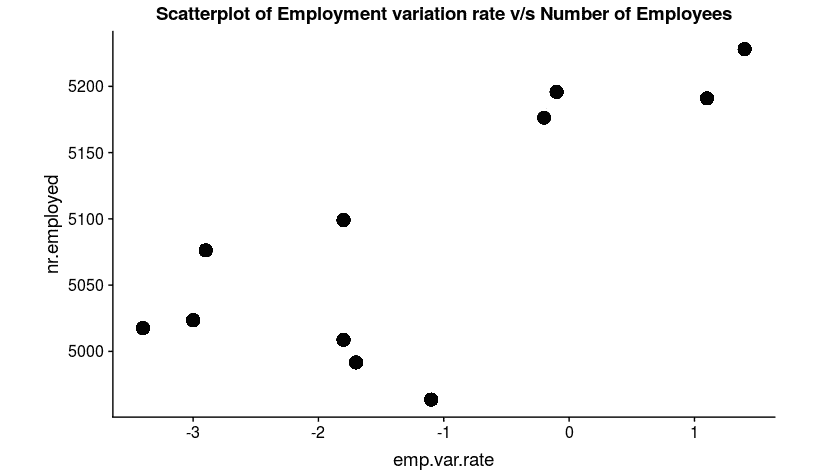

# 第三章：数据的探索性分析

## 学习目标

到本章结束时，您将能够：

+   使用行业标准框架定义问题陈述

+   执行单变量和多变量分析

+   解释多元分析

+   执行假设检验

+   使用 dplyr 和 reshape2 包进行数据整理

+   使用 ggplot2 包可视化数据

在本章中，我们将向学习者介绍清洁、转换和可视化数据的技术，以便获得有用的见解。

## 简介

*第一章*，*R 高级分析*，向您介绍了 R 语言及其数据科学生态系统。我们现在准备进入数据科学和机器学习的关键部分，那就是**探索性数据分析**（**EDA**），理解数据的艺术。

在本章中，我们将使用与上一章相同的银行数据集来处理 EDA，但以更问题为中心的方式。我们将首先使用行业标准工件定义问题陈述，为问题设计解决方案，并学习 EDA 如何适应更大的问题框架。我们将使用 R 中的数据工程、数据整理和可视化技术，结合以业务为中心的方法，来处理葡萄牙银行机构的直接营销活动（电话）用例的 EDA。

在任何数据科学用例中，理解数据占据了大部分的时间和精力。大多数数据科学专业人士花费大约 80%的时间在理解数据上。鉴于这是您旅程中最关键的部分，对任何数据科学用例的整体过程有一个宏观的视角是很重要的。

典型的数据科学用例遵循核心业务分析问题或机器学习问题的路径。无论采取哪种路径，EDA 都是不可避免的。*图 2.1*展示了基本数据科学用例的生命周期。它从使用一个或多个标准框架定义问题陈述开始，然后深入数据收集并达到 EDA。在任何项目中，大部分的努力和时间都消耗在 EDA 上。一旦理解数据的过程完成，项目可能会根据用例的范围采取不同的路径。在大多数基于业务分析的使用案例中，下一步是将所有观察到的模式综合成有意义的见解。尽管这可能听起来很 trivial，但它是一个迭代且艰巨的任务。这一步随后演变为讲故事，其中浓缩的见解被定制成对业务利益相关者有意义的叙述。同样，在目标是为了开发预测模型的情况下，下一步将是实际开发机器学习模型并将其部署到生产系统/产品中。


###### 图 2.1：数据科学用例的生命周期

让我们简要地看看第一步，*定义问题陈述*。

## 定义问题陈述

如果您还记得我们在*第一章*中探讨的数据，*高级分析中的 R*，银行营销数据，我们有一个数据集，该数据集捕捉了银行进行的吸引客户的电话营销活动。

一家大型跨国银行正在设计一项营销活动，通过吸引客户存款来实现其增长目标。该活动在吸引客户方面效果不佳，营销团队希望了解如何改进活动以达到增长目标。

我们可以从业务利益相关者的角度重新构建问题，并尝试了解哪种解决方案最适合这里。

### 问题-设计工件

正如软件工程和其他工业项目有多个框架、模板和工件一样，数据科学和商业分析项目也可以使用行业标准工件有效地表示。一些流行的选择来自咨询巨头如麦肯锡、BCG，以及决策科学巨头如穆西伽。我们将使用一个基于**Minto 金字塔**原则的流行框架，称为**情境-复杂性问题分析**（**SCQ**）。

让我们尝试以下结构来定义问题陈述：

+   **情境**：定义当前情况。我们可以通过回答问题来简化这一点——发生了什么？

    一家大型跨国银行正在设计一项营销活动，通过吸引客户存款来实现其增长目标。该活动在吸引客户方面效果不佳，营销团队希望了解如何改进活动以达到增长目标。

在上一节中，我们看到了一个为银行数据用例构建的假设商业问题。尽管在现实中可能有所不同，但我们确实在尝试解决一个有效的用例。通过以前格式展示的格式表示问题陈述，我们有一个明确的关注和解决问题的领域。这解决了典型数据科学用例生命周期中的第一步。第二步是数据收集，我们在上一章中探讨了这一点。我们将参考由 UCI 机器学习存储库提供的相同数据集，网址为[`archive.ics.uci.edu/ml/datasets/Bank%20Marketing`](https://archive.ics.uci.edu/ml/datasets/Bank%20Marketing)。

#### 备注

[Moro et al., 2014] S. Moro, P. Cortez, and P. Rita. A Data-Driven Approach to Predict the Success of Bank Telemarketing. Decision Support Systems, Elsevier, 62:22-31, June 2014.

这将我们带到了最后一步：EDA。在这个用例中，我们想要了解导致活动表现不佳的各种因素。在我们深入实际练习之前，让我们花点时间以更直观的方式理解 EDA 的概念。

## 理解 EDA 背后的科学

用通俗易懂的话来说，我们可以将 EDA 定义为理解数据的科学。更正式的定义是分析并探索数据集的过程，使用统计、视觉、分析或这些技术的组合来总结其特征、属性和潜在关系。

为了巩固我们的理解，让我们进一步分解定义。数据集是数值特征和分类特征的组合。为了研究数据，我们可能需要单独探索特征，而为了研究关系，我们可能需要一起探索特征。根据特征的数量和类型，我们可能会遇到不同类型的探索性数据分析（EDA）。

为了简化，我们可以将 EDA 的过程大致分为以下几类：

+   **单变量分析**：研究单个特征

+   **双变量分析**：研究两个特征之间的关系

+   **多元分析**：研究两个以上特征之间的关系

现在，我们将本章的范围限制在**单变量**和**双变量**分析上。在接下来的章节中，我们将介绍一些多元分析形式，如回归。

为了完成之前提到的每一项分析，我们可以使用可视化技术，如箱线图、散点图和条形图；统计技术，如假设检验；或者简单的分析技术，如平均值、频率计数等。

进一步细分，我们还有一个维度需要考虑，那就是特征的类型——**数值**或**分类**。在提到的每种分析类型中——**单变量**和**双变量**——根据特征类型，我们可能有不同的可视化技术来完成研究。因此，对于数值变量的单变量分析，我们可以使用直方图或箱线图，而对于分类变量，我们可能使用频率条形图。我们将以**懒编程**的方式深入了解 EDA 的整体练习，也就是说，我们将探索书中分析出现的上下文和细节。

在为练习设置基本背景后，让我们为特定的 EDA 练习做好准备。

## 探索性数据分析

我们将从可以从 UCI ML 存储库下载的数据集开始，该存储库的网址为[`archive.ics.uci.edu/ml/datasets/Bank%20Marketing`](https://archive.ics.uci.edu/ml/datasets/Bank%20Marketing)。

下载 ZIP 文件，将其解压到工作空间中的一个文件夹中，并使用名为`bank-additional-full.csv`的文件。要求学生启动一个新的 Jupyter 笔记本或他们选择的 IDE，并将数据加载到内存中。

### 练习 18：研究数据维度

让我们快速使用上一章中探索的简单命令加载数据，并查看数据集的一些基本特征。

我们正在探索数据的长度和宽度，即行数和列数、每列的名称、每列的数据类型以及每列存储内容的概览。

执行以下步骤以探索银行数据集：

1.  首先，在 RStudio 中导入所有必需的库：

    ```py
    library(dplyr)
    library(ggplot2)
    library(repr)
    library(cowplot)
    ```

1.  现在，使用`option`方法将图表的`width`和`height`分别设置为`12`和`4`：

    ```py
    options(repr.plot.width=12, repr.plot.height=4)
    ```

    确保您下载并将`bank-additional-full.csv`文件放置在适当的文件夹中。您可以从[`bit.ly/2DR4P9I`](http://bit.ly/2DR4P9I)访问该文件。

1.  创建一个 DataFrame 对象并使用以下命令读取 CSV 文件：

    ```py
    df <- read.csv("/Chapter 2/Data/bank-additional/bank-additional-full.csv",sep=';')
    ```

1.  现在，使用以下命令显示数据集中的数据：

    ```py
    str(df)
    ```

    输出如下：


###### 图 2.2：来自 bank-additional-full CSV 文件的银行数据

在前面的例子中，我们使用了 R 中可用的传统`read.csv`函数将文件读入内存。由于文件是分号分隔的，我们向`sep=";"`函数添加了一个参数。`str`函数打印出我们所需的数据集的高级信息。如果您仔细观察输出片段，您可以看到第一行表示数据的形状，即行数/观测数和列数/变量数。

输出片段中的下 21 行展示了数据集中每个变量的预览。它显示了变量的名称、其数据类型和数据集中的一些值。我们为每一列有一个条目。`str`函数实际上为我们提供了整个数据集的宏观视图。

如您从数据集中所见，我们有 20 个独立变量，例如`age`、`job`和`education`，以及一个结果/因变量`y`。在这里，结果变量定义了向客户发起的营销电话是否导致了成功的存款注册，用`yes`或`no`表示。为了理解整个数据集，我们现在需要研究数据集中的每个变量。让我们首先进行单变量分析。

## 单变量分析

对于数据集中的数值特征（如`age`、`duration`、`nr.employed`）等，我们查看诸如最小值、最大值、平均值、标准差和百分位数分布等汇总统计量。这些度量共同帮助我们了解数据的分布。同样，对于分类特征（如`job`、`marital`和`education`），我们需要研究特征中的不同值及其频率。为了完成这项任务，我们可以实施一些分析、可视化和统计技术。让我们看看探索数值特征的解析和可视化技术。

### 探索数值/连续特征

如果你探索了前面的输出片段，你可能已经注意到数据集中有数值型和分类型特征的混合。让我们首先查看数据集中的第一个特征，它是一个名为`age`的数值型特征。正如其名所示，它表示目标客户的年龄。让我们看一下该特征的摘要统计信息，并使用简单的箱线图进行可视化。

### 练习 19：使用箱线图可视化数据

在这个练习中，我们将探索使用箱线图进行单变量分析，解释如何解释箱线图，并逐步展示代码。

执行以下步骤以使用箱线图可视化数据：

1.  首先，使用以下命令导入 ggplot2 包：

    ```py
    library(ggplot2)
    ```

1.  创建一个 DataFrame 对象，`df`，并使用`bank-additional-full.csv`文件，使用以下命令：

    ```py
    df <- read.csv("/Chapter 2/Data/bank-additional/bank-additional-full.csv",sep=';')
    ```

1.  使用以下命令打印`age`数据，例如`mean`和`max`：

    ```py
    print(summary(df$age))
    ```

    输出如下：

    ```py
    Min. 1st Qu.  Median    Mean 3rd Qu.    Max. 
    17.00   32.00   38.00   40.02   47.00   98.00
    ```

1.  接下来，按照以下方式打印年龄的标准差：

    ```py
    print(paste("Std.Dev:",round(sd(df$age),2)))
    ```

    输出如下：

    ```py
    [1] "Std.Dev: 10.42"
    ```

1.  现在，使用以下参数绘制年龄的箱线图：

    ```py
    ggplot(data=df,aes(y=age)) + geom_boxplot(outlier.colour="black")
    ```

    输出如下：

![图 2.3：年龄的箱线图。![图 2.3：年龄的箱线图。###### 图 2.3：年龄的箱线图。我们首先加载`ggplot2`库，它提供了用于可视化数据的便捷函数。R 提供了一个简单的函数`summary`，它打印摘要统计信息，如最小值、最大值、中位数、平均值、75 百分位数和 25 百分位数值。下一行使用`sd`函数计算标准差，最后，最后一行使用`ggplot`库绘制数据的箱线图。如果你探索了摘要统计信息的输出，我们可以看到年龄的最小值为 17，最大值为 98，平均值为 42。如果你仔细观察 75 百分位数（第三四分位数）和 100 百分位数（最大值）之间的差距，我们可以看到巨大的跳跃。这表明年龄变量中存在异常值。异常值的存在将错误地改变你的分析结论。在某些情况下，当只有一个值为 75 百分位数的`1000x`的数据点时，你的平均值会向右移动。在仅使用平均值作为对变量进行估计的大致数值的情况下，对特征的整体理解可能会产生误导。另一方面，箱线图帮助我们以简单明了的方式直观地消费这些信息。箱线图将数据分为三个四分位数。下四分位数，即箱体下方的线，代表最小值和 25 百分位数。中间四分位数代表 25 至 50 至 75 百分位数。上四分位数代表 75 至 100 百分位数。100 百分位数以上的点是由内部函数确定的异常值。正如我们所见，从摘要统计中得出的观察结果与箱线图一致。我们确实看到了异常值，标记为上四分位数以上的点。在下一个练习中，我们将使用直方图对年龄变量进行 EDA。让我们看看从直方图图中我们能得到哪些见解。### 练习 20：使用直方图可视化数据在这个练习中，我们将讨论如何解释直方图和异常值。让我们从上一个练习继续。为了获得数据的更详细视图并更深入地理解 `age` 变量的组织方式，我们可以使用直方图。直方图是一种特殊的条形图，其中数据被分组并按顺序排列到称为 `bins` 的相等间隔中，并绘制相应分箱中的数据点的频率。直方图帮助我们更有效地理解数据的分布。练习通过绘制直方图帮助我们更有效地可视化数据。执行以下步骤：1.  首先，使用以下命令导入 ggplot2 包：    ```py    library(ggplot2)    ```1.  创建一个 DataFrame 对象 `df`，并使用以下命令使用 `bank-additional-full.csv` 文件：    ```py    df <- read.csv("/Chapter 2/Data/bank-additional/bank-additional-full.csv",sep=';')    ```1.  现在，使用以下命令使用提供的参数绘制年龄的直方图：    ```py    ggplot(data=df,aes(x=age)) +            geom_histogram(bins=10,fill="blue", color="black", alpha =0.5)  +            ggtitle("Histogram for Age") +            theme_bw()      ```    输出如下：

###### 图 2.4：年龄直方图

`ggplot` 函数定义了可视化的基础层，随后通过带有参数的 `geom_histogram` 函数，这些参数定义了直方图相关方面，例如分箱数、填充颜色、alpha（透明度）等。默认情况下，分箱数也会被计算，但可以通过传递一个值给 `bin` 参数来覆盖，例如 `bin=10`。下一个函数 `ggtitle` 用于给图表添加标题，而 `theme_bw` 函数用于将主题改为黑白而非默认。`theme` 函数是可选的，这里添加它只是为了使图表更美观。

如您所清晰看到的，直方图为我们提供了对特征数据分布的更细粒度的视图。我们可以理解，65 岁之后记录数急剧减少，只有少数记录的值超过 75。在某些情况下，选择直方图的分箱数变得很重要，因为更多的分箱会使分布变得混乱，而较少的分箱会使分布信息不足。在我们想要看到分布的更细粒度视图的情况下，而不是增加直方图的分箱数，我们可以选择使用密度图来可视化，该图在连续区间上可视化，同时使用核平滑来平滑噪声。

我们也可以使用密度图而不是直方图来可视化年龄变量。下一个练习将详细介绍如何实现。

### 练习 21：使用密度图可视化数据

在这个练习中，我们将演示相同特征 `age` 的密度图。

执行以下步骤：

1.  首先，使用以下命令导入 ggplot2 包：

    ```py
    library(ggplot2)
    ```

1.  创建一个 DataFrame 对象`df`，并使用以下命令使用`bank-additional-full.csv`文件：

    ```py
    df <- read.csv("/Chapter 2/Data/bank-additional/bank-additional-full.csv",sep=';')
    ```

1.  现在，使用以下命令绘制年龄的密度图：

    ```py
    ggplot(data=df,aes(x=age)) + geom_density(fill="red",alpha =0.5) + 
                                 ggtitle("Density Plot for Age") + 
                                 theme_bw()
    ```

    输出如下：

![图 2.5：年龄的密度图。

![img/C12624_02_05.jpg]

###### 图 2.5：年龄的密度图。

与上一个练习类似，我们使用`ggplot`函数的相同基础进行可视化，并使用不同的`geom_density`函数进行密度图绘制。其他用于可视化的附加函数保持不变。

密度图比直方图提供更详细的信息。虽然通过增加直方图的分组数也可以达到这种详细程度，但通常需要通过试错法来确定最佳的分组数。在这种情况下，选择密度图会是一个更简单的选项。

现在我们已经了解了数值变量的单变量分析的概念，让我们加快对其他变量的数据探索。我们总共有 10 个分类特征和 10 个数值列。让我们尝试使用直方图一起查看四个数值变量。

就像我们绘制年龄的直方图一样，我们可以通过定义一个自定义函数同时为多个变量绘制直方图。下一个练习将展示如何做到这一点。

### 练习 22：使用直方图可视化多个变量

在这个练习中，我们将把四个直方图（每个变量一个）组合成一个单独的图表。我们有`campaign`，表示在活动中进行的联系次数，`pdays`表示自上次前一个活动联系客户以来的天数；值为 999 表示客户之前从未被联系过。`previous`表示为此客户之前进行的联系次数，最后，`emp.var.rate`表示就业方差率。

为了完成这个练习，我们执行以下步骤：

1.  首先，使用以下命令导入`cowplot`包：

    ```py
    library(cowplot)
    ```

    确保已安装`cowplot`包。

1.  接下来，定义一个函数来绘制所有数值列的直方图：

    ```py
    plot_grid_numeric <- function(df,list_of_variables,ncols=2){
        plt_matrix<-list()
        i<-1
        for(column in list_of_variables){
            plt_matrix[[i]]<-ggplot(data=df,aes_string(x=column)) + 
                geom_histogram(binwidth=2,fill="blue", color="black", 
                               alpha =0.5)  +
                ggtitle(paste("Histogram for variable: ",column)) + theme_bw()
                i<-i+1
                }
        plot_grid(plotlist=plt_matrix,ncol=2)
    }
    ```

1.  现在，使用`summary`函数打印`campaign`、`pdays`、`previous`和`emp.var.rate`列的均值、最大值和其他参数：

    ```py
    summary(df[,c("campaign","pdays","previous","emp.var.rate")])
    ```

    输出如下：

    ```py
       campaign          pdays          previous      emp.var.rate     
    Min.   : 1.000   Min.   :  0.0   Min.   :0.000   Min.   :-3.40000  
    1st Qu.: 1.000   1st Qu.:999.0   1st Qu.:0.000   1st Qu.:-1.80000  
    Median : 2.000   Median :999.0   Median :0.000   Median : 1.10000  
    Mean   : 2.568   Mean   :962.5   Mean   :0.173   Mean   : 0.08189  
    3rd Qu.: 3.000   3rd Qu.:999.0   3rd Qu.:0.000   3rd Qu.: 1.40000  
    Max.   :56.000   Max.   :999.0   Max.   :7.000   Max.   : 1.40000
    ```

1.  调用我们之前定义的函数来绘制直方图：

    ```py
    plot_grid_numeric(df,c("campaign","pdays","previous","emp.var.rate"),2)
    ```

    输出如下：

![图 2.6：使用直方图可视化多个变量

![img/C12624_02_06.jpg]

###### 图 2.6：使用直方图可视化多个变量

在这个练习中，我们自动化了将多个同类型图堆叠成一个综合图的过程。我们首先加载所需的`cowplot`库。这个库为使用`ggplot`库渲染的图提供了创建图网格的便捷函数。如果你还没有加载这个库，请使用`install.packages('cowplot')`命令安装包。然后我们定义一个名为`plot_grid_numeric`的函数，它接受数据集、要绘制的特征列表以及网格中要使用的列数作为参数。如果你观察函数的内部实现，你会看到我们只是使用`for`循环遍历提供的变量列表，并将单个图收集到一个名为`plt_matrix`的列表中。稍后，我们使用`cowplot`库提供的`plot_grid`函数将图排列成两列的网格。

同一个函数可以用来显示任何数量的直方图网格；使用基于你屏幕大小的数字。当前数字已被限制为 4 以获得最佳效果。我们还使用`summary`函数与直方图图一起显示相同一组数值变量的总体统计信息。

#### 注意

在前面的函数中没有使用异常处理代码。我们目前忽略了实现复杂的代码，以便专注于感兴趣的主题。如果在非数值变量上使用该函数，错误信息可能不是最有效的解决方案。

如前一个图所示，我们现在有四个变量一起进行分析。将摘要统计信息与直方图图一起研究有助于我们更好地揭示变量。`Campaign`有 75%的值小于或等于 3。我们可以看到有一个异常值在 56，但绝大多数的记录值小于 5。`pdays`似乎不是我们分析的有用变量，因为几乎所有记录都有默认值 999。1000 中的高柱状图清楚地表明，几乎没有记录的值不是 999。

对于`previous`变量，我们看到它与`pdays`正好相反；大多数记录的值为 0。最后，`emp.var.rate`显示了一个有趣的结果。尽管值范围从`-4`到`2`，但超过一半的记录具有正值。

因此，通过分析这四个变量，我们可以大致得出结论，之前进行的营销活动并没有经常通过电话与客户联系，或者这也可能意味着在之前的营销活动中，几乎没有针对当前营销活动的目标客户进行联系。而且，较早联系的客户最多被联系了七次。客户上次被联系的天数自然与之前营销活动的结果一致，因为几乎没有人在之前被联系过。然而，对于当前营销活动，客户平均被联系了 2.5 次，75% 的客户被联系了 3 次或更少，一些客户被联系次数高达 56 次。就业方差率是衡量由于宏观经济状况而雇佣或解雇人数的指标。我们了解到，在营销活动的大部分时间里，经济状况相对稳定。

与上一节中创建的用于堆叠直方图的函数类似，在此活动中，我们将创建另一个用于堆叠密度图和另一个用于箱线图的函数。

### 活动 4：绘制多个密度图和箱线图

在此活动中，我们将创建一个用于堆叠密度图的函数，另一个用于箱线图。使用新创建的函数来可视化与上一节相同的变量集，并研究分析数值变量的最有效方法。

到此活动结束时，你将学会如何同时绘制多个变量的密度图。这样做可以一次比较不同的变量，并从中得出数据洞察。

完成此活动的步骤如下：

1.  首先，在 RStudio 中加载必要的库和包。

1.  将 `bank-additional-full.csv` 数据集读入名为 `df` 的 DataFrame。

1.  定义用于密度图的 `plot_grid_numeric` 函数：

    ```py
    plot_grid_numeric <- function(df,list_of_variables,ncols=2){
      plt_matrix<-list()
      i<-1
      }
      plot_grid(plotlist=plt_matrix,ncol=2)
    }
    ```

1.  绘制 `campaign`、`pdays`、`previous` 和 `emp.var.rate` 变量的密度图：

    ###### 图 2.7：`campaign`、`pdays`、`previous` 和 `emp.var.rate` 变量的密度图

    观察到我们使用直方图获得的解释在密度图中同样明显。因此，这可以作为查看相同趋势的另一种替代图表。

1.  重复箱线图的步骤：

    ```py
    plot_grid_numeric <- function(df,list_of_variables,ncols=2){
      plt_matrix<-list()
      i<-1
    }
    plot_grid_numeric(df,c("campaign","pdays","previous","emp.var.rate"),2)
    ```

    图形如下：


###### 图 2.8：`campaign`、`pdays`、`previous` 和 `emp.var.rate` 变量的箱线图

在箱线图中需要注意的一个额外点是，它显示了`campaign`变量中存在明显的异常值，这在其他两个图表中并不非常明显。对于`previous`和`pdays`变量也可以做出类似的观察。学生应该尝试在移除异常值后绘制箱线图，看看它们看起来有何不同。

#### 注意

你可以在第 442 页找到这个活动的解决方案。

### 练习 23：绘制 nr.employed、euribor3m、cons.conf.idx 和 duration 变量的直方图

在这个练习中，我们将转向下一组也是最后一组四个数值变量。我们有`nr.employed`，表示在银行工作的员工人数，`euribor3m`表示 3 个月欧元间银行利率的平均利率。此外，我们还有`cons.conf.index`，这是消费者信心指标，通过消费者通过储蓄和消费活动表达的对国家乐观程度的程度来衡量。最后，是`duration`，表示最后一次联系持续时间。根据 UCI 提供的元数据，这个变量与结果高度相关，可能导致数据泄露。因此，我们将从未来的分析中删除这个变量。

执行以下步骤以研究下一组数值变量：

1.  首先，使用以下命令导入`cowplot`包：

    ```py
    library(cowplot)
    ```

1.  创建一个 DataFrame 对象，`df`，并使用以下命令使用`bank-additional-full.csv`文件：

    ```py
    df <- read.csv("/Chapter 2/Data/bank-additional/bank-additional-full.csv",sep=';')
    ```

1.  使用`summary`方法打印详细信息：

    ```py
    summary(df[,c("nr.employed","euribor3m","cons.conf.idx","duration")])
    ```

    输出如下：

    ```py
     nr.employed     euribor3m     cons.conf.idx      duration     
    Min.   :4964   Min.   :0.634   Min.   :-50.8   Min.   :   0.0  
    1st Qu.:5099   1st Qu.:1.344   1st Qu.:-42.7   1st Qu.: 102.0  
    Median :5191   Median :4.857   Median :-41.8   Median : 180.0  
    Mean   :5167   Mean   :3.621   Mean   :-40.5   Mean   : 258.3  
    3rd Qu.:5228   3rd Qu.:4.961   3rd Qu.:-36.4   3rd Qu.: 319.0  
    Max.   :5228   Max.   :5.045   Max.   :-26.9   Max.   :4918.0
    ```

1.  绘制定义变量的直方图，如下命令所示：

    ```py
    plot_grid_numeric(df,c("nr.employed","euribor3m","cons.conf.idx","duration"),2)
    ```

    输出如下：


###### 图 2.9：各种变量的计数和持续时间的直方图

就像*练习 5*，*使用直方图可视化多个变量*，我们首先使用`summary`函数对所需的一组变量进行汇总统计，然后通过调用我们之前定义的相同函数，一起绘制所有所需变量的组合直方图。

如我们所见，雇佣的员工数量大部分保持在`5228`，但在时间期间也降至不同的值。这个数字是按季度测量的，因此频率并不非常动态，这就是为什么我们可以看到围绕仅几个桶的值。欧元间银行利率大部分在`2.5`到`5`之间。只有 1 或 2 条记录的值超过 5，我们可以看到这个变量的最大测量值为`5.045`。消费者信心指数大部分为负值，这意味着消费者在此时大部分对经济状况持负面看法。我们在直方图的桶中看到两个峰值，这表明了当时最常见的信心指数，并模糊地暗示了在活动期间指数的有限变化。现在，我们暂时忽略通话时长（以秒为单位）的分析。

总结一下，我们了解到在活动中，银行的员工数量在约 250 人的范围内有所增加和减少，这大约是总员工数的 5%。员工数量在`4964`到`5228`之间，变化不大。消费者信心指数在时间期间大部分保持负值，变化不大，欧元间银行利率的平均值为 3.6，大部分记录在 2.5 到 5 之间。

现在，让我们继续研究使用单变量分析来研究分类型变量。

## 探索分类型特征

分类型特征在本质上与数值或连续特征不同，因此之前使用的传统方法在这里不适用。我们可以分析分类型变量中不同类的数量以及与每个类相关的频率。这可以通过简单分析技术或视觉技术实现。让我们通过结合这两种方法来探索一系列分类型特征。

### 练习 24：探索分类型特征

在这个练习中，我们将从一个简单的变量开始，即`marital`，它表示客户的婚姻状况。让我们使用`dplyr`库来进行分组数据聚合。

执行以下步骤以完成练习：

1.  首先，使用以下命令在系统中导入`dplyr`库：

    ```py
    library(dplyr)
    ```

1.  接下来，我们将创建一个名为`marital_distribution`的对象，并根据以下条件存储值：

    ```py
    marital_distribution <- df %>% group_by(marital) %>% 
                                   summarize(Count = n()) %>% 
                                   mutate(Perc.Count = round(Count/sum(Count)*100))
    ```

1.  现在，打印存储在`marital_distribution`对象中的值：

    ```py
    print(marital_distribution)
    ```

    输出如下：

    ```py
    # A tibble: 4 x 3
      marital  Count Perc.Count
      <fct>    <int>      <dbl>
    1 divorced  4612         11
    2 married  24928         61
    3 single   11568         28
    4 unknown     80          0
    ```

为了计数分类列中的不同类别的数量，以及获取每个个别类别的记录计数，我们使用 `dplyr` 库下可用的 `group_by` 函数。`%>%`，也称为 `marital`，然后将输出传递给 `summarize` 函数，该函数使用我们提供的聚合函数将 DataFrame 聚合到分组级别；在这种情况下，`n()` 是简单的 `count` 等价。最后，我们使用 `mutate` 函数计算每个个别组成员的计数百分比。

我们可以看到，大多数竞选电话是打给已婚客户的，约占 61%，其次是 28% 的单身客户电话，等等。

### 练习 25：使用柱状图探索分类特征

在这个练习中，我们将绘制一个柱状图，以可视化每个类别的频率计数。我们也可以使用柱状图来表示每个这些个别类别的频率分布图。

执行以下步骤以完成练习：

1.  首先，使用以下命令导入 `ggplot2` 包：

    ```py
    library(ggplot2)
    ```

1.  创建一个 DataFrame 对象，`df`，并使用以下命令使用 `bank-additional-full.csv` 文件：

    ```py
    df <- read.csv("/Chapter 2/Data/bank-additional/bank-additional-full.csv",sep=';')
    ```

1.  现在，使用以下命令按计数绘制婚姻状况的柱状图：

    ```py
    ggplot(data = marital_distribution,aes(x=marital,y=Perc.Count)) + 
                  geom_bar(stat="identity",fill="blue",alpha=0.6) + 
                  geom_text(aes(label=marital_distribution$Perc.Count, vjust = -0.3))
    ```

    输出如下：


###### 图 2.10：按计数显示的婚姻状况柱状图

我们使用与之前片段中相同的工程化数据集，该数据集计算每个类别的频率及其相对百分比。要绘制柱状图，我们使用 `ggplot` 的相同基础函数，其中我们定义了 *x* 和 *y* 变量的美学，并使用 `geom_bar` 函数附加柱状图。`geom_text` 函数允许我们在图表中的每个条形上添加标签。

我们现在可以看到与之前练习中相同的数字，这里通过柱状图可视化。在变量中有大量类别的情况下，逐个查看每个类别来研究它们可能不是最有效的方法。一个简单的图表可以轻松帮助我们以易于消费的方式理解分类变量的频率分布。

### 练习 26：使用饼图探索分类特征

在这个练习中，我们将定义饼图及其内部的各种组件。

与柱状图类似，我们还有一个饼图，它使理解类别的百分比分布更容易。执行以下步骤以使用饼图可视化相同的变量，即婚姻状况：

1.  首先，使用以下命令导入 `ggplot2` 包：

    ```py
    library(ggplot2)
    ```

1.  创建一个 DataFrame 对象，`df`，并使用以下命令使用 `bank-additional-full.csv` 文件：

    ```py
    df <- read.csv("/Chapter 2/Data/bank-additional/bank-additional-full.csv",sep=';')
    ```

1.  接下来，使用以下命令定义标签位置：

    ```py
    plot_breaks = 100 - (cumsum(marital_distribution$Perc.Count) - 
                       marital_distribution$Perc.Count/2)
    ```

1.  现在，为图表定义标签：

    ```py
    plot_labels = paste0(marital_distribution$marital,"-",marital_distribution$Perc.Count,"%")
    ```

1.  设置图表大小以获得更好的视觉效果：

    ```py
    options(repr.plot.width=12, repr.plot.height=8)
    ```

1.  使用以下命令创建饼图：

    ```py
    ggplot(data = marital_distribution,aes(x=1,y=Perc.Count, fill=marital)) + 
                  geom_bar(stat="identity") + #Creates the base bar visual
                  coord_polar(theta ="y")  + #Creates the pie chart
                  scale_y_continuous(breaks=plot_breaks, labels = plot_labels,position = "left") + 
                  theme(axis.text.x = element_text(angle = 30, hjust =1)) + #rotates the labels
                  theme(text = element_text(size=15)) + #increases the font size for the legend
                  ggtitle("Percentage Distribution of Marital Status") #Adds the plot title
    ```

![图 2.11：婚姻状况的百分比分布饼图]

![img/C12624_02_11.jpg]

###### 图 2.11：婚姻状况的百分比分布饼图

我们首先定义一些额外的变量，这将帮助我们更容易地获取图表。为了标记饼图，我们需要断点（break points）和实际标签。理想情况下，断点应位于饼图的中间部分。因此，我们计算百分比分布的累积总和，并从每个类别中减去一半，以找到该部分的中间点。然后，我们从 100 中减去整个数值，以顺时针方向排列标签。

下一步定义每个饼图的标签；我们使用`paste`函数将标签名称和实际百分比值连接起来。`ggplot`中的饼图功能是通过在柱状图之上构建元素来实现的。我们首先使用`ggplot`和`geom_bar`的基础来渲染堆叠柱状图的基础，并使用`coord_polar`函数将其转换为所需的饼图。`scale_y_continuous`函数有助于将标签放置在饼图分布上。下一行添加了文本定位的旋转角度。`theme`函数的`element_text`部分中的`size`参数定义了图中文本的字体大小。其余部分与我们在早期图表中学习的一样。

我们可以看到，饼图为我们提供了一个直观的方式来探索每个变量中类别的百分比分布。关于选择饼图而不是柱状图的建议，应基于变量中不同类别的数量。尽管饼图在视觉上更吸引人，但类别众多时，饼图会显得过于拥挤。

#### 注意

当分类变量中不同类别的数量较高时，最好避免使用饼图。没有明确的规则，但任何使饼图视觉上杂乱无章的因素都不适合研究。

### 练习 27：自动化绘图分类变量

在这个练习中，我们将自动化分类变量的绘图。

就像数值变量一样，我们也有 10 个分类变量，不包括目标变量。类似于自动化数值特征的探索，现在让我们为分类变量创建一个函数。为了使事情简单，我们将主要使用带有百分比分布的箱线图而不是饼图。我们将从四个分类特征开始，然后转到下一个剩余的集合。

执行以下步骤以完成练习：

1.  首先，使用以下命令导入`cowplot`包：

    ```py
    library(cowplot)
    ```

1.  定义一个函数来绘制所有数值列的直方图：

    ```py
    plot_grid_categorical <- function(df,list_of_variables,ncols=2){
        plt_matrix <- list()
        i<-1
        #Iterate for each variable
        for(column in list_of_variables){
            #Creating a temporary DataFrame with the aggregation
            var.dist <- df %>% group_by_(column) %>% 
                               summarize(Count = n()) %>% 
                               mutate(Perc.Count = round(Count/sum(Count)*100,1))
            options(repr.plot.width=12, repr.plot.height=10)
            plt_matrix[[i]]<-ggplot(data = var.dist,aes_string(x=column,y="Perc.Count")) +
                geom_bar(stat="identity",fill="blue",alpha=0.6) + #Defines the bar plot
                geom_text(label=var.dist$Perc.Count,vjust=-0.3)+  #Adds the labels
                theme(axis.text.x = element_text(angle = 90, vjust = 1)) + #rotates the labels
                ggtitle(paste("Percentage Distribution of variable: ",column))  #Creates the title +
                i<-i+1
        }
            plot_grid(plotlist=plt_matrix,ncol=ncols) #plots the grid
    }
    ```

1.  接下来，使用以下命令调用`summary`统计量：

    ```py
    summary(df[,c("job","education","default","contact")])
    ```

    输出如下：

    ```py
              job                      education        default           contact     
     admin.     :10422   university.degree  :12168   no     :32588   cellular :26144  
     blue-collar: 9254   high.school        : 9515   unknown: 8597   telephone:15044  
     technician : 6743   basic.9y           : 6045   yes    :    3
     services   : 3969   professional.course: 5243
     management : 2924   basic.4y           : 4176
     retired    : 1720   basic.6y           : 2292
     (Other)    : 6156   (Other)            : 1749
    ```

1.  调用我们之前定义的函数来绘制直方图：

    ```py
    plot_grid_categorical(df,c("job","education","default","contact"),2)
    ```

    输出如下：

![图 2.12：分类变量的柱状图]

![img/C12624_02_12.jpg]

###### 图 2.12：分类变量的条形图

与我们之前为数值特征创建的用于视觉自动化的函数类似，我们创建了一个简单的函数来探索分类特征的百分比分布。对函数的一些补充包括创建临时聚合数据集和一些额外的图表美化增强。我们添加了标签并将它们旋转 30 度，以便它们可以整齐地与图表对齐，其余保持不变。我们通过在`categorical`列上调用`summary`函数来获取频率统计。与数值列类似，我们首先使用`summary`函数探索分类列，然后使用定义的函数来可视化汇总的条形图。

探索`job`特征，我们可以看到 12 个不同的值，其中大多数记录为行政、蓝领和技师。总体而言，`job`类别似乎具有相当多样化的值分布。客户的受教育程度也有一系列多样化的值，大约 50%的值为高中和大学。对于表示客户是否以前在信贷中违约的`default`变量，大约 80%的值为`no`，大约 20%未知。这似乎不是很有用。最后，`contact`，它定义了用于活动通信的联系方式，显示 64%是通过移动电话进行的，其余是通过固定电话。

让我们继续并重复对下一组特征进行相同的分析。

### 练习 28：自动绘制剩余分类变量的图表

在这个练习中，我们将重用相同的函数来处理下一组四个分类变量。记住，你需要结合使用`summary`命令生成的频率统计和图表来解释值。

让我们执行以下步骤来完成练习：

1.  首先，使用以下命令导入`cowplot`包：

    ```py
    library(cowplot)
    ```

1.  创建一个 DataFrame 对象`df`，并使用以下命令使用`bank-additional-full.csv`文件：

    ```py
    df <- read.csv("/Chapter 2/Data/bank-additional/bank-additional-full.csv",sep=';')
    ```

1.  接下来，使用以下命令调用`summary`统计：

    ```py
    summary(df[,c("loan","month","day_of_week","poutcome")])
    ```

    输出如下：

    ```py
          loan           month       day_of_week        poutcome    
     no     :33950   may    :13769   fri:7827    failure    : 4252  
     unknown:  990   jul    : 7174   mon:8514    nonexistent:35563  
     yes    : 6248   aug    : 6178   thu:8623    success    : 1373  
                     jun    : 5318   tue:8090                       
                     nov    : 4101   wed:8134                       
                     apr    : 2632                                  
                     (Other): 2016
    ```

1.  调用定义的函数来绘制直方图：

    ```py
    plot_grid_categorical(df,c("loan","month","day_of_week","poutcome"),2)
    ```

    输出如下：


###### 图 2.13：自动绘制剩余分类变量的图表

我们重用之前定义的函数来探索新的一组四个变量，就像我们探索之前的一组特征一样。

`loan` 变量表示客户是否有个人贷款。我们有大约 86.6% 的客户没有个人贷款，10.3% 有贷款，3.3% 未知。同样，`month` 变量表示活动电话执行的实际月份。我们看到大多数沟通是在 `may` 月份进行的，其次是 `jul` 和 `aug`。总体而言，`month` 特征似乎也是一个相当多样化的变量，具有良好的值分布。`day_of_week` 变量在每周的每一天都显示出一致的分布。`poutcome` 表示之前执行的活动的结果；绝大多数不存在，大约 3.3% 的成功，大约 10% 失败。

### 练习 29：探索最后一个剩余的分类变量和目标变量

最后，让我们探索最后一个剩余的分类变量和目标变量。由于两者都是分类变量，我们可以继续使用相同的函数进行探索。

对最后一个独立分类变量和因变量（也是分类变量）重复相同的过程：

1.  首先，在导入所需的包并创建 DataFrame 对象后，使用以下命令调用摘要统计：

    ```py
    summary(df[,c("y","housing")])
    ```

    输出如下：

    ```py
       y            housing     
     no :36548   no     :18622  
     yes: 4640   unknown:  990  
                 yes    :21576
    ```

1.  调用定义好的函数来绘制直方图：

    ```py
    plot_grid_categorical(df,c("y","housing"),2)
    ```

    输出如下：


###### 图 2.14：按计数划分的住房直方图

如果我们仔细观察结果变量的分布，我们可以看到大多数客户对活动电话做出了负面回应。只有大约 11% 的整体活动基础对活动做出了积极回应。同样，如果我们查看 `housing` 变量，我们可以看到大约 50% 的客户有住房贷款。

总结来说，我们可以将我们的观察总结如下：

+   该活动主要针对那些之前未曾接触过的新客户。

+   大约 60% 的客户已婚，80% 在信用历史中没有违约。

+   大约 50% 的客户有住房贷款，超过 80% 从未选择过个人贷款。

+   该活动在五月份最为活跃，并在七月和八月展现了相当强的动力。

+   活动的超过 60% 的沟通是通过手机进行的，并且超过 50% 的客户至少有高中文凭。

+   总体而言，只有 11% 的活动电话获得了积极回应。

在完成所有数值和分类变量的单变量分析后，我们现在对数据传达的故事有了相当的了解。我们几乎理解了每个数据维度及其分布。让我们继续探索 EDA 的另一个有趣方面：双变量分析。

## 双变量分析

在**双变量分析**中，我们将分析扩展到同时研究两个变量。在我们的用例中，我们有大约 20 个独立变量。实际上，我们可以研究所有 20 个变量的排列组合，但在这个章节中我们不会达到那个程度。在我们的用例中，我们更感兴趣的是研究导致活动表现不佳的所有因素。因此，我们的主要焦点将是执行双变量分析，研究所有独立变量与我们的目标变量之间的关系。再次强调，根据变量的类型，我们将有不同的视觉或分析技术来分析两个变量之间的关系。可能的组合是数值与数值，以及数值与分类。鉴于我们的目标变量是分类变量，我们可能需要探索列表中两个独立变量之间的关系，以研究两个数值变量之间的关系。让我们开始吧。

## 研究两个数值变量之间的关系

为了理解我们如何研究两个数值变量之间的关系，我们可以利用散点图。这是一个二维的数据可视化，其中每个变量都沿着其长度绘制在轴上。通过研究可视化中的趋势，可以轻松地识别变量之间的关系。让我们在下面的练习中看看一个例子。

### 练习 30：研究雇员方差率与雇员数量之间的关系

让我们研究雇员方差率和雇员数量之间的关系。理想情况下，随着方差率的增加，雇员数量应该增加。

执行以下步骤来完成练习：

1.  首先，使用以下命令导入`ggplot2`包：

    ```py
    library(ggplot2)
    ```

1.  创建一个 DataFrame 对象`df`，并使用以下命令使用`bank-additional-full.csv`文件：

    ```py
    df <- read.csv("/Chapter 2/Data/bank-additional/bank-additional-full.csv",sep=';')
    ```

1.  现在，使用以下命令绘制散点图：

    ```py
    ggplot(data=df,aes(x=emp.var.rate,y=nr.employed)) + geom_point(size=4) + 
    ggtitle("Scatterplot of Employment variation rate v/s Number of Employees")
    ```

    输出如下：



###### 图 2.15：就业变动与雇员数量的散点图

我们使用相同的基函数`ggplot`，并添加了一个新的包装器来处理散点图。`ggplot`中的`geom_point`函数提供了使用散点图所需的结构。

我们可以看到一个整体上升的趋势，即随着就业方差率的增加，我们也看到雇员数量也在增加。`nr.employed`中的点数较少是由于重复的记录。

## 研究分类变量与数值变量之间的关系

让我们先回顾一下研究数值变量和分类变量之间关系的方法，并讨论执行该方法的步骤。

在本节中，我们将讨论我们可以用于总结数据的不同聚合度量。到目前为止，我们已经使用了`avg`，但更好的方法是将`avg`、`min`、`max`和其他度量结合使用。

### 练习 31：研究 y 和年龄变量之间的关系

我们有一个分类的因变量和九个数值变量要探索。为了从小处着手，我们首先将探索我们的目标`y`和`age`之间的关系。为了研究分类和数值变量之间的关系，我们可以选择一种简单的分析技术，即计算每个目标结果中的平均年龄；如果我们看到明显的差异，我们可以从观察中得出见解。

在这个练习中，我们将计算每个目标结果中的平均年龄，并计算每个桶中的记录数，然后进行可视化表示。

执行以下步骤：

1.  首先，使用以下命令导入`ggplot2`包：

    ```py
    library(ggplot2)
    ```

1.  创建一个 DataFrame 对象，`df`，并使用以下命令使用`bank-additional-full.csv`文件：

    ```py
    df <- read.csv("/Chapter 2/Data/bank-additional/bank-additional-full.csv",sep=';')
    ```

1.  创建一个`temp`对象并使用以下命令存储值：

    ```py
    temp <- df %>% group_by(y) %>% 
                               summarize(Avg.Age = round(mean(age),2),
                                         Num.Records = n())
    ```

1.  打印存储在`temp`对象中的值：

    ```py
    print(temp)
    ```

    输出如下：

    ```py
    # A tibble: 2 x 3
      y     Avg.Age Num.Records
      <fct>   <dbl>       <int>
    1 no       39.9       36548
    2 yes      40.9        4640
    ```

1.  现在，使用`ggplot`命令创建一个图表：

    ```py
    ggplot(data= temp, aes(x=y, y=Avg.Age)) + 
           geom_bar(stat="identity",fill="blue",alpha= 0.5) +   #Creates the bar plot
           geom_text(label=temp$Avg.Age,vjust=-0.3)+  #Adds the label
           ggtitle(paste("Average Age across target outcome"))  #Creates the title
    ```

    输出如下：


###### 图 2.16：目标结果中平均年龄的直方图

第一行代码创建了一个临时聚合数据集，该数据集总结了每个类别的平均年龄和记录数。所使用的绘图功能与之前的视觉类似。我们通过使用`geom_bar`扩展`ggplot`函数来渲染条形图。

我们可以看到两个结果之间几乎没有差异。我们没有看到任何有趣的模式。

#### 注意

在双变量分析中，在得出任何有趣的模式作为见解之前，我们需要小心谨慎。在许多情况下，由于数据的偏斜分布，这些模式看起来会令人惊讶地有趣。

让我们继续研究下一组变量。

### 练习 32：研究平均值与 y 变量之间的关系

在这个练习中，我们将研究下一组变量之间的关系：`average`和`y`。

执行以下步骤以完成练习：

1.  导入所需的库并创建 DataFrame 对象。

1.  接下来，使用以下命令创建`plot_bivariate_numeric_and_categorical`对象：

    ```py
    plot_bivariate_numeric_and_categorical <- function(df,target,list_of_variables,ncols=2){
        target<-sym(target) #Defined for converting text to column names
        plt_matrix <- list()
        i<-1
    for(column in list_of_variables){
            col <-sym(column) #defined for converting text to column name
            temp <- df %>% group_by(!!sym(target)) %>% 
                           summarize(Avg.Val = round(mean(!!sym(col)),2))
            options(repr.plot.width=12, repr.plot.height=8) #Defines plot size
               plt_matrix[[i]]<-ggplot(data= temp, aes(x=!!sym(target), y=Avg.Val)) + 
               geom_bar(stat="identity",fill="blue",alpha= 0.5) +   
               geom_text(label=temp$Avg.Val,vjust=-0.3)+  #Adds the labels
               ggtitle(paste("Average",column,"across target outcomes"))  #Creates the title 
                i<-i+1
        }
        plot_grid(plotlist = plt_matrix,ncol=ncols)
    }
    ```

1.  现在，打印记录在目标结果中的分布：

    ```py
    print("Distribution of records across target outcomes-")
    print(table(df$y))
    ```

    输出如下：

    ```py
    [1] "Distribution of records across target outcomes-"
       no   yes 
    36548  4640
    ```

1.  现在，使用以下命令为定义的变量绘制直方图：

    ```py
    plot_bivariate_numeric_and_categorical(df,"y",c("campaign","pdays","previous","emp.var.rate"),2)
    ```

    输出如下：


###### 图 2.17：平均值与 y 变量的直方图

为了自动化数据探索任务，以便进行分类变量和数值变量之间的双变量分析，我们定义了一个类似于上一个练习中定义的函数。我们还使用了`sym`函数，这将帮助我们使用函数中的动态列名。使用`!!sym(column)`将字符串转换为真正的列名，类似于传递实际值。上一个函数首先对感兴趣的变量中的目标平均值进行聚合。然后`plot`函数使用这些信息绘制出目标结果平均值的条形图。

在双变量分析中，在得出具体见解之前，仔细验证观察到的模式非常重要。在某些情况下，异常值可能会扭曲结果，从而得出错误的结论。此外，特定模式的记录较少也可能是一个风险模式。始终建议收集所有观察到的见解，并使用额外的广泛 EDA 或统计技术进行验证，以确定其显著性。

在这里，我们没有看到任何显著的结果可以得出结论。在`campaign`变量中，成功活动中进行的平均联系次数略低，但差异太小，无法得出任何可能的结论。`pdays`，表示上次联系以来的天数，在目标的结果之间显示出很大的差异。

然而，这种差异纯粹是因为大多数客户在上一个活动中没有联系。所有这些记录的值都设置为 999。对于`previous`也是如此；尽管两者之间有相当大的差异，但大多数客户在当前活动中是第一次被联系。然而，就业方差率却显示出反直觉的结果。我们实际上预计当结果为`yes`时，方差率应该更高，但我们看到的是相反的情况。这听起来很有趣，我们暂时将这个见解记录下来，稍后再回来进行更多验证，然后再得出任何结论。

让我们继续研究下一组将要被研究的分类因变量。

### 练习 33：研究 cons.price.idx、cons.conf.idx、euribor3m 和 nr.employed 变量之间的关系

让我们继续研究下一组将要被研究的分类因变量。在这个练习中，我们将使用直方图来探索`cons.price.idx`、`cons.conf.idx`、`euribor3m`和`nr.employed`与目标变量`y`之间的关系。

1.  导入所需的库并创建 DataFrame 对象。

1.  接下来，创建一个`plot_bivariate_numeric_and_categorical`函数并绘制直方图：

    ```py
    plot_bivariate_numeric_and_categorical(df,"y",
                   c("cons.price.idx","cons.conf.idx", "euribor3m", "nr.employed"),2)
    ```

    输出如下：


###### 图 2.18：cons.price.idx、cons.conf.idx、euribor3m 和 nr.employed 变量的直方图

再次强调，在大多数情况下，我们没有看到任何明显的模式。然而，`euribor3m` 变量在 `yes` 和 `no` 结果的平均值之间显示出一些良好的差异，这再次看起来是反直觉的。我们理想上期望利率越高，银行存款就越多。因此，让我们记下这个见解，并在稍后验证它。

接下来，让我们现在探索两个分类变量之间的关系。

## 研究两个分类变量之间的关系

为了研究两个分类变量之间存在的关联和模式，我们可以首先探索变量每个类别的频率分布。任何结果的高浓度可能是一个潜在的见解。最有效的方式来可视化这一点是使用堆积柱状图。

堆积柱状图将帮助我们观察目标变量在多个分类变量中的分布。分布将揭示某个分类变量中的特定类别是否主导了目标变量 `y`。如果是这样，我们可以进一步探索其对问题的潜在影响。

在接下来的几个练习中，我们将使用堆积柱状图探索目标变量 `y` 上的各种分类变量。我们将绘制绝对计数和百分比，以更好地理解分布情况。

### 练习 34：研究目标变量 y 和婚姻状况变量之间的关系

在这个练习中，我们将展示使用纯频率计数研究两个分类变量之间的关系，然后展示其不便之处。

为了简单起见，让我们从探索目标变量 `y` 和 `婚姻状况` 之间的关系开始。

1.  首先，使用以下命令导入 `ggplot2` 包：

    ```py
    library(ggplot2)
    ```

1.  创建一个名为 `df` 的 DataFrame 对象，并使用以下命令使用 `bank-additional-full.csv` 文件：

    ```py
    df <- read.csv("/Chapter 2/Data/bank-additional/bank-additional-full.csv",sep=';')
    ```

1.  接下来，创建一个 `temp` 聚合数据集：

    ```py
    temp <- df %>% group_by(y,marital) %>% summarize(Count = n()) 
    ```

1.  定义绘图大小，如图所示：

    ```py
    options(repr.plot.width=12, repr.plot.height=4)
    ```

1.  绘制频率分布图：

    ```py
    ggplot(data = temp,aes(x=marital,y=Count,fill=y)) + 
           geom_bar(stat="identity") + 
           ggtitle("Distribution of target 'y' across Marital Status")
    ```

    输出如下：

    

    

    ###### 图 2.19：使用 ggplot 研究目标变量 y 和婚姻状况变量之间的关系

    我们首先使用 `group_by` 函数对分类列进行聚合。这将帮助我们计算每个类别组合的交叉频率计数。现在我们使用这个临时数据集来绘制独立变量的频率分布。

    如我们所见，已婚客户的 `yes` 频率最高，但这可能仅仅是因为已婚客户数量较多。为了更好地理解这种关系，我们可以进一步使用带有百分比分布的堆积柱状图来细分。

1.  创建一个 `temp` 聚合数据集：

    ```py
    temp <- df %>% group_by(y,marital) %>% 
                   summarize(Count = n()) %>% 
                   ungroup() %>%  #This function ungroups the previously grouped dataframe
                   group_by(marital) %>%
                   mutate(Perc = round(Count/sum(Count)*100)) %>%
                   arrange(marital)
    ```

1.  使用 `options` 方法定义绘图大小：

    ```py
    options(repr.plot.width=12, repr.plot.height=4)
    ```

1.  使用 `ggplot` 方法绘制百分比分布图：

    ```py
    ggplot(data = temp,aes(x=marital,y=Perc,fill=y)) + 
        geom_bar(stat="identity") + 
        geom_text(aes(label = Perc), size = 5, hjust = 0.5, vjust = 0.3, position = "stack") + 
        ggtitle("Distribution of target 'y' percentage across Marital Status")
    ```

    输出如下：


###### 图 2.20：目标 y 百分比在婚姻状态中的分布

与之前的图表相比，我们现在可以看到一些反直觉的结果。在结果归一化后，我们发现 `single` 客户对活动的响应比已婚客户更积极。对于 `unknown` 也是如此，但由于值的不确定性和记录数量极低，我们应该忽略这一点。我们不能直接得出单身客户在响应活动方面更有效的结论，但我们可以稍后验证这一点。

### 练习 35：研究工作和教育变量之间的关系

在这个练习中，我们将加速我们的探索。让我们构建一个自定义函数，我们可以在这个函数中结合两个图表，即频率分布以及百分比分布，用于分类变量的双变量分析。

执行以下步骤：

1.  首先，使用以下命令导入 `ggplot2` 包：

    ```py
    library(ggplot2)
    ```

1.  创建一个 DataFrame 对象，`df`，并使用以下命令加载 `bank-additional-full.csv` 文件：

    ```py
    df <- read.csv("/Chapter 2/Data/bank-additional/bank-additional-full.csv",sep=';')
    ```

1.  创建一个 `temp` 聚合数据集：

    ```py
    plot_bivariate_categorical <-  function(df, target, list_of_variables){
        target <- sym(target) #Converting the string to a column reference
        i <-1 
        plt_matrix <- list()
        for(column in list_of_variables){
            col <- sym(column) 
            temp <- df %>% group_by(!!sym(target),!!sym(col)) %>% 
               summarize(Count = n()) %>% 
               ungroup() %>% #This fucntion ungroups the previously grouped dataframe
               group_by(!!sym(col)) %>%
               mutate(Perc = round(Count/sum(Count)*100)) %>%
               arrange(!!sym(col))
    ```

1.  定义绘图大小：

    ```py
    options(repr.plot.width=14, repr.plot.height=12)
    ```

1.  使用频率分布绘制图表：

    ```py
        plt_matrix[[i]]<- ggplot(data = temp,aes(x=!!sym(col),y=Count,fill=!!sym(target))) + 
            geom_bar(stat="identity") + 
            geom_text(aes(label = Count), size = 3, hjust = 0.5, vjust = -0.3, position = "stack") + 
            theme(axis.text.x = element_text(angle = 90, vjust = 1)) + #rotates the labels
            ggtitle(paste("Distribution of target 'y'  frequency across",column))
        i<-i+1
    ```

1.  绘制百分比分布图：

    ```py
        plt_matrix[[i]] <- ggplot(data = temp,aes(x=!!sym(col),y=Perc,fill=!!sym(target))) + 
            geom_bar(stat="identity") + 
            geom_text(aes(label = Perc), size = 3, hjust = 0.5, vjust = -1, position = "stack") + 
            theme(axis.text.x = element_text(angle = 90, vjust = 1)) + #rotates the labels
            ggtitle(paste("Distribution of target 'y' percentage across",column))
        i <- i+1
        }
        plot_grid(plotlist = plt_matrix, ncol=2)
    }
    ```

1.  使用以下命令绘制 `plot_bivariate_categorical` 图：

    ```py
    plot_bivariate_categorical(df,"y",c("job","education"))
    ```

    输出如下：

    

    ###### 图 2.21：研究工作和教育变量之间的关系

    我们使用相同的原则来定义绘制图表的函数。这里的额外区别是每个组合两个图表。第一个（左侧）是类别组合的频率图，右侧的图表展示了百分比分布（按类别归一化）的视觉展示。同时研究这两个图表有助于更有效地验证结果。使用 `ungroup` 函数创建临时聚合数据集有额外的步骤。这是用来启用目标结果在独立变量的分类水平中的相对百分比分布，即 `y` 在 `marital` 的每个水平内的分布。

    如果我们观察前一个输出图的结果，我们可以看到，活动的最高响应率来自学生和退休专业人士，但这也存在一个警告。我们发现这两个类别与其他类别相比观察到的数量要少得多。因此，在得出进一步结论之前，我们需要额外的验证。因此，我们也将这个洞察力记录下来。从教育水平来看，我们没有看到任何有趣的趋势。尽管文盲客户的响应率很高，但观察到的数量太少，无法得出任何有意义的结论。

1.  让我们来看看信用违约和住房贷款类别：

    ```py
    plot_bivariate_categorical(df,"y",c("default","housing"))
    ```

    输出结果如下：

    

    ###### 图 2.22：研究默认和住房变量之间的关系

1.  再次，我们没有看到任何有趣的趋势。让我们继续探索个人贷款和联系模式：

    ```py
    plot_bivariate_categorical(df,"y",c("loan","contact"))
    ```

    输出结果如下：


###### 图 2.23：研究贷款和联系变量之间的关系

在这里，我们可以看到联系方式的模式存在一个有趣的趋势。当活动沟通模式是手机而非固定电话时，通常会有更高的响应率。让我们也记录这个趋势，并进一步验证。

我鼓励您探索目标变量与剩余的依赖性分类变量（月份、星期几和活动的先前结果）之间的关系。

## 多变量分析

多变量分析是研究两个以上变量之间关系的过程；本质上，一个因变量和多个自变量。双变量分析是多变量分析的一种形式。有几种重要的多变量分析方法，但为了限制本章的范围，我们暂时跳过细节。在接下来的几章中，我们将更详细地研究线性回归和逻辑回归，这两种都是流行的多变量分析方法。

在多元分析中，一些最常用的技术如下：

+   多元线性回归（研究多个自变量对一个数值/连续目标变量的影响）

+   逻辑回归（研究多个自变量对一个分类目标变量的影响）

+   因素分析

+   多元方差分析（MANOVA）

## 使用统计测试验证洞察力

在 EDA 的整个过程中，我们已经收集并记录了一些有趣的模式以供进一步验证。现在是测试我们之前观察到的模式是否真正有效，或者只是由于随机机会而看似有趣的时候了。进行这种验证最有效和最直接的方法是通过执行一系列统计测试并测量模式的统计显著性。我们在可用的测试集中有很多选项可供选择。这些选项取决于独立变量和依赖变量的类型。以下是一个实用的参考图，解释了我们可以执行以验证观察到的模式的各种统计测试类型：


###### 图 2.24：验证依赖和独立变量

让我们把所有有趣的模式收集到一个地方：

+   当员工差异率低时，活动的结果更有可能为“是”。

+   当欧元利率低时，活动的结果更有可能为“是”。

+   单一客户有更高的可能性对活动做出积极回应。

+   学生和退休客户更有可能对活动做出积极回应。

+   移动电话联系人有更高的可能性对活动做出积极回应。

如果你尝试对这些假设进行分类，我们可以看到在所有情况下我们都有一个分类的依赖变量。因此，我们应该使用卡方检验或逻辑回归检验来验证我们的结果。

让我们逐一进行这些测试。

## 分类依赖变量和数值/连续独立变量

假设 1 和 2 有一个连续的独立变量。参考前一小节的图，我们将选择卡方检验。在假设检验的过程中，我们首先定义一个零假设和一个备择假设。从一个否定的角度开始，即假设零假设是我们不希望发生的事情。假设检验检查观察到的模式是由于随机机会发生的可能性，或者是否有关于观察的确定性。这个度量量化为概率。如果零假设显著性的概率小于 5%（或合适的截止值），我们拒绝零假设，并确认备择假设的有效性。

让我们开始吧；对于假设 1，我们定义以下内容：

+   **零假设**：活动的结果与员工差异率没有关系。

+   **备择假设**：活动的结果与员工差异率有关。

我们使用简单的逻辑回归测试来测试我们零假设的有效性。我们将在接下来的章节中更详细地讨论这个话题。现在，我们将快速执行一个简单的检查来测试我们的假设。以下练习利用了 R 内置的逻辑回归函数。

### 练习 36：对分类因变量和连续自变量进行假设 1 测试

要对分类因变量和连续自变量进行假设测试，我们将使用`glm()`函数拟合逻辑回归模型（更多内容请参阅*第五章*，*分类*）。这个练习将帮助我们统计检验一个分类因变量（例如，`y`）是否与一个连续自变量（例如）有任何关系，

`emp.var.rate`。

执行以下步骤以完成练习：

1.  导入所需的库并创建 DataFrame 对象。

1.  首先，将因变量转换为`factor`类型：

    ```py
    df$y <- factor(df$y)
    ```

1.  接下来，执行逻辑回归：

    ```py
    h.test <- glm(y ~ emp.var.rate, data = df, family = "binomial")
    ```

1.  打印测试摘要：

    ```py
    summary(h.test)
    ```

    输出如下：

    ```py
    Call:
    glm(formula = y ~ emp.var.rate, family = "binomial", data = df)
    Deviance Residuals: 
        Min       1Q   Median       3Q      Max  
    -1.0047  -0.4422  -0.3193  -0.2941   2.5150  
    Coefficients:
                 Estimate Std. Error z value Pr(>|z|)    
    (Intercept)  -2.33228    0.01939 -120.31   <2e-16 ***
    emp.var.rate -0.56222    0.01018  -55.25   <2e-16 ***
    ---
    Signif. codes:  0 '***' 0.001 '**' 0.01 '*' 0.05 '.' 0.1 ' ' 1
    (Dispersion parameter for binomial family taken to be 1)
        Null deviance: 28999  on 41187  degrees of freedom
    Residual deviance: 25597  on 41186  degrees of freedom
    AIC: 25601
    Number of Fisher Scoring iterations: 5
    ```

我们将目标变量`y`转换为`factor`类型（如果它尚未如此）。我们使用 R 提供的`glm`函数进行逻辑回归。`glm`函数还执行其他形式的回归，我们指定`family = 'binomial'`参数以将函数用作逻辑回归。函数的第一个位置中的公式定义了因变量和自变量。

输出中有很多结果共享。现在我们将忽略其中大部分，只关注最终输出。提供的结果之一是显著性概率，这证实了我们的零假设为真的可能性小于`2e-16`，因此我们可以拒绝它。因此，目标结果与员工方差率有统计学上的显著关系，并且，正如我们所看到的，随着率的降低，竞选转化的可能性更高。

类似地，让我们为第二个假设重复相同的测试。我们定义以下内容：

+   **零假设**：竞选结果与欧元利率之间没有关系。

+   **备择假设**：竞选结果与欧元利率之间存在关系。

### 练习 37：对分类因变量和连续自变量进行假设 2 测试

再次，我们将使用逻辑回归来统计检验目标变量`y`与自变量之间是否存在关系。在这个练习中，我们将使用`euribor3m`变量。

执行以下步骤：

1.  导入所需的库并创建 DataFrame 对象。

1.  首先，将因变量转换为`factor`类型：

    ```py
    df$y <- factor(df$y)
    ```

1.  接下来，执行逻辑回归：

    ```py
    h.test2 <- glm(y ~ euribor3m, data = df, family = "binomial")
    ```

1.  打印测试摘要：

    ```py
    summary(h.test2)
    ```

    输出如下：

    ```py
    Call:
    glm(formula = y ~ euribor3m, family = "binomial", data = df)
    Deviance Residuals: 
        Min       1Q   Median       3Q      Max  
    -0.8568  -0.3730  -0.2997  -0.2917   2.5380  
    Coefficients:
                 Estimate Std. Error z value Pr(>|z|)    
    (Intercept) -0.472940   0.027521  -17.18   <2e-16 ***
    euribor3m   -0.536582   0.009547  -56.21   <2e-16 ***
    ---
    Signif. codes:  0 '***' 0.001 '**' 0.01 '*' 0.05 '.' 0.1 ' ' 1
    (Dispersion parameter for binomial family taken to be 1)
        Null deviance: 28999  on 41187  degrees of freedom
    Residual deviance: 25343  on 41186  degrees of freedom
    AIC: 25347
    Number of Fisher Scoring iterations: 5
    ```

专注于前面的输出，我们可以确认我们可以拒绝零假设并接受备择假设。因此，目标结果与欧元利率有统计学上的显著关系，并且，正如我们所看到的，随着利率的降低，竞选转化的可能性更高。

## 分类因变量和分类自变量

接下来，让我们看一下第三个假设。为了测试分类因变量和分类自变量之间的关系，我们可以使用卡方检验。

对于假设 3，我们定义如下：

+   **零假设**：活动的结果与从未结婚的客户之间没有关系。

+   **备择假设**：活动的结果与从未结婚的客户之间存在关系。

在以下练习中，我们将利用 R 的卡方检验函数来验证假设。

### 练习 38：对分类因变量和分类自变量进行假设 3 的测试

在这个练习中，我们将使用卡方检验进行统计分析。我们使用卡方检验是因为独立变量和因变量都是分类的，尤其是在测试`y`与婚姻状况之间的关系时。

执行以下步骤：

1.  导入所需的库并创建 DataFrame 对象。

1.  首先，将因变量转换为`factor`类型：

    ```py
    df$y <- factor(df$y)
    ```

1.  为`single`客户创建一个标志：

    ```py
    df$single_flag <- as.factor(ifelse(df$marital == "single","single","other"))
    ```

1.  创建一个`sample`对象并打印其值：

    ```py
    sample <- table(df$y, df$single_flag)
    print(sample)
    ```

    输出如下：

    ```py
      other single
    no  26600   9948
    yes  3020   1620
    ```

1.  执行卡方检验：

    ```py
    h.test3 <- chisq.test(sample)
    ```

1.  打印测试摘要：

    ```py
    print(h.test3)
    ```

    输出如下：

    ```py
    Pearson's Chi-squared test with Yates' continuity correction
    data:  sample
    X-squared = 120.32, df = 1, p-value < 2.2e-16
    ```

我们首先为这个测试创建一个新的变量/标志，其中我们定义客户是否为`single`。由于我们专门定义了目标和客户的`single`婚姻状况之间的关系，我们屏蔽了婚姻状况中的所有其他类别。

`table`命令创建了一个新的 DataFrame，其中包含每个个体类别之间的简单频率分布。最后，我们使用这个 DataFrame 来执行卡方检验。

如我们所见，零假设为真的 p 值或概率远小于 5%。因此，我们可以接受我们的备择假设，这证实了事实，即活动的结果是由单个客户而不是其他客户积极影响的。

接下来，让我们快速看一下我们的第 4 个和第 5 个假设的有效性。

对于第 4 个和第 5 个假设，我们定义如下：

+   **零假设**：活动的结果与学生或退休的客户之间没有关系。活动的结果与使用的联系方式没有关系。

+   **备择假设**：活动的结果与学生或退休的客户之间没有关系。活动的结果与使用的联系方式有关。

### 练习 39：对分类因变量和分类自变量进行假设 4 和 5 的测试

再次使用卡方检验来统计地检查目标变量`y`、分类自变量`job_flag`和`contact`之间是否存在关系。

执行以下步骤：

1.  导入所需的库并创建 DataFrame 对象。

1.  首先，将因变量转换为`factor`类型：

    ```py
    df$y <- factor(df$y)
    ```

1.  准备自变量：

    ```py
    df$job_flag <- as.factor(ifelse(df$job %in% c("student","retired"),as.character(df$job),"other"))
    df$contact <- as.factor(df$contact)
    ```

1.  创建一个名为`sample4`的对象并打印其值：

    ```py
    sample4 <- table(df$y, df$job_flag)
    print("Frequency table for Job")
    print(sample4)
    ```

    输出如下：

    ```py
    [1] "Frequency table for Job"
      other retired student
    no  34662    1286     600
    yes  3931     434     275
    ```

1.  对第 4 个假设进行测试：

    ```py
    h.test4 <- chisq.test(sample4)
    ```

1.  打印第 4 个假设的测试摘要：

    ```py
    print("Hypothesis #4 results")
    print(h.test4)
    ```

    输出如下：

    ```py
    [1] "Hypothesis #4 results"
    Pearson's Chi-squared test
    data:  sample4
    X-squared = 736.53, df = 2, p-value < 2.2e-16
    ```

1.  现在，创建一个新的`sample5`对象并打印其值：

    ```py
    print("Frequency table for Contact")
    sample5 <- table(df$y, df$contact)
    print(sample5)
    ```

    输出如下：

    ```py
    [1] "Frequency table for Contact"
      cellular telephone
    no     22291     14257
    yes     3853       787
    ```

1.  对`test5`变量进行测试：

    ```py
    h.test5 <- chisq.test(sample5)
    ```

1.  打印第 5 个假设的测试摘要：

    ```py
    print("Hypothesis #5 results")
    print(h.test5)
    ```

    输出如下：

    ```py
    [1] "Hypothesis #5 results"
    Pearson's Chi-squared test with Yates' continuity correction
    data:  sample5
    X-squared = 862.32, df = 1, p-value < 2.2e-16
    ```

我们可以看到结果已经得到了验证。我们还可以看到学生和退休客户之间以及与活动相关的通信方式之间肯定存在一种关系。

### 汇总见解 – 精炼问题的解决方案

现在我们已经遍历了 EDA 的长度和宽度。在不同的部分，我们以不同的深度研究了数据。现在我们有了数据探索问题的有效答案，我们可以再次与最初定义的问题接触。如果你还记得问题陈述中的**复杂性**和**问题**部分，我们问的是“是什么因素导致了活动的表现不佳”。嗯，我们现在基于我们在双变量分析中发现的模式，并通过统计测试验证了答案。

将所有与正确故事验证的假设整理在一起，为我们的问题带来了解决方案。花些时间仔细研究每个假设测试结果，以编织故事。每个假设都告诉我们一个自变量是否与一个因变量有关系。

## 摘要

在本章中，我们通过一个实际案例研究探索了 EDA，并遍历了商业问题。我们首先理解了执行数据科学问题的整体流程，然后使用行业标准框架定义我们的商业问题。通过使用案例与适当的问题和复杂性相结合，我们理解了 EDA 在为问题设计解决方案中的作用。在探索 EDA 之旅中，我们研究了单变量、双变量和多变量分析。我们使用分析技术和视觉技术相结合的方法进行数据分析。通过这种方式，我们探索了用于可视化的 R 包，即`ggplot`，以及通过`dplyr`进行数据整理的一些包。我们还通过统计测试验证了我们的见解，并最终整理了记录的见解，以便与原始问题陈述回溯。

在下一章中，我们将为各种机器学习算法奠定基础，并深入讨论监督学习。
