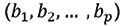

# 第四章：回归

## 学习目标

到本章结束时，你将能够：

+   构建回归问题

+   实现各种类型的回归方法及其用例

+   分析和选择正确的回归方法

+   通过回归的视角连接统计学和机器学习

+   深入探讨模型诊断

在本章中，我们将关注各种类型的回归，以及何时使用哪种类型，同时结合 R 语言中的演示。

## 简介

在上一章中，我们了解了线性回归模型以及输入变量（自变量）和目标变量（因变量或解释变量）之间的线性关系。如果只使用一个变量作为自变量，则定义为**简单线性回归**。如果使用多个解释变量（自变量），则称为**多重线性回归**。

回归算法和问题基于预测一个数值目标变量（通常称为**因变量**），给定所有输入变量（通常称为**自变量**），例如，根据位置、面积、靠近购物中心等因素预测房价。许多回归的概念都源自统计学。

机器学习的整个领域现在是一个数学、统计学和计算机科学的完美平衡。在本章中，我们将使用回归技术来了解如何建立输入和目标变量之间的关系。我们还将强调模型诊断，因为回归充满了假设，在模型应用于现实世界之前需要检查这些假设。

*本质上，所有模型都是错误的，但有些是有用的。 —— 乔治·博克斯*

在第三章“监督学习简介”中，我们简要介绍了简单和多重线性回归。在本章中，我们将更专注于**模型诊断**和其他类型的**回归算法**，以及它与线性回归的不同之处。

## 线性回归

让我们回顾第三章“监督学习简介”中的多重线性回归。以下方程是具有`p`个解释变量和`n`个观测值的线性方程或线性预测函数的数学表示：


其中每个是一个列值的向量（**解释变量**）和是**未知参数**或**系数**。，使这个方程适用于简单线性回归。有许多算法可以将此函数拟合到数据上。最流行的一个是**普通最小二乘法**（**OLS**）。

在理解 OLS 的细节之前，首先让我们解释一下在尝试从第三章，*监督学习简介*中的简单和多元线性回归的模型构建部分拟合北京 PM2.5 数据时得到的方程：

![img/C12624_04_26.jpg]

如果我们代入回归系数的值，和![img/C12624_04_28.png]从`lm()`函数的输出中，我们得到：

![img/C12624_04_29.jpg]

前面的方程试图回答“`DEWP`、`TEMP`和`Iws`这些因素对于预测`pm2.5`水平是否重要？”的问题。

该模型估计了平均而言，`DEWP`、`TEMP`和`Iws`值如何影响`pm2.5`水平。例如，`DEWP`增加一个单位，`pm2.5`值将增加`4.384196`。这就是我们通常将这些系数称为**权重**的原因。需要注意的是，如果**R-squared 值**低，这些估计的系数是不可靠的。

### 练习 50：使用`multiple_PM_25_linear_model`对象打印系数和残差值

在这个练习中，我们将使用`multiple_PM25_linear_model`对象打印系数和残差值。

执行以下步骤以完成练习：

1.  使用`multiple_PM25_linear_model`对象上的`$`运算符提取属性系数：

    ```py
    multiple_PM25_linear_model$coefficients
    ```

    输出如下：

    ```py
    (Intercept)        DEWP        TEMP         Iws 
    161.1512066   4.3841960  -5.1335111  -0.2743375
    ```

1.  使用`multiple_PM25_linear_model`对象上的`$`运算符提取属性残差：

    ```py
    multiple_PM25_linear_model$residuals
    ```

输出如下：

```py
25            26            27            28 
  17.95294914   32.81291348   21.38677872   26.34105878 
           29            30            31            32
```

### 活动 7：不使用汇总函数使用模型对象打印各种属性

在第三章的*多元线性回归模型*部分，*监督学习简介*中，我们创建了一个多元线性回归模型，并将其存储在模型对象`multiple_PM25_linear_model`中，使用模型对象。

此活动有助于理解在模型构建后如何提取一些重要的模型属性。在少数情况下，我们将使用`$`运算符，在其他情况下，我们将进行一些简单的计算。使用`multiple_PM25_linear_model`对象打印以下模型属性：

+   残差

+   拟合值

+   R-Ssquared 值

+   F 统计量

+   系数 p 值

让我们使用模型对象打印这些值：

1.  首先，打印系数值。确保输出类似于使用`coefficients`选项的`summary`函数的输出。这些系数是使用 OLS 算法的模型得到的拟合值：

    ```py
    (Intercept)        DEWP        TEMP         Iws 
    161.1512066   4.3841960  -5.1335111  -0.2743375
    ```

1.  找到预测值和实际值之间的残差（差异），应尽可能小。残差反映了使用系数拟合的值与实际值之间的距离：

    ```py
    25            26            27            28 
      17.95294914   32.81291348   21.38677872   26.34105878 
               29            30            31            32 
    ```

1.  接下来，找到拟合值，这些值应更接近实际的 PM2.5 值以获得最佳模型。使用系数，我们可以计算拟合值：

    ```py
    25         26         27         28         29 
    111.047051 115.187087 137.613221 154.658941 154.414781 
            30         31         32         33         34 
    ```

1.  查找 R-Squared 值。它们应该与你在`summary`函数输出中找到的多个 R-squared 值相同。R-square 有助于评估模型性能。如果值越接近 1，则模型越好：

    ```py
    summary(multiple_PM25_linear_model)$r.squared
    ```

    输出如下：

    ```py
    [1] 0.2159579
    ```

1.  查找 F 统计量值。确保输出与你在`summary`函数旁边找到的 F 统计量文本的输出相同。这将告诉你你的模型是否比仅使用目标变量的均值拟合得更好。在许多实际应用中，F-Statistic 与 p 值一起使用：

    ```py
       value     numdf     dendf 
    3833.506     3.000 41753.000 
    ```

1.  最后，找到系数 p 值，并确保这些值与你在`summary`函数下*系数*部分获得的值相同。它将出现在标题为`Pr(>|t|):`的列下。如果值小于 0.05，则变量在预测目标变量方面具有统计学意义：

    ```py
      (Intercept)          DEWP          TEMP           Iws 
     0.000000e+00  0.000000e+00  0.000000e+00 4.279601e-224
    ```

    #### 注意

    本活动的解决方案可在第 449 页找到。

**普通最小二乘法** (**OLS**)

在*第三章*，*监督学习简介*中，我们看到了平方残差和![img/C12624_04_30.png]（也称为**误差平方和**或**残差平方和**），这是衡量整体模型拟合程度的指标，其表达式如下：

![img/C12624_04_31.jpg]

其中 *T* 代表矩阵转置，而 *X* 的行代表与目标变量的特定值相关的所有输入变量的值![img/C12624_04_32.png]。的值。

自动生成的描述![img/C12624_04_33.png]，该描述最小化了![img/C12624_04_34.png]，被称为β的**OLS 估计量**。OLS 算法旨在找到的全局最小值。

自动生成的描述![img/C12624_04_35.png]，该描述将最小化![img/C12624_04_36.png]。

在上一章中，你也了解到，对于北京 PM2.5 数据集上的`multiple_PM25_linear_model`，其 R-squared 值相当低，以至于这个模型在实用应用中难以发挥作用。解释这些不良结果的一种方式是说预测变量`DEWP`和`TEMP`并没有完全解释 PM2.5 的方差，因此它们未能产生良好的结果。

在我们能够跳入此模型的诊断分析之前，让我们看看是否可以用变量`month`（读数中的月份）来解释 PM2.5 的一些方差。我们还将使用交互变量（更多内容请参阅*改进模型*部分）*DEWP*TEMP*month*，在`lm()`函数中生成`DEWP`、`TEMP`和`month`的所有可能组合。

使用 `month` 的原因在 *第三章* 的 *监督学习简介* 中的 *图 3.3* 中得到了证明，其中我们看到了 `TEMP`、`DEWP` 和 `PRES` 的值中的季节性影响（显示出漂亮的正弦波模式）。以下练习的输出显示了为解释 PM2.5 数据集而创建的所有交互项。

#### 注意

表达式如 `DEWP:TEMP` 表示乘法，并且每个 `month` 的值在 `multiple_PM25_linear_model` 中都是一个独立的变量，因为我们运行模型之前将 `month` 转换成了 `factor`。

### 练习 51：在 lm()函数中添加交互项 DEWP:TEMP:month

在这个练习中，我们将添加交互项以提高模型性能。

我们将看到添加额外的交互项如何有助于提高模型性能，从 R-squared 值的角度来看。执行以下步骤以完成练习：

1.  使用以下命令读取北京 PM2.5 数据集：

    ```py
    PM25 <- read.csv("PRSA_data_2010.1.1-2014.12.31.csv")
    ```

1.  现在，将 `month` 对象转换为 `factor` 变量，如下所示：

    ```py
    PM25$month <- as.factor(PM25$month)
    ```

1.  使用具有 `DEWP`、`TEMP` 和 `month` 的交互项的线性模型。观察 `DEWP*TEMP*month` 项，这将生成 `DEWP`、`TEMP` 和 `month` 变量的所有组合：

    ```py
    multiple_PM25_linear_model <- lm(pm2.5 ~ Iws + DEWP*TEMP*month, data = PM25)
    ```

1.  打印模型的摘要以查看由于交互项而引起的系数和 r-squared 值的变化：

    ```py
    summary(multiple_PM25_linear_model)
    ```

    输出如下：

    ```py
    ## Call:
    ## lm(formula = pm2.5 ~ Iws + DEWP * TEMP * month, data = PM25)
    ## 
    ## Residuals:
    ##     Min      1Q  Median      3Q     Max 
    ## -298.41  -42.77   -9.35   30.91  967.39 
    ## 
    ## Coefficients:
    ##                     Estimate Std. Error t value Pr(>|t|)
    ...
    ## (Intercept)        2.917e+02  4.338e+00  67.257  < 2e-16 ***
    ## Signif. codes:  0 '***' 0.001 '**' 0.01 '*' 0.05 '.' 0.1 ' ' 1
    ## 
    ## Residual standard error: 70.04 on 41708 degrees of freedom
    ##   (2067 observations deleted due to missingness)
    ## Multiple R-squared:  0.4217, Adjusted R-squared:  0.4211 
    ## F-statistic: 633.7 on 48 and 41708 DF,  p-value: < 2.2e-16
    ```

注意 R-squared 值从 0.216 到 0.4217 的两次跳跃。然而，这种跳跃是以**模型可解释性**为代价的。虽然使用单个变量解释模型的可解释性很简单，但它们的乘积会产生难以描述的效果。

在我们北京 PM2.5 的例子中，更合理地认为 `DEWP` 和 `TEMP` 与 `year` 对象的 `month` 对象的交互，因为这两个都是随季节变化的环境因素。

然而，我们还想进行一些诊断，以全面了解线性回归模型是如何从头到尾研究的，而不仅仅是查看 R-squared 值。

## 模型诊断

通常，像线性回归和逻辑回归这样的统计模型在接受最终解决方案之前需要验证许多假设。违反假设的模型会导致错误的预测，结果容易产生误解。

以下代码显示了从 `lm()` 方法的输出中获取诊断图的方法。该图有四个不同的图，查看残差。让我们了解如何解释每个图。所有这些图都是关于拟合如何符合回归假设的。如果有违反，它将在以下代码的图中清楚地显示：

```py
par(mfrow = c(2,2))
plot(multiple_PM25_linear_model)
```

输出如下：


###### 图 4.1：北京 PM2.5 数据集上线性模型拟合的诊断图

在接下来的四个部分中，我们将使用来自线性方程  和二次方程  的随机生成数据探索每个图表，稍后回来解释*图 4.1*中的四个图表与理想情况相比的表现如何。

#### 注意

在二次方程中，  被假定为均值为 0，方差为 2 的正态分布。

在下面的练习中，我们将使用线性方程和二次方程生成图表。稍后，我们将深入理解线性模型应遵循的各种假设，这通过使用通过两个方程生成的随机数据进行的模型拟合来实现。

### 练习 52：使用线性方程和二次方程生成和拟合模型

在这个练习中，我们将了解线性和多项式函数，以及当我们对两者拟合线性模型时会发生什么。

使用线性方程和多项式方程生成随机数，并在两者上拟合线性模型。观察两个图表之间的差异。

执行以下步骤以生成所需的图表：

1.  首先，使用以下代码定义线性函数：

    ```py
    linear_function <- function(x){return (5+(12*x)-(3*x))}
    ```

1.  定义如下命令中的二次函数：

    ```py
    quadratic_function <- function(x){return (5+(12*x)-(3*(x²)))}
    ```

1.  现在，生成如图所示的均匀随机数（`x`）：

    ```py
    uniform_random_x <- runif(50, min=0, max=15)
    ```

1.  使用`x`生成线性值（`y`），如图所示：

    ```py
    linear_values_y <- linear_function(uniform_random_x) + rnorm(50,mean = 0, sd =sqrt(2))
    ```

1.  使用`x`生成二次值（`y`）：

    ```py
    quadratic_values_y <- quadractic_function(uniform_random_x) + rnorm(50,mean = 0, sd =sqrt(2))
    df <- data.frame(linear_values_y, quadratic_values_y, uniform_random_x)
    ```

1.  使用`uniform_random_x`对`linear_values_y`拟合线性模型：

    ```py
    model_df_linear <- lm(linear_values_y ~ uniform_random_x, data = df)
    ```

1.  绘制线性关系的诊断图：

    ```py
    par(mfrow = c(2,2))
    plot(model_df_linear)
    ```

    故事情节如下：

    

    ###### 图 4.2：使用线性回归的图表

1.  使用`uniform_random_x`对`quadratic_values_y`拟合线性模型：

    ```py
    model_df_quad <- lm(quadratic_values_y ~ uniform_random_x, data = df)
    ```

1.  生成非线性关系的诊断：

    ```py
    par(mfrow = c(2,2))
    plot(model_df_quad)
    ```

    输出如下：


###### 图 4.3：使用二次回归的图表

步骤 7 和步骤 9 中的图表差异显示了线性关系的良好和不良拟合。线性模型不能拟合*y*和*x*之间的非线性关系。在下一节中，我们将深入理解步骤 7 和步骤 9 生成的图表的四个部分。

在*第三章*，*监督学习简介*，*图 3.5*中，我们讨论了在构建线性回归模型时需要考虑的各种假设。通过本章前面提到的四个图表，我们将检查是否有任何假设被违反。

## 残差与拟合图

这种图表位于拟合值和残差（`lm()`方法的差异）之间。如果预测变量和目标变量之间存在非线性关系，该图表将帮助我们识别。

在以下图中，上部分图显示了点均匀地散布，预测变量和目标变量之间的线性关系被清楚地捕捉到。在下部分图中，未解释的非线性关系被留在残差和曲线中，因此底部图清楚地显示它不是线性回归模型的正确拟合，违反了预测变量和目标变量之间的线性关系：

![Figure 4.4: [Top] Residual versus fitted plot of the linear function. [Bottom] Residual versus fitted plot of the quadratic function]

![img/C12624_04_04.jpg]

###### 图 4.4：[上] 线性函数的残差与拟合图。[下] 二次函数的残差与拟合图

## 正态 Q-Q 图

**Q-Q 图**，也称为**分位数-分位数图**，用于检查数据是否可能来自近似的理论分布；在本例中，为**正态分布**。Q-Q 图是通过绘制两组分位数（数据中低于一定比例的点）相对比而形成的散点图。如果两组分位数都来自相似的分布，我们应看到点形成一条大致的直线。给定一个数据向量，正态 Q-Q 图按顺序绘制数据与标准正态分布的分位数。

线性回归的第二个假设是所有预测变量都是正态分布的。如果这是真的，残差也将是正态分布的。正态 Q-Q 图是标准化残差与理论分位数之间的图。直观上，我们可以检查残差是否遵循直线，如果是正态分布的，或者是否有任何偏差表明违反了假设。

在以下图中，图的上部分展示了线性函数，它与直线对齐，除了 39 号、30 号和 50 号观测值等少数例外。另一方面，图的下半部分展示了二次函数，它意外地与直线有很好的对齐，不像线性函数，因为图中右上角有一些偏差：

![Figure 4.5: [Top] Normal Q-Q plot of the linear function. [Bottom] Normal Q-Q plot of the quadratic function]

![img/C12624_04_05.jpg]

###### 图 4.5：[上] 线性函数的正态 Q-Q 图。[下] 二次函数的正态 Q-Q 图

## 标度-位置图

**标度-位置图**显示残差是否均匀地分布在输入变量（预测变量）的范围内。也可以用此图来检查方差相等的假设（**同方差性**）。如果我们看到一条水平线，点随机分布，这意味着模型是好的。

该图位于拟合值和标准化残差的平方根之间。在下面的图中，顶部的图显示了线性函数，残差沿着水平线随机分布，而在底部的图中，似乎有一个非随机的模式。因此，方差不相等：

![图 4.6：[上] 线性函数的尺度-位置图。[下] 二次函数的尺度-位置图]

![img/C12624_04_06.jpg]

###### 图 4.6：[上] 线性函数的尺度-位置图。[下] 二次函数的尺度-位置图

## 残差与杠杆

如果数据中存在任何有影响力的点，**残差与杠杆**图有助于识别它。通常认为所有异常点都是有影响力的，即它决定了回归线的形状。然而，并非所有异常点都是有影响力的。即使一个点在合理的值范围内（不是异常点），它仍然可能是有影响力的点。

在下一个图中，我们将关注右上角或右下角的远离值。这些区域是观察值相对于回归线可能具有影响力的空间。在*图 4.7*中，红色虚线外的观察值`40`和`39`（高 Cook 距离）。请注意，这些观察值在其他三个图中也持续出现，这给了我们一个强有力的理由，如果我们想看到数据中的线性关系，就应该消除这些点。顶部的图似乎没有红色虚线，这证实了一个良好的拟合：

![图 4.7：[上] 线性函数的残差与杠杆作用图。[下] 二次函数的残差与杠杆作用图]

![img/C12624_04_07.jpg]

###### 图 4.7：[上] 线性函数的残差与杠杆作用图。[下] 二次函数的残差与杠杆作用图]

现在，如果我们重新审视*图 4.1*，即我们从北京 PM2.5 数据集中获得诊断图；看起来这个模型对于实际应用来说拟合并不是最好的。所有四个图都显示出轻微的违反线性、正态性和同方差性假设。

在下一节中，我们列出了一些改进模型的方法，这些方法可能有助于逐步提高 R 平方值并更好地拟合数据。同样，类似于我们刚才讨论的视觉检查方法，许多统计方法，如用于测试正态性的**Kolmogorov-Smirnov 检验**，用于测试多重共线性的**相关系数**，用于测试同方差的**Goldfeld-Quandt 检验**，都可以使用。

## 改进模型

到目前为止，我们已经看到了数据中的问题，但你可能会问是否可以修复或改进它。让我们讨论一些改进的方法。在本节中，你将学习一些方法，例如变量转换、处理异常点、添加交互作用以及决定采用非线性模型。

### 转换预测变量或目标变量

提高模型的最常见方法是使用对数函数变换一个或多个变量（也可能是目标变量）。

对数变换可以纠正偏斜分布。它提供了处理数据中偏斜性的能力，同时一旦建立模型，原始值就可以很容易地计算出来。最流行的对数变换是自然对数。关于对数变换的更详细解释，可以在*第六章*的*特征选择和降维*部分的*对数变换*部分找到。

目标是通过变换将数据中的正态分布引入。因此，任何有助于达到这一目标的函数都是一种好的变换。在取对数之后，平方根变换也被广泛使用。查看变换后变量的分布，看看是否得到了对称分布（钟形）；如果是，那么这种变换将是有用的。

### 选择非线性模型

可能会遇到一种情况，线性模型并不适合，因为预测变量和目标变量之间存在非线性关系，只有非线性函数才能拟合这样的数据。关于此类模型的更多细节，请参阅本章后面的*多项式回归*部分。

### 移除异常值或影响点

正如我们在*残差与杠杆率*部分的诊断图中讨论的那样，我们可能会发现一个异常值或影响点在获得最佳模型时起到了破坏作用。如果你已经正确地识别了它，尝试通过删除观测值来看是否有所改善。

### 添加交互效应

有时我们可能会看到数据集中两个或更多预测（独立）变量的值以乘法方式影响因变量。一个带有交互项的线性回归方程可能看起来像这样：


可以尝试更高阶的这种交互（例如，使用三个变量）；然而，这些很难解释，通常会被避免。

## 分位数回归

当数据出现异常值、高偏度和导致异方差性的条件时，我们采用分位数回归进行建模。此外，分位数回归回答的一个关键问题是，线性回归无法回答的：“对于高 PM2.5 和平均 PM2.5，`DEWP`、`TEMP`和`Iws`对 PM2.5 水平的影响是否不同？”

分位数回归与线性回归非常相似；然而，分位数回归参数估计的是由于输入预测变量单位变化而产生的`响应`变量某个分位数的改变。为了完全理解这个陈述，让我们使用分位数回归（不使用交互项）来拟合我们的北京数据。

我们需要安装`quantreg`包来将分位数回归拟合到数据中。该包提供了`rq()`方法，使用`tau`参数拟合数据，`tau`是模型参数，指定用于拟合模型到数据中的分位数值。注意，`rq()`方法的参数的其他部分看起来与`lm()`类似。

### 练习 53：在北京 PM2.5 数据集上拟合分位数回归

在这个练习中，我们将观察在不同分位数（尤其是 25 分位数、50 分位数和 75 分位数）处的分位数回归拟合的差异。我们将使用`quantreg`中的`rq()`函数来构建模型。在*图 4.8*中，我们将比较通过`lm()`函数获得的系数值与通过`rq()`函数获得的系数值，以比较两种回归类型。

执行以下步骤来完成练习：

1.  使用以下命令读取北京 PM2.5 数据集：

    ```py
    PM25 <- read.csv("PRSA_data_2010.1.1-2014.12.31.csv")
    ```

1.  接下来，下一步是安装所需的包。使用以下命令加载`quantreg`包：

    ```py
    library(quantreg)
    ```

1.  运行分位数回归 tau 值为 0.25、0.5 和 0.75，分别对应 25 分位数、50 分位数和 75 分位数：

    ```py
    quantile_regression_PM25_all <- rq(pm2.5 ~ DEWP+TEMP+Iws, data = PM25, tau = seq(0.25,0.99,by = 0.25))
    ```

1.  打印分位数回归模型的摘要：

    ```py
    summary(quantile_regression_PM25_all)
    ```

    输出如下：

    ```py
    ## tau: [1] 0.25
    ## 
    ## Coefficients:
    ##             Value     Std. Error t value   Pr(>|t|) 
    ## (Intercept)  63.62367   0.52894  120.28453   0.00000
    ## DEWP          2.08932   0.01859  112.39914   0.00000
    ## TEMP         -1.89485   0.02196  -86.27611   0.00000
    ## Iws          -0.09590   0.00179  -53.59211   0.00000
    ## 
    ## tau: [1] 0.5
    ## 
    ## Coefficients:
    ##             Value      Std. Error t value    Pr(>|t|)  
    ## (Intercept)  117.37344    0.73885  158.85921    0.00000
    ## DEWP           3.43276    0.02835  121.07849    0.00000
    ## TEMP          -3.37448    0.03225 -104.65011    0.00000
    ## Iws           -0.16659    0.00202  -82.56604    0.00000
    ## 
    ## tau: [1] 0.75
    ## 
    ## Coefficients:
    ##             Value      Std. Error t value    Pr(>|t|)  
    ## (Intercept)  201.16377    1.31859  152.55927    0.00000
    ## DEWP           5.12661    0.04901  104.59430    0.00000
    ## TEMP          -5.62333    0.05567 -101.01841    0.00000
    ## Iws           -0.25807    0.00510  -50.55327    0.00000
    ```

以下表格总结了我们在第三章“监督学习简介”的“回归”部分使用`lm()`获得的线性回归系数值，以及我们使用`rq()`在三个分位数获得的值。

根据线性回归模型，大气中 PM2.5 的平均水平随着`DEWP`增加一个单位而增加`4.384196`。分位数回归的结果如下表所示，并且它表明`DEWP`对 PM2.5 的高分位数（观察 75 分位数）有更大的负面影响：


###### 图 4.8：25 分位数、50 分位数、75 分位数分位数回归的系数估计以及北京 PM2.5 估计模型的线性回归系数估计

### 练习 54：使用更细粒度绘制各种分位数

在这个练习中，我们不会使用第 25、50 和 75 分位数，而是会在`rq`函数中使用更细粒度的 tau 值。这个图表将有助于可视化系数值根据分位数值的变化。使用 R 中的`seq()`函数，从 0.05 开始设置分位数值，增量是 0.05。

执行以下步骤来完成练习：

1.  创建一个`quantile_regression_PM25_granular`变量：

    ```py
    quantile_regression_PM25_granular <- rq(pm2.5 ~ DEWP + TEMP + Iws, data = PM25, tau = seq(0.05,0.95,by = 0.05))
    ```

1.  现在，使用`summary`函数存储先前创建的变量的值：

    ```py
    plot_granular <- summary(quantile_regression_PM25_granular)
    ```

1.  让我们使用以下命令来绘制图表。观察不同 tau 值时，`Intercept`、`DEWP`、`TEMP`和`Iws`的值如何变化：

    ```py
    plot(plot_granular)
    ```

    输出图表如下：


###### 图 4.9：显示了不同分位数下 DEWP、TEMP 和 Iws 的系数的各种值

在这个练习中，我们通过在`rq`函数中使用更细粒度的 tau 值来探索变量的粒度。上一张图显示了`DEWP`、`TEMP`和`Iws`的系数的各种值。图中 X 轴表示分位数。单条虚线表示分位数回归的估计，灰色区域是置信区间。中间的灰色线是 OLS 系数估计的表示，双虚线显示 OLS 系数的置信区间。观察发现红色和灰色区域没有重叠，这证明了我们使用分位数回归的正确性。如果两条线重叠，那么使用 OLS 和分位数回归的估计就没有差异。

#### 注意

我们并不声称分位数回归比线性回归给出更好的结果。这个模型的调整 R 平方值仍然很低，但在现实世界中它工作得很好。然而，我们声称分位数回归可以帮助估计 PM2.5 的不同水平，而不仅仅是平均值，这为具有异常值、高偏度和异方差性的数据提供了稳健的解释。

## 多项式回归

在现实世界的数据中，响应变量和预测变量往往没有线性关系，我们可能需要一个**非线性多项式函数**来拟合数据。各种散点图样的残差与每个预测变量和残差与拟合值的对比揭示了是否存在违反线性关系的情况，这可能会帮助识别在方程中引入二次或三次项的需要。以下是一个通用的多项式方程：


其中*k*是多项式的次数。对于*k=2*，*f(X)*被称为**二次**，*h=4*被称为**三次**。请注意，多项式回归仍然被认为是线性回归，因为它在系数。

在重新审视北京 PM2.5 的例子之前，让我们通过使用我们在*线性回归*部分介绍的二项式方程的模拟数据来理解多项式回归是如何工作的。

### 练习 55：使用 runif()函数执行均匀分布

在这个练习中，我们将使用 R 中的`runif()`函数生成 50 个来自均匀分布的随机数，并将结果存储在`uniform_random_x`中。我们已经定义了一个使用之前二次方程生成值的函数。请注意，我们将单独添加到函数返回的值；是使用 R 中的`rnorm()`函数从正态分布生成的。最终值将被存储在`quadratic_values_y`中：

执行以下步骤以使用`runif()`函数进行均匀分布：

1.  首先，定义以下命令中所示的二次方程：

    ```py
    quadratic_function <- function(x){return (5+(12*x)-(3*(x²)))}
    ```

1.  现在，生成`x`的均匀随机数：

    ```py
    uniform_random_x <- runif(50, min=0, max=15)
    ```

1.  将误差项添加到二次方程中，该误差项是均值为`0`、方差为`2`的正态分布（*标准差(sd) = 方差的平方根*）：

    ```py
    quadratic_values_y <- quadratic_function(uniform_random_x) + rnorm(50,mean = 0, sd =sqrt(2))
    ```

1.  要将数据存储在数据框中，请使用以下命令：

    ```py
    df <- data.frame(quadratic_values_y,uniform_random_x)
    ```

1.  现在，根据二次方程绘制`x`和`y`之间的关系图：

    ```py
    library(ggplot2)
    ggplot(df, aes(x=uniform_random_x,y=quadratic_values_y))+
      geom_point()
    ```

    输出如下：

    

    ###### 图 4.10：使用函数 runif()进行均匀分布

    下一个图清楚地显示了`uniform_random_x`和`quadratic_values_y`之间的关系不是线性的，正如预期的那样。现在，如果我们尝试拟合一个线性模型，我们预计会在诊断图中看到一些问题。

    *图 4.12*中的残差与拟合值图显示了曲率，并且它们没有像之前看到的那样表现出均匀的随机性。此外，**正态概率图**（**NPP**）似乎偏离了直线，并在远端百分位数处向下弯曲。这些图表明所使用的模型可能存在问题，并表明可能需要一个更高阶的模型。

    

    ###### 图 4.11：该图显示了均匀生成的随机数(x)与二次方程中 x 的值的非线性关系

1.  现在，将线性回归模型拟合到多项式（二次）方程，并显示诊断图：

    ```py
    par(mfrow = c(2,2))
    plot(lm(quadratic_values_y~uniform_random_x,data=df))
    ```

    输出如下：

    

    ###### 图 4.12：使用 lm()方法对二次方程数据拟合的诊断图

    现在，让我们看看多项式回归在北京 PM2.5 数据集上的表现。我们引入了一个额外的二次项 `DEWP²`，这仅仅是 `DEWP` 的平方。请参考第三章，*监督学习导论*中的*图 3.5*，以证明添加这样一个高阶项的合理性。

1.  在北京 PM2.5 数据集上使用多项式回归（二次和三次项）：

    ```py
    multiple_PM25_poly_model <- lm(pm2.5 ~ DEWP² + TEMP + Iws + DEWP*TEMP*month, data = PM25)
    ```

1.  要打印模型摘要，请使用以下命令：

    ```py
    summary(multiple_PM25_poly_model)
    ```

    输出如下：

    ```py
    ## Residuals:
    ##     Min      1Q  Median      3Q     Max 
    ## -298.41  -42.77   -9.35   30.91  967.39 
    ## 
    ## Coefficients:
    ##                     Estimate Std. Error t value Pr(>|t|)    
    ## (Intercept)        2.917e+02  4.338e+00  67.257  < 2e-16 ***
    ## DEWP               1.190e+01  2.539e-01  46.879  < 2e-16 ***
    ## TEMP              -9.830e+00  8.806e-01 -11.164  < 2e-16 ***
    ## Iws               -1.388e-01  7.707e-03 -18.009  < 2e-16 ***
    ## month2            -2.388e+01  5.011e+00  -4.766 1.89e-06 ***
    ## month3            -1.228e+02  5.165e+00 -23.780  < 2e-16 ***
    ## DEWP:TEMP:month9   4.455e-01  6.552e-02   6.800 1.06e-11 ***
    ## DEWP:TEMP:month10  5.066e-01  5.862e-02   8.642  < 2e-16 ***
    ## DEWP:TEMP:month11  5.111e-02  5.526e-02   0.925  0.35500    
    ## DEWP:TEMP:month12  1.492e-01  6.599e-02   2.261  0.02375 *  
    ## ---
    ## Signif. codes:  0 '***' 0.001 '**' 0.01 '*' 0.05 '.' 0.1 ' ' 1
    ## 
    ## Residual standard error: 70.04 on 41708 degrees of freedom
    ##   (2067 observations deleted due to missingness)
    ## Multiple R-squared:  0.4217, Adjusted R-squared:  0.4211 
    ## F-statistic: 633.7 on 48 and 41708 DF,  p-value: < 2.2e-16
    ```

    观察到尽管增加了二次项，但我们并没有比线性模型获得任何更好的 R-squared 值。在这个时候，我们可能得出结论，PM2.5 预测需要一个更好的自变量，它可以解释其中的方差，从而使 R-squared 值达到更高的水平。诊断图似乎也有类似的解释。

1.  使用以下命令绘制诊断图：

    ```py
    par(mfrow = c(2,2))
    plot(multiple_PM25_poly_model)
    ```

    输出如下：


###### 图 4.13：北京 PM2.5 数据集上多项式回归模型拟合的诊断图

## Ridge Regression

正如我们在线性回归中看到的，**普通最小二乘法**（**OLS**）通过最小化残差平方和来估计的值。

由于是从给定样本中计算出的一个估计值，它不是一个*真实的人口参数*，我们需要注意估计的某些特性。这两个主要特性是偏差和方差。

如果是在，然后测试数据集上的平均（或期望）可以分解为三个量，方差、平方偏差以及误差项的方差，如以下方程所示：


对于最佳估计，应同时实现低偏差和低方差的一个合适算法，如 OLS。我们通常称之为**偏差-方差**权衡。以下图中所示的流行牛眼图有助于理解权衡的各种情况：


###### 图 4.14：解释偏差和方差场景的流行牛眼图

牛眼代表 OLS 试图估计的真实人口值，而对其的射击则是我们四个不同估计器的估计值。这些被广泛归类为以下几类：

+   低偏差和低方差（最理想）

+   低偏差和高方差

+   高偏差和低方差

+   高偏差和高方差（最不理想）

OLS 方法将所有变量视为同等可能，因此具有低偏差（在训练期间导致**欠拟合**）和高方差（在测试数据中导致**预测误差**），如*图 4.11*所示。这种行为对于获得最佳模型复杂度并不理想。解决这个问题的通用方法是牺牲一些偏差来降低方差。这种方法被称为正则化。因此，岭回归可以被视为线性回归的扩展，其中包含一个额外的正则化项。

多元线性回归的一般形式可以表示如下：


其中，**argmin**表示使函数达到最小值的βs 的最小值。在此上下文中，它找到使 RSS 最小的βs。βs 受到以下约束：


### 正则化项 – L2 范数


岭回归的惩罚项在 RSS 增加时增加。以下图表显示了**模型复杂度**（预测变量数量）与**误差**之间的关系。它表明，当预测变量的数量增加（模型复杂度增加）时，**方差**上升，而**偏差**下降。

OLS 估计在右侧找到一个位置，远离最佳权衡点。这种情况需要引入正则化项，因此岭回归成为合适的模型选择：


###### 图 4.15：偏差与方差

岭回归的 OLS 损失函数可以表示为以下方程：


最小化函数具有提供岭回归估计的正则化项。这个损失函数的有趣特性是，当变得更大时，方差减少，偏差增加。

### 练习 56：北京 PM2.5 数据集上的岭回归

这个练习在 PM2.5 数据集上拟合岭回归。我们将使用`glmnet`库的交叉验证函数`cv.glmnet()`，参数`alpha = 0`和变化的 lambda 值。目标是获得一个最佳的 lambda 值，它将被函数输出的`lambda.min`属性返回。

让我们执行以下步骤来完成练习：

1.  加载`glmnet`库并对 PM25 DataFrame 进行预处理：

    ```py
    library(glmnet)
    PM25 <- na.omit(PM25)
    X <- as.matrix(PM25[,c("DEWP","TEMP","Iws")])
    Y <- PM25$pm2.5
    ```

1.  现在，让我们使用以下代码来设置`seed`以获得类似的结果：

    ```py
    set.seed(100)
    model_ridge = cv.glmnet(X,Y,alpha = 0,lambda = 10^seq(4,-1,-0.1))
    ```

1.  要在交叉验证后找到 lambda 的最佳值，请执行以下命令：

    ```py
    optimal_lambda <- model_ridge$lambda.min
    ```

1.  模型拟合的系数值：

    ```py
    ridge_coefficients <- predict(model_ridge, s = optimal_lambda, type = "coefficients")
    ridge_coefficients
    ```

    输出如下：

    ```py
    ## 4 x 1 sparse Matrix of class "dgCMatrix"
    ##                       1
    ## (Intercept) 160.7120263
    ## DEWP          4.3462480
    ## TEMP         -5.0902943
    ## Iws          -0.2756095
    ```

1.  使用`predict`函数再次传递矩阵 X 到`newx`参数：

    ```py
    ridge_prediction <- predict(model_ridge, s = optimal_lambda, newx = X)
    head(ridge_prediction)
    ```

    输出如下：

    ```py
             1
    25 111.0399
    26 115.1408
    27 137.3708
    28 154.2625
    29 154.0172
    30 158.8622
    ```

我们看到如何使用`glmnet`库来拟合北京 PM2.5 数据集。

## LASSO 回归

**最小绝对收缩和选择算子**（**LASSO**）的结构与岭回归相似，除了惩罚项不同，在 LASSO 回归中是 L1（系数估计值的绝对值之和），而在岭回归中是 L2（系数平方之和）：


LASSO 回归将一些系数设为零，从而消除了特定变量的影响。这使得它在拟合数据的同时进行特征选择变得高效。

### 练习 57：LASSO 回归

在这个练习中，我们将对北京 PM2.5 数据集应用 LASSO 回归。我们将使用相同的 `cv.glmnet()` 函数来找到最优的 lambda 值。

执行以下步骤以完成练习：

1.  首先，让我们设置 `seed` 以使用以下命令获得相似的结果：

    ```py
    set.seed(100) #Setting the seed to get similar results.
    model_LASSO = cv.glmnet(X,Y,alpha = 1,lambda = 10^seq(4,-1,-0.1))
    ```

1.  现在，使用以下命令在交叉验证后找到 lambda 的最佳值：

    ```py
    optimal_lambda_LASSO <- model_LASSO$lambda.min
    ```

1.  执行以下命令从模型拟合中找到系数值：

    ```py
    LASSO_coefficients <- predict(model_LASSO, s = optimal_lambda_LASSO, type = "coefficients")
    LASSO_coefficients
    ```

    输出如下：

    ```py
    ## 4 x 1 sparse Matrix of class "dgCMatrix"
    ##                       1
    ## (Intercept) 160.4765008
    ## DEWP          4.3324461
    ## TEMP         -5.0725046
    ## Iws          -0.2739729
    ```

1.  使用以下命令从模型中找到预测值：

    ```py
    LASSO_prediction <- predict(model_LASSO, s = optimal_lambda_LASSO, newx = X)
    head(LASSO_prediction)
    ```

    输出如下：

    ```py
              1
    25 110.9570
    26 115.0456
    27 137.2040
    28 154.0434
    29 153.7996
    30 158.6282
    ```

观察岭回归和 LASSO 回归预测的相似性。北京 PM2.5 数据集在这两种方法中显示没有差异。

## 弹性网络回归

**弹性网络**结合了岭回归和 LASSO 回归的惩罚项，以避免在变量选择（系数值趋向于零，从而保持高度相关变量受控）上过度依赖数据。弹性网络最小化以下损失函数：


其中参数 `α` 控制岭回归和 LASSO 之间的正确混合。

总结来说，如果一个模型具有许多预测变量或相关变量，引入正则化项有助于在减少方差的同时优化偏差，从而在模型复杂性和误差之间达到正确的平衡。*图 4.16* 提供了一个流程图，帮助人们选择在多元回归、岭回归、LASSO 回归和弹性网络回归之间的选择：


###### 图 4.16：选择标准以在多元回归、岭回归、LASSO 回归和弹性网络回归之间进行选择

### 练习 58：弹性网络回归

在这个练习中，我们将对北京 PM2.5 数据集执行弹性网络回归。

执行以下步骤以完成练习：

1.  让我们先设置 `seed` 以使用以下命令获得相似的结果：

    ```py
    set.seed(100)
    model_elanet = cv.glmnet(X,Y,alpha = 0.5,lambda = 10^seq(4,-1,-0.1))
    ```

1.  现在，使用以下命令在交叉验证后找到 lambda 的最佳值：

    ```py
    optimal_lambda_elanet <- model_LASSO$lambda.min
    ```

1.  接下来，执行以下命令从模型拟合中找到系数值：

    ```py
    elanet_coefficients <- predict(model_elanet, s = optimal_lambda_elanet, type = "coefficients")
    elanet_coefficients
    ```

    输出如下：

    ```py
    ## 4 x 1 sparse Matrix of class "dgCMatrix"
    ##                       1
    ## (Intercept) 160.5950551
    ## DEWP          4.3393969
    ## TEMP         -5.0814722
    ## Iws          -0.2747902
    ```

1.  使用以下命令从模型中找到预测值：

    ```py
    elanet_prediction <- predict(model_elanet, s = optimal_lambda_elanet, newx = X)
    ```

    输出如下：

    ```py
    25 110.9987
    26 115.0936
    27 137.2880
    28 154.1538
    29 153.9092
    30 158.7461
    ```

弹性网络回归（Elastic Net Regression）的预测结果与岭回归（ridge regression）和 LASSO 回归大致相同。在下一节中，我们将比较这三种方法。

### 系数和残差标准误差的比较

以下表格显示了 `DEWP`、`TEMP` 和 `Iws` 的比较，数值之间没有太大差异，这表明岭回归、LASSO 和弹性网络回归（带有正则化项）并不比多重线性回归方法更好。这也表明 `DEWP`、`TEMP` 和 `Iws` 是低相关或无相关的自变量：


###### 图 4.17：线性、岭回归、LASSO 和弹性网络回归的残差标准误差比较

以下图表显示了使用线性、岭回归、LASSO 和弹性网络回归的截距和 DEWP、TEMP 以及 Iws 变量的系数值的比较：


###### 图 4.18：线性、岭回归、LASSO 和弹性网络回归系数值的比较

### 练习 59：计算线性、岭回归、LASSO 和弹性网络回归的 RSE

在这个练习中，我们将计算线性、岭回归、LASSO 和弹性网络回归的 RSE。

执行以下步骤以完成练习：

1.  使用以下代码使用 `Iws`、`DEWP` 和 `TEMP` 变量拟合线性模型：

    ```py
    multiple_PM25_linear_model <- lm(pm2.5 ~ Iws + DEWP + TEMP, data = PM25)
    ```

1.  现在，使用以下命令来查找线性回归的**残差标准误差**（**RSE**）：

    ```py
    sqrt(sum(multiple_PM25_linear_model$residuals²)/41753)
    ```

    输出如下：

    ```py
    ## [1] 81.51
    ```

    同样，我们将找到剩余回归的 RSE。

1.  岭回归的 RSE：

    ```py
    sqrt(sum((Y-ridge_prediction)²)/41753)
    ```

    输出如下：

    ```py
    ## [1] 81.51059
    ```

1.  LASSO 回归的 RSE：

    ```py
    sqrt(sum((Y-LASSO_prediction)²)/41753)
    ```

    输出如下：

    ```py
    ## [1] 81.51123
    ```

1.  弹性网络回归的 RSE：

    ```py
    sqrt(sum((Y-elanet_prediction)²)/41753)
    ```

    输出如下：

    ```py
    ## [1] 81.51087
    ```

这表明所有三个的 RSE 并没有显著差异。

## 泊松回归

在线性回归中，我们看到了以下形式的方程：


在 `Y` 是一个计数或比率（`Y/t`），它具有**泊松分布**，期望（均值）计数为  ，等于 ，即方差。

在逻辑回归的情况下，我们会寻找可以最大化对数似然值的值，以获得系数的**最大似然估计器**（**MLEs**）。

没有封闭形式的解，因此最大似然估计的估计将使用迭代算法，如**牛顿-拉夫森**和**迭代加权最小二乘法**（**IRWLS**）。

泊松回归适用于计数依赖变量，必须满足以下指南：

+   它遵循泊松分布

+   计数不能为负

+   数值是整数（没有分数）

    #### 注意

    这里用于演示泊松回归的数据集来自 A. Colin Cameron 和 Per Johansson，"*使用级数展开的计数数据回归：应用*"，应用计量经济学杂志，第 12 卷，第 3 期，1997 年，第 203-224 页。

以下表格简要描述了变量：


###### 图 4.19：来自澳大利亚健康调查数据集的变量及其描述

#### 注意

博客 [`www.econ.uiuc.edu/~econ508/Stata/e-ta16_Stata.html`](http://www.econ.uiuc.edu/~econ508/Stata/e-ta16_Stata.html) 展示了数据集的使用方法。

### 练习 60：执行泊松回归

在这个练习中，我们将对数据集进行泊松回归。

执行以下步骤以完成练习：

1.  执行泊松回归，加载`foreign`库以读取`dta`数据：

    ```py
    library(foreign)
    ```

1.  使用`foreign`库中的`read.data`函数读取澳大利亚健康调查数据集：

    ```py
    df_health <- read.dta("health.dta")
    ```

1.  使用`glm()`函数拟合广义线性模型，其中泊松回归作为家族参数中的值：

    ```py
    poisson_regression_health <- glm(NONDOCCO ~ ., data = df_health, family=poisson(link=log))
    ```

1.  打印模型的摘要：

    ```py
    summary(poisson_regression_health)
    ```

    输出如下：

    ```py
    ## Coefficients:##              Estimate Std. Error z value Pr(>|z|)    
    ## (Intercept) -3.116128   0.137763 -22.620  < 2e-16 ***
    ## SEX          0.336123   0.069605   4.829 1.37e-06 ***
    ## AGE          0.782335   0.200369   3.904 9.44e-05 ***
    ## INCOME      -0.123275   0.107720  -1.144 0.252459    
    ## LEVYPLUS     0.302185   0.097209   3.109 0.001880 ** 
    ## FREEPOOR     0.009547   0.210991   0.045 0.963910    
    ## FREEREPA     0.446621   0.114681   3.894 9.84e-05 ***
    ## ILLNESS      0.058322   0.021474   2.716 0.006610 ** 
    ## ACTDAYS      0.098894   0.006095  16.226  < 2e-16 ***
    ## HSCORE       0.041925   0.011613   3.610 0.000306 ***
    ## CHCOND1      0.496751   0.086645   5.733 9.86e-09 ***
    ## CHCOND2      1.029310   0.097262  10.583  < 2e-16 ***
    ## ---
    ## Signif. codes:  0 '***' 0.001 '**' 0.01 '*' 0.05 '.' 0.1 ' ' 1
    ## 
    ## (Dispersion parameter for poisson family taken to be 1)
    ## 
    ##     Null deviance: 6127.9  on 5189  degrees of freedom
    ## Residual deviance: 5052.5  on 5178  degrees of freedom
    ## AIC: 6254.3
    ## 
    ## Number of Fisher Scoring iterations: 7
    ```

1.  加载`ggplot2`库：

    ```py
    library(ggplot2)
    ```

1.  将`NONDOCCO`的实际值与泊松回归拟合的`NONDOCCO`值合并：

    ```py
    df_pred_actual <- data.frame(cbind(df_health$NONDOCCO,poisson_regression_health$fitted.values))
    ```

1.  命名列名：

    ```py
    colnames(df_pred_actual) <- c("actual_NONDOCCO","predicted_NONDOCCO")
    ```

1.  绘制`NONDOCCO`目标变量的实际值与预测值的对比图：

    ```py
    ggplot(df_pred_actual, aes(x=actual_NONDOCCO, y =predicted_NONDOCCO))+
       geom_point()
    ```

    输出图表如下：


###### 图 4.20：比较实际值和预测值 NONDOCCO

给定残差偏差统计量的值为 5052.5，自由度为 5178，p 值为零，且*5052.5/5178 = 0.975*小于 1，因此模型在某种程度上是有效的。我们还可以检查过度分散（数据集中比基于给定统计模型预期的更大变异性）。过度分散是通过将`sample_variance`除以`sample_mean`来计算的。让我们检查以下练习。

### 练习 61：计算过度分散

在这个练习中，我们将对数据集进行过度分散的计算。

执行以下步骤以完成练习：

1.  首先，让我们使用以下命令找到样本均值：

    ```py
    s_mean <- mean(df_health$NONDOCCO)
    s_mean
    ```

    输出如下：

    ```py
    ## [1] 0.2146435
    ```

1.  现在，使用以下命令查找样本方差：

    ```py
    s_variance <- var(df_health$NONDOCCO)
    s_variance
    ```

    输出如下：

    ```py
    ## [1] 0.931757
    ```

1.  同样，可以使用以下命令计算过度分散：

    ```py
    s_variance/s_mean
    ```

    输出如下：

    ```py
    ## [1] 4.34095
    ```

    因此，即使我们尝试添加预测变量到模型拟合中，过度分散开始下降。在我们的例子中，分散度在合理范围内。

1.  现在，让我们使用以下命令计算分散度：

    ```py
    summary.glm(poisson_regression_health)$dispersion
    ```

    输出如下：

    ```py
    ## [1] 1
    ```

然而，在分散超过限制的情况下，更高阶的泊松回归是一个合适的解决方案。考虑到本书的范围，我们不会在这里详细探讨此类模型。感兴趣的读者可以阅读有关基线密度泊松（**p 阶泊松多项式**（**PPp**）模型）的更多内容。

## Cox 比例风险回归模型

Cox 回归模型的基础来自生存分析，一组有助于调查事件发生时间的统计方法。以下是一些例子：

+   将潜在客户转化为销售的时间

+   从使用开始到产品故障的时间

+   从保险单开始到死亡的时间

+   从诊断到死亡的时间

+   产品保修索赔的时间

+   从客户注册开始的时间

所有这些例子都是生存分析的一些用例。在大多数生存分析中，有三种广泛使用的方法用于执行此类时间至事件分析：

+   用于分析不同组的 Kaplan-Meier 生存曲线

+   用于比较两个或更多生存曲线的对数秩检验

+   Cox 比例风险回归用于描述变量对生存的影响

考虑到本章和本书的范围，我们将只关注 Cox 比例风险回归。基本思想是前两种方法仅有助于进行单变量分析，换句话说，您只能理解一个因素对时间至事件的影响，而 Cox 回归有助于评估多个因素对生存时间的影响。此外，Cox 回归对分类和数值因素都同样有效，而前两种方法仅适用于分类因素。

Cox 模型由表示死亡风险的危害函数 `h(t)` 表示，在医学研究中，它主要被使用，表示在时间 `t` 死亡的风险：


从这个方程中可以观察到以下几点：

+   `t` 表示生存时间。

+   `h(t)` 表示由 `p` 个协变量确定的风险函数 。在生存分析中，协变量是用来描述预测变量的术语。

+   系数  表示协变量的影响。

+   术语  被称为时间 t 的基线危害。如果所有系数都为零 ， 就成为危害函数的值。

这个函数看起来与逻辑回归（使用指数项）有些相似，这将在 *第五章*，*分类* 中详细讨论。我们逻辑上把本书中讨论的所有监督学习算法分为 `是/否`，`1/0`），但忽略了事件的时间。

如您从危害函数中观察到的，生存模型包括：

+   表示事件发生时间的连续变量

+   一个表示事件是否发生的二元变量

## NCCTG 肺癌数据

**NCCTG 肺癌数据**（来自晚期肺癌患者的生存数据）来自 *North Central Cancer Treatment Group*。这些数据包括一些元数据，例如收集数据的机构、患者的年龄、性别等。该数据集中的性能评分衡量患者进行日常活动的能力。在任何生存分析数据集中，最重要的变量是关于 **事件时间** 的 *知识*，例如，死亡时间。

生存分析通常定义为一种检查数据的方法，其中结果变量是感兴趣事件发生的时间。


###### 图 4.21：北中癌症治疗组的变量及其描述

在下一个练习中，我们将学习如何使用`survival`包中的`Surv`方法创建生存对象。请注意，在添加生存对象后，数据集的摘要中创建了两个额外的变量`SurvObject.time`和`SurvObject.status`，它们存储关于事件发生时间（死亡时间）的信息，这随后成为**Cox 比例风险回归模型**的因变量。

当患者生存时间周围的指示数量稀少时，观察结果会被**截尾**。通常，最常见的形式是右侧截尾。假设我们正在跟踪一项为期 20 周的研究。在研究期间未经历感兴趣事件的病人可以被称为右侧截尾。该人的生存时间至少是研究持续时间；在这种情况下，20 周。

### 练习 62：使用 Cox 回归探索 NCCTG 肺癌数据

在这个练习中，我们将使用 Cox 回归探索 NCCTG 肺癌数据。

执行以下步骤以完成练习：

1.  导入`survival`库：

    ```py
    library(survival)
    ```

1.  导入肺癌数据：

    ```py
    df_lung_cancer <- lung
    ```

1.  使用`head`函数打印数据集：

    ```py
    head(df_lung_cancer)
    ```

    输出如下：

    ```py
    ##   inst time status age sex ph.ecog ph.karno pat.karno meal.cal wt.loss
    ## 1    3  306      2  74   1       1       90       100     1175      NA
    ## 2    3  455      2  68   1       0       90        90     1225      15
    ## 3    3 1010      1  56   1       0       90        90       NA      15
    ## 4    5  210      2  57   1       1       90        60     1150      11
    ## 5    1  883      2  60   1       0      100        90       NA       0
    ## 6   12 1022      1  74   1       1       50        80      513       0
    ```

1.  肺癌数据中，`status == 2` 代表死亡：

    ```py
    df_lung_cancer$SurvObject <- with(df_lung_cancer, Surv(time, status == 2))
    ```

1.  找到 Cox 比例风险回归模型：

    ```py
    cox_regression <- coxph(SurvObject ~ age + sex + ph.karno + wt.loss, data =  df_lung_cancer)
    cox_regression
    ```

    输出如下：

    ```py
    ## Call:
    ## coxph(formula = SurvObject ~ age + sex + ph.karno + wt.loss, 
    ##     data = df_lung_cancer)
    ## 
    ## 
    ##              coef exp(coef) se(coef)     z      p
    ## age       0.01514   1.01525  0.00984  1.54 0.1238
    ## sex      -0.51396   0.59813  0.17441 -2.95 0.0032
    ## ph.karno -0.01287   0.98721  0.00618 -2.08 0.0374
    ## wt.loss  -0.00225   0.99776  0.00636 -0.35 0.7239
    ## 
    ## Likelihood ratio test=18.8  on 4 df, p=0.000844
    ## n= 214, number of events= 152 
    ##    (14 observations deleted due to missingness)
    ```

本练习演示了使用生存库的 Cox 比例风险回归模型。

## 摘要

在本章中，我们在上一章简要介绍线性回归之后，对其进行了更详细的讨论。当然，关于线性回归的讨论导致了一系列诊断，为讨论其他类型的回归算法提供了方向。分位数、多项式、岭回归、LASSO 和弹性网络，所有这些都是从线性回归中派生出来的，区别在于线性回归存在一些局限性，而每个算法都帮助克服了这些局限性。泊松回归和 Cox 比例风险回归模型作为回归算法的特殊情况出现，分别适用于计数和事件发生时间依赖变量，而其他算法适用于任何定量依赖变量。

在下一章中，我们将探讨第二常用的机器学习算法及其相关问题。你还将更详细地了解分类。*第五章*，*分类*，与本章类似，旨在详细介绍从**决策树**到**深度神经网络**的分类算法。
