# *第六章：*

# 特征选择和降维

## 学习目标

到本章结束时，你将能够：

+   实施特征工程技术，如离散化、独热编码和转换

+   使用单变量特征选择、相关矩阵和基于模型的特征重要性排序在真实世界数据集上执行特征选择方法

+   使用主成分分析（PCA）进行降维，使用聚类进行变量减少，以及线性判别分析（LDA）

+   实现 PCA 和 LDA，并观察它们之间的差异

在本章中，我们将探讨特征选择和降维方法，以构建有效的特征集，从而提高模型性能。

## 简介

在最后两章（关于回归和分类）中，我们专注于理解和实现监督学习类别中给定数据集的相关各种机器学习算法。

在本章中，我们将更多地关注有效地使用数据集的特征来构建性能最佳的模型。在许多数据集中，特征空间相当大（具有许多特征）。由于模式难以发现，数据中通常存在很多噪声，模型性能受到影响。特征选择是用于识别每个特征的重要性并为每个特征分配分数的特定方法。然后，我们可以根据分数选择前 10 个或 15 个特征（甚至更多）来构建我们的模型。

另一种可能性是使用所有输入变量的线性组合创建新的变量。这有助于保持所有变量的表示并降低特征空间的维度。然而，这种降低通常会导致可解释方差减少。在本章中，我们将重点关注我们执行的三项主要操作，以改进模型性能：

+   **特征工程：**本质上是将特征进行转换，以便机器学习算法能够工作

+   **选择：**选择具有高重要性的特征以发挥模型的最佳性能

+   **减少：**通过将高阶数据集表示为低维数据来降低特征维度

这三个都是紧密相关但又各自不同的功能。

在本章中，除了北京 PM2.5 数据集外，我们还将使用 R 的`mlbench`库中提供的 1976 年洛杉矶臭氧污染数据。这是一个包含 366 个观测值和 13 个变量的数据框，其中每个观测值代表一天。

![图 6.1：洛杉矶臭氧污染数据中的变量列表，1976 年

![图 C12624_06_01.jpg]

###### 图 6.1：洛杉矶臭氧污染数据中的变量列表，1976 年

原始数据集是为预测每日最大一小时平均臭氧读数（表中的第四个变量）的问题提供的。北京 PM2.5 和洛杉矶臭氧数据集都与污染物对我们环境的影响产生共鸣。

## 特征工程

我们在机器学习中使用的算法将根据数据的质量和良好性执行；它们本身没有任何智能。你在设计特征方面的越好和创新，模型的性能就越好。**特征工程**在许多方面有助于发挥数据的最优效果。特征工程这个术语本质上是指给定特征的**推导**和**转换**过程，从而更好地表征特征的意义和表示预测模型的潜在问题。通过这个过程，我们预计模型的**可预测性**和**准确性**将得到提高。

### 离散化

在 *第三章*，*监督学习简介* 中，我们将北京数据集中 3 小时滚动平均 PM2.5 的数值转换为逻辑回归的二元值 1 和 0，基于 35 的阈值，其中 1 表示**正常**，0 表示**高于正常**。这个过程称为**离散化**，也常被称为**分箱**，在我们的情况下，**二值离散化**。更广泛地说，在应用数学中，离散化是将连续函数、模型、变量和方程转换为离散对应物的过程。现在，让我们对一个变量执行这个过程。

### 练习 77：执行二值离散化

在这个练习中，我们将使用北京 PM2.5 数据集的 `pm2.5` 变量创建一个二元变量。`pm2.5` 变量的二值离散化将创建一个列，如果 PM2.5 水平大于 35，则该列将为 1，否则为 0。这个过程将帮助我们从一个连续的数值变量创建一个离散的分类变量（称为 `pollution_level`）。

执行以下步骤以完成练习：

1.  从以下命令开始读取北京 PM2.5 数据集：

    ```py
    PM25 <- read.csv("PRSA_data_2010.1.1-2014.12.31.csv")
    ```

1.  加载以下库：

    ```py
    library(dplyr)
    library(lubridate)
    library(tidyr)
    library(ggplot2)
    library(grid)
    library(zoo)
    ```

1.  使用 lubridate 包中的 with 函数将年、月、日和小时合并为一个 `datetime` 变量：

    ```py
    PM25$datetime <- with(PM25, ymd_h(sprintf('%04d%02d%02d%02d', year, month, day,hour)))
    ```

1.  现在，删除任何在列中包含 NA 的行：

    ```py
    PM25_subset <- na.omit(PM25[,c("datetime","pm2.5")])
    ```

1.  使用 zoo 结构，每 `3` 小时计算一次移动平均：

    ```py
    PM25_three_hour_pm25_avg <- rollapply(zoo(PM25_subset$pm2.5,PM25_subset$datetime), 3, mean)
    ```

1.  接下来，将移动平均的输出转换为 DataFrame：

    ```py
    PM25_three_hour_pm25_avg <- as.data.frame(PM25_three_hour_pm25_avg)
    ```

1.  现在，将行名中的时间戳放入主列中：

    ```py
    PM25_three_hour_pm25_avg$timestamp <- row.names(PM25_three_hour_pm25_avg)
    ```

1.  删除行名（可选）：

    ```py
    row.names(PM25_three_hour_pm25_avg) <- NULL
    ```

1.  重命名列：

    ```py
    colnames(PM25_three_hour_pm25_avg) <- c("avg_pm25","timestamp")
    ```

1.  根据 PM2.5 平均值创建两个级别。`0` 表示**正常**，`1` 表示**高于正常**：

    ```py
    PM25_three_hour_pm25_avg$pollution_level <- ifelse(PM25_three_hour_pm25_avg$avg_pm25 <= 35, 0,1)
    ```

1.  使用以下命令随机选择 10 行：

    ```py
    r_index <- sample(nrow(PM25_three_hour_pm25_avg),10)
    ```

1.  使用以下命令打印输出：

    ```py
    PM25_three_hour_pm25_avg[r_index,]
    ##        avg_pm25           timestamp pollution_level
    ## 405   399.33333 2010-01-18 21:00:00               1
    ## 3694  142.33333 2010-06-14 23:00:00               1
    ## 8072   14.33333 2010-12-31 05:00:00               0
    ## 3502  107.00000 2010-06-01 14:00:00               1
    ## 20828  80.33333 2012-07-21 16:00:00               1
    ## 32010  95.66667 2013-11-15 20:00:00               1
    ## 3637  103.33333 2010-06-12 14:00:00               1
    ## 4736  192.66667 2010-07-29 11:00:00               1
    ## 22053  37.33333 2012-09-17 19:00:00               1
    ## 7135   32.33333 2010-11-22 02:00:00               0
    ```

注意，变量 `pollution_level` 现在是一个二进制分类变量，我们在第 11 步中创建了它。以 `pollution_level` 作为输出变量的数据集可以与任何分类算法一起使用。

### 多类别离散化

离散化的更一般形式是将连续变量的值范围划分为许多更小的值范围，使用适当的切点。确定适当切点的一种方法是对变量的分布进行分析。

使用以下代码，以 `binwidth` 为 `30`（意味着值范围将被划分为大小为 `30` 的范围）绘制 `avg_pm25` 的直方图：

```py
ggplot(PM25_three_hour_pm25_avg, aes(x=avg_pm25)) +   geom_histogram(binwidth = 30,color="darkblue", fill="lightblue")
```


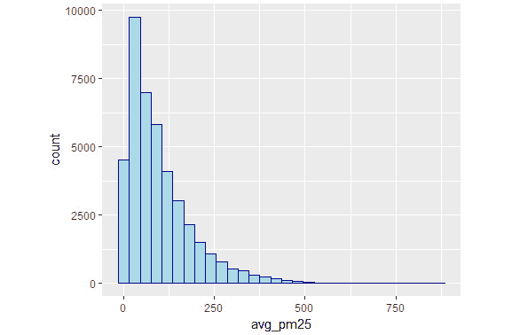

###### 图 6.2：北京数据集中 3 小时滚动平均 PM2.5 值的直方图

*图 6.2* 中的图显示了变量的右偏态，这意味着大多数值位于值范围的左侧，主要集中在 0 到 250 之间。这种偏态阻碍了模型的泛化，因此其预测能力较低。现在，让我们探讨如何利用多类别离散化来改善这种情况。

### 练习 78：展示分位数函数的使用

在这个练习中，我们将展示 `avg_pm25` 的使用。

执行以下步骤以完成练习：

1.  导入所需的库和包。

1.  在 `avg_pm25` 上找到分位数：

    ```py
    avg_pm25 <- PM25_three_hour_pm25_avg$avg_pm25
    quartiles = quantile(round(avg_pm25), seq(0,1, .25), include.lowest=T)
    ```

1.  接下来，计算分位数点的垂直线：

    ```py
    ggplot(PM25_three_hour_pm25_avg, aes(x=avg_pm25))+  geom_histogram(binwidth = 30,color="darkblue", fill="lightblue")+    geom_vline(xintercept=quartiles,            color="blue", linetype="dashed", size=1)
    ```

    图如下：

    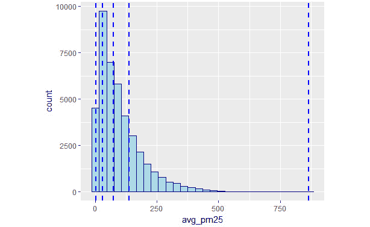

    ###### 图 6.3：北京数据集中 3 小时滚动平均 PM2.5 值的直方图，对应于 0%、25%、50%、75% 和 100% 分位数点

    以下代码片段在数据集中创建了一个名为 `avg_pm25_quartiles` 的变量，它代表了 `avg_pm25` 值的五个百分位数点。这个新变量在 **one-hot 编码** 后可用于建模，我们将在下一节讨论。

1.  让我们使用以下代码在数据集中添加一个新变量 `avg_pm25_quartiles`：

    ```py
    PM25_three_hour_pm25_avg$avg_pm25_quartiles <- as.integer(cut(avg_pm25,breaks=quantile(round(avg_pm25), seq(0,1, .25), include.lowest=T)))
    ```

我们刚刚看到离散化如何帮助在建模之前消除任何数据偏态。

## One-Hot 编码

One-Hot 编码是一个将分类变量二进制化的过程。这是通过将具有 *n* 个唯一值的分类变量转换成数据集中的 *n* 个唯一列，同时保持行数不变来完成的。以下表格显示了风向列如何转换成五个二进制列。例如，行号 **1** 的值为 **北风**，因此我们在名为 **Direction_N** 的对应列中得到 **1**，而在其他列中得到 **0**。其他行也是如此。注意，在这五个样本数据行中，方向 **西风** 不存在。然而，更大的数据集会为我们提供 **Direction_W** 列的值。

![图 6.4 使用独热编码将分类变量转换为二进制 1 和 0]

](img/C12624_06_04.jpg)

###### 图 6.4 使用独热编码将分类变量转换为二进制 1 和 0

将分类变量（如前表中所示）转换为二进制列的一个主要原因是与许多机器学习算法的限制有关，这些算法只能处理数值。然而，为了将分类变量转换为数值变量，我们必须用一些映射值来表示它，例如 `北 = 1`，`南 = 2`，`西 = 3` 等。这种编码的问题在于值 `1`，`2` 和 `3` 是整数，其中 `3>2>1`；然而，风向的情况并非如此。

解释完全错误。二进制独热编码通过为分类变量中的每个值创建一列来克服这一挑战，从而提供了更优雅的表示。现在，只要满足问题类型，我们可以使用任何机器学习算法来处理此类数据。

### 练习 79：使用独热编码

在这个练习中，我们将使用独热编码为分类变量中的每个值创建一列。

执行以下步骤以完成练习：

1.  导入所需的库和包。

1.  使用 `read.csv` 函数创建 `OzoneData` 变量并存储 `ozone1.csv` 的值：

    ```py
    OzoneData <- read.csv("ozone1.csv", stringsAsFactors=F)
    ```

1.  将所需的 `caret` 包导入系统：

    ```py
    library(caret)
    ```

1.  创建输入数据集：

    ```py
    OzoneData$Day_of_week <- as.factor(OzoneData$Day_of_week) 
    OzoneData_OneHot <- dummyVars(" ~ .", data = OzoneData)
    ```

1.  创建响应 DataFrame：

    ```py
    OzoneData_OneHot <- data.frame(predict(OzoneData_OneHot, newdata = OzoneData))
    ```

1.  使用 `head()` 函数绘制数据：

    ```py
    head(OzoneData_OneHot)
    ```

    输出如下：

    ```py
    ##   Month Day_of_month Day_of_week.1 Day_of_week.2 Day_of_week.3
    ## 1     1            1             0             0             0
    ## 2     1            2             0             0             0
    ## 3     1            3             0             0             0
    ## 4     1            4             0             0             0
    ## 5     1            5             1             0             0
    ## 6     1            6             0             1             0
    ##   Day_of_week.4 Day_of_week.5 Day_of_week.6 Day_of_week.7 ozone_reading
    ## 1             1             0             0             0             3
    ## 2             0             1             0             0             3
    ## 3             0             0             1             0             3
    ## 4             0             0             0             1             5
    ## 5             0             0             0             0             5
    ## 6             0             0             0             0             6
    ##   pressure_height Wind_speed Humidity Temperature_Sandburg
    ## 1            5480          8 20.00000             40.53473
    ## 2            5660          6 40.96306             38.00000
    ## 3            5710          4 28.00000             40.00000
    ## 4            5700          3 37.00000             45.00000
    ## 5            5760          3 51.00000             54.00000
    ## 6            5720          4 69.00000             35.00000
    ##   Temperature_ElMonte Inversion_base_height Pressure_gradient
    ## 1            39.77461              5000.000               -15
    ## 2            46.74935              4108.904               -14
    ## 3            49.49278              2693.000               -25
    ## 4            52.29403               590.000               -24
    ## 5            45.32000              1450.000                25
    ## 6            49.64000              1568.000                15
    ##   Inversion_temperature Visibility
    ## 1              30.56000        200
    ## 2              48.02557        300
    ## 3              47.66000        250
    ## 4              55.04000        100
    ## 5              57.02000         60
    ## 6              53.78000         60
    ```

观察我们在 `OzoneData` DataFrame 中创建的 `OneHot` 变量。经过独热编码后，`Day_of_week` 中的每个值（1 到 7）都表示为单独的列。

### 活动 11：将北京 PM2.5 数据集的 CBWD 特征转换为独热编码列

在这个活动中，我们将学习如何将任何分类变量转换为独热编码向量。特别是，我们将把北京 PM2.5 数据集的 CBWD 特征转换为独热编码列。许多机器学习算法只处理数值特征；在这种情况下，使用独热编码变得至关重要。

执行以下步骤以完成活动：

1.  读取北京 PM2.5 数据集。

1.  创建一个变量 `cbwd_one_hot` 用于存储 `dummyVars` 函数的结果，其第一个参数为 `~ cbwd`。

1.  使用 `predict()` 函数在 `cbwd_one_hot` 上的输出。

1.  从 `PM25` DataFrame 中移除原始的 `cbwd` 变量。

1.  使用 `cbind()` 函数，将 `cbwd_one_hot` 添加到 `PM25` DataFrame 中。

1.  打印 `PM25` 的前六行。

    输出如下：

    ```py
    ##   No year month day hour pm2.5 DEWP TEMP PRES   Iws Is Ir cbwd.cv cbwd.NE
    ## 1  1 2010     1   1    0    NA  -21  -11 1021  1.79  0  0       0       0
    ## 2  2 2010     1   1    1    NA  -21  -12 1020  4.92  0  0       0       0
    ## 3  3 2010     1   1    2    NA  -21  -11 1019  6.71  0  0       0       0
    ## 4  4 2010     1   1    3    NA  -21  -14 1019  9.84  0  0       0       0
    ## 5  5 2010     1   1    4    NA  -20  -12 1018 12.97  0  0       0       0
    ## 6  6 2010     1   1    5    NA  -19  -10 1017 16.10  0  0       0       0
    ##   cbwd.NW cbwd.SE
    ## 1       1       0
    ## 2       1       0
    ## 3       1       0
    ## 4       1       0
    ## 5       1       0
    ## 6       1       0
    ```

    #### 注意

    这个活动的解决方案可以在第 459 页找到。

## 对数转换

修正偏斜分布最常见的技术是找到一个合适的具有逆函数的数学函数。其中一个这样的函数是对数，表示如下：


换句话说，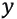 是 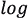 对 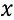 的对数，以 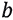 为底。其逆运算，即找到 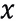，可以按以下方式计算：


这种转换赋予了处理数据偏斜的能力；同时，一旦建立模型，原始值可以轻松计算。最流行的对数转换是自然对数 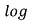，其中 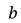 是数学常数 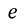，其值大约为 `2.71828`。

对数函数的一个有用特性是它优雅地处理数据偏斜。例如，以下代码演示了 `log(10000)` 和 `log(1000000)` 的差异仅为 `4.60517`。数字 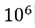 是 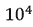 的 100 倍。这减少了我们通常让模型处理的偏斜，而模型可能不足以处理。

```py
#Natural Log
log(10000)
## [1] 9.21034
# 10 times bigger value
log(100000)
## [1] 11.51293
# 100 times bigger value
log(1000000)
## [1] 13.81551
```

让我们看看对 PM2.5 值的 3 小时滚动平均应用自然对数的结果。

### 练习 80：执行对数转换

在这个练习中，我们将绘制经过对数转换的 `avg_pm25` 变量的直方图，并将其与原始值的偏斜分布进行比较。

执行以下步骤以完成练习：

1.  导入所需的库和包。

1.  创建 `avg_pm25` 的直方图：

    ```py
    ggplot(PM25_three_hour_pm25_avg, aes(x=avg_pm25))+  geom_histogram(color="darkblue", fill="lightblue")
    ```

    输出如下：

    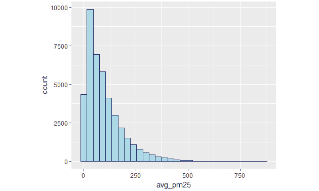

    ###### 图 6.5 来自北京数据集的 PM2.5 值 3 小时滚动平均的直方图

1.  创建 `log_avg_pm25` 的直方图：

    ```py
    ggplot(PM25_three_hour_pm25_avg, aes(x=log_avg_pm25))+  geom_histogram(color="darkblue", fill="lightblue")
    ```

    输出如下：

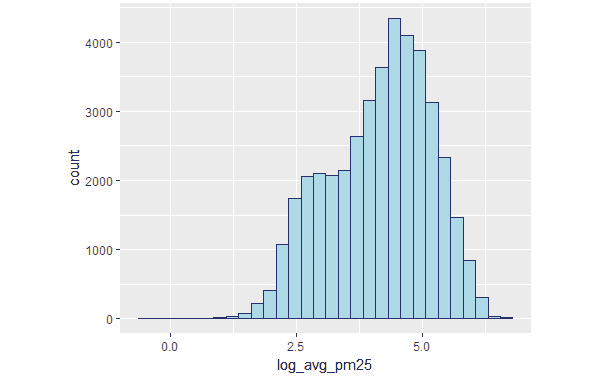

###### 图 6.6 来自北京数据集的 PM2.5 值 3 小时滚动平均的自然对数直方图

在这个练习中，我们绘制了一个图表来展示北京数据集中 PM2.5 值的 3 小时滚动平均值，并将其与北京数据集中 PM2.5 值 3 小时滚动平均的自然对数直方图进行了对比。取对数使得直方图在平均值周围看起来更加对称，并减少了偏斜。

## 特征选择

当**特征工程**确保质量和数据问题得到纠正时，**特征选择**有助于确定用于提高模型性能的正确特征集。特征选择技术识别对模型预测能力贡献最大的特征。重要性较低的特征会抑制模型从独立变量中学习的能力。

特征选择提供了以下好处：

+   减少过拟合

+   提高准确性

+   减少训练模型的时间

### 单变量特征选择

像卡方检验（**chi-squared**）这样的统计检验是选择与因变量或目标变量有强关系的特征的一种流行方法。它主要在分类问题中的分类特征上工作。因此，为了在数值变量上使用它，需要将特征转换为分类，使用离散化。

在最一般的形式中，卡方统计量可以计算如下：

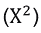

这测试了观察频率与预期频率之间是否存在显著差异。较大的卡方值表明目标变量与特定特征的依赖性更强。更正式地说：


其中：

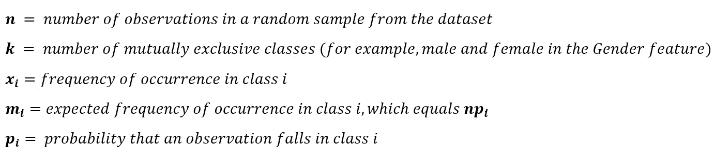

### 练习 81：探索卡方检验

在这个练习中，我们将计算`Ozone`数据集中所有变量的卡方统计量。具有最高卡方值的五个变量将是我们建模的最佳特征。

完成以下步骤以完成练习：

1.  导入所需的库和包。

1.  创建一个名为`OzoneData`的变量，并将`read.csv`函数的值分配给它：

    ```py
    OzoneData <- read.csv("ozone1.csv", stringsAsFactors=F)
    ```

1.  现在，设置`path`如上图所示：

    ```py
    path="C:\\Program Files\\Java\\jdk1.8.0_92"
    ```

1.  接下来，使用 Sys.getenv 函数获取环境变量的值：

    ```py
    if (Sys.getenv("JAVA_HOME")!="")  Sys.setenv(JAVA_HOME=path)
    ```

1.  使用以下命令安装所需的包：

    ```py
    install.packages("rJava")
    install.packages("FSelector")
    ```

1.  导入`rJava`包：

    ```py
    library(rJava)
    ## Warning: package 'rJava' was built under R version 3.2.5
    library(FSelector)#For method
    library(mlbench)# For data
    ```

1.  计算卡方统计量：

    ```py
    weights<- chi.squared(ozone_reading~., OzoneData)
    ```

1.  打印结果：

    ```py
    print(weights)
    ```

    输出如下：

    ```py
    ##                       attr_importance
    ## Month                       0.4240813
    ## Day_of_month                0.0000000
    ## Day_of_week                 0.0000000
    ## pressure_height             0.4315521
    ## Wind_speed                  0.0000000
    ## Humidity                    0.3923034
    ## Temperature_Sandburg        0.5191951
    ## Temperature_ElMonte         0.5232244
    ## Inversion_base_height       0.6160403
    ## Pressure_gradient           0.4120630
    ## Inversion_temperature       0.5283836
    ## Visibility                  0.4377749
    ```

1.  选择前五个变量：

    ```py
    subset<- cutoff.k(weights, 5)
    ```

1.  打印可用于分类的最终公式：

    ```py
    f<- as.simple.formula(subset, "Class")
    print(f)
    ```

    输出如下：

    ```py
    ## Class ~ Inversion_base_height + Inversion_temperature + Temperature_ElMonte + 
    ##     Temperature_Sandburg + Visibility
    ## <environment: 0x000000001a796d18>
    ```

我们使用 chi.squared()函数计算了 Ozone 数据集中每个特征的卡方值。该函数根据卡方值输出属性的重要性。步骤 10 中使用的卡方统计量前五个特征可以用于构建监督学习模型。

## 高度相关的变量

通常，两个高度相关的变量可能对模型的预测能力做出贡献，这使得其中一个变得冗余。例如，如果我们有一个包含`age`（年龄）、`height`（身高）和`BMI`（体质指数）作为变量的数据集，我们知道`BMI`是`age`和`height`的函数，并且它总是与这两个变量高度相关。如果不是这样，那么 BMI 的计算可能有问题。在这种情况下，可能会决定删除其他两个变量。然而，这并不总是这样。在某些情况下，一对变量可能高度相关，但很难解释为什么会出现这种情况。在这种情况下，可以随机删除两个中的一个。

### 练习 82：绘制相关矩阵

在这个练习中，我们将计算一对变量的相关性，并使用`corrplot`包绘制相关图。

完成练习的以下步骤：

1.  使用以下命令导入所需的库：

    ```py
    library(mlbench)
    library(caret)
    ```

    输出如下：

    ```py
    ## Warning: package 'caret' was built under R version 3.2.5
    ## Loading required package: lattice
    ```

1.  现在，加载数据并计算相关矩阵：

    ```py
    correlationMatrix <- cor(OzoneData)
    ```

1.  总结相关矩阵：

    ```py
    print(correlationMatrix)
    ```

    输出如下：

    ```py
    ##                              Month Day_of_month  Day_of_week ozone_reading
    ## Month                  1.000000000   0.00644330 -0.007345951   0.054521859
    ## Day_of_month           0.006443300   1.00000000  0.002679760   0.079493243
    ## Day_of_week           -0.007345951   0.00267976  1.000000000  -0.042135770
    ## ozone_reading          0.054521859   0.07949324 -0.042135770   1.000000000
    ```

1.  找到高度相关的属性（理想情况下 >0.75）：

    ```py
    highlyCorrelated <- findCorrelation(correlationMatrix, cutoff=0.5)
    ```

1.  打印高度相关属性的索引：

    ```py
    print(highlyCorrelated)
    ```

    输出如下：

    ```py
    ## [1] 12  9  8  5  4  7
    ```

1.  导入`corrplot`库：

    ```py
    library(corrplot)
    ```

1.  绘制相关矩阵：

    ```py
    corrplot(correlationMatrix)
    ```

    输出如下：

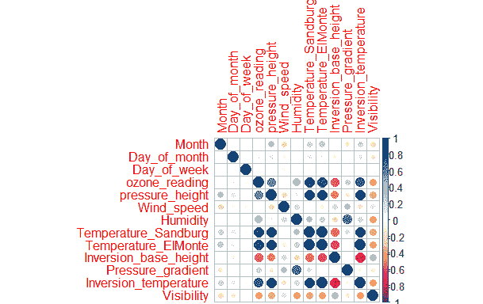

###### 图 6.7：绘制相关矩阵

在*图 6.7*中观察，深蓝色圆圈表示高度正相关，深红色圆圈表示高度负相关。相关值的范围在`-1`和`1`之间。通过视觉检查，我们可以看到变量`Inversion_temperature`与`pressure_height`有高度正相关，与`Inversion_base_height`有高度负相关。例如，如果`Inversion_temperature`增加，`pressure_height`也会增加，反之亦然。

#### 注意

图 6.7 可以在 GitHub 上找到：https://github.com/TrainingByPackt/Applied-Supervised-Learning-with-R/blob/master/Lesson06/C12624_06_07.png.

### 基于模型的特征重要性排序

例如，随机森林这样的模型，它是一种集成建模技术，我们构建多个模型，并使用简单的投票技术（如第五章、*分类*中所述）来组合它们的结果，它有一个有用的技术来利用数据集中的所有变量，同时不损害模型性能。随机森林模型背后的简单想法是它随机选择数据集和变量的子集来构建多个决策树。最终的模型预测不是通过一个决策树，而是通过集体使用多个决策树来完成的。多数投票是用于最终预测的常用技术；换句话说，大多数决策树预测的结果是最终预测。

这种技术自然地给出了一种组合变量，这些变量导致最高的准确率。（也可以使用其他模型评估指标。）

#### 注意

对于某些基因组学和计算生物学的研究工作****，其中潜在的预测变量在测量尺度上有所不同（包括序列和分类变量，如折叠能）以及它们的类别数量（例如，当氨基酸序列数据显示不同的类别数量），随机森林的重要性度量不可靠。

***** 随机森林变量重要性度量中的偏差：说明、来源和解决方案：https://link.springer.com/article/10.1186/1471-2105-8-25.

### 练习 83：使用 RF 探索 RFE

在这个练习中，我们将使用随机森林算法探索**递归特征消除**（**RFE**）。RFE 有助于选择具有最高特征重要性的最佳特征。

执行以下步骤以完成练习：

1.  导入`party`包：

    ```py
    library(party)
    ```

1.  拟合随机森林：

    ```py
    cf1 <- cforest(pm2.5 ~ . , data= na.omit(PM25[,c("month","DEWP","TEMP","PRES","Iws","pm2.5")]), control=cforest_unbiased(mtry=2,ntree=50)) 
    ```

1.  根据均方误差的减少量计算变量重要性。`varimp()`函数实现了 RFE 技术：

    ```py
    varimp(cf1)
    ```

    输出如下：

    ```py
    ##    month     DEWP     TEMP     PRES      Iws 
    ## 3736.679 5844.172 4080.546 1517.037 1388.532
    ```

在步骤 2 中，`party` 包提供了 `cforest()` 方法，使用参数 `mtry = 2` 和 `ntree = 50` 拟合随机森林模型，并找到最佳模型，其中 `x` 仅使用没有 `x` 的 bootstrap 样本的树。函数 `varimp()` 使用排列原理（值随机打乱）计算平均 MSE 减少的变量重要性。换句话说，变量重要性是通过在训练后但在预测之前对给定变量进行排列后，所有袋外交叉验证预测的平均 MSE 减少来衡量的。

由于随机打乱的变量，我们预计会创建一个 *差的* 变量，并且包含这个打乱变量的 MSE 与不包含在模型中的 MSE 相比会增加。因此，如果 MSE 的平均减少量很高，那么由于变量打乱而产生的模型 MSE 肯定很高。所以，我们可以得出结论，该变量的重要性更高。

### 练习 84：使用随机森林模型探索变量重要性

在这个练习中，我们将使用随机森林模型探索变量重要性。我们再次使用北京市数据集，以查看五个变量（`month`、`DEWP`、`TEMP`、`PRES` 和 `Iws`）中哪一个最好地预测 PM2.5。

完成以下步骤以完成练习：

1.  使用以下命令导入随机森林包：

    ```py
    library(randomForest)
    ```

1.  现在，使用以下命令创建一个新的对象：

    ```py
    pm25_model_rf <- randomForest(pm2.5 ~ . , data = na.omit(PM25[,c("month","DEWP","TEMP","PRES","Iws","pm2.5")]), ntree=25,importance=TRUE, nodesize=5)
    ```

1.  打印模型：

    ```py
    pm25_model_rf
    ```

    输出如下：

    ```py
    ## 
    ## Call:
    ##  randomForest(formula = pm2.5 ~ ., data = na.omit(PM25[, c("month",      "DEWP", "TEMP", "PRES", "Iws", "pm2.5")]), ntree = 25, importance = TRUE,      nodesize = 5) 
    ##                Type of random forest: regression
    ##                      Number of trees: 25
    ## No. of variables tried at each split: 1
    ## 
    ##           Mean of squared residuals: 3864.177
    ##                     % Var explained: 54.39
    ```

1.  为每棵树找到 R-squared 值：

    ```py
    pm25_model_rf$rsq
    ```

    输出如下：

    ```py
    ##  [1] 0.2917119 0.3461415 0.3938242 0.4240572 0.4335932 0.4445404 0.4552216
    ##  [8] 0.4735218 0.4878105 0.4998751 0.5079323 0.5156195 0.5197153 0.5228638
    ## [15] 0.5286556 0.5305679 0.5312043 0.5341559 0.5374104 0.5397305 0.5421712
    ## [22] 0.5434857 0.5430657 0.5435383 0.5439461
    ```

1.  接下来，计算变量重要性图：

    ```py
    varImpPlot(pm25_model_rf)
    ```

    输出如下：

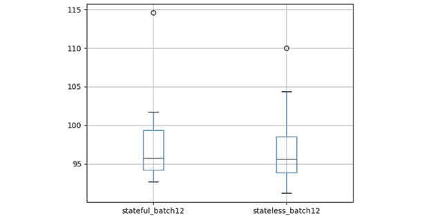


###### 图 6.8：通过在北京市 PM2.5 数据上拟合随机森林模型获得的 MSE 百分比增加和节点纯度值增加

前一个练习演示了查看变量重要性的另一种方法。我们使用了 `randomForest` 包，而不是 `party` 包。`%IncMSE` 的计算方法如下所述：

1.  拟合随机森林（在我们的情况下，是回归随机森林）。计算 OOB-MSE 并将其命名为 `MSE_Base`。

1.  对于每个变量 `j`：对列 `j` 的值进行排列，然后预测并计算 `OOB_MSE_j`.

1.  `%IncMSE` 的 `jth` 变量等于 `(OOB_MSE_j - MSE_Base)/ MSE_Base * 100%`.

*图 6.8* 显示，将变量 `Iws` 包含在模型中，与变量 DEWP 相比，MSE 增加了 `22%`，而 DEWP 仅使 MSE 增加了 `15%`。我们知道由于变量值的打乱，MSE 肯定会增加，所以更高的 `%` 意味着是一个好的变量。如果我们看到变量 `TEMP`，与 `Iws` 和 `DEWP` 相比，值的打乱对 MSE 的影响不大；因此，相对而言，它不太重要。

节点纯度计算损失函数的值，在这个模型中是均方误差 (MSE)。它有助于选择最佳分割。MSE 的降低会给出更高的节点纯度值。DEWP 具有最高的节点纯度，其次是月份特征。在我们的数据集中，`%IncMSE` 和 `IncNodePurity` 显示了类似的结果。然而，请记住，`IncNodePurity` 往往存在偏差，并且应该始终与 `%IncMSE` 结合起来考虑。

## 特征降维

**特征降维**有助于去除冗余变量，以下方式降低模型效率：

+   模型开发/训练时间增加。

+   结果的解释变得繁琐。

+   它夸大了估计的方差。

在本节中，我们将看到三种特征降维技术，这些技术有助于提高模型效率。

### 主成分分析 (PCA)

N. A. Campbell 和 William R. Atchley 在他们经典论文《典型变量分析的几何学》中，系统生物学，第 30 卷，第 3 期，1981 年 9 月，第 268–280 页，从几何角度定义了**主成分分析**为将原始变量坐标系统的轴旋转到新的正交轴，称为主轴，使得新轴与原始观察的最大变化方向一致。这是 PCA 的核心所在。换句话说，它用解释原始观察或数据最大变化的主成分来表示原始变量。

论文巧妙地展示了主成分的几何表示，如下所示图，这是两个变量的散点图表示，显示了每个变量的均值 ![img/C12624_06_34.png]，*95%* 浓集椭圆，以及主轴 ![img/C12624_06_35.png] 和 ![img/C12624_06_36.png]。点 ![img/C12624_06_37.png] 和 ![img/C12624_06_38.png] 给出了观察 ![img/C12624_06_39.png] = . 的主成分得分。向量 ![img/C12624_06_41.png] 和 ![img/C12624_06_42.png] 之间角度 ![img/C12624_06_40.png] 的余弦值给出了对应于 ![img/C12624_06_44.png] 的特征向量的第一个分量 ![img/C12624_06_43.png]。

在线性代数中，线性变换的特征向量是一个非零向量，当该线性变换应用于它时，它只改变一个标量因子。

![img/C12624_06_09.jpg]

###### 图 6.9：显示了两个变量的散点图表示，显示了每个变量的均值（x̅_1 和 x̅_2），95% 浓集椭圆，以及主轴 Y_1 和 Y_2

###### 来源：典型变量分析的几何学，系统生物学，第 30 卷，第 3 期，1981 年 9 月，第 268–280 页

### 练习 85：执行 PCA

在这个练习中，我们将执行 PCA，这将有助于降低特征空间的维度。换句话说，更少的由输入特征线性组合的主成分将代表整个数据集。

执行以下步骤以完成练习：

1.  导入`OzoneData`包：

    ```py
    dim(OzoneData)
    ```

    输出结果如下：

    ```py
    ## [1] 366  13
    ```

1.  使用`colnames`函数打印列名：

    ```py
    colnames(OzoneData)
    ```

    输出结果如下：

    ```py
    ##  [1] "Month"                 "Day_of_month"         
    ##  [3] "Day_of_week"           "ozone_reading"        
    ##  [5] "pressure_height"       "Wind_speed"           
    ##  [7] "Humidity"              "Temperature_Sandburg" 
    ##  [9] "Temperature_ElMonte"   "Inversion_base_height"
    ## [11] "Pressure_gradient"     "Inversion_temperature"
    ## [13] "Visibility"
    ## [1] 50  4
    ```

1.  计算所有变量的均值：

    ```py
    apply(OzoneData,2,mean)
    ```

    输出结果如下：

    ```py
    ##                 Month          Day_of_month           Day_of_week 
    ##              6.513661             15.756831              4.002732 
    ##         ozone_reading       pressure_height            Wind_speed 
    ##             11.582020           5752.448016              4.868852 
    ##              Humidity  Temperature_Sandburg   Temperature_ElMonte 
    ##             58.295691             61.858629             57.219990 
    ## Inversion_base_height     Pressure_gradient Inversion_temperature 
    ##           2596.265137             17.785440             61.005339 
    ##            Visibility 
    ##            123.300546
    ```

1.  计算所有变量的方差：

    ```py
    apply(OzoneData,2,var) 
    ```

    输出结果如下：

    ```py
    ##                 Month          Day_of_month           Day_of_week 
    ##          1.194365e+01          7.785578e+01          3.991773e+00 
    ##         ozone_reading       pressure_height            Wind_speed 
    ##          6.243605e+01          1.092618e+04          4.481383e+00 
    ##              Humidity  Temperature_Sandburg   Temperature_ElMonte 
    ##          3.861494e+02          2.039533e+02          1.109866e+02 
    ## Inversion_base_height     Pressure_gradient Inversion_temperature 
    ##          3.115312e+06          1.300448e+03          1.871074e+02 
    ##            Visibility 
    ##          6.444901e+03
    ```

    变量的方差显著差异将控制主成分。`prcomp()`函数在找出主成分之前会对变量进行标准化（均值`0`和方差`1`）。

    ```py
    pca.out<-prcomp(OzoneData,scale=TRUE)
    ```

1.  接下来，找到 PCA 的摘要：

    ```py
    summary(pca.out)
    ```

    输出结果如下：

    ```py
    ## Importance of components:
    ##                           PC1    PC2     PC3     PC4     PC5     PC6
    ## Standard deviation     2.2817 1.4288 1.05944 1.01842 1.00160 0.93830
    ## Proportion of Variance 0.4005 0.1570 0.08634 0.07978 0.07717 0.06772
    ## Cumulative Proportion  0.4005 0.5575 0.64386 0.72364 0.80081 0.86853
    ##                            PC7     PC8     PC9    PC10    PC11    PC12
    ## Standard deviation     0.74291 0.64513 0.54523 0.48134 0.33068 0.25908
    ## Proportion of Variance 0.04246 0.03202 0.02287 0.01782 0.00841 0.00516
    ## Cumulative Proportion  0.91099 0.94301 0.96587 0.98369 0.99211 0.99727
    ##                           PC13
    ## Standard deviation     0.18840
    ## Proportion of Variance 0.00273
    ## Cumulative Proportion  1.00000
    ```

1.  使用`ggbiplot`函数创建双图：

    ```py
    library(devtools)
    install_github("vqv/ggbiplot", force=TRUE)
    library(ggbiplot)
    ggbiplot(pca.out)
    ```

    输出结果如下：

![图 6.10 使用 ggbiplot 缩放双图的前两个主成分

![img/C12624_06_10.jpg]

###### 图 6.10 使用 ggbiplot 缩放双图的前两个主成分

图中的双图显示了`Ozone`数据集。如`summary(pca.out)`的输出所示，双图使用数据集中的各种特征来描述解释的方差。轴被看作是从中心点发出的箭头。该图还显示，变量`pressure_height`和`inversion_temperature`对`Visibility`有贡献，而`day_of_the_week`对**PC2**有更高的值。

如果您在安装`ggbiplot`时遇到困难，您也可以使用 R 基础包中的`biplot()`函数，如下面的图所示。首先，让我们构建一个双图以更好地理解：

```py
biplot(pca.out,scale = 0, cex=0.65)
```

![图 6.11 第一主成分的缩放双图

![img/C12624_06_11.jpg]

###### 图 6.11 第一主成分的缩放双图

注意，最大百分比方差由 PC1 解释，所有主成分彼此不相关。特别是，大约`40%`的方差由 PC1 解释，第一个主成分（PC1-PC4）解释了 70%的方差。换句话说，如果我们使用前四个主成分，我们应该得到一个与使用数据集中所有变量得到的模型几乎相同的模型。这并不令人惊讶，因为主成分是变量的线性组合。

## 变量聚类

**变量聚类**用于测量共线性、计算冗余，并将变量分离成可以计为一个单一变量的聚类，从而实现数据降维。对变量的层次聚类分析可以使用以下任何一个：Hoeffding 的 D 统计量、平方皮尔逊或斯皮尔曼相关系数，或者使用两个变量都为正的观测比例作为相似性度量。其思想是找到与自身相关且不与另一个聚类中的变量相关的相关变量簇。这可以将大量特征减少到更少的特征或变量簇。

### 练习 86：使用变量聚类

在这个练习中，我们将使用特征聚类来识别相似特征簇。从每个簇中，我们可以选择一个或多个特征用于模型。我们将使用 R 中的 Hmisc 包中的层次聚类算法。相似度度量应设置为"spear"，代表皮尔逊相关系数，它是计算两个观测值之间相似性的稳健度量。

执行以下步骤以完成练习：

1.  使用以下命令安装`Hmisc`包：

    ```py
    install.packages("Hmisc")
    ```

1.  导入`Hmisc`包并设置随机种子为`1`：

    ```py
    library(Hmisc)
    set.seed(1)
    ```

1.  使用变量聚类，以 Spearman 相关系数作为相似度度量：

    ```py
    Ozone_var_clust <- varclus(as.matrix(OzoneData), similarity="spear")
    Ozone_var_clust
    ```

    输出如下：

    ```py
    ## varclus(x = as.matrix(OzoneData), similarity = "spear")
    ## 
    ## 
    ## Similarity matrix (Spearman rho²)
    ## 
    ##                       Month Day_of_month Day_of_week ozone_reading
    ## Month                  1.00         0.00        0.00          0.00
    ## Day_of_month           0.00         1.00        0.00          0.01
    ## Day_of_week            0.00         0.00        1.00          0.00
    ## ozone_reading          0.00         0.01        0.00          1.00
    ## pressure_height        0.12         0.00        0.00          0.36
    ## Wind_speed             0.04         0.01        0.00          0.00
    ## Humidity               0.01         0.00        0.00          0.20
    ## Temperature_Sandburg   0.05         0.01        0.00          0.63
    ## Temperature_ElMonte    0.07         0.00        0.00          0.59
    ## Inversion_base_height  0.00         0.01        0.00          0.32
    ## Pressure_gradient      0.03         0.00        0.00          0.06
    ## Inversion_temperature  0.04         0.01        0.00          0.54
    ## Visibility             0.04         0.02        0.01          0.20
    ##                       pressure_height Wind_speed Humidity
    ## Month                            0.12       0.04     0.01
    ## Day_of_month                     0.00       0.01     0.00
    ## Day_of_week                      0.00       0.00     0.00
    ## ozone_reading                    0.36       0.00     0.20
    ## pressure_height                  1.00       0.02     0.03
    ## Wind_speed                       0.02       1.00     0.03
    ## Humidity                         0.03       0.03     1.00
    <Output Truncated for brevity>
    ## hclust results (method=complete)
    ## 
    ## 
    ## Call:
    ## hclust(d = as.dist(1 - x), method = method)
    ## 
    ## Cluster method   : complete 
    ## Number of objects: 13
    ```

1.  打印值：

    ```py
    print(round(Ozone_var_clust$sim,2))
    ```

    输出如下：

    ```py
    ##                       Month Day_of_month Day_of_week ozone_reading
    ## Month                  1.00         0.00        0.00          0.00
    ## Day_of_month           0.00         1.00        0.00          0.01
    ## Day_of_week            0.00         0.00        1.00          0.00
    ## ozone_reading          0.00         0.01        0.00          1.00
    ## pressure_height        0.12         0.00        0.00          0.36
    ## Wind_speed             0.04         0.01        0.00          0.00
    ## Humidity               0.01         0.00        0.00          0.20
    ## Temperature_Sandburg   0.05         0.01        0.00          0.63
    ## Temperature_ElMonte    0.07         0.00        0.00          0.59
    ## Inversion_base_height  0.00         0.01        0.00          0.32
    ## Pressure_gradient      0.03         0.00        0.00          0.06
    ```

根据相似度矩阵，以下图显示了同一簇中的变量。例如，`Temperature_ElMonte`和`Inversion_temperature`都被聚类到一个簇中，Spearman 相关系数为 0.85。同样，`Humidity`和`Pressure_gradient`的 Spearman 相关系数为 0.25。高相似度将导致决定删除其中一个。除了查看聚类输出顶部之外，在最终决定完全删除变量之前，还应考虑模型指标：

```py
plot(Ozone_var_clust)
```

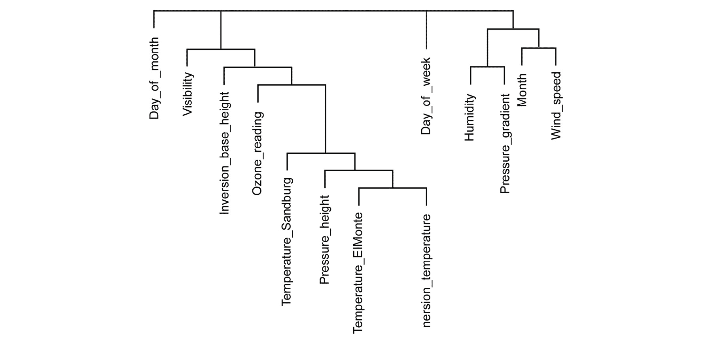

###### 图 6.12：臭氧数据集中变量的层次聚类

## 线性判别分析用于特征降维

**线性判别分析**（**LDA**）通过将数据投影到新的特征空间（低维空间，具有良好的类别可分性）来最大化类别分离，以避免过拟合（**维度诅咒**）。LDA 还降低了计算成本，使其适合作为分类算法。其思想是最大化每个类别（或类别）的均值之间的距离，并最小化类别内的变异性。（这确实听起来像无监督学习中的聚类算法，但在这里我们不会涉及，因为它超出了本书的范围。）请注意，LDA 假设数据遵循高斯分布；如果不是，LDA 的性能将降低。在本节中，我们将使用 LDA 作为特征降维技术，而不是作为分类器。

对于二分类问题，如果我们有一个*m*-维数据集 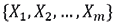 ，包含*N*个观测值，其中 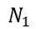 属于类别 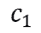 ，而 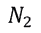 属于类别 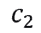 。在这种情况下，我们可以将数据投影到一条线（*C=2*，投影到*C-1*空间）：


这样的投影是通过将 *X* 的均值投影到 *Y* 的均值上实现的。在所有可能的线中，我们希望选择一条最大化标量可分性的线。换句话说，来自同一类的观察值的投影非常接近，同时，投影的均值尽可能远。

应该注意的是，虽然 LDA 中我们更像是监督学习使用类变量，PCA 不需要任何类变量来减少特征大小。这就是为什么，虽然 LDA 尽可能多地保留了类区分信息，PCA 并不太关心这一点。

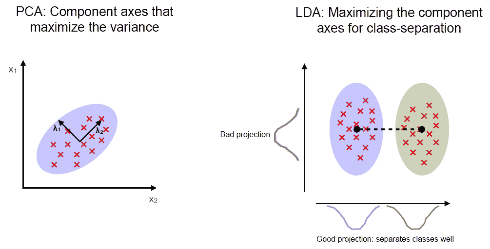

###### 图 6.13：比较 PCA 和 LDA

###### 来源：https://sebastianraschka.com/Articles/2014_python_lda.html

### 练习 87：探索 LDA

在这个练习中，我们将执行 LDA 进行特征降维。我们将观察使用所有特征和 LDA 降维后的特征在模型性能上的差异。

执行以下步骤：

1.  将两个 DataFrame 在时间戳上合并以堆叠其他环境变量以及 PM2.5 到一个 DataFrame 中：

    ```py
    PM25_for_LDA <- merge(PM25_three_hour_pm25_avg, PM25[,c("datetime","TEMP","DEWP","PRES","Iws","cbwd","Is","Ir")], by.x = "timestamp",by.y = "datetime")
    PM25_for_LDA = PM25_for_LDA[,c("TEMP","PRES","DEWP","Iws","Is","Ir","pollution_level")]
    ```

1.  将数据集分为训练集和测试集：

    ```py
    index = sample(1:nrow(PM25_for_LDA), round(nrow(PM25_for_LDA)*0.6 ), replace = FALSE)
    LDA_train = PM25_for_LDA[ index, ]
    LDA_test = PM25_for_LDA[ -index, ]
    ```

1.  导入 `MASS` 包：

    ```py
    library(MASS)
    ```

1.  在训练数据集上拟合 LDA 模型：

    ```py
    LDA_model = lda( pollution_level ~ ., data = LDA_train )
    projected_data = as.matrix( LDA_train[, 1:6] ) %*%  LDA_model$scaling
    ```

1.  绘制 100 个随机选择的投影值：

    ```py
    set.seed(100)
    index <- sample(nrow(projected_data),100, replace = FALSE)
    plot( projected_data[index], col = LDA_train[,7], pch = 19 )
    ```

    输出如下：

    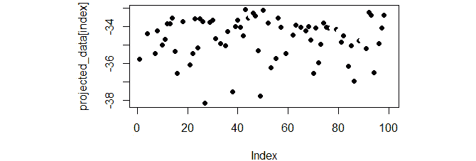

    ###### 图 6.14：随机选择的 100 个投影值的图

1.  执行模型测试：

    ```py
    LDA_test_reduced = LDA_test[, !( names( LDA_test ) %in% c( "pollution_level" ) ) ]  
    LDA_model_results = predict( LDA_model, LDA_test_reduced )
    ```

1.  导入 `caret` 库并打印混淆矩阵：

    ```py
    library( caret )
    c_t = table( LDA_model_results$class, LDA_test$pollution_level )
    print( confusionMatrix( c_t ) )
    ```

    输出如下：

    ```py
    ## Confusion Matrix and Statistics
    ## 
    ##    
    ##         0     1
    ##   0  2359   978
    ##   1  2257 11108
    ##                                           
    ##                Accuracy : 0.8063          
    ##                  95% CI : (0.8002, 0.8123)
    ##     No Information Rate : 0.7236          
    ##     P-Value [Acc > NIR] : < 2.2e-16       
    ##                                           
    ##                   Kappa : 0.4704          
    ##  Mcnemar's Test P-Value : < 2.2e-16       
    ##                                           
    ##             Sensitivity : 0.5110          
    ##             Specificity : 0.9191          
    ##          Pos Pred Value : 0.7069          
    ##          Neg Pred Value : 0.8311          
    ##              Prevalence : 0.2764          
    ##          Detection Rate : 0.1412          
    ##    Detection Prevalence : 0.1998          
    ##       Balanced Accuracy : 0.7151          
    ##                                           
    ##        'Positive' Class : 0               
    ## 
    ```

1.  查找降维后的数据集：

    ```py
    new_LDA_train = as.matrix( LDA_train[,1:6] ) %*%
      LDA_model$scaling
    new_LDA_train = as.data.frame( new_LDA_train )
    new_LDA_train$pollution_level = LDA_train$pollution_level
    ```

1.  测试数据集：

    ```py
    new_LDA_test = as.matrix( LDA_test[,1:6] ) %*%
      LDA_model$scaling
    new_LDA_test = as.data.frame( new_LDA_test )
    new_LDA_test$pollution_level = LDA_test$pollution_level
    ```

1.  使用投影数据。让我们拟合一个逻辑模型。你也可以使用其他任何分类模型：

    ```py
    PM25_logit_model_on_LDA <- glm(pollution_level ~ ., data = new_LDA_train,family=binomial(link='logit'))
    ```

1.  在测试数据上执行模型评估：

    ```py
    predicted_LDA = predict(PM25_logit_model_on_LDA, newdata = new_LDA_test,type="response")
    ```

1.  如果概率大于 0.5，则预测 1：

    ```py
    predicted <- ifelse(predicted_LDA>0.5, 1,0)
    actual <- new_LDA_test$pollution_level
    ```

1.  查找混淆矩阵：

    ```py
    confusionMatrix(predicted, actual)
    ```

    输出如下：

    ```py
    ## Confusion Matrix and Statistics
    ## 
    ##           Reference
    ## Prediction     0     1
    ##          0  2316   947
    ##          1  2300 11139
    ##                                           
    ##                Accuracy : 0.8056          
    ##                  95% CI : (0.7995, 0.8116)
    ##     No Information Rate : 0.7236          
    ##     P-Value [Acc > NIR] : < 2.2e-16       
    ##                                           
    ##                   Kappa : 0.4655          
    ##  Mcnemar's Test P-Value : < 2.2e-16       
    ##                                           
    ##             Sensitivity : 0.5017          
    ##             Specificity : 0.9216          
    ##          Pos Pred Value : 0.7098          
    ##          Neg Pred Value : 0.8289          
    ##              Prevalence : 0.2764          
    ##          Detection Rate : 0.1387          
    ##    Detection Prevalence : 0.1954          
    ##       Balanced Accuracy : 0.7117          
    ##                                           
    ##        'Positive' Class : 0               
    ##
    ```

注意，`LDA_test` 和投影的 `new_LDA_test` 的准确性惊人地相似。这表明在新低维空间中的投影值与原始值相比表现同样出色。并不总是新空间会带来与原始空间相同的表现。因此，在减少特征空间之前需要进行彻底的审查。

## 摘要

在本章中，我们看到了各种特征选择和降维技术。本章涵盖的三个主要主题是：特征工程、特征选择和特征降维。后两者具有缩小特征数量的相同目的；然而，所使用的技巧完全不同。特征工程侧重于将变量转换成新的形式，这有助于提高模型性能或使变量符合模型假设。例如，在线性回归模型中的线性假设，我们通常可以对变量进行平方或立方，以及解决数据分布中的偏斜度，这可以通过对数变换来解决。特征选择和特征降维有助于提供最佳的特征集或特征集的最佳表示，从而提高模型性能。最重要的是，这两种技术都缩小了特征空间，这极大地提高了模型训练时间，同时没有在准确性、**RMSE**或任何相关模型评估指标方面妥协性能。

我们还看到了一些模型本身，例如随机森林和**LDA**，可以直接用作特征选择和降维技术。随机森林通过随机选择的方法选择最佳特征，而 LDA 则是通过寻找特征的最佳表示来工作。因此，前者用于特征选择，后者用于降维。

在下一章中，我们将探讨更多关于模型改进的内容，其中将应用本章的一些学习成果。
