# *第七章：*

# 模型改进

## 学习目标

到本章结束时，你将能够：

+   解释并实现机器学习模型中偏差和方差权衡的概念。

+   使用交叉验证进行模型评估。

+   为机器学习模型实现超参数调整。

+   使用各种超参数调整技术提高模型性能。

在本章中，我们将重点关注使用交叉验证技术和超参数调整来提高模型性能。

## 简介

在上一章中，我们探讨了几个策略，这些策略帮助我们通过**特征选择**和**降维**构建改进的模型。这些策略主要关注提高模型的计算性能和可解释性；然而，为了根据性能指标（如整体准确率或误差估计）提高模型性能，构建稳健且更具普遍性的模型，我们需要关注交叉验证和超参数调整。

在本章中，我们将向您介绍机器学习的核心主题，使用交叉验证和超参数调整构建通用的稳健模型，并在 R 中实现它们。

我们将首先使用通俗易懂的例子详细研究本章的主题，并利用简单的用例来观察实现过程。

## 偏差-方差权衡

机器学习的一个有趣、艰难且重复的部分是**模型评估之旅**。再次强调，构建稳健模型需要艺术和不同的思维方式。在整个书中，我们通过将可用数据分成**70:30**或**80:20**的比例来简化模型评估过程，从而得到训练集和测试集。尽管这种方法有助于我们理解模型在未见数据上的表现，但它仍然留下了一些可能导致模型在其他大多数情况下无效的漏洞。为了使机器学习模型在未来的预测事件中稳健，我们需要一个更正式、更彻底和更全面的验证方法。在本章中，我们将研究**交叉验证**及其评估机器学习模型性能的各种方法。

在我们深入探讨这个话题的具体内容之前，我们需要探索机器学习中的一个关键话题，称为**偏差-方差权衡**。这个话题在大多数机器学习论坛和学术界都备受讨论。对于机器学习社区来说，这是一个关键话题，它构成了在深入研究模型验证和改进之前的基础。从话题的标题来看，我们可以很容易地推断出，在机器学习模型中，偏差-方差权衡是模型展示的行为，其中在估计模型参数时表现出低偏差的模型，不幸地表现出更高的方差，反之亦然。为了从普通人的角度理解这个话题，让我们首先将这个话题分解成单个组件，理解每个组件，然后使用所有组件一起重建更大的图景。

### 机器学习模型中的偏差和方差是什么？

通常，当一个机器学习模型未能学习到数据中展示的重要（或有时是复杂）模式时，我们说该模型是**有偏差的**。这样的模型过于简化自己，或者只学习极端简单的规则，这些规则可能对做出准确预测没有帮助。这样的模型的结果是，预测结果往往保持大部分相同（且错误），无论输入数据有何差异。模型学习到的模式过于简单或有偏差，不幸的是，输入数据的这些变化并没有产生预期的预测结果。

另一方面，如果我们反转这个逻辑，我们就可以很容易地定义机器学习模型中的方差。想想那些学习不必要模式的模型，比如数据中的噪声，以至于输入数据的微小变化会导致预测结果产生显著的不希望的变化。在这种情况下，我们说该模型具有高方差。

理想的情况是一个具有低偏差和低方差的模型；也就是说，一个从数据中学习到必要模式的模型。它成功地忽略了噪声，并在输入数据合理变化的情况下，合理地改变了预测行为。不幸的是，理想的情况很难实现，因此我们来到了**偏差-方差权衡**这个话题。

将我们研究过的所有单个组件放在一起，我们可以这样说，每个试图减少偏差或方差的努力都会导致另一个维度的增加，从而产生我们需要在模型性能的期望偏差和方差之间取得平衡的情况。为了在机器学习模型中实现偏差和方差的平衡，我们可以使用超参数调整方法的组合。我们将在接下来的章节中研究超参数调整的概念。以下是一个著名的例子，用视觉靶心图来展示偏差-方差概念：

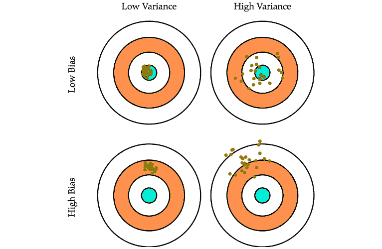

###### 图 7.1：使用视觉靶心图表示偏差-方差概念

在前面的图中，我们可以看到四个象限，用于具体区分偏差-方差权衡。该图用于解释回归用例中的模型偏差和方差。对于分类用例，以类似的方式直观地推断可能具有挑战性；然而，通过图例示例，我们获得了更大的图景。

我们理想的目标是训练一个具有低偏差和低方差的机器学习模型。然而，当我们有低偏差和高方差（前一个可视化中的右上象限）时，我们会看到对于输入数据的小幅变化，最终结果有显著的变化。另一方面，当我们有高偏差和低方差（可视化中的左下象限）时，我们可以看到最终结果集中在远离目标区域，对于输入的变化几乎没有变化。最后，我们具有高偏差和高方差，即我们远离目标，以及对于输入的小幅变化有大的变化。这将是模型最不理想的状态。

## 欠拟合和过拟合

在前面的场景中，当我们有高偏差时，我们在机器学习模型中定义了一个称为**欠拟合**的现象。同样，当我们有高方差时，我们在机器学习模型中定义了一个称为**过拟合**的现象。

下面的视觉演示了回归模型中**过拟合**、**欠拟合**和**理想平衡**的概念。我们可以看到高偏差导致过度简化的模型（即欠拟合）；高方差导致过度复杂的模型（即过拟合）；最后，我们在偏差和方差之间找到了正确的平衡：

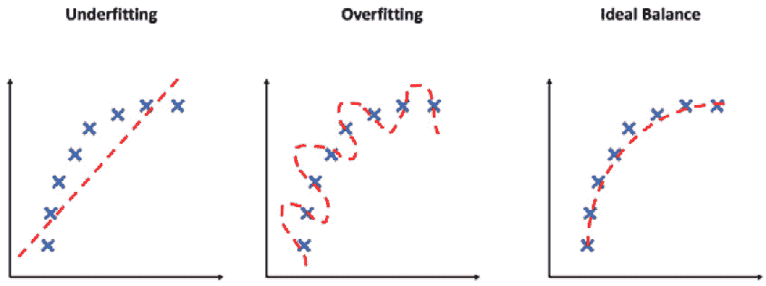

###### 图 7.2：过拟合、欠拟合和理想平衡的视觉演示

为了更有效地研究机器学习模型中的偏差和方差，我们使用了交叉验证技术。这些技术帮助我们更直观地理解模型性能。

## 定义一个示例用例

为了探索本章中的实际数据集，我们使用了`mlbench`包中已可用的小数据集，称为`PimaIndiansDiabetes`，这是一个适用于分类用例的便捷数据集。

数据集最初来自美国糖尿病、消化和肾脏疾病国家研究所。可以从数据集中定制出以下用例：当预测患者是否患有糖尿病作为少量医学诊断测量函数时。

#### 注意

更多信息可以在 http://math.furman.edu/~dcs/courses/math47/R/library/mlbench/html/PimaIndiansDiabetes.html 找到。

选择小于 1000 行的数据集作为用例是有意为之的。本章探讨的主题在常规使用案例中需要在大数据集上执行高计算时间。选择小数据集用于演示目的有助于在大多数使用主流硬件的读者中实现相对正常的计算时间。

### 练习 88：加载数据和探索数据

为了快速研究 `PimaIndiansDiabetes` 的整体特征并探索每列内容的特点，请执行以下步骤：

1.  使用以下命令加载 `mlbench`、`randomForest` 和 `dplyr` 库：

    ```py
    library(mlbench)
    library(randomForest)
    library(dplyr)
    ```

1.  使用以下命令从 `PimaIndiansDiabetes` 数据集中加载数据：

    ```py
    data(PimaIndiansDiabetes)
    df<-PimaIndiansDiabetes
    ```

1.  使用 `str` 命令探索数据集的维度并研究每列的内容：

    ```py
    str(df)
    ```

    输出如下：

    ```py
    'data.frame':768 obs. of  9 variables:
     $ pregnant: num  6 1 8 1 0 5 3 10 2 8 ...
     $ glucose : num  148 85 183 89 137 116 78 115 197 125...
     $ pressure: num  72 66 64 66 40 74 50 0 70 96 ...
     $ triceps : num  35 29 0 23 35 0 32 0 45 0 ...
     $ insulin : num  0 0 0 94 168 0 88 0 543 0 ...
     $ mass    : num  33.6 26.6 23.3 28.1 43.1 25.6 31 35.3 30.5 0 ...
     $ pedigree: num  0.627 0.351 0.672 0.167 2.288 ...
     $ age     : num  50 31 32 21 33 30 26 29 53 54 ...
     $ diabetes: Factor w/ 2 levels "neg","pos": 2 1 2 1 2 1 2 1 2 2 ...
    ```

如我们所见，数据集有 `768` 个观测值和 `9` 个变量，即 *8* 个独立变量和 *1* 个依赖的类别变量 `diabetes`，其值为 `pos` 表示阳性，`neg` 表示阴性。

我们将使用这个数据集，并在这个章节的后续主题中开发几个分类模型。

## 交叉验证

交叉验证是一种模型验证技术，有助于评估机器学习模型在独立数据集上的性能和泛化能力。它也被称为**旋转验证**，因为它通过从同一分布中抽取训练和验证数据，通过多次重复来接近模型的验证。

交叉验证帮助我们：

+   评估模型在未见数据上的鲁棒性。

+   估计期望性能指标的合理范围。

+   减少模型的过拟合和欠拟合。

交叉验证的一般原则是通过将数据分组并使用多数数据训练和少数数据测试，在多个迭代中在整个数据集上测试模型。重复的旋转确保模型已经在所有可用观测值上进行了测试。模型的最终性能指标是从所有旋转的结果中汇总和总结的。

为了研究模型是否存在高偏差，我们可以检查模型在所有旋转中的平均性能。如果平均性能指标表明整体准确率（对于分类）或**平均绝对百分比误差**（对于回归）较低，那么存在高偏差，模型欠拟合。为了研究模型是否存在高方差，我们可以研究期望性能指标在旋转中的标准差。高标准差将表明模型将具有高方差；也就是说，模型将过拟合。

在交叉验证中有几种流行的方法：

+   保留样本验证

+   K 折交叉验证

+   保留一个样本验证（LOOCV）

让我们详细探讨这些方法中的每一个。

## 保留样本方法/验证

这是在验证模型性能中使用的最简单的方法（尽管不是最推荐的方法）。我们一直在本书中使用这种方法来测试前几章中的模型性能。在这里，我们随机将可用数据集分为训练集和测试集。训练集和测试集之间最常用的分割比例是**70:30**或**80:20**。

这种方法的缺点主要是模型性能完全从分数测试数据集中评估，可能不是模型性能的最佳表示。模型的评估将完全取决于分割的类型，因此，最终进入训练集和测试集的数据点的性质，这可能会导致显著不同的结果和因此高方差。

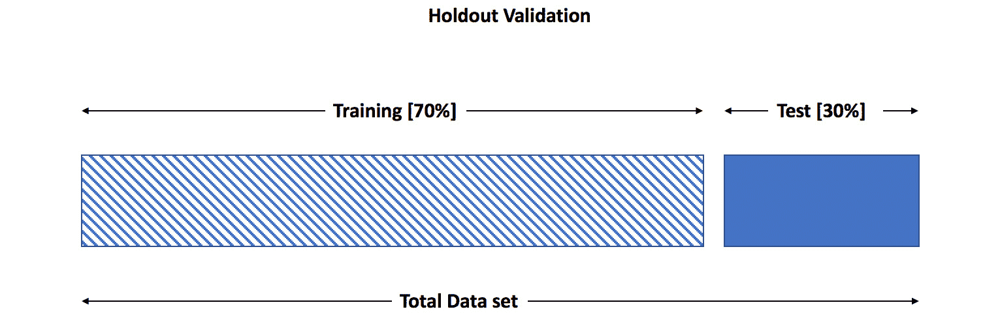

###### 图 7.3：留出法验证

以下练习将数据集分为 70%的训练集和 30%的测试集，并在训练集上构建随机森林模型，然后使用测试集评估性能。这种方法在*第五章*，*分类*中广泛使用，所以你对此过程不应该感到惊讶。

### 练习 89：使用留出法进行模型评估

在这个练习中，我们将利用在*练习 1*：*加载数据和探索数据*中加载到内存中的数据，创建一个简单的随机森林分类模型，并使用留出验证技术进行模型评估。

执行以下步骤：

1.  首先，使用以下命令将`caret`包导入系统。`caret`包为我们提供了用于模型评估的现成函数，即`ConfusionMatrix`：

    ```py
    library(caret)
    ```

1.  现在，按照以下方式设置种子以实现可重复性：

    ```py
    set.seed(2019)
    ```

1.  使用以下命令创建 70%的`train`和 30%的`test`数据集：

    ```py
    train_index<- sample(seq_len(nrow(df)),floor(0.7 * nrow(df)))
    train <- df[train_index,]
    test <- df[-train_index,]
    ```

1.  使用`print`函数显示所需的输出：

    ```py
    print("Training Dataset shape:")
    print(dim(train))
    print("Test Dataset shape:")
    print(dim(test))
    ```

1.  通过对`train`数据集进行拟合来创建随机森林模型：

    ```py
    model <-randomForest(diabetes~.,data=train, mtry =3)
    ```

1.  使用以下命令打印模型：

    ```py
    print(model)
    ```

1.  如下图所示，在`test`数据集上使用`predict`方法：

    ```py
    y_predicted<- predict(model, newdata = test)
    ```

1.  使用以下命令创建并打印`Confusion-Matrix`：

    ```py
    results<-confusionMatrix(y_predicted, test$diabetes, positive= 'pos')
    print("Confusion Matrix  (Test Data)- ")
    print(results$table)
    ```

1.  使用以下命令打印总体准确率：

    ```py
    results$overall[1]
    ```

    输出如下：

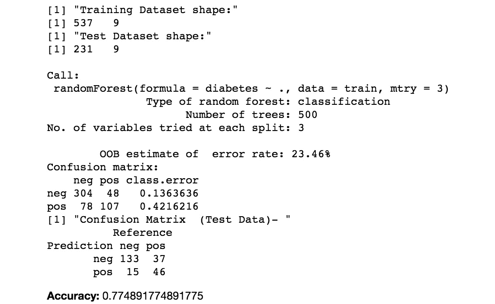

###### 图 7.4：使用留出法进行模型评估

我们可以看到总体准确率为 77%。这可能不是模型性能的最佳表示，因为我们只在一个随机测试样本上进行了评估。如果使用不同的测试样本，结果可能会有所不同。现在，让我们探索其他可以克服这种权衡的交叉验证方法。

## K 折交叉验证

这种技术是模型评估最推荐的方法。在这个技术中，我们将数据分为*k*组，使用*k-1*组进行训练，剩余的（1 组）用于验证。这个过程重复*k*次，在每次迭代中，使用一个新的组进行验证，因此，每个组在某个时刻都会被用于测试。整体结果是*k*次迭代的平均误差估计。

*k*折交叉验证因此克服了保留法技术的缺点，通过减轻与分割性质相关的风险，因为每个数据点在*k*次迭代中都会被测试一次。随着*k*值的增加，模型的方差降低。最常用的*k*值是 5 或 10。这种技术的最大缺点是它需要训练模型*k*次（对于*k*次迭代）。因此，模型训练和验证所需的总计算时间大约是保留法方法的*k*倍。

以下可视化演示了五折交叉验证和所有旋转的汇总结果（假设）：

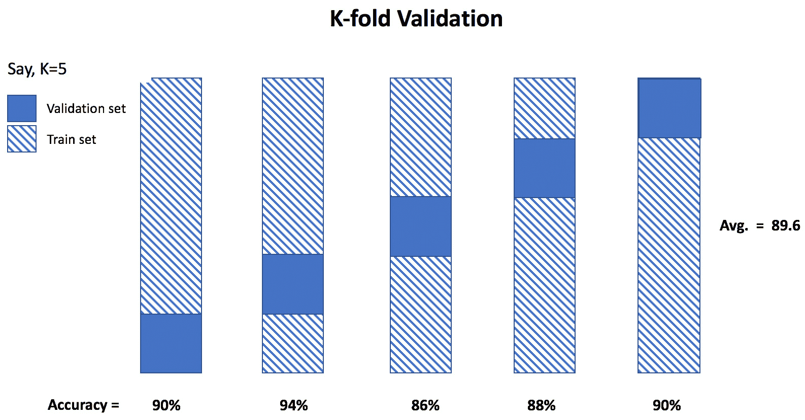

###### 图 7.5：K 折验证

以下代码片段在之前示例中使用相同的数据集执行 5 折交叉验证，并打印所有折的平均准确率。

### 练习 90：使用 K 折交叉验证进行模型评估

我们将利用之前两个练习中使用的相同数据集，构建一个随机森林分类模型样本，并使用 k 折交叉验证评估性能。

要使用 k 折交叉验证方法进行模型评估，请执行以下步骤：

1.  首先，使用以下命令将`caret`包导入系统：

    ```py
    library(caret)
    ```

1.  接下来，使用以下命令将`seed`设置为`2019`：

    ```py
    set.seed(2019)
    ```

1.  现在，使用以下命令定义一个用于五折交叉验证的函数：

    ```py
    train_control = trainControl(method = "cv", number=5, savePredictions = TRUE,verboseIter = TRUE)
    ```

1.  将`mtry`的值定义为`3`（以匹配我们之前的示例）：

    ```py
    parameter_values = expand.grid(mtry=3)
    ```

1.  使用以下命令拟合模型：

    ```py
    model_rf_kfold<- train(diabetes~., data=df, trControl=train_control, 
                    method="rf",  metric= "Accuracy", 
    tuneGrid = parameter_values)
    ```

1.  接下来，打印整体准确率（平均所有折）：

    ```py
    model_rf_kfold$results[2]
    ```

1.  现在，使用以下命令打印详细的预测数据集：

    ```py
    print("Shape of Prediction Dataset")
    print(dim(model_rf_kfold$pred))
    print("Prediction detailed results - ")
    head(model_rf_kfold$pred) #print first 6 rows
    tail(model_rf_kfold$pred) #print last 6 rows
    print("Accuracy across each Fold-")
    model_rf_kfold$resample
    print(paste("Average Accuracy :",mean(model_rf_kfold$resample$Accuracy)))
    print(paste("Std. Dev Accuracy :",sd(model_rf_kfold$resample$Accuracy)))
    ```

    输出如下：

    ```py
    + Fold1: mtry=3 
    - Fold1: mtry=3 
    + Fold2: mtry=3 
    - Fold2: mtry=3 
    + Fold3: mtry=3 
    - Fold3: mtry=3 
    + Fold4: mtry=3 
    - Fold4: mtry=3 
    + Fold5: mtry=3 
    - Fold5: mtry=3 
    ...
    Accuracy: 0.7590782
    "Shape of Prediction Dataset"
    768   5
    "Prediction detailed results - "
    ...
    "Average Accuracy : 0.759078176725236"
    "Std. Dev Accuracy : 0.0225461480724459"
    ```

如我们所见，整体准确率略有下降至`76%（四舍五入自 75.9）`。这是每个折的平均准确率。我们还在最后手动计算了每个折的准确率的平均值和标准差。每个折的准确率标准差为`2%`，这相当低，因此，我们可以得出结论，方差较低。整体准确率并不低，所以模型具有适度的低偏差。整体性能有改进的空间，但我们的模型目前既不过拟合也没有欠拟合。

如果您观察代码，我们使用了`trainControl`函数，它为我们提供了必要的结构来定义使用`cv`方法的交叉验证类型，以及折叠数等于`5`。

我们使用一个额外的结构来指示需要保存预测，我们可以在以后详细分析。然后，将`trainControl`对象传递给`caret`包中的`train`函数，在那里我们定义要使用的算法类型为随机森林，使用`rf`方法，并将度量作为`tuneGrid`结构在此点理想上不是必要的；它用于超参数调整，我们将在后面介绍。然而，`caret`包中的`train`函数默认通过使用超参数调整来简化函数。它尝试在多次迭代中不同的`mtry`值，并返回具有最佳值的最终预测。为了与前面的例子进行苹果对苹果的比较，我们必须将`mtry`的值限制为`3`。因此，我们使用了`expand.grid`对象来定义在交叉验证过程中使用的`mtry`值。

当`train`函数提供用于交叉验证的`trainControl`对象时，会将数据分为五个部分，并利用四个部分进行训练，一个部分进行测试。这个过程重复五次（`k`设置为`5`），模型在数据集的每个部分上迭代测试。

我们可以在模型结果中的`pred`对象（数据表）中看到详细的结果。在这里，我们可以看到每行数据的观测值（实际值）和预测值。此外，它还标注了在折叠中使用的超参数值以及它所属的折叠编号，用于测试。

`model`对象中的`resample` DataFrame 记录了交叉验证中每个折叠的准确性和其他指标。我们可以探索我们感兴趣的指标的均值和标准差，以研究偏差和方差。

从`k`折叠交叉验证中得到的最终结论是，对于该用例，随机森林模型的准确率为 76%（即所有部分的平均准确率）。

## 单样本留出法验证

在这种技术中，我们将`k`折叠验证推向了逻辑上的极限。我们不是创建`k`个部分，其中`k`可以是 5 或 10，而是选择部分的数量与可用数据点的数量相同。因此，每个部分只有一个样本。我们使用所有样本除了一个用于训练，并在留出的样本上测试模型，重复`n`次，其中`n`是训练样本的数量。最后，计算类似于`k`折叠验证的平均误差。这种技术的缺点是模型被训练了`n`次，使其计算成本高昂。如果我们处理的是相当大的数据样本，最好避免这种验证方法。

留一法验证也称为**L**eave-**O**ne-**O**ut **C**ross-**V**alidation (LOOCV)。以下视觉演示了对于*n*个样本的留一法验证：

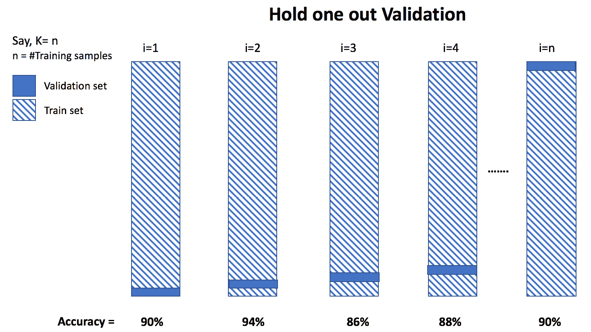

###### 图 7.6：留一法验证

以下练习使用随机森林和相同的实验设置在相同的 dataset 上执行留一法或留一法交叉验证。

### 练习 91：使用留一法验证进行模型评估

与*练习 2*：*使用留出法进行模型评估*和*练习 3*：*使用 K 折交叉验证进行模型评估*类似，我们将继续使用相同的 dataset，并执行留一法验证来评估模型性能。

要使用留一法验证方法进行模型评估，执行以下步骤：

1.  首先，使用以下命令定义留一法验证的函数：

    ```py
    set.seed(2019)
    train_control = trainControl(method = "LOOCV", savePredictions = TRUE)
    ```

1.  接下来，定义`mtry`的值为`3`（以匹配我们之前的示例）：

    ```py
    parameter_values = expand.grid(mtry=3)
    ```

1.  拟合模型：

    ```py
    model_rf_LOOCV<- train(diabetes~., data=df, trControl=train_control, 
                        method="rf",  metric= "Accuracy", 
    tuneGrid = parameter_values)
    ```

1.  现在，打印整体准确率（平均所有折）：

    ```py
    print(model_rf_LOOCV$results[2])
    ```

1.  使用以下命令打印详细的预测 dataset：

    ```py
    print("Shape of Prediction Dataset")
    print(dim(model_rf_LOOCV$pred))
    print("Prediction detailed results - ")
    head(model_rf_LOOCV$pred) #print first 6 rows
    tail(model_rf_LOOCV$pred) #print last 6 rows
    ```

    输出如下：

    ```py
    Accuracy
    1 0.7721354
    [1] "Shape of Prediction Dataset"
    [1] 768   4
    [1] "Prediction detailed results - "
    "Shape of Prediction Dataset"
     768   4
    "Prediction detailed results - "
    ...
    ```

如我们所见，整体准确率在`77%`几乎与*K*折交叉验证相同（增加了`1%`）。这里的**LOOCV**结构代表**留一法交叉验证**。这个过程计算成本很高，因为它需要迭代与数据点数量一样多的训练过程（在本例中为 768）。

## 超参数优化

**超参数优化**是寻找或优化机器学习模型最佳超参数集的过程。超参数是定义机器学习模型宏观特性的参数。它基本上是模型的元参数。超参数与模型参数不同；模型参数是在学习过程中由模型学习的，然而，超参数是由设计模型的科学家设置的，并且不能由模型学习。

为了更直观地理解这个概念，让我们用通俗易懂的语言来探讨这个话题。以决策树模型为例。树结构，包括根节点、决策节点和叶节点（类似于逻辑回归中的 beta 系数）是通过数据的训练（拟合）来学习的。当模型最终收敛（找到模型参数的最优值集）时，我们就得到了最终的树结构，它定义了最终预测的遍历路径。然而，对于模型来说，宏观特征是不同的；在决策树的情况下，它将是复杂度参数，表示为 `cp`。复杂度参数 `cp` 限制了树相对于深度的增长；也就是说，如果信息增益或任何其他相关指标没有超过阈值，则不允许节点分支。应用这个新规则限制了树的深度，并有助于更好地泛化树。因此，复杂度参数是一个定义模型宏观特征的参数，然后调整训练过程，我们称之为超参数。

每个机器学习算法都将有一组不同的超参数与之关联，这将帮助模型忽略错误（噪声），从而提高泛化能力。以下表格中展示了机器学习算法中的一些超参数示例：

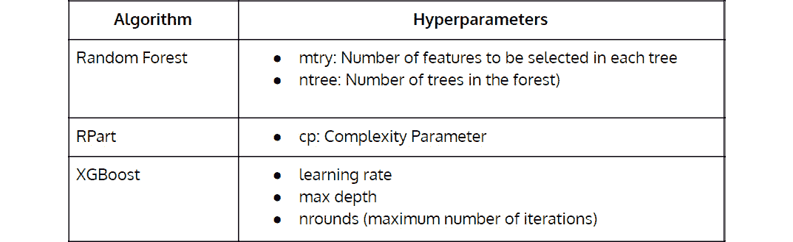


###### 图 7.7：机器学习算法中的超参数

#### 注意

在 R 和 Python 提供的实现中，超参数的数量有时是不同的。例如，R 中的 `caret` 包实现的逻辑回归不调整 `c` 参数，而与 `sklearn` 中的 Python 实现不同。同样，Python 的 `sklearn` 中的随机森林实现允许将树的深度作为超参数使用。

关于基于梯度的超参数优化的信息可以在以下链接中找到：

[`arxiv.org/abs/1502.03492`](https://arxiv.org/abs/1502.03492)

[`proceedings.mlr.press/v37/maclaurin15.pdf`](http://proceedings.mlr.press/v37/maclaurin15.pdf)

超参数调整的过程可以概括为寻找最优超参数值集的迭代过程，以实现最佳的机器学习模型。有几种方法可以实现这一点。鉴于这个过程是迭代的，我们可以断定会有几种方法来优化寻找最优值集的路径。让我们深入讨论可以采用的广泛策略，用于超参数调整。

## 网格搜索优化

寻找模型最优超参数集的最简单方法就是使用**暴力搜索**方法，迭代每个超参数值的组合，然后找到最优化组合。这将产生期望的结果，但不是在期望的时间内。在大多数情况下，我们训练的模型将非常大，需要大量的计算时间进行训练。迭代每个组合不是理想的选择。为了改进暴力搜索方法，我们有了网格搜索优化；正如其名所示，在这里，我们定义了一个值网格，将用于迭代超参数值的全面组合。

用通俗易懂的话来说，对于网格搜索优化，我们为每个我们感兴趣要优化的超参数定义一个有限值的集合。然后，模型将针对所有可能的超参数值的组合进行训练，并选择表现最佳的组合作为最优集。

以下图表展示了针对假设参数集的网格搜索优化理念。使用超参数网格定义组合，并对每个组合进行模型训练：

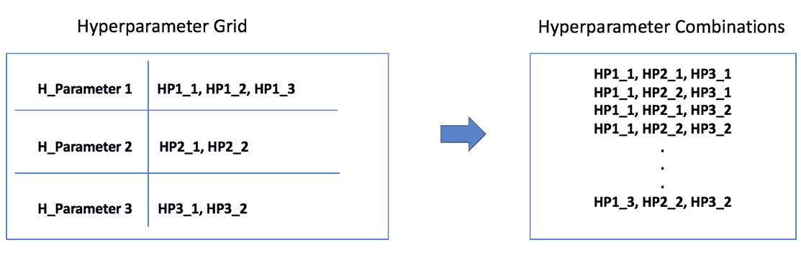

###### 图 7.8：超参数网格和组合

网格搜索优化的优势在于，它大大减少了在有限的候选值集合上迭代寻找最优超参数集所需的时间（与暴力搜索相比）。然而，这也带来了一定的权衡。网格搜索优化模型假设每个超参数的最优值位于为每个超参数提供的候选值列表中。如果我们不将最佳值作为候选值列入列表（网格），我们将永远不会得到算法的最优值集。因此，在最终确定候选值列表之前，我们需要探索每个超参数最推荐值列表的一些建议。超参数优化最适合经验丰富的数据科学专业人士，他们对于各种不同的机器学习问题都有很强的判断力。

我们为机器学习模型定义超参数，以定制模型的学习（拟合）过程。

### 练习 92：执行网格搜索优化 – 随机森林

在这个练习中，我们将使用`caret`包对模型执行网格搜索优化，其中我们定义了一个要测试和评估的最佳模型的值网格。我们将使用与之前主题中相同的随机森林算法和数据集。

执行以下步骤：

1.  首先，使用以下命令将`seed`设置为`2019`：

    ```py
    set.seed(2019)
    ```

1.  接下来，使用以下命令定义交叉验证方法：

    ```py
    train_control = trainControl(method = "cv",  number=5, savePredictions = TRUE)
    ```

1.  现在，定义`parameter_grid`如下所示：

    ```py
    parameter_grid = expand.grid(mtry=c(1,2,3,4,5,6))
    ```

1.  使用交叉验证和网格搜索优化拟合模型：

    ```py
    model_rf_gridSearch<- train(diabetes~., data=df, trControl=train_control, 
                   method="rf",  metric= "Accuracy", 
    tuneGrid = parameter_grid)
    ```

1.  打印整体准确率（平均每个超参数组合的所有折数）：

    ```py
    print("Accuracy across hyperparameter Combinations:")
    print(model_rf_gridSearch$results[,1:2])
    ```

    输出如下：

    ```py
    [1] "Accuracy across hyperparameter Combinations:"
    mtry  Accuracy
    1    1 0.7564893
    2    2 0.7604108
    3    3 0.7642730
    4    4 0.7668704
    5    5 0.7629658
    6    6 0.7590697
    ```

1.  打印详细的预测数据集：

    ```py
    print("Shape of Prediction Dataset")
    print(dim(model_rf_gridSearch$pred))
    [1] "Shape of Prediction Dataset"
    [1] 4608    5
    print("Prediction detailed results - ")
    print(head(model_rf_gridSearch$pred)) #print the first 6 rows
    print(tail(model_rf_gridSearch$pred)) #print the last 6 rows
    [1] "Prediction detailed results - "
    predobsrowIndexmtry Resample
    1  neg pos       10    1    Fold1
    2  neg pos       24    1    Fold1
    3  neg neg       34    1    Fold1
    4  neg pos       39    1    Fold1
    5  neg neg       43    1    Fold1
    6  neg neg       48    1    Fold1
    predobsrowIndexmtry Resample
    4603  neg neg      752    6    Fold5
    4604  neg neg      753    6    Fold5
    4605  pos pos      755    6    Fold5
    4606  neg neg      759    6    Fold5
    4607  neg neg      761    6    Fold5
    4608  pos pos      762    6    Fold5
    print("Best value for Hyperparameter 'mtry':")
    print(model_rf_gridSearch$bestTune)
    [1] "Best value for Hyperparameter 'mtry':"
    mtry
    4    4
    print("Final (Best) Model ")
    print(model_rf_gridSearch$finalModel)
    [1] "Final (Best) Model "
    Call:
    randomForest(x = x, y = y, mtry = param$mtry) 
                   Type of random forest: classification
                         Number of trees: 500
    No. of variables tried at each split: 4
    OOB estimate of  error rate: 23.7%
    Confusion matrix:
        neg pos class.error
    neg 423  77    0.154000
    pos 105 163    0.391791
    ```

1.  绘制网格度量图：

    ```py
    library(repr)
    options(repr.plot.width=8, repr.plot.height=5)
    plot(model_rf_gridSearch)
    ```

    输出如下：

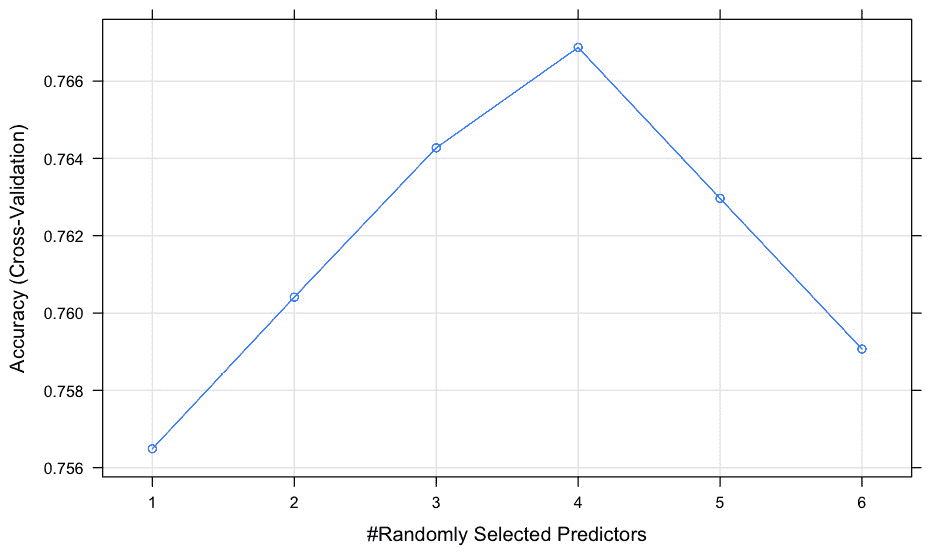

###### 图 7.9：随机森林模型在不同超参数值下的准确率

如我们所见，在准确率方面，使用`mtry`超参数的值为 4 时取得了最佳结果。输出中高亮的部分将帮助您理解整体总结过程。我们使用了 5 折交叉验证以及网格搜索优化，其中我们为`mtry`超参数定义了值为（1，2，3，4，5 和 6）的网格。每个值的准确率也显示出来，我们可以看到`mtry`等于`4`的结果比其他结果略高。最后，我们还打印了网格搜索优化过程返回的最终模型。

到目前为止，我们只看了随机森林作为实现交叉验证和超参数调整的模型。我们可以将此扩展到任何其他算法。例如**XGBoost**算法比随机森林（使用 R 实现）有更多的超参数，因此使整个过程在计算上稍微昂贵一些，也更为复杂。在下面的练习中，我们在同一数据集上对 XGBoost 执行 5 折交叉验证，以及网格搜索优化。代码中高亮的部分是针对 XGBoost 的更改。

#### 自动超参数调整：

https://towardsdatascience.com/automated-machine-learning-hyperparameter-tuning-in-python-dfda59b72f8a

### 练习 93：网格搜索优化 – XGBoost

与上一个练习类似，我们将对 XGBoost 模型执行网格搜索优化，而不是随机森林，并在一组更大的超参数上找到最佳模型。

要对 XGBoost 模型执行网格搜索优化，请执行以下步骤：

1.  首先，使用以下命令将`seed`设置为`2019`：

    ```py
    set.seed(2019)
    ```

1.  接下来，使用以下命令导入`dplyr`库：

    ```py
    library(dplyr)
    ```

1.  使用以下命令定义交叉验证方法：

    ```py
    train_control = trainControl(method = "cv",  number=5, savePredictions = TRUE)
    ```

1.  接下来，定义参数网格，如图所示：

    ```py
    parameter_grid = expand.grid(nrounds = c(30,50,60,100),
                                 eta=c(0.01,0.1,0.2,0.3),
    max_depth = c(2,3,4,5),
                                 gamma = c(1),
    colsample_bytree = c(0.7),
    min_child_weight = c(1)  ,
                                 subsample = c(0.6)
                                )
    ```

1.  使用交叉验证和网格搜索优化拟合模型：

    ```py
    model_xgb_gridSearch<- train(diabetes~., data=df, trControl=train_control, 
                   method="xgbTree",  metric= "Accuracy",
    tuneGrid = parameter_grid)
    ```

1.  打印详细的预测数据集：

    ```py
    print("Shape of Prediction Dataset")
    print(dim(model_xgb_gridSearch$pred))
    "Shape of Prediction Dataset"
      49152    11
    print("Prediction detailed results - ")
    head(model_xgb_gridSearch$pred) #print the first 6 rows
    tail(model_xgb_gridSearch$pred) #print the last 6 rows
    [1] "Prediction detailed results - "
    predobsrowIndex  eta max_depth gamma colsample_bytreemin_child_weight subsample nrounds Resample
    1  pos pos        3 0.01         2     1              0.7                1       0.6     100    Fold1
    2  neg neg        6 0.01         2     1              0.7                1       0.6     100    Fold1
    3  neg pos       20 0.01         2     1              0.7                1       0.6     100    Fold1
    4  pos pos       23 0.01         2     1              0.7                1       0.6     100    Fold1
    5  pos pos       25 0.01         2     1              0.7                1       0.6     100    Fold1
    6  pos pos       27 0.01         2     1              0.7                1       0.6     100    Fold1
    predobsrowIndex eta max_depth gamma colsample_bytreemin_child_weight subsample nrounds Resample
    49147  neg pos      732 0.3         5     1              0.7                1       0.6      60    Fold5
    49148  neg pos      740 0.3         5     1              0.7                1       0.6      60    Fold5
    49149  neg neg      743 0.3         5     1              0.7                1       0.6      60    Fold5
    49150  pos pos      749 0.3         5     1              0.7                1       0.6      60    Fold5
    49151  neg pos      751 0.3         5     1              0.7                1       0.6      60    Fold5
    49152  neg neg      763 0.3         5     1              0.7                1       0.6      60    Fold5
    print("Best values for all selected Hyperparameters:")
    model_xgb_gridSearch$bestTune
    [1] "Best values for all selected Hyperparameters:"
    nroundsmax_depth eta gamma colsample_bytreemin_child_weight subsample
    27      60         4 0.1     1              0.7                1       0.6
    ```

1.  打印整体准确率（平均每个超参数组合的所有折数）：

    ```py
    print("Average results across different combination of Hyperparameter Values")
    model_xgb_gridSearch$results %>% arrange(desc(Accuracy)) %>% head(5)
    ```

    输出如下：

    ```py
    [1] "Average results across different combination of Hyperparameter Values"
       eta max_depth gamma colsample_bytreemin_child_weight subsample nrounds  Accuracy     Kappa AccuracySD
    1 0.10         4     1              0.7                1       0.6      60 0.7695612 0.4790457 0.02507631
    2 0.01         3     1              0.7                1       0.6      30 0.7695442 0.4509049 0.02166056
    3 0.01         2     1              0.7                1       0.6     100 0.7695187 0.4521142 0.03373126
    4 0.30         2     1              0.7                1       0.6      30 0.7682540 0.4782334 0.01943638
    5 0.01         5     1              0.7                1       0.6      30 0.7682455 0.4592689 0.02836553
    KappaSD
    1 0.05067601
    2 0.05587205
    3 0.08038248
    4 0.04249313
    5 0.06049950
    ```

1.  绘制图表：

    ```py
    plot(model_xgb_gridSearch)
    ```

    输出如下：

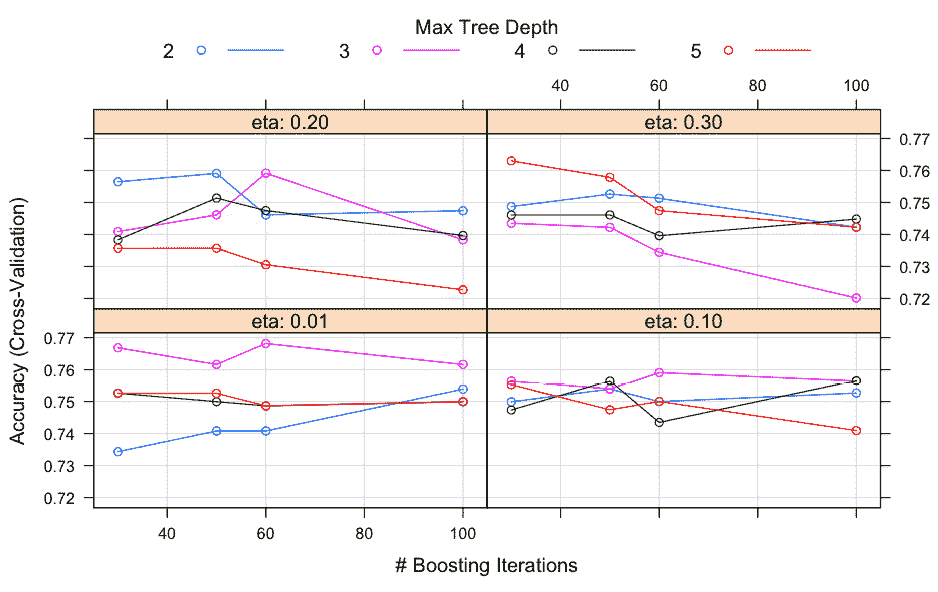

###### 图 7.10：可视化 XGBoost 模型在不同超参数值下的准确率

练习的输出可能看起来相当长，但让我们快速总结一下结果。由于我们在 XGBoost 上执行交叉验证和超参数调整，我们需要为更多的超参数提供一个网格。输出中的第一行表明预测数据集的大小为 49152 x 11。这表明了在交叉验证的每个折叠中，每个超参数组合的全面预测。我们已经打印了预测数据集的头部和尾部（数据的前六行和后六行），我们可以看到每个模型实例的预测结果以及相关的超参数，以及相应的折叠。

下一个表格显示了基于模型准确度的最佳超参数值集。我们可以看到，`nrounds=60`、`max_depth=3`、`eta=0.01`、`gamma=1`、`colsample_bytree=0.7`、`min_child_weight=1`和`subsample=0.6`的值返回了模型的最佳性能。

下一个表格显示了按性能降序排列的每个超参数组合的对应准确度。最佳准确度位于表格的第一行，这是使用最佳超参数集实现的。我们实现了`76.8%`的准确度。

最后，我们在超参数上绘制了结果。鉴于超参数的数量较多，我们有一个更密集的图表来展示结果。然而，我们可以直接检查`eta=0.01`象限的结果，并研究最大深度和`nrounds`的变化，从而得出最佳性能来自相同超参数组合的结论。

## 随机搜索优化

在随机搜索优化中，我们克服了网格搜索优化的一个缺点，即在每个超参数的网格中从候选值中选择最佳的一组最优值。在这里，我们选择从分布中随机选择（对于超参数的连续值），而不是我们定义的静态列表。在随机搜索优化中，我们有更广泛的选项可供搜索，因为超参数的连续值是从分布中随机选择的。这在很大程度上增加了找到超参数最佳值的机会。

我们中的一些人可能已经开始了对随机选择如何始终有可能包含超参数的最佳值的理解。真正的答案是，它并不总是比网格搜索有绝对优势，但通过相当大量的迭代，随机搜索相对于网格搜索找到更优超参数集的机会会增加。可能会有随机搜索在给定随机选择值的情况下，对于超参数调整返回比网格搜索更差值的情况，然而，大多数数据科学专业人士都有实证验证，即相当数量的迭代后，随机搜索在大多数情况下优于网格搜索。

随机搜索优化的实现已在`caret`包中简化。我们必须定义一个名为`tuneLength`的参数，它将为随机搜索设置一个最大迭代次数的上限。迭代次数相当于模型将被训练的次数，因此数值越高，获得最佳超参数集和关联性能提升的机会就越高。然而，迭代次数越高，执行所需的计算时间也就越长。

在以下练习中，让我们对相同的数据集在随机森林算法上执行随机搜索优化。

### 练习 94：在随机森林模型上使用随机搜索优化

我们将扩展随机搜索优化在机器学习模型中的优化过程。在这里，我们只定义我们希望执行的迭代次数，这些迭代次数将使用随机组合的超参数值对模型进行。

本练习的目的是在随机森林模型上执行随机搜索优化。

执行以下步骤：

1.  首先，使用以下命令将`seed`设置为`2019`：

    ```py
    set.seed(2019)
    ```

1.  定义交叉验证方法，如图所示：

    ```py
    train_control = trainControl(method = "cv",  number=5, savePredictions = TRUE)
    ```

1.  使用交叉验证和随机搜索优化拟合模型：

    ```py
    model_rf_randomSearch<- train(diabetes~., data=df, trControl=train_control, 
                            method="rf",  metric= "Accuracy",tuneLength = 15)
    ```

1.  打印详细的预测数据集：

    ```py
    print("Shape of Prediction Dataset")
    print(dim(model_rf_randomSearch$pred))
    [1] "Shape of Prediction Dataset"
    [1] 5376    5
    print("Prediction detailed results - ")
    head(model_rf_randomSearch$pred) #print the first 6 rows
    tail(model_rf_randomSearch$pred) #print the last 6 rows
    [1] "Prediction detailed results - "
    predobsrowIndexmtry Resample
    1  pos pos        1    2    Fold1
    2  neg neg        4    2    Fold1
    3  pos pos        9    2    Fold1
    4  neg pos       10    2    Fold1
    5  neg neg       13    2    Fold1
    6  pos pos       17    2    Fold1
    predobsrowIndexmtry Resample
    5371  neg neg      737    8    Fold5
    5372  neg neg      742    8    Fold5
    5373  neg neg      743    8    Fold5
    5374  neg pos      758    8    Fold5
    5375  neg neg      759    8    Fold5
    5376  neg neg      765    8    Fold5
    print("Best values for all selected Hyperparameters:")
    model_rf_randomSearch$bestTune
    [1] "Best values for all selected Hyperparameters:"
    mtry
    7    8
    ```

1.  打印总体准确率（平均每个超参数组合的所有折的准确率）：

    ```py
    model_rf_randomSearch$results %>% arrange(desc(Accuracy)) %>% head(5)
    ```

    输出如下：

    ```py
    mtry  Accuracy     Kappa AccuracySDKappaSD
    1    8 0.7838299 0.5190606 0.02262610 0.03707616
    2    7 0.7773194 0.5047353 0.02263485 0.03760842
    3    3 0.7760037 0.4945296 0.02629540 0.05803215
    4    6 0.7734063 0.4964970 0.02451711 0.04409090
    5    5 0.7720907 0.4895592 0.02618707 0.04796626
    ```

1.  绘制随机森林模型随机搜索优化的数据：

    ```py
    plot(model_rf_randomSearch)
    ```

    输出如下：

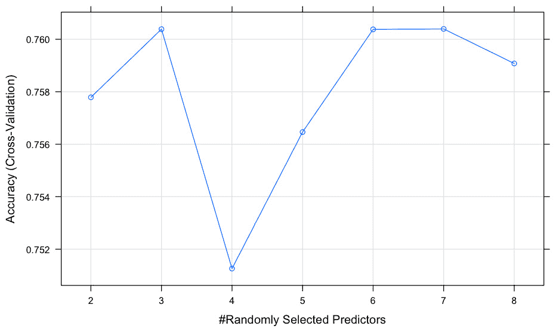

###### 图 7.11：可视化超参数值下的准确率

我们将`tuneLength`参数设置为`15`；然而，由于 R 中的随机森林只关注 1 个超参数的调优，即`mtry`（特征选择数量），迭代次数在`7`次时耗尽。这是因为数据集中只有八个独立变量。在大多数一般情况下，建议根据数据中的特征数量设置一个更高的数值。我们可以看到`mtry`的最佳值是在 7 时找到的。该图展示了不同`mtry`值之间的差异。使用此模型我们达到的最佳准确率是 76%。

现在我们尝试使用 XGBoost 进行相同的实验。在这里，我们将`tuneLength`设置为`35`，这将非常耗时，即*15 x 5（折）= 75*模型迭代。这将比之前的任何迭代都要长得多。如果您想更快地看到结果，您可能需要通过减少`tuneLength`的迭代次数。

### 练习 95：随机搜索优化 – XGBoost

与随机森林类似，我们将对 XGBoost 模型进行随机搜索优化。XGBoost 模型有更多的超参数需要调优，因此更适合随机搜索优化。我们将利用与之前练习相同的相同数据集来构建 XGBoost 模型，然后进行优化。

本练习的目的是对 XGBoost 模型进行随机搜索优化。

执行以下步骤：

1.  使用以下命令将`seed`设置为`2019`：

    ```py
    set.seed(2019)
    ```

1.  使用以下命令定义交叉验证方法：

    ```py
    train_control = trainControl(method = "cv",  number=5, savePredictions = TRUE)
    ```

1.  使用交叉验证和随机搜索优化来拟合模型：

    ```py
    model_xgb_randomSearch<- train(diabetes~., data=df, trControl=train_control, 
                                   method="xgbTree", metric= "Accuracy",tuneLength = 15)
    ```

1.  打印详细的预测数据集：

    ```py
    print("Shape of Prediction Dataset")
    print(dim(model_xgb_randomSearch$pred))
    print("Prediction detailed results - ")
    head(model_xgb_randomSearch$pred) #print the first 6 rows
    tail(model_xgb_randomSearch$pred) #print the last 6 rows
    print("Best values for all selected Hyperparameters:")
    model_xgb_randomSearch$bestTune
    ```

1.  打印总体准确率（平均每个超参数组合的所有折的准确率）：

    ```py
    model_xgb_randomSearch$results %>% arrange(desc(Accuracy)) %>% head(5)
    ```

    输出如下：

    ```py
    "Shape of Prediction Dataset"
    10368000       11
    "Prediction detailed results - "
    ```

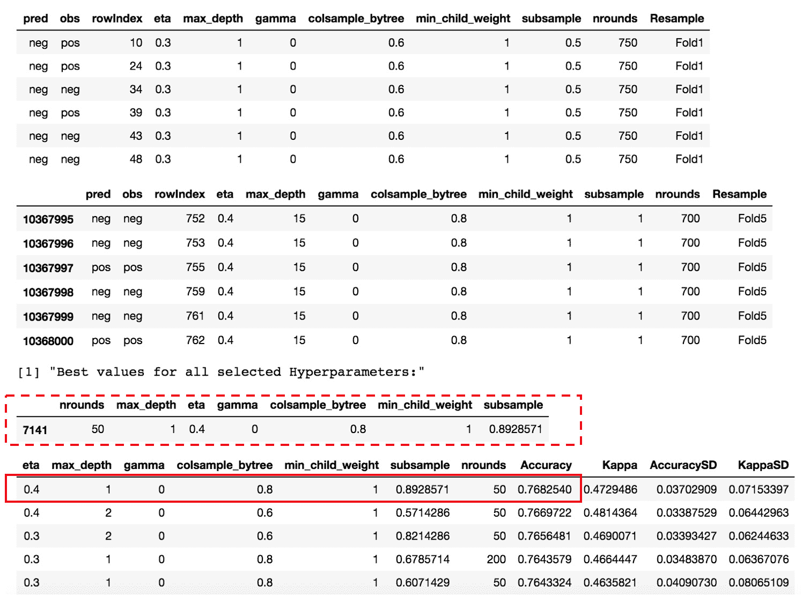

###### 图 7.12：详细的预测结果

使用*随机搜索优化*，我们可以看到为 XGBoost 模型选定的不同参数集作为最佳组合。在这里，请注意，网格搜索和随机搜索的准确率相同（差异很小），然而参数值却完全不同。学习率（`eta`）为 0.4，`max_depth`为 1 而不是 3，`colsample_byTree`为 0.8 而不是 0.7，`nrounds`为 50 而不是 60。我们没有将这些值作为网格搜索的候选值。在随机搜索中，由于有更广泛的选项可供选择，与网格搜索相比，我们可能会得到更有希望的结果。然而，这却是以*更高的计算时间*为代价的。

此外，当前使用的当前数据集是一个较小的数据集（约 800 个样本）。随着用例变得更加有说服力（具有更多特征和更多数据），随机搜索和网格搜索之间的性能差异可能会更大。

作为一项经验法则，强烈建议在问题空间判断不显著的情况下，选择随机搜索而不是网格搜索。

## 贝叶斯优化

网格搜索和随机搜索之间的一项主要权衡是，这两种技术都不跟踪用于模型训练的超参数组合的过去评估。理想情况下，如果在这个路径中引入一些人工智能，能够指示所选超参数列表的历史性能以及通过在正确方向上推进迭代来提高性能的机制，这将大大减少找到超参数最优值所需迭代的数量。然而，网格搜索和随机搜索在这方面有所欠缺，它们会迭代所有提供的组合，而不考虑任何来自先前迭代的线索。

通过**贝叶斯优化**，我们通过开发一个将超参数映射到所选损失函数（目标函数）的概率得分的概率模型，从而克服了这个权衡，该模型能够跟踪先前迭代及其评估。这个概率模型也被称为机器学习模型中主要损失函数的**代理模型**，与损失函数相比，它更容易优化。

讨论该过程的数学背景和推导将超出本章的范围。贝叶斯优化中用于超参数调整的整体过程可以简化如下：

+   定义一个代理模型（超参数到损失函数的概率映射）。

+   找到代理模型的最佳参数。

+   将参数应用于主要损失函数，并根据结果在正确的方向上更新模型。

+   重复执行，直到达到定义的迭代性能。

使用这个简单的框架，贝叶斯优化在大多数情况下都通过最少的迭代次数提供了理想的超参数集。由于这种方法跟踪了过去的迭代及其关联的性能，因此随着数据量的增加，其实践变得更加准确。贝叶斯方法效率高且更实用，因为它们在许多方面类似于人脑；对于任何要执行的任务，我们试图理解世界的初始观点，然后根据新的经验改进我们的理解。贝叶斯超参数优化利用了相同的原理，并允许通过明智的决策在调整模型超参数时找到优化的路径。*Bergstra 等人*（http://proceedings.mlr.press/v28/bergstra13.pdf）的一篇论文清楚地解释了贝叶斯优化相对于随机搜索优化的优势。

贝叶斯优化中有几种技术可以应用于机器学习领域的超参数调整。贝叶斯方法的流行形式是**序列模型优化**（SMBO），它本身又有几种变体。SMBO 中的每种方法都根据代理模型的定义和用于评估和更新参数的准则而有所不同。代理模型的一些流行选择包括**高斯过程**、**随机森林回归**和**树帕累托估计器**（TPE）。同样，基于每次迭代后的标准在优化过程中被评估并利用，例如使用**UCB**（即高斯过程**上置信界**），例如**期望改进**（EI）或**改进概率**（POI）。

在 R 中实现贝叶斯优化，我们已经有了一些编写良好的库，可以为我们抽象整个流程。`MlBayesOpt`是由 Yuya Matsumura 在 R 中实现的流行包。它基于 SMBO（序列模型优化）中的高斯过程进行贝叶斯优化，并允许使用多个函数来更新代理模型。

以下练习对随机森林模型中的`mtry`和最小节点大小超参数进行贝叶斯优化。优化过程的输出返回每个超参数评估的最佳组合。然后我们需要实现一个使用相同组合的超参数值的常规模型。

#### 贝叶斯优化：

[`towardsdatascience.com/the-intuitions-behind-bayesian-optimization-with-gaussian-processes-7e00fcc898a0`](https://towardsdatascience.com/the-intuitions-behind-bayesian-optimization-with-gaussian-processes-7e00fcc898a0)

[`papers.nips.cc/paper/7838-automating-bayesian-optimization-with-bayesian-optimization.pdf`](https://papers.nips.cc/paper/7838-automating-bayesian-optimization-with-bayesian-optimization.pdf)

[`towardsdatascience.com/a-conceptual-explanation-of-bayesian-model-based-hyperparameter-optimization-for-machine-learning-b8172278050f`](https://towardsdatascience.com/a-conceptual-explanation-of-bayesian-model-based-hyperparameter-optimization-for-machine-learning-b8172278050f)

### 练习 96：在随机森林模型上执行贝叶斯优化

对相同的数据集进行贝叶斯优化并研究输出。在这种优化技术中，我们将利用贝叶斯优化通过迭代前一次迭代的已知/上下文知识直观地选择`mtry`超参数的最佳值。

本练习的目的是对随机森林模型进行贝叶斯优化。

执行以下步骤：

1.  首先，使用以下命令将`seed`设置为`2019`：

    ```py
    set.seed(2019)
    ```

1.  使用以下命令导入`MlBayesOpt`库：

    ```py
    library(MlBayesOpt)
    ```

1.  使用`MlBayesOpt`包中的`rf_opt`函数对随机森林模型进行贝叶斯优化：

    ```py
    model_rf_bayesain<- rf_opt(train_data = train,
    train_label = diabetes,
    test_data = test,
    test_label = diabetes,
    mtry_range = c(1L, ncol(df)-1),
    num_tree = 50,
    init_points = 10,
    n_iter = 10,                       
    acq = "poi", eps = 0, 
    optkernel = list(type = "exponential", power =2))
    ```

    输出如下：

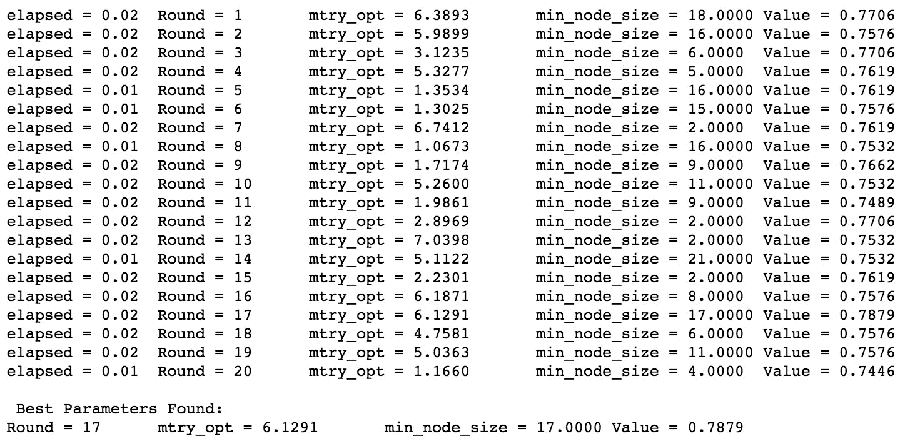

###### 图 7.13：贝叶斯优化随机森林的输出

输出显示了用于模型评估的迭代次数，并在每次迭代的末尾返回结果。可以通过增加`n_iter`的值来增加迭代次数。`init_points`变量定义了在贝叶斯优化拟合高斯过程之前随机选择的点的数量以采样目标函数。此外，我们定义了标准函数作为`eps`参数，这是一个额外的参数，可以用来调整**EI**和**POI**，以平衡利用和探索，增加 epsilon 将使优化的超参数在整个范围内分布得更广。

最后，我们还定义了核，即底层高斯过程的关联函数。此参数应是一个列表，指定了关联函数的类型以及平滑度参数。流行的选择是平方指数（默认）或`Matern 5/2`。

贝叶斯优化过程的结果返回了`mtry`的最佳值为 6.12（需要截断为 6，因为**随机森林**中的`mtry`不接受小数值）和最佳最小节点大小为 17。我们可以使用这些参数设置在随机森林的常规实现中，并评估模型结果。

现在我们使用相同的方法对同一用例的 XGBoost 模型进行操作。

### 练习 97：使用 XGBoost 进行贝叶斯优化

与之前的练习类似，我们将对同一数据集进行贝叶斯优化，并研究输出，尽管这次是针对 XGBoost 模型。鉴于 XGBoost 有更多的超参数需要优化，我们需要为优化过程中感兴趣的每个超参数提供一个值范围。

要在 XGBoost 模型上执行贝叶斯优化，请执行以下步骤：

1.  首先，使用以下命令将`seed`设置为`2019`：

    ```py
    set.seed(2019)
    ```

1.  使用`MlBayesOpt`包中的`xgb_opt`函数对 XGBoost 模型进行贝叶斯优化：

    ```py
    model_xgb_bayesian<- xgb_opt(train, diabetes, test, diabetes,objectfun ='binary:logistic',evalmetric='logloss',eta_range = c(0.1, 1L), max_depth_range = c(2L, 8L),nrounds_range = c(70, 160L), bytree_range = c(0.4, 1L), init_points = 4, n_iter = 10, acq = "poi", eps = 0, optkernel = list(type = "exponential", power =2))
    ```

    输出如下：

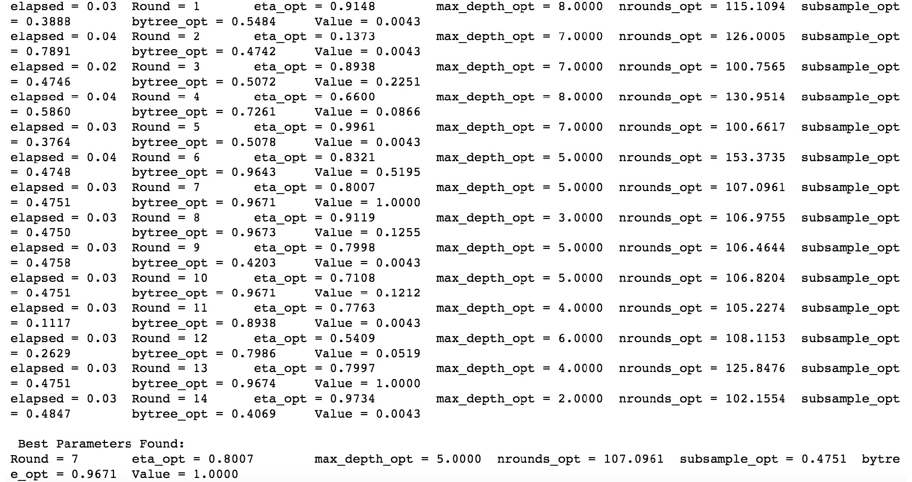

###### 图 7.14：使用 XGBoost 进行贝叶斯优化的输出

与随机森林类似，`xgb_opt`函数返回了包含候选值的最佳超参数列表。与**随机森林**不同，XGBoost 有更多的超参数。我们需要定义贝叶斯优化过程为每个超参数操作的值范围。

我们可以看到，贝叶斯优化得到的最佳超参数组合与我们为`nrounds`找到的不同，当我们实现标准的 XGBoost 树模型时，上述参数（`nrounds`、`max_depth`、`eta`和`subsample`）需要截断（因为小数值没有意义）。

在本章中，我们研究了各种交叉验证技术以进行模型评估。对 k 折交叉验证的小幅修改有助于我们进行改进的模型性能验证。在从 k 折到 LOOCV 之前，我们可以进行重复的 k 折，以获得对模型更稳健的评估。这个过程重复进行交叉验证多次，其中每次重复中折的划分方式都不同。进行重复的 k 折比 LOOCV 更好。

### 活动十二：执行重复的 K 折交叉验证和网格搜索优化

在这个活动中，我们将利用相同的数据库（如前述练习中使用），训练一个随机森林模型，进行 10 次重复的 k 折验证，并研究模型性能。在每个折迭代中，我们可以尝试不同的超参数网格值，并对最佳模型进行稳健的验证。

活动的目的是对同一模型进行重复的 k 折交叉验证和网格搜索优化。

执行以下步骤：

1.  加载所需的包（`mlbench`，`caret`和`dplyr`）。

1.  从`mlbench`包中将`PimaIndianDiabetes`数据集加载到内存中。

1.  设置一个种子值以实现可重复性。

1.  使用`caret`包中的`trainControl`函数定义 k 折验证对象，并将`method`定义为`repeatedcv`而不是`cv`。

1.  在`trainControl`函数中定义一个额外的结构，用于验证重复次数，`repeats = 10`。

1.  将随机森林模型的`mtry`超参数的网格定义为`(3,4,5)`。

1.  使用网格值、交叉验证对象和随机森林分类器来拟合模型。

1.  通过绘制不同超参数值下的准确率来研究模型性能。

    最终输出应如下所示：

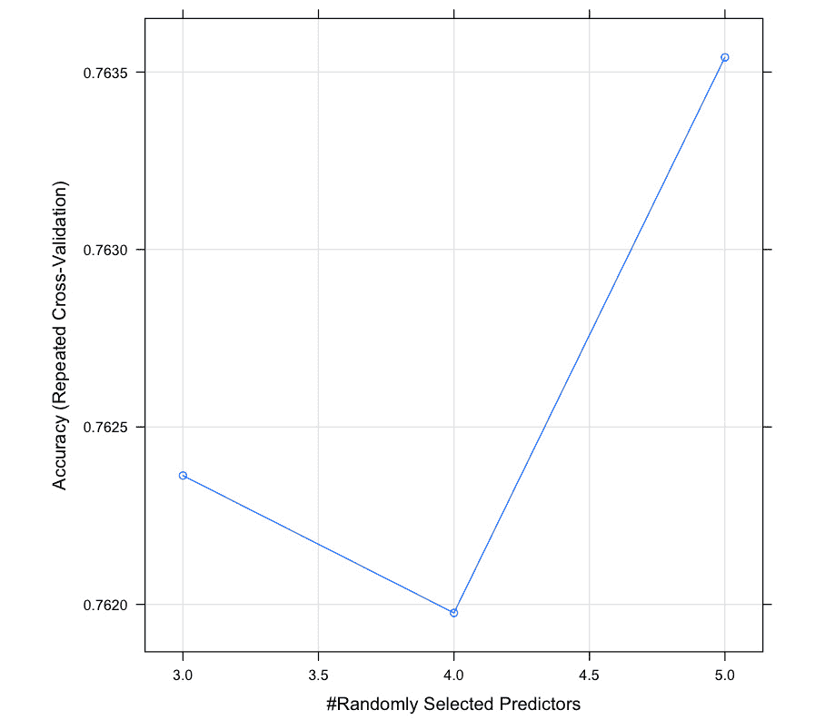

###### 图 7.15：不同超参数值下的模型性能准确率

#### 注意

本活动的解决方案可以在第 461 页找到。

## 摘要

在本章中，你学习了模型性能改进技术的一些重要方面。我们从**偏差-方差权衡**开始，并了解了它对模型性能的影响。我们现在知道，高偏差会导致欠拟合，而高方差会导致模型过拟合，并且实现一个是以牺牲另一个为代价的。因此，为了构建最佳模型，我们需要在机器学习模型中找到偏差和方差之间的理想平衡。

接下来，我们探讨了 R 中各种交叉验证技术，这些技术提供了现成的函数来实现相同的功能。我们研究了保留法、k 折法和留一法验证方法，了解了如何对机器学习模型的性能进行稳健评估。然后，我们研究了超参数调整，并详细探讨了网格搜索优化、随机搜索优化和贝叶斯优化技术。机器学习模型的超参数调整帮助我们开发出性能更优的更通用模型。

在下一章中，我们将探讨在云中部署机器学习模型的过程。
