# 第八章：模型部署

## 学习目标

到本章结束时，你将能够：

+   使用 R plumber 包将 ML 模型部署为 API

+   使用 AWS SageMaker、AWS Lambda 和 AWS API Gateway 开发无服务器 API

+   使用 AWS CloudFormation 从零开始创建基础设施

+   使用 Docker 容器将 ML 模型部署为 API

在本章中，我们将学习如何在 AWS 和 Docker 容器上托管、部署和管理模型。

## 简介

在上一章中，我们研究了模型改进，并探讨了超参数调优中的各种技术，以提升模型性能并开发出针对特定用例的最佳模型。下一步是将机器学习模型部署到生产环境中，以便它可以轻松被消费或集成到大型软件产品中。

大多数数据科学专业人士认为，当最佳模型已经确定时，开发机器学习模型的过程就结束了，即超参数调优。然而，如果机器学习模型没有被部署并且（或）与其他软件服务/产品集成到大型技术生态系统中，那么它所带来的价值和影响是有限的（大多数情况下是徒劳的）。机器学习和软件工程绝对是两个不同的学科。大多数数据科学家在理解软件工程生态系统方面能力有限，同样，软件工程师对机器学习领域的理解也有限。因此，在大型企业中，他们构建的产品中机器学习用例发展成为软件产品的主要功能时，数据科学家和软件工程师之间的协作是必要的。然而，在大多数情况下，软件工程师和数据科学家之间的协作极其具有挑战性，因为双方都认为对方的领域难以理解。

近年来，大型企业投入了大量努力开发工具和资源，以帮助数据科学家轻松地接受一些软件工程组件，反之亦然。这些工具使得两个学科之间的协作更加容易，加速了开发大规模、企业级机器学习产品的过程。

在本章中，我们将了解一些将机器学习模型作为网络服务部署的方法，这些方法可以轻松地与其他服务集成到大型软件生态系统中。我们还将讨论不同方法的优缺点以及模型部署的最佳实践。

## 什么是 API？

在深入研究模型部署的具体细节之前，我们需要研究一个重要的软件工程主题，它可以简化整个模型部署过程，那就是**应用程序编程接口**，通常简称为**API**。API 是一组明确定义的用于各种软件组件之间通信的方法。随着 API 的出现，软件开发变得显著更容易。如果一个开发者，比如说，想要开发一个 iPhone 应用，该应用可以为图片添加一些滤镜，他们不需要编写整个代码来从手机的相机捕获图片，将其保存到库中，然后再应用他们特定的滤镜。相反，他们可以使用手机相机 API，这提供了一个简单的方法与相机通信，并且只需专注于编写添加滤镜到图片的代码。简而言之，API 是异构软件组件之间通信的手段。

在一个大型软件产品中，会有几个负责特定任务的组件。这些组件通过一种定义良好的语言相互交互，确保数据、事件和警报的顺畅通信。

这里是 API 的一些显著特点：

+   API 有助于**模块化**软件应用程序，并使构建更好的产品成为可能。

+   API 通常为软件工程师所熟知，并且是**语言无关**的。因此，在完全不同的语言或系统中开发的异构应用程序也可以有效地相互通信。

+   服务之间的通信也使用一种通用语言，即**JavaScript 对象表示法**（简称，**JSON**）。然而，还有其他流行的语言，例如，XML。

+   它们也支持 HTTP，这意味着 API 可以通过网络浏览器（如 Google Chrome 或 Mozilla Firefox）或像*Postman*这样的工具访问。

    #### 备注

    Postman 是一个免费工具，它在整个 API 的生命周期中提供易于使用的服务，例如设计、调试、测试、文档、监控和发布。它可在 Windows、Linux 和 macOS 平台上下载。您可以在 https://www.getpostman.com/了解更多关于 Postman 的信息。

我们特别关注 RESTful API 的发展，即通过 HTTP 进行通信的 API。RESTful API 也被称为**REST API**，主要有两种方法类型：

+   **GET 方法**：当我们想要从服务中读取数据时使用。

+   **POST 方法**：当我们想要向服务发送数据时使用。

一些其他的方法是**head**、**put**和**delete**。

将机器学习模型作为（Web 服务）REST API 部署简化了将服务与其他服务集成的过程。软件工程师喜欢使用 REST API，由于该服务是语言无关的，我们在用我们选择的语言开发模型时具有巨大的优势。软件工程师可以使用 Python、Java、Ruby 或许多其他语言来开发其他服务，而我们可以用 R、Python、Julia 等语言开发模型，并且能够有效地无缝地将服务集成到大型软件产品中。

现在我们对 API 有了相当的了解，让我们来了解一下如何将一个 ML 模型部署到 R 中作为 API。

## Plumber 简介

**Plumber**是一个 R 包，它帮助将 R 函数转换为 HTTP API，可以从网络中的其他机器调用，从而实现系统间的通信。通过使用 R plumber，我们将能够实现所讨论的优势，例如开发模块化、语言无关、基于通用通信语言（JSON）的 HTTP rest API，这些 API 为系统间提供定义的通信路径。使用 Plumber 非常简单。只需几行代码，我们就可以将现有的 R 函数转换为可以作为一个端点提供服务的 Web 服务。

在本章中，我们将扩展我们在*第七章*，*模型改进*中构建的相同模型和用例，使用`mlbench`库中的`PimaIndiasDiabetes`数据集来分类患者是否患有糖尿病。稍后，我们将扩展相同的用例，使用 Docker 容器和无服务器应用程序将模型部署为 Web 服务。

### 练习 98：使用 Plumber 开发 ML 模型并将其作为 Web 服务部署

在这个练习中，我们将使用三个独立变量开发一个逻辑回归模型，并使用 Plumber 将其作为 REST API 部署。我们将创建一个简单的二分类模型，并使用`plumber`包的服务通过定义 HTTP get 和 post 方法将模型封装为 API。

执行以下步骤以完成练习：

1.  使用 RStudio 或 Jupyter Notebook 创建一个名为`model.R`的 R 脚本。

1.  加载所需的库并构建一个逻辑回归模型。现在，定义接受输入参数并返回预测结果的`get`方法：

    ```py
    #----------Code listing for model.R-----------------------------
    library(mlbench)
    data(PimaIndiansDiabetes)
    df<-PimaIndiansDiabetes
    ```

    #### 注意

    这些数据是从以下 URL 的 UCI 机器学习数据库仓库中获取的：

    ftp://ftp.ics.uci.edu/pub/machine-learning-databases

    http://www.ics.uci.edu/~mlearn/MLRepository.html

    它被 Friedrich Leisch 转换成了 R 格式。

1.  使用`df` DataFrame 对象训练一个逻辑回归模型：

    ```py
    model<-glm(diabet-es~pregnant+glucose+pressure, data=df,
               family=binomial(link='logit'))
    ```

1.  使用额外的`#' @get /`构造定义 API 端点为一个函数：

    ```py
    #' @get /predict_data
    function(pregnant, glucose, pressure){
    ```

1.  在函数内部，使用`as.numeric`命令将参数转换为`numeric`值：

    ```py
      pregnant <- as.numeric(pregnant)
      glucose <- as.numeric(glucose)
      pressure <- as.numeric(pressure)
    ```

1.  然后，创建一个与上一步相同的列名的 DataFrame：

    ```py
      sample <- data.frame(pregnant=pregnant,                       glucose=glucose,                       pressure=pressure)
    ```

1.  使用新创建的`sample` DataFrame 对训练好的模型进行预测：

    ```py
      y_pred<-ifelse(predict(model,newdata=sample)>0.5,"yes","no")
    ```

1.  将结果打包为一个`list`作为函数的返回调用，并使用`}`括号完成/关闭函数定义：

    ```py
      list(Answer=y_pred)
    }
    ```

    之前的练习演示了带有额外结构的常规 R 模型代码。我们开发的模型相当简单，只有三个自变量和一个因变量（与我们在*第七章*，*模型改进*中看到的八个自变量不同）。我们还创建了一个函数，该函数将接受三个输入参数，每个参数代表模型的一个自变量。当我们将模型作为 REST API 部署时，这个函数将被用作端点。我们在函数之前添加了一个额外的结构（参考之前练习的第四步）：

    ```py
    #' @get /predict_data
    ```

    此结构定义了`predict_data`端点将服务 GET 请求。我们为该端点定义的函数接受三个参数，没有默认值。现在让我们安装`plumber`包，并使用 web 服务器进行调用。

    最终完整的`model.R`文件应如下所示：

    ```py
    #----------Code listing for model.R-----------------------------
    library(mlbench)
    data(PimaIndiansDiabetes)
    df<-PimaIndiansDiabetes
    model<-glm(diabet-es~pregnant+glucose+pressure, data=df,
               family=binomial(link='logit'))
    #' @get /predict_data
    function(pregnant, glucose, pressure){
      pregnant <- as.numeric(pregnant)
      glucose <- as.numeric(glucose)
      pressure <- as.numeric(pressure)
      sample <- data.frame(pregnant=pregnant,                       glucose=glucose,                       pressure=pressure)
      y_pred<-ifelse(predict(model,newdata=sample)>0.5,"yes","no")
      list(Answer=y_pred)
    }
    ```

    #### 注意

    你也可以参考 GitHub URL：https://github.com/TrainingByPackt/Applied-Supervised-Learning-with-R/blob/master/Lesson08/Docker/model.R。

1.  创建另一个名为`main.R`的 R 脚本。现在，安装`plumber`包并将其加载到内存中，然后使用`plumb`函数部署 R 函数，如图所示：

    ```py
    #-------main.R-----------------
    install.packages("plumber")
    library(plumber)
    # (The previous code snippet is supposed to be save as 'model.R')
    ```

1.  使用以下命令将 R 文件传递给`plumb`函数：

    ```py
    pr <- plumber::plumb("model.R")
    pr$run(port=8080,host='127.0.0.1')
    ```

1.  执行上一段代码后，Plumber 库会在你的`localhost`上创建一个 web 服务器并响应请求。为了测试我们编写的端点是否按预期工作，我们将从浏览器中调用该端点。

    #### 注意

    ```py
    #' @get /predict_data
    ```

    参数在`?`符号之后传递给端点，多个参数由`&`符号分隔。

1.  由于我们将端点部署到了 localhost，即`127.0.0.1`的`8080`端口，我们将为该端点有以下 API 定义。使用浏览器调用 API：

    ```py
    http://127.0.0.1:8080/predict_data?pregnant=1&glucose=3&pressure=1
    ```

1.  执行之前的 API 定义，将返回以下预测值：

    ```py
    {"Answer":["no"]}
    ```

    为了测试 API，我们可以使用更好的工具，例如 Postman，而不是浏览器。Postman（https://www.getpostman.com/）是目前在 API 测试中最受欢迎的工具之一。它在 Windows、Mac 和 Linux 平台上免费提供。使用 Postman 相对简单，不涉及任何新的学习。

    #### 注意

    如果你想要探索关于 Postman 的更多细节，你可以查看在 https://learning.getpostman.com/docs/postman/launching_postman/installation_and_updates/提供的资源。

1.  下载并安装 Postman 到你的系统后，你可以通过粘贴到输入窗口来测试 API 端点，如下面的截图所示：

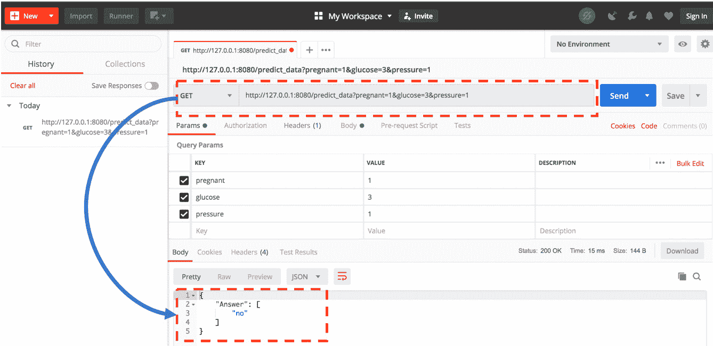

###### 图 8.1：Plumber UI

我们可以通过点击**发送**按钮来执行 API，结果将显示在上一张截图的高亮区域。通过观察 Postman 的输出，我们可以看到我们的机器学习模型已成功部署为 API 端点。

### 使用 plumber 部署模型的挑战

我们可以看到，使用 plumber 将模型部署为 API 非常简单，只需添加几行额外的代码即可轻松完成。`plumber`包提供了我们在本次练习中未探索的额外功能。以下是一些可能感兴趣的重要主题：

+   **过滤器**：可以使用过滤器定义一个带有请求流量的*管道*。此功能有助于进一步模块化部署逻辑和工作流程。您可以在 https://www.rplumber.io/docs/routing-and-input.html#filters 了解更多信息。

+   **错误处理**：随着应用程序规模的扩大，代码库和应用程序的复杂性呈指数级增长。添加异常处理程序并简化应用程序的调试过程变得越来越重要。您可以在 https://www.rplumber.io/docs/rendering-and-output.html#error-handling 了解更多信息。

这些方法有一个主要的缺点。虽然在一个单一的主机上设置端点相对容易，但在不同的系统上部署相同的解决方案时可能会遇到问题。这些问题可能由于系统架构、软件版本、操作系统等方面的差异而产生。为了减轻在部署端点时可能遇到的冲突，一种技术是使过程与环境无关，也就是说，在一个主机系统上开发的解决方案可以在任何具有不同架构、平台或操作系统的其他主机上无任何问题地部署。这可以通过使用**Docker 容器**和 plumber 进行部署来实现，而不是直接使用 plumber。

## 预 Docker 时代的简史

在深入探讨 Docker 工具之前，让我们了解一些背景和历史。

在环境无关的框架中部署应用程序的挑战之前是通过虚拟化实现的，也就是说，整个应用程序、依赖项、库、必要的框架以及操作系统本身都被虚拟化并打包成一个可以在主机上部署的解决方案。多个虚拟环境可以在基础设施（称为**虚拟机管理程序**）上运行，应用程序变得与环境无关。然而，这种方法有一个主要的权衡。将整个操作系统打包到应用程序的**虚拟机**（**VM**）中使得包变得很重，通常会导致内存和计算资源的浪费。

解决这个问题的更直观的方法是排除操作系统包，只包含与应用程序相关的库和依赖项。此外，启用一种机制，使包成为基础设施无关的，保持应用程序轻量。这就是 Docker 被引入的时候。以下视觉图展示了 Docker 是如何被改进来解决以前由虚拟机解决的问题：

![图 8.2：虚拟机和 Docker 容器之间的架构差异

![img/C12624_08_02.jpg]

###### 图 8.2：虚拟机和 Docker 容器之间的架构差异

让我们现在更详细地了解 Docker 容器。

## Docker

Docker 是一个简单的工具，它简化了使用容器开发、部署和执行软件应用程序的过程。**容器**类似于航运行业的集装箱，允许开发者将整个应用程序及其依赖项打包，并作为一个包发送出去。一旦在一个系统上构建，这个包就可以在任何其他系统上工作，无论基础设施有何差异。

使用 Docker，我们可以创建一个单独的文档（称为**Dockerfile**），它定义了设置应用程序所需环境的简化步骤。然后使用 Dockerfile 构建**Docker 镜像**。容器是 Docker 镜像的一个实例。对于同一个应用程序，我们有时可能会有多个容器，这有助于高流量应用程序的负载均衡。

### 使用 Docker 和 plumber 部署 ML 模型

我们将利用相同的 plumber 应用程序，通过 Docker 进行环境无关和基础设施无关的部署。首先，我们需要在我们的系统上下载并安装 Docker。它是免费且易于使用的。从 https://www.docker.com/get-started 创建一个账户并下载适合您系统的 Docker。安装完成后，您可以通过在终端或 Windows PowerShell 中执行`docker`命令来验证 Docker 是否正在运行。

### 练习 99：为 R plumber 应用程序创建一个 Docker 容器

在这个练习中，我们将扩展之前创建的 plumber 应用程序作为 Docker 容器。为了开发可以在任何生产系统上部署且无任何问题的环境无关模型，我们可以使用 Docker 容器部署 plumber 应用程序。这些容器然后可以部署在支持 Docker Engine 的任何其他机器上。

执行以下步骤以完成练习：

1.  定义一个 Dockerfile，如下所示：

    ```py
    FROM rocker/r-ver:3.5.0
    ```

1.  现在，使用以下命令安装`plumber`包的库：

    ```py
    RUN apt-get update -qq && apt-get install -y  libssl-dev  libcurl4-gnutls-dev
    ```

1.  接下来，按照以下所示安装`plumber`包：

    ```py
    RUN R -e "install.packages(c('plumber','mlbench'))"
    ```

1.  现在，使用以下命令将当前目录中的所有文件复制到容器的当前文件夹中。这将把我们的`model.R`和`plumber.R`文件复制到容器中：

    ```py
    COPY / /
    ```

1.  接下来，定义一个要公开的端口，容器将部署在该端口上：

    ```py
    EXPOSE 8080
    ```

1.  定义在构建后容器启动时运行的第一个脚本：

    ```py
    ENTRYPOINT ["Rscript", "main.R"]
    ```

    我们现在在项目文件夹中有三个文件，如下所示图所示。请注意，Dockerfile 是一个没有扩展名的简单文本文件。在文件夹内从终端运行`build`命令时，**Docker 引擎**会查找 Dockerfile 并根据文档中提供的说明准备环境：

    ![图 8.3：项目文件]

    

    ###### 图 8.3：项目文件

    最终的 Dockerfile，其中包含之前步骤中定义的所有命令，将看起来像这样：

    ```py
    FROM rocker/r-ver:3.5.0
    RUN apt-get update -qq && apt-get install -y  libssl-dev  libcurl4-gnutls-dev
    RUN R -e "install.packages(c('plumber','mlbench'))"
    COPY / /
    EXPOSE 8080
    ENTRYPOINT ["Rscript", "main.R"]
    ```

1.  我们现在可以使用`docker build`命令从 Dockerfile 构建 Docker 镜像，如下所示：

    ```py
    docker build -t r_ml_demo .
    ```

    `r_ml_demo`后面的`.`表示 Dockerfile 位于当前文件夹中。构建过程需要一段时间，因为它会创建包含所有必要依赖项的容器镜像。一旦镜像构建完成，我们可以使用以下命令运行 Docker 镜像，通过将机器的`8080`端口映射到容器的已发布`8080`端口。

1.  使用以下命令运行 Docker 镜像：

    ```py
    docker run --rm -p 8080:8080 r_ml_demo
    ```

    #### 注意

    您可以从 GitHub 上的完整代码获取更多信息：https://github.com/TrainingByPackt/Applied-Supervised-Learning-with-R/tree/master/Lesson08/Docker。

容器可以像我们使用 Postman 测试 plumber 应用程序一样再次进行测试，我们将得到完全相同的结果。因此，我们可以使用 plumber 和 Docker 在任何其他系统上部署 R 应用程序，无论操作系统如何，也不管缺少哪些库。

#### 注意

Docker 不能安装在 Windows 家庭版上。只有 Windows 专业版支持虚拟机管理程序。

### 使用 plumber 部署 R 模型的缺点

虽然这个过程带来了一些易于快速实施的优点，但也存在一些缺点。plumber 的主要缺点是针对大型复杂用例扩展应用程序端点。这里的扩展指的是端点被调用的次数以及可以通过端点调用的数据量。

使用 plumber 的一个主要缺点是它不支持直接传递 JSON 对象或数组或列表到端点。当我们处理具有 20 个以上独立变量的较大模型时，这成为一个瓶颈。在*练习 2*，*为 R Plumber 应用程序创建 Docker 容器*中的先前用例是一个相当小且轻量级的模型，具有三个独立变量。因此，API 定义既简短又甜蜜。然而，随着参数数量的增加（这对于真正的生产模型来说肯定会发生），plumber 模型端点定义可能不是最佳选择。此外，plumber 框架对于大型复杂软件用例来说也不理想。围绕该框架的小型社区、缺乏适当的文档和有限的支持使其成为将模型部署到大规模机器学习产品或服务中的风险选择。

让我们看看如何利用云服务来部署 R ML 模型。

## Amazon Web Services

**Amazon Web Services** (**AWS**) 是领先的云服务提供商。随着云的出现，技术行业在构建大型规模企业应用程序的过程中经历了巨大的转变，从使用云服务而不是自托管服务。云服务市场的其他主要参与者包括微软、谷歌和 IBM。虽然所有领先的云服务提供商都有一套详尽的服务来构建各种软件应用程序，但我们将仅关注 AWS，范围限于本章。我们强烈鼓励您探索其他云服务提供商提供的类似用例的替代服务（不仅限于谷歌或微软）。

AWS 提供了大量现成的服务，可以用来构建任何规模的大型、复杂企业应用程序，无需任何前期承诺。您按使用付费，还有大量服务您可以免费探索和测试一年（有一定限制）。对于我们在即将进行的实验中将要执行的实验范围，免费层应该足够了。如果您还没有 AWS 账户，请在此处创建一个：https://aws.amazon.com/free/activate-your-free-tier-account/。

您在注册过程中需要一个有效的信用卡或借记卡。我们将仅利用 AWS 的免费层服务进行练习。

我们可以采取几种方法来使用云服务部署机器学习模型。有些可能非常适合小型应用程序，有些适合中等规模和复杂程度适中的应用程序，而其他一些则适合大型和非常复杂的应用程序。我们将探索那种软件工程量最少，但提供有效灵活性，并且可以轻松扩展到大规模应用程序，同时易于集成到复杂应用程序中的方法。

使用 API 并将机器学习模型作为 API 提供使得将服务集成到其他应用程序中的整个过程相当直接。

## 介绍 AWS SageMaker

**Amazon SageMaker** 是一种云服务，为开发人员和数据科学家提供了一个平台，可以快速构建、训练和部署机器学习模型。它是一种极其有效的服务，可以帮助那些开发知识有限的数据科学家部署高度可扩展的 ML 模型，同时抽象出整个基础设施和底层服务的复杂性。

SageMaker 自动将模型作为 API 部署，并使用定义的资源创建一个可用于在其他 AWS 服务中进行推理的 *端点*。为了使端点能够被其他外部应用程序进行推理，我们需要使用另外两个 AWS 服务来编排请求流，这两个服务被称为 **AWS API Gateway** 和 **AWS Lambda**。我们将在本章后面探索这些新服务。

现在，让我们开始使用 AWS SageMaker 部署我们的模型。

### 使用 SageMaker 部署 ML 模型端点

默认情况下，SageMaker 不提供直接创建 R 模型的途径，但 Amazon 提供了一个简单的替代方案。AWS 通过 **AWS CloudFormation** 提供了 **基础设施即代码** 的功能，即一个服务，我们可以将项目的基础设施资源配置和设置整个流程编码化。使用 CloudFormation 模板，我们可以根据我们的需求自动化技术栈的配置过程，并且可以多次重用它。Amazon 提供了一份清晰且详尽的指南，指导您使用 CloudFormation 模板在 SageMaker 上开始使用 R 笔记本。

要了解更多信息，您可以参考 https://aws.amazon.com/blogs/machine-learning/using-r-with-amazon-sagemaker/ 上的指南，以详细了解该过程。

### 练习 100：将 ML 模型作为 SageMaker 端点部署

在这个练习中，我们将部署一个 ML 模型作为 SageMaker 端点。

执行以下步骤以完成练习：

1.  登录您的 AWS 账户并启动 CloudFormation 脚本来创建一个 R 笔记本。

1.  现在，从 https://amzn.to/2ZzUM28 访问 CloudFormation 模板以在 SageMaker 上创建 R 笔记本。

    接下来，我们将使用之前的 CloudFormation 模板在 AWS 中创建和启动堆栈。

1.  点击模板；它将直接导航到 CloudFormation 服务，如下面的截图所示。云配置模板（这是一个 YAML 文件）托管在公共 S3 存储桶中，并且已经添加到 **指定 Amazon S3 模板 URL** 下的输入框中。点击 **下一步** 按钮并导航到 **详细信息** 页面：![图 8.4：CloudFormation—创建堆栈页面

    ![img/C12624_08_04.jpg]

    ###### 图 8.4：CloudFormation—创建堆栈页面

1.  在下一页，指定您将用于登录 EC2 实例的 SSH 密钥对。这是访问我们在云中配置的云实例或虚拟机的一种安全方式。如果您尚未为您的账户创建密钥，您可以使用 Amazon 网站上提供的步骤创建一个：https://docs.aws.amazon.com/AWSEC2/latest/UserGuide/ec2-key-pairs.html#having-ec2-create-your-key-pair。

1.  一旦创建密钥对或如果您已经有了密钥对，它将出现在高亮框中的下拉菜单中，如下面的截图所示。选择您的密钥对并点击 **下一步** 按钮：![图 8.5：创建密钥对

    ![img/C12624_08_05.jpg]

    ###### 图 8.5：创建密钥对

1.  在下一页 **选项** 页面上，我们可以直接点击 **下一步** 按钮并导航到下一页。

1.  最后，在审查页面上，选中 **我承认 AWS CloudFormation 可能会创建具有自定义名称的 IAM 资源** 复选框，然后点击 **下一步** 按钮。

1.  此过程将创建堆栈（它可能需要一段时间才能在屏幕上显示——1-2 分钟后刷新屏幕）。一旦创建，您将在 CloudFormation 下看到堆栈已准备好，如图所示。输出选项卡将包含用于登录的 SSH 命令；复制高亮部分中的值，然后在终端或命令提示符中运行该命令：![图 8.6：堆栈—SSH 密钥

    ![图片 C12624_08_06.jpg]

    ###### 图 8.6：堆栈—SSH 密钥

1.  在终端运行 SSH 命令时，它将端口`8787`转发到您的计算机，同时连接到新实例。一旦连接，打开浏览器窗口并在地址栏中输入`https://127.0.0.1:8787`以打开 RStudio 登录页面。默认用户名和密码设置为`rstudio`。输入用户名和密码，然后点击**登录**按钮：![图 8.7：RStudio—登录页面

    ![图片 C12624_08_07.jpg]

    ###### 图 8.7：RStudio—登录页面

1.  登录到 RStudio 并创建一个名为`Sagemaker.R`的新 R 脚本，加载必要的库，并准备好 SageMaker 会话：

    ```py
    library(reticulate)
    library(readr)
    ```

1.  启动 SageMaker 会话并定义会话中使用的默认存储桶以及角色：

    ```py
    sagemaker <- import('sagemaker')
    session <- sagemaker$Session()
    bucket <- session$default_bucket()
    role_arn <- session$expand_role('sagemaker-service-role')
    ```

1.  安装`mlbench`包并加载数据用于我们的用例。在以下命令中，我们首先设置`seed`以确保可重复性：

    ```py
    set.seed(2019)
    install.packages("mlbench")
    library(mlbench)
    data(PimaIndiansDiabetes) 
    df<- PimaIndiansDiabetes
    ```

1.  要探索 SageMaker 的自动超参数调整，我们将开发一个 XGBoost 模型，而不是在之前用例上的逻辑回归模型。因此，我们需要目标变量和所有独立变量都是数值类型的。此外，SageMaker 期望数据以第一列为目标变量的形式：

    ```py
    df$diabetes <- ifelse(df$diabetes == "yes",1,0)
    ```

1.  将目标变量放在数据集的第一列：

    ```py
    df<- df[,c(9,1:8)]
    ```

1.  使用以下命令创建 70%的培训和 30%的测试数据集：

    ```py
    train_index <- sample(seq_len(nrow(df)),floor(0.7 * nrow(df)))
    train <- df[train_index,]
    test <- df[-train_index,]
    ```

1.  将从`df`数据框创建的培训和测试数据写入内存，并将 CSV 文件上传到 AWS 上的 S3 存储桶。由于会话已定义了默认存储桶，因此我们可以直接使用`upload_data`命令和路径以及所需的构造来上传数据集到我们的默认 S3 存储桶：

    ```py
    write_csv(train, 'diabetes_train.csv', col_names = FALSE)
    write_csv(test, 'diabetes_test.csv', col_names = FALSE)
    s3_train <- session$upload_data(path = 'diabetes_train.csv', 
                                    bucket = bucket, 
                                    key_prefix = 'data')
    s3_test <- session$upload_data(path = 'diabetes_test.csv', 
                                   bucket = bucket, 
                                   key_prefix = 'data')
    ```

1.  定义 SageMaker 会话的培训和测试数据集（验证数据）：

    ```py
    s3_train_input <- sagemaker$s3_input(s3_data = s3_train,
                                         content_type = 'csv')
    s3_test_input <- sagemaker$s3_input(s3_data = s3_test,
                                        content_type = 'csv')
    ```

    SageMaker 提供了 AWS 优化的预配置容器，可以直接用于模型训练。我们需要从与我们的资源托管在同一区域的容器基础中选择一个。在这种情况下，是**us-east-1**。

1.  定义估计器的容器和 S3 中的输出文件夹：

    ```py
    containers <- list('us-west-2' = 
    '433757028032.dkr.ecr.us-west-2.amazonaws.com/xgboost:latest',
                       'us-east-1' = 
    '811284229777.dkr.ecr.us-east-1.amazonaws.com/xgboost:latest',
                       'us-east-2' =
     '825641698319.dkr.ecr.us-east-2.amazonaws.com/xgboost:latest',
                       'eu-west-1' =
     '685385470294.dkr.ecr.eu-west-1.amazonaws.com/xgboost:latest')
    ```

1.  使用以下命令选择用于估计器的容器：

    ```py
    container <- containers[session$boto_region_name][[1]]
    ```

1.  定义输出文件夹，如图所示：

    ```py
    s3_output <- paste0('s3://', bucket, '/output')
    ```

1.  定义 SageMaker 估计器、作业和输入数据。在这里，我们需要提供我们希望用于模型训练过程的实例类型，我们将选择`ml.m5.large`：

    ```py
    estimator <- sagemaker$estimator$Estimator(image_name = container,
                                               role = role_arn,
                                               train_instance_count = 1L,
                                               train_instance_type = 'ml.m5.large',
                                               train_volume_size = 30L,
                                               train_max_run = 3600L,
                                               input_mode = 'File',
                                               output_path = s3_output,
                                               output_kms_key = NULL,
                                               base_job_name = NULL,
                                               sagemaker_session = NULL)
    ```

1.  设置模型感兴趣的超参数，并将培训和验证数据集定义为列表：

    ```py
    estimator$set_hyperparameters(num_round = 100L)
    job_name <- paste('sagemaker-train-xgboost', format(Sys.time(), '%H-%M-%S'), 
                                 sep = '-')
    input_data <- list('train' = s3_train_input,
                       'validation' = s3_test_input)
    ```

    #### 注意

    你可以在 https://aws.amazon.com/sagemaker/pricing/instance-types/上了解更多关于可用于模型训练的不同类型实例的信息。

1.  训练/拟合我们定义的模型。模型训练过程将花费一些时间（约 10-12 分钟）。在后台，SageMaker 将提供我们在模型定义中定义的实例，触发必要的后台操作以编排训练过程，并最终训练模型：

    ```py
    estimator$fit(inputs = input_data, job_name = job_name)
    ```

1.  将训练模型部署为端点。我们再次需要提供我们希望 SageMaker 为模型推理提供的实例类型。由于这是一个示例模型，我们可以选择配置最低的实例。这个过程也将花费一些时间，因为 SageMaker 将在后台编排一系列服务以将模型作为端点部署：

    ```py
    model_endpoint <- estimator$deploy(initial_instance_count = 1L,
                                       instance_type = 'ml.t2.medium')
    model_endpoint$content_type <- 'text/csv'
    model_endpoint$serializer <- sagemaker$predictor$csv_serializer
    ```

    模型端点创建后，我们可以通过使用正确的测试数据形式来测试它。由于我们将测试数据保存为 CSV 文件，因此我们将传递以逗号分隔的文本以序列化为 JSON 格式。因此，我们为端点指定`text/csv`和`csv_serializer`。让我们准备一个用于快速测试的样本测试数据馈送。

1.  首先，使用以下命令复制测试数据集：

    ```py
    one_test <- test
    ```

1.  接下来，删除目标变量：

    ```py
    one_test$diabetes<-NULL
    ```

1.  使用以下命令创建单个测试样本：

    ```py
    test_sample <- as.matrix(one_test[7, ])
    ```

1.  现在，删除列名：

    ```py
    dimnames(test_sample)[[2]] <- NULL
    ```

1.  使用我们在上一步创建的样本数据，通过模型端点进行预测。调用 SageMaker 端点并传递测试数据：

    ```py
    predictions <- model_endpoint$predict(test_sample)
    ```

1.  现在，使用`print`命令打印结果：

    ```py
    print(ifelse(predictions>0.5,"yes",'no'))
    ```

    输出如下：

    ```py
    1] "no"
    ```

此输出有助于我们了解模型已正确部署并按预期运行。我们可以通过导航到 AWS 账户中的 SageMaker 服务并从右侧侧边栏打开*端点*部分来检查端点是否已创建：

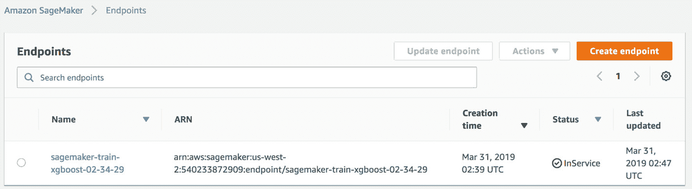

###### 图 8.8：端点页面

此端点可以直接由 AWS 内的其他服务调用并获取预测。唯一的要求是输入数据应按预期提供。为了使我们的模型端点可由 AWS 外的其他服务访问，我们需要使用 AWS API Gateway 和 AWS Lambda 编排 API 请求。

#### 注意

你可以在 GitHub 上访问完整的代码文件，网址为 https://github.com/TrainingByPackt/Applied-Supervised-Learning-with-R/blob/master/Lesson08/RStudio_SageMaker.R。

现在，在我们深入研究解决方案之前，让我们研究一下这些服务。

## 亚马逊 Lambda 是什么？

**AWS Lambda** 是亚马逊作为 Amazon Web Services 的一部分提供的一个事件驱动的无服务器计算平台。它是一种响应事件运行代码的计算服务，并自动管理该代码所需的计算资源。该服务使我们能够开发无服务器应用程序。术语无服务器表示我们实际上不需要管理和配置基础设施资源；相反，它们由云服务提供商管理，我们只需为使用的资源付费，例如按事件或执行付费。AWS Lambda 可以配置为在响应特定事件时执行定义的函数，例如，当有人将新文件上传到定义的 S3 桶或调用 AWS 中的另一个函数或另一个服务时。

## 什么是 Amazon API Gateway？

**Amazon API Gateway** 是一个全面管理的服务，它使开发者能够轻松地在任何规模上创建、发布、维护、监控和保障 API。使用此服务，我们可以开发 REST 以及 WebSocket API，这些 API 作为应用程序访问来自其他后端服务的数据、业务逻辑或功能的“前门”。同时，它还保护了私有网络内的后端服务。这些后端服务可以是运行在 AWS 上的任何应用程序。

我们服务的整体流程可以用以下图表表示：

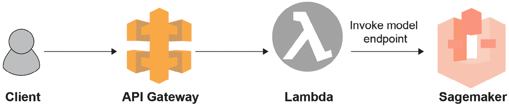

###### 图 8.9：API Gateway、AWS Lambda 和 SageMaker 的工作流程

客户端（例如，一个网页浏览器），调用 Amazon API Gateway 的定义动作并传递适当的参数值。API Gateway 将请求传递给 AWS Lambda，同时它也封闭了后端，以便 AWS Lambda 在受保护的私有网络中停留并执行。

在我们的案例中，我们将使用 Lambda 来帮助我们调整从 API Gateway 收到的数据，使其以适当的形式被 SageMaker 端点消费。这是必要的，因为通过 REST API 传递的数据结构与 SageMaker 所期望的结构之间存在差异。SageMaker 模型执行预测并将预测值返回给 AWS Lambda。Lambda 函数解析返回的值并将其发送回 API Gateway，然后 API Gateway 使用结果响应客户端。整个流程完全由 AWS 管理而无需我们实际配置任何基础设施。

#### 注意

此工作流程在亚马逊的一篇博客文章中有更详细的解释。您可以在 https://aws.amazon.com/blogs/machine-learning/call-an-amazon-sagemaker-model-endpoint-using-amazon-api-gateway-and-aws-lambda/ 上了解更多信息。

我们将需要解决一个额外的挑战。截至目前，AWS Lambda 不支持 R 语言来定义函数。它支持 Python、Java、Go 以及一些其他语言，但 R 语言目前不在支持列表中。Lambda 函数将负责将 API 传递的数据转换为所需的形式。我们将利用 Python 脚本来完成这项任务。未来，我们可以期待 AWS Lambda 支持 R 语言。

现在我们已经了解了所需服务的必要背景，让我们将我们的模型部署到无服务器应用程序上。

## 构建无服务器机器学习应用程序

无服务器计算是云计算中的新范式。它允许我们构建和运行应用程序和服务，而无需考虑服务器。实际上，我们构建的应用程序仍然运行在云服务器上，但整个服务器管理过程由云服务提供商，如 AWS，来完成。通过利用无服务器平台，我们只需关注应用程序代码，就可以构建和部署强大、大规模、复杂的应用程序，而无需担心配置、管理和提供服务器。 

在本章中，我们探讨了 AWS 无服务器平台的一些重要组件，例如 AWS Lambda，现在我们可以利用这些解决方案来构建一个机器学习应用程序，我们只需关注核心 ML 代码，而无需担心基础设施的配置和应用程序的扩展。

### 练习 101：使用 API Gateway、AWS Lambda 和 SageMaker 构建无服务器应用程序

在这个练习中，我们将使用 AWS SageMaker 构建一个机器学习模型，并将其作为端点（使用自动化的 SageMaker 函数）部署。为了使模型端点能够被任何服务（在 AWS 内部或外部）调用，我们定义了一个 AWS Lambda 函数，并通过 API Gateway 将端点暴露给公共网络。

这个练习的目的是创建一个无服务器应用程序，该应用程序将使用我们在上一个练习中创建的 SageMaker 模型端点。

执行以下步骤：

1.  在 AWS 中创建一个 IAM 角色，以便 Lambda 能够执行 SageMaker 服务的端点。从 AWS 控制台，搜索 `IAM`，然后在 IAM 页面上点击 **Roles** 选项：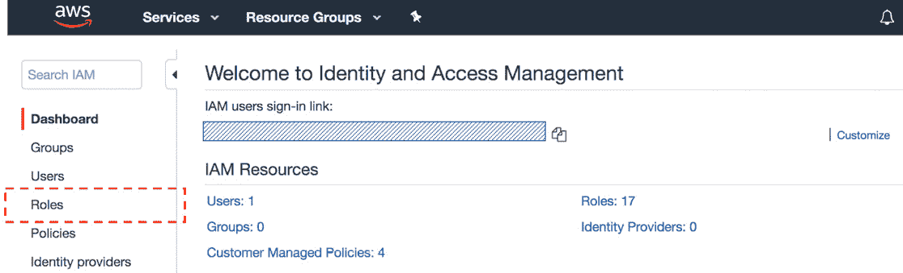

    ###### 图 8.10：创建 IAM 角色

1.  一旦 **角色** 页面加载，点击 **创建角色** 选项。

1.  在 **创建角色** 页面上，选择 **AWS Service** 作为受信任实体的类型，并将 **Lambda** 作为将使用此角色的服务。点击 **下一步：权限** 按钮继续：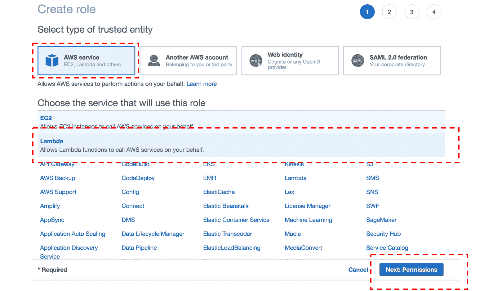

    ###### 图 8.11：选择 AWS 服务选项

1.  在 `sagemaker` 关键字上，选择 `AmazonSageMakerFullAccess` 策略，并点击 **下一步：标签** 选项：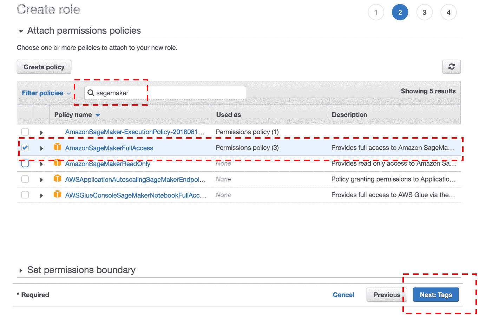

    ###### 图 8.12：创建角色屏幕

1.  在 **标签** 页面上，您可以直接点击 **下一步** 并进入最后一页来命名 **角色**。

1.  现在，在最后一页，添加一个合适的名称（例如，`lambda_sagemaker_execution`）并点击**创建角色**。角色将为我们创建以供使用：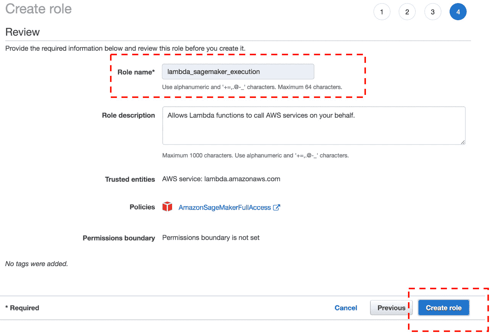

    ###### 图 8.13：审查页面—创建角色

1.  在 AWS 控制台中，搜索 AWS Lambda 并点击**创建函数**按钮。创建函数页面将有一些需要定义的输入。

1.  选择`lambda_sagemaker_connection`）。

1.  接下来，选择`lambda_sagemaker_execution`。点击**创建函数**按钮：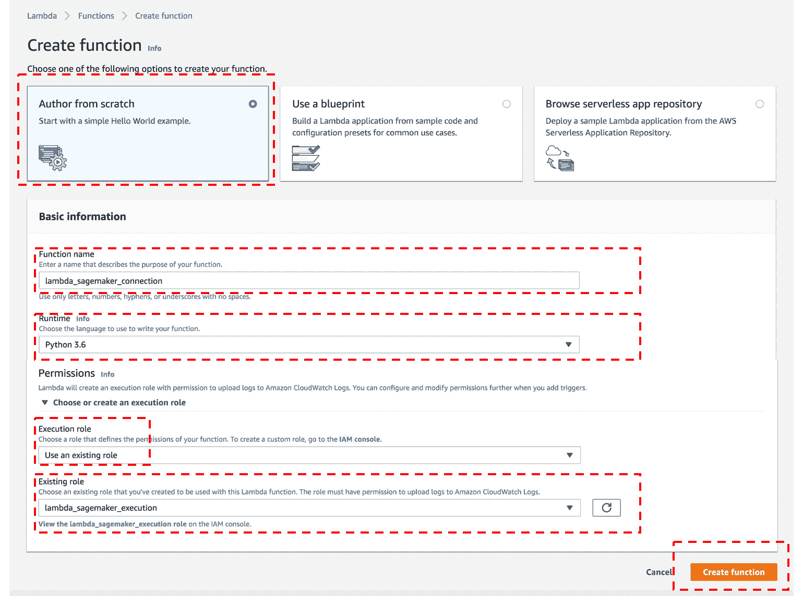

    ###### 图 8.14：创建函数表单

1.  定义一个 Python 函数，该函数将接受 API 的输入请求，解析有效载荷，并调用 SageMaker 端点：

    ```py
    import os, io, boto3, json, csv
    # grab environment variables
    ENDPOINT_NAME = os.environ['ENDPOINT_NAME']
    runtime= boto3.client('runtime.sagemaker')
    ```

    #### 注意

    端点名称将在 SageMaker 页面下的端点部分可用。

1.  我们还将为函数定义一个环境变量，该变量将存储 SageMaker 端点：

    ```py
    def lambda_handler(event, context):
        print("Received event: " + json.dumps(event, indent=2))

        #Load JSON data from API call
        data = json.loads(json.dumps(event))
        payload = data['data']
        print(payload)

        #Invoke Sagemaker endpoint and pass Payload
        response = runtime.invoke_endpoint(EndpointName=ENDPOINT_NAME,
                                           ContentType='text/csv',
                                           Body=bytes(str(payload),'utf'))

        result = json.loads(response['Body'].read().decode())
        predicted_label = 'yes' if result >0.5 else 'no'
        return predicted_label
    ```

    #### 注意

    您可以在 GitHub 上查看完整的代码：https://github.com/TrainingByPackt/Applied-Supervised-Learning-with-R/blob/master/Lesson08/Amazon_Lambda_Function.py。

1.  在 AWS 控制台中点击`API Gateway`，通过选择截图中的以下突出显示选项创建一个新的 API 函数。为 API 提供一个合适的名称，例如`api_lambda_connect`：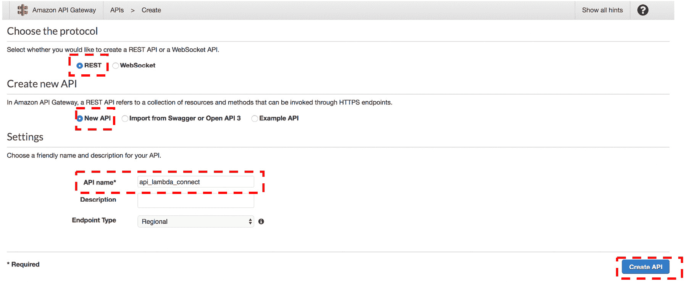

    ###### 图 8.15：Amazon API 网关

1.  从**操作**下拉菜单中选择**创建资源**，添加一个合适的资源名称，然后点击**创建资源**按钮：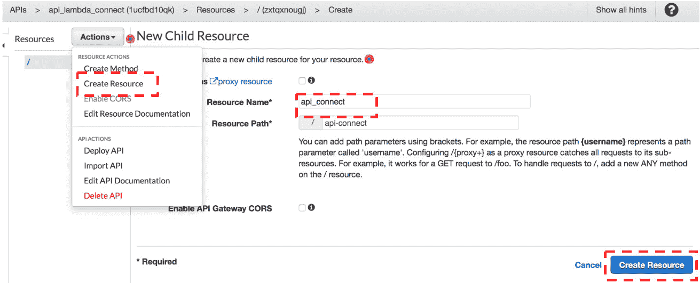

    ###### 图 8.16：创建新的子资源

1.  再次，从**操作**下拉菜单中选择**创建方法**，并选择方法类型为**POST**。

1.  选择**集成类型**为**Lambda 函数**，并在输入标签中指定**Lambda 函数**名称，如以下截图所示。然后，点击**保存**按钮：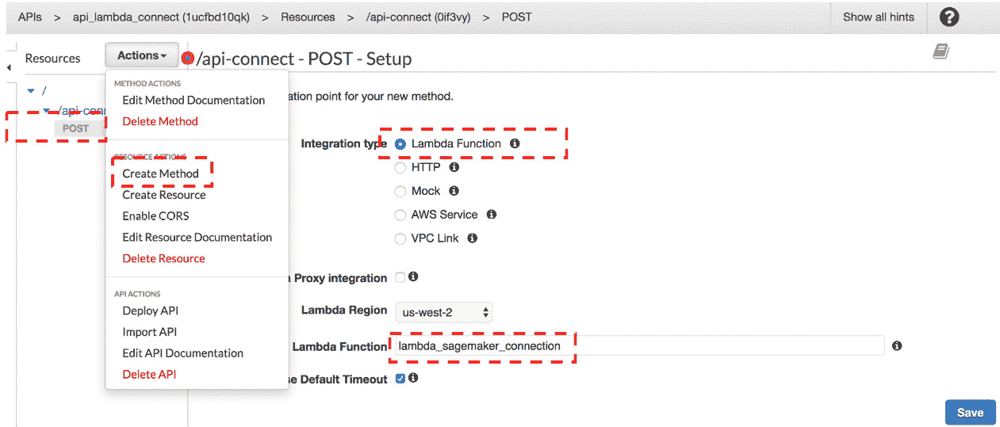

    ###### 图 8.17：创建 Lambda 函数

1.  接下来，选择`test`)并点击**部署**选项。API 现在将被部署并准备好使用。

1.  一旦 API 部署完成，我们可以通过导航到`https://****amazonaws.com/[deployment-stage]/[resource-name]/`找到要调用的 API 的 URL。

1.  使用 Postman 调用 API。打开 Postman，选择一个**POST**调用，并将我们从 API 网关阶段复制的 URL 粘贴进去。然后，点击**正文**并添加原始数据，即 JSON 格式的测试数据，如以下截图所示：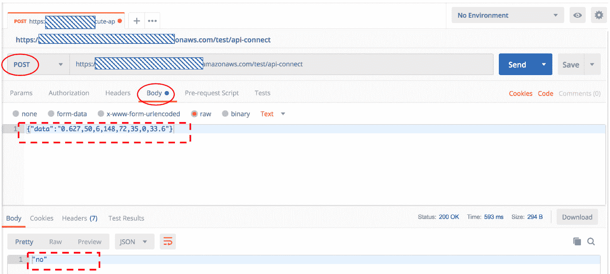

    ###### 图 8.19：通过 Postman 调用 API

1.  点击**发送**按钮以使用提供的原始数据调用 API。结果将在下面的窗口中展示。

我们收到了“否”的预测，这表明模型已成功部署为无服务器应用程序。现在我们可以从世界任何地方的浏览器或 Postman 调用 API 并获取模型的预测。此 API 调用可以集成到更大的产品中的其他服务，并且可以根据需求进行扩展。

## 删除所有云资源以停止计费

我们已配置的所有资源都需要被删除/终止，以确保它们不再计费。为了确保在练习书中创建的所有资源都被删除，需要执行以下步骤：

1.  登录 CloudFormation 并点击**删除堆栈**（我们为 RStudio 提供的那个）。

1.  登录 SageMaker，从右侧侧边栏打开端点，检查我们为练习创建的端点，并删除它。

1.  登录 AWS Lambda，删除我们为练习创建的 Lambda 函数。

1.  登录 AWS API Gateway 并删除我们为练习创建的 API。

**关于 AWS SageMaker 的进一步说明**

我们利用 Amazon 提供的现有算法容器来训练模型。这一步骤是为了使事情简单。我们可以将我们自己的自定义训练算法带到 SageMaker，并利用该平台将模型作为服务部署。SageMaker 负责整个过程，包括协调后台资源以提供实例、配置模型工件和构建端点。然而，我们需要以特定格式提供数据和模型工件，以便 SageMaker 可以部署它。

#### 注意

关于构建自定义模型过程的更多详细信息可以在 https://docs.aws.amazon.com/sagemaker/latest/dg/build-model.html 找到。

### 活动 13：使用 plumber 部署 R 模型

在此活动中，我们将使用 R 开发回归模型，并使用 plumber 将其作为 API 端点部署。我们将使用 R 的另一个监督学习用例，并使用不同的数据集构建回归模型，即**波士顿住房**。该数据集包含在 R 的 Mlbench 库中，我们已安装，并提供在给定房屋属性数量时波士顿房屋的中位价格信息。

我们将编写两个 R 脚本：`model.r`用于存放回归模型以及预测函数，`plumber.R`用于存放部署模型为 API 端点所需的功能。

#### 注意

关于数据集的更多详细信息可以在 https://www.rdocumentation.org/packages/mlbench/versions/2.1-1/topics/BostonHousing 找到。

执行以下步骤：

1.  创建一个`model.r`脚本，该脚本将加载所需的库、数据和拟合回归模型以及必要的函数，以便对未见数据做出预测。

1.  加载`mlbench`库，其中包含此活动的数据。

1.  将`BostonHousing`数据加载到 DataFrame，`df`中。

1.  使用`df`的前`400`行创建训练数据集，并使用剩余的数据进行测试。

1.  使用 `lm` 函数拟合逻辑回归模型，其中因变量为 `medv`（中值）和 `10` 个自变量，例如 `crim`、`zn`、`indus`、`chas`、`nox`、`rm`、`age`、`dis`、`rad` 和 `tax`。

1.  定义一个模型端点为 `predict_data`；这将被用作 plumber 的 API 端点。

1.  在函数内部，将参数转换为 `numeric` 和 **factor**（因为 API 调用只会将它们作为字符串传递）。

1.  将模型的 10 个独立特征作为名为 `sample` 的 DataFrame 包装，列名保持一致。

1.  将 `sample` DataFrame 传递给步骤 4 中创建的模型预测函数，并返回预测结果。

1.  加载 `plumber` 库。

1.  使用 `plumb` 函数创建一个 plumber 对象，并传递步骤 1 中创建的 `model.r` 文件。

1.  通过传递主机名 `localhost` 或 `127.0.0.1` 和端口号，例如 `8080`，来运行 plumber 对象。

1.  使用浏览器或 Postman 测试部署的模型，并调用 API。

    API 调用：

    http://127.0.0.1:8080/predict_data?crim=0.01&zn=18&indus=2.3&chas=0&nox=0.5&rm=6&age=65&dis=4&rad=1&tax=242

    最终输出如下：

    ```py
    {"Answer":[22.5813]}Note
    ```

    #### 注意

    本活动的解决方案可以在第 463 页找到。

## 摘要

在本章中，我们学习了如何使用 R 的 plumber 工具以及 Docker 容器等增强方法，通过传统的基于服务器的部署策略来部署我们的机器学习模型。然后，我们研究了如何使用云服务构建无服务器应用程序，以及如何通过最少的代码轻松地按需扩展应用程序。

我们探讨了各种网络服务，例如 Amazon Lambda、Amazon SageMaker 和 Amazon API Gateway，并研究了如何编排服务以将我们的机器学习模型作为无服务器应用程序部署。

在下一章中，我们将通过基于现实世界问题的最新研究论文来开展一个综合项目，并重现其结果。
