# 第十章：基于研究论文的毕业设计

## 学习目标

到本章结束时，你将能够：

+   使用 mlr 和 OpenML 在问题上应用端到端的机器学习工作流程，这包括识别研究文章。

+   训练机器学习模型，并随后在测试数据集上使用该模型进行预测和评估。

+   对数据集进行重采样。

+   设计用于构建各种模型的实验。

+   为选择最佳模型建立基准。

在本章中，我们将基于一个现实世界问题选取最新的研究论文，并重现其结果。

## 简介

在本章的最后，我们将专注于一个基于研究的项目。所有前几章中的想法，例如使用 SCQ 框架设计问题、识别数据来源、预处理数据集、训练机器学习模型、评估模型、应用重采样技术以及许多其他概念都将被使用。此外，本章还将关注基准测试模型、设计机器学习实验、在开源平台上协作以及使研究工作可重复，以造福更大的社区。

在线资源的丰富、计算能力的提升以及现成的工具包解决方案的广泛应用，使得成为机器学习专业人员的门槛降至最低。如今，我们有很多快速入门算法，它们作为 R 和 Python 等编程语言中的函数提供，甚至在 Google Cloud AutoML 或 Microsoft Azure Machine Learning Studio 等平台上的拖放操作中提供。然而，在许多这样的快速入门 Hello World 模型中，通常缺少的是对问题解决的敏锐关注以及超越现有工具的能力。

除了豪华的工具集之外，还存在着由许多学术界和工业界的领先实践者产生的以研究为导向的工作世界。当涉及到产生突破和高品质成果时，这种研究工作的重要性是巨大的。然而，这种研究工作的可访问性有限，因此阻碍了机器学习实践者中的广泛应用。不追求基于研究的工作的另一个原因是由于缺乏可重复性（大多是因为代码未在公共领域提供，研究发现不明确，或研究工作质量差）以及在研究文章或论文中发现的充满术语的理论（许多是用数学语言编写的）。

本章致力于此类研究工作，这些工作往往被许多努力进入机器学习但仅限于使用博客或在线书籍中提倡的特定工具和包的许多学习者忽视。我们将关注两个重要的研究工作，幸运的是，它们也找到了在 R 包中的位置。下一节将介绍这项工作，并设定本章其余部分的流程。

## 探索研究工作

在本章中，我们将探讨两项最终也成为开源项目的最显著研究成果。本章的重点在于自上而下的方法，我们将从优秀研究成果的起源开始，看看它是如何成为每个人都可以使用的主流工具包的。在强调研究成果的同时，我们还想强调，许多研究成果在市场上可用的标准工具包中找不到位置，但如果稍微努力一些，就能发现一些珍宝。

我们推荐参考 https://paperswithcode.com 创作者所付出的出色努力。**Papers With Code** 团队借助社区的帮助和自动化的力量，创建了一个免费且开放的资源平台，包含机器学习论文、代码和评估表格。他们已经自动化了代码与论文的链接，现在正在努力自动化从论文中提取评估指标。这项工作值得称赞，因为它将把最佳研究成果从噪音和繁杂中凸显出来。

下表将突出五个研究成果案例，这些案例是通过 Papers With Code 网站找到的。在整个书中，你已经看到了很多用于机器学习工作流程各个阶段的 R 代码和不同包。mlr 和 OpenML 研究人员的工作现在已打包在 R 中，特别是 OpenML 是一个完整的平台。我们将学习如何利用 mlr 和 OpenML 平台来制作最佳的机器学习模型，而不仅仅是快速入门的 **Hello World** 示例。为了参考，请查看以下表格：

![图 9.1：本课程演示中使用的论文（第一部分）]

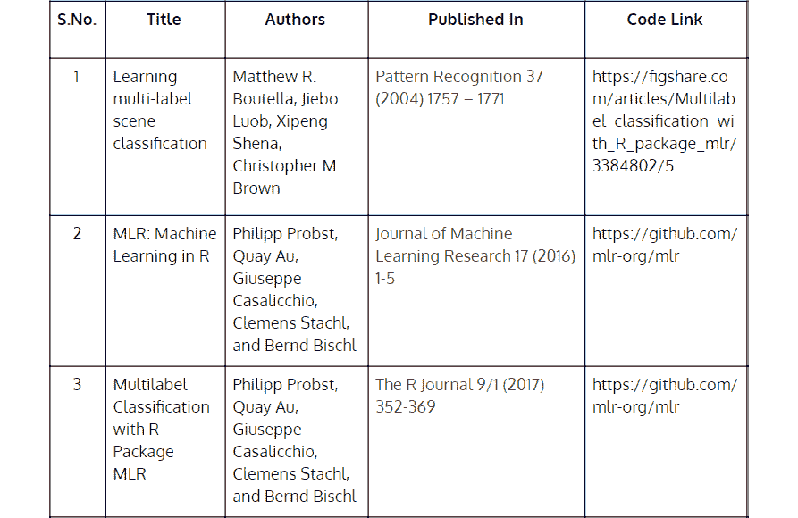

###### 图 9.1：本章演示中使用的论文（第一部分）

![图 9.2：本课程演示中使用的论文（第二部分）]

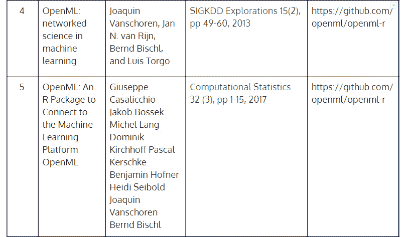

###### 图 9.2：本章演示中使用的论文（第二部分）

## mlr 包

现在，我们将学习 mlr 包如何提供一个完整的框架来处理许多机器学习模型和问题。在许多机器学习项目中，人们往往需要管理大量围绕众多实验的细节（也称为**试错迭代**）。每个实验都包含使用不同机器学习算法、性能指标、超参数、重采样技术和预测的大量训练。除非我们系统地分析每个实验中获得的信息，否则我们无法得出最佳参数值组合。

使用 mlr 包的另一个优点来自于其丰富的机器学习算法集合，来自各种包。我们不再需要为机器学习算法的不同实现安装多个包。相反，mlr 在一个地方提供了一切。为了更好地理解这一点，请参考以下表格：

图 9.3：mlr 包（第一部分）

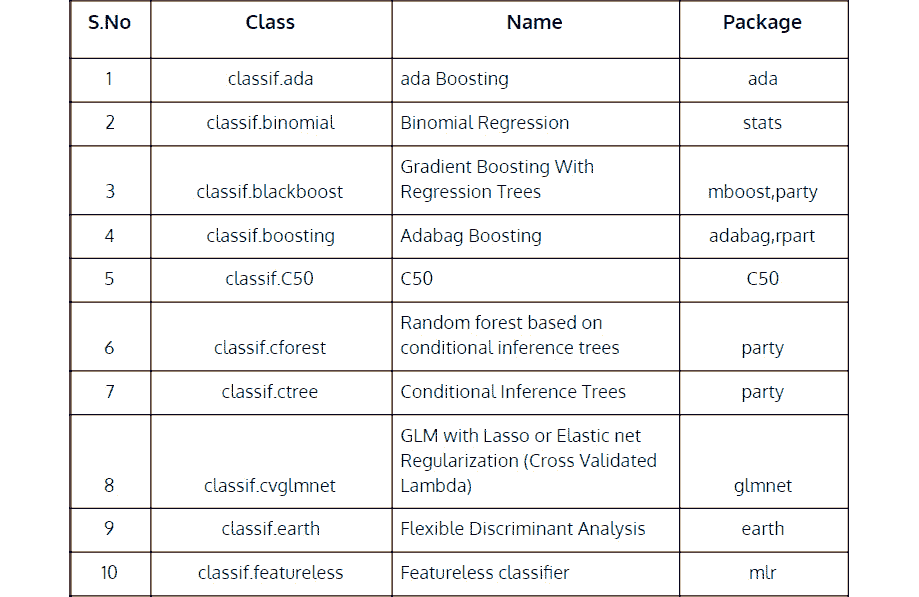

###### 图 9.3：mlr 包（第一部分）

**多标签分类算法**

mlr 包中提供了以下多标签分类模型，其中单个观测值可以分配给多个类别。这些模型在解决许多有用的问题中很有用，例如，在 Netflix 上，你会看到每部电影都可以被标记为动作、冒险和奇幻。或者，在 YouTube 上，每天都有数百万个视频被发布，一个自动算法可以将视频标记为多个类别，从而帮助内容过滤和更好的搜索。

我们将使用这些算法以及前表中定义的分类器：

![图 9.4：使用 mlr 包进行多标签分类]

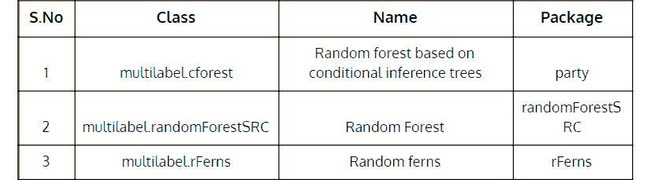

###### 图 9.4：使用 mlr 包进行多标签分类

### OpenML 包

OpenML，一个学术和工业研究人员可以通过它自动共享、组织和审议机器学习实验、数据、算法和流程的合作平台。该平台带来了高效的协作，并实现了可重复性。

R 中的 OpenML 包包含各种功能，允许用户搜索、上传和下载数据集，并执行与机器学习相关的操作。用户可以上传机器学习实验的输出，与其他用户分享，并下载输出结果。这增强了工作的可重复性，加快了研究工作，并将来自不同领域的人们聚集在一起。

## 研究论文中的问题设计

在本章中，我们将理解、分析和重现《学习多标签场景分类》论文的结果。我们将有效地使用 mlr 和 OpenML 包来重现结果。在此之前，让我们使用**SCQ 框架**来编写论文中的**情况-复杂性-问题**：

![图 9.5：来自论文《学习多标签场景分类》的 SCQ]

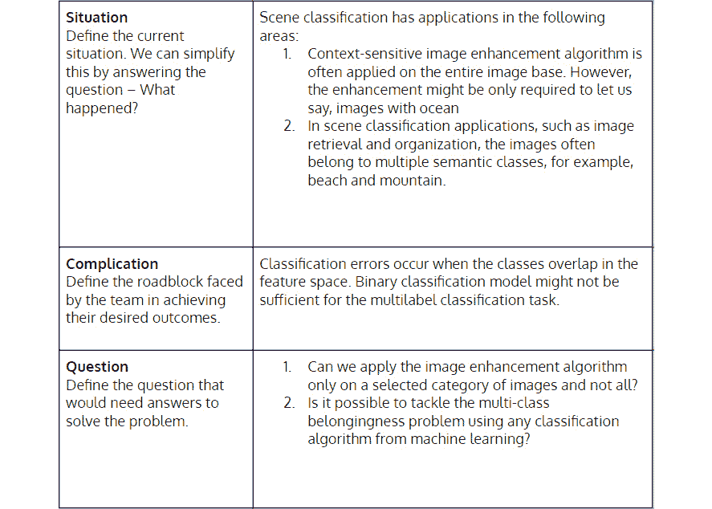

###### 图 9.5：来自论文《学习多标签场景分类》的 SCQ

## 场景数据集功能

论文使用了`scene`数据集进行语义场景分类任务。该数据集是自然场景图像的集合，其中自然场景可能包含多个对象，因此多个类别标签可以描述场景。例如，背景有山的田野场景。从论文中，我们选取了第一张图，它显示了两个图像，这两个图像是多标签图像，描述了单个图像中的两个不同场景。*图 9.6*是海滩和城市场景，而*图 9.7*展示了山脉：

![图 9.6：海滩和城市场景。

![img/C12624_09_06.jpg]

###### 图 9.6：海滩和城市场景。

![图 9.7：山脉场景。

![img/C12624_09_07.jpg]

###### 图 9.7：山脉场景。

从给定的图像中，我们可以使用以下内容：

+   **颜色信息**：当区分某些类型的户外场景时，这种信息很有用。

+   **空间信息**：这种信息在许多情况下都很有用。例如，图像顶部的光、暖色调可能对应日出。

论文使用*CIE L*U*V*，如空间，表示为 Luv。Luv 空间提出了预期的感知均匀性。在将 XYZ 空间适应到 Luv 空间（一种从 XYZ 空间到*L*U*V*空间的数学转换）之后，图像被一个 7 x 7 网格分成 49 个块。然后，作者计算每个波段（RGB）的第一和第二矩（均值和方差），这分别对应于低分辨率图像和计算成本较低的质量特征。总共，我们为每张图像获得*49 x 2 x 3 = 294*个特征向量。

数据集中的剩余六列对应于用真/假编码值表示的六个标签。如果一个图像属于两个类别，相应的列将具有真值。

#### 注意

在比色法中，国际照明委员会（**CIE**）于 1976 年采用了 CIE 1976 L*、u*、v*颜色空间，作为 1931 CIE XYZ 颜色空间的一个简单计算转换，但试图实现感知均匀性，即两种颜色之间的差异或距离。

## 使用 mlr 和 OpenML 包实现多标签分类器

现在我们将了解如何使用 mlr 和 OpenML 包训练多标签分类器。首先，我们将从 OpenML 下载场景数据集。

### 练习 102：从 OpenML 下载场景数据集

在这个练习中，我们将下载场景数据集并为其进一步分析做准备。

完成练习的以下步骤：

1.  为了通过 OpenML API 下载场景数据集，首先在[`www.openml.org/register`](https://www.openml.org/register)网站上创建一个账户。注册过程涉及验证您的电子邮件地址，之后您将获得访问 API 密钥的权限。![图 9.8：OpenML 注册页面。

    ![img/C12624_09_08.jpg]

    ###### 图 9.8：OpenML 注册页面。

1.  登录您的账户后，转到您的账户并选择 API 认证选项。

1.  在 API 认证页面，从 API 密钥部分选择并复制粘贴 API 密钥。Multilabel Classification with R Package mlr 论文的作者上传了一组带有 2016_multilabel_r_benchmark_paper 标签的数据集，我们现在可以从 OpenML 下载并开始重现他们的结果。我们将特别使用场景数据集（ID 为 40595）。

1.  在继续之前，打开 RStudio 并安装所有必需的包。

1.  导入所需的包和库：

    ```py
    library(mlr)
    library(BBmisc)
    library(OpenML)
    library(batchtools)
    library(parallelMap)
    ```

1.  使用来自 OpenML 的 API 密钥，并使用以下命令注册 API 密钥：

    ```py
    setOMLConfig(apikey = “627394a14f562f0fa8bcc9ec443d879f”)
    ```

    输出如下：

    ```py
    ## OpenML configuration:
    ##   server           : http://www.openml.org/api/v1
    ##   cachedir         : C:\Users\Karthik\AppData\Local\Temp\Rtmp6bSgE4/cache
    ##   verbosity        : 1
    ##   arff.reader      : farff
    ##   confirm.upload   : TRUE
    ##   apikey           : ***************************d879f
    ```

1.  使用以下命令从源下载数据集：

    ```py
    ds.list = listOMLDataSets(tag = “2016_multilabel_r_benchmark_paper”)
    ```

    输出如下：

    ```py
    ## Downloading from ‘http://www.openml.org/api/v1/json/data/list/tag/2016_multilabel_r_benchmark_paper/limit/5000/status/active’ to ‘<mem>’.
    ```

1.  接下来，我们将使用 ID 40595 获取场景数据集：

    ```py
    oml.data = lapply(40595, getOMLDataSet)
    df.oml.data.scene <- data.frame(oml.data)
    ```

    #### 注意

    在执行前两个命令之前，请确保您已安装 farff 包。

1.  使用以下命令创建 DataFrame：

    ```py
    df_scene = df.oml.data.scene
    labels = colnames(df_scene)[295:300]
    scene.task = makeMultilabelTask(id = “multi”, data = df_scene, target = labels)
    ```

    输出如下：

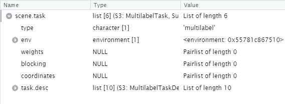


###### 图 9.9：场景.task 变量的环境设置

在这个练习中，我们在 OpenML 上注册了一个账户并获取了一个 API 密钥。使用该 API 密钥，我们能够下载具有 OpenML 中 2016_multilabel_r_benchmark_paper 标签的场景数据集。最后，我们将数据集转换为数据框。OpenML 提供了许多这样的功能以促进协作。通过分配标签，人们可以与更大的社区分享他们的代码、实验和流程。

## 构建学习器

**学习器**是 mlr 包中机器学习算法的实现。如前文所述的 mlr 包部分所强调，mlr 中有一个丰富的学习器函数集合。

对于我们的场景分类问题，mlr 包提供了两种可能的方式来构建多标签分类模型：

+   **适应方法**：在这种情况下，我们在整个问题上适应一个显式算法。

+   **转换方法**：我们将问题转换为一个简单的二元分类问题，然后应用可用的二元分类算法。

### 适应方法

R 中的 mlr 包提供了两种算法适应方法。首先，来自`randomForestSRC`包的多变量随机森林算法，其次，内置在`rFerns`包中的随机森林多标签算法。

mlr 中的`makeLearner()`函数创建了`rFerns`和`randomForestSRC`算法的模型对象，如下面的代码所示：

```py
multilabel.lrn3 = makeLearner(“multilabel.rFerns”)
multilabel.lrn4 = makeLearner(“multilabel.randomForestSRC”)
multilabel.lrn3
```

输出如下，显示了关于多标签.rFerns 模型的信息，如名称和预测类型：

```py
## Learner multilabel.rFerns from package rFernsd
## Type: multilabel
## Name: Random ferns; Short name: rFerns
## Class: multilabel.rFerns
## Properties: numerics,factors,ordered
## Predict-Type: response
## Hyperparameters:
```

#### 注意

在执行前两个命令之前，请确保您已安装*rFerns*和*randomForestSRC*包。

### 转换方法

构建学习器的第二种方法是使用`makeLearner()`函数，然后可以使用以下章节中描述的五个包装函数中的任何一个来进行问题转换。

### 二元相关方法

在多标签分类问题中，每个标签都可以被转换为一个二元分类问题。在这个过程中，任何一个观测值都可能被分配多个标签。在 mlr 包中，`makeMultilabelBinaryRelevanceWrapper()`方法将二元学习器方法转换为包装的二元相关多标签学习器。

### 分类链方法

分类链包装器方法实现了一个多标签模型，其中二元分类器被排列成链。每个模型按照链中指定的顺序输出预测。该模型使用给定数据集中的所有特征，以及链中之前模型的全部预测。mlr 中的`makeMultilabelClassifierChainsWrapper()`方法用于创建分类链包装器。

### 嵌套堆叠

然而，与分类链类似，观察到的类别（或标签）不是实际类别，而是基于从链中前一个模型（学习器）获得的类别估计。mlr 包中的`makeMultilabelNestedStackingWrapper()`方法用于创建嵌套堆叠包装器。

### 依赖二分类相关性方法

mlr 包中的`makeMultilabelDBRWrapper`方法用于创建依赖二分类相关性包装器。

### 堆叠

然而，与依赖二分类相关性方法类似，在训练阶段，用作每个标签输入的标签是通过二分类方法获得的，而不是使用实际标签。mlr 包中的`makeMultilabelStackingWrapper`方法用于创建堆叠包装器。

在以下练习中，我们将看到如何使用`classif.rpart`方法生成决策树模型。

### 练习 103：使用 classif.rpart 方法生成决策树模型

在这个练习中，我们将使用`classif.rpart`方法生成决策树模型，然后使用*二分类*和嵌套*堆叠*包装器进行转换。

执行以下步骤以完成练习：

1.  首先，使用`makeLearner`方法创建`classif.rpart`的对象：

    ```py
    lrn = makeLearner(“classif.rpart”, predict.type = “prob”)
    ```

1.  接下来，使用`makeMultilabelBinaryRelevanceWrapper`方法创建堆叠包装器：

    ```py
    multilabel.lrn1 = makeMultilabelBinaryRelevanceWrapper(lrn)
    multilabel.lrn2 = makeMultilabelNestedStackingWrapper(lrn)
    ```

1.  接下来，打印模型：

    ```py
    lrn
    ```

    输出如下：

    ```py
    Learner classif.rpart from package rpart
    Type: classif
    Name: Decision Tree; Short name: rpart
    Class: classif.rpart
    Properties: twoclass,multiclass,missings,numerics,factors,ordered,prob,weights,featimp
    Predict-Type: prob
    Hyperparameters: xval=0
    ```

1.  打印堆叠包装器，如图所示：

    ```py
    multilabel.lrn1
    ```

    以下命令的输出如下，显示了模型类型、作为模型输出一部分的属性以及预测类型：

    ```py
    Learner multilabel.binaryRelevance.classif.rpart from package rpart
    Type: multilabel
    Name: ; Short name: 
    Class: MultilabelBinaryRelevanceWrapper
    Properties: numerics,factors,ordered,missings,weights,prob,twoclass,multiclass
    Predict-Type: prob
    Hyperparameters: xval=0
    ```

### 训练模型

我们可以使用多标签学习者和多标签任务作为输入，像通常一样训练模型；使用`multilabel.lrn1`对象。

### 练习 104：训练模型

在这个练习中，我们首先将数据随机分为训练集和测试集，然后使用 mlr 包中的`train()`函数和前一小节中定义的`multilabel.lrn1`对象来训练模型。

执行以下步骤以完成练习：

1.  使用以下命令进行训练、预测和评估数据集：

    ```py
    df_nrow <- nrow(df_scene)
    df_all_index <- c(1:df_nrow)
    ```

1.  使用以下命令创建`test_index 变量`：

    ```py
    train_index <- sample(1:df_nrow, 0.7*df_nrow)
    test_index <- setdiff(df_all_index,train_index)
    ```

1.  使用`train`函数，该函数接受模型对象`multilabel.lrn1`（仅包含随机选择的`train_index`的`scene.task`）来训练模型：

    ```py
    scene_classi_mod = train(multilabel.lrn1, scene.task, subset = train_index)
    scene_classi_mod
    ```

    输出如下：

    ```py
    Model for learner.id=multilabel.binaryRelevance.classif.rpart; learner.class=MultilabelBinaryRelevanceWrapper
    Trained on: task.id = multi; obs = 1684; features = 294
    Hyperparameters: xval=0
    ```

使用 R 中的`rpart`包训练的`scene_classi_mod`模型，使用了从`scene`数据集中随机选择的`1684`个观测值，它是机器学习中**分类和回归树**（**CART**）算法的实现，并包装了二值相关方法进行多标签分类。

### 预测输出

在 mlr 中，可以使用`predict`函数进行预测。输入参数是训练模型；将`scene.task`数据集分配给`task`和`test_index`参数，它们对应于分配给`subset`参数的测试数据集：

```py
pred = predict(scene_classi_mod, task = scene.task, subset = test_index)
names(as.data.frame(pred))
[1] “id”                   “truth.Beach”          “truth.Sunset”         “truth.FallFoliage”   
 [5] “truth.Field”          “truth.Mountain”       “truth.Urban”          “prob.Beach”          
 [9] “prob.Sunset”          “prob.FallFoliage”     “prob.Field”           “prob.Mountain”       
[13] “prob.Urban”           “response.Beach”       “response.Sunset”      “response.FallFoliage”
[17] “response.Field”       “response.Mountain”    “response.Urban”
```

### 模型性能

为了评估预测的性能，mlr 包提供了`performance()`函数，该函数接受模型的预测作为输入，以及我们想要计算的所有度量。所有可用的多标签分类度量可以通过`listMeasures()`列出。根据论文，我们在预测上使用了`hamloss`、`f1`、`subset01`、`acc`、`tpr`和`ppv`等度量：

```py
MEASURES = list(multilabel.hamloss, multilabel.f1, multilabel.subset01, multilabel.acc, multilabel.tpr, multilabel.ppv)
performance(pred, measures = MEASURES)
```

上一条命令的输出如下：

```py
multilabel.hamloss       multilabel.f1 multilabel.subset01      multilabel.acc      multilabel.tpr 
          0.1260950           0.5135085           0.5878285           0.4880129           0.5477178 
     multilabel.ppv 
          0.7216733
```

以下命令将列出所有可用的多标签分类问题度量：

```py
listMeasures(“multilabel”)
```

输出如下：

```py
[1] “featperc”            “multilabel.tpr”      “multilabel.hamloss”  “multilabel.subset01” “timeboth”           
 [6] “timetrain”           “timepredict”         “multilabel.ppv”      “multilabel.f1”       “multilabel.acc”
```

### 数据重采样

为了评估学习算法的完整性能，我们可以进行一些重采样。为了定义重采样策略，可以使用`makeResampleDesc()`或`makeResampleInstance()`。之后，运行`resample()`函数。使用以下默认度量来计算汉明损失：

```py
rdesc = makeResampleDesc(method = “CV”, stratify = FALSE, iters = 3)
r = resample(learner = multilabel.lrn1, task = scene.task, resampling = rdesc,measures = list(multilabel.hamloss), show.info = FALSE)
r
```

输出如下：

```py
Resample Result
Task: multi
Learner: multilabel.binaryRelevance.classif.rpart
Aggr perf: multilabel.hamloss.test.mean=0.1244979
Runtime: 4.28345
```

### 每个标签的二进制性能

我们可以计算每个标签的二进制性能度量，例如准确度或`auc`，`getMultilabelBinaryPerformances()`函数很有用。我们可以将此函数应用于任何多标签预测，例如，也可以应用于重采样的多标签预测。为了计算`auc`，我们需要预测概率：

```py
getMultilabelBinaryPerformances(r$pred, measures = list(acc, mmce, auc))
```

输出如下：

```py
##             acc.test.mean mmce.test.mean auc.test.mean
## Beach           0.8728708     0.12712921     0.7763484
## Sunset          0.9335272     0.06647279     0.9066371
## FallFoliage     0.9148317     0.08516826     0.8699105
## Field           0.9077690     0.09223099     0.8895795
## Mountain        0.7922725     0.20772746     0.7670873
## Urban           0.8213544     0.17864562     0.7336219
```

### 基准测试模型

在基准实验中，不同的学习方法被应用于一个或多个数据集，目的是比较和排名算法，根据一个或多个性能度量。`mlr()`方法提供了一个非常稳健的框架来执行此类实验，并有助于跟踪实验的所有结果以进行比较。

### 进行基准实验

在我们的第一个实验中，我们使用`mlr()`包中的多标签`randomForestSRC`和`rFerns`学习者和各种度量来获得我们的第一个基准。

在以下练习中，我们将探索如何对各种学习器进行基准测试。

### 练习 105：探索如何在各种学习器上进行基准测试

在这个练习中，我们将看到如何对迄今为止创建的各种学习者进行基准测试，并将结果进行比较，以选择多标签场景分类问题的最佳学习者（模型）。这有助于我们将所有结果组织成结构化格式，以选择表现最佳的模式。

执行以下步骤以完成练习：

1.  首先，使用以下命令列出所有学习者：

    ```py
    lrns = list(makeLearner(“multilabel.randomForestSRC”),
                makeLearner(“multilabel.rFerns”)
                )
    MEASURES = list(multilabel.hamloss, multilabel.f1, multilabel.subset01, multilabel.acc, multilabel.tpr, multilabel.ppv)
    ```

1.  进行基准实验：

    ```py
    bmr = benchmark(lrns, scene.task, measures = MEASURES)
    ```

    输出如下：

    ```py
    ## Exporting objects to slaves for mode socket: .mlr.slave.options
    ## Mapping in parallel: mode = socket; cpus = 2; elements = 2.
    ```

1.  现在，执行`bmr`对象：

    ```py
    bmr
    ```

    模型的训练迭代将类似于以下每个学习者：

    ```py
    Task: multi, Learner: multilabel.rFerns
    [Resample] cross-validation iter 9: multilabel.hamloss.test.mean=0.183,multilabel.f1.test.mean=0.653,multilabel.subset01.test.mean=0.768,multilabel.acc.test.mean=0.54,multilabel.tpr.test.mean= 0.9,multilabel.ppv.test.mean=0.564
    ...
    [Resample] Aggr. Result: multilabel.hamloss.test.mean=0.183,multilabel.f1.test.mean=0.663,multilabel.subset01.test.mean=0.756,multilabel.acc.test.mean=0.549,multilabel.tpr.test.mean=0.916,multilabel.ppv.test.mean=0.566
    ```

    下表展示了测试数据上各种度量的平均值：

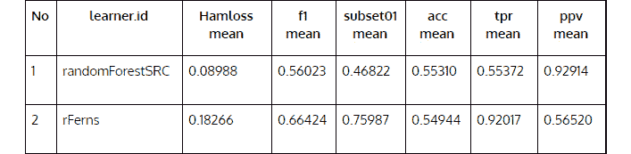

###### 图 9.10：测试数据上各种度量的平均值。

此表显示，`randomForestSRC`模型在所有度量上比`rFerns`做得稍好，主要在**hamloss 平均值度量**上。

### 访问基准结果

`mlr()`方法提供了许多`getBMR`函数，可以从基准实验对象中提取有用的信息，如性能、预测、学习者等。

### 学习者表现

`getBMRPerformances`函数给出了训练过程中每个迭代中基准中定义的所有度量的所有值。下表列出了使用`randomForestSRC`和`rFerns`学习者每个度量的值。

```py
getBMRPerformances(bmr, as.df = TRUE)
```

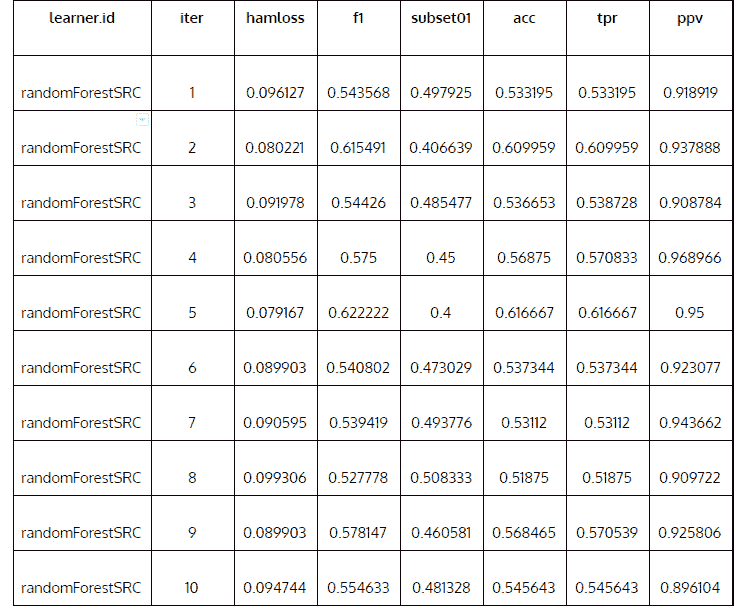

###### 图 9.11：学习者的 randomForestSRC 表现

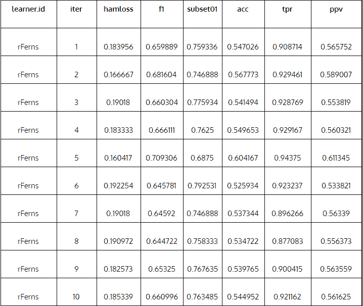

###### 图 9.12：学习者的 rFerns 表现

## 预测

我们还可以使用`getBMRPredictions`函数在测试数据集上获取预测。本节中的两个表格显示了 ID 列表示的几个图像的实际和预测标签。观察发现，预测并不完美，正如我们预期的那样，整体准确率相对较低。

**使用 randomForestSRC 进行预测**：

```py
head(getBMRPredictions(bmr, as.df = TRUE))
```

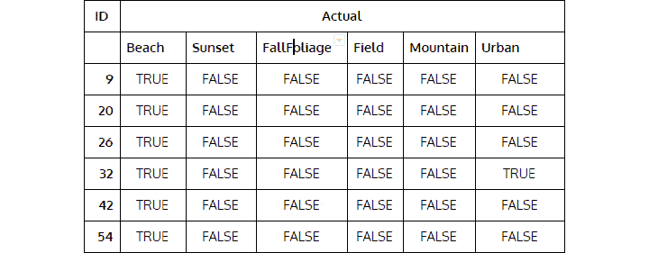

###### 图 9.13：实际标签。

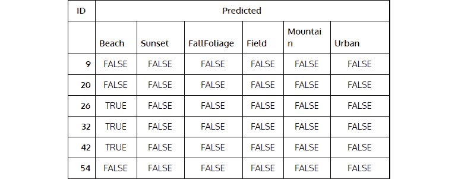

###### 图 9.14：预测标签。

### 学习者和度量

`getBMRLearners`函数提供了关于基准中使用的学习者的详细信息。可以使用此函数获取有关超参数和预测类型等信息。同样，`getBMRMeasures`函数提供了有关性能度量的详细信息。下表显示了我们在基准实验中使用的度量的详细信息：

```py
getBMRLearners(bmr)
```

输出如下：

```py
## $multilabel.randomForestSRC
## Learner multilabel.randomForestSRC from package randomForestSRC
## Type: multilabel
## Name: Random Forest; Short name: rfsrc
## Class: multilabel.randomForestSRC
## Properties: missings,numerics,factors,prob,weights
## Predict-Type: response
## Hyperparameters: na.action=na.impute
## 
## 
## $multilabel.rFerns
## Learner multilabel.rFerns from package rFerns
## Type: multilabel
## Name: Random ferns; Short name: rFerns
## Class: multilabel.rFerns
## Properties: numerics,factors,ordered
## Predict-Type: response
## Hyperparameters:
```

运行`getBMRMeasures(bmr)`函数：

```py
getBMRMeasures(bmr)
```

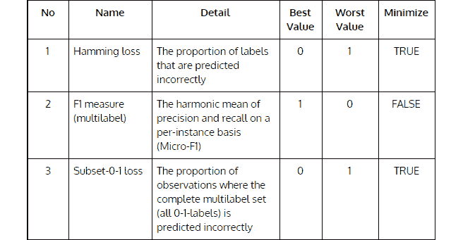

###### 图 9.15：学习者和度量（第一部分）。

图 15 和 16 总结了`getBMRMeasures(bmr)`命令的结果：

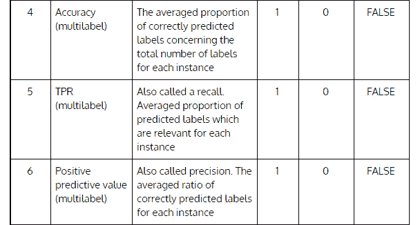

图 9.16：学习者和度量（第二部分）。

合并基准结果

通常，我们会运行多个实验，并希望将所有实验的基准结果汇总到一个列表中，以便比较结果。`mergeBenchmarkResults` 函数有助于合并结果。

这里是基准：

```py
lrns = list(makeLearner(“multilabel.randomForestSRC”),
            makeLearner(“multilabel.rFerns”)
            )
bmr = benchmark(lrns, scene.task, measures = MEASURES)
lrn.classif.randomForest = makeLearner(“classif.randomForest”)
bmr.BR.rf = benchmark(lrn.classif.randomForest, scene.task, measures = MEASURES)
mergeBenchmarkResults(list(bmr, bmr.BR.rf))
```

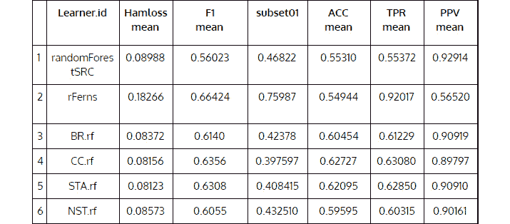


###### 图 9.17：合并基准结果。

显然，使用 `classif.randomForest` 与分类器链包装器产生最高的准确率，并在其他所有指标上也表现良好。

### 活动十四：使用 classif.C50 学习者而不是 classif.rpart 获取二进制性能步骤

在这个活动中，我们将回顾构建模型的整个流程，我们将使用 `makeLearner` 函数指定 `rpart` 模型，替换 `C50`。具体来说，我们将重新运行整个机器学习流程，从问题转换步骤到使用 classif.C50 学习者而不是 `classif.rpart` 的二进制性能步骤。

按照以下步骤完成活动：

1.  定义算法自适应方法。

1.  使用问题转换方法，并将 `classif.rpart` 学习者更改为 `classif.C50`。

    #### 注意

    为了使此代码正常工作，你需要安装 `C50` 包。

1.  打印学习者的详细信息。

1.  打印多标签学习者的详细信息。

1.  使用训练数据集训练模型。

1.  打印模型详细信息。

1.  使用我们之前创建的 C50 模型在测试数据集上预测输出。

1.  打印性能指标。

1.  打印 `listMeasures` 变量的性能指标。

1.  使用交叉验证方法进行重采样。

1.  打印二进制性能。

一旦你完成活动，你应该看到以下输出：

```py
##             acc.test.mean mmce.test.mean auc.test.mean
## Beach           0.8608226     0.13917740     0.8372448
## Sunset          0.9401745     0.05982551     0.9420085
## FallFoliage     0.9081845     0.09181554     0.9008202
## Field           0.8998754     0.10012464     0.9134458
## Mountain        0.7710843     0.22891566     0.7622767
## Urban           0.8184462     0.18155380     0.7837401
```

#### 注意

此活动的解决方案可以在第 466 页找到。

### 使用 OpenML 上传函数工作

为了提高实验的协作和版本控制，我们可以使用 `uploadOMLFlow` 函数将我们创建的流程上传到 OpenML：

```py
flow.id = uploadOMLFlow(makeLearner(“multilabel.randomForestSRC”))
```

输出如下：

```py
Downloading from ‘http://www.openml.org/api/v1/flow/exists/mlr.multilabel.randomForestSRC/R_3.2.2-v2.b955a5ec’ to ‘<mem>’.
Do you want to upload the flow? (yes|no)
Uploading flow to the server.
Downloading response to: C:\Users\Karthik\AppData\Local\Temp\Rtmpe4W4BW\file3f044abf30f2.xml
Uploading to ‘http://www.openml.org/api/v1/flow’.
Flow successfully uploaded. Flow ID: 9708
```

我们鼓励学生探索 OpenML 平台，以找到更多此类功能，因为这个平台帮助全球的研究人员协作和分享他们的工作，使优秀的工作快速传播，并帮助利用研究人员的集体智慧构建最佳模型。

## 摘要

在本章中，我们使用了 R 语言的 mlr 和 OpenML 包来构建一个完整的机器学习工作流程，用于解决多标签语义场景分类问题。mlr 包提供了一系列丰富的机器学习算法和评估度量，这有助于我们快速实施，并加速了实验过程，以便为问题找到最佳模型。该包还提供了许多包装函数来处理多标签问题。使用像 mlr 这样的强大框架构建现实世界的机器学习模型有助于加快实施速度，并为整个项目提供结构。此外，使用 OpenML，我们可以使用现有的数据集和代码重现研究工作，并根据我们的需求进行修改。这样的平台能够与世界各地的研究人员进行大规模合作。最后，我们还可以上传自己的机器学习流程供他人使用，以便他们从我们停止的地方继续。

在本书中，我们的重点是教授使用 R 编程语言进行监督学习。监督学习是一类算法，其中我们提供了数据的有标签观测。探索性数据分析（EDA）方法有助于深入了解数据集，而 SCQ 框架用于精确设计问题。特征的选择基于问题设计，并在多次实验和评估后选择合适的监督学习模型。然后我们学习了如何在生产环境中部署机器学习模型，这些模型可以被业务中的应用团队使用。此外，在数据集有数百个特征的情况下，我们使用了特征降维和选择技术。

我们想强调的是，在任何机器学习项目中，超过一定阶段（可能是从项目开始算起 3 个月的努力或 100 次不同组合的尝试），我们应该停下来思考我们到目前为止所做的工作是否可以部署到生产环境中。如果答案是肯定的，那么部署它并持续监控任何异常和改进。如果答案是否定的，那么就回到起点重新开始（显然，如果这种奢侈是允许的）。在超参数微调和模型选择等阶段进行机器学习是一种艺术。需要大量的试错实验才能得出最佳模型。
