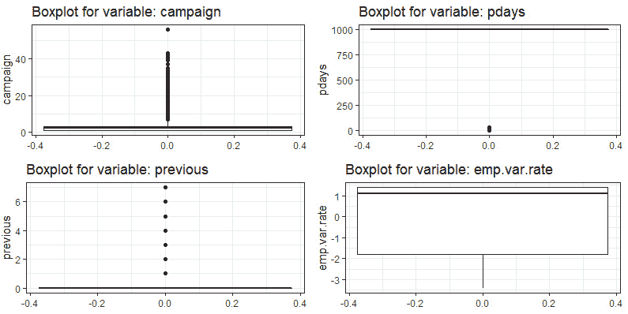
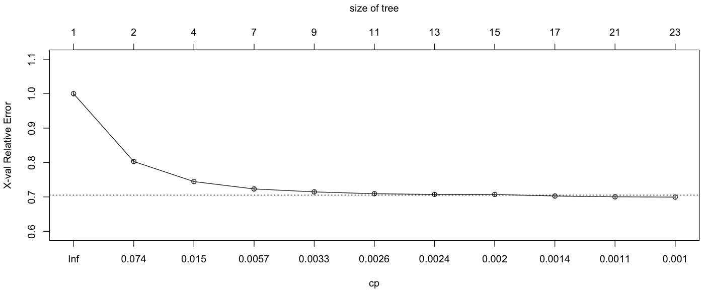
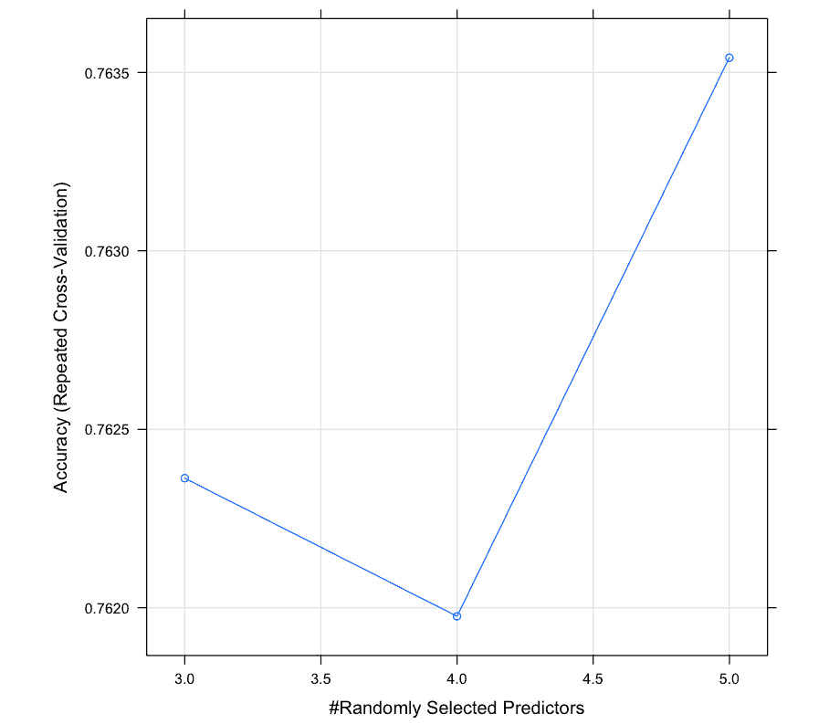

# 附录

## 关于

本节包含的内容旨在帮助学生执行书中的活动。它包括学生为完成和实现书中的目标而需要执行的详细步骤。

## R 高级分析

### 活动一：创建 R Markdown 文件以读取 CSV 文件并编写数据摘要

1.  启动 RStudio 并导航到 **文件** | **新建文件** | **R Markdown**。

1.  在新的 R Markdown 窗口中，提供 **标题** 和 **作者** 名称，如图所示。确保在 **默认输出格式** 部分下选择 **Word** 选项：![图 1.13：在 RStudio 中创建新的 R Markdown 文件]

    ![图片 C12624_01_121.jpg]

    ###### 图 1.13：在 RStudio 中创建新的 R Markdown 文件

1.  现在，使用 `read.csv()` 方法读取 `bank-full.csv` 文件：![图 1.14：使用 read.csv 方法读取数据]

    ![图片 C12624_01_13.jpg]

    ###### 图 1.14：使用 read.csv 方法读取数据

1.  最后，使用 `summary` 方法将摘要打印到 word 文件中：

![图 1.15：使用 summary 方法后的最终输出]

![图片 C12624_01_14.jpg]

###### 图 1.15：使用 summary 方法后的最终输出

### 活动二：创建两个矩阵的列表并访问值

1.  通过从二项分布中随机生成数字创建两个大小为 `10 x 4` 和 `4 x 5` 的矩阵。分别命名为 `mat_A` 和 `mat_B`：

    ```py
    mat_A <- matrix(rbinom(n = 40, size = 100, prob = 0.4),nrow = 10, ncol=4)
    mat_B <- matrix(rbinom(n = 20, size = 100, prob = 0.4),nrow = 4, ncol=5)
    ```

1.  现在，将两个矩阵存储在一个列表中：

    ```py
    list_of_matrices <- list(mat_A = mat_A, mat_B =mat_B)
    ```

1.  使用列表访问 `mat_A` 的第 4 行和第 2 列，并将其存储在变量 `A` 中，并访问 `mat_B` 的第 2 行和第 1 列，并将其存储在变量 `B` 中：

    ```py
    A <- list_of_matrices[["mat_A"]][4,2]
    B <- list_of_matrices[["mat_B"]][2,1]
    ```

1.  将 `A` 和 `B` 矩阵相乘，并从 `mat_A` 的第 2 行和第 1 列中减去：

    ```py
    list_of_matrices[["mat_A"]][2,1] - (A*B)
    ```

    输出如下：

    ```py
    ## [1] -1554
    ```

### 活动三：使用 dplyr 和 tidyr 从银行数据创建包含所有数值变量的五个汇总统计量的 DataFrame

1.  在系统中导入 `dplyr` 和 `tidyr` 包：

    ```py
    library(dplyr)
    library(tidyr)
    Warning: package 'tidyr' was built under R version 3.2.5
    ```

1.  创建 `df` DataFrame 并将其文件导入其中：

    ```py
    df <- tbl_df(df_bank_detail)
    ```

1.  使用 `select()` 从银行数据中提取所有数值变量，并使用 `summarise_all()` 方法计算最小值、1st 四分位数、3rd 四分位数、中位数、均值、最大值和标准差：

    ```py
    df_wide <- df %>%
      select(age, balance, duration, pdays) %>% 
      summarise_all(funs(min = min, 
                          q25 = quantile(., 0.25), 
                          median = median, 
                          q75 = quantile(., 0.75), 
                          max = max,
                          mean = mean, 
                          sd = sd))
    ```

1.  结果是一个宽数据框。4 个变量，7 个度量：

    ```py
    dim(df_wide)
    ## [1]  1 28
    ```

1.  将结果存储在名为 `df_wide` 的宽格式 DataFrame 中，使用 `tidyr` 函数对其进行重塑，最后将宽格式转换为深度格式，使用 `tidyr` 包的 gather、separate 和 spread 函数：

    ```py
    df_stats_tidy <- df_wide %>% gather(stat, val) %>%
      separate(stat, into = c("var", "stat"), sep = "_") %>%
      spread(stat, val) %>%
      select(var,min, q25, median, q75, max, mean, sd) # reorder columns
    print(df_stats_tidy)
    ```

    输出如下：

    ```py
    ## # A tibble: 4 x 8
    ##        var   min   q25 median   q75    max       mean         sd
    ## *    <chr> <dbl> <dbl>  <dbl> <dbl>  <dbl>      <dbl>      <dbl>
    ## 1      age    18    33     39    48     95   40.93621   10.61876
    ## 2  balance -8019    72    448  1428 102127 1362.27206 3044.76583
    ## 3 duration     0   103    180   319   4918  258.16308  257.52781
    ## 4    pdays    -1    -1     -1    -1    871   40.19783  100.12875
    ```

## 数据探索分析

### 活动四：绘制多个密度图和箱线图

1.  首先，在 RStudio 中加载必要的库和包：

    ```py
    library(ggplot2)
    library(cowplot)
    ```

1.  将 `bank-additional-full.csv` 数据集读取到名为 `df` 的 DataFrame 中：

    ```py
    df <- read.csv("bank-additional-full.csv",sep=';')
    ```

1.  定义 `plot_grid_numeric` 函数用于密度图：

    ```py
    plot_grid_numeric <- function(df,list_of_variables,ncols=2){
      plt_matrix<-list()
      i<-1
      for(column in list_of_variables){
        plt_matrix[[i]]<-ggplot(data=df,aes_string(x=column)) + 
          geom_density(fill="red",alpha =0.5)  +
          ggtitle(paste("Density Plot for variable:",column)) + theme_bw()
        i<-i+1
      }
      plot_grid(plotlist=plt_matrix,ncol=2)
    }
    ```

1.  绘制 `campaign`、`pdays`、`previous` 和 `emp.var.rate` 变量的密度图：

    ```py
    plot_grid_numeric(df,c("campaign","pdays","previous","emp.var.rate"),2)
    ```

    输出如下：

    ![图 2.27：`campaign`、`pdays`、`previous` 和 `emp.var.rate` 变量的密度图]

    ![图片 C12624_02_25.jpg]

    ###### 图 2.27：展示 pdays、previous、emp.var.rate 变量的密度图

    观察到我们使用直方图获得的解释在密度图中也明显为真。因此，这可以作为查看相同趋势的另一种替代图表。

1.  对步骤 4 进行重复以生成箱线图：

    ```py
    plot_grid_numeric <- function(df,list_of_variables,ncols=2){
      plt_matrix<-list()
      i<-1
      for(column in list_of_variables){
        plt_matrix[[i]]<-ggplot(data=df,aes_string(y=column)) + 
          geom_boxplot(outlier.colour="black") +
          ggtitle(paste("Boxplot for variable:",column)) + theme_bw()
        i<-i+1
      }
      plot_grid(plotlist=plt_matrix,ncol=2)
    }
    plot_grid_numeric(df,c("campaign","pdays","previous","emp.var.rate"),2)
    ```

    输出如下：



###### 图 2.28：展示 pdays、previous、emp.var.rate 变量的箱线图

现在，让我们探索数据集的最后四个数值变量，即 `nr.employed`、`euribor3m`、`cons.conf.index` 和 `duration`，看看我们是否能得出一些有意义的见解。

## 监督学习简介

### 活动五：按月份在 PRES 和 PM2.5 之间绘制散点图

1.  将 `ggplot2` 包导入系统：

    ```py
    library(ggplot2)
    ```

1.  在 `ggplot` 中，将 `a()` 方法的组件分配给变量 `PRES`。

    ```py
    ggplot(data = PM25, aes(x = PRES, y = pm2.5, color = hour)) +   geom_point()
    ```

1.  在 `geom_smooth()` 方法的下一层中，通过传递 `colour = "blue"` 来区分。

    ```py
    geom_smooth(method='auto',formula=y~x, colour = "blue", size =1)
    ```

1.  最后，在 `facet_wrap()` 层中，使用 `month` 变量为每个月绘制单独的隔离图。

    ```py
    facet_wrap(~ month, nrow = 4)
    ```

    最终代码将如下所示：

    ```py
    ggplot(data = PM25, aes(x = PRES, y = pm2.5, color = hour)) +      geom_point() +      geom_smooth(method='auto',formula=y~x, colour = "blue", size =1) +      facet_wrap(~ month, nrow = 4)
    ```

    图形如下：


###### 图 3.19：显示 PRES 和 PM2.5 之间关系的散点图

### 活动六：转换变量并推导新变量以构建模型

构建模型时请执行以下步骤：

1.  将所需的库和包导入系统：

    ```py
    library(dplyr)
    library(lubridate)
    library(tidyr)
    library(ggplot2)
    library(grid)
    library(zoo)
    ```

1.  将年、月、日和小时合并为一个 `datetime` 变量：

    ```py
    PM25$datetime <- with(PM25, ymd_h(sprintf('%04d%02d%02d%02d', year, month, day,hour)))
    ```

1.  删除任何列中存在缺失值的行：

    ```py
    PM25_subset <- na.omit(PM25[,c("datetime","pm2.5")])
    ```

1.  使用 `zoo` 包中的 `rollapply()` 方法计算 PM2.5 的移动平均值；这是为了平滑 PM2.5 读取中的任何噪声：

    ```py
    PM25_three_hour_pm25_avg <- rollapply(zoo(PM25_subset$pm2.5,PM25_subset$datetime), 3, mean)
    ```

1.  创建 PM25 污染的两个级别，`0–正常`，`1-高于正常`。我们也可以创建超过两个级别；然而，对于最佳适用于二元分类的逻辑回归，我们使用了两个级别：

    ```py
    PM25_three_hour_pm25_avg <- as.data.frame(PM25_three_hour_pm25_avg)
    PM25_three_hour_pm25_avg$timestamp <- row.names(PM25_three_hour_pm25_avg)
    row.names(PM25_three_hour_pm25_avg) <- NULL
    colnames(PM25_three_hour_pm25_avg) <- c("avg_pm25","timestamp")
    PM25_three_hour_pm25_avg$pollution_level <- ifelse(PM25_three_hour_pm25_avg$avg_pm25 <= 35, 0,1)
    PM25_three_hour_pm25_avg$timestamp <- as.POSIXct(PM25_three_hour_pm25_avg$timestamp, format= "%Y-%m-%d %H:%M:%S",tz="GMT")
    ```

1.  将结果数据框（PM25_three_hour_pm25_avg）与其他环境变量的值合并，例如我们在线性回归模型中使用的 `TEMP`、`DEWP` 和 `Iws`：

    ```py
    PM25_for_class <- merge(PM25_three_hour_pm25_avg, PM25[,c("datetime","TEMP","DEWP","PRES","Iws","cbwd","Is","Ir")], by.x = "timestamp",by.y = "datetime")
    ```

1.  使用 TEMP、DEWP 和 Iws 变量在 `pollution_level` 上拟合广义线性模型 (`glm`)：

    ```py
    PM25_logit_model <- glm(pollution_level ~ DEWP + TEMP + Iws, data = PM25_for_class,family=binomial(link='logit'))
    ```

1.  总结模型：

    ```py
    summary(PM25_logit_model)
    ```

    输出如下：

    ```py
    Call:
    glm(formula = pollution_level ~ DEWP + TEMP + Iws, family = binomial(link = "logit"), 
        data = PM25_for_class)
    Deviance Residuals: 
        Min       1Q   Median       3Q      Max  
    -2.4699  -0.5212   0.4569   0.6508   3.5824  
    Coefficients:
                  Estimate Std. Error z value Pr(>|z|)    
    (Intercept)  2.5240276  0.0273353   92.34   <2e-16 ***
    DEWP         0.1231959  0.0016856   73.09   <2e-16 ***
    TEMP        -0.1028211  0.0018447  -55.74   <2e-16 ***
    Iws         -0.0127037  0.0003535  -35.94   <2e-16 ***
    ---
    Signif. codes:  0 '***' 0.001 '**' 0.01 '*' 0.05 '.' 0.1 ' ' 1
    (Dispersion parameter for binomial family taken to be 1)
        Null deviance: 49475  on 41754  degrees of freedom
    Residual deviance: 37821  on 41751  degrees of freedom
    AIC: 37829
    Number of Fisher Scoring iterations: 5
    ```

## 回归

### 活动七：不使用 `summary` 函数使用模型对象打印各种属性

1.  首先，使用以下命令打印系数值。确保输出类似于使用 `coefficients` 选项的 `summary` 函数的输出。系数是从使用 OLS 算法的模型中得到的拟合值：

    ```py
    multiple_PM25_linear_model$coefficients
    ```

    输出如下：

    ```py
    (Intercept)        DEWP        TEMP         Iws 
    161.1512066   4.3841960  -5.1335111  -0.2743375
    ```

1.  查找预测值和实际 PM2.5 值之间的残差值（差异），应尽可能小。残差反映了使用系数得到的拟合值与实际值之间的距离。

    ```py
    multiple_PM25_linear_model$residuals
    ```

    输出如下：

    ```py
    25            26            27            28 
      17.95294914   32.81291348   21.38677872   26.34105878 
               29            30            31            32 
    ```

1.  接下来，找到最适合模型的最佳 PM2.5 实际值的拟合值。使用系数，我们可以计算拟合值：

    ```py
    multiple_PM25_linear_model$fitted.values
    ```

    输出如下：

    ```py
    25         26         27         28         29 
    111.047051 115.187087 137.613221 154.658941 154.414781 
            30         31         32         33         34 
    ```

1.  查找 R-Squared 值。它们应该与你在`summary`函数输出中“Multiple R-squared”旁边的值相同。R-Square 有助于评估模型性能。如果值接近 1，则模型越好：

    ```py
    summary(multiple_PM25_linear_model)$r.squared
    ```

    输出如下：

    ```py
    [1] 0.2159579
    ```

1.  查找 F-Statistic 值。确保输出应与你在`summary`函数输出中“F-Statistics”旁边的输出相同。这将告诉你模型是否比仅使用目标变量的均值拟合得更好。在许多实际应用中，F-Statistic 与 p-values 一起使用：

    ```py
    summary(multiple_PM25_linear_model)$fstatistic
    ```

    输出如下：

    ```py
        value     numdf     dendf 
     3833.506     3.000 41753.000 
    ```

1.  最后，找到系数 p-values，并确保值应与你在`summary`函数中每个变量的“Coefficients”部分下获得的值相同。它将出现在标题为“Pr(>|t|)”的列下。如果值小于 0.05，则变量在预测目标变量时具有统计学意义：

    ```py
    summary(multiple_PM25_linear_model)$coefficients[,4]
    ```

    输出如下：

    ```py
      (Intercept)          DEWP          TEMP           Iws 
     0.000000e+00  0.000000e+00  0.000000e+00 4.279601e-224
    ```

模型的属性对于理解同样重要，尤其是在线性回归中，以便获得预测。它们有助于很好地解释模型并将问题与其实际用例联系起来。

## 分类

### 活动 8：使用附加特征构建逻辑回归模型

1.  创建`df_new`数据框的副本到`df_copy`以进行活动：

    ```py
    df_copy <- df_new
    ```

1.  为每个选定的三个数值特征创建新的特征，包括平方根、平方幂和立方幂转换：

    ```py
    df_copy$MaxTemp2 <- df_copy$MaxTemp ²
    df_copy$MaxTemp3 <- df_copy$MaxTemp ³
    df_copy$MaxTemp_root <- sqrt(df_copy$MaxTemp)
    df_copy$Rainfall2 <- df_copy$Rainfall ²
    df_copy$Rainfall3 <- df_copy$Rainfall ³
    df_copy$Rainfall_root <- sqrt(df_copy$Rainfall)
    df_copy$Humidity3pm2 <- df_copy$Humidity3pm ²
    df_copy$Humidity3pm3 <- df_copy$Humidity3pm ³
    df_copy$Humidity3pm_root <- sqrt(df_copy$Humidity3pm)
    ```

1.  将`df_copy`数据集分为 70:30 的训练和测试比例：

    ```py
    #Setting seed for reproducibility
    set.seed(2019)
    #Creating a list of indexes for the training dataset (70%)
    train_index <- sample(seq_len(nrow(df_copy)),floor(0.7 * nrow(df_copy)))
    #Split the data into test and train
    train_new <- df_copy[train_index,]
    test_new <- df_copy[-train_index,]
    ```

1.  使用新的训练数据拟合逻辑回归模型：

    ```py
    model <- glm(RainTomorrow~., data=train_new ,family=binomial(link='logit'))
    ```

1.  使用训练数据上的拟合模型预测响应并创建混淆矩阵：

    ```py
    print("Training data results -")
    pred_train <-factor(ifelse(predict(model,newdata=train_new,
    type = "response") > 0.5,"Yes","No"))
    #Create the Confusion Matrix
    train_metrics <- confusionMatrix(pred_train, train_new$RainTomorrow,positive="Yes")
    print(train_metrics)
    ```

    输出如下：

    ```py
    "Training data results -"
    Confusion Matrix and Statistics
              Reference
    Prediction    No   Yes
           No  58330  8650
           Yes  3161  8906

                   Accuracy : 0.8506          
                     95% CI : (0.8481, 0.8531)
        No Information Rate : 0.7779          
        P-Value [Acc > NIR] : < 2.2e-16       

                      Kappa : 0.5132          
     Mcnemar's Test P-Value : < 2.2e-16       

                Sensitivity : 0.5073          
                Specificity : 0.9486          
             Pos Pred Value : 0.7380          
             Neg Pred Value : 0.8709          
                 Prevalence : 0.2221          
             Detection Rate : 0.1127          
       Detection Prevalence : 0.1527          
          Balanced Accuracy : 0.7279          

           'Positive' Class : Yes 
    ```

1.  使用拟合模型在测试数据上预测响应并创建混淆矩阵：

    ```py
    print("Test data results -")
    pred_test <-factor(ifelse(predict(model,newdata=test_new,
    type = "response") > 0.5,"Yes","No"))
    #Create the Confusion Matrix
    test_metrics <- confusionMatrix(pred_test, test_new$RainTomorrow,positive="Yes")
    print(test_metrics)
    ```

    输出如下：

    ```py
    "Test data results -"
    Confusion Matrix and Statistics
              Reference
    Prediction    No   Yes
           No  25057  3640
           Yes  1358  3823

                   Accuracy : 0.8525          
                     95% CI : (0.8486, 0.8562)
        No Information Rate : 0.7797          
        P-Value [Acc > NIR] : < 2.2e-16       

                      Kappa : 0.5176          
     Mcnemar's Test P-Value : < 2.2e-16       

                Sensitivity : 0.5123          
                Specificity : 0.9486          
             Pos Pred Value : 0.7379          
             Neg Pred Value : 0.8732          
                 Prevalence : 0.2203          
             Detection Rate : 0.1128          
       Detection Prevalence : 0.1529          
          Balanced Accuracy : 0.7304          

           'Positive' Class : Yes             
    ```

### 活动 9：创建具有附加控制参数的决策树模型

1.  加载`rpart`库。

    ```py
    library(rpart)
    ```

1.  创建具有新值`minsplit =15`和`cp = 0.00`的决策树控制对象：

    ```py
    control = rpart.control(
        minsplit = 15, 
        cp = 0.001)
    ```

1.  使用训练数据拟合树模型并将控制对象传递给`rpart`函数：

    ```py
    tree_model <- rpart(RainTomorrow~.,data=train, control = control)
    ```

1.  绘制复杂度参数图以查看树在不同`CP`值下的表现：

    ```py
    plotcp(tree_model)
    ```

    输出如下：

    

    ###### 图 5.10：决策树输出

1.  使用拟合模型在训练数据上做出预测并创建混淆矩阵：

    ```py
    print("Training data results -")
    pred_train <- predict(tree_model,newdata = train,type = "class")
    confusionMatrix(pred_train, train$RainTomorrow,positive="Yes")
    ```

    输出如下：

    ```py
    "Training data results -"
    Confusion Matrix and Statistics
              Reference
    Prediction    No   Yes
           No  58494  9032
           Yes  2997  8524

                   Accuracy : 0.8478          
                     95% CI : (0.8453, 0.8503)
        No Information Rate : 0.7779          
        P-Value [Acc > NIR] : < 2.2e-16       

                      Kappa : 0.4979          
     Mcnemar's Test P-Value : < 2.2e-16       

                Sensitivity : 0.4855          
                Specificity : 0.9513          
             Pos Pred Value : 0.7399          
             Neg Pred Value : 0.8662          
                 Prevalence : 0.2221          
             Detection Rate : 0.1078          
       Detection Prevalence : 0.1457          
          Balanced Accuracy : 0.7184          

           'Positive' Class : Yes             
    ```

1.  使用拟合的模型对测试数据进行预测并创建混淆矩阵：

    ```py
    print("Test data results -")
    pred_test <- predict(tree_model,newdata = test,type = "class")
    confusionMatrix(pred_test, test$RainTomorrow,positive="Yes")
    ```

    输出如下：

    ```py
    "Test data results -"
    Confusion Matrix and Statistics
              Reference
    Prediction    No   Yes
           No  25068  3926
           Yes  1347  3537

                   Accuracy : 0.8444          
                     95% CI : (0.8404, 0.8482)
        No Information Rate : 0.7797          
        P-Value [Acc > NIR] : < 2.2e-16       

                      Kappa : 0.4828          
     Mcnemar's Test P-Value : < 2.2e-16       

                Sensitivity : 0.4739          
                Specificity : 0.9490          
             Pos Pred Value : 0.7242          
             Neg Pred Value : 0.8646          
                 Prevalence : 0.2203          
             Detection Rate : 0.1044          
       Detection Prevalence : 0.1442          
          Balanced Accuracy : 0.7115          

           'Positive' Class : Yes 
    ```

### 活动 10：构建具有更多树的随机森林模型

1.  首先，使用以下命令导入`randomForest`库：

    ```py
    library(randomForest)
    ```

1.  使用所有可用独立特征构建随机森林模型。将模型中的树的数量定义为 500。

    ```py
    rf_model <- randomForest(RainTomorrow ~ . , data = train, ntree = 500,                                             importance = TRUE, 
                                                maxnodes=60)
    ```

1.  在训练数据上评估：

    ```py
    print("Training data results -")
    pred_train <- predict(rf_model,newdata = train,type = "class")
    confusionMatrix(pred_train, train$RainTomorrow,positive="Yes")
    ```

    以下为输出：

    ```py
    "Training data results -"
    Confusion Matrix and Statistics
              Reference
    Prediction    No   Yes
           No  59638 10169
           Yes  1853  7387

                   Accuracy : 0.8479          
                     95% CI : (0.8454, 0.8504)
        No Information Rate : 0.7779          
        P-Value [Acc > NIR] : < 2.2e-16       

                      Kappa : 0.4702          
     Mcnemar's Test P-Value : < 2.2e-16       

                Sensitivity : 0.42077         
                Specificity : 0.96987         
             Pos Pred Value : 0.79946         
             Neg Pred Value : 0.85433         
                 Prevalence : 0.22210         
             Detection Rate : 0.09345         
       Detection Prevalence : 0.11689         
          Balanced Accuracy : 0.69532         

           'Positive' Class : Yes 
    ```

1.  在测试数据上评估：

    ```py
    print("Test data results -")
    pred_test <- predict(rf_model,newdata = test,type = "class")
    confusionMatrix(pred_test, test$RainTomorrow,positive="Yes")
    ```

    输出如下：

    ```py
    "Test data results -"
    Confusion Matrix and Statistics
              Reference
    Prediction    No   Yes
           No  25604  4398
           Yes   811  3065

                   Accuracy : 0.8462          
                     95% CI : (0.8424, 0.8501)
        No Information Rate : 0.7797          
        P-Value [Acc > NIR] : < 2.2e-16       

                      Kappa : 0.4592          
     Mcnemar's Test P-Value : < 2.2e-16       

                Sensitivity : 0.41069         
                Specificity : 0.96930         
             Pos Pred Value : 0.79076         
             Neg Pred Value : 0.85341         
                 Prevalence : 0.22029         
             Detection Rate : 0.09047         
       Detection Prevalence : 0.11441         
          Balanced Accuracy : 0.69000         

           'Positive' Class : Yes  
    ```

## 特征选择和降维

### 活动 11：将北京 PM2.5 数据集的 CBWD 特征转换为单热编码列

1.  将北京 PM2.5 数据集读取到 DataFrame `PM25`中：

    ```py
    PM25 <- read.csv("PRSA_data_2010.1.1-2014.12.31.csv")
    ```

1.  创建一个变量`cbwd_one_hot`来存储`dummyVars`函数的结果，其第一个参数为`~ cbwd`：

    ```py
    library(caret)
    cbwd_one_hot <- dummyVars(" ~ cbwd", data = PM25) 
    ```

1.  使用`predict()`函数在`cbwd_one_hot`上的输出，并将其转换为 DataFrame：

    ```py
    cbwd_one_hot <- data.frame(predict(cbwd_one_hot, newdata = PM25))
    ```

1.  从`PM25` DataFrame 中删除原始的`cbwd`变量：

    ```py
    PM25$cbwd <- NULL
    ```

1.  使用`cbind()`函数，将`cbwd_one_hot`添加到`PM25` DataFrame 中：

    ```py
    PM25 <- cbind(PM25, cbwd_one_hot)
    ```

1.  打印`PM25`的前 6 行：

    ```py
    head(PM25)
    ```

    上一条命令的输出如下：

    ```py
    ##   No year month day hour pm2.5 DEWP TEMP PRES   Iws Is Ir cbwd.cv cbwd.NE
    ## 1  1 2010     1   1    0    NA  -21  -11 1021  1.79  0  0       0       0
    ## 2  2 2010     1   1    1    NA  -21  -12 1020  4.92  0  0       0       0
    ## 3  3 2010     1   1    2    NA  -21  -11 1019  6.71  0  0       0       0
    ## 4  4 2010     1   1    3    NA  -21  -14 1019  9.84  0  0       0       0
    ## 5  5 2010     1   1    4    NA  -20  -12 1018 12.97  0  0       0       0
    ## 6  6 2010     1   1    5    NA  -19  -10 1017 16.10  0  0       0       0
    ##   cbwd.NW cbwd.SE
    ## 1       1       0
    ## 2       1       0
    ## 3       1       0
    ## 4       1       0
    ## 5       1       0
    ## 6       1       0
    ```

观察`head(PM25)`命令的输出中的变量`cbwd`：它现在已转换为带有`NE`、`NW`和`SE`后缀的单热编码列。

## 模型改进

### 活动 12：执行重复 K 折交叉验证和网格搜索优化

1.  加载用于练习所需的包`mlbench`、`caret`和`dplyr`：

    ```py
    library(mlbench)
    library(dplyr)
    library(caret)
    ```

1.  从`mlbench`包中将`PimaIndianDiabetes`数据集加载到内存中：

    ```py
    data(PimaIndiansDiabetes)
    df<-PimaIndiansDiabetes
    ```

1.  设置一个`seed`值为`2019`以确保可重复性：

    ```py
    set.seed(2019)
    ```

1.  使用`caret`包中的`trainControl`函数定义 K 折验证对象，并将`method`定义为`repeatedcv`而不是`cv`。在`trainControl`函数中定义一个额外的结构来指定验证的重复次数`repeats = 10`：

    ```py
    train_control = trainControl(method = "repeatedcv",                                number=5,                               repeats = 10,   savePredictions = TRUE,verboseIter = TRUE)
    ```

1.  将随机森林模型的超参数`mtry`的网格定义为`(3,4,5)`：

    ```py
    parameter_values = expand.grid(mtry=c(3,4,5))
    ```

1.  使用网格值、交叉验证对象和随机森林分类器拟合模型：

    ```py
    model_rf_kfold<- train(diabetes~., data=df, trControl=train_control,                    method="rf",  metric= "Accuracy", tuneGrid = parameter_values)
    ```

1.  通过打印平均准确率和准确率标准差来研究模型性能：

    ```py
    print(paste("Average Accuracy :",mean(model_rf_kfold$resample$Accuracy)))
    print(paste("Std. Dev Accuracy :",sd(model_rf_kfold$resample$Accuracy)))
    ```

1.  通过绘制不同超参数值下的准确率来研究模型性能：

    ```py
    plot(model_rf_kfold)
    ```

    最终输出如下：



###### 图 7.17：不同超参数值下的模型性能准确率

在此图中，我们可以看到我们对同一模型执行了重复的 k 折交叉验证和网格搜索优化。

## 模型部署

### 活动 13：使用 Plumber 部署 R 模型

1.  创建一个`model.r`脚本，该脚本将加载所需的库、数据、拟合回归模型以及必要的函数来对未见数据进行预测：

1.  加载包含此活动数据的`mlbench`库：

    ```py
    library(mlbench)
    ```

1.  将`BostonHousing`数据加载到 DataFrame `df`中：

    ```py
    data(BostonHousing)
    df<-BostonHousing
    ```

1.  使用 df 的前`400`行创建训练数据集，并使用剩余的数据进行测试：

    ```py
    train <- df[1:400,]
    test <- df[401:dim(df)[1],]
    ```

1.  使用`lm`函数拟合逻辑回归模型，以`medv`（中位数）作为因变量和 10 个自变量，例如`crim`、`zn`、`indus`、`chas`、`nox`、`rm`、`age`、`dis`、`rad`和`tax`。

    ```py
    model <- lm(medv~crim+zn+indus+chas+
     nox+rm+age+dis+rad+tax,data=train)
    ```

1.  定义一个模型端点为`predict_data`；这将被用作 Plumber 的 API 端点：

    ```py
    #' @get /predict_data
    function(crim,zn,indus,chas,nox,rm,age,dis,rad,tax){
    ```

1.  在函数内部，将参数转换为数值和因子（因为 API 调用将只传递字符串）：

    ```py
      crim <- as.numeric(crim)
      zn <- as.numeric(zn)
      indus <- as.numeric(indus)
      chas <- as.factor(chas)
      nox <- as.numeric(nox)
      rm <- as.numeric(rm)
      age <- as.numeric(age)
      dis <- as.numeric(dis)
      rad <- as.numeric(rad)
      tax <- as.numeric(tax)
    ```

1.  将模型的 10 个独立特征作为名为`sample`的 DataFrame 进行包装，列名保持一致：

    ```py
      sample <- data.frame(crim  = crim,  zn  = zn,  indus  = indus,  
                           chas  = chas,  nox  = nox,  rm  = rm,  
                           age  = age,  dis  = dis,  rad  = rad,  
                           tax  = tax )
    ```

1.  将`sample` DataFrame 传递给预测函数，并使用在第 4 步中创建的模型，返回预测结果：

    ```py
      y_pred<-predict(model,newdata=sample)

      list(Answer=y_pred)
    }
    ```

    整个`model.r`文件将看起来像这样：

    ```py
    library(mlbench)
    data(BostonHousing)
    df<-BostonHousing
    train <- df[1:400,]
    test <- df[401:dim(df)[1],]
    model <- lm(medv~crim+zn+indus+chas+nox+rm+age+dis+rad+tax,data=train)
    #' @get /predict_data
    function(crim,zn,indus,chas,nox,rm,age,dis,rad,tax){

      crim <- as.numeric(crim)
      zn <- as.numeric(zn)
      indus <- as.numeric(indus)
      chas <- as.factor(chas)
      nox <- as.numeric(nox)
      rm <- as.numeric(rm)
      age <- as.numeric(age)
      dis <- as.numeric(dis)
      rad <- as.numeric(rad)
      tax <- as.numeric(tax)

      sample <- data.frame(crim  = crim,  zn  = zn,  indus  = indus,  
                           chas  = chas,  nox  = nox,  rm  = rm,  
                           age  = age,  dis  = dis,  rad  = rad,  
                           tax  = tax )

      y_pred<-predict(model,newdata=sample)

      list(Answer=y_pred)
    }
    ```

1.  加载`plumber`库。

    ```py
    library(plumber)
    ```

1.  使用`plumb`函数创建一个 plumber 对象，并传递第一部分中创建的`model.r`文件。

    ```py
    r <- plumb(model.r)
    ```

1.  通过传递主机名`localhost`或`127.0.0.1`和一个端口号，例如`8080`，运行 plumber 对象。

    ```py
    http://127.0.0.1:8080/
    ```

1.  使用浏览器或 Postman 测试部署的模型并调用 API。

    API 调用：

    http://127.0.0.1:8080/predict_

    ata?crim=0.01&zn=18&indus=2.3&chas=0&nox=0.5&rm=6&

    age=65&dis=4&rad=1&tax=242

    ```py
    {"Answer":[22.5813]}
    ```

## 基于研究论文的综合项目

### 活动 14：使用 classif.C50 学习器而不是 classif.rpart 获取二进制性能步骤

1.  定义算法自适应方法：

    ```py
    multilabel.lrn3 = makeLearner("multilabel.rFerns")
    multilabel.lrn4 = makeLearner("multilabel.randomForestSRC")
    multilabel.lrn3
    ```

    输出如下：

    ```py
    ## Learner multilabel.rFerns from package rFerns
    ## Type: multilabel
    ## Name: Random ferns; Short name: rFerns
    ## Class: multilabel.rFerns
    ## Properties: numerics,factors,ordered
    ## Predict-Type: response
    ## Hyperparameters:
    ```

1.  使用问题转换方法，并将`classif.rpart`学习器更改为`classif.C50`：

    ```py
    lrn = makeLearner("classif.C50", predict.type = "prob")
    multilabel.lrn1 = makeMultilabelBinaryRelevanceWrapper(lrn)
    multilabel.lrn2 = makeMultilabelNestedStackingWrapper(lrn)
    ```

    #### 注意

    您需要安装`C50`包以确保此代码能够运行。

1.  打印学习器详细信息：

    ```py
    lrn
    ```

    输出如下：

    ```py
    ## Learner classif.C50 from package C50
    ## Type: classif
    ## Name: C50; Short name: C50
    ## Class: classif.C50
    ## Properties: twoclass,multiclass,numerics,factors,prob,missings,weights
    ## Predict-Type: prob
    ## Hyperparameters:
    ```

1.  打印多标签学习器详细信息：

    ```py
    multilabel.lrn1
    ```

    输出如下：

    ```py
    ## Learner multilabel.binaryRelevance.classif.C50 from package C50
    ## Type: multilabel
    ## Name: ; Short name: 
    ## Class: MultilabelBinaryRelevanceWrapper
    ## Properties: numerics,factors,missings,weights,prob,twoclass,multiclass
    ## Predict-Type: prob
    ## Hyperparameters:
    ```

1.  使用与训练数据集相同的数据集来训练模型：

    ```py
    df_nrow <- nrow(df_scene)
    df_all_index <- c(1:df_nrow)
    train_index <- sample(1:df_nrow, 0.7*df_nrow)
    test_index <- setdiff(df_all_index,train_index)
    scene_classi_mod = train(multilabel.lrn1, scene.task, subset = train_index)
    ```

1.  打印模型详细信息：

    ```py
    scene_classi_mod
    ```

    输出如下：

    ```py
    ## Model for learner.id=multilabel.binaryRelevance.classif.C50; learner.class=MultilabelBinaryRelevanceWrapper
    ## Trained on: task.id = multi; obs = 1684; features = 294
    ## Hyperparameters:
    ```

1.  使用我们为测试数据集创建的`C50`模型进行预测输出：

    ```py
    pred = predict(scene_classi_mod, task = scene.task, subset = test_index)
    names(as.data.frame(pred))
    ```

    输出如下：

    ```py
    ##  [1] "id"                   "truth.Beach"          "truth.Sunset"        
    ##  [4] "truth.FallFoliage"    "truth.Field"          "truth.Mountain"      
    ##  [7] "truth.Urban"          "prob.Beach"           "prob.Sunset"         
    ## [10] "prob.FallFoliage"     "prob.Field"           "prob.Mountain"       
    ## [13] "prob.Urban"           "response.Beach"       "response.Sunset"     
    ## [16] "response.FallFoliage" "response.Field"       "response.Mountain"   
    ## [19] "response.Urban"
    ```

1.  打印性能度量：

    ```py
    MEASURES = list(multilabel.hamloss, multilabel.f1, multilabel.subset01, multilabel.acc, multilabel.tpr, multilabel.ppv)
    performance(pred, measures = MEASURES)
    ```

    输出如下：

    ```py
    ##  multilabel.hamloss       multilabel.f1 multilabel.subset01 
    ##           0.1258645           0.5734901           0.5532503 
    ##      multilabel.acc      multilabel.tpr      multilabel.ppv 
    ##           0.5412633           0.6207930           0.7249104
    ```

1.  打印`listMeasures`变量的性能度量：

    ```py
    listMeasures("multilabel")
    ```

    输出如下：

    ```py
    ##  [1] "featperc"            "multilabel.tpr"      "multilabel.hamloss" 
    ##  [4] "multilabel.subset01" "timeboth"            "timetrain"          
    ##  [7] "timepredict"         "multilabel.ppv"      "multilabel.f1"      
    ## [10] "multilabel.acc"
    ```

1.  使用交叉验证方法进行重采样：

    ```py
    rdesc = makeResampleDesc(method = "CV", stratify = FALSE, iters = 3)
    r = resample(learner = multilabel.lrn1, task = scene.task, resampling = rdesc,measures = list(multilabel.hamloss), show.info = FALSE)
    r
    ```

    输出如下：

    ```py
    ## Resample Result
    ## Task: multi
    ## Learner: multilabel.binaryRelevance.classif.C50
    ## Aggr perf: multilabel.hamloss.test.mean=0.1335695
    ## Runtime: 72.353
    ```

1.  打印二进制性能：

    ```py
    getMultilabelBinaryPerformances(r$pred, measures = list(acc, mmce, auc))
    ```

    输出如下：

    ```py
    ##             acc.test.mean mmce.test.mean auc.test.mean
    ## Beach           0.8608226     0.13917740     0.8372448
    ## Sunset          0.9401745     0.05982551     0.9420085
    ## FallFoliage     0.9081845     0.09181554     0.9008202
    ## Field           0.8998754     0.10012464     0.9134458
    ## Mountain        0.7710843     0.22891566     0.7622767
    ## Urban           0.8184462     0.18155380     0.7837401
    ```
