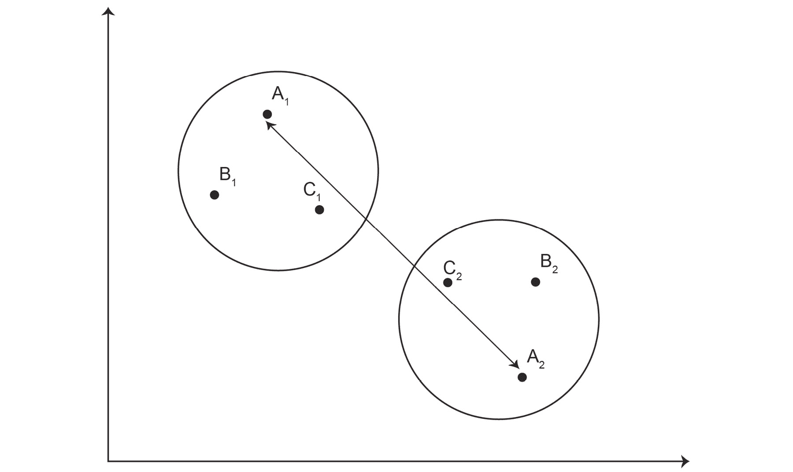

# *第二章*

# 高级聚类方法

## 学习目标

到本章结束时，您将能够：

+   执行 k-modes 聚类

+   实现 DBSCAN 聚类

+   执行层次聚类并在树状图中记录聚类

+   执行分裂和聚合聚类

在本章中，我们将探讨一些高级聚类方法以及如何在树状图中记录聚类。

## 简介

到目前为止，我们已经学习了无监督学习的一些最基本算法：k-means 聚类和 k-medoids 聚类。这些算法不仅对实际应用很重要，而且对于理解聚类本身也很重要。

在本章中，我们将研究一些其他高级聚类算法。我们不称它们为高级是因为它们难以理解，而是因为在使用它们之前，数据科学家应该了解为什么他们选择这些算法而不是我们在上一章中研究的一般聚类算法。k-means 是一种通用聚类算法，对于大多数情况都足够用，但在某些特殊情况下，根据数据类型，高级聚类算法可以产生更好的结果。

## k-modes 聚类的简介

我们迄今为止研究过的所有聚类类型都是基于距离度量的。但如果我们得到一个数据集，其中无法以传统方式测量变量之间的距离，例如分类变量的情况，怎么办？在这种情况下，我们使用 k-modes 聚类。

k-modes 聚类是 k-means 聚类的扩展，处理的是众数而不是均值。k-modes 聚类的主要应用之一是分析调查结果等分类数据。

### k-Modes 聚类的步骤

在统计学中，众数定义为最频繁出现的值。因此，对于 k-modes 聚类，我们将计算分类值的众数来选择中心。因此，执行 k-modes 聚类的步骤如下：

1.  选择任意 k 个随机点作为聚类中心。

1.  计算每个点到中心的汉明距离（在第一章，聚类方法简介中讨论）。

1.  根据汉明距离将每个点分配到最近的中心所在的聚类。

1.  通过找到该聚类中所有数据点的众数来在每个聚类中选择新的聚类中心。

1.  从 *步骤 2* 重复此操作，直到聚类中心不再变化。

您可能已经注意到，这些步骤与 k-means 聚类的步骤非常相似。这里只是改变了距离度量的类型。所以，如果您理解了 k-means 聚类，那么理解 k-modes 聚类也会很容易。

### 练习 10：实现 k-modes 聚类

#### 注意

对于所有需要导入外部 CSV 或图像的练习和活动，请转到 **RStudio**-> **会话**-> **设置工作目录**-> **到源文件位置**。您可以在控制台中看到路径已自动设置。

此练习的数据可以从这里下载：[`github.com/TrainingByPackt/Applied-Unsupervised-Learning-with-R/tree/master/Lesson02/Exercise10/breast_cancer.csv`](https://github.com/TrainingByPackt/Applied-Unsupervised-Learning-with-R/tree/master/Lesson02/Exercise10/breast_cancer.csv)。这是一个包含九个变量的分类数据集，其中一些是分类的，一些是名义的，描述了不同的乳腺癌病例。在将数据保存到名为`breast_cancer.csv`的文件中后，我们将执行以下操作：

#### 注意

此数据集来自 UCI 机器学习仓库。您可以在[`archive.ics.uci.edu/ml/machine-learning-databases/breast-cancer/breast-cancer.data`](https://archive.ics.uci.edu/ml/machine-learning-databases/breast-cancer/breast-cancer.data)找到数据集。这个乳腺癌领域的数据来自南斯拉夫卢布尔雅那大学医学院，肿瘤研究所。感谢 M. Zwitter 和 M. Soklic 提供数据。我们已经下载了文件，并将其保存在[`github.com/TrainingByPackt/Applied-Unsupervised-Learning-with-R/tree/master/Lesson02/Exercise10/breast_cancer.csv`](https://github.com/TrainingByPackt/Applied-Unsupervised-Learning-with-R/tree/master/Lesson02/Exercise10/breast_cancer.csv)。

1.  读取数据集并将其存储到一个变量中：

    ```py
    bc_data<-read.csv('breast_cancer.csv',header = FALSE)
    ```

1.  将从第二列到最后一列的所有列存储到一个新变量中：

    ```py
    k_bc_data<-bc_data[,2:10]
    ```

1.  查看变量`k_bc_data`的前六行：

    ```py
    head(k_bc_data)
    ```

    输出包含六个行，其中包含描述患者、症状和治疗的各个属性值：

    ```py
       V2      V3    V4   V5  V6 V7   V8      V9     V10
    1 30-39 premeno 30-34 0-2 no  3  left  left_low  no
    2 40-49 premeno 20-24 0-2 no  2 right  right_up  no
    3 40-49 premeno 20-24 0-2 no  2  left  left_low  no
    4 60-69    ge40 15-19 0-2 no  2 right   left_up  no
    5 40-49 premeno   0-4 0-2 no  2 right right_low  no
    6 60-69    ge40 15-19 0-2 no  2  left  left_low  no
    ```

1.  导入`klaR`库，它包含`kmodes`函数。`klaR`是一个 R 库，用于分类和可视化：

    ```py
    install.packages("klaR")
    library(klaR)
    ```

1.  预测并存储最终的集群中心到一个变量中。在这一步，我们输入数据集和集群数量（即`k`和找到集群数量的最大迭代次数）：

    ```py
    k.centers<-kmodes(k_bc_data,2,iter.max = 100)
    ```

1.  查看集群中心：

    ```py
    k.centers
    ```

    输出如下：


###### 图 2.1：集群中心的截图

聚类算法将所有乳腺癌病例分为两个集群，每个集群包含彼此相似的病例。在输出中，有两个主要部分：集群模式和聚类向量。集群模式部分告诉我们集群 1 和集群 2 的中心或坐标。下面，聚类向量包含索引序列中每个数据点的集群编号。

#### 注意

由于中心的随机起始位置，每次运行算法都可能得到不同的结果。

由于这是一个多维分类数据集，除了将数据打印到 R 控制台之外，没有简单的方法来可视化结果。

### 活动 5：在蘑菇数据集上实现 k-modes 聚类

#### 注意

此数据集来自 UCI 机器学习仓库。您可以在 [`archive.ics.uci.edu/ml/datasets/Mushroom`](https://archive.ics.uci.edu/ml/datasets/Mushroom) 找到数据集。我们已经下载了文件，清理了数据，并将其保存在 [`github.com/TrainingByPackt/Applied-Unsupervised-Learning-with-R/tree/master/Lesson02/Activity05`](https://github.com/TrainingByPackt/Applied-Unsupervised-Learning-with-R/tree/master/Lesson02/Activity05)。

在本活动中，我们将对蘑菇数据集执行 k-modes 聚类。此数据集列出了 23 种不同蘑菇的属性。每种蘑菇被分类为可食用（e）或有毒（p）。我们将看到无监督学习如何通过将数据分组到两个簇中来对有毒和可食用蘑菇进行分类。以下步骤将帮助您完成活动：

1.  从 [`github.com/TrainingByPackt/Applied-Unsupervised-Learning-with-R/tree/master/Lesson02/Activity05`](https://github.com/TrainingByPackt/Applied-Unsupervised-Learning-with-R/tree/master/Lesson02/Activity05) 下载 `mushrooms.csv`。

1.  将 `mushrooms.csv` 文件读入一个变量中。

1.  导入 `klaR` 库。

1.  根据 k-modes 聚类计算簇。

1.  通过形成数据标签与分配的簇之间的矩阵来检查聚类的结果。

    #### 注意

    本活动的解决方案可以在第 212 页找到。

输出将是一个真实标签和簇标签的表格，如下所示：

```py
       1    2
  e   80 4128
  p 3052  864
```

## 密度聚类（DBSCAN）简介

**基于密度的聚类**或 DBSCAN 是聚类中最直观的形式之一。使用这种类型的聚类很容易找到数据中的自然簇和异常值。此外，它不需要你定义簇的数量。例如，考虑以下图示：


###### 图 2.2：一个示例散点图

此数据集中有四个自然簇和一些异常值。因此，DBSCAN 将分离簇和异常值，如图所示，而无需您指定数据集中要识别的簇的数量：


###### 图 2.3：由 DBSCAN 分类出的簇和异常值

因此，DBSCAN 可以在散点图中找到由低密度区域分隔的高密度区域。

### DBSCAN 步骤

如前所述，DBSCAN 不需要您选择簇的数量，但您必须选择其他两个参数来执行 DBSCAN。第一个参数通常用 ε（epsilon）表示，表示同一簇中两点之间的最大距离。另一个参数是簇中的最小点数，通常用 `minPts` 表示。现在我们将逐步查看 DBSCAN 聚类算法：

1.  在数据集中选择任何点，`R`。

1.  在距离点 `R` 的 epsilon 范围内找到所有点。

1.  如果从点`R`出发，距离 epsilon 内的点的总数大于`minPts`，那么它是一个簇，`R`是核心点。

1.  如果从点 p 出发，距离 epsilon 内的点的总数小于`minPts`，那么距离 epsilon 内的所有点将被归类为噪声。然后，我们选择一个新的点，`R`，它既没有被归类为噪声，也没有被归类为簇的一部分，从步骤 2 重新开始这个过程。

1.  对簇中的其他点重复此过程，以找到距离 epsilon 内不在簇中的点。这些新点也将被归类到同一个簇中。

1.  当对簇中的所有点执行了这些步骤后，通过选择一个新的随机点，`R`，它既没有被归类到簇中，也没有被归类为噪声，重复相同的过程。

因此，为了说明前面的算法，让我们以 epsilon 为**x**和簇中的最小点数为 4 为例。看看下面的图：


###### 图 2.4：只有 2 个点位于点 R1 的 x 距离内

只有三个点位于点**R1**的**x**距离范围内，而我们对于**x**半径内最小点数的阈值是四个。因此，这四个点将被归类为异常值或噪声。但如果再有一个点，**R5**，位于**R1**和**R4**之间，所有这四个点将属于一个簇，如下面的图所示：


###### 图 2.5：这四个点都属于一个簇

在前面的图中，点**R1**和**R5**是核心点，因为它们各自有四个点在**x**距离内。而点**R4**、**R2**和**R3**不是核心点，如下面的图所示：


###### 图 2.6：核心点与非核心点

任何位于这些圆圈之外的点将被归类为噪声点，如下面的图中的**R6**所示：


###### 图 2.7：噪声点 R6

### 练习 11：实现 DBSCAN

在这个练习中，我们将查看使用 Iris 数据集实现 DBSCAN 的过程。为了执行 DBSCAN，我们将执行以下步骤：

1.  将 Iris 数据集的前两列存储在`iris_data`中：

    ```py
    iris_data<-iris[,1:2]
    ```

1.  导入`dbscan`库，它包含各种 DBSCAN 算法的实现：

    ```py
    install.packages("dbscan") 
    library(dbscan)
    ```

1.  计算并存储簇在`clus`变量中。在这个步骤中，你还需要选择 epsilon 和`minPts`的值：

    ```py
    clus<-dbscan(iris_data,eps=.3,minPts = 5)
    ```

    #### 注意

    你可以尝试调整 epsilon 的值。为了得到期望的输出，我们将其设置为 0.3。

1.  导入`factoextra`库以可视化簇：

    ```py
    install.packages("factoextra") #use it only the first time if library is not installed already
    library(factoextra)
    ```

1.  绘制簇中心。您需要将存储 DBSCAN 结果的变量作为`plot`函数的第一个参数输入。作为第二个参数，您需要输入一个数据集。在我们的例子中，它是`iris_data`。函数中的`geom`变量用于定义图形的几何形状。我们只会使用`point`。现在，`ggtheme`用于选择图形的主题。`palette`用于选择点的几何形状。将`ellipse`值设置为 false，这样函数就不会绘制簇的轮廓。

    ```py
    fviz_cluster(clus,data=iris_data,geom = "point",palette="set2",ggtheme=theme_minimal(),ellipse=FALSE)
    ```

    这是输出结果：


###### 图 2.8：不同颜色的 DBSCAN 簇

在图 2.8 中，有三个簇，分别是橙色、蓝色和绿色。黑色点是噪声或异常值。这里的橙色点属于一个物种，而绿色点属于两个不同的物种。

#### 注意

您可以快速比较这张散点图与*第一章*，*聚类方法简介*中的图 1.18。

DBSCAN 与我们迄今为止研究过的所有聚类方法都不同，并且在科学文献中是最常见和最常引用的聚类方法之一。DBSCAN 相对于其他聚类方法有几个优点：

+   您最初不需要选择簇的数量。

+   它每次运行时不会产生不同的结果，这与 k-means 或其他“k 型”聚类方法不同，其中起始点可能会影响最终结果。因此，结果是可重复的。

+   它可以在数据中发现任何形状的簇。

但 DBSCAN 也有一些缺点：

+   确定正确的参数集，即 epsilon 和`minPts`，对于数据的适当聚类来说很难确定。

+   DBSCAN 无法根据密度区分簇。如果一个数据集的密度变化很大，它可能表现不佳。

### DBSCAN 的应用

作为最常引用的聚类方法之一，DBSCAN 有许多实际应用。DBSCAN 聚类的一些实际应用包括以下内容：

+   DBSCAN 可以在城市规划中以多种方式使用。例如，给定关于犯罪事件位置的数据，DBSCAN 可以用来识别城市中的犯罪多发区。这些数据可以用来规划警察力量的部署，甚至调查潜在的帮派活动。

+   DBSCAN 可以用来在板球和篮球等游戏中制定策略。给定板球场地上的投球数据，您可以识别击球手和投球手的优缺点。或者如果我们有关于击球手击球的数据，从 DBSCAN 中获得的数据可以用来相应地调整防守。

+   在自然灾害或病毒疾病的传播期间，可以使用 DBSCAN 识别受影响严重的地区。

### 活动 6：实现 DBSCAN 并可视化结果

在这个活动中，我们将执行 DBSCAN 并与 k-means 聚类进行比较。为此，我们将使用包含表示不同形状的模拟数据的`multishapes`数据集。

这些步骤将帮助您完成活动：

1.  在`factoextra`库中生成并存储`multishapes`数据集。

1.  绘制`multishapes`数据集的前两列。

1.  在数据集上执行 k-means 聚类并可视化。

1.  在数据集上执行 DBSCAN 并可视化数据，以比较与 k-means 聚类的结果。

    #### 注意

    这个活动的解决方案可以在第 213 页找到。

DBSCAN 聚类的绘图将如下所示：


###### 图 2.9：多形状数据集上 DBCAN 的预期绘图

在这里，所有黑色的点都是异常值，并且没有被归类到任何聚类中，而 DBSCAN 中形成的聚类无法用其他任何类型的聚类方法获得。这些聚类具有多种形状和大小，而 k-means 中所有聚类都是近似球形的。

### 层次聚类简介

我们将要研究的最后一种聚类类型是层次聚类。层次被定义为“一个将人或事物放置在一系列不同重要性或地位的层级系统。”层次聚类是按顺序合并聚类。这个合并聚类的序列被称为层次。我们可以通过一个名为**树状图**的层次聚类算法的输出更清楚地看到这一点。

层次聚类有两种类型：

+   聚类

+   分裂

由于两种类型的层次聚类都很相似，因此一起研究它们是有意义的。

聚类是层次聚类的自下而上的方法。在这个方法中，每个数据点最初被假定为单个聚类。从那里开始，我们根据相似度或距离度量开始合并最相似的聚类，直到所有数据点合并成一个单一的聚类。

在分裂聚类中，我们做的是完全相反的事情。它是层次聚类的自上而下方法。在这个方法中，所有数据点最初被假定为在一个单一的聚类中。从那里开始，我们开始将聚类分割成多个聚类，直到每个数据点都是一个单独的聚类。两种聚类类型之间的差异和相似性将在后续章节中变得清晰。但首先，我们应该尝试理解为什么我们需要这种其他类型的聚类以及它所服务的特殊目的，这是其他类型的聚类所不具备的。层次聚类主要用于以下原因：

+   就像 DBSCAN 一样，我们最初不需要选择聚类的数量。

+   层次聚类的最终输出，树状图，可以帮助我们以可视化的方式理解聚类结果，这意味着我们不需要重新运行算法来查看结果中不同数量的簇。

+   与 k-means 不同，层次聚类可以使用任何类型的距离度量。

+   它可以找到复杂形状的簇，与像 k-means 这样的其他聚类算法不同，后者只能找到近似球形的簇。

所有这些先前因素的结合使层次聚类成为无监督学习中的一个重要聚类方法。

### 相似性度量的类型

如前所述，层次聚类是一种自下而上的层次聚类方法。我们根据相似性度量逐个合并最相似的簇。这个相似性度量可以从几种不同类型中选择：

+   **单链**：在单链相似度中，我们测量两个簇中两个最相似点之间的距离或相似度：


###### 图 2.10：单链度量的演示

+   **完全连接**：在这种度量中，我们测量簇中两个最远点之间的距离或相似度：



###### 图 2.11：完全连接度量的演示

+   **组平均**：在这个度量中，我们测量一个簇中所有成员与第二个簇中任何成员之间的平均距离：


###### 图 2.12：组平均度量的演示

#### 注意

在这些相似性度量中，不测量同一簇成员之间的距离。

+   **质心相似度**：在这种相似度中，两个簇之间的相似度定义为两个簇质心之间的相似度：


###### 图 2.13：质心相似度的演示

### 执行层次聚类的方法步骤

通过了解这些相似性度量，我们现在可以理解执行层次聚类算法的方法：

1.  将每个点初始化为一个单独的簇。

1.  计算每对簇之间的相似性度量。相似性度量可以是之前提到的四种度量中的任何一种。

1.  根据第 2 步中选择的相似性度量，合并两个最相似的簇。

1.  从第 2 步开始重复这个过程，直到只剩下一个簇为止。

整个过程将产生一个称为树状图的图。这个图记录了每个步骤形成的簇。一个简单的、元素非常少的树状图看起来如下：


###### 图 2.14：一个示例树状图

在前面的树状图中，假设点 A 和点 B 是我们在使用的相似性度量中所有点上最接近的两个点。它们的接近度被用来确定连接线的长度，在点 **A** 和点 **B** 的情况下，这个长度是 **L1**。因此，点 **A** 和点 **B** 首先被聚类。之后，在 **L2**，点 **D** 和点 **E** 被聚类，然后，在 **L3**，点 **A**、**B** 和 **C** 被聚类。此时，我们有两个集群在 **L4** 处连接形成一个集群。

现在，为了从这个树状图中得到集群，我们进行水平切割。例如，如果我们将在 L4 和 L3 之间进行切割，我们将得到两个集群：

+   集群 1 – A、B 和 C

+   集群 2 – D 和 E

集群将看起来如下：


###### 图 2.15：树状图中表示的集群

同样地，如果我们将在树状图中的 L3 和 L2 之间进行水平切割，我们将得到三个集群：

+   集群 1 – A 和 B

+   集群 2 – C

+   集群 3 – D 和 E

集群将看起来如下：


###### 图 2.16：树状图中集群的表示

因此，为了得到不同数量的集群，我们不需要重新运行整个过程。使用这种方法，我们可以得到数据中可能出现的任何数量的集群，而无需再次执行整个过程。

### 练习 12：使用不同相似性度量的聚合聚类

在这个练习中，我们将使用不同的相似性度量进行聚合层次聚类，并比较结果：

1.  让我们将 `iris_flowers` 数据集的最后三列，即花瓣长度、花瓣宽度和物种，输入到 `iris_data` 变量中，如下所示：

    ```py
    iris_data<-iris[,3:5]
    install.packages('cluster')
    library(cluster)
    ```

1.  在这一步，我们使用 `hclust` 函数来获取层次聚类。在 `hclust` 函数中，我们需要输入所有点之间的成对距离，这可以通过 `dist()` 函数实现。第二个参数 `method` 用于定义层次聚类的相似性度量：

    ```py
    h.clus<-hclust(dist(iris_data),method="complete")
    ```

1.  现在，让我们将层次聚类的结果绘制成树状图，如下所示：

    ```py
    plot(h.clus)
    ```

    输出如下：

    

    ###### 图 2.17：由完整相似性度量得到的树状图

1.  要从前面的树状图中选择多个集群，我们可以使用一个名为 `cutree` 的 R 函数。我们将 `hclust` 的结果以及集群数量输入到这个函数中：

    ```py
    clusterCut <- cutree(h.clus, 3)
    table(clusterCut, iris_data$Species)
    ```

    输出表格如下：

    ![img/C12628_02_18.jpg]

    ###### 图 2.18：显示集群分布的表格

    使用这种聚类方法，setosa 和 virginica 物种被准确分类。

1.  使用 `single` 作为相似性度量，如下所示：

    ```py
    h.clus<-hclust(dist(iris_data),method = "single")
    plot(h.clus)
    ```

    输出如下：

    

    ###### 图 2.19：基于单相似度指标生成的树状图

    注意这个树状图与使用`完全`相似度指标创建的树状图的不同之处。

1.  将此数据集划分为三个簇：

    ```py
    clusterCut <- cutree(h.clus, 3)
    table(clusterCut, iris_data$Species)
    ```

    输出如下：

    

    ###### 图 2.20：显示簇分布的表格

    在这里，我们的聚类方法成功地将一个类别从其他两个类别中分离出来。

1.  现在让我们使用`平均`相似度指标执行层次聚类：

    ```py
    h.clus<-hclust(dist(iris_data),method = "average")
    plot(h.clus)
    ```

    输出如下：

    

    ###### 图 2.21：基于平均相似度指标生成的树状图

1.  让我们将前面的树状图再次划分为三个簇，并查看结果：

    ```py
    clusterCut <- cutree(h.clus, 3)
    table(clusterCut, iris_data$Species)
    ```

    输出如下：

    

    ###### 图 2.22：显示簇分布的表格

    在这里，使用`平均`相似度指标，我们得到了几乎完全正确的分类结果。

1.  现在，让我们尝试使用最后一个相似度指标，`质心`，创建一个树状图：

    ```py
    h.clus<-hclust(dist(iris_data),method = "centroid")
    plot(h.clus)
    ```

    输出如下：

    

    ###### 图 2.23：基于质心相似度指标生成的树状图

1.  现在，让我们将前面的树状图划分为三个簇，并查看结果：

    ```py
    clusterCut <- cutree(h.clus, 3)
    table(clusterCut, iris_data$Species)
    ```

    输出如下：


###### 图 2.24：显示簇分布的表格

虽然基于`平均`和`质心`相似度指标的簇的树状图看起来不同，但当我们把树状图切割成三个簇时，每个簇中的元素数量是相同的。

### 划分聚类

划分聚类与聚合聚类相反。在聚合聚类中，我们以每个点作为其自己的簇开始，而在划分聚类中，我们以整个数据集作为一个簇开始，然后开始将其划分为更多的簇：


###### 图 2.25：聚合聚类和划分聚类的表示

因此，划分聚类过程可以总结如下一个图示：


###### 图 2.26：划分聚类过程的表示

### 执行划分聚类的步骤

从步骤 1 到步骤 6，划分聚类过程不断将点划分为更小的簇，直到每个点都是一个单独的簇。图 2.26 显示了划分聚类过程的前 6 步，但要正确运行完整过程，我们需要执行与数据集中点数相同数量的步骤。

因此，对于划分聚类，我们将使用 DIANA 算法——DIANA 代表划分分析。为此，我们需要执行以下步骤：

1.  从数据集中所有点都在一个单独的簇中开始。

1.  根据您喜欢的任何距离度量，从数据集中所有可能的簇中选择两个最不相似的簇。

1.  重复步骤 2，直到数据集中的所有点都各自聚类。

我们将使用 R 中的 `cluster` 库来执行 DIANA 聚类。

### 练习 13：执行 DIANA 聚类

在这个练习中，我们将执行 DIANA 聚类：

1.  将花瓣长度、花瓣宽度和物种名称放入 `iris_data` 变量中：

    ```py
    iris_data<-iris[,3:5]
    ```

1.  导入 `cluster` 库：

    ```py
    install.packages("cluster")
    library("cluster")
    ```

1.  将 `iris_data` 数据集和用于度量差异度的度量传递给 `diana()` 函数：

    ```py
    h.clus<-diana(iris_data, metric="euclidean")
    ```

1.  使用 `pltree()` 函数绘制树状图。要绘制树状图，需要将 `diana()` 函数的结果和图表标题传递给 `pltree()` 函数：

    ```py
    pltree(h.clus, cex = 0.6, main = "Dendrogram of divisive clustering")
    ```

    划分聚类的树状图如下所示：

    

    ###### 图 2.27：划分聚类的树状图

1.  如果我们将前面的树状图划分为三个簇，我们会看到这种聚类方法也能够独立地识别不同的花卉种类：

    ```py
    clusterCut <- cutree(h.clus, 3)
    table(clusterCut, iris_data$Species)
    ```

    输出如下：

    ```py
    clusterCut setosa versicolor virginica
             1     50          1         0
             2      0         49         0
             3      0          0        50
    ```

在前面的输出中，只有一朵花被错误地分类到另一个类别。这是我们在本书中遇到的所有聚类算法在不知道任何关于花卉信息的情况下对花卉物种进行分类的最佳性能。

### 活动 7：对种子数据集执行层次聚类分析

在这个活动中，我们将对种子数据集执行层次聚类分析。我们将看到当对三种种子进行分类时，聚类的结果是什么。

#### 注意

此数据集来自 UCI 机器学习仓库。您可以在 [`archive.ics.uci.edu/ml/machine-learning-databases/00236/`](http://archive.ics.uci.edu/ml/machine-learning-databases/00236/) 找到数据集。我们已经下载了文件，清理了它，并将其保存在 [`github.com/TrainingByPackt/Applied-Unsupervised-Learning-with-R/tree/master/Lesson02/Activity07/seeds_data.txt`](https://github.com/TrainingByPackt/Applied-Unsupervised-Learning-with-R/tree/master/Lesson02/Activity07/seeds_data.txt)。

这些步骤将帮助您完成活动：

1.  从 [`github.com/TrainingByPackt/Applied-Unsupervised-Learning-with-R/tree/master/Lesson02/Activity07/seeds_data.txt`](https://github.com/TrainingByPackt/Applied-Unsupervised-Learning-with-R/tree/master/Lesson02/Activity07/seeds_data.txt) 下载种子数据集。

1.  对数据集执行层次聚类并绘制树状图。

1.  在 `k=3` 处进行切割，并通过创建一个包含原始标签的表格来检查聚类的结果。

1.  对数据集进行划分聚类并绘制树状图。

1.  在`k=3`处进行切割，并通过形成一个带有原始标签的表格来检查聚类的结果。

    #### 注意

    本活动的解决方案可以在第 215 页找到。

本活动的输出将是一个表格，显示聚类结果在分类三种类型种子方面的表现。它将如下所示：


###### 图 2.28：预期表格，用于分类三种类型的种子

## 摘要

恭喜您完成了关于聚类技术的第二章！至此，我们已经涵盖了所有主要的聚类技术，包括 k-modes、DBSCAN 以及两种类型的层次聚类，我们还探讨了它们之间的联系。我们可以将这些技术应用到我们可能遇到的任何类型的数据集中。这些新方法有时在第一章中使用的数据集上也产生了更好的结果。在下一章中，我们将研究概率分布及其在探索性数据分析中的应用。
