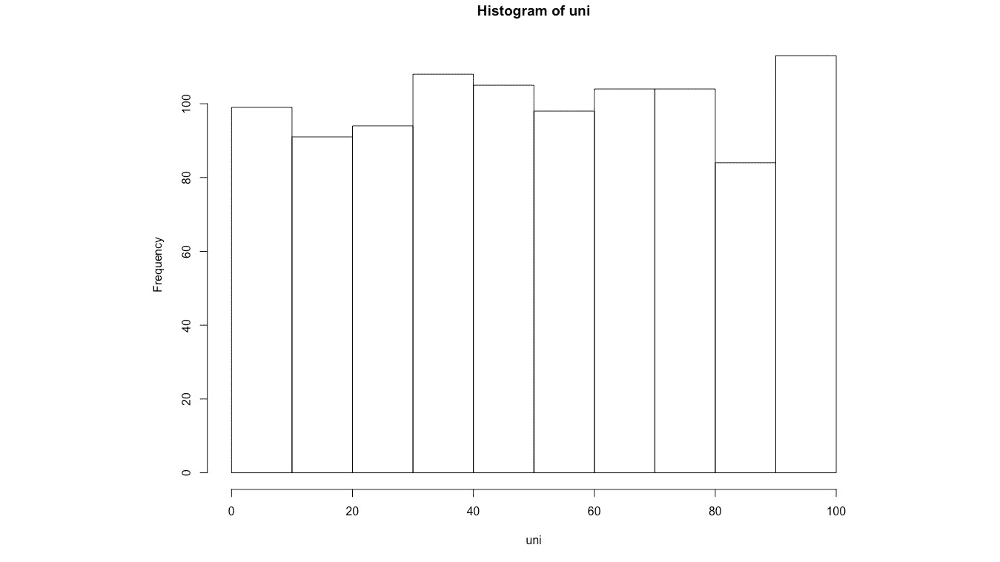
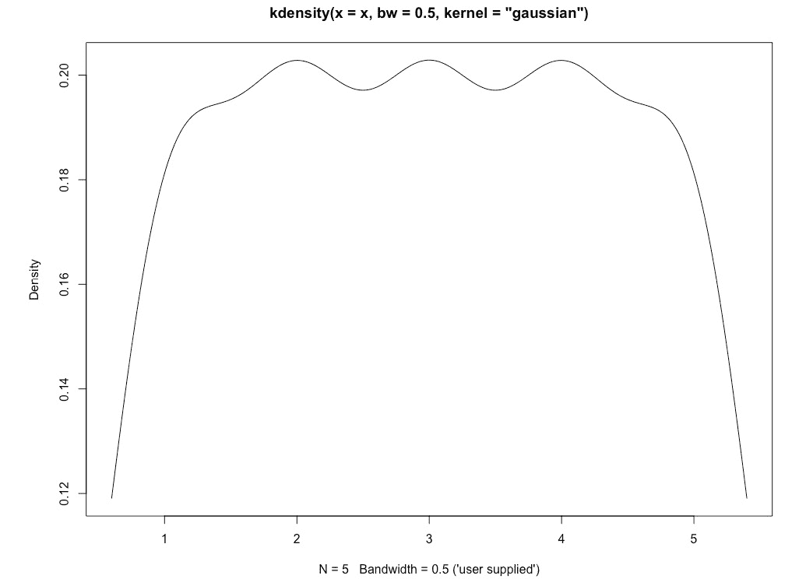

# 第四章：*第三章*

# 概率分布

## 学习目标

到本章结束时，你将能够：

+   在 R 中生成不同的分布

+   在 R 中估计新数据集的概率分布函数

+   比较同一分布的两个不同样本或不同分布的接近程度

在本章中，我们将学习如何使用概率分布作为无监督学习的一种形式。

## 简介

在本章中，我们将研究无监督学习的另一个方面，称为**概率分布**。概率分布是许多数学教科书和课程中涵盖的经典统计学的一部分。随着大数据的出现，我们已经开始在探索性数据分析和其他建模应用中使用概率分布。因此，在本章中，我们将研究如何在无监督学习中使用概率分布。

## 概率分布的基本术语

统计学中有两种方法家族：参数方法和非参数方法。非参数方法旨在处理可能具有任何形状的数据。相比之下，参数方法对数据可能采取的特定形状做出假设。这些假设通常编码为参数。以下是你应该注意的两个主要参数：

+   **均值**：这是分布中所有值的平均值。

+   **标准差**：这是衡量分布均值周围值分布的度量。

统计学中的大多数参数方法以某种方式依赖于这两个参数。在本章中我们将研究的参数分布是这些：

+   均匀分布

+   正态分布

+   对数正态分布。

+   二项分布

+   泊松分布

+   帕累托分布

### 均匀分布

在均匀分布中，一个区间内的所有值，比如说 [a,b]，都是等可能的。数学上，它被定义为如下：


###### 图 3.1：均匀分布的数学公式

它可以如下绘制在图上：


###### 图 3.2：均匀分布图

均匀分布是参数分布中最简单的。现实世界中许多过程遵循均匀抽样：

+   如果在一个非常大的区域内下雨，雨滴落下的分布可以假设在较小区域内是均匀的。

+   社会保障号码的最后一位应该对任何人群子集，例如加利福尼亚州所有初创公司首席执行官，都遵循均匀分布。

+   均匀随机抽样对于生成实验数据和进行控制试验非常重要。

### 练习 14：在 R 中生成和绘制均匀样本

在这个练习中，我们将生成均匀样本并绘制它们。为此，执行以下步骤：

1.  使用内置的`runif` R 函数生成均匀样本。首先，输入你想要生成的样本数量。这里我们生成 1,000 个样本。然后，输入`min`值和`max`值：

    ```py
    uni<-runif(1000, min=0, max=100)
    ```

1.  在将生成的随机数存储在`uni`变量之后，我们将绘制它们的值与它们的索引的关系：

    ```py
    plot(uni)
    ```

    输出如下：

    

    ###### 图 3.3：均匀分布

    如您所见，点几乎均匀地散布在各个地方。我们也可以绘制这个直方图，以获得分布的更清晰图像。

1.  我们将使用 R 的`hist()`函数绘制生成的样本的直方图：

    ```py
    hist(uni)
    ```

    输出如下：



###### 图 3.4：分布的直方图

如您所见，它并不完全平坦，正如我们之前所设想的那样。它或多或少是均匀的，但并不完全均匀，因为它是由随机生成的。每次我们生成一个新的样本，它都会类似于这个直方图，而且很可能会不完全平坦，因为所有随机抽样方法都会伴随噪声。

### 正态分布

正态分布是一种受两个参数控制的参数分布：均值和均值的方差。它关于均值对称，大多数值都接近均值。其曲线也被称为钟形曲线：


###### 图 3.5：正态分布数据的典型近似表示

正态分布由以下方程定义：


###### 图 3.6：正态分布的方程

这里，是均值，是标准差。

正态分布是现实世界中非常常见的一种分布。以下是一些正态分布的例子：

+   篮球运动员的身高大约呈正态分布。

+   一个班级学生的分数可能有一个非常接近正态分布的分布。

+   尼罗河的年流量是正态分布的。

现在，我们将使用 R 生成并绘制一个正态分布。

### 练习 15：在 R 中生成和绘制正态分布

在这个练习中，我们将生成一个正态分布来模拟 1,000 名学生的（满分 100 分）考试成绩，并将它们绘制出来。为此，请执行以下步骤：

1.  通过在 R 的`rnorm`函数中输入样本数量、均值和标准差来生成正态分布：

    ```py
    nor<-rnorm(1000,mean=50, sd= 15)
    ```

1.  将生成的数字与它们的索引进行对比：

    ```py
    plot(nor)
    ```

    输出如下：

    

    ###### 图 3.7：正态分布

    如您所见，大多数值都围绕着 50 的平均值，当我们远离 50 时，点的数量开始减少。这个分布将在下一步通过直方图来阐明。

1.  使用`hist()`函数绘制正态分布的直方图：

    ```py
    hist(nor)
    ```

    输出如下：


###### 图 3.8：正态分布直方图

您可以看到这个形状非常类似于正态分布的钟形曲线。

### 偏度和峰度

正如我们所见，您在实践中所看到的许多分布都被假定为正态分布。但并非每个分布都是正态分布。为了衡量一个分布偏离标准正态分布的程度，我们使用两个参数：

+   偏度

+   峰度

分布的**偏度**是衡量其相对于标准正态分布的不对称程度的指标。在具有高偏度的数据集中，均值和众数将彼此不同。偏度有两种类型：正偏度和负偏度：


###### 图 3.9：负偏度和正偏度

负偏度是指平均值左侧存在长尾值，而正偏度是指平均值右侧存在长尾值。偏度也可以用以下公式表示：


###### 图 3.10：偏度的数学公式

这里，是的期望值或平均值，其中和分别是分布的均值和标准差。

**峰度**是衡量分布尾部的胖瘦程度与正态分布相比的指标。与偏度不同，峰度不会在分布中引入不对称性。这里提供了一个说明：


###### 图 3.11：峰度演示

峰度也可以用以下公式表示：


###### 图 3.12：峰度的数学公式

这里，是的期望值或平均值，其中和分别是分布的均值和标准差。标准正态分布的偏度为 0，峰度测量值为 3。因为正态分布非常常见，所以我们有时只测量超峰度，如下所示：

```py
Kexcess = K - 3
```

因此，正态分布的超峰度为 0。

### 对数正态分布

对数正态分布是值的对数呈正态分布的分布。如果我们在对数尺度上展示对数正态分布，它与正态分布完全相同，但如果我们在标准分布尺度上展示它，它将具有非常高的正偏斜：


###### 图 3.13：对数正态分布

为了说明对数正态分布是按对数尺度分布的正态分布，我们将进行一个练习。

对数正态分布在金融风险管理领域用于模拟股价。由于假设增长因子是正态分布的，股价可以按对数正态分布建模。这种分布也用于与期权定价相关的计算，包括风险价值（VaR）。

### 练习 16：从正态分布生成对数正态分布

在这个练习中，我们将从正态分布生成对数正态分布。为此，执行以下步骤：

1.  生成正态分布并将值存储在一个变量中：

    ```py
    nor<-rnorm(1000,mean=5, sd= 1)
    ```

1.  绘制具有 100 个不同区间的正态分布直方图：

    ```py
    hist(nor,breaks = 100)
    ```

    输出如下：

    

    ###### 图 3.14：均值为 5，标准差为 1 的正态分布

1.  创建一个将存储 1,000 个值的对数正态分布向量：

    ```py
    lnor <- vector("list", 1000)
    ```

1.  将指数值输入到`lnor`向量中。指数函数是对数函数的逆函数：

    ```py
    for (x in 1:1000){
      lnor[x]=exp(nor[x])
    }
    ```

1.  绘制`lnor`的直方图：

    ```py
    hist(as.integer(lnor), breaks = 200)
    ```

    输出如下：


###### 图 3.15：对数正态分布

注意前一个图看起来像对数正态分布图，并且这个图是从正态分布生成的。如果我们对前一个图中的值取对数后绘制新的图形，那么它将再次是正态分布。

### 二项分布

二项分布是一种离散分布，与连续的正态分布或均匀分布不同。二项分布用于模拟每个事件有两种可能性的多个事件同时发生的概率。一个二项分布可以应用的例子是在同时掷三个硬币时，找出所有三个硬币都出现正面的概率。

二项分布的均值和方差分别是 n*p 和 n*p(1-p)，其中 p 是成功的概率，n 是试验次数。当 p=0.5 时，二项分布是对称的。当 p 小于 0.5 时，它更偏向右侧，当 p 大于 0.5 时，它更偏向左侧。

二项分布的公式如下：

```py
P(x) = n!/((n-x)!x!)*(p^x)*((1-p)^x)
```

在这里，n 是总试验次数，x 是焦点试验次数，p 是成功的概率。

### 练习 17：生成二项分布

在这个练习中，我们将生成一个二项分布来模拟抛掷硬币 50 次时出现正面的次数。为此，执行以下步骤：

1.  要生成二项分布，我们首先需要一个由 50 个数字组成的序列作为索引，这将作为我们想要模拟的成功次数。这将是前一小节公式中的 x：

    ```py
    s <- seq(0,50,by = 1)
    ```

1.  现在我们将把`s`作为参数传递给 R 中的`dbinom()`函数，该函数将计算`s`变量中每个值的概率并将它们存储在新的`probs`变量中。首先，在函数中，我们输入将编码成功次数范围的序列。然后，我们输入序列的长度，然后输入成功的概率：

    ```py
    probs <- dbinom(s,50,0.5)
    ```

1.  在最后一步，我们将`s`和`probs`一起绘制：

    ```py
    plot(s,probs)
    ```

    输出如下：


###### 图 3.16：二项分布

在这里，x 轴显示我们感兴趣的正面数量，y 轴显示在 50 次试验中恰好得到该数量正面的概率。当我们抛掷硬币 50 次时，最可能的结果是我们将得到 25 个正面和 25 个反面，但得到所有 50 个正面或反面的概率非常低。这在前面的图表中解释得很好。

### 泊松分布

泊松分布是另一种离散分布，用于在特定时间段内根据该事件在该时间段内平均发生次数来模拟事件的发生。

它由以下方程式表示：


###### 图 3.17：泊松分布公式

在这里，lambda 是给定时间段的平均发生次数，**e**是欧拉常数，**x**是你想要找到概率的事件数量。根据到目前为止观察到的每分钟到达事件的新人数，泊松分布可以用来计算在下一分钟到达该事件的人数概率。

泊松分布图看起来是这样的：


###### 图 3.18：泊松分布图

在这里，我们可以看到**x**的不同值的概率与 lambda 有关。

### 帕累托分布

帕累托分布是一种基于指数的概率分布。这种分布是为了模拟在许多现实世界情况中观察到的 80:20 规则而发明的。遵循 80:20 规则的一些有趣的情况如下列所示：

+   大约 80%的世界财富掌握在 20%的人手中。

+   在商业管理中，发现对于大多数公司来说，80%的收入是由 20%的客户产生的。

+   据说 20%的司机造成了 80%的所有事故。

有许多其他现实世界的观察可以通过帕累托分布来建模。帕累托分布的数学公式如下：


###### 图 3.19：帕累托分布的数学公式

## 核密度估计简介

到目前为止，我们本章已经研究了参数分布，但在现实生活中，所有分布要么是参数分布的近似，要么根本不类似于任何参数分布。在这种情况下，我们使用一种称为**核密度估计**（**KDE**）的技术来估计它们的概率分布。

核密度估计（KDE）使用核来估计具有给定有限点的分布或随机变量的概率密度函数。在继续本章内容后，这对你来说会更加清晰。

### 核密度估计算法

尽管名字听起来很复杂，但核密度估计（KDE）是一个非常简单的两步过程：

1.  选择核

1.  将核放在数据点上并取核的总和

核是一个非负对称函数，用于建模分布。例如，在核密度估计（KDE）中，正态分布函数是最常用的核函数。核函数可以是不同类型的。它们与我们本章 earlier 研究的分布有很大关系。这里总结了其中一些类型：

+   在均匀核中，一个范围内的所有值都被赋予相同的权重。这表示如下：


###### 图 3.20：均匀核函数的表示

+   在三角形核中，随着值向范围中间移动，权重线性增加。这表示如下：


###### 图 3.21：三角形核函数的表示

+   在高斯核中，权重按正态分布。这表示如下：


###### 图 3.22：高斯核函数的表示

除了核之外，在第一步中，我们还需要选择另一个参数，称为核的带宽。带宽是影响核平滑度的参数。选择正确的带宽非常重要，甚至比选择正确的核更重要。这里我们将看一个例子。

### 练习 18：可视化和理解核密度估计

假设我们有一个包含五个不同点（1，2，3，4 和 5）的分布。让我们使用这个例子来可视化和理解核密度估计（KDE）：

1.  将五个点的向量存储在一个变量中：

    ```py
    x<- c(1,2,3,4,5)
    ```

1.  绘制点：

    ```py
    y<-c(0,0,0,0,0)
    plot(x,y)
    ```

    输出如下：

    

    ###### 图 3.23：五个点的图

1.  如果您还没有安装`kdensity`包，请安装它，并导入它：

    ```py
    install.packages("kdensity")
    library('kdensity')
    ```

1.  使用`kdensity()`函数计算核密度。输入分布`x`和带宽参数为`.35`。默认情况下核是高斯核：

    ```py
    dist <- kdensity(x, bw=.35)
    ```

1.  按以下方式绘制核密度估计图（KDE）：

    ```py
    plot(dist)
    ```

    输出如下：

    

    ###### 图 3.24：高斯核的绘制图

    这是核密度估计图的最终输出。在下一步中，假设每个点（1, 2, 3, 4, 和 5）都有一个以高斯核为中心的点，并将它们相加得到这个图。以下图将使它更清晰：

    #### 注意

    此图用于说明目的，而不是在 R 中生成。

    

    ###### 图 3.25：每个点上的高斯核绘制图

    如前图所示，每个点上都绘制了一个高斯核，然后所有核相加得到最终的曲线。

    现在，如果我们把带宽改为 0.5 而不是 0.35 会怎样呢？

1.  在`kdensity()`函数中将带宽改为 0.5，并再次绘制`kdensity`图：

    ```py
    dist <- kdensity(x, bw=.5)
    plot(dist)
    ```

    输出如下：



###### 图 3.26：带宽为 0.5 的高斯核绘制图

你可以看到核现在要平滑得多。以下使用了以下核：


###### 图 3.27：每个点上的高斯核绘制图

#### 注意

此图用于说明目的，而不是在 R 中生成。

这次，核的宽度要宽得多。

如果我们被给予足够多的点来进行估计，核的选择不会像带宽参数的选择那样显著改变最终核密度估计图的形状。因此，选择理想的带宽参数是一个重要的步骤。有许多技术被用来选择理想的带宽参数。研究这些技术超出了本书的范围，但 R 库可以自动选择理想的参数。我们将在下一个练习中学习这一点。

### 练习 19：研究改变核对分布的影响

在这个练习中，我们将生成两个具有不同标准差和均值的正态分布，并将它们合并以生成它们的合并核密度估计图：

1.  生成两个不同的正态分布并将它们存储在两个变量中：

    ```py
    y1 <- rnorm(100,mean = 0, sd = 1)
    y2<-rnorm(100, mean = 3, sd=.2)
    ```

1.  将生成的分布合并并绘制：

    ```py
    y3<-c(y1,y2)
    plot(y3)
    ```

    输出如下：

    

    ###### 图 3.28：合并分布的绘制图

    你可以看到有两个不同的分布，它们有不同的均值和分散度（标准差）。

1.  绘制`y3`的直方图以供参考：

    ```py
    hist(y3)
    ```

    输出如下：

    

    ###### 图 3.29：结果分布的直方图

1.  使用`gaussian`核生成并绘制`y3`的核密度估计图：

    ```py
    dist<-kdensity(y3,kernel = "gaussian")
    plot(dist)
    ```

    输出如下：

    

    ###### 图 3.30：高斯核密度图

    在前面的图中，我们使用了高斯核，带宽是由函数自动选择的。在这个分布中，我们有 200 个点，这应该足以生成一个稳健的 KDE 图，这样改变核类型不会在最终的 KDE 图中产生显著差异。在下一步，让我们尝试改变核并查看最终的图。

1.  使用`triangular`核生成并绘制 KDE：

    ```py
    dist<-kdensity(y3,kernel = "triangular")
    plot(dist)
    ```

    输出如下：


###### 图 3.31：具有三角形核的 KDE

使用不同核的两种图看起来几乎相同。因此，带宽的选择比核的选择更重要。在这个练习中，带宽是由 R 的`kdensity`库自动选择的。

### 活动 8：寻找与 Iris 数据集变量分布最接近的标准分布

在这个活动中，我们将找到与 Iris 数据集的 setosa 物种变量分布最接近的标准分布。以下步骤将帮助你完成活动：

1.  加载 Iris 数据集。

1.  选择仅对应 setosa 物种的行。

1.  绘制由`kdensity`函数生成的花瓣长度和花瓣宽度的分布图。

    #### 注意

    这个活动的解决方案可以在第 218 页找到。

这个活动的最终结果将是花瓣宽度 KDE 图，如下所示：


###### 图 3.32：预期花瓣宽度 KDE 图

## Kolmogorov-Smirnov 测试简介

现在我们已经学会了如何生成不接近标准分布的数据集的概率密度函数，我们将学习如何执行一些测试来区分这些非标准分布。

有时候，我们被给出多个观测数据样本，我们想知道这些样本是否属于同一分布。在标准分布的情况下，我们有多个测试，例如 Student's t-test 和 z-test，来确定这一点。对于非标准分布，或者当我们不知道分布类型时，我们使用 Kolmogorov-Smirnov 测试。为了理解 Kolmogorov-Smirnov 测试，你首先需要理解一些术语：

+   **累积分布函数（CDF）**：这是一个函数，其值给出了随机变量小于或等于函数参数的概率。

+   **零假设**：在假设检验中，零假设意味着观测样本之间没有显著差异。在假设检验中，我们的目标是证伪零假设。

### Kolmogorov-Smirnov 测试算法

在 Kolmogorov-Smirnov 测试中，我们执行以下步骤：

1.  为两个函数生成 CDF。

1.  指定一个分布作为父分布。

1.  在同一张图上绘制两个函数的 CDF。

1.  找到两个 CDF 中点之间的最大垂直差异。

1.  从上一步测量的距离计算测试统计量。

1.  在 Kolmogorov-Smirnov 表中找到临界值。

在 R 中，这些步骤是自动化的，因此我们不需要逐个执行它们。

### 练习 20：对两个样本执行 Kolmogorov-Smirnov 测试

要对两个样本执行 Kolmogorov-Smirnov 测试，请执行以下步骤：

1.  生成两个独立的分布进行比较：

    ```py
    x_norm<-rnorm(100, mean = 100, sd=5)
    y_unif<-runif(100,min=75,max=125)
    ```

1.  按如下方式绘制 `x_norm` 的 CDF：

    ```py
    plot(ecdf(x_norm))
    ```

    输出如下：

    

    ###### 

    要绘制 `ecdf(y_unif)`，请执行以下操作：

    ```py
    plot(ecdf(y_unif),add=TRUE)
    ```

    输出如下：

    

    ###### 

    如您所见，函数的累积分布函数（CDF）看起来完全不同，因此 Kolmogorov-Smirnov 测试将返回非常小的 p 值。

1.  在 R 中使用 `ks.test()` 函数运行 Kolmogorov-Smirnov 测试：

    ```py
    ks.test(x_norm,y_unif)
    ```

    输出如下：

    ```py
        Two-sample Kolmogorov-Smirnov test
    data:  x_norm and y_unif
    D = 0.29, p-value = 0.0004453
    alternative hypothesis: two-sided
    ```

    #### 注意

    这个练习依赖于随机生成数据。因此，当您运行此代码时，一些数字可能会有所不同。在假设检验中，有两个假设：零假设和检验假设。假设检验的目的是确定我们是否有足够的证据来拒绝零假设。在这种情况下，零假设是两个样本是由同一分布生成的，检验假设是两个样本不是由同一分布生成的。p 值表示在零假设为真的情况下，观察到与观察到的差异一样极端或更极端的概率。当 p 值非常接近零时，我们将其视为零假设为假的证据，反之亦然。

    如您所见，`ks.test()` 返回两个值，`D` 和 p 值。`D` 值是两个分布的 CDF 中两点之间的绝对最大距离。它越接近零，两个样本属于同一分布的可能性就越大。p 值的解释与任何其他情况相同。

    在我们这个例子中，`D` 的值为 `0.29`，p 值非常低，接近零。因此，我们拒绝两个样本属于同一分布的零假设。接下来，我们将生成一个新的正态分布，并观察它对 p 值和 `D` 的影响。

1.  生成一个与 `xnorm` 具有相同 `mean` 和 `sd` 的新正态分布：

    ```py
    x_norm2<-rnorm(100,mean=100,sd=5)
    ```

1.  绘制 `x_norm` 和 `x_norm2` 的合并 CDF：

    ```py
    plot(ecdf(x_norm))
    plot(ecdf(x_norm2),add=TRUE)
    ```

    输出如下：

    

    ###### 图 3.35：合并 CDF 的绘图

1.  在 `x_norm` 和 `x_norm2` 上运行 `ks.test()`：

    ```py
    ks.test(x_norm,x_norm2)
    ```

    输出如下：

    ```py
        Two-sample Kolmogorov-Smirnov test
    data:  x_norm and x_norm2
    D = 0.15, p-value = 0.2106
    alternative hypothesis: two-sided
    ```

    如您所见，这次 p 值要高得多，而 `D` 要低得多。因此，根据 p 值，我们不太有理由拒绝两个样本属于同一分布的零假设。

### 活动九：使用正态分布计算累积分布函数（CDF）和执行 Kolmogorov-Smirnov 测试

在随机生成的分布的帮助下，计算样本的花瓣长度和宽度最接近的标准分布：

1.  将 Iris 数据集加载到一个变量中。

1.  仅保留具有 setosa 物种行的记录。

1.  计算花瓣长度的平均值和标准差。

1.  使用花瓣长度列的平均值和标准差生成一个新的正态分布。

1.  绘制两个函数的累积分布函数（CDF）。

1.  生成 Kolmogorov-Smirnov 测试的结果并检查分布是否为正态分布。

1.  对花瓣宽度列重复步骤 3、4、5 和 6。

    #### 注意

    本活动的解决方案可以在第 219 页找到。

本活动的最终结果如下：

```py
    Two-sample Kolmogorov-Smirnov test
data: xnorm and df$Sepal.Width
D = 0.12, p-value = 0.7232
alternative hypothesis: two-sided 
```

## 摘要

恭喜您完成了本书的第三章！在本章中，我们学习了标准概率分布的类型，以及如何在 R 中生成它们。我们还学习了如何使用核密度估计（KDE）找到未知分布的 PDF 和 CDF。在最后一节中，我们学习了如何在 R 中比较两个样本并确定它们是否属于同一分布。在接下来的章节中，我们将学习其他类型的无监督学习技术，这些技术不仅有助于探索性数据分析，还能为我们提供对数据的其他有用见解。
