# *第四章*

# 降维

## 学习目标

到本章结束时，你将能够：

+   应用不同的降维技术

+   使用 Apriori 算法执行市场篮子分析

+   对数据集执行主成分分析

在本章中，我们将探讨不同的降维技术。

## 简介

本章介绍了无监督学习技术，这些技术实现了所谓的**降维**。首先，我们将讨论什么是维度，为什么我们想要避免拥有太多的维度，以及降维的基本思想。然后，本章将详细介绍两种降维技术：市场篮子分析和**主成分分析**（PCA）。市场篮子分析是一种在数据集中生成关联规则的技术。本章将包含一个详细的 R 代码示例，展示如何实现这一目标。PCA 是一种非常常见的降维技术，源自理论线性代数。本章还将详细展示如何使用 R 实现 PCA。

### 降维的概念

数据集的**维度**不过是描述其中观测所需的不同数字的集合。例如，考虑以 Pac-Man 命名的游戏中的 Pac-Man 位置。Pac-Man 是一款在 20 世纪美国流行的游戏。这是一款极其简单的游戏：Pac-Man 是一个屏幕上的小圆形生物，喜欢吃小点和水果。他生活在一个迷宫中，只能用两组方向移动：上/下和左/右。有一些怪物试图追赶 Pac-Man 并杀死他。你可以在下面的插图看到 Pac-Man 游戏的样子，以及他必须在其中移动的世界：


###### 图 4.1：Pac-Man 风格游戏的插图

如你所见，Pac-Man 的位置可以用两个数字完全描述：他距离屏幕左侧有多远，以及他距离屏幕顶部的距离有多远。如果我们知道这两个数值测量值，那么屏幕上就只有一个唯一的位置他可能在那里。所以，如果我们想要收集关于 Pac-Man 随时间位置的数据，我们就能收集一个包含这两个数字的二维数据集，这些数字被反复测量。我们会完全确信，每个由两个数字组成的观测值，完全描述了在观测时刻关于 Pac-Man 位置所能知道的一切。

不只是位置数据或几何数据可以被描述为二维。任何包含两种不同测量的数据集都可以被描述为二维。例如，如果我们测量了个人身高和体重，我们可以创建一个包含他们的身高和体重测量的二维数据集。如果我们记录了身高、体重和鞋码，那么我们就会有一个三维数据集。数据集中可以包含的维度数量没有限制。

降维是找到一个低维数据集来近似高维数据集的过程。考虑一个与 Pac-Man 相关的例子。想象我们有一个描述 Pac-Man 位置的三个维度的数据集。假设这个数据集的维度是（1）Pac-Man 距离屏幕左侧有多远，（2）Pac-Man 距离屏幕顶部有多远，以及（3）Pac-Man 距离追逐他的蓝色怪物有多远。这是一个三维数据集；然而，我们只需要前两个维度的信息就可以完全了解 Pac-Man 的位置。我们进行有效降维的最简单方法就是丢弃第三个维度，因为它不会比只有前两个维度帮助我们更好地定位 Pac-Man。因此，由数据集的前两个维度组成的二维数据集将是我们最初开始的三维数据集的良好近似。

在大多数实际场景中，降维并不像丢弃维度那样简单。通常，我们将尝试使用所有维度的数据来创建一个全新的数据集，其维度与原始数据集的维度具有不同的含义。本章剩余的练习将说明这个过程。

在接下来的练习中，我们将查看一个包含多个维度的数据集。我们将创建图表来说明降维以及它如何帮助我们。

### 练习 21：检查包含不同葡萄酒化学属性的数据集

前提条件：

下载数据，请访问[`github.com/TrainingByPackt/Applied-Unsupervised-Learning-with-R/tree/master/Lesson04/Exercise21/wine.csv`](https://github.com/TrainingByPackt/Applied-Unsupervised-Learning-with-R/tree/master/Lesson04/Exercise21/wine.csv)。

#### 注意

此数据集来自 UCI 机器学习仓库。您可以在[`archive.ics.uci.edu/ml/datasets/Wine`](http://archive.ics.uci.edu/ml/datasets/Wine)找到数据集。我们已经下载了文件，并将其保存于[`github.com/TrainingByPackt/Applied-Unsupervised-Learning-with-R/tree/master/Lesson04/Exercise21/wine.csv`](https://github.com/TrainingByPackt/Applied-Unsupervised-Learning-with-R/tree/master/Lesson04/Exercise21/wine.csv)。

下载此数据，并将其存储在名为`wine.csv`的文件中。

#### 注意

对于所有需要导入外部 csv 或图像的练习和活动，请转到 **R Studio**-> **会话**-> **设置工作目录**-> **到源文件位置**。你可以在控制台中看到路径已被自动设置。

这份数据包含了关于 178 个不同葡萄酒样本 13 个不同化学测量值的信息。总共有 13 维数据集。如果我们考虑只包含 13 个属性中的 2 个属性的数据子集，我们将得到一个 2 维数据集，这与我们的假设 Pac-Man 数据相似。对于 2 维数据，我们总是可以在 2 维散点图上绘制它。

在这个数据集中，第一列记录了葡萄酒的类别，换句话说，就是它的类型。其他每一列都记录了与葡萄酒化学成分相关的测量值。机器学习的一个美妙之处在于，即使我们对葡萄酒的化学知识一无所知，我们也可以使用纯粹的数据分析工具来发现模式并得出可能连化学专家都未曾注意到的结论。

完成步骤如下：

1.  打开 R 控制台，确保你已将数据文件（`wine.csv`）保存在 R 可以访问的位置。你可以使用 `setwd()` 命令来确保你的文件是可访问的。例如，如果你的 `wine.csv` 文件位于 `C:/Users/me/datasets` 文件夹中，那么你可以在 R 控制台中运行 `setwd('C:/Users/me/datasets')` 命令。然后，你将能够在 R 中打开葡萄酒数据文件，如下所示：

    ```py
    wine<-read.csv('wine.csv')
    ```

1.  考虑以下由 `flavanoids` 和 `total phenols` 属性创建的二维数据散点图：

    ```py
    plot(wine$flavanoid,wine$phenol)
    ```

    输出如下：

    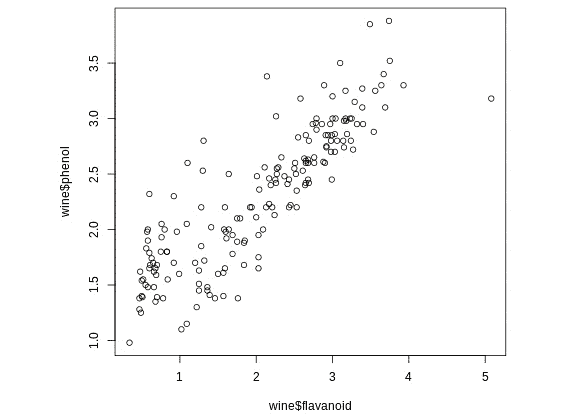

    ###### 图 4.2：黄酮和酚类二维数据的散点图

1.  在绘制数据后，我们观察到黄酮和酚类测量值之间似乎存在强烈的关联。我们可以在图上画一条线来表示这种相关性。现在，你不必担心我们如何在下面的命令中找到标记为 `a` 和 `b` 的系数：

    ```py
    plot(wine$flavanoid,wine$phenol)
    abline(a=1.1954,b=.54171,col='red',lwd=5)
    ```

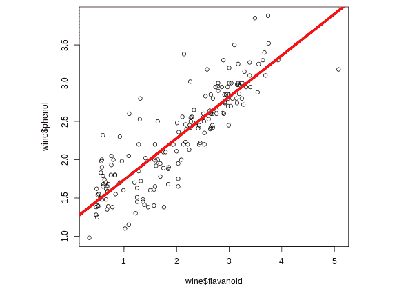

###### 图 4.3：表示黄酮和酚类之间相关性的散点图，其中有一条线表示这种相关性

如你所见，红线非常接近我们数据的几何形状。数据中的大多数点都非常接近红线。如果我们想要简洁地描述这些点，我们可以说它们最接近红线的哪个点。这不会是数据的完美描述，因为即使它们的黄酮和酚类水平不同，一些点也会映射到红线上相同的点。然而，仅使用红线来描述这些数据是对实际数据的合理近似。

如果我们用每个观察结果最接近的红线上的点来描述它，那么我们所完成的就是降维。我们从一个需要两个测量值来描述每个观察结果的数据库开始，并找到了只用一个点来描述每个观察结果的方法。这是所有降维策略的基本思想，本章包含了一些实现它的实用策略。

### 降维的重要性

为什么降维是我们感兴趣做的事情？以下是一些原因：

+   一个原因可能是为了压缩数据。如果一个数据集特别大，而且如果你的笔记本电脑上运行的 R 实例在对其进行简单计算时花费时间过长，那么降低数据的维度可能是有用的，这样它就可以更容易地适应你的计算机内存。

+   降维更有趣的原因是，它为我们提供了对数据潜在结构和不同属性之间相互关系的洞察。在前面的练习中，即使我们没有在化学方面的先进培训，我们也可以使用我们从简单的降维练习中学到的知识来更好地理解葡萄酒化学。

    #### 注意

    如果我们阅读更多关于酚类和黄烷醇（例如，在这个网站上：[`www.researchgate.net/post/What_is_the_relation_between_total_Phenol_total_Flavonoids`](https://www.researchgate.net/post/What_is_the_relation_between_total_Phenol_total_Flavonoids)），我们可以了解到酚类和黄烷醇都具备抗氧化活性。因此，图表上的红线可能代表了特定葡萄酒的抗氧化活性水平，而黄酮醇和酚类的测量只是捕捉了这一事物的噪声测量。因此，降维使我们能够对葡萄酒的化学成分提出假设，即使没有高级领域的知识。

## 市场篮子分析

市场篮子分析是一种方法，它允许我们将高维数据降低到简单且易于管理的程度，同时不会在过程中丢失太多信息。在市场篮子分析中，我们的目标是生成控制数据的规则。

市场篮子分析也称为**亲和分析**。它是以一家杂货店试图对其顾客的交易进行分析的例子命名的——分析每个顾客放入其篮子的产品。任何给定时间，大型杂货店可能有大约 5,000 种商品出售。他们每天可能有数千名顾客。对于每位顾客，杂货店可以记录这些顾客的交易记录。一种方法就是使用二进制编码，如下面的例子所示：

客户 1 在第一天交易：

花生酱：否

果冻：是

面包：否

牛奶：否

…

客户 2 在第一天交易：

花生酱：是

果冻：是

面包：否

牛奶：否

…

这些交易可以存储在一个有 5,000 列的表中——每列代表商店中出售的每个项目——以及每行代表每条记录的交易。而不是为每个项目存储“是”和“否”的值，它们可以在一个看起来像以下表格的表中存储 1s 和 0s，其中 1 表示“是”，0 表示“否”：

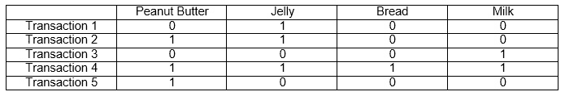

###### 图 4.4：展示客户交易的表格

上述表格只显示了四列和五行，但在实践中，表格会大得多。

市场篮子分析的最简单用例是回答一个简单的问题：通常一起购买哪些商品？杂货店老板可能纯粹出于好奇对此感兴趣。但事实上，有一些令人信服的商业理由使他们想要了解客户最常见的篮子。

到目前为止，这个问题似乎相当简单。我们的二进制数据是最简单的，只由 0s 和 1s 组成。我们的问题仅仅是找到哪些商品倾向于一起购买。复杂性不在于这些简单想法，而在于它们的实际实施。

考虑寻找倾向于一起购买的商品的**暴力**方法。如果我们考虑每个可能的项目篮子，即前述数据中 0s 和 1s 的每个可能组合，我们发现存在 2⁵⁰⁰⁰ 个可能的篮子。这比已知宇宙中的粒子数还要多，在合理的时间内检查每个可能的篮子或存储关于每个可能的篮子的发现都是计算上不可行的。

如果我们不能检查每个可能的篮子，我们如何才能找到任何信心地认为我们进行了全面检查的与任何篮子一起购买的篮子？答案是应用算法解决方案。**Apriori**算法是在时间和空间限制下进行彻底市场篮子分析的最流行方法。它是由 Agrawal 和 Srikant 发明的，他们在 1994 年发表了关于它的论文。它按顺序通过不断增加的市场篮子大小进行。

Apriori 算法由几个步骤组成。在前几个步骤中，我们将**遍历**我们的数据集以找到最常见的篮子。在我们的第一次遍历中，我们将找到包含恰好一个项目的最常见的篮子。在我们的第二次遍历中，我们将找到包含恰好两个项目的最常见的篮子。我们将继续进行这些遍历，直到我们找到我们感兴趣的每个尺寸的最常见篮子。在杂货店的例子中，可能最常见的两个项目篮子是“花生酱，果酱”，而最常见的三个项目篮子是“花生酱，果酱，面包”。

在找到最常见的篮子后，我们将为这些篮子生成**关联规则**。这些规则将表达最常见的篮子中项目之间的关系。例如，一个杂货店的关联规则可能如下所示：“如果花生酱和果酱都在篮子里，那么面包很可能也在篮子里。”这类规则使我们能够找到不同单个项目之间的关联，这可能对我们有用。例如，在知道花生酱和果酱经常与面包一起出现后，杂货店老板可能会对重新排列这些商品的陈列感兴趣，以便它们在商店中更靠近，让购物者更容易且不费力地将它们放入篮子中。

#### 注意

规则“如果花生酱和果酱[在篮子里]存在，那么面包很可能[在那个篮子里]存在”是一个简单的关联规则。关联规则有时会画一个箭头从 X 指向 Y，表示 X“意味着”Y，尽管关联规则不一定具有因果关系。

许多美国人从小吃着花生酱和果酱三明治长大，因此对他们来说，花生酱、果酱和面包可能很可能会一起购买。市场篮子分析可能会生成一些看似明显的关联规则，例如这些。然而，在实践中，市场篮子分析可能会生成一些令人惊讶和意外的关联规则。这是另一个例子，即使不是购物或零售方面的专家，我们也可以使用机器学习来发现即使是专家也会感到惊讶的模式和见解。

在下一个练习中，我们将应用市场篮子分析到人口普查调查数据中。数据集的数据如下所示：

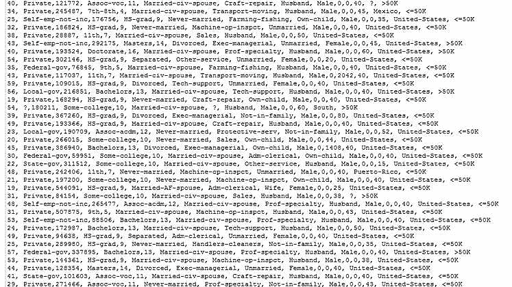

###### 图 4.5：数据集截图

#### 注意

此数据集来自 UCI 机器学习仓库。您可以在[`archive.ics.uci.edu/ml/datasets/Adult`](http://archive.ics.uci.edu/ml/datasets/Adult)找到数据集。我们已经下载了文件并将其保存在[`github.com/TrainingByPackt/Applied-Unsupervised-Learning-with-R/tree/master/Lesson04/Exercise22-Exercise25/`](https://github.com/TrainingByPackt/Applied-Unsupervised-Learning-with-R/tree/master/Lesson04/Exercise22-Exercise25/)。

这份数据与我们之前描述的假设购物篮数据不同，因为它的列不是 0-1 的二进制编码，而是可以接受多个值。由于 Apriori 算法是为 0-1 数据设计的，我们将对数据进行**重新编码**。在这里，重新编码意味着我们将创建新的变量，这些变量比原始变量更简单、更容易处理，但仍然传达相同的信息。我们将在这里执行的重编码将使数据由 0-1 编码组成。我们在这里所做的事情的另一个术语是创建虚拟变量。虚拟变量是一个只取 0 和 1 值的变量。对于数据集中的每一列，我们可以参考[`archive.ics.uci.edu/ml/datasets/Adult`](http://archive.ics.uci.edu/ml/datasets/Adult)上的数据，以找到有关该列的信息，然后使用这些信息进行我们的重新编码。我们可以对所有的变量执行类似的转换。

对于像就业状态这样的分类变量，我们为每个可能的响应创建新的 0-1 变量。对于像年龄这样的有序变量，我们创建两个新的变量，表示值是高还是低。

我们将得出关于哪些调查答案倾向于以相同方式回答的结论。除了购物数据之外，市场篮子分析可以用于各种数据集。无论使用什么数据集，市场篮子分析都会生成关联规则，并告诉我们哪些数据属性倾向于具有相同的值。

### 练习 22：为 Apriori 算法准备数据

#### 注意

练习 22-25 应一起执行。

在这个练习中，我们将使用在[`github.com/TrainingByPackt/Applied-Unsupervised-Learning-with-R/tree/master/Lesson04/Exercise22-Exercise25/census.csv`](https://github.com/TrainingByPackt/Applied-Unsupervised-Learning-with-R/tree/master/Lesson04/Exercise22-Exercise25/census.csv)上免费提供的数据库。这是调查数据。要使用此数据，您应首先将其下载到您的计算机上 - 保存为名为`census.csv`的文件。您不需要加载任何特殊包来运行此数据或完成任何先决条件：

1.  使用 R 中的`setwd()`函数读取数据。在设置工作目录后，你可以按以下方式将其读入 R：

    ```py
    filepath='census.csv'
    mkt<-read.csv(filepath,stringsAsFactors=FALSE,header=FALSE,sep=',')
    ```

1.  检查数据：

    ```py
    head(mkt)
    ```

    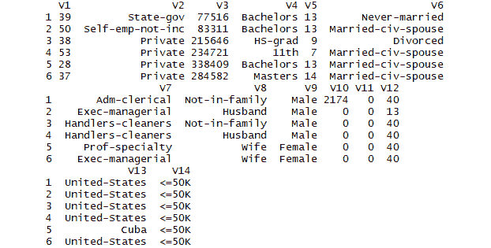

    ###### 图 4.6：数据截图

    你会注意到，R 已经自动为数据分配了列名，因为原始数据文件没有包含列名。默认情况下，R 从`V`开始分配编号列名，因为每一列都可以被视为一个向量。

1.  创建虚拟变量。

    我们可以从数据网站上看到第一个变量，R 将其称为`V1`，是年龄的测量值。对于这个变量，我们根据其值是否高于或低于中位数年龄值将其重新编码为 0-1 二进制变量。我们可以用"`median(mkt$V1)`"来计算中位数年龄值：

    ```py
    mkt$old<-1*(mkt$V1>median(mkt$V1))
    mkt$young<-1*(mkt$V1<=median(mkt$V1))
    ```

1.  同样，我们可以在网站上看到第二列，R 将其标记为`V2`，指的是就业状况。对于就业，我们可以创建几个新变量，每个就业类别一个：

    ```py
    mkt$government_employee<-1*(mkt$V2 %in% c(" State-gov"," Local-gov"," Federal-gov"))
    mkt$self_employed<-1*(mkt$V2 %in% c(" Self-emp-not-inc"," Self-emp-inc"))
    mkt$never_worked<-1*(mkt$V2 %in% c(" Never-worked"))
    mkt$private_employment<-1*(mkt$V2 %in% c(" Private"))
    mkt$other_employment<-1*(mkt$V2 %in% c(" ?"," Without-pay" ))
    ```

1.  在这里，我们为受访者的教育水平编码 0-1 变量：

    ```py
    mkt$high_school_incomplete<-1*(mkt$V4 %in% c(" 1st-4th"," Preschool"," 5th-6th"," 7th-8th"," 9th"," 10th"," 11th"," 12th"))
    mkt$high_school_complete<-1*(mkt$V4 %in% c(" HS-grad"," Some-college"," Assoc-acdm"," Assoc-voc"))
    mkt$bachelors<-1*(mkt$V4 %in% c(" Bachelors"))
    mkt$post_bachelors<-1*(mkt$V4 %in% c(" Masters"," Prof-school"," Doctorate" ))
    ```

    我们使用`V4`列来编码教育水平，因为标记为`V3`的列对我们来说没有用。我们不会使用`V5`列，因为它包含的是以不同方式表达相同数据。

1.  在这里，我们为一个人的婚姻状况编码 0-1 变量：

    ```py
    mkt$married<-1*(mkt$V6 %in% c(" Married-civ-spouse"," Married-AF-spouse"," Married-spouse-absent"))
    mkt$never_married<-1*(mkt$V6 %in% c(" Never-married"))
    mkt$divorced_separated<-1*(mkt$V6 %in% c(" Divorced"," Separated"))
    mkt$widowed<-1*(mkt$V6 %in% c( " Widowed"))
    ```

1.  在这里，我们为受访者的职业编码 0-1 变量：

    ```py
    mkt$clerical<-1*(mkt$V7 %in% c(" Adm-clerical"))
    mkt$managerial<-1*(mkt$V7 %in% c(" Exec-managerial"))
    mkt$moving<-1*(mkt$V7 %in% c(" Transport-moving"))
    mkt$farming_fishing<-1*(mkt$V7 %in% c(" Farming-fishing"))
    mkt$craft_repair<-1*(mkt$V7 %in% c(" Craft-repair" ))
    mkt$sales<-1*(mkt$V7 %in% c(" Sales"))
    mkt$tech_support<-1*(mkt$V7 %in% c(" Tech-support"))
    mkt$service<-1*(mkt$V7 %in% c(" Protective-serv"," Priv-house-serv", " Other-service"))
    mkt$armed_forces<-1*(mkt$V7 %in% c(" Armed-Forces"))
    mkt$other_occupation<-1*(mkt$V7 %in% c(" Handlers-cleaners"," ?"," Machine-op-inspct"," Prof-specialty"))
    ```

    我们不会使用`V8`列，因为它是为了普查目的而记录的，对我们分析没有用。

1.  在这里，我们为受访者的自报性别编码 0-1 变量：

    ```py
    mkt$male<-1*(mkt$V9 %in% c(" Male"))
    mkt$female<-1*(mkt$V9 %in% c(" Female"))
    ```

    `V10`和`V11`列不太具有信息量，所以我们不会在分析中使用它们。

1.  在这里，我们为每个受访者的自报工作时间编码 0-1 变量：

    ```py
    mkt$high_hours<-1*(mkt$V12 > median(mkt$V12))
    mkt$low_hours<-1*(mkt$V12 <= median(mkt$V12))
    ```

1.  在这里，我们为受访者报告的国籍是否为美国编码 0-1 变量：

    ```py
    mkt$usa<-1*(mkt$V13==" United-States")
    mkt$not_usa<-1*(mkt$V13!=" United-States")
    ```

1.  在这里，我们为受访者报告的收入是否高于或低于$50,000 编码 0-1 变量：

    ```py
    mkt$low_income<-1*(mkt$V14==" <=50K")
    mkt$high_income<-1*(mkt$V14==" >50K")
    ```

1.  现在，我们已经添加了 33 个新的变量，它们是 0-1 编码。由于我们只会在 0-1 编码上执行市场篮子分析，我们可以删除最初用来创建只包含虚拟变量的数据集的 14 个初始变量，如下所示：

    ```py
    mktdummies<-mkt[,15:ncol(mkt)]
    mktdummies
    ```

1.  我们可以通过运行以下代码来查看我们每个变量的平均值：

    ```py
    print(colMeans(mktdummies,na.rm=TRUE))
    ```

    虚拟变量的平均值等于它等于 1 的时间百分比。所以，当我们看到`已婚`变量的平均值是 0.473 时，我们知道大约 47.3%的受访者已婚。

    完成这个练习后，你的数据将会有 33 列，每一列都是一个只取 0 和 1 值的`虚拟变量`实例。如果你在控制台中运行`print(head(mktdummies))`来打印前 6 行，那么你可以看到生成的数据集如下所示：

    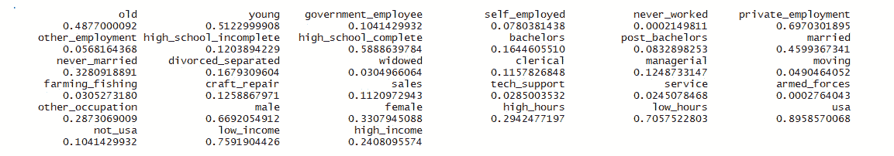

###### 图 4.7：虚拟变量结果数据集的一部分

现在我们已经完成了练习，我们有一个只包含 0-1 变量的虚拟变量数据集，这些变量提供了关于数据集中每个原始变量的真/假信息。

最后，我们准备实际执行 Apriori 算法。在接下来的练习中，我们将开始“遍历”我们的数据。在每次遍历中，我们将找到具有特定大小的最常见的篮子。

在我们开始遍历数据之前，我们需要指定一个称为**支持率**的东西。支持率是 Apriori 算法参数之一的名字。在这里，支持率指的是包含特定项目组合的篮子百分比。如果我们发现市场数据中 40%的受访者既是高收入又是女性，那么我们将说在我们的数据中，高收入、女性的“篮子”有 40%的支持率。

我们需要决定我们感兴趣的最低支持率。如果我们设定的最低支持率阈值过高，我们将找不到任何满足阈值的篮子。如果我们设定的最低支持率阈值过低，我们将找到太多的篮子，这将很难查看所有篮子以找到有趣的一个。此外，因为我们希望找到实际有用的规则，所以我们希望找到相对常见的篮子，因为更常见的篮子更有可能对我们有实际用途。

### 练习 23：通过数据遍历以找到最常见的篮子

现在数据已经准备好进行市场篮子分析的主要步骤。在继续之前，我们必须决定我们将在算法中使用哪些参数：

1.  我们将要处理的第一参数是支持率，如前所述。在这种情况下，我们可以从将最低支持率阈值设定为 10%开始。

    ```py
    support_thresh<-0.1
    ```

1.  首先，我们将找到所有符合我们支持阈值的单项篮子，如下所示：

    ```py
    firstpass<-unname(which(colMeans(mktdummies,na.rm=TRUE)>support_thresh))
    ```

    这显示了至少有 10%的受访者以相同方式回答的所有调查项目。

1.  为了对数据进行第二次遍历，我们将定义所有可能的两项篮子候选者，这些篮子可能支持率超过 10%，如下所示：

    ```py
    secondcand<-t(combn(firstpass,2))
    secondpass<-NULL
    ```

    #### 注意

    如果少于 10%的篮子包含某个特定项目，那么超过 10%的篮子同时包含该项目和另一个项目的可能性是不存在的。因此，支持率超过 10%的两项篮子候选者将是那些在第一次数据遍历中幸存的项目组合。

    我们已经定义了`secondcand`，这是我们第二次遍历的候选者集合，以及`secondpass`，我们将用它来存储第二次遍历的结果。`secondpass`变量初始值为`NULL`，因为我们还没有开始第二次遍历。

    如果我们查看`secondcand`，我们可以看到它由一对数字组成。每个数字都指代`mktdummies`数据中的一个列。例如，`secondcand`的第四行指代一个潜在篮子，其中包含那些表示他们年龄大于中位数且是私企雇员的受访者。在第二次数据遍历中，我们将检查`secondcand`中的每个两项候选者，如果其支持率超过 10%，它将成功通过第二次数据遍历。

1.  为了检查我们的候选者`secondcand`中第四行的支持率，我们可以进行以下计算：

    ```py
    k<-4
    support<-mean(mktdummies[,secondcand[k,1]]*mktdummies[,secondcand[k,2]],na.rm=TRUE)
    print(support)
    ```

    输出如下：

    ```py
    0.05515801
    ```

1.  我们需要为每个候选篮子进行相同的计算，我们可以通过将这个计算放入循环中来实现。这个循环将把达到支持阈值的最终两个项篮子保存在`secondpass`变量中：

    ```py
    k<-1
    while(k<=nrow(secondcand)){
    support<-mean(mktdummies[,secondcand[k,1]]*mktdummies[,secondcand[k,2]],na.rm=TRUE)
    if(support>support_thresh){
    secondpass<-rbind(secondpass,secondcand[k,])
    }
    k<-k+1
    }
    ```

1.  这个练习的重要结果变量是名为`secondpass`的变量。这个变量包含所有达到我们指定的支持阈值（10%）的两个项篮子。通过在控制台中运行以下命令，查看这个变量的前六行：

    ```py
    print(head(secondpass))
    ```

    输出如下：

    ```py
         [,1] [,2]
    [1,]    1    6
    [2,]    1    9
    [3,]    1   12
    [4,]    1   14
    [5,]    1   25
    [6,]    1   26
    ```

    在这里，每一行包含两个数字，每个数字都指代原始数据集中的列号。例如，第一行表示`mktdummies`数据集的第一列和第六列共同构成一个支持度超过 10%的两个项篮子。由于我们数据集的第一列被称为`old`，而数据集的第六列被称为`private_employment`，因此我们得出结论，既是老年人又是私营部门雇员的调查受访者占所有调查受访者的 10%以上。

在此之后，我们已经完成了第二次数据遍历。通过完成第二次遍历，我们现在有一个包含所有最常见的两个项篮子的列表。

Apriori 算法的要点在于，我们可以利用两项篮子和单项篮子来缩小我们关注的三个项候选篮子，这使得我们的搜索速度大大加快。

要全面了解 Apriori 算法的工作原理，我们应该至少再遍历一次数据，这将在下面的练习中介绍。

### 练习 24：多次遍历数据

在下面的练习中，我们将多次遍历数据。回想一下，每次我们遍历数据时，我们都在寻找符合我们支持阈值的篮子。在每次遍历中，我们寻求比之前遍历中更多的篮子。因此，在第一次遍历中，我们寻找符合我们支持阈值的单项篮子。在第二次遍历中，我们寻找符合我们支持阈值的两项篮子。在下面的练习中，我们将说明如何进行多次数据遍历，包括第三次遍历，我们将寻找符合我们支持阈值的三个项篮子，以及第四次遍历，我们将寻找符合我们支持阈值的四个项篮子。

如果我们对许多项目所遵循的复杂规则感兴趣，能够多次遍历数据对我们来说将非常重要：

1.  在第三次遍历数据时，我们将寻找至少有 10%支持度的三个项篮子。第三次遍历数据将从`product`变量等于 1 开始。这个`product`变量将给我们数据的不同列的乘积，而`product`变量的平均值将给我们不同篮子的支持度，如下所示：

    ```py
    product<-1
    n<-1
    ```

1.  这个`product`变量将与在第二次遍历中幸存下来的两项篮子相关的观测值相乘：

    ```py
    thirdpass<-NULL
    k<-1
    while(k<=nrow(secondpass)){
    j<-1
    while(j<=length(firstpass)){
    n<-1
    product<-1
    while(n<=ncol(secondpass)){
    product<-product*mktdummies[,secondpass[k,n]]
    n<-n+1
    }
    ```

1.  最后，每个`product`变量将乘以第一轮中幸存下来的单个项目篮子的观测值：

    ```py
    if(!(firstpass[j] %in% secondpass[k,])){
    product<-product*mktdummies[,firstpass[j]] 
    ```

1.  我们取产品的平均值以找到我们指定的篮子的支持度：

    ```py
    support<-mean(product,na.rm=TRUE)
    ```

1.  如果结果三项篮子的支持度高于我们指定的支持度阈值，则将其保存到我们的最终`thirdpass`变量中：

    ```py
    if(support>support_thresh){
    thirdpass<-rbind(thirdpass,c(secondpass[k,],firstpass[j]))
    }
    }
    j<-j+1
    }
    k<-k+1
    }
    ```

    #### 注意

    步骤 2-5 应一起执行。

    现在我们有一个包含数据中所有大小为三的常见篮子的列表。

1.  经过几轮数据遍历后，我们可以开始看到 Apriori 算法所采取步骤的一般形式。一般来说，为了找到在`n`轮中幸存下来的篮子，我们需要取在`n-1`轮中幸存下来的篮子，向其中添加一个在第一轮中幸存下来的项目，并查看结果组合的支持度是否大于我们选择的阈值：

    ```py
    fourthpass<-NULL
    k<-1
    while(k<=nrow(thirdpass)){
    j<-1
    while(j<=length(firstpass)){
    n<-1
    product<-1
    while(n<=ncol(thirdpass)){
    product<-product*mktdummies[,thirdpass[k,n]]
    n<-n+1
    }
    if(!(firstpass[j] %in% thirdpass[k,])){
    product<-product*mktdummies[,firstpass[j]]
    support<-mean(product,na.rm=TRUE)
    if(support>support_thresh){
    fourthpass<-rbind(fourthpass,c(thirdpass[k,],firstpass[j]))
    }
    }
    j<-j+1
    }
    k<-k+1
    }
    ```

    我们可以无限期地继续这样做，创建任何大小且符合我们支持度阈值的篮子。在这里，我们的目的是在数据中遍历四次后停止，并检查我们第三遍的结果。

1.  本练习的最终重要结果是`thirdpass`和`fourthpass`变量。这些变量包含关于符合我们支持度阈值的三项和四项篮子的信息。您可以像解释`secondpass`的每一行一样解释这些变量的每一行。每一行代表一个符合我们支持度阈值的篮子，每一行中的每个数字都指的是我们的数据集中的一列编号。

    您可以通过执行以下操作来验证`thirdpass`的前六行：

    ```py
    print(head(thirdpass))
    ```

    输出如下：

    ```py
         [,1] [,2] [,3]
    [1,]    1    6    9
    [2,]    1    6   12
    [3,]    1    6   26
    [4,]    1    6   29
    [5,]    1    6   30
    [6,]    1    6   32
    ```

    我们可以将第二行解释为表示包含项目 1、项目 6 和项目 12 的篮子达到了我们的支持度阈值。

1.  您可以通过以下方式验证`fourthpass`的前六行：

    ```py
    print(head(fourthpass))
    ```

    输出如下：

    ```py
         [,1] [,2] [,3] [,4]
    [1,]    1    6    9   26
    [2,]    1    6    9   29
    [3,]    1    6    9   30
    [4,]    1    6    9   32
    [5,]    1    6   12   26
    [6,]    1    6   12   29
    ```

    我们可以将第五行解释为告诉我们包含项目 1、项目 6、项目 12 和项目 26 的篮子达到了我们的支持度阈值。

在之前的练习中，我们已经找到了我们感兴趣的篮子。在这个练习中，我们将获得市场篮子分析的最后产品。我们感兴趣的最后产品将是“旧”、“私人雇佣”和“低小时数”的统一。我们还感兴趣于生成一个关联这三个项目的规则。这样一个规则可能就是“年龄超过中位数调查受访者且为私人雇佣的人，很可能工作时间少于中位数受访者”。因此，市场篮子分析比其他仅发现数据中组的分布分析和聚类方法更进一步。市场篮子分析不仅找到组，而且将它们按照有意义的规则进行分组。

为了生成这些规则，我们需要指定更多的参数，类似于我们之前指定的支持度阈值。

这些参数中的一个被称为**置信度**。置信度仅仅是一个条件概率。假设一个人既是女性又是低收入，她离婚的可能性有多大？我们迄今为止确定的是支持度，这可能告诉我们由女性、低收入和离婚这三个项目组成的篮子占所有调查者的 10%以上。置信度告诉我们更多——它告诉我们“离婚”是否只是一个常见的篮子项目，或者是否在“女性”和“低收入”存在的情况下特别常见。

我们最后必须指定的参数被称为**提升度**。提升度是规则预测的项目总体普遍性的置信度。在这种情况下，假设如果一个人是女性且低收入，她有 90%的可能性也是离婚的。那么 90%是这个规则的置信度，这似乎相当高。然而，如果 89%的人无论如何都是离婚的，那么这个置信度就不会显得那么令人印象深刻。如果是这样，那么知道篮子中存在“女性”和“低收入”只会略微提高我们的预测能力，大约 1%。在这种情况下，提升度的值将是 90%/89%，或大约 1.011。这只是一个假设——我们得检查实际数据来看到提升度的实际值是多少。

一起，置信度和提升度提供了帮助我们决定一个关联规则是否有用的测量指标。在一个复杂的情况，比如我们在这里看到的许多问题调查中，我们指定置信度和提升度的最小阈值，以过滤掉不够有用的关联规则，这样我们就可以用少量非常有用的规则完成 Apriori 算法。

### 练习 25：作为 Apriori 算法最后一步生成关联规则

在这个练习中，我们将完成 Apriori 算法的最后一步。到目前为止，任何经过我们数据处理而幸存下来的篮子都可以被认为是候选规则。在市场篮子分析的最终步骤中，我们将根据我们的最终标准——置信度和提升度进一步减少候选规则。

1.  检查以下经过多次数据处理的篮子：

    ```py
    head(thirdpass)
    ```

    输出如下：

    ```py
         [,1] [,2] [,3]
    [1,]    1    6    9
    [2,]    1    6   12
    [3,]    1    6   26
    [4,]    1    6   29
    [5,]    1    6   30
    [6,]    1    6   32
    ```

    你可以这样看到经过第三次处理幸存下来的三项篮子的数量：

    ```py
    nrow(thirdpass)
    ```

    输出如下：

    ```py
    [1] 549
    ```

    我们可以看到有 549 个三项篮子，即 549 个至少在我们的数据中有 10%支持度的候选规则。这些篮子不是市场篮子分析的最终产品——我们正在寻找的最终产品是关联规则。

1.  我们三项篮子的置信度公式如下：由所有三个项目组成的篮子的支持度，除以只包含前两个项目的篮子的支持度。我们可以这样计算我们的`thirdpass`三项篮子的第五行的置信度：

    ```py
    k<-5
    confidence<-mean(mktdummies[,thirdpass[k,1]]*mktdummies[,thirdpass[k,2]]*mktdummies[,thirdpass[k,3]],na.rm=TRUE)/mean(mktdummies[,thirdpass[k,1]]*mktdummies[,thirdpass[k,2]],na.rm=TRUE)
    ```

    #### 注意

    这只是包含三个项目的完整购物篮的支持度，除以不包含第三个项目的两个项目的支持度。

1.  提升度是置信度除以规则预测的项目总体流行度。对于我们的第三遍候选人的第五行，提升度可以很容易地按以下方式计算：

    ```py
    k<-5
    lift<-confidence/mean(mktdummies[,thirdpass[k,3]],na.rm=TRUE)
    ```

1.  为了将候选规则缩小到一组可接受的关联规则，我们将指定最小置信度和提升度阈值，就像我们对支持度所做的那样。在这里，我们指定了提升度阈值为 1.8 和置信度阈值为 0.8：

    #### 注意

    ```py
    lift_thresh<-1.8
    conf_thresh<-.8
    ```

1.  我们可以通过以下循环为我们的每个候选规则计算`提升度`和`置信度`：

    ```py
    thirdpass_conf<-NULL
    k<-1
    while(k<=nrow(thirdpass)){
      support<-mean(mktdummies[,thirdpass[k,1]]*mktdummies[,thirdpass[k,2]]*mktdummies[,thirdpass[k,3]],na.rm=TRUE)
      confidence<-mean(mktdummies[,thirdpass[k,1]]*mktdummies[,
                                                              thirdpass[k,2]]*mktdummies[,thirdpass[k,3]],na.rm=TRUE)/
        mean(mktdummies[,thirdpass[k,1]]*mktdummies[,thirdpass[k,2]],na.rm=TRUE)
      lift<-confidence/mean(mktdummies[,thirdpass[k,3]],na.rm=TRUE)
      thirdpass_conf<-rbind(thirdpass_conf,unname(c(thirdpass[k,],support,confidence,lift)))
      k<-k+1
    }
    ```

    这生成了一个名为`thirdpass_conf`的新变量，它是一个包含每个候选规则的`支持度`、`置信度`和`提升度`列的 DataFrame。在这里，`conf`被用作`置信度`的简称，这是我们添加到`thirdpass`数据中的。

1.  最后，我们可以消除所有不符合指定置信度和提升度阈值的候选规则，如下所示：

    ```py
    thirdpass_high<-thirdpass_conf[which(thirdpass_conf[,5]>conf_thresh & thirdpass_conf[,6]>lift_thresh),]
    ```

1.  现在我们有了`thirdpass_high`，这是我们数据中具有高置信度和高提升度的关联三项目规则的集合。我们可以通过以下方式将其中一些打印到控制台来浏览它们：

    ```py
    head(thirdpass_high)
    ```


###### 图 4.8：thirdpass_high 的输出

总的来说，我们在市场篮子分析中遵循的步骤可以总结如下：

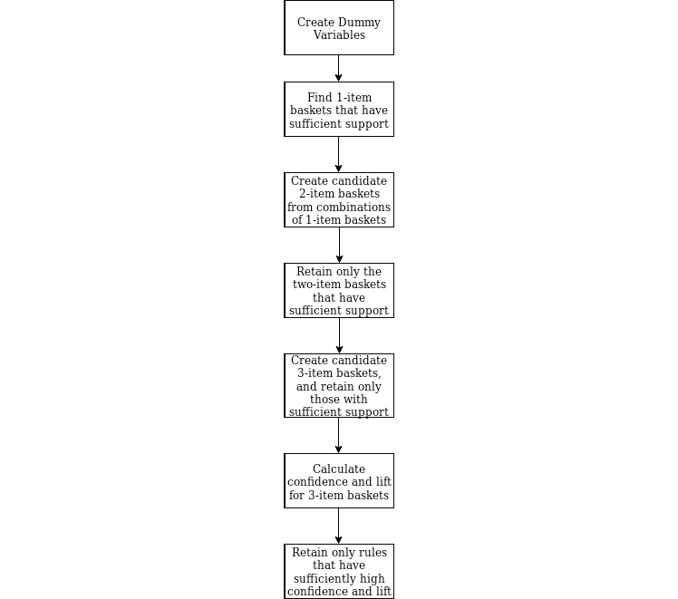

###### 

#### 注意

记住，这些是指我们在*练习 22*，*为 Apriori 算法准备数据*中创建的虚拟变量，其中我们创建了一个名为`old`的虚拟变量，对于年龄较高的个体，其值为 1，否则为 0。我们还创建了一个表示高收入的虚拟变量，其中 1 表示年收入超过 50,000 美元，否则为 0。

`thirdpass_high`的第一行规则的解释是：年龄超过中位数且收入较高的人，很可能（具有高置信度和高提升度）已婚。这在直觉上是有道理的：婚姻和高收入都需要很多年才能实现，所以没有很多年轻、已婚、高收入的人是有道理的。我们发现这个规则的置信度约为 87%，提升度约为 1.84。

在这种情况下，进行调查的公司可以使用这些数据来创建广告活动——要么创建针对已婚老年人的住房广告活动，因为这是一个经过证明的高收入人口群体，要么针对年轻的已婚人士的住房广告活动，因为这可能是一个未得到充分服务的群体，将构成商业机会。我们发现的每个七项规则都可以提供对人口模式和商业机会的见解，以及这些规则告诉我们什么以及它们提供的确定性量化测量。

在我们的市场篮子分析过程中，我们可以做出一些不同的选择，这些选择可能会改变我们的结果。如果我们改变指定的阈值，我们可能会得到更多的规则，或者更有用的规则。例如，如果我们将支持阈值设置为 9%而不是 10%，则过滤出的规则会更少，我们可能最终得到一条规则，例如“住在公寓里的年轻学生很可能是亚裔美国人”，这是一条只占调查受访者约 9%的群体的规则。

我们只关注了包含三项的篮子和与这些篮子元素相关的规则。通过允许更多或更少的物品进入我们用于搜索规则的篮子，我们可以找到更有趣的规则，这些规则可能导致坚实的商业洞察。所有这些都是在相对较短的时间内用相对较少的代码行完成的。这表明市场篮子分析在解决数据问题和商业问题方面的有用性和潜力。

市场篮子分析将一个高维问题（在大数据集中寻找模式的问题）转化为一个低维解决方案（六个简单、高置信度的规则），而无需太多的努力、计算能力或时间。

### 主成分分析

我们将要介绍的下一类降维方法是主成分分析（PCA）。这是一种在广泛领域的学者中非常常见的技巧。

### 线性代数复习

本节不会对线性代数进行全面回顾，而只是提醒一些主要观点。

#### 备注

[`joshua.smcvt.edu/linearalgebra/#current_version`](http://joshua.smcvt.edu/linearalgebra/#current_version) 覆盖了一些基础知识，包括矩阵、协方差矩阵、特征向量和特征值。如果您已经熟悉这些术语，可以自由跳过线性代数复习。

### 矩阵

线性代数主要关注矩阵的分析。矩阵可以被视为一个矩形格式的数字集合。我们可以在 R 中创建一个矩阵，如下所示：

```py
matrix1<-matrix(c(1,2,3,4,5,6),nrow=2)
```

在这里，我们创建了一个两行三列的矩阵，总共有六个条目。我们根据矩阵中条目出现的行和列来描述条目。在我们刚刚创建的"`matrix1`"中，数字 3 位于"1-2"位置，因为它位于第一行第二列。我们可以在 R 中通过调用`matrix1[1,2]`来访问该特定位置。

### 方差

通常，一个变量的方差让我们了解该变量分布的广泛程度。

### 协方差

协方差是测量两个不同变量一起的方差。它衡量它们的分散程度是否匹配。换句话说，它衡量如果一个变量高，另一个变量也高的程度，以及每个变量预期会多高。

### 练习 26：检查葡萄酒数据集中的方差和协方差

执行*练习 21*中要遵循的所有步骤，即*检查包含不同葡萄酒化学属性的数据集*。然后计算同一数据集的方差和协方差：

1.  酒精测量值都在 11.03 和 14.83 之间，你可以通过运行以下代码来看到：

    ```py
    range(wine$alcohol)
    ```

    输出如下：

    ```py
    [1] 11.03 14.83
    ```

1.  我们可以使用 R 的`var`命令来计算方差。对于葡萄酒的酒精测量，我们发现`var(wine$alcohol)`约为 0.66。相比之下，我们发现通过执行以下代码，我们数据集中的镁测量值分布更广：

    ```py
    range(wine$magnesium)
    ```

    输出如下：

    ```py
    [1]  70 162
    ```

1.  这表明变量范围从 70 到 162。由于它分布更广，我们应该预期方差更高，我们确实通过执行以下代码找到了这一点：

    ```py
    var(wine$magnesium)
    ```

    输出如下：

    ```py
    [1] 203.9893
    ```

1.  要计算协方差，执行以下代码：

    ```py
    cov(wine$alcohol,wine$magnesium)
    ```

    输出如下：

    ```py
    [1] 3.139878
    ```

1.  在*步骤 4*中，我们发现酒精和镁变量的协方差约为 3.14。请注意，协方差是对称的，所以 X 与 Y 的协方差与 Y 与 X 的协方差相同。你可以通过尝试以下代码来检查这一点：

    ```py
    cov(wine$magnesium,wine$alcohol)
    ```

    输出如下：

    ```py
    [1] 3.139878
    ```

    你会注意到它产生了相同的值。

1.  一个变量的方差就是该变量与其自身的协方差。你可以通过运行以下代码来看到这一点：

    ```py
    var(wine$magnesium)
    ```

    输出如下：

    ```py
    [1] 203.9893
    ```

    通过执行以下代码，你会得到相同的输出：

    ```py
    cov(wine$magnesium,wine$magnesium)
    ```

    输出如下：

    ```py
    [1] 203.9893
    ```

协方差矩阵是一个方阵，其中每个条目都是一个方差或协方差。要构建协方差矩阵，首先我们必须给我们的数据集中的每个变量编号。在葡萄酒数据集中，我们可以根据列列表中的顺序给每个变量一个编号。因此，酒精将是变量 1，苹果酸将是变量 2，依此类推。

#### 注意

记住，你可以在数据源网站[`archive.ics.uci.edu/ml/datasets/wine`](https://archive.ics.uci.edu/ml/datasets/wine)看到变量的列表。

在对变量排序后，我们可以创建协方差矩阵。在这个矩阵中，我们说的是，“i-j 条目是变量 i 和变量 j 的协方差。”因此，第一行第二列的项目是 1-2 条目，它将等于第一个变量（酒精）与第二个变量（苹果酸）的协方差。由于协方差是一个对称操作，2-1 条目将与 1-2 条目相同。这意味着矩阵本身将是对称的——每个条目都与主对角线另一侧镜像位置的条目相同。

协方差矩阵主对角线上的条目将是方差而不是协方差。例如，矩阵的 3-3 位置的条目将是变量 3 与变量 3 的协方差——这是变量与其自身的协方差，这也是说它是变量方差的一种方式。

### 特征向量和特征值

当我们有一个如协方差矩阵这样的方阵时，我们可以计算一些特殊的向量，称为**特征向量**。每个特征向量都有一个与之相关的值，称为**特征值**。关于特征向量和特征值的讨论可以轻易填满一本书。对我们来说，关于特征向量最重要的知道是它们表达了数据中最大方差的方向。关于特征值最重要的知道是它们表明哪些特征向量是最重要的。

### PCA 的概念

PCA 是一种基于前面复习中描述的线性代数主题的强大降维技术。

为了完成 PCA，我们将取我们数据的协方差矩阵，然后找到它的特征向量。协方差矩阵的特征向量被称为**主成分**。主成分使我们能够用不同的术语和不同的维度重新表达数据。

我们将使用本章开头探索的与葡萄酒相关的数据集。回想一下，葡萄酒数据集有 13 个维度，这些维度测量了特定葡萄酒的特定化学属性。该数据集中的一项观测值由 13 个数字组成——每个维度一个。

主成分分析（PCA）使数据能够以不同的术语重新表达。葡萄酒数据集的协方差矩阵将包含 13 个特征向量。我们可以将这些特征向量解释为 13 个新的维度——我们将在接下来的练习中看到如何做到这一点。本质上，我们将能够用我们通过 PCA 发现的新维度完全描述每个观测值。

更重要的是，PCA 使我们能够进行降维。我们不必用特征向量定义的 13 个新维度重新表示数据，而只需选择这 13 个新维度中最重要的 12 个，并用这 12 个维度来表示数据，而不是原来的 13 个维度。PCA 使得选择最重要的维度变得容易，因为每个特征向量的重要性是通过其对应的特征值来衡量的。以下练习将更详细地说明如何做到这一点。

在 PCA 过程中，我们将创建一种新的图表类型，称为**散点图**。散点图是一个简单的线段图，显示了矩阵的特征值，按从高到低的顺序排列，以指示它们相关特征向量的相对重要性。

散点图显示了矩阵的特征值，按从大到小的顺序绘制。我们将使用散点图来决定哪些特征向量（即哪些维度）是最重要的。

PCA 可能听起来很难，它基于一些可能对你来说是新术语和想法，但实际上在 R 中实现相对简单。

### 练习 27：执行主成分分析（PCA）

如果我们有一个协方差矩阵，我们就准备好执行 PCA 了。在这种情况下，我们将使用本章前面探索过的葡萄酒数据集。我们的目标是进行降维——用比原始数据集更少的维度来表示葡萄酒数据集。这个练习建立在*练习 26*，“在葡萄酒数据集上检查方差和协方差”的基础上：

1.  首先，加载本章前面使用的相同`wine`数据集。作为第一步，我们将从葡萄酒数据集中删除`class`列。我们这样做是因为`class`不是葡萄酒的化学属性，而是一个标签，我们感兴趣的是研究葡萄酒的化学属性。我们可以按照以下方式删除此列：

    ```py
    wine_attributes<-wine[,2:14]
    ```

1.  我们可以按照以下方式获取这个较小矩阵的协方差矩阵：

    ```py
    wine_cov<-cov(wine_attributes)
    ```

1.  接下来，我们将使用 R 中的一个函数`eigen`。这个函数计算称为`特征向量`的特殊向量，以及称为`特征值`的特殊值。我们可以将其应用于我们的协方差矩阵，如下所示：

    ```py
    wine_eigen<-eigen(wine_cov)
    ```

1.  现在，我们可以查看我们找到的特征向量：

    ```py
    print(wine_eigen$vectors)
    ```

    输出如下：

    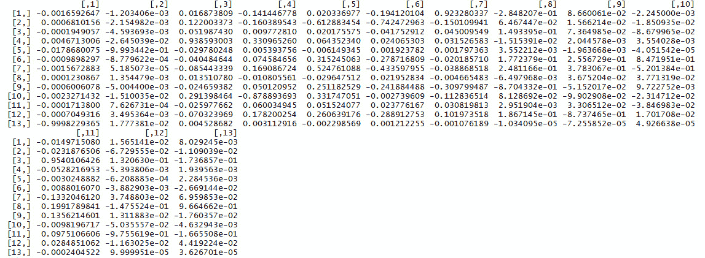

    ###### 图 4.10：葡萄酒的特征向量

1.  R 已经将特征向量编译成一个与我们的原始协方差矩阵大小相同的方阵。这个新矩阵的每一列都是协方差矩阵的一个特征向量。如果我们查看我们找到的特征值，我们可以看到每个特征向量的相对重要性。执行以下命令来查看特征值：

    ```py
    print(wine_eigen$values)
    ```

    输出如下：

    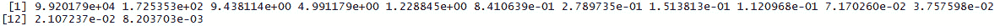

    ###### 图 4.11：葡萄酒的特征值

1.  我们实际上已经完成了我们的 PCA。协方差矩阵的特征向量被称为数据的特征值。让我们看看第一个：

    ```py
    print(wine_eigen$vectors[,1])
    ```

    输出如下：

    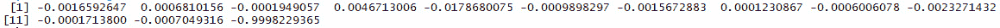

###### 图 4.12：这个第一个特征向量表示了原始维度的线性组合。

我们可以这样理解我们的第一个主成分：

主成分 1 = -0.0016592647 * 酒精 + 0.0006810156 * 苹果酸 -0.0001949057 * 灰分 + 0.0046713006 * 碱度 -0.0178680075 * 镁 - 0.0009898297 * 酚 -0.0015672883 * 黄烷醇 +0.0001230867 * 非酚 -0.0006006078 * 白藜芦醇 -0.0023271432 * 颜色 -0.0001713800 * 色调 -0.0007049316 * OD280 -0.9998229365 * 脯氨酸

因此，特征向量的每个元素都是这个方程中的一个系数，用于生成一个新的主成分。主成分是原始维度的线性组合。我们可以将每个主成分用作新的维度。所以，我们不必通过说“它有 14.23 的酒精测量值，1.71 的苹果酸测量值……”等等来描述一个观察结果，我们可以通过说类似“它有 5.62 的主成分 1 测量值，9.19 的主成分 2 测量值……”等等来描述它。

这个练习最重要的结果是`wine_eigen$vectors`和`wine_eigen$values`对象。

任何降维技术都意味着我们必须在数据集中丢失一些编码的信息。这是不可避免的：一个数字永远不能完全表达出 13 个数字所表达的一切。PCA 的好处是它保证了这是降维最有效的方法——通过用主成分来表示数据，我们丢失了尽可能少的信息。

在接下来的练习中，我们将讨论如何转换数据以实现降维。

### 练习 28：使用 PCA 进行降维

这个练习是前一个练习的延续——它将使用相同的数据和相同的矩阵以及我们之前计算的特征向量：

1.  记住，我们协方差矩阵的每个特征向量都告诉我们一个可以用来总结数据的 13 个葡萄酒属性的线性组合。在这种情况下，第一个特征向量告诉我们我们可以这样转换数据：

    ```py
    neigen<-1
    transformed<-t(t(as.matrix(wine_eigen$vectors[,1:neigen])) %*% t(as.matrix(wine_attributes)))
    ```

    在这里，我们指定了若干个特征向量（1），并且将我们的原始数据集乘以这个数量的特征向量，创建了一个用这个特征向量或我们的第一个主成分表示的转换后的数据集。

1.  我们可以这样查看我们转换后的数据集的一部分：

    ```py
    print(head(transformed))
    ```

    这将给出以下输出：

    

    ###### 图 4.13：转换后的数据集

    在这里，我们有一个一维数据集，它只使用一个数字来描述每个观测值。因此，我们说第一个观测的葡萄酒在主成分 1 上的得分为-1067.0557。我们已经完成了降维。

1.  我们可以通过以下乘法进行数据集的部分恢复：

    ```py
    restored<- t(as.matrix(wine_eigen$vectors[,1:neigen]) %*% t(as.matrix(transformed)))
    ```

    这应该可以恢复我们的原始数据集。

    #### 注意

    由于降维总是丢失一些数据中编码的原始信息，因此它不会是一个完美的恢复。

1.  我们可以通过以下方式测试我们的变换是否导致了数据的准确重建：

    ```py
    print(mean(abs(wine_attributes[,13]-restored[,13])))
    ```

    输出如下：

    ```py
    [1] 1.466919
    ```

    在这种情况下，错误相当小，这表明我们在恢复数据方面相当成功。

1.  我们可以使用任意数量的维度进行降维。通常，我们可以通过生成以下所示的碎石图来确定在变换中应使用多少维度：

    ```py
    plot(wine_eigen$values,type='o')
    ```

    在这种情况下，我们的碎石图如下所示：

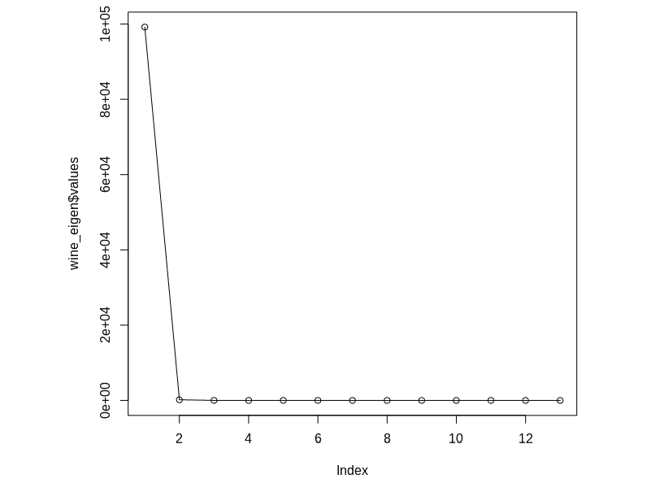

###### 图 4.14：显示协方差矩阵特征值的碎石图

为了决定使用多少维度进行降维，我们可以查看这个碎石图，并选择一个与相对较高的特征值数量相对应的维度数。

我们可以看到，第一个特征值远远是最高的，因此第一个特征向量也是最重要的一个，它告诉我们第一个主成分是最重要的维度。在这种情况下，将数据集简化为一维数据集是非常合适的。

你刚刚对一个协方差矩阵进行了 PCA。

### 活动 10：对新的数据集执行 PCA 和市场篮子分析

在接下来的活动中，你将加载一个新的数据集，然后你将对它执行 PCA 和市场篮子分析。该活动将涵盖这两个程序的所有主要步骤，包括所需的数据准备。我们将使用的数据集来自对马萨诸塞州波士顿周边地区的社区所进行的研究，它包含了许多社区的属性，包括税率、房产价值和当地人口的人口统计信息。

对于这个活动，使用"`Boston`"数据集，可以在 R 中运行以下代码：

```py
library(MASS)
data(Boston)
```

这些步骤将帮助你完成活动：

1.  通过以下方式将所有变量转换为虚拟变量：对于每个变量，创建一个新的变量，如果它等于或高于该变量的中位数，则等于 1，如果它低于该变量的中位数，则等于 0。创建另一个新的变量，它是这个变量的补数：在之前创建的虚拟变量中，每个 0 都是 1，每个 1 都是 0。将所有虚拟变量保存到一个名为`Bostondummy`的新数据集中。

1.  找到原始数据的所有特征向量和特征值

1.  创建该数据的特征值散点图。如何解释这个散点图？

1.  尝试仅使用少数几个主成分来近似此数据。你的近似与原始数据有多接近？

1.  使用你在*步骤 1*中创建的虚拟变量，通过找到值在超过 10%的行中为 1 的所有变量来进行市场篮子分析的第一遍。

1.  通过找到在数据中有超过 10%支持的所有变量的组合来进行市场篮子分析的第二次遍历。

1.  完成市场篮子分析，直到三项篮子。

预期输出：此活动的最重要的输出是数据集的主成分，以及从市场篮子分析中获得的三项规则。主成分在活动的第二步解决方案中获得，当我们创建`Boston_eigen`时，我们可以运行`print(Boston_eigen$vectors)`命令来查看主成分，如下所示：

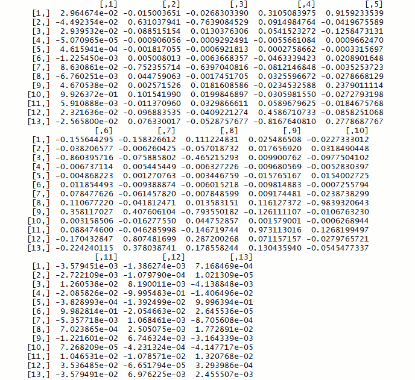

###### 图 4.15：原始数据的主成分

市场篮子分析的三项规则在活动的*步骤 14*的解决方案中获得，当我们运行控制台中的`print(head(thirdpass_conf))`时，我们可以看到最终结果：

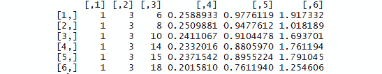

###### 图 4.16：市场篮子分析的三项规则

#### 注意

此活动的解决方案可以在第 222 页找到。

## 摘要

在本章中，我们讨论了数据维度的概念。我们探讨了为什么降低数据的维度可能是有用的，并强调了降维过程可以揭示关于数据潜在结构的重要真相。我们介绍了两种重要的降维方法。我们讨论的第一种方法是市场篮子分析。这种方法对于从复杂数据中生成关联规则很有用，并且可以用于其命名的用例（分析购物篮）或广泛的其它应用（例如分析调查响应的聚类）。我们还讨论了 PCA，这是一种用其维度的线性组合来描述数据的方法。PCA 使用一些线性代数工具很容易执行，并提供了一种简单的方法来近似甚至非常复杂的数据。

在下一章中，我们将探讨不同的数据比较方法。
