# *第六章*

# 异常检测

## 学习目标

到本章结束时，你将能够：

+   使用参数和非参数方法在单变量和多变量数据中寻找异常值

+   使用数据转换来识别单变量和多变量数据中的异常值

+   使用马氏距离工作

+   通过结合季节性模型来提高异常检测性能

在本章中，我们将探讨不同的异常检测技术。

## 简介

数据分析通常隐含地假设所有观测值都是有效、准确和可靠的。但这种情况并不总是合理的假设。考虑信用卡公司的例子，他们收集的数据包括个人信用卡的消费记录。如果他们假设所有消费都是有效的，那么就会给盗贼和欺诈者可乘之机。相反，他们检查他们的交易数据集，寻找异常情况——即偏离一般观察模式的交易。由于欺诈交易没有标记，他们必须使用无监督学习来寻找这些异常情况，以防止犯罪活动。

在许多其他情况下，异常检测都是有用的。例如，制造商可能使用异常检测方法来寻找产品中的缺陷。医学研究人员可能在正常的心跳模式中寻找异常，以诊断疾病。IT 安全专业人员试图在服务器或计算机上找到异常活动，以识别恶意软件。在每种情况下，无监督学习方法都可以帮助区分有效观测值和异常观测值。

本章将介绍几种异常检测技术。我们将首先使用参数和非参数方法来寻找单变量和多变量数据中的异常值。然后，我们将讨论使用数据转换来识别单变量和多变量数据中的异常值。接下来，我们将探讨马氏距离，这是一种用于异常检测的多变量工具。我们将通过讨论使用回归模型来提高异常检测性能，通过结合季节性模型和检测上下文和集体异常来完成本章。

## 单变量异常值检测

在单变量情况下，异常检测是最简单的，也就是说，每个观测值只是一个数字。在这种情况下，我们可能首先通过检查观测值是否缺失、NULL、NA，或者记录为无穷大或其他与观测值类型不匹配的内容来进行常识性检查。完成此检查后，我们可以应用真正的无监督学习。

对于单变量数据，异常检测包括寻找异常值。R 的内置`boxplot`函数使得对异常值进行初步探索性检查变得非常容易，如下面的练习所示。

### 练习 37：使用 R 的 boxplot 函数进行异常值探索性视觉检查

对于单变量数据，异常检测包括寻找异常值。R 的内置箱线图函数使得在本练习中演示的初始探索性异常值检查变得非常简单。我们将使用一个名为`mtcars`的数据集，它是 R 内置的。

在这个练习中，我们将创建一个可以在图 6.3 中看到的箱线图。箱线图是一种重要的单变量图。在这里，围绕 3 的粗水平线表示数据中的中位数。围绕这个中位线的箱子在第一四分位数（25 百分位数）处有下限，在第三四分位数（75 百分位数）处有上限。垂直虚线延伸到所有非异常数据的上下端。这些虚线被称为图的触须，因此这种类型的图有时被称为“箱线和触须”图。最后，在图顶部附近表示为圆形点的两个观察值（至少根据 R 的结果）是异常值。

百分位数也可以称为**分位数**，在本例中我们将使用“分位数”来指代箱线图。分位数是数据中的一个点，它大于所有数据点中的一些固定比例。例如，0.1 分位数是数据中的一个观察值，它大于所有观察值的 10%，而小于其余部分。0.25 分位数也称为 25 百分位数或第一四分位数，它大于数据的 25%，而 75 百分位数或 0.75 分位数大于数据的 75%。当我们取一个观察值并找出它大于多少比例的观察值时，这被称为找到它的分位数。当我们取一个如 0.25 的分位数并试图找到一个与该分位数相对应的观察值时，我们可以称之为取逆分位数。

要使用 R 的`boxplot`函数进行异常值探索性视觉检查，请执行以下步骤：

1.  要加载数据，打开 R 控制台并输入以下命令：

    ```py
    data(mtcars)
    ```

1.  执行以下命令以查看数据集的前六行：

    ```py
    head(mtcars)
    ```

    输出如下：

    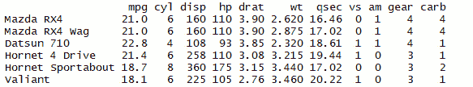

    ###### 图 6.1：mtcars 数据集的前六行

1.  您可以在 R 控制台中执行以下操作来查找有关此数据集的详细信息：

    ```py
    ?mtcars
    ```

    文档如下：

    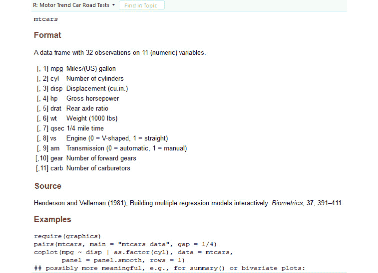

    ###### 图 6.2：输出部分

1.  按以下方式创建汽车重量的箱线图：

    ```py
    boxplot(mtcars$wt) 
    ```

    输出将如下所示：

    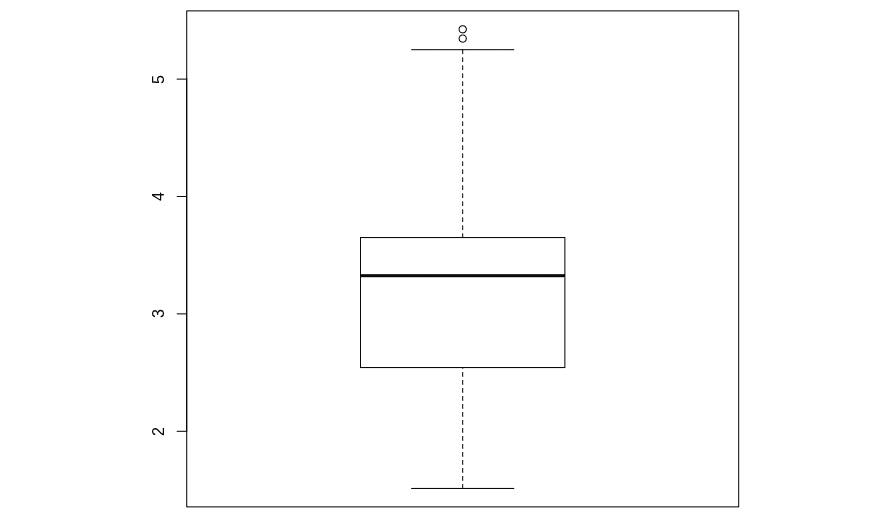

    ###### 图 6.3：表示汽车重量的箱线图

1.  看起来有两个观察值被 R 归类为异常值，它们的值似乎高于 5。请注意，这些重量是以千磅为单位的，所以实际上这些重量高于 5,000 磅。我们可以通过在我们的数据上运行一个简单的过滤器来确定这些观察值：

    ```py
    highest<-mtcars[which(mtcars$wt>5),]
    print(highest)
    ```

    输出如下所示：

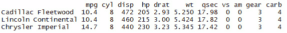

###### 图 6.4：重量超过 5,000 磅的汽车

我们可以看到有三个车型的重量超过 5,000 磅。由于我们只观察到两个异常值，我们得出结论，重量第三高的凯迪拉克 Fleetwood 不是异常值。这留下了其他两个：林肯大陆和克莱斯勒帝国，作为显然具有异常重量的车型。与其他车型相比，这些车型构成了异常。研究人员的一个潜在下一步是调查为什么这些车型似乎具有异常高的汽车重量。

在**第三章**，**概率分布**中，我们讨论了数据集倾向于遵循的不同分布。许多数据集都有所谓的长尾或胖尾，这意味着与平均值相差很大的观测值所占的比例不均衡——不一定是因为它们是异常的异常值，只是因为它们分布的性质。如果我们碰巧正在处理一个遵循胖尾分布的数据集，我们定义异常值的标准应该改变。

在以下练习中，我们将转换一个遵循胖尾分布的数据集，并观察哪些观测值被报告为异常值。

### 练习 38：将胖尾数据集转换为改进异常值分类

在以下练习中，我们将转换一个遵循胖尾分布的数据集，并观察哪些观测值被报告为异常值。我们将使用预加载到 R 中的`rivers`数据集：

1.  按照以下方式加载数据集：

    ```py
    data(rivers)
    ```

1.  执行以下命令以查看数据集的前六个观测值：

    ```py
    head(rivers)
    ```

    输出如下：

    ```py
    [1] 735 320 325 392 524 450
    ```

1.  你可以看到`rivers`数据集是一个向量。你可以通过输入以下内容来了解更多关于它的信息：

    ```py
    ?rivers
    ```

    文档说明如下：

    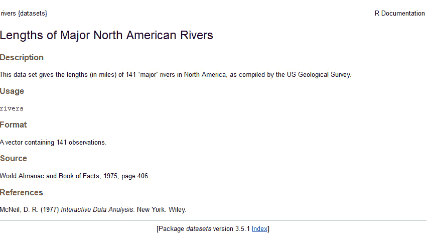

    ###### 图 6.5：河流数据集的信息

1.  观察异常值的分布。首先，尝试通过运行以下命令来绘制河流数据的箱线图：

    ```py
    boxplot(rivers)
    ```

    箱线图看起来是这样的：

    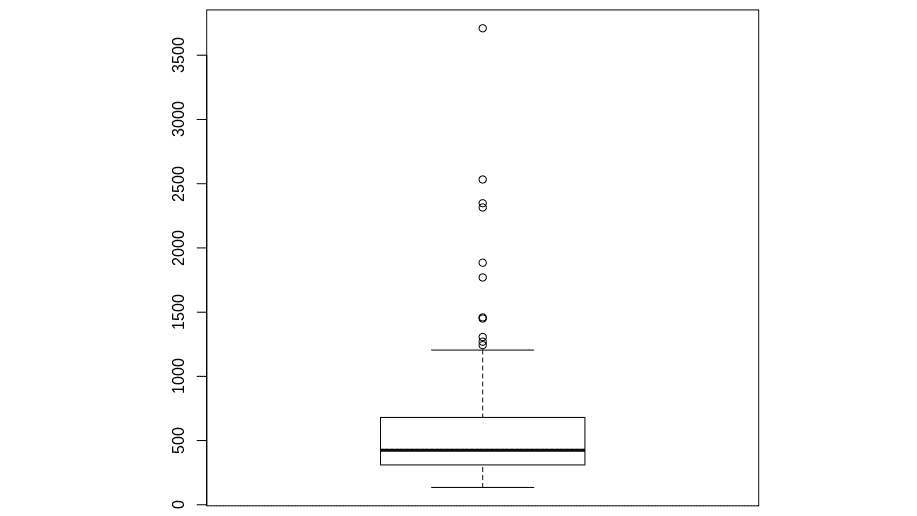

    ###### 图 6.6：河流数据集的箱线图

    你可以看到这个箱线图与之前我们查看的`mtcars`箱线图看起来不同。特别是，箱线和须占据了较小的绘图部分，而大量的绘图由 R 分类为异常值的观测值组成。然而，异常值在任何数据集中都不应该非常多——根据定义，它们应该是稀少的。当我们观察到这样的箱线图，其中包含许多占据绘图大部分的异常值时，我们可以合理地得出结论，我们的分布是胖尾分布。

1.  为了得到更好的异常值分类，对数据进行转换可能有所帮助。许多与自然和自然现象相关的数据集已知遵循对数正态分布。如果我们对每个观测值取对数，得到的分布将是正态分布（因此不是厚尾分布）。要转换数据，可以使用以下命令：

    ```py
    log_rivers<-log(rivers)
    ```

1.  观察转换数据的箱线图。最后，我们可以执行以下命令来查看转换数据的箱线图：

    ```py
    boxplot(log_rivers)
    ```

    箱线图将如下所示：

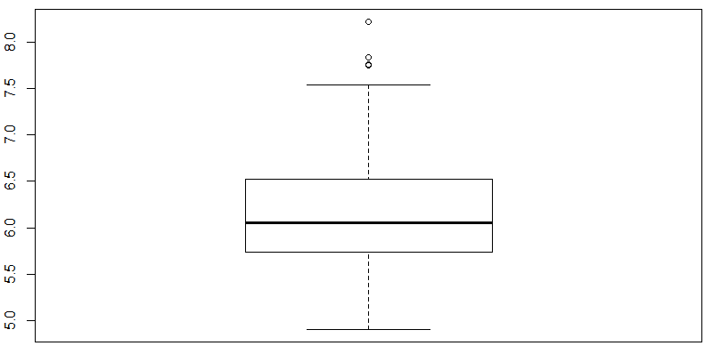

###### 图 6.7：转换数据集的箱线图

如预期，箱线和须线占据了更大的绘图比例，被分类为异常值的观测值更少。在这种情况下，我们可以使用 `log_rivers` 图而不是 `rivers` 图来分类异常值。

之前的练习展示了数据准备在异常检测中的重要性。我们也可以尝试在原始数据集上进行异常检测。但有时，就像我们之前看到的 `rivers` 示例一样，通过进行一些简单的数据准备，我们可以得到不同且更好的结果。需要注意的是，数据有多种可能的转换方式。我们已经使用了对数转换，但还有许多其他可能有效的方法。另一件需要注意的事情是，数据准备既有利也有弊：一些数据准备方法，如平均和数据平滑，可能会导致我们丢弃有价值的信息，从而使我们的异常检测效果降低。

到目前为止，我们一直依赖于 R 的内置异常检测方法，并且我们已经通过简单的箱线图视觉检查来确定哪些观测值是异常值。在下一个练习中，我们将自己确定哪些观测值是异常值，而不使用 R 的内置异常分类。我们将找到数据的分位数——具体来说是 0.25 和 0.75 分位数。

### 练习 39：不使用 R 的内置 boxplot 函数找出异常值

在这个练习中，我们将自己确定哪些观测值是异常值，而不使用 R 的内置异常值分类。我们将找到数据的分位数——具体来说是 .25 和 .75 分位数。我们将再次使用 `rivers` 数据，这是我们之前练习中使用的数据：

1.  通过执行以下命令加载数据：

    ```py
    data(rivers)
    ```

1.  四分位距是第一四分位数（25 百分位数）和第三四分位数（75 百分位数）之间的差值。因此，我们可以通过运行以下命令将四分位距存储在名为 `interquartile_range` 的变量中：

    ```py
    interquartile_range<-unname(quantile(rivers,.75)-quantile(rivers,.25))
    ```

    在这种情况下，我们使用 `unname` 确保将 `interquartile_range` 只是一个数字，而不是 DataFrame、列表或其他数据类型。这将使后续的工作更容易且更可靠。

1.  使用以下命令检查四分位距：

    ```py
    print(interquartile_range)
    ```

    输出如下：

    ```py
    [1] 370
    ```

1.  R 中 boxplot 函数的标准方法是使用 1.5 倍的四分位距作为非异常观察值可以分散的范围的上限。然后非异常值的上限是第三四分位数加 1.5 倍的四分位距，非异常值的下限是第一四分位数减去 1.5 倍的四分位距。我们可以这样计算：

    ```py
    upper_limit<-unname(quantile(rivers,.75)+1.5*interquartile_range)
    lower_limit<-unname(quantile(rivers,.25)-1.5*interquartile_range)
    ```

1.  我们识别出的异常值是那些高于我们的`upper_limit`或低于我们的`lower_limit`的观察值。我们可以这样确定：

    ```py
    rivers[which(rivers>upper_limit | rivers<lower_limit)]
    ```

    这将输出一个我们将其分类为异常值的观察值列表：

    ```py
    [1] 1459 1450 1243 2348 3710 2315 2533 1306 1270 1885 1770
    ```

    #### 注意

    这个练习使用了 R 中 boxplot 函数所使用的方法。但在无监督学习中，关于方法细节的灵活性总是存在的。

1.  另一种寻找异常值的方法是使用前一个练习中的方法，但使用不同的上限和下限值。我们可以通过改变乘以`四分位距`的系数来实现这一点，如下所示：

    ```py
    upper_limit<-unname(quantile(rivers,.75)+3*interquartile_range)
    lower_limit<-unname(quantile(rivers,.25)-3*interquartile_range)
    ```

    我们已经将系数从 1.5 改为 3。这种改变使得我们的方法不太可能将任何特定观察值分类为异常值，因为它增加了上限并降低了下限。

通常，你可以尝试以你认为合理且能导致良好结果的方式创造性地改变无监督学习方法。

前一个练习中的方法是所谓的**非参数**方法。在统计学中，有些方法被称为参数方法，而有些被称为非参数方法。参数方法对数据的潜在分布做出假设，例如，假设数据遵循正态分布。非参数方法旨在摆脱这些约束性假设。前一个练习中的方法仅依赖于分位数，因此它不对数据的分布或与之相关的参数（如均值和方差）做出任何假设。正因为如此，我们称之为非参数方法。相比之下，参数异常检测方法是一种对数据的分布或其参数（如均值和方差）做出假设的方法。请注意，非参数方法和参数方法总是在寻找相同的异常：不存在参数异常或非参数异常，只有参数方法和非参数方法。我们将在下一个练习中讨论参数异常检测方法。

我们将计算一个称为**z 分数**的东西。z 分数是衡量观察值与平均值之间距离的标准测量。每个 z 分数都是以标准差为单位测量的。因此，z 分数为 0 表示观察值与平均值相差 0 个标准差；换句话说，它等于平均值。z 分数为 1 表示观察值比平均值高 1 个标准差。z 分数为-2.5 表示观察值比平均值低 2.5 个标准差。在某些情况下，将距离平均值两个标准差以上的观察值视为异常或异常是惯例。

### 练习 40：使用参数方法检测异常值

在这个练习中，我们将通过寻找 z 分数大于 2 或小于-2 的观察值来调查异常。我们将使用前一个练习中使用的河流数据集：

1.  按如下方式加载数据并确定标准差：

    ```py
    data(rivers)
    standard_deviation<-sd(rivers)
    ```

1.  通过计算每个观察值与平均值相差多少个标准差来确定每个观察值的 z 分数：

    ```py
    z_scores<-(rivers-mean(rivers))/ standard_deviation
    ```

1.  通过选择 z 分数大于 2 或小于-2 的观察值来确定哪些观察值是异常值：

    ```py
    outliers<-rivers[which(z_scores>2 | z_scores<(-2))]
    outliers
    ```

    输出如下：

    ```py
    [1] 2348 3710 2315 2533 1885 1770
    ```

    在这种情况下，我们可以看到有六条河流被归类为异常值——它们的 z 分数都高于 2。在这里，“异常值”这个词可能对这些异常来说过于强烈，因为 2 的 z 分数并不特别巨大。没有严格的规则来定义异常值，是否使用这个术语将取决于具体情况和背景。

**参数异常**检测，如本练习所示，是一种常见做法。然而，其适用性取决于其背后的参数假设是否有效。在这种情况下，我们计算了标准差，并寻找了距离平均值两个标准差以上的异常值。如果数据来自高斯（正态）分布，这种做法是合理的。在这种情况下，一些证据表明河流数据并不来自高斯分布。对于对基础数据分布有疑问的情况，可以使用非参数方法或转换方法（如前几项练习中使用的）可能更合适。

### 多变量异常检测

到目前为止的所有方法都集中在单变量异常值检测。然而，在实践中，这样的数据实际上是罕见的。大多数数据集包含关于数据多个属性的调查。在这些情况下，不清楚如何计算一个点是否是异常值。我们可以对每个单独的维度计算 z 分数，但对于那些在一个维度上 z 分数高而在另一个维度上低，或者在一个维度上相对较大而在另一个维度上平均的观察值，我们应该怎么办？没有简单的答案。在这些情况下，我们可以使用称为**马氏** **距离**的东西来计算 z 分数的多维类似物。马氏距离是 z 分数的多维类似物。这意味着它测量两点之间的距离，但使用特殊的单位，就像 z 分数一样，依赖于数据的方差。在完成以下练习后，我们将更好地理解马氏距离的含义。

### 练习 41：计算马氏距离

在这个练习中，我们将学习一种新的测量方法，它最终将帮助我们找到在考虑身高和体重时，与一般人群相比哪些个体是异常值。这个练习的预期输出将是一个单一数据点的马氏距离，测量它距离数据中心的距离。

#### 注意

对于所有需要导入外部 CSV 文件或图像的练习和活动，请转到**RStudio**-> **会话**-> **设置工作目录**-> **到源文件位置**。您可以在控制台中看到路径已自动设置。

在后续的练习中，我们将计算数据集中所有点的马氏距离。然后，我们可以使用这些测量结果来分类哪些个体在考虑身高和体重时与一般人群相比是异常值：

#### 注意

此数据集来自在线统计计算资源。您可以在[`wiki.stat.ucla.edu/socr/index.php/SOCR_Data_Dinov_020108_HeightsWeights`](http://wiki.stat.ucla.edu/socr/index.php/SOCR_Data_Dinov_020108_HeightsWeights)找到数据集。我们已经下载了文件并将其保存在[`github.com/TrainingByPackt/Applied-Unsupervised-Learning-with-R/tree/master/Lesson06/Exercise41-42/heightsweights.csv`](https://github.com/TrainingByPackt/Applied-Unsupervised-Learning-with-R/tree/master/Lesson06/Exercise41-42/heightsweights.csv)。我们使用了数据的前 200 行。

1.  首先，在 R 中加载此数据。首先，从我们的 GitHub 存储库[`github.com/TrainingByPackt/Applied-Unsupervised-Learning-with-R/tree/master/Lesson06/Exercise41-42/heightsweights.csv`](https://github.com/TrainingByPackt/Applied-Unsupervised-Learning-with-R/tree/master/Lesson06/Exercise41-42/heightsweights.csv)下载它。然后，将其保存在 R 的工作目录中。然后，按照以下方式将其加载到 R 中：

    ```py
    filename<-'heightsweights.csv'
    raw<-read.csv(filename, stringsAsFactors=FALSE)
    ```

1.  我们已经给数据集命名为`raw`。你可以确保列有正确的名称如下：

    ```py
    names(raw)<-c('index','height','weight')
    ```

1.  绘制数据并观察模式：

    ```py
    plot(raw$height,raw$weight)
    ```

    图形如下所示：

    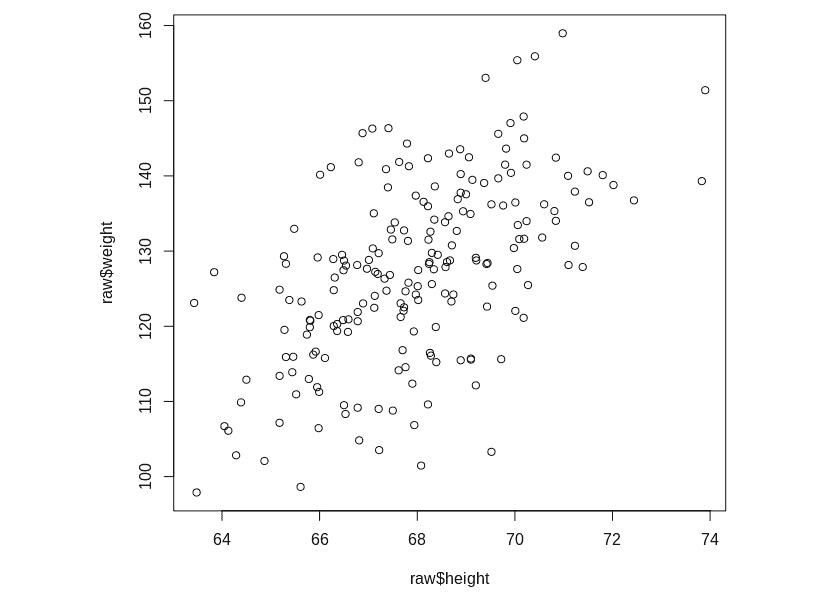

    ###### 图 6.8：身高和体重的图

    我们可以看到，在这个样本中，身高和体重都有很大的变化。请注意，我们的单变量方法在这个数据中不会直接起作用。我们可以计算身高的标准差或四分位数范围，并找到身高的异常值。但身高的异常值不一定是体重的异常值——它们可能是正常体重，或者正好符合体重的预期。同样，体重的异常值可能有完全平均或预期的身高。我们并不立即清楚如何计算“完全异常值”，或者说在某些整体意义上是异常的观测值，考虑到身高和体重两个方面。

1.  接下来，我们将计算多维平均值的等价物，称为`centroid`：

    ```py
    centroid<-c(mean(raw$height),mean(raw$weight))
    ```

1.  计算任何给定点和质心之间的距离。作为一个例子，我们将选择数据集中的第一个观测值：

    ```py
    example_distance<-raw[1,c('height','weight')]-centroid
    ```

1.  计算我们数据中身高和体重协方差矩阵的逆。首先，我们计算身高和体重数据的协方差矩阵：

    ```py
    cov_mat<-cov(raw[,c('height','weight')])
    ```

1.  使用 R 中的`solve`函数计算其逆，该函数用于计算矩阵逆：

    ```py
    inv_cov_mat<-solve(cov_mat)
    ```

1.  计算我们的点和数据集质心之间的马氏距离：

    ```py
    mahalanobis_dist<-t(matrix(as.numeric(example_distance)))%*% matrix(inv_cov_mat,nrow=2) %*% matrix(as.numeric(example_distance))
    ```

    在这个情况下，我们使用 `%*%` 因为它表示矩阵乘法，这正是我们想要执行的，我们同样需要将每个参数转换为一个数值矩阵。

    这个练习的输出是一个马氏距离，它是多维 z 分数的推广：也就是说，它是衡量每个点距离均值多少个标准差的广义度量。在这种情况下，我们找到的马氏距离是 1.71672。马氏距离类似于任何类型的距离测量——0 是最低可能的测量值，数值越高，距离越远。只有质心会有测量的马氏距离为 0。马氏距离的优势在于它们是以一种考虑了每个变量的方差的方式进行标准化的，这使得它们在异常值检测中非常有效。在本章的后面部分，我们将看到如何使用这种类型的测量来找到这个多维数据集中的异常值。

### 在簇中检测异常

在前两章中，我们讨论了不同的聚类方法。我们现在讨论的方法，马氏距离，如果想象我们正在查看的数据是某个特定聚类的数据，就可以在聚类应用中非常有用。例如，在划分聚类中，具有最高马氏距离的点可以被选为从聚类中移除的点。此外，马氏距离的范围可以用来表示任何给定聚类的分散程度。

### 多变量异常值检测的其他方法

对于多变量异常值检测，还有其他方法，包括一些被称为**非参数**的方法。与非参数方法一样，一些先前的练习可能依赖于分位数，换句话说，从大到小排列每个观测值的排名，以分类异常值。一些非参数方法使用此类排名的总和来理解数据的分布。然而，这些方法并不常见，并且在一般情况下并不比马氏距离更有效，因此我们建议在多变量异常值检测中依赖马氏距离。

### 练习 42：基于马氏距离比较分类异常值

在这个练习中，我们将使用马氏距离的比较来分类异常值。这个练习是之前练习的延续，它将依赖于相同的数据库和一些相同的变量。在那个练习中，我们找到了一个数据点的马氏距离；现在我们将为所有数据点找到它。在执行以下练习之前，您应该运行之前练习中的所有代码，并确保您熟悉那里提出的思想：

#### 注意

此数据集来自 UCI 机器学习仓库。您可以在[`wiki.stat.ucla.edu/socr/index.php/SOCR_Data_Dinov_020108_HeightsWeights`](http://wiki.stat.ucla.edu/socr/index.php/SOCR_Data_Dinov_020108_HeightsWeights)找到数据集。我们已经下载了文件，并将其保存在[`github.com/TrainingByPackt/Applied-Unsupervised-Learning-with-R/tree/master/Lesson06/Exercise41-42/heightsweights.csv`](https://github.com/TrainingByPackt/Applied-Unsupervised-Learning-with-R/tree/master/Lesson06/Exercise41-42/heightsweights.csv)。

1.  创建一个`NULL`变量，用于存储我们计算出的每个距离：

    ```py
    all_distances<-NULL
    ```

1.  遍历每个观测值，并计算它与数据质心的马氏距离。此循环中的代码来自之前的练习，我们在那里学习了如何计算马氏距离：

    ```py
    k<-1
    while(k<=nrow(raw)){
    the_distance<-raw[k,c('height','weight')]-centroid
    mahalanobis_dist<-t(matrix(as.numeric(the_distance)))%*% matrix(inv_cov_mat,nrow=2) %*% matrix(as.numeric(the_distance))
    all_distances<-c(all_distances,mahalanobis_dist)
    k<-k+1
    }
    ```

    运行此循环后，我们为数据中的每个点测量了马氏距离。

1.  绘制所有具有特别高 Mahalanobis 距离的观测值。在这种情况下，我们将特别高定义为 Mahalanobis 距离的最高 10%。这意味着所有高于 Mahalanobis 距离的 0.9 分位数（我们将在以下代码中选择）的 Mahalanobis 距离：

    ```py
    plot(raw$height,raw$weight)
    points(raw$height[which(all_distances>quantile(all_distances,.9))],raw$weight[which(all_distances>quantile(all_distances,.9))],col='red',pch=19)
    ```

    输出如下：

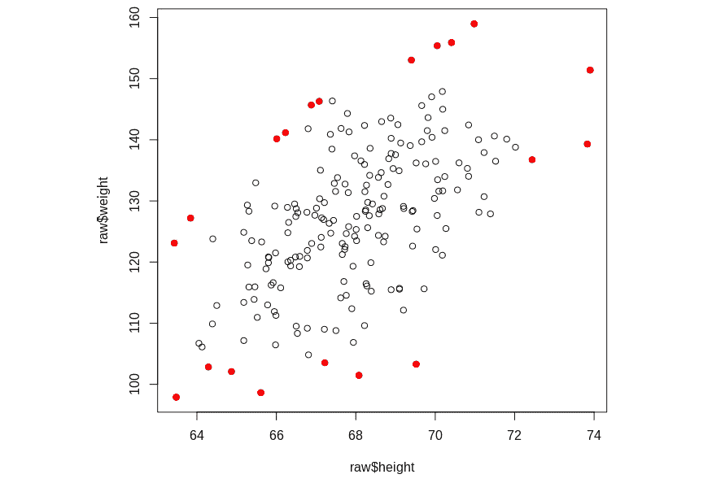

###### 图 6.9：具有高 Mahalanobis 距离的观测值

此图显示了 Mahalanobis 距离最高的 10% 的每个点的实心红色点。我们可以看到，其中一些在身高和体重方面似乎都是异常值，并且可以通过执行我们的单变量异常检测方法来观察到。然而，图表上许多红色点既不是身高的单变量异常，也不是体重的单变量异常。它们只是相对于整个点云的异常，而 Mahalanobis 距离使我们能够量化并检测这一点。

### 在季节性数据中检测异常

到目前为止，我们只讨论了异常检测作为一种检测异常的方法。然而，异常检测不仅仅包括异常检测。一些异常不容易被检测为原始异常。接下来，我们将查看季节性、趋势性数据。在这类数据中，我们希望找到在季节性趋势或周期背景下发生的异常。

我们将使用 R 中的 `expsmooth` 包的数据。

我们将使用的数据记录了 1985 年至 2005 年间澳大利亚每月游客数量，以千人计。

在以下练习中，我们将处理具有**时间趋势**的数据。通过时间趋势，我们指的是随着时间的推移，观测值倾向于增加或减少（在这种情况下，它们倾向于增加）。为了检测异常，我们想要做的是**去趋势**。去趋势数据意味着尽可能去除其时间趋势，以便我们可以找到每个观测值与预期值的偏差程度。

### 练习 43：执行季节性建模

在这个练习中，我们将尝试对数据进行建模，以确定我们应该将哪些视为数据的预期值，哪些视为与预期值的偏差。预期的输出是一组误差值，我们将在未来的练习中使用这些误差值来分类异常——误差最大的观测值将被分类为数据集的异常：

1.  首先，通过执行以下命令将此数据加载到 R 中：

    ```py
    install.packages("expsmooth")
    library(expsmooth)
    data(visitors)
    plot(visitors)
    ```

    输出如下：

    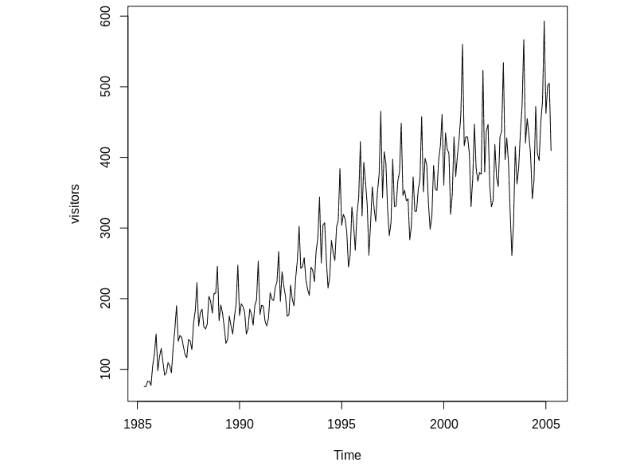

    ###### 图 6.10：1985 年至 2005 年间澳大利亚每月游客数量的图表

1.  按以下方式检查数据的第一个六个观测值：

    ```py
    head(visitors)
    ```

    输出如下：

    ```py
           May   Jun   Jul   Aug   Sep   Oct
    1985  75.7  75.4  83.1  82.9  77.3 105.7
    ```

    按以下方式检查最后六个观测值：

    ```py
    tail(visitors)
    ```

    输出如下：

    ```py
           Jan   Feb   Mar   Apr May Jun Jul Aug Sep Oct   Nov   Dec
    2004                                                 479.9 593.1
    2005 462.4 501.6 504.7 409.5                                    
    ```

1.  由于日期可能难以处理，我们可以分配一个数值变量来跟踪日期的顺序。我们将把这个变量称为 `period` 并定义如下：

    ```py
    period<-1:length(visitors)
    ```

1.  将`visitors`数据与刚刚创建的`period`变量结合，将它们都放入一个名为`raw`的 DataFrame 中：

    ```py
    raw<-data.frame(cbind(visitors,period))
    ```

1.  这一步在技术上属于监督学习，而不是无监督学习。在这种情况下，我们将使用监督学习，但仅作为进行无监督学习过程中的一个中间步骤。为了找到数据中的时间趋势，我们可以运行一个线性回归，将销售额与数值时间周期相关联，如下所示：

    ```py
    timetrend<-lm(visitors~period+I(log(period)),data=raw)
    ```

1.  接下来，我们可以获得这个时间趋势的拟合值，并将它们作为`raw` DataFrame 的一部分存储：

    ```py
    raw$timetrend<-predict(timetrend,raw)
    ```

1.  去趋势的过程意味着我们从第 6 步中找到的预测趋势中减去。我们这样做的原因是我们想找到数据中的异常值。如果我们保留数据中的趋势，看起来像异常的东西实际上可能是趋势的预期结果。通过从数据中去除趋势，我们可以确保观察到的异常不是趋势的结果。我们可以按照以下方式完成去趋势：

    ```py
    raw$withouttimetrend<-raw$visitors-raw$timetrend
    ```

1.  我们可以绘制去趋势数据的一个简单图表如下：

    ```py
    plot(raw$withouttimetrend,type='o')
    ```

    绘图如下：

    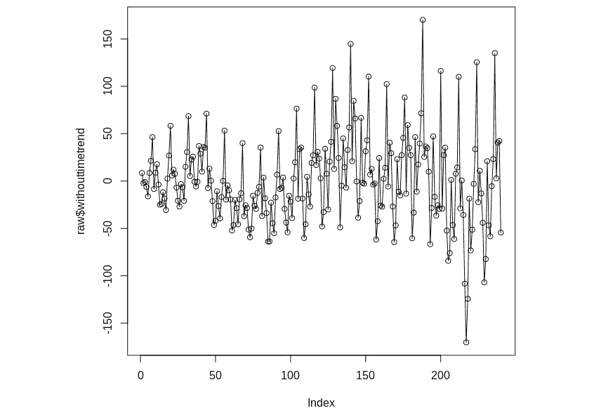

    ###### 图 6.11：去趋势数据的绘图

    在这个图表中，你应该注意到数据中没有明显的从左到右的趋势，这表明我们已经成功地去除了趋势。

    我们的数据记录了澳大利亚每月的访客数量。澳大利亚的季节温度和天气有变化，因此合理地假设游客访问量可能会根据特定月份的天气是否宜人而增加或减少。甚至可能存在与季节和全年天气变化相关的商务或外交访问澳大利亚的变化。因此，合理地假设澳大利亚的访问量存在年度模式。我们的下一步将是将这些年度模式从我们的数据中去除。

1.  首先，我们创建一个矩阵，其中每一列包含关于一年中不同月份的去趋势访客数据：

    ```py
    seasonsmatrix = t(matrix(data = raw$withouttimetrend, nrow = 12))
    ```

1.  计算每一列的平均值，以得到该特定月份去趋势访客的平均值：

    ```py
    seasons = colMeans(seasonsmatrix, na.rm = T)
    ```

1.  这给我们一个包含 12 个值的向量——每年一个月。由于我们有 20 年的数据，我们将这个向量重复 20 次：

    ```py
    raw$seasons<-c(rep(seasons,20))
    ```

1.  最后，我们可以获得去趋势、去周期的数据，我们将它命名为`error`，因为在移除了数据中的时间趋势和年度周期后，随机误差是唯一剩下的东西：

    ```py
    raw$error<-raw$visitors-raw$timetrend-raw$seasons
    ```

1.  我们可以绘制这个图表来查看其外观：

    ```py
    plot(raw$error,type='o')
    ```

    绘图如下：

    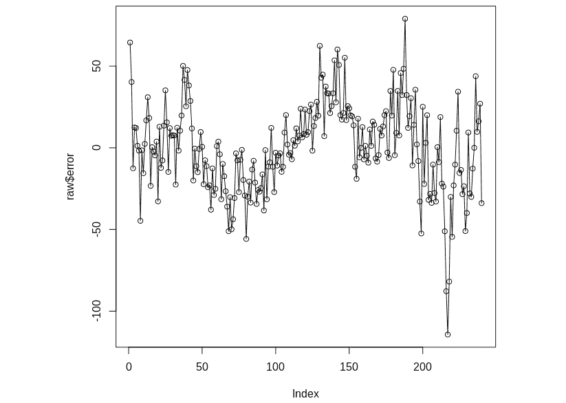

    ###### 图 6.12：去趋势数据的绘图

1.  将季节性建模的所有元素一起绘制。最后，我们可以展示我们从季节性数据中分离出的所有元素：时间趋势、年度周期和随机误差：

    ```py
    par(mfrow=c(3,1))
    plot(raw$timetrend,type='o')
    plot(raw$seasons,type='o')
    plot(raw$error,type='o')
    ```

    输出如下：

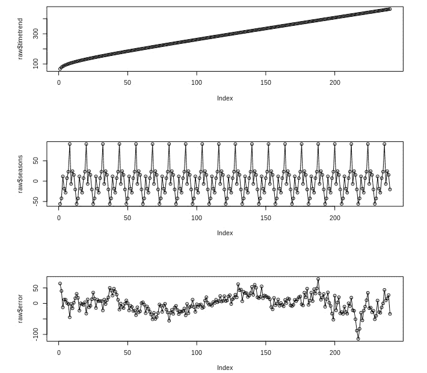

###### 图 6.13：季节性建模元素的绘图

图 6.13 中一起显示的三个图显示了原始数据的分解。第一个图显示了时间趋势，换句话说，就是数据中观察到的整体模式，即每个月的访问量往往比上个月多。当然，这是对数据的过度简化，因为也存在季节性模式：某些月份的访问量往往比其他月份多或少，无论整体趋势如何。第二个图显示了这些季节性模式，这些模式每年都以相同的方式重复。最后，第三个图显示了误差，这是数据中未被整体时间趋势或每年内的季节性模式捕获的所有变化。如果你将这三个图中呈现的所有数据相加，你将恢复原始数据集。但在这些三个图中，我们可以看到这些元素被分解，这种分解使我们更好地理解了时间趋势、季节性和误差如何相互作用，从而构成观察到的数据。

这个练习使我们能够创建一个名为 `error` 的变量，并将其添加到原始数据框中。现在我们已经创建了误差向量，我们可以使用标准的异常检测来在数据框中找到异常。

### 练习 44：使用参数方法在季节性数据中寻找异常

在这个练习中，我们将通过寻找与预期值的最大偏差来进行异常检测：

1.  计算前一个练习中计算出的误差数据的标准差：

    ```py
    stdev<-sd(raw$error)
    ```

1.  找出哪些数据点距离平均值超过两个标准差：

    ```py
    high_outliers<-which(raw$error>(mean(raw$error)+2*sd(raw$error)))
    low_outliers<-which(raw$error<(mean(raw$error)-2*sd(raw$error)))
    ```

1.  检查我们已分类为异常的观察结果：

    ```py
    raw[high_outliers,]
    ```

    输出如下：

    ```py
        visitors period timetrend withouttimetrend   seasons    error
    1       75.7      1  67.18931         8.510688 -55.94655 64.45724
    130    392.7    130 305.93840        86.761602  24.35847 62.40313
    142    408.0    142 323.44067        84.559332  24.35847 60.20086
    147    397.4    147 330.70509        66.694909  11.55558 55.13933
    188    559.9    188 389.78579       170.114205  91.11673 78.99748
    ```

    低异常被分类如下：

    ```py
    raw[low_outliers,]
    ```

    输出如下：

    ```py
        visitors period timetrend withouttimetrend   seasons      error
    80     266.8     80  231.4934         35.30663  91.11673  -55.81010
    216    321.5    216  429.7569       -108.25691 -20.46137  -87.79553
    217    260.9    217  431.1801       -170.28007 -55.94655 -114.33352
    218    308.3    218  432.6029       -124.30295 -42.40371  -81.8992
    ```

1.  我们可以如下绘制这些点：

    ```py
    plot(raw$period,raw$visitors,type='o')
    points(raw$period[high_outliers],raw$visitors[high_outliers],pch=19,col='red')
    points(raw$period[low_outliers],raw$visitors[low_outliers],pch=19,col='blue')
    ```

    图形如下所示：

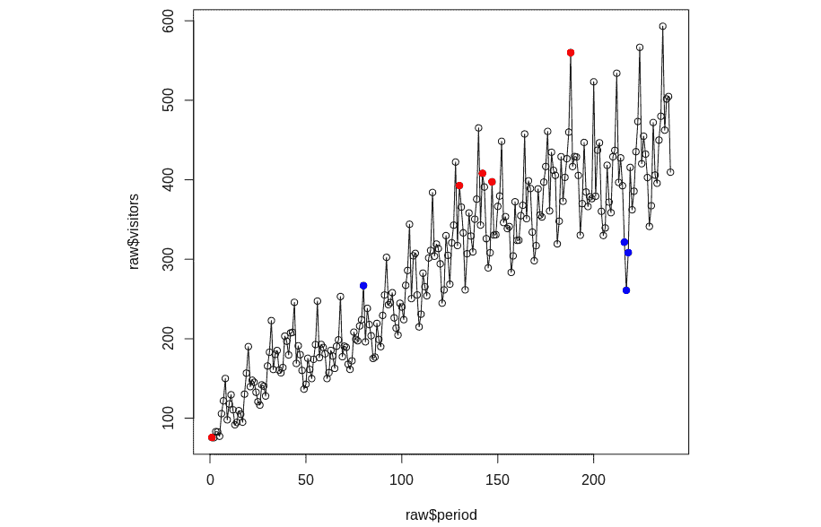

###### 图 6.14：被分类为异常的数据的图形

该图显示了所有我们的数据和我们已经分类为异常的点，高异常用红色表示，低异常用蓝色表示。你应该注意，并非所有这些点都立即明显是异常值。我们只是在之前进行的季节性建模练习中，确定了异常偏离的预期值后，才将它们识别为异常。

接下来，我们将介绍两种更多类型的异常：上下文异常和集体异常。为了介绍这些概念，我们将生成一个包含上下文和集体异常的人工数据集。

### 上下文和集体异常

在图 6.15 中大约 x=1 的位置，你可以看到一个与邻居相当远的单独点。这是一个**上下文异常**的例子，我们将首先讨论这意味着什么以及如何检测这些类型的异常。在大约 x=3.6 的位置，你可以看到一个 y 值平坦的区域，每个值都等于 0。在这个数据中，零值并不异常，但这么多零值放在一起就是异常。因此，这些数据被称作**集体异常**。

我们将首先考虑上下文异常。上下文异常是指仅因为其邻居而被认为是异常的观测值。在我们刚刚生成的数据集中，有一个点在 x=1 处，y=0。然而，x=0.99 和 x=1.01 处的 y 值接近 0.84，在这个上下文中与 0 相差甚远。上下文异常可以通过找到与邻居距离异常的观测值来检测，正如我们将在以下练习中看到的那样。

### 练习 45：检测上下文异常

以下练习展示了如何检测我们刚刚介绍的数据集中的上下文异常。由于上下文异常是与邻居非常不同的观测值，我们需要对每个观测值与其邻居进行显式比较。为了做到这一点，我们计算第一差分。第一差分简单地是观测值的值减去其前一个观测值的值。

本练习的预期结果将是数据集中那些具有上下文异常的观测值：

1.  我们将生成一个包含上下文和集体异常的人工数据集。该数据集可以通过在 R 控制台中运行以下代码生成：

    ```py
    x<-1:round(2*pi*100+100)/100
    y<-rep(0,round(2*pi*100)+100)
    y[1:314]<-sin(x[1:314])
    y[415:728]<-sin(x[315:628])
    y[100]<-0
    ```

1.  你可以通过以下方式绘制`x`和`y`来查看这些数据的外观：

    ```py
    plot(x,y,type='o')
    ```

    输出如下：

    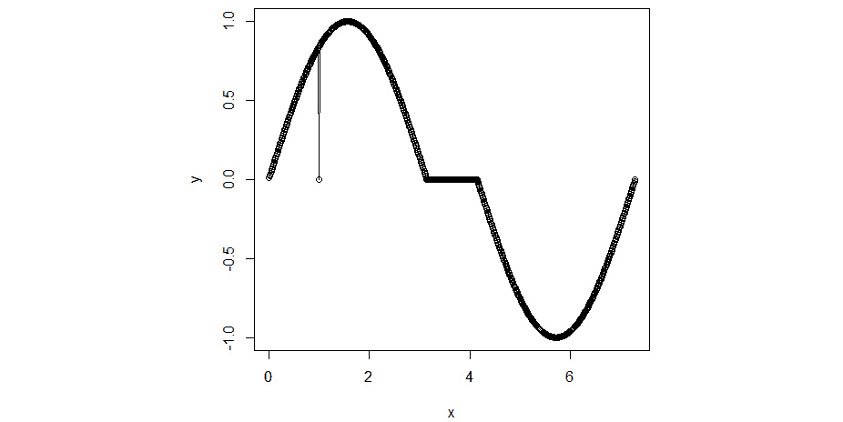

    ###### 图 6.15：生成数据集的绘图

    此图显示了一个正弦曲线：一种从 0 开始，向上和向下轻轻倾斜，最终再次回到 0 的简单曲线。这些数据是人工生成的；然而，我们可以想象它代表了温度的观测值：在某些月份较低，在某些月份上升较高，在某些月份较高，在其他月份下降。温度和天气数据通常遵循可以用正弦或余弦等三角曲线建模的规律。我们已经修改了我们的正弦曲线，使其包含一些异常数据。

1.  同时为每个观测值找到第一差分如下：

    ```py
    difference_y<-y[2:length(y)]-y[1:(length(y)-1)]
    ```

1.  创建第一差分数据的箱线图：

    ```py
    boxplot(difference_y)
    ```

    结果箱线图如下所示：

    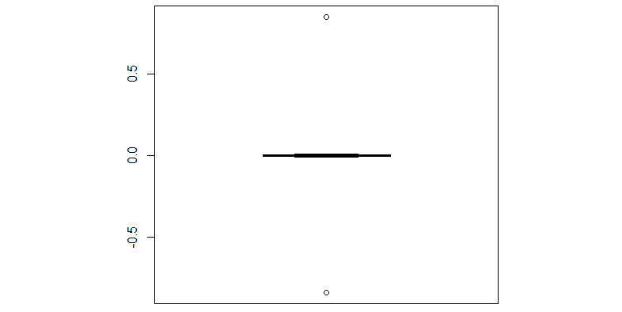

    ###### 图 6.16：第一差分数据的箱线图

    此箱线图显示，几乎所有第一差分都非常接近零，而两个异常差分则远离其他数据。我们可以从第一差分箱线图中看到，单个高异常值大于 0.5。

    你可能会注意到图 6.16 中有两个明显的异常值，但在图 6.15 中只有一个明显的异常值。这是因为图 6.16 显示的是一阶差分数据，数据中的单个异常值导致了两个大的第一阶差异：第 99 个和第 100 个值之间的差异，以及第 100 个和第 101 个值之间的差异。原始数据中的一个异常观察值导致了一阶差分数据中的两个异常观察值。

1.  使用 R 的有用 `which` 函数确定哪个观察值对应于这个异常值：

    ```py
    which(difference_y>0.5)
    ```

    `which` 返回值为 100，表示它是第 100 个观察值，是一个上下文异常。如果我们检查，`y[100]` 等于 0，而其邻居不是，所以我们已经成功找到了上下文异常。

接下来，我们将讨论集体异常。在我们的 x-y 图中，我们指出了在 x=3.64 处所有观察值都等于 0 的 100 个观察点。在这个数据集中，0 值本身并不是异常，但是有 100 个观察值都等于 0 则是异常的。这里 100 个零值一起被称为集体异常。集体异常比上下文异常更难检测，但我们将尝试在下面的练习中检测它们。

### 练习 46：检测集体异常

在接下来的练习中，我们将检测我们之前创建的数据集中的集体异常。这个练习的预期结果是构成集体异常的观察值列表：

1.  为了检测这种异常，我们需要寻找包含没有变化或只有微小变化的观察值组或邻域。以下循环实现了这一点。它创建了一个向量，该向量由两个差异的最大值组成：一个观察值与其 50 个周期前的观察值之间的差异，以及一个观察值与其 50 个周期后的观察值之间的差异。如果这些差异中的最大值是零或非常小，那么我们就检测到了一个极端平坦的邻域，这是这种集体异常的迹象。以下是我们将使用的循环：

    ```py
    changes<-NULL
    ks<-NULL
    k<-51
    while(k<(length(y)-50)){
    changes<-c(changes,max(abs(y[k-50]),abs(y[k+50])))
    ks<-c(ks,k)
    k<-k+1
    }
    ```

    这个循环创建了一个名为 `changes` 的向量。这个向量的每个元素都测量了一个观察值与其邻居之间观察到的最大差异，距离为 50 个观察点。`changes` 向量中特别小的值将表明我们可能有一个由平坦邻域组成的集体异常。

1.  现在我们有一个测量邻域变化的向量，我们可以创建一个简单的箱线图，就像我们在之前的练习中所做的那样：

    ```py
    boxplot(changes)
    ```

    输出如下：

    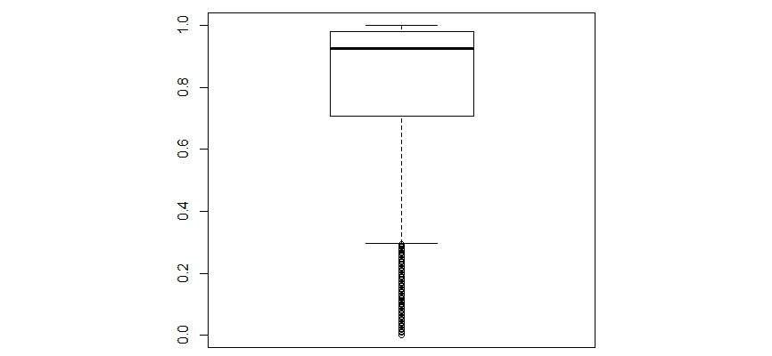

    ###### 图 6.17：邻域变化的箱线图

    我们可以看到有很多被分类为异常值的观察值，这表明存在非常低的邻域变化。

1.  我们可以按照以下方式找到导致这种集体异常的观察值：

    ```py
    print(ks[which(changes==min(changes))])
    ```

    输出为 364。

1.  我们可以通过检查该索引处的 y 值来验证这是对应于集体异常的索引：

    ```py
    print(y[ks[which(changes==min(changes))]])
    ```

    因此，y 的值为 0，这是集体异常处的 y 值，这为我们找到了正确的点提供了证据。

## 核密度

为了结束本章，我们将讨论如何使用核密度估计在一系列血液样本上执行异常值检测。**核密度**估计提供了一种自然的方式来测试特定的血液检测结果是否异常，即使没有特定血液测试或医学的一般专业知识。

假设你在一个诊所工作，你的老板要求你对患者进行一种新的血液测试。你的老板想知道是否有任何患者的测试结果异常。然而，你对这种新的血液测试不熟悉，也不知道正常和异常结果应该是什么样子。你所拥有的只是老板向你保证来自正常患者的先前血液测试记录。假设这些测试的结果如下：

```py
normal_results<-c(100,95,106,92,109,190,210,201,198)
```

现在假设你的老板要求你找出以下新血液测试结果中的异常值（如果有的话）：

```py
new_results<-c(98,35,270,140,200)
```

在核密度估计中，我们使用一组核来建模数据集。对于我们的目的，核将只是具有不同均值和方差的正态分布。你可以在*第三章*，*概率分布*中了解更多关于正态分布的信息。我们将假设我们的数据具有由正态分布之和捕获的密度。然后，任何看起来与我们指定的正态分布之和不一致的数据都可以被分类为异常。

当我们计算核密度时，我们必须指定一个叫做**带宽**的东西。在这里，带宽将是我们用来建模数据的正态分布的方差的度量。如果我们指定一个高的带宽，我们假设数据广泛分散，如果我们指定一个低的带宽，我们假设数据主要包含在一个相对较窄的范围内。随着你完成以下练习，这应该会变得更加清晰。

### 练习 47：使用核密度估计寻找异常值

在这个练习中，我们将介绍如何使用核密度估计寻找异常值。这个练习的预期输出是按照核密度估计方法构成异常的一组观测值列表：

1.  指定我们的数据和参数。对于我们的数据，我们将使用之前指定的`正常结果`和`新结果`：

    ```py
    normal_results<-c(100,95,106,92,109,190,210,201,198)
    new_results<-c(98,35,270,140,200)
    ```

1.  核密度估计依赖于一个称为`带宽`的参数。因此，我们将从 25 开始。带宽的选择将取决于您的个人偏好以及原始数据。如果您不确定，可以选择一个与您数据的标准差大致相同的带宽。在这种情况下，我们将选择 25，这低于我们数据的标准差。您可以如下设置带宽为 25：

    ```py
    bandwidth<-25
    ```

    #### 注意

    如果您喜欢，可以自由地尝试其他带宽值。

1.  使用 R 的`density`函数来获得核密度估计：

    ```py
    our_estimate<-density(normal_results, bw=bandwidth)
    ```

1.  绘制密度估计：

    ```py
    plot(our_estimate)
    ```

    生成的图表如下所示：

    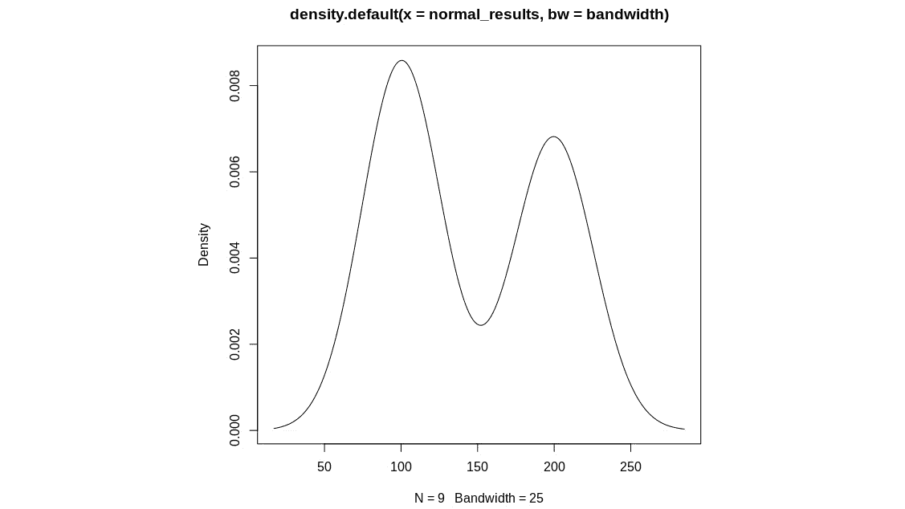

    ###### 图 6.18：密度估计图

1.  图 6.18 中的图形形状代表我们原始数据的分布。您可以在*第三章*，*概率分布*中了解更多关于概率分布的信息。这个分布被称为`双峰分布`，这意味着数据似乎主要围绕两个点聚集：大多数观察值接近 100 或 200。如果观察值在图 6.18 所示的分布中的对应点显示它特别不可能，我们将将其解释为异常。

1.  我们可以为我们的每个新结果获得密度估计。对于`new_results`中的每个观察，我们将根据图 6.18 中展示的核来计算密度估计。我们将按照以下方式将这些密度估计存储在新变量中：

    ```py
    new_density_1<-density(normal_results,bw=25,n=1,from=new_results[1],to=new_results[1])$y
    new_density_2<-density(normal_results,bw=25,n=1,from=new_results[2],to=new_results[2])$y
    new_density_3<-density(normal_results,bw=25,n=1,from=new_results[3],to=new_results[3])$y
    new_density_4<-density(normal_results,bw=25,n=1,from=new_results[4],to=new_results[4])$y
    new_density_5<-density(normal_results,bw=25,n=1,from=new_results[5],to=new_results[5])$y
    ```

    输出将是图表上从*步骤 3*对应于`new_results`向量中指定的每个 x 值的的高度。我们可以通过打印来观察这些值。按照以下方式打印`new_density_1`：

    ```py
    print(new_density_1)
    ```

    输出如下：

    ```py
    [1] 0.00854745
    ```

    按照以下方式打印`new_density_2`：

    ```py
    print(new_density_2)
    ```

    输出如下：

    ```py
    [1] 0.0003474778
    ```

    按照以下方式打印`new_density_3`：

    ```py
    print(new_density_3)
    ```

    输出如下：

    ```py
    [1] 0.0001787185
    ```

    按照以下方式打印`new_density_4`：

    ```py
    print(new_density_4)
    ```

    输出如下：

    ```py
    [1] 0.003143966
    ```

    按照以下方式打印`new_density_5`：

    ```py
    print(new_density_5)
    ```

    输出如下：

    ```py
    [1] 0.006817359
    ```

1.  我们可以将这些点绘制在我们的密度图上如下：

    ```py
    plot(our_estimate)
    points(new_results[1],new_density_1,col='red',pch=19)
    points(new_results[2],new_density_2,col='red',pch=19)
    points(new_results[3],new_density_3,col='red',pch=19)
    points(new_results[4],new_density_4,col='red',pch=19)
    points(new_results[5],new_density_5,col='red',pch=19)
    ```

1.  执行这些命令的结果如下所示：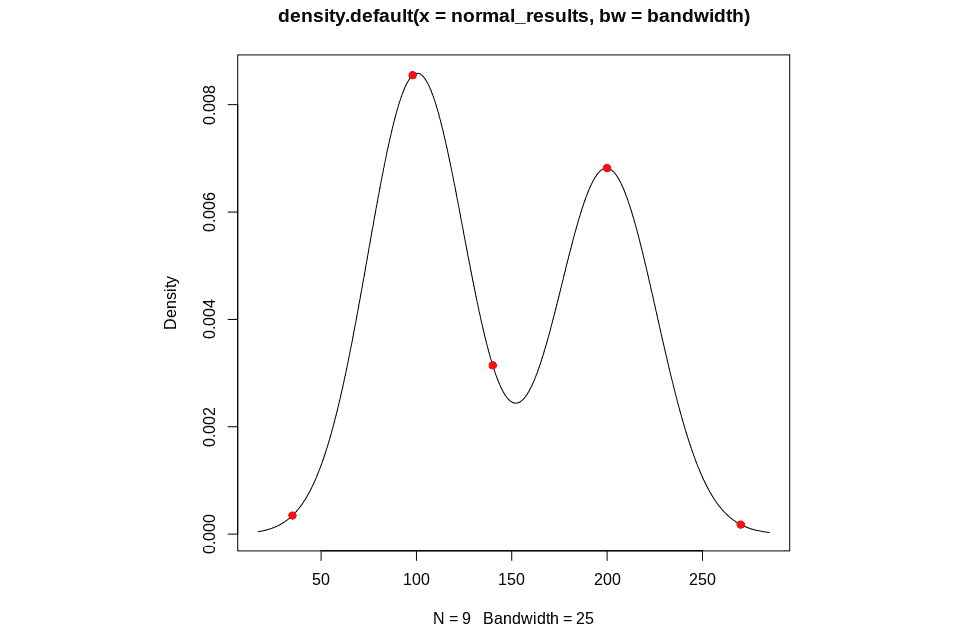

    ###### 图 6.19：密度图上的点映射

    这显示了之前我们检查过的相同密度图，增加了五个点——每个新结果对应一个，我们正在检查这些新结果以寻找异常值。每个点都显示了每个特定观察的相对可能性：具有更高估计密度值的点更有可能被观察到，而具有较低估计密度值的点不太可能被观察到，因此更有可能是异常值。关于哪些观察是异常值，哪些不是，没有严格的规则，但一般来说，估计密度值最接近零的观察最可能是异常值。

1.  解释结果以分类异常。

    每个密度值看起来都相当接近零。然而，有些比其他更接近零。在这种情况下，密度估计值越接近零，我们越有信心认为观察结果是异常的。在这种情况下，我们将选择一个阈值值，并说那些核密度估计值低于阈值的血液检测结果是异常的，而那些核密度估计值高于阈值的检测结果不是异常的。看起来 0.001 是一个合理的阈值，因为它将高密度值与最低密度值分开——密度值低于 0.001 的观察结果在*步骤 6*所示的图表中看起来非常不可能。因此，我们将血液检测结果 35 和 270 归类为异常结果，而其他所有结果都视为合理，因为我们看到在步骤 4 中，35 和 270 对应的是低于 0.001 的密度估计值。

    因此，我们练习的最终结论是血液检测结果 35 和 270 是异常的，而其他所有血液检测结果都是合理的。

### 继续学习异常检测

如果你继续学习异常检测，你会发现有大量的不同异常检测技术。然而，所有这些技术都遵循我们在季节性建模示例中看到的基本模式。具体来说，高级异常检测通常包括以下内容：

+   指定预期的模型

+   计算基于模型预期的值与观察到的值之间的差异——这被称为误差

+   使用单变量异常值检测对误差向量进行检测以确定异常

最大的困难在于第一步：指定一个有用的预期模型。在这种情况下，我们指定了一个季节性模型。在其他情况下，将需要指定考虑多维图像数据、音频记录、复杂的经济指标或其他复杂属性的模型。为这些情况设置模型的方法将需要研究数据来源的特定领域。然而，在每种情况下，异常检测都将遵循前面列出的三个步骤的要点模式。

### 活动十四：使用参数方法和非参数方法寻找单变量异常

活动的目的是使用参数方法来寻找单变量异常。为此活动，我们将使用 R 中内置的数据集，称为`islands`。如果你在 R 中执行`?islands`，你可以找到这个数据集的文档。在这个文档中，你可以注意到这个数据集包含了地球上面积超过 10,000 平方英里的陆地面积。

这可能是一个对研究地球陆地形成过程的地质学家感兴趣的数据集。根据科学家的说法，岛屿可以通过多种方式形成：有时是通过火山活动，有时是通过珊瑚生长，有时是通过其他方式。地质学家可能对寻找异常大或小的岛屿感兴趣——这些岛屿可能是进行进一步研究以尝试理解岛屿自然形成过程的最佳地点。在这个活动中，我们将寻找`islands`数据集中的异常值。

这些步骤将帮助您完成活动：

1.  在 R 的内置数据集中加载名为`islands`的数据，并创建该数据的箱线图。您注意到数据分布和异常值有什么特点？

1.  对`islands`数据进行对数变换，并创建变换后数据的箱线图。这如何改变了被分类为异常值的数据点？

1.  使用非参数方法（该方法将异常值定义为位于第一四分位数和第三四分位数以上或以下 1.5 倍四分位距的点）手动计算`islands`数据集中的异常值。对`islands`数据的对数变换也进行同样的操作。

1.  使用参数方法通过计算数据的均值和标准差来对`islands`数据集中的异常值进行分类，将异常值分类为距离均值超过两个标准差的观测值。对`islands`数据的对数变换也进行同样的操作。

1.  比较这些异常值检测方法的结果。

    #### 注意

    本活动的解决方案可在第 234 页找到。

### 活动十五：使用马氏距离寻找异常值

在接下来的活动中，我们将检查与汽车速度和停车距离相关的数据。这些数据可能对试图研究哪些汽车表现最佳的汽车工程师有所帮助。那些相对于其速度具有特别低停车距离的汽车可以用作高性能汽车的例子，而那些相对于其速度具有异常高停车距离的汽车可能是进一步研究以寻找改进领域的候选者。在这个活动中，我们将基于速度和停车距离来寻找异常值。因为我们正在处理多变量数据，所以使用马氏距离来寻找异常值是有意义的。

这些步骤将帮助您完成这项活动：

1.  从 R 的内置数据集中加载`cars`数据集。这个数据集包含一些非常古老的汽车的速度以及在该速度下所需的停车距离。绘制数据图表。

1.  计算这些数据的质心，并计算每个点与质心之间的马氏距离。找出异常值（与质心的马氏距离最高的点）。绘制一个显示所有观测值和异常值的图表。

    图表将如下所示：

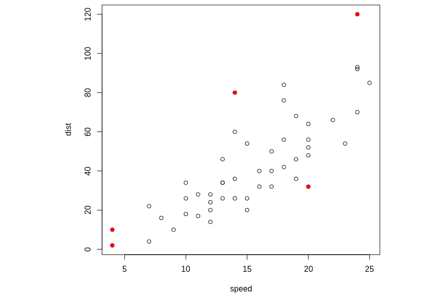

###### 图 6.20：标记了异常值的图表

#### 注意

本活动的解决方案在第 237 页。

## 摘要

在本章中，我们讨论了异常检测。我们首先介绍了单变量异常检测，包括非参数和参数方法。我们讨论了进行数据转换以获得更好的异常分类。然后，我们讨论了使用马氏距离的多变量异常检测。我们完成了更多高级练习，以分类与季节性变化数据相关的异常。我们讨论了集体和上下文异常，并在本章结束时讨论了如何在异常检测中使用核密度估计。
