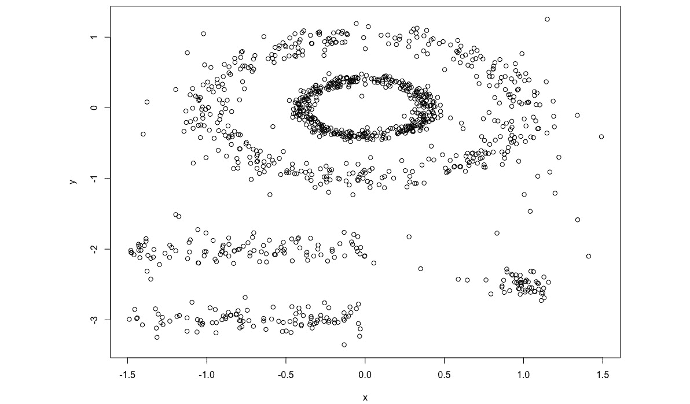
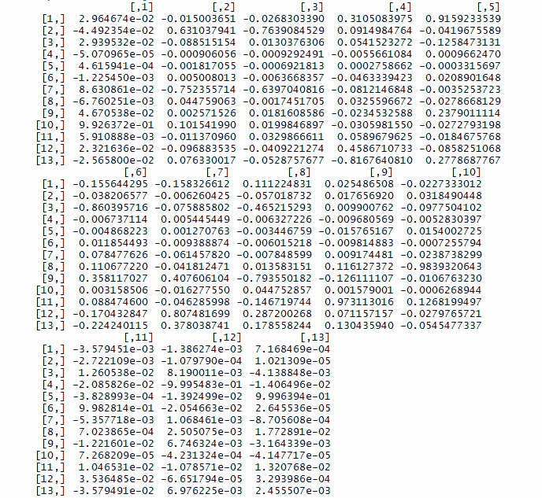
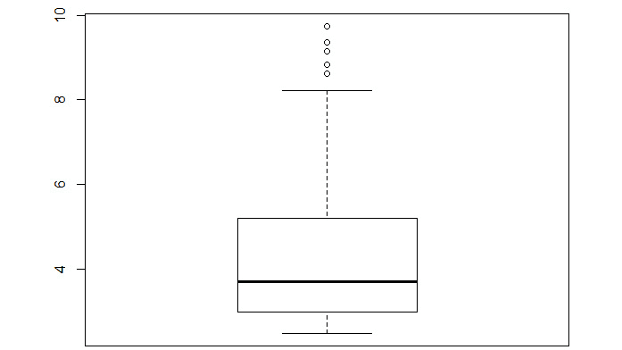

# *附录*

## 关于

本节包含的内容旨在帮助学生完成书中的活动。它包括学生为实现活动目标需要执行的详细步骤。

## 第一章：聚类方法简介

### 活动一：具有三个聚类的 k-means 聚类

解答：

1.  在 `iris_data` 变量中加载 Iris 数据集：

    ```py
    iris_data<-iris
    ```

1.  创建一个 `t_color` 列并将其默认值设为 `red`。将两种物种的值改为 `green` 和 `blue`，这样第三个就保持为 `red`：

    ```py
    iris_data$t_color='red'
    iris_data$t_color[which(iris_data$Species=='setosa')]<-'green'
    iris_data$t_color[which(iris_data$Species=='virginica')]<-'blue'
    ```

    #### 注意

    在这里，我们只更改那些物种为 `setosa` 或 `virginica` 的值的 `color` 列）

1.  选择任意三个随机的聚类中心：

    ```py
    k1<-c(7,3)
    k2<-c(5,3)
    k3<-c(6,2.5)
    ```

1.  通过在 `plot()` 函数中输入花萼长度和花萼宽度以及颜色来绘制 `x`，`y` 图：

    ```py
    plot(iris_data$Sepal.Length,iris_data$Sepal.Width,col=iris_data$t_color)
    points(k1[1],k1[2],pch=4)
    points(k2[1],k2[2],pch=5)
    points(k3[1],k3[2],pch=6)
    ```

    这里是输出：

    

    ###### 图 1.36：给定聚类中心的散点图

1.  选择迭代次数：

    ```py
    number_of_steps<-10
    ```

1.  选择 `n` 的初始值：

    ```py
    n<-1
    ```

1.  开始 `while` 循环以找到聚类中心：

    ```py
    while(n<number_of_steps){
    ```

1.  计算每个点到当前聚类中心的距离。这里我们使用 `sqrt` 函数计算欧几里得距离：

    ```py
    iris_data$distance_to_clust1 <- sqrt((iris_data$Sepal.Length-k1[1])²+(iris_data$Sepal.Width-k1[2])²)
    iris_data$distance_to_clust2 <- sqrt((iris_data$Sepal.Length-k2[1])²+(iris_data$Sepal.Width-k2[2])²)
    iris_data$distance_to_clust3 <- sqrt((iris_data$Sepal.Length-k3[1])²+(iris_data$Sepal.Width-k3[2])²)
    ```

1.  将每个点分配到最近的聚类中心：

    ```py
      iris_data$clust_1 <- 1*(iris_data$distance_to_clust1<=iris_data$distance_to_clust2 & iris_data$distance_to_clust1<=iris_data$distance_to_clust3)
      iris_data$clust_2 <- 1*(iris_data$distance_to_clust1>iris_data$distance_to_clust2 & iris_data$distance_to_clust3>iris_data$distance_to_clust2)
      iris_data$clust_3 <- 1*(iris_data$distance_to_clust3<iris_data$distance_to_clust1 & iris_data$distance_to_clust3<iris_data$distance_to_clust2)
    ```

1.  通过使用 R 中的 `mean()` 函数计算每个中心的平均 `x` 和 `y` 坐标来计算新的聚类中心：

    ```py
      k1[1]<-mean(iris_data$Sepal.Length[which(iris_data$clust_1==1)])
      k1[2]<-mean(iris_data$Sepal.Width[which(iris_data$clust_1==1)])
      k2[1]<-mean(iris_data$Sepal.Length[which(iris_data$clust_2==1)])
      k2[2]<-mean(iris_data$Sepal.Width[which(iris_data$clust_2==1)])
      k3[1]<-mean(iris_data$Sepal.Length[which(iris_data$clust_3==1)])
      k3[2]<-mean(iris_data$Sepal.Width[which(iris_data$clust_3==1)])
      n=n+1
    }
    ```

1.  为每个中心选择颜色以绘制散点图：

    ```py
    iris_data$color='red'
    iris_data$color[which(iris_data$clust_2==1)]<-'blue'
    iris_data$color[which(iris_data$clust_3==1)]<-'green'
    ```

1.  绘制最终的图表：

    ```py
    plot(iris_data$Sepal.Length,iris_data$Sepal.Width,col=iris_data$color)
    points(k1[1],k1[2],pch=4)
    points(k2[1],k2[2],pch=5)
    points(k3[1],k3[2],pch=6)
    ```

    输出如下：


###### 图 1.37：用不同颜色表示不同物种的散点图

### 活动二：使用 k-means 进行客户细分

解答：

1.  从 [`github.com/TrainingByPackt/Applied-Unsupervised-Learning-with-R/tree/master/Lesson01/Activity02/wholesale_customers_data.csv`](https://github.com/TrainingByPackt/Applied-Unsupervised-Learning-with-R/tree/master/Lesson01/Activity02/wholesale_customers_data.csv) 下载数据。

1.  将数据读入 `ws` 变量：

    ```py
    ws<-read.csv('wholesale_customers_data.csv')
    ```

1.  只存储 `ws` 变量中的第 5 和第 6 列，丢弃其他列：

    ```py
    ws<-ws[5:6]
    ```

1.  导入 `factoextra` 库：

    ```py
    library(factoextra)
    ```

1.  计算两个中心的聚类中心：

    ```py
    clus<-kmeans(ws,2)
    ```

1.  绘制两个聚类的图表：

    ```py
    fviz_cluster(clus,data=ws)
    ```

    输出如下：

    

    ###### 图 1.38：两个聚类的图表

    注意到异常值也成为了两个聚类的一部分。

1.  计算三个聚类的聚类中心：

    ```py
    clus<-kmeans(ws,3)
    ```

1.  绘制三个聚类的图表：

    ```py
    fviz_cluster(clus,data=ws)
    ```

    输出如下：

    

    ###### 图 1.39：三个聚类的图表

    注意现在一些异常值已经成为一个单独聚类的部分。

1.  计算四个中心的聚类中心：

    ```py
    clus<-kmeans(ws,4)
    ```

1.  绘制四个聚类的图表：

    ```py
    fviz_cluster(clus,data=ws)
    ```

    输出如下：

    

    ###### 图 1.40：四个聚类的图表

    注意到异常值已经开始分离成两个不同的聚类。

1.  计算五个聚类的聚类中心：

    ```py
    clus<-kmeans(ws,5)
    ```

1.  绘制五个聚类的图表：

    ```py
    fviz_cluster(clus,data=ws)
    ```

    输出如下：

    

    ###### 图 1.41：五个聚类的图表

    注意到异常值如何明显地形成了两个分开的红色和蓝色聚类，而其余数据被分类到三个不同的聚类中。

1.  计算六个聚类的聚类中心：

    ```py
    clus<-kmeans(ws,6)
    ```

1.  绘制六个聚类的图表：

    ```py
    fviz_cluster(clus,data=ws)
    ```

    输出如下：


###### 图 1.42：六个聚类的图表

### 活动 3：使用 k-medoids 聚类进行客户细分

解决方案：

1.  将 CSV 文件读入`ws`变量：

    ```py
    ws<-read.csv('wholesale_customers_data.csv')
    ```

1.  只在`ws`变量中存储第 5 和第 6 列：

    ```py
    ws<-ws[5:6]
    ```

1.  导入`factoextra`库进行可视化：

    ```py
    library(factoextra)
    ```

1.  导入`cluster`库进行 PAM 聚类：

    ```py
    library(cluster)
    ```

1.  通过在`pam`函数中输入数据和聚类数量来计算聚类：

    ```py
    clus<-pam(ws,4)
    ```

1.  绘制聚类可视化图：

    ```py
    fviz_cluster(clus,data=ws)
    ```

    输出如下：

    

    ###### 图 1.43：聚类 K-medoid 图

1.  再次，使用 k-means 聚类计算聚类并绘制输出，以与`pam`聚类的输出进行比较：

    ```py
    clus<-kmeans(ws,4)
    fviz_cluster(clus,data=ws)
    ```

    输出如下：


###### 图 1.44：聚类 K-means 图

### 活动 4：寻找理想的市场细分数量

解决方案：

1.  将下载的数据集读入`ws`变量：

    ```py
    ws<-read.csv('wholesale_customers_data.csv')
    ```

1.  通过丢弃其他列，只在变量中存储第 5 和第 6 列：

    ```py
    ws<-ws[5:6]
    ```

1.  使用轮廓分数计算最佳聚类数量：

    ```py
    fviz_nbclust(ws, kmeans, method = "silhouette",k.max=20)
    ```

    这里是输出：

    

    ###### 图 1.45：表示轮廓分数最佳聚类数量的图表

    根据轮廓分数，最佳聚类数量是两个。

1.  使用 WSS 分数计算最佳聚类数量：

    ```py
    fviz_nbclust(ws, kmeans, method = "wss", k.max=20)
    ```

    这里是输出：

    

    ###### 图 1.46：WSS 分数下的最佳聚类数量

    根据 WSS 肘部方法，最佳聚类数量大约是六个。

1.  使用 Gap 统计量计算最佳聚类数量：

    ```py
    fviz_nbclust(ws, kmeans, method = "gap_stat",k.max=20)
    ```

    这里是输出：


###### 图 1.47：Gap 统计量下的最佳聚类数量

根据 Gap 统计量，最佳聚类数量是一个。

## 第二章：高级聚类方法

### 活动 5：在蘑菇数据集上实现 k-modes 聚类

解决方案：

1.  从 https://github.com/TrainingByPackt/Applied-Unsupervised-Learning-with-R/blob/master/Lesson02/Activity05/mushrooms.csv 下载`mushrooms.csv`。

1.  下载后，在 R 中加载`mushrooms.csv`文件：

    ```py
    ms<-read.csv('mushrooms.csv')
    ```

1.  检查数据集的维度：

    ```py
    dim(ms)
    ```

    输出如下：

    ```py
    [1] 8124   23
    ```

1.  检查所有列的分布：

    ```py
    summary.data.frame(ms)
    ```

    输出如下：

    

    ###### 图 2.29：所有列分布摘要的屏幕截图

    每一列包含所有唯一的标签及其计数。

1.  将数据集的所有列（除了最终标签）存储在一个新变量`ms_k`中：

    ```py
    ms_k<-ms[,2:23]
    ```

1.  导入具有`kmodes`函数的`klaR`库：

    ```py
    install.packages('klaR')
    library(klaR)
    ```

1.  计算`kmodes`聚类并将它们存储在`kmodes_ms`变量中。将不带`true`标签的数据集作为第一个参数输入，将聚类数量作为第二个参数输入：

    ```py
    kmodes_ms<-kmodes(ms_k,2)
    ```

1.  通过创建一个包含`true`标签和`cluster`标签的表格来检查结果：

    ```py
    result = table(ms$class, kmodes_ms$cluster)
    result
    ```

    输出如下：

    ```py
           1    2
      e   80 4128
      p 3052  864
    ```

如你所见，大多数可食用蘑菇都在第 2 个聚类中，而大多数有毒蘑菇都在第 1 个聚类中。因此，使用 k-modes 聚类已经合理地完成了识别每种蘑菇是否可食用或有毒的工作。

### 活动 6：实现 DBSCAN 并可视化结果

解决方案：

1.  导入`dbscan`和`factoextra`库：

    ```py
    library(dbscan)
    library(factoextra)
    ```

1.  导入`multishapes`数据集：

    ```py
    data(multishapes)
    ```

1.  将`multishapes`数据集的列放入`ms`变量中：

    ```py
    ms<-multishapes[,1:2]
    ```

1.  按以下方式绘制数据集：

    ```py
    plot(ms)
    ```

    输出如下：

    

    ###### 图 2.30：多形状数据集的折线图

1.  对数据集执行 k-means 聚类并绘制结果：

    ```py
    km.res<-kmeans(ms,4)
    fviz_cluster(km.res, ms,ellipse = FALSE)
    ```

    输出如下：

    

    ###### 图 2.31：多形状数据集上的 k-means 折线图

1.  对`ms`变量执行 DBSCAN 并绘制结果：

    ```py
    db.res<-dbscan(ms,eps = .15)
    fviz_cluster(db.res, ms,ellipse = FALSE,geom = 'point')
    ```

    输出如下：


###### 图 2.32：多形状数据集上的 DBCAN 折线图

在这里，你可以看到所有黑色点都是异常值，并且不在任何聚类中，而 DBSCAN 形成的聚类在其他任何聚类方法中都是不可能的。这些聚类具有所有类型的形状和大小，而 k-means 中的所有聚类都是球形的。

### 活动 7：对种子数据集进行层次聚类分析

解决方案：

1.  将下载的文件读入`sd`变量：

    ```py
    sd<-read.delim('seeds_dataset.txt')
    ```

    #### 注意

    根据系统上文件的位置修改路径。

1.  首先，将数据集的所有列（除了最终标签）放入`sd_c`变量中：

    ```py
    sd_c<-sd[,1:7]
    ```

1.  导入`cluster`库：

    ```py
    library(cluster)
    ```

1.  计算层次聚类并绘制树状图：

    ```py
    h.res<-hclust(dist(sd_c),"ave")
    plot(h.res)
    ```

    输出如下：

    

    ###### 图 2.33：聚类树状图

1.  在`k=3`处切割树并绘制一个表格，以查看聚类结果在分类三种种子类型方面的表现：

    ```py
    memb <- cutree(h.res, k = 3)
    results<-table(sd$X1,memb)
    results
    ```

    输出如下：

    

    ###### 图 2.34：分类三种种子类型的表格

1.  对`sd_c`数据集执行划分聚类并绘制树状图：

    ```py
    d.res<-diana(sd_c,metric ="euclidean",)
    plot(d.res)
    ```

    输出如下：

    

    ###### 图 2.35：分裂聚类的树状图

1.  在`k=3`处切割树，并绘制一个表格以查看聚类结果在分类三种种子类型时的表现：

    ```py
    memb <- cutree(h.res, k = 3)
    results<-table(sd$X1,memb)
    results
    ```

    输出如下：


###### 图 2.36：分类三种种子类型的表格

您可以看到两种聚类方法都产生了相同的结果。这些结果还表明，分裂聚类是层次聚类的逆过程。

## 第三章：概率分布

### 活动 8：寻找与鸢尾花数据集中变量分布最接近的标准分布

解答：

1.  将`df`变量加载到 Iris 数据集中：

    ```py
    df<-iris
    ```

1.  仅选择对应 setosa 物种的行：

    ```py
    df=df[df$Species=='setosa',]
    ```

1.  导入`kdensity`库：

    ```py
    library(kdensity)
    ```

1.  使用`kdensity`函数计算并绘制花瓣长度的核密度估计图：

    ```py
    dist <- kdensity(df$Sepal.Length)
    plot(dist)
    ```

    输出如下：

    

    ###### 图 3.36：花瓣长度的核密度估计图

    这个分布与我们之前章节中研究的正态分布最接近。在这里，平均值和中位数都在 5 左右。

1.  使用`kdensity`函数从`df`中计算并绘制花瓣宽度的核密度估计图：

    ```py
    dist <- kdensity(df$Sepal.Width)
    plot(dist)
    ```

    输出如下：


###### 图 3.37：花瓣宽度的核密度估计图

这个分布也最接近正态分布。我们可以通过柯尔莫哥洛夫-斯米尔诺夫检验来形式化这种相似性。

### 活动 9：使用正态分布计算累积分布函数和执行柯尔莫哥洛夫-西蒙诺夫检验

解答：

1.  将 Iris 数据集加载到`df`变量中：

    ```py
    df<-iris
    ```

1.  仅保留 setosa 物种的行：

    ```py
    df=df[df$Species=='setosa',]
    ```

1.  计算`df`中花瓣长度列的平均值和标准差：

    ```py
    sdev<-sd(df$Sepal.Length)
    mn<-mean(df$Sepal.Length)
    ```

1.  使用花瓣长度列的标准差和平均值生成一个新的分布：

    ```py
    xnorm<-rnorm(100,mean=mn,sd=sdev)
    ```

1.  绘制`xnorm`和花瓣长度列的累积分布函数：

    ```py
    plot(ecdf(xnorm),col='blue')
    plot(ecdf(df$Sepal.Length),add=TRUE,pch = 4,col='red')
    ```

    输出如下：

    

    ###### 图 3.38：xnorm 和花瓣长度的累积分布函数

    在分布中，样本看起来非常接近。让我们看看，在下一个测试中，花瓣长度样本是否属于正态分布。

1.  对两个样本进行柯尔莫哥洛夫-斯米尔诺夫检验，如下所示：

    ```py
    ks.test(xnorm,df$Sepal.Length)
    ```

    输出如下：

    ```py
        Two-sample Kolmogorov-Smirnov test
    data: xnorm and df$Sepal.Length
    D = 0.14, p-value = 0.5307
    alternative hypothesis: two-sided
    ```

    这里，`p-value`非常高，而`D`值很低，因此我们可以假设花瓣长度的分布接近正态分布。

1.  对`df`中花瓣宽度列重复相同的步骤：

    ```py
    sdev<-sd(df$Sepal.Width)
    mn<-mean(df$Sepal.Width)
    xnorm<-rnorm(100,mean=mn,sd=sdev)
    plot(ecdf(xnorm),col='blue')
    plot(ecdf(df$Sepal.Width),add=TRUE,pch = 4,col='red')
    ```

    输出如下：

    

    ###### 图 3.39：xnorm 和花瓣宽度的累积分布函数

1.  按如下进行柯尔莫哥洛夫-斯米尔诺夫检验：

    ```py
    ks.test(xnorm,df$Sepal.Length)
    ```

    输出如下：

    ```py
        Two-sample Kolmogorov-Smirnov test
    data: xnorm and df$Sepal.Width
    D = 0.12, p-value = 0.7232
    alternative hypothesis: two-sided
    ```

这里，花瓣宽度的样本分布也接近正态分布。

## 第四章：降维

### 活动 10：在新数据集上执行 PCA 和市场篮子分析

解答：

1.  在开始我们的主要分析之前，我们将移除一个对我们无关的变量：

    ```py
    Boston<-Boston[,-12]
    ```

1.  我们将创建虚拟变量。最终我们将得到一个原始数据集和一个虚拟变量数据集。我们这样做如下：

    ```py
    Boston_original<-Boston
    ```

    接下来，我们将为原始数据集中的每个测量值创建虚拟变量。您可以在 MASS 包的文档中找到每个变量的含义，该文档可在[`cran.r-project.org/web/packages/MASS/MASS.pdf`](https://cran.r-project.org/web/packages/MASS/MASS.pdf)找到。

1.  为是否一个城镇的人均犯罪率高低创建虚拟变量：

    ```py
    Boston$highcrim<-1*(Boston$indus>median(Boston$crim))
    Boston$lowcrim<-1*(Boston$indus<=median(Boston$crim))
    ```

    为是否一个城镇划定的地块面积超过 25,000 平方英尺的比例高或低创建虚拟变量：

    ```py
    Boston$highzn<-1*(Boston$zn>median(Boston$zn))
    Boston$lowzn<-1*(Boston$zn<=median(Boston$zn))
    ```

    为是否一个城镇非零售商业用地比例高或低创建虚拟变量：

    ```py
    Boston$highindus<-1*(Boston$indus>median(Boston$indus))
    Boston$lowindus<-1*(Boston$indus<=median(Boston$indus))
    ```

    为是否一个城镇毗邻查尔斯河创建虚拟变量：

    ```py
    Boston$highchas<-(Boston$chas)
    Boston$lowchas<-(1-Boston$chas)
    ```

    为是否一个城镇氮氧化物浓度高或低创建虚拟变量：

    ```py
    Boston$highnox<-1*(Boston$nox>median(Boston$nox))
    Boston$lownox<-1*(Boston$nox<=median(Boston$nox))
    ```

    为是否一个城镇每户平均房间数量高或低创建虚拟变量：

    ```py
    Boston$highrm<-1*(Boston$rm>median(Boston$rm))
    Boston$lowrm<-1*(Boston$rm<=median(Boston$rm))
    ```

    为是否一个城镇拥有 1940 年之前建造的业主自住单元比例高或低创建虚拟变量：

    ```py
    Boston$highage<-1*(Boston$age>median(Boston$age))
    Boston$lowage<-1*(Boston$age<=median(Boston$age))
    ```

    为是否一个城镇距离波士顿五个就业中心平均距离高或低创建虚拟变量：

    ```py
    Boston$highdis<-1*(Boston$dis>median(Boston$dis))
    Boston$lowdis<-1*(Boston$dis<=median(Boston$dis))
    ```

    为是否一个城镇对放射状高速公路的可达性指数高或低创建虚拟变量：

    ```py
    Boston$highrad<-1*(Boston$rad>median(Boston$rad))
    Boston$lowrad<-1*(Boston$rad<=median(Boston$rad))
    ```

    为是否一个城镇的全值财产税税率高或低创建虚拟变量：

    ```py
    Boston$hightax<-1*(Boston$tax>median(Boston$tax))
    Boston$lowtax<-1*(Boston$tax<=median(Boston$tax))
    ```

    为是否一个城镇的学生-教师比例高或低创建虚拟变量：

    ```py
    Boston$highptratio<-1*(Boston$ptratio>median(Boston$ptratio))
    Boston$lowptratio<-1*(Boston$ptratio<=median(Boston$ptratio))
    ```

    为是否一个城镇低阶层人口比例高或低创建虚拟变量：

    ```py
    Boston$highlstat<-1*(Boston$lstat>median(Boston$lstat))
    Boston$lowlstat<-1*(Boston$lstat<=median(Boston$lstat))
    ```

    为是否一个城镇的中位家庭价值高或低创建虚拟变量：

    ```py
    Boston$highmedv<-1*(Boston$medv>median(Boston$medv))
    Boston$lowmedv<-1*(Boston$medv<=median(Boston$medv))
    ```

1.  创建一个完全由我们刚刚创建的虚拟变量组成的数据集：

    ```py
    Bostondummy<-Boston[,14:ncol(Boston)]
    ```

1.  最后，我们将我们的`Boston_2`数据集恢复到添加所有虚拟变量之前的原始形式：

    ```py
    Boston<-Boston_original
    ```

1.  按如下方式计算数据集协方差矩阵的特征值和特征向量：

    ```py
    Boston_cov<-cov(Boston)
    Boston_eigen<-eigen(Boston_cov)
    print(Boston_eigen$vectors)
    ```

    输出如下：

    

    ###### 图 4.17：协方差矩阵的特征向量

1.  按如下方式打印特征值：

    ```py
    print(Boston_eigen$values)
    ```

    输出如下：

    

    ###### 图 4.18：协方差矩阵的特征值

1.  对于第三部分，我们将基于特征值创建一个简单的斯克奇图：

    ```py
    plot(Boston_eigen$values,type='o')
    ```

    输出如下：

    

    ###### 图 4.19：特征值的绘图

1.  接下来，我们选择我们将使用的特征向量的数量（我选择了 10），并将数据集转换为 10 维，如下所示：

    ```py
    neigen<-10
    transformed<-t(t(as.matrix(Boston_eigen$vectors[,1:neigen])) %*% t(as.matrix(Boston)))
    ```

1.  然后，我们将尽可能恢复数据集：

    ```py
    restored<- t(as.matrix(Boston_eigen$vectors[,1:neigen]) %*% t(as.matrix(transformed)))
    ```

1.  最后，我们可以检查我们的恢复与原始数据集的接近程度，如下所示：

    ```py
    print(head(restored-Boston))
    ```

1.  在这里，我们需要指定一个`support`阈值（例如，20%），并完成对数据的第一次遍历：

    ```py
    support_thresh<-0.2
    firstpass<-unname(which(colMeans(Bostondummy,na.rm=TRUE)>support_thresh))
    ```

1.  在这里，我们完成对数据的第二次遍历：

    ```py
    secondcand<-t(combn(firstpass,2))
    secondpass<-NULL
    k<-1
    while(k<=nrow(secondcand)){
    support<-mean(Bostondummy[,secondcand[k,1]]*Bostondummy[,secondcand[k,2]],na.rm=TRUE)
    if(support>support_thresh){
    secondpass<-rbind(secondpass,secondcand[k,])
    }
    k<-k+1
    }
    ```

1.  在这里，我们完成第三次遍历，然后根据`confidence`和`lift`阈值进行过滤：

    ```py
    thirdpass<-NULL
    k<-1
    while(k<=nrow(secondpass)){
    j<-1
    while(j<=length(firstpass)){
    n<-1
    product<-1
    while(n<=ncol(secondpass)){
    product<-product*Bostondummy[,secondpass[k,n]]
    n<-n+1
    }
    if(!(firstpass[j] %in% secondpass[k,])){
    product<-product*Bostondummy[,firstpass[j]]
    support<-mean(product,na.rm=TRUE)
    if(support>support_thresh){
    thirdpass<-rbind(thirdpass,c(secondpass[k,],firstpass[j]))
    }
    }
    j<-j+1
    }
    k<-k+1
    }
    thirdpass_conf<-NULL
    k<-1
    while(k<=nrow(thirdpass)){
    support<-mean(Bostondummy[,thirdpass[k,1]]*Bostondummy[,thirdpass[k,2]]*Bostondummy[,thirdpass[k,3]],na.rm=TRUE)
    confidence<-mean(Bostondummy[,thirdpass[k,1]]*Bostondummy[,thirdpass[k,2]]*Bostondummy[,thirdpass[k,3]],na.rm=TRUE)/mean(Bostondummy[,thirdpass[k,1]]*Bostondummy[,thirdpass[k,2]],na.rm=TRUE)
    lift<-confidence/mean(Bostondummy[,thirdpass[k,3]],na.rm=TRUE)
    thirdpass_conf<-rbind(thirdpass_conf,unname(c(thirdpass[k,],support,confidence,lift)))
    k<-k+1
    }
    ```

1.  我们最终的输出是那些通过了`support`、`confidence`和`lift`阈值的三个项目篮子的列表：

    ```py
    print(head(thirdpass_conf))
    ```

    输出结果如下：


###### 图 4.20：三项篮子的输出

## 第五章：数据比较方法

### 活动 11：为人物照片创建图像签名

解决方案：

1.  将 Borges 照片下载到你的电脑上，并保存为`borges.jpg`。确保它保存在 R 的工作目录中。如果它不在 R 的工作目录中，那么使用`setwd()`函数更改 R 的工作目录。然后，你可以将这张图片加载到一个名为`im`（代表图像）的变量中，如下所示：

    ```py
    install.packages('imager')
    library('imager')
    filepath<-'borges.jpg'
    im <- imager::load.image(file =filepath) 
    ```

    我们将要探索的其余代码将使用这张图片，称为`im`。在这里，我们已经将阿拉莫的图片加载到`im`中。然而，你可以通过将图片保存到你的工作目录并在`filepath`变量中指定其路径来运行其余的代码。

1.  我们正在开发的签名旨在用于灰度图像。因此，我们将使用`imager`包中的函数将此图像转换为灰度：

    ```py
    im<-imager::rm.alpha(im)
    im<-imager::grayscale(im)
    im<-imager::imsplit(im,axis = "x", nb = 10)   
    ```

    代码的第二行是转换为灰度。最后一行执行了将图像分割成 10 等份的操作。

1.  以下代码创建了一个空矩阵，我们将用关于我们 10x10 网格每个部分的详细信息来填充它：

    ```py
    matrix <- matrix(nrow = 10, ncol = 10)
    ```

    接下来，我们将运行以下循环。这个循环的第一行使用了`imsplit`命令。这个命令之前也被用来将 x 轴分成 10 等份。这次，对于 x 轴的每个 10 等份，我们将沿着 y 轴进行分割，也将它分成 10 等份：

    ```py
    for (i in 1:10) {
      is <- imager::imsplit(im = im[[i]], axis = "y", nb = 10)
      for (j in 1:10) {
        matrix[j,i] <- mean(is[[j]])
      }
    }
    ```

    到目前为止的输出是`matrix`变量。我们将在*步骤 4*中使用它。

1.  通过运行以下代码获取 Borges 照片的签名：

    ```py
    borges_signature<-get_signature(matrix)
    borges_signature
    ```

    输出结果如下：

    

    ###### 图 5.12：borges_signature 矩阵

1.  接下来，我们将开始使用 9x9 矩阵而不是 10x10 矩阵来计算一个签名。我们开始使用之前使用过的相同过程。以下代码行加载我们的 Borges 图像，就像我们之前做的那样。代码的最后一行将图像分割成相等的部分，但这次我们设置`nb=9`，以便将图像分割成 9 等份：

    ```py
    filepath<-'borges.jpg'
    im <- imager::load.image(file =filepath) 
    im<-imager::rm.alpha(im)
    im<-imager::grayscale(im)
    im<-imager::imsplit(im,axis = "x", nb = 9)
    ```

1.  以下代码创建了一个空矩阵，我们将用关于我们 9x9 网格每个部分的详细信息来填充它：

    ```py
    matrix <- matrix(nrow = 9, ncol = 9)
    ```

    注意我们使用`nrow=9`和`ncol=9`，这样我们就有了一个 9x9 的矩阵来填充我们的亮度测量值。

1.  接下来，我们将运行以下循环。此循环的第一行使用 `imsplit` 命令。此命令之前也用于将 x 轴分割成 9 个相等的部分。这次，对于每个 9 个 x 轴分割，我们将沿着 y 轴进行分割，也将它分割成 9 个相等的部分：

    ```py
    for (i in 1:9) {
      is <- imager::imsplit(im = im[[i]], axis = "y", nb = 9)
      for (j in 1:9) {
        matrix[j,i] <- mean(is[[j]])
      }
    }
    ```

    到目前为止的输出是 `matrix` 变量。我们将重复 *步骤 4*。

1.  通过运行以下代码获取博尔赫斯照片的 9x9 签名：

    ```py
    borges_signature_ninebynine<-get_signature(matrix)
    borges_signature_ninebynine
    ```

    输出如下：


###### 图 5.13：borges_signature_ninebynine 矩阵

### 活动 12：为水印图像创建图像签名

解决方案：

1.  将带水印的图片下载到您的计算机上，并将其保存为 `alamo_marked.jpg`。请确保它保存在 R 的工作目录中。如果它不在 R 的工作目录中，请使用 `setwd()` 函数更改 R 的工作目录。然后，您可以将此图像加载到名为 `im`（代表图像）的变量中，如下所示：

    ```py
    install.packages('imager')
    library('imager')
    filepath<-'alamo_marked.jpg'
    im <- imager::load.image(file =filepath) 
    ```

    我们将要探索的其余代码将使用名为 `im` 的此图像。在这里，我们已经将阿拉莫的水印图片加载到 `im` 中。然而，您只需将图片保存到您的工作目录中，并在 `filepath` 变量中指定其路径，就可以在任意图片上运行其余的代码。

1.  我们正在开发的签名旨在用于灰度图像。因此，我们将使用 `imager` 包中的函数将此图像转换为灰度：

    ```py
    im<-imager::rm.alpha(im)
    im<-imager::grayscale(im)
    im<-imager::imsplit(im,axis = "x", nb = 10)   
    ```

    此代码的第二行是转换为灰度。最后一行执行将图像分割成 10 个相等部分的操作。

1.  以下代码创建了一个空矩阵，我们将用有关我们 10x10 网格每个部分的信息来填充它：

    ```py
    matrix <- matrix(nrow = 10, ncol = 10)
    ```

    接下来，我们将运行以下循环。此循环的第一行使用 `imsplit` 命令。此命令之前也用于将 x 轴分割成 10 个相等的部分。这次，对于每个 10 个 x 轴分割，我们将沿着 y 轴进行分割，也将它分割成 10 个相等的部分：

    ```py
    for (i in 1:10) {
      is <- imager::imsplit(im = im[[i]], axis = "y", nb = 10)
      for (j in 1:10) {
        matrix[j,i] <- mean(is[[j]])
      }
    }
    ```

    到目前为止的输出是 `matrix` 变量。我们将在 *步骤 4* 中使用此变量。

1.  我们可以通过运行以下代码获取水印照片的签名：

    ```py
    watermarked_signature<-get_signature(matrix)
    watermarked_signature
    ```

    输出如下：

    

    ###### 图 5.14：水印图像的签名

    此活动的最终输出是 `watermarked_signature` 变量，它是水印阿拉莫照片的分析签名。如果您已经完成了迄今为止的所有练习和活动，那么您应该有三个分析签名：一个名为 `building_signature`，一个名为 `borges_signature`，还有一个名为 `watermarked_signature`。

1.  完成此活动后，我们将此签名存储在名为 `watermarked_signature` 的变量中。现在，我们可以将其与我们的原始阿拉莫签名进行比较，如下所示：

    ```py
    comparison<-mean(abs(watermarked_signature-building_signature))
    comparison
    ```

    在这种情况下，我们得到的结果是 0.015，这表明原始图像签名与这个新图像的签名非常接近。

我们所看到的是，我们的分析签名方法对相似图像返回相似的签名，对不同的图像返回不同的签名。这正是我们希望签名所做的，因此我们可以判断这种方法是成功的。

### 活动 13：执行因子分析

解决方案：

1.  数据文件可以从[`github.com/TrainingByPackt/Applied-Unsupervised-Learning-with-R/tree/master/Lesson05/Data/factor.csv`](https://github.com/TrainingByPackt/Applied-Unsupervised-Learning-with-R/tree/master/Lesson05/Data/factor.csv)下载。将其保存到您的计算机上，并确保它在 R 的工作目录中。如果您将其保存为`factor.csv`，则可以通过执行以下命令在 R 中加载它：

    ```py
    factor<-read.csv('factor.csv')
    ```

1.  按如下方式加载`psych`包：

    ```py
    library(psych)
    ```

1.  我们将对用户评分进行因子分析，这些评分记录在数据文件的 2 至 11 列中。我们可以如下选择这些列：

    ```py
    ratings<-factor[,2:11]
    ```

1.  按如下方式创建评分数据的相关矩阵：

    ```py
    ratings_cor<-cor(ratings)
    ```

1.  通过创建灰度图来确定我们应该使用多少个因素。灰度图是以下命令的输出之一：

    ```py
    parallel <- fa.parallel(ratings_cor, fm = 'minres', fa = 'fa')
    ```

1.  灰度图如下所示：

    ###### 图 5.15：平行分析灰度图

    灰度图显示了其中一个特征值远高于其他特征的特征。虽然我们在分析中可以自由选择任意数量的特征，但其中一个特征值远大于其他特征，这为我们使用一个特征进行分析提供了充分的理由。

1.  我们可以如下进行因子分析，指定`nfactors`参数中的因子数量：

    ```py
    factor_analysis<-fa(ratings_cor, nfactors=1)
    ```

    这将我们的因子分析结果存储在一个名为`factor_analysis`的变量中：

1.  我们可以如下检查我们的因子分析结果：

    ```py
    print(factor_analysis)
    ```

    输出如下所示：


###### 图 5.16：因子分析结果

在`MR1`下的数字显示了我们对每个类别的单特征因子载荷。由于我们只有一个解释性因素，所有在这个因素上有正载荷的类别之间都是正相关。我们可以将这个因素解释为普遍的积极性，因为它会表明，如果人们对一个类别评价很高，他们也会对其他类别评价很高；如果他们对一个类别评价很低，他们很可能也会对其他类别评价很低。

唯一的例外是“类别 10”，它记录了用户对宗教机构的平均评分。在这种情况下，因子载荷大且为负。这表明，那些对大多数其他类别评分很高的人往往对宗教机构评分较低，反之亦然。因此，我们可以将我们发现的积极因子解释为对休闲活动的积极态度，而不是对宗教机构的积极态度，因为宗教机构可能不是休闲场所，而是崇拜场所。似乎在这个数据集中，对休闲活动持积极态度的人对崇拜持消极态度，反之亦然。对于接近 0 的因子载荷，我们也可以得出关于休闲活动积极性的规则不太适用的结论。你可以看到，因子分析使我们能够找到我们数据中观测值之间的关系，这是我们之前未曾怀疑的。

## 第六章：异常检测

### 活动 14：使用参数方法和非参数方法寻找单变量异常值

解答：

1.  按以下方式加载数据：

    ```py
    data(islands)
    ```

1.  按以下方式绘制箱线图：

    ```py
    boxplot(islands)
    ```

    

    ###### 图 6.21：岛屿数据集的箱线图

    你应该注意到数据具有极端的厚尾分布，这意味着中位数和四分位距在图中所占比例相对较小，与 R 软件分类为异常值的许多观测值相比。

1.  按以下方式创建一个新的对数转换后的数据集：

    ```py
    log_islands<-log(islands)
    ```

1.  按以下方式创建对数转换数据的箱线图：

    ```py
    boxplot(log_islands)
    ```

    

    ###### 图 6.22：对数转换后的数据集箱线图

    你应该注意到对数转换后只有五个异常值。

1.  计算四分位距：

    ```py
    interquartile_range<-quantile(islands,.75)-quantile(islands,.25)
    ```

1.  将四分位距的 1.5 倍加到第三四分位数上，以得到非异常数据的上限：

    ```py
    upper_limit<-quantile(islands,.75)+1.5*interquartile_range
    ```

1.  将异常值定义为任何高于此上限的观测值：

    ```py
    outliers<-islands[which(islands>upper_limit)]
    ```

1.  计算对数转换数据的四分位距：

    ```py
    interquartile_range_log<-quantile(log_islands,.75)-quantile(log_islands,.25)
    ```

1.  将四分位距的 1.5 倍加到第三四分位数上，以得到非异常数据的上限：

    ```py
    upper_limit_log<-quantile(log_islands,.75)+1.5*interquartile_range_log
    ```

1.  将异常值定义为任何高于此上限的观测值：

    ```py
    outliers_log<-islands[which(log_islands>upper_limit_log)]
    ```

1.  按以下方式打印未转换的异常值：

    ```py
    print(outliers)
    ```

    对于未转换的异常值，我们得到以下结果：

    

    ###### 图 6.23：未转换的异常值

    按以下方式打印对数转换后的异常值：

    ```py
    print(outliers_log)
    ```

    对于对数转换后的异常值，我们得到以下结果：

    

    ###### 图 6.24：对数转换后的异常值

1.  计算数据的均值和标准差：

    ```py
    island_mean<-mean(islands)
    island_sd<-sd(islands)
    ```

1.  选择距离均值超过两个标准差的观测值：

    ```py
    outliers<-islands[which(islands>(island_mean+2*island_sd))]
    outliers
    ```

    我们得到以下异常值：

    

    ###### 图 6.25：异常值的截图

1.  首先，我们计算对数转换数据的均值和标准差：

    ```py
    island_mean_log<-mean(log_islands)
    island_sd_log<-sd(log_islands)
    ```

1.  选择距离平均值超过两个标准差的观测值：

    ```py
    outliers_log<-log_islands[which(log_islands>(island_mean_log+2*island_sd_log))]
    ```

1.  我们如下打印对数变换后的异常值：

    ```py
    print(outliers_log)
    ```

    输出如下：


###### 图 6.26：对数变换后的异常值

### 活动 15：使用马氏距离查找异常值

解答：

1.  您可以按照以下步骤加载数据并绘制图表：

    ```py
    data(cars)
    plot(cars)
    ```

    输出图表如下：

    

    ###### 图 6.27：汽车数据集的绘图

1.  计算质心：

    ```py
    centroid<-c(mean(cars$speed),mean(cars$dist))
    ```

1.  计算协方差矩阵：

    ```py
    cov_mat<-cov(cars)
    ```

1.  计算协方差矩阵的逆：

    ```py
    inv_cov_mat<-solve(cov_mat)
    ```

1.  创建一个`NULL`变量，它将保存我们计算出的每个距离：

    ```py
    all_distances<-NULL
    ```

1.  我们可以遍历每个观测值，并计算它们与数据集质心的马氏距离：

    ```py
    k<-1
    while(k<=nrow(cars)){
    the_distance<-cars[k,]-centroid
    mahalanobis_dist<-t(matrix(as.numeric(the_distance)))%*% matrix(inv_cov_mat,nrow=2) %*% matrix(as.numeric(the_distance))
    all_distances<-c(all_distances,mahalanobis_dist)
    k<-k+1
    }
    ```

1.  绘制具有特别高马氏距离的所有观测值，以查看我们的异常值：

    ```py
    plot(cars)
    points(cars$speed[which(all_distances>quantile(all_distances,.9))], cars$dist[which(all_distances>quantile(all_distances,.9))],col='red',pch=19)
    ```

    我们可以如下查看输出图表，异常点用红色表示：


###### 图 6.28：标记异常值的绘图
