# 第二章：Azure 机器学习服务入门

既然我们知道实现人工智能投资回报的关键是快速交付机器学习（ML）项目，我们就需要学习如何使用**自动化机器学习**（**AutoML**）来实现这一目标。然而，在我们能够做到这一点之前，我们需要学习如何使用**Azure 机器学习服务**（**AMLS**）。AMLS 是微软在 Azure 云上的顶级 ML 平台。

我们将首先创建一个 Azure 账户并创建一个 AMLS 工作区。一旦你创建了工作区，你将开始创建不同类型的计算资源来远程使用机器集群运行 Python 代码和 ML 作业。接下来，你将学习如何使用 Azure 数据集和数据存储结构来处理数据。最后，我们将概述 AutoML。这将提高你创建高性能模型的能力。

在本章中，我们将涵盖以下主题：

+   创建你的第一个 AMLS 工作区

+   构建运行你的 AutoML 作业的计算资源

+   在 AMLS 中处理数据

+   了解如何在 Azure 上使用 AutoML

# 技术要求

为了完成本章的练习，你需要以下内容：

+   上网权限

+   一个网络浏览器，最好是 Google Chrome 或 Microsoft Edge Chromium

+   微软账户

# 创建你的第一个 AMLS 工作区

第一次导航 Microsoft Azure 可能会感到令人畏惧。有成百上千具有相似功能的服务，很容易迷路。因此，按照此指南逐步进行非常重要，首先创建一个 Azure 账户。如果你已经有了 Azure 账户，你可以跳到*创建 AMLS 工作区*部分。

## 创建 Azure 账户

让我们开始吧：

1.  要创建 Azure 账户，请导航至[`azure.microsoft.com`](https://azure.microsoft.com)。

1.  点击以下屏幕截图所示的绿色**开始免费**按钮。根据你的位置，此按钮可能位于略有不同的位置。点击此按钮后，你将需要选择与你的微软账户关联的电子邮件地址：

    注意

    如果你使用 Microsoft Windows，你应该有一个微软账户。如果没有，你可以通过遵循[`account.microsoft.com/account`](https://account.microsoft.com/account)上的说明来创建一个微软账户。

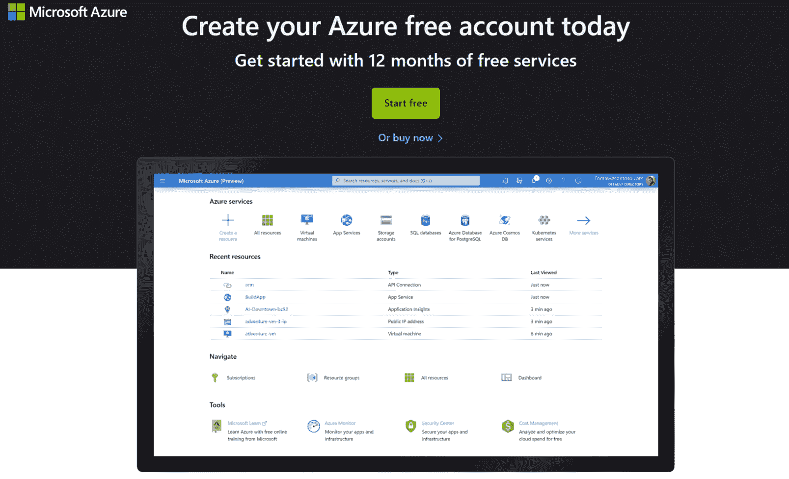

图 2.1 – 微软 Azure 账户创建屏幕

微软将要求你填写一些关于你的国家、名字、姓氏、电子邮件地址和电话号码的信息。然后，你必须通过电话号码验证你的身份并输入你的信用卡信息。

注意，除非您升级，否则创建 Azure 账户不会产生费用。一旦您签署协议，您将获得 200 美元的免费信用额度，用于您前 30 天的 Azure 使用。30 天期限结束时，您将不会自动收费。

重要提示

如果您已经使用电子邮件地址注册了 Microsoft Azure 免费账户，您将不会收到额外的 200 美元免费信用额度。这只能获得一次，并且您只能选择按使用付费选项。在这种情况下，请使用不同的电子邮件地址创建一个新的 Microsoft 账户并再次尝试。

在有了账户之后，您现在可以在 Microsoft Azure 中创建资源。有数百种资源可供选择，可能会让人想要探索它们。保持专注。设置 AMLS 是您使用 AutoML 必须采取的第一步。

## 创建 AMLS 工作空间

一旦您创建了 Azure 账户，您就可以创建一个**Azure 机器学习服务 (AMLS**) 工作空间。AMLS 工作空间是您在 Azure 上所有机器学习工作的集中资源。它还提供了对**AML 工作室**的访问。这个工作室是一个图形化网页门户，允许轻松直观地访问 AMLS 工作空间的各个不同组件。让我们开始吧：

1.  首先导航到 [`portal.azure.com`](https://portal.azure.com)。

1.  点击蓝色十字中的**创建资源**按钮。资源只是 Azure 服务。无论是虚拟机、云数据库还是 ML 工具，每个 Azure 服务都算作一个资源。

1.  点击蓝色十字后，在搜索框中输入`Machine Learning`并按*Enter*。您将看到一个新屏幕，右上角有一个大蓝色烧瓶。这是 AML 的符号。

1.  点击**创建**。以下截图显示了流程：

    图 2.2 – 创建 AMLS 资源

1.  然后，您将看到一个屏幕，要求您选择订阅、填写资源组、创建工作空间名称、选择区域以及选择工作空间版本。如果您有多个 Azure 订阅，请选择与您想要使用的账户关联的订阅。**资源组**只是一个 Azure 资源的集合。通过遵循命名约定创建一个新的资源组。

    重要提示

    不同的 Azure 资源有不同的命名约定。资源组必须由字母数字字符、点、连字符、括号和下划线组成，而 AMLS 工作空间必须由字母数字字符、连字符和下划线组成。如果您提供了错误的名称，只需遵循出现的任何说明即可。

1.  通过命名您的 AMLS 工作空间并选择一个区域来填写表单的其余部分。选择一个靠近您居住地的区域。例如，如果您住在芝加哥，请选择北美中部或东美，但不要选择北欧。填写所有值后，您的表单应类似于以下截图所示。

    注意，除了 AMLS 工作区外，您还会自动创建其他资源。如果您需要，将自动为您创建一个**容器注册表**来存储容器化的代码，因此不要创建一个：

    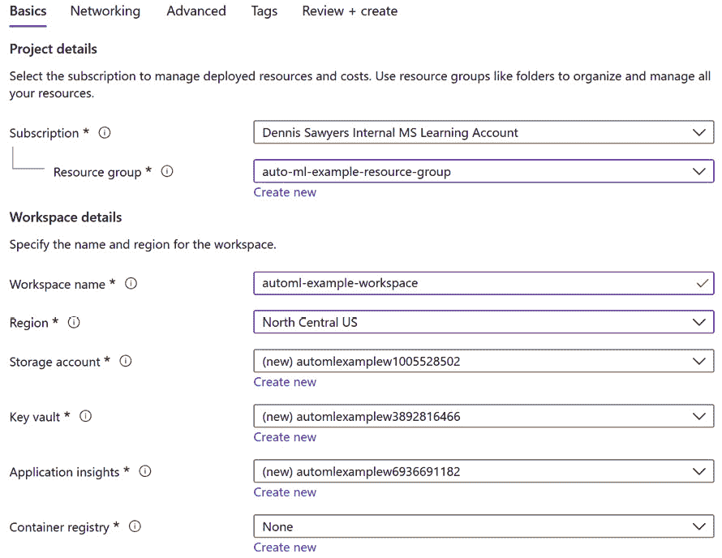

    图 2.3 – 填写好的 AMLS 工作区创建表单示例

1.  通过点击**审查 + 创建**，然后点击**创建**来完成创建您的 AMLS 工作区。

    您将看到一个显示**部署正在进行中**的屏幕，并将创建四个不同的 Azure 资源。这包括您的 AMLS 工作区、一个用于存储数据的**存储账户**实例、一个用于存储密码的**Azure 密钥保管库**实例以及一个用于监控您的 ML 作业的**应用程序洞察**资源。一旦创建，不要删除这些资源。

    重要提示

    一旦您创建了一个 ML 管道或实时端点，将自动创建一个 Azure 容器注册表。像其他自动创建的资源一样，不要删除它。

## 使用代码创建 AMLS 工作区

或者，您可以使用**Azure CLI**通过**Bash**或**PowerShell**创建一个 AMLS 工作区。**Azure 命令行界面**（**Azure CLI**）是一个您可以使用它来创建和管理 Azure 资源的界面。Bash 是 UNIX shell 和命令语言，而 PowerShell 是微软特定的框架。您可以通过点击[`portal.azure.com`](https://portal.azure.com)首页顶部的计算机屏幕图标来访问 Azure CLI。当您悬停在它上面时，会出现**Cloud Shell**的字样。

要创建一个 AMLS 工作区，按照以下顺序在命令行中输入以下命令：

1.  使用以下代码安装 Azure CLI ML 扩展：

    ```py
    az extension add -n azure-cli-ml
    ```

1.  接下来，创建一个资源组。确保您指定了您的 Azure 位置。`-n`表示资源组的名称，而`-l`指定其位置：

    ```py
    az group create -n automl-cli-group -l eastus
    ```

1.  实例化您的 AMLS 工作区。`-w`表示您的工作区名称，而`-g`指定您的资源组。确保它与您在上一步骤中创建的资源组相匹配：

    ```py
    az ml workspace create -w automl-ws -g automl-cli-group
    ```

您可以在[`docs.microsoft.com/en-us/azure/machine-learning/reference-azure-machine-learning-cli`](https://docs.microsoft.com/en-us/azure/machine-learning/reference-azure-machine-learning-cli)了解更多关于工作区特定命令的信息。

现在您已经创建了一个 AMLS 工作区，您就可以探索其众多对象了。您将通过 AML 工作室来完成，这是一个建立在您的 AMLS 工作区之上的图形用户界面。

## 导航 AML 工作室

在您创建了 AMLS 工作区后，您现在可以导航到 AML 工作室。

要么导航到[`ml.azure.com`](https://ml.azure.com)，要么打开您的 AMLS 工作区并点击屏幕中间的**立即启动**，AML 工作室是您 AMLS 需求的唯一商店。以下截图显示了工作室及其导航栏：


图 2.4 – AML 工作室主页和导航

您的 AML 工作室一开始可能会让人感到有些畏惧。由于有很多标签页需要导航以及许多不熟悉的术语，许多初次使用用户可能会感到迷茫。为了使您的旅程更加顺畅，以下是每个标签页的描述以及它们的功能：

+   **主页**将您带回到 AML 工作室主页。

+   **笔记本**允许您使用**Jupyter**或**JupyterLab**编写代码。

+   **自动机器学习（预览版）**允许您使用引导式用户界面运行 AutoML 作业。它目前处于预览模式。

+   **设计器（预览版）**允许您使用引导式用户界面转换数据和创建 ML 模型。它目前处于预览模式。

+   **数据集**是指向 Azure 存储账户中的文件或 Azure SQL 数据库中的 SQL 查询的指针。您可以使用此标签页创建新的数据集或配置文件，更新和检索现有数据集的信息。

+   **实验**是您在 Azure 上进行的 ML 训练作业的记录。实验包含您运行的结果，以及日志、图表和图形。

+   **管道**跟踪您创建的任何 ML 管道。管道用于批量评分或模型训练，通常使用 Azure Data Factory 进行调度。使用此标签页检索您的管道名称和 ID。

+   **模型**跟踪您已训练并注册到您的 AML 工作空间中的任何 ML 模型。使用此标签页来跟踪它们。

+   **端点**跟踪您为实时评分创建的任何实时端点以及您创建的任何管道端点。您还可以在**管道**标签页中找到管道端点。

+   **计算**允许您创建和访问用于运行 Jupyter、JupyterLab 和 R Studio 笔记本的计算实例。它还允许您创建用于运行远程训练作业的计算集群。我们将在下一节中创建这两个实例。

+   **数据存储**是指向 Azure 存储账户中的 blob 容器或 Azure SQL 数据库的指针。您可以使用此标签页创建新的数据存储并检索现有数据存储的信息。

+   **数据标注**对于标注图像数据非常有用。当您手动标注图像时，您可以训练一个机器模型，以便将来使此过程自动化。

在本章的其余部分，我们将探讨**计算**、**数据集**和**数据存储**标签页。随着我们继续阅读本书，我们将使用**自动机器学习**、**实验**、**模型**、**管道**和**端点**标签页。我们不会涵盖**笔记本**、**设计器**或**数据标注**标签页。要使用 GUI 或代码运行 AutoML 作业，您首先需要计算资源，所以让我们从这里开始。

# 构建计算以运行您的 AutoML 作业

第一次打开 AML 工作室时，导航到**计算**选项卡以创建计算实例和计算集群。一旦打开选项卡，你将在顶部看到四个标题：**计算实例**、**计算集群**、**推理集群**和**附加计算**。让我们更详细地看看这些：

+   **计算实例**是你可以用来在 Jupyter 或 JupyterLab 笔记本中编写和运行 Python 代码的虚拟机；你也可以使用计算实例来使用 R Studio 编写 R 代码。

+   **计算集群**是用于远程训练 ML 模型的虚拟机组。你可以在计算集群上启动作业，并在计算实例中继续编写代码。

+   **推理集群**是用于实时评分数据的虚拟机组。

+   **附加计算**指的是使用 Databricks 或 HDInsight 计算来运行大数据作业。

让我们看看它们在实际中的表现。

## 创建计算实例

我们将从计算实例开始：

1.  确保顶部的选项卡以黑色突出显示。然后，点击以下截图中的**添加新项**按钮，即蓝色的十字：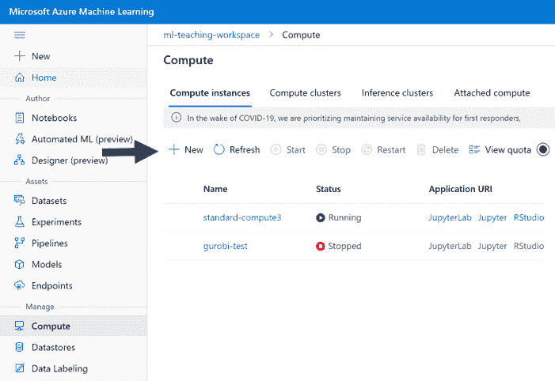

    图 2.5 – 创建计算实例

    你将被要求选择虚拟机类型和虚拟机大小。选择虚拟机类型为**CPU**，虚拟机大小为**Standard_DS3_v2**。**Standard_DS3_v2**是大多数使用小型到中型数据集的 ML 作业推荐使用的虚拟机。

    对于更大的数据集，你可能需要具有更多 RAM 的虚拟机。作为一个粗略的指导，我们建议拥有比你的 CSV 格式数据大小多 20 倍的 RAM。一旦你设置了你的设置，如图所示，点击**下一步**：

    重要提示 – CPU 与 GPU

    对于你大多数的 AutoML 和 ML 作业，CPU 将足够。然而，当你训练深度学习模型时，你想要选择更昂贵的 GPU 虚拟机。

    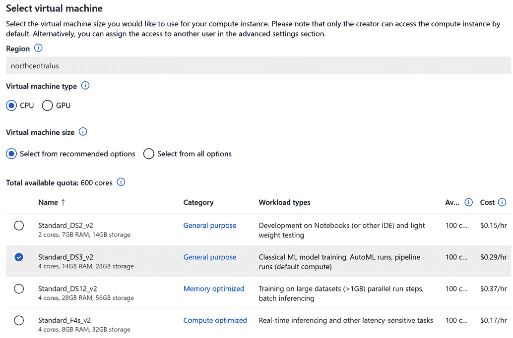

    图 2.6 – 计算实例设置

1.  然后你将被要求给你的计算实例命名。你可以给它任何你想要的名称，或者使用`automl-compute-instance`，如图所示，然后点击**创建**：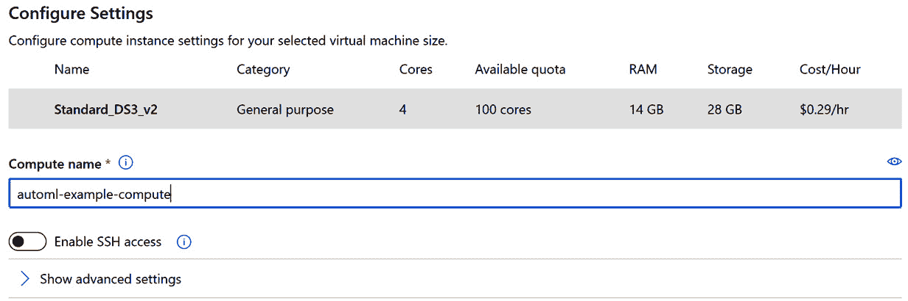

    图 2.7 – 命名你的计算实例

1.  现在你已经创建了一个计算实例，你可以开始编码以完成剩余的任务，或者你可以继续使用 GUI。要编写 Python 代码，只需打开以下截图中的**Jupyter**链接：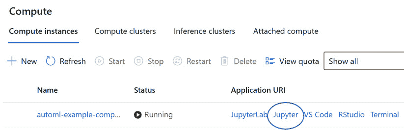

    图 2.8 – 打开 Jupyter 笔记本

1.  你可以通过在 Jupyter 中创建 Python 笔记本来开始编码。为此，点击屏幕右上角的**新建**按钮。从下拉菜单中选择带有 AzureML 的最新 Python 版本，如图所示：

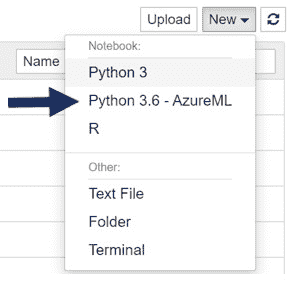

图 2.9 – 创建新的 Python 笔记本

现在，您已经准备好开始编码了！

## 创建计算集群

您的下一步是创建一个计算集群，以便您可以使用可视化界面运行 AutoML 作业。您可以通过 Jupyter 笔记本中的代码或通过 GUI 创建计算集群。

1.  要通过 GUI 创建计算集群，请点击**计算**选项卡，点击**计算集群**，然后点击**创建**按钮，如图所示：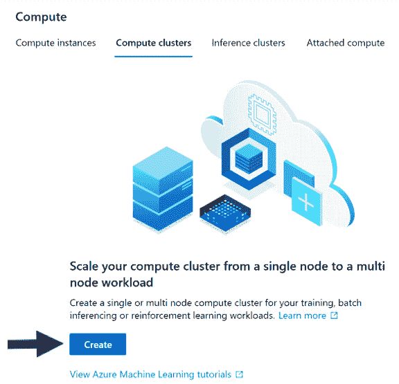

    图 2.10 – 创建计算集群

1.  在创建计算集群时，还有更多设置。首先，根据命名规范创建一个名称。计算集群只能有 16 个字符长的名称，所以请仔细思考。您的区域会自动选择，以匹配您的工作空间。

    如前所述，选择虚拟机的类型为**CPU**，虚拟机的大小为**Standard_DS3_v2**。对于虚拟机优先级，选择**专用**而不是**低优先级**。在高峰使用期间，运行在低优先级虚拟机上的作业可能会被中断。然后，点击**下一步**，如图所示：

    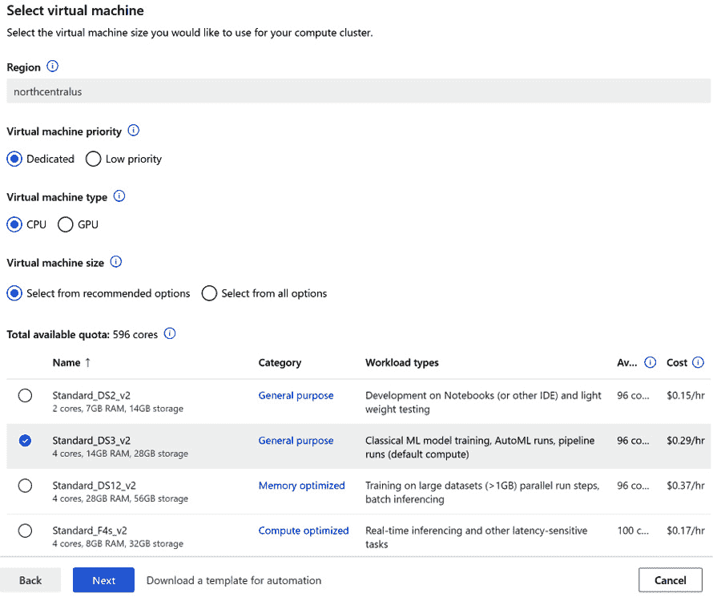

    图 2.11 – 计算集群设置 – 第一部分

1.  在下一页上，首先根据命名规范命名您的计算集群。计算集群只能有 16 个字符长的名称，所以请仔细思考。然后，选择节点数量。这是计算集群与计算实例之间最重要的区别。

    使用计算实例，您有一个单独的节点来运行您的作业；使用集群，您可以设置节点数量的最小值和最大值，并且它们将根据您的作业自动扩展。AutoML 通过在不同的节点上并行训练不同的模型来利用计算集群。

将最小节点数设置为`0`以在无作业运行时最小化您的成本，并将最大节点数设置为`4`。最后，将节点缩放前的秒数更改为`1200`秒，即`20`分钟，以防止您工作时机器关闭。检查您的设置是否与以下截图所示一致，然后点击**创建**按钮：

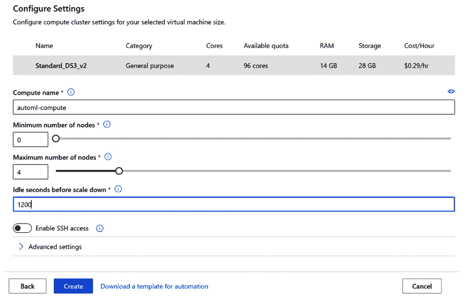

图 2.12 – 计算集群设置 – 第二部分

### 使用代码创建计算集群

您还可以使用 Jupyter 笔记本中的 Python 代码创建计算集群。让我们看看：

1.  首先，导入必要的包，以便您能够连接到您的 AMLS 工作空间并创建您的计算集群：

    ```py
    import azureml.core
    from azureml.core.workspace import Workspace
    from azureml.core.compute import ComputeTarget, AmlCompute
    ```

1.  现在，使用以下代码连接到您的 AMLS 工作空间：

    ```py
    ws = Workspace.from_config()
    ```

1.  接下来，设置您的变量，以确保它们与您在 GUI 上创建集群时使用的设置相匹配：

    ```py
    compute_name = 'automl-cluster'
    compute_min_nodes = 0
    compute_max_nodes = 4
    vm_size = 'Standard_DS3_v2' 
    idle_seconds = 1200
    ```

1.  一旦存储了变量，请使用以下代码为您的计算集群创建一个配置配置：

    ```py
    Compute_Config = AmlCompute.provisioning_configuration(vm_size=vm_size, min_nodes=compute_min_nodes, max_nodes=compute_max_nodes, idle_seconds_before_scaledown = idle_seconds)
    ```

1.  最后，创建计算目标：

    ```py
    compute_target = ComputeTarget.create(ws, compute_name, provisioning_config)
    compute_target.wait_for_completion(show_output=True)
    ```

接下来，我们将看到另一种创建计算集群和实例的方法。

## 使用 Azure CLI 创建计算集群和计算实例

创建计算集群和计算实例的第三种方式是通过 Azure CLI。要这样做，请通过导航到[`portal.azure.com`](https://portal.azure.com)并点击屏幕右上角的计算机屏幕图标来打开 Azure CLI。当您悬停在图标上时，它将显示*云 Shell*。一旦打开，请执行以下操作：

1.  创建计算实例。`-n`表示您的计算实例名称，而`-s`指定您的虚拟机大小：

    ```py
    az ml computetarget create computeinstance -n clicompute -s "STANDARD_DS3_V2" -v
    ```

1.  创建计算集群。`-n`表示您的计算集群名称，而`-s`指定您的虚拟机大小。您还需要设置您的最小和最大节点数：

    ```py
    az ml computetarget create amlcompute -n clicluster –min-nodes 0 –max-nodes 1 -s STANDARD_DS3_V2
    ```

您现在知道有三种方法可以在 AMLS 上创建计算：通过 GUI、通过 Python 代码和通过 Azure CLI。通过创建计算，您现在可以运行所有想要的 AutoML 作业。将计算视为 AutoML 的引擎。然而，像任何引擎一样，它需要燃料才能运行。如果计算是 AutoML 的引擎，数据就是它的燃料。

# 在 AMLS 中处理数据

现在您已经创建了计算，您需要做的就是创建一个数据集，然后您就可以准备运行您的第一个 AutoML 作业了。**数据集**是您**存储账户**上的文件或 Azure SQL 数据库上的 SQL 查询的指针。

数据集本身不是文件。您可以从本地文件、SQL 查询或存储账户中的文件创建数据集。**Azure Open Datasets**，由微软整理的公开可用数据，也可以注册为数据集。对于这个练习，我们将使用 Diabetes 公开数据集创建一个数据集。

## 使用 GUI 创建数据集

让我们开始：

1.  点击**数据集**标签。

1.  点击`Sample: Diabetes`、`Sample: OJ Sales Simulated Data`和`手写数字的 MNIST 数据库`对于演示 ML 很有用。您可以使用 Diabetes 进行回归、OJ Sales 进行预测，以及 MNIST 进行深度学习图像识别。

1.  在搜索栏中输入`Diabetes`，点击**样本：Diabetes**复选框，然后点击**下一步**，如图 2.14 所示：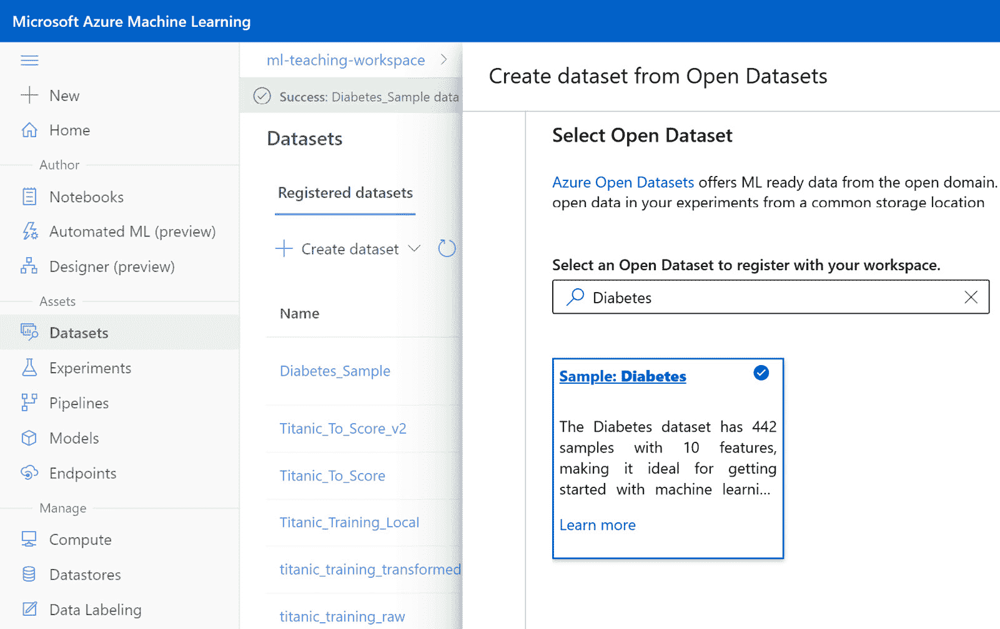

    图 2.14 – 选择样本 – Diabetes 公开数据集

1.  现在，您将被要求命名您的数据集。数据集名称必须在您的工作区中是唯一的。与许多其他 Azure 项目不同，数据集名称可以包含空格，但不能以空格开头或结尾。数据集还包含版本号，从 1 开始。

    每次您更新数据集，使其指向包含更新数据的不同文件时，都会创建一个新的版本。将您的数据集命名为`Diabetes Sample`并点击**创建**，如图所示：

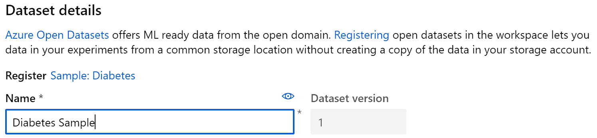

图 2.15 – 为您的数据集命名

恭喜！现在，您有一个可以用于 AutoML 的数据集。

## 使用代码创建数据集

与计算集群一样，您也可以完全通过代码创建数据集：

1.  首先加载以下包。`Diabetes`使`Sample: Diabetes`可用，而`Dataset`允许您创建、注册和使用数据集：

    ```py
    from azureml.opendatasets import Diabetes
    from azureml.core import Dataset
    ```

1.  在导入您的包后，运行以下代码以将糖尿病数据作为表格数据集拉入。**表格数据集**指的是包含行和列的数据，而**文件数据集**用于非表格数据，如图像文件：

    ```py
    diabetes_tabular = Diabetes.get_tabular_dataset()
    ```

1.  接下来，给您的数据集命名并在工作区中注册它。为此，您需要我们在创建计算集群时使用的 workspace 代码：

    ```py
    from azureml.core.workspace import Workspace	
    ws = Workspace.from_config()
    diabetes = diabetes_tabular.register(workspace=ws, name='Diabetes Sample')
    ```

1.  一旦将数据集注册到您的 AMLS 工作区，未来调用它就非常简单。只需导航到**数据集**标签，选择您的数据集，然后点击**消费**以获取调用数据集所需的代码。点击**示例用法**旁边的折叠页面图标，将代码复制到您的剪贴板，如图下所示：

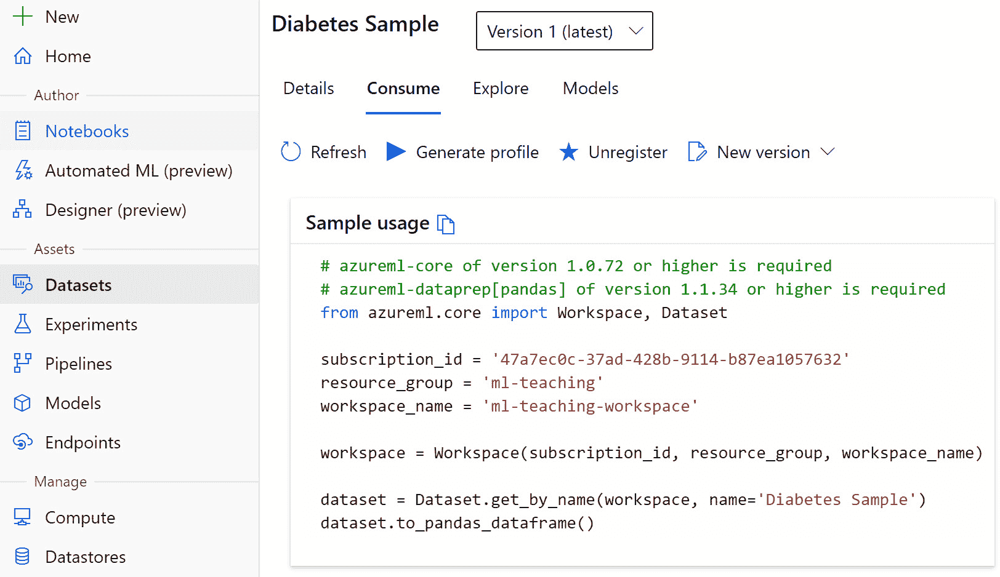

图 2.16 – 使用您的数据集

现在，您已经学会了如何使用 GUI 和代码创建数据集。数据集不仅对 AutoML 有用，对 AMLS 中的所有任务都很有用。访问数据集就像将自动生成的代码复制到工作室一样简单。在进入下一节之前，尝试使用 GUI 从本地文件创建自己的数据集。

您的 AutoML 已准备好运行。您在上一节中构建了引擎，现在您有了燃料；那就是您的数据。然而，在尝试 AutoML 之前，了解它是如何工作的是非常重要的。毕竟，您不希望把它开进沟里。 

# 理解 Azure 上的 AutoML 是如何工作的

在运行您的第一个 AutoML 实验之前，了解 Azure 上的 AutoML 是如何工作的是非常重要的。毕竟，AutoML 不仅仅是机器学习，它还涉及数据转换和处理。

如以下图所示，您可以将 AutoML 的阶段大致分为五个部分：**数据守卫检查**、**智能特征工程**、**迭代数据转换**、**迭代 ML 模型构建**和**模型集成**。只有在这个过程的最后，AutoML 才会产生一个最佳模型：

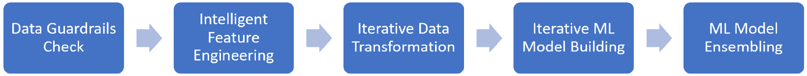

图 2.17 – Azure AutoML 流程

让我们更详细地看看这个过程中的每一步。

## 使用数据守卫确保数据质量

**数据守卫检查**确保您的数据适合 AutoML，如果不适合，将相应地调整数据。目前对您的数据执行了六个主要检查。其中两个检查——一个用于检测缺失值，另一个用于检测高基数列——将在每个数据集中发生。其他四个检查是问题或设置相关的。

**缺失特征值填充**将检测您数据集中的任何空值。另一方面，**高基数特征处理**将识别任何具有大量唯一值的分类列。这些对于下一步都很重要；即，**智能特征工程**。

与前两个检查不同，**验证分割处理**只有在您将验证配置设置为**自动**时才会发生。我们将在*第四章*、*第五章*和*第六章*中介绍所有不同的设置。此检查自动将数据分成训练集和测试集，这样您就无需手动操作。这是 AutoML 加快数据科学流程的许多方法之一。

**类别平衡检测**针对试图预测一个类别的分类问题，而**内存问题检测**和**频率检测**针对试图预测未来数字的预测问题。关于这些检查的更多内容将在*第五章**构建 AutoML 分类解决方案*和*第六章**构建 AutoML 预测解决方案*中讨论，分别涵盖分类和预测。

## 通过智能特征工程改进数据

一旦您的数据通过了数据守卫检查，下一步就是**智能特征工程**。这包括填充缺失值，处理高基数分类特征，生成额外特征，以及进行分类特征的独热编码。这里还应用了更高级的特征工程技术，如 k-means 聚类、证据权重和高级文本分析。

首先，任何由所有缺失值、相同值或极高基数（ID 字段、GUID 等）组成的列将被自动删除。接下来，您的缺失数值将用列的平均值（均值）填充，而您的缺失分类值将用最常见值填充。

在缺失值填充之后，将为日期时间特征和文本特征生成额外的列。日期时间特征包括年、月、日、星期、年日、季度、年周、小时、分钟和秒。文本特征包括单个、两个和三个单词组的词频。

小贴士

有时用除了平均值或最常见值之外的措施来填充缺失值会更好。在这种情况下，在数据达到 AutoML 之前填充您的数据。

**独热编码**随后应用于所有分类列。简单来说，这意味着创建包含 1 和 0 的列来表示原始列中的每个唯一值。如果你的原始列是 *animal*，则狗在新创建的狗列中会有一个 *1*，在其他所有动物列中为 *0*。高基数分类列将创建分组列（*dog-cat*）。

重要提示

高级特征工程也得到应用；这些技术需要数据科学和文本分析方面的专业知识。如果你想了解更多，请查看微软的 *自动机器学习中的特征化* 文档，位于 [`docs.microsoft.com/en-us/azure/machine-learning/how-to-configure-auto-features`](https://docs.microsoft.com/en-us/azure/machine-learning/how-to-configure-auto-features)。

## 使用迭代数据转换对数据进行归一化以进行机器学习

当你扩展数据时，ML 模型通常表现更好。例如，如果你有一列数值数据，其值介于 5 和 10 之间，另一列的值介于 1 和 1000 万之间，通常最好对每一列进行归一化，使其最小值为 0，最大值为 1。有许多类型的归一化，幸运的是，AutoML 会为你执行这些操作，使用**迭代数据转换**。

每次 AutoML 训练新模型时，它都会先使用七种方法之一对你的数据进行缩放。这七种方法如下：

+   **StandardScaler**

+   **MinMaxScaler**

+   **最大绝对值缩放器**

+   **RobustScaler**

+   **PCA**

+   **截断奇异值分解**

+   **SparseNormalizer**

通常，你必须自己编写代码并尝试每种方法来确定哪种缩放方法效果最好，但使用 AutoML，你甚至不需要考虑这一点。

## 使用迭代机器学习模型构建快速训练模型

Azure AutoML 的核心是**迭代机器学习模型构建**。AutoML 将根据你的设置并行训练模型，基于广泛算法列表。微软的 AutoML 团队只选择了性能最佳的算法模型包含在 AutoML 中，并且在添加新的模型之前，它将经过广泛的测试。这确保了模型的高性能。

当你观察 AutoML 训练模型时，你经常会注意到它反复使用相同的算法。在这种情况下，它正在尝试不同的超参数组合以达到更高的评分。超参数只是你可以设置的特定于算法的设置，例如决策树中的**树深度**或随机梯度下降中的**损失**。

谈到评分，每种类型的问题——回归、分类和预测——都有不同的度量标准可以用来评分。AutoML 也为每种问题类型使用不同的算法集。关于评分指标和算法的更多信息可以在 *第 4、5 和 6 章* 中找到，分别对应回归、分类和预测。

## 使用机器学习模型集成获得最佳结果

AutoML 将持续训练机器学习模型，直到达到设定的时长限制或模型数量限制。一旦超过这些限制中的任何一个，它将使用 **投票集成** 和 **堆叠集成** 执行 **机器学习模型集成**。投票集成根据你最佳模型的加权平均值评分数据，而堆叠集成基于你最佳模型的预测训练一个元模型。

在训练完你的集成模型后，AutoML 将停止运行并输出最佳模型。通常情况下，投票集成或堆叠集成将是你的表现最好的模型。然而，有时另一个模型可能会略微优于两者。

# 摘要

在本章中，你已经了解了在 Azure 中创建 AutoML 解决方案所需的所有先决条件。你创建了 AMLS 工作区，并在创建必要的计算资源以运行和编写你的 AutoML 作业之前访问了 AML 工作室。然后，你将数据加载到数据存储中，并将其注册为数据集，以便在 AutoML 运行中使用。

重要的是，你现在应该理解 AutoML 流程的四个步骤：数据守卫检查、智能特征工程、数据转换和迭代机器学习模型构建。本章中你所做的一切都将使你能够在创纪录的时间内创建机器学习模型。

你现在已准备好进入 *第三章*，*训练你的第一个 AutoML 模型*，你将通过 **GUI** 构建你的第一个 AutoML 模型。本章将涵盖从检查数据到评分模型和解释结果的一系列主题。到那一章结束时，你不仅能够使用 AutoML 训练模型，而且你还将能够以确保赢得最终用户信任的方式展示和解释你的结果。
