# *第三章*：训练你的第一个 AutoML 模型

拥有 Azure 账户、Azure 机器学习工作区、计算集群以及对 AutoML 工作原理的基本理解后，你现在可以开始训练你的第一个自动机器学习模型了。这将简单直接：AutoML 是一个平等器，它使即使是新手也能在几分钟内创建高级模型，无论你的背景如何，你将在本章结束时体会到它的力量。熟能生巧，本章是你成为 AutoML 实践者的第一步。

你将开始本章，通过从你的本地机器加载数据到你的**Azure 机器学习工作室**（**AML Studio**），仅选择用于训练所需的列。然后，你将使用引导用户界面进行 AutoML 模型的训练。训练完模型后，你将学习如何直接从 AMLS 门户解释你的结果。这包括标准指标，如准确率、假阳性率和假阴性率，以及一个令人惊叹的解释性仪表板，这将让你的业务最终用户印象深刻。最后，还有一个技巧和窍门部分，将帮助你未来的项目。

在本章中，我们将涵盖以下主题：

+   将数据加载到 AMLS 以进行 AutoML

+   创建 AutoML 解决方案

+   解释你的 AutoML 结果

+   解释你的 AutoML 模型

+   获得更好的 AutoML 性能

# 技术要求

要跟随本章内容，你需要以下条件：

+   上网访问

+   一个网络浏览器，最好是谷歌 Chrome 或微软 Edge Chromium

+   一个 Microsoft Azure 账户

+   一个 Azure 机器学习服务工作区

# 将数据加载到 AMLS 以进行 AutoML

正如你在*第二章*中注册了糖尿病公开数据集，*Azure 机器学习服务入门*，你现在将使用 AMLS 注册一个公开可用的泰坦尼克号数据集。

然而，与糖尿病数据集不同的是，你将直接从你的桌面将数据加载到门户。泰坦尼克号数据集包含有关谁在著名的灾难性航行中幸存和死亡的信息。你将构建一个模型，根据人口统计信息（如年龄和性别）以及票务信息（如乘客等级和票价）来预测幸存者：

1.  首先，你需要从 GitHub 仓库下载泰坦尼克号数据。

1.  然后，你需要通过导航到[`ml.azure.com`](http://ml.azure.com)来打开你的**Azure 机器学习工作室**。

1.  一旦你进入工作室，点击工作室右侧**资产**下的**数据集**。

1.  然后，点击**创建数据集**，并从下拉菜单中选择**从本地文件**，如图 3.1 所示：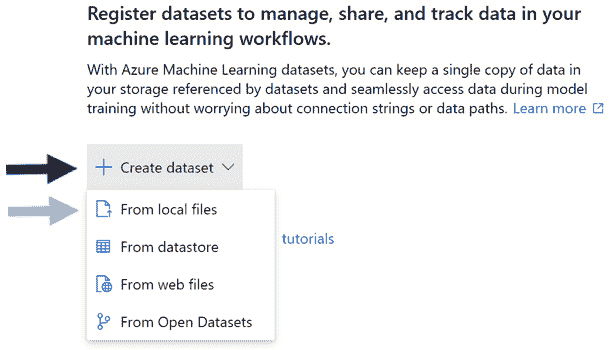

    图 3.1 – 从本地文件创建数据集

1.  在加载泰坦尼克号数据之前，您必须命名您的数据集。在**数据集名称**文本框中写下`Titanic Training Data`。与许多其他 Azure 资源不同，您可以在数据集的名称中包含空格。

1.  由于泰坦尼克号数据包含列和行，请选择`包含乘客人口统计信息和票务信息的泰坦尼克号数据。我们将使用这些数据来建模谁在泰坦尼克号航程中幸存下来`。

    通常来说，在数据集名称中包含项目名称和使用情况是一个好主意，例如，*Titanic Training Data*或*Titanic Scoring Data*。在描述字段中，最好列出数据中包含的信息类型，以及您试图解决的问题。请参阅*图 3.2*以供参考。

1.  在屏幕底部点击**下一步**：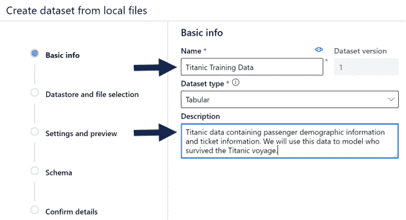

    图 3.2 – 命名和描述您的数据集

1.  现在，您将把泰坦尼克号数据加载到您的默认数据存储中。您的默认数据存储指向与您的 Azure 机器学习工作区一起创建的存储帐户。通过点击相应的圆圈选择您的默认数据存储，如图*图 3.3*所示。

1.  在您的本地机器上点击`titanic.csv`，然后点击**打开**。请注意，它将在文件加载到 Azure 后告诉您文件的大小。

1.  在您的数据存储和文件选择后，您还可以确定在数据存储中保存文件的路径。在标签为`/titanic/train`的空字段中。这将创建一个名为`titanic`的文件夹结构，一个名为`train`的子文件夹，以及一个包含当前 UTC 格式的日期和时间的另一个文件夹。您也可以使用数据存储上的现有文件夹。请参阅*图 3.3*以供参考。

1.  在屏幕底部点击**下一步**以继续：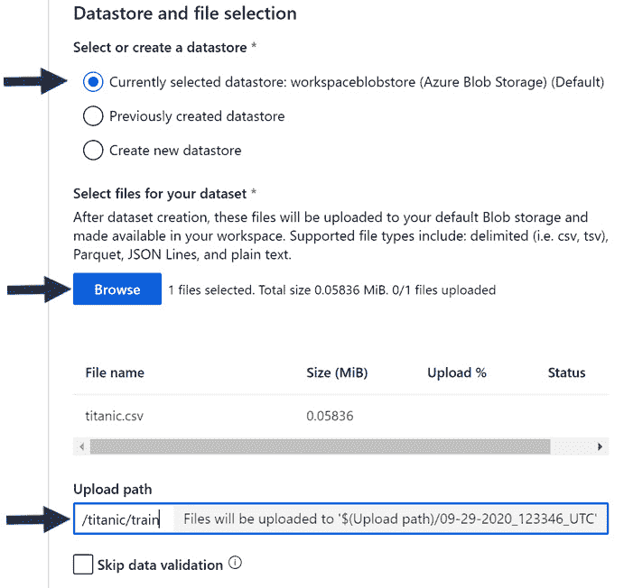

    图 3.3 – 将泰坦尼克号数据上传到您的数据存储

1.  在您的数据已加载到数据存储后，现在是时候设置您的数据集，以便文件正确地进入您的 Azure 机器学习工作区。这里有以下五个选项：

    a) 在**文件格式**中，您可以选择分隔符文件、Parquet 文件、文本文件或 JSON 文件。从下拉菜单中选择**分隔符**。

    b) 然后，在**分隔符**下选择适当的选项。由于这是一个 CSV 文件，即逗号分隔值文件，请从下拉菜单中选择**逗号**。请注意，每次您进行更改时，AMLS 都会在屏幕底部生成您数据的预览。

    c) 您很少需要更改**编码**，通常最好将其保留在默认设置，在这种情况下，**UTF-8**。

    d) 另一方面，**列标题**，您始终需要指定。AMLS 默认为**无标题**，但您使用的大多数文件都会有标题。选择**使用第一个文件的标题**来导入适当的列标题。

    e) **跳过行** 是在导入文件顶部或底部有额外行时非常有用的选项。虽然泰坦尼克号数据缺少这些额外行，但通常您会发现数据在最后一行包含姓名、日期或组织信息。

    重要的是要删除这些额外的行，否则在尝试构建机器学习模型时将导致错误。请参阅 *图 3.4* 了解您的设置应该如何看起来。

1.  点击 **下一步** 以选择您数据集所需的所有列：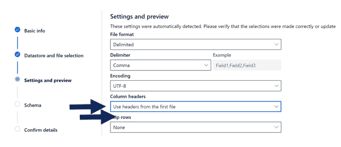

    图 3.4 – 选择您的文件的正确设置

1.  有一些列不适合机器学习。虽然 AutoML 会自动为您删除其中大部分，但最好还是自己删除它们。以下列出的列类型不分先后顺序：

    +   每行包含唯一值的列，例如 *Name*、*ID* 和 *Ticket*

    +   具有过多空值的列，例如 *Cabin*

    +   不包含有用信息的列

    +   您的目标列的派生列

1.  要从数据集中删除这些列，您只需将滑块向左移动，如图 *图 3.5* 所示。删除 **PassengerId**、**Name**、**Ticket** 和 **Cabin**：

    注意

    当您从数据集中删除列时，数据存储上的文件不会被修改。因此，您可以从同一文件创建多个数据集，指向不同的列。

    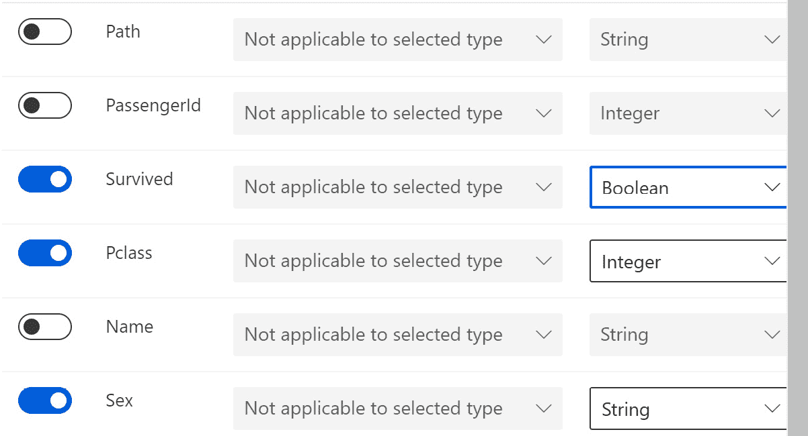

    图 3.5 – 选择您的列

1.  从此菜单中，您还可以指定每列的类型。共有五种类型：**字符串**、**布尔值**、**整数**、**小数**和**日期**。布尔值用于具有两个可能值的列，例如 0 或 1。将 **Survived** 改为 **布尔值**，并将 **Age** 改为 **整数**。

1.  点击 **下一步**。

1.  您现在将看到一个确认屏幕。从该屏幕，您可以查看您分配给数据集的名称及其描述、数据存储以及基础文件所在的数据存储路径，以及文件设置。您还可以从该屏幕进行数据分析，如图 *图 3.6* 所示。

    如果您选择分析数据，您需要选择一个计算集群。此选项将为您提供每个列的摘要统计信息，包括平均值、最小值、最大值、标准差、缺失值数量、错误数量和唯一值数量。打开或关闭分析，然后点击 **下一步** 以创建您的数据集：

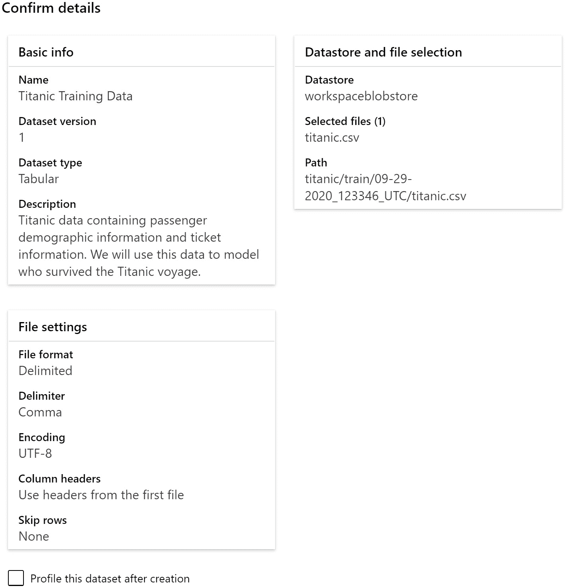

图 3.6 – 确认您的数据集详细信息

您现在已创建了一个可以在 AMLS 中使用的数据集。使用它，您将构建一个机器学习模型，预测哪些乘客幸存，哪些乘客丧生。下一步是使用 AutoML 引导的用户界面训练机器学习模型。

# 创建一个 AutoML 解决方案

现在你已经将 Titanic 数据加载到你的数据存储中并将其注册为数据集，你可以通过几个指导点击来训练一个 AutoML 模型：

1.  要开始，请从左侧菜单下的**作者**部分点击**自动机器学习**。然后，点击新页面右上角标记为蓝色十字的**新建自动机器学习运行**，如图*图 3.7*所示：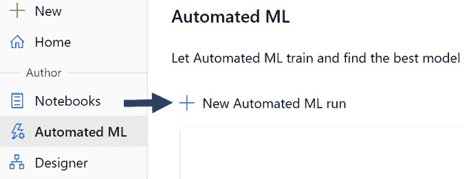

    图 3.7 – 开始你的 AutoML 训练运行

1.  一旦你进入下一屏幕，你将看到所有可用于训练的合格数据集。目前，AutoML GUI 的运行只支持表格数据集。你也可以通过点击**创建数据集**按钮从该视图创建一个新的数据集，如图*图 3.8*所示。

1.  点击**下一步**：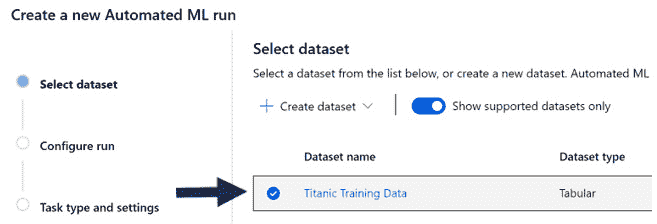

    图 3.8 – 选择你的训练数据集

    在选择数据集后，下一步涉及给你的实验命名，选择一个预测列，以及选择一个用于远程训练的计算集群。记住，**实验**记录了与你的训练运行相关的所有信息。

1.  要创建一个新的实验，选择`Titanic-Training`。不允许在实验名称中有空格；唯一允许的特殊字符是破折号或下划线。

1.  接下来，从下拉菜单中选择你的**目标列**。你的目标列是你试图用机器学习模型预测的数字或类别。在这种情况下，选择**Survived**。

1.  同样，选择一个 AutoML 将创建机器学习模型的计算集群。从下拉菜单中选择你创建的任何计算集群。AutoML 将在远程运行，允许你在 AMLS 工作区继续其他工作。

1.  请使用*图 3.9*作为参考来确认你的设置，然后点击**下一步**以进入最终屏幕：

    重要提示

    在训练自动机器学习模型时，选择正确的大小和类型非常重要。你的计算集群上的 RAM 应该比你的数据集大约大 20 倍以确保安全。在使用深度学习算法时使用 GPU，对于其他所有操作使用 CPU。在需要切换到基于 Spark 的解决方案之前，你可以使用最多 10GB 的数据来训练 AutoML 模型。

    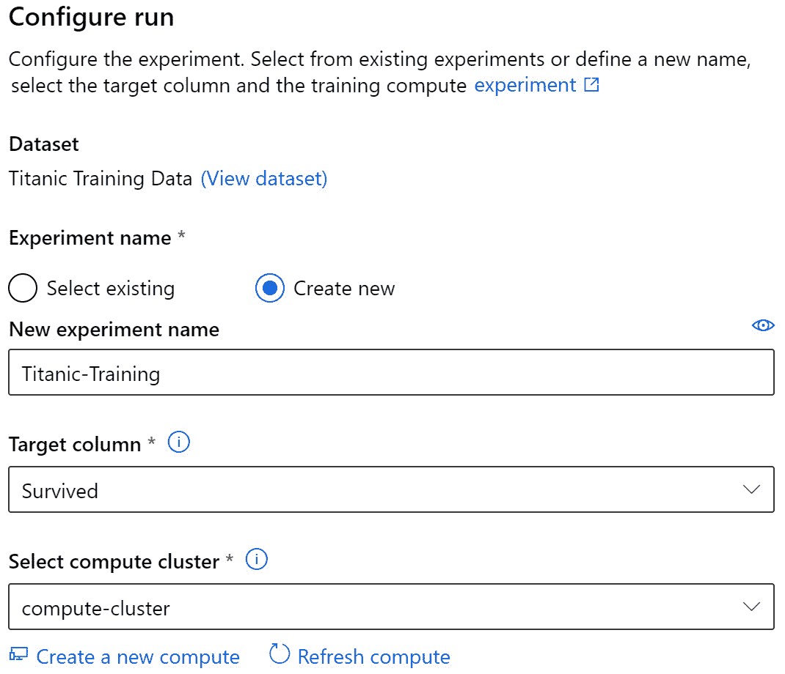

    图 3.9 – 配置你的 AutoML 运行

    你只需点击几下就能创建你的 AutoML 模型。在下拉菜单中，有三个选项：**分类**、**预测**和**回归**。**分类**用于当你试图预测一个类别时，例如预测一个人是否可能违约或偿还贷款。**回归**用于当你试图预测一个数字而不是一个类别时，例如尝试根据房屋的大小等特征预测房价。另一方面，**预测**用于当你试图预测未来的一个数字时。

1.  由于我们正在尝试预测一个人是否在泰坦尼克号灾难中幸存，请选择 **分类**。在右侧的框旁边将出现一个绿色的勾选标记，如图 3.10 所示：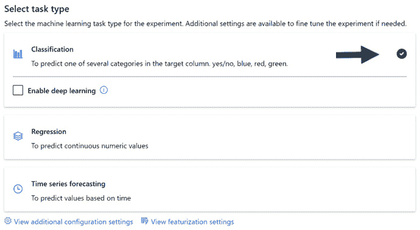

    图 3.10 – 选择正确的任务类型

    你可以配置两组额外的设置 - **附加配置设置** 和 **特征化设置**。**附加配置设置** 允许你更改 AutoML 将用于评估算法的指标，使你能够阻止 AutoML 尝试某些算法，并允许你设置 AutoML 运行的总时间。

    **特征化设置** 允许你取消选择列，设置列类型，并决定 AutoML 如何处理每列的空值。更高级的数据科学家能够利用这些功能以更细粒度地控制 AutoML 处理缺失值的方式以及 AutoML 如何特征化你的数据集。

1.  导航到 **查看附加配置设置**。

1.  点击 `0.25`，如图 3.11 所示。如果你不小心将其设置为 15，你的作业将在运行 15 小时后终止：

    重要提示

    目前，请坚持使用默认指标和默认验证机制，分别是 **准确度** 和 **自动**。在后面的章节中，我们将更深入地探讨 Azure 上 AutoML 支持的各种指标和验证机制。

    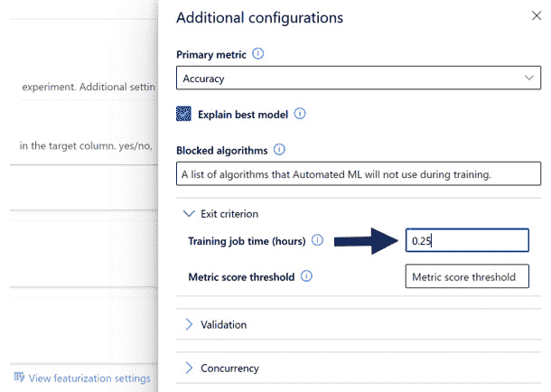

    图 3.11 – 设置你的训练作业时间

1.  点击 **保存** 和 **完成**，然后在接下来的 15 分钟内找些事情做。

你已经启动了你的第一个 AutoML 模型，很快你将得到结果。

# 解释你的 AutoML 结果

你的训练运行应该大约花费了 15 分钟，并产生了一个大约 80% 准确度的模型。然而，你的结果远不止这个简单的指标。有数据护栏会通知你数据中可能存在的问题。还有针对三种问题类型的不同指标以及辅助你向业务展示结果的图表和图形：

1.  首先，点击如图 3.12 所示的 `Titanic-Training` 实验：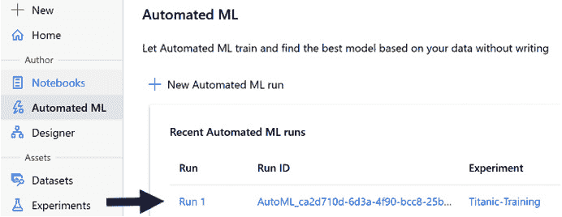

    图 3.12 – 检查你的结果

    你将被带到包含关于你的模型的多种指标的屏幕，包括用于训练最佳性能模型的算法类型、其准确度得分、创建的日期和时间，以及你的 AutoML 运行执行所需的时间。利用屏幕右下角的**描述**区域来写下关于你运行的详细信息。

1.  点击笔形图标并写下`我的第一个 AutoML 模型`。

    你会注意到屏幕顶部有六个标签页：**详情**、**数据安全栏**、**模型**、**输出 + 日志**、**子运行**和**快照**。为了解释结果，只有**数据安全栏**和**模型**是重要的。

1.  点击**数据安全栏**标签并阅读结果。

## 理解数据安全栏

**数据安全栏**识别并纠正你数据集中存在的问题，了解这些问题是至关重要的。根据你试图解决的是分类、回归还是预测问题，有不同的安全栏。分类问题使用以下：

+   **验证集处理**：这个安全栏会查看你的数据集大小和列中的唯一值，以确定你的机器学习模型应该如何进行训练和验证。对于这个泰坦尼克号数据集，它将选择 10 折交叉验证。交叉验证将数据分成 10 份，基于 9 份数据训练一个模型，并在剩余的部分上评分。这个过程重复 10 次，然后平均分数。

+   **类别平衡检测**：这个安全栏会查看你的目标列，以确定是否有足够的每个唯一值的样本。对于泰坦尼克号数据，这个安全栏将通过，因为有足够数量幸存者和死亡者的人数来构建一个有效的模型。

+   `Age`列，并且它们被填充了该列的平均值。`Embarked`列也有两个空值，并且它们被填充了`--`，这是该列最常见的值。

+   **高基数特征检测**：这个安全栏会检查你的分类列，看是否有任何列有太多的唯一值，在这种情况下，它们将被分箱。在泰坦尼克号数据中，这个安全栏通过了，数据保持未更改。

## 理解模型指标

在探索数据安全栏之后，下一步涉及解释你的模型：

1.  点击**模型**旁边的**数据安全栏**标签。在这个标签页上，你会看到一个按准确性排序的 AutoML 生成的模型列表，得分最高的模型位于顶部。

1.  点击显示在*图 3.13*中的最高得分模型的名称：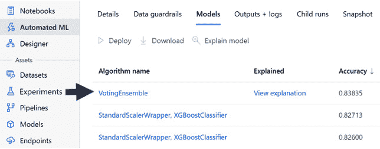

    图 3.13 – 导航到你的模型

    这将带您到一个类似的屏幕，顶部有一组新的标签页。**指标**，顶部的第四个标签页，不仅包含准确率，还包括与分类问题相关的所有附加指标和图表。您可以检查并取消选择任何您想要的。有超过 20 个复选框，但，为了这个练习的目的，我们将检查三个。

1.  选中**准确率**、**混淆矩阵**和**马修斯相关系数**复选框。

**准确率**是一个简单且易于理解的指标，它是您的 AutoML 运行用来构建和确定最佳模型的基础。它简单地表示您的模型在做出预测时正确性的可能性。在我的案例中，它是 83.84%。与确定性系统不同，机器学习模型的得分不会完全相同，但您的最佳模型应该得分相似。

**马修斯相关系数**是一个更为复杂的指标，它考虑了不平衡的类别。它是真实阳性、假阳性、真实阴性和假阴性率的组合，其值介于-1 和 1 之间。

得分为 1 表示您的模型预测完美，得分为 0 表示您的模型随机猜测。得分为-1 表示您的模型每次都完全错误。我的得分是.6541，远低于我在*图 3.14*中看到的准确率得分。您的模型应该得分相似。这表明您的模型在识别两个类别中的一个方面可能要差得多。正如您接下来将看到的，您的混淆矩阵证实了这一点：

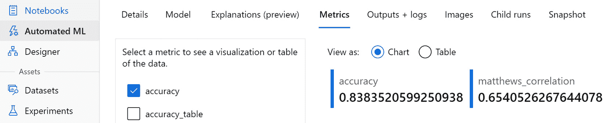

图 3.14 – 准确性和马修斯相关系数

**混淆矩阵**是您分类输出的视觉表示，专注于真实和假阳性以及阴性。虽然您的准确率很高，但您的马修斯相关系数很低，混淆矩阵是您调查这种关系的完美工具。请参见*图 3.15*：

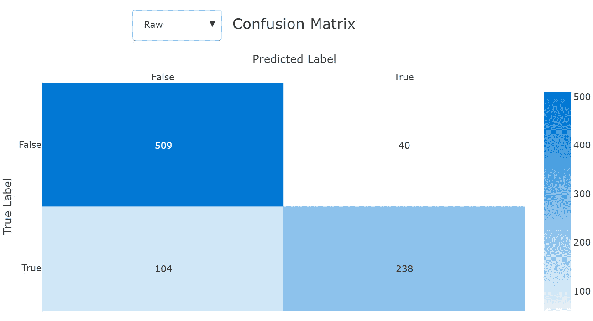

图 3.15 – 混淆矩阵

这个输出表明，我的模型正确识别了 509 个在泰坦尼克号上死亡的人的案例和 238 个存活的人的案例。然而，模型错误地将 40 个遇难者误认为是幸存者，以及 104 个死者误认为是幸存者。*图 3.16*通过从下拉框中选择**归一化**显示了相对百分比：

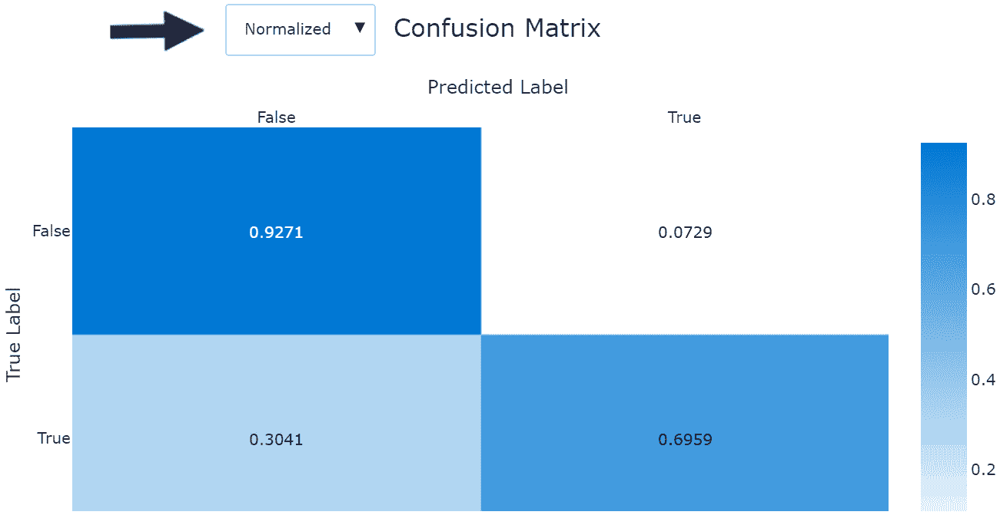

图 3.16 – 归一化混淆矩阵

在这里，我们可以看到真实阴性率，即被正确分类为死亡的人的比率是 92.71%。假阴性率，即幸存者但被错误分类的人的比率仅为 7.29%。这些得分非常高。然而，真实阳性率，即模型正确预测谁会幸存的能力，仅为 69.59%。同样，假阳性率是 30.41%。我们有一个模型在预测灾难受害者方面比预测幸存者要好得多。

在**指标**标签下还有许多其他有用的指标和图表。尝试勾选几个框并研究它们的含义。你还可以从你右侧的下一个标签**输出+日志**直接将任何图表下载到你的电脑上。你不会在**指标**标签下找到的一组有用信息是用于创建你的模型的特征。这些数据可以在**解释**标签下找到，目前处于预览状态。

# 解释你的 AutoML 模型

了解你的结果很重要，但了解你的模型是如何得出这些结果的也同样重要，这对于使用机器学习来说至关重要。这正是模型可解释性发挥关键作用的地方。“可解释性”是指能够说明在构建你的 AutoML 模型时哪些特征最为重要。这在需要合法解释你的机器学习模型的行业中尤为重要，例如，如果你构建了一个用于确定谁有资格获得贷款的模型：

1.  首先，点击“指标”旁边的“解释”标签。

1.  点击屏幕右侧“解释 ID”下的第一个 ID。

1.  点击“查看先前仪表板体验”旁边的滑块按钮。

1.  点击“全局重要性”。

    立即，你会看到你的列按照重要性顺序排列。`性别`是最重要的列，其次是`舱位`和`年龄`，如图 3.17 所示。性别的权重值为`1.1`，大约是舱位的两倍，得分为`0.59`。所有值都是相对的。从这张图表中，你可以得出结论，性别是在创建你的模型时使用的重要特征。

    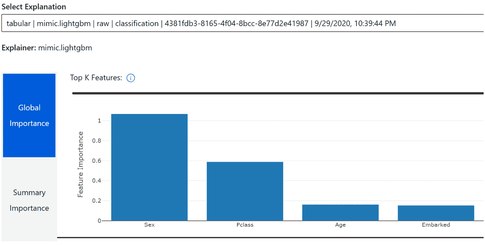

    图 3.17 – 可解释性

    现在你能够解释你的整个模型，同样重要的是能够解释个别点。

1.  要实现这一点，请点击**摘要重要性**并选择任何单个数据点。

    下面将出现一个图表，显示哪些特征对预测个人是否存活或死亡有负面影响或正面影响。*图 3.18*显示了持有头等舱票的男性的档案。请注意，他的性别对他的预测生存有负面影响，而他的舱位对预测有正面影响：

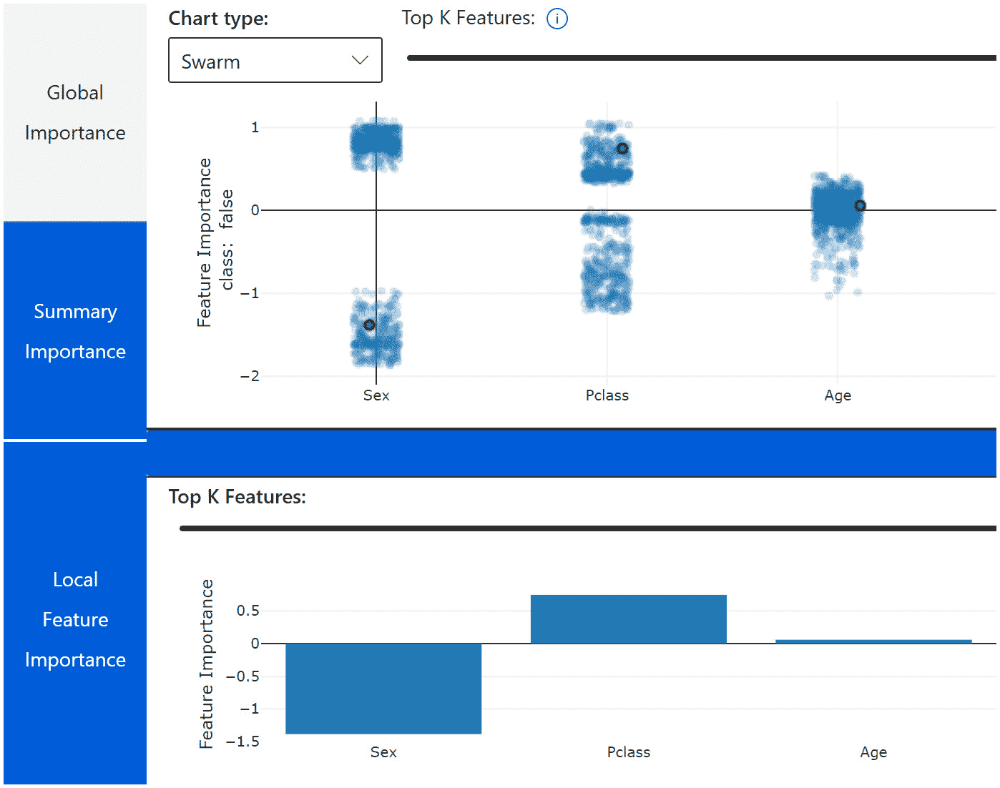

图 3.18 – 持有头等舱票的男性的可解释性

**可解释性**可以通过此仪表板界面和通过 Python 编程访问，我们将在后面的章节中看到。使用 Python，你可以将此信息存储在数据库中，以便安全保存和轻松检索。这样，你将能够解释所有的机器学习预测，并应对可能出现的任何法律挑战。

在构建并理解了一个 AutoML 模型之后，你现在可以构建更多的模型。为了更有效地做到这一点，你可以进行许多小的调整来提高性能。

# 获得更好的 AutoML 性能

恭喜！你已经构建了你的第一个模型，并且它的表现非常出色。然而，你还有很多小事情可以做来提高性能。毕竟，你将来还会构建更多的模型，为了构建最好的模型，你需要知道所有的技巧和窍门。以下是结束本章的技巧和窍门列表：

+   额外的**特征工程**通常会提供更优越的结果。特征工程仅仅意味着以使机器学习算法更容易找到模式的方式转换数据。例如，在泰坦尼克号数据中将票价和年龄分桶，可能比仅仅使用价格和年龄作为数值列提供更优越的结果。

+   说到分桶，你总是可以将回归问题分桶，将其转换为分类问题。例如，如果你试图预测人类的平均寿命，你可以尝试预测一个数字范围而不是一个具体的数字，比如*60-65 岁*，而不是一个确切的数字。当 AutoML 没有返回很好的结果时，这是一个有用的策略。与相同的给定数据集相比，分类问题比回归问题更容易解决，并且你通常可以为你的业务问题实现相似的价值。

+   启用深度学习通常会在 AutoML 中提供更优越的结果，但这需要显著更多的计算能力和时间。深度学习算法创建复杂的神经网络来进行预测，并且当输入特征是文本数据时，对于 AutoML 特别有用。不要使用基于 CPU 的计算集群，而应使用基于 GPU 的计算集群以获得必要的动力和性能。

+   在 AutoML 中进行预测需要精心构建的数据集和对预测特定设置的敏锐理解。在创建 AutoML 预测解决方案之前，仔细阅读*第六章*，*构建 AutoML 预测解决方案*。

+   让你的 AutoML 作业运行更长的时间通常意味着更好的结果，但只有到一定程度。尝试让它运行一定的时间，并注意算法是否返回更好的结果。

+   AutoML 会智能地调整其算法的参数，以尝试获得更高的分数。如果你注意到它反复尝试相同的算法，请记住这是预期行为，它正在尝试找到该算法的最佳参数组合。

+   很可能投票或堆叠集成将是你的最佳模型，尽管向人们解释这些模型的工作原理要困难得多。如果你有需要了解你模型背后数学原理的最终用户，你可以为你的运行**黑名单**集成模型。虽然你现在无法通过 AutoML GUI 来完成这项操作，但可以通过代码来实现。请参阅*第四章*，*构建 AutoML 回归解决方案*，以获取有关黑名单集成模型的更多详细信息。

+   在由小型虚拟机组成的计算集群上运行 AutoML 很便宜。在低内存虚拟机上使用时，请随意自由实验。

# 摘要

这标志着《使用微软 Azure 的自动化机器学习》第一部分的结束，你已经取得了很大的成就！你学会了如何将本地机器上的文件加载到你的数据存储中，并将其注册为数据集。你已经创建了你的第一个 AutoML 模型。你不仅能够通过图表和指标来解释你模型的预测结果，而且还能解释你的模型是如何进行预测的。最后，你学习了各种技巧和窍门，这将帮助你微调你的模型。你已经迈出了通往在 Azure 上掌握 AutoML 旅程的第一步。

你旅程的下一部分将涉及大量的 Python 编程。在*第四章*，*构建 AutoML 回归解决方案*中，你将使用**AzureML Python 软件开发工具包**（**AzureML SDK**）构建一个回归模型。这个 SDK 是一组命令，它将允许 Python 笔记本与你的 Azure 工作区进行交互。你将学习如何在 Python 中编写 AutoML 脚本，并使用这些脚本创建用于预测数字的强大解决方案。
