# *第四章*：构建 AutoML 回归解决方案

通过使用 AutoML 引导用户界面构建解决方案，你已经迈出了成为 Azure AutoML 专家的第一步。现在，是时候通过创建一个使用**Azure 机器学习 Python 软件开发工具包**（**AzureML Python SDK**）的解决方案来提升你的技能了。使用我们在*第二章*，*Azure 机器学习服务入门*中构建的 Diabetes 数据集，你将构建一个回归解决方案来预测一个人在过去一年中糖尿病病情的进展情况。

你将从这个章节开始，在你的计算实例中打开一个 Jupyter 笔记本，这将让你能够编写 Python 代码。首先，你将加载 Diabetes 数据。然后，你将训练一个 AutoML 模型并将你的训练模型注册到你的**Azure 机器学习服务（AMLS）**工作区。你将通过使用易于重用的 Python 脚本来完成这项工作。在检查你的模型结果后，你将学习如何注册你的模型，以便它可以针对各种回归特定指标进行优化，并微调你的解决方案以提高性能。

到本章结束时，你将完全掌握 Azure AutoML 的回归功能，并能够使用自己的数据训练回归模型。

在本章中，我们将涵盖以下主题：

+   准备 AutoML 回归数据

+   训练 AutoML 回归模型

+   注册你的训练好的回归模型

+   微调你的 AutoML 回归模型

# 技术要求

本章的先决条件如下：

+   上网权限

+   一个网络浏览器，最好是 Google Chrome 或 Microsoft Edge Chromium

+   一个 Microsoft Azure 账户

+   Azure 机器学习服务工作区

+   来自*第二章*，*Azure 机器学习服务入门*的`titanic-compute-instance`计算实例

+   来自*第二章*，*Azure 机器学习服务入门*的`compute-cluster`计算集群

+   来自*第二章*，*Azure 机器学习服务入门*的`Diabetes Sample`数据集

本章的代码在此处可用：[`github.com/PacktPublishing/Automated-Machine-Learning-with-Microsoft-Azure/blob/master/Chapter04/Chapter-4-AutoML-on-Azure.ipynb`](https://github.com/PacktPublishing/Automated-Machine-Learning-with-Microsoft-Azure/blob/master/Chapter04/Chapter-4-AutoML-on-Azure.ipynb)。

# 准备 AutoML 回归数据

在您可以使用 AutoML 训练任何模型之前，您必须有一个经过适当清洗的数据集。本节将指导您如何为任何 AutoML 回归解决方案准备数据。您将首先使用计算实例访问 Jupyter 笔记本，这是一个代码编辑器，让您可以用 Python 编写代码。之后，您将清洗、转换并注册您的数据作为 Azure 数据集。这将为您提供一个下一节中准备用于训练的数据集。

一些人对 Python 甚至是一般编程可能比较陌生，但不用担心。虽然编写 AutoML 解决方案可能看起来比使用*GUI*要困难得多，但实际上，这只是对样板代码进行微小修改的问题。

使用本书 GitHub 仓库中找到的代码，您只需稍作修改即可将其适应您自己的定制解决方案，并使用您自己的定制数据。此外，对于这个练习，您已经完成了大部分先决条件。您已经有了**计算实例**、**计算集群**和**数据集**，您只需几行代码就可以准备好训练 AutoML 回归解决方案。

## 设置您的 Jupyter 环境

要自己编写代码，您必须打开一个 Jupyter 笔记本。**Jupyter 笔记本**是一个可以编写、编辑和运行 Python 代码的环境。**Python**是一种在机器学习从业者中极其流行的通用编程语言，是 Azure Machine Learning 服务的基础。

以下步骤将指导您如何通过 Azure 计算实例访问 Jupyter 笔记本环境。然后，您将学习如何在环境中创建一个笔记本，这将允许您编写 AutoML 回归解决方案的脚本：

1.  首先，通过导航到[`ml.azure.com`](http://ml.azure.com)打开 Azure Machine Learning Studio。

1.  一旦您进入工作室，点击工作室右侧的**管理**下的**计算**。

1.  如果您的计算实例目前处于暂停状态，请检查`titanic-compute-instance`旁边的圆形复选框，并点击**启动**按钮。

1.  然后，点击**应用程序 URI**下的**Jupyter**，如图*图 4.1*所示：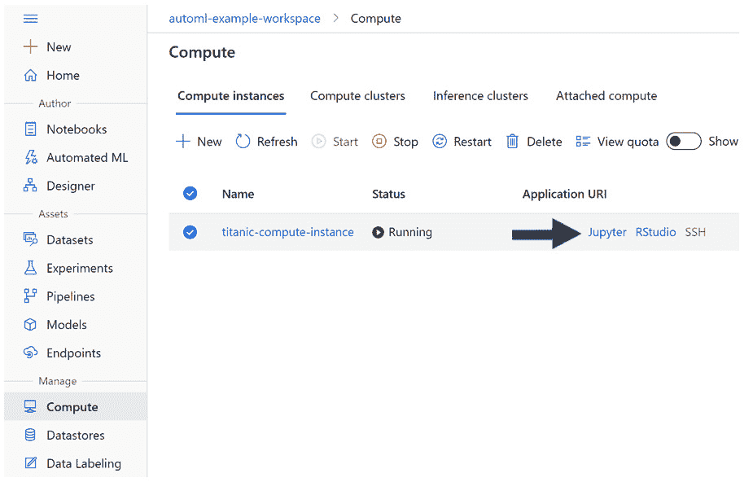

    图 4.1 – 访问您的 Jupyter 环境

    一旦您访问了您的 Jupyter 环境，下一步就是创建一个 Jupyter 笔记本。您可以创建任意数量的 Jupyter 笔记本，您还可以使用此环境上传和下载文件，创建文件夹结构，并运行 Python 和 R 脚本。**R**是另一种在机器学习从业者中流行的编程语言，但本书中我们将不涉及它。

1.  在屏幕右上角点击**新建**以访问下拉菜单。

1.  从下拉菜单中选择**Python 3.6 – AzureML**，如图*图 4.2*所示：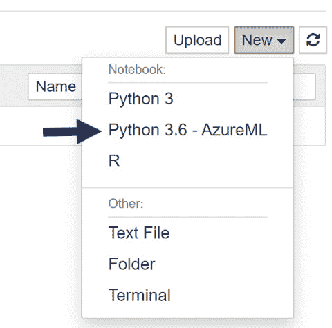

    图 4.2 – 创建 Jupyter 笔记本

1.  点击屏幕左上角出现的新 Jupyter 笔记本；即 `Untitled.ipynb`。

1.  通过点击 `Diabetes_Regression_AutoML` 到结果文本框中，并将其重命名为 `Diabetes_Regression_AutoML`，然后点击**重命名**，如图*4.3*所示：

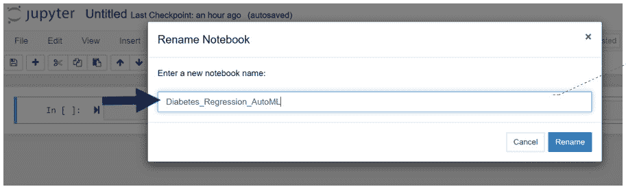

图 4.3 – 重命名你的 Jupyter 笔记本

通过创建和重命名你的 Jupyter 笔记本，你现在可以开始用 Python 编码了。这是一个逐步的、可重复的过程，主要由模板代码组成。**模板代码**是指可以从项目到项目复用的代码，并且需要很少或不需要定制。因此，即使几乎没有 Python 经验，你也可以编写 Azure AutoML 脚本。

## 为 AutoML 准备你的数据

每个 AutoML 脚本都以完全相同的方式开始。首先，你需要加载你的 Python 库。**库**是包含有用函数的集合，这些函数让你能够完成复杂任务，而无需自己编写复杂的代码。然后，你必须设置你的**工作区、数据存储、计算集群**和**数据集**。一旦完成这些，如果需要，你可以操纵你的数据并将其保存到新的数据集中。如果不必要，只需在加载数据集后直接跳转到**训练 AutoML 回归模型**部分。

在以下步骤中，你将加载所有必要的库，从开始到结束运行整个笔记本。这些库足以运行本章的数据准备、模型训练和模型注册部分。然后，你将加载你在*第二章**，Azure 机器学习服务入门*中创建的 Diabetes 数据集。加载数据后，你将对数据进行一些轻微的转换，然后将其注册为新的数据集。让我们开始吧：

1.  使用以下代码加载你将需要运行本章中所有内容的所有库：

    ```py
    from azureml.core import Workspace, Dataset, Datastore
    from azureml.core import Experiment
    from azureml.core.compute import ComputeTarget
    from azureml.train.automl import AutoMLConfig
    from azureml.train.automl.run import AutoMLRun
    from azureml.widgets import RunDetails
    ```

    `Workspace` 允许你连接到你的 `Dataset`，而 `Datastore` 允许你访问你之前创建的数据集和数据存储，而 `Experiment` 允许你记录你的 AutoML 的结果。

    `ComputeTarget` 允许你使用你的计算集群来运行你的 AutoML 作业。另一方面，`AutoMLConfig` 允许你配置你的运行，而 `AutoMLRun` 是训练你的模型所必需的。最后，`RunDetails` 允许你实时跟踪你的作业。

1.  使用以下代码加载 `pandas`，特别是这是查看数据集中数据的必要条件：

    ```py
    import pandas as pd
    import numpy as np
    ```

1.  使用以下代码将你的 Jupyter 笔记本连接到你的 AMLS 工作区：

    ```py
    ws = Workspace.from_config()
    ```

1.  使用以下代码将你的计算集群设置为你在*第二章**，Azure 机器学习服务入门*中创建的集群：

    ```py
    compute_name = 'compute-cluster'
    compute_target = ComputeTarget(ws, compute_name)
    ```

1.  使用以下代码设置你的数据存储。对于这个练习，我们将使用名为你的数据存储的 `workspaceblobstore`：

    ```py
    datastore = Datastore.get_default(ws)
    my_datastore_name = 'workspaceblobstore'
    my_datastore = Datastore.get(ws, my_datastore_name)
    ```

1.  使用以下代码设置你的数据集。为此，请使用你在 *第二章**，Azure 机器学习服务入门* 中创建的 `Diabetes Sample` 数据集。你可以通过替换以下代码中显示的名称来重用此代码：

    ```py
    dataset_name = "Diabetes Sample"
    dataset = Dataset.get_by_name(ws, dataset_name, 
    version='latest')
    ```

    重要提示

    对于这段代码，你将始终需要使用你数据集的最新版本。如果你希望使用你数据集的早期版本，你可以将 `'latest'` 替换为一个数字。

1.  使用以下代码查看你的数据的前 10 行，如图所示：

    ```py
    dataset.take(10).to_pandas_dataframe()
    ```

    每次查看你的数据时，确保数据看起来正确是很重要的。验证列名是否与你的预期相符。确保值是正确的类型，数值或字符串，并且值本身看起来是合适的。例如，如果你在 `AGE` 列中看到一个大于 120 的数字，你可能在数据集中有问题。

    如果你确实在你的数据中发现了任何不一致性，在用 AutoML 训练模型之前修复它们是很重要的。在应该为数值的列中留下字符串值会导致 AutoML 将这些列视为分类。

    在某些情况下，这可能会导致性能下降。同样，在数据中留下错误可能会导致模型无法做出准确的预测。正如老数据科学谚语所说，“*垃圾进，垃圾出*。”始终检查你的数据，确保它不是垃圾。

    输出应该类似于 *图 4.4*：

    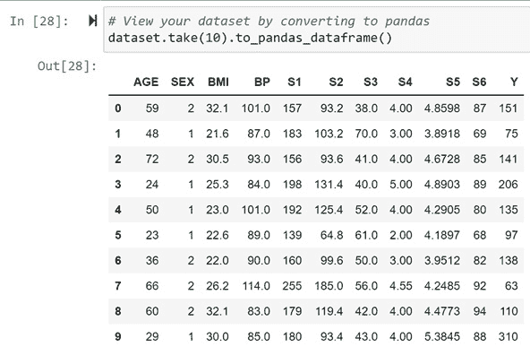

    图 4.4 – 查看你的数据集

1.  如果你希望更改你的数据中的任何内容，请使用 pandas 通过以下代码将你的数据集转换为 pandas DataFrame 来这样做：

    ```py
    dfRaw = dataset.to_pandas_dataframe()
    ```

1.  你可能想要做的一件常见事情是删除列。你应该删除任何来自你试图预测的字段的列，这些列几乎全部是空值，或者在你处理新数据时将不可用。例如，如果你不知道新患者的 `Sex` 和 `Age`，你可以使用 pandas 的 `drop` 函数，如下所示：

    ```py
    df = dfRaw.drop(['AGE','SEX'], axis=1)
    ```

1.  重新注册你修改后的数据，并给数据集一个新的名称；即，`Diabetes Sample Age/Sex Dropped`。使用以下代码，你可以将你的修改后的 pandas DataFrame 保存到你的数据存储中：

    ```py
    Dataset.Tabular.register_pandas_dataframe(df, 
    datastore,
                                "Diabetes Sample Age/Sex 
    Dropped")
    ```

1.  你可能想要尝试的另一个常见转换是分箱。将 `Age` 列分为三个不同的组：18 岁以下的孩子，18 至 64 岁的成年人，以及 64 岁以上的老年人。以下代码说明了这一点：

    ```py
    ageBins = [0, 18, 65, 200] 
    dfRaw['BinnedFares'] = pd.cut(titanic['Age'], ageBins)
    ```

1.  数据科学家还可以移除异常值。`Age` 列：

    ```py
    AgeThreeSD = np.std(dfRaw.Age)*3
    AgeMean = np.mean(dfRaw.Age)
    print(round(AgeThreeSD + AgeMean)) # Prints Outlier 
    Threshold
    # Replace all values above Threshold with Threshold 
    Value
    dfRaw['Age'] = dfRaw['Age'].mask(dfRaw.Age > AgeMean, 
    AgeMean)
    ```

1.  最后一个常见的数据转换是从数值列创建基于截止点的分类列。肥胖被定义为 BMI 为 30 或更高。我们可以使用以下代码创建一个包含 `1` 或 `0` 值的列，`Obesity_Flag`，以指示个人是否肥胖：

    ```py
    dfRaw['BMI'] = np.where(dfRaw['BMI'] > 30, 1,0)
    ```

1.  再次，使用以下代码将修改后的数据保存到你的数据存储中，并注册为一个名为`Diabetes Sample Full Transform`的数据集：

    ```py
    Dataset.Tabular.register_pandas_dataframe(dfRaw,
     datastore,
                                "Diabetes Sample Full 
    Transform")
    ```

在这一节中，你已经取得了很大的成就。你的库已经加载，你的工作空间已经设置，你已经将所有必要的资源编码，以便轻松创建一个 AutoML 运行。此外，你已经将你的糖尿病数据保存为不同的数据集，你将在下一节中使用这些数据集来训练三个 AutoML 模型。

# 训练 AutoML 回归模型

与设置你的 Jupyter 环境和准备你的数据相比，训练一个 AutoML 模型涉及更少的步骤。首先，你需要给你的**实验**命名。记住，实验会自动记录你的 AutoML 运行信息。接下来，你需要设置你的**目标**列，这是你希望预测的列，以及一些其他设置。最后，你将使用 AutoML 来训练一个模型，并实时查看结果。

在本节中，你将创建一个实验，配置 AutoML 回归任务特定的各种参数和设置，并使用上一节中创建的数据库训练三个 AutoML 回归模型。让我们开始吧：

1.  使用以下代码设置`实验`并给它命名。这是你的所有运行日志和指标将在 AML 工作室中存储的地方：

    ```py
    experiment_name = 'Diabetes-Sample-Regression'
    exp = Experiment(workspace=ws, name=experiment_name) 
    ```

1.  使用以下代码设置你的`目标`列。AutoML 将训练一个模型来预测这个列的值——在这个例子中，是`Y`列：

    ```py
    target_column = 'Y'
    ```

1.  使用以下代码为你的`任务`创建一个变量。`任务`是你试图训练的 AutoML 模型类型，这个选项包括回归、预测和分类。对于预测没有时间元素的数值，输入`regression`：

    ```py
    task = 'regression'
    ```

    重要提示

    如果你试图预测具有时间元素的数据，请使用*预测*而不是*回归*。如果`日期`是你的列之一，或者你试图根据当前情况预测未来的值，请使用*预测*。

1.  为你的主要指标创建一个变量。这个**主要指标**是评估你的模型的方式。你应该在这里使用**归一化均方根误差**。这个指标，被称为**RSME**，将预测值从每个观察的实际值中减去，然后平方，并平均所有观察的得分。得分越低，你的模型越好。回归的其他选项包括**R2 分数**、**Spearman 相关系数**和**归一化平均绝对误差**。

    以下代码创建了一个变量并将其设置为归一化 RMSE。这个变量将在稍后传递到你的 AutoML 配置设置中：

    ```py
    primary_metric = 'normalized_root_mean_squared_error'
    ```

1.  为`特征化`创建一个变量。你可以将特征化设置为`auto`或`off`。如果你将特征化设置为`auto`，你将不得不删除高基数特征，填充空值，对数据进行独热编码，并自己生成额外的特征。

    除非你是经验丰富的数据科学家并且能够舒适地自己完成所有工作，否则请始终将其设置为 `auto`。以下代码还创建了一个新变量，你将把它传递到 AutoML 配置设置中：

    ```py
    featurization = 'auto'
    ```

1.  要配置你的 AutoML，请运行以下代码。在这里，你将传递你的任务、主要指标、特征化设置、计算目标、数据集和目标列。你之前都创建过这些。

    你还必须传递实验将运行多长时间，如果模型性能没有提高，是否将提前停止，交叉验证的次数，以及你的实验是否将记录模型解释。`5` 和 `20`：

    ```py
    config = AutoMLConfig(task=task,
                         primary_metric=primary_metric,
                         featurization=featurization,
                         compute_target=compute_target,
                         training_data=dataset,
                         label_column_name=target_column,
                         experiment_timeout_minutes=15,
                         enable_early_stopping=True,
                         n_cross_validations=5,
                         model_explainability=True)
    ```

1.  训练你的模型并实时查看结果。以下代码使用你的配置设置训练 AutoML 模型，并将运行结果记录到之前创建的实验中。

    在运行过程中，此代码将允许你实时跟踪会话的进度。在这里，你可以看到 AutoML 检查数据的有效性，迭代训练模型，并选择最佳模型：

    ```py
    AutoML_run = exp.submit(config, show_output = True)
    RunDetails(AutoML_run).show()
    ```

如果你一切操作正确，你的 AutoML 运行将启动，你可以坐下来放松，观看它训练模型。首先，你会看到它执行 **数据守卫** 检查，如图 *4.5* 所示：

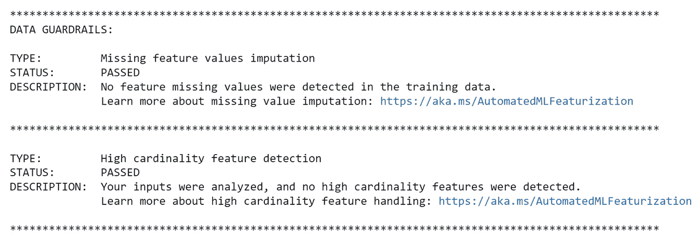

图 4.5 – 数据守卫检查

接下来，AutoML 将开始训练你的模型。你会注意到 AutoML 会训练不同组合的特征转换和算法。在相同的特征转换/算法对被复制的情况下，AutoML 会为该算法测试不同的超参数组合。在运行过程中，你将能够跟踪每个模型训练所需的时间、得分以及最佳性能模型的得分，如图 *4.6* 所示：

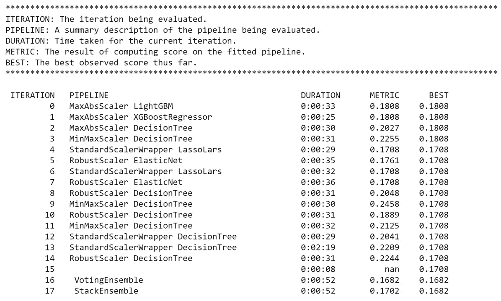

图 4.6 – AutoML 结果

注意到 AutoML 训练的模型在每次运行中并不逐渐变得更好。第一个训练的模型具有归一化 RMSE 为 `0.1808`。第三个训练的模型得分为 `0.2027`。使用归一化 RMSE，你的得分越低，表示越好。

实验结束时，最佳模型的得分为 `0.1682`。当你运行模型时，你应该看到类似但不是完全相同的结果，这取决于 AutoML 训练了哪些模型。虽然你可以在 `PIPELINE` 列下看到正在使用的模型和转换，但由于某些算法的参数数量庞大，超参数仍然隐藏。

你还可以通过以下图表获得这些结果的可视化。给定足够的时间，你会注意到 AutoML 会越来越好。这是因为它遵循自己的内部逻辑，尝试不同的特征工程/算法对，直到它无法找到更高性能的模型，此时 AutoML 将使用两种集成算法结束运行。

通常来说，要么是使用`Diabetes Sample Age/Sex Dropped`数据集，要么是使用`Diabetes Sample Full Transform`数据集。

*图 4.7*提供了结果的可视化：

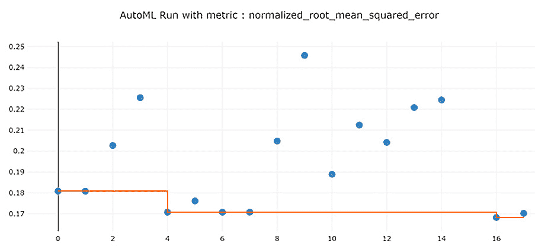

图 4.7 – AutoML 结果可视化

除了这两个图表，你可以在你的 Jupyter 笔记本中找到它们之外，还有两个更多通过 AML 工作室可以访问的可视化。这些是**预测值与真实值**图和你的**残差**直方图。*预测值与真实值*显示了你的模型与理想模型相比的表现如何，而*残差*则可以让你了解你的误差是否呈正态分布。

你可以通过以下步骤访问这些图表：

1.  导航到 AML 工作室的首页。

1.  在**资产**下点击左侧面板中的**模型**。

1.  点击`Diabetes-AllData-Regression-AutoML`。这是你训练的模型名称。

1.  点击**运行 ID**下的蓝色链接。它应该以 AutoML 开头，后面跟着一长串字母和数字。这是你的实验记录下的 ID。

1.  点击**指标**。

1.  打开**predicted_true**和**residuals**的复选框。

*预测值与真实值*显示了你的预测与一个完美预测每个数据点的模型相比的表现如何。水平轴代表你的真实值，而垂直轴代表你的预测值。同样，虚线绿色线代表完美模型，而实线蓝色线代表你的实际模型。你的实际模型周围还有浅蓝色边界，显示置信区间。置信区间估计了你的模型在现实世界中的表现范围。请仔细检查*图 4.8*：

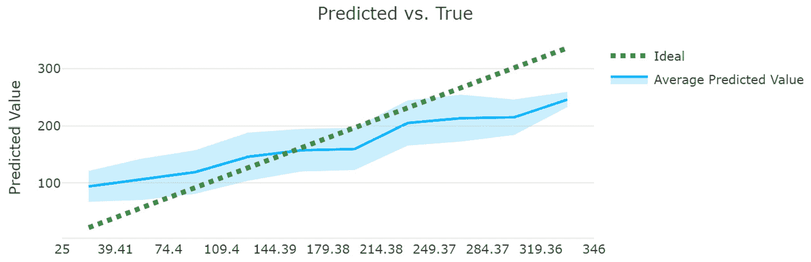

图 4.8 – 预测值与真实值图

另一方面，*残差*是一个直方图，它将你的误差值分箱，并计算每个箱中的数据点数量。误差只是你的预测值与真实值之间的偏差。例如，在*图 4.9*中，我们可以看到大约有 100 个数据点的误差在-38.5 到 0 之间，大约有 115 个数据点的误差在 0 到 38.5 之间。

在检查这个图表时，你应该确保它是钟形的。如果你的图表不是钟形的，这意味着你的误差中存在某种模式，你需要调查原因；通常这意味着你遗漏了一个重要的变量：

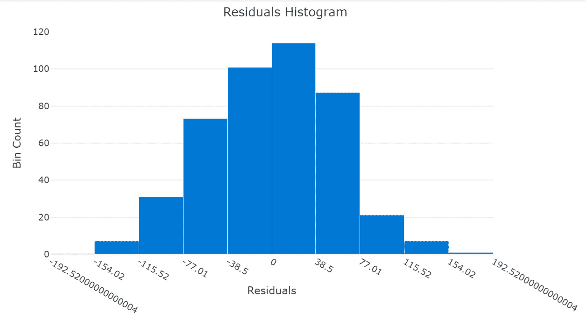

图 4.9 – 残差

虽然你已经使用 AutoML 训练了一个高性能的机器学习模型，但你的工作还没有结束。毕竟，一个机器学习模型只有在你能用它来预测新的数据点时才有用。过去就是过去，商业价值始终在于未来的情况。

在这种情况下，你试图预测患者结果，以便你可以识别并提前治疗那些疾病进展最快的患者。为此，你必须首先将你的模型注册用于将来使用。我们将在下一节中探讨这个问题。

# 注册您的训练回归模型

AutoML 让你可以轻松地将训练好的模型注册用于将来使用。在*第九章**，实现批量评分解决方案*和*第十一章**，实现实时评分解决方案*中，你将创建批量执行推理管道和实时评分端点，它们将使用你的模型。在注册模型时，你可以添加标签和描述以方便跟踪。

一个特别有用的功能是能够根据除你用来评分模型的指标以外的指标注册模型。因此，即使你使用归一化 RMSE 训练了一个模型，你也可以注册具有最佳 R2 分数的模型，即使这个模型是不同的。

在本节中，你将编写你模型的简单描述，为其添加标签，并给它起一个名字。然后，你将注册模型到你的 AMLS 工作区。它还包含代码，让你可以根据其他指标注册不同的模型。让我们开始吧：

1.  首先，给你的模型起一个名字、一个描述和一些标签。`tags`按你的意愿，并在描述中尽量详细：

    ```py
    description = 'Best AutoML Regression Run using 
    Diabetes Sample Data. This model requires the Age and 
    Sex Columns.' 
    tags = {'project' : "Diabetes", "creator" : "your 
    name"} 
    model_name = 'Diabetes-AllData-Regression-AutoML' 
    ```

1.  接下来，将您的模型注册到您的 AMLS 工作区，传递您的模型名称、标签和描述。使用上一节中训练的`AutoML_run`过程：

    ```py
    AutoML_run.register_model(model_name=model_name, 
    description=description, tags=tags)
    ```

    重要提示

    如果你训练 AutoML 模型的时间已经过去，你可以通过使用此 ID 找到它的`AutoML_run`来检索它，如下所示：

    `experiment_name = 'Diabetes-Sample-Regression'`

    `exp = Experiment(workspace=ws, name=experiment_name)`

    `AutoML_run = AutoMLRun(experiment = exp, run_id = 'your_run_id')`

1.  尝试根据 R2 分数注册不同的模型。给它一个稍微不同的名字，添加一个额外的标签，并使用相同的描述：

    ```py
    description = 'Best AutoML Regression Run using \
    Diabetes Sample Data. This model requires the Age and \
    Sex Columns.' 
    tags = {'project' : "Diabetes", "creator" : "your 
    name", "metric" : "R2"} 
    model_name = 'Diabetes-AllData-Regression-AutoML-R2' 
    AutoML_run.register_model(model_name=model_name, 
    description=description, tags=tags, metric = 
    'r2_score')
    ```

这样，你的模型已经注册并准备好使用。你已经创建了一个回归模型，可以根据患者的性别、年龄、血压、BMI 和六项血液血清测量值，在 1 年内预测患者糖尿病的可能进展情况。尝试注册其他使用本章中创建的其他数据集训练的 AutoML 模型。给他们适当的标签、名称和描述，以区分它们。

强调良好的标签策略和健壮的描述的重要性是很重要的。当你在一个机器学习项目中工作时，这并不是什么大问题，因为你将记得你训练了哪些模型以及你用哪些数据集训练了它们。然而，当你转向其他项目并且随着时间的推移，你的记忆变得越来越不可靠。如果你没有好的标签，定位你的模型将变得困难。

一个合适的标记策略应包括项目名称、项目创建者、模型训练的指标、模型训练的数据集以及其他与模型相关的信息。没有必要包含版本号，因为 AutoML 会自动包含一个。如果你用相同的名称注册不同的模型，将注册一个新的模型版本，而旧版本可以通过指定其版本号来访问。

一旦你注册了几个不同的模型，尝试使用以下代码访问其中一个：

```py
model = Model(ws,' 'Diabetes-AllData-Regression-AutoML-R2')
```

现在，你已经知道了如何使用 AutoML 注册和调用你训练过的模型。完成这一步后，我们可以继续前进，看看一些技巧和窍门，这些技巧和窍门将有助于你在未来训练模型时提高回归模型的性能。

# 微调你的 AutoML 回归模型

在本节中，你将首先回顾提高你的 AutoML 回归模型的技巧和窍门，然后回顾 AutoML 用于回归的算法。

## 提高 AutoML 回归模型

虽然 AutoML 会为你处理大部分复杂的数据转换和特征工程，但你可以遵循一些技巧来提高模型的准确性。其中一些技巧适用于所有三个 AutoML 任务——*回归*、*分类*和*预测*——而其他则是针对回归的。遵循这些技巧将产生性能更好的模型，更重要的是，将加深你对机器学习技术的理解。以下是一些技巧和窍门的列表，供快速参考：

+   在将数据传递给 AutoML 之前，先填写空值。或者，删除包含空值的任何行。仅仅因为 AutoML 会自动填充你的空值，并不意味着它会做得很好。

    在某些情况下，用列的平均值填充空值是合适的。例如，如果你缺少一个物品的价格，平均价格很可能近似于缺失的值。对于噪声较大的列，深入思考你应该如何填充缺失值，或者是否应该包含这些数据点。以下是一些 Python 代码，可以为你填充空值：

    ```py
    mean_age = dfRaw.AGE.mean()
    dfRaw.AGE = dfRaw.AGE.fillna(value=meanAge)
    ```

+   熟悉所有不同的 AutoML 配置选项。你可以在以下链接中找到它们：[`docs.microsoft.com/en-us/python/api/azureml-train-automl-client/azureml.train.automl.automlconfig.automlconfig?view=azure-ml-py`](https://docs.microsoft.com/en-us/python/api/azureml-train-automl-client/azureml.train.automl.automlconfig.automlconfig?view=azure-ml-py)。

+   使用`y_min`和`y_max`来处理`Target`列中的任何异常值。如果你有异常值，例如距离`Target`列平均值`3`个或更多标准差的价值，将`y_min`和`y_max`分别设置为平均值以下和以上的`3`个标准差，可以产生性能更好的模型。这仅适用于回归模型。

    以下代码计算`Target`列的均值和标准差，并使用它们来设置`y_min`和`y_max`：

    ```py
    TargetSD = np.std(dfRaw.Y)*3
    TargetMean = np.mean(dfRaw.Y)
    y_min = TargetMean – TargetSD
    y_max = TargetMean + TargetSD
    ```

+   研究四种不同的主要指标，以了解哪些指标最适合你的问题。对于大多数回归问题，归一化均方根误差（Normalized RMSE）就足够了，但关于使用其他指标优缺点的研究论文也很多。

+   使用[`docs.microsoft.com/en-us/azure/machine-learning/how-to-understand-automated-ml`](https://docs.microsoft.com/en-us/azure/machine-learning/how-to-understand-automated-ml)来了解一个好的回归模型是什么样的。一个好的模型将具有无偏残差，这意味着你的模型预测过高和过低的程度相同。一个好的模型还将更接近于*预测值与真实值*图中*图 4.8*所示的理想线。

+   在 AML studio 中，转到**资产**下的**实验**，点击你的实验名称，选择你的运行 ID，点击**模型**选项卡，选择性能最高的算法，然后点击**指标**选项卡。这将为你提供评估你的算法所需的所有不同指标和图表。

+   你可以使用`weight_column_name`配置选项为你的数据集分配一个权重列。如果某些观测值比其他观测值更重要，给这些观测值分配更高的权重。

    例如，你可以给一个重要的观测值分配权重 2，而给普通观测值分配权重 1，从而将重要观测值的权重加倍。例如，如果你正在构建一个预测工厂电力使用的算法，你可能希望更重视峰值使用时间。

+   启用更长的实验运行时间以获得性能更高的模型。有时，这有助于 AutoML 为其训练的模型找到更好的超参数。有时，增加运行时间帮助不大，但总是值得一试。

+   如果 AutoML 没有提供令人满意的模型，尝试添加更多数据。你可以添加更多历史数据（更多行）或附加信息（更多列）。但是，请注意不要向一个非常小的数据集添加太多列，因为这可能导致过拟合。

    **过拟合**是指你产生了一个非常好的模型，但它不能推广到新的数据点。如果你遇到这种情况，尝试添加更多历史数据或从你的数据集中删除列。

+   最后，如果在应用了所有这些技巧和窍门之后，你的模型仍然不尽人意，尝试将你的回归问题转换为分类问题。一般来说，分类问题比回归问题更容易解决。实现这一点的方法是对目标列进行分箱。

    而不是试图预测一个特定的数字，你的算法将尝试预测一系列数字。为了使这种方法有效，你必须富有创造力。例如，使用`Diabetes Sample`数据集，尝试使用以下代码对`Target`列进行分箱：

    ```py
    ySD = np.std(dfRaw.Y)
    yMean = np.mean(dfRaw.Y)
    yMin = np.min(dfRaw.Y)
    yMax = np.max(dfRaw.Y)
    low = yMean - ySD
    high = yMean + ySD
    yBins = [yMin, low, yMean, high, yMax] 
    dfRaw['BinnedY'] = pd.cut(dfRaw['Y'], yBins)
    ```

每当你使用将回归问题转化为分类问题的技巧时，请记住，结果的目标列必须是具有意义的。在下面的屏幕截图中，我们可以看到 `Target` 列的值，它表示疾病在患者身上的进展程度。

如果四个不同的分箱之间存在实质性、有意义的差异，那么这是一种有效的方法来处理问题。然而，如果每个分箱中的患者在医疗结果方面没有差异，那么你应该对数据进行分箱，以确保患者被正确地归为一组。

在 *图 4.10* 中，我们可以看到 `Target` 列的值，它表示疾病在患者身上的进展程度：

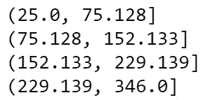

图 4.10 – 对糖尿病数据进行分箱的结果

你现在已经熟悉了数据科学家用来实现高性能模型和解决商业问题的许多小技巧。这个列表远非详尽无遗，随着你使用 AutoML 构建更多模型，你将遇到更多技巧。每次当你发现一些提高模型性能的有趣方法时，重要的是将它记录下来并将代码存储在代码库中。

每当你遇到一个看似无法解决的问题时，重新阅读本节中的所有提示，然后搜索你的代码库。大多数时候，有了正确的数据和适当的转换，AutoML 将能够生成与大多数数据科学家相当解决方案。有时，这只是一个微调设置的问题。有时，你唯一能做的就是尝试将你的回归问题转化为分类问题，然后再次尝试。

最后一件能帮助你更有效地使用 AutoML 的事情是理解该技术背后的算法。

## 理解 AutoML 回归算法

AutoML 使用了众多最先进的机器学习算法。虽然你不需要理解它们来使用 AutoML，但更多地了解它们将有助于你作为数据科学家的成长。某些算法在某些情况下表现更好。此外，你可以将这些算法大致分为五组。

**标准回归算法**是指那些为你的解释变量分配系数以预测目标列的算法。AutoML 使用了其中的两种技术：**弹性网络**和**LARS**（**最小角度回归**）**lasso**。

弹性网使用 L1 和 L2 正则化技术训练回归模型。**L1**，也称为**lasso**，将不重要变量的系数减少到 0，而**L2**，称为**ridge**，减少不重要变量系数的值。弹性网结合这两种技术来创建更简单、更容易解释的模型，同时不会像 lasso 回归那样丢弃许多变量。LARS lasso 是一种针对具有许多列的数据的技术，它迭代地使用最重要的列，但在噪声数据上表现不佳。

**树算法**根据一系列 if-then 决策规则来分割数据，结果是一个类似于分支树的映射。随着你向下深入树，最终你会到达一个点，算法根据它创建的一系列规则预测一个值。AutoML 使用这三种技术：

+   **决策树**是一种简单且易于解释的算法，但容易过拟合，在训练数据上表现良好，但牺牲了推广到新数据的能力。

+   **随机森林**通过创建决策树的集合并平均它们来工作。每个树都是从训练集的随机样本中创建的，并且列是随机选择的来创建决策规则。

+   **极度随机树**更进一步，通过随机化选择的分割值来增加随机性。这种随机性在推广到新数据时减少了模型的方差，从而创建了更好的模型。

**梯度提升算法**通过结合许多表现不佳的决策树模型，称为**弱学习器**，来工作。这些算法首先创建一个单一的弱学习器，寻找它表现不佳的数据点，并在该数据子集上创建另一个弱学习器。这个过程会重复进行，直到达到某个阈值。AutoML 使用这三种算法中的三种：**XGBoost**、**LightGBM**和**梯度提升**。这三种算法的工作方式相似，并且基于它们的高性能而被选中，但必须仔细调整以避免过拟合。

**最近邻算法**通过查看每一行数据并计算相似数据点的平均值，称为最近邻，来工作。K-最近邻是 AutoML 使用的唯一一种最近邻算法。K 指的是算法在做出预测时检查的最近邻数量。当你的数据列数较少时，KNN 表现良好，因为它在使用许多列来预测目标列时容易过拟合。

**优化算法**是那些通过迭代最小化目标函数来尝试收敛到最佳预测的算法。AutoML 使用这三种：**随机梯度下降**（**SGD**）、**在线梯度下降回归器**和**快速线性回归器**。这些算法中的每一个都是通过为每一列找到目标函数的斜率，并沿着斜率向下工作，直到通过调整权重尽可能接近 0。

这是一个非常缓慢的过程，SGD 通过随机选择斜坡上的数据点来尽可能快地达到最小值；在线梯度下降回归器的工作方式类似，但具有不同的加权选项。快速线性回归器使用一种称为**随机双坐标上升**（**SDCA**）的新最优化技术，它优化的是双损失函数而不是其他算法的单个损失函数。

图 4.11 提供了 12 种算法的总结。

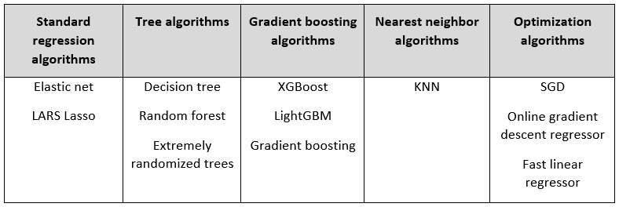

图 4.11 – AutoML 回归算法

除了前面提到的 12 种算法之外，AutoML 在每个 AutoML 训练运行的末尾还会执行**模型集成**。模型集成是指将多个机器学习模型的预测结果结合起来进行预测。AutoML 使用两种集成技术：投票和堆叠。

**投票集成**对回归模型进行加权平均，并使用这个平均值进行预测。**堆叠集成**则相反，使用其他模型的输出训练一个弹性网络模型。AutoML 在每个训练运行中训练一个投票集成和一个堆叠集成。通常，这两个集成模型中的一个是你的最高性能模型。

更多关于这些模型的信息，请参阅位于[`docs.microsoft.com/en-us/azure/machine-learning/how-to-configure-auto-train#configure-your-experiment-settings`](https://docs.microsoft.com/en-us/azure/machine-learning/how-to-configure-auto-train#configure-your-experiment-settings)的 AutoML 文档。

# 摘要

通过本章的学习，你已经成功使用 AzureML Python SDK 构建了一个回归模型。无论你是 Python 新手还是专家，你都加载了数据，使用 pandas 进行了广泛的转换，并使用 AutoML 构建了一个有用的机器学习模型。然后，你将模型注册到 AMLS 工作区。你将在未来的章节中使用相同的模型，通过 REST API 创建推理管道和实时评分端点。

通过完成本章的所有练习，你已经掌握了 Azure AutoML 回归解决方案的水平。你现在可以使用任何有用的数据集来预测一个数字，并使用它创建一个高性能的机器学习模型。此外，你可以用 Python 编写所有这些代码，如果模型表现不佳，你知道许多小方法来提高性能，或者，在最坏的情况下，将你的回归问题转换为分类问题。

在*第五章*《构建 AutoML 分类解决方案》中，你将学习如何使用 AutoML 解决这些分类问题，然后构建一个预测类别而不是数字的机器学习模型。
