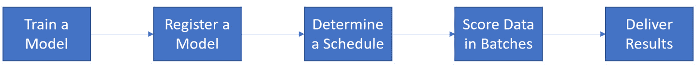
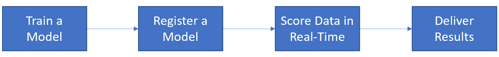
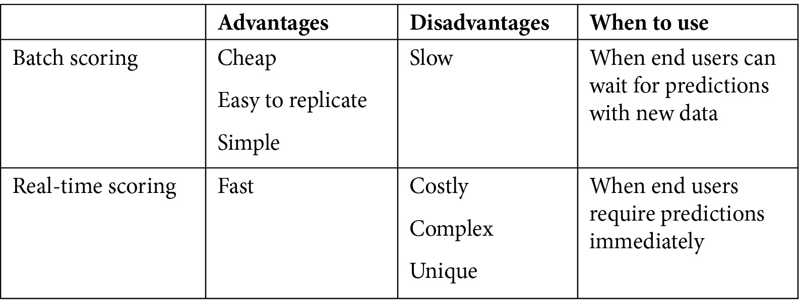
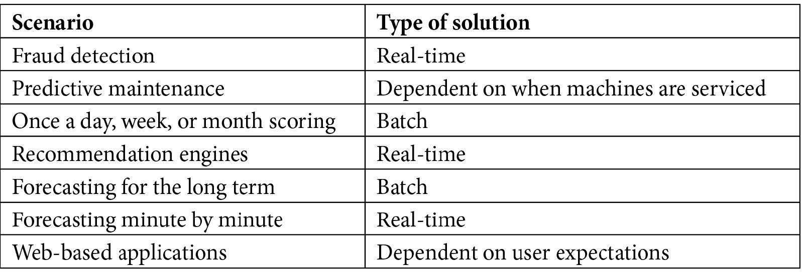

# *第八章*：选择实时评分与批量评分

如你在前几章中体验到的，训练 AutoML 模型简单直接。无论你选择使用**Azure 机器学习工作室**（**AMLS**）**GUI**来训练模型，还是在 Python 中使用 Jupyter 编写 AutoML 解决方案的代码，你都可以在几分钟内构建高度准确的机器学习（ML）模型。然而，你仍然需要学习如何部署它们。在 Azure 中，你可以将之前训练好的机器学习模型以**实时**和**批量**两种方式部署到新数据的评分中。

在本章中，你将首先学习什么是**批量评分解决方案**，何时使用它，以及何时重新训练批量模型是有意义的。接着，你将学习什么是**实时评分解决方案**，何时使用它，以及何时重新训练实时模型是有意义的。最后，你将通过阅读各种不同的场景，确定应该使用哪种类型的评分。所有场景都是基于真实公司面临的常见问题。

到你完成本章时，你将获得一项宝贵的技能：能够识别何时应该构建批量评分解决方案，何时应该构建实时解决方案。

批量评分场景需要你构建机器学习（ML）管道，你将在*第九章**，实现批量评分解决方案*中学习到这方面的内容。另一方面，实时评分场景需要你在**Azure Kubernetes 服务**（**AKS**）上构建实时评分端点，这将在*第十一章**，实现实时评分解决方案*中介绍。很多时候，组织错误地实施了错误类型的解决方案，但你将能够避免这种陷阱。

在本章中，我们将涵盖以下主题：

+   架构批量评分解决方案

+   架构实时评分解决方案

+   确定批量与实时评分场景

# 技术要求

*第七章**，使用多模型解决方案加速器*，涉及大量的复杂 Python 编程。本章提供了一些喘息的机会；你将不会进行编码，而是通过阅读业务场景和应用适当的解决方案来学习重要的技能。因此，本章没有技术要求。

# 架构批量评分解决方案

**批量推理**是指在基于时间周期性重复的批次上对新数据点进行评分。随着时间的推移收集新数据，然后进行评分，生成新的预测。这是现代公司使用机器学习模型最常见的方式。

在本节中，你将学习如何使用 Azure AutoML 训练的模型架构一个完整的、端到端的批量评分解决方案。你还将了解为什么以及在什么情况下应该优先考虑批量评分而不是实时评分解决方案。

## 理解五步批量评分流程

您制作的每个批量评分解决方案都应该遵循一个五步流程。这个过程从使用 AMLS 训练并注册一个机器学习模型开始，就像您在前几章中所做的那样。回归、分类和预测模型都遵循相同的模式。依次的五步如下：

1.  **训练模型**。您可以使用与*第三章**“训练您的第一个 AutoML 模型”中相同的方式，使用 AMLS 图形用户界面进行模型训练，或者使用计算实例上的 Python 进行训练，就像在*第四章**“构建 AutoML 回归解决方案”、*第五章**“构建 AutoML 分类解决方案”和*第六章**“构建 AutoML 预测解决方案”中所做的那样。

1.  **注册您的模型**。同样，您可以使用 AMLS 图形用户界面或通过在计算实例上运行的 Python 来完成这项任务。注册一个模型将其保存到您的 AMLS 工作空间，并允许您稍后引用它。

1.  **确定时间表**。批量推理的常见时间表是每小时、每周或每月，尽管您可能需要根据业务问题的需求更频繁或更少地安排它。

1.  **批量评分数据**。批量大小可以从一个数据点到一次处理数十亿个数据点不等。这一步是您运行批量推理代码的地方。在 Azure 中，我们使用机器学习管道。您将在*第九章**“实现批量评分解决方案”中学习如何编码机器学习管道。

1.  **交付结果**。一旦您运行了机器学习管道并做出了新的预测或预测，您需要将这些结果发送到报告或数据库。在 Azure 中，使用名为**Azure Data Factory**（**ADF**）的工具将 AMLS 的结果发送到其他数据库。您将在*第十章**“创建端到端 AutoML 解决方案”中学习如何使用 ADF。

*图 8.1*展示了整个端到端过程。虽然您将为您的 AutoML 训练模型实现批量推理解决方案，但您可以使用相同的过程部署任何机器学习模型。确保您解决方案成功的关键在于将您的批量作业时间表与您的业务需求相匹配：

图 8.1 – 批量评分过程

现在您已经了解了这个过程，是时候深入了解每一步了。您已经熟悉了训练 AutoML 模型并将它们注册到您的 AMLS 工作空间中。接下来，您将学习在确定批量评分解决方案的时间表时需要考虑哪些因素。

## 安排您的批量评分解决方案

最终，你已经训练了一个 AutoML 模型来满足某些商业目标。也许你需要决定保留哪些产品以及淘汰哪些产品。也许你需要预测下季度的产品需求。你可能负责一支职业体育队伍，需要决定为即将到来的赛季挑选哪些球员。无论如何，你需要确保以合理的方式安排你的批量推理作业，以满足你的商业需求。

确定何时安排你的作业的关键基于三个因素：

+   商业需要做出决策的频率

+   数据可用性

+   你的批量评分作业运行所需的时间

首先，你需要知道业务多久做出一次决策，以帮助你的模型。对于一个职业体育队伍做出选秀决策的情况，这意味着你只需要每年运行一次作业。如果你为一家每季度决定其产品组合的企业工作，你的产品需求模型应该安排每年运行四次。同样，如果你为一家快餐店构建了一个模型，告诉他们为下一小时准备什么食物，你的批量推理解决方案应该每小时运行一次。你运行模型频率被称为**模型节奏**。

其次，你需要确保有新的数据可供你的模型评分。这被称为**数据可用性**。即使你的业务问题要求每小时做出新的预测，如果你的数据只每天刷新一次，你应该构建一个每天评分一次数据的模型。换句话说，你需要训练一个预测 24 小时并每天评分一次的预测模型，而不是一个预测 1 小时并每天运行 24 次的预测模型。始终在项目开始时确定数据可用性。这将为你节省大量时间。

最后，你需要注意你的批量作业运行的时间。即使你希望每 5 分钟评分一次数据，并且每 5 分钟就有新的数据可用，如果你的批量评分作业需要 10 分钟才能完成，你将限制评分和交付结果的频率。在这种情况下，考虑切换到实时解决方案。

一旦你确定了模型的节奏、数据的可用性以及你的批量作业运行所需的时间，下一步就是确定你的作业应该在何时运行——精确到秒。

在一个理想的世界里，你会在所有相关数据都可用时才运行你的模型。对于职业体育的例子，你希望拥有所有选秀球员的数据。对于每小时餐厅数据，你希望有最新的客流量、销售额、天气和交通数据来做出你的预测。

然而，在现实世界中，您应该始终预期会出现数据可用性问题。某些玩家数据可能会随机缺失。有时，天气或人流量数据可能会无故迟到。销售数据可能会因取消订单或信用额度用尽而损坏。因此，您应该简单地安排您的作业在最后可能的一刻运行。确保您包括一个缓冲时间来考虑**计算集群启动时间**。

计算集群的启动时间可能会有很大差异，因此您在解决方案上运行大量测试以了解启动所需的最大时间是很重要的。将您的缓冲时间设置为集群启动所需的最大时间，只要这看起来合理。通常，这不应超过 5 到 10 分钟。如果需要更长的时间，请提交支持工单。这样，您可以确保您的作业始终按时运行。

重要提示

虽然您可以设置您的最小计算集群节点数为`1`以实现更快、更一致的加速时间，但这意味着您每天 24 小时、每周 7 天都在付费，抵消了批量解决方案固有的成本节约优势。将计算集群节点数设置为`0`将随着时间的推移带来实质性的成本节约。

通过安排您的作业在业务将审查您的预测以协助其决策的同一时间运行，您为上游系统收集、转换和修复数据提供了尽可能多的时间。您还基于最新的数据提供了尽可能好的预测。您还需要考虑如何批量评分数据。

## 批量评分数据和交付结果

在 AMLS 中，批量评分发生在 ML 管道内。ML 管道要求您指定一个环境，编写一个评分脚本以访问您的模型，并将结果写入数据存储，最可能的是写入 Azure 存储账户中 blob 容器上的文件系统，以 CSV 文件的形式。您将在*第九章*“实现批量评分解决方案”中学习如何完成所有这些操作。

然而，运行机器学习（ML）管道仅仅生成和存储预测结果。这并不等同于交付结果。直接咨询业务部门是确定您的数据最终应放置何处的最佳方式。有时，他们可能希望您将预测存储在他们可以直接访问的 SQL 数据库中。其他时候，他们可能希望通过电子邮件收到 Excel 文件。通常，他们会要求您将结果推送到他们可以通过移动设备访问的 Web 应用程序。

AMLS 本身可以直接将结果写入 Azure Data Lake Storage 账户（第一代和第二代）、Azure SQL 数据库、Azure Blob 存储、Azure 文件共享、Azure PostGreSQL、Azure Database for MySQL 和 Databricks 文件系统。ML 管道可以直接将这些类型的数据存储移动到这些存储中。但这仅限于此；仅使用 ML 管道无法直接将数据从 Azure 中移出。

通常情况下，商业人士会要求你在其他地方落地你的 AutoML 模型的结果，例如本地数据库或文件共享。ADF 是移动数据进入和离开 Azure 的完美工具。你将在*第十章*“创建端到端 AutoML 解决方案”中学习如何使用 ADF 来解决这个问题。

理解这个过程是第一步。接下来，你需要了解何时以及为什么应该使用批量评分解决方案而不是它们的实时对应方案。

## 选择批量而非实时

实时解决方案在数据点到来时立即对它们进行评分。与批量不同，不需要等待计算集群启动；实时评分集群永远不会关闭。一旦新数据到来，新的预测就会自动生成。虽然这似乎是批量评分的一个有吸引力的替代方案，但有两个主要原因你应该优先考虑批量推理而不是实时推理：成本和复杂性。

在使用云计算时，你只有在需要时才为资源付费。对于批量推理，当你的作业运行时，一个计算集群会启动，一旦作业运行完成，它就会关闭。对于实时推理，你的集群将全天候运行，每周 7 天。这意味着实时推理解决方案的成本比它们的批量推理等效方案高得多。

复杂性也是一个关键问题。对于批量解决方案，你只需要将新数据移动到你的 Azure 数据存储中，对其进行评分，然后发送到另一个数据库进行最终交付。这是一个简单、可重复的模式，适用于广泛的问题。

另一方面，实时解决方案从来都不是那么简单直接。任何实时解决方案的核心都是一个**评分端点**。这些端点可以在任何代码的任何地方使用。有时，你可能希望将它们集成到 Web 应用程序中；其他时候，你可能希望将它们集成到支持持续流动数据的应用程序中。而批量评分解决方案遵循的是一种标准模板，实时解决方案通常更复杂且独特。

回顾一下，批量评分解决方案相对于实时解决方案有以下优势：

+   运行成本更低。

+   结构更简单。

+   它们很容易复制，因为它们遵循一个模板。

现在你已经了解了批量推理解决方案是什么以及为什么应该使用它们，是时候看看实时解决方案了。实时解决方案不像批量解决方案那样普遍，但它们确实专门支持大量的用例。它们也非常强大，需要深思熟虑，并且创建起来很有趣。

# 架构实时评分解决方案

**实时推理**指的是在数据点到达时进行评分，而不是基于时间表进行评分。新数据流入，新的预测结果产生。虽然不如批量推理常见，但实时推理在许多场景中被公司使用，例如信用卡欺诈检测、工厂地面的异常检测，以及在线购物时推荐产品。

在本节中，您将学习如何使用 Azure AutoML 训练的模型构建一个完整、端到端的实时评分解决方案。您还将了解为什么以及在什么情况下，您应该优先考虑实时评分而不是批量评分解决方案。

## 理解四步实时评分过程

实时评分解决方案遵循与批量评分解决方案略有不同的流程。只有四个步骤。与批量解决方案一样，该过程从训练一个 ML 模型并将其注册，就像您在前几章中所做的那样开始。您可以使用任何类型的 ML 模型，包括回归、分类和预测，它们都遵循相同的模式。以下四个步骤如下：

1.  **训练模型**。当训练用于实时部署的模型时，请特别注意在评分时模型将可用的数据。错误地包含那些实际上不会始终可用给实时解决方案的数据是很常见的。

1.  **注册您的模型**。您可以使用 AMLS 图形用户界面或在一个计算实例中运行的 Python 代码进行注册。

1.  **实时评分数据**。这一步是您运行实时推理代码的地方。在 Azure 中，我们使用 AKS 创建实时评分端点。您将在*第十一章*“实现实时评分解决方案”中学习如何创建和使用 AKS 以及实时评分端点。

1.  **交付结果**。实时交付结果与批量交付结果有很大不同，并且取决于问题。通常，结果将显示在某个面向用户的应用程序上。在其他情况下，您的结果将被输送到一个数据库中，如果满足条件，则会触发警报。想想看，如果算法检测到您的账户上有欺诈性的信用卡使用，您可能会收到短信。

*图 8.2*显示了整个端到端过程。虽然您将为 AutoML 训练的模型实现实时推理解决方案，但您可以使用此相同的过程来实时部署任何 ML 模型。确保您解决方案成功的关键在于将您的实时解决方案与您的业务需求相一致：

图 8.2 – 实时评分过程

现在您已经了解了这个过程，是时候深入了解每个步骤了。首先，您需要回顾为实时部署训练模型时的独特考虑因素。

## 为实时部署训练模型

当你使用 AutoML 或自定义 ML 模型训练用于实时部署的模型时，最重要的考虑因素是数据可用性。批量评分解决方案并不经常运行；数据会积累，你一次将它们全部传递。在实时解决方案中，数据不断生成和评分。因此，你需要问自己，你的解决方案是否始终能够及时访问数据。

一个很好的例子是按分钟实时评分快餐产品需求。需求的最大预测因素之一是当前排队在快车道上的汽车数量。如果你有可靠的视频技术可以记录汽车、计数并将它们按分钟传递到你的实时评分端点，那么你应该使用这些数据。然而，如果视频流需要 3-5 分钟才能传递这些数据，那么你不应该用它进行按分钟评分。

因此，在每一个项目的开始阶段，你应该花大量时间去弄清楚你将何时以及如何获得哪些数据。这是另一种数据可用性问题。如果你的数据将在评分的节奏下可用，请使用它。如果不行，请丢弃它。此外，如果由于可靠性问题（例如，一个经常返回空值的天气 API）数据有时才可用，请丢弃它。

你现在应该对数据可用性对于实时评分的重要性有了一个明确的理解。现在是时候考虑你应该如何评分数据和交付结果了。

## 实时交付结果

使用 AMLS 创建实时解决方案意味着创建一个由 AKS 托管的实时评分端点。你将在*第十一章*“实现实时评分解决方案”中了解更多关于这个主题的内容。**评分端点**是一个你可以传递数据以生成预测的 Web 服务。一旦创建，你可以在任何代码片段中放置这些端点。

通常情况下，实时评分解决方案的结果将被嵌入到应用程序中。在考虑交付时，你应该始终考虑以下三个因素：

+   是人类还是自动化系统接收你的预测？

+   人类将如何接收你的结果？

+   自动化系统会对你的预测做些什么？

在人类接收你的预测的情况下，你需要确定他们期望如何接收它们。通常，是通过他们可以在 PC 或移动设备上访问的应用程序。餐厅中的预测可能显示在面向员工的店内应用程序上。工厂车间的预测可能发送到移动设备上。

在您的预测被发送到自动化系统的情况下，您需要弄清楚系统是否会根据某些事件向人类发送警报，或者预测是否仅用于控制某些流程。如果是后者，您只需要编写将预测移动到该流程使用的适当数据库的代码。

另一方面，如果自动化系统需要向人类发送警报，您需要决定人类将收到哪些事件的警报。以信用卡欺诈检测为例。您只想提醒用户有欺诈交易；您不希望他们被每个交易的警报淹没。

考虑到交付的重要性，您接下来需要深入了解何时使用实时评分解决方案而不是它们的批量等效方案。

## 了解何时使用实时评分

批量推理是数据科学家使用的默认评分类型。这是因为它成本低、可靠且易于复制。然而，许多情况要求实时推理。关键问题是，"一旦数据可用，我需要多少时间给业务部门提供预测？"这实际上是最重要的考虑因素。从新数据可用并准备好评分的那一刻起，如果用户期望在无法通过批量评分实现的时间内获得结果，就必须使用实时评分。

考虑这样一个案例，用户将数据发送到基于 Web 的应用程序，并在屏幕上返回预测。在这种情况下，如果您使用批量处理，预测可能需要 5 到 15 分钟才能显示在屏幕上。这是因为计算集群需要时间启动，环境需要一点时间来创建，而您的代码需要时间运行。

然而，如果您使用实时评分，则只需运行您的代码，这大大减少了总运行时间。如果您的用户期望几乎即时的结果，您需要构建实时解决方案。如果他们愿意等待，那么您应该构建更便宜的批量解决方案。

重要提示

在选择实时解决方案的 CPU 时，始终选择最便宜的，它可以在及时的方式下评分您的数据。虽然更强大的 CPU 可能会节省您的时间，但它们每个月也会额外花费数百美元，每个月您的解决方案存在。

其他需要实时解决方案的常见场景包括**交易欺诈检测**、工厂环境中的**异常检测**以及**推荐引擎**。这是因为这些情况需要一旦数据可用就立即进行预测。再次强调，这是关键考虑因素。然而，也存在一些情况，批量处理可能更为合适。

考虑异常检测的案例。如果你在工厂车间有众多机器运行，并且需要知道何时有一台机器损坏以便你能够**立即**用备用机器替换它，这种情况需要实时解决方案；关键词是**立即**。你越快用备用机器替换损坏的机器，你的工厂表现越好，节省的金钱越多。

另一方面，想象一下，这些机器也显示出磨损的迹象，并且几天前，你可以安排工程师来维修以保持它们正常运行。在这种情况下，你仍然会使用异常检测机器学习解决方案来检测何时需要维护机器，但你应该批量评分数据。这是因为没有迫切需要立即修复机器。因此，你应该每天在一天结束时评分数据，并按需安排工程师。

你在创建实时评分解决方案方面获得的经验越多，你就能越准确地判断何时是必需的。始终问自己，“一旦我的数据可用，我的客户能等多久才能得到预测？”如果他们可以等待，就构建一个批量解决方案。如果他们不能等待，就构建一个实时解决方案。

在决定使用哪种类型的解决方案时，还有一些其他因素需要考虑。

## 选择实时而非批量解决方案

总结一下，如果没有迫切需要在数据到达时立即评分，批量解决方案应该始终优先于实时解决方案。这是因为实时评分解决方案本质上比批量评分解决方案更昂贵，因为你的计算集群永远不会关闭。另一方面，如果迫切需要在数据可用时立即评分，你需要使用实时解决方案来避免批量过程中固有的延迟。

复杂性也是一个问题。批量评分解决方案总是遵循相同的模板：收集数据，评分数据，将结果发送到某个文件或数据库。实时解决方案并非如此；它们需要仔细集成到应用程序中。以下比较了实时和批量评分解决方案：

图 8.3 – 比较批量和实时评分

能够理解批量和实时评分解决方案之间的区别是一回事；能够运用这种知识是另一回事。在下一节中，你将测试你的知识。

# 确定批量与实时评分场景

当面对实际业务案例时，往往很难区分你应该如何部署你的机器学习模型。许多数据科学家在需要实时解决方案时错误地实现了批量解决方案，而其他人则在更便宜的批量解决方案就足够的情况下实现了实时解决方案。

在以下各节中，您将查看不同的问题场景和解决方案。阅读这六个场景，并确定您是否应该实施实时或批量推理解决方案。首先，您将查看每个场景。然后，您将阅读每个答案及其解释。

## 实时或批量评分的场景

在本节中，您将看到六个场景。仔细阅读每个场景，并决定批量评分解决方案或实时评分解决方案哪个更合适。

### 场景 1 – 需求预测

一家快餐公司正在尝试确定在任何给定的一天需要多少袋冷冻薯条。您的机器学习回归算法生成的预测将用于确定每个地点需要多少袋薯条。每周一次，车队将从位于中心的仓库将薯条运送到每个商店。您的评分解决方案应该是实时处理还是批量处理？如果是批量处理，那么应该多久评分一次新数据？

### 场景 2 – 基于网络的供应链优化应用程序

一家化工公司正在尝试优化其供应链，并在每个仓库都设有操作员。他们每天都会将数据输入到基于网络的应用程序中，该应用程序将用于确定第二天送货路线。

您的机器学习回归算法生成的预测将预测每条可能路线的总盈利能力，并生成最佳路线。预计操作员每天会手动将数据输入到应用程序中。这个解决方案应该是批量处理还是实时处理？如果是实时处理，那么它将带来哪些好处？

### 场景 3 – 欺诈检测

一家信用卡公司正在实施欺诈检测算法。最近，客户报告了许多可疑交易，并因此离开。一旦检测到欺诈活动，公司希望立即阻止交易并通知客户他们的交易已被阻止。

您的机器学习分类算法生成的预测将阻止任何可疑交易，并将发送短信到客户的手机。这个解决方案应该是批量处理还是实时处理？如果是批量处理，那么应该多久评分一次新数据？

### 场景 4 – 预测性维护

一家汽车公司正面临机器故障的问题。每次机器出现故障，整个生产线都会停工等待机器修复，这给公司造成了数万美元的损失。大约每个月一次，工程师会对机器进行维护，但工程师的数量仅足以修复 20%的机器。

您的机器学习分类算法将告诉这些工程师哪些机器需要维修，并按优先级安排维修。这个解决方案应该是批量处理还是实时处理？如果是批量处理，那么应该多久评分一次新数据？

### 场景 5 – 基于网络的成本规划

一家航空航天公司正在尝试预测一款新飞机系列的盈利能力，并希望根据规格预测原材料和劳动力的成本。定价经理将手动将相关数据输入到基于网络的程序中，并希望立即从您的机器学习回归算法中看到预测价格。他们没有固定的时间来做这件事，他们可能在单个会话中多次运行该程序。

您应该设计这个解决方案为批量还是实时？如果是批量，应该多久评分一次新数据？

### 场景 6 – 推荐引擎

一家零售店正在建立一个网站。当客户浏览并添加新项目到他们的购物车时，该店希望向这些客户推荐其他要购买的项目。您的机器学习回归算法将根据客户浏览的内容实时为项目分配分数，得分最高的项目将自动显示给他们。这个解决方案应该设计为实时还是批量？如果是批量，应该多久评分一次新数据？

深入思考每个场景，然后继续下一节。

## 每个场景适合的解决方案类型答案

在本节中，您将回顾每个六个场景的答案。阅读每个解释，然后回顾原始场景以获得清晰。

### 场景 1 – 批量推理解决方案

场景 1 是机器学习的典型案例。快餐公司希望每周预测薯条的销量。数据来自所有门店，应每周使用批量推理过程进行评分。一旦生成预测，薯条就可以装上卡车，并运送到所有门店。

这是一个*批量解决方案*，因为数据只需要每周评分一次，而且没有迫切需要在数据可用时立即生成预测。

### 场景 2 – 批量推理解决方案

场景 2 可以使用实时或批量推理解决方案。当操作员手动将数据输入到基于网络的程序中时，这仅仅是一个他们愿意等待多长时间的问题。由于这是一次性每日操作，结果将在第二天使用，因此最好是牺牲时间换取金钱，选择*批量推理过程*。然而，如果您在这个场景中构建了一个*实时解决方案*，这将有一个好处。操作员可以立即看到结果，而无需等待 10 到 15 分钟。

### 场景 3 – 实时推理解决方案

场景 3 是一个经典的实时推理用例。欺诈交易必须立即检测到，也就是说，一旦交易数据可用。这种速度使得交易可以立即被阻止，并且客户可以尽快收到通知。

批量推理解决方案无法提供所需的速度。此外，每个数据点都必须在到达时单独评分。没有时间将数据批量汇总，或者启动计算集群。

### 场景 4 – 批量推理解决方案

场景 4 是一个棘手的情况。预测性维护有时可能需要实时推理，尤其是在异常检测表明即将发生故障并且有应急人员待命准备修复问题时。

然而，在这种情况下，工程师们每月只能服务一次机器。因此，没有迫切需要立即的结果。对于这种情况，*每月一次的批量处理解决方案*最为合适。

### 场景 5 – 实时推理解决方案

场景 5 与场景 2 类似，但有三个主要区别：

+   定价经理不会按照固定的时间表运行评分解决方案。

+   定价经理可能会在一个设置中多次运行该解决方案。

+   定价经理期望立即得到结果。

立即的结果应该让你知道这是一个 *实时评分解决方案*。如果你用批量处理设计了此解决方案，每次定价经理运行他们的数字时，他们都会经历长时间的等待。你可以改变应用程序以使其更友好地处理批量的一种方法就是允许定价经理一次输入所有场景的数据，而不是逐个输入。

### 场景 6 – 实时推理解决方案

场景 6 是另一个经典的实时推理场景。推荐引擎需要非常快，并根据用户点击、查看和添加到购物车的内容进行变化。它们还需要根据客户购买的内容进行变化。每次屏幕变化时，都必须对新的数据进行评分，以便向用户展示适当的商品。性能也非常重要，因为算法必须跟上用户的行为。每个由机器学习驱动的推荐引擎都应该在 *实时* 下使用。

你在六个场景中的表现如何？你是否达到了 100% 的准确率？无论哪种情况，看看 *图 8.4* 以了解常见场景如何映射到实时或批量评分解决方案：

图 8.4 – 常见场景如何映射到实时或批量处理

如果你第一次尝试就能准确地决定哪种评分解决方案适合你的每个场景，那么你已经顺利通过了。你现在对哪些情况需要实时推理解决方案以及哪些情况需要批量推理解决方案有了深入的理解。如果你在一个或多个场景中犯了错误，请重新阅读所有场景，直到你直觉上理解了它们之间的区别。

记住，决定使用哪种类型解决方案的最重要因素是相对于数据何时可用，你需要预测的速度有多快。如果最终用户可以等待，请使用批处理。如果应用程序需要即时响应，请使用实时。理解这种差异不仅会使你成为一名优秀的数据科学家，而且还能为你和你的组织节省时间、金钱和精力。

# 摘要

你现在对批处理和实时推理有了牢固的理解，以及何时使用哪种类型的评分解决方案。这很重要，因为即使是经验丰富的数据科学家在设计端到端 ML 解决方案时偶尔也会犯错误。

此外，大多数 ML 课程都侧重于模型训练而不是部署，但要想成为一名有效的数据科学家，你必须在这两方面都精通。在接下来的章节中，你将学习如何在 AMLS 中编写这些推理方法的代码。

在*第九章**，实现批评分级解决方案*中，你将逐步学习如何使用你已构建的 ML 模型在批评分级场景中。你将在 AMLS 中创建 ML 管道，并学习如何安排它们在定时器上运行。这将使你能够轻松地将你的 ML 模型投入生产，并成为你公司或组织的宝贵资产。
