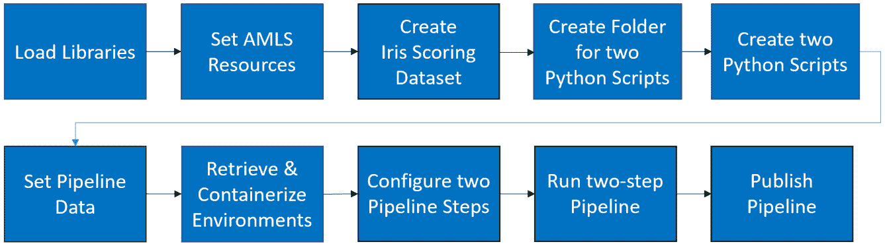

# *第九章*：实现批量评分解决方案

你已经在 Azure 中用 AutoML 训练了回归、分类和预测模型，现在是时候学习如何将它们投入生产并使用了。毕竟，**机器学习**（**ML**）模型最终是用来对新数据进行预测的，无论是在实时还是在批量中。为了在 Azure 中批量评分新数据点，你必须首先创建一个机器学习管道。

机器学习管道允许你在**Azure 机器学习服务**（**AMLS**）中运行可重复的 Python 代码，你可以在计划中运行这些代码。虽然你可以使用机器学习管道运行任何 Python 代码，但在这里，你将学习如何构建用于评分新数据的管道。

你将从此章节开始，编写一个简单的机器学习管道，使用在*第五章*“构建 AutoML 分类解决方案”中训练的 Iris 数据集的多分类模型来评分数据。使用相同的数据，你将学习如何并行评分新的数据点，从而让你能够快速同时评分包含数百万到数十亿数据点的模型。

一旦编写了这两个管道，你将学习如何创建用于重新训练 AutoML 模型的机器学习管道。最后，你将学习如何通过 GUI 手动和通过**Azure ML SDK**编程方式重新触发机器学习管道。

到本章结束时，你不仅能够训练 AutoML 模型，而且能够以可重复、可自动化的方式使用它们来评分新数据。此外，你在这里学到的代码和技术适用于所有机器学习模型，而不仅仅是 AutoML 生成的模型。编写批量评分解决方案是任何机器学习工程师的关键技能，通过完成本章的练习，你将朝着掌握这一技能迈出重要一步。

在本章中，我们将涵盖以下主题：

+   创建机器学习管道

+   创建并行评分管道

+   创建 AutoML 训练管道

+   触发和安排你的机器学习管道

# 技术要求

本章将使用 AMLS 中的 Jupyter 笔记本进行大量编码。因此，你需要一个有效的互联网连接、一个**AMLS 工作空间**和一个**计算实例**。机器学习管道还需要一个**计算集群**。你还需要在*第五章*“构建 AutoML 分类解决方案”中训练并注册 Iris 多分类模型。

本章的先决条件如下：

+   访问互联网。

+   一个网络浏览器，最好是 Google Chrome 或 Microsoft Edge Chromium。

+   一个 Microsoft Azure 账户。

+   已创建一个 AMLS 工作空间。

+   在*第二章*，“Azure 机器学习服务入门”中创建了`compute-cluster`计算集群。

+   了解如何从 Azure 计算实例导航到 Jupyter 环境的方法，如 *第四章*，*构建 AutoML 回归解决方案* 中所示。

+   在 *第五章*，*构建 AutoML 分类解决方案* 中训练并注册了 `Iris-Multi-Classification-AutoML` 机器学习模型。

本章的代码在此处可用：[`github.com/PacktPublishing/Automated-Machine-Learning-with-Microsoft-Azure/tree/master/Chapter09`](https://github.com/PacktPublishing/Automated-Machine-Learning-with-Microsoft-Azure/tree/master/Chapter09)。

# 创建一个机器学习流程

机器学习流程是 Azure 的批量评分机器学习模型的解决方案。你可以使用机器学习流程来评分你训练的任何模型，包括你自己的自定义模型以及 AutoML 生成的模型。它们只能通过使用 Azure ML Python SDK 的代码来创建。在本节中，你将编写一个简单的流程来使用你在 *第四章*，*构建 AutoML 回归解决方案* 中构建的 `Diabetes-AllData-Regression-AutoML` 模型来评分糖尿病数据。

如其他章节所述，你将首先打开你的计算实例并导航到你的 Jupyter 笔记本环境。然后创建并命名一个新的笔记本。一旦你的笔记本创建完成，你将逐步构建、配置和运行一个机器学习流程。确认你的流程成功运行后，你将然后发布你的机器学习流程到流程端点。**流程端点**只是 URL，是调用机器学习流程运行的网页地址。

以下步骤与之前的章节有很大不同。你将需要加载更多的库，并编写一个用于评分新数据的自定义 Python 文件。你还将学习如何创建 **环境**，即指定你使用的 Python 包、包版本和软件设置的工件。

除了创建环境之外，你还需要对其进行容器化。最后，你需要配置并运行你的机器学习流程，通过将流程发布到端点来完成整个过程。整个过程在 *图 9.1* 中展示：


图 9.1 – 创建你的机器学习评分流程所涉及的步骤

GitHub 仓库中的 `ML-Scoring-Pipeline.ipynb` 文件包含了所有步骤的代码。

## 编写你的机器学习评分流程的前三个步骤

首先，加载你的库，设置你的 AMLS 资源，并按照以下步骤创建一个用于评分的数据集：

1.  通过导航到 [`ml.azure.com/`](https://ml.azure.com/) 打开 **Azure 机器学习工作室**（**AML 工作室**）。

1.  点击 **计算** 并启动一个计算实例。任何计算实例都可以，因为它们都链接到相同的 Jupyter 笔记本环境。

1.  创建一个新的 Jupyter 笔记本，并将其命名为 `machine-learning-pipeline`。如果你需要复习如何做这件事，请查阅 *第四章*，*构建 AutoML 回归解决方案*。

1.  打开你刚刚创建的笔记本，并开始使用以下代码导入你将需要的所有标准 Azure 库：

    ```py
    from azureml.core import Workspace, Dataset, Datastore
    from azureml.core import Experiment, Environment, Model
    from azureml.core.compute import ComputeTarget
    ```

    *第四章*，*构建 AutoML 回归解决方案*，解释了 `Workspace`、`Dataset`、`Datastore`、`Experiment` 和 `ComputeTarget`。`Environment` 允许你创建一个对象，其中包含有关你的 ML 管道需要安装哪些 Python 包以成功运行的信息。`Model` 允许你检索之前训练的 ML 模型。

1.  继续导入所有 Azure ML 管道库，使用以下代码：

    ```py
    from azureml.core.runconfig import RunConfiguration, CondaDependencies, DEFAULT_CPU_IMAGE
    from azureml.pipeline.steps import PythonScriptStep
    from azureml.pipeline.core import Pipeline, PublishedPipeline
    from azureml.pipeline.core import StepSequence
    from azureml.widgets import RunDetails
    ```

    `RunConfiguration` 存储了你的 ML 管道运行所需的信息，包括环境和基础镜像。`CondaDependencies` 允许你向环境中添加 Python 包。`Default_CPU_Image` 用于指定你在运行配置中将要使用的基础镜像。`PythonScriptStep` 是 `Pipeline` 类型，是构建 ML 管道的核心包。`PublishedPipeline` 允许你将 ML 管道发布到端点。`StepSequence` 允许你设置 ML 管道步骤的顺序，而 `RunDetails` 则简单地显示你的 ML 管道在运行时的输出。

    重要提示

    如果你加载任何 Azure 库时遇到困难，请通过运行此处找到的 `Update AzureML SDK.ipynb` 笔记本来更新 Azure ML SDK：[`github.com/PacktPublishing/Automated-Machine-Learning-with-Microsoft-Azure/blob/master/Update-AzureML-SDK.ipynb`](https://github.com/PacktPublishing/Automated-Machine-Learning-with-Microsoft-Azure/blob/master/Update-AzureML-SDK.ipynb)。

1.  导入 `pandas`、`numpy` 和 `os`。`os` 允许你从 Jupyter 笔记本中创建和操作文件和文件夹。`random` 允许你生成随机数，这对于模拟新的鸢尾花数据很有用：

    ```py
    import pandas as pd
    import numpy as np
    import os
    import random as r
    ```

1.  将你的 Jupyter 笔记本连接到你的 AMLS 工作区：

    ```py
    ws = Workspace.from_config()
    ```

    如果你被提示登录，请按照说明操作。

1.  将你的计算集群设置为你在 *第二章*，*Azure 机器学习服务入门* 中创建的那个：

    ```py
    compute_name = 'compute-cluster'
    compute_target = ComputeTarget(ws, compute_name)
    ```

1.  设置你的数据存储：

    ```py
    datastore = Datastore.get_default(ws)
    ```

1.  接下来，你将创建用于评分的模拟鸢尾花数据。首先，使用以下代码创建四个变量，这些变量包含基于原始鸢尾花数据集最小值和最大值的数字列表。这些变量包含鸢尾花数据集中所有可能的值：

    ```py
    sepal_length_range = np.arange(4.3, 7.9, 0.1)
    sepal_width_range = np.arange(2, 4.4, 0.1)
    petal_length_range = np.arange(1, 6.9, 0.1)
    petal_width_range = np.arange(0.1, 2.5, 0.1)
    ```

1.  在创建模拟的鸢尾花数据集的过程中继续，创建一个名为 IrisDF 的空 `pandas` DataFrame，并包含适当的列名。同时，创建一个名为 `IrisList` 的空列表：

    ```py
    columns =\ ['sepal_length','sepal_width','petal_length','petal_width']
    IrisDF = pd.DataFrame(columns=columns)
    IrisList = []
    ```

1.  在创建模拟的鸢尾花数据集的过程中继续，使用 `random` 包中的 `choice` 函数在 `for` 循环中创建 100 个新的数据点，并将每个值四舍五入到 `1` 位小数。

    在 `for` 循环中，将每组四个数据点与 Python 字典中的列名组合，并将该字典逐行追加到 `IrisList`：

    ```py
    for i in range(0,100):
        values = \
    [round(r.choice(sepal_length_range),1),round(r.choice(sepal_width_range),1),round(r.choice(petal_length_range),1),round(r.choice(petal_width_range),1)]
        iris_dictionary = pd.DataFrame(dict(zip(columns, values)),index=[0])
        IrisList.append(iris_dictionary)
    ```

    此代码将为您留下从原始 Iris 数据集中随机生成的值列表，这些值可以转换为 `pandas` DataFrame。

1.  完成模拟 Iris 数据的创建，将 `IrisList` 追加到 `IrisDF`：

    ```py
    IrisDF = IrisDF.append(IrisList,True)
    ```

1.  使用以下代码注册您的模拟 Iris 数据：

    ```py
    Dataset.Tabular.register_pandas_dataframe(IrisDF, datastore, 'Iris_Scoring')
    ```

这将将其保存到您的数据存储中，并创建一个名为 `Iris Scoring` 的 Azure 数据集。

## 创建一个用于在您的机器学习管道中评分数据的 Python 脚本

在本节中，您将创建一个文件夹并编写一个 Python 脚本，您的机器学习管道将执行该脚本以评分数据，具体步骤如下：

1.  使用 `os` 创建一个用于存放评分脚本的文件夹：

    ```py
    os.makedirs('Scoring_Scripts', exist_ok=True)
    ```

    对于您做出的每个机器学习管道步骤，您都必须有一个相应的 Python 脚本。

1.  编写一个用于评分新数据的 Python 脚本。此脚本很长，必须是一段代码块。首先，使用 `%%writefile` 魔法命令编写一个新的 Python 脚本文件，名为 `Iris_Scoring.py`。`Run` 允许您的程序在远程计算集群上运行时访问您用于创建机器学习管道的 AMLS 工作区。

1.  在 `Iris_Scoring.py` 的同一单元格中继续，导入其他 Python 包：

    ```py
    import joblib
    import numpy as np
    import pandas as pd
    import os
    ```

    这里唯一的新包是 `joblib`，它将允许您加载保存的机器学习模型。

1.  在 `Iris_Scoring.py` 的同一单元格中继续，使用 `Run` 函数设置一个名为 `run` 的变量。您可以使用此变量设置您的 AMLS 工作区：

    ```py
    run = Run.get_context()
    ```

1.  在 `Iris_Scoring.py` 的同一单元格中继续，我们将创建一个名为 `main` 的函数。此函数将运行您的评分代码的主要部分。

    首先，使用您创建的 `run` 变量连接到您的 AMLS 工作区。接下来，将数据存储设置为默认选项，并将数据集设置为 `Iris Scoring`。将 `Iris Scoring` 数据集转换为名为 `scoringDF` 的 `pandas` DataFrame：

    ```py
    def main():
        ws = run.experiment.workspace
        datastore = Datastore.get_default(ws)
        dataset = Dataset.get_by_name(ws,'Iris Scoring')
        scoringDF = dataset.to_pandas_dataframe()
    ```

1.  在 `Iris_Scoring.py` 的同一单元格中继续，使用 Azure 的 `Model` 和 `joblib` 包加载您的 `Iris-Multi-Classification-AutoML` 模型：

    ```py
        model_path = Model.get_model_path('Iris-Multi-Classification-AutoML')
        model = joblib.load(model_path)
    ```

1.  在 `Iris_Scoring.py` 的同一单元格中继续，使用您的模型对 `scoringDF` 进行预测，将这些预测保存到 `pandas` 的 `Series` 中，并将这些预测添加到您的 `scoringDF` DataFrame 的新列 `Prediction` 中：

    ```py
        predictions = model.predict(scoringDF)
        predSeries = pd.Series(predictions)
        scoringDF['Prediction'] = predSeries
    ```

    当您添加新列时，预测将按正确顺序排列，并与相应的行匹配。

1.  在 `Iris_Scoring.py` 的同一单元格中继续，使用 `os` 创建一个名为 `Output_Folder` 的文件夹：

    ```py
        output_datastore_path = 'Output_Folder'
        os.makedirs(output_datastore_path, exist_ok=True) 
    ```

    这将在您的计算集群上创建一个文件夹，用于临时存储您的预测，以便您可以将其传输到您的数据存储。

1.  在 `Iris_Scoring.py` 的同一单元格中继续，指定一个名为 `Iris_Predictions.csv` 的文件。然后，使用 `os` 在计算集群上指定一个路径，您将在此路径上写入该文件。最后，使用 `to_csv` 将 `scoringDF` 写入您的计算集群：

    ```py
        FileName = "Iris_Predictions.csv"
        OutputPath = os.path.join(output_datastore_path, FileName)
        scoringDF.to_csv(OutputPath, index = False, sep=',')
    ```

    这段代码将您的输出写入您的计算集群。这是必要的，以便将其移动到您的数据存储中。

1.  在 `Iris_Scoring.py` 的同一单元格中继续，将 `Iris_Predictions.csv` 上传到您的数据存储。此代码将将其写入名为 `Output_Folder` 的文件夹中，与您的计算集群上的目录结构相匹配。

    ```py
        datastore.upload_files(files=[OutputPath], target_path=output_datastore_path, overwrite=True)
    ```

1.  完成 `Iris_Scoring.py` 后，使用 `os` 从您的计算集群中删除文件和文件夹。使用模板代码完成单元格，当 Python 脚本在 ML 管道中调用时，将自动运行您的 `main` 函数：

    ```py
        os.remove(OutputPath)
        os.rmdir(output_datastore_path)
    if __name__ == '__main__':
        main()
    ```

这就完成了您的 Python 脚本。在新的单元格中编写下一段代码。

## 创建和容器化环境

困难的部分已经结束，剩下的都是纯模板代码，从创建环境开始。**环境**是运行您的代码所需的 Python 包的集合：

1.  在新单元格中创建一个环境。同时，使用 `CondaDependencies` 设置一个变量：

    ```py
    Env = Environment(name='AutoML Environment')
    conda_dep = CondaDependencies()
    ```

    在下一步中，将运行您的 Python 脚本所需的全部包及其版本添加到 `conda_dep` 变量中。

1.  将 Python 包附加到您的 `conda_dep` 变量中，从 `conda` 包管理器中找到的包开始：

    ```py
    conda_dep.add_conda_package("numpy==1.18.5")
    conda_dep.add_conda_package("joblib==0.14.1")
    conda_dep.add_conda_package("pandas==0.25.3")
    conda_dep.add_conda_package("packaging==20.7")
    conda_dep.add_conda_package("xgboost==0.90")
    ```

    有两个包管理器，`conda` 和 `pip`。`conda` 会自动为您解决依赖问题。因此，如果一个包需要另一个包，您无需担心。`pip` 则要求您自己解决这些依赖。结果，如果一个包在 `conda` 和 `pip` 中都可用，请始终通过 `conda` 安装它。

    在安装包时，始终指定版本。您可以通过在空单元格中运行 `!pip freeze` 命令来发现您正在使用哪个版本。除了 `numpy`、`joblib` 和 `pandas` 之外，AutoML 生成的模型还需要 `packaging` 和 `xgboost` 来运行。

1.  使用 `pip` 而不是 `conda` 将不可在 `conda` 中找到的 Python 包附加到您的 `conda_dep` 变量中：

    ```py
    conda_dep.add_pip_package("azureml-defaults==1.19.0")
    conda_dep.add_pip_package("azureml-automl-core==1.19.0")
    conda_dep.add_pip_package("azureml-automl-runtime==1.19.0")
    ```

    有三个包；`azureml-defaults` 允许您使用标准的 Azure ML SDK 函数，而 `azureml-automl-core` 和 `azureml-automl-runtime` 是评分任何 AutoML 生成的模型所必需的。

1.  将 `conda_dep` 变量添加到您的环境中，并使用以下代码将环境注册到您的 AMLS 工作区：

    ```py
    Env.python.conda_dependencies=conda_dep
    RegisteredEnvironment = Env.register(workspace=ws)
    ```

    现在您的环境已注册，您可以在 AMLS 的任何地方调用它。

1.  为您的环境创建一个 `RunConfiguration` 对象以进行容器化。设置您的环境，启用 Docker，并使用 `DEFAULT_CPU_IMAGE` 作为基础镜像：

    ```py
    run_config = RunConfiguration()
    run_config.environment = Env
    run_config.environment.docker.enabled = True
    run_config.environment.docker.base_image =\
     DEFAULT_CPU_IMAGE
    ```

这将创建一个 **Docker 容器**，一个包含所有代码脚本和依赖项的可移植包，可以在任何地方运行。现在，您的环境可以通过您的 ML 管道使用，您将在最后一系列步骤中进行配置。

## 配置和运行您的 ML 评分管道

在你的环境构建并容器化，你的 Python 脚本编写完毕，以及所有你的 AMLS 资源设置完成后，你就可以按照以下步骤配置和运行你的机器学习流程：

1.  使用以下代码配置你的机器学习流程步骤。你需要给你的步骤起一个名字，`iris-scoring-step`，并指定你的 Python 脚本名称、Python 脚本文件夹位置、计算目标和运行配置。始终将 `allow_reuse` 设置为 `False`：

    ```py
    scoring_step = PythonScriptStep(name='iris-scoring-step',
    script_name='Iris_Scoring.py',
    source_directory='Scoring_Scripts', 
    arguments=[],
    inputs=[],
    compute_target=compute_target,
    runconfig=run_config,
    allow_reuse=False)
    ```

    将 `allow_reuse` 设置为 `True` 是为了调试多步骤流程，其中你希望跳过重新运行已成功完成的步骤。

1.  设置你的 **步骤序列** 和 **流程对象**：

    ```py
    step_sequence = StepSequence(steps=[scoring_step])
    pipeline = Pipeline(workspace=ws, steps=step_sequence)
    ```

    步骤序列是你的机器学习流程步骤将运行的顺序。

1.  给你的流程实验运行起一个名字，`Iris-Scoring-Pipeline-Run`，并使用以下代码提交：

    ```py
    pipeline_experiment = Experiment(ws, 'Iris-Scoring-Pipeline-Run')
    pipeline_run = pipeline_experiment.submit(pipeline, show_output=True)
    ```

    最后，这是启动你的流程的关键步骤！

1.  使用 `RunDetails` 来实时观察你的流程构建和执行：

    ```py
    RunDetails(pipeline_run).show()
    pipeline_run.wait_for_completion(show_output=True)
    ```

    在运行过程中，你会看到很多日志。如果你的流程运行成功，它将以 **完成** 的字样结束。你应该看到一个与 *图 9.2* 中相同的图形：

    

    图 9.2 – 成功的流程运行图形

1.  使用以下代码将你的流程发布到端点，指定一个名称、描述和版本号：

    ```py
    published_pipeline = pipeline_run.publish_pipeline(
        name='Iris-Scoring-Pipeline',\
        description='Pipeline that Scores Iris Data', version= '1.0')
    published_pipeline
    ```

    所有已发布的流程都需要由创建者设置的版本号。运行此代码将给你一个已发布的流程 ID 以及一个访问端点的链接，如图 *图 9.3* 所示：


图 9.3 – 成功发布的流程

现在你已经执行并发布了你的评分流程，你可以检查并下载你的评分文件。它被保存在一个名为 `Output_Folder` 的文件夹中，文件名为 `Iris_Predictions.csv`。通过导航到你的存储账户来直接访问该文件。你可以从 Azure 门户（[`portal.azure.com`](https://portal.azure.com)）或通过 **AML** **工作室** 来这样做。

## 通过 AML 工作室访问你的评分预测

要访问 `Iris_Predictions.csv` 并将其下载到你的桌面，你首先必须定位你的存储账户。你可以通过 AML 工作室找到你的存储账户。

以下步骤将指导你通过 AML 工作室定位你的数据存储，访问你的存储账户，导航到正确的文件，并将其下载到你的本地机器。这样，你可以使用 AI 生成的预测来完成任何你希望的目的：

1.  导航到 AML 工作室 [`ml.azure.com`](https://ml.azure.com)。

1.  点击左侧面板上的 **Datastores**。

1.  点击页面中央的蓝色链接到 **workspaceblobstore**（默认）。

1.  点击页面下方 `automlexamplew` 后跟一串数字的蓝色链接到你的存储账户。这将带你到 Azure 中的存储账户资源。

1.  一旦在你的存储账户中，点击屏幕中央左上角的蓝色链接到 **容器**。

1.  你现在将看到一个文件夹列表。点击以 `azureml-blobstore-` 开头并跟有一个唯一标识符 ID 的文件夹。

1.  点击屏幕中央左边的 `azureml`、`managed-dataset` 和 `UI`。这些文件夹包含你的实验日志以及其他对象。*图 9.4* 展示了你需要遵循的文件夹结构以到达你的文件：

    图 9.4 – 输出文件的路径

1.  点击 **Iris_Predictions.csv**。

1.  将 `Iris_Predictions.csv` 添加到你的本地机器。它是一个带有标题的逗号分隔文件。

1.  使用 Microsoft Excel 或类似软件打开你的文件，查看你的数据。

这是一项繁重的工作，但现在你有一个可以批量评分新数据点的有效管道端点。这是一个巨大的成就，因为许多组织在设置此类工作流程时遇到困难。你还可以轻松地在多个项目中重用此代码，因为其中绝大多数是样板代码。虽然你必须修改 Python 脚本并添加适当的包，但此模板也可以用于评分 AutoML 和自定义机器学习模型。

接下来，你将学习如何使用并行评分管道在极短的时间内评分 1000 万个数据点。

# 创建并行评分管道

标准机器学习管道对于大多数机器学习用例来说效果很好，但当你需要一次性评分大量数据时，你需要一个更强大的解决方案。这就是 `ParallelRunStep` 的作用。`ParallelRunStep` 是 Azure 对批量评分大数据的回应。当你使用 `ParallelRunStep` 时，你可以同时利用计算集群上的所有核心。

假设你有一个由八个 `Standard_DS3_v2` 虚拟机组成的计算集群。每个 `Standard_DS3_v2` 节点有四个核心，因此你可以一次性执行 32 个并行评分过程。这种并行化实际上让你比使用单台机器快得多地评分数据。此外，它还可以轻松地进行垂直扩展（增加集群中每个虚拟机的大小）和水平扩展（增加节点数量）。

本节将帮助你成为一名能够评分大量数据的 *大数据* 科学家。在这里，你将再次使用模拟的 Iris 数据，但不是 100 行，而是一次性评分 1000 万行。

此外，这是一个利用两个管道步骤的高级解决方案，一个步骤是并行评分数据，另一个步骤是将数据传输到输出文件夹。通过完成这个示例，你会了解如何创建高级多步骤管道运行来解决复杂问题。

重要提示

并行运行以批处理方式评分数据，将您的数据集分成许多小部分。如果您有任何依赖于之前行计算的数据预处理，则应在传递到 `ParallelRunStep` 之前在单独的 `PythonScriptStep` 中完成此预处理。

这段代码的大部分与 *创建机器学习管道* 部分类似。然而，您需要创建两个管道步骤而不是一个。此外，您将接触到新的概念，例如 `输入` 和 `输出` 管道配置选项。在本节的末尾，您还将发布您的管道到端点。*图 9.5* 展示了整个流程：



图 9.5 – 创建并行评分管道涉及的步骤

如果您需要任何步骤的复习，请参阅 *创建机器学习管道* 部分。您可以在 GitHub 仓库中找到所有步骤的代码，位于 `ML-Parallel-Pipeline.ipynb` 文件。

## 编写您的机器学习并行评分管道的前三个步骤

要创建您的并行评分管道，请从以下步骤开始：

1.  导航到您的计算实例上的 Jupyter 环境，创建一个新的 Jupyter 笔记本。将其命名为 `ml-parallel-pipeline`。

1.  打开您新创建的笔记本并导入您的标准 Azure 库：

    ```py
    from azureml.core import Workspace, Dataset, Datastore
    from azureml.core import Experiment, Environment, Model
    ```

1.  从 `azureml.core.compute` 导入 `ComputeTargetNext` 并使用以下代码导入所有 Azure ML 管道库：

    ```py
    from azureml.core.runconfig import RunConfiguration, CondaDependencies, DEFAULT_CPU_IMAGE
    from azureml.pipeline.steps import PythonScriptStep, ParallelRunStep, ParallelRunConfig
    from azureml.pipeline.core import Pipeline, PublishedPipeline, PipelineData
    from azureml.pipeline.core import StepSequence
    from azureml.widgets import RunDetails
    ```

    与上一节相比，有三个额外的包。`ParallelRunStep` 是一个机器学习管道步骤，允许您并行运行 Python 代码。`ParallelRunConfig` 允许您配置 `ParallelRunStep`。`PipelineData` 允许您将中间数据从一个步骤传递到另一个步骤。

    重要提示

    如果您在加载任何 Azure 库时遇到问题，请运行此处找到的 `Update AzureML SDK.ipynb` 笔记本以更新 Azure ML SDK：[`github.com/PacktPublishing/Automated-Machine-Learning-with-Microsoft-Azure/blob/master/Update-AzureML-SDK.ipynb`](https://github.com/PacktPublishing/Automated-Machine-Learning-with-Microsoft-Azure/blob/master/Update-AzureML-SDK.ipynb)。

1.  导入 `pandas`、`numpy`、`os` 和 `random`：

    ```py
    import pandas as pd
    import numpy as np
    import os
    import random as r
    ```

1.  如往常一样，将您的 Jupyter 笔记本连接到您的 AMLS 工作区：

    ```py
    ws = Workspace.from_config()
    ```

    如果您被提示登录，请按照说明操作。

1.  使用以下代码设置您的计算集群：

    ```py
    compute_name = 'compute-cluster'
    compute_target = ComputeTarget(ws, compute_name)
    ```

1.  设置您的数据存储：

    ```py
    datastore = Datastore.get_default(ws)
    ```

1.  使用以下代码创建模拟的 Iris 数据：

    ```py
    sepal_length_range = np.arange(4.3, 7.9, 0.1)
    sepal_width_range = np.arange(2, 4.4, 0.1)
    petal_length_range = np.arange(1, 6.9, 0.1)
    petal_width_range = np.arange(0.1, 2.5, 0.1)
    ```

1.  继续创建模拟的 Iris 数据，创建一个空的 `pandas` DataFrame 和列表：

    ```py
    columns =\
    ['sepal_length','sepal_width','petal_length','petal_width']
    IrisDF = pd.DataFrame(columns=columns)
    IrisList = []
    ```

1.  继续创建模拟的 Iris 数据，使用 `random` 包中的 `choice` 函数在 `for` 循环中创建 10,000,000 个新的数据点，每个值四舍五入到 `1` 位小数：

    ```py
    for i in range(0,10000000):
        values =\
    [round(r.choice(sepal_length_range),1),round(r.choice(sepal_width_range),1),\
    round(r.choice(petal_length_range),1),round(r.choice(petal_width_range),1)]
        iris_dictionary = pd.DataFrame(dict(zip(columns, values)),index=[0])
        IrisList.append(iris_dictionary)
    ```

    这将需要一些时间，所以请给它一些运行的时间。

1.  完成模拟 Iris 数据的创建，将 `IrisList` 添加到 `IrisDF`：

    ```py
    IrisDF = IrisDF.append(IrisList,True)
    ```

1.  使用以下代码注册您的模拟 Iris 数据：

    ```py
    Dataset.Tabular.register_pandas_dataframe(IrisDF, datastore, 'Iris_Scoring')
    ```

这将把它保存到你的数据存储中，并创建一个名为`Iris Parallel Scoring`的 Azure 数据集。你现在可以编写你的 Python 脚本了。

## 创建用于在您的 ML 并行管道中评分数据的 Python 脚本

接下来，创建一个文件夹并编写两个 Python 脚本，你的 ML 管道将执行这些脚本来评分数据。你需要一个步骤来做出预测，另一个步骤将你的输出传输到数据存储上的最终目的地：

1.  使用`os`创建一个文件夹来保存你的评分脚本：

    ```py
    os.makedirs('Scoring_Scripts', exist_ok=True)  
    ```

    这个文件夹应该已经在上一节中存在，但由于`exist_ok`被设置为`True`，这段代码不会出错。这个文件夹将包含你将为你的并行管道运行编写的脚本。

1.  编写一个 Python 脚本来并行评分新数据：

    ```py
    %%writefile Scoring_Scripts/Iris_Scoring.py
    from azureml.core import Run, Workspace
    from azureml.core import Dataset, Datastore, Model
    ```

    这个脚本与之前的脚本有很大不同，但也要在一个单元格中完成。首先，使用`%%writefile`魔法命令编写一个新的 Python 脚本文件`Iris_Parallel_Scoring.py`。首先加载你的 Azure 库。你应该能从上一节中认出它们。

1.  在`Iris_Parallel_Scoring.py`的同一单元格中继续，导入其他 Python 包，包括新的`argparse`包：

    ```py
    import os
    import joblib
    import argparse
    import numpy as np
    import pandas as pd
    ```

    这个包允许你在脚本中传递参数。**参数**是灵活的代码片段，你可以在运行时将其传递到你的管道中。例如，你可以使用参数传递不同的数据存储或数据集。

1.  在`Iris_Parallel_Scoring.py`的同一单元格中继续，使用`Run`函数设置一个名为`run`的变量：

    ```py
    run = Run.get_context()
    ```

1.  在`Iris_Parallel_Scoring.py`的同一单元格中继续，创建一个名为`init`的函数。这个函数将传递你的参数并加载你的 ML 模型，将其设置为全局变量。

    使用`parser`来存储你的参数，并将`model_name`参数添加到该变量中。`ParallelRunStep`在幕后还传递了隐藏的参数，因此你还需要设置`unknown_args`。完成这些后，使用`joblib`通过`model_name`参数加载你的模型，如下面的代码所示：

    ```py
    def init():
        parser = argparse.ArgumentParser()
        parser.add_argument('--model_name',\
        dest="model_name", required=True)
        args, unknown_args = parser.parse_known_args()
        global model
        model_path = Model.get_model_path(args.model_name)
        model = joblib.load(model_path)
    ```

1.  在`Iris_Parallel_Scoring.py`的同一单元格中继续，创建一个名为`main`的函数。这个函数将评分你的数据并返回结果，该结果将被自动存储在一个名为`parallel_run_step.txt.model`的文件中，使用 Azure 的`Model`和`joblib`包。

    首先，你将使用`model`变量的`predict`函数来做出预测。注意，数据会自动作为名为`input_data`的`pandas` DataFrame 传递到这个函数中。

    然后将这些预测转换为序列，并将其添加回`input_data`作为名为`Prediction`的列。完成`Iris_Parallel_Scoring.py`后，你将返回完成的`input_data` DataFrame，它将被自动写入文本文件：

    ```py
    def run(input_data):
        predictions = model.predict(input_data)  
        predSeries = pd.Series(predictions)
        input_data['Prediction'] = predSeries 
        print('Data written to parallel_run_step.txt')
            return input_data 
    ```

1.  编写一个 Python 脚本来将你的结果传输到你选择的输出位置。`ParallelRunStep`输出一个名为`parallel_run_step.txt`的文件。这将作为管道数据存储。

    管道数据是在您的数据存储中保存的数据，作为传递给另一个机器学习管道步骤的中间步骤。此外，`parallel_run_step.txt` 没有标题，您需要添加它们。

    首先使用 `%%writefile` 魔法命令编写一个新的 Python 脚本文件，名为 `Iris_Parallel_Output_Creation.py`。首先像往常一样加载您的 Azure 库：

    ```py
    %%writefile Scoring_Scripts/Iris_Parallel_Output_Creation.py
    from azureml.core import Run, Workspace
    from azureml.core import Dataset, Datastore
    ```

1.  在 `Iris_Parallel_Output_Creation.py` 的同一单元格中继续，作为该脚本的一部分，加载您需要的所有标准 Python 包：

    ```py
    import pandas as pd
    import numpy as np
    import os
    import argparse
    ```

    您将再次需要 `argparse` 来传递参数，即包含 `parallel_run_step.txt` 的文件夹。

1.  在 `Iris_Parallel_Output_Creation.py` 的同一单元格中继续，使用 `Run` 函数设置一个名为 `run` 的变量：

    ```py
    run = Run.get_context()
    ```

1.  在 `Iris_Parallel_Output_Creation.py` 的同一单元格中继续，作为该脚本的一部分，传递您的参数以访问包含 `parallel_run_step.txt` 的文件夹：

    ```py
    parser = argparse.ArgumentParser()
    parser.add_argument("--input_data_folder",type=str)
    args = parser.parse_args()
    ```

    调用 `input_data_folder` 参数，并在配置此管道步骤时将其作为参数传递：

1.  在 `Iris_Parallel_Output_Creation.py` 的同一单元格中继续，作为该脚本的一部分，编写一个名为 `main` 的函数。此函数将把您的预测从中间管道数据位置转移到最终目的地。

    首先使用 `os` 和 `input_data_folder` 查找包含 `parallel_run_step.txt` 的路径。然后，使用以下代码将其作为没有标题的空格分隔文本文件读取到名为 `result` 的 `pandas` DataFrame 中：

    ```py
    def main():  
        FileName = "parallel_run_step.txt"
        input_data_path =\
     os.path.join(args.input_data_folder, FileName)  
        result =\
     pd.read_csv(input_data_path, delimiter=" ", header=None)
    ```

1.  在 `Iris_Parallel_Output_Creation.py` 的同一单元格中继续，作为 `main` 函数的一部分，向您的 `result` DataFrame 添加列：

    ```py
        columns =\
    ['sepal_length','sepal_width','petal_length','petal_width', 'Prediction']
        result.columns = columns
    ```

    重要的是要记住，`parallel_run_step.txt` 从来没有标题，因此您需要手动输入列，顺序应与前面代码中所示相同。

1.  在 `Iris_Parallel_Output_Creation.py` 的同一单元格中继续，作为 `main` 函数的一部分，使用 `run` 变量连接到您的 AMLS 工作区，并设置一个用于数据存储的变量：

    ```py
        ws = run.experiment.workspace
        datastore = Datastore.get_default(ws)
    ```

    这是将保存您的最终输出文件的存储区。

1.  在 `Iris_Parallel_Output_Creation.py` 的同一单元格中继续，作为 `main` 函数的一部分，使用 `os` 在您的计算集群上创建一个名为 `Output_Folder` 的文件夹，并编写一个名为 `Iris_Parallel_Predictions.csv` 的 CSV 文件：

    ```py
        output_datastore_path = 'Output_Folder'
        os.makedirs(output_datastore_path, exist_ok=True) 
        FileName = "Iris_Parallel_Predictions.csv"
        OutputPath = os.path.join(output_datastore_path, FileName)
        result.to_csv(OutputPath, index = False, sep=',') 
    ```

    即使原始的 `parallel_run_step.txt` 文件是空格分隔的，您也可以将最终输出文件的分隔符设置为所需的任何内容。

1.  完成 `Iris_Parallel_Output_Creation.py`，将 `Iris_Parallel_Predictions.csv` 上传到名为 `Output_Folder` 的文件夹中，该文件夹位于您的数据存储中。

    然后，使用 `os` 从您的计算集群中删除 `Iris_Parallel_Predictions.csv` 和 `Output_Folder`。最后，像在 *创建机器学习管道* 部分中那样触发您的 `main` 函数：

    ```py
        datastore.upload_files(files=[OutputPath], target_path = output_datastore_path, overwrite=True)
        os.remove(OutputPath)
        os.rmdir(output_datastore_path)
    if __name__ == '__main__':
        main()
    ```

在编写完这两个步骤后，其余的代码纯粹是为了容器化您的环境以及配置和运行您的管道。

## 配置和运行您的机器学习并行评分管道

由于您已经在“创建 ML 管道”部分中构建了您的环境，所以剩下的只是配置您的 ML 管道步骤。使用以下步骤：

1.  在一个新的单元中，使用以下代码检索您在“创建 ML 管道”部分中创建的环境：

    ```py
    Env = Environment.get(ws, 'AutoML Environment') 
    ```

1.  接下来，定义一个变量来定义您的管道数据并将其分配给数据存储：

    ```py
    parallel_run_output =\
    PipelineData(name='parallel_predictions', datastore=datastore)
    ```

    这是将在您的第一步和第二步之间保存`parallel_run_step.txt`的位置。您还必须给这个管道数据对象起一个名称。

1.  在您的环境中启用 Docker，并将`DEFAULT_CPU_IMAGE`指定为您的`ParallelRunStep`的基础镜像：

    ```py
    parallel_environment = Env
    parallel_environment.docker.enabled = True 
    parallel_environment.docker.base_image = DEFAULT_CPU_IMAGE
    ```

    您不需要为`ParallelRunStep`指定`RunConfiguration`对象。

1.  为您的输出创建步骤创建一个`RunConfiguration`对象：

    ```py
    run_config = RunConfiguration()
    run_config.environment = Env
    run_config.environment.docker.enabled = True
    run_config.environment.docker.base_image = DEFAULT_CPU_IMAGE
    ```

1.  使用以下代码设置您的并行运行配置：

    ```py
    parallel_run_config = ParallelRunConfig(
        source_directory='Scoring_Scripts/',
        entry_script="Iris_Parallel_Scoring.py",
        mini_batch_size="1MB",
        error_threshold=5,
        output_action="append_row",
        environment=parallel_environment,
        compute_target=compute_target,
        run_invocation_timeout=60,
        node_count=4,
        logging_level="DEBUG") 
    ```

    您需要输入 Python 脚本的名称以及包含它的源目录。您需要指定将并行评分的数据量，使用`mini_batch_size`。对于所有`error_threshold`是指步骤在管道失败之前可以并行失败多少次。接下来，将`output_action`设置为`append_row`将自动为您生成`parallel_run_step.txt`。其他`output_action`选项较为繁琐。

    将您的计算目标设置为适当的计算集群并指定您的环境。将`run_invocation_timeout`设置为 60 秒，以便您的运行在空闲时间过长时将失败，并将`node_count`设置为您的计算集群中的节点数以确保最大并行化。最后，将`logging_level`设置为`DEBUG`以获取信息性日志。

1.  设置您将需要创建并行评分步骤、数据集和模型名称的两个变量：

    ```py
    dataset = Dataset.get_by_name(ws,'Iris Parallel Scoring')
    input_data =\
    dataset.as_named_input('Iris_Parallel_Scoring')
    model_name = 'Iris-Multi-Classification-AutoML'
    ```

    数据集需要使用`as_named_input`代码传递，并在您的 Python 脚本中作为`input_data`变量出现。

1.  使用以下代码创建您的并行评分步骤：

    ```py
    parallel_scoring_step = ParallelRunStep(
        name="iris-parallel-scoring-step",
        parallel_run_config=parallel_run_config,
        inputs=[input_data],
        output=parallel_run_output,
        arguments=['--model_name', model_name],
        allow_reuse=False) 
    ```

    您需要给步骤起一个名称，`iris-parallel-scoring-step`。不允许有空格。使用`parallel_run_config`传递您的配置，并使用`inputs`传递您的数据集。将`output`设置为您的管道数据对象，并将模型名称作为参数传递。一如既往，将`allow_reuse`设置为`False`。

1.  使用以下代码创建您的输出创建步骤：

    ```py
    output_step =\
     PythonScriptStep(name='iris-output-step',
    script_name='Iris_Parallel_Output_Creation.py',
    source_directory='Scoring_Scripts', 
    arguments=\
    ["--input_data_folder", parallel_run_output,],
    inputs=[parallel_run_output],
    compute_target=compute_target,
    runconfig=run_config,
    allow_reuse=False)
    ```

    给这个步骤起一个名称`iris-output-step`，并传递您的脚本名称和源目录。对于`arguments`和`input`，您需要传递`parallel_run_output`。这允许您的输出创建步骤使用由并行评分步骤生成的`parallel_run_step.txt`。然后，设置您的计算目标，指定您的运行配置，并将`allow_reuse`设置为`False`。

1.  设置您的步骤序列并创建一个管道对象：

    ```py
    step_sequence =\
     StepSequence(steps=[parallel_scoring_step, output_step])
    pipeline = Pipeline(workspace=ws, steps=step_sequence)
    ```

    这次，您需要设置两个步骤，`parallel_run_step`和`output_step`。

1.  给您的管道实验运行起一个名称，`Iris-Parallel-Scoring-Pipeline-Run`，并将其提交到您的计算集群：

    ```py
    pipeline_experiment = \
    Experiment(ws, 'Iris-Parallel-Scoring-Pipeline-Run')
    pipeline_run = \
    pipeline_experiment.submit(pipeline, show_output=True)
    ```

1.  使用`RunDetails`实时查看你的管道执行：

    ```py
    RunDetails(pipeline_run).show()
    pipeline_run.wait_for_completion(show_output=True)
    ```

    注意它如何快速评分你的数据。如果你的管道运行成功，它将以单词**完成**结束。你应该看到一个与*图 9.6*中相同的图形：

    

    图 9.6 – 成功的并行管道运行图形

1.  按照上一节的做法，将你的管道发布到端点，命名为`Iris-Parallel-Scoring-Pipeline`或你想要的任何名称：

    ```py
    published_pipeline = pipeline_run.publish_pipeline(
        name='Iris-Parallel-Scoring-Pipeline',\
        description='\
    Pipeline that Scores Iris Data in Parallel', version= '1.0')
    published_pipeline
    ```

    运行此代码将给你发布管道的 ID 以及一个到端点的链接，如图*图 9.7*所示：


图 9.7 – 成功发布的并行管道

你现在可以像上一节那样检查和下载你的评分文件。在你的数据存储库中的`Output_Folder`内查找名为`Iris_Parallel_Predictions.csv`的文件。它比你的上一个文件大得多，大约 30MB。

在构建了标准评分管道和并行运行管道之后，你现在处于 AMLS 的前沿。这两个管道都可以用来评分不仅 AutoML 生成的 ML 模型，还可以自定义模型。

即使经验丰富的数据科学家也难以构建这些批量评分解决方案。因此，你已经掌握了一项有吸引力的、可销售的技能，这将使你能够与资深专家并肩工作。

在下一节中，你将学习如何构建用于训练 AutoML 模型的管道，而不是评分。

# 创建 AutoML 训练管道

有时，有必要重新训练你在 AutoML 中训练的模型。如果数据与目标变量之间的关系发生变化，ML 模型会随着时间的推移而退化。这对所有 ML 模型都适用，而不仅仅是 AutoML 生成的模型。

想象一下，例如，你构建了一个 ML 模型来预测超市冷冻披萨的需求，然后有一天，一家著名的披萨连锁店在隔壁开店。消费者购买行为很可能发生变化，你需要重新训练模型。这对所有 ML 模型都适用。

幸运的是，AMLS 有专门为重新训练模型构建的 ML 管道步骤。在本节中，我们将使用其中之一，即 AutoML 步骤。**AutoML 步骤**让你可以随时轻松地重新训练模型，无论是按按钮还是按计划。

在这里，你将构建一个两步机器学习（ML）管道，首先使用 AutoML 步骤训练一个模型，然后使用典型的 Python 脚本步骤注册它。这将使你能够构建具有自动化评分和训练的完整端到端解决方案，完善你的技能集。此外，这将使你熟悉 AutoML 步骤及其所有注意事项。

重要提示

并非所有 ML 模型都需要重新训练，尤其是那些预测物理现象的模型，因为你的数据与目标变量之间的关系不太可能随时间改变。然而，大多数 ML 模型会随着额外的数据点的增加而改进，因此随着你收集和标记更多数据，重新训练模型是有意义的。

到现在为止，你应该知道在创建 ML 管道方面可以期待什么。大多数步骤对你来说都很熟悉，但你将不得不与专门形式的管道数据一起工作，这些数据将数据从你的训练步骤传递到你的模型注册步骤。

此管道中涉及的 Python 脚本比评分管道中的脚本简单得多，因此当你尝试用你自己的数据时，需要更少的定制。在本节结束时，就像其他部分一样，你也将你的 AutoML 训练管道发布到端点。*图 9.8*概述了该过程：


图 9.8 – 设置 AutoML 重训练管道涉及的步骤

这个过程与其他管道略有不同，因为你需要尽早配置你的 AutoML 设置。你可以在 GitHub 仓库中的`ML-Retraining-Pipeline.ipynb`文件中找到所有步骤的代码。

## 编写你的 AutoML 训练管道的前两个步骤

要创建你的 AutoML 训练管道，请从以下步骤开始：

1.  导航到你的计算实例上的 Jupyter 环境，创建一个新的 Jupyter 笔记本。命名为`automl-training-pipeline`。

1.  打开你新创建的笔记本，并导入通常的 Azure 库以及`AutoMLConfig`：

    ```py
    from azureml.core import Workspace, Dataset, Datastore
    from azureml.core import Experiment, Environment, Model
    from azureml.core.compute import ComputeTarget
    from azureml.train.automl import AutoMLConfig
    ```

    `AutoMLConfig`允许你配置 AutoML 训练运行。

1.  继续使用以下代码导入必要的 Azure ML 管道库：

    ```py
    from azureml.core.runconfig import RunConfiguration, CondaDependencies, DEFAULT_CPU_IMAGE
    from azureml.pipeline.steps import PythonScriptStep, AutoMLStep
    from azureml.pipeline.core import Pipeline, PublishedPipeline, PipelineData, TrainingOutput
    from azureml.pipeline.core import StepSequence 
    from azureml.widgets import RunDetails
    ```

    有两个新的包。`AutoMLStep`是一个 ML 管道步骤，允许你运行 AutoML 训练运行。`TrainingOutput`允许你访问 AutoML 步骤的输出，以便传递到你的模型注册步骤。

1.  导入`os`：

    ```py
    import os
    ```

    这是构建此管道所需的唯一非 Azure Python 包，它将被用来创建一个新的文件夹。

1.  将你的 Jupyter 笔记本连接到你的 AMLS 工作区：

    ```py
    ws = Workspace.from_config()
    ```

    如果需要，按照说明登录。

1.  设置你的计算集群：

    ```py
    compute_name = 'compute-cluster'
    compute_target = ComputeTarget(ws, compute_name)
    ```

1.  设置你的数据存储：

    ```py
    datastore = Datastore.get_default(ws)
    ```

1.  使用以下代码检索你的`Iris Training`数据集。你将此数据集传递到你的 AutoML 配置设置中：

    ```py
    dataset = Dataset.get_by_name(ws, 'Iris Training')
    ```

1.  获取你在本章*创建 ML 管道*部分创建的名为`AutoML Environment`的环境：

    ```py
    Env = Environment.get(ws,'AutoML Environment') 
    ```

这将仅用于你的模型注册步骤；你的 AutoML 训练步骤将使用标准、自动生成的环境。

## 配置你的 AutoML 模型训练设置和步骤

接下来，你将使用以下代码配置与你的 AutoML 训练步骤相关的所有设置：

1.  设置变量以传递到你的 AutoML 配置设置中：

    ```py
    target_column = 'species'
    task = 'classification'
    primary_metric = 'accuracy'
    featurization = 'auto'
    num_classes = 3
    iterations = 4
    ```

    这些设置的说明可以在*第五章*中找到，*构建 AutoML 分类解决方案*。一个新设置是 `iterations`。这将用于确定应该并行训练多少个 AutoML 模型；此值应等于您的计算集群上的节点数，以确保最大并行化。

1.  配置您的 AutoML 训练运行：

    ```py
    config = AutoMLConfig(task=task,
                         primary_metric=primary_metric,
                         num_classes=num_classes,
                         featurization=featurization,
                         compute_target=compute_target,
                         training_data=dataset,
                         label_column_name=target_column,
                         experiment_timeout_minutes=15,
                         enable_early_stopping=True,
                         max_concurrent_iterations = iterations,
                         n_cross_validations=5,
                         model_explainability=True,
                         enable_stack_ensemble=True,
                         enable_voting_ensemble=True)
    ```

    这些设置的说明可以在*第四章*中找到，*构建 AutoML 回归解决方案*。如果您希望获得更高的精度，请调整 `experiment_timeout_minutes` 以给 AutoML 更多时间进行训练。请注意，您在这里传递了您的数据集。

1.  设置 AutoML 指标输出：

    ```py
    metrics_data =PipelineData(name='metrics_data',\
     datastore=datastore,pipeline_output_name='metrics output',\
           training_output=TrainingOutput(type='Metrics'))
    ```

    此代码是每个 AutoML 步骤中使用的标准样板代码。它将您的 AutoML 运行中的指标保存为中间管道数据，您可以使用这些数据传递到您的 ML 管道中的其他步骤。

1.  设置您最佳模型的输出：

    ```py
    model_data = PipelineData(\
    name='model_data', datastore=datastore, pipeline_output_name='best_model_output',\
             training_output=TrainingOutput(type='Model'))
    ```

    此代码是每个 AutoML 步骤中使用的标准样板代码。它将您的 AutoML 运行中关于最佳模型的信息保存为中间管道数据，以便传递到您的模型注册步骤。

1.  配置您的 AutoML 步骤：

    ```py
    automl_training_step = AutoMLStep(
        name='Multiclass_AutoML_Step',
        automl_config=config,
        outputs=[metrics_data, model_data],
        allow_reuse=False)
    ```

您需要做的只是给它一个名称，传递您的 AutoML 配置设置，并指定 `metrics_data` 和 `model_data` 作为输出。始终将 `allow_reuse` 设置为 `False`。

## 创建一个 Python 脚本以注册您的模型

在配置了 AutoML 训练步骤后，您现在需要编写另一个脚本，使用以下步骤提取和注册您的模型：

1.  使用 `os` 创建一个文件夹来保存您的训练脚本：

    ```py
    os.makedirs('Training_Scripts', exist_ok=True)  
    ```

1.  编写一个 Python 脚本以注册您的模型。与您编写的其他脚本相比，此脚本非常简短。首先，使用 `%%writefile` 魔法命令编写一个新的 Python 脚本文件，名为 `Iris_Model_Registration.py`，并加载您的 Azure 库和 `argparse`：

    ```py
    %%writefile Training_Scripts/Iris_Model_Registration.py
    from azureml.core import Run, Workspace, Model
    from azureml.core import Dataset, Datastore
    import argparse
    ```

1.  在 `Iris_Model_Registration_Scoring.py` 的同一单元格中继续，使用 `Run` 函数设置一个名为 `run` 的变量：

    ```py
    run = Run.get_context()
    ```

1.  在 `Iris_Model_Registration_Scoring.py` 的同一单元格中继续，传递您的参数以访问由 AutoML 训练的最佳模型以及您用于训练模型的数据库。为此，您需要三个参数，`model_name`、`model_path` 和 `dataset_name`：

    ```py
    parser = argparse.ArgumentParser()
    parser.add_argument("--model_name", dest="model_name")
    parser.add_argument("--model_path", dest="model_path")
    parser.add_argument("--dataset_name", dest="dataset_name")
    args = parser.parse_args() 
    ```

1.  在 `Iris_Model_Registration_Scoring.py` 的同一单元格中继续，编写一个名为 `main` 的函数。此函数将注册您的最佳模型。首先，使用 `run` 变量连接到您的 AMLS 工作区：

    ```py
    def main():  
        ws = run.experiment.workspace 
    ```

1.  在 `Iris_Model_Registration_Scoring.py` 的同一单元格中继续，作为 `main` 函数的一部分，通过 `dataset_name` 参数检索您的数据集：

    ```py
        ds = Dataset.get_by_name(ws, args.dataset_name)
        dataset = [(Dataset.Scenario.TRAINING, ds)] 
    ```

    使用 `Dataset.Scenario.Training` 代码行指定它所使用的场景。当您注册模型时，将保存此信息。

1.  在`Iris_Model_Registration_Scoring.py`的同一单元格中，作为`main`函数的一部分，使用`model_path`和`model_name`参数注册您的模型：

    ```py
        model = Model.register(workspace=ws,
                               model_path=args.model_path,
                               model_name=args.model_name,
                               datasets=dataset)
    if __name__ == '__main__':
        main()
    ```

虽然`model_name`是您指定的，但`model_path`将自动从`model_data`生成。您用于训练模型的那个数据集也将使用此代码保存。最后，使用触发`main`的样板代码完成`Iris_Model_Registration_Scoring.py`。

## 配置和运行您的 AutoML 训练管道

剩下的就是容器化您的环境，配置您的模型注册步骤，并按照以下步骤运行和发布您的管道：

1.  为模型注册步骤创建一个`RunConfiguration`对象：

    ```py
    run_config = RunConfiguration()
    run_config.environment = Env
    run_config.environment.docker.enabled = True
    run_config.environment.docker.base_image = DEFAULT_CPU_IMAGE
    ```

    注意，这使用的是`AutoML 环境`，但如果您愿意，也可以使用没有`pandas`或 NumPy 的更简单环境。

1.  设置模型名称和数据集名称的变量：

    ```py
    model_name = 'Iris-Multi-Classification-AutoML'
    dataset_name = 'Iris Training'
    ```

    您的模型名称将用于注册 AutoML 生成的最佳模型，这是您的选择。另一方面，您的数据集名称应该与您用于训练模型的那个数据集相匹配。

1.  配置您的模型注册步骤：

    ```py
    model_registration_step = \
    PythonScriptStep(script_name="Iris_Model_Registration.py",\
                   source_directory = 'Training_Scripts',\
                   name = "Model-Registration-Step",\
                   allow_reuse = False,\
                   arguments = ["model_name",model_name,\
     "--model_path", model_data, "--dataset_name",\
     dataset_name],\
                   inputs = [model_data],\
                   compute_target = compute_target,\
                   runconfig = run_config,\
                   allow_reuse = False)
    ```

    在这里，您必须传递三个参数，`model_name`、`model_data`和`dataset_name`，并将`model_data`作为输入传递。这是因为`model_data`是您的 AutoML 训练步骤生成的管道数据，而`model_name`和`dataset_name`是简单的字符串变量。一如既往，将`allow_reuse`设置为`False`。

1.  设置您的步骤序列并创建一个管道对象：

    ```py
    step_sequence =\
    StepSequence(steps=[parallel_scoring_step, output_step])
    pipeline = Pipeline(workspace=ws, steps=step_sequence)
    ```

    这次，您需要设置两个步骤，`automl_training 步骤`和`model_registration 步骤`。

1.  给您的管道实验运行起一个名字，`Iris-AutoML-Training-Pipeline-Run`，并将其提交到您的计算集群：

    ```py
    pipeline_experiment =\
    Experiment(ws, 'Iris-Parallel-Scoring-Pipeline-Run')
    pipeline_run =\
    pipeline_experiment.submit(pipeline, show_output=True)
    ```

    这将比您的其他管道花费更长的时间，可能大约半小时。

1.  使用`RunDetails`实时查看您的管道执行：

    ```py
    RunDetails(pipeline_run).show()
    pipeline_run.wait_for_completion(show_output=True)
    ```

    如果您的管道运行成功，它将以“完成”一词结束。您应该看到一个与图 9.9 中相同的图形：

    

    图 9.9 – 成功的 AutoML 训练管道

1.  按照上一节中的方法将管道发布到端点，命名为`Iris-AutoML-Training-Pipeline`或您想要的任何名称：

    ```py
    published_pipeline = pipeline_run.publish_pipeline(
        name='Iris-AutoML-Training-Pipeline',\
        description=\
    'Pipeline that Trains Iris Data with AutoML', version= '1.0')
    published_pipeline
    ```

    运行此代码将为您提供已发布的管道 ID 以及访问端点的链接，如图 9.10 所示：


图 9.10 – 成功发布的 AutoML 训练管道

重要提示

有时当您运行一个机器学习管道时，您的计算机可能会崩溃。然而，您的管道运行将继续进行，并且您仍然可以在完成后发布它。要检索一个已完成的管道以便发布，请使用以下代码：

```py
from azureml.pipeline.core import PipelineRun
experiment = Experiment(ws, 'your-experiment_name')
pipeline_run = PipelineRun(experiment, 'your-pipeline-run-id')
```

你现在已经构建了三个机器学习管道，一个标准评分管道、一个并行运行管道和一个 AutoML 训练管道。这并非易事，但所有的辛勤工作都得到了回报。你已经掌握了 AMLS 中最复杂的一部分。

虽然创建这些管道是一项相当艰巨的任务，但一旦拥有它们，它们就非常容易手动重新运行或自动调度，正如你将在下一节中看到的那样。

# 触发和调度你的机器学习管道

数据科学家面临的最大问题之一是创建易于重用、生产就绪的代码，并以自动、可靠的方式对其进行调度。你已经通过创建三个机器学习管道完成了第一部分。现在，是时候学习如何完成第二部分了。

在本节中，你将首先学习如何通过图形用户界面手动触发你创建的管道。然后，你将学习如何通过代码触发管道，包括手动和自动调度。这将使你能够将你的机器学习管道投入生产，每小时、每天、每周或每月生成结果。

## 从 GUI 触发已发布的管道

从 AML 工作室 GUI 触发已发布的管道很容易。然而，目前你无法为你的机器学习管道设置自动调度。因此，它最有用的情况是在你注意到结果似乎不正确时触发训练管道。使用以下步骤通过 AML 工作室手动触发你的机器学习管道：

1.  导航到[`ml.azure.com`](https://ml.azure.com)以访问 AML 工作室。

1.  点击左侧**资产**下的**管道**。

1.  点击页面顶部附近的**管道端点**。

1.  点击蓝色链接**Iris-AutoML-Training-Pipeline**。

1.  点击**提交**。这将打开一个对话框。

1.  从`Iris-AutoML-Training-Pipeline-Run`下的下拉框中选择一个实验名称。

1.  点击**提交**。

1.  再次点击**资产**下的**管道**，在顶部行，你应该看到一个新运行，如图*9.11*所示：


图 9.11 – 通过 GUI 提交的管道运行

与创建机器学习管道相比，重新提交它非常简单。接下来，我们将探讨通过代码触发我们的管道并创建自动调度的方法。

## 通过代码触发和调度已发布的管道

通过代码首先触发已发布的机器学习管道需要你获取你的管道 ID。这些在上一节的末尾生成，每次你发布一个管道时都会生成。你还可以通过点击 AML 工作室下**管道端点**中的单个管道来找到你的管道 ID。你还需要你的管道 ID 来通过代码设置调度。

本节中所有代码都可以在 GitHub 仓库中的`ML-Pipeline-Scheduling.ipynb`文件中找到。首先，打开一个 Jupyter 笔记本并按照以下步骤操作：

1.  如同之前一样创建一个新的 Jupyter 笔记本。将其命名为`pipeline-scheduling`。

1.  打开你的笔记本并导入所需的 Azure 库，其中三个是新的。`PublishedPipeline`让你可以访问你发布的任何 ML 管道。`Schedule`和`ScheduleRecurrence`让你可以安排 ML 管道：

    ```py
    from azureml.core import Workspace, Datastore
    from azureml.pipeline.core import Pipeline, PublishedPipeline
    from azureml.core.experiment import Experiment
    from azureml.pipeline.core.schedule import ScheduleRecurrence, Schedule
    ```

1.  要手动触发一个 ML 管道，使用以下代码，并用你发布的 AutoML 训练管道的 ID 替换`your-published-pipeline-id`。就是这样：

    ```py
    experiment =\
    Experiment(ws,'AutoML-Retraining-Code-Trigger')
    published_pipeline =\
    PublishedPipeline.get(workspace=ws, id='your-published-pipeline-id')
    pipeline_run = experiment.submit(published_pipeline)
    ```

1.  要创建运行你的 ML 管道的日程安排，首先使用以下代码确定一个间隔。间隔选项有`Minute`（分钟）、`Hour`（小时）、`Day`（天）、`Week`（周）或`Month`（月）。你也可以指定`start_time`（开始时间）和`time_zone`（时区）作为可选参数。另一个可选参数是`status`（状态），你可以将其设置为`Disabled`来关闭你的日程安排：

    ```py
    recurrence =\
    ScheduleRecurrence(frequency="Day", interval=1)
    ```

1.  通过提供一个名称并传递你的`recurrence`设置、实验名称、发布的管道 ID 和描述来创建你的日程安排：

    ```py
    schedule = \
    Schedule.create(ws, name="IrisTrainingSchedule", 
                           description="AutoML Training",
                           pipeline_id='your-pipeline-id', 
                           experiment_name='Iris-Retraining', 
                           recurrence=recurrence)
    ```

你现在已经创建了一个日程安排，该安排将每天自动触发你的 AutoML 训练管道。这个日程安排将自动启动你的计算集群，训练一个模型，然后关闭。许多公司花费数年时间试图找出如何及时、可靠地安排 ML 训练和评分运行的最佳方法，而你仅用了一章就完成了这个任务！

# 摘要

你现在已经实现了一个使用 AutoML 训练模型的全自动 ML 批量评分解决方案。你已经创建了可以评分模型的管道，可以并行处理大数据的管道，以及可以重新训练 AutoML 模型的管道。你可以随时触发它们，甚至可以设置自动评分日程。这可不是一件小事，因为许多组织花费了数年时间去学习这些任务的最佳实践。

在*第十章*《创建端到端 AutoML 解决方案》中，你将在学习如何将数据导入 Azure、使用 ML 管道进行评分以及将结果写入你想要的任何位置的过程中巩固你的知识。
