# *第十章*：创建端到端 AutoML 解决方案

现在你已经创建了机器学习（ML）管道，你可以学习如何在 Azure 的其他产品中使用它们，而不仅仅是 **Azure Machine Learning Service**（AMLS）。最有用的是 Azure Data Factory。

**Azure Data Factory**（ADF）是 Azure 首选的无代码数据编排工具。你可以使用 ADF 从本地源提取数据到 Azure 云中，运行机器学习管道，并通过创建 **Azure Data Factory pipeline**（ADF 管道）将数据推离 Azure。ADF 管道是创建端到端机器学习解决方案的必要组成部分，也是任何非实时 AutoML 项目的最终目标。

你将从这个章节开始学习如何将 AMLS 连接到 ADF。一旦你完成了这个任务，你将学习如何使用你在 *第九章* 中创建的并行管道来安排一个机器学习管道，该章节名为 *实现批量评分解决方案*。

接下来，你将学习如何使用 ADF 从你的本地机器中提取数据并将其加载到 Azure 云中。最后，你将把所有东西整合起来，创建一个端到端的 AutoML 解决方案，创建一个用于评分传入数据的 ADF 管道，以及另一个用于重新训练 AutoML 模型的 ADF 管道。

到本章结束时，你将能够将 AMLS 与 ADF 集成以创建 ADF 管道，并能够设计完整的端到端 AutoML 解决方案，从数据摄取和评分到机器学习模型的重新训练。这是一套无价且需求旺盛的技能，将使你与你的同行区别开来。

如果你已经是一名训练有素的数据科学家，你将获得你领域内罕见的软件工程技能。如果你是一名训练有素的工程师，你将学习如何将机器学习融入你已熟悉的领域。

在本章中，我们将涵盖以下主题：

+   将 AMLS 连接到 ADF

+   在 ADF 中安排机器学习管道

+   使用 ADF 转移数据

+   自动化端到端评分解决方案

+   自动化端到端训练解决方案

# 技术要求

在本章中，你将创建一个 ADF 资源，并使用你在 *第九章* 中创建的机器学习管道对象，该章节名为 *实现批量评分解决方案*。因此，你需要一个有效的互联网连接、一个 Azure 账户以及访问你的 AMLS 工作空间。

使用你的 Azure 账户，你还需要在 Azure Active Directory 中创建服务主体的权限。如果你使用的是个人 Azure 账户，你应该有这种访问权限。如果你使用的是工作账户，你应该与你的 Azure 管理员联系以获得这种级别的权限。

本章的先决条件如下：

+   有互联网访问权限

+   拥有一个网络浏览器，最好是 Google Chrome 或 Microsoft Edge Chromium

+   拥有 Microsoft Azure 账户

+   已创建 AMLS 工作空间

+   已在*第二章*“Azure 机器学习服务入门”中创建了`compute-cluster`计算集群。

+   了解如何从 Azure 计算实例导航到 Jupyter 环境，如*第四章*“构建 AutoML 回归解决方案”中所示。

+   已在*第五章*“构建 AutoML 分类解决方案”中训练并注册了`Iris-Multi-Classification-AutoML`机器学习模型。

+   已在*第九章*“实现批量评分解决方案”中创建了所有三个机器学习管道。这三个机器学习管道是*Iris-Scoring-Pipeline*、*Iris-Parallel-Scoring-Pipeline*和*Iris-AutoML-Training-Pipeline*。

+   在 Azure Active Directory 中拥有创建服务主体的必要权限。如果你使用的是个人账户，你将拥有这些权限。

本章的代码在此处可用：[`github.com/PacktPublishing/Automated-Machine-Learning-with-Microsoft-Azure/tree/master/Chapter10`](https://github.com/PacktPublishing/Automated-Machine-Learning-with-Microsoft-Azure/tree/master/Chapter10)。

# 将 AMLS 连接到 ADF

ADF 是一个无需编写代码的数据编排和转换工具。使用它，你可以创建可以将数据复制到 Azure、转换数据、运行机器学习管道并将数据推回到某些本地数据库和文件共享的 ADF 管道。使用 ADF 的无需编写代码的管道编辑工具创建和安排 ADF 管道非常简单。当你使用拖放界面创建 ADF 管道时，你实际上是在编写 JSON 代码，这是 ADF 用于执行作业的代码。

小贴士

**Azure Synapse Analytics**，微软 Azure 的顶级数据仓库和集成分析服务，也具有与 ADF 管道几乎相同的特性：**Azure Synapse 管道**。本章中用 ADF 管道所做的任何事情，都可以使用非常相似的界面通过 Azure Synapse 管道实现。

在本节中，你将创建一个 ADF 资源并将其连接到 AMLS。你将使用**链接服务**来完成此操作，这是一个类似于 ADF 连接到其他 Azure 和非 Azure 服务和数据存储所需的连接字符串的对象。链接服务需要身份验证，而 AMLS 需要服务主体身份验证。

**服务主体**是 Azure 用于在 Azure 资源之间授予权限的安全标识符。一旦你授予你的服务主体对 ADF 和 AMLS 的访问权限，连接它们并开始运行机器学习管道就变得很容易了。

## 创建 ADF

ADF 可以通过 GUI 或使用你在 *第二章*，*Azure 机器学习服务入门* 中使用的 Azure **命令行界面**（**CLI**）通过 PowerShell 创建。**PowerShell** 是一系列用于通过 CLI 管理 Azure 资源的 cmdlet。在这里，你将首先学习如何使用 Azure 门户 GUI 创建 ADF 资源。然后，你将学习如何通过 PowerShell 创建 ADF 资源。

要使用 GUI 创建 ADF 资源，请执行以下操作：

1.  导航到 Azure 门户 [`portal.azure.com`](https://portal.azure.com)。

1.  点击左上角的 **创建资源**。

1.  在搜索框中输入 `数据工厂` 并从下拉框中选择 **数据工厂**。

1.  点击 **创建**，位于 **数据工厂** 顶部左角的蓝色框。

1.  现在填写 **数据工厂创建** 表单。首先选择包含你的 AMLS 工作区的相同 **资源组**。如果你在 *第二章*，*Azure 机器学习服务入门* 中使用了建议的 **资源组**，这将是指 **auto-ml-example-resource-group**。

1.  选择包含你的 AMLS 工作区的相同 Azure **区域**。如果你在 *第二章*，*Azure 机器学习服务入门* 中使用了建议的 Azure **区域**，这将是指 **北中 US**。

1.  在 `automl-adf` 中给你的 ADF 起一个名字，后面跟着一个数字字符串。以下截图显示了你的完成设置应该看起来像什么。将 **版本** 保持为 **V2**：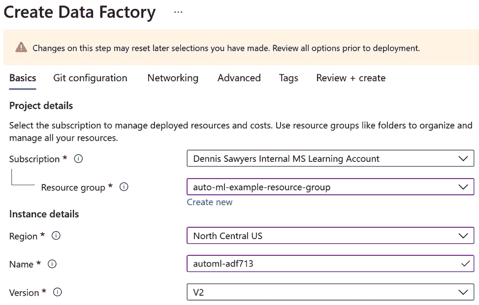

    图 10.1 – 数据工厂设置

1.  点击 **Git 配置** 选项卡并勾选 **稍后配置 Git** 复选框。

1.  点击 **审阅 + 创建** 并点击 **创建**。你的数据工厂现在已创建。

创建 ADF 资源的另一种方式是通过 PowerShell。按照以下步骤操作：

1.  导航到 Azure 门户 [`portal.azure.com`](https://portal.azure.com)。

1.  点击屏幕右上角的计算机屏幕图标，如图所示。当你悬停在图标上时，会出现 **Cloud Shell** 的文字：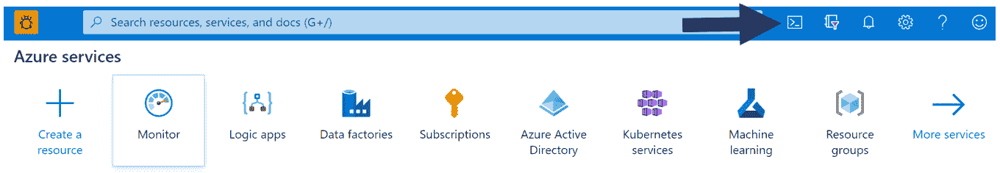

    图 10.2 – 导航到 PowerShell

1.  从下拉框中选择 **PowerShell**。

1.  输入以下代码：

    ```py
    $DataFactory =\
    Set-AzDataFactoryV2 -ResourceGroupName 'auto-ml-example-resource-group' -location 'northcentralus' -Name 'automl-adf713'
    ```

    `ResourceGroupName` 设置你的资源组。`Set-AzDataFactoryV2` 设置你的版本，而 `location` 设置你的 Azure 区域。`Name` 给你的 ADF 起一个名字。你的数据工厂现在已创建。

现在你已经创建了一个 ADF，下一步是创建一个服务主体，并给它访问你的 ADF 和 AMLS 工作区的权限。这将授予 ADF 使用 ML 管道的权限。

## 创建服务主体并授权访问

服务主体是 Azure 用来授予 Azure 资源访问其他 Azure 资源的安全标识符。你可以在 Azure 的许多区域使用服务主体身份验证，包括 AMLS。然而，为了将 AMLS 连接到 ADF，需要一个服务主体。要使用 Azure 门户创建一个，你必须首先按照以下步骤导航到**Azure Active Directory**，Azure 的顶级身份和认证服务：

1.  导航到 Azure 门户，网址为[`portal.azure.com`](https://portal.azure.com)。

1.  在顶部搜索栏中搜索`Azure Active Directory`，然后在**服务**标题下点击**Azure Active Directory**。

1.  点击屏幕左侧的**应用程序注册**。

1.  点击屏幕左上角的**新建注册**。

1.  给服务主体起一个名字，`adf-service-principal`，然后点击**注册**。保留所有其他设置不变。

1.  你现在将被带到包含你的服务主体所有信息的页面。复制**应用程序（客户端）ID**，并将其粘贴到记事本或类似的文本编辑器中。你稍后需要这个 ID。

1.  点击屏幕左侧的**证书和秘密**。这将允许你为你的服务主体创建一个密码。

1.  点击**新建客户端秘密**。"秘密"在 Azure 中是密码的另一种说法。

1.  给秘密起一个名字，`ADF-Secret`，并设置它永远不会过期，如*图 10.3*所示。点击**添加**：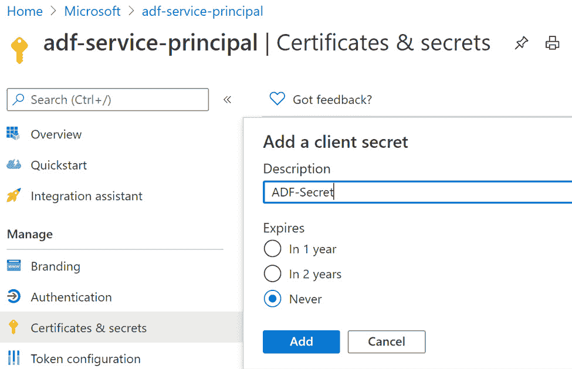

    图 10.3 – 命名你的服务主体秘密

1.  复制你的秘密的**值**字段。这是你的密码，你只能在它消失之前短暂地看到它。一旦它消失，你就再也无法看到它了。将它粘贴到记事本或类似的文本编辑器中，因为你稍后创建你的 ADF 链接服务时需要它。

1.  你的服务主体创建后，你必须现在授予它对 AMLS 和 ADF 的访问权限。导航到 Azure 门户的前页，网址为[`portal.azure.com`](https://portal.azure.com)。

1.  通过点击屏幕上**Azure 服务**部分靠近顶部的**机器学习**图标来打开你的 AMLS 资源。如果你最近使用过 AMLS，你应该能看到它，如*图 10.4*所示：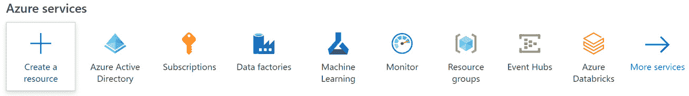

    图 10.4 – Azure 服务面板

1.  点击你的 AMLS 工作区的名称以访问资源。

1.  点击左侧面板上的**访问控制（IAM）**。

1.  点击**添加角色分配**。

1.  选择`adf-service-principal`，如*图 10.5*所示点击它。然后，点击**保存**：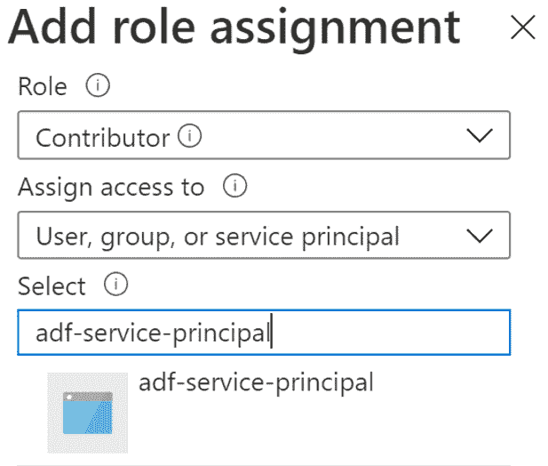

    图 10.5 – 授予你的服务主体权限

1.  你现在已经授予你的服务主体对 AMLS 的访问权限。现在，你必须为 ADF 做同样的事情。首先，通过点击屏幕左上角的**主页**，导航到 Azure 门户的前页。

1.  在屏幕顶部的**Azure 服务**下点击**数据工厂**图标。如果您最近使用过 ADF，您将看到此图标。

1.  点击您创建的数据工厂的名称以打开资源。

1.  对 ADF 重复*步骤 14-16*。这些步骤与 AMLS 相同。现在您已授予服务主体对 ADF 和 AMLS 的访问权限。

### 通过 Azure CLI 创建 ADF 资源

您还可以通过以下步骤在 Azure CLI 中创建服务主体并授予其对 ADF 和 AMLS 的访问权限：

1.  通过点击屏幕右上角的计算机屏幕图标打开 Azure CLI，然后从下拉菜单中选择**Bash**。

1.  输入以下代码以创建您的服务主体，并为其分配一个名称：

    ```py
    az ad sp create-for-rbac --name adf-service-principal
    ```

1.  复制`appid`和`password`字段。您将再也看不到密码的值，所以请确保复制它。这对应于**应用程序（客户端）ID**和密钥。

1.  使用以下代码授予您的服务主体对包含 AMLS 和 ADF 的资源组中所有资源的访问权限。如有必要，请将其更改为匹配您的资源组。使用`assignee`传入您的服务主体应用程序 ID。使用`role`传入正确的访问级别，在这种情况下，使用`resource-group`将访问权限分配给正确的**资源组**：

    ```py
    az role assignment create --assignee "your-service-principal-id" --role "Contributor" --resource-group "auto-ml-example-resource-group"
    ```

在创建服务主体并授予适当的资源访问权限后，您的下一步是打开 ADF 并创建链接服务。请确保您打开了记事本，因为您将需要服务主体 ID 以及您创建的密钥。这些信息随时可用将使下一步变得容易。

## 创建一个链接服务以连接 ADF 和 AMLS

从现在开始，您将有机会打开 ADF 并熟悉其界面。ADF 主要设计为一个无代码平台，但您创建的每一项内容都在底层以 JSON 文件的形式编写。要连接 ADF 和 AMLS，请按照以下步骤操作：

1.  导航到 Azure 门户 [`portal.azure.com`](https://portal.azure.com)。

1.  在屏幕顶部的**Azure 服务**下点击**数据工厂**图标。如果您最近使用过 ADF，您将看到此图标。如果没有，请使用屏幕顶部的搜索栏。

1.  点击以`autol-adf`开头的您创建的数据工厂的名称。

1.  在屏幕中间点击**作者和监控**。现在您应该看到 ADF 用户界面，如图 10.6 所示：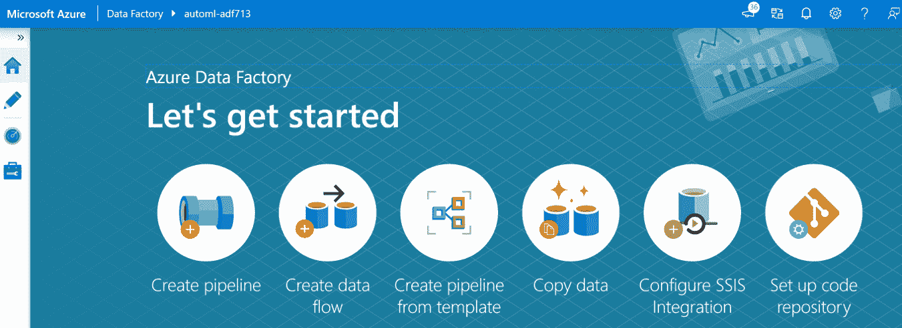

    图 10.6 – ADF UI

1.  在左侧点击工具箱图标。当您将鼠标悬停在图标上几秒钟时，会出现单词**管理**，表示您正在导航到的部分。

1.  在屏幕左上角的**连接**下点击**链接服务**。

1.  点击**创建链接服务**。

1.  点击**计算**并选择如图 10.7 所示的**Azure 机器学习**：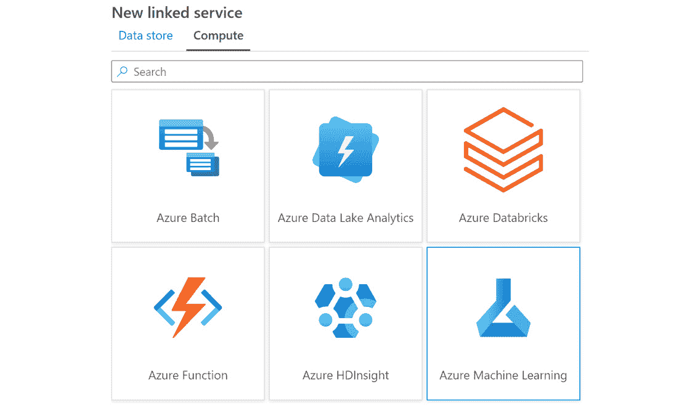

    图 10.7 – 创建 Azure ML 链接服务

1.  点击**继续**。

1.  现在是填写链接服务创建表单的时候了。首先，给您的链接服务起一个名称，例如`AMLS 链接服务`。

1.  从**通过集成运行时连接**下的下拉菜单中选择**AutoResolveIntegrationRuntime**。**集成运行时**是 ADF 在底层用于移动数据和运行作业的计算。**Azure 集成运行时**（**Azure IR**）是一种由 ADF 完全管理的无服务器、弹性计算。

1.  从**Azure 订阅**下的下拉框中选择您的 Azure 订阅。

1.  从**Azure 机器学习工作区名称**下的下拉框中选择您的 AMLS 工作区。

1.  将您的服务主体应用程序（客户端）ID 粘贴到**服务主体 ID**文本框中。您之前已将此 ID 复制到文本编辑器中。

1.  将您的服务主体密钥粘贴到**服务主体密钥**文本框中。

1.  点击**测试连接**。

1.  如果测试结果为**连接成功**，则点击**创建**。

1.  您的链接服务已创建。将鼠标悬停在您的新链接服务上并点击**{ }**图标以查看底层的 JSON 代码。

您已成功将 ADF 连接到 AMLS。在本节中，您学到了很多。您不仅学会了如何创建 ADF，还学会了如何创建服务主体、授权访问和创建链接服务。有了这个基础设施，您现在可以学习如何在 ADF 管道中轻松运行和安排 ML 管道。

# 在 ADF 中安排机器学习管道

也许 ADF 的最佳特性是其易用性。通过在屏幕上点击并拖动对象，您可以通过 ADF 管道轻松编排无缝的数据摄取、转换和机器学习流程。此外，通过几点击，您还可以安排 ADF 管道在您想要的时间运行。掌握这项技能将使您能够快速轻松地创建无代码的数据编排运行。

首先，您将安排并运行您在*第九章*，“实现批量评分解决方案”中创建的最简单的 ML 管道，即 `Iris-Scoring-Pipeline`。为此，请按照以下步骤操作：

1.  导航到您的 ADF 资源并点击**作者与监控**。

1.  在左侧点击笔形图标。当您将鼠标悬停在此图标上时，将显示文字**作者**，指示您正在导航到的部分。

1.  在屏幕左上角的**工厂资源**下方的搜索框旁边的蓝色十字图标处点击。当您将鼠标悬停在此图标上时，将显示文字**添加新资源**。

1.  如*图 10.8*所示，从结果下拉菜单中点击**管道**：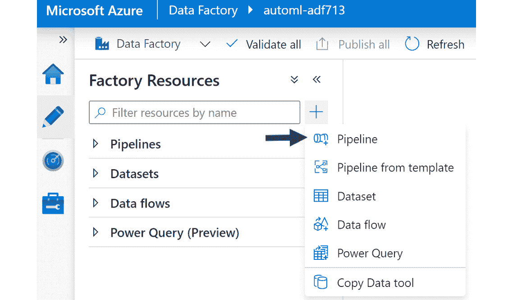

    图 10.8 – 创建您的第一个 ADF 管道

1.  在屏幕中心左方的**活动**下点击**机器学习**。

1.  按照图 10.9 所示，将蓝色烧瓶图标拖放到画布上。这是**机器学习执行管道**活动：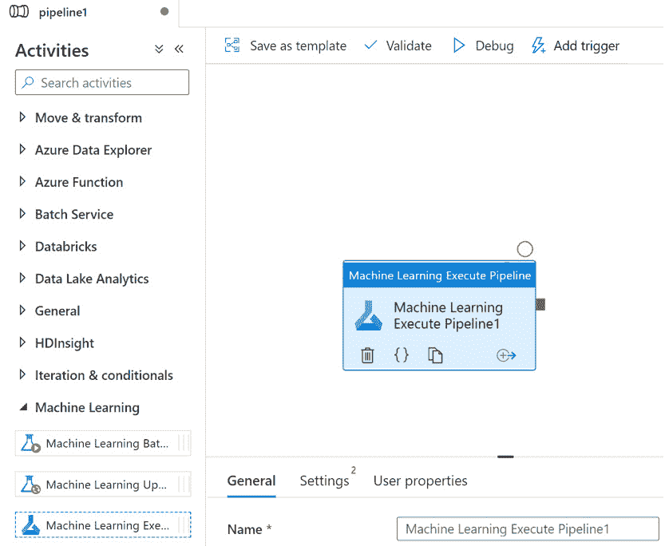

    图 10.9 – 机器学习执行管道活动

1.  点击`执行 Iris Scoring Pipeline`。

1.  在画布下方点击**设置**。

1.  从第一个下拉菜单中选择**AMLS Linked Service**以连接您的链接服务。

1.  从**机器学习管道名称**下拉菜单中选择**Iris-Scoring-Pipeline**。

1.  从**机器学习管道 ID**下拉菜单中选择一个管道 ID。除非您发布了多个具有相同名称的 ML 管道，否则应该只有一个管道 ID。

1.  点击右上角的算盘图标以打开从`pipeline1`到`Iris Scoring Pipeline`的`pipeline`。允许使用空格。

1.  在屏幕右上角附近点击**全部发布**。然后，点击屏幕右下角的**发布**以创建您的 ADF 管道。

    重要提示

    为了在 ADF 中保存您的作品，您需要发布您的更改。确保在开发新的 ADF 管道时多次发布。

1.  要安排您新创建的 ADF 管道，请点击屏幕顶部的**添加触发器**。

1.  点击结果下拉菜单中的**新建/编辑**。

1.  点击**选择触发器**下拉菜单并选择**新建**。

    与 AML Python SDK 一样，ADF 中有多种类型的触发器。在时间表上执行**基于调度的触发器**。当在 Azure blob 容器中创建或删除文件时执行**基于事件的触发器**。

    **滚动窗口触发器**类似于基于调度的触发器，但它们更高级，具有诸如重试失败的运行和回填过去时间段等选项。对于这个练习，创建一个简单的基于调度的触发器。

1.  给您的触发器起一个名字，例如`每月一次`。

1.  在**类型**下选择**调度**。

1.  从相应的下拉菜单中选择一个开始日期和适当的时间区域。

1.  在`1`下选择从下拉菜单中的**月份**。

1.  点击两次**确定**。

1.  在屏幕右上角附近点击**全部发布**，然后点击屏幕右下角的**发布**。现在您已经完成。您的完成 ADF 管道应该看起来像图 10.10。要查看 JSON 代码，请点击屏幕右上角的**{ }**图标：

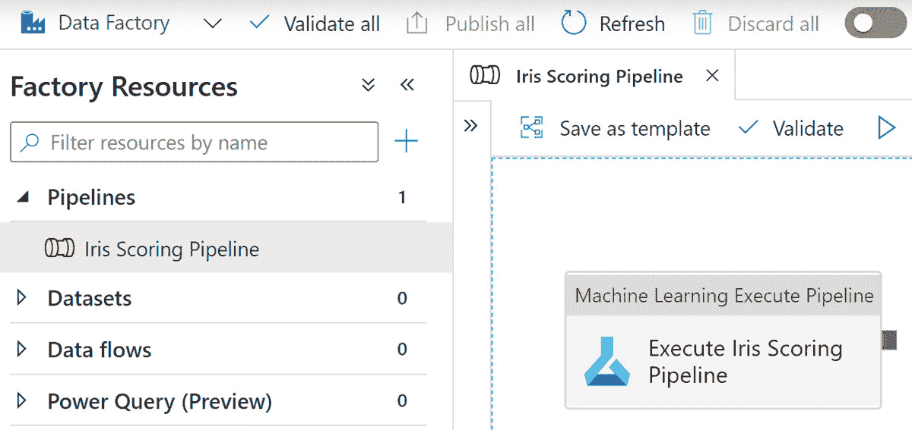

图 10.10 – 您的第一个完成的 ADF 管道

虽然您已创建并安排了第一个 ADF 管道，但这并不意味着什么。毕竟，尽管这个 ADF 管道将每月触发您的 ML 管道，但您仍然需要自动化新数据的摄入。幸运的是，ADF 在数据摄入方面表现出色。您将在下一节中看到使用 ADF 转移数据是多么简单。无论数据在哪里，ADF 都可以将其拉入。

# 使用 ADF 转移数据

从本地到云以及从云到本地的数据迁移是任何数据工程师或数据科学家的一项关键技能。ADF 通过**复制数据**活动完成这项任务。这是 ADF 最基本也是最有力的功能。

在本节中，首先，您将下载一个**自托管集成运行时**（**SHIR**）到您的本地机器，使您的计算机能够作为计算资源将数据加载到 Azure。然后，您将为您的**Azure 存储帐户**和您的本地 PC 创建一个链接服务。

接下来，您将从 GitHub 仓库下载一个文件并将其保存到您的 PC 上。最后，您将在 ADF 中创建一个**复制数据**活动，该活动将从您的 PC 中提取数据并将其放入与 AML 数据存储连接的同一 Azure blob 容器中。

完成这些练习将为你提供数据工程技能，这将使你能够在下一节创建端到端解决方案。

## 安装自托管集成运行时

在您可以将数据复制到 Azure 之前，您首先需要在您的本地机器上安装一个 SHIR。以下步骤开始：

1.  导航到您的 ADF 资源并点击**作者和监控**。

1.  点击左侧的工具箱图标。当您将鼠标悬停在此图标上时，将出现单词**管理**，以指示您正在导航到的部分。

1.  在**连接**下点击**集成运行时**。

1.  在屏幕顶部中心点击**新建**。

1.  选择**Azure, Self-Hosted**并点击**继续**，如图 10.11 所示：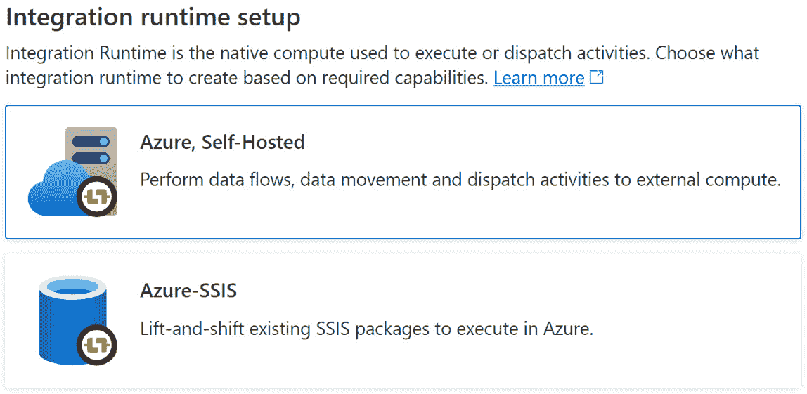

    图 10.11 – 选择正确的集成运行时安装 SHIR

1.  选择**自托管**并点击**继续**。

1.  给您的新 SHIR 起个名字，`IntegrationRuntime`，并点击**创建**。

1.  在下一屏幕上，您将看到两个安装 SHIR 的选项。通过点击**点击此处启动此计算机的快速设置**选择**选项 1：快速设置**。

    重要提示

    如果您正在使用工作机器，在安装 SHIR 之前请向您的 IT 安全组织请求许可。它确实会在您的机器和面向公众的 Azure 云之间建立连接。

1.  这将下载 SHIR 安装文件到您的计算设备。打开文件并点击**是**。安装应需时 5 到 10 分钟。

1.  安装完成后，点击**关闭**。您的 SHIR 现在应如图 10.12 所示：

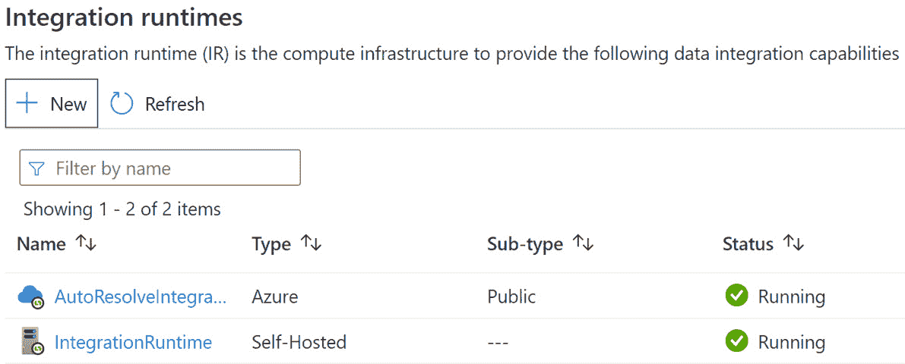

图 10.12 – 自托管集成运行时

在您的本地机器上安装了 SHIR 后，您现在可以使用 ADF 直接将数据从您的 PC 移动到 Azure。就像您为 AMLS 创建了链接服务一样，接下来您将为 Azure Blob 存储创建一个链接服务。

## 创建 Azure Blob 存储链接服务

要创建一个连接 ADF 到**Azure Blob 存储**的链接服务，请按照以下步骤操作：

1.  在屏幕左上角的 **连接** 下的 **链接服务** 上点击。

1.  在屏幕顶部中央点击 **+新建**。

1.  选择 **Azure Blob Storage** 并点击 **继续** 以查看链接服务创建表单。

1.  给你的链接服务起一个像 `AMLSDatastoreLink` 这样的名字。

1.  选择 **AutoResolveIntegrationRuntime**。

1.  从 **Azure 订阅** 下的下拉框中选择你的 Azure 订阅。

1.  在 `automlexamplew` 后跟一串数字的下拉框中选择你的存储账户。

1.  点击 **测试连接**。

1.  如果你的测试成功，点击 **创建**。

1.  从 GitHub 仓库下载 `Iris_Scoring_Data_for_ADF.csv`：

    [`github.com/PacktPublishing/Automated-Machine-Learning-with-Microsoft-Azure/blob/master/Chapter10/Iris_Scoring_Data_for_ADF.csv`](https://github.com/PacktPublishing/Automated-Machine-Learning-with-Microsoft-Azure/blob/master/Chapter10/Iris_Scoring_Data_for_ADF.csv)

1.  在你的 PC 上创建一个名为 `Iris` 的文件夹。将 `Iris_Scoring_Data_for_ADF.csv` 移动到那里。

## 创建一个连接到你的 PC 的链接服务

接下来，是时候创建一个连接到你的 PC 的链接服务了。这个链接服务将使用你的 SHIR。按照以下步骤操作：

1.  点击 **链接服务** 和 **+新建**，就像创建其他链接服务一样。

1.  点击 **文件**，选择 **文件系统**，并点击 **继续** 以查看链接服务创建表单。

1.  给你的链接服务起一个像 `LocalPCLink` 这样的名字。

1.  从 **通过集成运行时连接** 下的下拉框中选择你的 SHIR。

1.  在 `Iris` 文件夹下。

1.  填写用于登录你的 PC 的用户名和密码。要找到你的用户名，在你的 PC 的搜索栏中搜索 **系统信息** 并点击它；你的用户名可以在 **系统摘要** 下找到。

1.  点击 **测试连接**。

1.  如果测试成功，点击 **创建**。

## 创建一个用于复制数据的 ADF 管道

使用 SHIR、Azure Blob 存储链接服务和连接到本地 PC 的链接服务，你现在可以使用以下步骤使用 **复制数据** 活动构建 ADF 管道：

1.  在 ADF 的左侧点击笔形图标。

1.  在屏幕左上角的 **工厂资源** 旁边的搜索框旁边点击蓝色十字图标。当鼠标悬停在此图标上时，会显示文字 **添加新资源**。

1.  如 *图 10.13* 所示，从结果下拉菜单中点击 **复制数据工具**：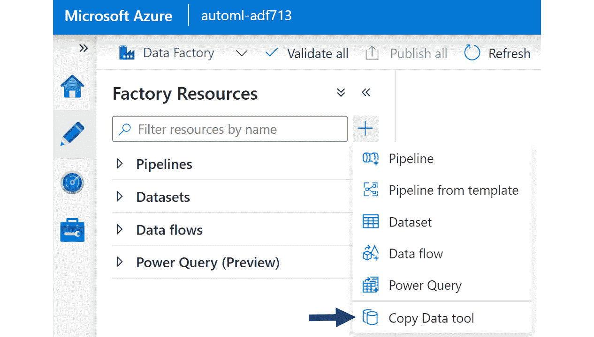

    图 10.13 – 复制数据工具

1.  在 `Copy Iris Data to Azure` 下点击 **下一步**。

1.  你现在必须选择你的源数据存储。选择连接到你的 PC 的链接服务，**LocalPCLink**，并点击 **下一步**。

1.  通过点击 `Iris_Scoring_Data_for_ADF.csv` 并点击 **选择** 来选择你希望传输到 Azure 的数据。

1.  点击 **下一步**。

1.  在 **文件格式设置** 下，勾选 **第一行作为标题** 并点击 **下一步**。

1.  您现在必须选择您的目标数据存储库。选择连接到 Azure 存储账户的链接服务，**AMLSDatastoreLink**。

1.  在`Input_Folder/Iris_Scoring_Data.csv`下，点击文件夹`Input_Folder`中的`Iris_Scoring_Data.csv`。如果不存在，文件夹将被创建。

1.  在**文件格式设置**下，勾选**添加标题到文件**并点击**下一步**。

1.  在**设置**下点击**下一步**，不要更改任何默认设置。

1.  在**摘要**下点击**下一步**。您的 ADF 管道现在将被创建并运行。

1.  点击**完成**。您现在将被带到 ADF 管道的主要创作工具。

1.  在**管道**下点击`将 Iris 数据复制到 Azure`。您会注意到您的**复制数据**活动命名不佳。

1.  点击您的活动并将其重命名为`从 PC 复制 Iris 数据`，如图*图 10.14*所示：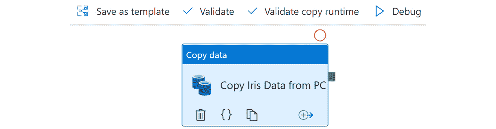

    图 10.14 – 包含复制数据活动的完成 ADF 管道

1.  通过点击**全部发布**然后**发布**来保存对管道的更改。

您现在已成功使用 ADF 将数据从您的 PC 传输到 Azure。这是数据工程的基础技能，允许您将各种数据传输到云端。就像您在上一节中创建的 ADF 管道来执行 ML 管道一样，您可以安排它在任何您希望的时间表上运行。

我们现在将结合本章中学到的所有技能，编写一个真正可生产的 ADF 管道。此管道将从您的计算机中摄取数据，评分数据，然后将结果写回到您的本地机器。尽管这不是一项微不足道的任务，但您将在本章结束时能够连续生成管道。 

# 自动化端到端评分解决方案

任何 AutoML 项目的最终目标都是创建一个自动评分解决方案。数据从源中提取，使用您训练的模型自动评分，并将结果存储在您选择的位置。通过结合您在前三个部分中学到的所有内容，您可以轻松完成这项任务。

您将开始本节，通过打开 AMLS，创建一个新的数据集，并稍微修改您现有的`Iris-Scoring-Pipeline`。然后，在以新名称重新发布您的管道后，您将将其与您创建的**复制数据**活动结合起来，以便将数据加载到 Azure 中。

接下来，您将创建另一个复制数据活动，将您的结果从 Azure 传输到您的 PC，并安排作业每周一运行一次。这在 ML 中是一个非常常见的模式，您可以使用 ADF 完全不写任何代码就能完成这项任务。

## 编辑 ML 管道以评分新数据

首先，您需要通过编辑*第九章*中创建的`Iris-Scoring-Pipeline`来创建一个新的 ML 管道，步骤如下：

1.  在[`ml.azure.com`](https://ml.azure.com)访问你的 AML 工作室。

1.  使用 GUI 创建一个新的数据集，就像你在*第三章*中做的那样，*训练你的第一个 AutoML 模型*。首先，在左侧面板下点击**资产**下的**数据集**。

1.  点击`Iris Local Scoring Data`后。

1.  在`Input_Folder`中选择`Iris_Data.csv`。这是你从你的 PC 上复制过来的数据。

1.  完成创建数据集，确保在**列标题**下拉菜单下设置选项为**使用第一个文件的标题**，以便拉入列名。

1.  创建你的数据集后，导航到你的 Jupyter 中的`machine-learning-pipeline` Python 笔记本。

1.  点击左上角的**文件**，并从下拉框中选择**创建副本**。

1.  将你的副本笔记本重命名为`machine-learning-pipeline-local-scoring`。

1.  删除创建`Iris`数据的单元格，并将其注册为数据集。

1.  在你的脚本的第一行中将 Python 脚本从`Iris_Scoring.py`重命名为`Iris_Scoring_Local.py`，如下所示：

    ```py
    %%writefile Scoring_Scripts/Iris_Scoring_Local.py 
    ```

1.  在`Iris_Scoring_Local.py`中，检索你的`Iris Local Scoring Data`数据集，而不是如以下代码行所示的`Iris Scoring`数据集：

    ```py
    dataset =\
    Dataset.get_by_name(ws,'Iris Local Scoring Data')
    ```

1.  当配置你的 ML 管道步骤时，将`Iris_Scoring.py`替换为`Iris_Scoring_Local.py`，如下所示：

    ```py
    scoring_step =\
    PythonScriptStep(name='iris-scoring-step',\
                    script_name= 'Iris_Scoring_Local.py',\
                    source_directory='Scoring_Scripts',\
                    arguments=[],\
                    inputs=[],\
                   compute_target=compute_target,\
                    runconfig=run_config,\
                    allow_reuse=False)
    ```

1.  在`Iris_Scoring_Local.py`中，在以下代码行中检索你的`Iris Local Scoring Data`数据集，而不是`Iris Scoring`数据集：

    ```py
    dataset =\
    Dataset.get_by_name(ws,'Iris Local Scoring Data')
    ```

1.  在以下代码行中，将你的已发布管道从`Iris-Scoring-Pipeline`重命名为`Iris-Local-Scoring-Pipeline`：

    ```py
    published_pipeline =\
    pipeline_run.publish_pipeline( name='Iris-Local-Scoring-Pipeline',\
           description='Pipeline that Scores Iris Data', version= '1.0')
    ```

1.  运行笔记本中的所有单元格以创建你的新 ML 管道`Iris-Local-Scoring-Pipeline`。这需要几分钟。你现在已经创建了一个从你的 PC 加载到 Azure 的评分数据集的 ML 管道。

## 创建 ADF 管道以运行你的 ML 管道

创建新的 ML 管道后，你现在可以创建一个新的 ADF 管道，使用以下步骤自动化端到端评分过程：

1.  打开 ADF，点击左侧的笔形图标以打开 ADF 管道设计工具。

1.  点击`Copy Iris Data to Azure`，并从下拉框中选择**Clone**。

1.  将你的新管道重命名为`End-to-End Iris Scoring`。

1.  通过点击绿色方块，按住鼠标按钮直到出现箭头，并将箭头连接到你的**机器学习执行管道**活动，如*图 10.15*所示：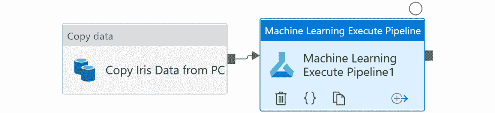

    图 10.15 – 在 ADF 管道中连接活动

1.  通过选择活动并打开`Iris-Scoring-Local-Pipeline`，配置你的`Score Iris Data`，并在下拉框中选择唯一的**机器学习管道 ID**。

1.  点击**全部发布**和**发布**以保存你的工作。

1.  在**活动**下点击**移动和转换**，并将一个新的 Copy Data 活动拖到你的画布上。将其连接到 ADF 管道的末尾。

1.  在选择新的活动后，点击`将结果复制到 PC`。

1.  点击**源**并点击**新建**以开始创建新的输入数据文件。

1.  选择**Azure Blob Storage**作为你的源目的地，并选择**DelimitedText**作为文件格式。点击**继续**。

1.  填写 ADF 数据集创建表单。将此对象命名为`ScoringResults`。在 AML 数据存储的`输出文件夹`中选择`Iris_Predictions.csv`。完成后，表单应与*图 10.16*相匹配。点击**确定**：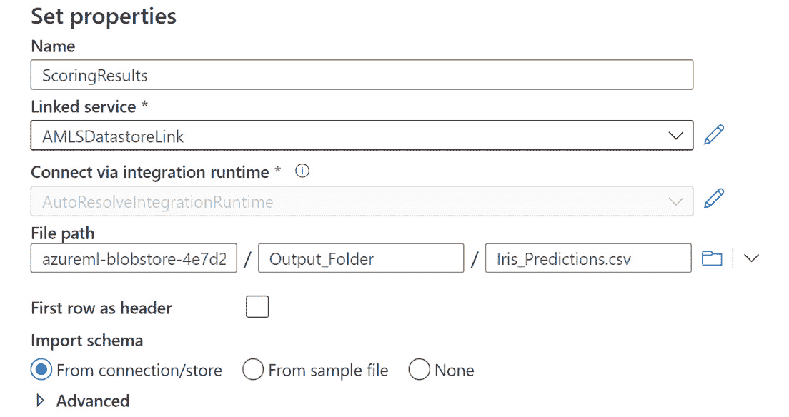

    图 10.16 – ADF 数据集创建表单

1.  点击**目标**并点击**新建**以开始创建新的输出数据文件。

1.  选择**Azure Blob Storage**作为你的源目的地，并选择**DelimitedText**作为文件格式。点击**继续**。

1.  点击**文件**，选择**文件系统**，然后点击**继续**。

1.  选择**DelimitedText**作为你的文件格式。点击**继续**。

1.  填写 ADF 数据集创建表单。将此对象命名为`ScoringLocalOutput`。选择**LocalPCLink**作为你的链接服务。勾选**第一行作为标题**的复选框。点击**确定**。这将把你的文件保存在与你的输入数据相同的 PC 文件夹中。

1.  点击**目标**并点击**打开**。这将打开一个新标签页，你可以在其中编辑目标数据。

1.  将`Iris_Scoring_Results.csv`作为文件名进行编辑。

1.  点击**全部发布**和**发布**以保存你的工作。

## 向 ADF 管道添加触发器

创建 ADF 管道的最后一步是添加一个触发器来自动化管道运行：

1.  接下来，就像本章前面所做的那样添加一个触发器。点击**添加触发器**并选择**新建/编辑**。

1.  点击**选择触发器**并选择**新建**。

1.  将你的触发器命名为`Monday Trigger`，并设置为每周一上午 11:00 运行一次。确保你将时区设置为你的本地时区。点击**确定**两次。

1.  点击**全部发布**和**发布**以保存你的工作。通过点击**触发器（1**）和**立即触发**来测试你的新 ADF 管道。你的管道应该像*图 10.17*中所示那样成功运行：

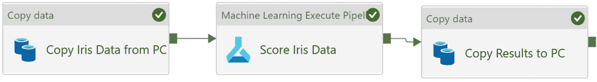

图 10.17 – 成功的端到端评分流程

现在，你已经创建了一个完全自动化的 AutoML 评分解决方案，该解决方案将在每周一上午 11:00 从你的本地 PC 中拉取数据并生成评分文件。在实际情况下，此解决方案将从定期更新的数据库中拉取数据。

这种技术适用于任何机器学习项目；你可以使用自定义训练的模型、视觉模型、AutoML 模型或任何其他类型的机器学习模型。这种模式适用于任何批处理评分场景，并且是所有行业中最常见的部署场景。练习它。

在您的工具包中有一个自动评分解决方案后，您的最终任务是构建一个自动训练解决方案。由于许多原因，ML 模型通常需要重新训练，并且当有新数据可用时应该重新训练。通过使用本节中使用的相同技术和模式，这将是一个简单的任务。

# 自动化端到端训练解决方案

就像任何其他 ML 模型一样，一旦 AutoML 模型部署并运行了几个月，它将受益于重新训练。这有很多原因，按重要性排序如下：

+   如果您输入数据和目标列之间的模式发生变化，ML 模型会崩溃。这种情况通常是由于消费者行为等外部因素的变化而发生的。当模式崩溃时，您需要重新训练模型以保持性能。

+   ML 模型接收到的相关数据越多，表现越好。因此，随着您的数据增长，您应该定期重新训练模型。

+   定期重新训练模型意味着如果模式随时间缓慢变化，它们不太可能崩溃。因此，在获取数据时重新训练是最佳实践。

在本节中，您将测试您的技能。您将获得一组类似于创建端到端评分解决方案时的指令。然而，这次将有显著较少的指导。如果您发现自己迷失方向，请仔细重读本章中的所有指令。

## 创建一个管道将数据复制到 Azure

首先，您需要创建一个 ADF 管道，将数据从您的 PC 复制到 Azure：

1.  从 GitHub 存储库下载`Iris_Training_Data_for_ADF.csv`并将其放在您的 PC 上的`Iris`文件夹中：

    [`github.com/PacktPublishing/Automated-Machine-Learning-with-Microsoft-Azure/blob/master/Chapter10/Iris_Training_Data_for_ADF.csv`](https://github.com/PacktPublishing/Automated-Machine-Learning-with-Microsoft-Azure/blob/master/Chapter10/Iris_Training_Data_for_ADF.csv)

1.  创建一个名为`End-to-End Iris Training`的新 ADF 管道。

1.  在管道中创建一个`Copy Iris Training Data from PC`，将`Iris_Training_Data_for_ADF.csv`复制到您的 Azure 存储账户的`Input_Folder`。

    参考您在*自动化端到端评分解决方案*部分创建的`Copy Iris Data from PC`活动。

1.  运行此管道一次，将数据移动到 Azure。

## 编辑 ML 管道以使用新数据进行训练

接下来，复制并编辑您在*第九章*的*实现批评分解决方案*部分创建的`automl-training-pipeline`：

1.  打开 AMLS 并创建一个名为`Iris Local Training Data`的新数据集。

1.  打开您名为`automl-training-pipeline`的 Jupyter 笔记本。创建一个副本并将其重命名为`automl-local-training-pipeline`。

1.  在 ML 管道中将`Iris Training`数据集替换为`Iris Local Training Data`数据集。使用名称`Iris-AutoML-Training-Local-Pipeline`运行和发布 ML 管道。

## 将机器学习执行管道活动添加到您的 ADF 管道中

最后，您将在 ADF 管道中添加一个活动来执行您刚刚创建的 ML 管道，如下所示：

1.  在 ADF 中，添加一个名为`Retrain Iris Model`的活动。

1.  向您的**端到端 Iris 训练**管道添加一个名为`Tuesday Trigger`的触发器。将此触发器安排在当地时间每周二早上 6:00 运行。

1.  发布您的更改以保存您的作品。您的完成后的管道应该是一个两步过程，类似于*图 10.18*：

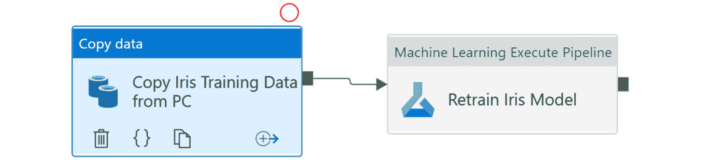

图 10.18 – 完成的重新训练管道

就这样！您已经创建了一个解决方案，该解决方案将自动每周使用新数据重新训练模型。在现实世界中，这将是从定期更新的数据库中提取数据，而不是从您的本地 PC 中提取。

请记住，您的训练 ML 管道会自动注册模型，而您的评分 ML 管道会自动重用您 ML 模型的最新版本。因此，从现在起无需手动更新这两个管道。

# 摘要

以端到端的方式自动化 ML 解决方案并非易事，如果您已经走到这一步，请感到自豪。大多数现代数据科学组织可以轻松地训练模型。但很少有人能够像本章中所做的那样实施可靠、自动化、端到端解决方案。

您现在应该对自己的能力充满信心，能够设计端到端的 AutoML 解决方案。您可以使用 AutoML 训练模型，创建 ML 管道来评分数据和重新训练模型。您可以使用 ADF 轻松地将数据导入 Azure 并将数据从 Azure 导出。此外，您可以将所有这些整合在一起，创建 ADF 管道，无缝地导入数据、评分数据、训练数据和将结果推送到您想要的地方。您现在可以创建端到端的 ML 解决方案。

*第十一章*，*实现实时评分解决方案*，将通过教授您如何在 AMLS 中使用 Azure Kubernetes Service 实时评分数据来巩固您的 ML 知识。将实时评分添加到您的批处理评分技能集中将使您成为一个更全面的实际 ML 专家，能够解决各种各样的问题。
