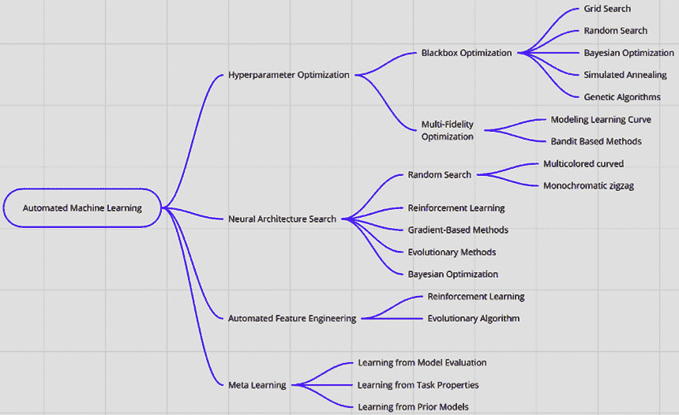
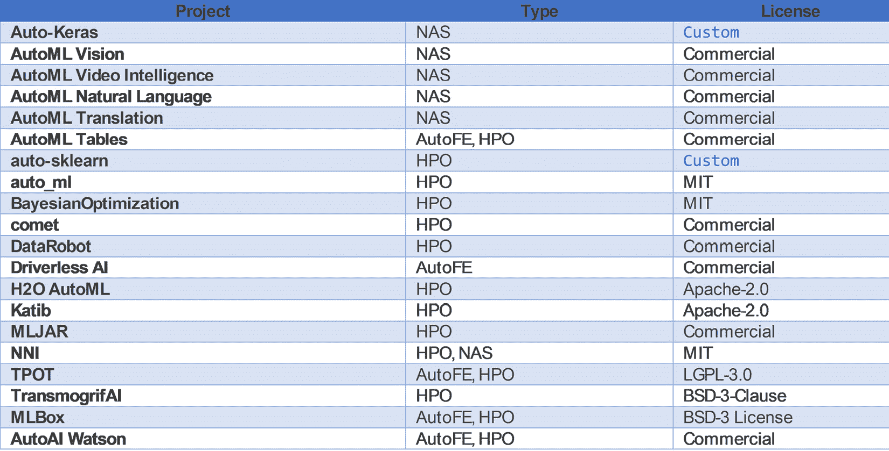

# *第一章*：自动机器学习之旅

"所有模型都是错误的，但有些是有用的。"

– 乔治·爱德华·佩尔哈姆·博克斯 FRS

"机器学习的圣杯之一就是自动化越来越多的特征工程过程。"

– 彼得·多明戈斯，《关于机器学习的一些有用知识》

本章将概述围绕自动**机器学习**（**ML**）的概念、工具和技术。本介绍旨在为新手提供一个坚实的概述，并为经验丰富的机器学习从业者提供参考。我们将从介绍机器学习开发生命周期开始，在导航产品生态系统和它解决的数据科学问题中，然后再探讨特征选择、神经架构搜索和超参数优化。

很有可能你正在阅读这本书的电子书，它连接到一个基于你的阅读兴趣推荐这份手稿的网站。我们今天生活在一个世界里，你的数字足迹不仅揭示了你的阅读兴趣，还揭示了你喜欢在哪里吃饭，你最喜欢的朋友是谁，你下一个会去哪里购物，你是否会出现在下一次约会，以及你会为谁投票。在这个大数据时代，这些原始数据变成了信息，反过来，这些信息有助于构建所谓的智慧。

**人工智能**（**AI**）及其底层实现的机器学习和深度学习不仅帮助我们找到干草堆中的隐喻性针，还能看到这些大型数据流中的潜在趋势、季节性和模式，从而做出更好的预测。在这本书中，我们将介绍 AI 和 ML 领域的关键新兴技术之一；那就是**自动机器学习**，或简称**AutoML**。

在本章中，我们将涵盖以下主题：

+   机器学习开发生命周期

+   自动机器学习

+   自动机器学习的工作原理

+   数据科学民主化

+   澄清自动机器学习的神话

+   自动机器学习生态系统（开源和商业）

+   自动机器学习的挑战和限制

让我们开始吧！

# 机器学习开发生命周期

在向您介绍自动机器学习之前，我们首先应该定义如何将机器学习实验操作化和扩展到生产环境中。为了超越 Hello-World 应用和*在我的 Jupyter 笔记本上运行*这类项目，企业需要采用稳健、可靠和可重复的模型开发和部署流程。正如在**软件开发生命周期**（**SDLC**）中一样，机器学习或数据科学生命周期也是一个多阶段、迭代的过程。

生命周期包括几个步骤——问题定义和分析的过程、构建假设（除非你正在进行探索性数据分析）、选择业务成果指标、探索和准备数据、构建和创建机器学习模型、训练这些模型、评估和部署它们，以及维护反馈循环：

图 1.1 – 团队数据科学流程

一个成功的数据科学团队有纪律去准备问题陈述和假设，预处理数据，根据**主题专家**（SME）的输入和正确的模型家族选择适当的数据特征，优化模型超参数，审查结果和相应的指标，最后微调模型。如果这听起来很多，请记住，这是一个迭代过程，数据科学家还必须确保数据、模型版本控制和漂移得到解决。他们还必须建立护栏，以确保模型的性能得到监控。为了使事情更有趣，生产环境中也经常进行冠军挑战者和 A/B 测试实验——让最佳模型获胜。

在这样一个错综复杂且多面的环境中，数据科学家可以利用一切可用的帮助。自动机器学习（Automated ML）伸出援手，承诺处理那些日常的、重复的以及智力效率较低的任务，以便数据科学家能够专注于重要的事情。

# 自动机器学习

“要完成一个特定的任务，需要多少来自某个特定人口群体的成员？”*

“有限的数量：一个来执行任务，其余的以符合所讨论群体典型行为的方式行动。” *（在此处插入你的灯泡笑话）*

这是一种元幽默——对于那些倾向于量化的人来说，这是最出色的幽默类型，能够引发欢笑。同样，自动机器学习是一种元学习类别，也称为学习如何学习——即你可以将自动化原则应用于自身，使获取洞察的过程更加快速和优雅。

自动机器学习是一种方法，也是应用某些自动化技术以加速模型开发生命周期的底层技术。自动机器学习使公民数据科学家和领域专家能够训练机器学习模型，并帮助他们构建针对机器学习问题的最佳解决方案。它提供了一种更高层次的抽象，用于确定最佳模型，或针对特定问题的一组模型。它通过自动化特征工程中的日常和重复性任务（包括架构搜索和超参数优化）来协助数据科学家。以下图表展示了自动机器学习生态系统：

图 1.2 – 自动机器学习生态系统

这三个关键领域——特征工程、架构搜索和超参数优化——对于人工智能和机器学习的民主化最有希望。一些自动特征工程技术正在发现数据集中的特定领域可用特征，包括扩展/缩减、分层组织转换、元学习和强化学习。对于架构搜索（也称为神经架构搜索），使用了进化算法、局部搜索、元学习、强化学习、迁移学习、网络形态和连续优化。

最后，但同样重要的是，我们有超参数优化，这是在模型外部寻找正确类型参数的艺术和科学。这里使用了各种技术，包括贝叶斯优化、进化算法、Lipchitz 函数、局部搜索、元学习、粒子群优化、随机搜索和迁移学习，仅举几例。

在下一节中，我们将详细介绍这三个关键的自动化机器学习领域。您将在接下来的章节中看到一些示例，包括代码。现在，让我们详细讨论自动化机器学习是如何工作的，包括特征工程、架构搜索和超参数优化。

# 自动化机器学习是如何工作的

当涉及到在大数据集中寻找模式时，机器学习技术效果极佳。今天，我们使用这些技术进行异常检测、客户细分、客户流失分析、需求预测、预测性维护和定价优化，以及其他数百种用例。

典型的机器学习生命周期包括数据收集、数据处理、管道管理、模型重新训练和模型部署，在这个过程中，数据处理通常是耗时最长的任务。

从数据中提取有意义的特征，然后使用它们构建模型，同时找到正确的算法和调整参数，也是一个非常耗时的过程。我们能否使用我们正在尝试构建的东西（足够元？）来自动化这个过程；也就是说，我们应该自动化机器学习吗？这正是这一切开始的地方——有人试图使用 3D 打印机打印一个 3D 打印机。

典型的数据科学工作流程从业务问题（希望是！）开始，它被用来验证一个假设或者发现现有数据中的新模式。这需要数据；需要清理和预处理数据，这需要花费大量的时间——几乎占你总时间的 80%；以及“数据处理”或整理，这包括清理、去重、异常分析及去除、转换、映射、结构化和丰富化。本质上，我们正在驯服这种难以驾驭的充满活力的原始真实世界数据，并将其放入一个驯服的、期望的格式，以便进行分析和建模，从而从中获得有意义的见解。

接下来，我们必须选择和设计特征，这意味着要弄清楚哪些特征是有用的，然后与**SMEs**（行业专家）一起头脑风暴并工作，以确定这些特征的重要性和有效性。验证这些特征如何与你的模型协同工作，从技术和商业角度评估其适用性，并在必要时改进这些特征，也是特征工程过程中的一个关键部分。将反馈循环给行业专家通常非常重要，尽管它是特征工程流程中强调最少的部分。模型的透明度源于清晰的特征——如果诸如种族或性别等特征能提高你的贷款还款倾向模型的准确性，这并不意味着使用它们是一个好主意。实际上，行业专家会告诉你——即使你的意识没有告诉你——这是一个糟糕的主意，你应该寻找更有意义且不那么具有性别歧视、种族歧视和排外主义倾向的特征。我们将在*第十章*“企业中的 AutoML”中进一步讨论这个问题，当我们讨论实施时。

尽管选择“模型家族”的任务听起来像一档真人秀，但这正是数据科学家和机器学习工程师日常工作中的一部分。模型选择是选择最能描述现有数据的正确模型的任务。这涉及到从一组候选模型中选择一个机器学习模型。自动机器学习可以在这方面为你提供帮助。

## 超参数

你会经常听到超参数这个词，所以让我们确保你理解它们是什么。

每个模型都有其自身的内部和外部参数。内部参数（也称为模型参数，或简称参数）是模型本身的内在属性，例如其权重和预测矩阵，而外部参数或超参数则是“在模型之外”的，例如学习率和其迭代次数。一个直观的例子可以来自 k-means，这是一个广为人知的简单无监督聚类算法。

k-means 中的*k*代表所需的聚类数量，epochs（发音为 epics，就像*Doctor Who*是一部史诗般的电视剧！）用于指定在训练数据上进行的遍历次数。这两个都是超参数的例子——也就是说，不是模型本身的内在参数。同样，训练神经网络的学习率、支持向量机的 C 和 sigma、树的数量或深度、矩阵分解中的潜在因素以及深度神经网络中的隐藏层数量都是超参数的例子。

选择正确的超参数被称为调整你的仪器，这是魔法发生的地方。在机器学习部落传说中，这些难以捉摸的数字被吹捧为“*麻烦参数*”，以至于诸如“*调整更像是一门艺术而不是科学*”和“*调整模型就像黑魔法一样*”这样的谚语往往会阻碍行业新手的进步。自动化机器学习正是通过帮助你选择正确的超参数来改变这种看法；更多内容将在后面介绍。自动化机器学习使公民数据科学家能够构建、训练和部署机器学习模型，从而可能颠覆现状。

重要提示

有些人认为“公民数据科学家”这个术语是对非专家的委婉说法，但中小企业和那些对分析感兴趣的人是一些最重要的人——不要让任何人告诉你相反的话。

总之，从构建正确的模型集合到数据预处理，选择正确的特征和模型家族，选择和优化模型超参数，以及评估结果，自动化机器学习提供了算法解决方案，可以编程地解决这些挑战。

## 自动化机器学习的需求

在撰写本文时，Open AI 的 GPT-3 模型刚刚宣布，它拥有令人难以置信的 1750 亿个参数。由于这种不断增长的模型复杂性，包括大数据和指数级增加的特征数量，我们现在不仅需要能够调整这些参数，还需要有复杂且可重复的程序来调整这些传说中的旋钮，以便进行调整。这种复杂性使得公民数据科学家、业务领域专家和领域专家难以接触——这听起来像是职业保障，但对商业来说并不好，也不利于该领域的长期成功。

此外，这不仅仅关乎超参数，随着模型复杂性的增加，整个流程和结果的再现性变得越来越困难，这限制了人工智能的民主化。

# 数据科学的民主化

令所有人都不感到意外的是，数据科学家需求量很大！正如 2018 年 8 月的 LinkedIn 工作力报告发现，美国有超过 151,000 个数据科学家职位空缺（[`economicgraph.linkedin.com/resources/linkedin-workforce-report-august-2018`](https://economicgraph.linkedin.com/resources/linkedin-workforce-report-august-2018)）。由于供需之间的这种差异，AI 民主化的概念，即使那些没有在数学、统计学、计算机科学和相关定量领域接受过正式培训的人能够设计、开发和使用预测模型，已经变得相当流行。关于小型企业、领域专家、业务高管或项目经理是否能够有效地作为公民数据科学家工作，双方都有争论——我认为这是一个抽象层的争论。为了使企业能够及时获得有意义的可操作见解，没有其他方法，只能加速从原始数据到见解，再到行动的过程。对于在分析前线服务过的人来说，这一点非常明显。这意味着不会让任何公民数据科学家掉队。

就像免责声明和警告一样，就像其他所有事情一样，自动化机器学习并不是传说中的银弹。然而，用于模型选择和超参数优化的自动化方法承诺能够使非专家和公民数据科学家能够训练、测试和部署高质量的机器学习模型。自动化机器学习的工具正在形成，希望这个差距会缩小，从而允许更多的人参与。现在，让我们以神话破坏者的风格回顾一下围绕自动化机器学习的神话，并对其进行驳斥！

# 澄清自动化机器学习神话

就像登月一样，当涉及到自动化机器学习时，围绕它有许多阴谋论和神话。让我们来看看一些已经被揭穿的例子。

## 神话 #1 – 数据科学家的终结

围绕自动化机器学习最常问的问题之一是，“自动化机器学习会杀死数据科学家的工作吗？”

简短的回答是，不会很快——而长篇的回答，一如既往，更加复杂和乏味。

如我们之前讨论的，数据科学生命周期有几个动态部分，其中领域专业知识和主题见解至关重要。数据科学家与业务合作，建立假设，分析结果，并决定可能产生业务影响的任何可操作见解。在数据科学中自动化日常和重复性任务，并不会减少发现见解的认知挑战性任务。实际上，它反而让数据科学家有更多时间了解底层业务。大量现实世界的数据科学应用需要专门的人类监督，以及领域专家的持续关注，以确保这些见解产生的细粒度行动反映预期的结果。

提出的一种方法，*《自动机器学习（AutoML）的人机协作视角：里程碑与未来道路》*，由*Doris Jung-Lin Lee 等人提出，建立在保持人类在循环中的概念之上。人机协作（HITL）建议在数据科学工作流程中存在三个不同级别的自动化：用户驱动、巡航控制和自动驾驶。随着你通过成熟曲线并增加特定模型的信心，用户驱动的流程将转移到巡航控制，最终达到自动驾驶阶段。通过构建人才库，利用不同领域的专业知识，自动机器学习可以通过参与人类来帮助数据科学生命周期的多个阶段。

## 误区#2——自动机器学习只能解决玩具问题

这通常是自动机器学习（AutoML）怀疑论者的一个常见论点——它只能用于解决数据科学中定义明确、可控的玩具问题，并且对于任何现实世界场景都不太适用。

事实恰恰相反——但我认为这种混淆源于一个错误的假设，即我们可以简单地拿一个数据集，扔给一个自动机器学习模型，然后我们就能得到有意义的见解。如果我们相信围绕自动机器学习的炒作，那么它应该能够查看混乱的数据，进行神奇的清理，找出所有重要的特征（包括目标变量），找到正确的模型，调整其超参数，然后——它就构建了一个神奇的流水线！

虽然当大声说出来时这听起来确实很荒谬，但这正是你在精心制作的自动机器学习产品演示中看到的情况。然后，还有炒作周期，它对自动机器学习提供的真实价值产生了相反的削弱效果。推动自动机器学习的技术方法是稳健的，将这些理论和技巧付诸实践所投入的学术严谨性，就像人工智能和机器学习的任何其他领域一样。

在未来的章节中，我们将探讨几个从自动化机器学习中受益的超级规模平台示例，包括但不限于——Google Cloud Platform、AWS 和 Azure。这些证词使我们相信，现实世界的自动化机器学习不仅限于在 Kaggle 锦标赛中提高准确率，而且有望在行业中产生重大影响。

# 自动化机器学习生态系统

几乎无需指出自动化机器学习是一个快速发展的领域；它远未实现商品化——现有的框架正在不断进化，新的产品和服务平台正在成为主流。在接下来的章节中，我们将详细讨论其中一些框架和库。现在，我们将提供一个广度优先的介绍，让您在深入探讨之前熟悉自动化机器学习生态系统。

# 开源平台和工具

在本节中，我们将简要回顾一些可用的开源自动化机器学习平台和工具。我们将在*第三章*“使用开源工具和库进行自动化机器学习”中深入探讨这些平台。

## Microsoft NNI

Microsoft **神经网络智能**（**NNI**）是一个开源平台，针对任何自动化机器学习生命周期的三个关键领域——自动化特征工程、架构搜索（也称为**神经架构搜索**或**NAS**）和**超参数调整**（**HPI**）。该工具包还提供模型压缩功能和通过**KubeFlow**、**Azure ML**、**DL Workspace**（**DLTS**）和**Kubernetes**在 AWS 上的操作化。

该工具包可在 GitHub 上下载：[`github.com/microsoft/nni`](https://github.com/microsoft/nni)。

## auto-sklearn

**Scikit-learn**（也称为**sklearn**）是一个流行的 Python 开发机器学习库。作为这个生态系统的一部分，基于*Feurer 等人*的*高效且鲁棒的自动化机器学习*，**auto-sklearn**是一个自动化机器学习工具包，使用贝叶斯优化、元学习和集成构建进行算法选择和超参数调整。

该工具包可在 GitHub 上下载：[github.com/automl/auto-sklearn](http://github.com/automl/auto-sklearn)。

## Auto-Weka

**Weka**，即**Waikato 环境知识分析**，是一个开源的机器学习库，提供了一系列用于数据分析和预测建模的可视化工具和算法。Auto-Weka 与**auto-sklearn**类似，但建立在 Weka 之上，并实现了论文中描述的模型选择、超参数优化等方法。

开发者描述 Auto-WEKA 超越了仅选择学习算法并独立设置其超参数的做法。相反，它实现了一种完全自动化的方法。作者的意图是让 Auto-WEKA“*帮助非专家用户更有效地识别机器学习算法*”——即中小企业民主化——通过“*适合其应用的超参数设置*”。

工具包可在 GitHub 上下载：[github.com/automl/autoweka](http://github.com/automl/autoweka).

## Auto-Keras

Keras 是最广泛使用的深度学习框架之一，是 TensorFlow 2.0 生态系统的重要组成部分。基于 Jin 等人论文的**Auto-Keras**提出，它是一种“*通过网络形态实现高效神经架构搜索的新方法，并启用贝叶斯优化*”。这有助于神经架构搜索“*通过设计一个神经网络内核和算法来优化树结构空间中的获取函数*”。Auto-Keras 是通过贝叶斯优化实现这种深度学习架构搜索的实现。

工具包可在 GitHub 上下载：[github.com/jhfjhfj1/autokeras](http://github.com/jhfjhfj1/autokeras).

## TPOT

**基于树的流水线优化工具**，简称**TPOT**（一个不错的缩写，对吧！），是宾夕法尼亚大学计算遗传学实验室的产品。TPOT 是一个用 Python 编写的自动机器学习工具。它通过遗传编程帮助构建和优化机器学习流水线。建立在 scikit-learn 之上，TPOT 通过“*探索成千上万可能的流水线以找到最佳方案*”来帮助自动化特征选择、预处理、构建、模型选择和参数优化。它只是众多学习曲线较小的工具包之一。

工具包可在 GitHub 上下载：[github.com/EpistasisLab/tpot](http://github.com/EpistasisLab/tpot).

## Ludwig – 一个无需代码的 AutoML 工具箱

Uber 的自动机器学习工具 Ludwig 是一个开源的深度学习工具箱，用于实验、测试和训练机器学习模型。建立在 TensorFlow 之上，Ludwig 使用户能够创建模型基线和执行具有不同网络架构和模型的自动机器学习风格的实验。在其最新版本（撰写本文时），**Ludwig**现在与**CometML**集成并支持**BERT**文本编码器。

工具包可在 GitHub 上下载：[`github.com/uber/ludwig`](https://github.com/uber/ludwig).

## AutoGluon – 一个用于深度学习的 AutoML 工具包

从 AWS Labs 出发，考虑到机器学习的民主化目标，**AutoGluon** 被开发出来，旨在实现“*易于使用且易于扩展的 AutoML，专注于深度学习和涵盖图像、文本或表格数据的实际应用*”。AutoGluon 是 AWS 自动化机器学习策略的重要组成部分，使初级和经验丰富的数据科学家都能轻松构建深度学习模型和端到端解决方案。像其他自动化机器学习工具包一样，AutoGluon 提供网络架构搜索、模型选择和自定义模型改进。

工具包可在 GitHub 上下载：[`github.com/awslabs/autogluon`](https://github.com/awslabs/autogluon)。

## Featuretools

**Featuretools** 是一个优秀的 Python 框架，通过深度特征合成帮助进行自动化特征工程。由于特征工程具有非常细微的本质，它是一个难题。然而，这个开源工具包，凭借其出色的时间戳处理和可重用特征原语，提供了一个出色的框架，您可以使用它来构建和提取特征组合，并查看它们的影响。

工具包可在 GitHub 上下载：[`github.com/FeatureLabs/featuretools/`](https://github.com/FeatureLabs/featuretools/)。

## H2O AutoML

**H2O 的 AutoML** 提供了 H2O 商业产品的开源版本，具有 R、Python 和 Scala 的 API。这是一个开源的、分布式（多核和多节点）的自动化机器学习算法实现，支持通过网格搜索和随机搜索的组合进行基本数据准备。

工具包可在 GitHub 上下载：[github.com/h2oai/h2o-3](http://github.com/h2oai/h2o-3)。

# 商业工具和平台

现在，让我们来了解一下用于自动化机器学习的商业工具和平台。

## DataRobot

DataRobot 是一个专有平台，用于自动化机器学习。作为自动化机器学习领域的领导者之一，Data Robot 声称要“*自动化构建、部署和维护大规模 AI 的端到端流程*”。Data Robot 的模型库包含开源以及专有算法和方法，面向数据科学家，侧重于商业成果。Data Robot 的产品既适用于云部署也适用于本地部署。

平台可通过以下链接访问：[`www.datarobot.com/platform/`](https://www.datarobot.com/platform/)。

## Google Cloud AutoML

集成在**Google Cloud Compute 平台**中，Google Cloud AutoML 服务旨在通过最小的工作量和机器学习专业知识帮助训练高质量的定制机器学习模型。此服务提供了 AutoML Vision、AutoML Video Intelligence、AutoML Natural Language、AutoML Translation 以及 AutoML Tables 用于结构化数据分析。我们将在本书的*第八章*“使用 Google Cloud Platform 进行机器学习”和*第九章*“使用 GCP Cloud AutoML 进行自动化机器学习”中更详细地讨论这一 Google 服务。

Google Cloud AutoML 可通过[`cloud.google.com/automl`](https://cloud.google.com/automl)访问。

## Amazon SageMaker Autopilot

AWS 提供了围绕人工智能和机器学习的一系列功能。SageMaker Autopilot 是这些服务之一，作为 AWS 生态系统的一部分，它有助于“自动构建、训练和调整模型”。**SageMaker Autopilot**提供了一个端到端的自动化机器学习生命周期，包括自动特征工程、模型和算法选择、模型调整、部署以及基于性能的排名。我们将在*第六章*“使用 Amazon Web Services 进行机器学习”和*第七章*“使用 Amazon SageMaker Autopilot 进行自动化机器学习”中讨论 AWS SageMaker Autopilot。

Amazon SageMaker Autopilot 可通过[`aws.amazon.com/sagemaker/autopilot/`](https://aws.amazon.com/sagemaker/autopilot/)访问。

## Azure Automated ML

Microsoft Azure 提供了自动化机器学习功能，以帮助数据科学家快速且大规模地构建机器学习模型。该平台提供了自动特征工程功能，例如缺失值填充、转换和编码、删除高基数和无方差特征。Azure 的自动化机器学习还支持时间序列预测、算法选择、超参数调整、控制模型偏差的约束以及基于性能的排行榜。我们将在*第四章*“Azure 机器学习入门”和*第五章*“使用 Microsoft Azure 进行自动化机器学习”中讨论 Azure ML 和 AutoML 服务。

Azure 的自动化机器学习服务可通过[`azure.microsoft.com/en-us/services/machine-learning/automatedml/`](https://azure.microsoft.com/en-us/services/machine-learning/automatedml/)访问。

## H2O Driverless AI

H2O 的开源产品在*开源平台和书籍*部分已有讨论。H2O Driverless AI 的商业产品是一个自动化的机器学习平台，它解决了特征工程、架构搜索和管道生成等方面的需求。"自带食谱"功能独特（尽管现在其他供应商也在采用它），用于集成自定义算法。该商业产品具有广泛的功能和丰富的用户界面，使数据科学家能够快速上手。

H2O Driverless AI 可通过[`www.h2o.ai/products/h2o-driverless-ai/`](https://www.h2o.ai/products/h2o-driverless-ai/)访问。

该领域其他值得注意的框架和工具包括**Autoxgboost**、**RapidMiner Auto Model**、**BigML**、**MLJar**、**MLBox**、**DATAIKU**和**Salesforce Einstein**（由 Transmogrif AI 提供动力）。它们工具包的链接可以在本书的*附录*中找到。以下表格来自 Mark Lin 的 Awesome AutoML 仓库，概述了一些最重要的自动化机器学习工具包及其对应链接：

](img/Figure_1.3_B16890.jpg)

图 1.3 – 由 Mark Lin 的 Awesome-AutoML-Papers 提供的自动化机器学习项目

分类类型列指定了库是否支持**网络架构搜索**（**NAS**）、**超参数优化**（**HPO**）和**自动化特征工程**（**AutoFE**）。

## 自动化机器学习的未来

随着行业在自动化机器学习领域的重大投资，它有望成为我们企业数据科学工作流程的重要组成部分，如果它还不是的话。作为一位宝贵的助手，这位学徒将帮助数据科学家和知识工作者专注于业务问题，并处理任何难以驾驭和琐碎的事情。尽管当前的关注主要集中在自动化特征工程、架构搜索和超参数优化上，但我们还将看到元学习技术将被引入其他领域以帮助自动化这一自动化过程。

由于对 AI 和 ML 民主化的需求不断增加，我们将看到自动化机器学习在行业中的普及——所有主要工具和**超大规模**平台都将它作为其机器学习产品的一个固有部分提供。这一代配备自动化机器学习工具的新一代将使我们能够执行数据准备、领域定制特征工程、模型选择和**反事实**分析、**实施**、**可解释性**、**监控**以及创建**反馈循环**。这将使我们更容易关注业务中的重点，包括业务洞察和影响。

## 自动化机器学习的挑战和限制

正如我们之前提到的，数据科学家不会被取代，自动化机器学习也不是一个杀手级应用——至少目前不是。随着工具集及其功能的持续变化，数据科学家的工作也将随之演变。

这种情况的原因有两个。首先，自动化机器学习并没有自动化数据科学作为一个学科。它确实可以节省时间，用于执行自动化特征工程、架构搜索、超参数优化或并行运行多个实验。然而，数据科学生命周期中还有许多其他重要部分无法轻易自动化，这就是当前自动化机器学习的状态。

第二个关键原因是，数据科学家这个角色并非同质化的——与之相关的技能和责任在各个行业和组织中都有所不同。通过自动化机器学习来民主化数据科学，所谓的初级数据科学家将获得自动化特征工程能力的帮助，这将加快他们的数据处理和整理实践。同时，高级工程师将有更多时间专注于通过设计更好的关键绩效指标（KPI）指标和提升模型性能来改善业务成果。正如你所看到的，这将帮助所有层次的数据科学从业者熟悉业务领域并探索任何跨领域的关注点。高级数据科学家还有责任监控模型和数据质量以及漂移，以及维护版本控制、可审计性、治理、血缘关系和其他**MLOps**（**机器学习运营**）的跨领域关注点。

使模型的可解释性和透明度得到实现，以解决任何潜在的偏见，这也是全球监管行业的一个关键组成部分。由于其高度主观性，在当前的工具集中自动处理这一问题的功能有限；这就是一个具有社会责任感的数据科学家可以提供巨大价值以阻止算法偏见持续的地方。

## 企业入门指南

恭喜！你几乎完成了第一章，没有打瞌睡——真棒！现在，你一定在想：这个自动化机器学习听起来很酷，但我如何在公司中使用它呢？以下是一些提示。

首先，阅读这本书的其余部分，熟悉概念、技术、工具和平台。了解这个领域并认识到自动化机器学习是你的数据科学工具箱中的一个工具——它不会取代你的数据科学家。

其次，在处理分析时，将自动化机器学习（ML）作为企业内部的一个民主化工具。为你的团队制定一个培训计划，让他们熟悉这些工具，提供指导，并规划数据科学工作流程自动化的路径。

最后，由于特征集的变动很大，在承诺采用企业框架之前，先从一个较小的起点开始，可能是一个开源栈，这样可以帮助你了解自己的自动化需求，并给你时间进行比较购物。

# 摘要

在本章中，我们介绍了机器学习开发生命周期，并定义了自动机器学习及其工作原理。在为自动机器学习的需求辩护时，我们讨论了数据科学的民主化，驳斥了围绕自动机器学习的神话，并详细介绍了自动机器学习生态系统。在这里，我们回顾了开源工具，然后探讨了商业领域。最后，我们讨论了自动机器学习的未来，对其挑战和局限性进行了评论，并最终提供了一些在企业中开始的方法指南。

在下一章中，我们将深入了解使自动机器学习成为可能的技术、技术和工具。我们希望这一章已经向您介绍了自动机器学习的基础知识，并且您现在准备好更深入地探讨我们讨论的主题。

# 进一步阅读

关于本章所涉及主题的更多信息，请参阅以下推荐书籍和链接：

+   *《自动机器学习：方法、系统、挑战》作者：Frank Hutter（编辑）、Lars Kotthoff（编辑）和 Joaquin Vanschoren（编辑）

+   *《机器学习挑战的 Springer 系列》

+   *《动手实践自动机器学习：使用 AutoML 和 Python 构建自动机器学习系统的入门指南》作者：Sibanjan Das 和 Umit Mert Cakmak，*Packt*出版社

+   *Auto XGBoost*：[`github.com/ja-thomas/autoxgboost`](https://github.com/ja-thomas/autoxgboost)

+   *RapidMiner*：[`rapidminer.com/products/auto-model/`](https://rapidminer.com/products/auto-model/)

+   *BigML*：[`bigml.com/`](https://bigml.com/)

+   *MLJar*：[`mljar.com/`](https://mljar.com/)

+   *MLBOX*：[`github.com/AxeldeRomblay/MLBox`](https://github.com/AxeldeRomblay/MLBox)

+   *DataIKU*：[`www.dataiku.com/`](https://www.dataiku.com/)

+   *《令人惊叹的 AutoML 论文》作者：Mark Lin*：[`github.com/hibayesian/awesome-automl-papers`](https://github.com/hibayesian/awesome-automl-papers)

+   *Auto-WEKA 2.0：在 WEKA 中进行自动模型选择和超参数优化*：[`www.cs.ubc.ca/labs/beta/Projects/autoweka/`](https://www.cs.ubc.ca/labs/beta/Projects/autoweka/)

+   *Auto-Keras：一个高效的神经网络架构搜索系统*：[`arxiv.org/pdf/1806.10282.pdf`](https://arxiv.org/pdf/1806.10282.pdf)

+   *《关于 AutoML 的人机交互视角：里程碑和未来之路》作者：Doris Jung-Lin Lee 等*：[dorisjunglinlee.com/files/MILE.pdf](http://dorisjunglinlee.com/files/MILE.pdf)

+   *《什么是数据清洗以及为什么它需要这么长时间？》作者：Mike Thurber*：[`www.elderresearch.com/blog/what-is-data-wrangling`](https://www.elderresearch.com/blog/what-is-data-wrangling)

+   *高效且鲁棒的自动化机器学习*：[`papers.nips.cc/paper/5872-efficient-and-robust-automated-machine-learning.pdf`](http://papers.nips.cc/paper/5872-efficient-and-robust-automated-machine-learning.pdf)

+   领英劳动力报告：[`economicgraph.linkedin.com/resources/linkedin-workforce-report-august-2018`](https://economicgraph.linkedin.com/resources/linkedin-workforce-report-august-2018)
