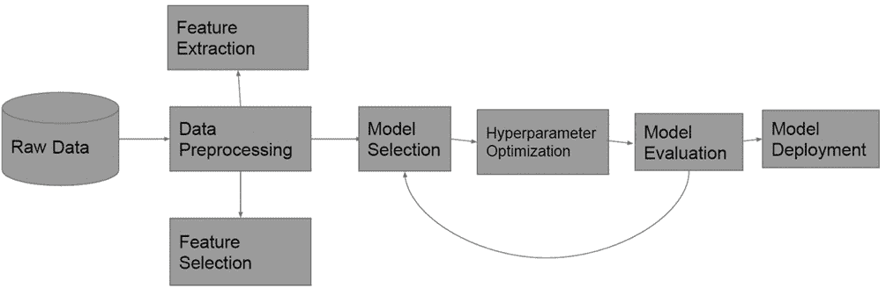
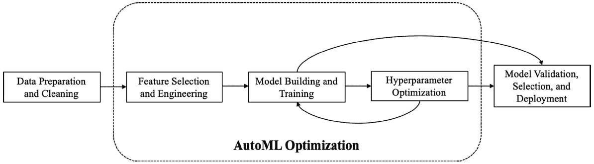
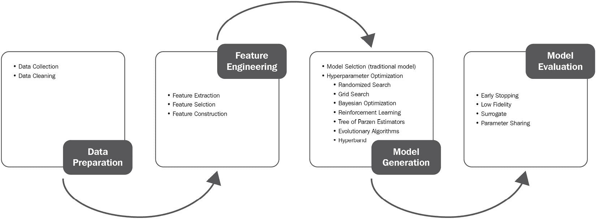
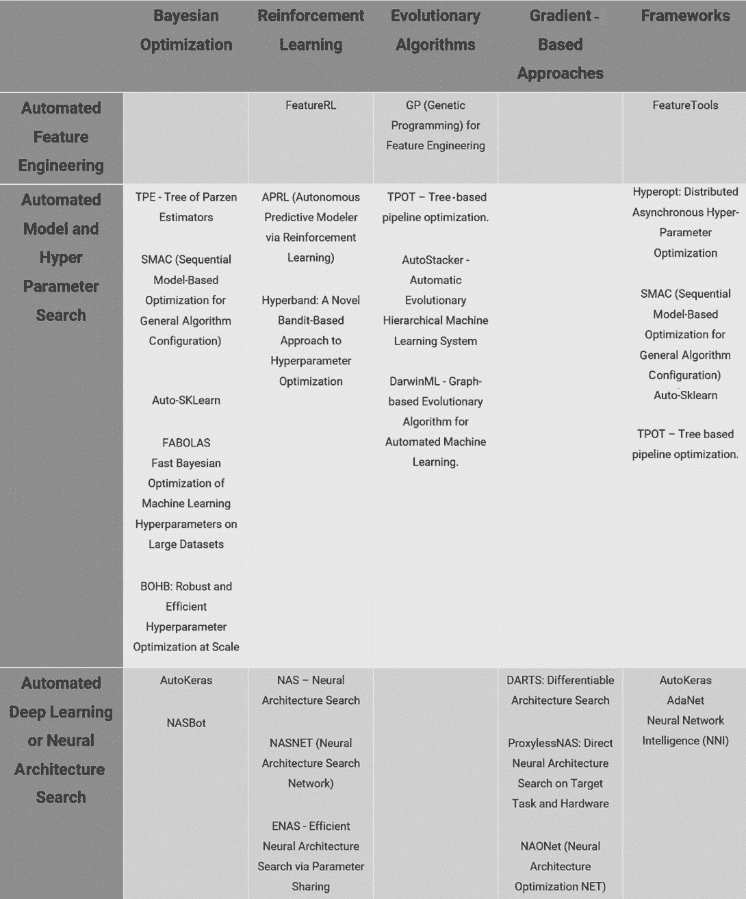
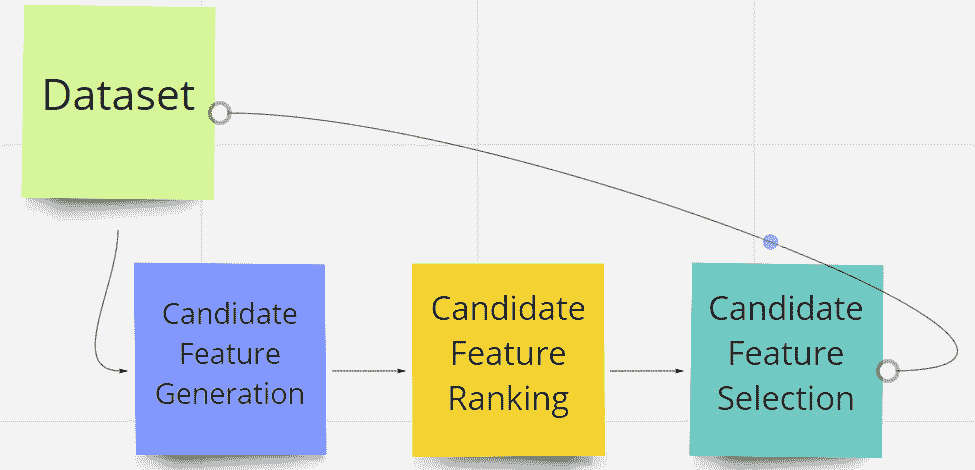
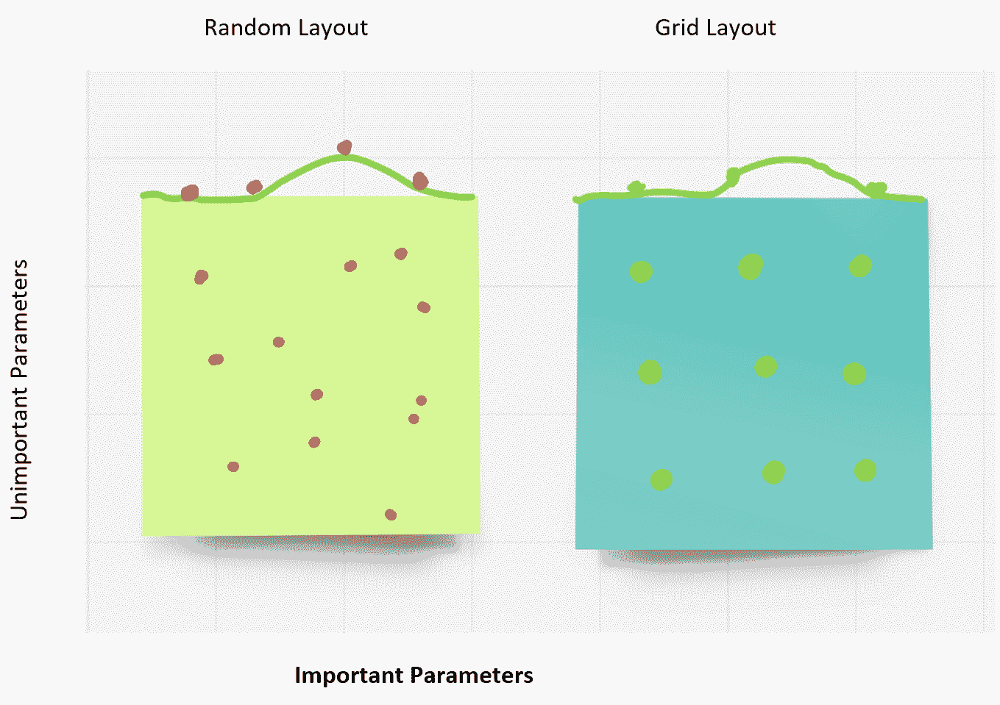
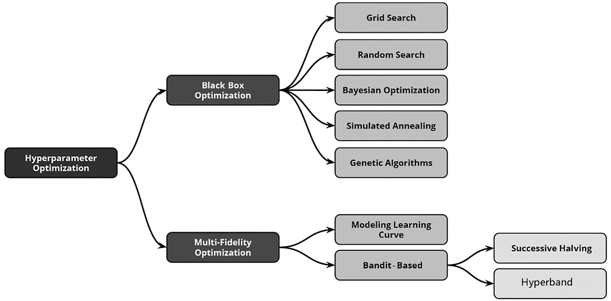

# *第二章*: 自动化机器学习、算法和技术

"机器智能是人类将永远需要的最后一种发明。"

– 尼克·博斯特罗姆

"人工智能的关键始终是表示。"

– 杰夫·哈克

"到目前为止，人工智能最大的危险是人们过早地得出他们理解它的结论。"

– 埃利泽·尤德科夫斯基

自动化自动化听起来像是一种美好的禅宗元概念，但学会学习并非没有挑战。在上章中，我们介绍了机器学习（ML）的开发生命周期，并简要概述了它是如何工作的。

在本章中，我们将探讨使自动化机器学习成为可能的技术、技术和工具。在这里，您将了解**AutoML**实际上是如何工作的，自动化特征工程、自动化模型和超参数调整以及自动化深度学习的算法和技术。您还将了解元学习和最先进的技术，包括贝叶斯优化、强化学习、进化算法和基于梯度的方法。

在本章中，我们将涵盖以下主题：

+   自动化机器学习 – 打开引擎盖

+   自动化特征工程

+   超参数优化

+   神经架构搜索

# 自动化机器学习 – 打开引擎盖

简单来说，典型的机器学习（ML）流程包括数据清洗、特征选择、预处理、模型开发、部署和消费步骤，如下所示的工作流程：

图 2.1 – 机器学习生命周期

自动化机器学习的目标是简化并民主化这个流程的步骤，使其对公民数据科学家可访问。最初，自动化机器学习社区的关键焦点是模型选择和超参数调整，即找到最适合工作的最佳性能模型及其对应的最优参数。然而，近年来，它已经扩展到包括以下所示图中的整个流程：

图 2.2 – Waring 等人提出的简化 AutoML 流程

元学习概念，即学习如何学习，是自动机器学习领域的主题。元学习技术通过观察学习算法、相似任务和先前模型来学习最佳超参数和架构。学习任务相似性、主动测试、代理模型迁移、贝叶斯优化和堆叠等技术用于学习这些元特征，以基于相似任务改进自动机器学习流程；本质上，这是一个热启动。自动机器学习流程功能并不真正在部署时结束——需要一个迭代反馈循环来监控预测的漂移和一致性。这个反馈循环确保预测结果的分布与业务指标相匹配，并且在硬件资源消耗方面存在异常。从运营的角度来看，错误和警告的日志，包括自定义错误日志，以自动化的方式进行审计和监控。所有这些最佳实践也适用于训练周期，其中概念漂移、模型漂移或数据漂移可能会对你的预测造成破坏；请注意“买者自慎”的警告。

现在，让我们探索一些你将在本章和未来章节中看到的自动机器学习的关键术语。

## 自动机器学习术语的分类

对于自动机器学习的新手来说，最大的挑战之一是熟悉行业术语——大量新术语或重叠术语可能会让探索自动机器学习领域的人感到不知所措并失去动力。因此，在这本书中，我们尽量使内容简单化，并在尽可能不失去深度的情况下进行概括。你将在本书以及其他自动机器学习文献中反复看到，重点放在三个关键领域——即自动特征工程、自动超参数调整和自动神经网络架构搜索方法。

自动特征工程进一步分为特征提取、选择和生成或构建。自动超参数调整，即学习特定模型的超参数，有时与学习模型本身捆绑在一起，因此成为更大神经网络架构搜索领域的一部分。这种方法被称为**全模型选择**（**FMS**）或**结合算法选择和超参数**（**CASH**）优化问题。神经网络架构搜索也称为**自动深度学习**（缩写为**AutoDL**），或简单地称为架构搜索。以下图表概述了**数据准备**、**特征工程**、**模型生成**和**评估**，以及它们的子类别，如何成为更大的机器学习流程的一部分：

![图 2.3 – 通过最先进的 AutoML 调查的自动机器学习流程，He 等人，2019 年]

图 2.3 – 通过最先进的 AutoML 调查的自动机器学习流程，He 等人，2019 年

用于执行自动化机器学习这三个关键原则的技术有一些共同之处。贝叶斯优化、强化学习、进化算法、无梯度方法和基于梯度的方法几乎在所有这些不同的领域中都被使用，具体变化如以下图表所示：

图 2.4 – 自动化机器学习技术

因此，如果您提到在自动化特征工程中使用遗传编程，而有人认为进化分层机器学习系统是一个超参数优化算法，您可能会得到困惑的表情。这是因为您可以将同一类技术，如强化学习、进化算法、梯度下降或随机搜索，应用于自动化机器学习管道的不同部分，并且效果很好。

我们希望*图 2.2*和*图 2.4*之间提供的信息能帮助您理解机器学习管道、自动化机器学习的显著特性和用于实现这三个关键特征特性的技术/算法之间的关系。在本章中构建的思维方式将大有裨益，尤其是在您遇到营销人员创造的荒谬术语时（是的，我指的是你，Todd！），例如基于深度学习的超参数优化产品，使用比特币和 Hyperledger。

下一个步骤是自动化特征工程，这是自动化机器学习管道的第一个支柱。

# 自动化特征工程

特征工程是从数据集中提取和选择正确属性的艺术和科学。它是一门艺术，因为它不仅需要专业知识，还需要领域知识，以及对伦理和社会问题的理解。从科学的角度来看，特征的重要性与其对结果的影响高度相关。预测模型中的特征重要性衡量一个特征对目标的影响程度，因此在事后更容易对最具影响力的属性进行排序。以下图表解释了自动化特征生成的迭代过程，通过生成候选特征，对它们进行排序，然后选择特定的特征成为最终特征集的一部分：

图 2.5 – Zoller 等人关于自动化机器学习框架的基准和调查中的迭代特征生成过程，2020

从数据集中提取特征需要基于具有多个可能值的列生成分类二元特征，对特征进行缩放，消除高度相关的特征，添加特征交互，替换周期性特征，以及处理数据/时间场景。例如，日期字段会产生多个特征，如年份、月份、日期、季节、周末/工作日、假日和入学期间。一旦提取，从数据集中选择特征需要移除稀疏和低方差特征，以及应用降维技术，如**主成分分析**（PCA），以使特征数量可管理。我们现在将研究超参数优化，这曾经是自动化机器学习的同义词，并且仍然是该领域的一个基本实体。

# 超参数优化

由于其普遍性和易于构建，超参数优化有时被认为与自动化机器学习同义。根据搜索空间，如果你包括特征、超参数优化（也称为超参数调整和超参数学习），则被称为自动化管道学习。所有这些术语对于寻找模型正确参数这样简单的事情来说可能有点令人畏惧，但毕业生必须发表论文，我就不赘述了。

在深入研究这些结构时，有几个关于超参数的关键点需要注意。默认参数没有经过优化是众所周知的事实。Olson 等人在其 NIH 论文中展示了默认参数几乎总是糟糕的选择。Olson 提到，“*调整参数通常可以提高算法的准确率 3-5%，具体取决于算法……在某些情况下，参数调整导致了交叉验证准确率的 50%提升*。”这一观察结果可以在 Olson 等人的文章《交叉验证准确率提升 – 将机器学习应用于生物信息学问题的数据驱动建议》中找到：[`www.ncbi.nlm.nih.gov/pmc/articles/PMC5890912/`](https://www.ncbi.nlm.nih.gov/pmc/articles/PMC5890912/).

第二个重要点是，对这些模型的比较分析会导致更高的准确性；正如你将在接下来的章节中看到的，整个流程（模型、自动特征、超参数）都是获得最佳准确度权衡的关键。在 Olson 等人撰写的《将机器学习应用于生物信息学问题的数据驱动建议》一书中，“算法比较分析的热图”部分（[`www.ncbi.nlm.nih.gov/pmc/articles/PMC5890912/`](https://www.ncbi.nlm.nih.gov/pmc/articles/PMC5890912/））展示了 Olson 等人进行的实验，其中使用了 165 个数据集与多个不同的算法进行比较，以确定最佳准确性，并按性能从上到下排名。从这个实验中得出的结论是，没有单个算法可以在所有数据集上被认为是表现最佳的。因此，在解决这些数据科学问题时，确实有必要考虑不同的机器学习算法。

让我们快速回顾一下超参数是什么。每个模型都有其内部和外部参数。内部参数或模型参数是模型本身的固有属性，例如权重或预测矩阵，而外部参数也称为超参数，是“模型外部”的；例如学习率和迭代次数。例如，在 k-means 中，k 代表所需的聚类数量，epochs 用于指定在训练数据上进行的遍历次数。这两个都是超参数的例子，即不是模型本身固有属性的参数。同样，训练神经网络的学习率，**支持向量机**（**SVMs**）中的 C 和 sigma，树的数量或深度，矩阵分解中的潜在因素，深度神经网络中的隐藏层数量等等，都是超参数的例子。

为了找到正确的超参数，有几种方法，但首先让我们看看有哪些不同类型的超参数。超参数可以是连续的，例如：

+   模型的学习率

+   隐藏层的数量

+   迭代次数

+   批处理大小

超参数也可以是分类的，例如操作符的类型、激活函数或算法的选择。它们也可以是条件性的，例如，如果使用了卷积层，则选择卷积核大小；或者在 SVM 中选择了**径向基函数**（**RBF**）核时，选择核宽度。由于存在多种类型的超参数，因此也有各种超参数优化技术。网格搜索、随机搜索、贝叶斯优化、进化技术、多臂老虎机方法和基于梯度的技术都被用于超参数优化：

图 2.6 – 网格和随机搜索布局。伯格斯特拉和本吉奥 – JMLR 2012

超参数调整的最简单技术是手动调整、网格搜索和随机搜索。正如其名所示，手动调整基于直觉和基于以往经验的猜测。网格搜索和随机搜索略有不同，因为你可以选择一组超参数，要么为每个组合（网格），要么随机选择并迭代以保留表现最好的那些。然而，正如你可以想象的那样，随着搜索空间的扩大，这可能会迅速变得计算上难以控制。

另一种突出的技术是贝叶斯优化，其中你从一个随机的超参数组合开始，并使用它来构建一个代理模型。然后你使用这个代理模型来预测其他超参数组合将如何工作。作为一个基本原则，贝叶斯优化通过使用过去的表现来选择未来的值，构建一个概率模型以最小化目标函数，这正是贝叶斯优化之所以称为贝叶斯的原因。在贝叶斯宇宙中，你的观察不如你的先验信念重要。

贝叶斯优化的贪婪性质由探索与利用的权衡（预期改进）、分配固定时间评估、设置阈值等来控制。存在这些代理模型的变体，例如随机森林代理和梯度提升代理，它们使用上述技术来最小化代理函数：

Figure 2.7 – A taxonomy of hyperparameter optimization techniques, Elshawi et al., 2019

基于种群的方法类（也称为元启发式技术或从样本中进行优化的方法）也被广泛用于执行超参数调整，其中遗传编程（进化算法）是最受欢迎的，超参数在此过程中被添加、变异、选择、交叉和调整。当配置空间在每次迭代中更新时，粒子群会朝着最佳个体配置移动。另一方面，进化算法通过维护一个配置空间，并通过进行较小的更改和组合个体解决方案来构建新一代的超参数配置来工作。现在让我们探索自动机器学习难题的最后一部分——神经架构搜索。

# 神经架构搜索

选择模型可能具有挑战性。在回归的情况下，即预测数值，你有线性回归、决策树、随机森林、lasso 与岭回归、k-means 弹性网络、梯度提升方法（包括**XGBoost**）和 SVMs 等多种选择，等等。

对于分类，换句话说，通过类别分离事物，你可以使用**逻辑回归**、**随机森林**、**AdaBoost**、**梯度提升**和基于**SVM**的分类器。

神经架构具有搜索空间的概念，这定义了原则上可以使用哪些架构。然后，必须定义一个搜索策略，概述如何通过探索-利用权衡来探索。最后，必须有一个性能估计策略，用于估计候选架构的性能。这包括架构的训练和验证。

有几种技术可以执行搜索空间的探索。最常见的方法包括链式结构神经网络、多分支网络、基于单元格的搜索以及使用现有架构的优化方法。搜索策略包括随机搜索、进化方法、贝叶斯优化、强化学习和无梯度与基于梯度的优化方法，如**可微分架构搜索**（**DARTS**）。使用蒙特卡洛树搜索或爬山来分层探索架构搜索空间，这种方法很受欢迎，因为它有助于通过快速接近性能更好的架构来发现高质量的架构。这些都是“免费”梯度方法。在基于梯度的方法中，连续搜索空间的基本假设促进了 DARTS，与传统的强化学习或进化搜索方法不同，DARTS 使用梯度下降来探索搜索空间。神经架构搜索的可视分类学可以在以下图表中看到：

图 2.8 – 神经架构搜索技术分类学，Elshawi 等人，2019

![Figure 2.8 – A taxonomy of neural architecture search techniques, Elshawi et al., 2019]

图 2.8 – 神经架构搜索技术分类学，Elshawi 等人，2019

为了评估哪种方法最适合特定的数据集，性能估计策略包括从简单到更复杂（尽管是优化过的）的方法。在估计策略中最简单的是仅训练候选架构，并在测试数据上评估其性能——如果效果良好，那就太好了。否则，就将其丢弃并尝试不同的架构组合。随着候选架构数量的增加，这种方法可能会迅速变得资源密集，因此引入了低保真策略，如缩短训练时间、子集训练和每层更少的过滤器，这些方法并不那么全面。换句话说，早期停止，即通过外推学习曲线来估计架构的性能，也是这种近似的有用优化。将训练好的神经架构进行形态变化，以及将所有架构视为超图子图的单一搜索，也是有效的单次架构搜索方法。

已有几项关于自动化 ML 的调查，这些调查对这些技术提供了深入的概述。具体的技术也有它们自己的出版物，包括阐述良好的基准数据、挑战和成功——所有这些都超出了本手稿的范围。然而，在下一章中，我们将使用利用这些技术的库，这样你将更好地了解它们在实际中的可用性。

# 摘要

现在，企业内部机器学习的成功在很大程度上取决于能够构建特定业务特征和工作流程的人类 ML 专家。自动化 ML 旨在改变这一点，因为它旨在自动化 ML，以便提供现成的 ML 方法，这些方法可以在没有专业知识的情况下使用。为了理解自动化 ML 是如何工作的，我们需要回顾自动化 ML 的四个基础子领域或支柱：超参数优化；自动化特征工程；神经网络架构搜索；和元学习。

在本章中，我们解释了自动化机器学习（ML）背后的技术、技术和工具，以及它们是如何使自动化 ML 成为可能的。我们希望这一章能让你对自动化 ML 技术有所了解，并且你现在准备好深入到实施阶段。

在下一章中，我们将回顾实现这些算法的开源工具和库，以便获得如何在实际中应用这些概念的手动概述，所以请保持关注。

# 进一步阅读

关于以下主题的更多信息，请参阅建议的资源链接：

+   *自动化 ML：方法、系统、挑战*：Frank Hutter（编辑），Lars Kotthoff（编辑），和 Joaquin Vanschoren（编辑）。Springer 机器学习挑战系列

+   *动手实践自动化 ML*：使用 AutoML 和 Python 构建自动化 ML 系统的入门指南，作者：Sibanjan Das 和 Umit Mert Cakmak，Packt

+   *使用强化学习进行神经网络架构搜索*：[`arxiv.org/pdf/1611.01578.pdf`](https://arxiv.org/pdf/1611.01578.pdf)

+   *学习可迁移的架构以实现可扩展的图像识别*：[`arxiv.org/pdf/1707.07012.pdf`](https://arxiv.org/pdf/1707.07012.pdf)

+   *渐进式神经网络架构搜索*：[`arxiv.org/pdf/1712.00559.pdf`](https://arxiv.org/pdf/1712.00559.pdf)

+   *通过参数共享进行高效的神经网络架构搜索*：[`arxiv.org/pdf/1802.03268.pdf`](https://arxiv.org/pdf/1802.03268.pdf)

+   *通过网络转换进行高效的架构搜索*：[`arxiv.org/pdf/1707.04873.pdf`](https://arxiv.org/pdf/1707.04873.pdf)

+   *网络形态学*：[`arxiv.org/pdf/1603.01670.pdf`](https://arxiv.org/pdf/1603.01670.pdf)

+   *通过拉马克进化进行高效的多目标神经网络架构搜索*：[`arxiv.org/pdf/1804.09081.pdf`](https://arxiv.org/pdf/1804.09081.pdf)

+   *Auto-Keras*：*一个高效的神经网络架构搜索系统*：[`arxiv.org/pdf/1806.10282.pdf`](https://arxiv.org/pdf/1806.10282.pdf)

+   *卷积神经网络织物*：[`arxiv.org/pdf/1606.02492.pdf`](https://arxiv.org/pdf/1606.02492.pdf)

+   *DARTS*：可微架构搜索：[`arxiv.org/pdf/1806.09055.pdf`](https://arxiv.org/pdf/1806.09055.pdf)

+   *神经架构优化*：[`arxiv.org/pdf/1808.07233.pdf`](https://arxiv.org/pdf/1808.07233.pdf)

+   *SMASH*：通过超网络进行一次性模型架构搜索：[`arxiv.org/pdf/1708.05344.pdf`](https://arxiv.org/pdf/1708.05344.pdf)

+   *DARTS in PyTorch*：[`github.com/quark0/darts`](https://github.com/quark0/darts)

+   使用模拟退火进行超参数调整：[`santhoshhari.github.io/2018/05/18/hyperparameter-tuning-using-simulated-annealing.html`](https://santhoshhari.github.io/2018/05/18/hyperparameter-tuning-using-simulated-annealing.html)

+   贝叶斯优化：[`krasserm.github.io/2018/03/21/bayesian-optimization/`](http://krasserm.github.io/2018/03/21/bayesian-optimization/)

+   神经架构搜索：综述：[`www.jmlr.org/papers/volume20/18-598/18-598.pdf`](https://www.jmlr.org/papers/volume20/18-598/18-598.pdf)

+   将机器学习应用于生物信息学问题的数据驱动建议：[`www.ncbi.nlm.nih.gov/pmc/articles/PMC5890912/`](https://www.ncbi.nlm.nih.gov/pmc/articles/PMC5890912/)
