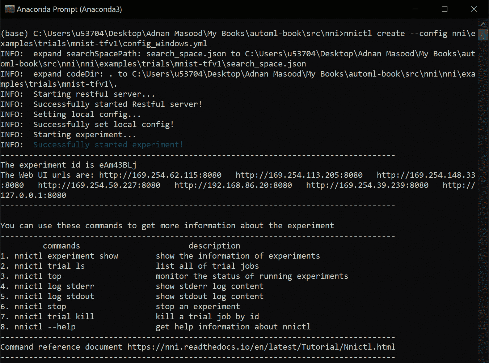
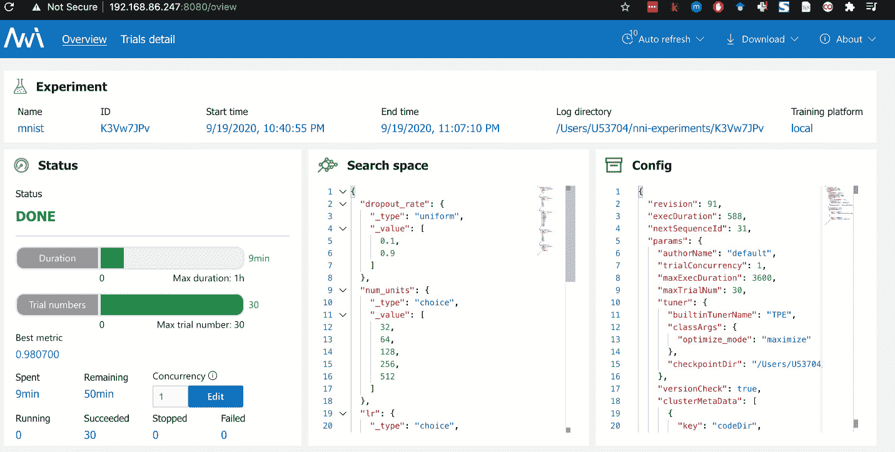

# *第三章*：使用开源工具和库进行自动化机器学习

“个人赋能是开源工作的重要组成部分，因为最终，创新往往来自小型团队，而不是来自大型、结构化的努力。”

– 蒂姆·奥莱利

“在开源领域，我们坚信，要真正做好某件事，你必须让很多人参与进来。”

– 林纳斯·托瓦兹

在上一章中，你了解了自动化**机器学习**（**ML**）技术、技术和工具的内部结构。你学习了 AutoML 是如何实际工作的——也就是说，自动化特征工程、自动化模型和超参数调整以及自动化深度学习的算法和技术。你还通过查看它们在自动化 ML 中的应用，探索了贝叶斯优化、强化学习、进化算法以及各种基于梯度的方法。

然而，作为一名动手的工程师，你可能直到通过实际尝试弄脏双手，才能真正理解某个东西，并从中获得满足感。本章将为你提供这样的机会。AutoML **开源软件**（**OSS**）工具和库自动化了从构思、概念化、开发到部署预测模型的全生命周期。从数据准备到模型训练、验证以及部署，这些工具几乎不需要人工干预就能完成所有工作。

在本章中，我们将回顾主要的开源工具，包括**TPOT**、**AutoKeras**、**auto-sklearn**、**Featuretools**和**Microsoft NNI**，以帮助你了解每个库中使用的差异化价值主张和方法。

在本章中，我们将涵盖以下主题：

+   自动化机器学习的开源生态系统

+   介绍 TPOT

+   介绍 Featuretools

+   介绍 Microsoft NNI

+   介绍 auto-sklearn

+   介绍 AutoKeras

让我们开始吧！

# 技术要求

本章的技术要求如下：

+   TPOT 安装：[github.com/EpistasisLab/tpot](http://github.com/EpistasisLab/tpot)

)

+   Featuretools 安装：[`pypi.org/project/featuretools/`](https://pypi.org/project/featuretools/)

+   Microsoft NNI 安装：[`github.com/microsoft/nni`](https://github.com/microsoft/nni)

+   auto-sklearn 安装：[`automl.github.io/auto-sklearn/master/installation.html`](https://automl.github.io/auto-sklearn/master/installation.html)

+   AutoKeras 安装：[`autokeras.com/install/`](https://autokeras.com/install/)

+   MNIST 下载：[`www.kaggle.com/c/digit-recognizer`](https://www.kaggle.com/c/digit-recognizer)

# 自动化机器学习的开源生态系统

通过回顾自动化机器学习的历史，可以明显看出，在早期，焦点始终集中在**超参数**优化上。早期的工具，如**AutoWeka**和**HyperoptSkLearn**，以及后来的**TPOT**，最初的重点是使用贝叶斯优化技术来找到模型的最合适的**超参数**。然而，这一趋势转向左侧，包括模型选择，最终通过包括特征选择、预处理、构建和数据清洗，将整个流程纳入其中。以下表格展示了一些可用的突出自动化机器学习工具，包括**TPOT**、**AutoKeras**、**auto-sklearn**和**Featuretools**，以及它们的优化技术、机器学习任务和训练框架：


图 3.1 – 自动化机器学习框架的特点

在本章的几个示例中，我们将使用 `datasets` 包，因为它已经处理了数据加载和预处理**MNIST** 60,000 个训练示例和 10,000 个测试示例。大多数数据科学家都是机器学习爱好者，并且非常熟悉**MNIST**数据库，这使得它成为教授如何使用这个库的绝佳候选者：


图 3.2 – 手写数字 MNIST 数据库 – 可视化

前面的图像显示了 MNIST 数据集的外观。该数据集作为所有主要机器学习和深度学习库的一部分提供，可以从 [`www.kaggle.com/c/digit-recognizer`](https://www.kaggle.com/c/digit-recognizer) 下载。

# 介绍 TPOT

**基于树的管道优化工具**，简称**TPOT**，是宾夕法尼亚大学计算遗传学实验室的产品。TPOT 是一个用 Python 编写的自动化机器学习工具。它通过遗传编程帮助构建和优化机器学习管道。建立在 scikit-learn 之上，TPOT 通过“探索成千上万的可能管道以找到最佳方案”来自动化特征选择、预处理、构建、模型选择和参数优化过程。它是唯一具有较短学习曲线的工具包之一。

工具包可在 GitHub 上下载：[github.com/EpistasisLab/tpot](http://github.com/EpistasisLab/tpot)。

为了解释这个框架，让我们从一个最小的工作示例开始。对于这个示例，我们将使用**MNIST**手写数字数据库：

1.  创建一个新的`pip install TPOT`。TPOT 可以直接从命令行或通过 Python 代码使用：

    图 3.3 – 在 Colab 笔记本上安装 TPOT

1.  导入 `TPOTClassifier`，scikit-learn 的 `datasets` 包和模型选择库。我们将使用这些库来加载我们将在 TPOT 中用于分类的数据：

    图 3.4 – AutoML TPOT 示例 – 导入语句

1.  现在，通过加载 `train_test_split` 方法返回一个包含给定输入的 train-test 分割的列表。在这种情况下，输入是数字数据和数字目标数组。在这里，您可以看到训练大小是 **0.75**，测试大小是 **0.25**，这表示标准 75-25 的训练和测试数据分割：

    图 3.5 – AutoML TPOT 示例 – 加载数字数据集

1.  在典型场景中，这就是我们选择模型、分配 `TPOTClassifier` 的地方。这个类在参数上相当广泛，如以下截图所示，但我们将只使用三个关键参数；即，`verbosity`、`max_time_mins` 和 `population_size`：

    图 3.6 – AutoML TPOT 示例 – 实例化 TPOTClassifier 对象

    关于传递给 `Classifier` 的参数的简要说明 – 将 `Verbosity` 设置为 `2` 将使 TPOT 在进度条旁边打印信息。`max_time_mins` 参数设置 TPOT 优化管道的分钟数分配，而 `population_size` 参数是每一代遗传编程种群中个体的数量。

    在开始实验时，我们将最大时间设置为仅 1 分钟：

    

    ](img/B16890_03_07.jpg)

    图 3.7 – AutoML TPOT 示例 – TPOTClassifier 的优化运行

    您将看到优化进度并不那么理想；它处于 22%，因为在这个世代中只有 40 个个体中的 9 个已被处理。在这种情况下，最佳推荐管道基于 `RandomForestClassifier`。

1.  现在，让我们将其增加到 5 分钟并检查生成的管道。在这个阶段，看起来推荐的分类器是梯度提升分类器。这非常有趣：

    .

    图 3.8 – AutoML TPOT 示例 – 执行 TPOTClassifier

1.  这次，我们将逐渐增加时间到 `15` 分钟，在这种情况下，最佳管道将来自 **k-最近邻**（**KNN**）分类器：

    图 3.9 – AutoML TPOT 分类器 – 使用 TPOTClassifier 进行拟合以获取预测

1.  将时间增加到 `25` 分钟并不会改变算法，但其他 **超参数**（邻居数量）及其准确性有所提高：

    图 3.10 – AutoML TPOT 示例 – 运行多代和分数

1.  最后，让我们运行整个小时的实验：

    图 3.11 – AutoML TPOT 示例 – TPOT 代数和交叉验证分数

    结果最佳管道是使用特征排名和递归特征消除的 `KNeighborsClassifier`。其他超参数包括 `max_features` 和 `n_estimators`，该管道的准确率为 `0.98666`：

    

    图 3.12 – AutoML TPOT 示例 – 最佳管道

    这让我想起 – 如果 666 被认为是邪恶的数字，那么 25.8069758011 就是万恶之源。

1.  此外，正如你可能观察到的，TPOT 需要运行其 **交叉验证**（**CV**）的时间，对于多代，管道发生变化，不仅仅是算法，**超参数**也发生了演变。还有递减的回报。CV 分数的改进变得越来越小，到了某个点，这些改进几乎不起作用。

现在，您可以通过调用 `export` 方法从 TPOT 导出实际模型：


图 3.13 – AutoML TPOT 示例 – 探索数字管道

模型导出后，你将能够在 **Google Colab** 的左侧面板中看到文件，如下面的截图所示：


图 3.14 – AutoML TPOT 示例 – 可视化 TPOT 数字管道

现在我们知道这个管道效果最好，让我们试试看。注意我们不再需要 TPOT，因为我们已经有了“茶”（或在这个情况下是管道）：


图 3.15 – AutoML TPOT 示例 – 使用 ExtraTreesClassifier 导出管道

现在我们已经创建了导出的管道，让我们加载数据集。我可以选择从 CSV 文件中读取它，但我可以直接使用 `sklearn` 数据集来加快速度。此外，我在数组中选择了数字 `target` `[10]`)，哇 – 预测是正确的：


图 3.16 – AutoML TPOT 示例 – 导出管道的结果

## TPOT 是如何做到这一点的？

这个看起来很棒，但你购买这本书的目的并不是仅仅为了学习如何使用 API——你更想了解底层的运作原理。好的，现在我来告诉你：TPOT 通过遗传编程自动化了管道的关键组件；它尝试了不同的方法，正如你所见，最终选择了使用 KNN 作为最佳分类器：

图 3.18 – TPOT – 用于自动化机器学习的基于树的管道优化工具

. 以下步骤将指导你如何安装 Featuretools，以及如何使用该库运行自动机器学习实验。让我们开始吧：

1.  在幕后，TPOT 使用遗传编程结构（选择、交叉和变异）来优化转换，这有助于最大化分类精度。以下是 TPOT 提供的操作符列表：

    在这个实验中，我们将使用波士顿房价数据集，这是机器学习中一个知名且广泛使用的数据集。以下是数据集的简要描述和元数据：

    ![图 3.19 – 使用 Featuretools 的 AutoML – 安装 Featuretools    Featuretools 是一个优秀的 Python 框架，它通过使用 DFS 帮助自动化特征工程。由于特征工程的性质非常微妙，它是一个难题。然而，这个开源工具包，凭借其强大的时间戳处理和可重用的特征原语，为我们提供了一个合适的框架来构建和提取特征组合及其影响。    图 3.17 – TPOT 管道搜索概述    图 3.20 – 使用 Featuretools 的 AutoML – 波士顿房价数据集    ![图 3.19.jpg1.  波士顿房价数据集是`scikit-learn`数据集的一部分，这使得它非常容易导入，如下所示：![图 3.21 – 使用 Featuretools 的 AutoML – 安装 Featuretools    ![图 3.17 – TPOT 管道搜索概述    图 3.18 – TPOT – 用于自动化机器学习的基于树的管道优化工具 1.  现在，我们将使用`featuretools`的**深度特征合成（DFS**）API 来处理`boston`数据集：![图 3.22 – 使用 Featuretools 的 AutoML – 将数据集加载为 pandas DataFrame    图 3.20 – 使用 Featuretools 的 AutoML – 波士顿房价数据集    

图 3.23 – 使用 Featuretools 的 AutoML – DFS 的结果

特征列表继续：


图 3.24 – 使用 Featuretools 的 AutoML – DFS 的结果 – 继续显示

到目前为止，你可能想知道，如果 DFS 只包含现有特征的求和和乘积，那么进行 DFS 的意义何在？我很高兴你提出了这个问题。将这些派生特征视为突出多个数据点之间的潜在关系——这与求和和乘积无关。例如，你可以通过平均订单求和将多个表链接起来，算法将具有额外的预定义特征来寻找相关性。这是 DFS 提供的非常强大且具有显著性的量化价值主张，通常用于机器学习算法竞赛：


图 3.25 – DFS – 从实体分析特征

**Featuretools**网站包含一套优秀的演示，用于预测下一次购买、剩余使用寿命、预约未出现、贷款偿还可能性、客户流失、家庭贫困和恶意互联网流量等众多用例：[`www.featuretools.com/demos/`](https://www.featuretools.com/demos/)。

# 介绍 Microsoft NNI

**Microsoft 神经网络智能**（**NNI**）是一个开源平台，针对任何自动化机器学习生命周期的三个关键领域——自动化特征工程、架构搜索（也称为**神经架构搜索**或**NAS**）和**超参数调整**（**HPI**）。该工具包还提供模型压缩功能和部署。NNI 内置了许多超参数调整算法。

NNI 的高级架构图如下：


图 3.26 – Microsoft NNI 高级架构

NNI 内置了几个最先进的**超参数**优化算法，它们被称为**调优器**。列表包括**TPE**、**随机搜索**、**退火**、**朴素进化**、**SMAC**、**Metis Tuner**、**Batch Tuner**、**网格搜索**、**GP Tuner**、**网络形态**、**Hyperband**、**BOHB**、**PPO Tuner**和**PBT Tuner**。

工具包可在 GitHub 上下载：[`github.com/microsoft/nni`](https://github.com/microsoft/nni)。有关其内置调优器的更多信息，请在此处查看：[`nni.readthedocs.io/en/latest/builtin_tuner.html`](https://nni.readthedocs.io/en/latest/builtin_tuner.html)。

现在，让我们学习如何安装 Microsoft NNI 以及如何使用此库运行自动机器学习实验。

让我们继续在我们的机器上使用 `pip` 安装 NNI：


图 3.27 – 使用 Microsoft NNI 的 AutoML – 通过 Anaconda 安装

NNI 提供的最好功能之一是它既有 **命令行界面**（**CLI**）又有 **Web UI**，这样我们就可以查看试验和实验。NNICtl 是用于管理 NNI 应用程序的命令行。您可以在以下屏幕截图中看到实验的选项：


图 3.28 – 使用 Microsoft NNI 的 AutoML – nnictl 命令

如果您不了解 NNI 的工作原理，它可能会有一个学习曲线。您需要熟悉 NNI 的三个主要元素才能使其正常工作。首先，您必须定义搜索空间，您可以在 `search_space.json` 文件中找到它。您还需要更新模型代码（`main.py`），使其包含 `config.yml`），这样您就可以定义调优器和试验（执行模型代码）信息：


图 3.29 – 使用 Microsoft NNI 的 AutoML – 配置和执行文件

作为提醒，搜索空间描述了每个超参数的值范围，并且对于每个试验，从这个空间中选取各种超参数值。在创建超参数调优实验的配置时，我们可以限制试验的最大数量。同时，在创建超参数搜索空间时，我们可以列出在 **选择** 类型超参数的调优实验中想要尝试的值。

在这个例子中，我们使用了简单的 `nnictl` `create` 命令：


图 3.30 – 使用 Microsoft NNI 的 AutoML – 运行实验

您可以使用以下命令了解更多关于实验的信息：



图 3.31 – 使用 Microsoft NNI 的 AutoML – nnictrl 参数

现在，让我们看看 NNI 的秘密武器——它的 UI。NNI UI 可以通过输出控制台显示的 Web UI URL 访问，如 *图 3.29* 所示。在这里，您可以查看正在运行的实验、其参数和详细信息。例如，在这种情况下，我们只运行了 19 个试验，所以它们运行得很快。然而，没有有意义的结果，例如我们找到的最佳指标（`N/A`），如下面的截图所示：


图 3.32 – 使用 Microsoft NNI UI 的 AutoML

将试验次数增加到 30 需要更长的时间，但它也为你提供了更好的结果准确性。Microsoft NNI 帮助你报告中间结果（在训练完成之前的试验或训练过程中的结果）。例如，如果报告的指标值存储在变量“x”中，你可以使用 NNI 进行中间报告，如下所示：

```py
nni.report_intermediate_result(x)
```

屏幕上将会显示以下内容：



图 3.33 – 使用 Microsoft NNI 的 AutoML – 实验完成后的用户界面

NNI 的用户界面还提供了每个试验的**默认指标**、**超参数**、**持续时间**和**中间结果**的视图。特别是超参数视图非常令人惊叹，因为你可以可视化每个**超参数**是如何被选择的。例如，在这种情况下，似乎使用具有 1,024 个批次的 ReLU 提供了显著良好的结果。这给你一个关于可以用于模型选择的底层算法的想法，如下面的截图所示：


图 3.34 – 使用 Microsoft NNI 的 AutoML – 实验中的超参数

如我们之前所学的关于收益递减，增加试验次数并不能显著提高模型的准确性。在这种情况下，实验花费了 40 分钟完成 100 次试验，并提供了最佳指标为**0.981**，与之前的**0.980**相比，如下截图所示：


图 3.35 – 使用 Microsoft NNI 的 AutoML – 配置参数

你还可以选择不同的超参数结果百分比，以查看我们用于获得最佳性能结果的**超参数**：


图 3.36 – 使用 Microsoft NNI 的 AutoML – 超参数

或者，你只需从图形右上角的下拉菜单中选择`Top 5%`来查看结果的前 5%：


图 3.37 – 使用 Microsoft NNI 的 AutoML – 前 5%的超参数

NNI 还允许你通过视觉方式深入到每个试验。你可以在以下截图中看到所有试验作业：


图 3.38 – 使用 Microsoft NNI 的 AutoML – 实验列表

或者，你可以深入到单个作业中，查看各种超参数，包括`dropout_rate`、`num_units`、学习率、`batch_size`和`activation`函数：


图 3.39 – 使用 Microsoft NNI 的 AutoML – 顶级 20%超参数的路径

能够看到关于实验和超参数的这种程度细节是非常惊人的，这使得 NNI 成为我们自动化 ML 的顶级开源工具之一。

在我们继续之前，重要的是要注意，类似于 AutoGluon 是 AWS 自动化 ML 服务的一部分，NNI 是 Microsoft Azure 自动化 ML 工具集的一部分，这使得它在重用时更加强大和灵活。

# 介绍 auto-sklearn

**scikit-learn**（也称为**sklearn**）是一个非常流行的 Python 开发 ML 库 – 非常受欢迎，以至于它有自己的梗：


图 3.40 – 一个 ML 梗

作为这个生态系统的一部分，基于*Feurer 等人*的*高效且鲁棒的自动化机器学习*，**auto-sklearn**是一个自动化 ML 工具包，它使用**贝叶斯优化**、**元学习**和**集成构建**来执行算法选择和**超参数调整**。

工具包可在 GitHub 上下载：[github.com/automl/auto-sklearn](http://github.com/automl/auto-sklearn)。

`auto-sklearn`宣称其自动化 ML 的易用性，因为它是一个四行自动化 ML 解决方案：


图 3.41 – 使用 auto-sklearn 的 AutoML – 开始

如果前面的语法看起来很熟悉，那么这是因为这就是`scikit-learn`进行预测的方式，因此使`auto-sklearn`成为最容易使用的库之一。`auto-sklearn`使用`scikit-learn`作为其后端框架，并支持带有自动化**集成构建**的**贝叶斯优化**。

基于`auto-sklearn`同时解决寻找最佳模型及其超参数的问题。以下图表显示了`auto-sklearn`如何描述其内部管道：


图 3.42 – auto-sklearn 自动化的 ML 管道

基于自动 ML 的“引擎”使用**信息检索**（**IR**）和统计元特征方法来选择各种配置，所有这些配置都作为贝叶斯优化的输入部分。这个过程是迭代的，auto-sklearn 保留模型以创建集成，从而迭代构建模型以最大化性能。在 Colab 上设置 auto-sklearn 可能很棘手，因为你需要安装以下包以开始：


图 3.43 – 使用 auto-sklearn 的 AutoML – 安装必要的库

你可能需要在 Colab 上安装后重新启动运行时。你也可以按照这里指定的说明在你的本地机器上设置 auto-sklearn：[`automl.github.io/auto-sklearn/master/installation.html`](https://automl.github.io/auto-sklearn/master/installation.html)。

完成安装后，你可以运行**auto-sklearn 分类器**，并通过自动化机器学习的魔力获得高精度和**超参数**：


。

如果你愿意，可以尝试改变优化指标、训练-验证分割、提供不同特征类型、使用 pandas DataFrames 以及检查搜索过程的高级用例。这些高级示例还展示了如何使用 auto-sklearn 来**扩展回归**、**分类**和**预处理组件**，以及如何限制多个**超参数**。

# AutoKeras

**Keras**是使用最广泛的深度学习框架之一，也是 TensorFlow 2.0 生态系统的重要组成部分。**Auto-Keras**基于 Jin 等人撰写的论文([`arxiv.org/abs/1806.10282`](https://arxiv.org/abs/1806.10282))，该论文提出了"*一种使用网络形态学进行高效神经架构搜索的新方法，并实现了贝叶斯优化*"。**AutoKeras**基于这样一个概念，即由于现有的神经架构搜索算法如**NASNet**和**PNAS**在计算上相当昂贵，使用**贝叶斯优化**来指导网络的形态学是一种探索搜索空间的有效方法。

工具包可在 GitHub 上下载：[github.com/jhfjhfj1/autokeras](http://github.com/jhfjhfj1/autokeras)。

以下步骤将指导你如何安装 AutoKeras 以及如何使用库运行自动化机器学习实验。让我们开始吧：

1.  要开始使用 Auto-Keras，请在 Colab 或 Jupyter Notebook 中运行以下`install`命令。这样做将安装`git uri`：

    图 3.45 – 使用 AutoKeras 的 AutoML – 安装

1.  一旦满足依赖项，你可以加载**MNIST 数据集**：

    图 3.46 – 使用 AutoKeras 的 AutoML – 加载训练数据

1.  现在，您可以获取**AutoKeras**并查看分类器的代码——在这种情况下，是一个图像分类器。**AutoKeras**在计算分类度量时显示了数据的准确性：

    图 3.47 – 使用 AutoKeras 的 AutoML – 运行 epoch

1.  快速跳过 fit 过程，现在您已经发现了`model.save`方法，并将在以后使用它进行`eval`。您可以在 Colab 笔记本的左侧面板中看到存储在`model_autokeras`文件夹中的模型，如下面的截图所示：

    图 3.51 – 使用 AutoKeras 的 AutoML – 导出为 Keras 模型

1.  一旦模型被保存，就可以使用`load_model`来检索数据，并对它进行预测，如下面的截图所示：


图 3.52 – 使用 AutoKeras 的 AutoML – 预测值

**AutoKeras**使用**高效神经网络架构搜索**（**ENAS**），这是一种类似于迁移学习的方法。像集成一样，在搜索过程中学习的**超参数**被用于其他模型，这有助于我们避免重新训练并提供改进的性能。

在我们概述开源库的总结中，有两款优秀且易于使用的 AutoML 框架值得特别提及：**Ludwig**和**AutoGluon**。

## Ludwig – 无代码的 AutoML 工具箱

Uber 的自动化 ML 工具 Ludwig 是一个开源的深度学习工具箱，用于实验、测试和训练 ML 模型。建立在 TensorFlow 之上，Ludwig 使用户能够创建模型基线和执行不同网络架构和模型的自动化 ML 风格实验。在其最新版本中，Ludwig 现在与 CometML 集成并支持 BERT 文本编码器。

工具包可在 GitHub 上下载：[`github.com/uber/ludwig`](https://github.com/uber/ludwig)。

关于这个主题，这里有很多很好的例子：[`ludwig-ai.github.io/ludwig-docs/examples/#image-classification-mnist`](https://ludwig-ai.github.io/ludwig-docs/examples/#image-classification-mnist)。

# **AutoGluon** – 深度学习的 AutoML 工具包

从 AWS 实验室出发，考虑到 ML 民主化的目标，AutoGluon 被描述为开发出来以实现“易于使用和易于扩展的 AutoML，专注于深度学习和涵盖图像、文本或表格数据的实际应用*”。作为 AWS 自动化 ML 策略的一部分，AutoGluon 使初级和经验丰富的数据科学家都能够轻松构建深度学习模型和端到端解决方案。像其他自动化 ML 工具包一样，AutoGluon 提供网络架构搜索、模型选择以及改进自定义模型的能力。

工具包可在 GitHub 上下载：[`github.com/awslabs/autogluon`](https://github.com/awslabs/autogluon)。

# 摘要

在本章中，你回顾了一些用于 AutoML 的主要开源工具，包括 **TPOT**、**AutoKeras**、**auto-sklearn**、**Featuretools** 和 **Microsoft NNI**。这些工具提供给你，以帮助你理解我们在 *第二章* 中讨论的概念，即 *自动化机器学习、算法和技术*，以及每个库中使用的底层方法。

在下一章中，我们将深入探讨商业自动化机器学习产品，从微软 Azure 平台开始。

# 进一步阅读

关于本章涵盖的主题的更多信息，请参阅资源和链接：

+   Python 中的 TPOT 自动机器学习：[`machinelearningmastery.com/tpot-for-automated-machine-learning-in-python/`](https://machinelearningmastery.com/tpot-for-automated-machine-learning-in-python/)

+   Featuretools 示例：[`www.featuretools.com/demos/`](https://www.featuretools.com/demos/)

+   波士顿数据集：[`scikit-learn.org/stable/modules/generated/sklearn.datasets.load_boston.html`](https://scikit-learn.org/stable/modules/generated/sklearn.datasets.load_boston.html)

+   如何自动化机器学习：[`www.knime.com/blog/how-to-automate-machine-learning`](https://www.knime.com/blog/how-to-automate-machine-learning)

+   由 Randal S. Olson 撰写的 *将机器学习应用于生物信息学问题的数据驱动建议*：[`www.ncbi.nlm.nih.gov/pmc/articles/PMC5890912/`](https://www.ncbi.nlm.nih.gov/pmc/articles/PMC5890912/)

+   Python 中的 TPOT 自动机器学习：[`towardsdatascience.com/tpot-automated-machine-learning-in-python-4c063b3e5de9`](https://towardsdatascience.com/tpot-automated-machine-learning-in-python-4c063b3e5de9)

+   微软 NNI：[`github.com/microsoft/nni`](https://github.com/microsoft/nni)

+   auto-sklearn：[`automl.github.io/auto-sklearn/master/examples/20_basic/example_regression.html#sphx-glr-examples-20-basic-example-regression-py`](https://automl.github.io/auto-sklearn/master/examples/20_basic/example_regression.html#sphx-glr-examples-20-basic-example-regression-py)

+   TPOT 示例：[`github.com/EpistasisLab/tpot/blob/master/tutorials/Digits.ipynb`](https://github.com/EpistasisLab/tpot/blob/master/tutorials/Digits.ipynb)
