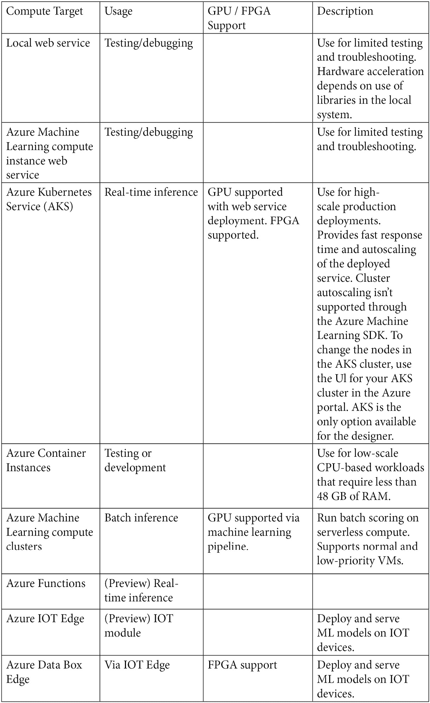

# *第四章*：开始使用 Azure 机器学习

“作为一名技术专家，我看到人工智能和第四次工业革命将影响人们生活的各个方面。”

– 斯坦福大学计算机科学教授李飞飞

在上一章中，你被介绍了主要的 AutoML 开源软件（OSS）工具和库。我们游览了主要的 OSS 产品，包括 TPOT、AutoKeras、auto-sklearn、Featuretools 和 Microsoft NNI，这将有助于你，读者，理解每个库中使用的差异化的价值主张和方法。

在本章中，我们将开始探索许多商业产品中的第一个，即微软的 Azure 自动化机器学习（ML）能力。Azure 机器学习是微软 AI 生态系统的一部分，它利用 Windows Azure 平台和服务的力量来加速端到端的机器学习生命周期。我们将从一个企业级的机器学习服务开始，用于构建和部署模型，这使开发人员和数据科学家能够更快地构建、训练和部署机器学习模型。通过示例和演示，你将学习构建和部署使用 Azure 的自动化机器学习解决方案的基础知识。

在本章中，我们将涵盖以下主题：

+   开始使用 Azure 机器学习

+   Azure 机器学习堆栈

+   开始使用 Azure 机器学习服务

+   使用 Azure 机器学习进行建模

+   使用 Azure 机器学习部署和测试模型

# 开始使用 Azure 机器学习

不久前，如果你想在 Azure 平台上使用机器学习在生产环境中，你需要汇集一系列不同的服务来支持完整的机器学习生命周期。

例如，要使用数据集，你需要存储库，例如 Azure Blob 存储或 Azure Data Lake 存储来存储数据。对于计算，你可能需要单独的虚拟机、使用 HDInsight 的 Spark 集群，或者 Azure Databricks 来实际运行你的模型代码。为了保护你的数据以适应企业级，你需要引入你的虚拟网络或配置你的计算和数据在同一个虚拟网络内，以及使用 Azure Key Vault 来管理和保护你的凭证。为了通过使用一致的机器学习库及其不同版本来提供实验的可重复性，你会创建 Docker 容器并使用 Azure 容器注册表来存储这些 Docker 容器。你需要将它们放在你的虚拟网络内，然后使用 Azure Kubernetes 服务。哇！这听起来像是要拼凑很多东西才能让机器学习和所有模型以及一切都能工作。

但自那时以来，情况已经有所进展，你很幸运。通过 Azure 机器学习服务，微软消除了这种复杂性。作为一个托管服务，Azure 机器学习自带自己的计算、托管笔记本以及模型管理、版本控制和模型可重复性的功能。你可以在现有的 Azure 服务之上构建这些功能。例如，你可以连接并整合你已有的计算和存储，以及其他基础设施服务。Azure 机器学习在单一环境中连接和编排它们，以便你拥有一个端到端模块化平台，用于整个机器学习生命周期，从准备数据、构建、训练、打包到部署你的机器学习模型。

微软的 Azure 机器学习开发团队提供了一份优秀的速查表（[aka.ms/mlcheatsheet](http://aka.ms/mlcheatsheet)），它可以帮助你为手头的预测分析任务选择最佳的机器学习算法。无论你想预测类别之间的差异，发现结构，还是从文本中提取信息，在以下流程中，你可以根据自己的需求找到最佳算法：

图 4.1 – 机器学习算法速查表概览

Azure 机器学习服务为公民数据科学家提供了一个理想的工作环境。他们可以获得服务、工具，几乎所有配置都为他们准备好了，而且无需编译所有这些单个服务，这使他们能够专注于最重要的事情——解决业务问题。这些领域专家也不需要学习如何使用新工具。你可以使用 Jupyter 笔记本、你喜欢的 Python 编辑器——包括 VS Code 和 PyCharm，Azure 机器学习与任何 Python 机器学习框架库兼容，如 TensorFlow、PyTorch、scikit-learn 等。这在缩短生命周期、快速启动和运行方面非常出色。你将在本章的其余部分中看到一些这些示例，当我们通过使用 Azure 机器学习服务构建分类模型时。

# Azure 机器学习堆栈

微软的 Azure 生态系统相当广泛；在本章中，我们将重点关注其与 AI 和机器学习相关的云产品，特别是 Azure 机器学习服务。

下图显示了 Azure 云中可用的机器学习产品：

图 4.2 – Azure 云机器学习产品

你可以访问以下链接获取有关前表中产品信息的更多信息：[`docs.microsoft.com/en-us/azure/architecture/data-guide/technology-choices/data-science-and-machine-learning.`](https://docs.microsoft.com/en-us/azure/architecture/data-guide/technology-choices/data-science-and-machine-learning)

)

在众多先前列出的 Azure 机器学习产品中，了解应该选择哪个可能会令人困惑。以下图表有助于根据给定的业务和技术场景选择正确的产品：

图 4.3 – Azure 机器学习决策流程

自动机器学习是 Azure 机器学习服务功能的一部分。其他功能包括协作笔记本、数据标注、机器学习操作、拖放式设计工作室、自动扩展功能以及以下表格中描述的许多其他工具。

图 4.4 – Azure 机器学习关键服务功能

Azure 提供的 AI 和 ML 功能非常全面，详细了解这些功能的最佳起点是 Microsoft Learn 上的 Azure AI 基础学习路径：[`aka.ms/AzureLearn_AIFundamentals.`](https://aka.ms/AzureLearn_AIFundamentals)

)

Azure 机器学习服务几乎提供了数据科学家所需的一切。它包括环境、实验、管道、数据集、模型、端点和工作区，这有助于启用以下 Azure 资源：

+   **Azure 容器注册库**（**ACR**）：此注册库存储了训练和部署期间使用的 Docker 容器信息。

+   **Azure 存储帐户**：ML 工作区的默认数据存储；它还存储相关的 Jupyter 笔记本。

+   **Azure 应用洞察**：此服务存储模型监控信息。

+   **Azure 密钥保管库**：用于计算和工作空间所需的凭据和其他机密。

要训练任何机器学习算法，您需要处理能力，即计算资源。Azure 支持各种不同的计算资源，从您的本地计算机到远程虚拟机。以下表格概述了不同工作负载的训练目标。如表中所示，您可以使用本地计算机、计算集群、远程虚拟机以及各种其他自动机器学习工作负载的训练目标：

图 4.5 – Azure 机器学习训练目标

在逐步说明中，您将了解如何创建和选择计算目标。最后，所有机器学习算法都需要实现化和部署。那句著名的格言“在我的机器上它运行得很好”只能走这么远；因此，您需要一个部署计算资源来托管您的模型并提供端点。

这就是您的服务所在之处，也将从这里被消费，也称为用于部署的计算目标。以下表格显示了不同类型的部署目标：

图 4.6 – Azure 机器计算目标

在介绍 Azure 机器学习功能的基础上，让我们一步步探索如何使用 Azure 机器学习服务构建分类模型。

# 开始使用 Azure 机器学习服务

在本节中，我们将逐步探索使用 Azure 机器学习创建分类模型的过程：

1.  注册一个 Microsoft 账户，除非您已经有了，否则请登录到 Azure 机器学习门户 [ml.azure.com](http://ml.azure.com)。在这里，您将看到以下图所示的 ML 工作室。Azure 订阅基本上是您支付服务的方式。如果您已经有了现有的订阅，您可以使用它，或者注册一个新的。对于全新的用户，Azure 的好人们提供 200 美元的信用额度，让您熟悉环境。确保在不使用资源时关闭资源；不要让数据中心灯光一直亮着：

    图 4.7 – Azure 机器学习服务订阅启动页面

1.  在以下图中，您可以看到我们现在被要求选择一个订阅。在这种情况下，我们将选择**免费试用**来探索服务。您也可以选择**按量付费**，在这种情况下，您的账户将根据您的计算、存储和其他服务使用情况进行收费：

    图 4.8 – Azure 机器学习服务订阅选择页面

1.  现在您已经选择了订阅，您将被带到 Azure 门户，在那里您可以做很多事情。在这种情况下，点击 `Machine` `Learning` 服务，您将看到以下屏幕以创建 Azure 机器学习服务。这是您可以创建一个或多个 ML 工作区的地方。现在通过点击**创建 Azure 机器学习**按钮继续：

    图 4.10 – Azure 机器学习服务启动页面在门户中

1.  点击**创建 Azure 机器学习**后，您将被带到以下页面以创建一个 ML 工作区。这是您将选择订阅、创建资源组并选择地理位置的地方：

    图 4.11 – Azure 机器学习服务 – 创建工作区

1.  以下图显示了创建名为 `auto-ml-workspace` 的 ML 工作区的填写好的表单。**资源组**充当一组不同资源的容器，因此相关的资产（计算、存储等）也包含在内：

    图 4.12 – Azure 机器学习服务页面

    一个工作空间可以包含计算实例、实验、数据集、模型、部署端点等，是 Azure 机器学习中的顶级资源。你可以参考以下图中所示的 Azure 工作空间的分解：

    

    图 4.13 – 什么是 Azure 机器学习工作空间？

    在**项目详情**下点击**创建**按钮后，你的 ML 服务将被部署，并创建相关的依赖项。这可能需要几分钟。你将看到如下所示的图示：

    

    图 4.14 – Azure 机器学习服务部署

1.  一旦部署完成，你将看到资源组和其关联的资源，如下图所示。现在你可以点击**转到资源**按钮，这将带你进入 ML 工作空间：

    图 4.15 – Azure 机器学习部署完成屏幕

1.  这是你的 ML 工作空间。在这里，你可以看到你的**资源组**、**订阅**、**密钥保管库**以及所有重要的高级细节，但你还没有进入 ML 场域。还需要再点击一次。所以现在，请点击**启动工作室**按钮，进入 ML 工作室：

    图 4.16 – Azure 机器学习工作室控制台启动工作室

1.  现在，以下是你一直耐心等待的屏幕：ML 工作室！请继续，点击**开始游览**按钮 – 我们会等待：

图 4.17 – Azure 机器学习工作室主页

以下图示展示了 Azure 机器学习工作室。曾经有一个“经典”版本的 ML 工作室，但现在它已经不再活跃，所以我们只关注这个新的闪亮基于网页的门户，它可以帮助你完成所有机器学习任务。在左侧面板中，你可以看到所有不同的服务，这些服务也通过下拉菜单提供：

图 4.18 – Azure 机器学习工作室主页

界面现代、简洁、高效。你可以通过创建一个新的**笔记本**、一个自动化的 ML 实验，或者一个设计器来开始。每个服务都有不同的用途，但它们有相似的基础设施。笔记本是面向动手数据科学家的优秀工具，而自动化的 ML 实验旨在实现 AI 的民主化。设计器界面提供了拖放功能，用于准备数据和部署模型。

# 使用 Azure 机器学习进行建模

在我们创建自动化的 ML 工作流之前，让我们从一个简单的 Azure 笔记本开始：

1.  Azure 笔记本是 Azure 机器学习服务的一部分，您可以选择创建或使用示例笔记本开始：

    图 4.19 – Azure 机器学习示例笔记本

1.  在`MNIST`中，它将过滤以显示笔记本。选择`image-classification-part1-training.ipynb`文件以在右侧窗格中查看笔记本，然后点击**克隆此笔记本**以创建您的副本：

    图 4.20 – MNIST 图像分类笔记本

1.  点击`user`目录下的`yml`配置文件：

    图 4.21 – MNIST 图像分类笔记本

1.  现在您已经克隆了资产，是时候设置计算目标了。没有机器来运行，您是无法运行笔记本的。如您之前所见，我们能够在 Google Colab 或本地运行代码。在这种情况下，我们正在 Azure 上运行此工作负载，这要求我们更明确地表达我们的意图，因此您必须创建一个计算目标才能继续。点击**创建计算实例**：

    图 4.22 – MNIST 图像分类笔记本

1.  一旦您点击了**创建计算实例**，您将看到提供的计算选项及其相关成本。更大的更好硬件成本更高并不令人惊讶：

    注意

    您可以在[`azure.microsoft.com/en-us/pricing/details/virtual-machines/series/`](https://azure.microsoft.com/en-us/pricing/details/virtual-machines/series/)了解不同类型的虚拟机及其相关成本。

    

    图 4.23 – 创建新的计算实例

1.  为了本 AutoML 笔记本的目的，我们将选择一个标准小型虚拟机，如下图所示，并创建计算实例。您可以根据需要创建多个计算实例并将它们分配给不同的实验：

    图 4.24 – 创建新的计算实例

1.  点击**创建**以创建新的计算实例——当您创建计算实例时，这可能需要一些时间，因为您会看到耐心旋转的圆圈，此时您可以探索 Azure 机器学习门户的其他部分：

    图 4.25 – MNIST 自动化机器学习计算实例

    现在，计算实例已准备好使用，如下图所示。首先，您会看到状态为**启动中**，如下图所示：

    

    图 4.26 – 计算实例属性

    当计算实例准备就绪时，计算实例的状态将变为**运行中**。您可以选择**停止**、**重启**或**删除**计算资源，只要您愿意。只需记住，这将危及其依赖项（使用或计划使用此计算资源的事物）：

    

    图 4.27 – 计算实例运行

1.  通过点击打开的`image-classification-mnist-data`笔记本，我们可以运行代码以确保其正常工作。您还可以看到以下图中打印的 Azure Machine Learning SDK 版本：

    图 4.28 – MNIST 图像分类笔记本

1.  还有一个配置步骤尚未完成——您必须通过工作区进行身份验证才能利用资源。为此，内置了一个交互式身份验证系统，您需要点击以下图中显示的链接（`devicelogin`）并输入代码（也在以下图中）以进行身份验证。我确信您不会使用以下图中的代码——它不会起作用，但很好尝试一下！！图 4.29 – MNIST 图像分类笔记本

    

    图 4.29 – MNIST 图像分类笔记本

1.  既然我们已经完成了身份验证，让我们创建一个计算目标。所有配置的`样板代码`已经作为 Jupyter 笔记本的一部分为您编写好了。通过运行以下图中的单元格，您现在可以以编程方式连接到`ComputeTarget`并配置节点：

    图 4.30 – MNIST 图像分类笔记本

1.  现在是时候以编程方式下载 MNIST 数据集进行训练了。Yann LeCun（纽约大学 Courant 研究所）和 Corinna Cortes（纽约谷歌实验室）拥有 MNIST 数据集的版权，该数据集是原始 MNIST 数据集的派生作品。MNIST 数据集在 Creative Commons Attribution-Share Alike 3.0 许可条款下提供。下载后，您还可以像以下笔记本屏幕截图所示那样可视化它：

    图 4.31 – MNIST 图像分类笔记本

1.  如您可能从我们之前与 MNIST 的冒险经历中记得，我们将为数据集创建如图所示的训练和测试分割，并训练一个逻辑回归模型。现在我们还将创建一个估算器，用于将运行提交到集群：

    图 4.32 – MNIST 图像分类笔记本

    在使用 Azure 机器学习工作时，有一条必须记住的规则，那就是所有实验及其关联的运行都是相互关联的，以保持生态系统的连贯性。这非常有帮助，因为无论你在哪里运行实验（在笔记本、JupyterLab、自定义代码等），你都可以调出运行情况并查看详细信息。关于这一点，稍后会有更多介绍。

    在下面的图中，你可以看到创建估算器的代码，然后通过调用 `experiment` 对象的 `submit` 函数将作业提交到集群：

    

    图 4.33 – MNIST 图像分类笔记本

1.  在这一点上，运行以下图中的单元格演示了如何使用 Jupyter 小部件的 `wait_for_completion` 方法可视化 `experiment` 的详细信息，以查看作业的状态。这显示了在远程集群上运行的作业，以及作为小部件一部分的相应构建日志。你可以看到如下图中作为小部件一部分的 **运行** 详细信息：

图 4.34 – MNIST 图像分类笔记本

当作业在远程集群上运行时，我们看到结果流进来，你可以通过相应的百分比指示器观察到训练在你眼前展开：

图 4.35 – MNIST 图像分类笔记本

当作业完成时，你将在小部件中看到所花费的时间和运行 ID，如下面的截图所示：

图 4.36 – MNIST 图像分类笔记本

你也可以通过点击后续的详细信息页面来查看实验的详细信息。你可以通过查看以下截图中的文档页面链接来了解有关实验如何工作的详细文档：

图 4.37 – MNIST 图像分类笔记本

一旦训练完成，你将看到运行期间记录的结果指标，并且还可以注册模型。这意味着你将获得模型的相应 `.pkl` 文件：

图 4.38 – MNIST 图像分类笔记本

现在你可以通过调用 `run.get_metrics()` 获取运行期间记录的所有指标，包括模型的准确度。在这种情况下，准确度为 0.9193：

图 4.39 – MNIST 图像分类笔记本

在这一点上，笔记本会自动将模型文件（`.pkl`）保存为输出文件夹中的输出。您可以通过调用`run.get_file_names()`方法来查看文件。在接下来的步骤中，我们将使用此模型文件来创建网络服务并调用它：

![Figure 4.40 – MNIST image classification notebook

![img/Figure_4.40_B16890.jpg]

图 4.40 – MNIST 图像分类笔记本

# 使用 Azure 机器学习部署和测试模型

模型现在已经训练完成，创建了一个`.pkl`文件，并且模型可以用于测试。部署部分在第二个笔记本`part2-deploy.ipynb`中完成，如下图中所示。要部署模型，我们通过点击左侧面板中的笔记本来打开`part 2-deploy.ipynb`笔记本。我们通过调用`joblib.Load`方法来加载`.pkl`文件。您还可以在下面的屏幕截图中看到`run`方法，它接收原始 JSON 数据，调用模型的`predict`方法，并返回结果：

![Figure 4.41 – MNIST image classification notebook

![img/Figure_4.41_B16890.jpg]

图 4.41 – MNIST 图像分类笔记本

在这一步中，我们通过调用如下图所示的`Model`构造函数来创建一个模型对象。此模型使用来自`Environment`对象的配置属性，并使用服务名称部署端点。此端点使用**Azure 容器实例**（**ACI**）部署。部署成功后，端点位置即可使用：

![Figure 4.42 – MNIST image classification notebook

![img/Figure_4.42_B16890.jpg]

图 4.42 – MNIST 图像分类笔记本

1.  您现在可以检索评分 URI，该 URI 可用于调用服务并从模型获取结果：![Figure 4.43 – MNIST image classification notebook

    ![img/Figure_4.43_B16890.jpg]

    图 4.43 – MNIST 图像分类笔记本

1.  现在您可以调用网络服务以获取结果：

![Figure 4.44 – MNIST image classification notebook

![img/Figure_4.44_B16890.jpg]

图 4.44 – MNIST 图像分类笔记本

您还可以通过调用`confusion_matrix`方法查看相应的混淆矩阵：

![Figure 4.45 – MNIST image classification notebook

![img/Figure_4.45_B16890.jpg]

图 4.45 – MNIST 图像分类笔记本

这就完成了在 Azure 机器学习中构建模型、部署和测试的整个周期。我们将在下一章继续介绍自动化机器学习。

# 摘要

在本章中，你学习了如何开始使用 Microsoft Azure 平台，了解 ML 服务生态系统功能，并了解了微软的 AI 和 ML 产品。你还简要了解了 Azure 平台内的不同功能，例如协作笔记本、拖放式 ML、MLOPS、RStudio 集成、强化学习、企业级安全、自动化 ML、数据标注、自动扩展计算、与其他 Azure 服务的集成、负责任 ML 和成本管理。最后，为了测试你新发现的 Azure 超能力，你使用 Azure 机器学习笔记本配置、构建、部署并测试了一个分类 Web 服务。

在下一章中，我们将进一步深入探讨使用 Azure 机器学习服务的自动化 ML 功能。

# 进一步阅读

如需了解更多关于以下主题的信息，您可以访问提供的链接：

+   带有 Azure 机器学习示例的 ML 和深度学习 Python 笔记本：

    [`github.com/Azure/MachineLearningNotebooks`](https://github.com/Azure/MachineLearningNotebooks)

)

+   Azure 机器学习中的计算目标是什么？

    [`docs.microsoft.com/en-us/azure/machine-learning/concept-compute-target`](https://docs.microsoft.com/en-us/azure/machine-learning/concept-compute-target)

)

+   在 Python 的 Azure 机器学习管道中使用自动化 ML：

    [`docs.microsoft.com/en-us/azure/machine-learning/how-to-use-automlstep-in-pipelines`](https://docs.microsoft.com/en-us/azure/machine-learning/how-to-use-automlstep-in-pipelines)

)

+   巴哈多·卡莱吉对 AutoML 解决方案的批判性概述：

    [`medium.com/analytics-vidhya/a-critical-overview-of-automl-solutions-cb37ab0eb59e`](https://medium.com/analytics-vidhya/a-critical-overview-of-automl-solutions-cb37ab0eb59e)

)
