# 第七章：使用 Amazon SageMaker Autopilot 进行自动机器学习

"机器学习的圣杯之一就是自动化越来越多的特征工程过程。"

– Pedro Domingos

"自动机器学习，自从切片面包以来最好的事情！"

– 匿名

**自动化机器学习**（**AutoML**）通过超规模商（即云服务提供商）——有可能将 AI 民主化推广到大众。在前一章中，您在 SageMaker 中创建了一个**机器学习**（**ML**）工作流程，并学习了 SageMaker Autopilot 的内部机制。

在本章中，我们将探讨几个示例，解释如何以可视化和笔记本格式使用 Amazon SageMaker Autopilot。

在本章中，我们将涵盖以下主题：

+   创建一个 Amazon SageMaker Autopilot 限制性实验

+   创建一个 AutoML 实验

+   运行 SageMaker Autopilot 实验并部署模型

+   调用和测试 SageMaker Autopilot 模型

+   从笔记本中构建和运行 SageMaker Autopilot 实验

让我们开始吧！

# 技术要求

您需要访问您机器上的 Amazon SageMaker Studio 实例。

# 创建一个 Amazon SageMaker Autopilot 限制性实验

让我们通过 SageMaker Autopilot 来获得 AutoML 的实际操作介绍。我们将下载并应用 AutoML 到一个开源数据集。让我们开始吧！

1.  从 Amazon SageMaker Studio 开始，通过点击`bank-additional-full.csv`以及所有示例（完整数据），按日期排序（从 2008 年 5 月到 2010 年 11 月）

1.  `bank-additional.csv`，从`bank-additional-full.csv`中随机选择了 10%（4,119 个）的示例

1.  `bank-additional-names.txt`，其中包含前一个屏幕截图中所描述的字段信息

    如以下屏幕截图所示，一旦将 CSV 文件加载到 pandas DataFrame 中，您就可以使用 pandas 查看文件内容：

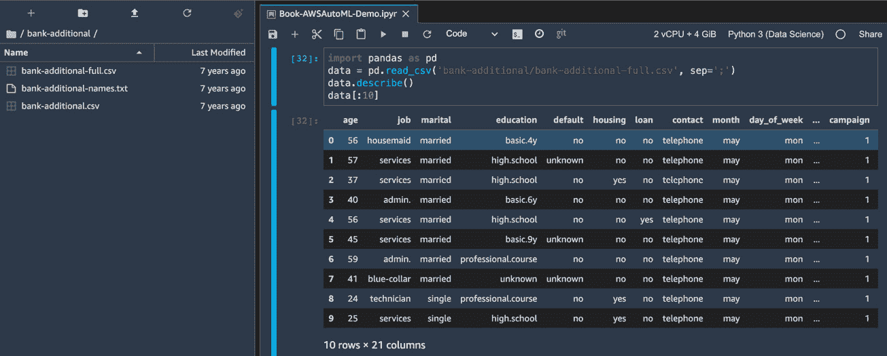

图 7.6 – Amazon SageMaker Studio Jupyter Notebook – 在 pandas DataFrame 中加载数据集并进行可视化

使用 NumPy 将数据集分割为训练和测试部分。在这种情况下，我们将使用 95%的数据进行训练，5%的数据进行测试，如下面的屏幕截图所示。您将把数据存储在两个文件中：一个用于训练，另一个用于测试。

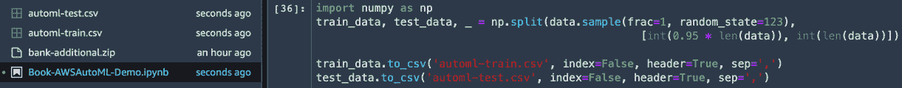

图 7.7 - Amazon SageMaker Studio Jupyter Notebook – 将数据集分割为训练/测试并保存文件到 S3

使用 SageMaker API，创建一个会话并将我们在上一步创建的训练数据上传到 S3：

图 7.8 – Amazon SageMaker Studio Jupyter Notebook – 将数据集上传到 S3

在上一章中，我们学习了如何使用笔记本创建一个 AutoML 实验。现在，让我们通过 SageMaker UI 创建一个实验。在左侧面板中点击实验图标，通过提供实验名称和 S3 存储桶地址来创建一个实验，如下截图所示：

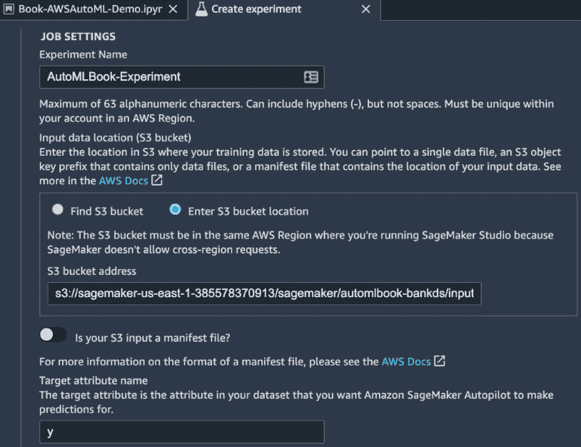

图 7.9 – Amazon SageMaker Studio UI – 创建实验

1.  将目标属性设置为`y`。目标属性在数据集中描述为输出变量（期望的目标）：`y` – 客户是否订阅了定期存款？（二进制：“是”，“否”）：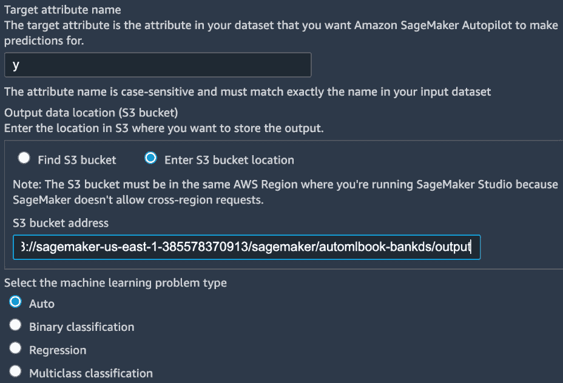

    图 7.10 – Amazon SageMaker Studio UI – 创建实验

    如前述截图所示，您可以自己定义 ML 问题——在这种情况下是二分类——或者让 SageMaker AutoML 引擎自行决定。在这种情况下，我们将将其保留为**自动**，您将看到 SageMaker 将其识别为二分类问题。

1.  您可以选择运行完整实验——即数据分析、特征工程和模型调优——或者创建一个笔记本来查看候选定义。我们将使用这个数据集来演示每种方法的好处：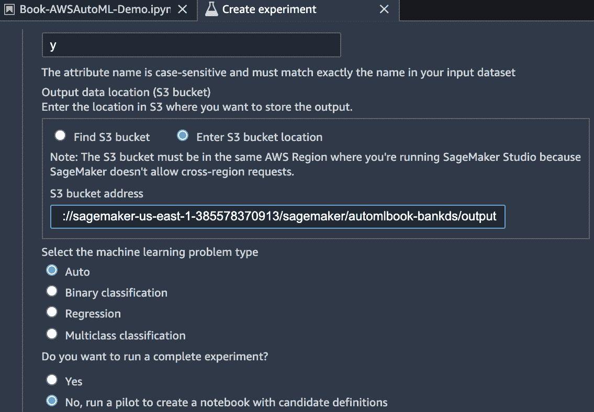

    图 7.11 – Amazon SageMaker Studio UI – 完整实验与试点候选定义

    最后，您还可以设置一些高级可选参数，例如自定义 SageMaker 角色、加密密钥（如果您的 S3 数据已加密）和 VPC 信息，如果您正在使用虚拟私有云：

    

    图 7.12 – Amazon SageMaker Studio UI – 高级设置

    这样，我们已经输入了所有必要的信息，可以运行实验。提交作业后，您将看到以下屏幕，其中包含两个步骤（数据分析候选定义生成）。这是因为我们选择不运行整个实验；我们只选择生成候选定义：

    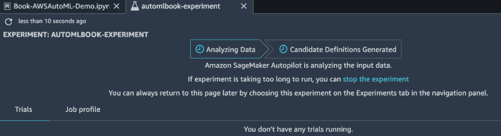

    图 7.13 – Amazon SageMaker Studio 实验创建 UI – 分析数据屏幕

1.  一旦这个部分实验完成，你将看到以下屏幕，它显示了完成的作业信息、试验和作业配置文件。由于我们在此情况下只生成了候选者，实验没有花费太多时间。**打开候选生成笔记本**和**打开数据探索笔记本**按钮位于页面右上角。这两个按钮都将打开相应的笔记本：

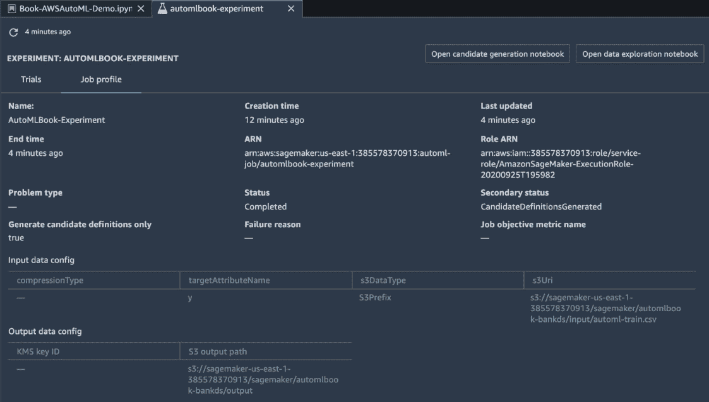

图 7.14 – Amazon SageMaker AutoML 实验完成视图

SageMaker Autopilot 候选定义笔记本帮助数据科学家更深入地了解数据集、其特征、其分类问题和训练模型的指标质量。这本质上是对 SageMaker Autopilot 管道背后发生的事情的深入了解，并给数据科学家一个机会手动运行并根据自己的需要调整或修改：

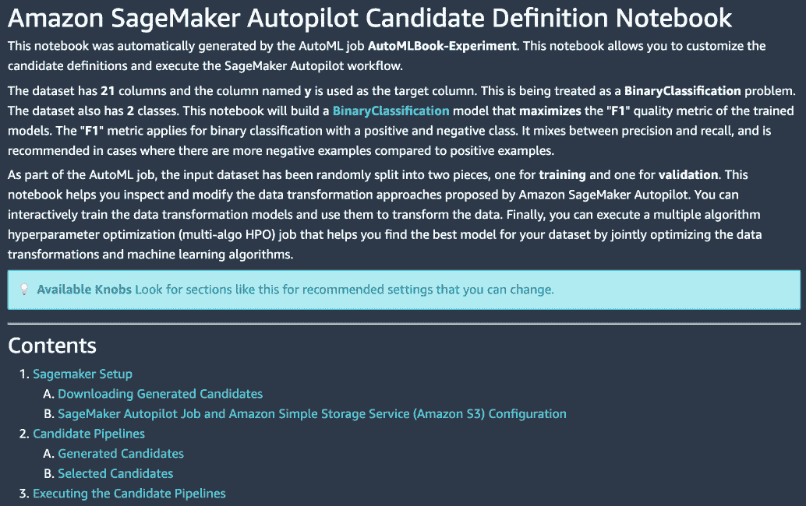

图 7.15 – Amazon SageMaker Autopilot 候选定义笔记本

候选定义笔记本是一个相当大的文件，其中包含一个目录，如前一张截图所示。同样，数据探索笔记本为您提供了对数据集的洞察：

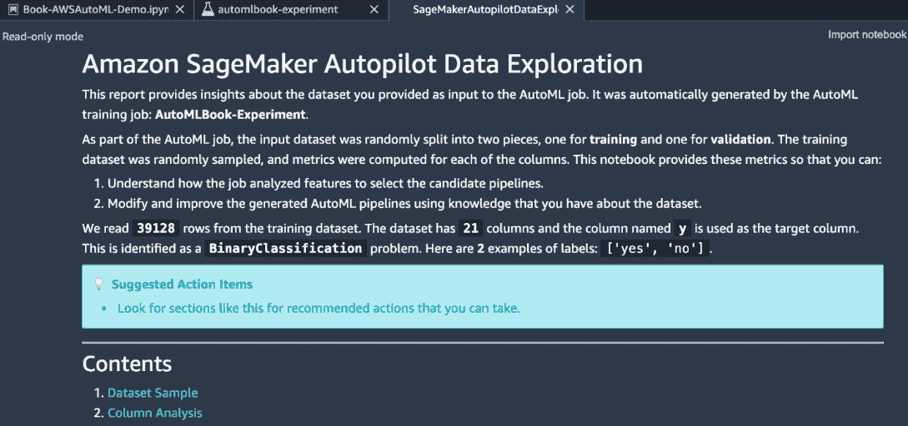

图 7.16 – Amazon SageMaker Autopilot 数据探索笔记本

这些洞察包括数据科学家通常期望的内容——数据科学家会寻找特征及其数据类型、范围、平均值、中位数、描述性统计、缺失数据等。即使你对通用的 AutoML 功能持怀疑态度，这也是数据科学家探索数据集及其相应候选者的绝佳地方：

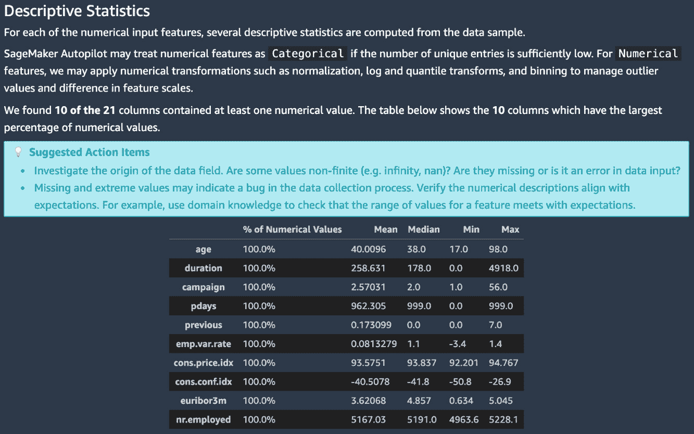

图 7.17 – Amazon SageMaker Autopilot 数据探索笔记本 – 描述性统计

Amazon SageMaker Autopilot 数据探索和候选定义笔记本为用户提供了一个透明的视角来分析数据和进行实验。作为笔记本，这些是可执行的代码片段，你可以看到预处理程序、超参数、算法、超参数的范围以及所有用于识别最佳候选者的预定预处理步骤：

在下一节中，我们将构建并运行一个完整的 Autopilot 实验。

# 创建一个 AutoML 实验

由于 Autopilot 数据探索和候选定义笔记本提供了数据集的深入概述，完整的实验实际上运行了这些步骤，并根据这些笔记本中描述的步骤为你提供一个最终调优模型。现在，让我们使用之前查看过的相同 UI 创建一个完整实验：

1.  从 Amazon SageMaker Studio 开始一个数据科学实验。在左侧面板中单击实验图标，通过提供实验名称和 S3 存储桶地址来创建实验，如图下屏幕截图所示：

![Figure 7.18 – Amazon SageMaker Autopilot – 创建实验

![img/Figure_7.18_B16890.jpg]

图 7.18 – Amazon SageMaker Autopilot – 创建实验

在之前的*创建 Amazon SageMaker Autopilot 限制性实验部分*中，我们进行了限制性运行。在本节中，我们将使用完整实验功能：

![Figure 7.19 – Amazon SageMaker Autopilot – 创建完整实验

![img/Figure_7.19_B16890.jpg]

图 7.19 – Amazon SageMaker Autopilot – 创建完整实验

当你开始实验时，它的行为将非常类似于我们之前的候选实验，除了这个完整的实验将花费更长的时间，并且将构建和执行整个管道。在此期间，当你等待结果时，你会看到以下屏幕：

![img/Figure_7.20_B16890.jpg]

图 7.20 – Amazon SageMaker Autopilot – 运行完整实验

在实验运行期间，你可以通过查看单个实验并从**试验**选项卡中获得有价值的见解来跟踪其进度。你也许还会注意到，此处的问题类型被正确分类为二元分类：

![Figure 7.21 – Amazon SageMaker Autopilot – 运行完整实验

![img/Figure_7.21_B16890.jpg]

图 7.21 – Amazon SageMaker Autopilot – 运行完整实验

以下屏幕截图显示的实验详细摘要显示了所使用的推理容器、模型数据 URI 以及所使用的环境，以及它们各自的**Amazon 资源名称**（**ARN**），这些名称唯一标识 AWS 资源：

![Figure 7.22 – Amazon SageMaker Autopilot 推理容器信息

![img/Figure_7.22_B16890.jpg]

图 7.22 – Amazon SageMaker Autopilot 推理容器信息

**试验**选项卡显示了运行的不同试验和调优作业，以及目标函数（F1 分数），它展示了其随时间如何改进：

![Figure 7.23 – Amazon SageMaker Autopilot 实验运行试验 – 最佳模型

![img/Figure_7.23_B16890.jpg]

图 7.23 – Amazon SageMaker Autopilot 实验运行试验 – 最佳模型

您在前面的章节中已经看到了这个具体的迭代；这又是一次似曾相识。我们已经看到了这个过程在 OSS 工具中的展开，但在这里它是以更组织化的端到端方式进行。您有一个完整的管道集成在一个地方；也就是说，策略、数据分析、特征工程、模型调优和超参数优化过程。您可以在以下截图中查看调优作业的详细信息：

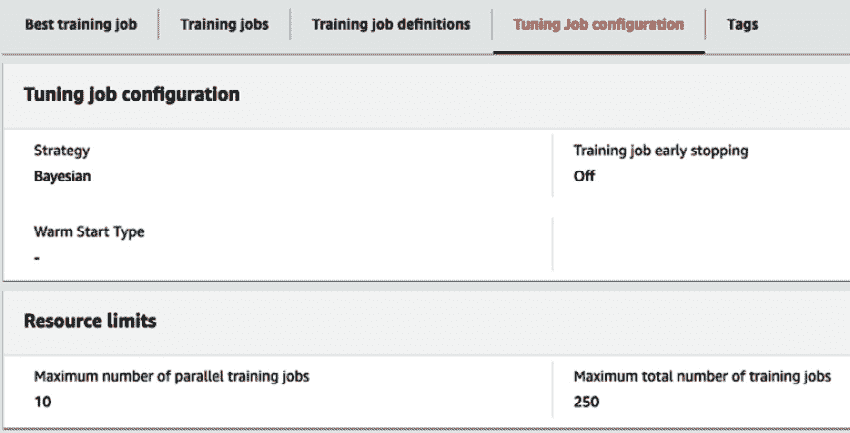

图 7.24 – Amazon SageMaker Autopilot 调优作业详情显示贝叶斯策略和资源信息

现在我们已经运行了整个实验并且过程已经完成，让我们部署最佳模型。

# 运行 SageMaker Autopilot 实验和部署模型

Amazon SageMaker Studio 使我们能够轻松地构建、训练和部署机器学习模型；也就是说，它使数据科学生命周期得以实现。为了部署我们在上一节中构建的模型，我们需要设置某些参数。为此，您必须提供端点名称、实例类型、实例数量（计数）以及是否需要捕获请求和响应信息。让我们开始吧：

1.  如果您选择**数据捕获**选项，您需要一个 S3 存储桶来存储，如下截图所示：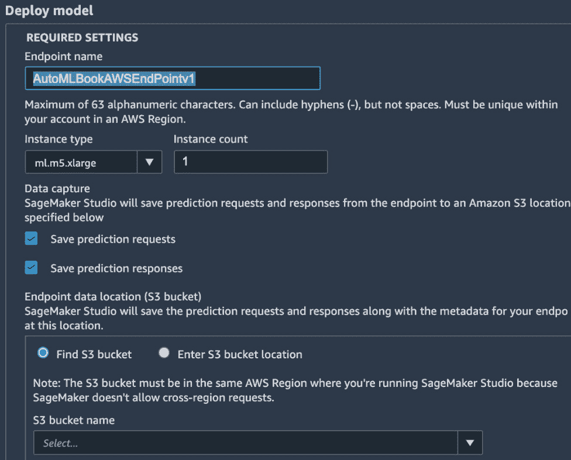

    图 7.25 – Amazon SageMaker 端点部署

1.  点击**部署**后，您将看到以下屏幕，显示新端点创建的进度：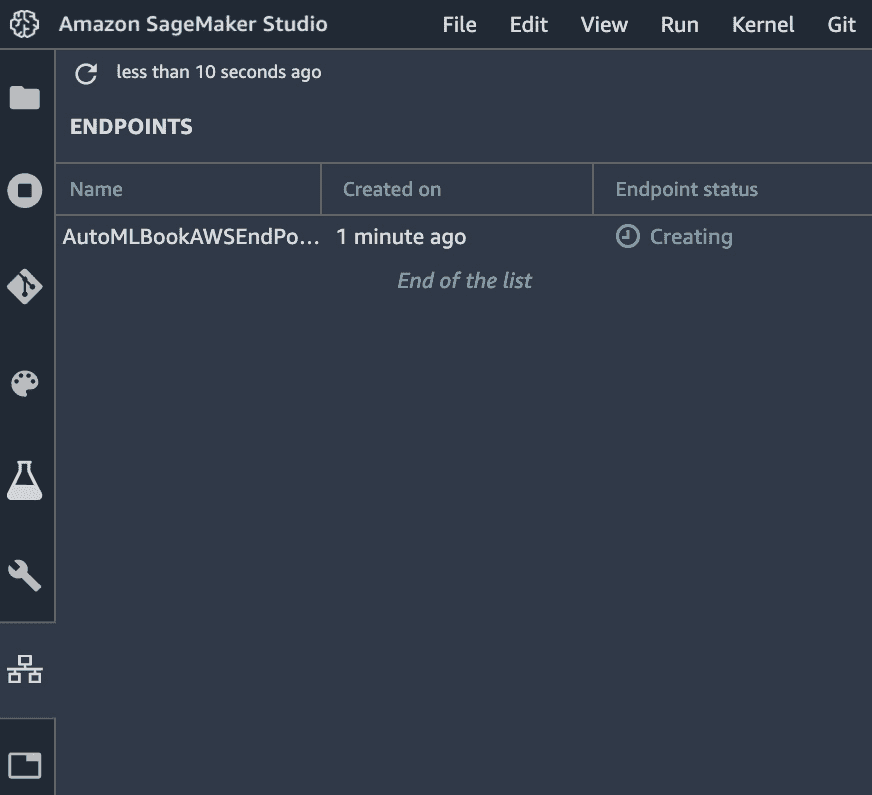

    图 7.26 – Amazon SageMaker 端点部署进行中

    部署完成后，您将看到以下 InService 状态：

    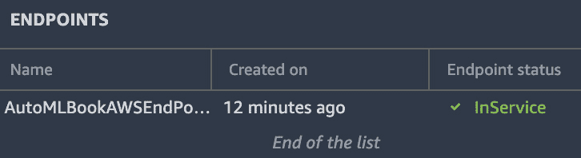

    图 7.27 – Amazon SageMaker 端点部署完成

1.  模型端点是确保模型质量的重要资源。通过启用模型监控，您可以检测数据漂移并监控任何生产中模型的品质。这种对模型质量的主动检测有助于确保您的机器学习服务在生产中不会提供错误的结果。您可以通过点击“启用监控”按钮来激活 Amazon SageMaker 模型监控：

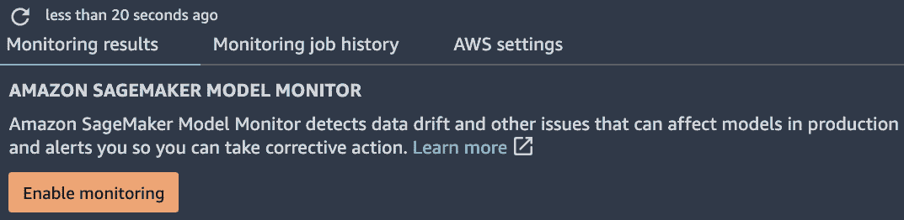

图 7.28 – Amazon SageMaker Autopilot 模型监控启动屏幕

模型监控是机器学习生命周期的一个重要领域。如下截图所示，Amazon SageMaker 模型监控通过捕获数据、创建基线、安排监控作业，并在出现异常和违规情况时允许专家解释结果来解决这个问题：

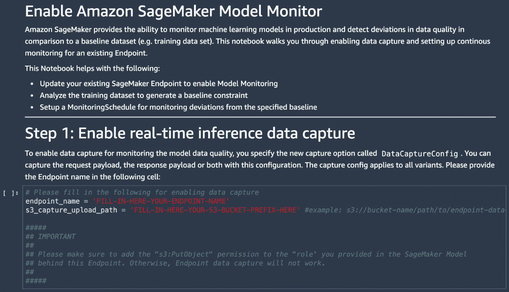

图 7.29 – Amazon SageMaker Autopilot 模型监控启用笔记本

现在我们已经创建并部署了模型，是时候通过调用它来测试它了。这种通过网络服务公开的机器学习模型的调用操作通常被称为推理或评估。

## 调用模型

使用 Amazon SageMaker Autopilot 构建和部署的模型，我们可以对其进行测试。还记得我们之前保存的测试数据吗？现在，是时候使用它了。在这里，你可以看到我们正在迭代`automl-test.csv`文件，并通过传递数据行作为请求来调用端点：

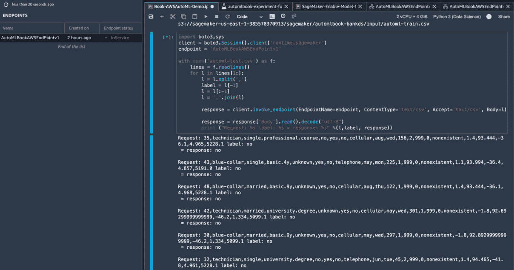

图 7.30 – Amazon SageMaker Autopilot – 从笔记本中调用模型

请求包含关于申请贷款的人的信息。我们已经从请求中移除了结果（标签），然后按照我们的意愿进行比较，以便打印出值。你可以在前面的截图中看到请求、标签和来自网络服务的相应响应。你可以使用这些信息来计算服务结果的准确性；它们相当准确：

图 7.31 – Amazon SageMaker Autopilot – 模型调用响应

现在你已经学会了如何在 Amazon SageMaker Autopilot UI 中设置 AutoML 实验，在下一节中，我们将使用笔记本来完成同样的操作。

# 从笔记本中构建和运行 SageMaker Autopilot 实验

客户流失对企业来说是一个真正的问题，在这个例子中，我们将利用我们在 Amazon SageMaker Autopilot 中完成 AutoML 的知识，使用笔记本构建一个客户流失预测实验。在这个实验中，我们将使用由 Daniel T. Larose 在其书籍《Discovering Knowledge in Data》中提供的美国移动客户公开数据集。为了展示完整的流程，示例笔记本通过执行特征工程、构建模型管道（包括任何最优超参数）以及部署模型来执行 Autopilot 实验。

UI/API/CLI 范式的发展帮助我们能够在多种格式中利用相同的界面；在这种情况下，我们将直接从笔记本中利用 Amazon SageMaker Autopilot 的能力。让我们开始吧：

1.  打开`autopilot_customer_churn`笔记本，位于`amazon-sagemaker-examples/autopilot`文件夹中，如下截图所示：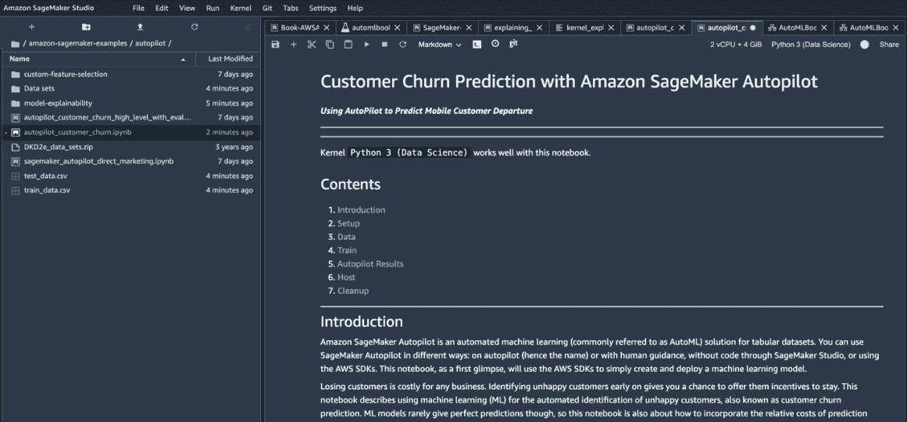

    图 7.32 – Amazon SageMaker Autopilot – 客户流失预测 Autopilot 笔记本

1.  通过指定 S3 存储桶和**身份和访问管理**（**IAM**）角色来运行设置，就像我们在之前的*创建 AutoML 实验*部分所做的那样。下载数据集，如下截图所示：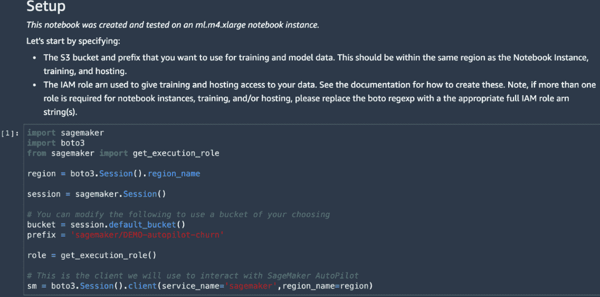

    图 7.33 – Amazon SageMaker Autopilot – 运行笔记本以设置默认存储桶并创建会话

1.  在这一点上，您需要安装先决条件，并下载数据集，如下截图所示：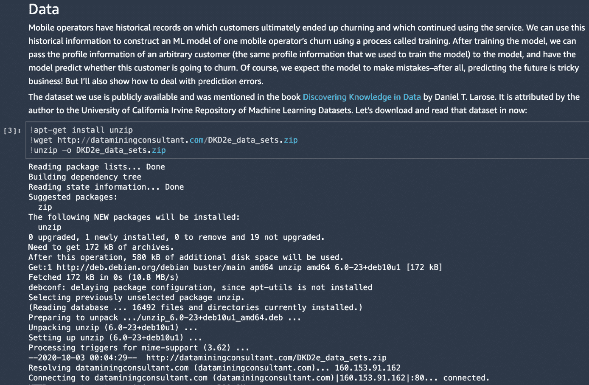

    图 7.34 – Amazon SageMaker Autopilot – 下载数据集和解压文件

1.  一旦数据集下载并解压，您就可以将其添加到 pandas DataFrame 中并查看。它显示了有关客户的信息，例如他们的呼叫属性，如下截图所示：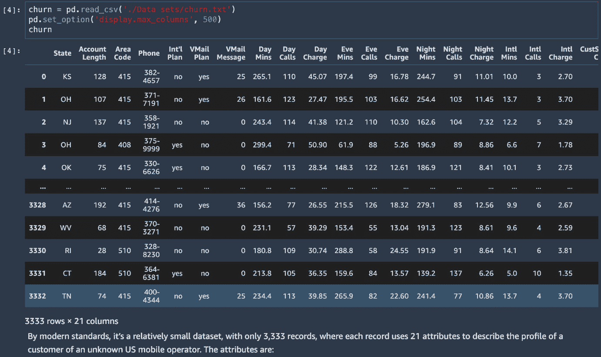

    图 7.35 – Amazon SageMaker 笔记本显示数据集信息

1.  我们现在可以采样数据集作为测试和训练存储桶，然后将这些文件上传到 S3 以供将来使用。一旦上传，您将获得 S3 存储桶的名称，如下截图所示：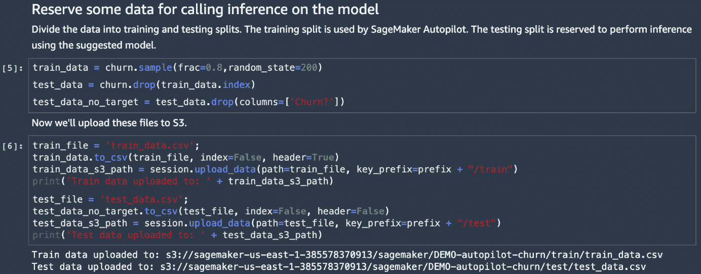

    图 7.36 – Amazon SageMaker Autopilot – 为测试和训练采样数据集并将文件上传到 S3

    到目前为止，我们所做的一切都是传统的笔记本工作。现在，我们将设置 Autopilot 作业。

1.  让我们定义配置，如下截图所示：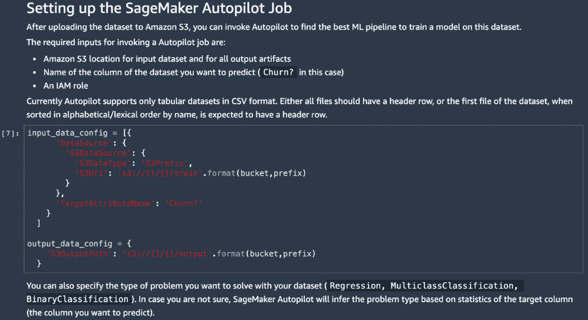

    图 7.37 – Amazon SageMaker Autopilot – 配置 Autopilot 作业配置

1.  现在，让我们通过调用`create_auto_ml_job` API 调用启动 SageMaker Autopilot 作业，如下所示：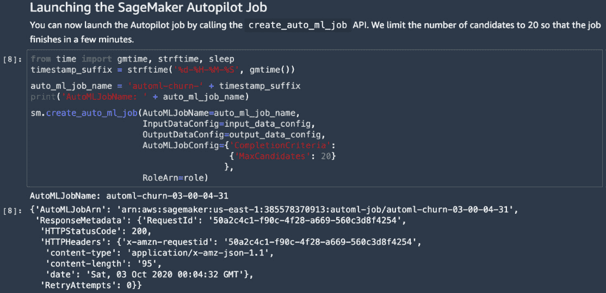

    图 7.38 – Amazon SageMaker Autopilot – 配置 Autopilot 作业

    作业以多个试验运行，包括每个实验的组件，如下截图所示：

    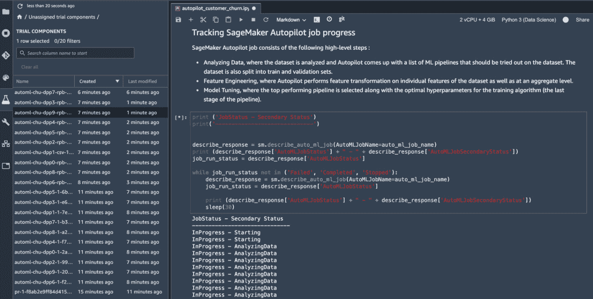

    图 7.39 – Amazon SageMaker Autopilot – Autopilot 作业笔记本中的试验组件

    在跟踪 Amazon SageMaker Autopilot 作业进度时，您可以打印其状态以及任何延迟，如下截图所示。然而，为了以有意义的方式直观地查看单个试验运行的详细信息，您可以使用用户界面：

    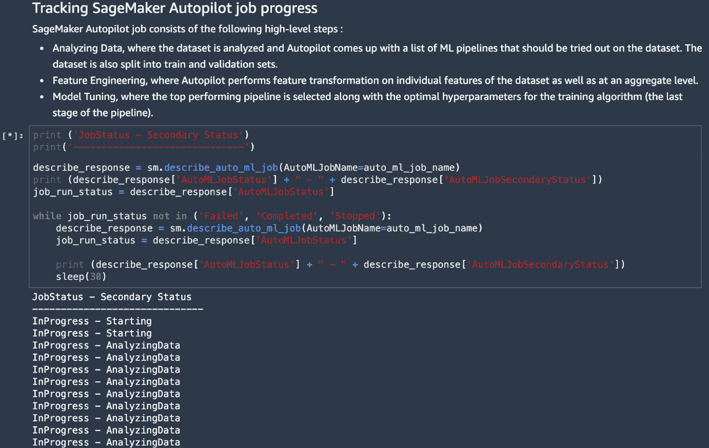

    图 7.40 – Amazon SageMaker Autopilot – Autopilot 作业笔记本中的试验组件

1.  一旦试验中的特征工程和模型调优作业完成，你可以运行 `describe_auto_ml_job` 来获取最佳候选信息。然后，你可以遍历 `best_candidate` 对象来获取底层分数和指标信息，如下面的截图所示：

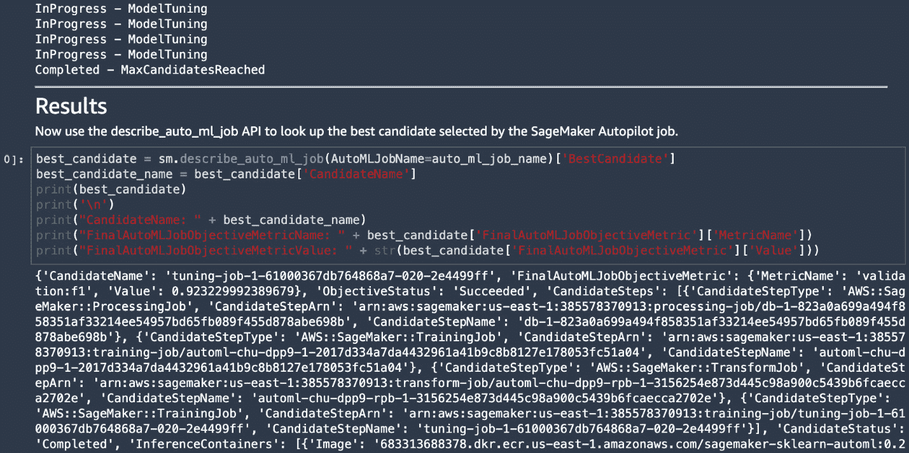

图 7.41 – Amazon SageMaker Autopilot – Autopilot 作业笔记本中的试验组件

作业完成后，你将看到候选模型、最终指标（在本例中为 F1 分数）以及任何相关值：

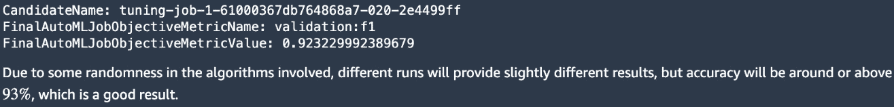

图 7.42 – Amazon SageMaker Autopilot 作业结果

我们将在下一节中部署和调用具有 93% F1 分数的最佳候选模型。

## 托管和调用模型

与我们之前使用实验 UI 调用构建的模型类似，我们现在将在笔记本中托管和调用我们在笔记本中构建的模型。不同之处在于，在前一个实例中，我们是低代码，而在这里我们使用代码构建：

1.  要托管服务，你需要创建一个模型对象、端点配置，最终是一个端点。之前这是通过 UI 完成的，但在这里，我们将使用 Amazon SageMaker Python 实例来完成同样的工作。这可以在下面的截图中看到：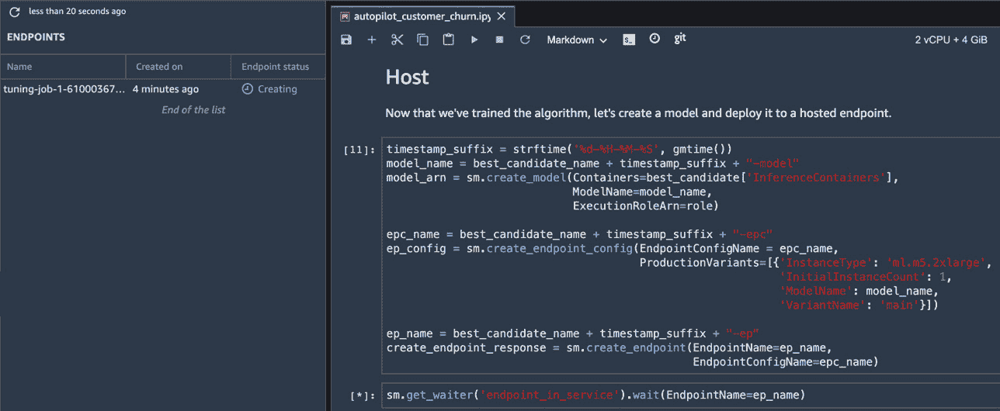

    图 7.43 – Amazon SageMaker 笔记本 – 托管模型

    `get_waiter` 方法是 Boto3 的一部分，它是 AWS 的 Python SDK。与其他等待器一样，它会轮询直到达到成功状态。通常在 60 次失败的检查后返回错误。你可以通过查看它的 API 文档来了解这些方法，该文档可以在以下位置找到：[`boto3.amazonaws.com/v1/documentation/api/latest/reference/services/sagemaker.html#SageMaker.Client.create_endpoint`](https://boto3.amazonaws.com/v1/documentation/api/latest/reference/services/sagemaker.html#SageMaker.Client.create_endpoint)。

    现在端点已经创建，模型已经托管，我们可以调用该服务。为了评估模型，你需要创建一个预测实例，并传递端点信息和预测参数。我们不是逐行调用端点，而是通过传递整个测试数据 CSV 文件来进行批量预测，并将结果与真实值进行比较。你可以在下面的截图中看到准确率数字：

    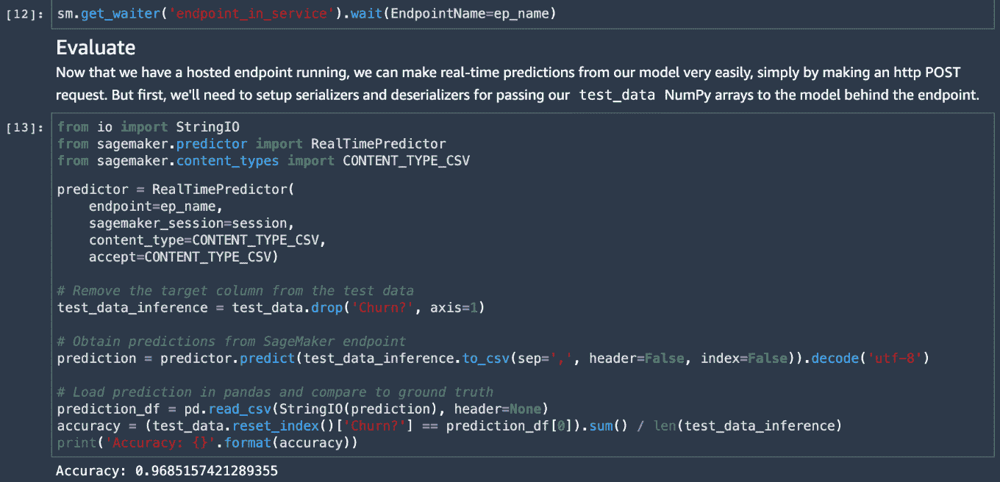

    图 7.44 – Amazon SageMaker 模型评估准确性

1.  一旦你完成了端点的测试，我们必须进行清理。在云环境中，你必须自己清理，所以请将此作为优先事项清单项。如果你不这样做，你不会喜欢服务器运行留下的账单。无论是虚拟的还是实体的，所有这些都会累积起来。

    当你在清理 UI 时，关闭并删除计算实例和端点。由于我们正在进行手动清理，你必须删除端点、端点配置和模型：

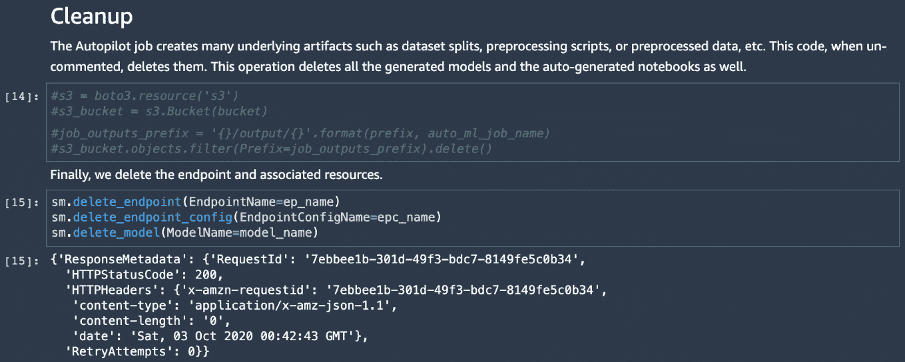

图 7.45 – 使用结果响应代码的 Amazon SageMaker Autopilot 清理

尽管这些示例已经向你展示了 AWS AutoML 如何使你能够执行特征工程、模型调整和超参数优化，但你不必局限于 AWS 提供的算法。你可以将你自己的数据处理代码带到 SageMaker Autopilot，如[`github.com/aws/amazon-sagemaker-examples/blob/master/autopilot/custom-feature-selection/Feature_selection_autopilot.ipynb`](https://github.com/aws/amazon-sagemaker-examples/blob/master/autopilot/custom-feature-selection/Feature_selection_autopilot.ipynb)所示。

# 摘要

从零开始构建 AutoML 系统以民主化人工智能是一项相当大的努力。因此，云超大规模提供商充当了推动者和加速器，以启动这一旅程。在本章中，你学习了如何通过笔记本和实验用户界面使用 Amazon SageMaker Autopilot。你还接触到了更大的 AWS 机器学习生态系统和 SageMaker 的功能。

在下一章中，我们将研究另一个主要的云计算平台，即 Google Cloud Platform，以及它提供的 AutoML 服务。祝编码愉快！

# 进一步阅读

关于本章涵盖的主题的更多信息，请参阅以下链接和资源：

+   *《在 AWS 上掌握机器学习：使用 SageMaker、Apache Spark 和 TensorFlow 的高级机器学习》，作者 Dr. Saket S.R. Mengle、Maximo Gurmendez，Packt Publishing：[`www.amazon.com/Mastering-Machine-Learning-AWS-TensorFlow/dp/1789349796`](https://www.amazon.com/Mastering-Machine-Learning-AWS-TensorFlow/dp/1789349796)*

+   *《学习 Amazon SageMaker：为开发人员和数据科学家构建、训练和部署机器学习模型的指南》，作者 Julien Simon 和 Francesco Pochetti，Packt Publishing：[`www.amazon.com/Learn-Amazon-SageMaker-developers-scientists/dp/180020891X`](https://www.amazon.com/Learn-Amazon-SageMaker-developers-scientists/dp/180020891X)*
