# *第九章*：使用 GCP 的自动化机器学习

"*任何在商业中使用的技术的第一规则是，应用于高效操作的自动化将放大效率。第二是，应用于低效操作的自动化将放大低效。*"

*-比尔·盖茨*

这是一段漫长而有益的学习之旅，了解了主要超大规模企业及其如何在各自的平台上实施自动化机器学习。在前一章中，你学习了如何开始使用 Google Cloud AI 平台，了解了 AI Hub，以及如何在 GCP 中构建 notebook 实例。你还了解了 GCP 提供的不同类型的自动化机器学习，包括 AutoML 自然语言、AutoML Tables、AutoML 翻译、AutoML 视频和 AutoML 视觉。

在继续探讨 GCP 提供的广泛的产品、功能和服务的背景下，我们现在将深入探讨 Cloud AutoML Tables。我们将构建模型并解释如何使用 AutoML Tables 进行自动化机器学习；也就是说，如何通过分析输入特征（特征工程）、选择模型（神经架构搜索）和执行超参数调整来对非结构化数据进行自动化机器学习任务。我们将将这些模型部署到 GCP，并通过网络服务进行测试，以展示其运营化。

在本章中，我们将涵盖以下主题：

+   开始使用 Google Cloud AutoML Tables

+   创建一个 AutoML Tables 实验

+   理解 AutoML Tables 模型部署

+   使用 BigQuery 公共数据集的 AutoML Tables

+   自动化机器学习进行价格预测

# 开始使用 Google Cloud AutoML Tables

AutoML Tables 帮助利用结构化数据中的洞察力。在任何大型企业中，都存在多种数据模式，包括结构化、非结构化和半结构化数据。对于大多数处理数据库和交易的组织来说，确实存在大量的结构化数据。这些数据非常适合高级分析，而 GCP 的 AutoML Tables 正是帮助你自动构建和部署基于结构化数据的机器学习模型的工具。

AutoML Tables 使机器学习工程师和数据科学家能够比手动操作更快地自动构建和部署结构化数据上的最先进的机器学习模型。它自动化了广泛数据类型的建模，从数字和类别到字符串、时间戳、列表和嵌套字段。Google Cloud AutoML tables 通过最少的代码实现这一点。在本章中，我们将学习如何获取一个导出的 CSV 文件，点击几个按钮，等待一段时间，然后在另一端获得一个高度调优的模型。

谷歌的自动化机器学习团队努力工作，以确保该工具适用于各种数据类型。谷歌的 AutoML Tables 探索了可能的模型和超参数的广阔空间，以便代表你尝试优化事物。在我们探索本章的示例时，你会发现第一步是通过**导入**选项卡导入你的训练数据，给它命名，并选择来源——无论是 BigQuery 中的表、你机器上的文件，还是 Google Cloud Storage 上的文件。这一步需要一些时间，因为系统正在分析你的数据集的列。一旦完成这一步，你将能够编辑自动生成的模式并选择用于预测的列。在这里，你还可以更新列类型，以及它是否为可空。

你还可以查看可能有很多列的数据集，以获得它们数据的良好概述。你可以点击不同的列名来查看关于你列的一些统计信息。在分析数据后，我们可以开始训练过程。在这里，AutoML 真正大放异彩，因为你所要做的就是点击**训练**。

你可以设置一些选项，包括最大训练小时数预算。这使你能够在做出全面、更长时间的训练运行承诺之前，对你的数据进行实验并限制训练时间。你会注意到显示的训练时间相对较长。这是因为它不仅在进行模型调优，还在选择最初要使用的模型。因此，在训练期间有很多事情发生。但我们在这里不需要做任何事情。

一旦训练完成，我们必须评估和部署模型。你将能够看到训练的效果，以及关于模型性能的指标。最后，我们将部署模型以获取预测。浏览器中甚至还有一个编辑器，可以对你的端点进行请求，因此你不需要设置本地环境来尝试和测试这些调用。

现在你已经了解了 AutoML Tables 的工作原理，让我们来实际探索一下。

# 创建 AutoML Tables 实验

AutoML Tables 自动在结构化数据上构建和部署最先进的机器学习模型。让我们从我们的第一个实验开始，将这一知识付诸实践：

1.  通过访问此链接访问谷歌云 AI 平台主页：[`console.cloud.google.com/home/`](https://console.cloud.google.com/home/)。点击左侧面板中的**数据集**链接；你将看到以下屏幕：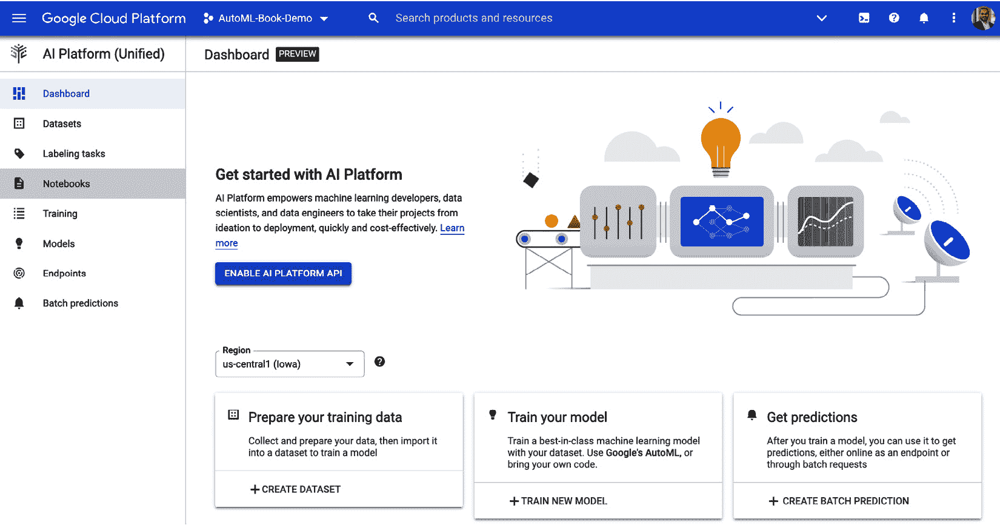

    图 9.1 – 谷歌云 AI 平台主页

1.  在`IrisAutoML`上，然后点击**创建数据集**：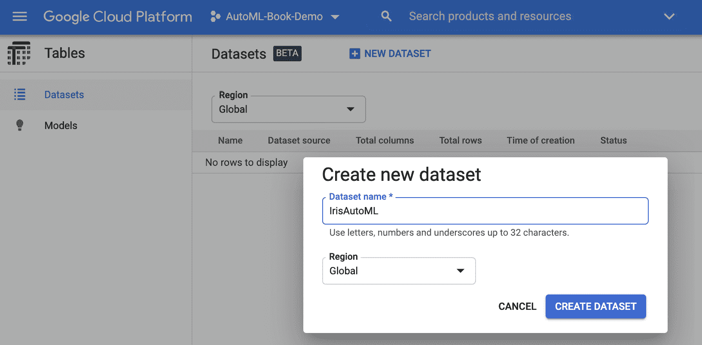

    图 9.2 – AutoML Tables – 创建新数据集屏幕

1.  对于这个实验，我们将从 Iris 数据集开始。你可以从 [`www.kaggle.com/uciml/iris`](https://www.kaggle.com/uciml/iris) 下载 CSV 文件，因为我们将在下一步中使用它。尽管数据集太小，不适合用于自动化机器学习，但你很快就会看到它是如何展开的。

1.  现在，你需要将数据（CSV）文件导入到 **Google AutoML 表格**。文件需要上传到存储桶。从你的机器中选择文件并点击 **浏览** 在 GCP 上创建存储目标，如下截图所示：

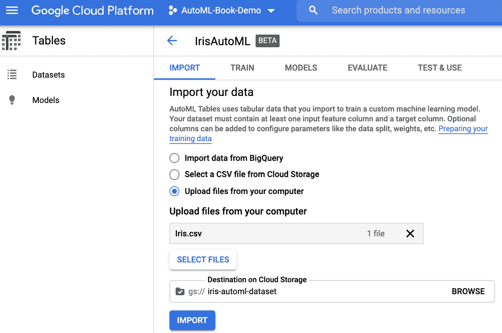

图 9.3 – AutoML 表格 – 从本地计算机导入文件

要创建存储桶，你需要遵循以下步骤。

1.  首先，为你的存储桶提供一个名称：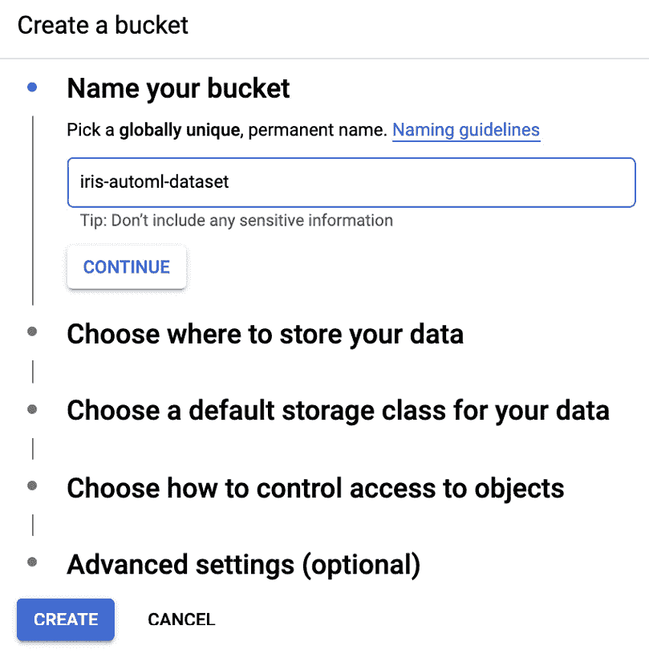

    图 9.4 – AutoML 表格 – 在 GCP 上创建存储桶

1.  然后，选择你希望存储数据的位置。选项包括区域（单个区域）、双区域高可用性（**HA**）或多区域，以实现跨多个位置的最高可用性。在这个例子中，我们将选择 **us-central1** 作为单个区域，但如果你在地理位置上更合适，可以选择其他区域：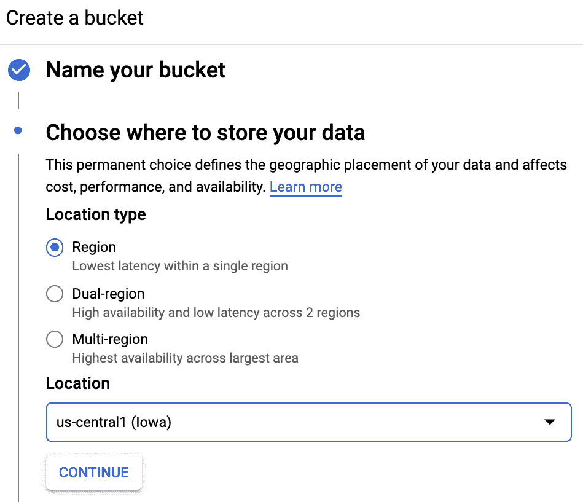

    图 9.5 – AutoML 表格 – 选择创建存储桶的位置

1.  接下来，选择数据的默认存储类别。你可以选择的存储类别有 **标准**、**近线（备份**）**、**冷线（灾难恢复**）**和**存档（用于存档用途**）**。为了这次实施，选择 **标准** 类别，如下截图所示：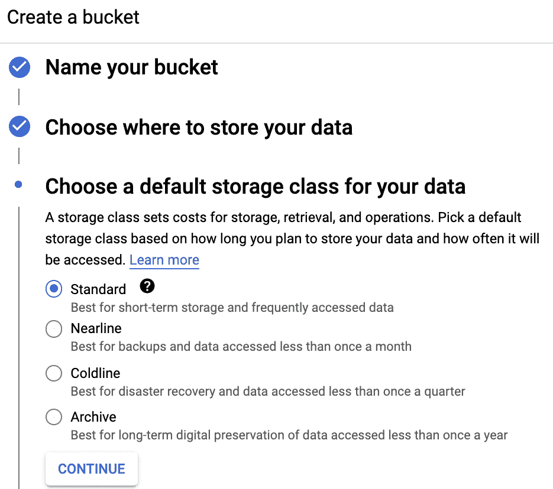

    图 9.6 – AutoML 表格 – 在 GCP 上为你的数据选择存储类别

1.  最后，需要配置加密设置。在这里，你可以提供自己的密钥或使用默认的 Google 管理密钥设置。点击 **创建** 完成创建存储桶的过程：

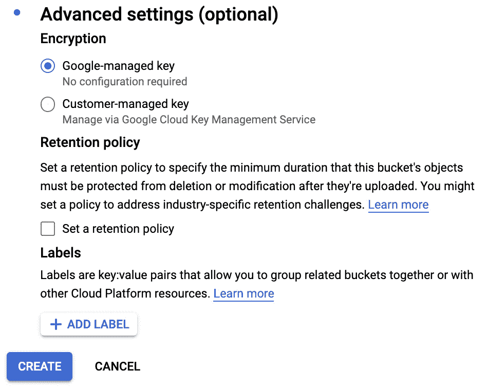

图 9.7 – AutoML 表格 – 选择加密设置

这将触发创建存储桶和数据导入。你将看到以下屏幕：

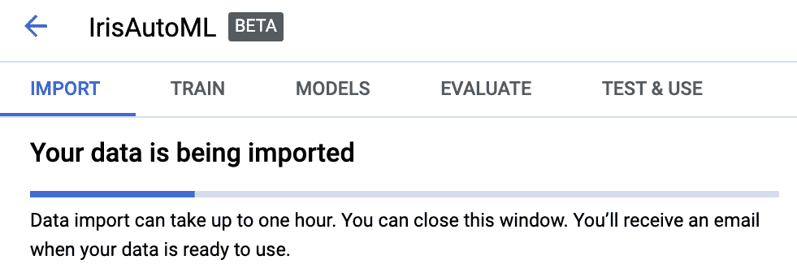

图 9.8 – AutoML 表格 – 数据正在导入到 GCP 存储桶

这是我们将要学习的一个重要教训：并非所有数据都适合自动化机器学习。一旦导入过程完成，你将看到以下错误信息：

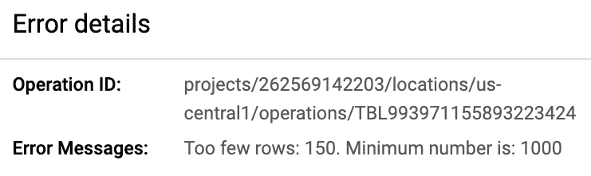

图 9.9 – AutoML 表格 – 行数不足错误

尽管您可以用其他工具进行这个实验，但云自动机器学习平台设定了一个最低标准，以确保其算法的质量不受损害。这个例子给我们提供了一个重要的教训，即并非所有问题都适合自动机器学习。

让我们用更大的数据集重复相同的实验 – 贷款风险数据集，它包含 21 个字段和 1,000 个实例。您可以从 BigML 下载它（[`bml.io/W2SpyF`](http://bml.io/W2SpyF)，BigML，Inc. Corvallis，俄勒冈州，美国，2011）。这个数据集由汉堡大学统计学与计量经济学研究所的汉斯·霍夫曼博士创建，包含诸如检查状态、持续时间、信用历史、目的、信用金额和储蓄状态等字段。这些字段可以用来创建一个预测贷款申请风险水平的模型。

让我们通过创建一个桶来执行上述步骤，用于贷款风险数据集：

1.  从[`bml.io/W2SpyF`](http://bml.io/W2SpyF)下载数据集。点击**创建数据集**按钮并导入贷款风险数据集：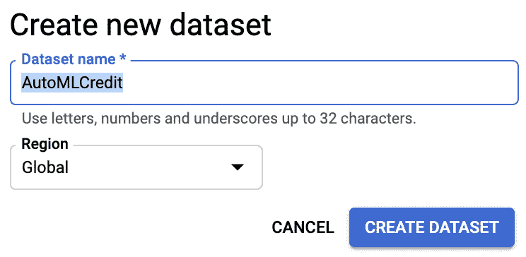

    图 9.10 – AutoML 表格 – 选择新的数据集桶

1.  当导入过程开始时，上传从步骤 5 下载的数据集提取的 csv 文件，并通过点击**选择文件**按钮将其指向目标云存储：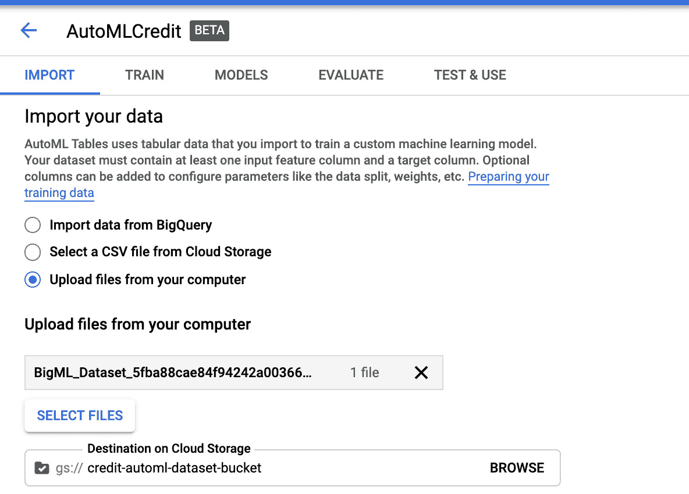

    图 9.11 – AutoML 表格 – 选择数据存储

    由于贷款数据集满足所需的大小限制，它已成功导入，您将看到以下训练界面。这是您可以编辑自动生成的模式并选择预测列的地方。您还可以更新列类型，以及它是否为可空。

    此界面提供了数据集的详细概述。您可以通过点击不同的列名来查看有关您列的一些统计信息：

    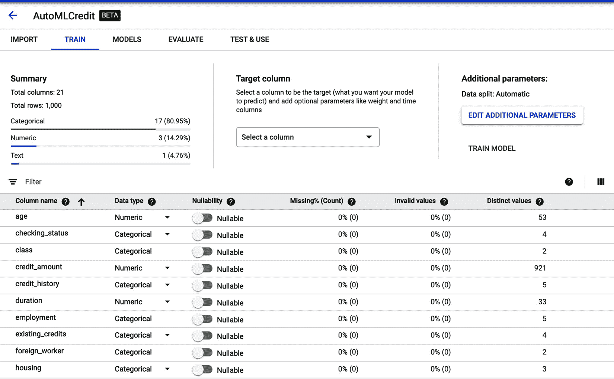

    图 9.12 – AutoML 表格 – 训练界面

1.  现在，选择目标列；即预测列，也就是类别。类别是一个具有两个可能值的分类字段：良好信用或不良信用。这决定了这个特定个人是否有资格获得信用。一旦您选择了类别，点击**训练模型**：

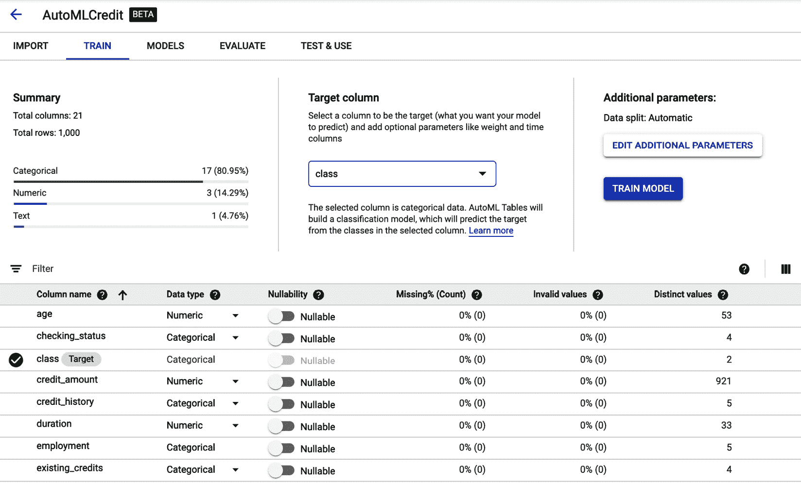

图 9.13 – AutoML 表格 – 选择训练的目标列

点击**训练模型**按钮后，您将在右侧看到一个流动菜单。该菜单在以下屏幕截图中可见。这是您可以设置实验参数的地方，也是 AutoML 真正发光的地方，因为您只需点击**训练**。您可以设置一些选项，包括训练小时数的最大预算。这使您能够在做出全面、更长时间训练运行承诺之前，对数据进行实验并限制训练时间。您会注意到显示的训练时间相对较长。这是因为它不仅在进行模型调优，还在选择最初要使用的模型：

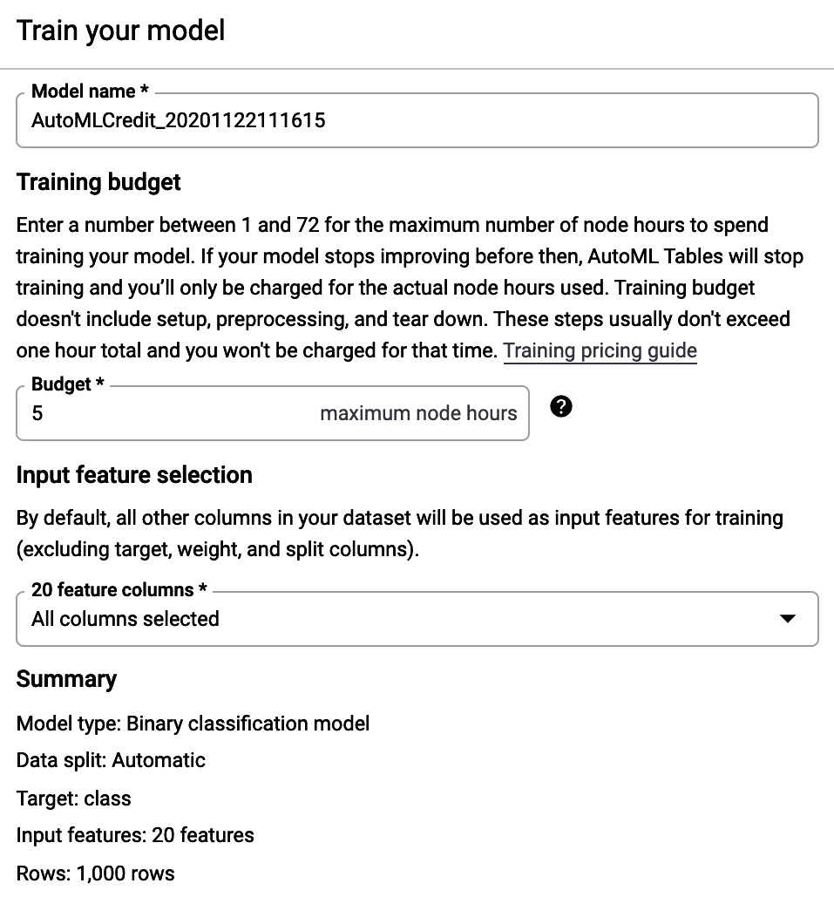

图 9.14 – AutoML 表格 – 在 GCP 上为您的数据选择存储类别

您应该训练模型多长时间？GCP 建议的训练时间定义在[`cloud.google.com/automl-tables/docs/train`](https://cloud.google.com/automl-tables/docs/train)，如下面的屏幕截图所示：


图 9.15 – AutoML 表格 – 建议的训练时间

您可以在[`cloud.google.com/automl-tables/pricing`](https://cloud.google.com/automl-tables/pricing)找到相应的定价指南。

您还可以查看高级选项，在这里您可以查看实验的优化目标。由于这是一个分类实验，列出的目标包括 A**UC ROC**、**Log 损失**、**AUC PR**、**精确度**和**召回率**。**提前停止**切换确保在检测到无法再进行改进时停止进程。否则，AutoML 表格将继续训练，直到达到预算：

点击**训练模型**以启动此操作：

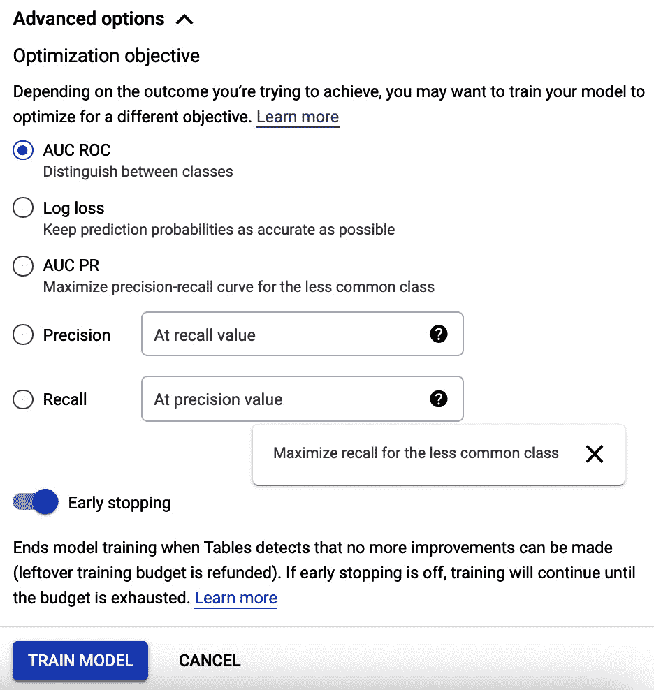

图 9.16 – AutoML 表格 – 训练的高级选项

在启动实验时，您将看到以下屏幕。它是在基础设施设置以及模型最终训练时启动的：

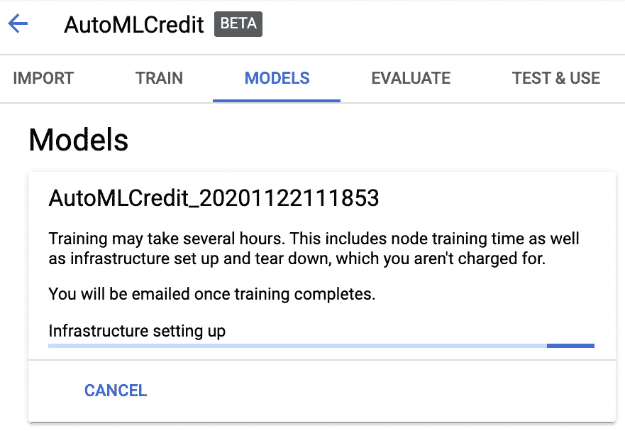

图 9.17 – AutoML 表格 – 开始 AutoML 表格实验

训练完成后，我们必须评估和部署模型。在这个阶段，您将能够看到训练的效果，以及关于模型性能的任何指标。最后，您可以部署模型以获取关于信用价值的预测：

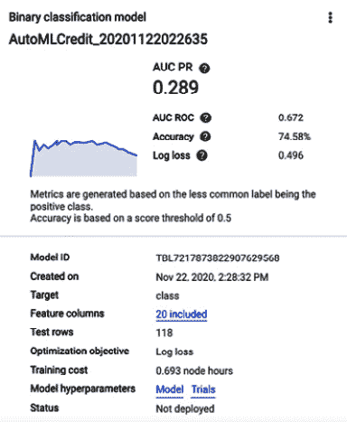

图 9.18 – AutoML 表格 – 在 GCP 上为您的数据选择存储类别

准确率以百分比衡量，而 `0` 到 `1` 下的面积。使用不同的训练成本（持续时间）训练模型将得到更高的值，这表明模型质量更高：

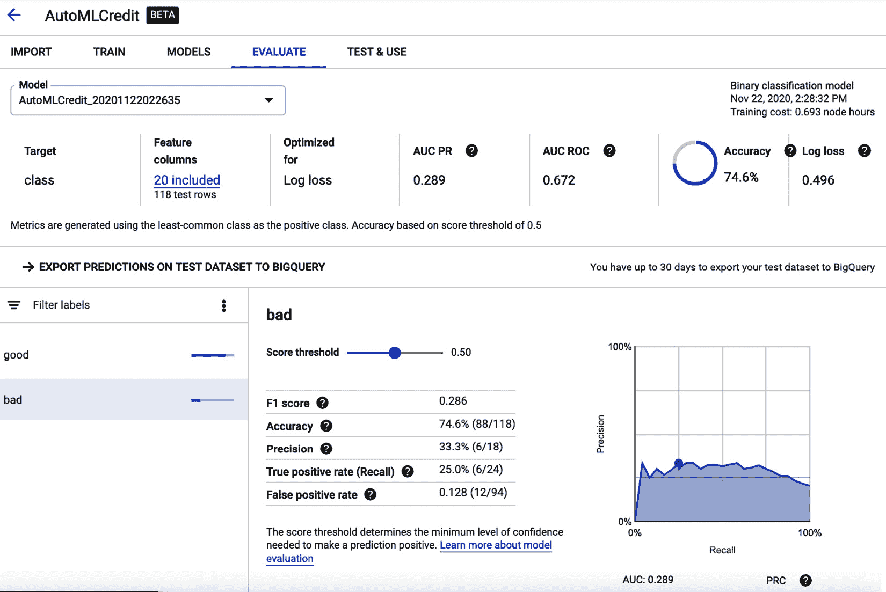

图 9.19 – AutoML 表格 – 训练模型的详细信息，包括其 F1 分数、准确率和精确率

下一页还显示了混淆矩阵，它显示了模型在数据上的质量；即预测正确的数据点数量与预测错误的数据点数量相比：

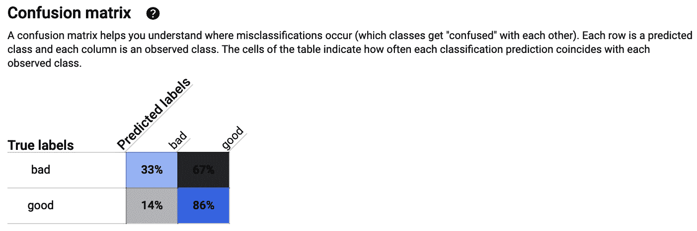

图 9.20 – AutoML 表格 – 混淆矩阵

特征重要性 – 即哪个特征对最终模型的影响最大 – 也已展示。在这种情况下，你可以观察到检查状态、信用期限和目的似乎对信用决策影响最大：

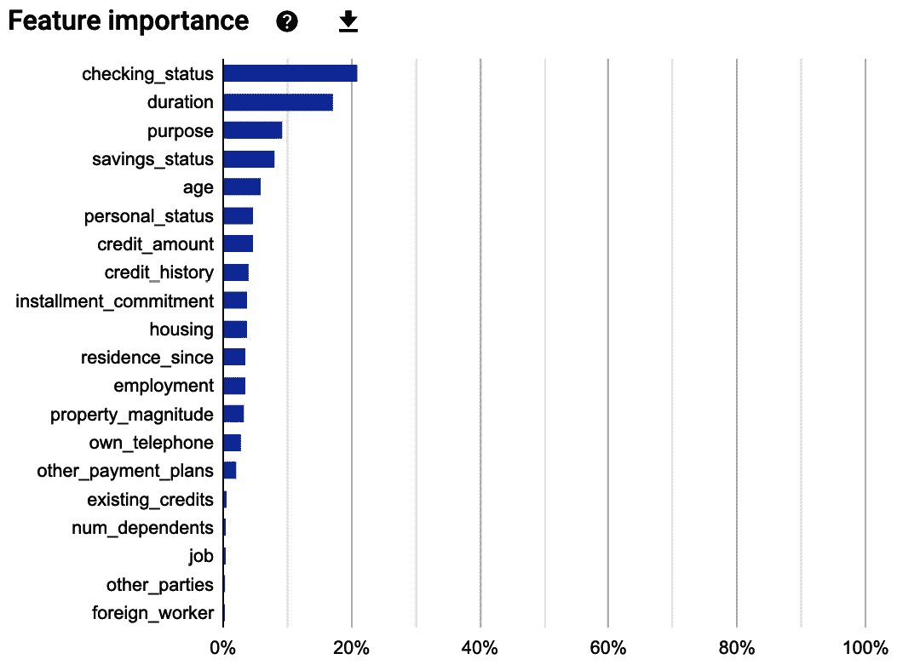

图 9.21 – AutoML 表格 – 特征重要性表

现在我们已经训练了模型，接下来让我们进行其部署。

# 理解 AutoML 表格模型部署

为了部署我们在上一节中训练的模型，请执行以下步骤：

1.  我们必须点击 **测试 & 使用** 选项卡来部署模型。有多种测试训练模型的方法：你可以将其作为批量预测（基于文件），作为在线预测（API），或者将其导出为 Docker 容器。页面顶部的选项允许你在通过 REST API 进行在线预测和批量预测之间切换。这允许你上传 CSV 文件或指向 BigQuery 表，并获取整个文件或表的预测结果。考虑到使用所需的时间，AutoML 表格使你能够达到比手动更高的模型性能水平。在本节中，我们将进行基于在线 API 的预测：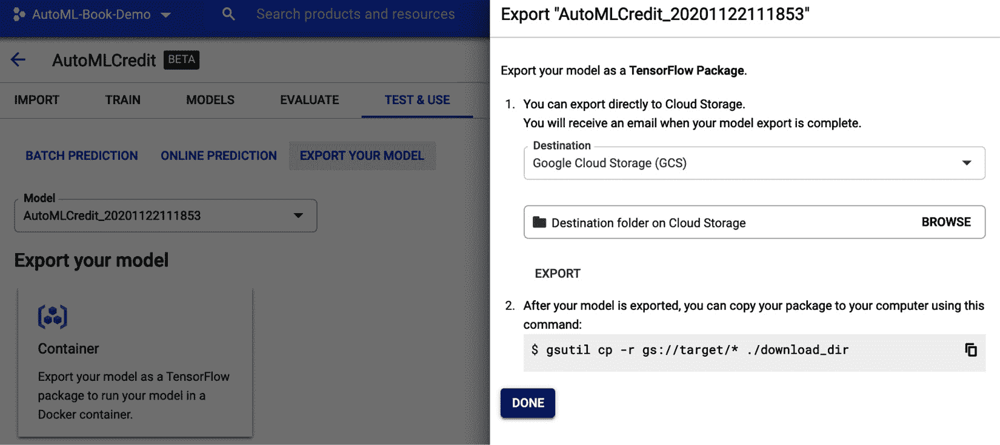

    图 9.22 – AutoML 表格 – 导出模型

1.  点击 **在线预测** 选项卡。你将看到以下屏幕。在这里，你可以直接从控制台调用 API：

    图 9.23 – AutoML 表格 – 在训练模型上进行在线预测

1.  然而，如果你只是点击 **预测**，它将给出以下截图所示的错误。为什么？因为模型尚未部署，这意味着没有可调用的端点：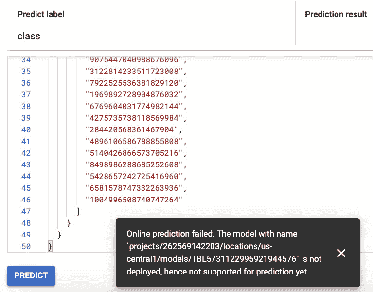

    图 9.24 – AutoML 表格 – 在训练模型上进行在线预测的错误

1.  点击**部署模型**按钮。你将看到一个弹出窗口，确认部署细节。现在，点击**部署**：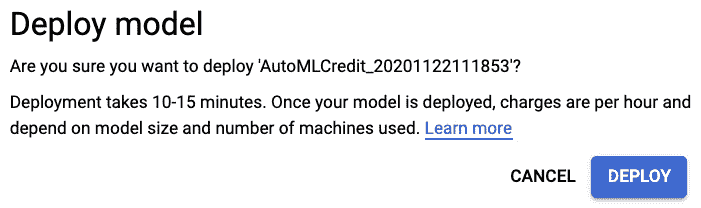

    图 9.25 – AutoML 表格 – 部署训练好的模型弹出窗口

    这启动了模型部署的过程。一旦完成，你将看到以下屏幕，它表明模型已成功部署并可供请求，同时显示了它所占用的空间大小。你应该记住，模型现在正在服务器上运行，因此你将承担与模型运行相关的计算和存储成本。这就是之前警告的内容。

1.  在这一点上，你可以点击`0.661`置信度分数。此时，你可以切换到特征列视图并编辑一些参数。我们直观地知道年龄和信用期限对我们的信用结果有重大影响。将年龄从`48`降低到`18`，并在可编辑表中将信用期限增加到`60`，将这个良好的信用决策变成不良的。

1.  让我们更改这些值并再次调用 API。你将看到结果变成了不良的，如下面的截图所示：

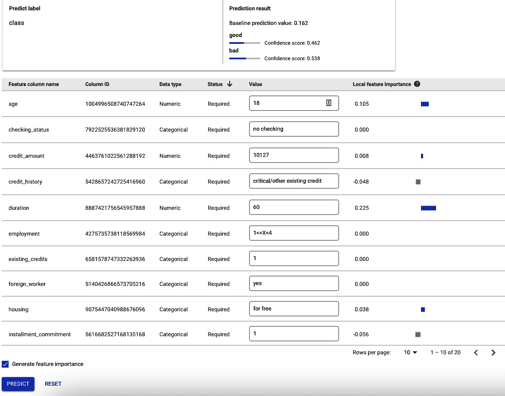

图 9.28 – AutoML 表格 – 使用修改后的年龄和信用期限调用模型

之前的实验已经向你展示了如何训练、部署和测试一个模型。现在，让我们探索如何使用基于 BigQuery 的公开数据集与 AutoML 表格一起使用。

# 使用 BigQuery 公开数据集的 AutoML 表格

数据被称为数字经济的新石油。为了扩展这个类比，自动化机器学习是使用数据提供高级分析而不需要每次都进行定制手动配置的引擎，但我跑题了。进行机器学习实验的现实世界数据来自各种组织，尽管需要对应者来执行实验和尝试假设。这样的数据仓库是 Google BigQuery 云数据仓库——具体来说，是其大量的公开数据集集合。在这个例子中，我们将使用 BigQuery，这是 AutoML 表格数据摄取过程中指定的三种方法之一，用于我们的实验。

与我们之前使用的贷款数据集类似，成人收入数据集是从 1994 年美国人口普查局获得的一个公开数据集，它使用人口统计信息来预测两类人的收入：每年超过或低于 50,000 美元。该数据集包含 14 个属性，目标字段是收入和属性数量。数据可以从[`www.kaggle.com/wenruliu/adult-income-dataset?select=adult.csv`](https://www.kaggle.com/wenruliu/adult-income-dataset?select=adult.csv)下载。然而，BigQuery 包含了一个流行的公开数据集仓库，因此我们将使用它。让我们开始吧：

1.  如我们之前所做的那样，在**表格**选项卡中点击**创建新数据集**，然后点击**创建数据集**按钮：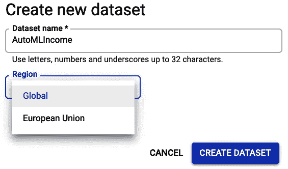

    图 9.29 – AutoML 表格 – 创建新数据集提示

1.  现在，为了添加到数据集中，选择第三个选项 – 即**从 BigQuery 中选择一个表或视图** – 如以下截图所示：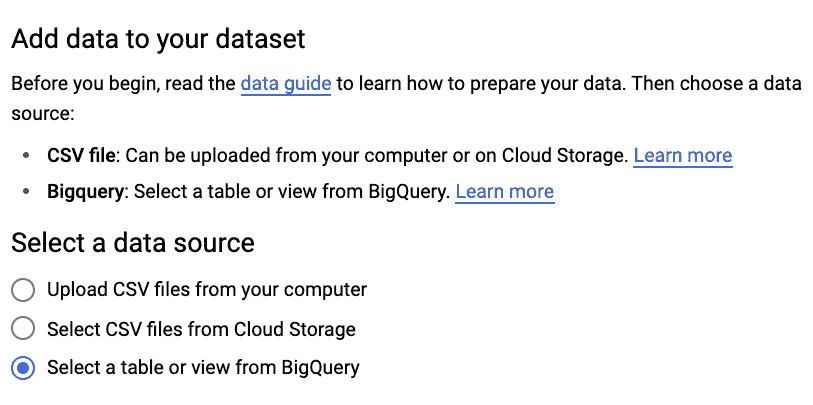

    图 9.30 – AutoML 表格 – 选择 BigQuery 数据

1.  BigQuery 可以通过[`console.cloud.google.com/bigquery`](https://console.cloud.google.com/bigquery)访问。这是您可以查看其包含的数据集的地方。您可以通过调用以下查询来完成此操作：

    ```py
    SELECT  * FROM  `bigquery-public-data.ml_datasets.census_adult_income`
    ```

    您将看到以下输出。我们的目标是导出这些数据到一个存储桶中，以便用于我们的实验。将查询结果的目标表设置为数据集，然后点击**运行**：

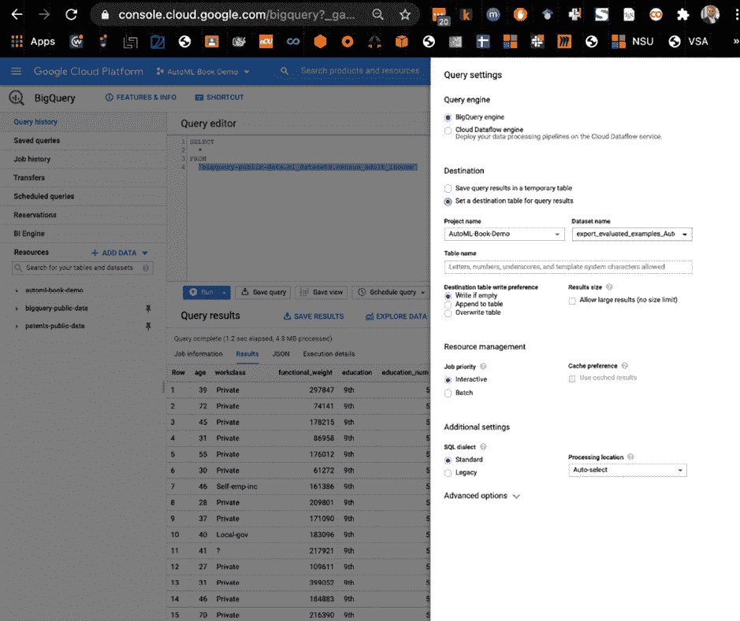

图 9.31 – AutoML 表格 – 从人口普查成年人收入数据集的 BigQuery 搜索结果

以下是一个简短的 BigQuery 公共数据集列表。这使得在整个 GCP 产品套件中使用这些精心挑选的数据集变得非常容易和方便：

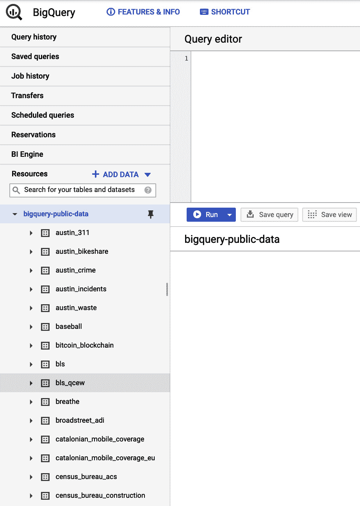

图 9.32 – AutoML 表格 – BigQuery 公共数据集

在上一步中，您运行了查询，现在已完成，并创建了一个数据集，如下面的截图所示：

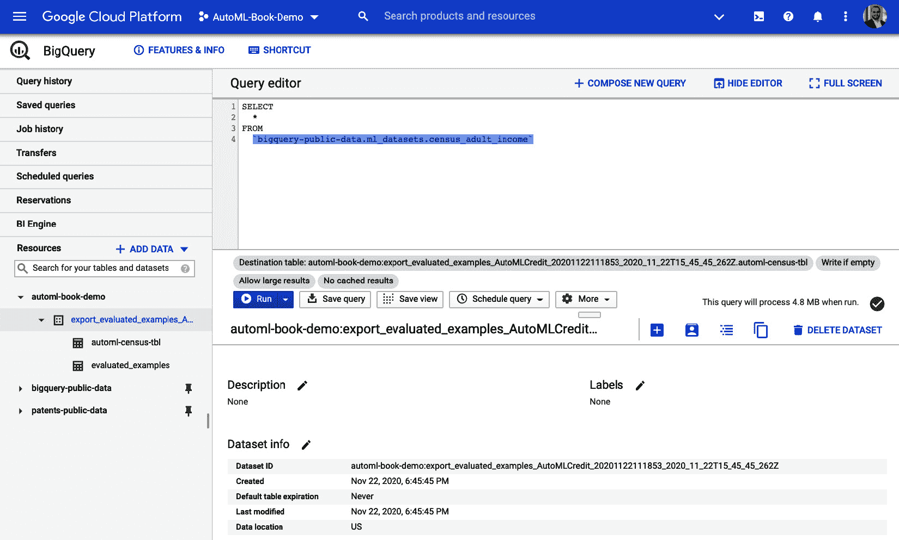

图 9.33 – AutoML 表格 – BigQuery 公共数据集导出

现在数据已经导出到一个存储桶中，您可以使用它来在 AutoML 表格中进行实验。

# 自动化机器学习用于价格预测

到目前为止，您已经看到了如何使用 AutoML 表格来解决分类问题；也就是说，在数据集中找到类别。现在，让我们做一些回归；也就是说，预测值。为此，我们将使用房屋销售预测数据集。金县房屋销售数据集包含了金县的价格，其中包括西雅图。该数据集可以从 Kaggle 下载，网址为[`www.kaggle.com/harlfoxem/housesalesprediction`](https://www.kaggle.com/harlfoxem/housesalesprediction)。

对于这个实验，我们的目标是使用 21 个特征和 21,613 个观测值或数据点来预测房屋的销售价值（价格）：

1.  让我们在 AI 平台上开始，点击主页上的**创建数据集**按钮：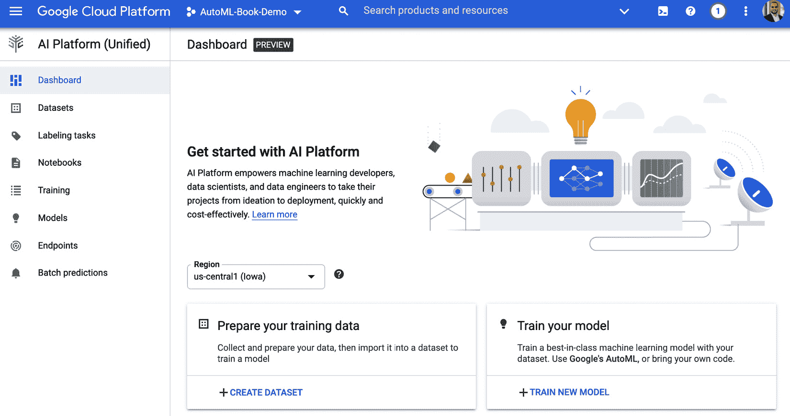

    图 9.34 – AutoML 表格 – 在 AI 平台主页上开始

    在这里，你必须选择数据集名称和区域，如以下截图所示。将数据集类型设置为表格，因为它目前具有分类和回归自动机器学习功能，然后点击**创建**：

    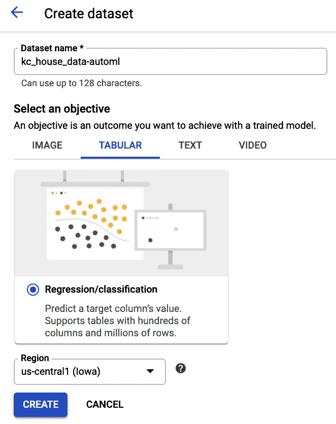

    图 9.35 – AutoML 表格 – 选择自动机器学习目标

1.  点击**创建**后，你将看到以下屏幕。选择**从您的计算机上传 CSV 文件**选项，并通过点击**继续**将其上传到云存储：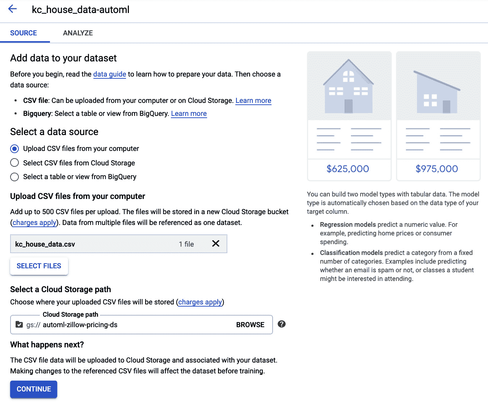

    图 9.36 – AutoML 表格 – 选择数据存储参数

1.  点击**继续**后，数据集将被上传，你将看到以下屏幕，显示数据的描述。点击**训练新模型**：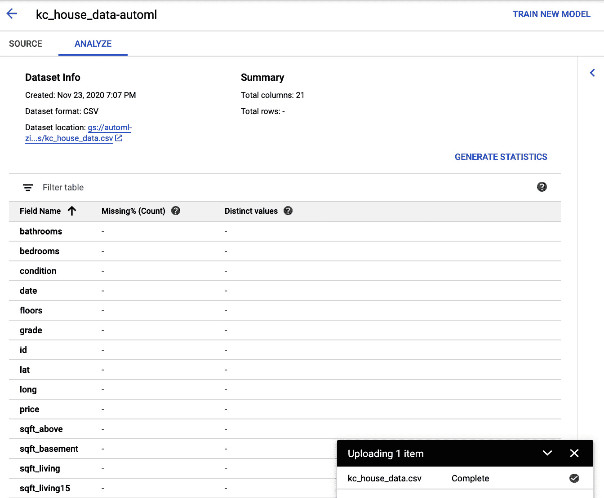

    图 9.37 – AutoML 表格 – 上传完成后数据描述的详细信息

1.  在这个阶段，你处于训练新模型的工作流程中。在这里，将目标设置为`回归`，方法设置为**AutoML**。然后，按**继续**：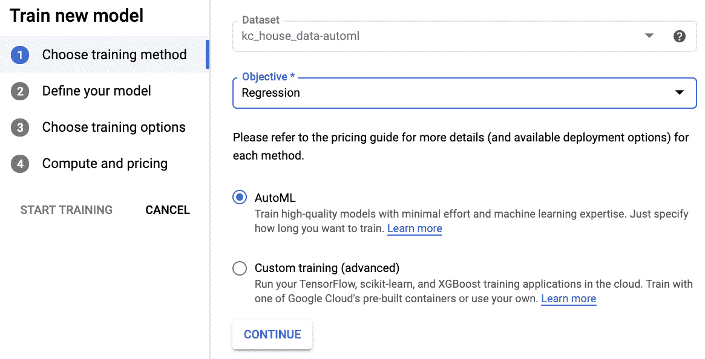

    图 9.38 – AutoML 表格 – 训练新模型步骤

1.  接下来，我们必须编辑模型定义。在这里，选择目标列（要预测的价格）和数据拆分；即你希望如何拆分测试数据和训练数据。除非你有特定的需求进行手动或按时间顺序分层，否则默认的随机分配选项是一个不错的选择。点击**继续**以继续：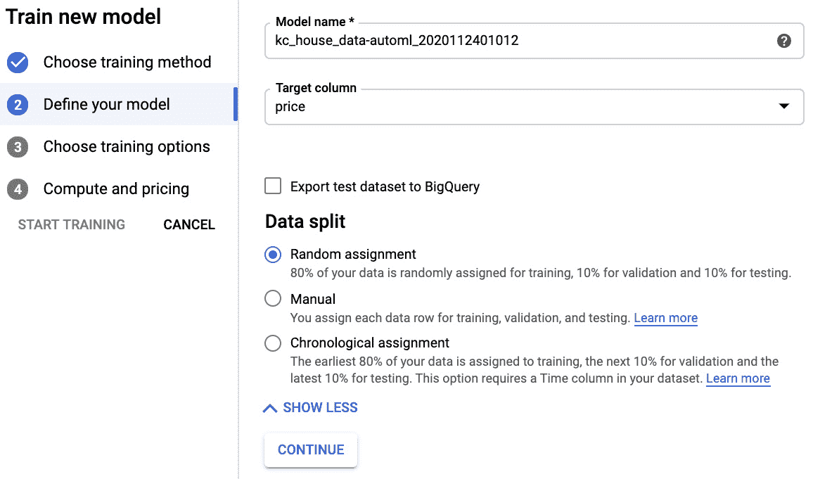

    图 9.39 – AutoML 表格 – 训练新模型步骤

    以下截图提供了对数据进行细粒度操作的选择，例如删除或过滤列、应用转换等：

    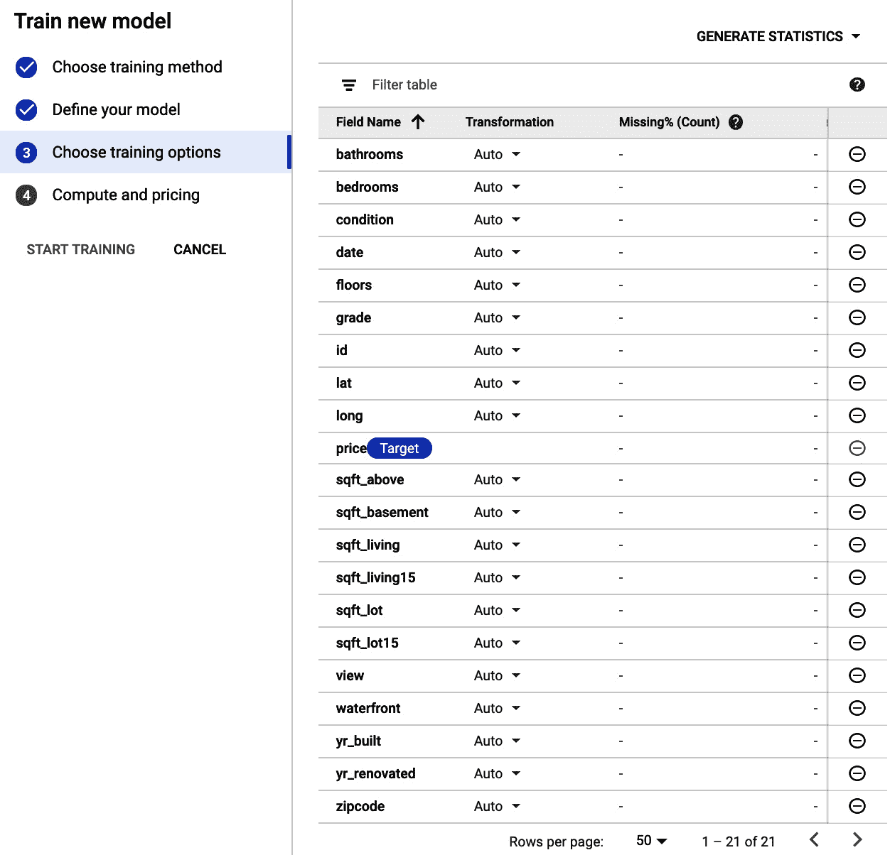

    图 9.40 – AutoML 表格 – 上传数据集后的描述

1.  你还可以选择优化目标。选项包括**均方根误差**（**RMSE**）、**平均绝对误差**（**MAE**）或**均方根对数误差**（**RMSLE**），它对异常值具有鲁棒性。选择**RMSE（默认）**并点击**继续**以继续：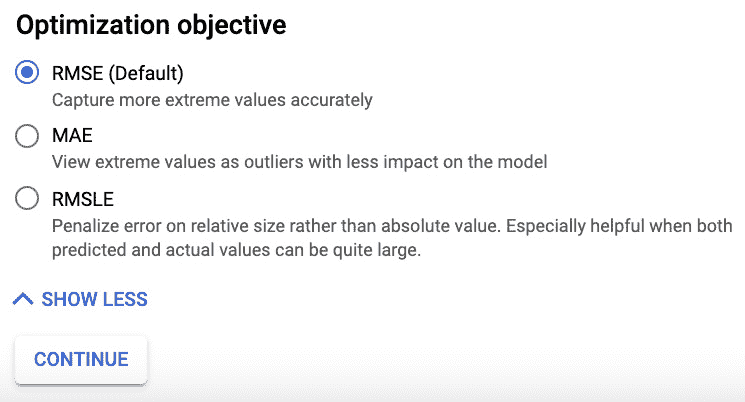

    图 9.41 – AutoML 表格 – 优化目标的描述

1.  在我们开始训练之前，我们必须考虑的最后一件事情是训练预算。这一步应该从我们之前的实验中对你来说很熟悉。设置 5 小时的预算并点击**开始训练**。别忘了切换**启用早期停止** – 如果结果提前达到，我们不希望耗尽预算：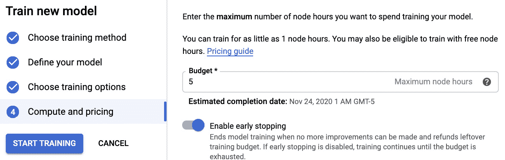

    图 9.42 – AutoML 表格 – 训练新模型的计算和价格步骤

    模型将开始训练。你将能够在**训练作业和模型**侧面板中看到其进度：

    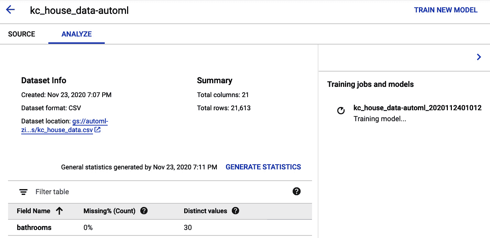

    图 9.43 – AutoML 表格 – 新模型训练开始

    这个特定模型训练耗时 1 小时 35 分钟。一旦完成，将出现以下屏幕。此屏幕将显示模型的状态属性和训练性能：

    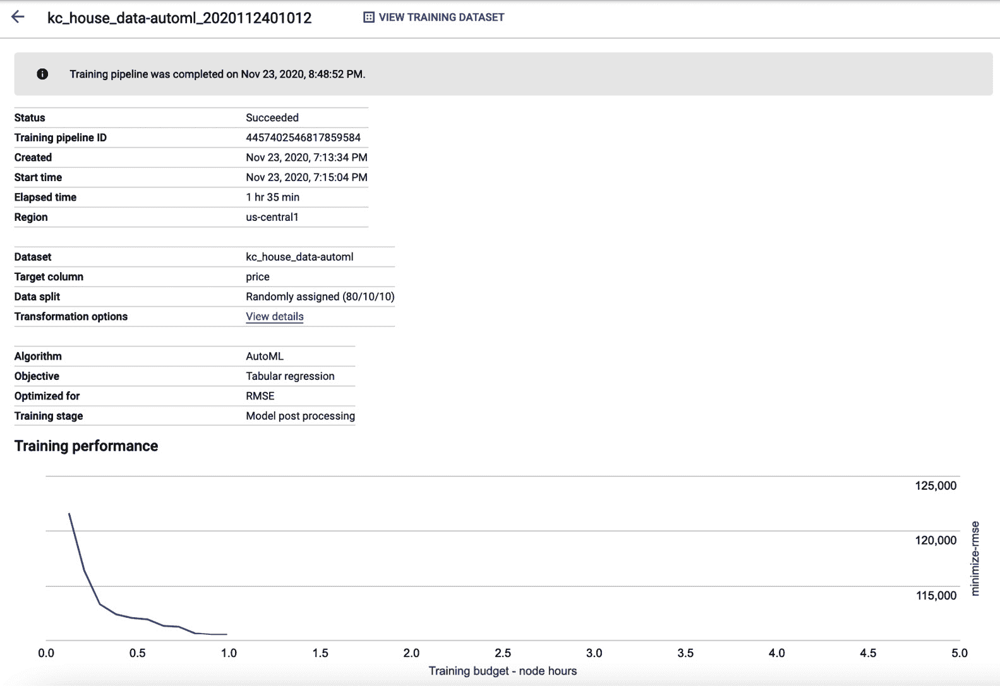

    图 9.44 – AutoML 表格 – 训练性能和结果

    滚动到**训练性能和结果**页面以查看此模型的特征重要性图表。此图表证明了古老的格言“房地产 – 地点，地点，地点”是正确的。此外，房产的价格和居住空间的平方英尺密切相关。这也并不令人惊讶：

    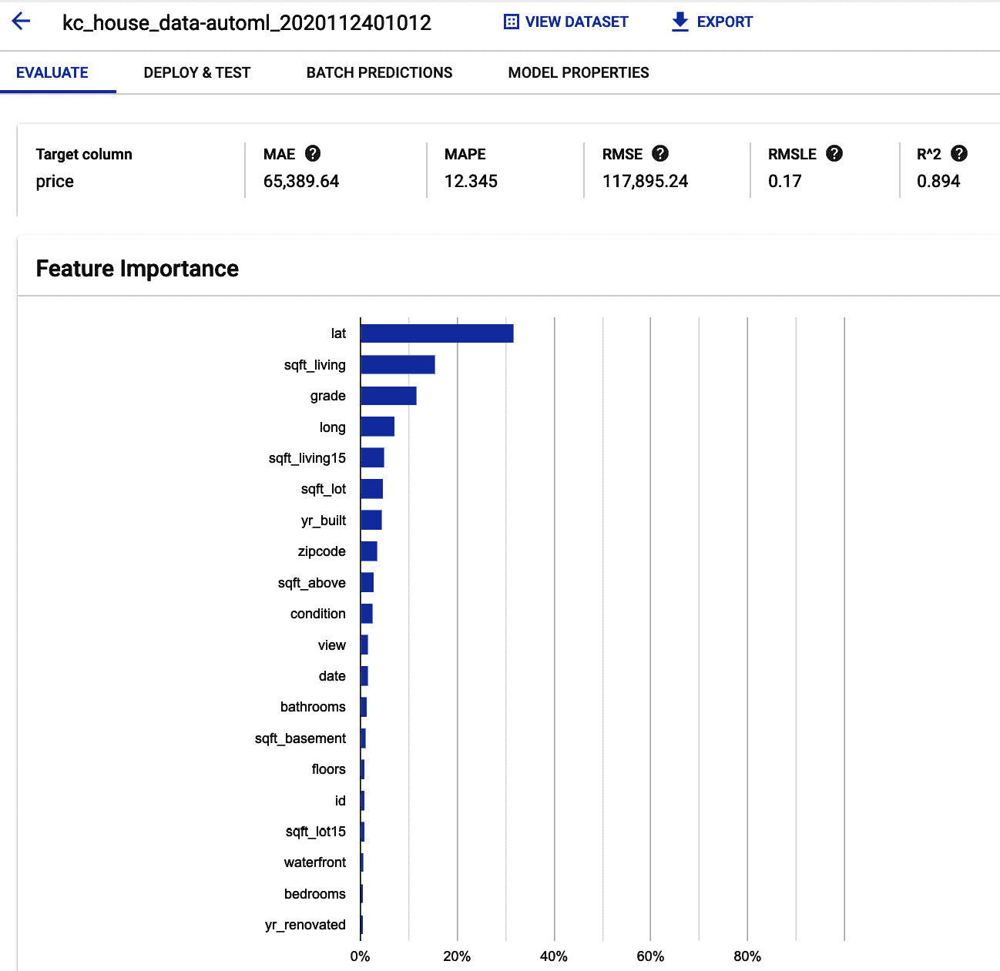

    图 9.45 – AutoML 表格 – 结果及其特征重要性

1.  在这一点上，你可以通过点击**部署和测试**来部署和测试模型，如下面的截图所示：

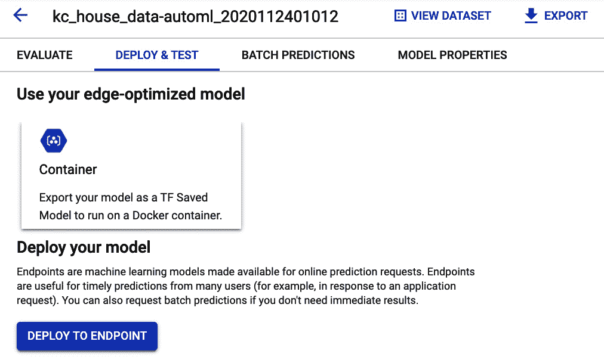

图 9.46 – AutoML 表格 – 将模型部署到端点

在本节中我们进行的几个实验中，我们发现数据的大小是提高准确性的一个重要因素。随着数据集中观测值的增加，自动化机器学习可以执行更好的神经网络架构搜索和超参数优化，以获得最佳结果。

# 摘要

在本章中，你学习了如何使用 AutoML 表格执行自动化机器学习。我们首先设置了一个基于 Cloud AutoML 表格的实验，然后展示了如何训练和部署 AutoML 表格模型。我们使用多个数据源，探索了 AutoML 表格与 BigQuery 公共数据集，以及分类和回归。我们希望本章使你熟悉了与 GCP AutoML 一起工作，以便你可以将其应用于你的自动化机器学习实验。

在下一章中，我们将探讨自动化机器学习的企业用例。

# 进一步阅读

关于本章涵盖的内容的更多信息，请参阅以下链接：

+   AutoML Tables 初学者指南：

    [`cloud.google.com/automl-tables/docs/beginners-guide`](https://cloud.google.com/automl-tables/docs/beginners-guide)

+   AutoML Tables 笔记本：

    [`cloud.google.com/automl-tables/docs/notebooks`](https://cloud.google.com/automl-tables/docs/notebooks)
