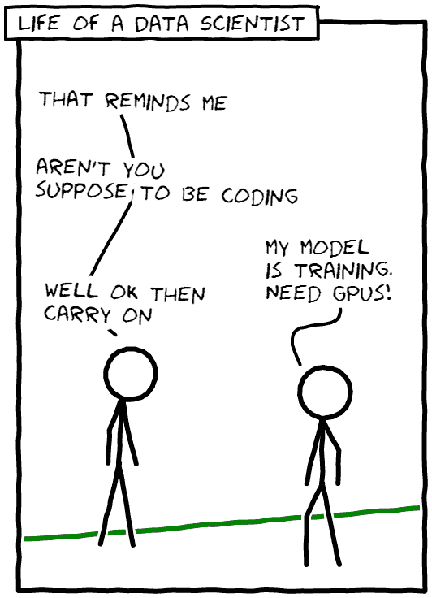
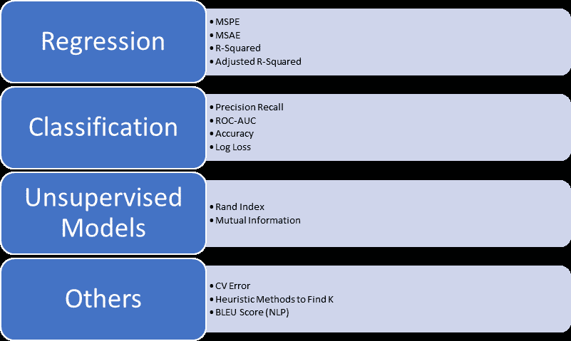

# *第十章*：企业中的 AutoML

“利用机器学习可以带来变革，但要取得成功，企业需要来自顶层的领导。这意味着理解当机器学习改变商业的某个部分——例如产品组合——时，其他部分也必须改变。这可能包括从营销和生产到供应链，甚至招聘和激励系统的一切。”

– 埃里克·布林约尔松，麻省理工学院数字经济倡议主任

自动化**机器学习**（**ML**）是一个使能器和加速器，它释放了组织加快分析生命周期的承诺，而不需要数据科学家成为瓶颈。在前面的章节中，你学习了如何使用多个超规模器执行自动化机器学习，包括开源工具、AWS、Azure 和 GCP。

然而，本章却有所不同，因为在这里我们将探讨企业对自动化机器学习的使用。我们将探讨在现实世界应用中应用自动化机器学习，并讨论这种方法的优缺点。模型可解释性和透明度是自动化机器学习中的两个非常感兴趣的区域。我们将探讨机器学习中的信任模型，为企业应用自动化机器学习提供剧本。

在本章中，我们将涵盖以下主题：

+   我的组织需要自动化机器学习吗？

+   自动化机器学习——企业高级分析加速器

+   自动化机器学习的挑战和机遇

+   建立信任——自动化机器学习中的模型可解释性和透明度

+   在组织中引入自动化机器学习

+   行动呼吁——我接下来去哪里？

# 我的组织需要自动化机器学习吗？

技术决策者和利益相关者不喜欢潮流，你可能也不应该。在垂直企业中，仅仅为了技术而构建和使用技术具有有限的企业价值；技术必须解决业务问题或提供创新的差异化才能具有相关性。因此，这个调查变得非常关键：组织是否真的需要自动化机器学习，或者这只是我们在 AI 和机器学习成熟周期中可以没有的步骤之一？这笔投资会产生**投资回报率**（**ROI**），还是会成为那些当时听起来不错但未被使用的平台之一？

让我们通过查看自动化机器学习的价值主张来尝试回答这些问题，看看它是否适合您的组织。作为一名技术利益相关者，设想自己是一个试图构建企业人工智能剧本的人，并决定是否投资和利用或忽视自动化机器学习的效用。

## 巨头之间的冲突——自动化机器学习与数据科学家

在一个组织，无论大小，你首先需要将这个想法传达给你的数据科学团队。这可能是一个由拥有博士学位、机器学习工程师和数据科学家组成的大型团队，或者它可能是一个紧密团结的初创公司启动者团队，其首席数据科学专家是一位在其机器上安装了 Jupyter 笔记本的工程师。在两种情况下，你都需要有令人信服的论据来提出自动化机器学习的案例。

我们之前已经说过，但很乐意再次重复：自动化机器学习在不久的将来不会消灭数据科学家的职位。话虽如此，你很难找到一个承认使用自动化机器学习进行特征工程、超参数优化或神经架构搜索效率的数据科学家。作为数据科学家，我们往往认为，有时是正确的，数据科学是一种艺术形式，不能通过蛮力来实现。模型调整中涉及大量的专业知识和技术，因此最好留给那些知道自己在做什么的人。问题是这种模式无法扩展：

图 10.1 – 数据科学家的一生

有资质的数据科学家和其他有资质的个人，能够大规模地构建、调整、监控和部署模型，始终存在短缺。我们的组织数据丰富，但缺乏洞察力。我们看到了几个关键的业务智能、实验和洞察力项目被推到以收入为中心的项目优先级列表中。组织需要自动化机器学习，让**主题专家**（**SMEs**）和公民数据科学家能够构建数据实验并测试他们的假设，而无需拥有机器学习博士学位。他们会不会出错？我确信。然而，自动化机器学习将使他们能够构建高级机器学习模型并测试他们的假设。

因此，我们必须支持人工智能的民主化。这并不是说，由自动化机器学习训练的至关重要的信用风险模型应该在没有适当尽职调查和测试的情况下投入生产——即使是有手工制作的模型，情况也不会是这样。组织必须确保性能、鲁棒性、模型退化、对抗攻击、异常参数、准确度矩阵和 KPI 适用于所有模型。

简而言之，企业中的机器学习进展缓慢。扩展很困难，自动化程度不高。商业团队和数据科学家之间的协作困难，真正实现商业价值的模型寥寥无几。自动化机器学习承诺解决这些问题，并为数据科学家提供额外的工具，以减轻特征工程、超参数优化和神经架构搜索的手动繁琐工作。

# 自动化机器学习 – 企业高级分析加速器

在构建您的 AI 剧本和重新构想您组织的人工智能人才战略时，您应该将自动化机器学习视为一种加速器。以下是一些您可能希望考虑使用自动化机器学习来加速您组织的原因。

## 带有人类友好见解的人工智能民主化

自动化机器学习正迅速成为所有主要机器学习和深度学习平台的一个固有部分，将在民主化高级分析中发挥重要作用。所有主要平台都吹嘘这些功能，但要成为企业的加速器，自动化机器学习必须在人工智能民主化中发挥重要作用。工具集应该能够使公民数据科学家轻松执行艰巨的机器学习任务并获得人类友好的见解。任何缺乏可解释性、透明性和可重复性的人工智能和自动化机器学习都不会是您所期望的高级分析加速器。

## 增强智能

自动化机器学习正迅速成为大多数现代数据科学平台的一部分，因此将成为 MLOps 生命周期的一部分。对于数据科学家来说，最大的价值主张是特征工程、数据预处理、算法选择和超参数调整的简便性，即增强数据科学家的技能集。内置自动化机器学习的 MLOps 平台还提供训练和调整、模型监控和管理、以及用于 A/B 测试的头对头模型比较功能。这个出色的工具套件对于加强数据科学家的技能非常有帮助，因此自动化机器学习证明是数据科学家和领域专家 alike 的增强智能平台。

# 自动化机器学习的挑战与机遇

我们已经讨论了自动化机器学习的优势，但所有这些优势都不是没有挑战的。自动化机器学习不是万能的，有一些场景它可能不起作用。以下是一些挑战和自动化机器学习可能不是最佳选择的场景。

## 数据不足

数据集的大小是自动化机器学习（ML）有效运行的关键组成部分。当在小数据集上使用特征工程、超参数优化和神经架构搜索时，它们不会产生良好的结果。数据集必须足够大，自动化机器学习工具才能有效地完成其工作。如果您的数据集不符合这种情况，您可能想要尝试构建模型的替代方法，即手动构建模型。

## 模型性能

在少数情况下，您从现成模型中获得的表现可能不起作用——您可能需要手动调整模型以获得更好的性能或应用自定义启发式方法以进行改进。

## 领域专业知识与特殊用例

在您的模型需要大量专业知识以及内置规则的情况下，自动化机器学习模型带来的收益可能不会提供良好的回报。

## 计算成本

自动化机器学习在本质上计算成本高昂。如果数据集非常大，您可能需要考虑使用本地计算资源（这可能是更便宜的）来避免使用云机器带来的高昂成本。在这些情况下，训练模型产生的成本可能超过优化带来的好处——买者自负。

## 接受学习曲线

任何值得做的事情都不容易，比如锻炼或机器学习。自动化机器学习将重复和繁琐的任务的大部分工作都拿走了，但仍然存在学习曲线。大多数平台将他们的自动化机器学习产品称为零代码、低代码或无代码方法；然而，您仍然需要熟悉这个工具。当您的结果与基于多年专业知识直觉或假设不符时会发生什么？您如何根据识别出的重要特征微调模型？哪些模型在训练数据上表现良好，但在生产数据集上表现不佳，原因是什么？这些都是公民数据科学家和利益相关者需要作为学习曲线一部分考虑的实际问题。大量的学习和适应将取决于您选择的工具以及它如何使您的生活变得容易。

## 利益相关者适应

每一项新技术都会面临适应的挑战——由于自动化机器学习的本质，它可能会在到达时就宣告失败。您的企业人工智能战略应包括培训，并纳入引入新技术（如自动化机器学习）所带来的学习曲线和潜在颠覆。构建示例模板和入门套件有助于让利益相关者跟上进度。在实践中，我们看到让初级数据科学家和开发者参与进来有助于推广新技术。

让我们进入下一节，我们将讨论各种可以帮助在由自动化机器学习训练的模型中建立信任的技术。

# 建立信任——自动化机器学习中的模型可解释性和透明度

建立在由自动化机器学习训练的模型上的信任可能看起来是一个具有挑战性的价值主张。向业务领导者、审计师和负责自动化决策管理的利益相关者解释，他们可以信任一个算法来训练和构建一个将被用于可能具有关键使命的系统，需要您不要将其视为与“人工”机器学习模型不同的东西。模型监控和可观察性要求不会根据构建模型的技术而改变。可重复的模型训练和质量测量，如验证数据、组件集成、模型质量、偏差和公平性，也是任何机器学习开发生命周期的一部分。

让我们探讨一些我们可以用来在自动化机器学习模型中建立信任并确保治理措施的方法和技术。

## 特征重要性

特征重要性，即特定属性对预测结果的正向或负向贡献程度，是大多数，如果不是所有，自动机器学习框架提供的模型检查技术。在早期章节中，你已经看到了 AWS、GCP 和 Azure 都提供了它们训练模型的特征重要性分数的视图。这些信息可以被领域专家和公民数据科学家用来确保模型的准确性。

特征重要性不仅有助于验证假设，还可能为之前未知的数据提供见解。数据科学家在领域专家的帮助下，可以使用特征重要性来确保模型不会对任何受保护类别表现出偏见，并查看是否有任何偏好违反法律。例如，如果一个贷款决策算法对特定性别、种族或民族有偏见，那么在大多数情况下这是非法和不道德的。相反，如果一个乳腺癌数据库显示出显著的性别偏见，那是因为生物结构，因此这不是需要减轻或解决的社会或隐含偏见。通过扰动测试自动机器学习模型，或任何模型，对于特征重要性是一个很好的正确性、鲁棒性和偏见检查。

## 反事实分析

在算法可解释性中，反事实分析属于基于示例的解释类别。简单来说，它使用因果分析来展示如果某个事件已经发生或未发生，将会发生什么。例如，在一个有偏贷款模型中，反事实分析将揭示，在保持所有其他因素不变的情况下，修改贷款申请人的 ZIP 代码会对结果产生影响。这表明模型对特定地理区域的人存在偏见，可能是 ZIP 代码作为代理表现出的潜在种族偏见。除了偏见之外，反事实分析还可以揭示模型假设中的错误，这可能会非常有益。

## 模型准确性的数据科学度量

应该应用标准的机器学习方法来估计性能、模型选择和算法比较，以确保训练模型的准确性和鲁棒性。以下图中展示了验证机器学习模型的一些标准方法：

图 10.2 – 数据科学的标准度量

对于在大数据集上的性能估计，推荐的方法包括通过正态近似检查置信区间，以及训练/测试集划分。对于较小的数据集，重复 k 折交叉验证、留一法交叉验证和置信区间测试有助于确保性能估计的良好性。对于大型数据集的模型选择，训练验证、测试集划分和独立测试集的重复 k 折交叉验证的三重保留方法效果良好。为了比较模型和算法，建议应用多个独立的训练和测试集进行算法比较、McNemar 测试和 Cochran 测试，而对于较小的数据集，嵌套交叉验证非常有效。

为了确保基于机器学习的自动化模型准确且稳健，我们需要确保在整个生命周期中执行可解释性度量。因此，需要在建模前进行检查——即描述输入数据——在建模过程中——即设计可解释的模型架构和算法——以及建模后——即从输出中提取解释。

## 建模前的可解释性

建模前的可解释性分析从探索性数据分析、数据集统计描述和净化开始，即变量的描述、元数据、来源、统计数据、变量间关系（成对图和热图）、真实相关性以及生成合成数据的概率模型。这种可解释性扩展到可解释的特征工程，随后是可解释的原型选择和有意义异常值的识别。

## 建模过程中的可解释性

当使用自动化机器学习算法时，如果有机会，选择采用更可解释的模型家族；线性模型、决策树、规则集、决策集、广义加性模型和基于案例的推理方法比复杂的黑盒模型更可解释。

混合可解释模型也用于设计可解释的模型架构和算法，例如**深度 K 近邻**（**DKNN**）、**深度加权平均分类器**（**DWAC**）、**自解释神经网络**（**SENN**）、**上下文解释网络**（**CENs**）和**特征包网络**（**BagNets**）。使用如**决策解释教学**（**TED**）、多模态解释和合理化神经网络预测等模型将预测和解释结合起来的方法，极大地有助于解释模型。当然，视觉解释非常有效，因为“一图胜千言”，除非是在高维空间中，那时它可能会变得相当混乱，比如后现代艺术。

使用架构调整和正则化作为解释的工件，通过可解释的**卷积神经网络**（**CNNs**）、可解释的深度架构和基于注意力的模型来实现可解释性，这些模型被用于自然语言处理、时间序列分析和计算机视觉。

## 模型后解释性

自动机器学习工具包和超大规模计算平台中包含各种内置工具，用于模型后解释性。这些工具包括宏观解释和基于输入的解释或扰动，以查看输入操作如何可能影响输出。基于宏观解释的方法，如重要性分数、决策规则、决策树、依赖图、口头解释和反事实解释，是领域专家了解训练模型结果的有用资源。

还有尝试探测这个传说中的黑盒的解释估计方法，包括基于扰动的训练（LIME）、反向传播、代理模型、激活优化和 SHAP。

如前所述的方法，在机器学习模型中建立信任没有唯一的方法，无论是手动训练的还是通过自动机器学习工具构建的。实现这一目标的唯一方法是遵循工程最佳实践；验证、可重复性、实验审计轨迹和可解释性是验证和确保其有效性的最知名方法。你可能不需要所有这些方法作为你的机器学习工作流程的一部分，但要知道，这些以及各种其他方法在模型生命周期内验证和监控你的模型对于确保企业机器学习运营的成功至关重要。

# 在组织中引入自动机器学习

现在你已经审查了自动机器学习平台和开源生态系统，并了解了其内部工作原理，难道你不想在你的组织中引入自动机器学习吗？那么，你该如何操作呢？以下是一些指导方针，帮助你完成这个过程。

## 准备迎接影响

安德鲁·吴（Andrew Ng）是 Landing AI 的创始人兼首席执行官，百度的前副总裁和首席科学家，Coursera 的联合主席和联合创始人，Google Brain 的前创始人兼领导者，以及斯坦福大学的兼职教授。他广泛地撰写了关于人工智能和机器学习的文章，他的课程对于任何开始机器学习和深度学习的人来说都是开创性的。在他的《哈佛商业评论》关于企业人工智能的文章中，他提出了五个关键问题，以验证人工智能项目是否会成功。我们认为，这些问题同样适用于自动机器学习项目。你应该提出的问题如下：

+   项目是否给你带来快速的成功？

+   项目是否过于简单或规模过大？

+   你的项目是否特定于你的行业？

+   你是否与可信的合作伙伴一起加速你的试点项目？

+   你的项目是否在创造价值？

这些问题不仅有助于选择一个有意义的工程项目，还有助于寻求商业价值和技术尽职调查。组建一个小团队并指定一个领导者作为自动化机器学习的倡导者将有助于推进这一事业。

## 选择正确的自动化机器学习平台

开源、AWS、GCP、Azure 还是其他什么——你应该使用哪个自动化机器学习平台？

在选择自动化机器学习平台时，有几个考虑因素你应该记住。首先，如果你是云原生，也就是说你的数据和计算都位于云端，那么使用特定云提供商提供的自动化机器学习在所有实际用途上会更有意义。如果你有一个混合模型，尽量让你的自动化机器学习计算靠近你计划使用的数据，无论它位于何处。功能对等可能不会带来如此显著的区别；然而，无法访问正确的数据肯定会的。

一般而言，自动化机器学习的云计算和存储资源可能会迅速变得昂贵，尤其是当你处理大型模型并执行多个同时实验时。如果你在本地环境中拥有计算资源和数据，那么这是一个理想的游乐场，而不会增加你的超大规模账单。然而，这也伴随着建立基础设施和为本地工具包进行设置的职责。因此，如果你不担心成本，并且想快速探索自动化机器学习能为你做什么，基于云的工具包将是一个理想的伴侣。根据你与云提供商的关系，你也许还能获得折扣。

## 数据的重要性

从前几章的例子中，可能已经痛苦地明显，数据，尤其是大量的数据，是成功自动化机器学习项目最需要的东西。较小的数据集无法提供良好的准确性，也不适合作为自动化机器学习的用例。如果你没有足够大的数据集来工作，或者你的用例不适合自动化机器学习，那么可能这不是适合这项工作的正确工具。

## 为你的受众准备正确的信息

自动化机器学习（Automated ML）承诺为数据科学家和中小企业带来巨大价值；因此，你应该仔细构思你的提案。

对于商业领导者和利益相关者来说，这是一个商业赋能工具，将帮助公民数据科学家加快开发；商业用户可以更快地测试他们的假设并执行实验。

对于你的数据科学盟友，你应该介绍自动化机器学习作为一种工具，它通过从他们的日常工作中移除重复和枯燥的任务来增强他们的能力。在许多事情中，自动化机器学习可以帮助减轻从数据集中筛选重要特征的繁琐工作，并可以通过大搜索空间帮助识别正确的参数和模型。这将加速新数据科学家的培训，并帮助其他喜欢尝试数据科学实验的工程师通过实践来掌握基础知识。如果你的数据科学家和机器学习工程师认为这项技术有价值，并且没有感到威胁，他们愿意适应。这并不是他们第一次听说这项令人惊叹的技术，他们愿意使用它，尽管带着一丝怀疑。

# 行动号召 - 我接下来该去哪里？

所有美好的事物都必须结束，这本书也不例外。呼！我们在这里覆盖了很多内容。自动化机器学习是一个活跃的研究和发展领域，在这本书中，我们试图给你一个关于基础、关键优势和平台的广度概述。我们通过开源工具包和云平台中的示例，解释了自动化特征工程、模型和超参数学习以及神经架构搜索的底层技术。我们详细介绍了三个主要云平台，即微软 Azure、AWS 和 GCP。通过逐步的讲解，你看到了每个平台通过构建机器学习模型并尝试它们所提供的自动化机器学习功能集。

学习之旅并未结束。书中提供了几个很好的参考资料，你可以进一步深入研究这个主题。自动化机器学习平台，尤其是云平台，总是处于变化之中，所以当你阅读这本书的时候，一些屏幕和功能可能已经发生了变化。跟上这些超大规模企业的最佳方式是跟上变化，这是唯一的不变。

作为结束语，我们强烈相信理查德·布兰森爵士所说的，*"你不应该通过遵循规则来学习走路。你应该通过实践和跌倒来学习。"* 学习的最佳方式是通过实践——执行胜过没有应用的知。

开心编码！

# 参考文献和进一步阅读

关于本章涵盖的主题的更多信息，你可以参考以下链接：

+   安德鲁·吴的《如何选择你的第一个 AI 项目》: [`hbr.org/2019/02/how-to-choose-your-first-ai-project`](https://hbr.org/2019/02/how-to-choose-your-first-ai-project)

+   *神经科学中的可解释人工智能：行为神经刺激*，2019 年 12 月，神经科学前沿，13:1346，DOI：10.3389/fnins.2019.01346

+   *可解释机器学习 - 制作黑盒模型可解释的指南* by Christoph Molnar: [`christophm.github.io/interpretable-ml-book/`](https://christophm.github.io/interpretable-ml-book/)
