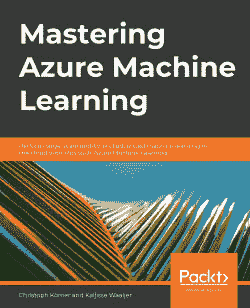
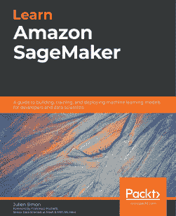
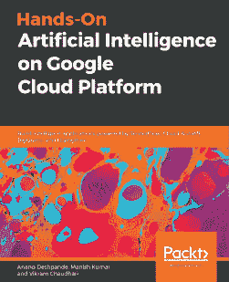

[Packt.com](http://Packt.com)

订阅我们的在线数字图书馆，全面访问超过 7,000 本书籍和视频，以及行业领先的工具，帮助您规划个人发展并推进您的职业生涯。更多信息，请访问我们的网站。

# 为什么订阅？

+   使用来自超过 4,000 位行业专业人士的实用电子书和视频，节省学习时间，增加编码时间

+   通过为您量身定制的技能计划提高您的学习效果

+   每月免费获得一本电子书或视频

+   完全可搜索，便于快速访问关键信息

+   复制粘贴、打印和收藏内容

您知道 Packt 为每本书都提供电子书版本，包括 PDF 和 ePub 文件吗？您可以在[packt.com](http://packt.com)升级到电子书版本，并且作为印刷版书籍的顾客，您有权获得电子书副本的折扣。如需了解更多详情，请联系我们 customercare@packtpub.com。

在[www.packt.com](http://www.packt.com)，您还可以阅读一系列免费技术文章，注册各种免费通讯，并享受 Packt 书籍和电子书的独家折扣和优惠。

# 您可能还会喜欢的其他书籍

如果您喜欢这本书，您可能会对 Packt 的其他这些书籍感兴趣：

[《精通 Azure 机器学习》](https://www.packtpub.com/product/mastering-azure-machine-learning/9781789807554)

**精通 Azure 机器学习**

Christoph Körner, Kaijisse Waaijer

ISBN: 978-1-78980-755-4

+   设置您的 Azure 机器学习工作区进行数据实验和可视化

+   使用 Azure 最佳实践执行 ETL、数据准备和特征提取

+   使用 NLP 和词嵌入实现高级特征提取

+   在 Azure 机器学习上训练梯度提升树集成、推荐引擎和深度神经网络

+   使用超参数调整和 Azure 自动化机器学习优化您的机器学习模型

+   在 Azure 机器学习中使用 Horovod 在 GPU 集群上部署分布式机器学习

+   规模化部署、操作和管理您的机器学习模型

+   自动化您的端到端机器学习过程作为 CI/CD 管道进行 MLOps

[《学习 Amazon SageMaker》](https://www.packtpub.com/product/learn-amazon-sagemaker/9781800208919)

**学习 Amazon SageMaker**

Julien Simon

ISBN: 978-1-80020-891-9

+   在亚马逊网络服务（AWS）上创建和自动化端到端机器学习工作流程

+   精通数据标注和准备技术

+   使用 AutoML 功能，通过自动驾驶仪构建和训练机器学习模型

+   使用内置算法、框架和您自己的代码创建模型

+   使用真实世界示例训练计算机视觉和 NLP 模型

+   覆盖扩展、模型优化、模型调试和成本优化的培训技术

[《动手实践谷歌云平台上的人工智能》](https://www.packtpub.com/product/hands-on-artificial-intelligence-on-google-cloud-platform/9781789538465)

**动手实践谷歌云平台上的人工智能**

Anand Deshpande, Manish Kumar, Vikram Chaudhari

ISBN: 978-1-78953-846-5

+   了解云计算的基础并探索 GCP 组件

+   在 GCP 中使用数据摄取和预处理技术进行机器学习

+   使用 Google Cloud AutoML 实现机器学习算法

+   使用 Google Cloud TPUs 优化 TensorFlow 机器学习

+   在 GCP 上实现 AI 的运营

+   使用 Cloud Storage、Cloud Dataflow 和 Cloud Datalab 构建端到端的机器学习管道

# Packt 正在寻找像你这样的作者

如果你有兴趣成为 Packt 的作者，请访问[authors.packtpub.com](http://authors.packtpub.com)并今天申请。我们与成千上万的开发者和技术专业人士合作，就像你一样，帮助他们将见解与全球技术社区分享。你可以提交一个一般性申请，申请我们正在招募作者的特定热门话题，或者提交你自己的想法。

# 留下评论 - 让其他读者知道你的想法

请通过在购买书籍的网站上留下评论的方式，与别人分享你对这本书的看法。如果你是从亚马逊购买的这本书，请在本书的亚马逊页面上留下一个诚实的评论。这对其他潜在读者来说至关重要，他们可以看到并利用你的客观意见来做出购买决定，我们也可以了解客户对我们产品的看法，我们的作者也可以看到他们对与 Packt 合作创作的书籍的反馈。这只需你几分钟的时间，但对其他潜在客户、我们的作者和 Packt 来说都非常有价值。谢谢！
