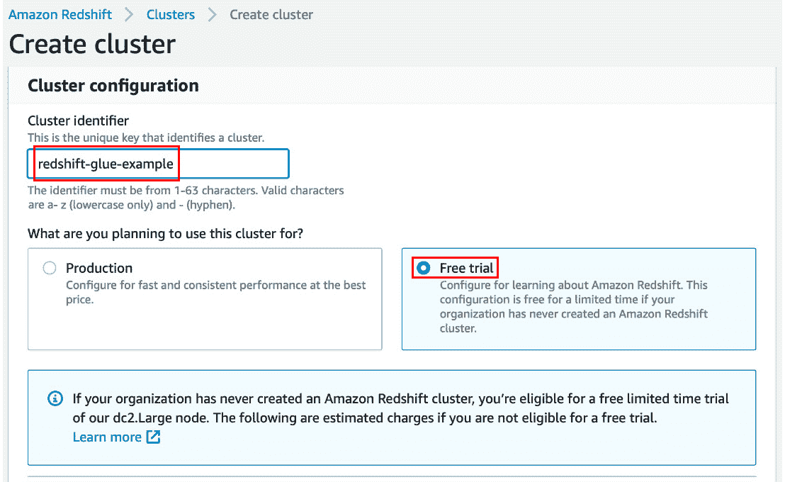
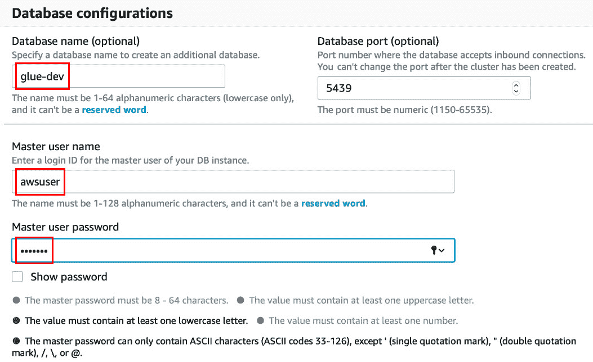
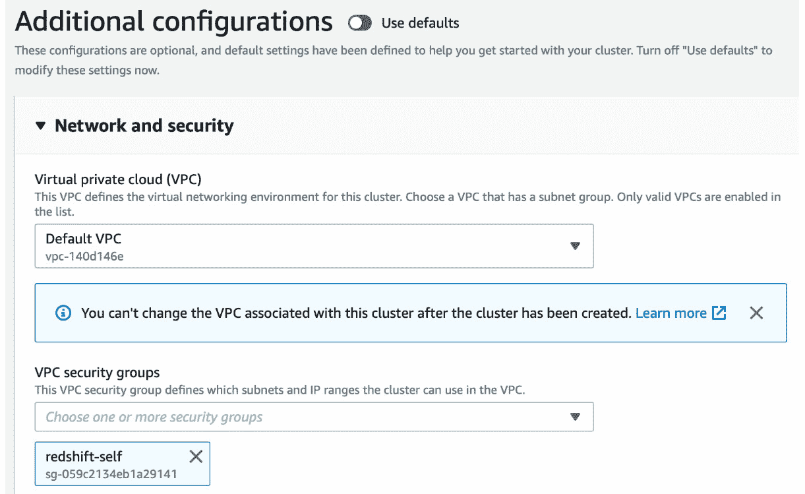
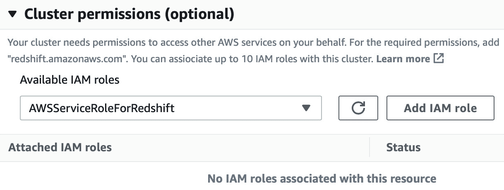
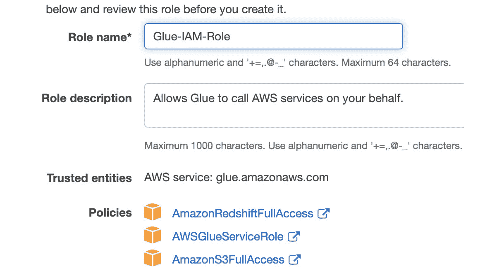
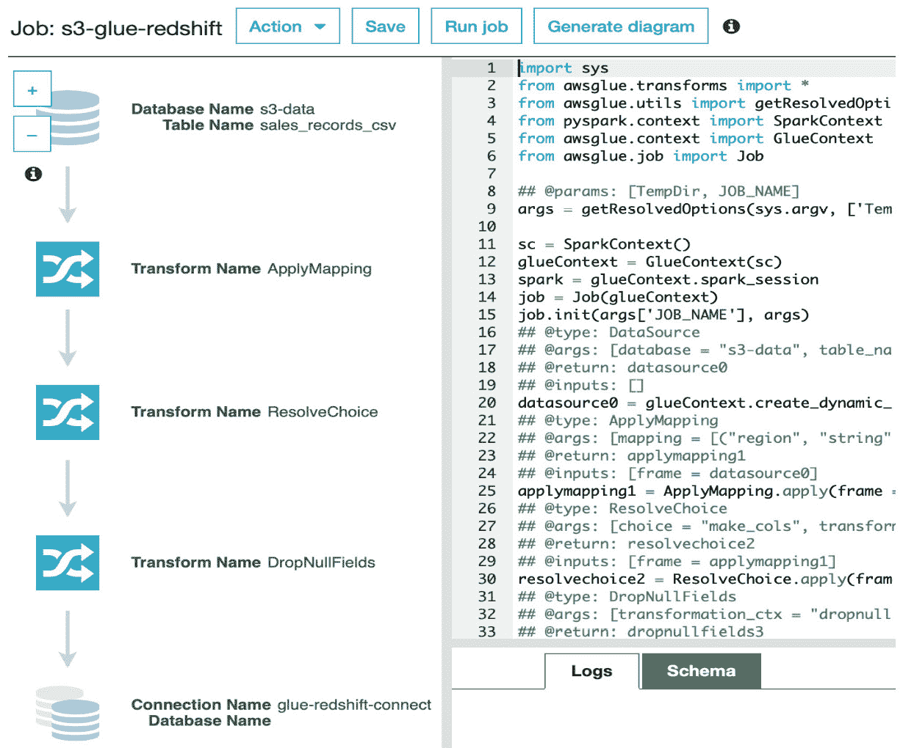
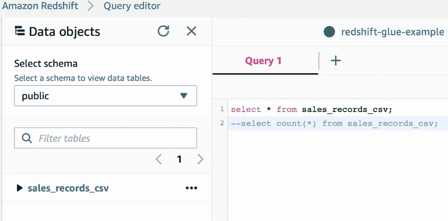
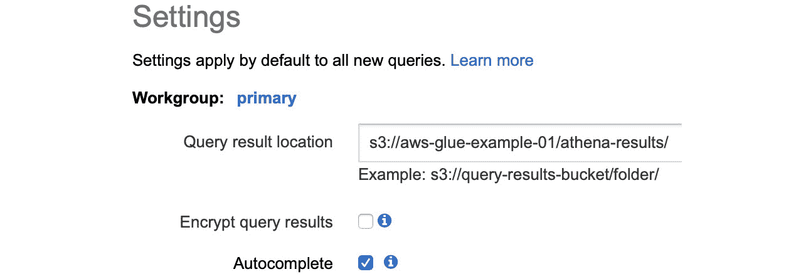
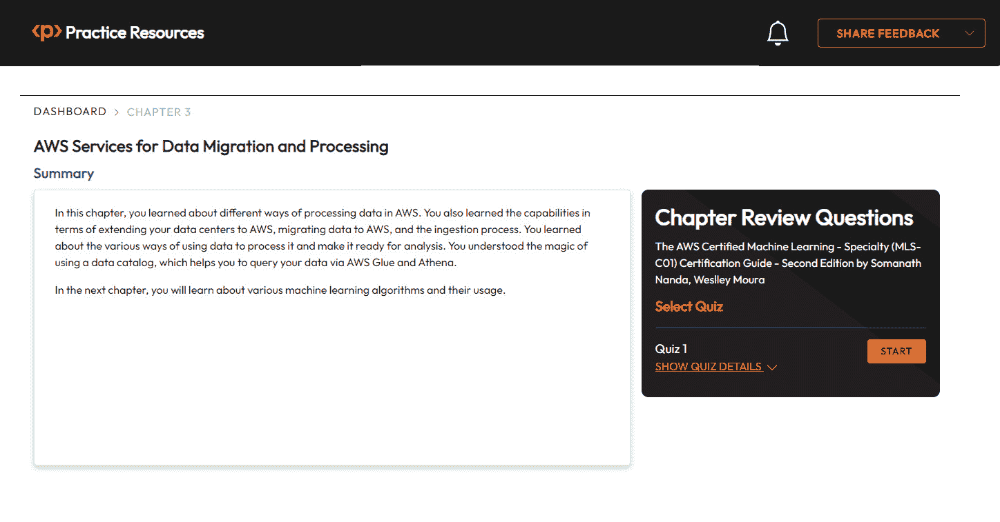

# 第三章：AWS 数据迁移和处理服务

在上一章中，你学习了在 AWS 中存储数据的几种方法。在本章中，你将探索使用这些数据并获得一些洞察的技术。在某些用例中，你必须处理你的数据或将数据加载到数据仓库中以便查询和分析。如果你在 AWS 上，并且你的数据在 S3 中，那么你必须创建一个在 AWS EMR 上的 hive 表来查询 hive 表中的数据。为了提供与托管服务相同的功能，AWS 有一个名为 Athena 的产品，你可以创建一个数据目录并在 S3 上查询你的数据。如果你需要转换数据，那么 AWS Glue 是转换并恢复到 S3 的最佳选择。想象一个用例，你需要流式传输数据并在该数据上创建分析报告。为此，你可以选择 AWS Kinesis Data Streams 来流式传输数据并将其存储在 S3 中。使用 Glue，相同的数据可以被复制到 Redshift 以进行进一步的分析利用。AWS **数据库迁移服务**（**DMS**）提供了异构和同构数据库的无缝迁移。本章将涵盖以下认证所需的主题：

+   使用 Glue 设计 ETL 作业

+   使用 Athena 查询 S3 数据

+   通过 AWS Kinesis Data Streams 进行数据流并通过 Kinesis Firehose 存储

+   从本地位置摄取数据到 AWS

+   将数据迁移到 AWS 并扩展本地数据中心到 AWS

+   在 AWS 上处理数据

# 技术要求

你可以从 GitHub 下载示例中使用的数据，链接如下：[`github.com/PacktPublishing/AWS-Certified-Machine-Learning-Specialty-MLS-C01-Certification-Guide-Second-Edition/tree/main/Chapter03`](https://github.com/PacktPublishing/AWS-Certified-Machine-Learning-Specialty-MLS-C01-Certification-Guide-Second-Edition/tree/main/Chapter03)。

# **在 AWS Glue 上创建 ETL 作业**

在现代数据管道中，有多个阶段，例如生成数据、收集数据、存储数据、执行 ETL、分析和可视化。在本节中，你将概述这些阶段，并深入了解**提取、转换、加载（ETL）**过程：  

+   数据可以来自多个设备，包括移动设备或物联网、Web 日志、社交媒体、交易数据和在线游戏。

+   这巨大的数据量可以通过使用轮询服务、通过集成 AWS Lambda 的 API 网关来收集数据，或者通过 AWS Kinesis、AWS 管理的 Kafka 或 Kinesis Firehose 等流来收集。如果你有一个本地数据库，并且想把那些数据带到 AWS，那么你会选择 AWS DMS。你可以通过 AWS DataSync 将本地数据同步到 Amazon S3、Amazon EFS 或 Amazon FSx。AWS Snowball 用于收集/传输数据到和从 AWS。

+   下一步涉及存储数据。您在前一章中学习了有关此方面的某些服务，例如 S3、EBS、EFS、RDS、Redshift 和 DynamoDB。

+   一旦您了解您的数据存储需求，就可以设计一个 ETL 作业来提取-转换-加载或提取-加载-转换您的结构化或非结构化数据，以满足您进一步分析所需的格式。例如，您可以使用 AWS Lambda 在线转换数据并将其存储在 S3 中，或者您可以在 EMR 集群上运行 Spark 应用程序来转换数据并将其存储在 S3、Redshift 或 RDS 中。

+   AWS 中提供了许多服务用于对转换后的数据进行分析，例如 EMR、Athena、Redshift、Redshift Spectrum 和 Kinesis Analytics。

+   一旦数据被分析，您可以使用 AWS QuickSight 进行可视化，以了解模式或趋势。数据科学家或机器学习专业人士会希望应用统计分析来更好地理解数据分布。商业用户使用统计分析来准备报告。您将在 *第五章* *数据理解和可视化* 中学习和探索各种展示和可视化数据的方法。

您从传统数据管道中理解到的是，ETL 全部关于在服务器上编码和维护代码，以确保一切顺利运行。如果数据格式有任何变化，则代码需要更改，这将导致目标模式发生变化。如果数据源发生变化，则代码必须能够处理这种情况，这会增加开销。*您是否需要编写代码来识别数据源中的这些变化？您是否需要一个能够适应变化并为您发现数据的系统？* 这些问题的答案是肯定的，为此，您可以使用 **AWS Glue**。现在，您将了解为什么 AWS Glue 如此受欢迎。

## **AWS Glue 的功能**

AWS Glue 是 AWS 上完全托管的无服务器 ETL 服务。它具有以下功能：

+   它通过连接到数据源自动发现和分类您的数据，并生成数据目录。

+   如 Amazon Athena、Amazon Redshift 和 Amazon EMR 这样的服务可以使用数据目录来查询数据。

+   AWS Glue 生成 ETL 代码，这是 Spark 在 Python 或 Scala 中的扩展，也可以进行修改。

+   它会自动扩展以匹配您的 Spark 应用程序运行 ETL 作业和将数据加载到目标位置的需求。

AWS Glue 拥有 **数据目录**，这正是其成功的关键。它有助于从数据源发现数据并了解一些相关信息：

+   数据目录自动发现新数据并提取模式定义。它检测模式更改和版本表。它检测 Amazon S3 上的 Apache Hive 风格分区。

+   数据目录自带用于流行数据类型的内置分类器。可以使用 **Grok 表达式**编写自定义分类器。分类器有助于检测模式。

+   Glue 爬虫可以按需或按计划运行以更新 Glue 数据目录中的元数据。Glue 爬虫必须与具有足够权限读取数据源（如 Amazon RDS、Redshift 和 S3）的 IAM 角色相关联。

既然您对 AWS Glue 的用途有了初步的了解，接下来运行以下示例以亲自动手实践。

## **动手实践 AWS Glue 数据目录组件**

在此示例中，您将创建一个作业，使用 AWS Glue 将数据从 S3 复制到 Redshift。我所有的组件都是在`us-east-1`区域创建的。首先创建一个存储桶：

1.  导航到 AWS S3 控制台并创建一个存储桶。我将其命名为`aws-glue-example-01`。

1.  点击`input-data`。

1.  在文件夹内导航并点击`sales-records.csv`数据集。数据可在以下 GitHub 位置找到：[`github.com/PacktPublishing/AWS-Certified-Machine-Learning-Specialty-MLS-C01-Certification-Guide-Second-Edition/tree/main/Chapter03/AWS-Glue-Demo/input-data`](https://github.com/PacktPublishing/AWS-Certified-Machine-Learning-Specialty-MLS-C01-Certification-Guide-Second-Edition/tree/main/Chapter03/AWS-Glue-Demo/input-data)。

    由于您已将数据上传到 S3 存储桶，现在创建一个 VPC，您将在其中创建 Redshift 集群。

1.  通过访问[`console.aws.amazon.com/vpc/home?region=us-east-1#`](https://console.aws.amazon.com/vpc/home?region=us-east-1#) URL 进入 VPC 控制台，并点击`AWS services`

1.  `com.amazonaws.us-east-1.s3`（网关类型）

1.  **VPC**：选择**默认 VPC**（在您的 Redshift 集群将创建的默认 VPC 中使用此默认 VPC）

+   保持其他字段不变，并点击**创建端点**。*   点击`redshift-self`，并选择默认 VPC 下拉菜单。提供适当的描述，例如`Redshift 安全组`。点击**创建****安全组**。*   点击`所有流量`*   `自定义`*   在搜索字段中，选择相同的组（`redshift-self`）*   点击**保存规则**。

    现在，创建您的 Redshift 集群。

    +   进入 Amazon Redshift 控制台。点击**创建集群**并填写高亮字段，如图*图 3.1*所示。

图 3.1 – Amazon Redshift 创建集群屏幕截图

1.  滚动并使用自己的值填写图*图 3.2*中显示的高亮字段：

图 3.2 – Amazon Redshift 集群数据库配置部分的截图

1.  滚动并更改**附加配置**设置，如图*图 3.3*所示。

图 3.3 – Amazon Redshift 集群的附加配置部分截图

1.  如图 3.4 所示，更改 IAM 权限：

图 3.4 – Amazon Redshift 集群的集群权限截图

1.  滚动并点击**创建集群**。将花费一分钟左右的时间将集群置于可用状态。

    接下来，你将创建一个 IAM 角色。

1.  导航到 AWS IAM 控制台，并在屏幕上的**访问管理**部分选择**角色**。

1.  点击**创建角色**按钮，并从服务中选择**Glue**。点击**下一步：权限**按钮进入下一页。

1.  在搜索栏中搜索`AmazonS3FullAccess`并选择它。然后，搜索`AWSGlueServiceRole`并选择它。由于你正在将数据写入 Redshift 作为本例的一部分，请选择**AmazonRedshiftFullAccess**。点击**下一步：标签**，然后点击**下一步：****审查**按钮。

1.  提供一个名称，`Glue-IAM-Role`，然后点击**创建角色**按钮。角色如图 3.5 所示。5*:

图 3.5 – IAM 角色的截图

现在，你已经有输入数据源和输出数据存储在手头。下一步是从 AWS Glue 控制台创建 Glue 爬虫。

1.  选择`glue-redshift-connection`

1.  `Amazon Redshift`

+   点击`redshift-glue-example`*   `glue-dev`*   `awsuser`*   `********`（输入第 10 步中选择的值）*   点击**下一步**然后**完成**。为了验证其是否正常工作，点击**测试连接**，在 IAM 角色部分选择**Glue-IAM-Role**，然后点击**测试连接**。*   前往爬虫并选择添加爬虫。为爬虫提供一个名称，S3-glue-crawler，然后点击下一步。在指定爬虫源类型页面，保持所有默认设置，然后点击下一步。*   在`s3://aws-glue-example-01/input-data/sales-records.csv`。*   点击**下一步**。*   设置`否`。点击**下一步**。*   对于`Glue-IAM-Role`。然后，点击**下一步**。*   将**频率**设置为**按需运行**。点击**下一步**。*   没有创建数据库，因此点击`s3-data`，点击**下一步**，然后点击**完成**。*   选择爬虫，`s3-data`，如前一步所述已创建，并已添加一个表。点击**表**并选择新创建的表，**sales_records_csv**。你现在可以看到模式已经被发现。如果推断的数据类型不符合你的要求，你可以更改数据类型。

在本节动手实践中，你学习了数据库表、数据库连接、S3 中的爬虫以及 Redshift 集群的创建。在下一节动手实践中，你将学习如何使用 Glue 创建 ETL 作业。

## **AWS Glue ETL 组件的实际操作**

在本节中，你将使用之前创建的数据目录组件来构建一个作业。你将首先创建一个作业：

1.  导航到 AWS Glue 控制台，并在**ETL**部分下点击**作业**。

1.  点击**s3-glue-redshift**

1.  `Spark`

1.  **Glue 版本**：**Spark 2.4，Python 3，改进了作业启动时间（Glue 版本 2.0**）

1.  保持其他字段不变，然后点击**下一步**。

1.  选择**sales_records_csv**并点击**下一步**。

1.  默认选择**更改模式**，然后点击**下一步**（在撰写本书时，Glue 2.0 不支持机器学习转换）。

1.  将数据库名设置为`glue-dev`（如前节中创建），然后点击**下一步**。

1.  接下来是**输出模式定义**页面，您可以选择要从目标模式中删除的所需列。向下滚动并点击**保存作业并编辑脚本**。

1.  您现在可以在屏幕左侧看到正在创建的管道，以及右侧的推荐代码，如图*图 3.6*所示。您可以根据需求修改代码。点击**运行作业**按钮。会出现一个弹出窗口，要求您编辑您希望更改的任何详细信息。

    这是个可选步骤。然后，点击**运行作业**按钮：

    

图 3.6 – AWS Glue ETL 作业的屏幕截图

1.  作业成功后，导航到 Amazon Redshift 并点击**查询编辑器**。

1.  将数据库名设置为`glue-dev`，然后提供用户名和密码以创建连接。

1.  选择`public`模式，现在您可以查询表以查看记录，如图*图 3.7*所示：

图 3.7 – Amazon Redshift 查询编辑器的屏幕截图

您现在已了解如何使用 AWS Glue 创建 ETL 作业，将数据从 S3 存储桶复制到 Amazon Redshift。您还使用 UI 控制台中的查询编辑器查询了 Amazon Redshift 中的数据。建议在成功完成步骤后删除 Redshift 集群和 AWS Glue 作业。AWS 在您的账户中创建了两个存储桶来存储 AWS Glue 脚本和 AWS Glue 的临时结果。也请删除这些以节省成本。您将在下一节中使用在 S3 数据上创建的数据目录。

在下一节中，您将了解如何使用 Athena 查询 S3 数据。

# **使用 Athena 查询 S3 数据**

Athena 是一种无服务器服务，旨在查询存储在 S3 中的数据。它是无服务器的，因为客户端不管理用于计算的服务器：

+   Athena 使用模式来呈现对存储在 S3 中的数据的查询结果。您定义您希望数据以模式的形式呈现的方式（方式或结构），Athena 从 S3 读取原始数据，根据定义的模式显示结果。

+   输出可以被其他服务用于可视化、存储或各种分析目的。S3 中的源数据可以是以下任何一种结构化、半结构化或非结构化数据格式：XML、JSON、CSV/TSV、AVRO、Parquet 或 ORC（以及其他格式）。CloudTrail、ELB 日志和 VPC 流日志也可以存储在 S3 中，并由 Athena 进行分析。

+   这遵循了读取时定义模式的技术。与传统技术不同，表在数据目录中预先定义，并且在从表中读取数据时，数据结构将与表的架构进行验证。可以在不转换源数据的情况下对数据进行类似 SQL 的查询。

现在，为了帮助您理解这一点，这里有一个示例，您将使用在 AWS Glue 上创建的 **AWSDataCatalog** 对 S3 数据进行操作，并使用 Athena 查询它们：

1.  导航到 AWS Athena 控制台。从 `sampledb` 数据库中选择 `AWSDataCatalog` 将在 AWS Glue 数据目录中创建一个表，名为 `elb_logs`）。

1.  选择 `s3-data` 作为数据库。

1.  点击右上角的**设置**，并填写如图 3.8 所示的详细信息：（我在此示例中使用了与上一个示例相同的存储桶和不同的文件夹）：

图 3.8 – Amazon Athena 设置的截图

1.  下一步是在查询编辑器中编写您的查询并执行它。一旦执行完成，请删除您的 S3 存储桶和 AWS Glue 数据目录。这将为您节省费用。

在本节中，您学习了如何通过 AWS Glue 数据目录使用 Amazon Athena 查询 S3 数据。您还学习了如何创建模式并从 S3 查询数据。在下一节中，您将了解 Amazon Kinesis Data Streams。

# **使用 Kinesis Data Streams 处理实时数据**

Kinesis 是亚马逊的流服务，可以根据需求进行扩展。它默认保留数据 24 小时，或者可选地最多保留 365 天。Kinesis Data Streams 用于大规模数据摄取、分析和监控：

+   Kinesis 流可以被多个生产者摄取，同时多个消费者也可以从流中读取数据。以下是一个示例，以帮助您理解这一点。假设您有一个生产者将数据摄取到 Kinesis 流中，默认的保留期是 24 小时，这意味着今天早上 05:00:00 提取的数据将在流中可用，直到明天早上 04:59:59。在此之后，这些数据将不再可用，理想情况下，应该在它们过期之前被消费；否则，如果它们是关键数据，可以存储在别处。保留期可以延长至最多 365 天，但需要额外付费。

+   Kinesis 可用于实时分析或仪表板可视化。生产者可以想象成将数据推入 Kinesis 流的一段代码，它可以是一个 EC2 实例、Lambda 函数、IoT 设备、本地服务器、移动应用程序或设备等，这些设备正在运行代码。

+   同样，消费者也可以是一段在 EC2 实例、Lambda 函数或本地服务器上运行的代码，这些服务器知道如何连接到 Kinesis 流、读取数据并对数据进行一些操作。AWS 提供触发器，以便在 Kinesis 流中数据到达时立即调用 Lambda 消费者。

+   Kinesis 由于其分片架构而具有可伸缩性，这是 Kinesis 流的基本吞吐量单元。*什么是分片？* 分片是根据分区键对数据进行分区的一个逻辑结构。分片支持每秒*1 MB*的写入容量和每秒*2 MB*的读取容量。单个分片每秒支持 1,000 条`PUT`记录。如果您创建了一个包含*三个分片*的流，那么可以实现*3 MB/sec*的写入吞吐量和*6 MB/sec*的读取吞吐量，这允许 3,000 条`PUT`记录。因此，随着分片数量的增加，您需要额外支付费用以获得更高的性能。

+   分片中的数据通过 Kinesis 数据记录进行存储，最大可达 1 MB。Kinesis 数据记录根据分区键跨分片存储。它们还有一个序列号。序列号在执行`putRecord`或`putRecords` API 操作时由 Kinesis 分配，以便唯一标识一条记录。分区键由生产者在将数据添加到 Kinesis 数据流时指定，分区键负责将记录隔离和路由到流中的不同分片中以平衡负载。

+   在 Kinesis 流中加密数据有两种方式：服务器端加密和客户端加密。客户端加密使得密钥的实施和管理变得困难，因为客户端必须在将数据放入流之前对其进行加密，并在从流中读取数据之后对其进行解密。通过**AWS KMS**启用服务器端加密后，数据在您将数据放入流和从流中获取数据时会自动加密和解密。

**注意**

不要将 Amazon Kinesis 与 Amazon SQS 混淆。Amazon SQS 支持一个生产组和消费组。如果您的用例需要多个用户发送和接收数据，那么 Kinesis 是解决方案。

对于解耦和异步通信，SQS 是解决方案，因为发送者和接收者不需要相互了解。

在 SQS 中，没有持久性的概念。一旦读取消息，下一步就是删除。Amazon SQS 没有保留时间窗口的概念。如果您的用例需要大规模摄取，则应使用 Kinesis。

在下一节中，您将了解如何存储流数据以进行进一步分析。

# **使用 Kinesis Data Firehose 存储和转换实时数据**

有许多用例需要将数据流式传输并存储以供未来的分析。为了克服这些问题，你可以编写一个 Kinesis 消费者来读取 Kinesis 流并将数据存储在 S3 中。这个解决方案需要一个实例或机器来运行代码，并需要从流中读取和写入 S3 所需的访问权限。另一个可能的选择是运行一个 Lambda 函数，该函数在向流发出的`putRecord`或`putRecords` API 触发时执行，并从流中读取数据以存储在 S3 桶中：

+   为了使这个过程变得简单，Amazon 提供了一个名为 Kinesis Data Firehose 的独立服务。它可以轻松地连接到 Kinesis 数据流，并需要基本的 IAM 角色来将数据写入 S3。这是一个完全托管的服务，旨在减轻管理服务器和代码的负担。它还支持将流式数据加载到 Amazon Redshift、Elasticsearch 和 Splunk。Kinesis Data Firehose 会自动扩展以匹配数据的吞吐量。

+   数据可以在存储或发送到目的地之前通过 AWS Lambda 函数进行转换。如果你想使用未转换的数据构建原始数据湖，那么通过启用源记录备份，你可以在转换之前将其存储在另一个 S3 桶中。

+   在数据发送到 S3 桶后，借助 AWS KMS，可以对数据进行加密。必须在创建交付流时启用它。数据也可以以支持的格式（如 gzip、ZIP 或 Snappy）进行压缩。

在下一节中，你将了解用于从本地服务器摄取数据到 AWS 的不同 AWS 服务。

# **从本地到 AWS 的数据摄取的不同方式**

随着对数据驱动用例需求的增加，目前管理本地服务器上的数据相当困难。当你处理大量数据时，备份并不容易。这些数据湖中的数据用于构建深度神经网络、创建数据仓库以从中提取有意义的信息、运行分析和生成报告。

现在，如果你查看将数据迁移到 AWS 的可选方案，这也带来了各种挑战。例如，如果你想将数据发送到 S3，那么你必须编写几行代码将你的数据发送到 AWS。你将需要管理代码和服务器以运行代码。必须确保数据通过 HTTPS 网络传输。你需要验证数据传输是否成功。这增加了过程的复杂性，同时也带来了时间和精力上的挑战。为了避免此类情况，AWS 提供了一些服务，通过设计混合基础设施允许本地数据中心与 AWS 之间的数据共享，以匹配或解决你的用例。你将在接下来的章节中了解这些内容。

## **AWS 存储网关**

存储网关是一种混合存储虚拟设备。它可以在三种不同的模式下运行——**文件网关**、**磁带网关**和**卷网关**。它可以用于将本地数据中心扩展、迁移和备份到 AWS：

+   在磁带网关模式下，存储网关将虚拟磁带存储在 S3 上，当磁带被弹出并归档时，磁带将从 S3 移动到冰川。活动磁带存储在 S3 上进行存储和检索。归档或导出的磁带存储在冰川的**虚拟磁带架**（**VTS**）中。虚拟磁带可以创建，大小可以从 100 GiB 到 5 TiB 不等。总共可以配置 1 个 PB 的本地存储，并且可以将无限数量的磁带归档到冰川。这对于现有的磁带备份系统和需要将备份数据迁移到 AWS 的场景来说非常理想。您可以在以后停用物理磁带硬件。

+   在文件网关模式下，存储网关将文件映射到 S3 对象上，可以使用可用的存储类之一进行存储。这有助于您将数据中心扩展到 AWS。您可以将更多文件加载到文件网关中，这些文件将作为 S3 对象存储。它可以在您的本地虚拟服务器上运行，该服务器通过**服务器消息块（SMB）**或**网络文件系统（NFS）**连接到各种设备。文件网关通过 HTTPS 公共端点连接到 AWS，以在 S3 对象上存储数据。可以对那些 S3 对象应用生命周期策略。您可以将您的**活动** **目录**（**AD**）轻松集成到文件网关中，以控制对文件共享中文件的访问。

+   在卷网关模式下，存储网关提供块存储。有两种使用方式；一种是**网关缓存**，另一种是**网关存储**：

+   **网关存储**是一种本地运行的卷存储网关。它具有本地存储和上传缓冲区。总共可以创建 32 个卷，每个卷的大小可以达到 16 TB，总容量为 512 TB。主数据存储在本地，备份数据在后台异步复制到 AWS。卷通过网络服务器访问，通过**互联网小型计算机系统接口（iSCSI）**提供。它通过 HTTPS 公共端点连接到存储网关端点，并从备份数据创建 EBS 快照。这些快照可以用来创建标准的 EBS 卷。此选项非常适合迁移到 AWS、灾难恢复或业务连续性。本地系统将继续使用本地卷，但 EBS 快照存储在 AWS 中，可以用作备份的替代品。这不是数据中心扩展的最佳选择，因为您需要大量的本地存储。

+   **Gateway Cached** 是一种本地运行的卷存储网关。它具有缓存存储和上传缓冲区。区别在于添加到存储网关的数据不是本地的，而是上传到 AWS。主数据存储在 AWS。频繁访问的数据在本地缓存。这是一个将本地数据中心扩展到 AWS 的理想选择。它通过 HTTPS 公共端点连接到存储网关端点，并创建由 S3 支持的卷快照（AWS 管理的存储桶），这些快照作为标准 EBS 快照存储。

## **Snowball、Snowball Edge 和 Snowmobile**

这些属于同一产品类别或家族，用于在业务运营地点和 AWS 之间物理传输数据。为了将大量数据移动到 AWS 或从 AWS 中移出，你可以使用以下三种中的任何一种：

+   **Snowball**: 这是一个可以通过提交工作订单从 AWS 订购的物理设备。AWS 会为你提供一个设备，用于在发送回 AWS 之前加载你的数据。Snowball 中的数据使用 KMS 加密。它提供两种容量范围：50 TB 和 80 TB。对于 10 TB 到 10 PB 之间的数据，订购一个或多个 Snowball 设备是经济实惠的。该设备可以发送到不同的地点。它没有任何计算能力；它只提供存储能力。

+   **Snowball Edge**: 这就像 Snowball，但它同时具备存储和计算能力。它的容量比 Snowball 大。它提供快速网络，例如通过 RJ45 的 10 Gbps、10/25 Gb 通过 SFP28 以及 40/100 Gb+通过 QSFP+铜。这对于将千兆到太字节的数据安全快速传输到 AWS 是理想的。

+   **Snowmobile**: 这是一个在卡车上的运输集装箱内的便携式数据中心。它允许你将埃字节的数据从本地移动到 AWS。如果你的数据量超过 10 PB，则 Snowmobile 是首选。本质上，在请求使用 Snowmobile 服务时，一辆卡车会被开到你的位置，你将数据中心连接到卡车上并传输数据。如果你有多个地点，选择 Snowmobile 进行数据传输不是一个理想的选择。

## **AWS DataSync**

AWS DataSync 旨在将数据从本地存储移动到 AWS，或反之亦然：

+   这是 AWS 为数据处理传输、归档或成本效益存储、灾难恢复、业务连续性和数据迁移提供的理想产品。

+   它具有特殊的数据验证功能，可以在数据到达 AWS 后立即验证原始数据与 AWS 中的数据，换句话说，它检查数据的完整性。

+   要深入了解此产品，可以考虑一个拥有 SAN/NAS 存储的本地数据中心示例。当您在 VMWare 平台上运行 AWS DataSync 代理时，此代理能够通过 NFS/SMB 协议与 NAS/SAN 存储进行通信。一旦启动，它就会与 AWS DataSync 端点通信，然后可以从那里连接到多种不同类型的地点，包括各种 S3 存储类别或基于 VPC 的资源，例如 **弹性文件系统**（**EFS**）和 Windows Server 的 FSx。

+   它允许您在特定时间段内安排数据传输。通过配置内置的带宽限制，您可以限制 DataSync 使用的网络带宽量。

## **AWS 数据迁移服务**

在某些情况下，组织可能会决定将其数据库从一个迁移到另一个，例如需要更好的性能、增强的安全性、高级功能或避免来自供应商的许可费用。如果组织希望将其业务扩展到不同的地理位置，它将需要以经济高效的方式执行数据库迁移、灾难恢复改进和数据库同步。AWS DMS 允许您在将数据库从本地/EC2 实例/Amazon RDS 迁移到 Amazon RDS 或 Amazon Aurora 时利用可扩展性、灵活性和成本效益的优势。

在需要将多个数据库合并到单个数据库或需要在多个数据库之间集成数据的情况下，AWS DMS 可以成为一个有价值的工具。AWS DMS 设计为从一个源移动到目标，前提是其中一个端点位于 AWS：

+   DMS 支持同构和异构数据库迁移，允许您在不同数据库引擎之间进行迁移，例如 Oracle、MySQL、PostgreSQL 和 Microsoft SQL Server。

+   DMS 通过处理模式转换、数据复制和源数据库与目标数据库之间的持续同步来简化数据库迁移过程。

+   DMS 支持全量加载和持续 **变更数据捕获**（**CDC**）复制方法。全量迁移会将整个源数据库复制到目标数据库，而 CDC 仅捕获并复制初始加载后所做的更改。例如，对于需要最小停机时间的数据库迁移，DMS 首先执行初始全量迁移，然后通过 CDC 复制来保持目标数据库与源数据库更改的一致性。

+   DMS 提供了一个用户友好的控制台和 API，用于轻松配置、监控和管理数据库迁移。它提供详细的日志记录和错误处理，以帮助诊断和解决迁移问题。例如，在从 Oracle 迁移到 Amazon Aurora 的过程中，DMS 可以自动转换 Oracle 特定的数据类型并修改表结构以与 Aurora 数据库模式保持一致。

+   DMS 支持持续数据复制，即使在初始迁移之后也能保持源数据库和目标数据库的同步。这在需要持续数据同步或数据库复制的场景中特别有用。例如，如果一家公司维护一个用于高可用性的活动-活动数据库设置，DMS 将在不同地区的多个数据库实例之间复制数据更改，以实现实时同步。

+   DMS 提供了内置的验证和测试功能，以确保迁移数据的完整性和一致性。它执行数据验证检查并生成报告，以验证迁移过程的成功。例如，在将大型数据库从 Microsoft SQL Server 迁移到 Amazon RDS for PostgreSQL 之后，DMS 通过比较行数、数据类型和其他指标来验证迁移数据，以确保数据准确性。

+   DMS 支持一次性迁移和持续复制，适用于数据库整合和集成场景。它使组织能够将来自多个数据库的数据合并到单个目标数据库，或根据需要跨多个数据库分发数据。例如，假设一家拥有多个子公司数据库的公司希望将所有数据合并到一个集中式数据库中，以便进行统一的报告和分析。DMS 简化了从多个来源到目标数据库的数据迁移和持续同步。

# **在 AWS 上处理存储的数据**

有几种服务用于处理存储在 AWS 中的数据。您将了解 AWS Batch 和 AWS `MapReduce`作业以及以托管方式运行的 Spark 应用程序。AWS Batch 用于长时间运行、计算密集型的工作负载。

## **AWS EMR**

EMR 是 AWS 提供的一项服务，作为 Apache Hadoop 的托管实现。它包括 Hadoop 生态系统的其他组件，如 Spark、HBase、Flink、Presto、Hive 和 Pig。您不需要为认证考试详细了解这些内容，但这里有一些关于 EMR 的信息：

+   EMR 集群可以从 AWS 控制台或通过 AWS CLI 以特定数量的节点启动。集群可以是长期集群或临时集群。在长时间运行的传统集群中，您必须自行配置机器并管理它们。如果您有需要更快执行的任务，那么您需要手动添加集群。在 EMR 的情况下，这些管理开销消失了。您可以从 EMR 请求任意数量的节点，并且它将为您管理和启动节点。如果您在集群上启用了自动扩展，EMR 将根据需求调节节点。这意味着，当负载高时，EMR 将在集群中启动新的节点，一旦负载减少，就会取消节点。

+   EMR 在后台使用 EC2 实例运行，在一个 VPC 中的可用区。这使节点之间的网络速度更快。AWS Glue 在后台使用 EMR 集群，用户无需担心对 AWS EMR 的操作理解。

+   从使用场景的角度来看，EMR 可以用于处理或转换存储在 S3 中的数据，并将输出数据存储在 S3 中。EMR 使用节点（EC2 实例）作为数据处理单元。EMR 节点有多种变体，包括主节点、核心节点和任务节点。

+   EMR 主节点充当 Hadoop NameNode，管理集群及其健康。它负责在其他核心节点和任务节点之间分配作业工作负载。如果你启用了 SSH，则可以连接到主节点实例并访问集群。

+   EMR 集群可以有一个或多个核心节点。如果你将其与 Hadoop 生态系统联系起来，那么核心节点类似于 Hadoop 数据节点用于 HDFS，它们负责在它们内部运行任务。

+   任务节点是可选的，它们没有 HDFS 存储。它们负责运行任务。如果任务节点因某种原因失败，则不会影响 HDFS 存储，但核心节点故障会导致 HDFS 存储中断。

+   EMR 有一个名为 EMRFS 的文件系统。它由 S3 支持，这使得它在区域上具有弹性。如果核心节点失败，数据仍然安全存储在 S3 中。在 I/O 效率和速度方面，HDFS 比 EMRFS 更高效。

在下一节中，你将了解 AWS Batch，这是一个托管的批量处理计算服务，可用于长时间运行的服务。

## **AWS Batch**

这是一个托管批量处理产品。如果你使用 AWS Batch，则可以无需终端用户交互运行作业，或者可以安排作业运行：

+   想象一个事件驱动的应用程序，它启动 Lambda 函数来处理存储在 S3 中的数据。如果处理时间超过 15 分钟，则 Lambda 停止执行并失败。对于此类场景，AWS Batch 是一个更好的解决方案，其中计算密集型工作负载可以通过 API 事件进行调度或驱动。

+   AWS Batch 适用于需要较长时间处理时间或更多计算资源的使用场景。

+   AWS Batch 作业可以是脚本或可执行文件。一个作业可以依赖于另一个作业。需要定义作业，例如谁可以运行作业（使用 IAM 权限）、作业可以在哪里运行（要使用的资源）、挂载点和其他元数据。

+   任务提交到队列中，在那里它们等待计算环境容量。这些队列与一个或多个计算环境相关联。

+   计算环境执行实际的工作，执行作业。这些可以是 ECS 或 EC2 实例，或者任何计算资源。你还可以定义它们的大小和容量。

+   环境根据其优先级从队列中接收作业并执行它们。它们可以是管理的或非管理的计算环境。

+   AWS Batch 可以将元数据存储在 DynamoDB 中以便进一步使用，也可以将输出存储在 S3 桶中。

**注意**

如果你在考试中遇到一个需要灵活计算、更高磁盘空间、无时间限制（超过 15 分钟）或有效资源限制的事件式工作负载的问题，那么答案很可能是 AWS Batch。

# **摘要**

在本章中，你学习了在 AWS 中处理数据的不同方式。你还学习了将数据中心扩展到 AWS、将数据迁移到 AWS 以及数据摄取过程的能力。你学习了使用数据来处理数据并将其准备好进行分析的各种方法。你了解了使用数据目录的魔力，这可以帮助你通过 AWS Glue 和 Athena 查询你的数据。

在下一章中，你将学习各种机器学习算法及其用法。

# 考试准备练习 – 章节复习题

除了对关键概念有扎实的理解外，能够在时间压力下快速思考是一项有助于你通过认证考试的能力。这就是为什么在学习的早期阶段就培养这些技能是关键。

章节复习题旨在通过学习每个章节并复习章节中的关键概念来逐步提高你的应试技巧。你将在每个章节的末尾找到这些内容。

如何访问这些资源

要了解如何访问这些资源，请转到名为*第十一章*的章节，*访问在线练习资源*。

要打开本章的章节复习题，请执行以下步骤：

1.  点击链接 – [`packt.link/MLSC01E2_CH03`](https://packt.link/MLSC01E2_CH03)。

    或者，你可以扫描以下**二维码**（*图 3.9*）：

图 3.9 – 打开登录用户章节复习题的二维码

1.  一旦你登录，你会看到一个类似于*图 3.10*所示的页面：

图 3.10 – 第三章的章节复习题

1.  准备好之后，开始以下练习，多次重新尝试测验。

## 考试准备练习

对于前三次尝试，不要担心时间限制。

### 尝试 1

第一次尝试，目标至少达到**40%**。查看你答错的答案，并再次阅读章节中相关的部分，以修复你的学习差距。

### 尝试 2

第二次尝试，目标至少达到**60%**。查看你答错的答案，并再次阅读章节中相关的部分，以修复任何剩余的学习差距。

### 尝试 3

第三次尝试，目标至少达到**75%**。一旦得分达到 75%或更高，你就可以开始练习时间管理。

小贴士

你可能需要超过**三次**尝试才能达到 75%。这没关系。只需复习章节中的相关部分，直到你达到目标。

# 正在练习时间管理

目标：你的目标是保持得分不变，同时尽可能快速地回答这些问题。以下是你下一次尝试应该看起来像的样子：

| **尝试** | **得分** | **用时** |
| --- | --- | --- |
| 尝试 5 次 | 77% | 21 分 30 秒 |
| 尝试 6 次 | 78% | 18 分 34 秒 |
| 尝试 7 次 | 76% | 14 分 44 秒 |

表 3.1 – 在线平台上的样本时间练习练习

注意

上表中显示的时间限制只是示例。根据网站上的测验时间限制，每次尝试时为自己设定时间限制。

每次新的尝试，你的得分应保持在**75%**以上，同时完成所需的时间“应减少”。你可以重复尝试任意次数，直到你觉得自己能够自信地应对时间压力。
