# 第五章：数据理解和可视化

数据可视化是一门艺术！无论你和你团队在数据准备和建模的初步分析上投入了多少努力，如果你不知道如何有效地展示你的发现，你的听众可能无法理解你试图传达的观点。

通常，当你处理决策者时，这种状况可能会变得更糟。例如，如果你选择了错误的图表集来讲述一个特定的故事，人们可能会误解你的分析并做出糟糕的决策。

理解不同类型的数据可视化，并知道它们如何与每种分析类型相匹配，将使你在吸引听众和传达你想要的信息方面处于非常有利的地位。

在本章中，你将了解一些数据可视化技术。你将涵盖以下主题：

+   在你的数据中可视化关系

+   在你的数据中可视化比较

+   在你的数据中可视化组成

+   在你的数据中可视化分布

+   构建关键绩效指标

+   介绍 QuickSight

你已经知道为什么你需要掌握这些主题。开始吧！

# 在你的数据中可视化关系

当你需要展示数据中的关系时，你通常是在谈论在图表中绘制两个或更多变量以可视化它们的依赖程度。**散点图**可能是展示两个变量之间关系的最常见图表类型。*图 5.1* 展示了两个变量 X 和 Y 的散点图。

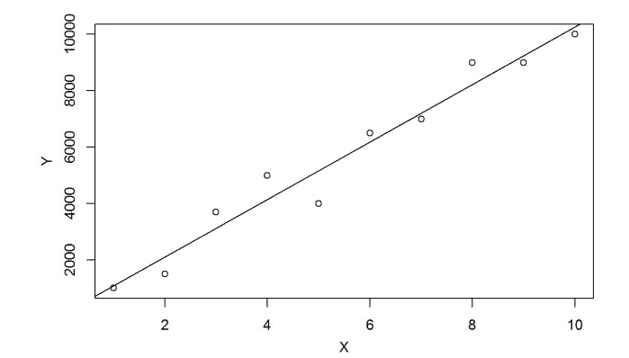

图 5.1 – 使用散点图绘制关系

*图 5.1* 显示了 *X* 和 *Y* 之间清晰的关系。随着 *X* 的增加，*Y* 也增加。在这种情况下，你可以这样说，这两个变量之间存在线性关系。请记住，散点图也可能捕捉到其他类型的关系，而不仅仅是线性关系。例如，也可能会在两个变量之间找到指数关系。

另一个很好的图表用于比较的是 **气泡图**。就像散点图一样，它也会显示变量之间的关系；然而，在这里，你可以使用第三个维度，它将由点的尺寸来表示。

*图 5.2* 是一个气泡图，它解释了一个投资方案，其中 *x* 轴是年利率，*y* 轴是投资期限，气泡的大小表示分配给每个投资选项的金额。

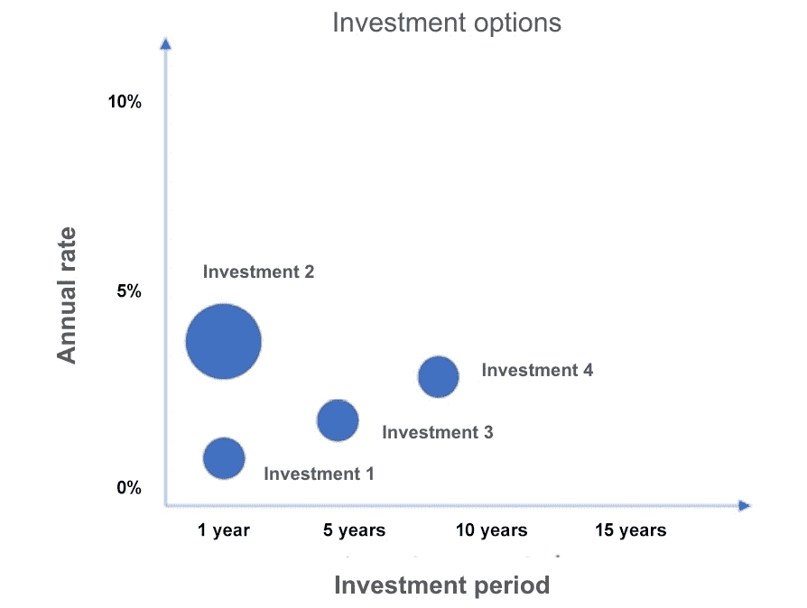

图 5.2 – 使用气泡图绘制关系

查看*图 5.2*，你可以看到两种类型的关系。第一种是年度率和投资期限之间的关系：投资期限越长，年度率越高。第二种是投资金额和年度率之间的关系：投资金额越高，年度率越高。正如你所看到的，这是一种非常有效的展示此类分析的方式。接下来，你将学习如何比较变量。

# 在你的数据中可视化比较

比较在数据分析中非常常见，并且有不同方式来展示它们。从**条形图**开始，你可能已经看到过许多使用这种可视化类型的报告。

条形图可以用来比较不同类别中的一个变量——例如，不同型号的汽车价格或按国家划分的人口规模。在*图 5.3*中，条形图用于分析截至 2020 年 4 月 7 日印度一系列地区的 COVID-19 阳性测试百分比。

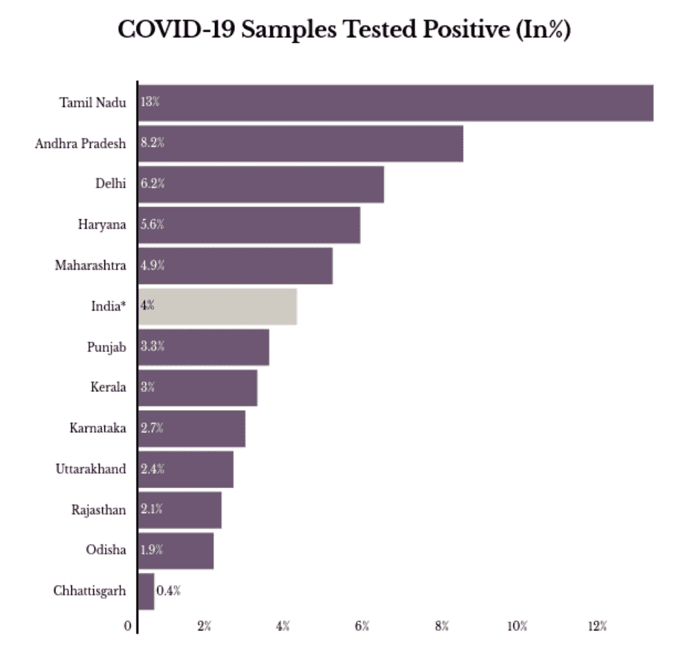

图 5.3 – 使用条形图进行对比（来源：印度国家卫生部门）

有时，你还可以使用**堆积柱状图**为正在分析的数据添加另一个维度。例如，*图 5.4*使用堆积条形图展示了根据性别在泰坦尼克号上的人数。此外，它还按性别细分了幸存者（正类）和未幸存者（负类）的人数。

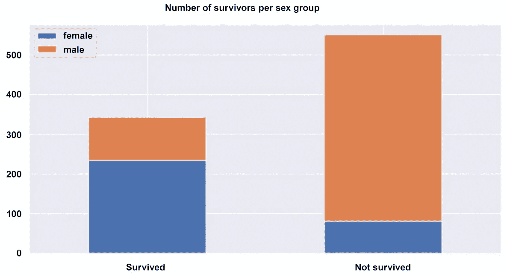

图 5.4 – 使用堆积条形图分析泰坦尼克号灾难数据集

如你所见，大多数女性在灾难中幸存，而大多数男性没有。堆积条形图帮助我们可视化了不同性别的命运差异。最后，你应该知道你还可以在那些堆积条形图上显示百分比，而不仅仅是绝对数字。

**柱状图**在需要比较不同时期的一个或两个变量时也非常有用。例如，在*图 5.5*中，你可以看到按省份划分的加拿大年度电动汽车销量。

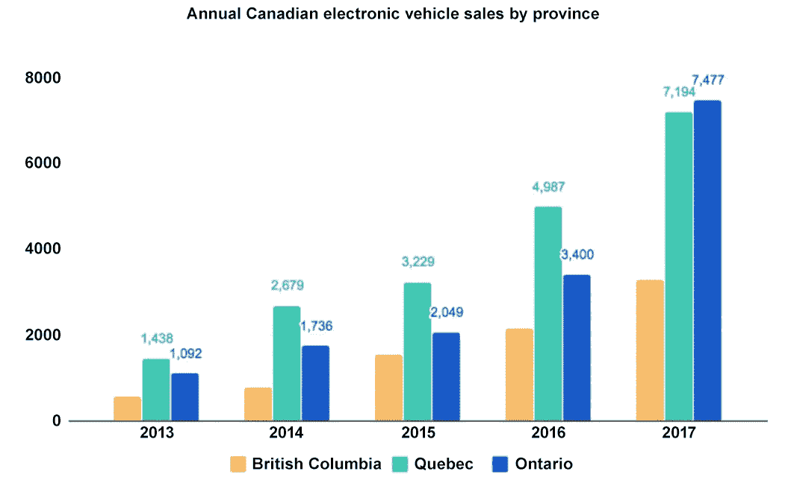

图 5.5 – 使用柱状图进行对比（来源：[`electrek.co/`](https://electrek.co/))

另一种在不同时期进行对比的非常有效的方法是使用**折线图**。*图 5.6*展示了如何在一个特定项目中，通过不同的发布日期比较不同算法的性能。

重要提示

折线图通常非常有帮助，可以指示在分析的时间段内数据是否存在任何趋势。折线图的一个非常常见的用途是预测，通常需要分析时间序列数据中的趋势和季节性。

例如，在*图 5.6*中，你可以看到**分类和回归树（CART）**模型与其他算法（如**AdaBoost（ADA）、梯度提升（GB）、随机森林（RF）和逻辑回归（LOGIT）**）相比，曾经是表现最差的模型。

然而，在七月，CART 模型得到了优化，结果证明它是所有其他模型中表现第三好的模型。每个时期最佳模型的全貌可以很容易地在*图 5.6*中看到。

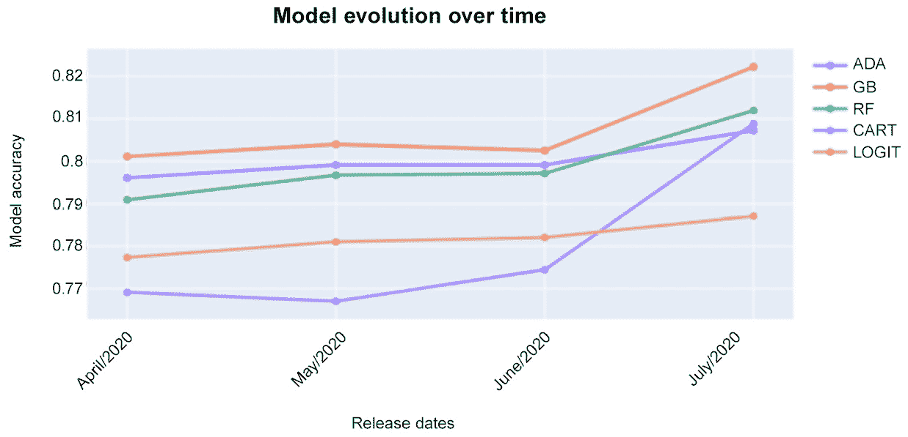

图 5.6 – 使用折线图进行绘图比较

最后，你也可以使用表格来展示你数据的比较。当你有多个维度（通常放在表格的行中）和一到多个指标进行比较时（通常放在表格的列中），表格更有用。

在下一节中，你将了解另一组旨在展示变量分布的图表。这组图表对于建模任务尤为重要，因为你必须知道特征的分布才能考虑潜在的数据转换。

# 在你的数据中可视化分布

探索你特征的分布对于理解其一些关键特征非常重要，例如其偏度、均值、中位数和分位数。你可以通过绘制直方图轻松地可视化偏度。这种类型的图表将你的数据分组到桶或桶中，并在其上执行计数。例如，*图 5.7*显示了*年龄*变量的直方图：

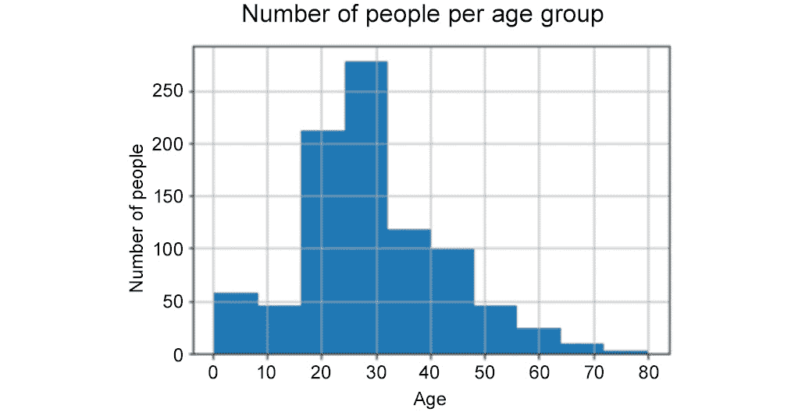

图 5.7 – 使用直方图绘制分布

通过观察直方图，你可以得出结论，大多数人年龄在 20 到 50 岁之间。你还可以看到一些超过 60 岁的人。另一个直方图的例子是*图 5.8*，它绘制了来自具有不同票价特定事件的支付分布。它的目的是分析人们为每张票支付多少钱。

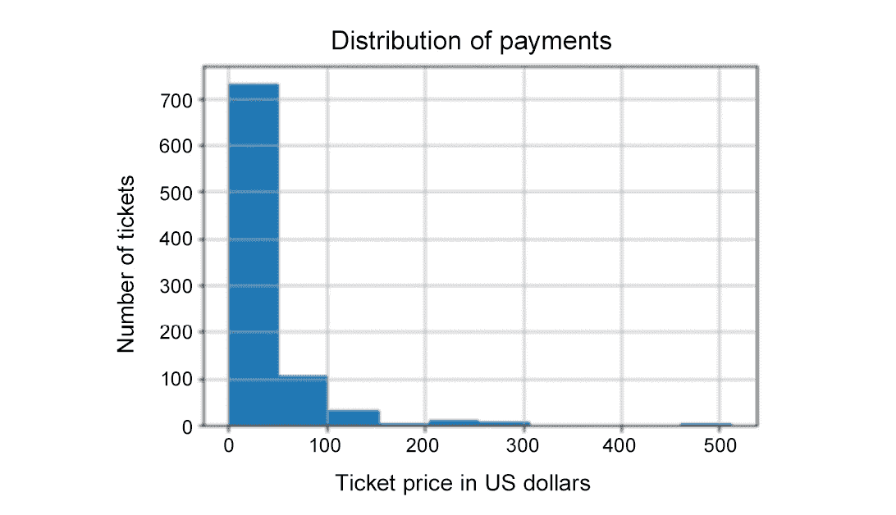

图 5.8 – 使用直方图检查偏度

在这里，你可以看到大多数人每张票支付最多 100 美元。这就是为什么你可以看到向右偏斜的分布（尾部）的原因。

如果你想要看到分布的其他特征，例如它的中位数、分位数和异常值，那么你应该使用箱线图。在*图 5.9*中，可以看到在给定数据集中不同算法的另一个性能比较。

这些算法在交叉验证过程中执行了多次，产生了同一算法的多个输出；例如，每个折叠上算法执行的每个准确度指标。

由于每个算法都有多个准确度指标，你可以使用箱线图来检查这些算法在交叉验证过程中的表现。

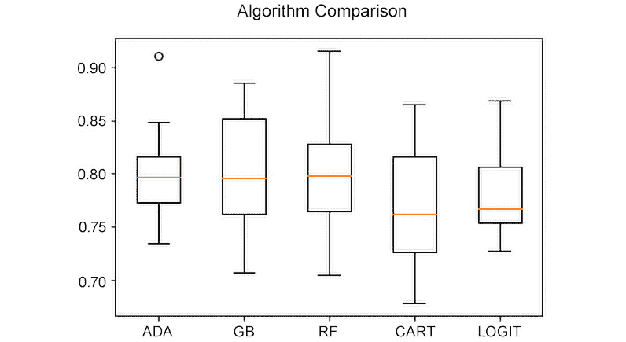

图 5.9 – 使用箱线图绘制分布

在这里，你可以看到箱线图可以展示一些关于数据分布的信息，例如它的中位数、下四分位数、上四分位数和异常值。为了完全理解箱线图的每个元素，请查看 *图 5.10*。

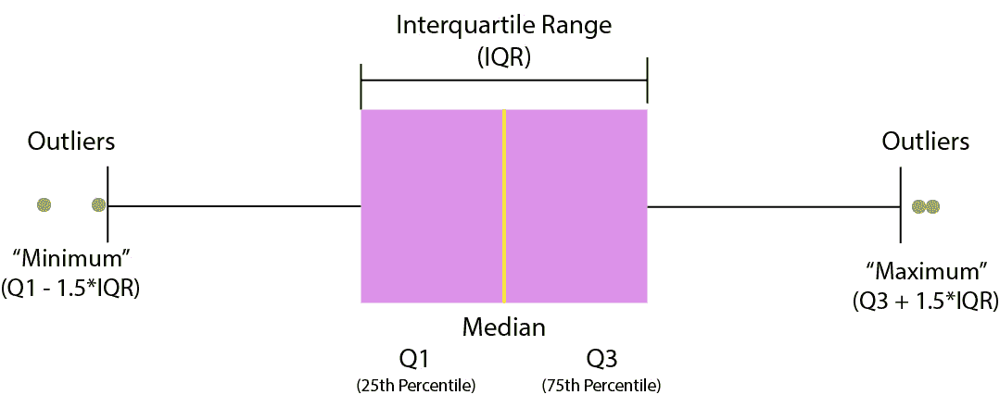

图 5.10 – 箱线图元素

通过分析 *图 5.9* 中显示的箱线图，你可以得出结论，ADA 算法在交叉验证过程中呈现了一些异常值，因为其中一个执行结果非常好（大约 92% 的准确率）。AdaBoost 的所有其他执行结果都低于 85% 的准确率，中位数约为 80%。

在分析 *图 5.9* 后，你可以得出另一个结论，即 CART 算法在交叉验证过程中表现最差（中位数和下四分位数最低）。

在你总结这一部分之前，请注意，你也可以使用散点图来分析当你有多个变量时的数据分布。接下来，你将查看另一组图表，这些图表对于展示数据中的组成非常有用。

# 可视化数据中的组成

有时，你想分析组成一个特征的各种元素——例如，每个地区的销售额百分比或每个渠道的查询百分比。在这两个例子中，它们没有考虑任何时间维度；相反，它们只是查看整个数据点。对于这些类型的组成，在没有时间维度的情况下，你可以使用**饼图、堆叠 100% 条形图和** **树状图**来展示你的数据。

*图 5.11* 是一个饼图，显示了在预定义时间段内每个客户渠道的查询数量。

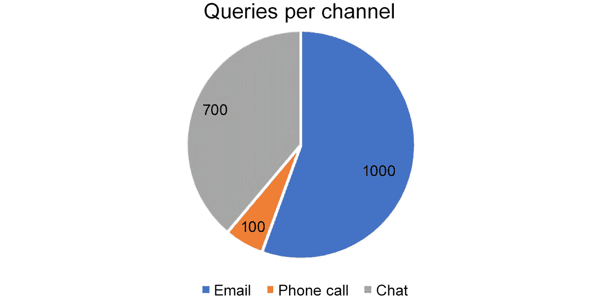

图 5.11 – 使用饼图绘制组成

如果你想在考虑时间维度的同时展示组成，那么你最常见的选项是**堆叠面积图、堆叠 100% 面积图、堆叠柱状图或堆叠 100% 柱状图**。为了参考，请查看 *图 5.12*，它显示了从 2016 年到 2020 年各地区的销售额。

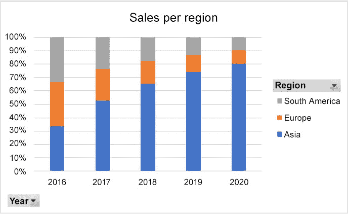

图 5.12 – 使用堆叠 100% 柱状图绘制组成

如你所见，堆叠 100% 柱状图帮助我们理解不同时间段的组成。

# 构建关键性能指标

在您完成这些数据可视化部分之前，您需要了解 **关键** **性能指标**，或简称 **KPI**。

KPI 通常是一个单一值，描述了业务指标的结果，例如客户流失率、**净推荐值 (NPS)**、投资回报率 (ROI) 等。尽管不同行业之间存在一些标准指标，但您通常需要根据公司的需求构建自定义指标。

实话实说，与指标相关的最复杂挑战并不在于其可视化本身，而在于它们是如何构建的（所使用的规则）以及它们将在公司不同层级之间如何被传达和使用。

从可视化角度来看，就像任何其他单一值一样，您可以使用您所了解的所有图表来分析您的指标，具体取决于您的需求。然而，如果您只想展示您的 KPI，没有时间维度，您可以使用一个 **小部件**。

好的，这些都是您在 AWS Certified Machine Learning – Specialty 考试中应该了解的数据可视化的重要主题。现在，让我们来看看 QuickSight，这是一个 AWS 服务，您可以在其中实现您刚刚学到的所有可视化技术。

# 介绍 QuickSight

Amazon QuickSight 是一种基于云的分析服务，允许您构建数据可视化和即席分析。QuickSight 支持多种数据源，例如 Redshift、Aurora、Athena、RDS 以及您本地的数据库解决方案。

其他数据源包括 S3，您可以从 Excel、CSV 或日志文件中检索数据，以及 **软件即服务 (SaaS)** 解决方案，您可以从 Salesforce 实体中检索数据。

Amazon QuickSight 有两个版本：

+   标准版

+   企业版

这两个版本之间最重要的区别是它们与 Microsoft **Active Directory (AD)** 的集成可能性以及静态加密。这两个功能仅在企业版中提供。

重要提示

请记住，AWS 服务不断演变，因此标准版和企业版之间可能在未来出现更多差异。您应始终查阅 AWS 服务的最新文档，以检查有什么新内容。

在访问管理方面，QuickSight 提供了一个非常简单的界面，您可以使用它来控制用户访问。在标准版中，您邀请用户加入 QuickSight 账户有两个主要选项：

+   您可以邀请 IAM 用户。

+   您可以向电子邮件地址发送邀请。

如果您邀请 IAM 用户，那么他们可以自动登录到您的账户并查看或编辑您的可视化，具体取决于您在 QuickSight 用户创建过程中提供的权限类型。如果您邀请了一个电子邮件地址，那么电子邮件的所有者必须访问他们的邮箱来完成此操作。

删除用户也是简单的。在删除用户时，您必须提供的额外信息是您是否希望将孤立的资源转移到您的账户中的另一个用户*或者*删除所有用户的资源。

如果您正在使用企业版，此过程授权用户可能会有所不同，因为您有 AD 在为您工作。在这种情况下，您可以授予 AD 组访问权限，并且来自这些组的所有用户都将获得对 QuickSight 账户的访问权限。

此外，请记住，在两个版本中，所有数据传输都是加密的；然而，您只能在企业版中找到静态加密。

当您将数据带入 QuickSight 时，您实际上在创建所谓的**数据集**。数据集反过来以优化的结构导入 QuickSight，称为**超级快速、并行、内存计算引擎（SPICE**）。这就是为什么 QuickSight 可以对大数据进行数据可视化。

最后，您应该知道 QuickSight 不仅允许您绘制数据，还可以执行一些小数据准备任务，例如重命名字段、计算新字段、更改数据类型、准备查询以从源检索数据以及连接来自同一源的数据表。

总结使用 QuickSight 的主要步骤：

1.  用户创建和授权。

1.  连接到**数据源**。

1.  将数据带入**数据集**。

1.  您的数据集将被导入到**SPICE**中。

1.  从数据集中，您可以创建一个**分析**。

1.  最后，在您的分析中，您可以添加**视觉元素**。

1.  如果您想更进一步，您可以创建分析快照并将其放置在**仪表板**中。或者，您可以将分析分组为**故事**。

这就带您结束了关于数据可视化的这一章！现在，花点时间回顾一下您所学的内容。

# 摘要

您在本章开始时学习了如何可视化数据中的关系。散点图和气泡图是这一类别中最重要的图表，分别用于展示两个或三个变量之间的关系。

然后，您转向了数据可视化的另一类别，其目的是在数据中进行比较。您可以使用最常见的图表来展示比较，如柱状图、条形图和折线图。表格也很有用，可以展示比较。

您接下来学习的是可视化数据分布。用于展示分布的最常见图表类型是直方图和箱线图。

然后，你转向了组合。当你想要展示构成数据的不同元素时，你可以使用这组图表。在展示组合时，你必须意识到你想要展示的是静态数据还是随时间变化的数据。对于静态数据，你应该使用饼图、堆叠的 100% 柱状图或树状图。对于随时间变化的数据，你应该使用堆叠面积图、堆叠 100% 面积图、堆叠柱状图或堆叠 100% 柱状图。

本章的最后部分是为 QuickSight 保留的，QuickSight 是一种 AWS 服务，你可以使用它来可视化你的数据。你了解了服务的不同版本和功能，然后介绍了 SPICE。

干得好！在下一章中，你将学习机器学习算法。这将是你认证旅程中非常重要的一章，所以请确保你已经准备好了！然而，在你跳入新章节之前，花点时间再为考试练习一下！

# 考试准备练习 – 章节复习题

除了对关键概念有扎实的理解外，能够在时间压力下快速思考是一项帮助你通过认证考试的关键技能。这就是为什么在学习的早期阶段就培养这些技能至关重要。

章节复习题旨在随着你学习并复习每一章的内容，逐步提高你的应试技巧，同时复习章节中关键概念的理解。你可以在每个章节的末尾找到这些复习题。

如何访问这些资源

要了解如何访问这些资源，请转到名为*第十一章*的章节，*访问在线练习资源*。

要打开本章的章节复习题，请执行以下步骤：

1.  点击链接 – [`packt.link/MLSC01E2_CH05`](https://packt.link/MLSC01E2_CH05)。

    或者，你可以扫描以下**二维码**（*图 5.13*）：

图 5.13 – 为登录用户打开章节复习题的二维码

1.  一旦登录，你会看到一个类似于 *图 5.14* 所示的页面：

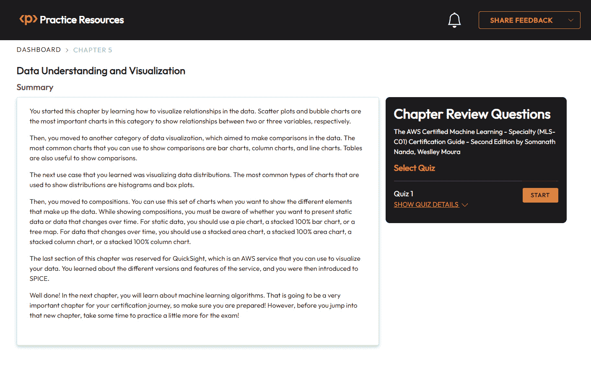

图 5.14 – 第五章的章节复习题

1.  准备就绪后，开始以下练习，多次尝试测验。

## 考试准备练习

对于前三次尝试，不要担心时间限制。

### 尝试 1

第一次，目标至少达到 **40%**。看看你答错的答案，并再次阅读章节中相关的部分，以填补你的学习差距。

### 尝试 2

第二次，目标至少达到 **60%**。看看你答错的答案，并再次阅读章节中相关的部分，以填补任何剩余的学习差距。

### 尝试 3

第三次尝试，目标至少达到**75%**。一旦得分达到 75% 或更高，你就可以开始练习时间管理。

小贴士

你可能需要超过**三次**尝试才能达到 75%。这没关系。只需复习章节中的相关部分，直到你达到目标。

# 练习时间管理

目标：你的目标是保持分数不变，同时尽可能快地回答这些问题。以下是你下一次尝试的示例：

| **尝试** | **分数** | **用时** |
| --- | --- | --- |
| 尝试 5 | 77% | 21 分 30 秒 |
| 尝试 6 | 78% | 18 分 34 秒 |
| 尝试 7 | 76% | 14 分 44 秒 |

表 5.1 – 在线平台上的样本时间练习

注意

上表中显示的时间限制只是示例。根据网站上的测验时间限制，为每次尝试设定自己的时间限制。

每次新的尝试，你的分数应该保持在**75%**以上，而完成所需的时间应该“减少”。重复尽可能多的尝试，直到你觉得自己能够应对时间压力。
