# 6

# 应用机器学习算法

在上一章中，你学习了关于数据理解和可视化的知识。现在是时候进入建模阶段，研究机器学习算法了！在早期章节中，你了解到构建机器学习模型需要大量关于 AWS 服务、数据工程、数据探索、数据架构等方面的知识。这次，你将更深入地研究已经介绍过的算法以及更多内容。

对不同类型算法和机器学习方法的良好理解将使你在项目决策中处于非常有利的地位。当然，这种知识对于 AWS 认证机器学习专业考试也是至关重要的。

请记住，有数千种算法存在。你甚至可以为特定问题提出自己的算法。在本章中，你将了解最相关的算法，并希望这些算法你可能在考试中遇到。

本章的主要内容包括以下几方面：

+   存储训练数据

+   关于集成模型的说明

+   监督学习：

+   回归模型

+   分类模型

+   预测模型

+   Object2Vec

+   无监督学习：

+   聚类

+   异常检测

+   维度约简

+   IP 洞察

+   文本分析（自然语言处理）

+   图像处理

+   强化学习

好的，拿杯咖啡，享受这个过程吧！

# 介绍本章

在本章中，你将了解几种算法、建模概念和学习策略。所有这些话题对于你在考试和作为数据科学家职业生涯中的知识都是有益的。

本章的结构不仅涵盖了考试所需的必要主题，还让你对最重要的学习策略有一个很好的了解。例如，考试将检查你对 K-Means 基本概念的了解。然而，本章将更深入地探讨这一点，因为这对于你作为数据科学家的职业生涯来说是一个重要的话题。

本章将采用深入探讨某些类型模型算法逻辑的方法，这些模型是每位数据科学家都应该掌握的。此外，请记住：有时你可能需要比考试预期更深入地学习，但这对你职业生涯来说将极其重要。

在本章中，你将多次看到术语**内置算法**。这个术语将用来指代 AWS 在他们的 SageMaker SDK 中实现的算法列表。

这里有一个具体的例子：你可以使用 scikit-learn 的**K 最近邻**算法，或简称 KNN（如果你不记得 scikit-learn 是什么，可以通过回到*第一章**“机器学习基础”来刷新你的记忆）来创建一个分类模型并将其部署到 SageMaker。然而，AWS 也在其 SDK 中提供了 KNN 算法的自己的实现，该实现针对 AWS 环境进行了优化。在这里，KNN 是一个内置算法的例子。

在 AWS 上的可能性是无限的，因为你可以利用内置算法，或者引入你自己的算法来在 SageMaker 上创建模型。最后，为了使这一点非常清楚，这里有一个从 AWS SDK 导入内置算法的例子：

```py
import sagemaker
```

```py
knn = sagemaker.estimator.Estimator(get_image_uri(boto3.Session().region_name, "knn"),
```

```py
        get_execution_role(),
```

```py
        train_instance_count=1,
```

```py
        train_instance_type='ml.m5.2xlarge',
```

```py
        output_path=output_path,
```

```py
        sagemaker_session=sagemaker.Session())
```

```py
knn.set_hyperparameters(**hyperparams)
```

你将在*第九章**“Amazon SageMaker 建模”中学习如何在 SageMaker 上创建模型。目前，你只需了解 AWS 有一套自己的库，其中实现了这些内置算法。

要训练和评估一个模型，你需要训练数据和测试数据。在实例化你的估计器之后，你应该用这些数据集来喂养它。不要破坏*第九章**“Amazon SageMaker 建模”，但你应该提前了解**数据通道**的概念。

数据通道是与输入数据相关的配置，你可以在创建训练作业时将其传递给 SageMaker。你应该设置这些配置，只是为了通知 SageMaker 你的输入数据是如何格式化的。

在*第九章**“Amazon SageMaker 建模”中，你将学习如何创建训练作业以及如何设置数据通道。到目前为止，你应该知道在配置数据通道时，你可以设置一个`ContentType`和一个`TrainingInputMode`。现在，你将更详细地了解训练数据应该如何存储，以便能够与 AWS 的内置算法正确集成。

# 存储训练数据

首先，你可以使用多个 AWS 服务来准备机器学习的数据，例如**弹性映射减少（EMR）**，Redshift，Glue 等。在预处理训练数据后，你应该将其存储在 S3 中，以算法期望的格式存储。*表 6.1*显示了每个算法可接受的数据格式列表。

| **数据格式** | **算法** |
| --- | --- |
| `Application/x-image` | 目标检测算法，语义分割 |
| `Application/x-recordio` | 目标检测算法 |
| `Application/x-recordio-protobuf` | 因子分解机，K-Means，KNN，潜在狄利克雷分配，线性学习器，NTM，PCA，RCF，序列到序列 |
| `Application/jsonlines` | BlazingText, DeepAR |
| `Image/.jpeg` | 目标检测算法，语义分割 |
| `Image/.png` | 目标检测算法，语义分割 |
| `Text/.csv` | IP Insights, K-Means, KNN, 潜在狄利克雷分配，线性学习器，NTM，PCA，RCF，XGBoost |
| `Text/.libsvm` | XGBoost |

表 6.1 – AWS 算法可接受的每种数据格式

如你所见，许多算法接受`Text/.csv`格式。如果你想使用该格式，你应该遵循以下规则：

+   你的 CSV 文件*不能*有标题记录。

+   对于监督学习，目标变量必须在第一列。

+   在配置训练管道时，将输入数据通道设置为`content_type`等于`text/csv`。

+   对于无监督学习，在`content_type`中设置`label_size`，如下所示：`'content_type=text/csv;label_size=0'`。

虽然对于许多用例来说，`text/.csv`格式是可行的，但大多数情况下，AWS 的内置算法与`recordIO-protobuf`配合得更好。这是一种用于训练 AWS 内置算法的优化数据格式，其中 SageMaker 将数据集中的每个观测值转换为二进制表示，即一组 4 字节的浮点数。

RecordIO-protobuf 接受两种输入模式：管道模式和文件模式。在管道模式下，数据将直接从 S3 流式传输，这有助于优化存储。在文件模式下，数据将从 S3 复制到训练实例的存储卷中。

你几乎准备好了！现在你可以快速查看一些建模定义，这将帮助你理解一些更高级的算法。

# 关于集成模型的一些话

在你开始深入研究算法之前，有一个重要的建模概念你应该了解——**集成**。集成这个术语用来描述使用多个算法来创建模型的方法。

一个不实现集成方法的常规算法将依赖于单个模型来训练和预测目标变量。这就是当你创建决策树或回归模型时发生的情况。另一方面，实现集成方法的算法将依赖于多个模型来预测目标变量。在这种情况下，由于每个模型可能会对目标变量提出不同的预测，集成算法实现了一个投票系统（用于分类模型）或平均系统（用于回归模型）来输出最终结果。*表 6.2*展示了由三个模型组成的集成算法的一个非常简单的投票系统。

| **交易** | **模型 A** | **模型 B** | **模型 C** | **预测** |
| --- | --- | --- | --- | --- |
| 1 | 欺诈 | 欺诈 | 非欺诈 | 欺诈 |
| 2 | 非欺诈 | 非欺诈 | 非欺诈 | 非欺诈 |
| 3 | 欺诈 | 欺诈 | 欺诈 | 欺诈 |
| 4 | 非欺诈 | 非欺诈 | 欺诈 | 非欺诈 |

表 6.2 – 集成方法中投票系统的一个示例

如前所述，同样的方法也适用于回归问题，其中不是投票，而是可以平均每个模型的预测结果，并使用该结果作为输出。

投票和平均只是集成方法的两个例子。其他强大的技术包括混合和堆叠，其中你可以创建多个模型，并将每个模型的输出作为主模型的特征。回顾一下 *表 6.2*，*模型 A*、*模型 B* 和 *模型 C* 的列可以用作预测最终结果的特性。

结果表明，许多机器学习算法在训练过程中使用集成方法，以嵌入式的方式。这些算法可以分为两大类：

+   **自助聚合** 或 **袋装法**：这种方法中，在数据的不同样本上训练多个模型。然后，通过投票或平均系统进行预测。这个类别中最受欢迎的算法被称为 **随机森林**。

+   **提升法**：这种方法中，在数据的不同样本上训练多个模型。然后，一个模型试图通过惩罚错误预测来纠正下一个模型的错误。这个类别中最受欢迎的算法是 **随机梯度提升** 和 **AdaBoost**。

现在你已经了解了集成模型，你可以看看一些可能出现在你的考试中的机器学习算法。并非所有这些算法都使用集成方法。

下几节将根据 AWS 算法类别进行划分，如下所示：

+   监督学习

+   无监督学习

+   文本分析

+   图像处理

最后，你将了解 AWS 上的强化学习概述。

# 监督学习

AWS 为通用目的（回归和分类任务）和更具体的目的（预测和向量化）提供了监督学习算法。以下是在这些子类别中可以找到的内置算法列表：

+   线性学习算法

+   因子分解机算法

+   XGBoost 算法

+   KNN 算法

+   Object2Vec 算法

+   DeepAR 预测算法

你将首先学习关于回归模型和线性学习算法。

## 与回归模型一起工作

查看 **线性回归** 模型是理解一般回归模型（线性回归和非线性回归模型）内部情况的好方法。这是每位数据科学家必备的知识，也能帮助你解决实际问题。你将在接下来的小节中对此进行更深入的了解。

### 介绍回归算法

线性回归模型旨在根据一个或多个变量（*x*）预测一个数值（*y*）。从数学上讲，这种关系可以定义为 *y = f(x)*，其中 *y* 被称为 **因变量**，*x* 被称为 **自变量**。

在回归模型中，你想要预测的组成部分（*y*）始终是一个连续的数字——例如，房屋价格或交易数量。你在*第一章**，机器学习基础*，*图 1**.2 中看到了这一点，当你学习关于给定目标变量的正确监督学习算法时。请随时回去复习。

当你只用一个变量来预测*y*时，这个问题被称为**简单线性回归**。另一方面，当你使用多个变量来预测*y*时，你面临的是一个**多元线性****回归**问题。

此外，还有一种被称为**非线性回归**的回归模型类别。然而，让我们暂时将其放在一边，先来理解一下简单线性回归的含义。

回归模型属于机器学习的监督方面（另一方面是非监督），因为算法试图根据独立变量和依赖变量之间的现有相关性来预测值。

但在*y=f(x)*中，*f*代表什么？在这里，*f*是负责根据*x*预测*y*的回归函数。换句话说，这就是你想要找到的函数。在谈论简单线性回归时，请注意以下三个问题和答案：

+   线性回归中*f*的形状是什么？

    当然是线性的！

+   你如何表示线性关系？

    使用一条*直线*（你将在几分钟内理解原因）。

+   那么，定义一条线的函数是什么？

    *ax + b*（只需查看任何一本*数学*书）。

就这些了！线性回归模型由*y = ax + b*给出。当你试图根据*x*预测*y*时，你只需要找出*a*和*b*的值。你可以采用相同的逻辑来了解其他类型回归内部的情况。

找出*a*和*b*的值是你唯一要做的事情。值得知道的是，*a*也被称为**alpha 系数**，或**斜率**，表示线的倾斜度，而*b*也被称为**beta 系数**，或**y 截距**，表示线与*y*轴交叉的位置（进入由*x*和*y*组成的二维平面）。你将在下一小节中了解这两个术语。

还有一个值得知道的事实，每个你无法控制的预测因子都存在一个偏差（*e*）。换句话说，简单线性回归的正式定义是*y = ax + b +* *e*。

在下一小节中，你将学习如何找到 alpha 和 beta 来解决简单线性回归问题。

### 最小二乘法

有不同的方法来找到直线的斜率和*y*截距，但最常用的方法是**最小二乘法**。这个方法背后的原理很简单：你必须找到一条*最佳线*，以减少*平方误差*的总和。

在*图 6*.1 中，你可以看到一个带有多个点和线的笛卡尔平面。*线 a*代表这些数据点的最佳拟合线——换句话说，那将是这些点的最佳线性回归函数。但你怎么知道呢？很简单：如果你计算每个点的误差，你就会发现*线 a*包含了最小的平方误差总和。

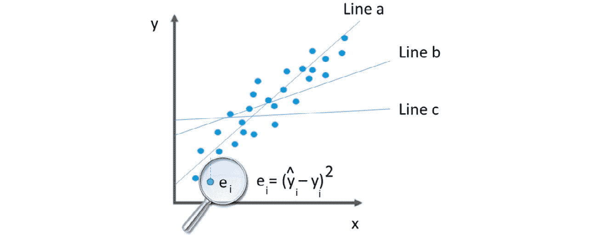

图 6.1 – 最小二乘法原理的可视化

从零开始理解线性回归不仅对认证考试很重要，而且对你的数据科学家职业生涯也至关重要。为了提供一个完整的示例，已经开发了一个包含你将要看到的全部计算的电子表格！鼓励你利用这份辅助材料进行一些模拟。无论如何，你将在下一小节中看到这些计算的实际应用。

### 从零开始创建线性回归模型

你将使用一个非常简单的数据集，其中只有两个变量：

+   *x*：代表一个人的工作年限

+   *y*：代表一个人的平均工资

你想要了解*x*和*y*之间的关系，如果可能的话，根据工作经验*x*预测工资(*y*)。现实问题通常有更多的独立变量，并且不一定呈线性。然而，这个例子将为你掌握更复杂的算法提供基础知识。

要找出 alpha 和 beta 系数（或者如果你更喜欢，斜率和*y*截距），你需要找到与数据集相关的某些统计信息。在*表 6.3*中，你有数据以及这些辅助统计信息。

| **X (****独立变量)** | **Y (****依赖变量)** | **X 平均值** | **Y 平均值** | **协方差  (****X,Y)** | **X 方差** | **Y 方差** |
| --- | --- | --- | --- | --- | --- | --- |
| *1* | *1.000* |  |  | 21.015 | 20 | 21.808.900 |
| *2* | *1.500* |  |  | 14.595 | 12 | 17.388.900 |
| *3* | *3.700* |  |  | 4.925 | 6 | 3.880.900 |
| *4* | *5.000* |  |  | 1.005 | 2 | 448.900 |
| *5* | *4.000* |  |  | 835 | 0 | 2.788.900 |
| *6* | *6.500* |  |  | 415 | 0 | 688.900 |
| *7* | *7.000* |  |  | 1.995 | 2 | 1.768.900 |
| *8* | *9.000* |  |  | 8.325 | 6 | 11.088.900 |
| *9* | *9.000* |  |  | 11.655 | 12 | 11.088.900 |
| *10* | *10.000* |  |  | 19.485 | 20 | 18.748.900 |
| COUNT | 10 | **5,50** | **5.670,00** | **8.425,00** | **8,25** | **8.970.100,00** |

表 6.3 – 基于工作经验预测平均工资的数据集

如你所见，*x* 和 *y* 之间存在几乎完美的线性关系。随着工作经验的增加，工资也随之增加。除了 *x* 和 *y*，你还需要计算以下统计量：记录数、*x* 的平均值、*y* 的平均值、*x* 和 *y* 的协方差、*x* 的方差和 *y* 的方差。*图 6.2* 描述了提供方差和协方差（分别）的数学表示的公式，其中 *x bar*、*y bar* 和 *n* 分别代表 *x* 的平均值、*y* 的平均值和记录数：


图 6.2 – 方差和协方差的数学表示

如果你想检查 *表 6.2* 中那些辅助统计量的公式的计算细节，请参阅本书附带的支持材料。在那里，你会发现这些公式已经为你实现了。

这些统计量很重要，因为它们将被用来计算 alpha 和 beta 系数。*图 6.3* 解释了如何计算这两个系数，以及相关系数 R 和 R 平方。这两个指标将给你一个关于模型质量的概念，它们越接近 1，模型就越好。

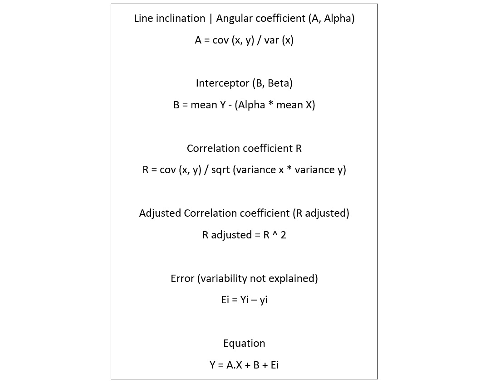

图 6.3 – 计算简单线性回归系数的方程

应用这些公式后，你将得到 *表 6.4* 中所示的结果。它已经包含了你所需的所有信息，以便在新的数据上做出预测。如果你将系数替换到原始方程 *y = ax + b + e* 中，你会发现回归公式如下：*y = 1021.212 * x + 53.3*。

| **系数** | **描述** | **值** |
| --- | --- | --- |
| Alpha | 线性斜率 | 1,021,212,121 |
| Beta | 截距 | 53 |
| R | 相关系数 | 0,979,364,354 |
| R² | 决定系数 | 0,959,154,538 |

表 6.4 – 求回归系数

从现在开始，为了进行预测，你只需要将 *x* 替换为工作经验的年数。结果，你会发现 *y*，即预测的工资。你可以在 *图 6.4* 中看到模型拟合，以及在 *表 6.5* 中的一些模型预测。

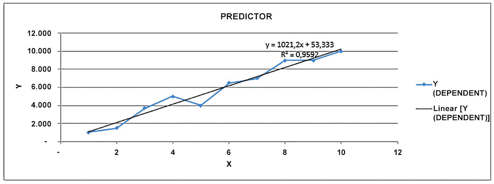

图 6.4 – 回归方程中的拟合数据

| **输入** | **预测** | **误差** |
| --- | --- | --- |
| 1 | 1.075 | 75 |
| 2 | 2.096 | 596 |
| 3 | 3.117 | - 583 |
| 4 | 4.138 | - 862 |
| 5 | 5.159 | 1.159 |
| 6 | 6.181 | - 319 |
| 7 | 7.202 | 202 |
| 8 | 8.223 | - 777 |
| 9 | 9.244 | 244 |
| 10 | 10.265 | 265 |
| 11 | 11.287 |  |
| 12 | 12.308 |  |
| 13 | 13.329 |  |
| 14 | 14.350 |  |
| 15 | 15.372 |  |
| 16 | 16.393 |  |
| 17 | 17.414 |  |
| 18 | 18.435 |  |
| 19 | 19.456 |  |
| 20 | 20.478 |  |

表 6.5 – 模型预测

当你分析回归模型时，你应该能够知道你的模型是否质量良好。你在*第一章**机器学习基础*中了解到许多建模问题（例如过拟合），并且你已经知道你总是要检查模型性能。

回归模型的一个良好方法是进行所谓的残差分析。这就是你在散点图上绘制模型的误差，并检查它们是否随机分布（如预期的那样）或不随机分布。如果误差不是随机分布的，这意味着你的模型无法泛化数据。"图 6.5**.5*"显示了基于"表 6.5"数据的残差分析。

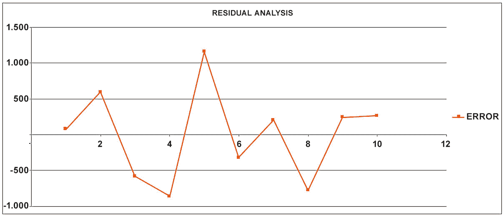

图 6.5 – 残差分析

这里的要点是误差是随机分布的。这样的证据，加上高 R 平方评分，可以用作支持使用此模型的论据。

重要提示

在*第七章**评估和优化模型*中，你将了解评估指标。例如，你将了解到每种类型的模型可能都有自己的评估指标集。回归模型通常使用**均方误差（MSE）**和**均方根误差（RMSE）**进行评估。换句话说，除了 R、R 平方和残差分析之外，理想情况下，你将在测试集上执行你的模型以提取其他性能指标。你甚至可以使用交叉验证系统来检查模型性能，正如你在*第一章**机器学习基础*中学到的。

非常常见的是，当模型残差确实呈现模式并且不是随机分布时，这是因为数据中现有的关系不是线性的，而是非线性的，因此必须应用另一种建模技术。在下一小节中，你将学习如何解释回归模型。

### 解释回归模型

了解如何解释线性回归模型也是很好的。有时，你使用线性回归不一定是为了创建预测模型，而是为了进行回归分析。然后你可以使用回归分析来理解自变量和因变量之间的关系。

回顾回归方程（*y = 1021.212 * x + 53.30*），你可以看到两个术语：alpha 或斜率（*1021.20*）和 beta 或*y*截距（*53.3*）。你可以这样解释这个模型：*对于每增加一年工作经验，你的薪水将增加 1,021.20 美元*。此外，请注意，当“工作经验年数”等于 0 时，预期的薪水将是 53.30 美元（这是直线与*y*轴相交的点）。

从一个更广泛的角度来看，你的回归分析应该回答以下问题：对于每个添加到自变量（斜率）的额外单位，因变量的平均变化是多少？

### 检查调整后的 R 平方

在这个阶段，你对回归模型有了更深入的了解！还有一个非常重要的主题你应该知道，无论它是否会在考试中出现，那就是你模型的经济性方面。

你已经在*第一章**，机器学习基础*中听说过经济性。这是优先考虑简单模型而不是复杂模型的能力。在研究回归模型时，你可能需要使用多个特征来预测你的结果。这也被称为多元回归模型。

在这种情况下，R 和 R 平方系数往往会奖励具有更多特征的更复杂模型。换句话说，如果你继续向多元回归模型添加新特征，你会得到更高的 R 和 R 平方系数。这就是为什么你不能仅仅基于这两个指标来做决定。

你可以使用的一个额外指标（除了 R、R 平方、MSE 和 RMSE 之外）被称为**调整后的 R 平方**。当你向模型添加不带来任何实际价值的额外特征时，这个指标会受到惩罚。在*表 6.6*中，你可以看到模型开始失去经济性。

| **特征** **数量** | **R 平方** | **调整后的 R 平方** |
| --- | --- | --- |
| 1 | 81 | 79 |
| 2 | 83 | 82 |
| 3 | 88 | 87 |
| 4 | 90 | 86 |
| 5 | 92 | 85 |

表 6.6 – 比较 R 平方和调整后的 R 平方

在这里，你可以得出结论，保持模型中的三个变量比保持四个或五个更好。向模型中添加四个或五个变量会增加 R 平方（正如预期的那样），但会降低调整后的 R 平方。

到目前为止，你应该对回归模型有了很好的理解。现在，让我们看看 AWS 为这类模型提供的内置算法有哪些。

### AWS 上的回归建模

AWS 有一个内置算法称为**线性学习器**，你可以用它来实现线性回归模型。内置的线性学习器使用**随机梯度下降（SGD）**来训练模型。

重要提示

当讨论神经网络时，你将了解更多关于 SGD 的内容。现在，你可以将 SGD 视为之前讨论的流行的最小二乘误差方法的替代方案。

内置的线性学习器算法提供了一个超参数，可以在训练过程之前对数据进行归一化。这个超参数的名称是`normalize_data`。这非常有帮助，因为线性模型对数据的规模很敏感，通常利用数据归一化。

重要提示

在*第四章**，数据准备和转换*中讨论了数据归一化。如果你需要，请回顾该章节。

线性学习器算法的一些其他重要超参数是**L1**和**wd**，分别扮演**L1 正则化**和**L2 正则化**的角色。

L1 和 L2 正则化有助于线性学习器（或任何其他回归算法实现）避免过度拟合。传统上，实现 L1 正则化的回归模型被称为**lasso 回归**模型，而具有 L2 正则化的回归模型被称为**岭回归**模型。

虽然这可能听起来很复杂，但实际上并不复杂！回归模型方程仍然是相同的：*y = ax + b + e*。变化在于损失函数，它用于找到最佳最小化误差的系数。如果你回顾*图 6.1*，你会看到误差函数被定义为*e = (ŷ - y)²*，其中*ŷ*是回归函数值，*y*是真实值。

L1 和 L2 正则化将惩罚项添加到损失函数中，如*图 6.6*中的公式所示（注意你正在用*ax + b*替换*ŷ*）：


图 6.6 – L1 和 L2 正则化

λ（lambda）参数必须大于 0，并且需要手动调整。一个非常高的λ值可能会导致欠拟合问题，而一个非常低的λ值可能不会导致最终结果有显著的变化（如果你的模型已经过度拟合，它将保持过度拟合）。

在实际应用中，L1 正则化和 L2 正则化之间的主要区别在于，L1 会将不那么重要的系数缩小到 0，这将迫使特征被删除（充当特征选择器）。换句话说，如果你的模型因为特征数量过多而过度拟合，L1 正则化应该能帮助你解决这个问题。

重要提示

在考试期间，记住 L1 和 L2 正则化的基础，特别是它们之间的关键区别，其中 L1 作为一个特征选择器效果很好。

最后，许多内置算法可以服务于多种建模目的。线性学习器算法可以用于回归、二分类和多分类。确保你在考试中记住这一点（这不仅仅是关于回归模型）。

AWS 有其他内置算法适用于回归和分类问题——那就是**分解机、KNN**和**XGBoost**算法。由于这些算法也可以用于分类目的，这些内容将在关于分类算法的章节中介绍。

重要提示

你在考试期间需要记住一个非常重要的提示：线性学习器、分解机、KNN 和 XGBoost 算法都适用于回归和分类问题。这些算法通常被称为通用算法。

有了这些，您已经到达了关于回归模型的这一节结束。记得在考试前查看相关材料。您也可以在日常工作时使用参考材料！现在，让我们继续探讨另一个经典的机器学习问题示例：分类模型。

## 与分类模型一起工作

您在本章中一直在学习什么是分类模型。然而，现在，您将查看一些适合分类问题的算法。请记住，有数百种分类算法，但由于您正在为 AWS 认证机器学习专业考试做准备，所以将涵盖 AWS 预先构建的算法。

您将从**因子机**开始。因子机被认为是线性学习算法的扩展，优化以在具有高维稀疏数据集的特征之间找到关系。

重要提示

因子机的一个非常传统的用例是*推荐系统*，其中数据通常具有很高的稀疏度。在考试中，如果您面临一个通用问题（无论是回归还是二分类任务），其中基础数据集是稀疏的，那么从算法角度来看，因子机可能是最好的答案。

当您在回归模型中使用因子机时，将使用 RMSE 来评估模型。另一方面，在二分类模式下，算法将使用对数损失、准确率和 F1 分数来评估结果。关于评估指标的更深入讨论将在*第七章**，评估和优化模型*中提供。

您应该知道，因子机只接受`text/.csv`格式的输入数据。

适用于分类问题的下一个内置算法被称为 K 最近邻，简称 KNN。正如其名所示，此算法将尝试找到输入数据最近的*K*个点，并返回以下预测之一：

+   如果是一个分类任务，则*K*个最近点的最频繁出现的类别

+   如果是一个回归任务，则标签为*K*个最近点的平均值

KNN 是一个**基于索引的算法**，因为它计算点之间的距离，为这些点分配索引，然后存储排序后的距离及其索引。有了这种类型的数据结构，KNN 可以轻松选择最接近的*K*个点来做出最终预测。请注意，*K*是 KNN 的超参数，应在建模过程中进行优化。

另一个适用于通用目的的 AWS 内置算法，包括分类，被称为**极端梯度提升**，简称**XGBoost**。这是一个基于集成和决策树的模型。

XGBoost 使用一组**较弱的**模型（决策树）来预测目标变量，这可以是回归任务、二分类或多分类。这是一个非常流行的算法，并且已经被顶尖选手在机器学习竞赛中使用。

XGBoost 使用提升学习策略，其中一个模型试图纠正先前模型的错误。它被称为“梯度”是因为它使用梯度下降算法在添加新树时最小化损失。

重要提示

在这个上下文中，术语*较弱*用来描述非常简单的决策树。

虽然 XGBoost 比单个决策树更稳健，但在考试中，对决策树及其主要配置有清晰的理解是非常重要的。顺便说一下，它们是许多集成算法（如 AdaBoost、随机森林、梯度提升和 XGBoost）的基础模型。

决策树是基于规则的算法，以树的形式组织决策，如图*图 6.7*所示。

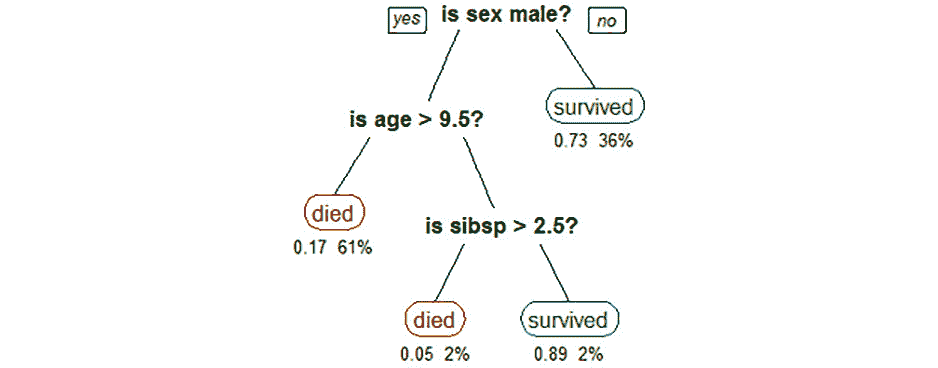

图 6.7 – 决策树模型示例

它们由根节点（位于树的顶部）、中间或决策节点（位于树的中间）和叶节点（底部节点，没有分割）组成。树的深度由根节点和最后一个叶节点之间的差异给出。例如，在*图 6.7*中，树的深度是 3。

树的深度是这类模型最重要的超参数之一，通常被称为**最大深度**。换句话说，最大深度控制了决策树可以达到的最大深度。

决策树模型的另一个非常重要的超参数是叶节点中的最小样本/观察数。它也用于控制树的生长。

决策树有许多其他类型的超参数，但这两个对于控制模型过拟合尤为重要。深度较高或叶节点中观察数非常少的决策树在预测/外推过程中可能会遇到问题。

这是因为决策树使用叶节点中的数据来做出预测，基于属于该节点的每个观察/目标变量的比例（对于分类任务）或平均值（对于回归任务）。因此，节点应该有足够的数据来在训练集之外做出良好的预测。

如果你在考试中遇到**CART**这个术语，你应该知道它代表**分类和回归树**，因为决策树可以用于分类和回归任务。

为了选择在树中分割数据的最佳变量，模型将选择那些最大化节点间目标变量分离的变量。这项任务可以通过不同的方法完成，例如**基尼系数**和**信息增益**。

## 预测模型

时间序列是指按一定规律收集的具有序列依赖性的数据点。时间序列具有度量、事实和时间单位，如图*图 6*。8*所示。


图 6.8 – 时间序列陈述

此外，时间序列还可以被分类为**单变量**或**多变量**。单变量时间序列在一段时间内只包含一个变量，而多变量时间序列在一段时间内包含两个或更多变量。*图 6*。9*显示了单变量时间序列。

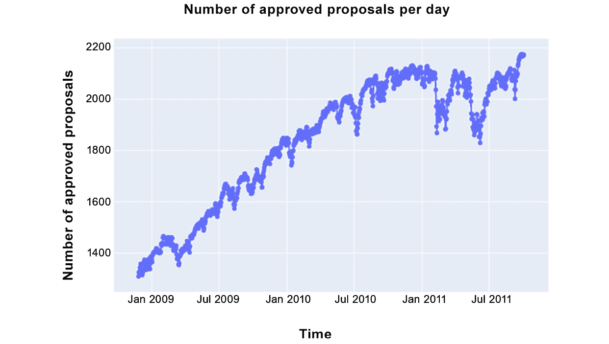

图 6.9 – 时间序列示例

时间序列可以按以下方式分解：

+   **观察值**或**水平**：序列的平均值

+   **趋势**：增加、减少的模式（有时没有趋势）

+   **季节性**：在特定时间段内的规律性峰值（有时没有季节性）

+   **噪声**：无法解释的东西

有时，你还可以在序列中找到无法在预测模型中捕捉到的孤立峰值。在这种情况下，你可能希望将这些峰值视为异常值。*图 6*。10*是*图 6*。9*所示时间序列的分解。

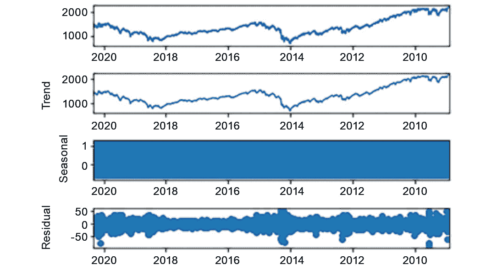

图 6.10 – 时间序列分解

值得强调的是，你可以使用**加法**或**乘法**方法来分解时间序列。加法模型建议你的时间序列将每个组成部分相加以解释目标变量——即，*y(t) = 水平 + 趋势 + 季节性 +* *噪声*。

另一方面，乘法模型建议你的时间序列将每个组成部分相乘以解释目标变量——即，*y(t) = 水平 * 趋势 * 季节性 ** *噪声*。

在下一节中，你将更深入地了解时间序列的组成部分。

### 检查时间序列的平稳性

将时间序列分解并理解其组成部分如何通过加法和乘法模型相互作用是一项伟大的成就！然而，你学得越多，你就越想深入探究问题。也许你已经意识到，没有趋势和季节性的时间序列比具有所有这些成分的时间序列更容易预测！

这自然是正确的。如果你不需要理解趋势和季节性，并且如果你无法控制噪声，你所要做的就是探索观察到的值并找到它们的回归关系。

在一个时间段内具有恒定均值和方差的时间序列被称为**平稳的**。一般来说，具有趋势和季节性的时间序列**不是**平稳的。可以对序列应用数据转换，将其转换为平稳时间序列，从而使建模任务变得更容易。这种转换被称为**微分**。

当你在探索时间序列时，你可以通过应用假设检验，如**迪基-富勒**、**KPSS**和**菲利普斯-佩荣**，来检查平稳性，仅举几个例子。如果你发现它是非平稳的，那么你可以应用微分使其成为平稳时间序列。一些算法已经内置了这种能力。

### 探索，探索，再探索

在这一点上，重要的是要记住，在数据科学中，探索任务一直在进行。这里没有什么不同。当你构建时间序列模型时，你可能想查看数据并检查它是否适合这种类型的建模。

**自相关图**是你可以用于时间序列分析的工具之一。自相关图允许你检查时间序列中滞后之间的相关性。*图 6.11*展示了这种可视化类型的一个示例。

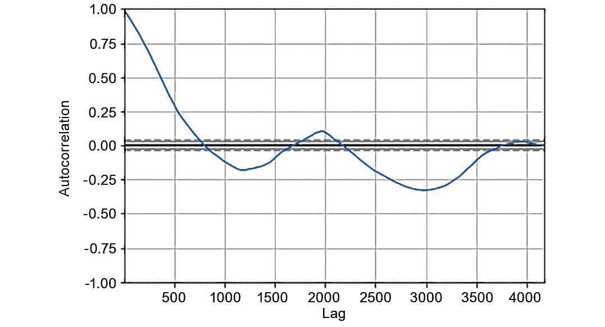

图 6.11 – 自相关图

记住，如果你在处理单变量时间序列，你的时间序列只包含一个变量。因此，找到你独特变量的滞后之间的自相关对于理解你是否能构建一个好的模型至关重要。

是的，有时候，可能会发生这样的情况，你面前没有时间序列。而且，无论你多么努力，你都无法将这类数据建模为时间序列。这类数据通常被称为**白噪声**。

另一种你无法预测的序列被称为**随机游走**。随机游走本质上是随机的，但它们依赖于前一时间步。例如，随机游走的下一个点可能是在 0 和 1 之间的随机数，也可能是序列的最后一个点。

重要提示

如果你在考试中遇到这些术语，请务必将它们与时间序列中的随机性联系起来。

有了这些，你已经了解了时间序列建模背后的主要理论。你也应该意识到，目前最流行的用于处理时间序列的算法被称为**自回归积分移动平均（ARIMA）**和**指数平滑（ETS）**。本书不会深入探讨这两个模型。相反，你将看到 AWS 在时间序列建模方面能提供什么。

### 理解 DeepAR

**DeepAR**预测算法是一个内置的 SageMaker 算法，用于使用**循环神经网络（RNN）**预测一维时间序列。

传统的时序算法，如 ARIMA 和 ETS，旨在为每个时间序列拟合一个模型。例如，如果你想预测每个地区的销售额，你可能需要为每个地区创建一个模型，因为每个地区可能有自己独特的销售行为。另一方面，DeepAR 允许你在单个模型中操作多个时间序列，这在更复杂的应用场景中似乎是一个巨大的优势。

DeepAR 的输入数据，正如预期的那样，是*一个或多个*时间序列。这些时间序列中的每一个都可以与以下内容相关联：

+   一个静态（时间独立）的类别特征向量，由`cat`字段控制

+   一个动态（时间依赖）时间序列的向量，由`dynamic_feat`控制

重要提示

注意，在多个时间序列上训练和进行预测的能力与静态类别特征向量密切相关。在定义 DeepAR 将要训练的时间序列时，你可以设置类别变量来指定每个时间序列属于哪个组。

DeepAR 的两个主要超参数是`context_length`，它用于控制在训练过程中模型可以看到多远的历史，以及`prediction_length`，它用于控制模型将输出预测的多远未来。

DeepAR 还可以处理缺失值，在这种情况下，指的是时间序列中存在的间隙。DeepAR 的一个非常有趣的功能是从时间序列中创建派生特征。这些派生特征，由基本时间频率创建，有助于算法学习时间依赖的模式。*表 6.7*显示了 DeepAR 根据其训练的每种类型的时间序列创建的所有派生特征。

| **时间序列的** **频率** | **派生特征** |
| --- | --- |
| 分钟 | 小时中的分钟数，天的小时数，周中的天数，月份中的天数，年份中的天数 |
| 小时 | 天的小时数，周中的天数，月份中的天数，年份中的天数 |
| 天 | 周中的天数，月份中的天数，年份中的天数 |
| 周 | 月份中的天数，年份中的周数 |
| 月份 | 年份中的月份 |

表 6.7 – 按时间序列频率派生的 DeepAR 特征

你现在已经完成了关于预测模型的这一部分。接下来，你将查看关于监督学习的最后一个算法——即**Object2Vec**算法。

## Object2Vec

Object2Vec 是 SageMaker 内置算法，它推广了众所周知的**Word2Vec**算法。Object2Vec 用于为高维对象创建**嵌入空间**。根据定义，这些嵌入空间是原始对象的压缩表示，可用于多个目的，例如特征工程或对象比较。

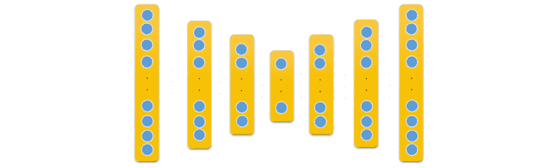

图 6.12 – 嵌入空间的视觉示例

*图 6**.12*说明了嵌入空间的意思。神经网络模型的第一层和最后一层只是将输入数据映射到自身（由相同大小的向量表示）。

当你深入到模型的内部层时，数据被越来越压缩，直到它达到这个架构中间的层，即嵌入层。在这一特定层上，你有一个更小的向量，其目的是对来自第一层的高维原始向量进行准确和压缩的表示。

通过这样，你已经完成了关于 AWS 中机器学习算法的第一部分。接下来，你将了解一些无监督算法。

# 无监督学习

AWS 为以下任务提供了几个无监督学习算法：

+   聚类：K-Means 算法

+   维度降低：**主成分分析（Principal Component Analysis，简称 PCA**）

+   模式识别：IP 洞察

+   异常检测：**随机切割森林（Random Cut Forest，简称 RCF）**算法

让我们先从聚类以及最流行的聚类算法 K-Means 的工作原理开始谈。

## 聚类

聚类算法在数据科学中非常流行。基本上，它们的目的是在给定的数据集中识别相似的组，也称为**聚类**。聚类算法属于非监督学习领域，这意味着它们不需要标签或响应变量来训练。

这真是太棒了，因为标记数据非常稀缺！然而，它也有一些限制。主要的一个是，聚类算法为你提供聚类，但不提供每个聚类的含义。因此，必须有人，作为领域专家，分析每个聚类的属性来定义它们的含义。

有许多种聚类方法，例如层次聚类和划分聚类。在每种方法内部，你都会发现几个算法。然而，K-Means 可能是最流行的聚类算法，你很可能在考试中会遇到它。

当你在玩 K-Means 时，你必须要指定你想要创建的聚类数量。然后，你必须将数据点分配到每个聚类中，以便每个数据点只属于一个聚类。这正是聚类过程结束时你应该期待的结果！

你需要指定你想要创建的聚类数量，并将这个数字传递给 K-Means 算法。然后，算法将随机初始化每个聚类的中心点（这被称为**中心点初始化**）。

一旦你有了每个聚类的中心点，你所需要做的就是为每个数据点分配一个聚类。要做到这一点，你必须使用一个邻近度或距离度量！这本书将使用术语*距离度量*。

**距离度量**负责计算数据点和中心点之间的距离。根据距离度量，数据点将属于最近的聚类中心。

最流行的距离度量称为**欧几里得距离**，其背后的数学很简单；想象一下，你的数据集的点由两个维度组成，*x*和*y*。因此，你可以将点*a*和*b*考虑如下：

+   *a（x=1, y=1）*

+   *b（x=2, y=5）*

点 *a* 和 *b* 之间的欧几里得距离由以下公式给出，其中 *x*1 和 *y*1 是点 *a* 的值，而 *x*2 和 *y*2 是点 *b* 的值：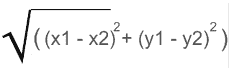。该函数可以通过以下方程推广：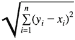。一旦您完成这个过程，并为每个数据点分配了一个簇，您可以使用 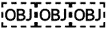 方法，如 **单链接、平均链接** 和 **完全链接**。

由于这种中心点刷新，您将不得不持续检查每个数据点的最近簇，并迭代地刷新中心点，直到簇中心收敛且不需要重新分配簇，或者达到允许的最大迭代次数。

好的，以下是对构成 K-Means 方法的组件和步骤的总结：

+   中心点初始化、簇分配、中心点刷新，然后重复最后两个步骤，直到收敛

+   一种距离度量，用于将数据点分配到每个簇（在这种情况下，欧几里得距离）

+   一种重新计算簇中心点的链接方法（为了我们的演示，您将了解平均链接）

使用这些定义，您现在可以逐步了解以下真实示例，一步一步来（一些参考资料也供您参考）。

### 逐步计算 K-Means

在这个例子中，您将在一个非常小的数据集上模拟 K-Means，该数据集只有两列（*x* 和 *y*）和六个数据点（*A*、*B*、*C*、*D*、*E* 和 *F*），如 *表 6.8* 所定义。

| **点** | **x** | **y** |
| --- | --- | --- |
| A | 1 | 1 |
| B | 2 | 2 |
| C | 5 | 5 |
| D | 5 | 6 |
| E | 1 | 5 |
| F | 2 | 6 |
| **簇 1** | **1** | **1** |
| **簇 2** | **2** | **2** |
| **簇 3** | **5** | **5** |

表 6.8 – K-Means 迭代输入数据

*表 6.8* 包含三个簇，其中心点如下：*(1,1), (2,2), (5,5)*。簇的数量（3）是事先定义的，每个簇的中心点是随机定义的。*图 6**.13* 显示了您现在所处的算法阶段。

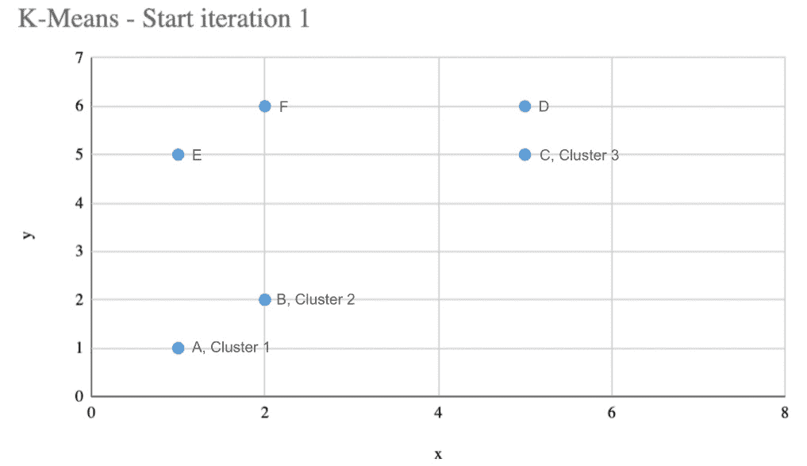

图 6.13 – 完成第一次迭代前的 K-Means 结果

在这里，由于它们与簇中心重叠，您看不到点 *A*、*B* 和 *C*，但请放心——它们很快就会出现。接下来，您必须计算每个数据点到每个簇中心的距离，然后，您需要选择离每个点最近的簇。

| **xc1** | **yc1** | **xc2** | **yc2** | **xc3** | **yc3** | **distance-c1** | **distance-c2** | **distance-c3** | **簇** |
| --- | --- | --- | --- | --- | --- | --- | --- | --- | --- |
| 1 | 1 | 2 | 2 | 5 | 5 | 0,0 | 1,4 | 5,7 | 簇 1 |
| 1 | 1 | 2 | 2 | 5 | 5 | 1,4 | 0,0 | 4,2 | 簇 2 |
| 1 | 1 | 2 | 2 | 5 | 5 | 5,7 | 4,2 | 0,0 | 簇 3 |
| 1 | 1 | 2 | 2 | 5 | 5 | 6,4 | 5,0 | 1,0 | 簇 3 |
| 1 | 1 | 2 | 2 | 5 | 5 | 4,0 | 3,2 | 4,0 | 聚类 2 |
| 1 | 1 | 2 | 2 | 5 | 5 | 5,1 | 4,0 | 3,2 | 聚类 3 |
| 图例 xc1 = 聚类 1 的 x 值 yc1 = 聚类 1 的 y 值 |

表 6.9 – 处理迭代 1

*表 6.9* 包含以下元素：

+   每一行代表一个数据点。

+   前六列代表每个聚类的质心轴（*x* 和 *y*）。

+   接下来的三列表示每个数据点到每个聚类质心的距离。

+   最后一列代表每个数据点最近的聚类。

观察数据点 *A*（第一行），你可以看到它被分配到聚类 1，因为数据点 *A* 到聚类 1 的距离是 0（你还记得它们是重叠的吗？）。同样的计算会应用于所有其他数据点，以定义每个数据点的聚类。

在你继续之前，你可能想看看聚类和数据点之间的欧几里得距离是如何计算的。为了演示目的，以下模拟将考虑数据点 *A* 到聚类 3 的距离（*表 6.9* 中的第一行，`distance-c3` 列，值为 *5,7*）。

首先，以下公式被用来计算欧几里得距离：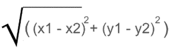

这里，你有以下内容：

+   *x*1 = 数据点 *A* 的 *x* 值 = 1

+   *y*1 = 数据点 *A* 的 *y* 值 = 1

+   *x*2 = 聚类 3 的 *x* 值 = 5

+   *y*2 = 聚类 3 的 *y* 值 = 5

*图 6**.14* 逐步应用公式。


图 6.14 – 逐步计算欧几里得距离

这真是太棒了，不是吗？你几乎完成了 K-Means 的第一次迭代。在第一次迭代的最后一步，你必须刷新聚类质心。记住：最初它们是随机定义的，但现在，你已经将一些数据点分配给每个聚类，这意味着你应该能够识别出聚类的中心点在哪里。

在本例中，将使用 **链接** 方法来刷新聚类质心。这是一个非常简单的步骤，结果在 *表 6.10* 中展示。

| **点** | **x** | **y** |
| --- | --- | --- |
| A | 1 | 1 |
| B | 2 | 2 |
| C | 5 | 5 |
| D | 5 | 6 |
| E | 1 | 5 |
| F | 2 | 6 |
| **聚类 1** | **1** | **1** |
| **聚类 2** | **1,5** | **3,5** |
| **聚类 3** | **4** | **5,7** |

表 6.10 – 第 1 次迭代后的 K-Means 结果

*表 6.10* 显示了你正在处理的数据点（顺便说一句，它们永远不会改变），以及聚类 1、2 和 3 的质心。这些质心与 *表 6.8* 中最初显示的质心相当不同。这是因为它们使用了平均链接来刷新！该方法得到了每个聚类中所有 *x* 和 *y* 值的平均值。在下一个模拟中，看看如何将 *(1.5, 3.5)* 获得为聚类 2 的质心。

如果你查看 *表 6.9*，你会看到簇 2 只有两个数据点分配给它：*B* 和 *E*。这些是图中第二行和第五行。如果你取每个点的 *x* 轴的平均值，那么你将得到 *(2 + 1) / 2 = 1.5* 和 *(2 + 5) / 2 = 3.5*。

这样，你就完成了 K-Means 的第一次迭代，你可以在 *图 6.15* 中查看结果。

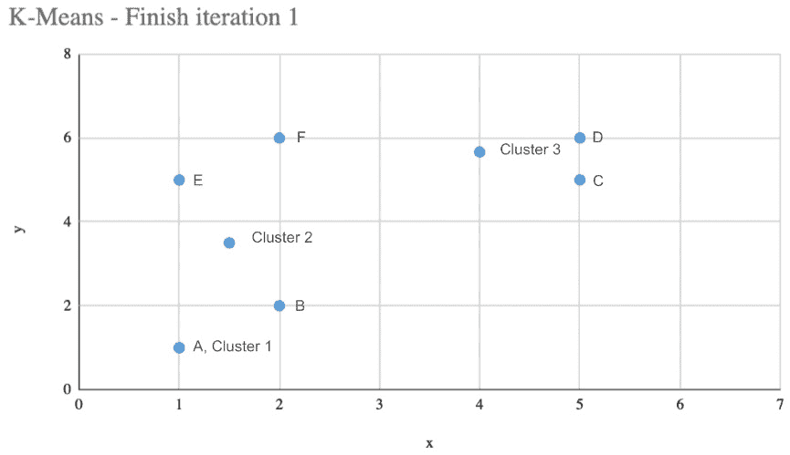

图 6.15 – 第一次迭代后的 K-Means 结果

现在，你可以看到几乎所有的数据点，除了数据点 A，因为它仍然与簇 1 的中心点重叠。继续，你必须重新执行以下步骤：

+   重新计算每个数据点与每个簇中心点之间的距离，并在必要时重新分配簇。

+   重新计算簇中心点。

你会多次执行这两个任务，直到簇中心点收敛并且它们不再改变，*或者*你达到了允许的最大迭代次数，这可以作为 K-Means 的超参数设置。为了演示目的，经过四次迭代，你的簇将看起来像 *图 6.16*。

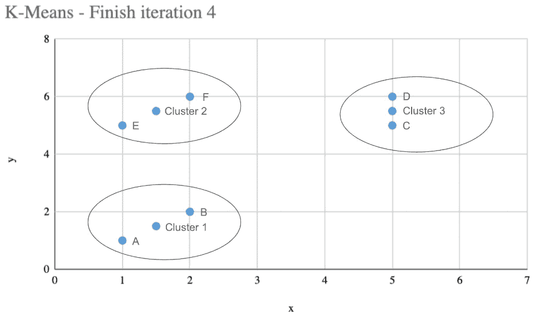

图 6.16 – 第四次迭代后的 K-Means 结果

在第四次迭代中，所有簇的中心点看起来相当一致，你可以清楚地看到所有数据点都可以根据它们的邻近性进行分组。

重要提示

在这个例子中，你只为每个数据点设置了两个维度（维度 *x* 和 *y*）。在实际应用中，你可以看到更多的维度，这就是为什么聚类算法在以更自动化的方式识别数据中的组时扮演着非常重要的角色。

希望你能享受从零开始计算 K-Means 的过程！这些知识将对考试和你的数据科学家职业生涯有益。顺便说一句，正如多次建议的那样，数据科学家必须持怀疑态度和好奇心，所以你可能想知道为什么在这个例子中定义了三个簇而不是两个或四个。你也可能想知道如何衡量簇的质量。

你难道认为这个解释不会提供，对吧？

### 定义簇数量和测量簇质量

虽然 K-Means 是一种在数据中寻找模式的好算法，但它不会提供每个簇的含义，也不会提供你必须创建以最大化簇质量的簇数量。

在聚类中，簇质量意味着你希望创建具有高同质性的簇组，以及不同簇元素之间的高异质性。换句话说，同一簇的元素应该接近/相似，而不同簇的元素应该很好地分离。

计算簇的同质性的一个方法是通过使用一个称为**平方误差和**的度量，简称**SSE**。这个度量将计算每个数据点与其簇质心的平方差的和。例如，当所有数据点都位于簇质心所在的同一点时，SSE 将为 0。换句话说，你希望最小化 SSE。以下方程正式定义了 SSE：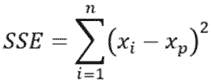

现在你已经知道了如何检查簇的质量，理解如何为给定的数据集定义合适的簇数量就更容易了。你所要做的就是找到最小化 SSE 的最优簇数量。一个围绕该逻辑工作的非常流行的方法被称为**肘部方法**。

肘部方法建议多次执行聚类算法。在每次执行中，你将测试不同数量的簇，*k*。在每次执行后，你将计算与该*k*数量簇相关的 SSE。最后，你可以绘制这些结果，并选择 SSE 停止急剧下降的*k*数量。

重要提示

添加更多的簇将自然会降低 SSE。在肘部方法中，你希望找到这种变化变得平滑的点，这意味着新簇的添加不会带来太多的价值。

在前面的例子中，创建了三个簇。*图 6**.17 显示了支持这一决策的肘部分析。

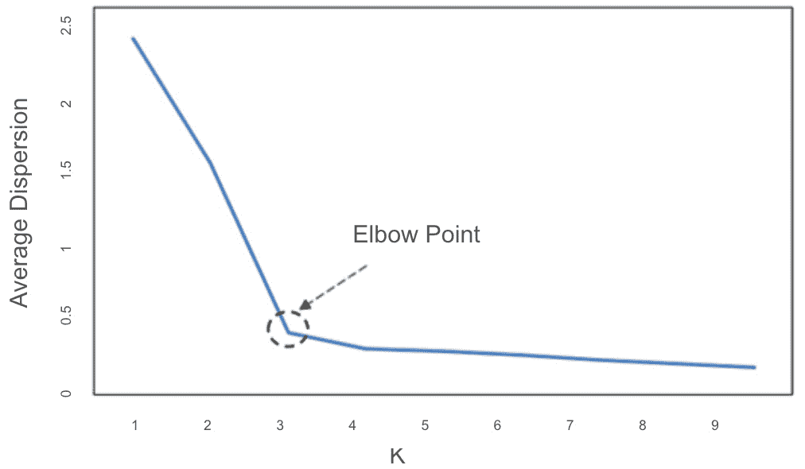

图 6.17 – 肘部方法

你可以得出结论，添加超过三个或四个簇将给聚类过程增加不必要的复杂性。

当然，在定义簇的数量时，你应该始终考虑业务背景。例如，如果你正在创建客户细分模型，而你的公司已经为四个客户细分准备了商业团队和业务流程，那么设置四个簇而不是三个是没有害处的。

最后，你应该知道 AWS 已经将 K-Means 算法作为其内置算法列表的一部分实现了。换句话说，你不需要使用外部库或自己带来算法来在 AWS 上使用 K-Means。

### 结论

这真是一个了不起的成就：你刚刚掌握了聚类算法的基础，你现在应该能够推动你自己的项目和关于这个主题的研究！对于考试，记住聚类属于机器学习的无监督领域，因此不需要有标记的数据。

此外，确保你知道这个领域最流行的算法是如何工作的——那就是 K-Means。尽管聚类算法不提供每个组的含义，但它们在寻找数据中的模式方面非常强大，无论是为了建模特定问题还是仅仅为了探索数据。

接下来，你将继续学习无监督算法，并了解 AWS 如何构建了目前最强大的异常检测算法之一，该算法被称为**RCF**。

## 异常检测

在建模和数据探索性分析中寻找数据中的异常是一个非常常见的任务。有时，你可能只想在拟合回归模型之前删除数据中的异常，而有时，你可能想创建一个以识别异常为最终目标的模型——例如，在欺诈检测系统中。

再次强调，你可以使用许多不同的方法来寻找数据中的异常。只要有些创意，可能性是无限的。然而，有一个特定的算法可以解决这个问题，你应该在考试中务必了解：RCF。

RCF 是一种基于无监督决策树的算法，它使用训练数据的随机子样本创建了多个决策树（森林）。技术上，它随机化数据，然后根据树的数量创建样本。最后，这些样本被分配到每一棵树上。

这些树集被用来为数据点分配异常分数。为了计算特定数据点的异常分数，它被传递到森林中的每一棵树。当数据点穿过树时，记录从根节点到叶节点的路径长度，这是针对特定树的。然后，通过考虑森林中所有树的路径长度分布，确定该数据点的异常分数。

如果一个数据点在大多数树中遵循一条短路径（即它靠近根节点），则被视为一个常见点，并将具有较低的异常分数。

另一方面，如果一个数据点在许多树中遵循一条长路径（即它远离根节点），则被视为一个不常见点，并将具有较高的异常分数。

RCF 最重要的超参数是`num_trees`和`num_samples_per_tree`，分别代表森林中的树的数量和每棵树中的样本数量。

## 维度降低

AWS 在其内置算法列表中实现的一种无监督算法被称为主成分分析，简称 PCA。PCA 是一种用于减少数据集中变量/维度的数量的技术。

主成分分析（PCA）背后的主要思想是将数据点绘制到另一组坐标上，这组坐标被称为**主成分（PCs）**，其目的是解释数据中的最大方差。根据定义，第一个成分将比第二个成分捕获更多的方差，然后第二个成分将比第三个成分捕获更多的方差，依此类推。

你可以设置你需要的 PCs 数量，只要它不超过你的数据集中的变量数量。*图 6.18*显示了这些 PCs 是如何绘制的：

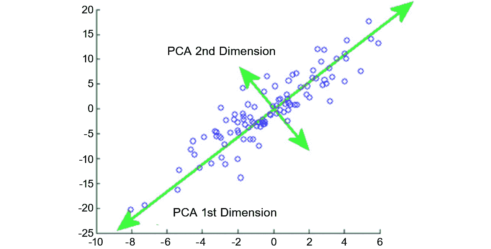

图 6.18 – PCA 中的 PCs 寻找

如前所述，第一个 PC 将以这种方式绘制，以便它能够捕获数据中的大部分变差。这就是为什么它在*图 6**.18*中靠近大多数数据点的原因。

然后，第二台 PC 将垂直于第一台，因此它将成为解释数据中变差的第二个组成部分。如果您想创建更多组件（从而捕获更多变差），您只需遵循添加垂直组件的相同规则。**特征向量**和**特征值**是与 PCA 相关的线性代数概念，用于计算主成分。

因此，关于这里的降维有什么故事？如果还不清楚，这些 PC 可以用来替换您的原始变量。例如，假设您的数据集中有 10 个变量，您想将此数据集减少到三个最能代表其他变量的变量。解决这个问题的潜在方法就是应用 PCA 并提取前三个 PC！

这三个组件解释了您数据集的 100%吗？可能不是，但理想情况下，它们将解释大部分变差。添加更多 PC 将解释更多变差，但代价是增加额外的维度。

### 使用 AWS 内置的 PCA 算法

在 AWS 中，PCA 以两种不同的模式工作：

+   **常规**：适用于具有适度观察和特征的集合

+   **随机化**：适用于具有大量观察和特征的集合

不同之处在于，在随机模式下，它被用作近似算法。

当然，PCA 的主要超参数是您想要提取的组件数量，称为`num_components`。

## IP 洞察

IP 洞察是一种无监督算法，用于模式识别。本质上，它学习 IPv4 地址的使用模式。

该算法的**操作方法**非常直观：它在实体和 IPv4 地址格式的成对事件上训练，以便它可以理解它所训练的每个实体的模式。

重要提示

例如，您可以理解“实体”为用户 ID 或账户号码。

然后，为了进行预测，它接收具有相同数据结构（实体，IPv4 地址）的成对事件，并返回针对该特定 IP 地址的异常分数，根据输入实体。

重要提示

IP 洞察返回的这种异常分数推断事件模式的异常程度。

您可能会遇到许多带有 IP 洞察的应用。例如，您可以在您的应用程序登录事件（这是您的实体）上训练一个 IP 洞察模型。您应该能够通过 API 端点公开此模型，以便实时进行预测。

然后，在您应用程序的认证过程中，您可以调用您的端点并传递尝试登录的 IP 地址。如果您得到了高分（这意味着这种登录模式看起来异常），在授权访问之前（即使密码是正确的），您可以请求更多信息。

这只是您可以考虑的 IP Insights 的许多应用之一。接下来，您将了解文本分析。

# 文本分析

现代应用使用**自然语言处理（NLP）**进行多种目的，例如文本翻译、文档分类、网络搜索、**命名实体识别（NER）**等。

AWS 为大多数 NLP 用例提供了一套算法。在接下来的几个小节中，您将了解这些内置的文本分析算法。

## BlazingText 算法

BlazingText 执行两种不同的任务：文本分类，这是一种监督学习方法，扩展了**fastText**文本分类器，以及 Word2Vec，这是一种无监督学习算法。

BlazingText 对这些两种算法的实现进行了优化，以便在大数据集上运行。例如，您可以在几分钟内训练一个在数十亿单词之上的模型。

BlazingText 的这一可扩展性方面是由于以下原因实现的：

+   它能够使用多核 CPU 和单个 GPU 来加速文本分类。

+   它在玩 Word2Vec 算法时能够使用多核 CPU 或 GPU，以及定制的 CUDA 内核进行 GPU 加速。

Word2Vec 选项支持**batch_skipgram**模式，这使得 BlazingText 能够在多个 CPU 上执行分布式训练。

重要提示

BlazingText 执行的分布式训练使用小批量方法将**一级 BLAS（基本线性代数子程序）**操作转换为**三级 BLAS**操作。如果在考试中遇到这些术语，应知道它们与 BlazingText（Word2Vec 模式）相关。

仍然在 Word2Vec 模式下，BlazingText 支持**skip-gram**和**连续词袋（CBOW）**架构。

最后，请注意以下 BlazingText 的配置，因为它们很可能出现在您的考试中：

+   在 Word2Vec 模式下，只有训练通道可用。

+   BlazingText 期望一个单独的文本文件，其中包含空格分隔的标记。文件的每一行必须包含一个句子。这意味着在使用 BlazingText 之前，通常需要预处理您的数据集。

## 序列到序列算法

这是一个将输入序列转换为输出序列的监督算法。这个序列可以是文本句子，甚至是音频记录。

序列到序列最常见的用例是机器翻译、文本摘要和语音到文本。您认为任何是序列到序列问题的事情都可以通过这个算法来处理。

从技术上讲，AWS SageMaker 的 Seq2Seq 使用两种类型的神经网络来创建模型：一个带有注意力机制的**RNN**和一个**卷积神经网络（CNN**）。

**潜在狄利克雷分配**，简称**LDA**，用于主题建模。主题建模是一种文本分析技术，可以从文本数据语料库中提取一组主题。LDA 基于文本语料库中单词的概率分布来学习这些主题。

由于这是一个无监督算法，因此不需要设置目标变量。此外，必须事先指定主题的数量，并且你必须分析每个主题以找到其领域含义。

## 神经主题模型算法

就像 LDA 算法一样，**神经主题模型（NTM**）也旨在从数据语料库中提取主题。然而，LDA 和 NTM 之间的区别在于它们的学习逻辑。LDA 通过文档中单词的概率分布来学习这些主题，而 NTM 建立在神经网络之上。

NTM 网络架构有一个瓶颈层，它创建文档的嵌入表示。这个瓶颈层包含预测文档组成所需的所有必要信息，其系数可以被认为是主题。

有了这些，你已经完成了关于文本分析的这一部分。在下一部分，你将学习关于图像处理算法的内容。

# 图像处理

图像处理是机器学习中的一个非常热门的话题。其想法相当直观：创建可以分析图像并在其上做出推断的模型。通过推断，你可以理解为检测图像中的对象、对图像进行分类等等。

AWS 提供了一套内置算法，你可以使用这些算法来训练图像处理模型。在接下来的几节中，你将了解这些算法。

## 图像分类算法

如其名所示，图像分类算法用于使用监督学习对图像进行分类。换句话说，它需要在每个图像中有一个标签。它支持多标签分类。

它的工作方式很简单：在训练期间，它接收一个图像及其相关的标签。在推理期间，它接收一个图像并返回所有预测的标签。图像分类算法使用 CNN（**ResNet**）进行训练。它可以从头开始训练模型，或者利用迁移学习预先加载神经网络的前几层。

根据 AWS 的文档，支持`.jpg`和`.png`文件格式，但推荐格式是**MXNet 的 RecordIO**。

## 语义分割算法

语义分割算法提供了创建计算机视觉应用的像素级能力。它将图像的每个像素标记为类别，这对于自动驾驶和医学图像诊断等复杂应用是一个重要特性。

在其实现方面，语义分割算法使用**MXNet Gluon 框架**和**Gluon CV 工具包**。你可以选择以下任何算法来训练模型：

+   **全卷积网络（FCN**）

+   **金字塔场景解析（PSP**）

+   DeepLabV3

所有这些选项都作为**编码器-解码器**神经网络架构工作。网络的输出被称为**分割掩码**。

## 目标检测算法

就像图像分类算法一样，目标检测算法的主要目标也是不言而喻的：它在图像中检测和分类对象。它使用监督方法来训练深度神经网络。

在推理过程中，此算法返回识别出的对象以及关于预测的置信度分数。目标检测算法使用**单次多框检测器（SSD**）并支持两种类型的网络架构：**视觉几何组（VGG**）和**残差网络（ResNet**）。

# 摘要

这真是一次难忘的旅程！花点时间回顾一下你刚刚学到的内容。本章有四个主要主题：监督学习、无监督学习、文本分析和图像处理。你所学的所有内容都适合于机器学习的这些子领域。

你所研究的监督学习算法列表包括以下内容：

+   线性学习器

+   分解机

+   XGBoost

+   KNN

+   Object2Vec

+   DeepAR 预测

记住，你可以使用线性学习器、分解机、XGBoost 和 KNN 来完成多种目的，包括解决回归和分类问题。线性学习器可能是这四种算法中最简单的；分解机扩展了线性学习器，适用于稀疏数据集，XGBoost 使用基于决策树的集成方法，而 KNN 是一种基于索引的算法。

其他两种算法，Object2Vec 和 DeepAR，用于特定的目的。Object2Vec 用于创建数据的向量表示，而 DeepAR 用于创建预测模型。

你所研究的无监督学习算法列表包括以下内容：

+   K-Means

+   PCA

+   IP Insights

+   RCF

K-Means 是一个非常流行的算法，用于聚类。PCA 用于降维，IP Insights 用于模式识别，RCF 用于异常检测。

然后，你更详细地研究了回归模型和 K-Means。你这样做是因为，作为一名数据科学家，你应该至少掌握这两个非常流行的算法，这样你就可以自己深入研究其他算法。

然后，你继续学习本章的第二部分，其中你学习了文本分析和以下算法：

+   BlazingText

+   序列到序列

+   LDA

+   NTM

最后，你学习了图像处理，并查看以下内容：

+   图像分类算法

+   语义分割算法

+   目标检测算法

由于本章涉及的主题对于 AWS 认证机器学习专业考试非常重要，我们强烈建议您访问 AWS 网站并搜索机器学习算法。在那里，您将找到您刚刚学到的算法的最新信息。请确保在考试前完成此操作。

这就结束了这个快速复习和本章的内容。在下一章中，您将了解 AWS 提供的现有机制，您可以使用这些机制来优化和评估这些算法。

# 考试准备练习 – 章节复习问题

除了对关键概念有扎实的理解外，能够在时间压力下快速思考是一项有助于您通过认证考试的技能。这就是为什么在您的学习旅程早期就培养这些技能是关键。

章节复习问题旨在随着您学习并复习每个章节的内容，逐步提高您的应试技巧，同时检查您对章节中关键概念的理解。您将在每个章节的末尾找到这些内容。

如何访问这些资源

要了解如何访问这些资源，请转到名为*第十一章*的章节，*访问在线练习资源*。

要打开本章的章节复习问题，请执行以下步骤：

1.  点击链接 – [`packt.link/MLSC01E2_CH06`](https://packt.link/MLSC01E2_CH06)。

    或者，您可以扫描以下**二维码**（*图 6.19*）：


图 6.19 – 为登录用户打开章节复习问题的二维码

1.  一旦登录，您将看到一个类似于*图 6.20*所示的页面：

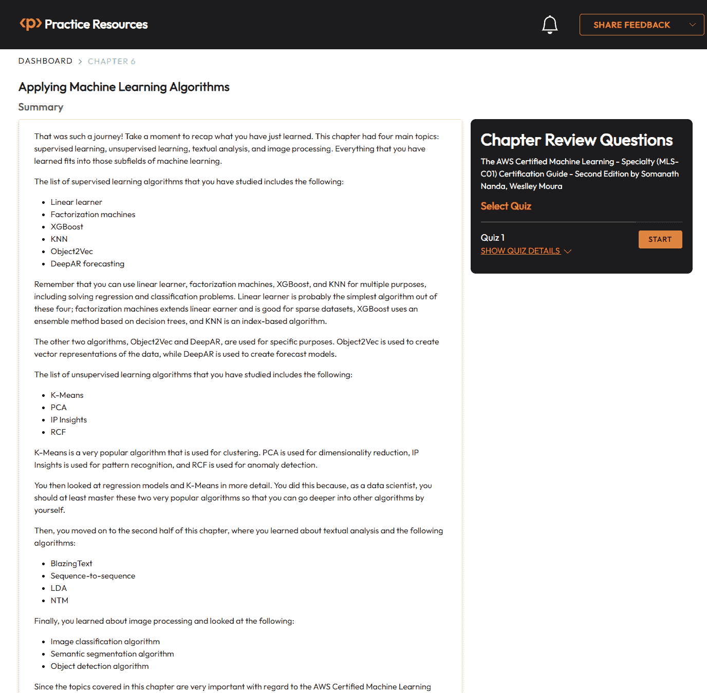

图 6.20 – 第六章的章节复习问题

1.  准备就绪后，开始以下练习，多次重新尝试测验。

## 考试准备练习

对于前三次尝试，不必担心时间限制。

### 尝试 1

第一次，目标至少达到**40%**。查看您答错的答案，并再次阅读章节中的相关部分以修复学习差距。

### 尝试 2

第二次，目标至少达到**60%**。查看您答错的答案，并再次阅读章节中的相关部分以修复任何剩余的学习差距。

### 尝试 3

第三次，目标至少达到**75%**。一旦得分达到 75%或更高，您就开始练习计时。

小贴士

您可能需要超过**三次**尝试才能达到 75%。没关系。只需复习章节中的相关部分，直到达到目标。

# 正在练习计时

目标：您的目标是保持得分不变，同时尽可能快速地回答这些问题。以下是如何进行下一次尝试的示例：

| **尝试** | **得分** | **用时** |
| --- | --- | --- |
| 尝试 5 | 77% | 21 分 30 秒 |
| 尝试 6 | 78% | 18 分 34 秒 |
| 尝试 7 | 76% | 14 分 44 秒 |

表 6.11 – 在线平台上的样本时间练习练习

备注

上表中显示的时间限制只是示例。根据网站上的测验时间限制，每次尝试时自行设定你的时间限制。

每次新的尝试，你的分数应保持在 **75%** 以上，同时完成所需的时间“应减少”。重复尝试，直到你觉得自己能够自信地应对时间压力。
