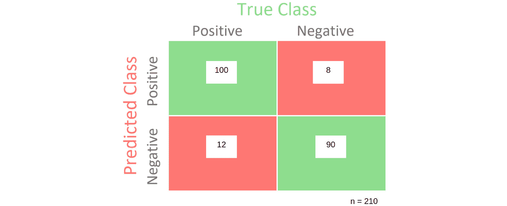
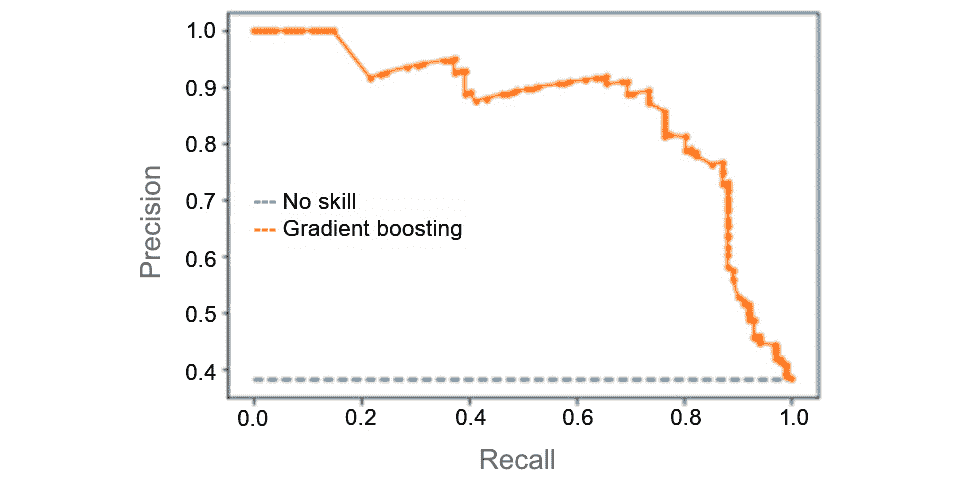
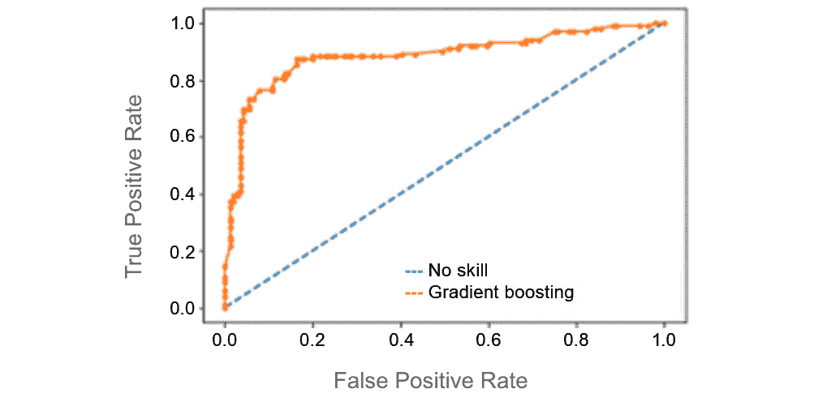
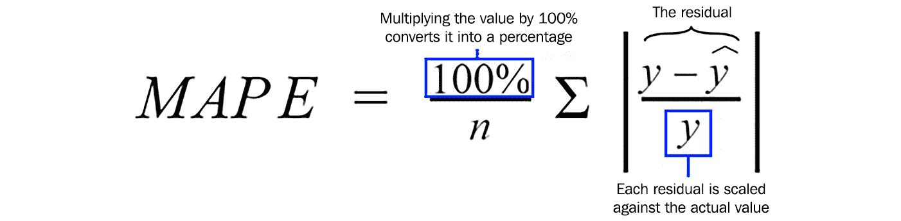
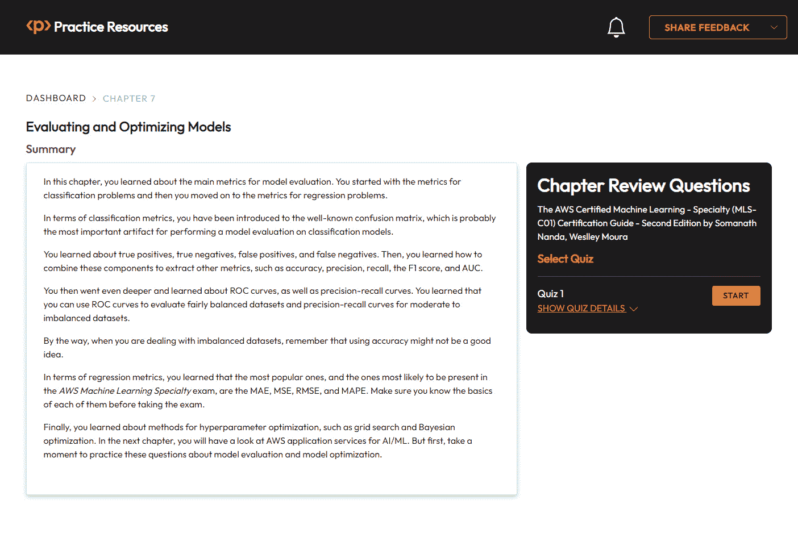

# 7

# 评估和优化模型

现在是时候学习如何评估和优化机器学习模型了。在建模过程中，甚至在模型完成之后，你可能想要了解你的模型表现如何。每种类型的模型都有自己的一套可以用来评估性能的指标，这就是你将在本章学习的内容。

除了模型评估之外，作为一名数据科学家，你可能还需要通过调整算法的超参数来提高模型性能。你将了解这个建模任务的某些细微差别。

本章将涵盖以下主题：

+   介绍模型评估

+   评估分类模型

+   评估回归模型

+   模型优化

好的，是时候摇滚起来啦！

# 介绍模型评估

有几种不同的场景，你可能想要评估模型性能。以下是一些例子：

+   你正在创建一个模型并测试不同的方法和/或算法。因此，你需要比较这些模型以选择最佳模型。

+   你刚刚完成了你的模型，你需要记录你的工作，这包括指定你在建模阶段得到的模型性能指标。

+   你的模型正在生产环境中运行，你需要跟踪其性能。如果你遇到模型漂移，那么你可能需要重新训练模型。

重要提示

“模型漂移”这个术语用来指代模型退化的问题。当你构建机器学习模型时，你必须使用数据来训练算法。这组数据被称为训练数据，它反映了特定时间点的业务规则。如果这些业务规则随时间变化，你的模型可能无法适应这些变化。这是因为它是基于另一个数据集进行训练的，该数据集反映了另一个业务场景。为了解决这个问题，你必须重新训练模型，以便它能够考虑新业务场景的规则。

模型评估通常在测试的上下文中进行。你之前已经学过保留验证和交叉验证。然而，这两种测试方法都有相同的要求：它们需要一个指标来评估性能。

这些指标是特定于问题域的。例如，回归模型、分类模型、聚类、自然语言处理等领域都有特定的指标。因此，在设计你的测试方法时，你必须考虑你正在构建哪种类型的模型，以便定义评估指标。

在接下来的几节中，你将了解评估模型时应该知道的最重要指标和概念。

# 评估分类模型

分类模型是你可能会遇到的最传统的模型类别之一，无论是在考试中还是在作为数据科学家的旅程中。在分类模型评估期间你可能想要生成的非常重要的一项工具被称为混淆矩阵。

混淆矩阵比较你的模型预测与每个评估类别的真实值。*图 7.1*显示了在二元分类问题中混淆矩阵的形状：

图 7.1 – 混淆矩阵

混淆矩阵有以下组成部分：

+   TP：这是真正例的数量。在这里，你需要计算被预测为真且确实为真的案例数量。例如，在一个欺诈检测系统中，这将是正确预测为欺诈的欺诈交易数量。

+   TN：这是真正例的数量。在这里，你需要计算被预测为假且确实为假的案例数量。例如，在一个欺诈检测系统中，这将是被正确预测为非欺诈的非欺诈交易数量。

+   FN：这是假负例的数量。在这里，你需要计算被预测为假但实际上是真的案例数量。例如，在一个欺诈检测系统中，这将是被错误预测为非欺诈的欺诈交易数量。

+   FP：这是假正例的数量。在这里，你需要计算被预测为真但实际上是假的案例数量。例如，在一个欺诈检测系统中，这将是被错误预测为欺诈的非欺诈交易数量。

在理想情况下，你的混淆矩阵将只有真正例和真正例，这意味着你的模型准确率为 100%。从实际角度来说，如果出现这种情况，你应该持怀疑态度而不是高兴，因为预期你的模型将包含一定程度的错误。如果你的模型不包含错误，你很可能是过度拟合问题，所以请小心。

一旦预期到假负例和假正例，你能做的最好的事情就是优先考虑其中之一。例如，你可以通过增加假正例的数量来减少假负例的数量，反之亦然。这被称为精确率与召回率的权衡。让我们接下来看看这些指标。

## 从混淆矩阵中提取指标

可以从混淆矩阵中提取的最简单指标被称为**准确率**。准确率由以下方程给出，如*图 7.2*所示：

图 7.2 – 准确率的公式

为了演示，*图 7.3*显示了包含数据的混淆矩阵。

图 7.3 – 填充了一些示例的混淆矩阵

根据**图 7.3**，准确度将是(100 + 90) / 210，等于 0.90。当使用准确度指标时，会出现一个常见问题，这与每个类别的平衡有关。高度不平衡的类别问题，如 99%的正例和 1%的负例，将影响准确度得分并使其无用。

例如，如果你的训练数据有 99%的正例（多数类），你的模型可能正确分类大多数正例，但在负例（少数类）的分类上表现不佳。准确度将非常高（由于正例分类的正确性），而不管少数类分类的结果如何。

重点是，在高度不平衡的问题上，你通常更感兴趣的是正确分类少数类，而不是多数类。这在大多数欺诈检测系统中都是如此，例如，少数类对应于欺诈案例。对于不平衡问题，你应该寻找其他类型的指标，你将在下一节中了解到。

从混淆矩阵中可以提取的另一个重要指标称为召回率，其公式如下，如**图 7.4**所示：

图 7.4 – 召回率公式

换句话说，召回率是真实正例数除以正例总数。召回率也称为灵敏度。

在**图 7.3**.3 中的数值，召回率由 100 / 112 给出，等于 0.89。另一方面，精确度由以下公式给出，如**图 7.5**所示：

图 7.5 – 精确度公式

换句话说，精确度是真实正例数除以预测正例总数。精确度也被称为阳性预测力。

在**图 7.3**中的数值，精确度由 100 / 108 给出，等于 0.93。一般来说，你可以通过降低召回率来提高精确度，反之亦然。还有一个模型评估的指标，你可以在这个精确度与召回率的权衡中玩转。它被称为精确度-召回率曲线。

精确度-召回率曲线通过使用不同的概率阈值来总结精确度与召回率的权衡。例如，默认阈值为 0.5，其中任何高于 0.5 的预测将被认为是真实的；否则，它是假的。你可以根据需要更改默认阈值，以便你可以优先考虑召回率或精确度。**图 7.6**显示了精确度-召回率曲线的一个示例：

图 7.6 – 精确度-召回率曲线

正如你在*图 7.6*中看到的那样，提高精确率会减少召回量，反之亦然。*图 7.6*显示了**梯度提升模型**（由橙色线表示）与**无技能模型**（由蓝色虚线表示）在每个阈值下的精确率/召回率。一个完美的模型将曲线近似到点（1,1），在图表的右上角形成一个平方角。

你还可以在混淆矩阵之上使用另一种视觉分析，称为**接收者操作特征**（**ROC**）曲线。ROC 曲线总结了根据不同阈值，**真正例率**和**假正例率**之间的权衡，就像精确率-召回率曲线一样。

你已经了解了真正例率，或称为灵敏度，这与你刚刚在精确率-召回率曲线中学到的是相同的。ROC 曲线的另一个维度是**假正例率**，它是假正例数除以假正例数加上真正例数的数量。

在文献中，你可能会发现假正例率被称为**倒数特异性**，表示为*1 – 特异性*。特异性给出的是真正例数除以真正例数加上假正例数的数量。此外，假正例率或倒数特异性是相同的。*图 7.7*显示了 ROC 曲线的样子：

图 7.7 – ROC 曲线

一个完美的模型将曲线近似到点（0,1），在图表的左上角形成一个平方角。橙色线代表梯度提升分类器的真正例率和假正例率之间的权衡。虚线蓝色线代表一个无技能模型，无法正确预测类别。

总结来说，你可以使用 ROC 曲线来评估相对平衡的数据集，而使用精确率-召回率曲线来评估中等至不平衡的数据集。

## 总结精确率和召回率

有时候，你可能想使用一个总结精确率和召回率的指标，而不是优先考虑其中一个。有两个非常流行的指标可以用来总结精确率和召回率：**F1 分数**和**曲线下面积**（**AUC**）。

F1 分数，也称为**F-measure**，计算精确率和召回率的调和平均值。AUC 总结了精确率-召回率曲线下的近似面积。

这就结束了本节关于分类指标的讨论。现在让我们来看看回归模型的评估指标。

# 评估回归模型

回归模型与分类模型有很大不同，因为模型的输出是一个连续的数字。因此，围绕回归模型的指标旨在监控实际值和预测值之间的差异。

检查预测值（*yhat*）与其实际值（*y*）之间差异的最简单方法是进行简单的减法运算，其中误差将等于*yhat – y*的绝对值。这个指标被称为**平均绝对误差**（**MAE**）。

由于你通常必须评估每个预测的误差，*i*，你必须取误差的平均值。*图 7.8*展示了如何正式定义此误差：

图 7.8 – 每个预测误差的公式

有时候，你可能想要对较大的误差进行惩罚，而不是较小的误差。为了实现这一点，你可以使用另一个指标，称为**平均平方误差**（**MSE**）。MSE 将平方每个误差并返回平均值。

通过平方误差，MSE 将对较大的误差进行惩罚。*图 7.9*展示了如何正式定义 MSE：

图 7.9 – MSE 的公式

MSE 存在一个潜在的解读问题。由于它必须计算平方误差，因此从商业角度解读最终结果可能很困难。**均方根误差**（**RMSE**）通过取 MSE 的平方根来解决这个问题。*图 7.10*展示了 RMSE 的方程：

图 7.10 – RMSE 的公式

RMSE 是回归模型中最常用的指标之一，因为它可以惩罚较大的误差，同时仍然易于解读。

## 探索其他回归指标

除了你刚刚学到的那些之外，还有很多适合回归问题的指标。你在这里不会学习到它们中的大多数，但你会了解到一些可能对你很重要的额外指标。

这些指标之一被称为**平均绝对百分比误差**（**MAPE**）。正如其名所示，MAPE 将计算每个预测的绝对百分比误差，然后取平均值。*图 7.11*展示了如何计算此指标：

图 7.11 – MAPE 的公式

MAPE 在预测模型中得到广泛应用，因为它非常简单易懂，并且可以很好地提供预测值（从百分比的角度）与实际值之间的距离（或接近程度）的感觉。

你现在已经完成了关于回归指标的这一部分。接下来，你将学习关于模型优化的内容。

# 模型优化

正如你所知，为了衡量你的模型性能并记录你的工作，理解评估指标非常重要。同样，当你想要优化当前模型时，评估指标在定义你想要挑战的基线性能中也起着非常重要的作用。

模型优化的过程包括为特定数据分布找到机器学习算法的最佳配置（也称为超参数）。你不想找到过度拟合训练数据的超参数，就像你不想找到欠拟合训练数据的超参数一样。

你在*第一章*《机器学习基础》中学习了过拟合和欠拟合。在同一章中，你也学习了如何避免这两种建模问题。

在本节中，你将了解一些你可以用来为特定算法和数据集找到最佳配置的技术。你可以将这些模型优化技术与其他方法（如交叉验证）结合起来，以找到最佳的超参数集，避免拟合问题。

重要提示

总是记住，你不想优化你的算法以适应底层的训练数据，而是要适应训练数据背后的数据分布，这样你的模型才能在训练数据和生产数据（在训练过程中从未暴露给模型的那些数据）上工作。一个只在训练数据上工作的机器学习模型是无用的。这就是为什么将模型调整技术（如你接下来将要学习的）与采样技术（如交叉验证）结合起来，在创建一个好的模型时至关重要。

## 网格搜索

**网格搜索**可能是模型优化中最受欢迎的方法。它包括测试不同的算法组合并选择最佳的一个。在这里，有两个重要的点你需要注意：

+   如何定义模型的最佳配置

+   应该测试多少配置

最佳模型是根据评估指标定义的。换句话说，你必须首先定义你将使用哪个指标来评估模型的性能。其次，你必须定义你将如何评估模型。通常，交叉验证用于在多个从未用于训练的数据集上评估模型。

在组合/配置的数量方面，这是使用网格搜索时最具挑战性的部分。算法的每个超参数可能有多个或有时是无限的可能值。如果你考虑到一个算法通常会有多个超参数，这将成为一个二次成本函数，其中要测试的唯一组合数量给出为*超参数 a 的值数 * 超参数 b 的值数 * 超参数 i 的值数*。*表 7.1*展示了你可以如何为决策树模型设置潜在的网格搜索配置：

| **标准** | **最大深度** | **最小样本叶** |
| --- | --- | --- |
| Gini, Entropy | 2, 5 =, 10 | 10, 20, 30 |

表 7.1 – 网格搜索配置

在*表 7.1*中，有三个超参数：**标准差**、**最大深度**和**最小叶子节点样本数**。每个超参数都有一个测试值的列表。这意味着在网格搜索过程结束时，你将测试 18 个模型（2 * 3 * 3），其中只有最好的一个将被选中。

正如你可能注意到的，所有这三个超参数的不同组合都将被测试。例如，考虑以下内容：

+   标准差 = Gini，最大深度 = 2，最小叶子节点样本数 = 10

+   标准差 = Gini，最大深度 = 5，最小叶子节点样本数 = 10

+   标准差 = Gini，最大深度 = 10，最小叶子节点样本数 = 10

你可能还有其他问题，例如以下内容：

+   考虑到特定的算法可能有多个超参数，我应该调整哪些？

+   考虑到特定的超参数可能接受无限值，我应该测试哪些值？

这些是很好的问题，网格搜索并不能直接给出答案。相反，这更接近于一个经验过程，你需要测试足够多的内容以达到你的目标性能。

重要提示

当然，网格搜索不能保证你会达到你的目标性能。这取决于算法和训练数据。

虽然通常的做法是使用**线性空间**或**对数空间**来定义测试值，这样你可以手动设置想要测试的超参数的界限和测试值的数量。然后，中间值将通过线性或对数函数生成。

如你所想，网格搜索可能需要很长时间才能运行。已经提出了许多替代方法来解决这个问题。**随机搜索**就是其中之一，其中测试值的列表是从搜索空间中随机选择的。

另一种在业界迅速得到广泛采用的方法被称为**贝叶斯优化**。算法优化，如**梯度下降**，试图找到所谓的**全局最小值**，通过计算成本函数的导数来实现。全局最小值是找到算法配置与最低相关成本的位置。

当计算导数不是一种选择时，贝叶斯优化是有用的。因此，你可以使用**贝叶斯定理**，一种概率方法，通过最少的步骤来找到全局最小值。

在实际应用中，贝叶斯优化将从整个搜索空间开始测试，以找到最有希望的一组最优超参数。然后，它将在全局最小值可能存在的位置进行更具体的测试。

# 摘要

在本章中，你学习了模型评估的主要指标。你从分类问题的指标开始，然后转向回归问题的指标。

在分类指标方面，你已经介绍了众所周知的混淆矩阵，这可能是对分类模型进行模型评估最重要的工具。

你学习了真阳性、真阴性、假阳性和假阴性。然后，你学习了如何将这些组件组合起来提取其他指标，例如准确率、精确率、召回率、F1 分数和 AUC。

然后，你进一步学习了 ROC 曲线和精确率-召回率曲线。你了解到可以使用 ROC 曲线来评估相当平衡的数据集，而对于中等到不平衡的数据集，则可以使用精确率-召回率曲线。

顺便说一句，当你处理不平衡数据集时，请记住使用准确率可能不是一个好主意。

在回归指标方面，你了解到最流行且最可能在*AWS 机器学习专业*考试中出现的指标是 MAE、MSE、RMSE 和 MAPE。在参加考试之前，确保你了解它们的基本知识。

最后，你学习了超参数优化的方法，例如网格搜索和贝叶斯优化。在下一章中，你将了解 AWS 人工智能/机器学习应用服务。但在那之前，花点时间练习这些关于模型评估和模型优化的问题。

# 考试准备练习 – 复习题

除了对关键概念有扎实的理解外，能够在时间压力下快速思考是一项帮助你通过认证考试的关键技能。这就是为什么在学习的早期阶段就培养这些技能至关重要。

复习题旨在随着你学习并复习每一章的内容，逐步提高你的应试技巧，同时复习章节中的关键概念。你可以在每一章的末尾找到这些练习。

如何访问这些资源

要了解如何访问这些资源，请转到名为*第十一章*的章节，*访问在线练习资源*。

要打开本章的复习题，请执行以下步骤：

1.  点击链接 – [`packt.link/MLSC01E2_CH07`](https://packt.link/MLSC01E2_CH07)。

    或者，你可以扫描以下**二维码**（*图 7.12*）：

图 7.12 – 为登录用户打开第七章复习题的二维码

1.  登录后，你将看到一个类似于*图 7.13*所示的页面：

图 7.13 – 第七章复习题

1.  准备就绪后，开始以下练习，多次尝试测验。

## 考试准备练习

对于前三次尝试，不必担心时间限制。

### 尝试 1

第一次，目标至少达到**40%**。查看你答错的答案，并再次阅读章节中的相关部分，以修复你的学习差距。

### 尝试 2

第二次，目标至少达到**60%**。查看你答错的答案，并再次阅读章节中的相关部分，以修复任何剩余的学习差距。

### 尝试 3

第三次，目标至少达到**75%**。一旦你的得分达到 75%或更高，你就可以开始练习时间管理了。

小贴士

你可能需要超过**三次**尝试才能达到 75%。这是可以的。只需复习章节中的相关部分，直到你达到目标。

# 工作在时间管理上

目标：你的目标是保持分数不变，同时尽可能快地回答这些问题。以下是你下一次尝试应该看起来像的样子：

| **尝试** | **得分** | **用时** |
| --- | --- | --- |
| 尝试 5 | 77% | 21 分钟 30 秒 |
| 尝试 6 | 78% | 18 分钟 34 秒 |
| 尝试 7 | 76% | 14 分钟 44 秒 |

表 7.2 – 在线平台上的样本时间练习练习

注意

上表中显示的时间限制只是示例。根据网站上的测验时间限制，为每次尝试设定自己的时间限制。

每次新的尝试，你的得分应该保持在**75%**以上，而完成所需的时间应该“减少”。重复尽可能多的尝试，直到你对自己应对时间压力有信心。
