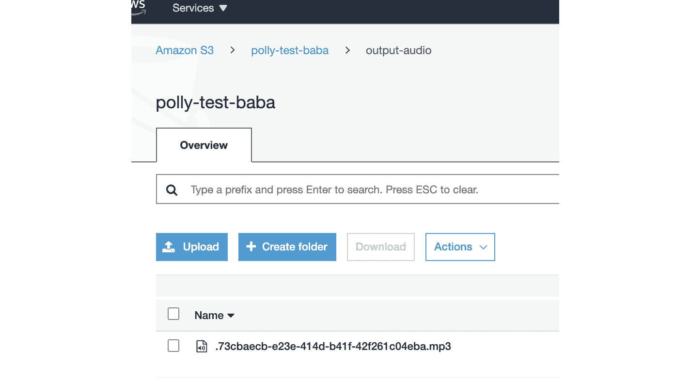

# 8

# AWS 应用服务用于 AI/ML

在本章中，你将了解 AWS AI 服务，用于构建聊天机器人、高级文本分析、文档分析、转录等。本章的设计方式使得你可以通过集成 AWS AI 服务来解决不同的用例，并了解它们的工作原理。AWS 每天都在增长，并且他们定期添加新的 AI 服务。

在本章中，你将通过编程或从控制台处理不同的用例。这将帮助你了解不同的 API 以及如何使用它们。你将使用 S3 进行存储，并使用 AWS Lambda 执行任何代码。本章中的示例使用 Python 编写，但你也可以使用其他支持的语言，例如 Java、Node.js、.NET、PowerShell、Ruby 等。

你将涵盖以下主题：

+   使用 Amazon Rekognition 分析图像和视频

+   使用 Amazon Polly 进行文本到语音转换

+   使用 Amazon Transcribe 进行语音转文本

+   使用 Amazon Comprehend 实施自然语言处理

+   使用 Amazon Translate 翻译文档

+   使用 Amazon Textract 从文档中提取文本

+   在 Amazon Lex 上创建聊天机器人

+   使用 Amazon Forecast 进行时间序列预测

# 技术要求

本章所需的所有内容只是一个 AWS 账户。

你可以从 GitHub 下载本章的代码示例，网址为 [`github.com/PacktPublishing/AWS-Certified-Machine-Learning-Specialty-MLS-C01-Certification-Guide-Second-Edition/tree/main/Chapter08`](https://github.com/PacktPublishing/AWS-Certified-Machine-Learning-Specialty-MLS-C01-Certification-Guide-Second-Edition/tree/main/Chapter08)。

# 使用 Amazon Rekognition 分析图像和视频

如果你需要为你的应用程序添加强大的视觉分析，那么**Amazon Rekognition**是你要选择的服务。**Rekognition Image**让你轻松构建强大的应用程序来搜索、验证和组织数百万张图像。它让你从存储或实时流视频中提取基于运动的内容，并帮助你分析它们。Rekognition Video 还允许你索引诸如对象、活动、场景、名人、面部等元数据，使视频搜索变得容易。Rekognition Image 使用深度神经网络模型来检测和标记你图像中的众多对象和场景。它帮助你捕获图像中的文本，有点像**光学字符识别 (OCR)**。一个完美的例子是印有引语的 T 恤。如果你要拍一张照片并让 Amazon Rekognition 从中提取文本，它就能告诉你文本的内容。你也可以使用 Amazon Rekognition 进行名人识别。不是名人的人不会使用名人识别 API 来处理他们的面部；相反，他们将使用面部比较 API。

官方文档可在 [`aws.amazon.com/rekognition/faqs/`](https://aws.amazon.com/rekognition/faqs/) 查找，其中说明了以下内容：

*“使用 Rekognition Image，您只需为分析的图像和存储的面部元数据付费。如果您的训练在任何时候失败，您将不会收取计算资源费用。”*

Amazon Rekognition 的以下是一些常见用途：

+   图像和视频分析

+   可搜索的图像库

+   基于面部用户验证

+   情感分析

+   图像中的文本

+   面部识别

+   图像审查

+   视频存档的搜索索引

+   在视频中轻松过滤明显的和暗示的内容

+   明显裸露的例子——性行为、图形裸露、成人玩具等等

+   暗示内容的例子——部分裸露、泳装或内衣等等

## 探索 Amazon Rekognition 的益处

这里是使用 Amazon Rekognition 的一些好处：

+   AWS 管理其运行的底层基础设施。简而言之，只需使用 API 进行图像分析。您只需专注于构建和管理您的深度学习管道。

    无论是否了解图像处理，您只需使用 Amazon Rekognition 提供的 API，就可以进行图像和视频分析，这些 API 可用于多个平台上的任何应用程序或服务。

+   标签 API 的响应将通过 DetectLabels API 识别图像中的真实世界实体。这些标签包括城市、镇、桌子、家庭、花园、动物、宠物、食物、饮料、电子产品、花卉等等。实体根据其 **置信度分数** 进行分类，该分数表示给定预测正确的概率——分数越高，越好。同样，您可以使用 DetectText API 从图像中提取文本。Amazon Rekognition 可能会根据单词之间的间隔检测多行。句点不代表行的结束。

+   Amazon Rekognition 可以与 AWS Kinesis Video Stream、AWS S3 和 AWS Lambda 集成，以实现无缝且经济的图像和视频分析。使用 AWS IAM 服务，Amazon Rekognition API 调用可以轻松地得到保护和控制。

+   低成本：您只需为分析的图像和视频付费。

+   通过 AWS CloudTrail，可以捕获 Amazon Rekognition 的所有 API 调用作为事件。它捕获来自控制台、CLI 或代码对 API 的调用，这进一步使用户能够根据 CloudTrail 事件创建 Amazon SNS 通知。

+   您可以为特定的 API 调用创建 VPC 端点策略，以在您的 VPC 和 Amazon Rekognition 之间建立私有连接。这有助于您利用增强的安全性。根据 AWS 共享责任模型，AWS 负责基础设施和软件的安全性，而您必须负责云中内容的安全性。

## 亲身体验 Amazon Rekognition

在本节中，您将学习如何将 AWS Lambda 与 Amazon Rekognition 集成，以检测我们图像（上传至[`github.com/PacktPublishing/AWS-Certified-Machine-Learning-Specialty-MLS-C01-Certification-Guide-Second-Edition/tree/main/Chapter08/Amazon%20Rekognition%20Demo/images`](https://github.com/PacktPublishing/AWS-Certified-Machine-Learning-Specialty-MLS-C01-Certification-Guide-Second-Edition/tree/main/Chapter08/Amazon%20Rekognition%20Demo/images)）中的标签，并在 CloudWatch 控制台中打印检测到的对象。您将在代码中使用 Amazon Rekognition 的`detect_labels` API。

您将首先为 Lambda 创建一个 IAM 角色：

1.  导航到 IAM 控制台页面。

1.  从左侧菜单中选择**角色**。

1.  选择**创建角色**。

1.  从**选择一个用例**部分选择**Lambda**。

1.  添加以下托管策略：

    +   `AmazonS3ReadOnlyAccess`

    +   `AmazonRekognitionFullAccess`

    +   `CloudWatchLogsFullAccess`

1.  将角色命名为`rekognition-lambda-role`：

图 8.1 – 创建角色的对话框

接下来，您将创建一个 Lambda 函数。

1.  导航到 AWS Lambda 控制台页面。

1.  选择**创建函数**。

1.  创建一个函数：

    +   选择`lambda-rekognition`。

    +   从`rekognition-lambda-role`中选择`Python 3.6`：


图 8.2 – 创建 Lambda 函数

1.  在`lambda_function.py`中输入以下代码：

    ```py
    from __future__ import print_function
    ```

    ```py
    import boto3
    ```

    ```py
    def lambda_handler(event, context):
    ```

    ```py
        print("========lambda_handler started=======")
    ```

    ```py
        # read the bucket name (key) from the event
    ```

    ```py
        name_of_the_bucket=event['Records'][0]['s3']['bucket']
    ```

    ```py
    ['name']
    ```

    ```py
        # read the object from the event
    ```

    ```py
        name_of_the_photo=event['Records'][0]['s3']['object']['key']
    ```

    ```py
        detect_labels(name_of_the_photo,name_of_the_bucket)
    ```

    ```py
        print("Labels detected Successfully")
    ```

    ```py
    def detect_labels(photo, bucket):
    ```

    ```py
        client=boto3.client('rekognition')
    ```

    ```py
     response=client.detect_labels(Image={'S3Object':{'Bucket':bucket,'Name':photo}})
    ```

    ```py
        print('Detected labels for ' + photo)
    ```

    ```py
        print('==============================')
    ```

    ```py
        for label in response['Labels']:
    ```

    ```py
            print ("Label: " + label['Name'])
    ```

    ```py
            print ("Confidence: " +
    ```

    ```py
    str(label['Confidence']))
    ```

    ```py
            print ("Instances:")
    ```

    ```py
            for instance in label['Instances']:
    ```

    ```py
                print ("  Bounding box")
    ```

    ```py
                print ("Top:
    ```

    ```py
    "+str(instance['BoundingBox']['Top']))
    ```

    ```py
                print ("Left: \
    ```

    ```py
    "+str(instance['BoundingBox']['Left']))
    ```

    ```py
                print ("Width: \
    ```

    ```py
    "+str(instance['BoundingBox']['Width']))
    ```

    ```py
                print ("Height: \
    ```

    ```py
    "+str(instance['BoundingBox']['Height']))
    ```

    ```py
                print ("Confidence:
    ```

    ```py
    "+str(instance['Confidence']))
    ```

    ```py
                print()
    ```

    ```py
            print ("Parents:")
    ```

    ```py
            for parent in label['Parents']:
    ```

    ```py
                print ("   " + parent['Name'])
    ```

    ```py
            print ("----------")
    ```

    ```py
            print('==============================')
    ```

    ```py
        return response
    ```

    现在，您将为 Lambda 函数创建一个触发器。

1.  导航到 AWS S3 控制台页面。创建一个存储桶，例如，`rekognition-test-baba`，如图*图 8**.3*所示：


图 8.3 – AWS S3 控制台页面

1.  点击`images`。点击**保存**。

1.  点击我们存储桶的**属性**选项卡。

1.  滚动到该存储桶的**事件**。

1.  在`rekognition_event`内部

1.  `所有对象` `创建事件`

1.  `images`*/*

1.  `Lambda 函数`

+   `lambda-rekognition`：


图 8.4 – S3 存储桶事件窗口

接下来，您将把从共享 GitHub 仓库中的图像上传到 S3 存储桶的`images`文件夹。

1.  一旦上传，您就可以检查 Lambda 控制台中的**监控**选项卡来监控事件，如图*图 8**.5*所示：


图 8.5 – CloudWatch 在 Lambda 控制台中监控事件

1.  导航到`CloudWatch > CloudWatch 日志 > 日志组 > /aws/lambda/lambda-rekognition`。从 AWS 控制台上列出的所有流中选择最新的流，并在日志中向下滚动以查看您的输出。

在本节中，你学习了如何实现 Amazon Rekognition 人工智能服务以检测图像中的对象并为每个对象获取置信度分数。你将在接下来的章节中看到 Amazon Rekognition 的更多用例，其中你将检测图像中的文本。在下一节中，你将了解 Amazon 的文本到语音服务并实现它。

# 使用 Amazon Polly 进行文本到语音转换

**Amazon Polly** 的一切都是将文本转换为语音，它是通过使用预训练的深度学习模型来实现的。这是一个完全托管的服务，因此你不需要做任何事情。你提供纯文本作为合成输入或在 **语音合成** **标记语言 (SSML**) 格式下，以便返回音频流。它还提供了不同的语言和声音供你选择，包括男性和女性选项。Amazon Polly 的输出音频可以保存为 MP3 格式，以便在应用程序（网页或移动）中进一步使用，或者可以是一个 JSON 输出，用于书面语音。

例如，如果你要将文本“Baba 去了图书馆”输入到 Amazon Polly 中，输出语音标记对象将如下所示：

`{"time":370,"type":"word","start":5,"end":9,"value":"went"}`

单词 `"went"` 在音频流开始后的 370 毫秒处开始，从给定输入文本的字节 5 开始，到字节 9 结束。

它还以 `ogg_vorbis` 和 `pcm` 格式返回输出。当使用 `pcm` 时，返回的输出内容是 `audio/pcm`，以有符号 16 位、1 通道（单声道）、小端格式。

Amazon Polly 的常见用途包括以下内容：

+   可以用作阅读网络内容的辅助工具。

+   可以与 Amazon Rekognition 集成，帮助视障人士阅读标志。你可以点击带有文本的标志图片并将其提供给 Amazon Rekognition 以提取文本。输出文本可以用作 Polly 的输入，它将返回语音输出。

+   可以用于公共广播系统，管理员团队只需传递要宣布的文本，Amazon Polly 就会施展魔法。

+   通过将 Amazon Polly 与 `音频/视频接收器` **(AVR**) 系统结合使用。

+   智能设备，如智能电视、智能手表和 **物联网 (IoT**) 设备，可以使用它进行音频输出。

+   叙述生成。

+   当与 Amazon Lex 结合使用时，可以开发应用程序的完整语音用户界面。

现在，让我们探索 Amazon Polly 的优势。

## 探索 Amazon Polly 的优势

使用 Amazon Polly 的好处包括以下内容：

+   此服务完全托管，无需任何管理成本来维护或管理资源。

+   它提供即时语音校正和增强功能。

+   你可以使用 Amazon Polly 的 HTTP API 开发自己的访问层。由于有大量的语言支持，如 Python、Ruby、Go、C++、Java 和 Node.js，因此开发变得非常容易。

+   对于某些神经网络语音，可以使用新闻主播风格进行语音合成，使其听起来像电视或广播电台的广播员。

+   Amazon Polly 还允许您修改特定单词的发音或使用新单词。

接下来，您将亲身体验 Amazon Polly。

## 亲身体验 Amazon Polly

在本节中，您将构建一个管道，其中可以集成 AWS Lambda 与 Amazon Polly。该管道读取文本文件并生成 MP3 文件，将其保存到同一存储桶中的另一个文件夹。您将在 CloudWatch 日志中监控任务的进度。

您将首先为 Lambda 创建一个 IAM 角色。让我们开始吧：

1.  导航到 IAM 控制台页面。

1.  从左侧菜单中选择 **角色**。

1.  选择 **创建角色**。

1.  选择 **Lambda** 作为受信任实体。

1.  添加以下托管策略：

    +   `AmazonS3FullAccess`

    +   `AmazonPollyFullAccess`

    +   `CloudWatchFullAccess`

1.  将角色保存为 `polly-lambda-role`。

    接下来，您将创建一个 Lambda 函数：

1.  导航到 `Lambda > 函数 >` `创建函数`。

    +   将函数命名为 `polly-lambda`

    +   将运行时设置为 `python 3.6`。

    +   使用现有角色；即 `polly-lambda-role`。

1.  将代码粘贴到 [`github.com/PacktPublishing/AWS-Certified-Machine-Learning-Specialty-MLS-C01-Certification-Guide-Second-Edition/tree/main/Chapter08/Amazon%20Rekognition%20Demo/lambda_code`](https://github.com/PacktPublishing/AWS-Certified-Machine-Learning-Specialty-MLS-C01-Certification-Guide-Second-Edition/tree/main/Chapter08/Amazon%20Rekognition%20Demo/lambda_code) 并在 Lambda 函数中检查其在 CloudWatch 控制台中的进度。您将使用 Amazon Polly 的 `start_speech_synthesis_task` API 来执行此代码；它是一个异步合成任务。

1.  滚动到 `59` 秒，如图 *图 8**.6* 所示，然后点击 **保存**：

重要提示

默认值为 3 秒。由于这是一个异步操作，任何重试尝试都会创建更多文件。


图 8.6 – 编辑基本设置窗口

现在，您将创建一个存储桶以触发事件。

1.  导航到 AWS S3 控制台并创建一个名为 `polly-test-baba` 的存储桶。

1.  创建一个名为 `input-text` 的文件夹（在这个例子中，您将只上传 `.txt` 文件）。

1.  导航到 `属性 > 事件 > 添加通知`。填写所需字段，如图所示，然后点击 `polly_event`

1.  `All object` `create events`

1.  `input-text/`

1.  `.txt`

1.  `Lambda Function`

1.  `polly-lambda`

1.  接下来，您将上传一个文件以触发事件，并在 CloudWatchUpload 中检查其进度，在这种情况下，一个名为`test_file.txt`的文件位于`input-text`中，如图*8.7*所示。您可以从本书的 GitHub 存储库中下载示例文件，网址为[`github.com/PacktPublishing/AWS-Certified-Machine-Learning-Specialty-MLS-C01-Certification-Guide-Second-Edition/tree/main/Chapter08/Amazon%20Polly%20Demo/text_file`](https://github.com/PacktPublishing/AWS-Certified-Machine-Learning-Specialty-MLS-C01-Certification-Guide-Second-Edition/tree/main/Chapter08/Amazon%20Polly%20Demo/text_file)：


图 8.7 – 上传文本文件以进行进一步处理后的 S3 存储桶

1.  这将触发 Lambda 函数。您可以通过访问`CloudWatch> CloudWatch Logs> 日志组> /aws/lambda/polly-lambda`来监控您的日志。

1.  点击最新的流；日志将如下所示：

    ```py
    File Content:  Hello Everyone, Welcome to Dublin. How
    ```

    ```py
    are you doing today?
    ```

    ```py
    {'ResponseMetadata': {'RequestId': '74ca4afd-5844-
    ```

    ```py
    47d8-9664-3660a26965e4', 'HTTPStatusCode': 200,
    ```

    ```py
    'HTTPHeaders': {'x-amzn-requestid': '74ca4afd-5844-
    ```

    ```py
    47d8-9664-3660a26965e4', 'content-type':
    ```

    ```py
    'application/json', 'content-length': '471', 'date':
    ```

    ```py
    'Thu, 24 Sep 2020 18:50:57 GMT'}, 'RetryAttempts': 0},
    ```

    ```py
    'SynthesisTask': {'Engine': 'standard', 'TaskId':
    ```

    ```py
    '57548c6b-d21a-4885-962f-450952569dc7', 'TaskStatus':
    ```

    ```py
    'scheduled', 'OutputUri': 'https://s3.us-east-
    ```

    ```py
    1.amazonaws.com/polly-test-baba/output-
    ```

    ```py
    audio/.57548c6b-d21a-4885-962f-450952569dc7.mp3',
    ```

    ```py
    'CreationTime': datetime.datetime(2020, 9, 24, 18, 50,
    ```

    ```py
    57, 769000, tzinfo=tzlocal()), 'RequestCharacters':
    ```

    ```py
    59, 'OutputFormat': 'mp3', 'TextType': 'text',
    ```

    ```py
    'VoiceId': 'Aditi', 'LanguageCode': 'en-GB'}}
    ```

    日志样本如图*8.8*所示：


图 8.8 – CloudWatch 控制台中的日志

1.  它将以 MP3 格式创建输出，如图*8.9*所示。下载并收听它：



图 8.9 – 在 S3 存储桶中创建的输出文件

重要注意事项

对于您的移动应用或 Web 应用来说，最具可扩展性和成本效益的方式是生成 AWS 预签名 URL 以供 S3 存储桶使用，并将其提供给您的用户。这些 S3 Put 事件异步调用下游 AI 工作流程以生成结果，并向最终用户发送响应。通过这种方式，可以同时为许多用户提供服务，并且可能会提高性能和吞吐量。

在本节中，您学习了如何实现文本到语音。在下一节中，您将学习关于 Amazon Transcribe，这是一种语音到文本的 AI 服务。

# 使用 Amazon Transcribe 进行语音到文本

在上一节中，您学习了关于文本到语音的内容。在本节中，您将学习关于语音到文本及其提供的服务：**Amazon Transcribe**。它是一个自动语音识别服务，使用预训练的深度学习模型，这意味着您不需要在 PB 级数据上进行训练以生成模型；亚马逊为我们完成这项工作。您只需使用可用的 API 来转录音频文件或视频文件；它还支持多种不同的语言和自定义词汇。准确性是关键，并且通过自定义词汇，您可以根据所需的领域或行业进行增强：


图 8.10 – Amazon Transcribe 输入和输出的框图

Amazon Transcribe 的一些常见用途包括以下内容：

+   实时音频流和转录

+   转录预录制的音频文件

+   通过结合 AWS Elasticsearch 和 Amazon Transcribe 启用从媒体文件中进行文本搜索

+   对录音音频文件进行情感分析以帮助语音帮助台（接触中心分析）

+   频道识别分离

接下来，你将探索 Amazon Transcribe 的好处。

## 探索 Amazon Transcribe 的好处

让我们看看使用 Amazon Transcribe 的一些好处：

+   `VocabularyFilterName` 和 `VocabularyFilterMethod`，这些是由 `StratTranscriptionJob` 操作提供的。例如，在金融机构中，这可以用来编辑呼叫者的详细信息。

+   **语言识别**：它可以自动识别音频文件中最常用的语言并生成转录文本。如果你有多个音频文件，这项服务将帮助你按语言对它们进行分类。

+   **流式转录**：你可以将记录的音频文件或实时音频流发送到 Amazon Transcribe，并实时输出文本流。

+   **自定义词汇或定制转录**：你可以根据你的特定需求使用自定义词汇表来生成准确的转录文本。

+   **时间戳生成**：如果你想为视频创建或添加字幕，那么 Amazon Transcribe 可以从音频中返回每个单词或短语的时戳。

+   **成本效益**：作为一个托管服务，没有基础设施成本。

现在，让我们亲自动手使用 Amazon Transcribe。

## 亲自动手使用 Amazon Transcribe

在本节中，你将构建一个管道，其中你可以将 AWS Lambda 与 Amazon Transcribe 集成，以读取存储在 S3 桶中文件夹中的音频文件，然后将输出 JSON 文件存储在另一个 S3 桶中。你还将通过 CloudWatch 日志监控任务的进度。你将使用 `start_transcription_job` 异步函数来启动我们的工作，并通过 `get_transcription_job` 持续监控工作，直到其状态变为 `COMPLETED`。让我们开始吧：

1.  首先，为 Lambda 函数创建一个名为 `transcribe-demo-role` 的 IAM 角色，以确保它可以读取和写入 S3，使用 Amazon Transcribe，并在 CloudWatch 日志中打印输出。将以下策略添加到 IAM 角色中：

    +   `AmazonS3FullAccess`

    +   `CloudWatchFullAccess`

    +   `AmazonTranscribeFullAccess`

1.  现在，你将使用现有的 IAM 角色 `transcribe-demo-role` 创建一个名为 `transcribe-lambda` 的 Lambda 函数，并将其保存。

    请确保将 `start_transcription_job` 中的默认超时时间更改为更高的值，以使用 `get_transcription_job` API 启动任务并监控它。

1.  将可用的代码粘贴到[`github.com/PacktPublishing/AWS-Certified-Machine-Learning-Specialty-MLS-C01-Certification-Guide-Second-Edition/blob/main/Chapter08/Amazon%20Transcribe%20Demo/lambda_function/lambda_function.py`](https://github.com/PacktPublishing/AWS-Certified-Machine-Learning-Specialty-MLS-C01-Certification-Guide-Second-Edition/blob/main/Chapter08/Amazon%20Transcribe%20Demo/lambda_function/lambda_function.py)，然后点击**部署**。

    这应该会给我们以下输出：


图 8.11 – 我们创建的 Lambda 函数的基本设置部分

1.  接下来，你将创建一个名为`transcribe-demo-101`的 S3 存储桶和一个名为`input`的文件夹。通过访问`audio-event`创建一个事件

1.  `所有对象` `创建事件`

1.  `input/`

1.  `Lambda 函数`

1.  `transcribe-lambda`

1.  将`.mp4`格式的音频文件上传到`input`文件夹。这将触发 Lambda 函数。根据代码，输出将以 JSON 格式存储在 S3 存储桶中，然后你可以用它来读取文件内容。

1.  导航到`CloudWatch > CloudWatch Logs > Log groups > aws/lambda/transcribe-lambda`。从列表中选择最新的流。它看起来如下：


图 8.12 – 在 CloudWatch 控制台中指定日志组中的日志记录

1.  输出以 JSON 格式保存到 S3 存储桶中，如代码中提到的作业名称（你可以使用 S3 的`getObject` API 下载和读取它）：


图 8.13 – S3 存储桶中的输出 JSON 文件

重要提示

不要过度配置函数的超时设置是一个最佳实践。始终了解你的代码性能，并相应地设置函数超时。过度配置函数超时会导致 Lambda 函数运行时间更长，造成意外的成本。如果你在 Lambda 函数中使用异步 API 调用，那么在成功时将它们写入 SNS 主题，并从那里触发另一个 Lambda 函数是个好主意。如果需要人工干预，建议使用 AWS Step Functions。

在本节中，你学习了并应用了 Amazon Transcribe 将语音转换为文本。在下一节中，你将了解你可以使用的最强大的 AWS AI 服务之一，以从我们的文本数据中获得最大洞察力。

# 使用 Amazon Comprehend 实现自然语言处理

此服务帮助你从非结构化文本中提取洞察力。非结构化文本信息呈指数增长。以下是一些数据源示例：

+   **客户参与度**：呼叫中心、问题分类、客户调查和产品评论

+   **业务流程**：客户/供应商电子邮件、产品支持消息和运营支持反馈

+   **记录和研究**：白皮书和医疗记录

+   **新闻和社交媒体**：社交媒体分析、品牌趋势和关联事件

现在，问题是，你能用这些数据做什么？你如何分析它并从中提取任何价值？答案是亚马逊理解，它用于从非结构化数据中获取洞察。

亚马逊理解的一些常见用途包括以下内容：

+   信息管理系统

+   有组织的主题上的更精确的搜索系统

+   用户情感分析

+   支持票分类

+   从文档中检测语言并将其翻译成英语使用亚马逊翻译

+   创建一个系统来标记非结构化临床数据，以协助研究和分析目的

+   从公司会议或电视新闻的保存音频文件中提取主题

接下来，你将探索亚马逊理解的益处。

## 探索亚马逊理解的益处

使用 Comprehend 的某些优势可以在以下图像中看到：


图 8.14 – 显示亚马逊理解功能的框图

让我们更详细地看看这些：

+   它检测文本的语言并提取关键短语。亚马逊理解也可用于情感分析和主题建模。

+   亚马逊理解医疗可用于提取医疗信息。

+   由于这是一个完全管理的服务，你只需为使用付费；你不需要为基础设施付费。你不需要训练、开发和部署自己的模型。

+   主题建模服务通过提取最多 100 个主题来工作。主题是一个关键词桶，这样你就可以看到实际文档语料库中的内容。

+   它是准确的、持续训练的，并且易于使用。

接下来，你将亲身体验亚马逊理解。

## 亲身体验亚马逊理解

在本节中，你将构建一个管道，其中你可以将 AWS Lambda 与亚马逊识别和亚马逊理解集成。然后，你将读取存储在 S3 存储桶中的图像文件，并检测从图像中提取的文本的语言。你还将使用 CloudWatch 打印输出。以下是我们用例的图示：


图 8.15 – 所需用例的架构图

让我们首先创建一个 IAM 角色：

1.  导航到 IAM 控制台页面。

1.  从左侧菜单中选择**角色**。

1.  选择**创建角色**。

1.  选择**Lambda**作为受信任实体。

1.  添加以下管理`策略`：

    +   `AmazonS3ReadOnlyAccess`

    +   `AmazonRekognitionFullAccess`

    +   `ComprehendFullAccess`

    +   `CloudWatchFullAccess`

1.  将角色保存为 `language-detection-from-image-role`。

1.  现在，让我们创建 Lambda 函数。导航到 `Lambda > 函数 >` `创建函数`。

1.  将函数命名为`language-detection-from-image`。

1.  将运行时设置为 `Python 3.6`。

1.  使用我们现有的角色；即，`language-detection-from-image-role`。

1.  从[`github.com/PacktPublishing/AWS-Certified-Machine-Learning-Specialty-MLS-C01-Certification-Guide-Second-Edition/tree/main/Chapter08/Amazon%20Transcribe%20Demo/lambda_function`](https://github.com/PacktPublishing/AWS-Certified-Machine-Learning-Specialty-MLS-C01-Certification-Guide-Second-Edition/tree/main/Chapter08/Amazon%20Transcribe%20Demo/lambda_function)下载代码，将其粘贴到函数中，然后从 Amazon Rekognition 点击`detect_text` API 以从图像中检测文本，并从 Amazon Comprehend 点击`batch_detect_dominant_language` API 以检测文本的语言。

1.  现在，前往你的 AWS S3 控制台，创建一个名为*language-detection-image*的存储桶。

1.  创建一个名为`input-image`的文件夹（在这个例子中，你将只上传`.jpg`文件）。

1.  导航到`属性 > 事件 > 添加通知`。

1.  在`image-upload-event`中填写所需的字段。

1.  `所有对象` `创建事件`

1.  `input-image/`

1.  `.jpg`

1.  `Lambda 函数`

1.  `language-detection-from-image`

1.  导航到`Amazon S3 > language-detection-image > input-image`。将文件夹中的`sign-image.jpg`图像上传。 (此文件可在本书的 GitHub 存储库中找到，地址为[`github.com/PacktPublishing/AWS-Certified-Machine-Learning-Specialty-MLS-C01-Certification-Guide-Second-Edition/tree/main/Chapter08/Amazon%20Comprehend%20Demo/input_image`](https://github.com/PacktPublishing/AWS-Certified-Machine-Learning-Specialty-MLS-C01-Certification-Guide-Second-Edition/tree/main/Chapter08/Amazon%20Comprehend%20Demo/input_image))。

1.  此文件上传将触发 Lambda 函数。你可以从`CloudWatch > CloudWatch Logs > 日志组 > /aws/lambda/language-detection-from-image`监控日志。

1.  点击流并选择最新的一个。检测到的语言将在日志中打印出来，如图*图 8.16*所示：


图 8.16 – 用于验证输出的 CloudWatch 日志

重要提示

建议你在生产环境中使用批量操作，例如`BatchDetectSentiment`或`BatchDetectDominantLanguage`。这是因为单个 API 操作可能会引起 API 级别的限制。更多详情请参阅[`docs.aws.amazon.com/comprehend/latest/dg/functionality.html`](https://docs.aws.amazon.com/comprehend/latest/dg/functionality.html)。

在本节中，你学习了如何使用 Amazon Comprehend 检测文本的语言。文本通过 Amazon Rekognition 提取到我们的 Lambda 函数中。在下一节中，你将学习如何通过 Amazon Translate 将相同的文本翻译成英文。

# 使用 Amazon Translate 翻译文档

大多数时候，人们更喜欢用他们自己的语言进行沟通，即使在数字平台上。Amazon Translate 是一种文本翻译服务。您可以在各种语言中提供文档或文本字符串，并得到不同语言的翻译。它使用预训练的深度学习技术，因此您不必担心模型，也不必担心它们的管理。您可以发出 API 请求并获取结果。

Amazon Translate 的一些常见用途包括以下内容：

+   如果有组织范围内的需求需要准备不同语言文档，那么 Translate 是将一种语言转换为多种语言的解决方案。

+   在线聊天应用可以实时翻译，以提供更好的客户体验。

+   更快、更经济地将网站内容本地化到更多语言。

+   一旦翻译成不同语言，就可以对它们应用情感分析。

+   为新闻发布网站提供非英语语言支持。

接下来，您将探索 Amazon Translate 的好处。

## 探索 Amazon Translate 的好处

使用 Amazon Translate 的一些好处包括以下内容：

+   它使用神经机器翻译，模仿人脑的工作方式。

+   您不需要维护翻译操作的资源或基础设施。

+   产生高质量的结果并保持其一致性。

+   您可以自定义品牌名称和型号名称。其他独特术语也可以通过自定义术语功能进行翻译。

+   可以通过 API 轻松集成到应用程序中。

+   当您需要 Amazon Translate 执行更多任务时，它会自动扩展。

接下来，您将亲身体验 Amazon Translate。

## 亲身体验 Amazon Translate

在本节中，您将通过将 AWS Lambda 与 Amazon Rekognition、Amazon Comprehend 和 Amazon Translate 集成来构建一个产品，以读取存储在 S3 存储桶中的图像文件。然后，您将检测从图像中提取的文本的语言，以便将其翻译成英语。您还将使用 CloudWatch 打印翻译后的输出。以下是我们用例的示意图：


图 8.17 – 所需用例的架构图

让我们从创建一个 IAM 角色开始：

1.  导航到 IAM 控制台页面。

1.  从左侧菜单中选择**Roles**。

1.  选择**创建角色**。

1.  选择**Lambda**作为受信任实体。

1.  添加以下管理策略：

    +   `AmazonS3ReadOnlyAccess`

    +   `AmazonRekognitionFullAccess`

    +   `ComprehendFullAccess`

    +   `CloudWatchFullAccess`

    +   `TranslateFullAccess`

1.  将角色保存为`language-translation-from-image`。

1.  下一个直接步骤是创建一个 Lambda 函数。导航到`Lambda > Functions >` `Create Function`。

1.  将函数命名为`language-detection-from-image`。

1.  设置运行时为`Python 3.6`。

1.  使用现有的角色；即`language-detection-from-image-role`。

1.  将可用的代码粘贴到 [`github.com/PacktPublishing/AWS-Certified-Machine-Learning-Specialty-MLS-C01-Certification-Guide-Second-Edition/blob/main/Chapter08/Amazon%20Translate%20Demo/lambda_function/lambda_function.py`](https://github.com/PacktPublishing/AWS-Certified-Machine-Learning-Specialty-MLS-C01-Certification-Guide-Second-Edition/blob/main/Chapter08/Amazon%20Translate%20Demo/lambda_function/lambda_function.py) 并点击 `translate_text` API 来翻译输入文本。

1.  下一步是创建一个名为 `language-translation-from-image` 的存储桶。

    创建一个名为 `image` 的文件夹。然后，导航到 `属性 > 事件 > 添加通知`。

1.  填写此处所示所需字段，然后点击保存（请确保你选择 `.jpg` 作为后缀；否则，它将触发任何对象创建过程的 Lambda 函数）：

    +   `所有对象` `创建事件`

    +   `image/`

    +   `.jpg`

    +   `Lambda 函数`

    +   `language-translation-from-image`

1.  导航到 `Amazon S3 > language-detection-image > input-image`。将 `sign-image.jpg` 图像上传到文件夹。此文件可在本书的 GitHub 仓库中找到：[`github.com/PacktPublishing/AWS-Certified-Machine-Learning-Specialty-MLS-C01-Certification-Guide-Second-Edition/tree/main/Chapter08/Amazon%20Translate%20Demo/input_image`](https://github.com/PacktPublishing/AWS-Certified-Machine-Learning-Specialty-MLS-C01-Certification-Guide-Second-Edition/tree/main/Chapter08/Amazon%20Translate%20Demo/input_image)。

1.  上传此图像将触发 Lambda 函数。你可以通过转到 `CloudWatch > CloudWatch 日志 > 日志组 > /aws/lambda/language-translation-from-image` 来监控日志。

1.  点击流并选择最新的一个。它看起来如下所示：


图 8.18 – 用于验证输出的 CloudWatch 日志

翻译如下：

```py
Translation of the text from the Image :
```

```py
{'PREVENCION DEL COVID-19': 'PREVENTION OF COVID-19',
```

```py
'LAVATE LAS MANOS EVITA EL CONTACTO NO TE TOQUES oJOs,
```

```py
EVITA': 'WASHE HANDS AVOID CONTACT DO NOT TOUCH EYES',
```

```py
'60 SEGUNDOS CON CONTAGIADOS NARIZ O BOCA
```

```py
AGLOMERACIONES': '60 SECONDS WITH CONTAGIOUS NOSE OR
```

```py
MOUTH AGGLOMERATIONS', 'NO COMPARTAS NO VIAJES A MENOS
```

```py
SI TE PONES ENFERMO': "DON'T SHARE NOT TRAVEL UNLESS
```

```py
YOU GET SICK", 'CUBIERTOS NI COMIDA QUE SEA NECESARIO
```

```py
BUSCA AYUDA MEDICA': 'CUTLERY OR FOOD NEEDED SEEK
```

```py
MEDICAL HELP'}
```

重要提示

对于生产用例，如果你有依赖服务或服务链，建议使用 AWS Lambda 与 AWS Step Functions。

不建议使用相同的 S3 桶来存储输入和输出对象。在同一个桶中创建输出对象可能会触发递归 Lambda 调用。如果你使用的是同一个桶，那么建议你使用前缀和后缀来触发事件。同样，建议使用前缀来存储输出对象。

在本节中，你学习了如何组合多个服务并将它们的输出链式连接以实现特定的用例结果。你学习了如何集成 Amazon Rekognition 以检测图像中的文本。然后，你可以使用 Amazon Comprehend 来检测语言。然后，你使用相同的输入并在 Amazon Translate 的帮助下将其翻译成英语。翻译后的输出随后打印在 CloudWatch 日志中进行验证。在下一节中，你将了解 Amazon Textract，它可以用于从文档中提取文本。

# 使用 Amazon Textract 从文档中提取文本

手动从文档中提取信息既慢又贵，且容易出错。传统的光学字符识别软件需要大量定制，并且仍然会给出错误输出。为了避免此类手动过程和错误，您应该使用**Amazon Textract**。通常，您将文档转换为图像以检测图像中文本的边界框。然后，您应用字符识别来读取文本。Textract 会为您完成所有这些工作，并为您提取文本、表格、表单和其他数据，而无需付出太多努力。如果您从 Amazon Textract 获得低置信度结果，那么 Amazon A2I 是最佳解决方案。

Textract 减少了从数百万扫描的文档页中提取文本的手动工作量。一旦信息被捕获，就可以对文本采取行动，例如将其存储在不同的数据存储中、分析情感或搜索关键词。以下图示显示了 Amazon Textract 的工作原理：


图 8.19 – Amazon Textract 的框图表示及其输出存储方式

Amazon Textract 的常见用途包括以下内容：

+   记录处理工作流程以提取表格或表单

+   使用 Amazon Elasticsearch 从文档中创建搜索索引

+   在工作流程中删除个人身份信息；Textract 自动识别数据类型和表单标签

接下来，您将探索 Amazon Textract 的优势。

## 探索 Amazon Textract 的优势

使用 Textract 的几个原因：

+   零基础设施成本

+   完全托管服务（减少开发和管理工作量）

+   帮助您提取结构化和非结构化数据

+   可以分析手写评论

+   Amazon Textract 的性能优于使用扁平词袋的 OCR 应用程序

+   接下来，您将通过实践掌握 Amazon Textract。

## 通过实践掌握 Amazon Textract

在本节中，您将使用 Amazon Textract API 从我们的 S3 存储桶中读取图像文件，并在 Cloudwatch 上打印表单详情。这些信息可以以您希望的格式存储在 S3 中以供进一步使用，也可以作为键值对存储在 DynamoDB 中。让我们开始吧：

1.  首先，创建一个名为 `textract-use-case-role` 的 IAM 角色，并应用以下策略。这将允许 Lambda 函数执行，以便它可以读取 S3、使用 Amazon Textract 并在 CloudWatch 日志中打印输出：

    +   `CloudWatchFullAccess`

    +   `AmazonTextractFullAccess`

    +   `AmazonS3ReadOnlyAccess`

1.  让我们创建一个名为`textract-document-analysis`的 S3 存储桶，并上传`receipt.png`图像文件。这将用于包含将要提取的表单详情。图像文件可在[`github.com/PacktPublishing/AWS-Certified-Machine-Learning-Specialty-MLS-C01-Certification-Guide-Second-Edition/tree/main/Chapter08/Amazon%20Textract%20Demo/input_doc`](https://github.com/PacktPublishing/AWS-Certified-Machine-Learning-Specialty-MLS-C01-Certification-Guide-Second-Edition/tree/main/Chapter08/Amazon%20Textract%20Demo/input_doc)找到：


图 8.20 – 一个包含上传到输入文件夹的图像文件（.png）的 S3 存储桶

1.  下一步是创建一个名为`read-scanned-doc`的 Lambda 函数，如图 8.21 所示，使用现有的执行角色`textract-use-case-role`：


图 8.21 – AWS Lambda 创建函数对话框

1.  函数创建完成后，粘贴以下代码并部署。滚动到 Amazon Textract 的`analyze_document` API，通过 API 的`FeatureTypes`参数获取`Table and Form`详细信息：

    ```py
    import boto3
    ```

    ```py
    import time
    ```

    ```py
    from trp import Document
    ```

    ```py
    textract_client=boto3.client('textract')
    ```

    ```py
    def lambda_handler(event, context):
    ```

    ```py
        print("- - - Amazon Textract Demo - - -")
    ```

    ```py
        # read the bucket name from the event
    ```

    ```py
        name_of_the_bucket=event['Records'][0]['s3']['bucket'] ['name']
    ```

    ```py
        # read the object from the event
    ```

    ```py
        name_of_the_doc=event['Records'][0]['s3']['object']['key']
    ```

    ```py
        print(name_of_the_bucket)
    ```

    ```py
        print(name_of_the_doc)
    ```

    ```py
        response =
    ```

    ```py
    textract_client.analyze_document(Document={'S3Object':
    ```

    ```py
    {'Bucket': name_of_the_bucket,'Name':
    ```

    ```py
    name_of_the_doc}},FeatureTypes=["TABLES","FORMS"])
    ```

    ```py
        print(str(response))
    ```

    ```py
        doc=Document(response)
    ```

    ```py
        for page in doc.pages:
    ```

    ```py
            # Print tables
    ```

    ```py
            for table in page.tables:
    ```

    ```py
                for r, row in enumerate(table.rows):
    ```

    ```py
                    for c, cell in enumerate(row.cells):
    ```

    ```py
                        print("Table[{}][{}] =
    ```

    ```py
    {}".format(r, c, cell.text))
    ```

    ```py
        for page in doc.pages:
    ```

    ```py
            # Print fields
    ```

    ```py
            print("Fields:")
    ```

    ```py
            for field in page.form.fields:
    ```

    ```py
                print("Key: {}, Value:
    ```

    ```py
    {}".format(field.key, field.value))
    ```

    与前面的示例不同，您将创建一个测试配置来运行我们的代码。

1.  点击**测试**按钮左边的下拉菜单。

1.  选择**配置测试事件**并选择**创建新****测试事件**。

1.  从**事件****模板**下拉菜单中选择**Amazon S3 Put**。

1.  在 JSON 体中，根据我们的存储桶名称和键更改高亮显示的值，如图所示：


图 8.22 – 测试 Lambda 函数的事件模板

1.  在`TextractDemo`中。

1.  点击**保存**。

1.  选择您的测试配置（`TextractDemo`）并点击**测试**：


图 8.23 – 在运行测试前选择测试配置

1.  这将触发 Lambda 函数。您可以通过`CloudWatch > CloudWatch Logs > Log groups > /aws/lambda/read-scanned-doc`监控日志。

1.  点击流并选择最新的一个。它看起来如下；键值对可在图 8.24 中看到：


图 8.24 – 验证输出的 CloudWatch 日志

重要提示

通过 Lambda 异步调用下游 AI 工作流的最可扩展和最具成本效益的方式是生成 AWS 预签名 URL，并将其提供给您的移动或 Web 应用程序用户。这种方法可以同时为许多用户提供服务，并可能提高性能和吞吐量。

考虑为你的 AWS AI 服务和 S3 存储桶使用相同的区域可能会提高性能并减少网络延迟。AWS VPC 端点可以在不使用公共互联网的情况下利用增强的安全性。你可以将 AWS AI 结果存储在 AWS S3 存储桶中，并对其他数据进行加密以获得更好的安全性。

在本节中，你学习了如何从扫描的文档中提取文本并打印出表单数据。与其他章节不同，你通过创建包含事件模板的测试配置来使用 Lambda 函数的测试功能。在下一节中，你将了解如何为组织创建聊天机器人以及如何使用它。

# 在 Amazon Lex 上创建聊天机器人

Alexa 中大多数可用的功能都是由**Amazon Lex**驱动的。你可以轻松地使用 Amazon Lex 构建聊天机器人。它在幕后使用自然语言理解和自动语音识别。Amazon Lex 机器人可以从控制台或通过 API 创建。其基本要求将在下面的图表中展示。

Amazon Lex 的一些常见用途包括以下内容：

+   既能听又能接收文本输入的应用

+   聊天机器人

+   提供更好的客户和销售体验的对话式 AI 产品

+   通过 AWS Lambda 函数提供帮助的定制业务机器人

+   为呼叫中心提供的语音助手，可以与用户交谈、安排会议或请求账户详情

+   通过与 Amazon Cognito 集成，可以控制一些方面，如用户管理、身份验证和跨所有设备的同步

接下来，你将探索 Amazon Lex 的优势。

## 探索 Amazon Lex 的优势

使用 Lex 的一些原因包括以下内容：

+   聊天机器人可以直接从 AWS 管理控制台构建和测试。这些聊天机器人可以通过其丰富的格式化功能轻松集成到 Facebook Messenger、Slack 和 Twilio SMS。

+   可以将对话日志存储在 Amazon CloudWatch 中进行进一步分析。你可以使用它们来监控你的机器人并从中获得见解，以改善用户体验。

+   Amazon Lex 可以集成到其他 AWS 服务中，例如 Amazon Cognito、AWS Lambda、Amazon DynamoDB、Amazon CloudWatch 和 AWS Mobile Hub，以利用 AWS 平台上的应用安全、监控、用户身份验证、业务逻辑、存储和移动应用开发。

+   Amazon Lex 聊天机器人也可以集成到你的自定义 Web 应用程序中。你只需构建一个聊天机器人小部件并将其集成到你的用户界面中。

接下来，你将亲自动手操作 Amazon Lex。

## 通过 Amazon Lex 进行实践操作

让我们开始吧：

1.  登录到[`console.aws.amazon.com/lex/`](https://console.aws.amazon.com/lex/)。

1.  点击**开始**并选择**自定义机器人**。

1.  填写以下详细信息并点击**创建**：


图 8.25 – Amazon Lex 的创建对话框

1.  点击**创建意图**。将出现一个对话框。选择**创建意图**。

1.  将新的意图命名为 `MovieIntent` 并点击 **添加**。

1.  转到 `movie_type`

1.  插槽类型：`AMAZON.Genre`

1.  提示：`你喜欢哪部电影？`

1.  点击 `movie_type` 是我的变量：


图 8.26 – 样例语句部分

1.  滚动到 **响应** 部分以添加消息：


图 8.27 – Amazon Lex 的响应部分

1.  滚动到 **保存意图** 并点击 **构建**。在成功构建提示后，将显示以下成功消息：


图 8.28 – Amazon Lex 的响应部分

1.  现在，你可以测试你的机器人，如图 *图 8**.29* 所示：


图 8.29 – 测试机器人对话

在下一节中，你将了解 Amazon Forecast 并学习如何将其用于不同的用例。

# Amazon Forecast

Amazon Forecast 是一项强大的服务，它使你能够在不需要深度机器学习专业知识的情况下构建高度准确的时间序列预测模型。无论你是预测销售、库存需求还是任何时间相关的指标，Amazon Forecast 都简化了这一过程，使其对更广泛的受众变得可访问。

Amazon Forecast 设计用于解决各种预测挑战，包括：

+   **需求预测**：根据历史数据预测产品或服务的未来需求，帮助优化库存和供应链管理。

+   **财务规划**：预测财务指标，如收入和支出，有助于预算和财务决策。

+   **资源规划**：根据预测的需求模式有效地规划资源，如员工排班。

+   **流量和用户参与度**：预测网站或应用程序的流量，增强资源分配和用户体验。

接下来，你将探索 Amazon Lex 的好处。

## 探索 Amazon Forecast 的好处

使用 Amazon Forecast 的原因如下：

+   **易用性**：Amazon Forecast 抽象了构建准确预测模型的复杂性。只需几点击，你就可以创建、训练和部署模型，无需深度机器学习专业知识。

+   **自动机器学习**：Amazon Forecast 采用先进的机器学习技术，自动选择算法和超参数调整，以提供最佳模型。

+   **预测回测**：通过回测增强预测的可靠性。Amazon Forecast 允许你通过将预测与历史数据比较来评估你模型的准确性。这一迭代过程有助于微调你的模型，调整超参数和算法以实现最佳的预测性能。

+   **可扩展性**：Amazon Forecast 与你的数据无缝扩展，确保即使在大数据集上也能进行准确的预测。

+   **与 AWS 集成**：利用与其他 AWS 服务（如 Amazon S3、AWS Lambda 和 Amazon CloudWatch）集成的力量，创建端到端的预测解决方案。轻松将 Amazon Forecast 集成到现有的应用程序和工作流程中，确保预测体验的无缝性。

+   **准确性和精确度**：Amazon Forecast 利用先进的预测算法提供准确和精确的预测，最小化预测中的错误。

+   **经济高效**：仅为您使用的部分付费。按需付费的定价模式确保了成本效益，特别是对于有不同预测需求的企业。

+   **定制化**：根据您的特定业务需求定制预测模型，适应各种预测场景。

接下来，你将亲自动手使用 Amazon Lex。

## 使用 Amazon Forecast 的销售预测模型

让我们通过一个使用 Amazon Forecast 构建销售预测模型的实际例子来深入了解。在这个例子中，你将根据历史数据预测未来的销售。

**设置您的数据集**：准备一个包含历史销售数据的数据集，确保它包括相关的日期和时间戳以及相应的销售数字。

**创建数据集组**：使用 Amazon Forecast 控制台或 API 创建数据集组，将相关的数据集分组用于预测。

**导入您的数据**：将您的历史销售数据集上传到 Amazon Forecast，让服务从提供的数据中学习模式。

**训练您的模型**：使用 Forecast 控制台或 API 启动模型训练。Amazon Forecast 将自动选择合适的算法并优化超参数。

**生成预测**：一旦模型训练完成，根据您历史数据中识别出的模式生成未来的销售预测。

通过利用高级功能和实施优化策略，您可以提升您的 Amazon Forecast 体验。服务的灵活性和适应性允许您根据您业务的特定需求定制预测解决方案。例如，您可以通过集成外部变量来提高预测的精确度。Amazon Forecast 允许您包括可能影响您预测的时间序列的其他信息，例如促销活动、节假日或经济指标。通过考虑这些外部因素，您的模型可以适应不断变化的情况并提供更细微的预测。

# 摘要

在本章中，你了解了一些 AWS 人工智能服务，这些服务可以用来解决各种问题。你使用了 Amazon Rekognition 服务，它可以检测对象和面部（包括名人面部），还可以从图像中提取文本。对于文本到语音，你使用了 Amazon Polly，而对于语音到文本，你使用了 Amazon Transcribe。在本章的末尾，你在 Amazon Lex 中构建了一个聊天机器人，并学习了 Amazon Forecast 的使用方法和好处。

对于图像中的语言检测和翻译，您使用了 Amazon Rekognition、Amazon Comprehend 和 Amazon Translate。您学习了如何将它们组合成一个 Lambda 函数来解决我们的问题。

对于认证考试，您不需要记住本章中使用的所有 API。可能会有关于您学到的最佳实践或解决特定问题的服务名称的问题。始终练习使用这些 AWS AI 服务是很好的，因为它将增强您的架构技能。

在下一章中，您将学习数据准备和转换，这是机器学习最重要的方面。

# 考试准备练习 – 复习题

除了对关键概念有扎实的理解外，能够在时间压力下快速思考是一项有助于您通过认证考试的技能。这就是为什么在您的学习旅程早期就培养这些技能是关键。

复习题旨在通过学习并复习每个章节来逐步提高您的考试技巧，同时同时检查您对章节中关键概念的理解。您将在每个章节的末尾找到这些内容。

如何访问这些资源

要了解如何访问这些资源，请转到名为*第十一章*的章节，*访问在线练习资源*。

要打开本章的复习题，请执行以下步骤：

1.  点击链接 – [`packt.link/MLSC01E2_CH08`](https://packt.link/MLSC01E2_CH08).

    或者，您可以扫描以下**二维码**（*图 8.30*）：


图 8.30 – 为登录用户打开第八章复习题的二维码

1.  一旦登录，您将看到一个类似于*图 8.31*所示的页面：


图 8.31 – 第八章的复习题

1.  准备就绪后，开始以下练习，多次重新尝试测验。

## 考试准备练习

对于前三次尝试，不要担心时间限制。

### 第一次尝试

第一次尝试，目标至少达到**40%**。查看您答错的答案，并再次阅读章节中的相关部分，以修复您的学习差距。

### 第二次尝试

第二次尝试，目标至少达到**60%**。查看您答错的答案，并再次阅读章节中的相关部分，以修复任何剩余的学习差距。

### 第三次尝试

第三次尝试，目标至少达到**75%**。一旦得分达到 75%或更高，您就开始关注您的计时。

小贴士

您可能需要超过**三次**尝试才能达到 75%。没关系。只需复习章节中的相关部分，直到达到目标。

# 工作在计时上

目标：您的目标是保持分数不变，同时尽可能快地回答这些问题。以下是如何进行下一次尝试的示例：

| **尝试** | **分数** | **用时** |
| --- | --- | --- |
| 尝试 5 | 77% | 21 分 30 秒 |
| 尝试 6 | 78% | 18 分 34 秒 |
| 尝试 7 | 76% | 14 分 44 秒 |

表 8.1 – 在线平台上的样本时间练习练习

备注

上表中显示的时间限制只是示例。根据网站上的测验时间限制，每次尝试时为自己设定时间限制。

每次新的尝试，你的分数应保持在 **75%** 以上，而完成所需的时间“应减少”。重复尝试，直到你觉得自己能够自信地应对时间压力。
