# 第九章：Amazon SageMaker 模型构建

在上一章中，你学习了多种模型优化和评估技术。你还学习了各种存储数据、处理数据以及将不同的统计方法应用于数据的方法。那么，你现在如何构建这个管道呢？好吧，你可以在处理后的数据上读取数据、处理数据并构建 **机器学习 (ML)** 模型。但是，如果我的第一个 ML 模型表现不佳怎么办？我能微调我的模型吗？答案是 *是的*；你可以使用 Amazon SageMaker 做几乎任何事情。在本章中，你将使用 Amazon SageMaker 逐步了解以下主题：

+   理解 Amazon SageMaker 的不同实例

+   在 Amazon SageMaker 的 Jupyter Notebook 中清理和准备数据

+   在 Amazon SageMaker 中进行模型训练

+   使用 SageMaker 内置的 ML 算法

+   在 SageMaker 中编写自定义训练和推理代码

# 技术要求

你可以从 GitHub 下载本章示例中使用的数据，链接为 [`github.com/PacktPublishing/AWS-Certified-Machine-Learning-Specialty-MLS-C01-Certification-Guide-Second-Edition/tree/main/Chapter09`](https://github.com/PacktPublishing/AWS-Certified-Machine-Learning-Specialty-MLS-C01-Certification-Guide-Second-Edition/tree/main/Chapter09)。

# 在 Amazon SageMaker 中创建笔记本

如果你正在使用机器学习，那么你需要执行诸如存储数据、处理数据、为模型训练准备数据、模型训练以及将模型部署用于推理等操作。这些操作很复杂，每个阶段都需要一台机器来执行任务。使用 Amazon SageMaker，执行这些任务时生活变得更加简单。

## 什么是 Amazon SageMaker？

SageMaker 提供训练实例，用于使用数据训练模型，并提供端点实例，用于使用模型进行推理。它还提供在 Jupyter Notebook 上运行的笔记本实例，用于清理和理解数据。如果你对你的清理过程满意，那么你应该将清理后的数据存储在 S3 中，作为训练准备的一部分。你可以启动训练实例来消耗这些训练数据并生成一个机器学习模型。该机器学习模型可以存储在 S3 中，端点实例可以消耗该模型为最终用户提供结果。

如果你用框图来表示，它将看起来类似于 *图 9**.1*：

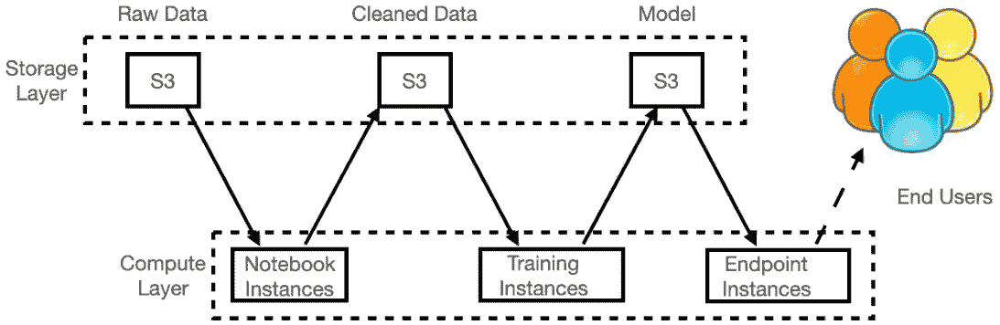

图 9.1 – Amazon SageMaker 实例不同层的示意图

现在，你将查看 Amazon SageMaker 控制台，并更好地了解它。一旦你登录到你的 AWS 账户并进入 Amazon SageMaker，你将看到类似于 *图 9**.2* 的内容：

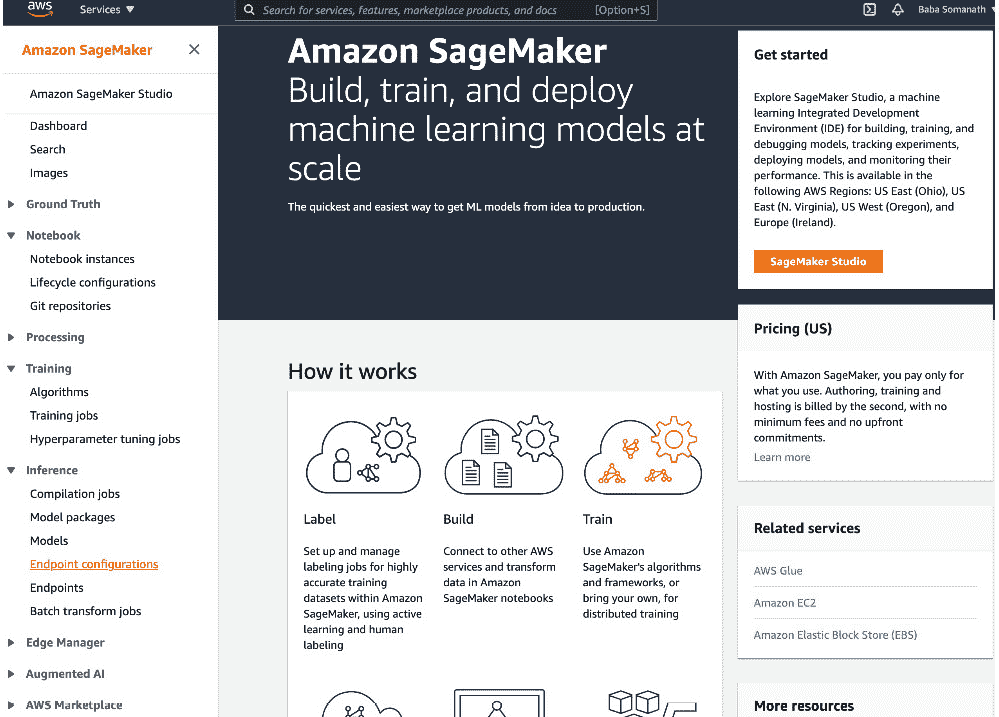

图 9.2 – 快速浏览 SageMaker 控制台

菜单左侧有三个不同的部分，分别标记为**笔记本**、**训练**和**推理**，在*图 9**.2*中已展开，以便您可以深入了解它们。

**笔记本**有三个不同的选项可供使用：

+   **笔记本实例**：这有助于您创建、打开、启动和停止笔记本实例。这些实例负责运行 Jupyter 笔记本。它们允许您根据用例的工作负载选择实例类型。最佳实践是使用笔记本实例来编排处理大型数据集的数据管道。例如，从笔记本实例调用 AWS Glue 进行 ETL 服务或 Amazon EMR 运行 Spark 应用程序。如果您被要求在 AWS 外部创建安全的笔记本实例，那么您需要关注端点安全、网络安全、启动机器、管理实例上的存储以及管理实例上运行的 Jupyter Notebook 应用程序。用户不需要使用 SageMaker 管理任何这些内容。

+   `pip install`或`conda install`。然而，一旦笔记本实例终止，自定义设置将会丢失。为了避免这种情况，您可以通过通过`/home/ec2-user/anaconda3/envs/`提供的脚本来自定义笔记本实例，并根据需要自定义特定环境。

+   **Git 仓库**：AWS CodeCommit、GitHub 或任何其他 Git 服务器都可以与笔记本实例关联，以持久化您的笔记本。如果提供访问权限，则其他开发者可以使用相同的笔记本进行协作，并以源代码控制的方式保存代码。Git 仓库可以通过此选项单独添加，或者可以在创建笔记本实例时关联。

如您在*图 9**.2*中看到的那样，**训练**提供了**算法**、**训练作业**和**超参数调整作业**。让我们了解它们的用法：

+   **算法**：这是决定在清洗后的数据上运行算法的第一步。您可以选择自定义算法或根据用例创建自定义算法。否则，您可以在清洗后的数据上运行 SageMaker 算法。

+   **训练作业**：您可以通过 API 调用从笔记本实例创建训练作业。您可以设置实例数量，输入数据源详细信息，执行检查点配置，以及输出数据配置。Amazon SageMaker 管理训练实例，并将模型工件作为输出存储在指定的位置。同时，也可以实现增量训练（即定期训练模型以获得更好的结果）和管理预留实例训练（即降低成本）。

+   **超参数调整作业**：通常，在训练过程之前，算法的超参数被设置好。在训练过程中，你让算法找出这些参数的最佳值。通过超参数调整，你可以获得具有最佳超参数值的最佳模型。这可以通过控制台或通过 API 调用来完成。同样，也可以从笔记本实例中执行。

**推理**有许多提供的服务，并且每天都在发展：

+   **编译作业**：如果你的模型使用 Keras、MXNet、ONNX、PyTorch、TFLite、TensorFlow 或 XGBoost 等机器学习框架进行训练，并且你的模型工件存储在 S3 存储桶中，那么你可以选择**目标设备**或**目标平台**。目标设备选项用于指定你将部署模型的位置，例如 AWS SageMaker ML 实例或 AWS IoT Greengrass 设备。目标平台选项用于决定你希望模型运行的操作系统、架构和加速器。你还可以将编译模块存储在你的 S3 存储桶中，以供将来使用。这实际上有助于你在跨平台模型部署中。

+   **模型包**：这些用于创建可部署的 SageMaker 模型。你可以创建自己的算法，使用模型包 API 打包它，并将其发布到 AWS Marketplace。

+   **模型**：模型是通过模型工件创建的。它们类似于带有变量的数学方程式；也就是说，你输入变量的值，得到一个输出。这些模型存储在 S3 中，并将由端点用于推理。

+   使用 `VariantWeight` API 使端点能够以 80% 的请求使用旧模型，以 20% 的请求使用新模型。这是数据变化迅速且模型需要定期训练和调整的最常见生产场景。另一个可能的用例是使用实时数据测试模型结果，然后可以将一定比例的请求路由到新模型，并监控结果以确定模型在实时未见数据上的准确性。

+   **端点**：这些用于创建一个模型暴露的 URL，可以请求模型返回结果。

+   `InputFilter`、`JoinSource` 和 `OutputFilter` API 可以用来关联输入记录与输出结果。

你已经对亚马逊 SageMaker 有了一个概述。现在，在下一节中，将你的知识付诸实践。

重要提示

亚马逊 SageMaker 控制台不断变化。在你阅读这本书的时候，控制台可能看起来会有所不同。

## 训练数据位置和格式

当你开始设置 AWS SageMaker 训练作业的旅程时，了解多样的数据存储和读取选项至关重要。为了确保无缝的训练体验，深入了解支持选项及其好处。

首先你将查看**支持的数据****存储选项**：

+   **Amazon Simple Storage Service (Amazon S3)**：

    +   **概述**：Amazon SageMaker 为存储训练数据集提供强大的支持，在 Amazon S3 上，提供可靠性和可伸缩性。

    +   **使用示例**：您可以使用 Amazon S3 前缀、清单文件或增强清单文件配置您的数据集。

+   **Amazon Elastic File System (Amazon EFS)**：

    +   **概述**：SageMaker 将其支持扩展到 Amazon EFS，便于访问数据集的文件系统。

    +   **使用示例**：存储在 Amazon EFS 中的数据必须在启动训练作业之前存在。

+   **Amazon FSx for Lustre**：

    +   **概述**：通过将 FSx for Lustre 文件系统挂载到训练实例上，实现高吞吐量和低延迟的文件检索。

    +   **使用示例**：FSx for Lustre 可以无缝扩展，为您的训练数据提供高性能选项。

这里是 **数据访问的** **输入模式**：

+   **文件模式**：

    +   **概述**：默认输入模式，在训练开始前 SageMaker 将整个数据集下载到 Docker 容器中。

    +   **使用示例**：与 SageMaker 本地模式兼容，并支持分布式训练的分区。

+   **快速文件模式**：

    +   **概述**：结合文件系统访问和管道模式的效率，快速文件模式在开始时识别数据文件，但延迟下载直到必要。

    +   **使用示例**：简化训练启动时间，尤其是在处理大数据集时特别有益。

+   **管道模式**：

    +   **概述**：直接从 Amazon S3 数据源流式传输数据，提供更快的启动时间和更好的吞吐量。

    +   **使用示例**：历史上使用过，但大部分已被更易于使用的快速文件模式所取代。

最后，看看 **专门的** **存储类别**：

+   **Amazon S3 Express One Zone**：

    +   **概述**：高性能的单可用区存储类别，优化计算性能和成本。

    +   **使用示例**：支持文件模式、快速文件模式和管道模式用于 SageMaker 模型训练。

+   **Amazon EFS 和 Amazon FSx for Lustre**：

    +   **概述**：SageMaker 支持 Amazon EFS 和 Amazon FSx for Lustre，为选择合适的训练数据存储解决方案提供灵活性。

    +   **使用示例**：将文件系统挂载到训练实例上，确保在训练期间无缝访问。

理解 AWS SageMaker 训练作业的数据存储和读取选项的细微差别，使您能够根据特定要求调整您的设置。在接下来的章节中，您将探索 AWS SageMaker 的更多方面，以加深对机器学习工作流程的理解和熟练度。让我们在下一节中将我们的知识付诸实践。

## 通过 Amazon SageMaker 笔记本实例进行实践操作

在本节中的第一步是创建一个 Jupyter Notebook，这需要一个笔记本实例。你可以通过以下方式创建笔记本实例：

1.  登录您的 AWS 账户。

1.  导航到 `服务 >` `Amazon SageMaker`。

1.  在左侧导航面板中，点击 **笔记本实例**，然后点击 **创建笔记本实例** 按钮。

1.  提供一个 `notebookinstance` 并保留 `ml.t2.medium` 设置。在 **IAM 角色** 的 **创建新角色** 中。您将被要求指定存储桶名称。为了本例的目的，它被选为任何存储桶。

1.  在成功创建角色后，您应该会看到类似于 *图 9.3* 的内容：

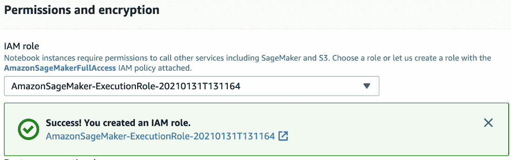

图 9.3 – Amazon SageMaker 角色创建

1.  将其他所有设置保留为默认值，然后点击 **创建笔记本实例** 按钮。

1.  一旦实例处于 `InService` 状态，选择实例。点击 **操作** 下拉菜单并选择 **打开 Jupyter**。这将打开您的 Jupyter Notebook。

1.  现在，您已经准备好在新建的实例上运行我们的 Jupyter Notebook。您将执行 **探索性数据分析 (EDA**) 并绘制不同类型的图表以可视化数据。一旦您熟悉了 Jupyter Notebook，您将构建一些模型来预测波士顿的房价。您将应用之前章节中学到的算法，并将它们进行比较以找到最佳模型，该模型根据我们的数据提供最佳预测。让我们开始吧。

1.  在 Jupyter Notebook 中，点击 **新建** 并选择 **终端**。在命令提示符中运行以下命令以将代码下载到实例：

    ```py
    sh-4.2$ cd ~/SageMaker/
    ```

    ```py
    sh-4.2$ git clone https://github.com/PacktPublishing/AWS-Certified-Machine-Learning-Specialty-MLS-C01-Certification-Guide-Second-Edition.git
    ```

1.  一旦 Git 仓库被克隆到 SageMaker 笔记本实例，请在命令提示符中输入 `exit` 以退出。现在，您的代码已准备好执行。

1.  导航到 Jupyter Notebook 的文件部分中的 `Chapter-9`，如图 *图 9.4* 所示：

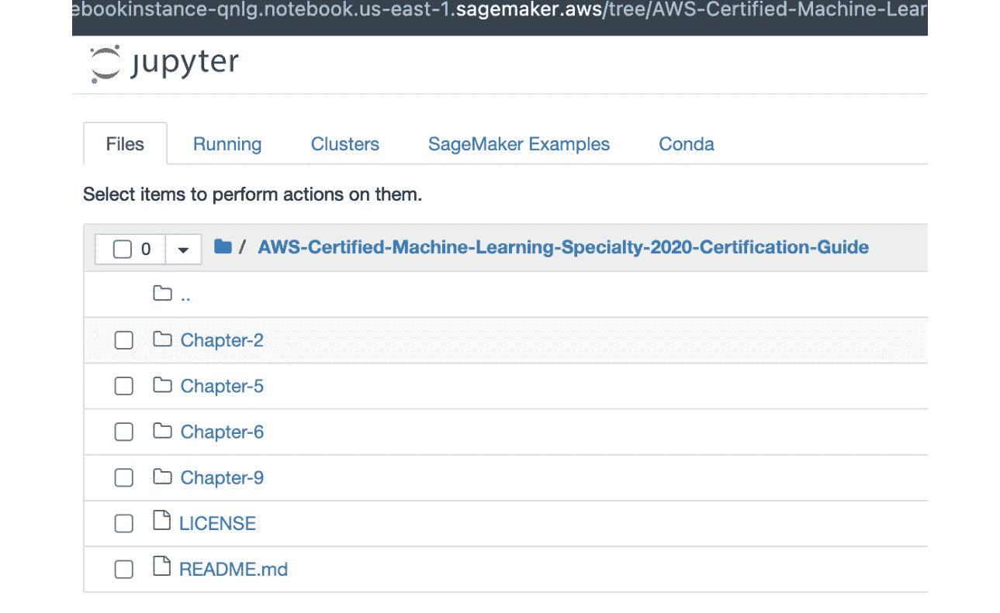

图 9.4 – Jupyter Notebook

1.  点击 `1.Boston-House-Price-SageMaker-Notebook-Instance-Example.ipynb` 中的第一个笔记本。它将提示您选择笔记本的内核。请选择 `conda_python3`，如图 *图 9.5* 所示：

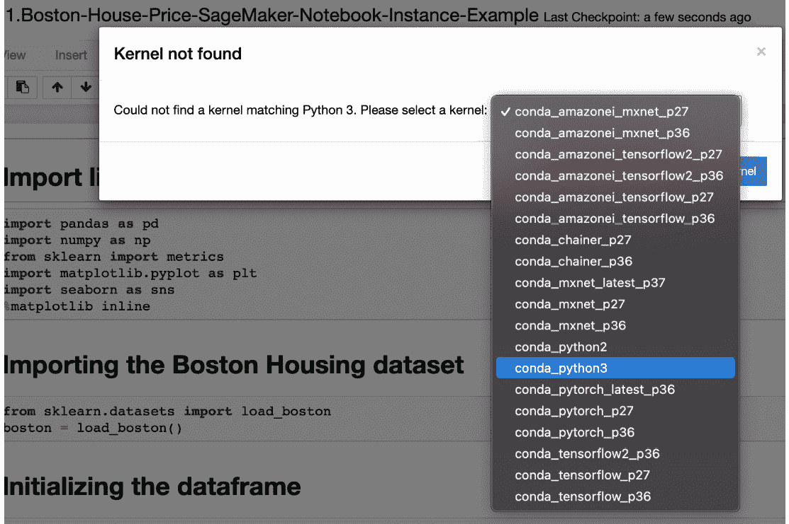

图 9.5 – Jupyter Notebook 内核选择

1.  从笔记本中导航到 `内核 > 重新启动并清除输出`。点击播放图标依次运行单元格。请确保您已运行每个单独的单元格并检查每个执行/运行的输出。

1.  您可以通过添加单元格和删除单元格来实验，以熟悉 Jupyter Notebook 操作。在一篇段落中，有一个 bash 命令允许您从笔记本中安装 `xgboost` 库。

1.  最后一个单元格解释了您如何比较不同建模技术的不同分数，以数学方式得出结论。*图 9.6* 清楚地显示了预测波士顿房价的最佳模型是 XGBoost：

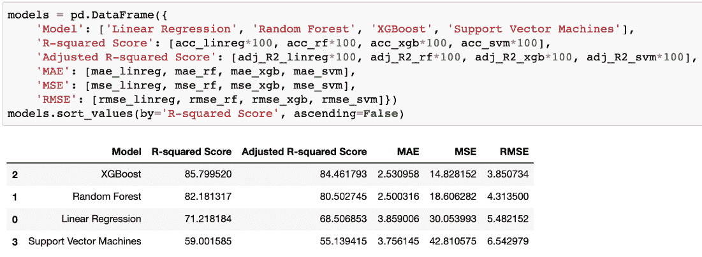

图 9.6 – 模型比较

1.  一旦您完成此笔记本的执行，请随时关闭内核并从 SageMaker 控制台停止您的笔记本实例。这是一种减少成本的最佳实践。

在下一个实践操作部分，您将熟悉 Amazon SageMaker 的训练和推理实例。您还将使用 Amazon SageMaker API 使此过程更简单。您将使用与之前示例中相同的笔记本实例。

## 通过 Amazon SageMaker 的训练和推理实例进行实践操作

在本节中，您将了解如何训练模型并将模型托管以生成其预测结果。让我们通过使用之前示例中的笔记本实例来深入了解：

1.  在[`console.aws.amazon.com/sagemaker/home?region=us-east-1#/notebook-instances`](https://console.aws.amazon.com/sagemaker/home?region=us-east-1#/notebook-instances)登录您的 AWS 账户。

1.  点击`notebookinstance`。一旦状态移动到`InService`，在新标签页中打开它，如图 9.7 所示：

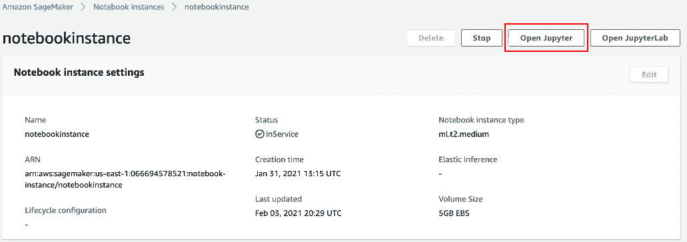

图 9.7 – InService 实例

1.  从 Jupyter Notebook 主页导航到名为**SageMaker Examples**的标签页。

1.  选择`k_nearest_neighbors_covtype.ipynb`笔记本。点击**使用**并创建一个副本。

1.  当您运行以下代码块，如图 9.8 所示时，您还可以在 SageMaker 主页的`训练 > 训练作业`中检查训练作业：

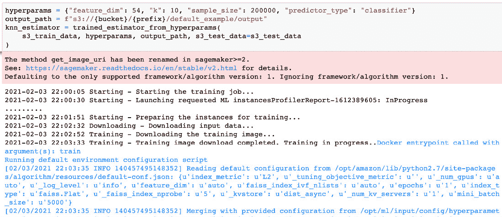

图 9.8 – SageMaker fit API 调用

1.  训练作业看起来与*图 9.9*相似。它在后端启动一个 ECS 容器，并使用之前示例中创建的 IAM 执行角色来运行此请求的训练作业：

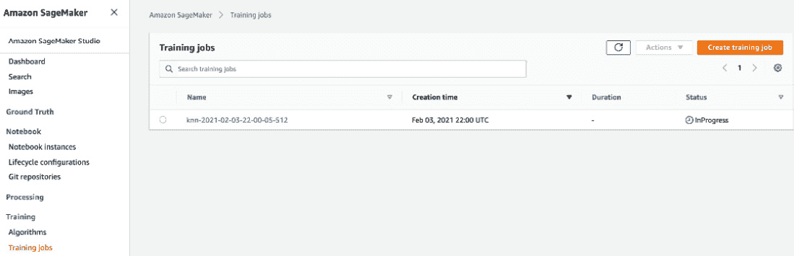

图 9.9 – 训练作业

1.  如果您进入并检查 CloudWatch 中的日志，它会为您提供有关容器及其执行步骤的更多详细信息。作为一名机器学习工程师，检查您算法的 CloudWatch 指标是值得的。

1.  现在，如果您在笔记本中运行以下段落，如图 9.10 所示，那么它将创建一个端点配置和一个部署了之前训练作业中的模型的端点。

1.  我已将实例类型更改为降低成本。这是将托管您的模型的服务器或机器。请明智地选择您的实例。您将在下一节中了解如何选择实例类型。我还已更改`endpoint_name`，以便它可以轻松识别：

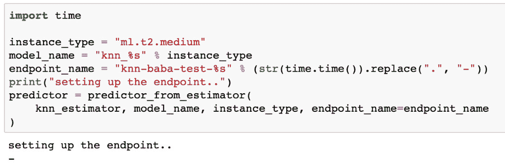

图 9.10 – 使用端点详细信息创建预测对象

1.  导航到`推理 > 端点`。这将显示由上一段执行结果创建的端点。此端点有一个配置，可以通过`推理 > 端点配置`进行导航和跟踪。

1.  如果您在笔记本中查看**推理**部分，您会注意到它使用测试数据来预测结果。它使用 SageMaker API 的预测器对象进行预测。预测器对象包含端点详情、模型名称和实例类型。

1.  对端点的 API 调用发生在**推理**部分，并通过创建笔记本实例时使用的 IAM 角色进行身份验证。相同的 API 调用可以通过 CloudWatch 调用指标进行追踪。

1.  最后，在笔记本中运行`delete_endpoint`方法将删除端点。要删除端点配置，请转到`Inference > Endpoint Configurations`并选择屏幕上的配置。点击`Actions > Delete >` `Delete`。

1.  现在，请随意关闭内核并从 SageMaker 控制台停止您的笔记本实例。这是一种减少成本的最佳实践。

在本节中，您学习了如何使用笔记本实例、训练实例、推理端点和端点配置来清理我们的数据，训练模型，并从中生成预测结果。在下一节中，您将学习关于模型调优的内容。

# 模型调优

在*第七章*“评估和优化模型”中，您学习了关于模型调优的许多重要概念。现在，让我们从实际的角度来探讨这个话题。

为了在 SageMaker 上调整模型，您必须调用`create_hyper_parameter_tuning_job`并传递以下主要参数：

+   `HyperParameterTuningJobName`：这是调优作业的名称。跟踪代表您的调优作业启动的训练作业非常有用。

+   `HyperParameterTuningJobConfig`：在这里，您可以配置您的调优选项。例如，您想调整哪些参数，它们的值范围，优化的类型（例如随机搜索或贝叶斯搜索），您想要启动的最大训练作业数量，等等。

+   `TrainingJobDefinition`：在这里，您可以配置您的训练作业。例如，数据通道、输出位置、资源配置、评估指标和停止条件。

在 SageMaker 中，您想要用来评估模型并选择最佳模型的主要指标被称为**目标指标**。

在以下示例中，您正在为基于决策树的算法配置`HyperParameterTuningJobConfig`。您想检查`max_depth`超参数的最佳配置，该参数负责控制树的深度。

在`IntegerParameterRanges`中，您必须指定以下内容：

+   超参数名称

+   您想要测试的最小值

+   您想要测试的最大值

重要提示

每种超参数必须适合参数范围部分中的一个，例如分类、连续或整数参数。

在`ResourceLimits`中，您指定了训练作业的数量以及您想要运行的并行作业数量。请记住，调优过程的目标是执行许多具有不同超参数设置的训练作业，以便从中选择最佳的一个用于最终模型。这就是为什么您必须指定这些训练作业执行规则的原因。

然后，您在`Strategy`中设置我们的搜索策略，最后在`HyperParameterTuningJobObjective`中设置目标函数：

```py
tuning_job_config = {
```

```py
    "ParameterRanges": {
```

```py
      "CategoricalParameterRanges": [],
```

```py
      "ContinuousParameterRanges": [],
```

```py
      "IntegerParameterRanges": [
```

```py
        {
```

```py
          "MaxValue": "10",
```

```py
          "MinValue": "1",
```

```py
          "Name": "max_depth"
```

```py
        }
```

```py
      ]
```

```py
    },
```

```py
    "ResourceLimits": {
```

```py
      "MaxNumberOfTrainingJobs": 10,
```

```py
      "MaxParallelTrainingJobs": 2
```

```py
    },
```

```py
    "Strategy": "Bayesian",
```

```py
    "HyperParameterTuningJobObjective": {
```

```py
      "MetricName": "validation:auc",
```

```py
      "Type": "Maximize"
```

```py
    }
```

```py
  }
```

您需要设置的第二个重要配置是`TrainingJobDefinition`。在这里，您必须指定将要执行的所有训练作业的详细信息。其中最重要的设置之一是`TrainingImage`设置，它指的是将启动以执行训练过程的容器。这个容器，正如预期的那样，必须实现您的训练算法。

在这里，您提供了一个内置算法的示例，即 eXtreme Gradient Boosting，以便您可以按以下方式设置训练镜像：

```py
training_image = sagemaker.image_uris.retrieve('xgboost', region, '1.0-1')
```

然后，您可以继续设置您的训练定义：

```py
training_job_definition = {
```

```py
    "AlgorithmSpecification": {
```

```py
      "TrainingImage": training_image,
```

```py
      "TrainingInputMode": "File"
```

```py
    },
```

接下来，您必须指定数据输入配置，这通常被称为数据通道。在下面的代码部分，您正在设置两个数据通道——训练和验证：

```py
    "InputDataConfig": [
```

```py
      {
```

```py
        "ChannelName": "train",
```

```py
        "CompressionType": "None",
```

```py
        "ContentType": "csv",
```

```py
        "DataSource": {
```

```py
          "S3DataSource": {
```

```py
            "S3DataDistributionType": "FullyReplicated",
```

```py
            "S3DataType": "S3Prefix",
```

```py
            "S3Uri": s3_input_train
```

```py
          }
```

```py
        }
```

```py
      },
```

```py
      {
```

```py
        "ChannelName": "validation",
```

```py
        "CompressionType": "None",
```

```py
        "ContentType": "csv",
```

```py
        "DataSource": {
```

```py
          "S3DataSource": {
```

```py
            "S3DataDistributionType": "FullyReplicated",
```

```py
            "S3DataType": "S3Prefix",
```

```py
            "S3Uri": s3_input_validation
```

```py
          }
```

```py
        }
```

```py
      }
```

```py
    ],
```

您还需要指定结果将存储的位置：

```py
    "OutputDataConfig": {
```

```py
      "S3OutputPath": "s3://{}/{}/output".format(bucket,prefix)
```

```py
    },
```

最后，您设置资源配置、角色、静态参数和停止条件。在下面的代码部分，您想要使用两个类型为`ml.c4.2xlarge`的实例，每个实例具有 10 GB 的存储空间：

```py
    "ResourceConfig": {
```

```py
      "InstanceCount": 2,
```

```py
      "InstanceType": "ml.c4.2xlarge",
```

```py
      "VolumeSizeInGB": 10
```

```py
    },
```

```py
    "RoleArn": <<your_role_name>>,
```

```py
    "StaticHyperParameters": {
```

```py
      "eval_metric": "auc",
```

```py
      "num_round": "100",
```

```py
      "objective": "binary:logistic",
```

```py
      "rate_drop": "0.3",
```

```py
      "tweedie_variance_power": "1.4"
```

```py
    },
```

```py
    "StoppingCondition": {
```

```py
      "MaxRuntimeInSeconds": 43200
```

```py
    }
```

```py
}
```

重要提示

请注意，您在这个配置文件中使用了其他变量，`bucket`和`prefix`，分别应该替换为您的存储桶名称和前缀键（如果需要），您还引用了`s3_input_train`和`s3_input_validation`，这两个变量指向 S3 中的训练和验证数据集。

一旦您设置了配置，您就可以启动调优过程：

```py
smclient.create_hyper_parameter_tuning_job(
```

```py
     HyperParameterTuningJobName = "my-tuning-example",
```

```py
     HyperParameterTuningJobConfig = tuning_job_config,
```

```py
     TrainingJobDefinition = training_job_definition
```

```py
)
```

接下来，让我们了解一下如何跟踪此过程的执行。

## 跟踪训练作业和选择最佳模型

一旦您开始调优过程，您可能还想检查两个额外的步骤：跟踪调优过程和选择获胜模型（即具有最佳超参数集的那个）。

为了找到您的训练作业，您应该前往 SageMaker 控制台并导航到超参数训练作业。然后，您将找到包括您自己的执行调优作业列表：

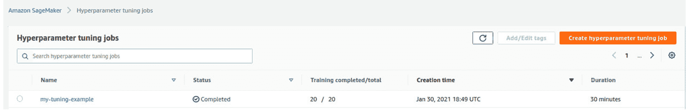

图 9.11 – 查找您的调优作业

如果您通过点击其名称下方的链接访问您的调优作业，您将找到一个包含有关调优过程最相关信息概要的页面。在**训练作业**标签页上，您将看到所有已执行的训练作业：

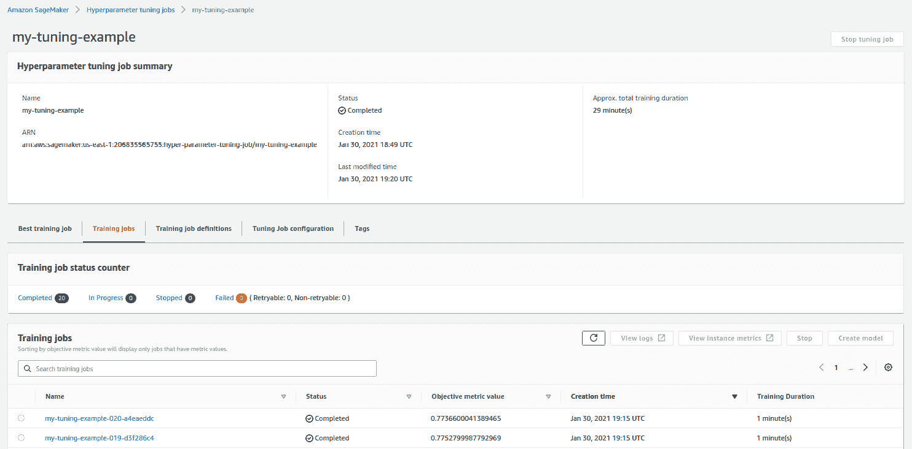

图 9.12 – 调优过程中的训练作业摘要

最后，如果你点击 **最佳训练作业** 选项卡，你将找到适合你模型的最佳超参数集，包括一个方便的按钮，用于根据刚刚找到的最佳超参数创建新模型：

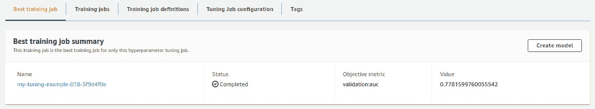

图 9.13 – 寻找最佳的超参数集

如你所见，SageMaker 非常直观，一旦你了解了模型优化的主要概念，使用 SageMaker 应该会更容易。现在，你理解了如何根据我们的特定需求使用 SageMaker。在下一节中，你将探索如何为各种用例选择实例类型以及笔记本的安全性。

# 在 Amazon SageMaker 中选择实例类型

SageMaker 使用按使用付费的模式。对此没有最低费用。

当你考虑 SageMaker 上的实例时，一切始于一个 EC2 实例。这个实例负责你所有的处理。这是一个托管 EC2 实例。这些实例不会出现在 EC2 控制台中，也无法通过 SSH 访问。这个实例类型的名称以 `ml` 开头。

SageMaker 提供以下家族的实例：

+   **t** 系列家族：这是一个可突发 CPU 家族。使用这个家族，你得到 CPU 和内存的平衡比率。这意味着如果你有一个长时间运行的训练作业，那么随着时间的推移，你会因为消耗 CPU 信用额度而失去性能。如果你有非常小的作业，那么它们是成本效益的。例如，如果你想启动一个笔记本实例来运行训练作业，那么这个家族是最合适且成本效益最高的。

+   **m** 系列家族：在前一个家族中，你看到由于它们的可突发性，CPU 信用额度消耗得更快。如果你有一个需要恒定吞吐量的长时间运行的 ML 任务，那么这个系列就是正确的选择。它具有与 **t** 系列家族相似的 CPU 和内存比率。

+   **r** 系列家族：这是一个内存优化的家族。*你何时需要这个？* 好吧，想象一个用例，你需要在内存中加载数据并对数据进行数据工程。在这种情况下，你需要更多的内存，并且你的工作将是内存优化的。

+   **c** 系列家族：c 系列实例是计算优化的。这是需要更高计算能力和较少内存来存储数据的工作的要求。例如，如果你参考以下表格，c5.2x large 有 8 个 vCPU 和 16 GiB 内存，这使得它具有较少内存的计算优化。例如，如果一个用例需要在较少的记录上进行测试，并且它很擅长计算，那么这个实例家族是获取一些来自巨大 **DataFrame** 的样本记录并测试你的算法的最佳选择。

+   **p** 家族：这是一个支持加速计算作业（如训练和推理）的 GPU 家族。值得注意的是，**p**-家族实例非常适合处理大型、分布式训练作业，这减少了训练所需的时间，因此成本效益更高。p3/p3dn GPU 计算实例每秒可以达到高达 1 petaFLOP 的计算能力，配备高达 256 GB 的 GPU 内存和 100 Gbps（千兆位）的联网速度，使用 8x NVIDIA v100 GPU。它们高度优化用于训练，并且不用于推理。

+   **g** 家族：对于成本效益高、规模小的训练作业，**g**-家族 GPU 实例是理想的。G4 对于 GPU 实例的推理成本最低。它使用 T4 NVIDIA GPU。G4 GPU 计算实例可以达到 520 TeraFLOPs 的计算时间，配备 8x NVIDIA T4 GPU。这个实例家族最适合简单的网络。

在以下表格中，您可以看到每个家族的 2x 大型实例类型的 CPU 和内存比率的视觉比较：

| **t3.2x 大型** | **m5.2x 大型** | **r5.2x 大型** | **c5.2x 大型** | **p3.2x 大型** | **g4dn.2x 大型** |
| --- | --- | --- | --- | --- | --- |
| 8 个 vCPU，32 GiB | 8 个 vCPU，32 GiB | 8 个 vCPU，64 GiB | 8 个 vCPU，16 GiB | 8 个 vCPU，61 GiB | 8 个 vCPU，32 GiB |

表 9.1 – 显示不同实例类型 CPU 和内存比率的表格

重要提示

为了容易记住，您可以想象 t 代表微型，m 代表中型，c 代表计算，p 和 g 代表 GPU。与 CPU 相关的家族实例类型是 t、m、r 和 c。与 GPU 相关的家族实例类型是 p 和 g。

## 选择训练作业的正确实例类型

没有确定所需实例类型的经验法则。它根据数据的大小、网络的复杂性、所涉及的 ML 算法以及时间、成本等其他因素而变化。提出正确的问题将使您节省金钱并使您的项目具有成本效益。

如果决定因素是**实例大小**，那么将问题分类为 CPU 或 GPU 问题就是正确的步骤。一旦这样做，那么考虑它是否可以是多 GPU 或多 CPU，回答关于分布式训练的问题，就很好了。这也解决了您的**实例数量**因素。如果它计算密集，那么检查内存需求也是明智的。

下一个决定因素是**实例家族**。这里正确的问题是，“所选实例是否优化了时间和成本？”在前一步中，您已经确定问题是否可以通过 CPU 或 GPU 解决得最好，这缩小了选择过程。现在，让我们了解推理作业。

## 选择推理作业的正确实例类型

在生产中，机器学习的成本和复杂性的主要部分是推理。通常，推理在实时运行的单个输入上执行。推理作业通常计算/内存密集度较低。由于它们一直运行并服务于最终用户请求或集成到更广泛的应用中，因此它们必须高度可用。

您可以根据给定的工作负载选择您迄今为止了解的任何实例类型。除此之外，AWS 还有**Inf1**和**弹性推理**类型的实例用于推理。弹性推理允许您将 GPU 实例的一部分附加到任何 CPU 实例上。

让我们看看一个应用程序与推理作业集成的示例。在这种情况下，应用程序的 CPU 和内存需求与推理作业的 CPU 和内存需求不同。对于此类用例，您需要选择正确的实例类型和大小。在这种情况下，将您的应用程序舰队和推理舰队分开是很好的。这可能需要一些管理。如果此类管理对您的需求来说是个问题，那么请选择弹性推理，其中应用程序和推理作业可以放置在一起。这意味着您可以在同一舰队上托管多个模型，并且您可以在内存中将所有这些不同的模型加载到不同的加速器上，并发请求可以提供服务。

在决定生产环境中的实例类型和家族之前，始终建议您在较低的环境中运行一些示例。对于生产环境，您需要管理您为 Amazon SageMaker 托管模型设置的扩展性配置。您将在下一节中了解这一点。

# 管理扩展性配置

要为您的模型启动自动扩展，您可以通过 SageMaker 控制台、**AWS 命令行界面（AWS CLI）**或通过**应用程序自动扩展 API**使用**AWS SDK**。对于倾向于 CLI 或 API 的用户，该过程涉及将模型注册为可扩展的目标，定义规模化策略，然后应用它。如果您选择 SageMaker 控制台，只需在导航面板中转到**推理**下的**端点**，找到您的模型端点名称，并选择它以及变体名称以激活自动扩展。

现在让我们深入了解规模化策略的复杂性。

## 规模化策略概述

自动扩展由规模化策略驱动，这些策略决定了如何根据不同的工作负载添加或删除实例。您有两个选项可供选择：目标跟踪和步长规模化策略。

目标跟踪规模化策略：我们的建议是利用目标跟踪规模化策略。在这里，您选择一个 CloudWatch 指标并设置一个目标值。自动扩展负责创建和管理 CloudWatch 警报，调整实例数量以保持指标接近指定的目标值。例如，一个以 InvocationsPerInstance 指标为目标值 70 的规模化策略确保该指标在该值附近波动。

步扩展策略：步扩展用于高级配置，允许你在特定条件下指定实例部署。然而，为了简单和完全自动化，目标跟踪扩展更受欢迎。请注意，步扩展仅通过 AWS CLI 或应用程序自动扩展 API 管理。

创建目标跟踪扩展策略涉及指定指标，例如每实例的平均调用次数，以及目标值，例如每分钟每实例 70 次调用。你可以根据预定义或自定义指标创建目标跟踪扩展策略。可选地还可以配置冷却时间，以防止容量快速波动。

## 根据时间表进行扩展

调度操作允许在特定时间进行扩展活动，无论是作为一次性事件还是按重复的时间表进行。这些操作可以与你的扩展策略协同工作，允许根据不断变化的工作负载做出动态决策。调度扩展仅通过 AWS CLI 或应用程序自动扩展 API 管理。

## 最小和最大扩展限制

在制定扩展策略之前，设置最小和最大扩展限制至关重要。最小值至少设置为 1，表示实例的最小数量，而最大值表示上限。SageMaker 自动扩展遵循这些限制，并在流量为零时自动缩放到指定的最小实例。

你有三个选项来指定这些限制：

+   使用控制台更新最小实例计数和最大实例计数的设置。

+   使用 AWS CLI，包括与 register-scalable-target 命令一起使用的 --min-capacity 和 --max-capacity 选项。

+   调用 RegisterScalableTarget API，指定 MinCapacity 和 MaxCapacity 参数。

## 冷却时间

冷却时间对于防止缩放或扩展活动中的过度扩展至关重要。它减慢后续的扩展操作，直到该周期结束，从而保护免受容量快速波动的影响。你可以在扩展策略中配置冷却时间。

如果未指定，默认的冷却时间为 300 秒，适用于缩放和扩展。根据你的模型流量特征调整此值；如果频繁出现峰值或多个扩展策略，请考虑增加，如果需要快速添加实例，则减少。

当你开始优化模型的可伸缩性时，请记住这些配置以确保无缝且成本效益的体验。在下一节中，你将深入了解并理解保护我们的 Amazon SageMaker 笔记本的不同方法。

# 保护 SageMaker 笔记本

如果你正在阅读本章的这一部分，那么你已经学习了如何使用笔记本实例，应该选择哪种类型的训练实例，以及如何配置和使用端点。现在，让我们学习如何保护这些实例。以下方面有助于保护实例：

+   **加密**：当你谈论通过加密来保护某物时，你是在谈论保护数据。但这意味着什么？这意味着使用加密保护静态数据，使用加密保护传输中的数据，并通过 TLS 1.2 加密使用 KMS 来实现更好的角色分离和互联网流量隐私。可以使用 AWS 管理的 KMS 密钥启动带有加密卷的 SageMaker 实例。这有助于你默认保护 Jupyter Notebook 服务器。

+   当你调用 `CreateNotebookInstance` 或 `UpdateNotebookInstance` 时，`RootAccess` 字段将设置为 `Disabled`。数据科学家将能够访问他们的用户空间并安装 Python 包。然而，他们无法以 sudo 权限登录 root 用户并对操作系统进行更改。

+   **IAM 角色**：在启动笔记本实例期间，创建一个 IAM 角色用于执行或使用现有的角色进行执行是必要的。这是用来启动与角色关联的实例配置文件的服务管理 EC2 实例。此角色将根据附加到该角色的策略限制 API 调用。

+   **VPC 连接**：当你启动 SageMaker 笔记本实例时，默认情况下，它将在 SageMaker 服务账户内创建，该账户拥有服务管理的 VPC，并且默认情况下将通过互联网网关访问互联网，该网关由服务管理。如果你只处理 AWS 相关的服务，那么建议你在你的 VPC 内的私有子网中启动 SageMaker 笔记本实例，并使用一个定制良好的安全组。你可以通过连接到该 VPC 的 VPC 端点从笔记本实例调用或使用 AWS 服务。最佳实践是通过端点策略来控制它们，以实现更好的 API 控制。这强制限制了数据从你的 VPC 和安全环境外流出。为了捕获所有网络流量，你可以开启 VPC 流量日志，这些日志可以通过 CloudWatch 进行监控和跟踪。

+   当你调用 `CreateTrainingJob`、`CreateHyperParameterTuningJob` 或 `CreateModel` 时，将 `EnableNetworkIsolation` 参数设置为 `True`。网络隔离可以与 VPC 一起使用，这确保了容器不能进行任何出站网络调用。

+   **将私有网络连接到你的 VPC**：你可以在你的 VPC 的私有子网中启动你的 SageMaker 笔记本实例。这可以通过与私有网络通信来访问你的私有网络中的数据，这可以通过使用 Amazon VPN 或 AWS Direct Connect 将你的私有网络连接到你的 VPC 来实现。

在本节中，你学习了多种方法来确保我们的 SageMaker 笔记本的安全性。在下一节中，你将了解 SageMaker Debugger。

# SageMaker Debugger

在本节中，你将了解 Amazon SageMaker Debugger，揭示监控、分析和调试 ML 模型训练的复杂性：

+   **监控和性能分析**：SageMaker Debugger 能够捕捉模型指标，并在训练过程中实时监控系统资源，无需额外编写代码。它不仅为训练过程提供了一个窗口，还赋予了即时问题修正的能力，加速了训练过程并提升了模型质量。

+   **自动检测和分析**：真正的节省时间工具，Debugger 能够自动识别并通知您常见的训练错误，例如梯度值过大或过小。告别那些需要数日排查问题的日子；Debugger 将时间缩短到仅仅数小时。

+   **性能分析能力**：通过 Debugger 进入性能分析的领域，它细致地监控系统资源利用率指标，并允许您对训练作业进行性能分析。这涉及到从您的机器学习框架收集详细指标，识别资源使用中的异常，并迅速定位瓶颈。

+   **内置分析和操作**：Debugger 引入了内置的分析规则，不断地检查发出的训练数据，包括输入、输出和转换（张量）。但这还不是全部——用户可以自由地创建自定义规则，分析特定条件，甚至可以指定由规则事件触发的操作，例如停止训练或发送通知。

+   **与 SageMaker Studio 集成**：您可以在 SageMaker Studio 中无缝地可视化 Debugger 的结果，享受展示 CPU 利用率、GPU 活动、网络使用情况等图表的热图。还有一个热图，提供了系统资源利用的视觉时间线。

+   **性能分析输出**：深入了解性能分析结果，这是一份详尽的系统资源使用报告，涵盖了 GPU、CPU、网络、内存和 I/O。它是您了解训练作业内部运作的一站式商店。

+   **调试洞察和优化**：除了检测之外，Debugger 还进化成为一个顾问，识别训练作业中的问题，提供洞察，并提出优化建议。无论是调整批量大小还是改变分布式训练策略，Debugger 都会引导您达到最佳性能。

+   **与 CloudWatch 集成**：通过与 CloudWatch 的集成，Debugger 让您保持同步。配置特定条件的警报，确保您始终能够领先于潜在的问题。

+   **可下载的报告**：不要错过任何细节——下载 HTML 报告，总结 Debugger 的洞察力和性能分析结果，以便进行彻底的离线分析。

简而言之，Amazon SageMaker Debugger 作为一个全面的工具包出现，让您能够优雅地监控、分析和调试您的机器学习模型。它不仅仅是一个工具；它是您在模型优化旅程中的盟友。在下一节中，您将了解 SageMaker AutoPilot/AutoML 的使用方法。

# SageMaker Autopilot

机器学习模型开发在历史上一直是一项艰巨的任务，需要相当的专业知识和时间。Amazon SageMaker Autopilot 的出现成为了一个颠覆性的变革，简化了这个复杂的过程，并将其转变为一种流畅的体验。

Amazon SageMaker Autopilot 提供了一系列丰富的功能，以简化机器学习模型的开发：

+   **自动模型构建**：SageMaker Autopilot 通过承担责任并自动化整个流程，简化了构建机器学习模型的复杂性。用户只需简单提供表格数据集并指定预测的目标列即可。

+   **数据处理和增强**：Autopilot 无缝处理数据预处理任务，填补缺失数据，提供数据集列的统计洞察，并从非数值列中提取有价值的信息。这保证了输入数据为模型训练进行了精细调整。

+   **问题类型检测**：Autopilot 通过根据提供数据的特征自动检测问题类型——无论是分类还是回归——来展示其智能。

+   **算法探索和优化**：用户可以探索众多高性能算法，Autopilot 高效地训练和优化数百个模型，以找到与用户需求最匹配的一个。整个过程是自动化的，减轻了用户的工作负担。

+   **实际案例**：想象一家零售公司试图预测客户购买行为。使用 SageMaker Autopilot，公司输入历史购买数据，指定目标变量（例如，客户是否进行购买），然后 Autopilot 接管，自主探索和优化各种机器学习模型。这便于部署预测模型，无需深厚的机器学习专业知识。在另一种情况下，一家评估信用风险的金融机构可以利用 SageMaker Autopilot。通过提供包含客户信息和信用历史的数据集，并指定目标变量（信用度），该机构可以利用 Autopilot 自动构建、训练和优化模型，以进行精确的信用风险预测。

+   **模型理解和部署**：SageMaker Autopilot 不仅自动化了模型创建，而且高度重视可解释性。用户可以了解生成的模型是如何进行预测的。Amazon SageMaker Studio Notebook 作为访问、改进和重新创建模型的平台，确保了模型的持续改进。

Amazon SageMaker Autopilot 标志着机器学习领域的转变，使其对更广泛的受众变得可访问。通过自动化模型开发的繁重工作，Autopilot 使用户能够专注于业务问题的战略层面，使他们从机器学习的复杂性中解放出来。随着组织采用机器学习进行决策，SageMaker Autopilot 作为一种革命性工具出现，无需广泛的数据科学专业知识即可释放人工智能的力量。在下一节中，您将深入了解模型监控。

# SageMaker 模型监控器

在机器学习不断发展的领域中，确保模型在现实世界生产环境中的可靠性和鲁棒性至关重要。在本节中，您将深入了解 Amazon SageMaker 模型监控器的深远意义、实际应用和强大功能——这是一个专门针对解决实时生产环境中模型漂移挑战的组件。

+   **模型监控的本质**：随着机器学习模型进入现实世界的部署，由于数据分布的变化或用户行为的改变，其有效性的持续下降——这被称为模型漂移，构成了一个重大威胁。持续的监控成为主动识别和纠正这些偏差的关键，保护机器学习预测的准确性和可靠性，从而确保业务成果。

+   **自动守护者**：Amazon SageMaker 模型监控器在机器学习领域成为一盏指路明灯，为生产中机器模型的持续监控提供了一种自动化的解决方案。从检测数据漂移到确保模型质量，它提供了一套全面的工具，以应对现实世界数据不断变化的性质带来的挑战。

+   **自动化分析**：模型监控器接管模型分析工作，定期根据预定义或用户提供的规则自动检查部署的模型。这减轻了用户构建自定义工具的负担。

+   **统计规则**：通过内置的统计规则，模型监控器覆盖了潜在问题的整个范围，包括数据分布中的异常值、完整性和漂移。这些规则使系统能够定位异常和偏离预期模型行为的情况。

+   **CloudWatch 集成**：无缝集成到 Amazon CloudWatch，当规则违反发生时，模型监控器会发出指标。用户可以根据这些指标设置警报，确保及时通知并允许及时干预。

+   **数据漂移监控**：在识别数据分布变化方面表现出色，模型监控器提供了关于输入数据随时间演变的见解。无论是单位的变化还是突然涌入的空值，模型监控器始终保持警惕。

+   **模型质量监控**：除了数据漂移之外，系统还会监控模型本身的性能。模型准确性的下降会触发警报，通知用户可能影响模型预测能力的潜在问题。

Amazon SageMaker 模型监控器为部署和监控模型提供了一个无缝的端到端流程。从模型部署和数据捕获到基准测试和持续监控，整个过程确保了在时间上维护模型稳定性的全面方法。

在机器学习的广阔领域中，Amazon SageMaker 模型监控器作为一个指导力量，满足了在生产中对模型持续监控的迫切需求。其自动分析、与 CloudWatch 的集成以及对数据和模型质量漂移的关注，使其成为依赖机器学习进行关键决策的组织不可或缺的工具。随着企业越来越依赖机器学习模型的稳定性和准确性，SageMaker 模型监控器屹立不倒，为机器学习领域的不断变化挑战提供了强大的解决方案。在下一节中，你将了解如何通过训练编译器使我们的 SageMaker 训练过程更快。

# SageMaker 训练编译器

如果你已经到达这一部分，你即将深入探索**SageMaker 训练编译器（SMTC）**的世界，这是一个颠覆性的工具，旨在通过优化复杂的训练脚本来加速你在 SageMaker 上训练机器学习模型。想象一下：更快的训练，更快的模型开发，以及实验的大门敞开。这就是 SMTC 的主要目标——提高训练速度，为你的模型开发之旅带来敏捷性。以下是使用 SMTC 的主要优势：

+   **扩展挑战**：踏上训练大规模模型的旅程，尤其是那些具有数十亿参数的模型，常常感觉像是在未知的工程领域导航。然而，SMTC 通过优化整个训练过程，克服了扩展带来的挑战。

+   **核心效率**：SMTC 接管了 GPU 内存的使用，引领了一个更大的批大小不仅成为可能，而且成为现实的领域。这种优化转化为加速的训练时间，对于任何寻求效率提升的数据科学家来说都是一大福音。

+   **成本节约**：时间就是金钱，在机器学习的领域也是如此。通过加速训练作业，SMTC 不仅加快了你的模型，而且有可能降低你的成本。如何？嗯，你是根据训练时间付费的，而更快的训练意味着时钟上的时间更少。

+   **吞吐量提升**：该工具已经证明了吞吐量的提升，在不牺牲模型准确性的情况下实现了更快的训练。

下面是一些使用 SMTC 在 LLMs 场景/用例中的效率、成本节约、自动扩展的例子，以及 NLP 问题的批大小优化：

+   **大型语言模型 (LLMs)**：SMTC 对于训练包括 BERT、DistilBERT、RoBERTa 和 GPT-2 在内的大型语言模型特别有益。这些模型涉及庞大的参数大小，使得训练的扩展成为一个非平凡的任务。

+   **批量大小优化**：SMTC 允许用户尝试更大的批量大小，这对于在自然语言处理 (NLP) 或计算机视觉等任务中实现效率提升特别有用。

SageMaker 训练编译器不仅仅是一个黑盒；它是一位细致的工匠正在工作。它将您的深度学习模型从其高级语言表示转换为硬件优化的指令。这包括图级别优化、数据流级别优化和后端优化，最终产生一个与硬件资源优雅共舞的优化模型。结果？得益于编译的魔力，训练速度更快。在下一节中，您将了解 Amazon SageMaker 数据清洗器——SageMaker Studio Classic 中的一个重要组件。

# SageMaker 数据清洗器

在本节中，您将揭示数据清洗器的意义和好处，剖析其在导入、准备、转换、特征化和分析数据方面的端到端解决方案角色：

+   **轻松导入数据**：数据清洗器简化了从各种来源导入数据的过程，例如 Amazon **简单存储服务 (S3**)、Amazon Athena、Amazon Redshift、Snowflake 和 Databricks。无论您的数据位于云端还是特定数据库中，数据清洗器都能无缝连接到源并导入数据，为全面的数据处理奠定基础。

+   **构建数据流**：想象一下您可以轻松设计数据流，规划一系列机器学习数据准备步骤的场景。这正是数据清洗器大放异彩的地方。通过结合来自不同来源的数据集并指定所需的转换，您塑造了一个准备就绪的数据准备工作流程，可以集成到您的机器学习管道中。

+   **精确转换数据**：使用数据清洗器以优雅的方式清洗和转换您的数据集。您可以使用标准转换，例如字符串、向量和数值数据格式化，以及更深入的文本和日期/时间嵌入等特征工程的专业转换。

+   **获取洞察并确保数据质量**：数据完整性至关重要，数据清洗器通过其**数据洞察与质量报告**功能承认这一点。这允许您自动验证数据质量，识别异常，并确保您的数据集在成为机器学习努力的基石之前达到最高标准。

+   **深入分析变得简单**：使用 Data Wrangler 内置的可视化工具，在任何时刻深入挖掘你的数据集的复杂性。从散点图到直方图，你可以轻松分析特征。还可以利用目标泄漏分析、快速建模等数据分析工具来理解特征相关性并做出明智的决策。

+   **无缝导出以进行进一步实验**：数据准备并不随着 Data Wrangler 而结束——它扩展到工作流程的下一阶段。将精心制作的数据准备工作流程导出到各种目的地。无论是 Amazon S3 存储桶、SageMaker 模型构建管道用于自动化部署、SageMaker 特征存储用于集中存储，还是定制的 Python 脚本用于定制工作流程——Data Wrangler 确保你的数据位于你需要的地方。

Amazon SageMaker Data Wrangler 不仅仅是一个工具；它是简化并增强你的数据处理流程的强大工具。能够无缝集成到你的 ML 工作流程中，精确地转换数据，以及在进一步利用方面的灵活性，使 Data Wrangler 成为 SageMaker 生态系统的基石。在下一节中，你将了解 SageMaker 特征存储——一个用于存储、检索和无缝共享 ML 特征的有序存储库。

# SageMaker 特征存储

想象一下你正在构建一个推荐系统。在没有特征存储的情况下，你将穿越一个手动特征工程、分散的特征存储和持续关注一致性的景观。

在机器学习管道中，由于特征工程分散的特性，涉及多个团队和工具，因此特征管理具有挑战性。当不同团队处理特征存储的不同方面时，协作问题就会出现，导致不一致性和版本控制问题。特征随时间演变的动态特性使得变更跟踪和确保可重复性变得更加复杂。SageMaker 特征存储通过提供一个集中式特征存储库来解决这些挑战，从而实现 ML 管道中特征的无缝共享、版本控制和一致访问，从而简化协作、增强可重复性和促进数据一致性。

现在，用户数据，包括年龄、位置、浏览历史和项目数据，如类别和价格，在特征存储中拥有一个统一的家。训练和推理变得愉快，因为这些特征的轻松访问和共享促进了效率和不屈的一致性。

要了解 SageMaker 特征存储的领域，让我们熟悉一些关键术语：

+   **特征存储**：在本质上，特征存储是 ML 特征的存储和管理层。它是唯一的真相来源，负责处理特征的存储、检索、删除、跟踪、共享、发现和访问控制。

+   **在线** **存储**：这是低延迟和高可用性的领域，允许实时查找记录。在线存储通过 GetRecord API 确保快速访问最新的记录。

+   **离线** **存储**：当亚秒级延迟读取不是优先事项时，离线存储将历史数据存储在您的 Amazon S3 桶中。它是您存储和提供用于探索、模型训练和批量推理的特征的首选。

+   **特征** **组**：Feature Store 的基石，特征组包含用于 ML 模型训练或预测的必要数据和元数据。它逻辑上分组用于描述记录的特征。

+   **特征**：作为 ML 模型训练或预测输入的属性。在 Feature Store API 中，特征是记录的属性。

+   **特征** **定义**：包括一个名称和数据类型（整数、字符串或分数），特征定义是特征组的一个组成部分。

+   **记录**：与单个记录标识符相关联的特征值的集合。记录标识符和事件时间值唯一标识特征组中的记录。

+   **记录** **标识符** **名称**：特征组中的每个记录都通过记录标识符名称进行定义和标识。它必须引用特征组特征定义中定义的一个特征的名称。

+   **事件** **时间**：记录事件发生的时间用时间戳标记，这对于区分记录至关重要。在线存储包含对应最新事件时间的记录，而离线存储包含所有历史记录。

+   **导入**：向特征组添加新记录的过程，通常通过 PutRecord API 实现。

让我们结合本章迄今为止介绍的工具，通过一个财务交易欺诈检测的示例来导航。*表 9.2*显示了财务交易的合成数据集：

| **TransactionID** | **Amount** | **Merchant** | **CardType** | **IsFraud** |
| --- | --- | --- | --- | --- |
| 1 | 500.25 | Amazon | Visa | 0 |
| 2 | 120.50 | Walmart | Mastercard | 1 |
| 3 | 89.99 | Apple | Amex | 0 |
| 4 | 300.75 | Amazon | Visa | 0 |
| 5 | 45.00 | Netflix | Mastercard | 1 |

表 9.2 – 财务交易示例数据集

您现在将看到 SageMaker Feature Store、SageMaker Training Compiler、SageMaker Debugger 和 SageMaker Model Monitor 在上述数据集上的应用。

1.  `Amount`、`Merchant`、`CardType`

1.  将数据导入 Feature Store：使用 SageMaker Feature Store API 将数据集导入 Feature Store：

    ```py
    # Example code for ingesting data into Feature Store
    ```

    ```py
    from sagemaker.feature_store.feature_group import FeatureGroup
    ```

    ```py
    feature_group_name = "financial-transaction-feature-group"
    ```

    ```py
    feature_group = FeatureGroup(name=feature_group_name, sagemaker_session=sagemaker_session)
    ```

    ```py
    feature_group.load_feature_definitions(data_frame=df)
    ```

    ```py
    feature_group.create()
    ```

    ```py
    feature_group.ingest(data_frame=df, max_workers=3, wait=True)
    ```

1.  `# 使用 SageMaker Training Compiler 定义训练作业的示例代码`

    ```py
    from sagemaker.compiler import compile_model
    ```

    ```py
    compiled_model = compile_model(
    ```

    ```py
        target_instance_family='ml.m5.large',
    ```

    ```py
        target_platform_os='LINUX',
    ```

    ```py
        sources=['train.py'],
    ```

    ```py
        dependencies=['requirements.txt'],
    ```

    ```py
        framework='pytorch',
    ```

    ```py
        framework_version='1.8.0',
    ```

    ```py
        role='arn:aws:iam::123456789012:role/service-role/AmazonSageMaker-ExecutionRole-20201231T000001',
    ```

    ```py
        entry_point='train.py',
    ```

    ```py
        instance_type='ml.m5.large',
    ```

    ```py
    )
    ```

1.  `# 在训练脚本中集成 SageMaker Debugger 的示例代码`

    ```py
    from smdebug import SaveConfig
    ```

    ```py
    from smdebug.pytorch import Hook
    ```

    ```py
    # Create an instance of your model
    ```

    ```py
    model = FraudDetectionModel(input_size, hidden_size, output_size)
    ```

    ```py
    hook = Hook.create_from_json_file()
    ```

    ```py
    hook.register_hook(model)
    ```

    ```py
    # Your training script here...
    ```

    ```py
    # Train the model train_model(model, train_loader, criterion, optimizer, num_epochs=5)
    ```

1.  **模型部署和推理**：您可以使用 SageMaker 部署您的训练模型，利用存储在 Feature Store 中的丰富特征库。SageMaker Model Monitor 的实时监控确保模型在推理动态世界中的健康状态。

1.  `# 使用 SageMaker Model Monitor 捕获基线统计的示例代码`

    ```py
    from sagemaker.model_monitor import DefaultModelMonitor
    ```

    ```py
    from sagemaker.model_monitor.dataset_format import DatasetFormat
    ```

    ```py
    monitor = DefaultModelMonitor(
    ```

    ```py
        role=role,
    ```

    ```py
        instance_count=1,
    ```

    ```py
        instance_type='ml.m5.large',
    ```

    ```py
        volume_size_in_gb=20,
    ```

    ```py
        max_runtime_in_seconds=3600,
    ```

    ```py
    )
    ```

    ```py
    baseline_data_uri = 's3://path/to/baseline_data'
    ```

    ```py
    monitor.suggest_baseline(
    ```

    ```py
        baseline_dataset=baseline_data_uri,
    ```

    ```py
        dataset_format=DatasetFormat.csv(header=True),
    ```

    ```py
        output_s3_uri='s3://path/to/baseline_output',
    ```

    ```py
    )
    ```

在下一节中，您将了解 Amazon SageMaker Edge Manager，这是 AWS 提供的一项服务，旨在简化机器学习模型在边缘设备上的部署和管理。

# SageMaker Edge Manager

SageMaker Edge Manager 设计用于解决机器学习开发者在边缘设备上运行模型时面临的挑战。SageMaker Edge Manager 可以执行的一些关键功能如下所示：

+   **模型编译**：利用 Amazon SageMaker Neo 编译适用于各种目标设备和操作环境的模型，包括 Linux、Windows、Android、iOS 和 macOS。

+   **模型部署**：使用 AWS 密钥对每个模型进行签名，将其与其运行时打包，并包含部署到特定设备所需的所有凭证。

+   **模型服务器概念**：引入模型服务器概念，以在边缘设备上高效运行多个模型，优化硬件资源利用率。

+   **持续监控**：提供持续监控模型健康状况的工具，允许开发者收集指标、样本输入/输出数据，并将这些数据安全地发送到云端。

+   **模型漂移检测**：允许检测由于现实世界数据漂移导致模型质量随时间下降，使开发者能够采取纠正措施。

+   **与 SageMaker Ground Truth 集成**：与 SageMaker Ground Truth 集成以进行数据标注和重新训练，确保模型保持准确和有效。

现在，让我们通过使用 SageMaker Edge Manager 了解一些现实世界的挑战及其解决方案：

+   **高资源需求**：

    +   **挑战**：机器学习模型，尤其是深度学习模型，可能具有很高的资源需求。

    +   **解决方案**：SageMaker Edge Manager 使用 SageMaker Neo 编译模型，使它们更高效，并允许它们在某些目标硬件上运行速度快达 25 倍。

+   **运行多个模型**：

    +   **挑战**：许多机器学习应用需要同时运行多个模型。

    +   **解决方案**：引入模型服务器概念，使边缘设备上多个模型的串行或并行执行变得高效。

+   **生产中的模型质量下降**：

    +   **挑战**：现实世界数据随时间漂移，导致模型质量下降。

    +   **解决方案**：SageMaker Edge Manager 支持持续监控，允许开发者使用指标和漂移检测工具检测并解决模型质量下降问题。

以下是一些展示 SageMaker Edge Manager 不同应用的示例：

+   **自动驾驶汽车中的实时预测**：自动驾驶汽车的边缘设备需要提供用于导航和障碍物避让的实时预测。SageMaker Edge Manager 优化了这些设备的模型，确保低延迟预测。

+   **隐私保护个人设备**：智能手机和智能摄像头等个人设备可以使用 SageMaker Edge Manager 在设备上存储数据，从而保护用户隐私并减少大量数据传输到云的需求。

+   **工业物联网中的持续监控**：在机器上安装传感器的工业物联网部署可以从 SageMaker Edge Manager 提供的持续监控中受益。这有助于在动态环境中识别和解决模型质量下降问题。

总结来说，Amazon SageMaker Edge Manager 通过简化边缘设备上机器学习模型的部署和管理，解决资源限制问题，实现高效模型执行，并确保持续监控以维持模型准确性。在下一节中，您将了解 Amazon SageMaker 提供的无代码解决方案。

# SageMaker Canvas

在本节中，您将了解 SageMaker Canvas 的核心，阐述其功能和它对那些希望将机器学习融入决策过程的组织的重要性。

Amazon SageMaker Canvas 是 AWS 提供的基于云的服务，通过可视化界面简化了机器学习过程，包括构建、训练和部署机器学习模型，而无需编写代码。作为 Amazon SageMaker 套件的一部分，它通过民主化机器学习来满足多样化的受众需求：

+   **无代码模型构建**：SageMaker Canvas 消除了采用机器学习时遇到的传统障碍，使用户能够在无需代码的情况下构建模型。这一特性对于寻求利用机器学习的强大功能进行预测分析，但缺乏编码专业知识的企业专业人士来说至关重要。

    案例研究：一位没有任何机器学习知识的营销专业人士可以利用 SageMaker Canvas 预测客户流失。直观的界面引导他们完成流程，使预测分析对更广泛的受众变得可访问。

+   **灵活的用户界面**：SageMaker Canvas 的用户友好界面适应了不同水平的用户。它使用户能够创建针对各种用例的预测，从库存规划到情感分析，使其成为跨不同行业的企业的多功能工具。

    案例研究：一位供应链经理可以利用 SageMaker Canvas 基于历史数据、季节性和市场趋势预测最佳库存水平，简化规划流程并最小化缺货情况。

+   **内置数据准备功能**：SageMaker Canvas 配备了内置的数据准备功能和运算符，便于导入和分析不同的云和本地数据源。这一特性简化了特征之间关系的探索和可视化，使得创建新特征变得无缝。

    案例研究：数据分析师可以使用 SageMaker Canvas 从各种来源导入和分析客户数据。这使得他们能够识别影响购买决策的关键因素，并创建预测模型以增强目标营销策略。

+   **协作和模型共享**：SageMaker Canvas 通过允许用户在不同工具和团队之间共享、审查和更新机器学习模型来促进协作。这一协作方面确保了从机器学习中得出的知识和见解在组织内部得到有效传播。

    案例研究：数据科学团队使用 SageMaker Canvas 与业务分析师合作开发欺诈检测模型。该模型可以无缝共享，允许根据不断变化的数据模式进行实时更新和改进。

Amazon SageMaker Canvas 作为催化剂，将机器学习从一项专业技能转变为更广泛受众可用的工具。其功能包括无需代码的模型构建、灵活的用户界面和协作能力，突显了其在简化机器学习生命周期中的重要性。随着组织努力利用数据驱动的洞察力，SageMaker Canvas 处于前沿，使他们能够创新、做出明智的决策，并在日益激烈的竞争环境中蓬勃发展。

你现在已经到达了这个部分的结尾和本章的结尾。接下来，让我们总结一下你所学到的内容。

# 摘要

在本章中，你学习了如何使用 SageMaker 创建笔记本实例和训练实例。随着你的学习，你学习了如何使用 SageMaker 进行超参数调整作业。由于你在 AWS 中的资产安全是你工作的一个基本部分，你也学习了各种确保 SageMaker 实例安全的方法。

AWS 产品每天都在演变，以帮助你解决 IT 问题。记住所有产品名称并不容易。唯一的学习方式是通过实践。当你解决问题或构建产品时，关注你产品的不同技术领域。这些领域可以是作业调度、日志记录、跟踪、监控指标、自动扩展等等。

计算时间、存储和网络是基础。建议你为这些服务中的每一个都练习一些示例。参考 AWS 文档以解决任何疑问也是一个有用的选择。始终重要的是以经济高效的方式设计你的解决方案，在使用这些服务时探索成本优化与构建解决方案本身一样重要。祝大家一切顺利！

# 考试准备练习 - 章节复习题

除了对关键概念有扎实的理解外，能够在时间压力下快速思考是一项帮助你通过认证考试的关键技能。这就是为什么在学习的早期阶段就培养这些技能至关重要。

章节复习题旨在随着你学习并复习每一章的内容，逐步提高你的应试技巧，同时复习章节中的关键概念。你可以在每个章节的末尾找到这些复习题。

如何访问这些资源

要了解如何访问这些资源，请参阅名为*第十一章*的章节，*访问在线* *练习资源*。

要打开本章的章节复习题，请执行以下步骤：

1.  点击链接 – [`packt.link/MLSC01E2_CH09`](https://packt.link/MLSC01E2_CH09)。

    或者，你可以扫描以下**二维码**（*图 9.14*）：


图 9.14 – 为登录用户打开章节复习题的二维码

1.  一旦你登录，你会看到一个类似于*图 9.15*的页面。15*：

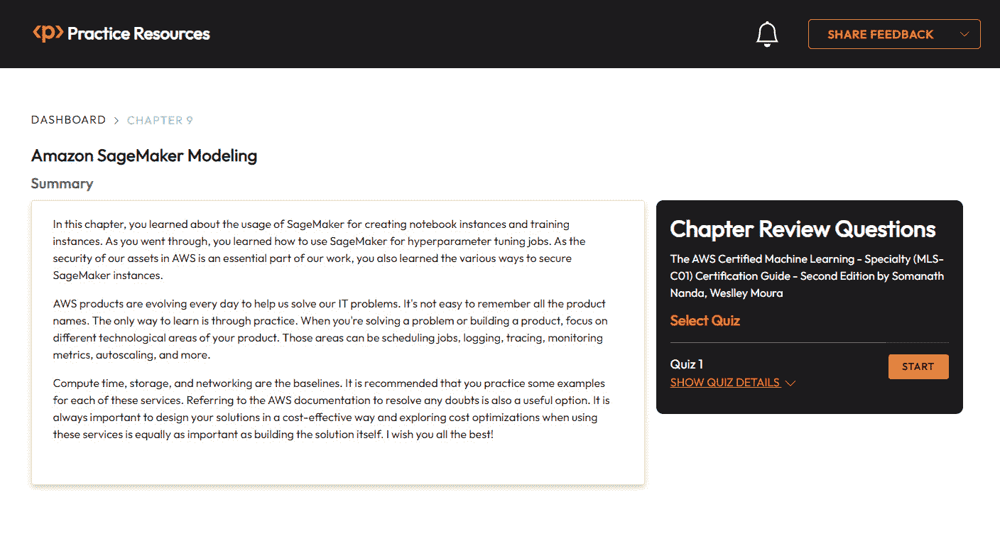

图 9.15 – 第九章的章节复习题

1.  准备就绪后，开始以下练习，多次尝试测验。

## 考试准备练习

对于前三次尝试，不要担心时间限制。

### 尝试 1 次

第一次，目标至少达到**40%**。查看你答错的答案，并再次阅读章节中的相关部分，以填补你的学习差距。

### 尝试 2 次

第二次，目标至少达到**60%**。查看你答错的答案，并再次阅读章节中的相关部分，以填补任何剩余的学习差距。

### 尝试 3 次

第三次，目标至少达到**75%**。一旦你的分数达到 75%或更高，你就可以开始练习时间管理。

小贴士

你可能需要超过**三次**尝试才能达到 75%。这没关系。只需复习章节中的相关部分，直到你达到目标。

# 在练习时间

目标：你的目标是保持分数不变，同时尽可能快地回答这些问题。以下是你下一次尝试应该看起来像的例子：

| **尝试** | **分数** | **用时** |
| --- | --- | --- |
| 尝试 5 次 | 77% | 21 分钟 30 秒 |
| 尝试 6 次 | 78% | 18 分钟 34 秒 |
| 尝试 7 次 | 76% | 14 分钟 44 秒 |

表 9.3 – 在线平台上的样本时间练习

注意

上表中显示的时间限制只是示例。根据网站上的测验时间限制，为每次尝试设定自己的时间限制。

每次新的尝试，你的分数应该保持在**75%**以上，而完成所需的时间应该“减少”。重复尝试，直到你对自己应对时间压力有信心。
