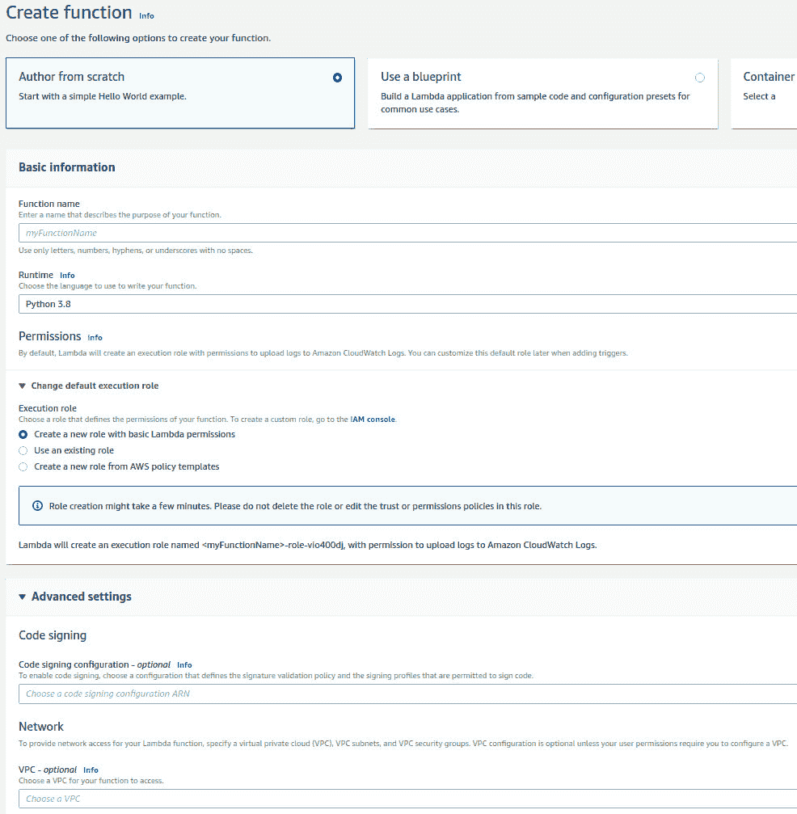
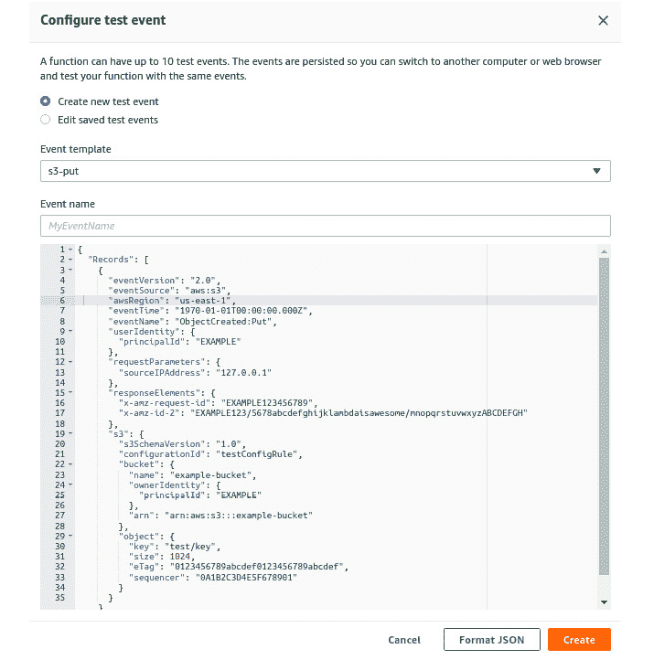
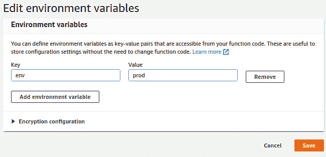
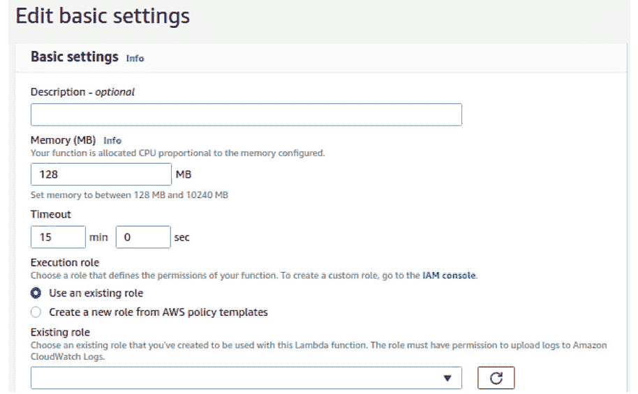
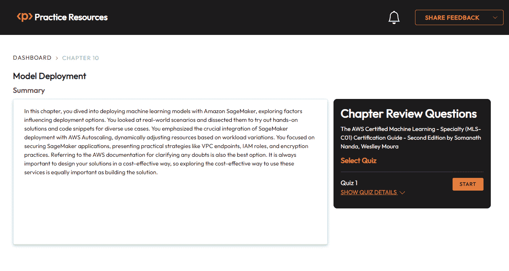

# 10

# 模型部署

在上一章中，你探索了 Amazon SageMaker 的各个方面，包括不同的实例、在 Jupyter Notebook 中的数据准备、使用内置算法进行模型训练以及为训练和推理编写自定义代码。现在，你的重点转向使用 AWS 服务提供的多种模型部署选择。

如果你正在 AWS 上导航模型部署的领域，了解选项至关重要。一个突出的服务是 Amazon SageMaker – 一个全面管理的解决方案，它简化了整个**机器学习**（**ML**）生命周期，尤其是在部署模型方面。有几个因素会影响模型部署的选项。随着你进入本章，你将学习使用 SageMaker 部署模型的不同选项。

# 影响模型部署选项的因素

这里是决定模型部署选项的关键因素：

+   **可扩展性要求**

    +   **高流量**：想象你正在开发一个为热门电子商务平台提供推荐的系统，该平台在一天中预计会有波动的流量。如果应用程序预计会有高流量和变化的负载，具有自动扩展功能的 Amazon SageMaker 或 AWS Lambda 等服务可能更受欢迎。这对于在高峰时段保持性能至关重要。

+   **实时推理与批量推理**

    +   **实时推理**：考虑一个金融机构的欺诈检测系统，其中立即的决定对于交易批准或拒绝至关重要。对于这种实时预测，Amazon SageMaker 和 AWS Lambda 等服务是合适的。对于欺诈检测，这些服务提供低延迟响应，使能够快速对交易的合法性做出决定。在这种情况下，实时交易通过 SageMaker 的推理端点触发立即预测。

    +   **批量推理**：在医疗环境中，你可能需要定期处理大量患者数据以更新疾病诊断的预测模型。这是一个批量处理用例，可以使用 SageMaker 以及 Amazon S3 等服务组合。你可以高效地处理大数据集，定期更新模型，并确保预测与最新信息保持一致，这对于保持医疗预测的准确性至关重要。

+   **基础设施管理复杂性**

    +   **托管部署与自定义部署**：假设你正在开发一个用于分析卫星图像的计算机视觉应用程序，需要专门的配置和依赖项。在需要自定义配置的情况下，选择使用 EC2 实例进行自定义部署可以提供对基础设施的更多控制。SageMaker 的托管服务对于你优先考虑管理便捷性且不希望深入了解复杂的基础设施细节的场景是理想的。

+   **成本考虑**

    +   **按使用付费**：考虑一个天气预报应用程序，其计算需求根据天气事件而变化。在负载波动的情况下，AWS Lambda 的按使用付费模型具有优势。你只需为消耗的计算时间付费，这使得与具有固定成本的替代方案相比，对于具有间歇性、不可预测的使用模式的程序来说更加经济高效。

# SageMaker 部署选项

Amazon SageMaker 提供了多种部署选项，以有效地部署机器学习模型。在本节中，你将探索使用 SageMaker 部署模型的不同方法，提供具有场景和示例的技术解决方案。

## 实时端点部署

在此**场景**中，你有一个训练好的图像分类模型，并且想将其部署以提供对传入图像的实时预测。

### 解决方案

创建一个 SageMaker 模型并将其部署到实时端点。

### 步骤

1.  使用 SageMaker 训练作业训练你的模型。

1.  从训练好的模型工件中创建一个 SageMaker 模型。

1.  将模型部署到实时端点。

### 示例代码片段

```py
from sagemaker import get_execution_role
```

```py
from sagemaker.model import Model
```

```py
from sagemaker.predictor import RealTimePredictor
```

```py
role = get_execution_role()
```

```py
model_artifact='s3://your-s3-bucket/path/to/model.tar.gz'
```

```py
model = Model(model_data=model_artifact, role=role)
```

```py
predictor = model.deploy(instance_type='ml.m4.xlarge', endpoint_name='image-classification-endpoint')
```

## 批量转换作业

在此**场景**中，你有一个大型数据集，并且想使用训练好的模型对整个数据集进行批量推理。

### 解决方案

使用 SageMaker 批量转换批量处理整个数据集。

### 步骤

1.  创建一个 SageMaker 转换器。

1.  开始批量转换作业。

### 示例代码片段

```py
from sagemaker.transformer import Transformer
```

```py
transformer = Transformer(model_name='your-model-name',
```

```py
                          instance_count=1,
```

```py
                          instance_type='ml.m4.xlarge',
```

```py
                          strategy='SingleRecord',
```

```py
                          assemble_with='Line',
```

```py
                          output_path='s3://your-s3-bucket/output')
```

```py
transformer.transform('s3://your-s3-bucket/input/data.csv', content_type='text/csv')
```

```py
transformer.wait()
```

## 多模型端点部署

在此**场景**中，你有多个版本的模型，并且想将它们部署到单个端点上以进行 A/B 测试或逐步推出。

### 解决方案

使用 SageMaker 多模型端点在一个端点上部署和管理多个模型。

### 步骤

1.  创建并训练多个模型。

1.  创建一个 SageMaker 多模型。

1.  将多模型部署到端点。

### 示例代码片段

```py
from sagemaker.multimodel import MultiModel
```

```py
multi_model = MultiModel(model_data_prefix='s3://your-s3-bucket/multi-models')
```

```py
predictor = multi_model.deploy(instance_type='ml.m4.xlarge', endpoint_name='multi-model-endpoint')
```

## 端点自动扩展

在此**场景**中，你的应用程序经历着不同的工作负载，并且想根据流量自动调整实例数量。

### 解决方案

为 SageMaker 端点启用自动扩展。

### 步骤

1.  配置 SageMaker 端点以使用自动扩展。

1.  根据预期的负载设置最小和最大实例数量。

### 示例代码片段

```py
from sagemaker.predictor import Predictor
```

```py
predictor = Predictor(endpoint_name='your-endpoint-name', sagemaker_session=sagemaker_session)
```

```py
predictor.predict('input_data')
```

## 使用 AWS Lambda 和 SageMaker 的无服务器 API

在此**场景**中，你想要使用 AWS Lambda 创建一个无服务器 API 以与你的 SageMaker 模型交互。

### 解决方案

使用 AWS Lambda 调用 SageMaker 端点。

### 步骤

1.  创建一个 AWS Lambda 函数。

1.  将 Lambda 函数与 SageMaker 端点集成。

### 示例代码片段

```py
import boto3
```

```py
import json
```

```py
def lambda_handler(event, context):
```

```py
    # Perform preprocessing on input data
```

```py
    input_data = event['input_data']
```

```py
    # Call SageMaker endpoint
```

```py
    # ...
```

```py
    return {
```

```py
        'statusCode': 200,
```

```py
        'body': json.dumps('Inference successful!')
```

```py
    }
```

在部署 ML 模型领域，Amazon SageMaker 成为一个稳健的选择。其托管环境、可扩展功能和与其他 AWS 服务的无缝集成使其成为企业在各种部署场景中高效和可靠的解决方案。无论你是否预计会有高流量或需要一个无烦恼的部署体验，SageMaker 都是你在模型部署卓越之旅中的盟友。在下一节中，你将了解如何使用 Lambda 函数创建管道。

# 使用 Lambda 函数创建替代管道

实际上，SageMaker 是一个很棒的平台，你可以用它来创建训练和推理管道。然而，你总是可以与不同的服务合作，找到类似的解决方案。你接下来将要了解的服务之一被称为**Lambda 函数**。

AWS Lambda 是一种无服务器计算服务，你可以将其作为一个服务运行函数。换句话说，你可以专注于编写你的函数。然后，你只需要告诉 AWS 如何运行它（即环境和资源配置），所有必要的资源都将被配置以运行你的代码，并在完成后取消配置。

在*第三章*“AWS 数据迁移和处理服务”中，你了解了 Lambda 函数如何与许多不同的服务集成，例如 Kinesis 和 AWS Batch。实际上，AWS 在将 Lambda 与 140 多个服务（且列表持续增加）集成方面做得非常好。这意味着当你与特定的 AWS 服务一起工作时，你会记得它很可能会与 Lambda 集成。

重要的是要记住这一点，因为 Lambda 函数可以真正扩展你的可能性，以创建可扩展和集成的架构。例如，你可以在文件上传到 S3 时触发一个 Lambda 函数，以便在将其加载到 Redshift 之前预处理你的数据。或者，你可以在每个端点执行时创建一个触发 Lambda 函数的 API。再次强调，这个强大的服务可能性是无限的。

还有一个有用的信息是，你可以用不同的编程语言编写你的函数，例如 Node.js、Python、Go、Java 等。你的函数不一定必须由另一个 AWS 服务触发——也就是说，你可以手动触发它，例如在你的 Web 或移动应用程序中。

当涉及到部署时，你可以将你的函数作为 ZIP 文件或容器镜像上传。虽然这并不是自动化部署过程的理想选择，但直接在 AWS Lambda 控制台中编码也是可能的。

与任何其他服务一样，这项服务也有一些缺点，你应该知道：

+   **为你的函数分配内存**：这从 128 MB 到 10,240 MB 不等（AWS 最近将此限制从 3 GB 增加到 10 GB，如前所述）

+   **函数超时**：这是最多 900 秒（15 分钟）

+   **函数层**：这是最多五层

+   **突发并发性**：这取决于 AWS 区域，从 500 到 3000 不等

+   **部署包大小**：这是解压后的 250 MB，包括层

+   **容器镜像代码包大小**：这是 10 GB

+   **/tmp 目录中的可用空间**：这是 512 MB

在选择 Lambda 函数之前，请确保这些限制适合你的用例。通过将 Lambda 函数引入 SageMaker 的替代管道范围，你可以利用 Lambda 的一个潜在用途，即创建模型的推理管道。

如你所知，SageMaker 有一个非常方便的`.deploy()`方法，可以为模型推理创建端点。这样，你可以调用它来传递输入数据以接收预测结果。在这里，你可以通过使用 API 网关和 Lambda 函数来创建这个推理端点。

如果你不需要推理端点，只想进行预测并将结果存储在某个地方（批量方式），那么你只需要一个 Lambda 函数，它能够获取输入数据，实例化模型对象，进行预测，并将结果存储在适当的位置。当然，它通过考虑你之前讨论的所有限制来实现这一点。

好的，现在你已经对 Lambda 和某些用例有了良好的背景知识，你可以查看你在考试中应该注意的最重要配置。

## 创建和配置 Lambda 函数

首先，你应该知道你可以通过不同的方式创建 Lambda 函数，例如通过 AWS CLI（Lambda API 参考）、AWS Lambda 控制台，甚至是部署框架（例如，*serverless framework*）。

无服务器框架通常是提供商和编程语言无关的。换句话说，它们通常允许你从一系列云提供商和编程语言中选择你想要部署无服务器基础设施的地方。

重要提示

无服务器架构的概念并不仅限于 AWS。实际上，许多云服务提供商提供与 AWS Lambda 函数类似的其他服务。这就是为什么构建了这些无服务器框架——为了帮助开发者和工程师将他们的服务部署到他们想要的地方，包括 AWS。这可能在你的考试中不太可能出现，但这是你应该知道的事情，以便你了解作为数据科学家或数据工程师解决挑战的不同方式。

由于你想要通过 AWS 认证机器学习专业考试，在这里，你将遍历 AWS Lambda 控制台。这样，你可以更熟悉其界面和最重要的配置选项。

当你导航到 Lambda 控制台并请求一个新的 Lambda 函数时，AWS 会为你提供一些起始选项：

+   **从头开始创建作者**：这是如果你想要从头创建你的函数

+   **使用蓝图**：如果您想从示例代码和针对常见用例的配置预设创建函数

+   **容器镜像**：如果您想选择容器镜像来部署您的函数

+   **浏览无服务器应用程序存储库**：如果您想从 AWS 无服务器应用程序存储库部署示例 Lambda 应用程序

从零开始，下一步是设置您的 Lambda 配置。AWS 将这些配置分为基本和高级设置。在基本配置中，您将设置函数名称、运行时环境和权限。*图 10.1*显示了这些配置：



图 10.1 – 从 AWS Lambda 控制台创建新的 Lambda 函数

在这里，您有一个在考试期间非常重要且应记住的配置——**执行角色**。您的 Lambda 函数可能需要访问其他 AWS 资源的权限，例如 S3、Redshift 等。执行角色授予 Lambda 函数所需的权限，以便它可以根据需要访问资源。

您必须记住，您的 VPC 和安全组配置也会影响 Lambda 函数的运行方式。例如，如果您想创建一个需要互联网访问来下载内容的函数，那么您必须在该具有互联网访问的 VPC 中部署此函数。同样的逻辑也适用于其他资源，例如访问关系型数据库、Kinesis 和 Redshift。

此外，为了正确配置 Lambda 函数，您至少需要编写其代码、设置执行角色，并确保 VPC 和安全组配置符合您的需求。接下来，您将了解其他配置。

## 完成配置并部署 Lambda 函数

一旦您在 AWS 控制台中创建了 Lambda 函数，您可以在部署函数之前设置额外的配置。其中之一就是事件触发器。如前所述，您的 Lambda 函数可以从各种服务或手动触发。

重要提示

一个非常常见的触发器示例是**Amazon EventBridge**。这是一个 AWS 服务，您可以在其中安排函数的执行。

根据您选择的触发事件，您的函数将能够访问不同的事件元数据。例如，如果您的函数由 S3 上的`PUT`事件触发（例如，有人将文件上传到特定的 S3 存储桶），那么您的函数将接收到与此事件相关的元数据——例如，存储桶名称和对象键。其他类型的触发器将提供不同类型的事件元数据！

您可以通过属于函数入口点签名的 event 参数访问该元数据。不够清楚？现在您将了解函数代码应该如何声明，如下所示：

```py
def lambda_handler(event, context):
```

```py
TODO
```

在这里，`lambda_handler` 是代表您函数入口点的函数。当它被触发时，此方法将被调用，并且它将通过 `event` 参数接收与事件触发相关的事件元数据。这就是您如何访问与触发您函数的底层事件相关的信息！`event` 参数是一个类似 JSON 的对象。

如果您想测试您的函数但不想直接从底层事件触发它，这没问题；您可以使用 **测试事件**。它们通过准备一个将被传递给您的函数的 JSON 对象来模拟底层事件。

*图 10.2* 展示了一个非常直观的例子。假设您创建了一个在用户将文件上传到 S3 时被触发的函数，现在，您想测试您的函数。您可以选择上传一个文件到 S3（这会强制触发）或创建一个测试事件。

通过创建一个测试事件，您可以准备一个模拟 **S3-put** 事件的 JSON 对象，然后将此对象传递给您的函数：



图 10.2 – 从 Lambda 控制台创建测试事件

您还可以设置另一种类型的配置，即 **环境变量**，这些变量将在您的函数中可用。*图 10.3* 展示了如何在 Lambda 函数中添加环境变量：



图 10.3 – 向 Lambda 函数添加环境变量

您可以随时返回这些基本设置，根据需要做出调整。*图 10.4* 展示了基本设置部分您将找到的内容：



图 10.4 – 修改 Lambda 函数的基本设置

在监控方面，默认情况下，Lambda 函数会生成一个 `Lambda 函数监控` 部分，并点击 **CloudWatch** 中的 **查看日志**。

在 CloudWatch 中，每个 Lambda 函数都将有一个 **日志组**，在该日志组内部，有许多 **日志流**。日志流存储相关函数的执行日志。换句话说，日志流是一系列共享相同来源的日志，在这种情况下，来源是您的 Lambda 函数。日志组是一组共享相同保留、监控和访问控制设置的日志流。

您现在已接近本节的结尾，但不是关于 Lambda 函数这一主题的结尾。如前所述，这项 AWS 服务有很多用例，并与许多其他服务集成。在下一节中，您将了解另一个 AWS 服务，它将帮助编排 Lambda 函数的执行。这被称为 **AWS** **步骤函数**。

# 使用步骤函数

Step Functions 是一个 AWS 服务，允许你创建工作流来编排 Lambda 函数的执行。这样你就可以将它们连接在一个称为**步骤**的事件序列中。这些步骤被分组在一个**状态机**中。

Step Functions 集成了重试功能，这样你就可以配置你的管道只在特定步骤成功后继续执行。设置这些重试配置的方式是通过创建一个**重试策略**。

重要提示

就像 AWS 的多数服务一样，AWS Step Functions 也与其他服务集成，而不仅仅是 AWS Lambda。

创建状态机相对简单。你所要做的就是导航到 AWS Step Functions 控制台，然后创建一个新的状态机。在**创建状态机**页面，你可以指定是否要从头创建你的状态机或从模板创建，或者你只是想运行一个示例项目。

AWS 将帮助你创建这个状态机，所以即使你选择从头开始创建，你也会找到各种任务的代码片段，例如 AWS Lambda 调用、SNS 主题发布和运行 Athena 查询。

为了演示的目的，你现在将创建一个非常简单但仍然有用的示例，说明如何使用 Step Functions 来执行具有激活 `retry` 选项的 Lambda 函数：

```py
{
```

```py
"Comment": "A very handy example of how to call a lamnbda function with retry option",
```

```py
"StartAt": "Invoke Lambda function",
```

```py
"States": {
```

```py
"Invoke Lambda function": {
```

```py
"Type": "Task",
```

```py
"Resource": "arn:aws:states:::lambda:invoke",
```

```py
"Parameters": {
```

```py
"FunctionName": "arn:aws:lambda:your-function-identification",
```

```py
"Payload": {
```

```py
"Input": {
```

```py
"env": "STAGE"
```

```py
}
```

```py
}
```

```py
},
```

```py
"Retry": [
```

```py
{
```

```py
"ErrorEquals": ["States.ALL"],
```

```py
"IntervalSeconds": 60,
```

```py
"MaxAttempts": 5,
```

```py
"BackoffRate": 2.0
```

```py
}
```

```py
],
```

```py
"Next": "Example"
```

```py
},
```

```py
"Example": {
```

```py
"Type": "Pass",
```

```py
"Result": "Just to show you how to configure other steps",
```

```py
"End": true
```

```py
}
```

```py
}
```

```py
}
```

在前面的例子中，你创建了一个包含两个步骤的状态机：

+   **调用 Lambda 函数**：这将启动你底层 Lambda 的执行

+   **执行** *示例*：这是一个简单的传递任务，仅用于展示如何在管道中连接第二个步骤

在第一步中，你也设置了一个重试策略，如果出现任何失败，它将尝试重新执行此任务。你设置了再次尝试的间隔（以秒为单位）以及显示尝试次数。*图 10**.5* 显示了状态机：


图 10.5 – 状态机

在下一节中，你将探索各种自动扩展场景和不同的处理方式。

# 使用 SageMaker 部署和 AWS 自动扩展扩展应用程序

自动扩展是部署机器学习模型到生产环境中的关键方面，确保应用程序能够高效地处理不同的工作负载。Amazon SageMaker 与 AWS 自动扩展相结合，提供了一个强大的解决方案，可以根据需求自动调整资源。在本节中，你将探索自动扩展至关重要的不同场景以及如何实现它，使用 SageMaker 模型部署选项和 AWS 自动扩展。

## 场景 1 – 波动的推理工作负载

在零售应用程序中，提出产品推荐请求的用户数量在一天中可能会有所变化，在特定的小时内会有高峰负载。

### 自动扩展解决方案

为 SageMaker 实时端点实现自动扩展，根据推理请求率动态调整实例数量。

### 步骤

1.  配置 SageMaker 端点以使用自动扩展。

1.  根据预期的负载变化设置最小和最大实例数量。

### 示例代码片段

```py
from sagemaker import get_execution_role
```

```py
from sagemaker.model import Model
```

```py
role = get_execution_role()
```

```py
model_artifact='s3://your-s3-bucket/path/to/model.tar.gz'
```

```py
model = Model(model_data=model_artifact, role=role)
```

```py
predictor = model.deploy(instance_type='ml.m4.xlarge', endpoint_name='real-time-endpoint', endpoint_auto_scaling=True)
```

## 场景 2 – 大数据集的批量处理

定期对大型数据集进行批量推理，如果不进行动态管理，可能会导致资源限制。

### 自动扩展解决方案

利用 AWS 批量转换与 SageMaker，并在批量处理期间配置自动扩展以实现高效的资源利用。

### 步骤

1.  设置 AWS 批量转换作业。

1.  为底层基础设施启用自动扩展以处理不同的批量大小。

### 示例代码片段

```py
from sagemaker.transformer import Transformer
```

```py
transformer = Transformer(model_name='your-model-name',
```

```py
                          instance_count=1,
```

```py
                          instance_type='ml.m4.xlarge',
```

```py
                          strategy='SingleRecord',
```

```py
                          assemble_with='Line',
```

```py
                          output_path='s3://your-s3-bucket/output',
```

```py
                          max_concurrent_transforms=4)  # Set max_concurrent_transforms for autoscaling
```

## 场景 3 – 具有动态流量的多模型端点

多个模型部署在单个端点上以进行 A/B 测试，模型之间的流量分布是动态的。

### 自动扩展解决方案

利用自动扩展功能，通过 SageMaker 多模型端点处理不同模型版本间的不同流量负载。

### 步骤

1.  创建并部署多个模型到 SageMaker 多模型端点。

1.  启用自动扩展功能，根据流量分布调整实例数量。

### 示例代码片段

```py
from sagemaker.multimodel import MultiModel
```

```py
multi_model = MultiModel(model_data_prefix='s3://your-s3-bucket/multi-models')
```

```py
predictor = multi_model.deploy(instance_type='ml.m4.xlarge', endpoint_name='multi-model-endpoint', endpoint_auto_scaling=True)
```

## 场景 4 – 使用漂移检测的持续模型监控

您监控模型以检测概念漂移或数据质量问题，并在模型性能下降时自动调整资源。

### 自动扩展解决方案

将 SageMaker 模型监控与 AWS CloudWatch 警报集成，以便在检测到漂移或退化时触发自动扩展。

### 步骤

1.  设置 CloudWatch 警报以监控模型质量指标。

1.  配置自动扩展策略，在特定警报阈值被突破时触发。

使用 SageMaker 模型部署选项和 AWS 自动扩展进行应用程序扩展，为处理不同工作负载和确保最佳资源利用提供了灵活且高效的解决方案。通过了解需要自动扩展的不同场景并遵循概述的步骤，您可以无缝地将自动扩展集成到您的机器学习部署策略中，增强应用程序的可扩展性和可靠性。在下一节中，您将了解和探索保护 AWS SageMaker 应用的不同方法。

# 保护 SageMaker 应用

随着机器学习应用成为业务运营的组成部分，保护 AWS SageMaker 应用至关重要，以确保敏感数据的安全，维护法规遵从性，并防止未授权访问。在本节中，您将首先深入了解保护 SageMaker 应用的原因，然后探讨不同的策略来实现安全性：

+   **保护 SageMaker 应用的原因**

    +   **数据保护**：在敏感数据（如客户信息或财务记录）上训练的机器学习模型，如果没有得到充分保护，将面临重大的安全风险。保护 SageMaker 确保在整个机器学习生命周期中数据保密性和完整性得到维护。

    +   **合规要求**：医疗保健和金融等行业受到严格的数据保护法规的约束。确保 SageMaker 的安全性有助于组织遵守如**健康保险可携带性和责任法案（HIPAA）**或**通用数据保护条例（GDPR）**等标准，避免法律后果和声誉损害。

    +   **防止未授权访问**：SageMaker 实例和端点应仅对授权人员开放。未授权访问可能导致数据泄露或滥用机器学习能力。强大的身份验证机制对于防止此类安全漏洞至关重要。

    +   **模型知识产权保护**：机器学习模型代表知识产权。确保 SageMaker 的安全性可以保证开发出的模型、算法和方法保持机密性，并防止知识产权被盗或逆向工程。

+   `from sagemaker import get_execution_role`

    ```py
    from sagemaker import Session
    ```

    ```py
    role = get_execution_role()
    ```

    ```py
    sagemaker_session = Session()
    ```

    ```py
    vpc_config = {'SecurityGroupIds': ['sg-xxxxx'], 'Subnets': ['subnet-xxxxx']}
    ```

    ```py
    predictor = model.deploy(instance_type='ml.m4.xlarge', endpoint_name='secured-endpoint', vpc_config_override=vpc_config)
    ```

+   `{`

    ```py
      "Version": "2012-10-17",
    ```

    ```py
      "Statement": [
    ```

    ```py
       {
    ```

    ```py
         "Effect": "Allow",
    ```

    ```py
         "Action": "sagemaker:CreateModel",
    ```

    ```py
         "Resource": "arn:aws:sagemaker:region:account-id:model/model-name"
    ```

    ```py
       },
    ```

    ```py
       {
    ```

    ```py
          "Effect": "Deny",
    ```

    ```py
          "Action": "sagemaker:CreateModel",
    ```

    ```py
          "Resource": "*"
    ```

    ```py
      }
    ```

    ```py
    ]
    ```

    ```py
    }
    ```

+   `from sagemaker import get_execution_role`

    ```py
    from sagemaker import Session
    ```

    ```py
    role = get_execution_role()
    ```

    ```py
    sagemaker_session = Session()
    ```

    ```py
    predictor = model.deploy(instance_type='ml.m4.xlarge', endpoint_name='encrypted-endpoint', encrypt_parameters=True)
    ```

+   `from sagemaker.model_monitor import ModelQualityMonitor`

    ```py
    from sagemaker.model_monitor import EndpointInput
    ```

    ```py
    from sagemaker import get_execution_role
    ```

    ```py
    role = get_execution_role()
    ```

    ```py
    monitor = ModelQualityMonitor(
    ```

    ```py
        role=role,
    ```

    ```py
        instance_count=1,
    ```

    ```py
        instance_type='ml.m4.xlarge',
    ```

    ```py
        volume_size_in_gb=20,
    ```

    ```py
        max_runtime_in_seconds=1800
    ```

    ```py
    )
    ```

保护 AWS SageMaker 应用程序不仅是一种最佳实践，在数据驱动决策的时代，它是一项至关重要的强制措施。通过实施强大的安全措施，如利用 VPC 端点、IAM 角色、加密和持续监控，组织可以加强其 SageMaker 应用程序对潜在威胁的防御，并确保其机器学习工作流程的完整性。随着 SageMaker 继续赋予企业机器学习能力，采取主动的安全方法对于持续成功变得不可或缺。你现在已经到达了这个部分的结尾和本章的结尾。接下来，看看你所学内容的总结。

# 摘要

在本章中，你深入探讨了使用 Amazon SageMaker 部署机器学习模型，研究了影响部署选项的因素。你分析了现实世界场景，并尝试了针对各种用例的动手解决方案和代码片段。你强调了 SageMaker 部署与 AWS Auto Scaling 的至关重要的集成，根据工作负载的变化动态调整资源。你专注于保护 SageMaker 应用程序，提出了如 VPC 端点、IAM 角色和加密实践等实用策略。参考 AWS 文档以澄清任何疑问也是最佳选择。始终重要的是以经济高效的方式设计解决方案，因此探索以经济高效的方式使用这些服务同样重要，如同构建解决方案一样。

# 考试准备练习 - 章节复习问题

除了对关键概念有扎实的理解外，能够在时间压力下快速思考是一项帮助你通过认证考试的关键技能。这就是为什么在学习的早期阶段就培养这些技能至关重要。

章节复习题旨在随着您学习并复习每一章的内容，逐步提高您的应试技巧，同时检查您对章节中关键概念的理解。您可以在每一章的末尾找到这些复习题。

如何访问这些资源

要了解如何访问这些资源，请转到名为*第十一章*的章节，*访问在线练习资源*。

要打开本章的章节复习题，请执行以下步骤：

1.  点击链接 – [`packt.link/MLSC01E2_CH10`](https://packt.link/MLSC01E2_CH10)。

    或者，您可以扫描以下**二维码**（*图 10.6*）：


图 10.6 – 为登录用户打开章节复习题的二维码

1.  登录后，您将看到一个类似于*图 10.7*所示的页面：



图 10.7 – 第十章的章节复习题

1.  准备好后，开始以下练习，多次重新尝试测验。

## 考试准备练习

对于前三次尝试，不必担心时间限制。

### 尝试 1

第一次尝试，目标至少达到**40%**。查看您答错的答案，并再次阅读章节中相关的部分，以填补您的学习差距。

### 尝试 2

第二次尝试，目标至少达到**60%**。查看您答错的答案，并再次阅读章节中相关的部分，以填补任何剩余的学习差距。

### 尝试 3

第三次尝试，目标至少达到**75%**。一旦得分达到 75%或更高，您就开始练习计时。

小贴士

您可能需要超过**三次**尝试才能达到 75%。这没关系。只需复习章节中的相关部分，直到达到目标。

# 正在练习计时

目标：您的目标是保持分数不变，同时尽可能快速地回答这些问题。以下是如何进行下一次尝试的示例：

| **尝试** | **分数** | **用时** |
| --- | --- | --- |
| 尝试 5 | 77% | 21 分钟 30 秒 |
| 尝试 6 | 78% | 18 分钟 34 秒 |
| 尝试 7 | 76% | 14 分钟 44 秒 |

表 10.1 – 在线平台上的样本时间练习

注意

上表中显示的时间限制只是示例。根据网站上的测验时间限制，为每次尝试设定自己的时间限制。

每次新的尝试，您的分数应保持在**75%**以上，而完成所需的时间“应减少”。重复尝试，直到您对时间压力有信心为止。
