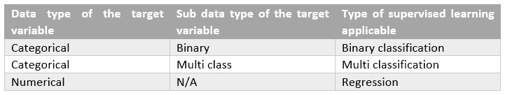
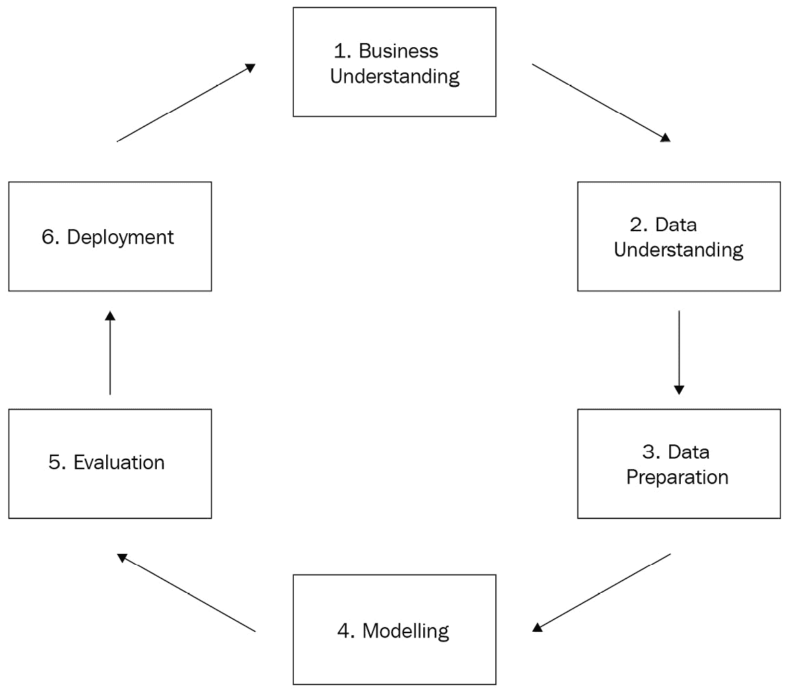

# *第一章*：机器学习基础

几十年来，研究人员一直在通过被称为**人工智能**（简称 AI）的领域尝试模拟人类大脑活动。1956 年，一群人在达特茅斯夏季人工智能研究项目上会面，这一事件被广泛认为是关于今天我们所知的 AI 的第一次集体讨论。研究人员试图证明学习过程的许多方面可以被精确描述，因此可以被机器自动化和复制。今天，我们知道他们是正确的！

该领域还出现了许多其他术语，如**机器学习**（简称 ML）和**深度学习**（简称 DL）。这些人工智能的子领域也已经发展了几十年（当然，这里没有什么是对科学来说是新的）。然而，随着信息社会的自然进步，以及最近**大数据**平台的兴起，人工智能应用以更强大的力量和适用性重新焕发生机。力量在于我们现在有更多的计算资源来模拟和实现它们；适用性在于现在信息无处不在。

更近一些，云服务提供商已经将 AI 引入云端。这正在帮助各种规模的公司降低运营成本，甚至让它们能够尝试 AI 应用（考虑到对于一家小公司来说，维护自己的数据中心可能成本过高）。

这就带我们来到了本章的目标：能够描述 AI、ML 和 DL 的含义，以及理解 ML 管道的所有细微差别。避免对这些术语的混淆，并确切了解 ML 管道是什么，将使您能够正确选择服务、开发应用程序并掌握 AWS 机器学习专业考试。

本章的主要内容包括：

+   比较人工智能、机器学习和深度学习

+   分类监督学习、无监督学习和强化学习

+   CRISP-DM 建模生命周期

+   数据拆分

+   建模期望

+   介绍 ML 框架

+   云端机器学习

# 比较人工智能、机器学习和深度学习

人工智能是一个广泛的领域，研究不同的方法来创建系统和机器，通过模拟人类智能来解决各种问题。创建这些程序和机器的复杂程度不同，从简单的基于规则的引擎到复杂的自我学习系统。人工智能涵盖了但不限于以下子领域：

+   机器人技术

+   自然语言处理

+   基于规则的系统

+   机器学习（ML）

我们现在特别感兴趣的区域是机器学习。

## 检验机器学习

ML 是人工智能的一个子领域，旨在创建能够从经验中学习，而不需要明确编程的系统。正如其名称所暗示的，系统能够观察其运行环境，学习，并在没有人为干预的情况下适应自己。ML 系统背后的算法通常从它们可用的数据中提取和改进知识，以及条件（如**超参数**），并在尝试不同的方法来解决特定问题后进行反馈：

![Figure 1.1 – 人工智能、机器学习、深度学习的层次结构

![img/B16735_01_001.jpg]

图 1.1 – 人工智能、机器学习、深度学习的层次结构

有不同类型的 ML 算法；例如，我们可以列出基于决策树、基于概率和神经网络。每个类别可能都有数十种特定的算法。大多数算法将在本书的后续章节中介绍。

正如你在*图 1.1*中可能已经注意到的，我们可以更加具体，将机器学习领域细分为机器学习专业考试中另一个非常重要的主题：深度学习。

## 检查深度学习

DL（深度学习）是 ML（机器学习）的一个子集，旨在提出将多个层次连接起来以解决特定问题的算法。知识随后通过一层层传递，直到找到最佳解决方案。最常见类型的 DL 算法是深度神经网络。

在撰写本书时，DL 是机器学习领域的一个非常热门的话题。目前大多数最先进的机器翻译、图像标题和计算机视觉算法都是在过去几年提出的，并且是深度学习的一部分。

现在我们对人工智能的类型有了概述，让我们来看看我们可以如何对机器学习进行分类。

# 对监督学习、无监督学习和强化学习进行分类

ML 是一个非常广泛的研究领域；这就是为什么对其子领域有一个清晰的定义非常重要。从非常广泛的角度来看，我们可以将 ML 算法分为两大类：**监督学习**和**无监督学习**。

## 介绍监督学习

监督算法使用一个类别或标签（来自输入数据）作为支持来找到和验证最佳解决方案。在*图 1.2*中，有一个旨在从银行中分类欺诈交易的数据库：

![Figure 1.2 – 监督学习样本数据集

![img/B16735_01_002.jpg]

图 1.2 – 监督学习样本数据集

前四列被称为**特征**或**独立变量**，它们可以被监督算法用来找到欺诈模式。例如，通过结合这四个特征（星期几、EST 小时、交易金额和商家类型）以及六个观察值（每一行实际上是观察值之一），你可以推断出价值超过 5,000 美元且在夜间处理的电子商务交易可能是欺诈案例。

重要提示

在实际场景中，我们应该有更多的观察值，以便为这种类型的推断提供统计支持。

关键点在于，我们能够推断出一个潜在的欺诈模式，仅仅因为我们事先知道什么是欺诈，什么不是欺诈。这种信息存在于*图 1.2*的最后列，通常被称为目标变量、标签、响应变量或因变量。如果输入数据集有一个目标变量，你应该能够应用监督学习。

在监督学习中，目标变量可能存储不同类型的数据。例如，它可能是一个二元列（是或否），一个多类列（A 类、B 类或 C 类），甚至是一个数值列（任何实数，例如交易金额）。根据目标变量的数据类型，你可以找到你的问题属于哪种类型的监督学习。*图 1.3*展示了如何将监督学习分为两大类：**分类**和**回归**算法：

图 1.3 – 根据目标变量选择合适的监督学习类型

而分类算法预测一个类别（要么是二元的，要么是多类的），回归算法预测一个实数（要么是连续的，要么是离散的）。

理解数据类型对于在机器学习项目中做出正确的决策非常重要。我们可以将数据类型分为两大类：数值数据和分类数据。数值数据可以进一步分为连续或离散子类，而分类数据可能指的是有序或名义数据：

+   *数值/离散数据*指的是单个和可数的项目（例如，教室里的学生数量或在线购物车中的商品数量）。

+   *数值/连续数据*指的是无限多的可能测量值，它们通常带有小数点（例如，温度）。

+   *分类/名义数据*指的是没有定量值的标记变量（例如，姓名或性别）。

+   *分类/有序数据*为标记变量增加了顺序感（例如，教育水平或员工职称等级）。

换句话说，在选择项目算法时，你应该问自己：我有一个目标变量吗？它存储的是分类数据还是数值数据？回答这些问题将使你处于更好的位置来选择一个可能解决问题的潜在算法。

然而，如果你没有目标变量怎么办？在这种情况下，我们面临的是无监督学习。无监督问题不提供标记数据；相反，它们提供所有独立的变量（或特征），这将允许无监督算法在数据中找到模式。最常见的一种无监督学习是**聚类**，其目的是将数据集的观测值分组到不同的簇中，纯粹基于它们的特征。来自同一簇的观测值预计将彼此相似，但与其他簇的观测值非常不同。聚类将在本书的后续章节中更详细地介绍。

**半监督学习**在机器学习文献中也有所提及。这类算法能够从部分标记的数据（一些观测值包含标签，而另一些则没有）中学习。

最后，另一种被另一类机器学习算法采用的学习方法是**强化学习**。这种方法根据系统自主做出的良好决策进行奖励；换句话说，系统通过经验学习。

我们一直在非常广泛地讨论学习方法和算法类别。然而，现在是时候具体化并引入**模型**这个术语了。

# CRISP-DM 建模生命周期

**建模**是机器学习中一个非常常见的术语，当我们想要指定解决特定问题的步骤时使用。例如，我们可以创建一个二元分类模型来预测*图 1.2*中的交易是否为欺诈。

在这个背景下，一个模型代表创建解决方案的所有步骤，作为一个整体，包括（但不限于）算法。**跨行业数据挖掘标准流程**，更常被称为**CRISP-DM**，是提供指导我们应遵循的常见步骤以创建模型的方法之一。这种方法在市场上被广泛使用，并在 AWS 机器学习专业考试中有所涉及：

图 1.4 – CRISP-DM 方法论

一切始于业务理解，这将产生业务目标（包括成功标准），情况评估，数据挖掘目标，以及项目计划（包括对工具和技术的初步评估）。在情况评估期间，我们还应该考虑资源清单、需求、假设和约束、风险、术语、成本和收益。当我们建模时，每一个假设和成功标准都很重要。

然后我们进入数据理解阶段，在这个阶段我们将收集原始数据，描述它，探索它，并检查其质量。这是对将要用于创建模型的数据的初步评估。再次强调，数据科学家必须保持怀疑态度。你必须确保你理解数据的所有细微差别及其来源。

数据准备阶段实际上是建模过程中通常耗时最多的一个阶段。在这个阶段，我们需要选择和过滤数据，根据需要执行的任务对其进行清理，提出新的属性，将数据与其他数据源集成，并按照将要应用的算法的预期格式化。这些任务通常被称为**特征工程**。

一旦数据准备就绪，我们就可以最终开始建模阶段。这是算法发挥作用的地方。我们应该首先确保选择正确的技术。记住：根据是否存在目标变量（及其数据类型），我们将有不同的算法可供选择。每种建模技术可能都包含一些隐含的假设，我们必须意识到。例如，如果你选择多重线性回归算法来预测房价，你应该意识到这种类型的模型期望你的数据变量之间存在线性关系。

现在有许多算法，每个算法可能都有自己的假设。在选择你想要在项目中测试的算法之后，你应该花一些时间检查它们的细节。本书的后续章节中，我们将介绍其中的一些。

重要提示

一些算法在其逻辑中包含了我们所说的**特征选择**。这是一个选择最重要的特征以构建最佳模型的过程。决策树是自动执行特征选择的算法的例子。我们将在稍后更详细地介绍特征选择，因为有不同的方法来选择最适合你模型的变量。

在建模阶段，你还应该为模型设计一个测试方法，定义将使用哪些评估指标以及数据如何分割。有了这些，你就可以通过设置算法的超参数并给模型提供数据来最终构建模型。这个过程被称为**训练过程**。用于给模型提供数据的数据被称为**训练数据**。有不同方式来组织训练和**测试数据**，我们将在本章中介绍。

重要提示

机器学习算法是由参数和超参数构建的。这些是从数据中学习得到的。例如，基于决策树的算法可能从训练数据中学习到，某个特征应该根据信息增益评估来组成其根级别。另一方面，超参数用于控制学习过程。以相同的决策树示例，我们可以通过指定任何决策树算法（无论其底层训练数据如何）的预定义超参数来指定树的最大允许深度。超参数调整是考试中的一个非常重要的话题，我们将在稍后详细讨论。

一旦模型训练完成，我们可以评估和审查结果，以便提出下一步的行动计划。如果结果不符合我们的业务成功标准，我们应该回到早期步骤，检查还能做些什么来改善模型结果。这可能包括对算法的超参数进行微调，增加新的数据处理步骤，甚至重新定义业务驱动因素。另一方面，如果模型质量可以接受，我们可以进入部署阶段。

在 CRISP-DM 方法的最后一个阶段，我们必须考虑模型的部署计划、监控和维护。我们通常从两个角度来考虑这一步：训练和推理。**训练流程**包括训练模型所需的步骤，这包括数据准备、超参数定义、数据拆分和模型训练本身。我们必须在某处存储所有模型工件，因为它们将被下一个需要开发的流程使用：**推理流程**。

推理流程仅使用模型工件来对全新的观测（在训练阶段从未被模型见过的数据）执行模型。例如，如果模型被训练来识别欺诈交易，那么这就是新交易将通过模型进行分类的时候。

通常，模型只通过训练流程进行一次训练，并通过推理流程多次执行。然而，经过一段时间后，预期会出现一些模型退化，也称为**模型漂移**。这种现象发生是因为模型通常在静态的训练集上训练，旨在代表某一时间点的业务场景；然而，业务是不断发展的，可能需要使用更近期的数据重新训练模型以捕捉新的业务方面。这就是为什么在模型部署后，跟踪模型性能同样重要的原因。

CRISP-DM 方法对于 AWS 机器学习专业考试的内容至关重要，如果你查看 AWS 涵盖的四个领域，你会意识到它们是从 CRISP-DM 阶段概括出来的：数据工程、探索性数据分析、建模和机器学习实施与运营。

我们现在已经理解了建模流程的所有关键阶段，并且我们知道算法本身只是广泛过程的一部分！接下来，让我们看看我们如何拆分数据以创建和验证机器学习模型。

# 数据拆分

训练和评估机器学习模型是建模流程中的关键任务。机器学习算法需要数据来发现特征之间的关系，以便进行推断，但这些推断在移至生产环境之前需要得到验证。

用于训练机器学习模型的集合通常被称为训练集。这些训练数据必须能够代表模型将使用的真实环境；如果不符合这一要求，将毫无用处。

回到我们在*图 1.2*中提出的欺诈示例，根据训练数据，我们发现价值超过 5,000 美元且在夜间处理的电子商务交易可能是欺诈案例。考虑到这一点，在将模型应用于生产环境后，模型应该标记出在训练过程中学习到的类似案例。

因此，如果这些情况仅存在于训练集中，模型将在生产环境中标记**假阳性**案例。相反的情况也是有效的：如果生产数据中存在某个未反映在训练数据中的欺诈案例，模型将标记大量的**假阴性**案例。假阳性和假阴性比率只是我们可以用于模型验证的许多质量指标中的两个。这些指标将在稍后的内容中详细讨论。

到目前为止，您应该已经清楚地理解了拥有一个好的训练集的重要性。现在，假设我们确实有一个有效的训练集，我们如何能够有一定程度的信心认为这个模型将在生产环境中表现良好？答案是：使用测试集和验证集：

![图 1.5 – 数据拆分]

![图片 B16735_01_005.jpg]

图 1.5 – 数据拆分

*图 1.5*展示了在训练和推理管道中我们可以有的不同数据拆分方式。训练数据是用于创建模型的数据，而测试数据是用于提取最终模型质量指标的数据。出于任何原因，除了提取模型指标之外，测试数据都不能在训练过程中使用。

避免在训练过程中使用测试数据的原因很简单：我们**不能**让模型在用于验证的数据之上进行学习。这种保留一部分数据用于测试的技术通常被称为**保留法验证**。

*图 1.5*右侧的框代表生产数据。生产数据通常连续不断地到来，我们必须执行推理管道以从中提取模型结果。在生产数据上不进行任何训练，也不进行任何其他类型的重新计算；我们只需将其作为它本身通过推理管道即可。

从技术角度来看，大多数机器学习库使用`.fit`方法实现训练步骤，而推理步骤则通过`.transform`或`.predict`方法实现。再次强调，这只是一个大多数机器学习库使用的常见模式，但请注意，您可能会在不同的机器学习库中找到不同的命名约定。

仍然查看*图 1.5*，还有一个靠近训练数据的框，称为**验证数据**。这是训练集的一个子集，通常用于在进入测试阶段之前支持最佳模型创建。我们将更详细地讨论这个框，但首先，让我们解释为什么我们需要它们。

## 过拟合和欠拟合

机器学习模型可能会遭受两种类型的拟合问题：**过拟合**和**欠拟合**。过拟合意味着你的模型在训练数据上表现非常好，但不能推广到其他数据集，如测试数据，甚至更糟糕的是，生产数据。换句话说，如果你有一个过拟合的模型，它只能在你的训练数据上工作。

当我们在构建机器学习模型时，我们希望创建能够推广他们所学的知识，并在遵循相同数据分布的其他数据集上推断决策的解决方案。一个仅在训练数据上工作的模型是无用的。过拟合通常是由于特征数量过多或算法超参数配置不当造成的。

另一方面，欠拟合模型在训练阶段无法拟合数据。结果，它们过于通用，无法在训练、测试或生产数据上表现良好。欠拟合通常是由于缺乏良好的特征/观测值或由于缺乏训练模型的时间（某些算法需要更多的迭代来正确拟合模型）。

需要避免过拟合和欠拟合。有许多建模技术可以解决这个问题。例如，让我们关注常用的**交叉验证**技术及其与*图 1.5*中显示的验证框的关系。

## 应用交叉验证和测量过拟合

交叉验证是一种技术，我们将训练集分成训练集和验证集。然后，模型在训练集上训练并在验证集上测试。最常用的交叉验证策略被称为**k 折交叉验证**，其中*k*是训练集分割的数量。

使用 k 折交叉验证并假设*k*的值为 10，我们将训练集分成 10 个部分。模型将被训练和测试 10 次。在每个迭代中，它使用九个部分进行训练，留下一个部分进行测试。经过 10 次执行后，从每个迭代中提取的评估指标将被平均，并将代表训练阶段最终的模型性能，如图*图 1.6*所示：

![Figure 1.6 – 交叉验证的实际应用

![img/B16735_01_006.jpg]

图 1.6 – 交叉验证的实际应用

另一种常见的交叉验证技术被称为**留一法交叉验证**（**LOOCV**）。在这种方法中，模型被多次执行，并且每次迭代中，一个观测值被分离出来用于测试，其余的用于训练。

在训练过程中使用交叉验证有许多优点：

+   我们在训练数据中减轻过拟合，因为模型总是训练在特定数据块上，并在另一个未用于训练的数据块上进行测试。

+   我们避免在测试数据中过拟合，因为不需要继续使用测试数据来优化模型。

+   我们揭示了过拟合或欠拟合的存在。如果模型在训练/验证数据中的性能与在测试数据中观察到的性能非常不同，那么就有问题。

让我们更详细地阐述列表上的第三项，因为这是 AWS 机器学习专业考试中涵盖的内容。假设我们正在创建一个二元分类模型，在训练期间使用交叉验证，并使用测试集来提取最终指标（保留验证）。如果我们得到交叉验证结果的 80%准确率和测试集的 50%准确率，这意味着模型过度拟合了训练集，不能推广到测试集。

另一方面，如果我们训练集的准确率为 50%，而测试集的准确率为 80%，那么数据中存在系统问题。很可能训练集和测试集没有遵循相同的分布。

重要提示

准确率是分类模型中常用的模型评估指标。它衡量模型在推理过程中做出正确决策的频率。我们选择这个指标只是为了举例，但请注意，还有许多其他适用于每种类型模型的评估指标（将在适当的时候介绍）。

## Bootstrapping 方法

交叉验证是验证机器学习模型的好策略，你应该尝试将其作为数据科学家日常活动的一部分。然而，你也应该了解其他可用的重采样技术。**Bootstrapping**就是其中之一。

虽然交叉验证**不替换**，但 bootstrapping 方法**替换**。替换意味着，当你从总体数据集中抽取多个随机样本时，相同的观测值可能会在样本中重复。

通常，bootstrapping 不会像我们在传统的交叉验证方法中做的那样用来验证模型。原因很简单：因为它使用替换，用于训练的相同观测值可能会被用于测试。这会导致模型性能指标膨胀，因为估计器在预测训练集中已经看到的观测值时很可能是正确的。

Bootstrapping 通常被机器学习算法以嵌入式方式使用，这需要重采样能力来处理数据。在这种情况下，bootstrapping 不是用来*验证*模型，而是用来*创建*模型。将在算法章节中介绍的**随机森林**就是那些在模型构建内部使用 bootstrapping 的算法之一。

设计一个好的数据分割/采样策略对于模型或算法的成功至关重要。你应该想出不同的方法来分割你的数据，检查模型在每个分割上的表现，并确保这些分割代表了模型将被使用的真实场景。

## 偏差与方差权衡

任何机器学习模型都应包含错误。我们可以在模型上找到三种类型的错误：**偏差**错误、**方差**错误和**未解释**错误。最后一个，正如预期的那样，无法解释。它通常与问题的上下文和变量之间的关系有关，我们无法控制它。

其他两个错误可以在建模过程中得到控制。我们通常说偏差和方差错误之间存在权衡，因为一个会影响到另一个。在这种情况下，增加偏差会减少方差，反之亦然。

偏差错误与模型为了学习目标函数（我们想要解决的问题）所做出的假设相关。某些类型的算法，如线性算法，通常会在模型训练期间携带这种类型的错误，因为它们在模型训练期间做出了很多假设。例如，线性模型假设数据中存在线性关系。线性回归和逻辑回归是通常包含高偏差的算法类型。另一方面，决策树是那些对数据做出较少假设的算法类型，包含较少的偏差。

方差与模型在不同训练数据上执行的估计差异相关。具有高方差的模型通常会对训练集过度拟合。决策树是具有高方差的算法示例（它们通常非常依赖于训练集的特定情况，无法进行泛化），而线性/逻辑回归是具有低方差的算法示例。这并不意味着决策树是差的估计器；这仅仅意味着我们需要在训练过程中对其进行修剪（优化）。

话虽如此，任何模型的目标都是最小化偏差和方差。然而，如前所述，每个都会以相反的方向影响另一个。为了演示起见，让我们使用决策树来了解这种权衡是如何工作的。

决策树是非线性算法，通常具有低偏差和高方差。为了减少方差，我们可以修剪树并设置`max_depth`超参数（树的最大允许深度）为 10。这将迫使模型更加通用，从而减少方差。然而，这种变化也将迫使模型做出更多假设（因为它现在更加通用）并增加偏差。

## 打乱训练集

现在你已经了解了方差和数据分割，让我们更深入地探讨训练数据集的要求。你很可能在考试中遇到关于数据打乱的问题。这个过程包括在开始使用训练数据集来拟合算法之前对其进行随机化。

数据洗牌将帮助算法通过创建更具泛化能力的模型来减少方差。例如，假设你的训练数据代表一个二元分类问题，并且它按目标变量排序（所有属于类别“0”的案例首先出现，然后是所有属于类别“1”的案例）。

当你在排序数据上拟合算法（尤其是依赖于**批处理**的一些算法）时，它将对其中一个类别的模式做出强烈的假设，因为它很可能无法创建包含两个类别良好代表性的随机批次数据。一旦算法对训练数据建立了强烈的假设，它可能很难改变这些假设。

重要提示

一些算法能够通过将数据分成块（也称为批次）来执行训练过程。这种方法使得模型能够更频繁地学习，因为它会在处理完每一批数据后做出部分假设（而不是在处理完整个数据集后做出决策）。

另一方面，没有必要洗牌测试集，因为它将仅用于推理过程以检查模型性能。

# 建模期望

到目前为止，我们已经讨论了模型构建、验证和管理。让我们通过在建模时讨论一些其他期望来完成机器学习的基础。

第一个原则是**简约性**。简约性描述的是提供最简单解释且与其他模型相比拟合最佳结果的模型。以下是一个例子：在创建线性回归模型时，你发现添加 10 个更多特征只能将你的模型性能提高 0.001%。在这种情况下，你应该考虑这种性能提升是否值得简约性的成本（因为你的模型将变得更加复杂）。有时这是值得的，但大多数时候并不值得。你需要保持怀疑态度，并根据你的业务案例进行思考。

简约性直接支持**可解释性**。你的模型越简单，解释它就越容易。然而，在可解释性和**预测性**之间存在着一场斗争：如果你专注于预测能力，你很可能会失去一些可解释性。再次强调，要成为一名合格的数据科学家，选择对你用例更好的方案。

# 介绍机器学习框架

了解一些机器学习框架将使你在通过 AWS 机器学习专业考试时处于更有利的地位。没有必要掌握这些框架，因为这不是针对特定框架的认证；然而，了解一些常见术语和解决方案将有助于你理解问题/问题的背景。

**scikit-learn**可能是你应该了解的最重要的机器学习框架。这是一个开源的 Python 包，提供了诸如决策树、支持向量机、线性回归等机器学习算法的实现。它还实现了数据预处理类，例如，独热编码、标签编码、主成分分析等。本书后面的章节将涵盖所有这些预处理方法（以及许多其他方法）。

scikit-learn 的缺点是需要对多台机器进行定制以进行扩展。还有一个机器学习库因其能够直接处理多进程而非常受欢迎：**Spark 的机器学习库**。

如其名所示，这是一个在**Apache Spark**之上运行的机器学习库，Apache Spark 是一个用于在多台机器上处理数据的统一分析多处理框架。AWS 提供了一种特定的服务，允许开发者通过几点击就能创建 Spark 集群，称为**EMR**。

Spark 机器学习库正在不断发展。截至写作时，它支持许多机器学习算法类别，如分类和回归、聚类和协同过滤。它还提供了对基本统计计算的支持，如相关性和一些假设检验，以及许多数据转换，如独热编码、主成分分析、最小-最大缩放等。

另一个非常受欢迎的机器学习框架被称为**TensorFlow**。这个机器学习框架是由谷歌团队创建的，用于数值计算和大规模机器学习模型开发。TensorFlow 不仅实现了传统的机器学习算法，还实现了深度学习模型。

TensorFlow 被视为模型开发的低级 API，这意味着开发更复杂的模型，如**转换器**，用于文本挖掘可能会非常复杂。为了便于模型开发，其他机器学习框架被构建在 TensorFlow 之上，使其更容易使用。其中一个是**Keras**。使用 Keras，开发者只需几行代码就能创建复杂的深度学习模型。最近，Keras 被纳入 TensorFlow，现在可以在 TensorFlow 库中调用。

**MXNet**是另一个开源的深度学习库。使用 MXNet，我们可以通过在多台机器上运行多个 GPU 来扩展基于神经网络的模型。它还支持不同的编程语言，如 Python、R、Scala 和 Java。

**图形处理单元**（**GPU**）在深度学习库如 TensorFlow 和 MXNet 中支持尤为重要。这些库允许开发者创建和部署具有多层神经网络的模型。神经网络的训练过程很大程度上依赖于矩阵运算，而这些运算在 GPU 上比在 CPU 上执行得更好。这就是为什么这些深度学习库提供 GPU 支持。AWS 还提供了带有 GPU 功能的 EC2 实例。

这些机器学习框架需要一个特殊的通道来与 GPU 单元通信。NVIDIA，如今最常用的 GPU 供应商，已经创建了一个名为 **Compute Unified Device Architecture** （**CUDA**） 的 API。CUDA 用于配置 NVIDIA 设备上的 GPU 单元，例如，设置缓存内存和训练神经网络模型所需的线程数量。对于 AWS 机器学习专业考试，你不需要掌握 CUDA 或 GPU 架构，但你确实需要了解它们是什么以及深度学习模型如何利用它们。

最后但同样重要的是，你还应该了解一些数据科学社区广泛使用的开发框架，但并不一定用于机器学习。这些框架与机器学习库交互，以促进数据处理和计算。例如，**pandas** 是一个提供数据处理能力的 Python 库，而 **NumPy** 是一个提供数值计算的开放源代码 Python 库。

这些术语和库已经如此融入数据科学家的日常工作中，以至于在考试中可能会用到它们来为你解释某些问题领域。了解它们是什么将帮助你快速理解问题的上下文。

# 云端机器学习

机器学习已经走向云端，开发者现在可以将其作为一项服务来使用。AWS 在不同抽象级别实现了机器学习服务。例如，机器学习应用服务旨在为特定问题领域提供即插即用的解决方案。**AWS Lex** 是一个机器学习作为服务的清晰示例，人们可以以最小的开发量实现聊天机器人。

**AWS Rekognition** 是另一个例子，旨在识别图像和视频中的物体、人物、文本、场景和活动。AWS 提供了许多其他机器学习应用服务，这些服务将在本书的下一章中介绍。

除了应用服务之外，AWS 还提供了机器学习开发平台，**SageMaker** 就是这种情况。与 AWS Lex 和 Rekognition 这样的即插即用服务不同，SageMaker 是一个开发平台，它将允许你以更大的灵活性构建、训练和部署自己的模型。

SageMaker 通过自动处理模型训练和推理管道所需的基础设施来加速开发和部署过程。在幕后，SageMaker 协调其他 AWS 服务（如 EC2 实例、负载均衡器、自动扩展等）以创建可扩展的机器学习项目环境。SageMaker 可能是你在 AWS 机器学习专业考试中应该掌握的最重要服务，它将在单独的部分中详细介绍。现在，你应该专注于理解 AWS 提供的与机器学习相关的服务的不同方法。

AWS 提供的用于部署机器学习模型的第三种选项是最通用和灵活的：你可以通过结合不同的 AWS 服务并单独管理它们来部署机器学习模型。这本质上就是 SageMaker 为你做的事情，从头开始构建你的应用程序。例如，你可以使用 EC2 实例、负载均衡器、自动扩展和 API 网关来创建一个针对特定模型的推理管道。如果你愿意，你也可以使用 AWS 无服务器架构来部署你的解决方案，例如，使用**AWS Lambda 函数**。

# 摘要

我们现在正走向本章的结尾，我们已经讨论了关于机器学习基础的一些重要主题。我们以关于人工智能、机器学习和深度学习的理论讨论开始本章，并讨论了由于大数据平台和云服务提供商的出现，这个整个领域在过去几年中是如何发展的。

然后，我们转向监督学习、无监督学习和强化学习之间的区别，强调了与每个相关的用例。这可能是 AWS 机器学习专业考试中的一个主题。

我们讨论了机器学习模型是在许多不同的阶段构建的，算法本身只是建模过程的一部分。我们还讨论了良好模型预期的行为。

我们深入探讨了数据拆分，讨论了训练和验证模型的不同方法，并覆盖了方差和偏差之间的神话之战。我们通过讨论机器学习框架和服务来结束本章。

接下来，你将学习 AWS 机器学习应用服务，例如 Amazon Polly、Amazon Rekognition、Amazon Transcribe 以及许多其他与 AI 相关的 AWS 服务。但在那之前，让我们看看一些样题，以给你一个关于考试中可能遇到的内容的印象。

# 问题

1.  你被雇佣来自动化一家呼叫中心公司的有声响应单元。每当有新客户的电话进来时，系统必须能够理解当前服务的负载以及电话的目标，并在有声响应单元中推荐正确的路径。公司没有标记数据来监督模型；它必须采取一种通过经验（试错）来学习的方法；每次算法做出良好的路径推荐时，它都会得到奖励。哪种机器学习方法最适合这个项目？

    a) 无监督学习

    b) 强化学习

    c) 监督学习

    d) 深度学习

    答案

    b, 由于没有标记数据，并且智能体需要通过经验来学习，因此强化学习更适合这个用例。问题中的另一个重要事实是智能体因良好的决策而获得奖励。

1.  你在一个大型公司的市场营销部门工作，你需要根据客户的购买行为对客户进行细分。哪种机器学习方法最适合这个项目？

    a) 无监督学习

    b) 强化学习

    c) 监督学习

    d) 深度学习

    答案

    a, 聚类（这是一种无监督学习方法）是处理数据分割/聚类的最常见算法类型。

1.  你在一家零售公司工作，该公司需要预测未来几个月的销售情况。哪种机器学习方法最适合这个项目？

    a) 无监督学习

    b) 强化学习

    c) 监督学习

    d) 深度学习

    答案

    c, 预测是一种监督学习方法，旨在预测数值；因此，它可能被构建为回归问题并作为监督学习。

1.  一家制造公司需要了解他们在生产链的每个阶段花费了多少钱。哪种机器学习方法最适合这个项目？

    a) 无监督学习。

    b) 强化学习。

    c) 监督学习。

    d) 机器学习不是必需的。

    答案

    d, 机器学习无处不在，但并非所有事情都需要机器学习。在这种情况下，公司应该能够从生产链的每个阶段收集成本并汇总，因此没有必要使用机器学习。

1.  以下哪种学习方法为我们提供了实现聊天机器人的最先进算法？

    a) 无监督学习

    b) 强化学习

    c) 监督学习

    d) 深度学习

    答案

    d, 深度学习为自然语言处理领域提供了最先进的算法。

1.  你从另一个团队那里收到了一个训练集来创建一个二元分类模型。他们告诉你数据集已经被洗牌并准备好建模。你决定快速查看基于神经网络的特定算法在这个数据集上的表现。然后你将数据分为训练集和测试集，并运行你的算法。然而，结果看起来非常奇怪。似乎算法无法收敛到最优解。对于这个问题，你会首先进行哪方面的调查？

    a) 确保使用的算法能够处理二元分类模型。

    b) 查看每个类别的数据比例，并确保它们是平衡的。

    c) 在开始工作之前对数据集进行洗牌。

    d) 确保你正在使用所选算法的正确超参数。

    答案

    c, 数据科学家必须对其工作持怀疑态度。在没有事先验证的情况下不要对数据进行假设。在本书的这一部分，你可能还不了解神经网络的具体细节，但你知道机器学习模型对它们训练的数据非常敏感。在做出其他决定之前，你应该仔细检查传递给你的假设。顺便说一句，洗牌你的训练数据是你应该做的第一件事。这很可能会出现在考试中。

1.  你创建了一个分类模型来预测银行交易是否为欺诈。在建模阶段，你的模型在训练集和测试集上都表现良好。当你将模型在生产环境中执行时，人们开始抱怨模型的准确率低。假设在训练阶段没有过度拟合/欠拟合问题，你的第一项调查是什么？

    a) 训练集和测试集不遵循相同的分布。

    b) 创建此模型所使用的训练集不代表模型部署的实际环境。

    c) 最终解决方案中使用的算法无法充分泛化以识别生产系统中的欺诈案例。

    d) 由于所有 ML 模型都包含错误，我们无法推断它们在生产系统中的性能。

    答案

    b, 数据采样非常具有挑战性，你应该始终确保你的训练数据尽可能精确地代表生产数据。在这种情况下，没有证据表明训练集和测试集无效，因为模型能够在两组数据上表现良好且一致。由于问题恰好出现在生产系统中，训练过程中可能存在系统性问题，导致出现此问题。

1.  你正在训练一个具有 500 个特征的分类模型，在训练集中达到了 90%的准确率。然而，当你将其运行在测试集中时，你只得到了 70%的准确率。以下哪些选项是解决此问题的有效方法（选择所有适用的选项）？

    a) 减少特征数量。

    b) 添加额外特征。

    c) 在训练过程中实现交叉验证。

    d) 选择另一个算法。

    答案

    a, c, 这显然是一个过度拟合问题。为了解决这个问题，你可以减少过多的特征数量（这将减少模型的复杂性并使其对训练集的依赖性降低）。此外，你还可以在训练过程中实现交叉验证。

1.  你正在训练一个神经网络模型，并希望尽可能快地执行训练过程。以下哪种硬件架构对你加速神经网络训练过程最有帮助？

    a) 使用实现多线程处理的 CPU 的机器。

    b) 使用具有 GPU 处理的机器。

    c) 增加机器的 RAM 容量。

    d) 使用具有 SSD 存储的机器。

    答案

    b, 虽然你可能会从多线程处理和大量 RAM 中获得一些好处，但使用 GPU 训练神经网络将给你带来最佳性能。你将在本书的后续章节中了解更多关于神经网络的知识，但你已经知道它们在训练期间执行大量的矩阵计算，这比 CPU 支持得更好。

1.  以下哪个关于数据重采样的说法是不正确的？

    a) 交叉验证是一种数据重采样技术，有助于在模型训练过程中避免过拟合。

    b) 引导式采样是一种数据重采样技术，通常嵌入在机器学习模型中，需要重采样能力来估计目标函数。

    c) k-折交叉验证中的参数 *k* 指定了将创建多少个样本。

    d) 引导式采样在不放回的情况下工作。

    答案

    d, 关于交叉验证和引导式采样的所有陈述都是正确的，除了选项 *d*，因为引导式采样是放回的（相同的观测值可能会出现在不同的分割中）。
