# *第二章*: AWS 人工智能/机器学习应用服务

在本章中，我们将了解 AWS 人工智能服务，用于构建聊天机器人、高级文本分析、文档分析、转录等。本章的设计方式是，您可以通过集成 AWS 人工智能服务来解决不同的用例，并了解它们的工作原理。AWS 每天都在增长，并且他们定期添加新的 AI 服务。

在本章中，您将通过编程或从控制台来处理不同的用例。这将帮助您了解不同的 API 及其用法。我们将使用 S3 进行存储，并使用 AWS Lambda 来执行任何代码。本章的示例是用 Python 编写的，但您可以使用其他支持的语言，如 Java、Node.js、.NET、PowerShell、Ruby 等。

我们将涵盖以下主题：

+   使用 Amazon Rekognition 分析图像和视频

+   使用 Amazon Polly 进行语音合成

+   使用 Amazon Transcribe 进行语音转文本

+   使用 Amazon Comprehend 实现自然语言处理

+   使用 Amazon Translate 翻译文档

+   使用 Amazon Textract 从文档中提取文本

+   在 Amazon Lex 上创建聊天机器人

让我们开始吧！

# 技术要求

您在本章中需要的只是一个 AWS 账户。

您可以从 GitHub 下载本章的代码示例，网址为[`github.com/PacktPublishing/AWS-Certified-Machine-Learning-Specialty-MLS-C01-Certification-Guide/tree/master/Chapter-2`](https://github.com/PacktPublishing/AWS-Certified-Machine-Learning-Specialty-MLS-C01-Certification-Guide/tree/master/Chapter-2)。

# 使用 Amazon Rekognition 分析图像和视频

如果您需要为您的应用程序添加强大的视觉分析功能，那么**Amazon Rekognition**是您应该选择的服务。**Rekognition Image**让您能够轻松构建强大的应用程序，用于搜索、验证和组织数百万张图像。**Rekognition Video**让您能够从存储或实时流视频中提取基于运动的内容，并帮助您分析它们。Rekognition Video 还允许您索引诸如对象、活动、场景、名人以及面部等元数据，使视频搜索变得简单。Rekognition Image 使用深度神经网络模型检测和标记您图像中的数千个对象和场景。它帮助您捕获图像中的文本，有点像**光学字符识别**（**OCR**）。一个完美的例子就是印有引语的 T 恤。如果您要拍一张照片并让 Amazon Rekognition 从中提取文本，它就能告诉您文本的内容。您还可以使用 Amazon Rekognition 进行名人识别。我不是名人，所以我不会使用名人识别 API 来识别我的面部；相反，我将使用面部比较 API。

在[`aws.amazon.com/rekognition/faqs/`](https://aws.amazon.com/rekognition/faqs/)提供的官方文档中，说明了以下内容：

"使用 Rekognition Image，您只需为分析的图像和存储的面部元数据付费。如果您的训练在任何时候失败，您将不会为计算资源付费。"

Amazon Rekognition 的一些常见用途包括以下内容：

+   图像和视频分析

+   可搜索的图像库

+   基于面部用户验证

+   情感分析

+   图像中的文本

+   面部识别

+   图像审查

+   搜索视频档案索引

+   视频的简单过滤，用于明显和暗示性内容

+   明显裸露的例子——性行为、图形裸露、成人玩具等等

+   暗示性内容的例子——部分裸露、泳装或内衣等等

## 探索 Amazon Rekognition 的益处

让我们来看看使用 Amazon Rekognition 的一些好处：

+   AWS 管理其运行的底层基础设施。简而言之，只需使用 API 进行图像分析。我们只需专注于构建和管理我们的深度学习管道。

    无论是否了解图像处理，您都可以仅通过使用 Amazon Rekognition 提供的 API 来执行图像和视频分析，这些 API 可用于多个平台上的任何应用程序或服务。

+   标签 API 的响应将通过 DetectLabels API 识别图像中的现实世界实体。这些标签包括城市、镇、桌子、家庭、花园、动物、宠物、食物、饮料、电子产品、花卉等等。实体根据其**置信度**分数进行分类，该分数表示给定预测正确的概率：越高越好。同样，我们可以使用 DetectText API 从图像中提取文本。Amazon Rekognition 可能会根据单词之间的间隔检测多行。句点不代表行的结束。

+   Amazon Rekognition 可以与 AWS Kinesis Video Stream、AWS S3 和 AWS Lambda 集成，以实现无缝且经济的图像和视频分析。使用 AWS IAM 服务，Amazon Rekognition API 调用可以轻松地得到保护和控制。

+   低成本。您只需为分析的图像和视频付费。

+   通过 AWS CloudTrail，所有针对 Amazon Rekognition 的 API 调用都可以被捕获为事件。它捕获来自控制台、CLI 或代码对 API 的调用，这进一步使用户能够根据 CloudTrail 事件创建 Amazon SNS 通知。

+   您可以为特定的 API 调用创建 VPC 端点策略，以在您的 VPC 和 Amazon Rekognition 之间建立私有连接。这有助于您利用增强的安全性。根据 AWS 共享责任模型，AWS 负责基础设施和软件的安全性，我们必须负责在云中保护我们的内容。

## 亲身体验 Amazon Rekognition

在本节中，我们将学习如何将 AWS Lambda 与 Amazon Rekognition 集成，以检测我们图像（上传至 [`github.com/PacktPublishing/AWS-Certified-Machine-Learning-Specialty-MLS-C01-Certification-Guide/tree/master/Chapter-2/Amazon%20Rekognition%20Demo/images`](https://github.com/PacktPublishing/AWS-Certified-Machine-Learning-Specialty-MLS-C01-Certification-Guide/tree/master/Chapter-2/Amazon%20Rekognition%20Demo/images)）中的标签，并在 CloudWatch 控制台中打印检测到的对象。我们将在代码中使用 Amazon Rekognition 的 `detect_labels` API。

我们将首先为 Lambda 创建一个 IAM 角色：

1.  导航到 IAM 控制台页面。

1.  从左侧菜单中选择**角色**。

1.  选择**创建角色**。

1.  从**选择一个用例**部分选择**Lambda**。

1.  添加以下托管策略：

    +   `AmazonS3ReadOnlyAccess`

    +   `AmazonRekognitionFullAccess`

    +   `CloudWatchLogsFullAccess`

1.  将角色命名为 `rekognition-lambda-role`：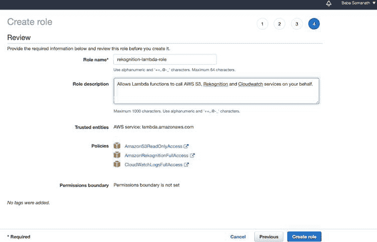

    图 2.1 – 创建角色对话框

    接下来，我们将创建一个 Lambda 函数。

1.  导航到 AWS Lambda 控制台页面。

1.  选择**创建函数**。

1.  创建一个函数：

    +   选择 `lambda-rekognition`。

    +   从 `rekognition-lambda-role` 选择 `Python 3.6`：

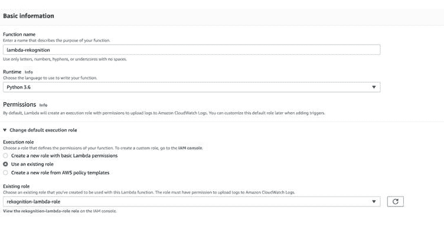

图 2.2 – 创建 Lambda 函数

1.  在 `lambda_function.py` 中输入以下代码：

    ```py
    from __future__ import print_function
    import boto3
    def lambda_handler(event, context):
        print("========lambda_handler started=======")
        # read the bucket name (key) from the event
        name_of_the_bucket=event['Records'][0]['s3']['bucket']
    ['name']
        # read the object from the event
        name_of_the_photo=event['Records'][0]['s3']['object']['key']
        detect_labels(name_of_the_photo,name_of_the_bucket)
        print("Labels detected Successfully")
    def detect_labels(photo, bucket):
        client=boto3.client('rekognition')
      response=client.detect_labels(Image={'S3Object':{'Bucket':bucket,'Name':photo}})
        print('Detected labels for ' + photo) 
        print('==============================')   
        for label in response['Labels']:
            print ("Label: " + label['Name'])
            print ("Confidence: " + 
    str(label['Confidence']))
            print ("Instances:")
            for instance in label['Instances']:
                print ("  Bounding box")
                print ("Top: 
    "+str(instance['BoundingBox']['Top']))
                print ("Left: \
    "+str(instance['BoundingBox']['Left']))
                print ("Width: \
    "+str(instance['BoundingBox']['Width']))
                print ("Height: \
    "+str(instance['BoundingBox']['Height']))
                print ("Confidence: 
    "+str(instance['Confidence']))
                print()
            print ("Parents:")
            for parent in label['Parents']:
                print ("   " + parent['Name'])
            print ("----------")
            print('==============================') 
        return response 
    ```

    现在，我们将为 Lambda 函数创建一个触发器。

1.  导航到 AWS S3 控制台页面。创建一个存储桶，例如，`rekognition-test-baba`，如下截图所示：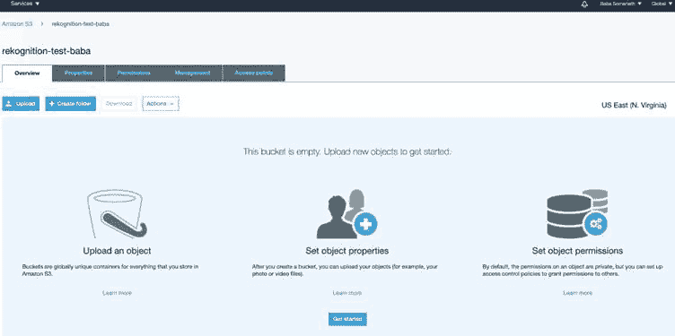

    图 2.3 – AWS S3 控制台页面

1.  点击 `images`。点击**保存**。

1.  点击我们的存储桶的**属性**标签页。

1.  将滚动到该存储桶的**事件**。

1.  在 `rekognition_event`

1.  `所有对象创建事件`

1.  `images`*/*

1.  `Lambda 函数`

1.  `lambda-rekognition`：

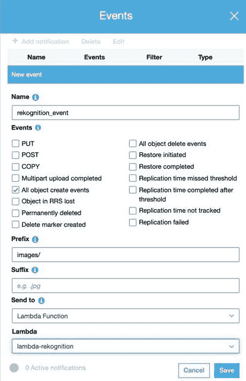

图 2.4 –S3 存储桶事件窗口

接下来，我们将从共享的 GitHub 仓库上传图像到 S3 存储桶 `images` 文件夹。

1.  一旦上传，您就可以检查 Lambda 控制台中的**监控**标签页以监控事件，如下截图所示：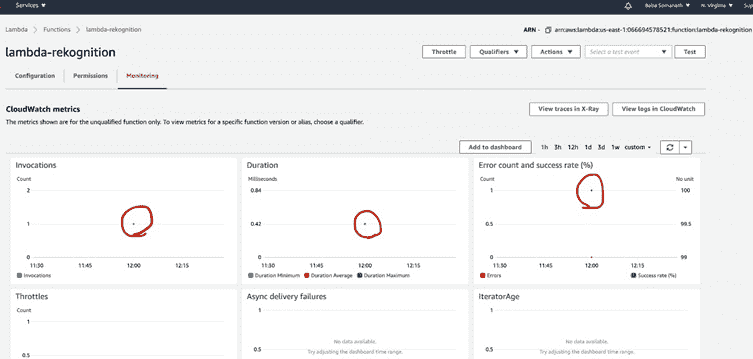

    图 2.5 – CloudWatch 在 Lambda 控制台中监控事件

1.  导航到 **CloudWatch > CloudWatch Logs > Log groups > /aws/lambda/lambda-rekognition**。选择所有流中的最新流，并在日志中向下滚动以查看您的输出，如下截图所示：

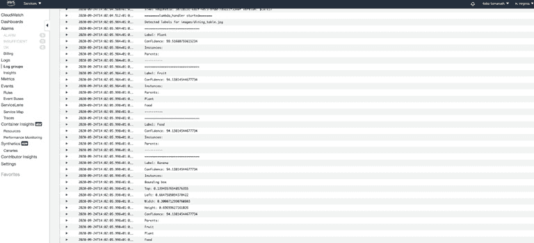

图 2.6 – CloudWatch 日志

在本节中，我们学习了如何实现 Amazon Rekognition AI 服务以检测图像中的对象并为每个对象获取置信度分数。在接下来的章节中，我们将看到 Amazon Rekognition 的更多用例，届时我们将检测图像中的文本。在下一节中，我们将了解 Amazon 的文本到语音服务并实现它。

# 使用 Amazon Polly 进行文本到语音

**Amazon Polly**全关于将文本转换为语音，并且使用预训练的深度学习模型来完成。这是一个完全托管的服务，所以我们不需要做任何事情。您提供纯文本作为合成输入或在**语音合成标记语言（SSML**）格式中，以便返回音频流。它还提供了不同的语言和声音供您选择，包括男性和女性选项。Amazon Polly 的输出音频可以保存为 MP3 格式，以便在应用程序（网页或移动）中进一步使用，或者可以是一个 JSON 输出，用于书面语音。

例如，如果我们把文本“巴巴去了图书馆”输入到 Amazon Polly 中，输出的语音标记对象将如下所示：

```py
{"time":370,"type":"word","start":5,"end":9,"value":"went"}
```

单词“去了”在音频流开始后的 370 毫秒处开始，从给定输入文本的 5 个字节开始，到 9 个字节结束。

它还以`ogg_vorbis`和`pcm`格式返回输出。当使用`pcm`时，返回的内容是 16 位有符号、单通道（单声道）、小端格式的音频/pcm。

Amazon Polly 的一些常见用途包括以下内容：

+   可用作阅读网络内容的辅助工具。

+   可与 Amazon Rekognition 集成，帮助视障人士阅读标志。您可以点击带有文本的标志图片并将其输入到 Amazon Rekognition 中提取文本。输出文本可以用作 Polly 的输入，它将返回语音输出。

+   可用于公共广播系统，管理员团队只需传递要宣布的文本，Amazon Polly 即可完成魔法般的转换。

+   通过将 Amazon Polly 与**Amazon Connect**（电话后端服务）结合使用，您可以构建**音频/视频接收器（AVR**）系统。

+   智能设备，如智能电视、智能手表和**物联网（IoT**）设备，可以使用此功能进行音频输出。

+   叙事生成。

+   当与 Amazon Lex 结合使用时，可以开发应用程序的完整语音用户界面。

现在，让我们探索 Amazon Polly 的好处。

## 探索 Amazon Polly 的好处

使用 Amazon Polly 的一些好处包括以下内容：

+   此服务完全托管，无需任何管理成本来维护或管理资源。

+   它提供即时语音校正和增强功能。

+   您可以使用 Amazon Polly 的 HTTP API 开发自己的访问层。由于有大量的语言支持，如 Python、Ruby、Go、C++、Java 和 Node.js，因此开发变得非常容易。

+   对于某些神经网络语音，可以使用新闻主播风格进行语音合成，使其听起来像电视或广播电台的广播员。

+   Amazon Polly 还允许您修改特定单词的发音或使用新单词。

接下来，我们将亲身体验 Amazon Polly。

## 亲身体验 Amazon Polly

在本节中，我们将构建一个管道，可以集成 AWS Lambda 与 Amazon Polly，读取一个文本文件，然后将其生成相同内容的**MP3**文件到同一个桶的另一个文件夹中。我们将通过 CloudWatch 日志监控任务的进度。

我们将首先为 Lambda 创建一个 IAM 角色。让我们开始吧：

1.  导航到 IAM 控制台页面。

1.  从左侧菜单中选择**角色**。

1.  选择**创建角色**。

1.  选择**Lambda**作为受信任实体。

1.  添加以下托管策略：

    +   `AmazonS3FullAccess`

    +   `AmazonPollyFullAccess`

    +   `CloudWatchFullAccess`

1.  将角色保存为`polly-lambda-role`。

接下来，我们将创建一个 Lambda 函数：

1.  导航到`polly-lambda`

1.  设置运行时为`python 3.6`。

1.  使用现有角色；即`polly-lambda-role`

1.  将代码粘贴到[`github.com/PacktPublishing/AWS-Certified-Machine-Learning-Specialty-MLS-C01-Certification-Guide/tree/master/Chapter-2/Amazon%20Rekognition%20Demo/lambda_code`](https://github.com/PacktPublishing/AWS-Certified-Machine-Learning-Specialty-MLS-C01-Certification-Guide/tree/master/Chapter-2/Amazon%20Rekognition%20Demo/lambda_code)中的您的 lambda 函数，并在 CloudWatch 控制台中检查其进度。我们将使用 Amazon Polly 的`start_speech_synthesis_task` API 来运行此代码；它是一个异步合成任务。

1.  滚动到`59` **秒**，如图下所示，然后点击**保存**：

    重要提示

    默认为 3 秒。由于这是一个异步操作，任何重试尝试都将创建更多文件。

    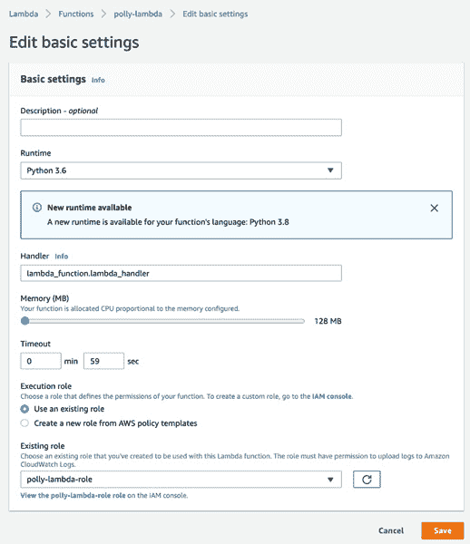

    图 2.7 – 编辑基本设置窗口

    现在，我们将创建一个桶以触发事件。

1.  导航到 AWS S3 控制台，创建一个名为`polly-test-baba`的桶。

1.  创建一个名为`input-text`的文件夹（在这个例子中，我们只会上传`.txt`文件）。

1.  导航到`polly_event`

1.  `所有对象创建事件`

1.  `input-text/`

1.  `txt`

1.  `Lambda Function`

1.  `polly-lambda`

1.  接下来，我们将上传一个文件以触发事件，并在 CloudWatchUpload 中检查其进度，在这种情况下，`input-text`中的文件`test_file.txt`，如图下所示。您可以从本书的 GitHub 仓库下载示例文件：[`github.com/PacktPublishing/AWS-Certified-Machine-Learning-Specialty-MLS-C01-Certification-Guide/tree/master/Chapter-2/Amazon%20Polly%20Demo/text_file`](https://github.com/PacktPublishing/AWS-Certified-Machine-Learning-Specialty-MLS-C01-Certification-Guide/tree/master/Chapter-2/Amazon%20Polly%20Demo/text_file)：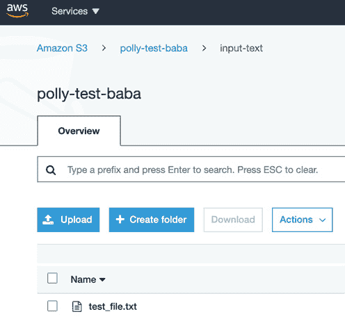

    图 2.8 – 上传文本文件以进行进一步处理后的 S3 桶

1.  这将触发 lambda 函数。您可以通过访问 **CloudWatch> CloudWatch 日志> 日志组> /aws/lambda/polly-lambda** 来监控您的日志：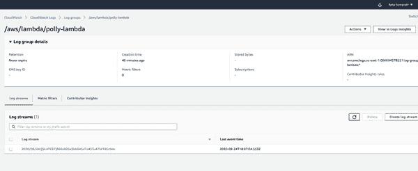

    图 2.9 – CloudWatch 控制台中的日志组

1.  点击最新的流；日志将如下所示：

    ```py
    File Content:  Hello Everyone, Welcome to Dublin. How 
    are you doing today?
    {'ResponseMetadata': {'RequestId': '74ca4afd-5844-
    47d8-9664-3660a26965e4', 'HTTPStatusCode': 200, 
    'HTTPHeaders': {'x-amzn-requestid': '74ca4afd-5844-
    47d8-9664-3660a26965e4', 'content-type': 
    'application/json', 'content-length': '471', 'date': 
    'Thu, 24 Sep 2020 18:50:57 GMT'}, 'RetryAttempts': 0}, 
    'SynthesisTask': {'Engine': 'standard', 'TaskId': 
    '57548c6b-d21a-4885-962f-450952569dc7', 'TaskStatus': 
    'scheduled', 'OutputUri': 'https://s3.us-east-
    1.amazonaws.com/polly-test-baba/output-
    audio/.57548c6b-d21a-4885-962f-450952569dc7.mp3', 
    'CreationTime': datetime.datetime(2020, 9, 24, 18, 50, 
    57, 769000, tzinfo=tzlocal()), 'RequestCharacters': 
    59, 'OutputFormat': 'mp3', 'TextType': 'text', 
    'VoiceId': 'Aditi', 'LanguageCode': 'en-GB'}}
    ```

    以下截图显示了日志样本：

    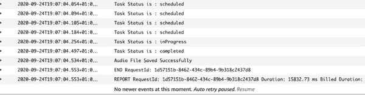

    图 2.10 – CloudWatch 控制台中的日志

1.  它将以 MP3 格式创建输出，如下面的截图所示。下载并收听它：

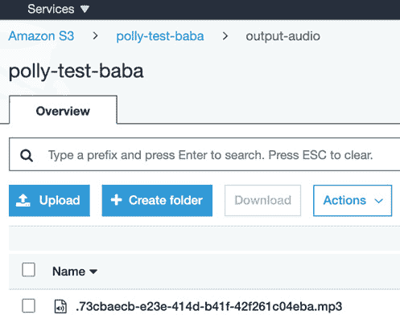

图 2.11 – 在 S3 存储桶中创建的输出文件

重要提示

对于您的移动应用或 Web 应用来说，最可扩展且成本效益最高的方式是为 S3 存储桶生成 AWS 预签名 URL，并将其提供给用户。这些 S3 Put 事件异步调用下游 AI 工作流程以生成结果，并向最终用户发送响应。通过这种方法，可以同时为许多用户提供服务，并且可能会提高性能和吞吐量。

在本节中，我们学习了如何实现文本到语音。在下一节中，我们将了解 Amazon Transcribe，这是一种语音到文本的 AI 服务。

# 使用 Amazon Transcribe 进行语音到文本转换

在上一节中，我们学习了文本到语音。在本节中，我们将学习语音到文本以及提供此服务的服务：**Amazon Transcribe**。它是一种使用预训练的深度学习模型的自动语音识别服务，这意味着我们不需要在数 PB 的数据上进行训练以生成模型；亚马逊为我们完成这项工作。我们只需使用可用的 API 来转录音频文件或视频文件；它还支持多种不同的语言和自定义词汇。准确性是关键，并且通过自定义词汇，您可以根据所需的领域或行业来增强它：

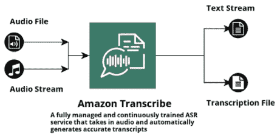

图 2.12 – Amazon Transcribe 输入和输出块的示意图

Amazon Transcribe 的常见用途包括以下内容：

+   实时音频流和转录。

+   转录预录制的音频文件。

+   通过结合 AWS Elasticsearch 和 Amazon Transcribe，启用从媒体文件中进行文本搜索。

+   对录音音频文件进行情感分析以帮助语音客服（接触中心分析）。

+   信道识别分离。

接下来，我们将探讨 Amazon Transcribe 的好处。

## 探索 Amazon Transcribe 的好处

让我们看看使用 Amazon Transcribe 的一些好处：

+   *内容编辑*：通过指示 Amazon Transcribe 识别和编辑 `VocabularyFilterName` 和 `VocabularyFilterMethod`（由 `StratTranscriptionJob` 操作提供），可以确保客户隐私。例如，在金融机构中，这可以用来编辑呼叫者的详细信息。

+   *语言识别*：它可以自动识别音频文件中最常用的语言并生成转录。如果您有多个音频文件，则这项服务可以帮助您按语言对它们进行分类。

+   *流式转录*：您可以将记录的音频文件或实时音频流发送到 Amazon Transcribe，并实时输出文本流。

+   *自定义词汇或定制转录*：您可以根据您的特定需求使用自定义词汇列表来生成准确的转录。

+   *时间戳生成*：如果您想为视频创建或添加字幕，那么 Amazon Transcribe 可以返回音频中每个单词或短语的时戳。

+   *成本效益*：作为一个托管服务，没有基础设施成本。

现在，让我们亲身体验 Amazon Transcribe。

## 亲身体验 Amazon Transcribe

在本节中，我们将构建一个管道，其中我们可以将 AWS Lambda 与 Amazon Transcribe 集成，以读取存储在 S3 桶中文件夹内的音频文件，然后将输出 JSON 文件存储在另一个 S3 桶中。我们还将通过 CloudWatch 日志监控任务的进度。我们将使用 `start_transcription_job` 异步函数来启动我们的工作，并通过 `get_transcription_job` 持续监控工作，直到其状态变为 `COMPLETED`。让我们开始吧：

1.  首先，为 Lambda 函数创建一个名为 `transcribe-demo-role` 的 IAM 角色，以确保它可以读取和写入 S3，使用 Amazon Transcribe，并在 CloudWatch 日志中打印输出。将以下策略添加到 IAM 角色中：

    +   `AmazonS3FullAccess`

    +   `CloudWatchFullAccess`

    +   `AmazonTranscribeFullAccess`

1.  现在，我们将使用现有的 IAM 角色 `transcribe-demo-role` 创建一个名为 `transcribe-lambda` 的 Lambda 函数，并将其保存。

    请确保您将 `start_transcription_job` 中的默认超时值更改为更高的值以启动任务，并使用 `get_transcription_job` API 进行监控。

1.  将可用的代码粘贴到 [`github.com/PacktPublishing/AWS-Certified-Machine-Learning-Specialty-MLS-C01-Certification-Guide/blob/master/Chapter-2/Amazon%20Transcribe%20Demo/lambda_function/lambda_function.py`](https://github.com/PacktPublishing/AWS-Certified-Machine-Learning-Specialty-MLS-C01-Certification-Guide/blob/master/Chapter-2/Amazon%20Transcribe%20Demo/lambda_function/lambda_function.py) 并点击 **部署**。

    这应该会给我们以下输出：

    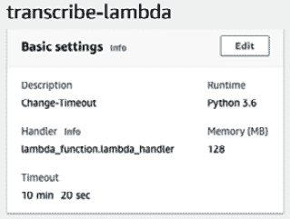

    图 2.13 – 我们创建的 lambda 函数的基本设置部分

1.  接下来，我们将创建一个名为 `transcribe-demo-101` 的 S3 桶和一个名为 `input` 的文件夹。通过访问 `audio-event` 创建一个事件。

1.  `所有对象创建事件`

1.  `input/`

1.  `Lambda 函数`

1.  `transcribe-lambda`

1.  将 `.mp4` 格式的音频文件上传到 `input` 文件夹。这将触发 Lambda 函数。根据代码，输出将以 JSON 格式存储在 S3 桶中，然后您可以使用它来读取文件内容。

1.  导航到 **CloudWatch > CloudWatch Logs > Log groups > aws/lambda/transcribe-lambda**。从列表中选择最新的流。它看起来如下所示：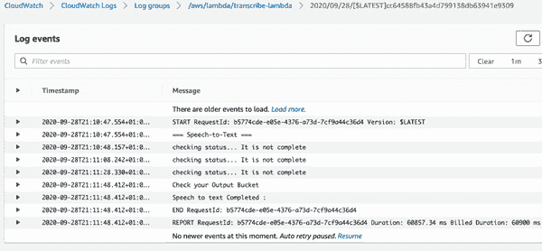

    图 2.14 – CloudWatch 控制台中指定日志组的日志流

1.  输出以 JSON 格式保存在提到的作业名称的 S3 桶中（您可以使用 S3 的 `getObject` API 下载并读取它）：

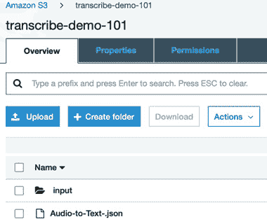

图 2.15 – S3 桶中的输出 JSON 文件

重要提示

不过度配置您函数的超时设置是一种最佳实践。始终了解您的代码性能并根据需要设置函数超时。过度配置函数超时会导致 Lambda 函数运行时间更长，并造成意外的成本。如果您在 Lambda 函数中使用异步 API 调用，那么在成功时将它们写入 SNS 主题，并从那里触发另一个 Lambda 函数是个好主意。如果需要人工干预，建议您使用 AWS Step Functions。

在本节中，我们学习了并应用了 Amazon Transcribe 将语音转换为文本。在下一节中，我们将了解我们可以使用的最强大的 AWS AI 服务之一，以从我们的文本数据中获得最大洞察力。

# 使用 Amazon Comprehend 实现自然语言处理

此服务帮助您从非结构化文本中提取洞察力。非结构化文本信息呈指数增长。以下是一些数据源示例：

+   *客户参与度*：呼叫中心、问题分类、客户调查和产品评论

+   *业务流程*：客户/供应商电子邮件、产品支持消息和运营支持反馈

+   *记录和研究*：白皮书和医疗记录

+   *新闻和社交媒体*：社交媒体分析、品牌趋势和相关事件

现在，问题是，我们能用这些数据做什么？我们如何分析它并从中提取任何价值？答案是 Amazon Comprehend，它用于从您的非结构化数据中获取洞察力。

Amazon Comprehend 的常见用途包括以下内容：

+   信息管理系统

+   有组织的主题上的更精确的搜索系统

+   用户情感分析

+   支持票分类

+   从文档中检测语言，然后使用 Amazon Translate 翻译成英语

+   创建一个系统来标记非结构化临床数据，以协助研究和分析

+   从公司会议或电视新闻的保存音频文件中提取主题

接下来，我们将探索 Amazon Comprehend 的优势。

## 探索 Amazon Comprehend 的优势

使用 Comprehend 的一些优势可以在以下图像中看到：

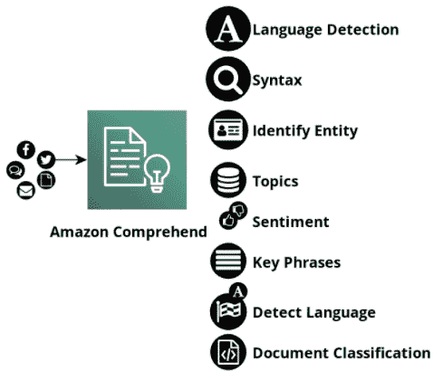

图 2.16 – 显示 Amazon Comprehend 功能的框图

让我们更详细地看看这些：

+   它检测文本的语言并提取关键短语。Amazon Comprehend 还可以用于情感分析和主题建模。

+   Amazon Comprehend Medical 可用于提取医疗信息。

+   由于这是一个完全管理的服务，您只需为使用付费；您无需为基础设施付费。您不需要训练、开发和部署自己的模型。

+   主题建模服务通过提取最多 100 个主题来工作。主题是一个关键字桶，这样您就可以看到实际文档集中有什么。

+   它准确、持续训练且易于使用。

接下来，我们将亲身体验 Amazon Comprehend。

## 亲身体验 Amazon Comprehend

在本节中，我们将构建一个管道，其中可以集成 AWS Lambda 与 Amazon Rekognition 和 Amazon Comprehend。然后我们将读取存储在 S3 存储桶中的图像文件，并检测从图像中提取的文本的语言。我们还将使用 CloudWatch 打印输出。以下是我们用例的图示：

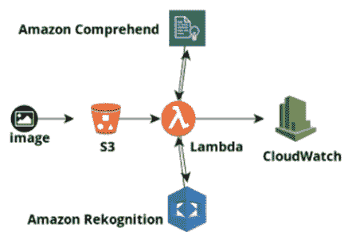

图 2.17 – 所需用例的架构图

让我们从创建 IAM 角色开始：

1.  导航到 IAM 控制台页面。

1.  从左侧菜单中选择**角色**。

1.  选择**创建角色**。

1.  选择**Lambda**作为受信任实体。

1.  添加以下管理`策略`：

    +   `AmazonS3ReadOnlyAccess`

    +   `AmazonRekognitionFullAccess`

    +   `ComprehendFullAccess`

    +   `CloudWatchFullAccess`

1.  将角色保存为`language-detection-from-image-role`。

1.  现在，让我们创建 Lambda 函数。导航到**Lambda > 函数 > 创建函数**。

1.  将函数命名为`language-detection-from-image`。

1.  将运行时设置为`Python 3.6`。

1.  使用我们现有的角色；即`language-detection-from-image-role`。

1.  从[`github.com/PacktPublishing/AWS-Certified-Machine-Learning-Specialty-MLS-C01-Certification-Guide/tree/master/Chapter-2/Amazon%20Transcribe%20Demo/lambda_function`](https://github.com/PacktPublishing/AWS-Certified-Machine-Learning-Specialty-MLS-C01-Certification-Guide/tree/master/Chapter-2/Amazon%20Transcribe%20Demo/lambda_function)下载代码，将其粘贴到函数中，然后从 Amazon Rekognition 中选择`detect_text` API 以检测图像中的文本，并从 Amazon Comprehend 中选择`batch_detect_dominant_language` API 以检测文本的语言。

1.  现在，转到您的 AWS S3 控制台，创建一个名为 *language-detection-image* 的存储桶。

1.  创建一个名为 `input-image` 的文件夹（在本例中，我们只会上传 `.jpg` 文件）。

1.  导航到**属性 > 事件 > 添加通知**。

1.  在`image-upload-event`中填写所需的字段

1.  `所有对象创建事件`

1.  `input-image/`

1.  `.jpg`

1.  `Lambda 函数`

1.  `language-detection-from-image`

1.  导航到文件夹中的`sign-image.jpg`图片。（此文件可在本书的 GitHub 仓库中找到，地址为[`github.com/PacktPublishing/AWS-Certified-Machine-Learning-Specialty-MLS-C01-Certification-Guide/tree/master/Chapter-2/Amazon%20Comprehend%20Demo/input_image`](https://github.com/PacktPublishing/AWS-Certified-Machine-Learning-Specialty-MLS-C01-Certification-Guide/tree/master/Chapter-2/Amazon%20Comprehend%20Demo/input_image)）。

1.  此文件上传将触发 lambda 函数。您可以从**CloudWatch> CloudWatch Logs> Log groups> /aws/lambda/language-detection-from-image**监控日志。

1.  点击流并选择最新的一个。检测到的语言将在日志中打印出来，如下面的截图所示：

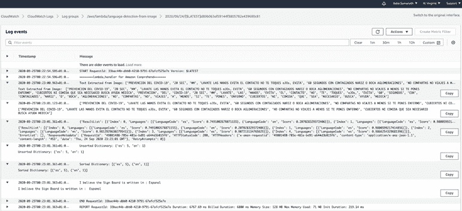

图 2.18 – 用于验证输出的 CloudWatch 中的日志

重要提示

建议在生产环境中使用批量操作，如`BatchDetectSentiment`或`BatchDetectDominantLanguage`。这是因为单个 API 操作可能会导致 API 级别的限制。更多详细信息请参阅[`docs.aws.amazon.com/comprehend/latest/dg/functionality.html`](https://docs.aws.amazon.com/comprehend/latest/dg/functionality.html)。

在本节中，我们学习了如何使用 Amazon Comprehend 来检测文本的语言。文本是通过 Amazon Rekognition 提取到我们的 Lambda 函数中的。在下一节中，我们将学习如何通过 Amazon Translate 将相同的文本翻译成英语。

# 使用 Amazon Translate 翻译文档

大多数时候，人们更喜欢用他们自己的语言进行交流，即使在数字平台上也是如此。Amazon Translate 是一种文本翻译服务。我们可以提供各种语言的文档或文本字符串，并将其翻译成不同的语言。它使用预训练的深度学习技术，所以我们不需要担心模型，也不需要担心它们的管理。我们可以发起 API 请求并获取结果。

Amazon Translate 的常见用途包括以下内容：

+   如果有组织范围内的需求需要用不同的语言准备文档，那么 Translate 就是将一种语言转换为多种语言的解决方案。

+   在线聊天应用可以实时翻译，以提供更好的客户体验。

+   将网站内容快速且经济地本地化到更多语言。

+   一旦翻译成不同的语言，情感分析可以应用于不同的语言。

+   为新闻发布网站提供非英语语言支持。

接下来，我们将探讨 Amazon Translate 的好处。

## 探索 Amazon Translate 的好处

使用 Amazon Translate 的一些好处包括以下内容：

+   它使用神经机器翻译，模仿人类大脑的工作方式。

+   无需维护您的资源。

+   产生高质量的成果并保持其一致性。

+   您可以自定义品牌名称和模型名称，以及任何其他独特术语都使用自定义术语功能进行翻译。

+   可以通过 API 轻松集成到应用程序中。

+   当您需要 Amazon Translate 做更多工作时，它会自动扩展。

接下来，我们将亲身体验 Amazon Translate。

## 亲身体验 Amazon Translate

在本节中，我们将通过将 AWS Lambda 与 Amazon Rekognition、Amazon Comprehend 和 Amazon Translate 集成来构建一个产品，以读取存储在 S3 桶中的图像文件。然后，我们将检测从图像中提取的文本的语言，以便将其翻译成英语。我们还将使用 CloudWatch 来打印翻译后的输出。以下是我们用例的示意图：

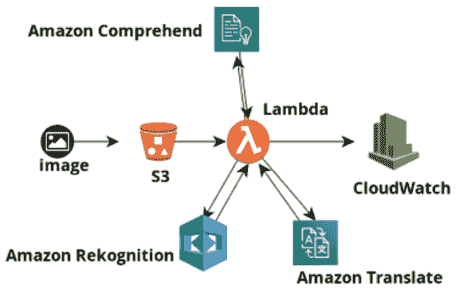

图 2.19 – 所需用例的架构图

让我们从创建 IAM 角色开始：

1.  导航到 IAM 控制台页面。

1.  从左侧菜单中选择**角色**。

1.  选择**创建角色**。

1.  选择**Lambda**作为受信任实体。

1.  添加以下管理策略：

    +   `AmazonS3ReadOnlyAccess`

    +   `AmazonRekognitionFullAccess`

    +   `ComprehendFullAccess`

    +   `CloudWatchFullAccess`

    +   `TranslateFullAccess`

1.  将角色保存为`language-translation-from-image`。

1.  下一个直接步骤是创建一个 Lambda 函数。导航到**Lambda > 函数 > 创建函数**。

1.  将函数命名为`language-detection-from-image`。

1.  将运行时设置为`Python 3.6`。

1.  使用现有的角色；即`language-detection-from-image-role`。

1.  将可用的代码粘贴到[`github.com/PacktPublishing/AWS-Certified-Machine-Learning-Specialty-MLS-C01-Certification-Guide/blob/master/Chapter-2/Amazon%20Translate%20Demo/lambda_function/lambda_function.py`](https://github.com/PacktPublishing/AWS-Certified-Machine-Learning-Specialty-MLS-C01-Certification-Guide/blob/master/Chapter-2/Amazon%20Translate%20Demo/lambda_function/lambda_function.py)，并点击`translate_text` API 来翻译输入文本。

1.  下一步是创建一个名为`language-translation-from-image`的桶。

    创建一个名为`image`的文件夹。然后，导航到**属性 > 事件 > 添加通知**。

1.  填写所需的字段，如此处所示，并点击`.jpg`作为后缀；否则，它将触发 lambda 函数的任何对象创建过程）：

    +   `All object create events`

    +   `image/`

    +   `.jpg`

    +   `Lambda Function`

    +   `language-translation-from-image`

1.  将`sign-image.jpg`图片导航到文件夹中。此文件可在本书的 GitHub 存储库中找到：[`github.com/PacktPublishing/AWS-Certified-Machine-Learning-Specialty-MLS-C01-Certification-Guide/tree/master/Chapter-2/Amazon%20Translate%20Demo/input_image`](https://github.com/PacktPublishing/AWS-Certified-Machine-Learning-Specialty-MLS-C01-Certification-Guide/tree/master/Chapter-2/Amazon%20Translate%20Demo/input_image)。

1.  上传此图片将触发 lambda 函数。您可以通过访问**CloudWatch> CloudWatch Logs> Log groups> /aws/lambda/language-translation-from-image**来监控日志。

1.  点击流并选择最新的一个。它看起来如下：

![图 2.20 – 用于验证输出的 CloudWatch 中的日志

![img/B16735_02_020.jpg]

图 2.20 – 用于验证输出的 CloudWatch 中的日志

翻译如下：

```py
Translation of the text from the Image :   
{'PREVENCION DEL COVID-19': 'PREVENTION OF COVID-19', 
'LAVATE LAS MANOS EVITA EL CONTACTO NO TE TOQUES oJOs, 
EVITA': 'WASHE HANDS AVOID CONTACT DO NOT TOUCH EYES', 
'60 SEGUNDOS CON CONTAGIADOS NARIZ O BOCA 
AGLOMERACIONES': '60 SECONDS WITH CONTAGIOUS NOSE OR 
MOUTH AGGLOMERATIONS', 'NO COMPARTAS NO VIAJES A MENOS 
SI TE PONES ENFERMO': "DON'T SHARE NOT TRAVEL UNLESS 
YOU GET SICK", 'CUBIERTOS NI COMIDA QUE SEA NECESARIO 
BUSCA AYUDA MEDICA': 'CUTLERY OR FOOD NEEDED SEEK 
MEDICAL HELP'}
```

重要提示

对于生产用例，如果您有依赖服务或服务链，建议使用 AWS Lambda 与 AWS Step Function 一起使用。

不建议使用相同的 S3 存储桶来存储输入和输出对象。在同一个存储桶中创建输出对象可能会触发递归 Lambda 调用。如果您正在使用相同的存储桶，我们建议您使用前缀和后缀来触发事件。同样，我们建议使用前缀来存储输出对象。

在本节中，我们学习了如何组合多个服务并将它们的输出链接起来以实现特定的用例结果。我们学习了如何集成 Amazon Rekognition 来检测图像中的文本。然后，我们可以使用 Amazon Comprehend 来检测语言。然后，我们使用相同的输入并在 Amazon Translate 的帮助下将其翻译成英语。然后将翻译后的输出打印在 CloudWatch 日志中进行验证。在下一节中，我们将了解 Amazon Textract，我们可以使用它从文档中提取文本。

# 使用 Amazon Textract 从文档中提取文本

手动从文档中提取信息是缓慢的、昂贵的且容易出错。传统的光学字符识别软件需要大量的定制，并且仍然会给出错误的结果。为了避免这样的手动过程和错误，您应该使用**Amazon Textract**。通常，我们将文档转换为图像，以便在图像中的文本周围检测边界框。然后我们应用字符识别技术来读取文本。Textract 为您完成所有这些工作，并且还以最小的努力为您提取文本、表格、表单和其他数据。如果您从 Amazon Textract 获得低置信度结果，那么 Amazon A2I 是最好的解决方案。

Textract 减少了从数百万扫描的文档页中提取文本的手动工作量。一旦信息被捕获，可以对文本采取行动，例如将其存储在不同的数据存储中，分析情感或搜索关键词。以下图表显示了 Amazon Textract 的工作原理：

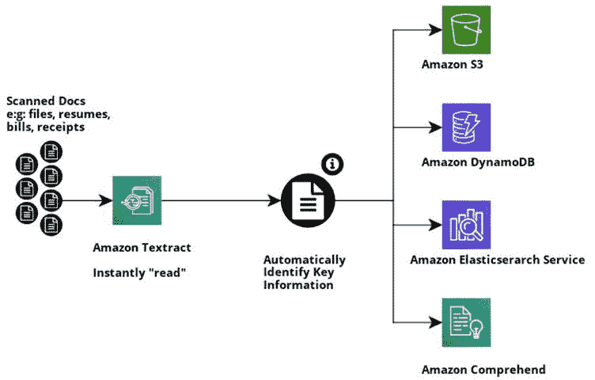

图 2.21 – Amazon Textract 的块图表示及其存储输出方式

Amazon Textract 的常见用途包括以下内容：

+   记录提取表格或表单的处理工作流程。

+   使用 Amazon Elasticsearch 从文档中创建搜索索引。

+   在工作流程中删除个人可识别信息；Textract 自动识别数据类型和表单标签。

接下来，我们将探索 Amazon Textract 的优势。

## 探索 Amazon Textract 的优势

使用 Textract 有几个原因，如下所述：

+   零基础设施成本。

+   全托管服务（减少开发和管理工作量）。

+   帮助您提取结构化和非结构化数据。

+   可以分析手写评论。

+   Amazon Textract 的性能优于使用扁平词袋的 OCR 应用程序。

+   接下来，我们将亲自动手使用 Amazon Textract。

## 亲自动手使用 Amazon Textract

在本节中，我们将使用 Amazon Textract API 从我们的 S3 存储桶中读取一个图像文件，并在 Cloudwatch 上打印 "FORM" 详细信息。这些信息可以以您希望的格式存储在 S3 中以供进一步使用，也可以存储在 DynamoDB 中作为键值对。让我们开始吧：

1.  首先，创建一个名为 `textract-use-case-role` 的 IAM 角色，并具有以下策略。这将允许 Lambda 函数执行，以便它可以读取 S3，使用 Amazon Textract，并在 CloudWatch 日志中打印输出：

    +   `CloudWatchFullAccess`

    +   `AmazonTextractFullAccess`

    +   `AmazonS3ReadOnlyAccess`

1.  让我们创建一个名为 `textract-document-analysis` 的 S3 存储桶，并上传 `receipt.png` 图像文件。这将用于包含将要提取的表单详细信息。图像文件可在以下位置找到：[`github.com/PacktPublishing/AWS-Certified-Machine-Learning-Specialty-MLS-C01-Certification-Guide/tree/master/Chapter-2/Amazon%20Textract%20Demo/input_doc`](https://github.com/PacktPublishing/AWS-Certified-Machine-Learning-Specialty-MLS-C01-Certification-Guide/tree/master/Chapter-2/Amazon%20Textract%20Demo/input_doc)：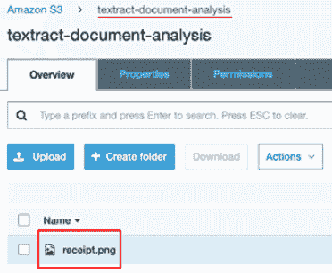

    图 2.22 – 已将图像 (.png) 文件上传到输入文件夹的 S3 存储桶

1.  下一步是创建一个名为 `read-scanned-doc` 的 Lambda 函数，如图所示，使用现有的执行角色 `textract-use-case-role`：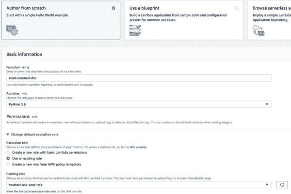

    图 2.23 – AWS Lambda 创建函数对话框

1.  函数创建完成后，粘贴以下代码并部署。向下滚动到 Amazon Textract 的 `analyze_document` API，通过 API 的 `FeatureTypes` 参数获取 "表和表单" 详细信息：

    ```py
    import boto3
    import time
    from trp import Document
    textract_client=boto3.client('textract')

    def lambda_handler(event, context): 
        print("- - - Amazon Textract Demo - - -") 
        # read the bucket name from the event 
        name_of_the_bucket=event['Records'][0]['s3']['bucket'] ['name'] 
        # read the object from the event 
        name_of_the_doc=event['Records'][0]['s3']['object']['key']
        print(name_of_the_bucket)
        print(name_of_the_doc)
        response = 
    textract_client.analyze_document(Document={'S3Object': 
    {'Bucket': name_of_the_bucket,'Name': 
    name_of_the_doc}},FeatureTypes=["TABLES","FORMS"])
        print(str(response))
        doc=Document(response)
        for page in doc.pages:
            # Print tables
            for table in page.tables:
                for r, row in enumerate(table.rows):
                    for c, cell in enumerate(row.cells):
                        print("Table[{}][{}] = 
    {}".format(r, c, cell.text))
        for page in doc.pages:
            # Print fields
            print("Fields:")
            for field in page.form.fields:
                print("Key: {}, Value: 
    {}".format(field.key, field.value))
    ```

    与前面的示例不同，我们将创建一个测试配置来运行我们的代码。

1.  点击 **测试** 按钮左侧的下拉菜单。

1.  选择**配置测试事件**并选择**创建新测试事件**。

1.  从**事件模板**下拉菜单中选择**Amazon S3 Put**。

1.  在 JSON 体中，根据我们的存储桶名称和键更改突出显示的值，如图所示：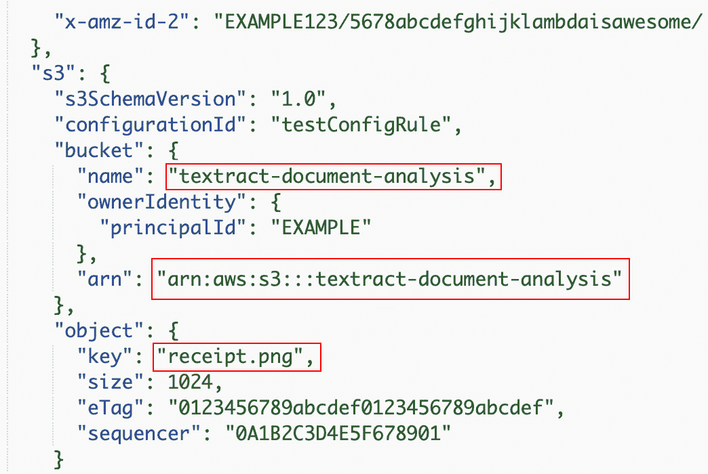

    图 2.24 – 测试 lambda 函数的事件模板

1.  在`TextractDemo`中。

1.  点击**保存**。

1.  选择您的测试配置（`TextractDemo`）并点击**测试**：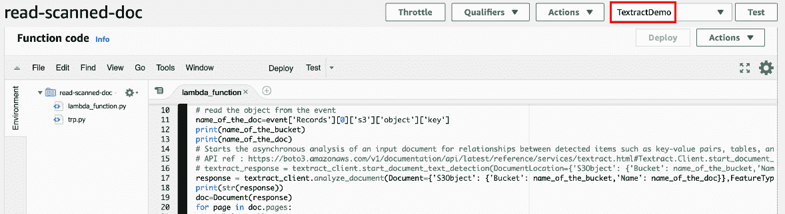

    图 2.25 – 在运行测试之前选择测试配置

1.  这将触发 lambda 函数。您可以从**CloudWatch> CloudWatch 日志>日志组> /aws/lambda/ read-scanned-doc**监控日志。

1.  点击流并选择最新的一个。它看起来如下；以下屏幕截图可以看到键值对：

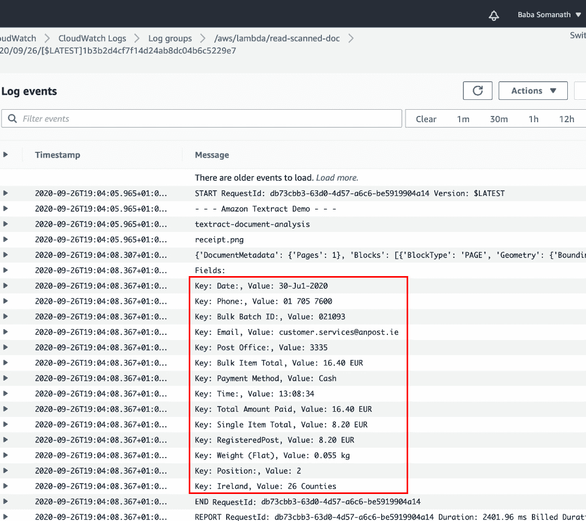

图 2.26 – CloudWatch 中的日志以验证输出

重要提示

通过生成 AWS 预签名 URL，然后将其提供给您的移动或 Web 应用程序用户，这是生成 S3 Put 事件以通过 Lambda 异步调用下游 AI 工作流程的最可扩展和最具成本效益的方式。这种方法可以同时为许多用户提供服务，并可能提高性能和吞吐量。

考虑为您的 AWS AI 服务和 S3 存储桶使用相同的区域可能会提高性能并减少网络延迟。AWS VPC 端点可以在不使用公共互联网的情况下利用增强的安全性。您可以将 AWS AI 结果存储在 AWS S3 存储桶中，并对其他数据进行加密以获得更好的安全性。

在本节中，我们学习了如何从扫描的文档中提取文本并将表单数据打印出来。与其他部分不同，我们通过创建包含事件模板的测试配置来使用 lambda 函数的测试功能。在下一节中，我们将学习为组织创建聊天机器人以及如何使用它。

# 在 Amazon Lex 上创建聊天机器人

Alexa 中大多数可用的功能都是由**Amazon Lex**驱动的。您可以使用 Amazon Lex 轻松构建聊天机器人。它在幕后使用自然语言理解和自动语音识别。通过 SLU，Amazon Lex 将自然语言语音和文本输入，理解意图，并满足用户的意图。Amazon Lex 机器人可以从控制台或通过 API 创建。其基本要求将在下面的图中展示。

Amazon Lex 的一些常见用途包括以下内容：

+   既能听又能接收文本输入的应用。

+   聊天机器人。

+   对话式人工智能产品，以提供更好的客户和销售体验。

+   为通过 AWS Lambda 函数提供帮助而创建的自定义业务机器人。

+   为您的呼叫中心提供语音助手，它可以与用户交谈、安排会议或请求您的账户详情。

+   通过与 Amazon Cognito 集成，您可以控制用户管理、身份验证和跨所有设备的同步。

接下来，我们将探索 Amazon Lex 的优势。

## 探索 Amazon Lex 的优势

使用 Lex 的一些原因包括以下内容：

+   机器人可以直接在 AWS 管理控制台中构建和测试。这些机器人可以通过其丰富的格式化功能轻松集成到 Facebook Messenger、Slack 和 Twilio SMS。

+   对话记录可以存储在 Amazon CloudWatch 中进行进一步分析。您可以使用它们来监控您的机器人并从中获得见解，以改善用户体验。

+   Amazon Lex 可以集成到其他 AWS 服务中，例如 Amazon Cognito、AWS Lambda、Amazon DynamoDB、Amazon CloudWatch 和 AWS Mobile Hub，以利用 AWS 平台上的应用安全、监控、用户身份验证、业务逻辑、存储和移动应用开发。

+   Amazon Lex 聊天机器人也可以集成到您的自定义 Web 应用程序中。您只需构建一个聊天机器人小部件并将其集成到您的 UI 中。

接下来，我们将亲身体验 Amazon Lex。

## 亲身体验 Amazon Lex

让我们开始吧：

1.  登录到[`console.aws.amazon.com/lex/`](https://console.aws.amazon.com/lex/)。

1.  点击**开始**并选择**自定义机器人**。

1.  填写以下详细信息并点击**创建**：![图 2.27 – Amazon Lex 的创建对话框

    ![img/B16735_02_027.jpg]

    图 2.27 – Amazon Lex 的创建对话框

1.  点击**创建意图**。将出现一个对话框。选择**创建意图**。

1.  将新的意图命名为`MovieIntent`并点击**添加**。

1.  前往`movie_type`

1.  插槽类型：`AMAZON.Genre`

1.  提示：`你喜欢哪部电影？`

1.  点击`movie_type`是我的变量：![图 2.28 – 样例表述部分

    ![img/B16735_02_028.jpg]

    图 2.28 – 样例表述部分

1.  滚动到**响应**部分以添加消息：![图 2.29 – Amazon Lex 的响应部分

    ![img/B16735_02_029.jpg]

    图 2.29 – Amazon Lex 的响应部分

1.  滚动到**保存意图**并点击**构建**。在成功构建提示后，将显示以下成功消息：![图 2.30 – Amazon Lex 的响应部分

    ![img/B16735_02_030.jpg]

    图 2.30 – Amazon Lex 的响应部分

1.  现在，您可以测试您的机器人，如下截图所示：

![图 2.31 – 测试机器人的对话

![img/B16735_02_031.jpg]

图 2.31 – 测试机器人的对话

重要提示

并非所有 Amazon Polly 功能都在 Alexa 中可用 – 尤其是 Amazon Polly SSML 功能 – 这使得 Amazon Polly 和 Alexa 有所不同。

这就结束了本章对各种可用的 AWS 应用服务的介绍。

# 摘要

在本章中，我们了解了一些 AWS AI 服务，这些服务可以用来解决各种问题。我们使用了 Amazon Rekognition 服务，它可以检测对象和面部（包括名人面部），还可以从图像中提取文本。对于文本到语音，我们使用了 Amazon Polly，而对于语音到文本，我们使用了 Amazon Transcribe。在本章的末尾，我们在 Amazon Lex 中构建了一个聊天机器人。

对于图像中的语言检测和翻译，我们使用了 Amazon Rekognition、Amazon Comprehend 和 Amazon Translate。我们学习了如何将它们组合成一个 Lambda 函数来解决我们的问题。

对于认证考试，您不需要记住本章中我们使用的所有 API。可能会有关于我们学习的一些最佳实践的问题，或者关于解决特定问题的服务名称的问题。始终练习使用这些 AWS AI 服务是很好的，因为它将增强您的架构技能。

在下一章中，我们将学习数据准备和转换，这是机器学习最重要的方面。

## 问题

1.  使用预定义的逻辑和规则向在线购物者推荐产品是一个机器学习的例子。

    a. 真的

    b. 假的

1.  机器学习堆栈的哪个级别可以帮助您构建自定义 ML 模型而不需要管理基础设施？

    a. 最高级别（AI 服务）

    b. 中间级别（Amazon SageMaker）

    c. 最低级别（机器学习框架和基础设施）

    d. 您自己的基础设施和代码级别

1.  你可以用 Amazon Textract 做什么？

    a. 在文档中检测键值对

    b. 为文本提取构建自定义 ML 模型

    c. 发送低置信度分数的文本提取以供人工审查

    d. 将检测到的文本翻译成英语

1.  使用 Amazon Comprehend，可以训练一个新的模型来帮助您从文本中提取自定义实体。

    a. 假的

    b. 真的

1.  以下哪项是 Amazon Comprehend 设计用于分析的数据类型示例？

    a. 社交媒体帖子

    b. 表格中的数据

    c. 日志文件

    d. GPS 数据

    答案

    对于日志文件，我们可以使用 CloudWatch 日志洞察。

1.  当调用 `DetectKeyPhrases` API 时，以下哪项不是 Amazon Comprehend 返回的内容？

    a. 关键短语

    b. 每个关键短语的数量

    c. 每个关键短语的确信度水平

    d. 每个关键短语的情绪

    答案

    这与情绪无关。

1.  你想创建一个 Lex 机器人来帮助你订购披萨。为什么在意图配置中添加槽位很重要？

    a. 因此您可以定制不同尺寸和配料的不同披萨订单。

    b. 因此您可以考虑到您可能传达订购披萨意图的不同方式。

    c. 以便自动为您设置 lambda 函数来满足意图。

1.  假设你负责构建一个分析客户聊天情绪的系统。你应该与 Amazon Lex 集成哪个服务来完成这项工作？

    a. Amazon Transcribe

    b. Amazon Comprehend

    c. Amazon Translate

    d. Amazon Textract

1.  在哪种情况下，Amazon Lex 的回退意图会有帮助？

    a. 当用户订购披萨，但由于背景噪音，机器人需要用户重复他们所说的话时。

    b. 当机器人必须使用与用户的先前交流来假装理解用户的不清楚信息时。

    c. 当机器人被问到它没有编程回答的问题时。

    答案

    回退意图是为了那些机器人不期望的输入。

1.  以下哪三个选项是 Amazon Textract 可以处理而传统 OCR 方法无法处理的？

    a. 从文档中提取单词和行

    b. 在不使用任何模板的情况下从文档中提取表单（键/值）

    c. 处理非文本内容，如单选按钮和复选框

    d. 保留存储在表格中的数据组成

1.  将 Amazon Textract 与 Amazon A2I（人工审查）集成的以下哪个是常见用例？

    a. 您想从图像或 PDF 文档中识别表单标签和值。

    b. 您正在从需要因监管要求或敏感业务决策而进行审查的文档中提取数据。

    c. 您的文档中有表格，您需要保留存储在这些表格中的数据组成。

1.  您正在尝试从文档中提取表单或表格数据。由于您的使用对延迟敏感，例如移动捕获，您需要同步执行此操作。您应该使用哪个 API？

    a. 分析文档

    b. 检测文档文本

    c. 开始文档分析

    d. 获取文档文本检测

## 答案

1\. B

2\. B

3\. A, C

4\. B

5\. A

6\. D

7\. A

8\. B

9\. C

10\. B, C, D

11\. B

12\. A
