# 第三章 数据准备和转换

你可能听说过数据科学家大部分时间都在从事与数据准备相关的活动。现在是时候解释为什么会这样，以及我们谈论的是哪些类型的活动了。

在本章中，你将学习如何处理分类和数值特征，以及应用不同的技术来转换你的数据，例如独热编码、二进制编码器、顺序编码、分箱和文本转换。你还将学习如何处理数据中的缺失值和异常值，这两个任务对于构建良好的机器学习模型至关重要。

本章我们将涵盖以下主题：

+   识别特征类型

+   处理分类特征

+   处理数值特征

+   理解数据分布

+   处理缺失值

+   处理异常值

+   处理不平衡数据集

+   处理文本数据

这是一个篇幅较长的章节，所以请耐心等待！详细了解这些主题将肯定让你在 AWS 机器学习专业考试中处于有利位置。

# 识别特征类型

在不知道**特征**是什么以及它可能存储哪种类型的信息之前，我们无法开始建模。你已经阅读了关于处理特征的不同的过程。例如，你知道特征工程与构建和准备特征到模型的任务相关；你也知道特征选择与选择最佳特征集以供特定算法使用的任务相关。这两个任务有一个共同的行为：它们可能根据它们处理的特征类型而变化。

理解这种行为（特征类型与适用的转换）非常重要，因为它将帮助你消除考试中的无效答案（最重要的是，你将成为一名更好的数据科学家）。

当我们提到特征类型时，我们指的是特定特征应该存储的数据类型。以下图表展示了我们如何潜在地描述模型的不同特征类型：

![图 3.1 – 特征类型

![img/B16735_03_001.jpg]

图 3.1 – 特征类型

在*第一章**，机器学习基础*中，你已了解到前面图表中展示的特征分类。现在，让我们看看一些真实示例，以便消除你可能存在的任何疑问：

![图 3.2 – 特征值的真实示例

![img/B16735_03_002.jpg]

图 3.2 – 特征值的真实示例

虽然查看变量的值可能有助于您找到其类型，但您绝不应该只依赖这个方面。变量的性质对于做出这样的决定也非常重要。例如，有人可以将云服务提供商变量（如前表所示）编码如下：1（AWS），2（MS），3（Google）。在这种情况下，变量仍然是一个名义特征，即使它现在由离散数字表示。

如果您正在构建机器学习模型，并且没有告诉您的算法这个变量不是一个离散数字，而是一个名义变量，那么算法将把它当作一个数字处理，模型将不再可解释。

重要提示

在将任何机器学习算法与数据结合之前，请确保您的特征类型已经被正确识别。

理论上，如果您对您的特征满意并且已经正确地对每个特征进行了分类，您应该准备好进入 CRISP-DM 方法的建模阶段，不是吗？好吧，也许不是。即使您已经正确地分类了特征，您可能还有很多原因想要在数据准备上花费更多的时间：

+   一些算法实现，如`scikit-learn`，可能不接受您的分类特征上的字符串值。

+   您变量的数据分布可能不是您算法的最优分布。

+   您的机器学习算法可能会受到您数据规模的影响。

+   您的变量的一些观测值（行）可能缺少信息，您将不得不修复它们。这些也被称为缺失值。

+   您可能会发现变量的异常值，这些异常值可能会给您的模型带来潜在的偏差。

+   您的变量可能存储着不同类型的信息，而您可能只对其中的一些感兴趣（例如，日期变量可以存储星期几或月份的哪一周）。

+   您可能希望为文本变量找到一个数学表示。

+   并且相信我，这个列表永远不会结束。

在接下来的章节中，我们将了解如何解决所有这些问题，从分类特征开始。

# 处理分类特征

对于分类特征的数据转换方法将根据您变量的子类型而有所不同。在接下来的章节中，我们将了解如何转换名义和有序特征。

## 转换名义特征

在应用机器学习算法之前，您可能需要创建您分类特征的数值表示。一些库可能已经内置了处理这种转换的逻辑，但大多数都没有。

我们将要介绍的第一种转换方法被称为**标签编码**。标签编码器适用于分类/名义变量，它将为您的变量的每个不同的标签分配一个数字。以下表格显示了标签编码器是如何工作的：

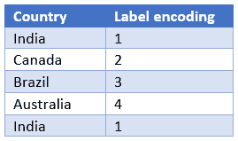

图 3.3 – 标签编码器在作用中

标签编码器将始终确保每个不同的标签都关联一个唯一的数字。在前面的表格中，尽管“印度”出现了两次，但它被分配了相同的数字。

您现在有了每个国家的数值表示，但这并不意味着您可以在模型中使用这种数值表示！在这个特定的情况下，我们正在转换一个没有顺序的命名特征。

根据前面的表格，如果我们将*国家*变量的编码版本传递给模型，它将做出诸如“巴西（3）大于加拿大（2）”这样的假设，这是没有意义的。

对于这种情况的一个可能解决方案是在"*国家"*上应用另一种类型的转换：**独热编码**。这种转换将表示原始特征中的所有类别作为单独的特征（也称为**虚拟变量**），这将存储每个类别的“存在或不存在”。以下表格正在转换我们在前面表格中查看的相同信息，但这次它正在应用独热编码：

![图 3.4 – 独热编码的实际应用

![图片/B16735_03_004.jpg]

图 3.4 – 独热编码的实际应用

我们现在可以使用*国家*变量的独热编码版本作为机器学习模型的特征。然而，作为一名怀疑论的数据科学家，您的工作永远不会结束，您的批判性思维能力将在 AWS 机器学习专业考试中得到考验。

假设您的数据集中有 150 个不同的国家。您会想出多少个虚拟变量？150 个，对吧？这里，我们刚刚发现一个潜在问题：除了增加模型的复杂性（这绝不是任何模型所期望的特性）之外，虚拟变量还会给您的数据增加**稀疏性**。

稀疏数据集有很多变量填充了零。通常，很难将这种数据结构拟合到内存中（您很容易耗尽内存），并且对于机器学习算法来说，处理稀疏结构非常耗时。

您可以通过将原始数据分组并减少类别数量来绕过稀疏性问题，甚至可以使用自定义库来压缩稀疏数据，使其更容易操作（例如，Python 中的`scipy.sparse.csr_matrix`）。

因此，在考试期间，请记住，当您需要将分类/名义数据转换为供机器学习模型使用时，独热编码绝对是正确的做法；然而，考虑到您原始特征中唯一类别的数量，并思考是否为所有这些类别创建虚拟变量是有意义的（如果您有非常多的唯一类别，可能并不合理）。

## 应用二进制编码

对于具有更多唯一类别的变量类型，创建它们的数值表示的一个潜在方法是应用**二进制编码**。在这种方法中，目标是把一个分类列转换成多个二进制列，但最小化新列的数量。

这个过程包括三个基本步骤：

1.  分类数据在通过序数编码器后转换为数值数据。

1.  然后将得到的数字转换为二进制值。

1.  二进制值被分割成不同的列。

让我们重用我们的*图 3.3*中的数据来查看我们如何在这个特定情况下使用二进制编码：

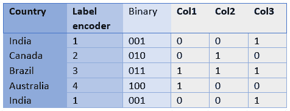

图 3.5 – 二进制编码的实际应用

如我们所见，我们现在有三个列（Col1、Col2 和 Col3），而不是四个。

## 转换序数特征

序数特征有一个非常具体的特征：*它们有顺序*。因为它们具有这种特性，所以对它们应用独热编码是没有意义的；如果你这样做，你将失去特征的顺序大小。

这种类型变量的最常见转换方法被称为**序数编码**。序数编码器将每个变量的不同标签与一个数字相关联，就像标签编码器一样，但这次，它将尊重每个类别的顺序。以下表格显示了序数编码器是如何工作的：

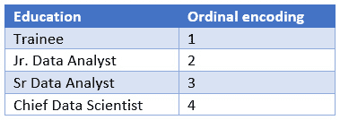

图 3.6 – 序数编码的实际应用

我们现在可以将编码后的变量传递给机器学习模型，它们将能够正确地处理这个变量，无需应用独热编码转换。这次，比较如“高级数据分析师大于初级数据分析师”是完全有意义的。

## 避免在训练和测试数据集中产生混淆

不要忘记以下声明：编码器是在训练数据上**拟合**的，在测试和生产数据上**转换**的。这就是你的机器学习管道应该如何工作。

假设你已经创建了一个适合*图 3.3*数据的独热编码器，并返回根据*图 3.4*的数据。在这个例子中，我们将假设这是我们的训练数据。一旦你完成了训练过程，你可能想要将相同的独热编码转换应用到你的测试数据上，以检查模型的结果。

在我们刚才描述的场景中（这在建模管道中是一个非常常见的情况），你**不能**在测试数据上重新训练你的编码器！你应该只是重用你在训练数据上创建的之前的编码器对象。技术上，我们说你不应该再次使用`fit`方法，而应该使用`transform`方法。

你可能已经知道为什么你应该遵循这个规则的原因，但让我们回顾一下：测试数据是为了提取你模型的性能指标而创建的，所以你不应该用它来提取任何其他知识。如果你这样做，你的性能指标将会受到测试数据的影响，你无法推断出相同的性能（在测试数据中显示）在生产环境中（当新数据到来时）很可能发生。

好的，到目前为止一切顺利。但是，如果我们测试集中有一个训练集中没有的新类别，我们该如何转换这些数据呢？让我们来分析这个特定场景。

回到我们之前在 *图 3.3*（输入数据）和 *图 3.4*（输出数据）中看到的 one-hot 编码示例，我们的编码器知道如何转换以下国家：澳大利亚、巴西、加拿大和印度。如果我们测试集中有其他国家，编码器将不知道如何转换它，这就是为什么我们需要定义它在有异常情况下的行为。

大多数机器学习库都为这些情况提供了特定的参数。在我们的例子中，我们可以编程编码器在虚拟变量上引发错误或设置所有为零，如下表所示：

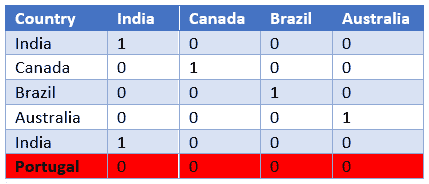

图 3.7 – 在 one-hot 编码转换中处理未知值

如我们所见，葡萄牙没有出现在训练集中（*图 3.3*），因此在转换过程中，我们保持相同的已知国家列表，并说葡萄牙*不是*其中任何一个（所有为零）。

作为我们知道的非常优秀、持怀疑态度的数据科学家，你应该担心这样一个事实，即你有一个在训练过程中没有使用过的特定类别吗？好吧，也许吧。这种分析类型真的取决于你的问题领域。

处理未知值是非常常见的事情，也是你在机器学习流程中应该预期要做的事情。然而，你也应该问自己，由于你在训练过程中没有使用那个特定的类别，你的模型是否可以被外推和泛化。

记住，你的测试数据必须遵循与你的训练数据相同的数据分布，你很可能在训练或测试集中找到所有（或至少大多数）类别（分类特征的类别）。此外，如果你面临过拟合问题（在训练中表现良好，但在测试集中表现不佳），同时你意识到你的分类编码器在测试集中转换了大量的未知值，猜猜看？很可能你的训练和测试样本没有遵循相同的分布，这完全无效化了你的模型。

正如你所见，我们正逐渐接近目标。我们正在详细讨论偏差和调查策略！现在，让我们继续前进，看看对数值特征进行转换。是的，每种类型的数据都很重要，并驱动着你的决策！

# 处理数值特征

在数值特征（离散和连续）方面，我们可以考虑依赖于训练数据的转换，以及其他仅依赖于被转换的观察的转换。

那些依赖于训练数据的将使用训练集在`fit`期间学习必要的参数，然后使用它们来转换任何测试或新数据。逻辑基本上与我们刚才讨论的分类特征相同；然而，这次，编码器将学习不同的参数。

另一方面，那些纯粹依赖于观察的算法不关心训练集或测试集。它们将简单地在一个单独的值上执行数学计算。例如，我们可以通过平方其值来对一个特定变量应用指数转换。这里没有依赖任何地方学习到的参数——只需获取值并平方它即可。

到目前为止，你可能已经在想针对数值特征的成百上千种可用的转换了！确实，选项如此之多，我们无法在这里全部描述，而且对于 AWS 机器学习专业考试，你也不需要知道所有这些。在这里，我们将介绍最重要的（对于考试而言）一些，但我不想限制你的建模技能：花点时间想想，根据你的用例创建自定义转换，你有多少无限的选择。

## 数据标准化

应用数据**标准化**意味着改变数据的规模。例如，你的特征可能存储员工年薪，范围在每年 20,000 到 200,000 美元之间，而你希望将这些数据放入 0 到 1 的范围内，其中 20,000（观察到的最小值）将被转换为 0，200,000（观察到的最大值）将被转换为 1。

这种技术在你想将训练数据适配到受底层数据规模/幅度影响的特定类型算法上时尤为重要。例如，我们可以考虑那些使用输入变量点积（如神经网络或线性回归）的算法，以及那些依赖于距离度量的算法（如**k-最近邻**（**KNN**）或**k-均值**）。

另一方面，应用数据标准化不会提高基于规则的算法（如决策树）的性能，因为它们将能够检查特征的可预测性（无论是通过**熵**还是**信息增益**分析），而不管数据的规模如何。

重要提示

我们将在本书的后续章节中学习这些算法，以及相关的细节。例如，你可以查看熵和信息增益作为决策树用来检查特征重要性的两种度量。了解每个特征的预测能力有助于算法定义树的根节点、中间节点和叶节点。

让我们花点时间来理解为什么数据归一化将有助于那些类型的算法。我们已经知道，聚类算法的目的是在你的数据中找到组或簇，而最常用的聚类算法之一就是 k-means。我们将使用 k-means 来观察这个问题在实际中的应用，因为它受到数据缩放的影响。

以下图像显示了变量的不同尺度如何改变超平面的投影：

![图 3.8 – 在超平面中绘制不同尺度的数据]

![图 B16735_03_008.jpg]

图 3.8 – 在超平面中绘制不同尺度的数据

在前面的图像的左侧，我们可以看到一个数据点在三维（x，y，z）的超平面中绘制。所有三个维度（也称为特征）都被归一化到 0 和 1 的尺度。在右侧，我们可以看到相同的数据点，但这次“x”维度没有被归一化。我们可以清楚地看到超平面已经改变了。

在实际场景中，我们会有更多的维度和数据点。数据尺度的差异会改变每个簇的中心，并可能改变某些点的分配簇。同样的问题也会出现在依赖于距离计算的算法中，如 KNN。

其他算法，如神经网络和线性回归，将使用您的输入数据计算加权总和。通常，这些类型的算法将执行如 *W1*X1 + W2*X2 + Wi*Xi* 的操作，其中 *Xi* 和 *Wi* 分别指代特定的特征值及其权重。再次，我们将在后面的章节中详细讲解神经网络和线性模型，但你能仅通过查看我们刚才描述的计算过程就看出数据缩放问题吗？如果 X（特征）和 W（权重）是很大的数字，我们很容易得到非常大的值。这将使算法的优化变得更加复杂。

我希望你现在对为什么应该应用数据归一化（以及何时不应应用）有了很好的理解。数据归一化通常在机器学习库中作为 **Min Max Scaler** 实现。如果你在考试中遇到这个术语，那么请记住它与数据归一化是相同的。

此外，数据归一化不一定需要将你的特征转换到 0 和 1 的范围内。实际上，我们可以将特征转换到我们想要的任何范围内。以下是对归一化的正式定义：

![图 3.9 – 归一化公式]

![图 B16735_03_009.jpg]

图 3.9 – 归一化公式

在这里，*X*min 和*X*max 是范围的上下限值；*X*是特征的值。除了数据归一化外，还有另一个非常重要的关于数值转换的技术，您必须了解，这不仅是为了考试，也是为了您的数据科学职业生涯。我们将在下一节中探讨这一点。

## 数据标准化

数据**标准化**是另一种缩放方法，它转换数据的分布，使得均值变为零，标准差变为一。以下图像正式描述了这种缩放技术，其中*X*代表要转换的值，*µ*指的是*X*的均值，*σ*是*X*的标准差：

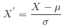

图 3.10 – 标准化公式

与归一化不同，数据标准化不会产生预定义的值范围。相反，它将您的数据转换成标准的**高斯分布**，其中您的转换值将代表每个值与分布均值的标准差数。

重要提示

高斯分布，也称为正态分布，是统计模型中最常用的分布之一。这是一个具有两个主要控制参数的连续分布：µ（均值）和σ（标准差）。正态分布围绕均值对称。换句话说，大多数值将接近分布的均值。

数据标准化通常被称为**z 分数**，广泛用于识别变量的异常值，我们将在本章后面看到。为了演示，以下表格模拟了一个小数据集的数据标准化。输入值位于“年龄”列中，而缩放值位于“Z 分数”列中：

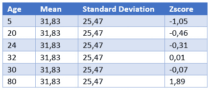

图 3.11 – 数据标准化过程

在 AWS 机器学习专业考试中，确保你在手动应用归一化和标准化时充满信心。他们可能会提供一个值列表，以及均值和标准差，并询问列表中每个元素的缩放值。

## 应用分箱和离散化

**分箱**是一种技术，可以将一组值分组到一个桶或箱中；例如，将 0 到 14 岁之间的人分组到名为“儿童”的桶中，将 15 到 18 岁之间的人分组到名为“青少年”的桶中，依此类推。

**离散化**是将连续变量转换为离散或名义属性的过程。这些连续值可以通过多种策略进行离散化，例如**等宽**和**等频**。

等宽策略将数据分布在多个相同宽度的桶中。等频策略将数据分布在具有相同频率的多个桶中。

让我们来看一个例子。假设我们有一个包含 16 个数字的列表：10, 11, 12, 13, 14, 15, 16, 17, 18, 19, 20, 21, 22, 23, 24, 90。正如我们所见，这个列表的范围在 10 到 90 之间。如果我们想使用等宽策略创建四个区间，我们会得到以下区间：

+   区间 >= 10 <= 30 > 10, 11, 12, 13, 14, 15, 16, 17, 18, 19, 20, 21, 22, 23, 24

+   区间 > 30 <= 50 >

+   区间 > 50 <= 70 >

+   区间 > 71 <= 90 > 90

在这种情况下，每个区间的宽度相同（20 个单位），但观察值并不均匀分布。现在，让我们模拟一个等频率策略：

+   区间 >= 10 <= 13 > 10, 11, 12, 13

+   区间 > 13 <= 17 > 14, 15, 16, 17

+   区间 > 17 <= 21 > 18, 19, 20, 21

+   区间 > 21 <= 90 > 22, 23, 24, 90

在这种情况下，所有区间都有相同的观察频率，尽管它们是通过不同的区间宽度构建的，以实现这一点。

一旦你计算出了你的区间，你可能想知道下一步是什么，对吧？在这里，你有一些选择：

+   你可以为你的区间命名，并将它们用作模型上的名义特征！当然，作为一个名义变量，你应该在将数据输入机器学习模型之前考虑应用独热编码。

+   你可能想要对你的区间进行排序并用作有序特征。

+   可能你想通过取每个区间的最小值和最大值的平均值来去除特征中的噪声，并使用这个值作为你的变换特征。

看看以下表格，了解这些方法使用我们的等频率示例：

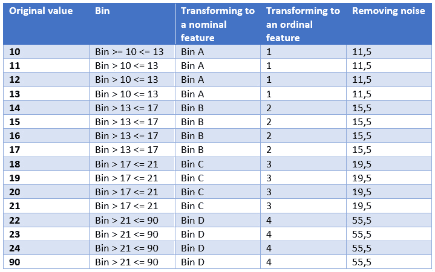

图 3.12 – 处理区间和离散化的不同方法

再次，尝试不同的区间划分策略会得到不同的结果，你应该分析/测试最适合你数据集的最佳方法。这里没有标准答案——一切都关于数据探索！

## 应用其他类型的数值变换

归一化和标准化依赖于你的训练数据来调整它们的参数：在归一化情况下是最小值和最大值，在标准缩放情况下是平均值和标准差。这也意味着你必须使用*仅*你的训练数据来调整这些参数，永远不要使用测试数据。

然而，还有其他类型的数值变换不需要从训练数据中获取参数来应用。这些类型的变换完全依赖于数学计算。例如，其中一种变换被称为**对数变换**。这在机器学习模型中是一种非常常见的变换类型，特别适用于**偏斜**特征。如果你不知道什么是偏斜分布，请看以下图表：

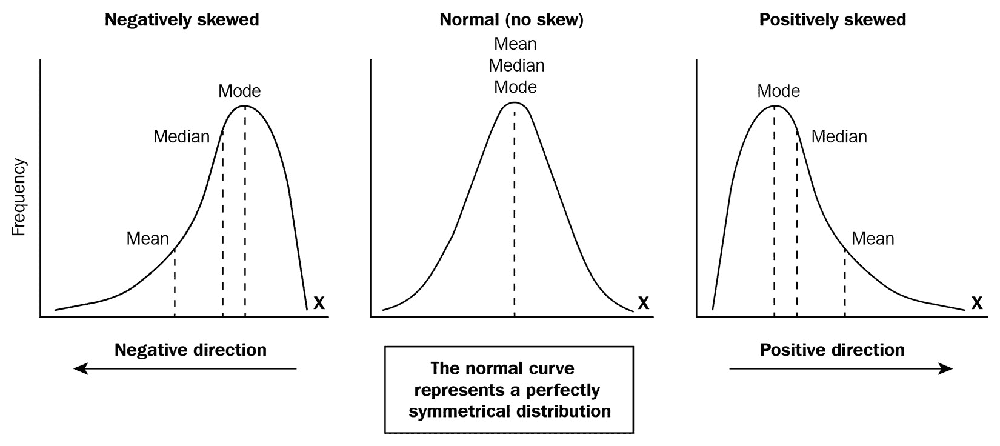

图 3.13 – 偏斜分布

在中间，我们有一个正态分布（或高斯分布）。在左侧和右侧，我们有偏斜分布。在偏斜特征方面，将有一些值远离均值，且仅在一个方向上（要么是左边，要么是右边）。这种行为将推动这个分布的中位数和均值向前面图表中可以看到的长尾的同一方向移动。

一个曾经是偏斜的数据的非常明显的例子是特定地区某一组专业人士的年度工资，例如在美国佛罗里达州工作的资深数据科学家。这类变量通常大部分值都接近其他值（因为人们过去挣的是平均工资），只有少数几个非常高的值（因为一小部分人比其他人挣得多得多）。

希望你现在可以很容易地理解为什么均值和中位数会移动到尾部方向，对吧？高薪将推动它们向那个方向移动。

好吧，但为什么对数变换会对此类特征有益呢？这个问题的答案可以通过其背后的数学来解释：

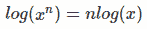

图 3.14 – 对数特性

计算一个数的对数是指数函数的逆运算。对数变换将根据给定的基数（例如基数 2、基数 10 或自然对数的情况下的基数 e）来缩小你的数字的规模。查看上一个例子中我们工资的分布，我们会将这些数字都降下来，使得数字越高，降低的幅度越大；然而，我们会以对数尺度而不是线性方式来做这件事。这种行为将消除这个分布的异常值（使其更接近正态分布），这对许多机器学习算法（如线性回归）是有益的。下表显示了在将数字从线性尺度转换为对数尺度时的一些差异：

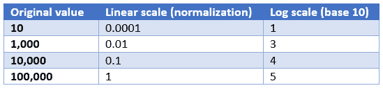

图 3.15 – 线性变换与对数变换的区别

我希望你能看到线性变换保持了数据的原始幅度（我们仍然可以看到异常值，但是在另一个尺度上），而对数变换则消除了这些幅度的差异，同时仍然保持了值的顺序。

你能想到另一种遵循相同行为（使分布更接近高斯分布）的数学变换类型吗？好的，我可以给你另一个：平方根。取前面表格中显示的这些数字的平方根，看看你自己吧！

现在，请注意这一点：对数和平方根都属于一组称为**幂变换**的变换，而且有一个非常流行的、可能在你的 AWS 考试中提到的方法，可以执行一系列我们看到的幂变换。这种方法是由乔治·博克斯和大卫·考克斯提出的，其名称是**Box-Cox**。

重要提示

在你的考试中，如果你看到关于 Box-Cox 转换的问题，请记住，这是一种可以执行许多幂变换（根据 lambda 参数）的方法，其最终目标是使原始分布更接近正态分布（不要忘记这一点）。

只为了总结我们关于为什么数学变换真的可以影响机器学习模型效果的讨论，我将给你一个关于**指数变换**的直观例子。

假设你有一组数据点，例如*图 3.16*左侧的数据点。你的目标是画一条线，能够完美地分割蓝色和红色点。仅通过观察原始数据（再次，在左侧），我们知道我们执行这个线性任务的最佳猜测就是你在同一张图片中看到的那个。然而，科学（不是魔法）发生在图片的右侧！通过将这些数字平方并在另一个超平面上绘制，我们可以完美地分离每一组点：

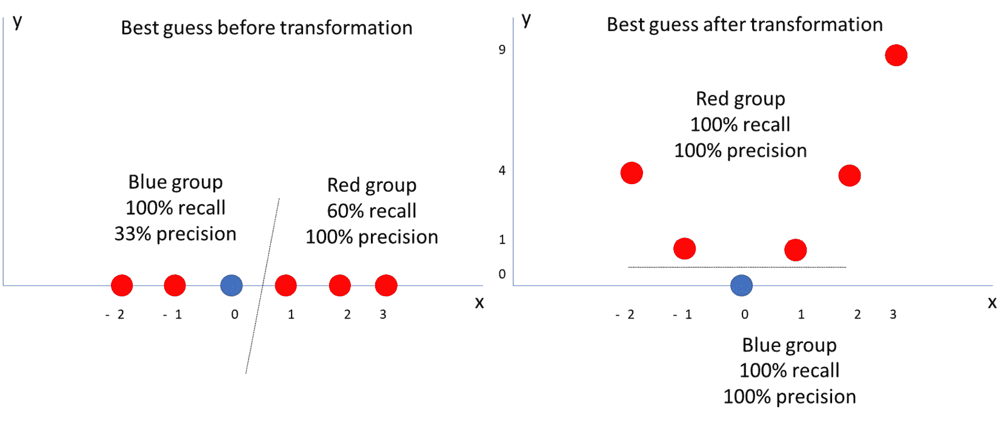

图 3.16 – 指数变换的实际应用

我知道你可能正在思考处理数据的各种无限可能方式。尽管这是真的，但你应该始终考虑你正在处理的业务场景，并据此规划你的工作。记住，模型改进或探索总是可能的，但你必须定义你的目标（记住 CRISP-DM 方法论）然后继续前进。

顺便说一句，数据转换很重要，但只是作为数据科学家工作的你工作中的一小部分。你的建模之旅仍需转向其他重要主题，例如处理缺失值和异常值，我们将在下一节中探讨。然而，在那之前，你可能已经注意到在这一节中你被介绍了高斯分布，所以让我们花点时间更详细地讨论一下。

# 理解数据分布

尽管高斯分布可能是统计和机器学习模型中最常见的分布，但你应该知道它不是唯一的。还有其他类型的数据分布，例如**伯努利**、**二项**和**泊松**分布。

二项分布是一个非常简单的分布，因为只有两种可能的事件类型：成功或失败。成功事件发生的概率是“p”，而失败事件的概率是“1-p”。

一些遵循伯努利分布的例子包括掷一个六面骰子或抛硬币。在这两种情况下，你必须定义成功事件和失败事件。例如，假设我们在骰子例子中的成功和失败事件如下：

+   成功：得到一个 6

+   失败：得到任何其他数字

因此，我们可以说我们有 p 的成功概率（1/6 = 0.16 = 16%）和 1-p 的失败概率（1 - 0.16 = 0.84 = 84%）。

二项分布是伯努利分布的推广。伯努利分布只有一个事件的重复，而二项分布允许事件重复多次，我们必须计算成功的次数。让我们继续使用之前的例子；即，计算我们在 10 次掷骰子中得到 6 的次数。由于这个例子本身的性质，二项分布有两个参数，n 和 p，其中 n 是重复的次数，p 是每次重复成功的概率。

最后，泊松分布允许我们在给定事件在区间内发生的次数的情况下，找到一个时间段内的事件数量。它有三个参数：lambda（λ）、e（欧拉数）和 k，其中 lambda 是每个区间内事件发生的平均次数，e 是欧拉数，k 是事件在区间内发生的次数。

对于所有这些分布，包括高斯分布，我们可以根据它们的参数计算期望的均值和方差。这些信息通常用于假设检验，以检查某些样本数据是否遵循给定的分布，通过比较样本的均值和方差与分布的**期望**均值和方差。

我希望你现在对数据分布有了更全面的了解，而不仅仅是高斯分布。我们将在整本书中持续讨论数据分布。现在，让我们继续讨论缺失值和异常值检测。

# 处理缺失值

正如其名所示，缺失值指的是数据的缺失。这种缺失通常由标记表示，这些标记可能或可能没有以标准方式实现。

虽然使用标记是标准的，但这些标记的显示方式可能因不同平台而异。例如，关系型数据库使用*NULL*表示缺失数据，核心 Python 代码将使用*None*，而一些 Python 库将缺失数字表示为（**非数字**（**NaN**）。

重要提示

对于数值字段，不要用*零*替换那些标准缺失标记。默认情况下，零不是缺失值，而是另一个数字。我说“默认情况下”，因为在数据科学中，我们可能会遇到一些数据质量问题，我们将在下一章中讨论。

然而，在实际的商业场景中，你可能找不到那些标准标记。例如，一个软件工程团队可能已经设计了系统，自动用特定的标记填充缺失数据，例如字符串中的“未知”或数字中的“-1”。在这种情况下，你必须通过这两个标记来搜索以找到缺失数据。人们可以设置任何东西。

在前面的例子中，软件工程团队仍然足够友好，给了我们标准标记。然而，有许多情况是遗留系统在用户面前没有添加任何数据质量层，你可能会发现地址字段填写了“我不想分享”或电话号码字段填写了“不要给我打电话”。这显然是缺失数据，但不如前面的例子标准化。

关于缺失数据，你将学到更多细微之处，所有这些内容我们将在本节中涵盖，但请记住：在你开始对缺失值做出决策之前，你应该做好数据探索的准备，并确保你找到了这些值。你可以计算数据频率或使用缺失图，但请采取一些措施。永远不要假设你的缺失数据只由那些方便的标准标记表示。

我们为什么要关注这种类型的数据呢？首先，因为大多数算法（除了在非常具体的机器学习库上实现的决策树之外）在发现缺失值时会引发错误。其次（也许是最重要的），通过将所有缺失数据归入同一个类别，你是在假设它们都是相同的，但在现实中，你并不知道这一点。

这样的决策不仅会给你的模型增加偏差，还会降低其可解释性，因为你将无法解释缺失数据。一旦我们知道我们为什么要处理缺失值，我们就可以看看我们的选项。

从理论上讲，我们可以将缺失值分为两大类：**MCAR** 或 **MNAR**。MCAR 代表 **完全随机缺失**，表示缺失数据没有与之相关的模式。另一方面，MNAR 代表 **非随机缺失**，意味着用于生成数据的底层过程与缺失值严格相关。

让我给你一个 MNAR 缺失值的例子。假设你正在收集用户对特定产品的在线调查反馈。你提问的过程是动态的，取决于用户的回答。当一个用户指定年龄低于 18 岁时，你永远不会询问他的婚姻状况。在这种情况下，婚姻状况的缺失值与用户的年龄相关联（MNAR）。

了解你所处理的缺失值的类别将帮助你理解你是否对生成数据的底层过程有任何控制权。有时，你可以回到源过程，以某种方式完成你的缺失数据。

重要提示

尽管在现实场景中，我们通常必须通过排除或插补来处理缺失数据，但永远不要忘记，你总是可以尝试查看源过程并检查你是否可以检索（或者至少更好地理解）缺失数据。你可能会在考试中遇到这个选项。

如果你没有机会从某处恢复你的缺失数据，那么你应该转向其他方法，例如**逐行删除**和**插补**。

逐行删除指的是丢弃一些数据的过程，这是这种选择的一个缺点。这可能在行级别或列级别发生。例如，假设你有一个包含四个列的 DataFrame，其中一列有 90%的数据缺失。在这种情况下，通常更有意义的是删除整个特征（列），因为你没有大多数观察（行）的这些信息。

从行的角度来看，你可能有一个包含少量观察（行）的 DataFrame，其中其一个特征（列）包含缺失数据。在这种情况下，与其删除整个特征，不如只删除那些少数观察值。

使用这种方法的好处是删除行或列的简单性。同样，缺点是丢失信息。如果你在处理缺失数据时不想丢失信息，那么你应该选择插补策略。

插补也称为替换，其中你将用替代值替换缺失值。插补最常见的方法是用特征的均值替换缺失值。请注意这种方法，因为它很可能出现在你的考试中：

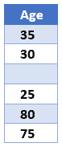

图 3.17 – 使用均值或中位数替换缺失值

前面的表显示了一个非常简单的数据集，只有一个特征和五个观察值，其中第三个观察值有缺失值。如果我们决定用特征的均值来替换那个缺失数据，我们会得到 49。有时，当数据中有异常值时，中位数可能更合适（在这种情况下，中位数将是 35）：

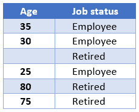

图 3.18 – 使用组均值或中位数替换缺失值

如果你想要深入了解，你可以根据给定的特征组找到均值或中值。例如，在前面的表中，我们通过添加工作状态列扩展了我们的先前数据集。现在，我们有线索使我们怀疑我们最初通过使用整体中位数（35 岁）来改变缺失值的方法可能是错误的（因为那个人已经退休了）。

你现在可以替换缺失值为你所属相同工作状态的观测值的平均值或中位数。使用这种方法，我们可以将缺失信息更改为 77.5。考虑到这个人已经退休，77.5 比 35 岁更有意义。

重要提示

在分类变量的情况下，你可以用你在数据集中出现频率最高的值来替换缺失数据。根据特定特征对数据集进行分组的逻辑仍然适用。

你还可以使用更复杂的插补方法，包括构建一个机器学习模型来预测你缺失数据的值。这些插补方法（无论是通过平均还是预测值）的缺点是，你正在对数据做出推断，这些推断不一定正确，并且会向数据集添加偏差。

总结来说，处理缺失数据时的权衡是在丢失数据或向数据集添加偏差之间保持平衡。不幸的是，没有科学手册可以遵循，无论你的问题是什么。为了决定你要做什么，你必须参考你的成功标准，探索你的数据，运行实验，然后做出决定。

我们现在将转向许多机器学习算法的另一个头痛问题，也称为异常值。

# 处理异常值

我们进行这项研究之旅，不仅仅是为了通过 AWS 机器学习专业考试，也是为了成为更好的数据科学家。从数学角度纯粹地看待异常值问题有许多不同的方法；然而，我们使用的数据集是从底层业务流程中提取的，因此在进行异常值分析时，我们必须包括业务视角。

**异常值**是一组数据中的非典型数据点。例如，以下图表显示了一些在二维平面上绘制的数据点；也就是说，x 和 y。红色点是异常值，因为它在这个数据系列中是一个非典型值：

![Figure 3.19 – Identifying an outlier]

![img/B16735_03_019.jpg]

Figure 3.19 – Identifying an outlier

我们想要处理异常值，因为某些统计方法会受到它们的影响。然而，在先前的图表中，我们可以看到这种行为的实际应用。在左侧，我们绘制了一条最佳拟合线，忽略了红色点。在右侧，我们也绘制了最佳拟合线来拟合数据，但包括了红色点。

通过忽略异常值点，我们可以得出结论，在先前的图表左侧的平面图上，我们将得到一个更好的解决方案，因为它能够更接近大多数值。我们还可以通过计算每条线相关的误差来证明这一点（我们将在本书的后面讨论）。

值得提醒的是，你也在本书的另一个情境中看到了异常值问题：具体来说，在*图 3.17*中，当我们必须处理缺失值时。在那个例子中，我们使用了中位数（而不是平均值）来解决这个问题。你可以随时回去再次阅读，但此时应该非常清楚的是，中位数比平均值受异常值的影响较小。

你现在知道了什么是异常值以及为什么你应该处理它们。在处理异常值时，你应该始终考虑你的业务视角，但存在数学方法来查找它们。现在，让我们来看看这些异常值检测的方法。

你已经学习了最常见的方法：z 分数。在*图 3.11*中，我们看到了一个包含一组年龄的表格。再次查阅它以刷新你的记忆。在那个表格的最后一列，我们根据*图 3.10*中显示的公式计算每个年龄的 z 分数。

这些 z 分数值没有明确的范围；然而，在一个没有异常值的正态分布中，它们将在-3 和 3 之间。记住：z 分数将给出分布平均值的标准差数。以下图表显示了正态分布的一些特性：

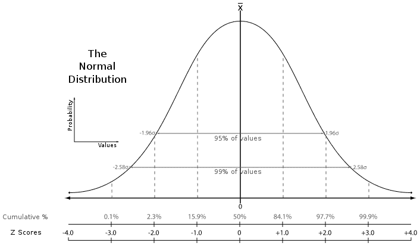

图 3.20 – 正态分布特性。图片改编自 https://pt.wikipedia.org/wiki/Ficheiro:The_Normal_Distribution.svg

根据正态分布的性质，95%的值将属于平均值的-2 和 2 个标准差范围内，而 99%的值将属于平均值的-3 和 3 个标准差范围内。回到异常值检测的上下文中，我们可以在这些 z 分数值上设置阈值，以指定一个数据点是否为异常值！

没有一个标准的阈值可以用来分类异常值。理想情况下，你应该查看你的数据，看看什么对你更有意义……通常（这不是规则），你将使用平均值的 2 到 3 个标准差之间的某个数字来设置异常值，因为超过 95%的数据将超出这个范围。你可能记得，分布的均值*下方*和*上方*都有异常值，如下表所示，我们用**绝对**z 分数大于 3 的异常值进行了标记（值列为了演示而隐藏）：

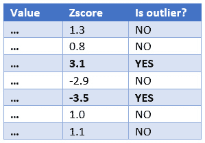

图 3.21 – 根据 z 分数值标记异常值

我们在先前的表格中发现了两个异常值：第三行和第五行。另一种在数据中查找异常值的方法是应用**箱线图**逻辑。你将在本书的下一章中更详细地了解箱线图。现在，让我们专注于使用这种方法来查找异常值。

当我们观察一个数值变量时，我们可以从中提取许多描述性统计量，而不仅仅是之前看到的均值、中位数、最小值和最大值。数据分布中存在的一种属性被称为**分位数**。

分位数是从随机变量的累积分布函数中按常规间隔建立的截断点。这些常规间隔，也称为*q 分位数*，在某种情况下将几乎相同大小，并会得到特殊名称；例如：

+   四分位数被称为四分位。

+   10 分位数被称为十分位数。

+   100 分位数被称为百分位数。

例如，20 百分位数（100 分位数常规间隔）指定了 20%的数据低于该点。在箱线图中，我们使用 4 分位数的常规间隔（也称为*四分位*）来展示数据的分布（Q1 和 Q3），如下图中所示：

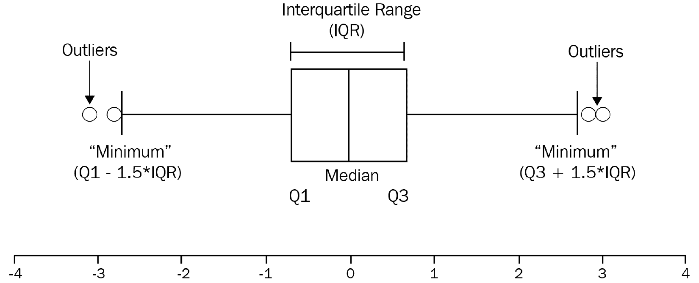

图 3.22 – 箱线图定义

Q1 也被称为下四分位数或 25 分位数，这意味着 25%的数据在分布中低于该点。Q3 也被称为上四分位数或 75 分位数，这意味着 75%的数据在分布中低于该点。

计算 Q1 和 Q3 之间的差异将给出**四分位距（IQR）**值，然后你可以使用这个值来计算箱线图的界限，如前图中“最小值”和“最大值”标签所示。

最后，我们可以最终推断出，任何低于箱线图“最小值”或高于“最大值”的值都将被标记为异常值。

现在，你已经了解了两种不同的方法可以在你的数据上标记异常值：z 分数和箱线图。你可以决定是否要从数据集中删除这些点，或者创建另一个变量来指定它们确实是异常值（如我们在*图 3.21*中所做的那样）。

让我们继续我们的数据准备之旅，看看我们在现实生活中会遇到的其他类型的问题。接下来，你将了解到一些用例中存在所谓的**罕见事件**，这使得机器学习算法关注问题的错误一边，并提出不良解决方案。幸运的是，我们将学习如何调整它们或准备数据以使它们更智能。

# 处理不平衡数据集

到目前为止，我希望你已经意识到为什么数据准备可能是我们工作中最长的部分。我们已经学习了数据转换、缺失数据值和异常值，但问题列表还在继续。不用担心——请耐心等待，让我们一起掌握这个主题！

机器学习模型中另一个众所周知的问题是，特别是在二元分类问题中，类别不平衡。在二元分类模型中，我们说当大多数观测值属于同一类别（目标变量）时，数据集是不平衡的。

这在欺诈识别系统中非常常见，例如，其中大多数事件属于常规操作，而非常少数的事件属于欺诈操作。在这种情况下，我们也可以说欺诈是一个罕见事件。

在定义数据集是否不平衡时没有强规则，从需要担心它的意义上讲。大多数挑战问题将呈现超过 99%的观察值属于多数类。

不平衡数据集的问题非常简单：机器学习算法将试图在训练数据中找到最佳拟合以最大化其准确性。在一个 99%的案例属于一个单一类的数据集中，如果没有调整，算法可能会优先考虑多数类的确定性。在最坏的情况下，它将把所有观察值分类为多数类，并忽略少数类，而这通常是我们建模时的兴趣所在。

要处理不平衡数据集，我们可以遵循两个主要方向：调整算法来处理这个问题或重新采样数据以使其更平衡。

通过调整算法，你必须指定分类中每个类的权重。这种类权重配置属于算法，而不是训练数据，因此它是一个超参数设置。重要的是要记住，并非所有算法都会有那种配置，也不是所有机器学习框架都会公开它。作为一个快速参考，我们可以提到来自 scikit-learn 机器学习库的`DecisionTreeClassifier`类，作为一个实现了类权重超参数的好例子。

解决不平衡问题的另一种方法是通过对训练数据集进行**下采样**或**上采样**来改变。如果你决定采用下采样，你所要做的就是从多数类中移除一些观察值，直到你得到一个更平衡的数据集。当然，这种方法的一个缺点是，你可能会丢失关于你正在移除观察值的多数类的重要信息。

最常见的下采样方法是随机下采样，这是一种天真重采样方法，其中我们随机从训练集中移除一些观察值。

另一方面，你可以选择进行上采样，在这种情况下，你将创建少数类的新的观察值/样本。最简单的方法是天真方法，其中你从训练集中随机选择观察值（带替换）进行复制。这种方法的一个缺点是可能存在过拟合的问题，因为你将复制/突出显示少数类的观察模式。

要避免你的模型欠拟合或过拟合，你应该始终在测试集上测试拟合好的模型。

重要提示

测试集不能进行下采样/上采样：只有训练集应该通过这些重采样技术。

你也可以通过应用合成采样技术来过采样训练集。随机过采样不会向训练集添加任何新信息：它只是复制现有的。通过创建合成样本，你是从现有样本中推导出那些新观察结果（而不是简单地复制它们）。这是一种称为**合成少数过采样技术**（SMOTE）的数据增强技术。

从技术上讲，SMOTE 所做的是在少数类的特征空间中绘制一条线，并提取接近该线的点。

重要提示

你可能会在考试中发现使用过 SMOTE 这个术语的问题。如果发生这种情况，请记住这个术语应用时的上下文：过采样。

现在，让我们继续下一个关于数据准备的主题，我们将学习如何为机器学习模型准备文本数据。

# 处理文本数据

我们已经学习了如何将分类特征转换为数值表示，无论是使用标签编码器、顺序编码器还是独热编码。然而，如果我们数据集中有包含长文本的字段怎么办？我们该如何为它们提供数学表示，以便正确地输入机器学习算法？这是一个在**自然语言处理**（NLP），人工智能的一个子领域中常见的问题。

NLP 模型旨在从文本中提取知识；例如，在语言之间翻译文本、在文本语料库中识别实体（也称为**命名实体识别**（NER））、从用户评论中分类情感，以及许多其他应用。

重要提示

在*第二章**中，AWS 人工智能/机器学习应用服务*，你了解了一些将 NLP 应用于其解决方案的 AWS 应用服务，例如 Amazon Translate 和 Amazon Comprehend。在考试中，你可能会被要求思考构建某些类型 NLP 应用的最快或最简单的方法（开发工作量最小）。通常，最快或最简单的方法是使用那些现成的 AWS 服务，因为它们为某些用例提供了预训练模型（尤其是机器翻译、情感分析、主题建模、文档分类和实体识别）。

在接下来的几章中，你还将了解一些用于 NLP 应用的内置 AWS 算法，例如 BlazingText、**潜在狄利克雷分配**（LDA）、**神经主题建模**和序列到序列算法。这些算法也让你可以创建与那些现成服务创建的相同 NLP 解决方案；然而，你必须使用 SageMaker 并编写自己的解决方案。换句话说，它们提供了更多的灵活性，但需要更多的开发工作量。

在考试中请记住这一点！

虽然 AWS 提供了许多开箱即用的服务和内置算法，允许我们创建 NLP 应用，但现在我们不会查看这些 AWS 产品特性（如我们在*第二章**，AWS 人工智能/机器学习应用服务*中所述，我们将在*第七章**，应用机器学习算法*中再次讨论）。我们将通过查看一些数据准备技术来结束本章，这些技术对于准备你的数据以进行 NLP 非常重要。

## 词袋模型

我们将首先介绍的是所谓的**词袋模型**（**BoW**）。这是一个非常常见且简单的技术，应用于文本数据，通过创建矩阵表示来描述文本中的单词数量。BoW 包括两个主要步骤：创建词汇表和创建表示文本中已知词汇出现情况。这些步骤可以在以下图中看到：

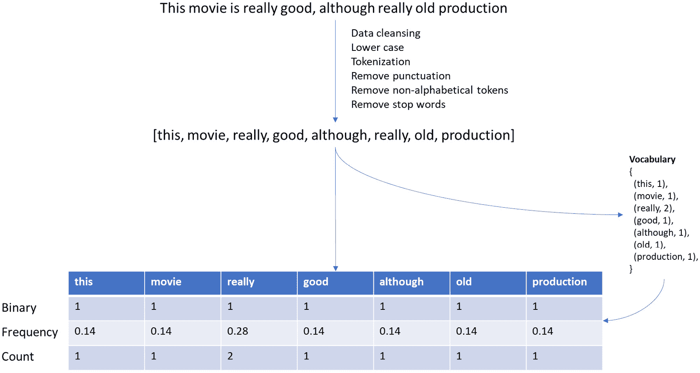

图 3.23 – 词袋模型的应用

首先，我们通常不能使用原始文本来准备词袋模型表示。这里有一个数据清洗步骤，我们将文本转换为小写；将每个单词拆分为标记；删除标点符号、非字母字符和停用词；并在必要时，应用任何其他你可能想要的定制清洗技术。

一旦你清洗了原始文本，你就可以将每个单词添加到全局词汇中。技术上，这通常是一个元组的字典，形式为（单词，出现次数）；例如，{(apple, 10), (watermelon, 20)}。如我之前提到的，这是一个全局字典，你应该考虑你正在分析的所有文本。

现在，有了清洗后的文本和更新的词汇表，我们可以以矩阵的形式构建我们的文本表示，其中每一列代表全局词汇中的一个单词，每一行代表你已分析的文本。你如何在每一行中表示这些文本可能因不同的策略而异，例如二进制、频率和计数。让我们更深入地探讨这些策略。

在前面的图中，我们正在处理单个文本，但尝试了三种不同的词袋策略。这就是为什么你可以在表格上看到三行，而不是一行（在实际场景中，你必须从中选择一个进行实施）。

在第一行，我们使用了二进制策略，如果单词存在于全局词汇中，则分配 1，否则分配 0。因为我们的词汇是在单个文本上构建的，所以该文本中的所有单词都属于词汇（这就是为什么在二进制策略中你只能看到 1 的原因）。

在第二行，我们使用了频率策略，该策略会检查文本中每个单词出现的次数，并将其除以文本中单词的总数。例如，单词 "this" 只出现一次（1），而文本中还有七个其他单词（7），所以 1/7 等于 0.14。

最后，在第三行，我们使用了计数策略，这是一种简单的对文本中每个单词出现次数的计数。

重要提示

这个提示非常重要——你很可能在考试中找到它。你可能已经注意到，我们的 BoW 矩阵在*列*中包含**独特单词**，而每个文本的表示都在*行*中。如果你有 100 篇很长的文本，它们之间只有 50 个独特的单词，你的 BoW 矩阵将有 50 列和 100 行。在考试中，你很可能会收到一个文本列表，并被要求准备 BoW 矩阵。

你还应该了解关于 BoW 的一个极其重要的概念，那就是**n-gram**配置。n-gram 这个术语用来描述你希望如何查看你的词汇，无论是通过单个单词（单语元），两个单词的组合（双语元），三个单词的组合（三元组），甚至是 n 个单词的组合（n-gram）。到目前为止，我们已经看到了使用单语元方法的 BoW 表示，但更复杂的 BoW 表示可能使用双语元、三元组或 n-gram。

主要逻辑本身并没有改变，但你需要知道如何在 BoW 中表示 n-gram。仍然使用我们前面图中的例子，双语元方法会以以下方式组合这些单词：[这部电影，电影真的很，真的很棒，好尽管，尽管老，老制作]。在考试之前，确保你理解这一点。

重要提示

BoW 的强大和简单之处在于你可以轻松地构建一个训练集来测试你的算法，甚至创建一个基线模型。如果你看*图 3.23*，你能看到拥有更多数据和仅仅在表中添加一个分类列，比如好评或差评，这将使我们能够训练一个二元分类模型来预测情感吗？

好吧——你可能已经注意到，我为你介绍的大多数令人惊叹的技术都伴随着一些缺点。BoW 的问题在于维护其词汇表的挑战。我们很容易看到，在一个巨大的文本语料库中，词汇量往往会越来越大，而矩阵表示往往会变得稀疏（我知道——又是稀疏性问题）。

解决词汇量问题的可能方法之一是使用词哈希（在机器学习中也称为**哈希技巧**）。哈希函数将任意大小的数据映射到固定大小的数据。这意味着你可以使用哈希技巧用固定数量的特征来表示每个文本（无论词汇的大小）。技术上，这个哈希空间允许碰撞（不同的文本由相同的特征表示），所以在实现特征哈希时需要考虑这一点。

## TF-IDF

与 BoW（词袋模型）相关联的另一个问题是，尤其是在我们使用频率策略构建特征空间时，更频繁出现的单词会因为文档中出现的次数多而显著提高它们的分数。结果往往是，这些高频出现的单词并不是文档的关键词，而只是也在其他几份文档中多次出现的其他单词。

**词频-逆词频（TF-IDF**）通过检查它们在其他文档中的频率并使用这些信息来重新调整文档中单词的频率，帮助惩罚这些类型的单词。

在处理结束时，TF-IDF 倾向于给予文档中独特的单词（文档特定单词）更多的重视。让我们看看一个具体的例子，以便你能深入理解。

考虑我们有一个包含 100 个单词的语料库，其中单词"Amazon"出现了三次。这个单词的**词频（TF**）将是 3/100，等于 0.03。现在，假设我们还有其他 1,000 份文档，其中"Amazon"单词出现在这 50 份文档中。在这种情况下，**逆词频（IDF**）将由对数给出，即 1,000/50，等于 1.30。在分析的具体文档中，单词"Amazon"的 TF-IDF 分数将是 TF * IDF 的乘积，即 0.03 * 1.30（0.039）。

假设，除了 50 份文档外，单词"Amazon"还出现在另外 750 份文档上——换句话说，比先前的场景出现得更频繁。在这种情况下，我们将不会改变这个方程的 TF 部分——它仍然是 0.03。然而，IDF 部分将略有变化，因为这次，它将是 log 1,000/750，等于 0.0036。正如你所看到的，这次，单词"Amazon"的重要性比先前的例子要小得多。

## 词嵌入

与传统的 BoW（词袋模型）和 TD-IDF 等方法不同，现代文本表示方法将注意信息的上下文，以及单词的存在或频率。遵循这一概念的一个非常流行且强大的方法被称为**词嵌入**。词嵌入创建一个固定长度的密集向量，可以存储关于文档上下文和意义的信息。

每个单词在多维超平面上的一个数据点表示，我们称之为嵌入空间。这个嵌入空间将有"n"个维度，其中每个维度都指代这个密集向量的特定位置。

虽然这可能听起来有些令人困惑，但这个概念实际上相当简单。假设我们有一个包含四个单词的列表，我们想在五维嵌入空间中绘制它们。这些单词是 king、queen、live 和 castle。以下表格显示了如何做到这一点：

![图 3.24 – 嵌入空间表示

![图片 B16735_03_024.jpg]

图 3.24 – 嵌入空间表示

忘记前面表格中的假设数字，专注于数据结构；你会看到，现在每个单词在嵌入空间中由 "n" 维度表示。将单词转换为向量的这个过程可以通过许多不同的方法来完成，但最流行的是 **word2vec** 和 **GloVe**。

一旦每个单词都表示为固定长度的向量，你就可以应用许多其他技术来完成你需要做的事情。一个非常常见的任务是在超平面中绘制这些 "单词"（实际上，它们的维度），并直观地检查它们彼此之间的接近程度！

技术上，我们不会直接用这个来绘制它们，因为人类大脑无法解释超过三个维度。然后，我们通常应用降维技术（例如你稍后将要学习的主成分分析），将维度数减少到两个，最后在笛卡尔平面上绘制单词。这就是为什么你可能看到下面图表底部的图片。你有没有想过如何在图表上绘制单词？

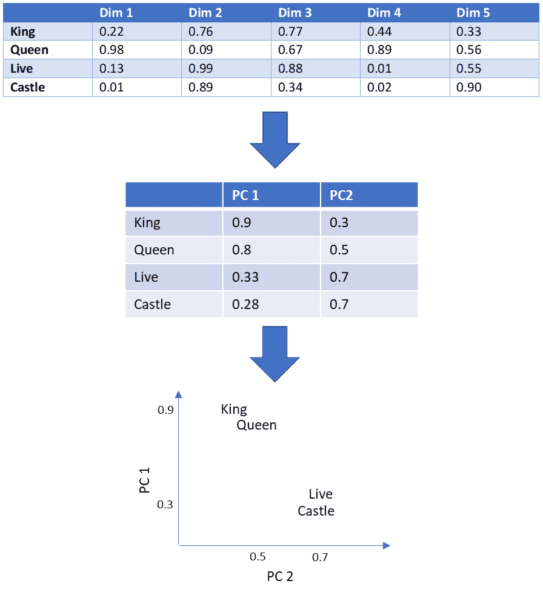

图 3.25 – 绘制单词

如果你想知道我们是如何得到 *图 3.24* 中显示的维度的，让我们深入探讨。同样，有不同方法来做这件事，但让我们看看最流行的一种，它使用固定上下文窗口的共现矩阵。

首先，我们必须想出一些逻辑来表示每个单词，同时考虑到我们还要考虑它们的上下文。为了解决上下文要求，我们将定义一个**固定上下文窗口**，它将负责指定将有多少个单词一起用于上下文学习。例如，让我们将这个固定上下文窗口设置为 2。

接下来，我们将创建一个**共现矩阵**，它将根据预定义的上下文窗口计算每对单词的出现次数。让我们看看它是如何工作的。考虑以下文本："I will pass this exam, you will see. I will pass it"。

第一个单词 "pass" 的上下文窗口将是以下这些加粗的："*I will* pass *this exam*, you will see. I will pass it"。考虑到这个逻辑，让我们看看每个单词对在上下文窗口中出现的次数：

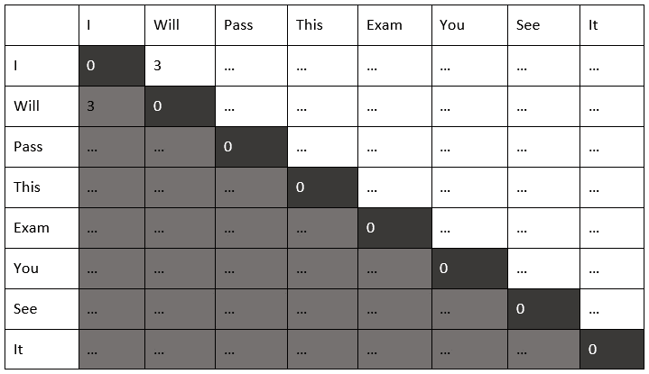

图 3.26 – 共现矩阵

正如你所见，当我们使用大小为 2 的上下文窗口时，单词对 "I will" 出现了三次：

1.  *I will* pass this exam, you will see. I will pass it。

1.  我会通过这次考试，你会看到的。*我会*通过它。

1.  我会通过这次考试，你会看到的。*I will* pass it。

观察前面的表格，应该将相同的逻辑应用于所有其他单词对，用相关的出现次数替换 "…"。你现在为每个单词都有了数值表示！

重要提示

你应该知道，与固定上下文窗口的共现矩阵相比，有许多替代方案，例如使用 TD-IDF 向量化或甚至更简单的文档中单词计数。这里最重要的信息是，无论如何，你必须为每个单词提供一个数值表示。

最后一步是最终找到*图 3.24*中显示的那些维度。你可以通过创建一个多层模型来实现，通常基于神经网络，其中隐藏层将代表你的嵌入空间。以下图示展示了我们可以将前面表格中显示的单词压缩到五个维度的简化示例：

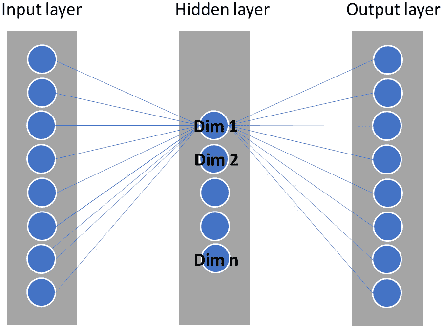

图 3.27 – 使用神经网络构建嵌入空间

我们将在本书的后面部分更详细地讨论神经网络。现在，理解嵌入向量来自何处已经是一项了不起的成就！

在建模自然语言问题时，你还需要记住的另一件重要事情是，你可以在你的模型中重用预训练的嵌入空间。一些公司已经创建了基于数十亿文档的现代神经网络架构，这已经成为该领域的尖端技术。为了参考，请查看由谷歌提出的**双向编码器表示的 Transformer**（**BERT**），它已被数据科学社区和行业广泛使用。

我们现在已经到达了关于数据准备和转换的漫长——但非常重要——章节的结尾。让我们抓住这个机会，快速回顾一下我们学到的精彩内容。

# 摘要

首先，你被介绍到了你可能需要与之合作的特征类型。确定你将与之合作的变量的类型对于定义可以应用于每种情况的转换和技术的类型非常重要。

然后，我们学习了如何处理分类特征。我们看到了，有时，分类变量确实有顺序（例如有序变量），而有时则没有（例如名义变量）。你了解到，独热编码（或虚拟变量）可能是名义特征的转换中最常见的一种；然而，根据唯一类别的数量，在应用独热编码后，你的数据可能会出现稀疏性问题。至于有序特征，你不应该在它们之上创建虚拟变量，因为这样你会丢失变量中已经包含的顺序信息。在这些情况下，有序编码是最合适的转换。

我们继续我们的旅程，通过查看数值特征，我们学习了如何处理连续和离散数据。我们探讨了最重要的转换类型，如归一化、标准化、分箱和离散化。你看到，某些类型的转换依赖于底层数据来找到它们的参数，因此非常重要，避免使用测试集从数据中学习任何东西（它必须严格用于测试）。

你还看到，我们甚至可以将纯数学应用于转换我们的数据；例如，你了解到幂变换可以用来减少特征的偏度，使其更加正常。

接下来，我们研究了缺失数据，并了解了这项任务的重要性。当你建模时，你不能将缺失值视为一个简单的计算问题，其中你只需要用 y 替换 x。这是一个更大的问题，你需要通过探索你的数据来开始解决这个问题，然后检查你的缺失数据是否是随机生成的。

当你决定删除或替换缺失数据时，你必须意识到你可能会丢失信息或向数据添加偏差，分别如此。请记住回顾我们给你提供的所有重要笔记，因为它们很可能以某种方式出现在你的考试中。

接下来，你学习了关于异常值检测的内容。你研究了不同的方法来找到异常值，如 z 分数和箱线图方法。最重要的是，你学习了你可以标记或平滑它们。

在开始时，我告诉你这一章将是一段漫长但值得的旅程，关于数据准备，这就是为什么我需要给你一个很好的感觉，了解如何处理罕见事件，因为这是机器学习中最具挑战性的问题之一。你了解到，有时你的数据可能是不平衡的，你必须要么通过改变类别权重来欺骗你的算法，要么通过应用欠采样和过采样来重新采样你的数据。

最后，你学习了如何处理 NLP 中的文本数据。你现在应该能够手动计算词袋和 TF-IDF 矩阵！我们甚至更深入地学习了词嵌入的工作原理。在本小节中，我们了解到我们可以创建自己的嵌入空间（使用许多不同的方法）或重用预训练的一个，例如 BERT。

我们完成了！我很高兴你做到了，我确信这一章对你的考试成功至关重要。最后，我们为你准备了一些练习题；我希望你会喜欢它们。

在下一章中，我们将深入研究数据可视化技术。

# 问题

1.  你正在为一家医疗保健公司担任数据科学家，并创建一个机器学习模型来预测公司索赔中的欺诈、浪费和滥用。该模型的一个特征是，在 2 年期间，特定药物被开具给索赔相同患者的次数。这是哪种类型的功能？

    a) 离散型

    b) 连续型

    c) 名义型

    d) 序数

    答案

    a, 该特征是计算特定药物被开具的次数。个体和可数项被归类为离散数据。

1.  你正在为一家拥有全球学校和大学的培训机构构建一个机器学习模型。你的模型旨在预测特定学生离开其学习的机会。许多因素可能导致辍学，但你的一个特征是每个学生的当前学术阶段：幼儿园、小学、中学或高中。这是什么类型的特征？

    a) 离散

    b) 连续

    c) 名义

    d) 序数

    答案

    d, 该特征具有隐含的顺序，应被视为分类/序数变量。

1.  你正在为一家汽车保险公司构建一个机器学习模型。该公司希望创建一个旨在预测其承保车辆被盗可能性的二元分类模型。你已经考虑了许多特征来构建此模型，包括车辆类型（经济型、紧凑型、高级、豪华、货车、运动型和敞篷车）。你将如何转换车辆类型以便在模型中使用它？

    a) 应用序数编码

    b) 应用独热编码

    c) 不需要转换

    d) 选项 A 和 B 是此问题的有效转换

    答案

    b, 在这种情况下，我们有一个分类/名义变量（每个类别之间没有顺序）。此外，唯一类别的数量看起来相当可管理；此外，独热编码非常适合此类数据。

1.  你正在为一家金融公司担任数据科学家。该公司希望创建一个旨在分类不当付款的模型。你决定将“交易类型”作为你的一个特征（本地、国际、预先批准的等等）。在对此变量应用独热编码后，你意识到你的数据集有更多的变量，并且你的模型训练时间很长。你如何可能解决这个问题？

    a) 通过应用序数编码而不是独热编码。在这种情况下，我们只需创建一个特征。

    b) 通过应用标签编码。

    c) 通过分析哪些类型的交易对不当/正当付款的影响最大。仅对减少的交易类型应用独热编码。

    d) 通过将你的模型迁移到另一种可以更好地处理稀疏数据的编程语言。

    答案

    c, 由于原始变量中类别数量过多，你的转换导致产生了更多特征。尽管独热编码方法看起来是正确的，因为该变量是一个名义特征，该特征的级别（唯一值）数量可能太高。

    在这种情况下，你可以进行探索性数据分析，了解对你问题最重要的交易类型。一旦你知道了这些信息，你就可以将转换限制在这些特定类型上（减少数据稀疏性）。值得注意的是，在这个过程中，你会丢失一些信息，因为现在你的虚拟变量只会关注子集的类别，但这是一种有效的方法。

1.  你正在一家营销公司担任数据科学家。你的公司正在构建一个聚类模型，用于细分客户。你决定对变量“年收入”进行归一化，其范围在 50,000 到 300,000 之间。

    在应用归一化后，收入为 50,000、125,000 和 300,000 的客户群体的归一化值是什么？

    a) 1, 2 和 3

    b) 0, 0.5 和 1

    c) 0, 0.25 和 1

    d) 5, 12 和 30

    答案

    b, 应用归一化公式并假设期望的范围是 0 和 1，正确答案是 b。

1.  考虑一个存储员工工资的特定列的数据集。该列工资的均值是 $2,000，而标准差等于 $300\. 那位收入 $3,000 的人的标准尺度值是多少？

    a) 3.33

    b) 6.66

    c) 10

    d) 1

    答案

    a, 记住标准尺度公式：(X - µ) / σ，即 (3,000 – 2,000) / 300。

1.  我们可以应用哪种类型的数据转换将连续变量转换为二元变量？

    a) 分箱和独热编码

    b) 标准化和分箱

    c) 归一化和独热编码

    d) 标准化和独热编码

    答案

    a, 在这种情况下，我们可以通过应用分箱然后获取虚拟变量来对连续变量进行离散化。

1.  你是一家金融公司的数据科学家，你被分配了一个创建二元分类模型的任务，以预测客户是否会离开公司（也称为流失）。在你的探索性工作中，你意识到有一个特定的特征（信用使用金额）有一些缺失值。这个变量以实数表示；例如，$1,000\. 假设你不想丢失信息，处理这些缺失值的最快方法是什么？

    a) 删除任何缺失值。

    b) 创建一个分类模型来预测信用使用金额，并使用它来预测缺失数据。

    c) 创建一个回归模型来预测信用使用金额，并使用它来预测缺失数据。

    d) 用变量的均值或中位数替换缺失数据。

    答案

    d, 在这个情况下，几乎所有的选项都是处理这个问题的有效方法，除了选项 b，因为预测缺失数据需要你创建一个回归模型，而不是分类模型。选项 a 是处理缺失数据的有效方法，但不是针对我们不想丢失信息的问题。选项 c 也是一个有效的方法，但不是最快的。选项 d 是此问题的最合适的答案。

1.  你必须为特定的客户创建一个机器学习模型，但你意识到大部分特征有超过 50%的数据缺失。在这个关键情况下，我们的最佳选择是什么？

    a) 删除超过 50%缺失数据的整个列

    b) 删除包含至少一条缺失信息的所有行

    c) 与数据集所有者核实是否可以从其他地方检索缺失数据

    d) 用特征的均值或中位数替换缺失信息

    答案

    c, 这是一个非常关键的情况，其中大部分信息实际上都是缺失的。你应该与数据集所有者合作，了解为什么会出现这个问题，并检查生成这些数据的过程。如果你决定删除缺失值，你将丢失大量信息。另一方面，如果你决定替换缺失值，你将在数据中添加大量偏差。

1.  你作为一个人力资源公司的高级数据科学家，正在创建一个特定的机器学习模型，该模型使用一个在倾斜特征上表现不佳的算法，如下面的图像所示：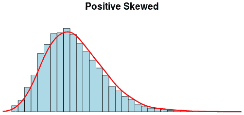

    图 3.28 – 倾斜特征

    你可以应用哪些变换来减少这个特征的倾斜度（选择所有正确答案）？

    a) 归一化

    b) 对数变换

    c) 指数变换

    d) Box-Cox 变换

    答案

    b, d, 为了减少倾斜度，幂变换是最合适的方法。特别是，你可以应用对数变换或 Box-Cox 变换来使这个分布更接近高斯分布。

1.  你正在处理一个欺诈识别问题，其中大部分标记数据属于一个单一类别（非欺诈）。只有 0.1%的数据指的是欺诈案例。你将提出哪些建模技术来使用在这个用例中（选择所有正确答案）？

    a) 应用随机过采样来创建欺诈案例的副本。

    b) 应用随机欠采样来从非欺诈案例中移除观察值。

    c) 在这样一个不平衡的数据集上创建分类模型是不可能的。最好的办法是向数据集所有者请求更多的欺诈案例。

    d) 应用合成过采样来创建非欺诈案例的副本。

    答案

    a, b, 在机器学习中，不平衡的数据集非常常见，有许多不同的方法可以处理这个问题。选项 c 绝对不是正确的。注意选项 d；你应该能够对你的数据应用合成过采样，但为了创建更多少数类的观测值，而不是来自多数类。选项 a 和 b 是正确的。

1.  你正在为机器学习准备文本数据。这次，你想要在以下文本之上创建一个二元词袋 BoW 矩阵：

    "我将掌握这个认证考试"

    "我将通过这个认证考试"

    你的 BoW 矩阵表示将有多少行和列？

    a) 7 行和 2 列

    b) 2 行和 7 列

    c) 14 行和 4 列

    d) 4 列和 14 行

    答案

    b, 让我们一起计算下表中矩阵。

    如你所见，技巧在于知道哪些标记是两个文本共有的。我们只有两个文本；行数也将是两个——每个文本一个：

    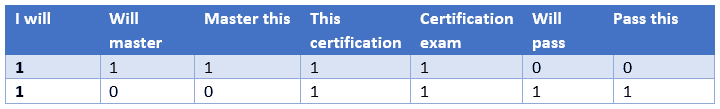

    图 3.29 – 结果词袋

1.  你正在进行一项调查，以检查一组人在特定开发工具上的经验年数。你提出了以下分布：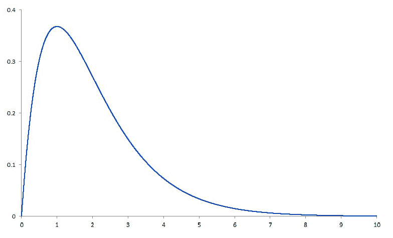

    图 3.30 – 偏斜数据分布

    你能说些什么关于这个分布的众数、平均值和中位数（选择所有正确答案）？

    a) 平均值大于中位数

    b) 平均值小于中位数

    c) 中位数大于众数

    d) 中位数小于众数

    答案

    a, c, 这是一个偏斜分布（向右）。这意味着你的平均值将被推向尾巴的同一侧，然后是中位数。因此，我们将有众数 < 中位数 < 平均值。

1.  你作为一家零售公司的数据科学家工作。你正在为分类目的构建一个基于决策树的模型。在你的评估过程中，你意识到模型的准确率是不可接受的。以下哪项任务不是提高你的决策树模型准确率的有效方法？

    a) 调整模型的超参数。

    b) 缩放数值特征。

    c) 尝试不同的方法来转换分类特征，例如二进制编码、独热编码和有序编码（当适用时）。

    d) 如果数据集不平衡，尝试不同的重采样技术（欠采样和过采样）是值得的。

    答案

    b, 缩放数值特征是机器学习模型中的一个重要任务，但并不总是需要的。特别是在基于决策树的模型中，改变数据的比例不会导致更好的模型性能，因为这种类型的模型不受数据比例的影响。

1.  你正在从事一个数据科学项目，其中你必须创建一个 NLP 模型。你决定在模型开发期间测试 Word2vec 和 GloVe，以尝试提高模型精度。Word2vec 和 GloVe 是两种什么类型的？

    a) 预训练词嵌入

    b) 预训练的 TF-IDF 矢量

    c) One-hot 编码技术

    d) 以上皆非

    答案

    a, 一些自然语言处理（NLP）架构可能包括嵌入层。如果你遇到这类项目，你可以通过训练一个特定模型来创建自己的嵌入空间（使用你自己的数据集）或者你可以使用任何预训练的词嵌入模型，例如由谷歌预训练的 Word2vec 模型。
