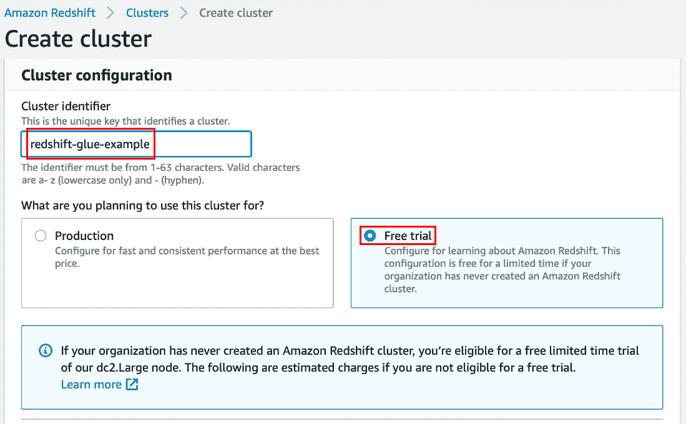
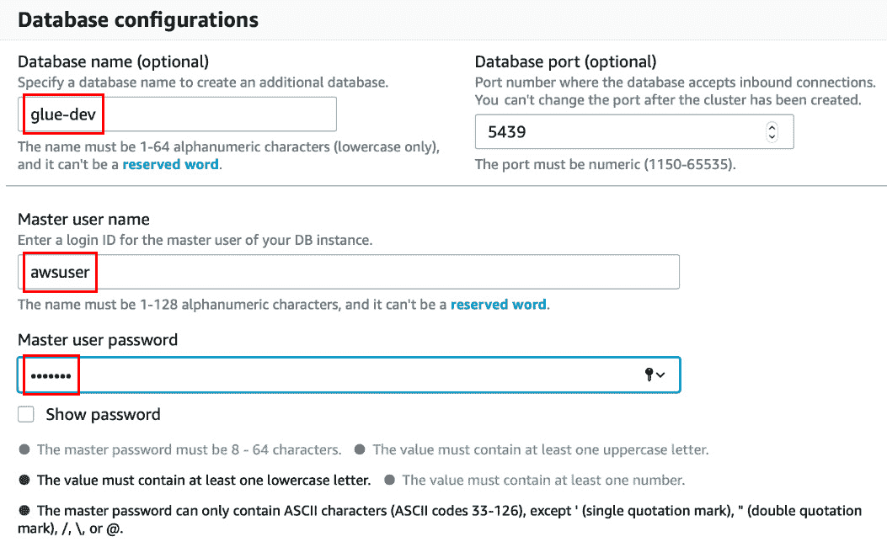
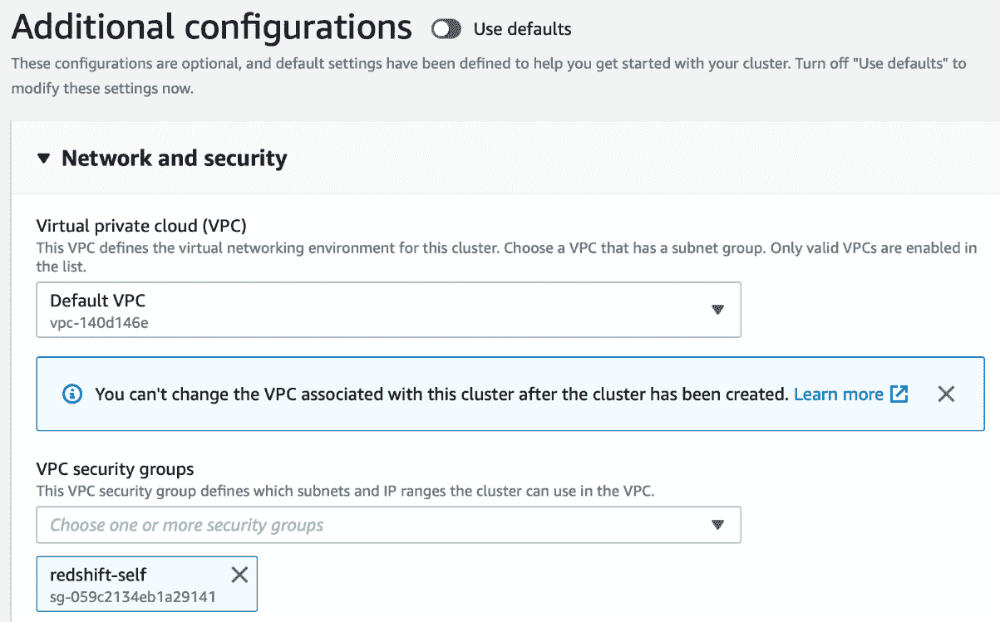
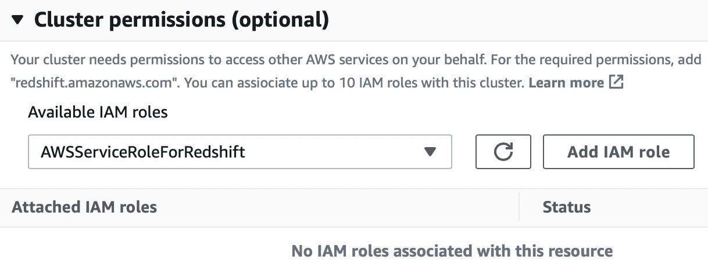
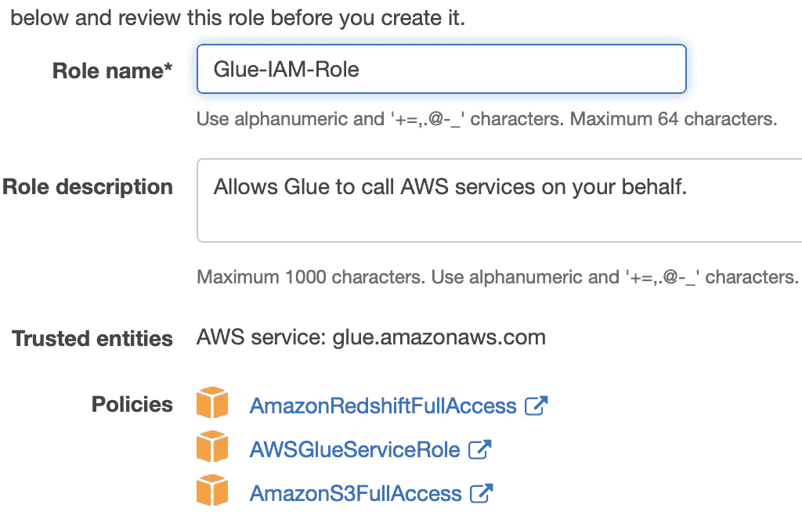
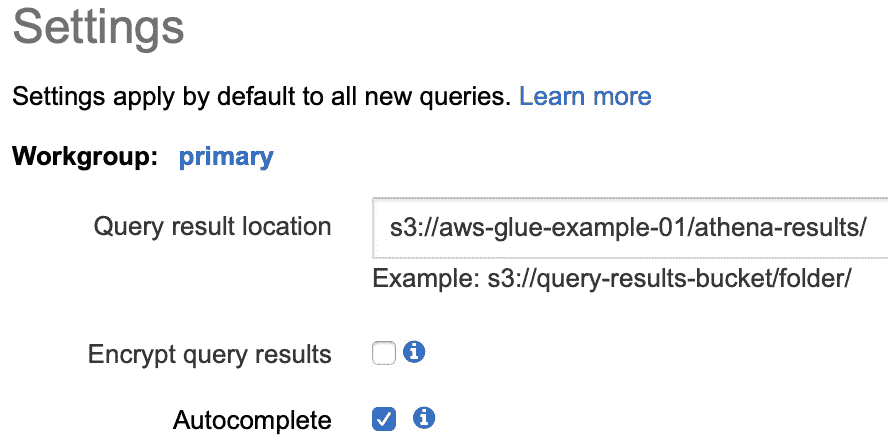

# *第六章*：用于数据处理的服务

在上一章中，我们学习了在 AWS 中存储数据的几种方法。在本章中，我们将探讨使用这些数据并从数据中获得一些洞察的方法。在某些用例中，您必须处理数据或将数据加载到 Hive 数据仓库以查询和分析数据。如果您在 AWS 上，并且数据存储在 S3 中，那么您必须在 AWS EMR 上创建一个 hive 表来查询它们。为了提供相同的管理服务，AWS 有一个名为 Athena 的产品，您需要创建一个数据目录并在 S3 上查询数据。如果您需要转换数据，那么 AWS Glue 是转换并恢复到 S3 的最佳选择。让我们设想一个需要流式传输数据并在此数据上创建分析报告的用例。对于此类场景，我们可以选择 AWS Kinesis Data Streams 来流式传输数据并将其存储在 S3 中。使用 Glue，相同的数据可以被复制到 Redshift 以进行进一步的分析利用。现在，让我们了解它们，我们将简要介绍以下内容。

+   使用 Glue 设计 ETL 作业

+   使用 Athena 查询 S3 数据

+   通过 AWS Kinesis Data Streams 流式传输数据并使用 Kinesis Firehose 进行存储

+   从本地位置摄取数据到 AWS

+   将数据迁移到 AWS 并扩展本地数据中心到 AWS

+   在 AWS 上处理数据

# 技术要求

您可以从 GitHub 下载示例中使用的数据，链接如下：[`github.com/PacktPublishing/AWS-Certified-Machine-Learning-Specialty-MLS-C01-Certification-Guide/tree/master/Chapter-6`](https://github.com/PacktPublishing/AWS-Certified-Machine-Learning-Specialty-MLS-C01-Certification-Guide/tree/master/Chapter-6)。

# 在 AWS Glue 上创建 ETL 作业

在现代数据管道中，存在多个阶段，例如生成数据、收集数据、存储数据、执行 ETL、分析和可视化。在本节中，我们将从高层次概述这些阶段，并深入理解**ETL**（**提取**、**转换**、**加载**）部分：

+   数据可以由多个设备生成，包括移动设备或物联网设备、网络日志、社交媒体、交易数据、在线游戏等。

+   这么大的数据量可以通过使用轮询服务或通过集成 AWS Lambda 的 API 网关来收集数据，或者通过 AWS Kinesis 或 AWS 管理的 Kafka 或 Kinesis Firehose 等流来收集。如果您有一个本地数据库，并且希望将数据收集到 AWS 中，那么您可以选择 AWS DMS 来完成这项工作。您可以通过 AWS DataSync 将本地数据同步到 Amazon S3、Amazon EFS 或 Amazon FSx。AWS Snowball 用于收集/传输数据到和从 AWS 中。

+   下一步涉及存储数据，我们在上一章中学习了一些服务，例如 AWS S3、EBS、EFS、Amazon RDS、Amazon Redshift 和 DynamoDB。

+   一旦我们了解了我们的数据存储，就可以设计一个 ETL 作业来提取-转换-加载或提取-加载-转换我们的结构化或非结构化数据，以便进行进一步分析。例如，我们可以考虑使用 AWS Lambda 在实时转换数据并将其存储到 S3 中，或者我们可以在 EMR 集群上运行 Spark 应用程序来转换数据，并将其存储在 S3、Redshift 或 RDS 中。

+   AWS 中提供了许多服务用于对转换后的数据进行分析；例如，亚马逊 EMR、亚马逊雅典娜、亚马逊 Redshift、亚马逊 Redshift Spectrum 和 Kinesis Analytics。

+   数据分析完成后，您可以使用 AWS Quicksight 可视化数据，以了解模式或趋势。数据科学家或机器学习专业人员会喜欢应用统计分析来更好地理解数据分布。商业用户使用它来准备报告。我们已经在*第四章*，“理解和可视化数据”中学习了各种展示和可视化数据的方法。

从传统的数据管道中，我们了解到 ETL 完全是关于在服务器上编码和维护代码以确保其顺利运行。如果数据格式有任何变化，那么代码就需要进行更改，这会导致目标模式的变化。如果数据源发生变化，代码也必须能够处理这种情况，这会带来额外的开销。*我们应该编写代码来识别数据源中的这些变化吗？我们需要一个系统来自适应变化并为我们发现数据吗？* 答案是**AWS Glue**。现在，让我们了解为什么 AWS Glue 如此著名。

## AWS Glue 的特性

AWS Glue 是 AWS 上完全托管的无服务器 ETL 服务。它具有以下特性：

+   它通过连接到数据源自动发现和分类您的数据，并生成数据目录。

+   亚马逊雅典娜、亚马逊 Redshift 和亚马逊 EMR 等服务可以使用数据目录来查询数据。

+   AWS Glue 生成 ETL 代码，这是 Spark 在 Python 或 Scala 中的扩展，也可以进行修改。

+   它会自动扩展以匹配运行 ETL 作业和将数据加载到目标位置所需的 Spark 应用程序要求。

AWS Glue 拥有**数据目录**，这是其成功的关键。它有助于从数据源中发现数据，并让我们对其有所了解：

+   数据目录自动发现新数据并提取模式定义。它检测模式更改和版本表。它检测 Amazon S3 上的 Apache Hive 风格的分区。

+   数据目录自带用于流行数据类型的内置分类器。可以使用**Grok 表达式**编写自定义分类器。分类器有助于检测模式。

+   Glue 爬虫可以按需或按计划运行以更新 Glue 数据目录中的元数据。Glue 爬虫必须与一个 IAM 角色关联，该角色有足够的权限读取数据源，例如 Amazon RDS、Amazon Redshift 和 Amazon S3。

既然我们对 AWS Glue 有了简要的了解，让我们运行以下示例来亲自动手。

## 熟练使用 AWS Glue 数据目录组件

在本例中，我们将创建一个作业，使用 AWS Glue 将数据从 S3 复制到 Redshift。我所有的组件都创建在`us-east-1`区域。让我们先创建一个存储桶：

1.  导航到 AWS S3 控制台并创建一个存储桶。我已将该存储桶命名为`aws-glue-example-01`。

1.  点击`input-data`。

1.  在文件夹内导航并点击`sales-records.csv`数据集。数据可在以下 GitHub 位置找到：[`github.com/PacktPublishing/AWS-Certified-Machine-Learning-Specialty-MLS-C01-Certification-Guide/tree/master/Chapter-6/AWS-Glue-Demo/input-data`](https://github.com/PacktPublishing/AWS-Certified-Machine-Learning-Specialty-MLS-C01-Certification-Guide/tree/master/Chapter-6/AWS-Glue-Demo/input-data)。

    由于我们已经将数据上传到 S3 存储桶，让我们创建一个 VPC，在其中我们将创建我们的 Redshift 集群。

1.  通过访问[`console.aws.amazon.com/vpc/home?region=us-east-1#`](https://console.aws.amazon.com/vpc/home?region=us-east-1#) URL 导航到 VPC 控制台并点击`AWS services`。

    b) `com.amazonaws.us-east-1.s3` (网关类型)

    c) `选择默认 VPC`（我们将使用此默认 VPC 创建 Redshift 集群）

1.  保持其他字段不变并点击**创建端点**。

1.  点击`redshift-self`，并选择默认 VPC 下拉菜单。为`Redshift 安全组`提供一个适当的描述。点击**创建安全组**。

1.  点击`所有流量`

    b) `自定义`

    c) 在搜索字段中，选择相同的`安全组`(redshift-self)

1.  点击**保存规则**。

    现在，让我们创建我们的 Redshift 集群。

1.  导航到 Amazon Redshift 控制台。点击**创建集群**并填写高亮字段，如图*图 6.1*所示：

    图 6.1 – Amazon Redshift 创建集群的屏幕截图

1.  滚动并填写高亮字段，如图*图 6.2*所示：

    图 6.2 – Amazon Redshift 集群数据库配置部分的屏幕截图

1.  滚动并更改**附加配置**字段，如图*图 6.3*所示：

    图 6.3 – Amazon Redshift 集群附加配置部分的屏幕截图

1.  还要更改 IAM 权限，如图*图 6.4*所示：

    图 6.4 – Amazon Redshift 集群的集群权限部分截图

1.  滚动并点击 **创建集群**。集群将在一分钟或两分钟内变为可用状态。

    接下来，我们将创建一个 IAM 角色。

1.  导航到 AWS IAM 控制台，并在屏幕上的 **访问管理** 部分选择 **角色**。

1.  点击 **创建角色** 按钮，并从服务中选择 **Glue**。点击 **下一步：权限** 按钮跳转到下一页。

1.  搜索 **AmazonS3FullAccess** 并选择。然后，搜索 **AWSGlueServiceRole** 并选择。由于我们在这个示例中将数据写入 Redshift，因此选择 **AmazonRedshiftFullAccess**。点击 **下一步：标签**，然后点击 **下一步：审查** 按钮。

1.  提供一个名称，`Glue-IAM-Role`，然后点击 **创建角色** 按钮。角色将如图 6.5 所示出现：

    图 6.5 – IAM 角色截图

    现在，我们已经有了输入数据源和输出数据存储，下一步是从 AWS Glue 控制台创建 Glue 爬虫。

1.  选择 `glue-redshift-connection`

    b) `Amazon Redshift`

1.  点击 `redshift-glue-example`

    b) `glue-dev`

    c) `awsuser`

    d) `********`（输入在第 10 步中创建的值）

1.  点击 IAM 角色部分的 `Glue-IAM-Role`，然后点击 **测试连接**。

1.  前往 `s3-glue-crawler`，然后点击 **下一步**。在 **指定爬虫源类型** 页面上，保持所有默认设置，然后点击 **下一步**。

1.  在 `s3://aws-glue-example-01/input-data/sales-records.csv`。

1.  点击 **下一步**。

1.  `No`。点击 **下一步**。

1.  `Glue-IAM-Role`。然后点击 **下一步**。

1.  `Run on demand`。点击 **下一步**。

1.  没有创建数据库，因此点击 `s3-data`，点击 **下一步**，然后点击 **完成**。

1.  选择爬虫 `s3-glue-crawler`，然后点击 `s3-data` 中的 `1`，如前所述，已创建，并添加了一个表。点击 `sales_records_csv`。现在可以看到已经发现了模式。如果推断的数据类型不符合您的需求，您可以更改数据类型。

在本节动手实践中，我们学习了数据库表、数据库连接、S3 上的爬虫以及 Redshift 集群的创建。在下一节动手实践中，我们将学习如何使用 Glue 创建 ETL 作业。

## AWS Glue ETL 组件的动手实践

在本节中，我们将使用之前创建的数据目录组件来构建我们的作业。让我们先创建作业：

1.  导航到 AWS Glue 控制台，然后在 **ETL** 部分的 **作业** 下点击。

1.  点击 `s3-glue-redshift`

1.  `Glue-IAM-Role`（这是我们在上一节中创建的角色）

1.  `Spark`

1.  `Spark 2.4, Python 3 with improved job start up times (Glue version 2.0)`

1.  保持其他字段不变，然后点击 **下一步**。

1.  选择 `sales_records_csv` 并点击 **下一步**。

1.  默认选择**更改模式**，然后点击**下一步**（在撰写本书时，Glue 2.0 不支持机器学习转换）。

1.  默认选择`JDBC`作为数据存储，并选择`glue-redshift-connection`作为连接。提供`glue-dev`作为数据库名称（如前节中创建的），然后点击**下一步**。

1.  接下来是**输出模式定义**页面，你可以选择要从目标模式中删除的所需列。向下滚动并点击**保存作业并编辑脚本**。

1.  你现在可以看到屏幕左侧正在创建的管道和右侧的建议代码，如图 6.6 所示。你可以根据你的需求修改代码。点击**运行作业**按钮。会出现一个弹出窗口，要求你编辑任何你希望更改的细节。这是可选的。然后，点击**运行作业**按钮：![图 6.6 – AWS Glue ETL 作业的截图

    ![img/B16735_06_06.jpg]

    图 6.6 – AWS Glue ETL 作业的截图

1.  作业成功后，导航到 Amazon Redshift 并点击**查询编辑器**。

1.  将数据库名称设置为`glue-dev`，然后提供用户名和密码以创建连接。

1.  选择`public`模式，现在你可以查询表以查看记录，如图 6.7 所示：

![图 6.7 – Amazon Redshift 的查询编辑器截图

![img/B16735_06_07.jpg]

图 6.7 – Amazon Redshift 的查询编辑器截图

我们现在了解了如何使用 AWS Glue 创建 ETL 作业，将数据从 S3 存储桶复制到 Amazon Redshift。我们还使用 UI 控制台中的查询编辑器查询了 Amazon Redshift 中的数据。如果你已成功完成这些步骤，建议删除 Redshift 集群和 AWS Glue 作业。AWS 会在你的账户中创建两个存储桶来存储 AWS Glue 脚本和 AWS Glue 临时结果。因此，也请删除这些以节省成本。我们将在下一节中使用 S3 数据上创建的数据目录。

在下一节中，我们将学习如何使用 Athena 查询 S3 数据。

# 使用 Athena 查询 S3 数据

Athena 是一个无服务器服务，用于查询存储在 S3 中的数据。它是无服务器的，因为客户端不管理用于计算的服务器：

+   Athena 使用模式来呈现对存储在 S3 中的数据的查询结果。你定义你希望数据以模式的形式出现，Athena 从 S3 读取原始数据，根据定义的模式显示结果。

+   输出可以被其他服务用于可视化、存储或各种分析目的。S3 中的源数据可以是以下任何一种结构化、半结构化和非结构化数据格式，包括 XML、JSON、CSV/TSV、AVRO、Parquet、ORC 等。CloudTrail、ELB 日志和 VPC 流量日志也可以存储在 S3 中，并由 Athena 进行分析。

+   这遵循了读取时定义模式的技术。与传统技术不同，表在数据目录中预先定义，数据在读取时进行投影。允许在数据上执行类似 SQL 的查询，而无需转换源数据。

现在，让我们通过一个示例来理解这一点，我们将使用在 AWS Glue 上创建的**AWSDataCatlog**对 S3 数据进行查询：

1.  导航到 AWS Athena 控制台。从`sampledb`数据库中选择`AWSDataCatalog`（将在 AWS Glue 数据目录中创建一个表，名为`elb_logs`）。

1.  选择`s3-data`作为数据库。

1.  点击右上角的**设置**并填写如图*图 6.8*所示的详细信息（我使用了与上一个示例相同的存储桶和不同的文件夹）：

    图 6.8 – Amazon Athena 的设置截图

1.  下一步是在查询编辑器中编写您的查询并执行它。一旦执行完成，请删除您的 S3 存储桶和 AWS Glue 数据目录。这将为您节省费用。

在本节中，我们学习了如何通过 AWS 数据目录使用 Amazon Athena 查询 S3 数据。您也可以创建自己的模式并从 S3 查询数据。在下一节中，我们将学习 Amazon Kinesis Data Streams。

# 使用 Kinesis 数据流处理实时数据

Kinesis 是亚马逊的流服务，可以根据需求进行扩展。它在区域中具有高度可用性。它默认保留数据 24 小时，或可选地最多保留 365 天。Kinesis 数据流用于大规模数据摄取、分析和监控：

+   Kinesis 可以被多个生产者摄取，多个消费者也可以从流中读取数据。让我们通过一个实时示例来理解这一点。假设您有一个生产者将数据摄取到 Kinesis 流中，默认保留期为 24 小时，这意味着今天早上 5:00:00 摄取的数据将在明天早上 4:59:59 之前在流中可用。这些数据在此之后将不可用，理想情况下，应该在过期之前消费，或者如果它很重要，可以存储在某个地方。保留期可以额外付费延长至最多 365 天。

+   Kinesis 可用于实时分析或仪表板可视化。生产者可以想象成一段将数据推入 Kinesis 流的代码，它可以是一个运行代码的 EC2 实例、Lambda 函数、物联网设备、本地服务器、移动应用程序或设备等。

+   同样，消费者也可以是一段在 EC2 实例、Lambda 函数或本地服务器上运行的代码，这些代码知道如何连接到 Kinesis 流、读取数据并对数据进行一些操作。AWS 提供触发器，在数据到达 Kinesis 流时立即调用 Lambda 消费者。

+   Kinesis 因其分片架构而具有可扩展性，这是 Kinesis 流的基本吞吐量单元。*什么是分片？* 分片是一种逻辑结构，根据分区键对数据进行分区。一个分片支持每秒*1 MB*的写入容量和每秒*2 MB*的读取容量。单个分片每秒支持*1,000*条`PUT`记录。如果你创建了一个包含*3*个分片的流，那么可以实现*3 MB/sec*的写入吞吐量和*6 MB/sec*的读取吞吐量，这允许*3,000*条`PUT`记录。因此，随着分片数量的增加，你需要支付额外的费用以获得更高的性能。

+   分片中的数据通过 Kinesis 数据记录存储，最大可达 1 MB。Kinesis 数据记录根据分区键跨分片存储。它还有一个序列号。序列号在执行`putRecord`或`putRecords` API 操作时由 Kinesis 分配，以便唯一标识一个记录。分区键由生产者在将数据添加到 Kinesis 数据流时指定，分区键负责将记录隔离和路由到流中的不同分片以平衡负载。

+   在 Kinesis 流中加密数据有两种方式：服务器端加密和客户端加密。客户端加密难以实现和管理密钥，因为客户端必须在将数据放入流之前加密数据，并在从流中读取数据之后解密数据。通过**AWS/KMS**启用的服务器端加密，数据在放入流和从流中获取时自动加密和解密。

    注意

    不要将 Amazon Kinesis 与 Amazon SQS 混淆。Amazon SQS 支持一个生产组和一组消费组。如果你的用例需要多个用户发送和接收数据，那么 Kinesis 是解决方案。

    对于解耦和异步通信，SQS 是解决方案，因为发送者和接收者不需要相互了解。

    在 SQS 中，没有持久性的概念。一旦读取了消息，下一步就是删除。Amazon SQS 没有保留时间窗口的概念。如果你的用例需要大规模摄取，那么应该使用 Kinesis。

在下一节中，我们将学习如何存储流式数据以进行进一步分析。

# 使用 Kinesis Data Firehose 存储和转换实时数据

有许多用例需要将数据流式传输并存储以供未来分析。为了克服这些问题，你可以编写一个 Kinesis 消费者来读取 Kinesis 流并将数据存储在 S3 中。这个解决方案需要一个实例或机器来运行代码，并具有从流中读取和写入 S3 所需的访问权限。另一个可能的选项是运行一个 Lambda 函数，该函数在向流发送`putRecord`或`putRecords` API 时被触发，并从流中读取数据以存储在 S3 桶中：

+   为了使这个过程变得简单，Amazon 提供了一个名为 Kinesis Data Firehose 的独立服务。它可以轻松地连接到 Kinesis 数据流，并且需要基本的 IAM 角色将数据写入 S3。这是一个完全托管的服务，用于减少管理服务器和代码的负担。它还支持将流式数据加载到 Amazon Redshift、Amazon Elasticsearch 服务和 Splunk。Kinesis Data Firehose 可以自动扩展以匹配数据的吞吐量。

+   数据可以在存储或发送到目的地之前通过 AWS Lambda 函数进行转换。如果您想使用未转换的数据构建原始数据湖，那么通过启用源记录备份，您可以在转换之前将其存储在另一个 S3 桶中。

+   通过 AWS/KMS 的帮助，数据可以在发送到 S3 桶后进行加密。必须在创建交付流时启用。数据还可以以支持的格式（如 GZIP、ZIP 和 SNAPPY 压缩格式）进行压缩。

在下一节中，我们将了解用于从本地服务器将数据导入 AWS 的不同 AWS 服务。

# 从本地服务器导入 AWS 的不同数据方式

随着对数据驱动用例需求的增加，目前管理本地服务器上的数据相当困难。当您处理大量数据时，备份并不容易。这些数据在数据湖中正被用于构建深度神经网络，创建数据仓库以从中提取有意义的信息，运行分析，以及生成报告。

现在，如果我们看看将数据迁移到 AWS 的可用选项，那么也会带来各种挑战。例如，如果您想将数据发送到 S3，那么您必须编写几行代码将您的数据发送到 AWS。您将需要管理代码和服务器以运行代码。必须确保数据通过 HTTPS 网络传输。您需要验证数据传输是否成功。这增加了过程的复杂性，同时也带来了时间和精力上的挑战。为了避免此类情况，AWS 提供服务来匹配或解决您的用例，通过设计混合基础设施允许本地数据中心和 AWS 之间的数据共享。让我们在接下来的章节中了解这些内容。

## AWS 存储网关

存储网关是一种混合存储虚拟设备。它可以在三种不同的模式下运行——**文件网关**、**磁带网关**和**卷网关**。它可以用于扩展、迁移和备份本地数据中心到 AWS：

+   在磁带网关模式下，存储网关将虚拟磁带存储在 S3 上，当磁带被弹出并归档时，磁带将从 S3 移动到 Glacier。活动磁带存储在 S3 上进行存储和检索。归档或导出的磁带存储在 Glacier 的**虚拟磁带架（VTS）**中。虚拟磁带可以创建，大小从 100 GiB 到 5 TiB 不等。总共可以配置 1PB 的本地存储，并且可以将无限数量的磁带归档到 Glacier。这对于现有的磁带备份系统以及需要将备份数据迁移到 AWS 的场景非常理想。您可以在以后退役物理磁带硬件。

+   在文件网关模式下，存储网关将文件映射到 S3 对象上，可以使用可用的存储类之一进行存储。这有助于您将数据中心扩展到 AWS。您可以将更多文件加载到文件网关中，这些文件将作为 S3 对象存储。它可以在您的本地虚拟服务器上运行，通过**服务器消息块（SMB）**或**网络文件系统（NFS）**连接到各种设备。文件网关通过 HTTPS 公共端点连接到 AWS，以在 S3 对象上存储数据。可以对这些 S3 对象应用生命周期策略。您可以将您的**活动目录（AD**）轻松集成到文件网关中，以控制对文件共享中文件的访问。

+   在卷网关模式下，存储网关提供块存储。使用这种存储有两种方式，一种为**网关缓存**，另一种为**网关存储**：

+   **网关存储**是一种本地运行的卷存储网关，它具有本地存储和上传缓冲区。总共可以创建 32 个卷，每个卷的大小可达 16 TB，总容量为 512 TB。主数据存储在本地，备份数据在后台异步复制到 AWS。卷通过**互联网小型计算机系统接口（iSCSI**）提供，以便基于网络的服务器访问。它通过 HTTPS 公共端点连接到**存储网关端点**，并从备份数据创建 EBS 快照。这些快照可用于创建标准的 EBS 卷。此选项非常适合迁移到 AWS 或灾难恢复或业务连续性。本地系统将继续使用本地卷，但 EBS 快照存储在 AWS 中，可以用作备份的替代品。这不是数据中心扩展的最佳选择，因为您需要大量的本地存储。

+   **Gateway Cached**是一种在本地运行的卷存储网关，它具有缓存存储和上传缓冲区。不同之处在于，添加到存储网关的数据不是本地的，而是上传到 AWS。主数据存储在 AWS。频繁访问的数据在本地缓存。这是将本地数据中心扩展到 AWS 的理想选择。它通过 HTTPS 公共端点连接到**存储网关端点**，并创建存储为标准 EBS 快照的**S3 支持卷（AWS 管理的存储桶）**快照。

## Snowball、Snowball Edge 和 Snowmobile

它们属于同一产品家族，用于在业务运营地点和 AWS 之间进行物理数据传输。对于在 AWS 中移动大量数据，您可以使用以下三者中的任何一个：

+   **Snowball**：您可以通过提交一个工作订单从 AWS 订购此设备。AWS 将设备交付给您用于加载数据并发送回来。Snowball 中的数据使用 KMS 进行加密。它提供两种容量范围，一种是 50 TB，另一种是 80 TB。对于 10 TB 到 10 PB 之间的数据，订购一个或多个 Snowball 设备是经济实惠的。设备可以被发送到不同的地点。它没有计算能力；它只提供存储能力。

+   **Snowball Edge**：这与 Snowball 类似，但它同时具备存储和计算能力。它的容量比 Snowball 大。它提供快速网络连接，例如通过 RJ45 的 10 Gbps、10/25 Gb 通过 SFP28，以及 40/100 Gb+通过 QSFP+铜线。这对于将千兆到太字节的数据安全快速地传输到 AWS 是非常理想的。

+   **Snowmobile**：这是一个位于卡车上的运输集装箱内的便携式数据中心。这允许您将艾字节的数据从本地迁移到 AWS。如果您的数据量超过 10 PB，则 Snowmobile 是首选。本质上，在请求 Snowmobile 后，一辆卡车将被开到您的位置，您将数据中心连接到卡车上，并传输数据。如果您有多个地点，选择 Snowmobile 进行数据传输不是理想的选择。

## AWS DataSync

AWS DataSync 旨在将数据从本地存储迁移到 AWS，或反之亦然：

+   它是 AWS 为数据处理传输、归档或成本效益存储、灾难恢复、业务连续性和数据迁移提供的理想产品。

+   它具有特殊的数据验证功能，可以在数据到达 AWS 后立即验证原始数据与 AWS 中的数据，换句话说，它检查数据的完整性。

+   通过考虑一个具有 SAN/NAS 存储的本地数据中心示例，让我们深入理解这个产品。当我们在一个 VMWare 平台上运行 AWS DataSync 代理时，这个代理能够通过 NFS/SMB 协议与 NAS/SAN 存储进行通信。一旦启动，它就会与 AWS DataSync 端点通信，从那里，它可以连接到多种不同类型的地点，包括各种 S3 存储类别或基于 VPC 的资源，例如**弹性文件系统**（**EFS**）和 FSx for Windows Server。

+   它允许您在特定时间段内安排数据传输。通过配置内置的带宽节流，您可以限制 DataSync 使用的网络带宽量。

# 在 AWS 上处理存储数据

AWS 中有几个用于处理存储在 AWS 中的数据的服务。在本节中，我们将介绍 AWS Batch 和 AWS EMR（弹性 MapReduce）。EMR 是 AWS 提供的一项服务，主要用于以管理方式运行 MapReduce 作业和 Spark 应用程序。AWS Batch 用于长时间运行、计算密集型的工作负载。

## AWS EMR

EMR 是 AWS 提供的一项托管 Apache Hadoop 实现，它还包括 Hadoop 生态系统的其他组件，如 Spark、HBase、Flink、Presto、Hive、Pig 等。我们不会在认证考试中详细讨论这些：

+   EMR 集群可以从 AWS 控制台或通过 AWS CLI 以特定数量的节点启动。集群可以是长期集群或临时集群。如果您有一个长期运行的传统集群，那么您必须自行配置机器并管理它们。如果您有需要更快执行的工作，那么您需要手动添加一个集群。在 EMR 的情况下，这些管理开销消失了。您可以向 EMR 请求任意数量的节点，并且它将为您管理和启动节点。如果您在集群上启用了自动扩展，那么在需求增加时，EMR 将在集群中启动新的节点，一旦负载减少，就会退役这些节点。

+   EMR 在后台使用 EC2 实例运行，并在 VPC 中的一个可用区运行。这使节点之间的网络速度更快。AWS Glue 在后台使用 EMR 集群，用户无需担心 AWS EMR 的操作理解。

+   从用例的角度来看，EMR 可以用于处理或转换存储在 S3 中的数据，并将输出数据存储在 S3 中。EMR 使用节点（EC2 实例）作为数据处理的基本单元。EMR 节点有多种变体，包括主节点、核心节点和任务节点。

+   EMR 主节点充当 Hadoop namenode，并管理集群及其健康状态。它负责在其他核心节点和任务节点之间分配作业工作负载。如果您启用了 SSH，则可以连接到主节点实例并访问集群。

+   EMR 集群可以有一个或多个核心节点。如果您与 Hadoop 生态系统相关联，那么核心节点类似于 Hadoop 数据节点，它们负责在其中运行任务。

+   任务节点是可选的，它们没有 HDFS 存储。它们负责运行任务。如果某个原因导致任务节点失败，那么这不会影响 HDFS 存储，但核心节点故障会导致 HDFS 存储中断。

+   EMR 有其文件系统 EMRFS。它由 S3 支持，这使得它具有区域弹性。如果核心节点失败，数据仍然安全在 S3 中。HDFS 在 I/O 效率方面表现良好，比 EMRFS 更快。

在下一节中，我们将了解 AWS Batch，它是一个可管理的批量处理计算服务，可用于长时间运行的服务。

## AWS Batch

这是一个可管理的批量处理产品。如果您使用 AWS Batch，则作业可以在没有最终用户交互的情况下运行，或者可以安排运行：

+   想象一个事件驱动的应用程序，它启动 Lambda 函数来处理存储在 S3 中的数据。如果处理时间超过 15 分钟，那么 Lambda 有执行时间限制。在这种情况下，AWS Batch 是一个更好的解决方案，其中计算密集型工作负载可以通过 API 事件进行调度或驱动。

+   AWS Batch 非常适合需要更长时间处理时间或更多计算资源的使用场景。

+   AWS Batch 运行一个可以是脚本或可执行文件的作业。一个作业可以依赖于另一个作业。作业需要一个定义，例如谁可以运行作业（使用 IAM 权限）、作业可以在哪里运行（要使用的资源）、挂载点和其他元数据。

+   任务被提交到队列中，在那里它们等待计算环境容量。这些队列与一个或多个计算环境相关联。

+   计算环境执行实际的工作，即执行作业。这些可以是 ECS 或 EC2 实例，或任何计算资源。您还可以定义它们的大小和容量。

+   环境根据其优先级从队列中接收作业并执行作业。它们可以是管理的或非管理的计算环境。

+   AWS Batch 可以将元数据存储在 DynamoDB 中以供进一步使用，也可以将输出存储到 S3 存储桶中。

    注意

    如果你在考试中遇到一个需要灵活计算、更高磁盘空间、无时间限制（超过 15 分钟）或有效资源限制的事件式工作负载问题，那么请选择 AWS Batch。

# 摘要

在本章中，我们学习了在 AWS 中处理数据的不同方式。我们还学习了将数据中心扩展到 AWS、迁移数据到 AWS 以及摄取过程的能力。我们还学习了使用数据以我们自己的方式处理数据并使其准备好分析的多种方法。我们了解了数据目录的魔力，它帮助我们通过 AWS Glue 和 Athena 查询我们的数据。

在下一章中，我们将学习各种机器学习算法及其用法。

## 问题

1.  如果您有大量物联网设备向 AWS 发送数据，由大量移动设备消费，以下哪个选项应该选择？

    A. SQS 标准队列

    B. SQS FIFO 队列

    C. Kinesis 流

1.  如果您需要解耦一个高流量应用程序，以下哪个选项应该选择？

    A. SQS 标准队列

    B. SQS FIFO 队列

    C. Kinesis 流

1.  为了提高 Kinesis 流的性能，我需要更改以下哪个设置？

    A. 流的读取容量单位

    B. 流的写入容量单位

    C. 流的分区

    D. 流的区域

1.  以下哪个确保数据完整性？

    A. AWS Kinesis

    B. AWS DataSync

    C. AWS EMR

    D. Snowmobile

1.  以下哪种存储网关模式可以用 S3 存储替换磁带驱动器？

    A. 体积网关存储

    B. 体积网关缓存

    C. 文件

    D. VTL

1.  以下哪种存储网关模式可以用于将 SMB 存储呈现给客户端？

    A. 体积网关存储

    B. 体积网关缓存

    C. 文件

    D. VTL

1.  以下哪种存储网关模式适合数据中心扩展到 AWS？

    A. 体积网关存储

    B. 体积网关缓存

    C. 文件

    D. VTL

1.  AWS 中哪种存储产品可用于 Windows 环境的共享存储？

    A. S3

    B. FSx

    C. EBS

    D. EFS

1.  在 EMR 集群中，哪个节点处理操作？

    A. 主节点

    B. 核心节点

    C. 任务节点

    D. 主节点

1.  在 EMR 集群中，哪些节点适合 spot 实例？

    A. 主节点

    B. 核心节点

    C. 任务节点

    D. 主节点

1.  如果您有大量流数据并添加到 Redshift，您将使用哪些服务（选择三个）？

    A. Kinesis Data Streams

    B. Kinesis Data Firehose

    C. S3

    D. SQS

    E. Kinesis Analytics

1.  Kinesis Firehose 支持使用 Lambda 进行数据转换。

    A. 正确

    B. 错误

1.  以下哪些是 Kinesis Data Firehose 的有效目的地（选择五个）？

    A. HTTP

    B. Splunk

    C. Redshift

    D. S3

    E. Elastic Search

    F. EC2

    G. SQS

## 答案

1\. C

2\. A

3\. C

4\. B

5\. D

6\. C

7\. B

8\. B

9\. A

10\. C

11\. A, B, C

12\. A

13\. A, B, C, D, E
