# *第七章*：应用机器学习算法

在上一章中，我们学习了 AWS 的数据处理服务，包括 Glue、Athena 和 Kinesis！现在是时候进入建模阶段，研究机器学习算法了。我相信，在前面几章中，你已经意识到构建机器学习模型需要大量关于 AWS 服务、数据工程、数据探索、数据架构等方面的知识。这次，我们将更深入地探讨我们之前讨论过的算法以及许多其他算法。

对不同类型的算法和机器学习方法的良好理解将使你在项目决策中处于非常有利的地位。当然，这种知识对于 AWS 机器学习专业考试也是至关重要的。

请记住，有成千上万的算法，顺便说一句，你甚至可以为特定问题提出自己的算法。此外，我们将涵盖最相关的算法，并希望这些算法你可能在考试中遇到。

本章的主要内容包括：

+   存储训练数据

+   关于集成模型的说明

+   回归模型

+   分类模型

+   预测模型

+   Object2Vec

+   聚类

+   异常检测

+   维度约简

+   IP 洞察

+   自然语言处理

+   强化学习

好的，让我们开始吧！

# 介绍本章

在本章中，我们将讨论几个算法、建模概念和学习策略。我们认为所有这些主题都将对你的考试和数据科学家职业生涯有益。

我们将本章结构化，不仅涵盖考试所需的必要主题，还让你对最重要的学习策略有一个良好的认识。例如，考试将检查你对 K-means 基本概念的了解；然而，我们将对其进行更深入的探讨，因为这是作为数据科学家职业的重要主题。

我们将采取这种方法，更深入地研究某些类型的模型，我们认为每个数据科学家都应该掌握其算法逻辑。所以，请记住：有时，我们可能在考试中比预期走得更深，但这对你来说将极其重要。

在本章中，我们多次使用术语**内置算法**。当我们想要提及 AWS 在他们的 SageMaker SDK 上实现的算法列表时，我们将使用这个术语。

让我给你一个具体的例子：你可以使用 scikit-learn 的 KNN 算法（如果你不记得什么是 scikit-learn，可以通过回到*第一章*，*机器学习基础*)来创建一个分类模型并将其部署到 SageMaker。然而，AWS 还提供了他们 SDK 上的 KNN 算法的自身实现，该实现针对 AWS 环境进行了优化。在这里，KNN 是一个内置算法的例子。

如你所见，在 AWS 上的可能性是无限的，因为你可以利用内置算法，或者引入自己的算法来在 SageMaker 上创建模型。最后，为了使这一点非常明确，这里有一个从 AWS SDK 导入内置算法的示例：

```py
import sagemaker
knn = sagemaker.estimator.Estimator(get_image_uri(boto3.Session().region_name, "knn"),
        get_execution_role(),
        train_instance_count=1,
        train_instance_type='ml.m5.2xlarge',
        output_path=output_path,
        sagemaker_session=sagemaker.Session())
knn.set_hyperparameters(**hyperparams)
```

你将在*第九章*，“Amazon SageMaker 建模”中学习如何在 SageMaker 上创建模型。目前，你只需了解 AWS 有一套自己的库，其中实现了这些内置算法。

要训练和评估一个模型，你需要训练数据和测试数据。在实例化你的估计器之后，你应该用这些数据集来喂养它。我不想破坏*第九章*，“Amazon SageMaker 建模”，但你应该事先了解**数据通道**的概念。

数据通道是与输入数据相关的配置，你可以在创建训练作业时将其传递给 SageMaker。你应该设置这些配置，只是为了通知 SageMaker 你的输入数据格式。

在*第九章*，“Amazon SageMaker 建模”中，你将学习如何创建训练作业以及如何设置数据通道。到目前为止，你应该知道，在配置数据通道时，你可以设置**内容类型**（**ContentType**）和**输入模式**（**TrainingInputMode**）。让我们更详细地看看训练数据应该如何存储，以便能够与 AWS 的内置算法正确集成。

# 存储训练数据

首先，你可以使用多个 AWS 服务来准备机器学习的数据，例如 EMR、Redshift、Glue 等。预处理完训练数据后，你应该将其存储在 S3 中，以算法期望的格式存储。以下表格显示了每个算法可接受的数据格式列表：

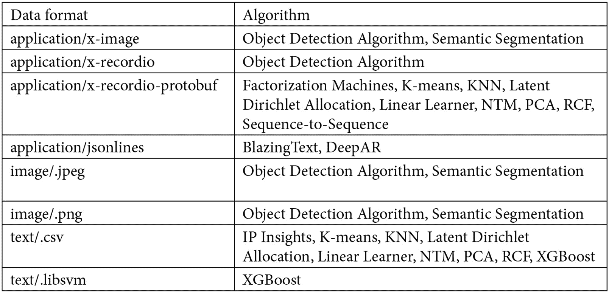

图 7.1 – 每个 AWS 算法可接受的数据格式

如我们所见，许多算法接受 text`/.csv`格式。请注意，如果你想使用该格式，你应该遵循以下规则：

+   你的 CSV 文件*不能*有标题记录。

+   对于监督学习，目标变量必须在第一列。

+   在配置训练管道时，将输入数据通道的`content_type`设置为`text/csv`。

+   对于无监督学习，在`'content_type=text/csv;label_size=0'`中设置`label_size`。

虽然 text/.csv 格式对许多用例来说都很好，但大多数情况下，AWS 的内置算法与**recordIO-protobuf**配合得更好。这是一种用于训练 AWS 内置算法的优化数据格式，其中 SageMaker 将数据集中的每个观测值转换为二进制表示，即一组 4 字节的浮点数。

RecordIO-protobuf 接受两种类型的输入模式：**管道模式**和**文件模式**。在管道模式下，数据将直接从 S3 流出，这有助于优化存储。在文件模式下，数据将从 S3 复制到训练实例的存储卷。

我们几乎准备好了！现在，让我们快速浏览一些建模定义，这将帮助你理解一些更高级的算法。

# 关于集成模型的一些话

在我们深入算法之前，有一个重要的建模概念你应该了解，称为**集成**。集成这个术语用来描述使用多个算法创建模型的方法。

例如，与其只创建一个模型来预测欺诈交易，你还可以创建多个执行相同任务的模型，并通过一种投票系统选择预测结果。下表展示了这个简单的例子：

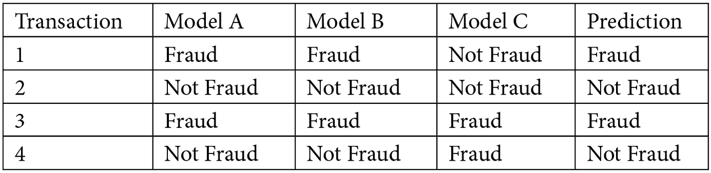

图 7.2 – 集成方法上的投票系统示例

对于回归问题，这种方法同样适用，我们不是通过投票，而是通过平均每个模型的预测结果，并将其作为最终结果。

投票和平均只是集成方法中的两个例子。其他强大的技术包括**混合**和**堆叠**，其中你可以创建多个模型，并将每个模型的输出作为主模型的特征。回顾前面的表格，"模型 A"、"模型 B"和"模型 C"将被用作预测最终结果的特征。

结果表明，许多机器学习算法在训练过程中使用集成方法，以嵌入式的方式。这些算法可以分为两大类：

+   **自助聚合**或**Bagging**：这种方法中，在数据的不同样本上训练多个模型。然后，通过投票或平均系统进行预测。这个类别的主要算法被称为**随机森林**。

+   **提升法**：这种方法中，在数据的不同样本上训练多个模型。然后，一个模型试图通过惩罚错误预测来纠正下一个模型的错误。这个类别的主要算法被称为**随机梯度提升**和**AdaBoost**。

既然你已经知道了集成模型是什么，那么让我们继续学习一些可能出现在你考试中的机器学习算法。虽然并非所有这些算法都使用集成方法，但我相信这将更容易让你识别出来。

我们将根据 AWS 算法类别划分接下来的几个部分：

+   监督学习

+   无监督学习

+   文本分析

+   图像处理

最后，我们将概述 AWS 中的强化学习。

# 监督学习

AWS 为通用目的（回归和分类任务）以及更具体的目的（预测和向量化）提供了监督学习算法。这些子类别中可以找到的内置算法列表如下：

+   线性学习算法

+   因子分解机算法

+   XGBoost 算法

+   K-最近邻算法

+   Object2Vec 算法

+   DeepAR 预测算法

让我们从回归模型和线性学习算法开始。

## 与回归模型一起工作

好的；我知道现实问题通常既不是线性的也不是简单的。然而，研究**线性回归**模型是了解一般**回归模型**内部发生什么的好方法（是的，回归模型可以是线性的和非线性的）。这是每位数据科学家必须掌握的知识，也可以帮助你解决现实挑战。我们将在以下小节中更详细地探讨这一点。

### 介绍回归算法

线性回归模型旨在根据一个或多个变量（X）预测一个数值（Y）。从数学上讲，我们可以将这种关系定义为 Y = f(X)，其中 Y 被称为**依赖变量**，X 被称为**独立变量**。

在回归模型中，我们想要预测的组件（Y）始终是一个连续的数字；例如，房价或交易数量。我们在*第一章*，“机器学习基础”，*表 2*中看到了这一点，当我们根据目标变量选择合适的监督学习算法时。请随意回去复习它。

*当我们只用一个变量来预测 Y 时*，我们称这个问题为**简单线性回归**。另一方面，当我们使用**多个变量**来预测 Y 时，我们说我们有一个**多重线性回归**问题。

还有另一类回归模型，称为**非线性回归**。然而，让我们暂时把它放在一边，先了解简单线性回归是什么意思。

回归模型属于机器学习的监督学习方面（另一方面是非监督学习），因为算法试图根据独立变量和依赖变量之间的现有相关性来预测值。

但 Y=f(X)中的“f”是什么意思？“f”是负责根据 X 预测 Y 的回归函数。换句话说，这正是我们想要弄清楚的功能！当我们开始谈论简单线性回归时，请注意以下三个问题和答案：

1.  线性回归中的“f”的形状是什么？

    线性，当然！

1.  我们如何表示线性关系？

    使用一条**直线**（你将在几分钟内理解原因）。

1.  那么，定义直线的函数是什么？

    ax + b（只需查看任何**数学**书籍）。

就这些！线性回归模型由**y = ax + b**给出。一旦我们试图根据 X 预测 Y，我们只需要找出“a”和“b”的值。我们可以采用相同的逻辑来了解其他类型回归的内部情况。

相信我，找出“a”和“b”的值并不是我们要做的唯一事情。知道“a”也被称为**alpha 系数**，或**斜率**，代表线的倾斜度，而“b”也被称为**beta 系数**，或**y 截距**，代表线与 y 轴交叉的位置（进入由 x 和 y 组成的二维平面）。你将在下一个子节中看到这两个术语。

还值得知道，每个我们无法控制的预测因子都存在误差。让我们称它为“e”，并将简单线性回归正式定义为**y = ax + b + e**。从数学上讲，这个误差是通过预测值和真实值之间的差异来表达的。

好的，让我们找到 alpha 和 beta，为这一部分画上一个圆满的句号！

### 最小二乘法

有不同的方法来找到直线的斜率和 y 截距，但最常用的方法是称为**最小二乘法**。这种方法背后的原理很简单：我们必须找到*最佳直线，以减少平方误差的总和*。

在下面的图中，我们可以看到一个带有多个点和线的笛卡尔平面。“线 a”代表这些数据的最优拟合线——换句话说，那将是这些点的最佳线性回归函数。但我是怎么知道的呢？很简单：如果我们计算每个点（就像下面图中我们放大查看的那个点）相关的误差，我们会意识到“线 a”包含了最小的平方误差总和：

![Figure 7.3 – 最小二乘法原理的可视化]

![img/B16735_07_003.jpg]

图 7.3 – 最小二乘法原理的可视化

值得从头开始理解线性回归，这不仅是为了认证考试，而且主要是为了你作为数据科学家的职业生涯。为了给你提供一个完整的例子，我们已经开发了一个包含我们将要逐步看到的所有计算的电子表格！我们鼓励你使用这个支持材料进行一些模拟。让我们看看它是如何运作的。

### 从头开始创建线性回归模型

我们将使用一个非常简单的数据集，只包含两个变量：

+   *X*：代表一个人的工作经验年数

+   *Y*：代表一个人的平均薪水

我们想要理解 X 和 Y 之间的关系，并且如果可能的话，根据工作经验（X）预测薪水（Y）。正如我之前提到的，现实中的问题往往有更多的独立变量，并且不一定呈线性。然而，我相信这个例子会给你提供掌握更复杂算法的基础知识。

要找出 alpha 和 beta 系数（或者如果您愿意，斜率和 y 截距），我们需要找到与数据集相关的某些统计量，因此让我们看看这里显示的数据和辅助统计量：

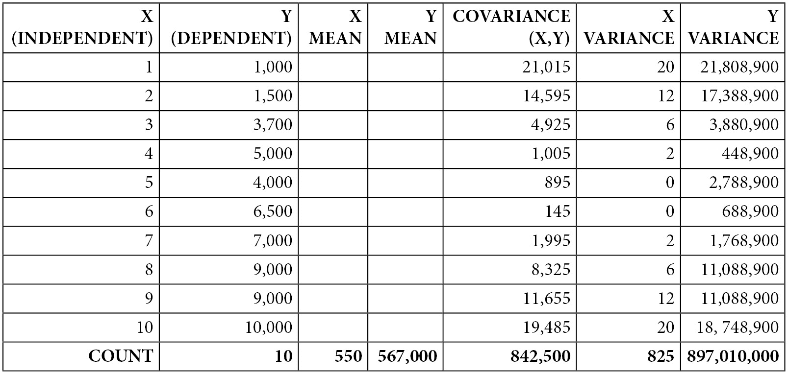

图 7.4 – 基于工作经验数量预测平均工资的数据集

如我们所见，X 和 Y 之间存在几乎完美的线性关系。随着工作经验的增加，工资也随之增加。除了 X 和 Y 之外，我们还需要计算以下统计量：记录数、X 的平均值、Y 的平均值、X 和 Y 的协方差、X 的方差和 Y 的方差。以下公式提供了方差和协方差的数学表示（分别），其中*x bar*、*y bar*和*n*分别代表 X 的平均值、Y 的平均值和记录数：

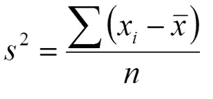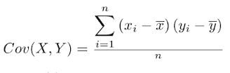

如果您想检查*表 7.2*中每个辅助统计量的公式计算细节，请参阅本书附带的支持材料。在那里，您将找到这些公式已经为您实现。

这些统计量很重要，因为它们将被用来计算我们的 alpha 和 beta 系数。以下图像解释了我们将如何计算这两个系数，以及相关系数**R**和**R 平方**。后两个指标将给我们一个关于模型质量的概念，模型越接近 1，模型就越好：

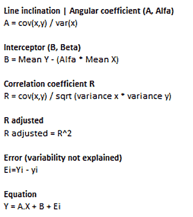

图 7.5 – 计算简单线性回归系数的公式

应用这些公式后，我们将得到以下结果：

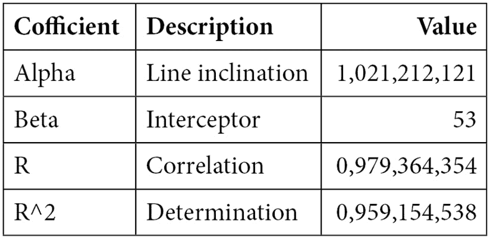

图 7.6 – 寻找回归系数

前面的表格已经包含了我们用于在新的数据上做出预测所需的所有信息。如果我们用原始方程中的系数替换，**y = ax + b + e**，我们将找到回归公式如下：

Y = 1021,212 * X + 53,3

从现在开始，为了进行预测，我们只需要将 X 替换为经验年数。结果，我们将找到 Y，即预测的工资。我们可以在以下图表中看到模型拟合和*图 7.8*中的某些模型预测：

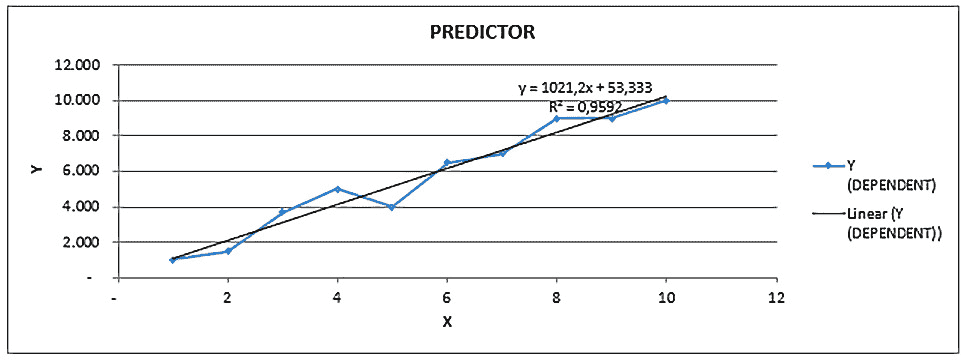

图 7.7 – 将数据拟合到回归方程中

我们在这里看到预测值：

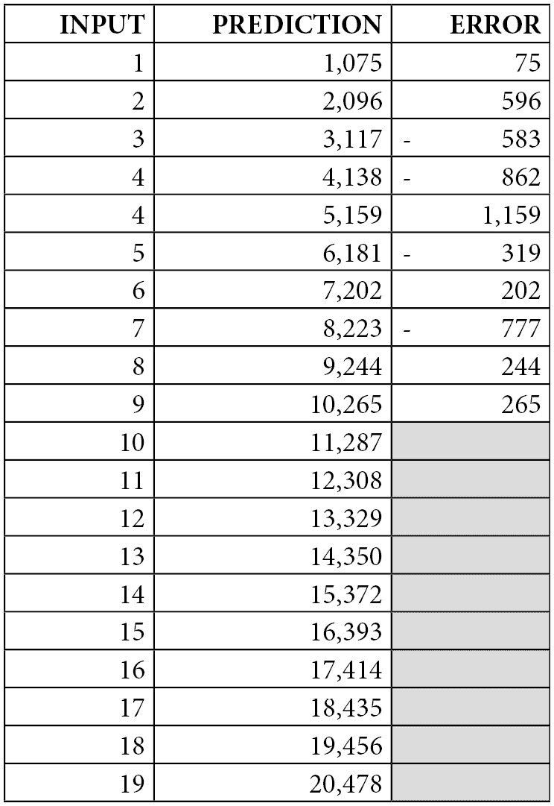

图 7.8 – 模型预测

当你在分析回归模型时，你应该能够理解你的模型是否具有良好的质量。我们在*第一章*，“机器学习基础”中讨论了许多建模问题（例如过拟合），你已经知道你总是需要检查模型性能。

对回归模型的一个良好方法是执行所谓的**残差分析**。这就是我们在散点图中绘制模型的误差，并检查它们是否随机分布（如预期）的地方。如果误差不是随机分布的，这意味着你的模型无法泛化数据。以下图表显示了我们的示例的残差分析：

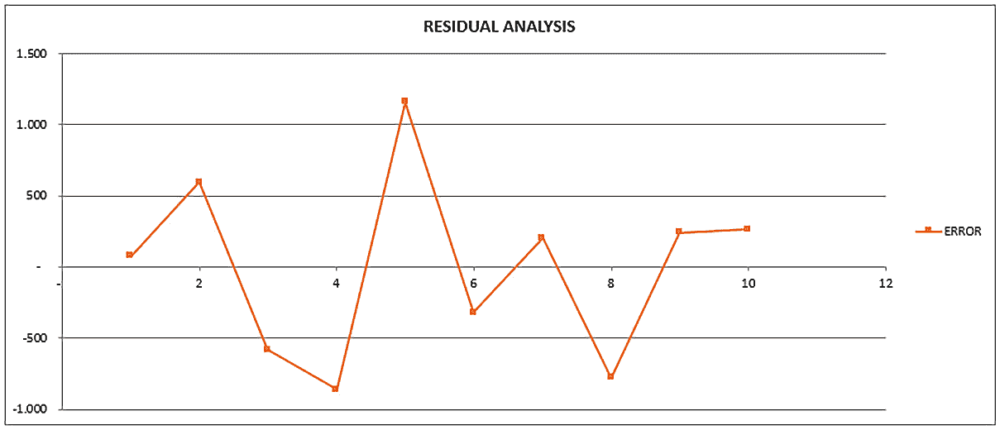

图 7.9 – 残差分析

这里的要点是误差是随机分布的。这样的证据，加上高 R 平方评分，可以用作支持使用此模型的论据。

重要提示

在*第八章*，“评估和优化模型”中，我们将学习关于评估指标的内容。例如，我们将了解到每种类型的模型可能都有自己的评估指标集。回归模型通常使用**均方误差**（MSE）和**均方根误差**（RMSE）进行评估。换句话说，除了 R、R 平方和残差分析之外，理想情况下，你将在测试集上执行你的模型以提取其他性能指标。你甚至可以使用交叉验证系统来检查模型性能，正如我们在*第一章*，“机器学习基础”中学到的。

非常常见的是，当模型残差确实呈现模式并且不是随机分布时，这是因为数据中现有的关系不是线性的，而是非线性的，因此必须应用另一种建模技术。现在，让我们看看我们如何解释模型的结果。

### 解释回归模型

了解如何解释线性回归模型也是很好的。有时，我们使用线性回归不一定是为了创建预测模型，而是为了进行回归分析，这样我们可以理解自变量和因变量之间的关系。

回顾我们的回归方程（Y = 1021,212 * X + 53,3），我们可以看到我们的两个术语：alpha 或斜率（1021.2）和 beta 或 y 轴截距（53.3）。我们可以这样解释这个模型：*对于每增加一年工作经验，你的薪水将增加 1,021.3 美元*。此外，请注意，当“工作经验年数”为零时，预期的薪水将是 53.3 美元（这是我们的直线与 y 轴相交的点）。

从一个通用角度来看，你的回归分析应该回答以下问题：对于独立变量（斜率）中每增加一个额外单位，因变量的平均变化是多少？请做笔记并确保你知道如何解释简单线性回归模型——这对于你作为数据科学家日常活动中的一个重要事情来说是非常重要的事情！让我们继续前进，看看关于线性回归的一些最终考虑。

### 检查调整后的 R 平方

到目前为止，我希望你对回归模型有了更好的理解！还有一个非常重要的主题你应该知道，无论它是否会在考试中出现，那就是你模型的简约性方面。

我们已经在*第一章*《机器学习基础》中讨论了简约性。这是你优先考虑简单模型而不是复杂模型的能力。在查看回归模型时，你可能需要使用多个特征来预测你的结果。这也被称为多元回归模型。

当这种情况发生时，R 和 R 平方系数往往会奖励具有更多特征的更复杂模型。换句话说，如果你继续向多元回归模型添加新特征，你会得到更高的 R 和 R 平方系数。这就是为什么你不能仅仅基于这两个指标来做决定。

你可以使用的一个额外指标（除了 R、R 平方、MSE 和 RMSE 之外）被称为**调整后的 R 平方**。当我们向模型添加不带来任何实际收益的额外特征时，这个指标会受到惩罚。在下面的表中，我们提供了一个假设的例子，只是为了展示当你开始失去简约性时的情况：

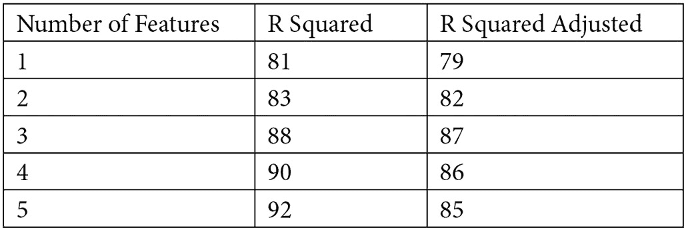

图 7.10 – 比较 R 平方和调整后的 R 平方

在这里，我们可以得出结论，在模型中保持三个变量比保持四个或五个变量更好。向该模型添加四个或五个变量会增加 R 平方（正如预期的那样），但会降低调整后的 R 平方。

好吧；到目前为止，你应该对回归模型有了非常好的理解。现在，让我们看看 AWS 为这类模型提供的内置算法有哪些。这对你的考试很重要，所以让我们来看看。

### AWS 上的回归建模

AWS 有一个内置的算法称为**线性学习器**，其中我们可以实现线性回归模型。内置的线性学习器使用**随机梯度下降**（**SGD**）来训练模型。

重要提示

当我们谈到神经网络时，我们将了解更多关于 SGD 的内容。现在，我们可以将 SGD 视为我们刚刚剖析的流行的最小二乘误差方法的替代方案。

线性学习内置算法提供了一个超参数，可以在训练过程之前对数据进行归一化处理。这个超参数的名称是`normalize_data`。这非常有帮助，因为线性模型对数据的规模很敏感，通常利用数据归一化。

重要提示

我们在*第三章*中讨论了数据归一化，*数据准备和转换*。如果你需要复习，请查看该章节。

线性学习算法的一些其他重要超参数是**L1**和**wd**，它们分别扮演**L1 正则化**和**L2 正则化**的角色。

L1 和 L2 正则化有助于线性学习器（或任何其他回归算法实现）避免过拟合。传统上，我们称实现 L1 正则化的回归模型为**Lasso 回归**模型，而对于具有 L2 正则化的回归模型，我们称它们为**岭回归**模型。

虽然这可能听起来很复杂，但实际上并不复杂！实际上，回归模型方程仍然是相同的；即**y = ax + b + e**。变化在于损失函数，它用于找到最佳最小化误差的系数。如果你回顾*图 7.3*，你会看到我们定义误差函数为**e = (ŷ - y)²**，其中**ŷ**是回归函数值，**y**是真实值。

L1 和 L2 正则化将惩罚项添加到损失函数中，如下公式所示（注意，我们将 ŷ替换为 ax + b）：

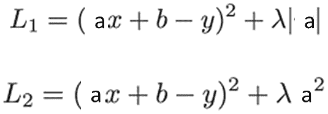

λ（lambda）参数必须大于 0，并且需要手动调整。一个非常高的λ值可能会导致欠拟合问题，而一个非常低的λ值可能不会导致最终结果有显著的变化（如果你的模型已经过拟合，它将保持过拟合）。

在实际应用中，L1 和 L2 正则化之间的主要区别是，L1 会将不那么重要的系数缩小到零，这将迫使特征被删除（充当特征选择器）。换句话说，如果你的模型因为具有大量特征而过拟合，L1 正则化应该可以帮助你解决这个问题。

重要提示

在你的考试中，记住 L1 和 L2 正则化的基础，特别是它们之间的关键区别，其中 L1 作为一个特征选择器效果很好。

最后但同样重要的是，许多内置算法可以服务于多种建模目的。线性学习算法可以用于回归、二分类和多分类。在考试中确保你记住这一点（这不仅仅是关于回归模型）。

仍然沿着这个方向，AWS 还内置了其他适用于回归和分类问题的算法；即**因子分解机**、**K 最近邻**（**KNN**）和**XGBoost**算法。由于这些算法也可以用于分类目的，我们将在关于分类算法的章节中介绍它们。

重要提示

您在考试期间得到了一个非常重要的提示：线性学习者、因子分解机、K 最近邻和 XGBoost 都适合回归和分类问题。这些算法通常被称为通用算法。

有了这个，我们已经到达了关于回归模型的这一节结束。希望您喜欢它；记得在您参加考试之前查看我们的支持材料。顺便说一句，您可以在日常活动中使用那份参考资料！现在，让我们继续探讨另一个经典的机器学习问题示例：分类模型。

## 与分类模型一起工作

您在这本书中一直在学习分类模型是什么。然而，现在，我们将讨论一些适合分类问题的算法。请记住，有数百种分类算法，但由于我们正在为 AWS 机器学习专业考试做准备，我们将介绍 AWS 预先构建的算法。

我们已经知道线性学习者做什么（我们知道它适合回归和分类任务），让我们看看其他用于通用目的（包括分类任务）的内置算法。

我们将从**因子分解机**开始。因子分解机被认为是线性学习者的扩展，优化以在具有高维稀疏数据集的特征之间找到关系。

重要提示

因子分解机的一个非常传统的用例是*推荐系统*，其中我们通常有很高的数据稀疏度。在考试中，如果您面临一个通用问题（无论是回归还是二元分类任务）且底层数据集是稀疏的，那么从算法角度来看，因子分解机可能是最好的答案。

当我们在回归模型中使用因子分解机时，将使用**均方根误差**（**RMSE**）来评估模型。另一方面，在二元分类模式下，算法将使用对数损失、准确率和 F1 分数来评估结果。我们将在*第八章*中更深入地讨论评估指标，*评估和优化模型*。

您应该知道，因子分解机只接受**recordIO-protobuf**格式的输入数据。这是因为数据稀疏性问题，recordIO-protobuf 被认为在数据处理方面比文本/.csv 格式做得更好。

适用于分类问题的下一个内置算法被称为 K-最近邻，简称 KNN。正如其名所示，该算法将尝试找到输入数据的**K**个最近点，并返回以下预测之一：

+   如果是分类任务，则 k 个最近点的最频繁出现的类别

+   如果是回归任务，则 k 个最近点的标签的平均值

我们称 KNN 为**基于索引的算法**，因为它计算点之间的距离，为这些点分配索引，然后存储排序后的距离及其索引。有了这种类型的数据结构，KNN 可以轻松选择最接近的 K 个点来进行最终预测。

注意，K 是 KNN 的一个超参数，应该在建模过程中进行优化。

另一个 AWS 内置算法，适用于包括分类在内的通用目的，被称为**极端梯度提升**，简称**XGBoost**。这是一个基于集成和决策树的模型。

XGBoost 使用一系列**较弱的**模型（决策树）来预测目标变量，这可能是一个回归任务、二分类或多分类。这是一个非常流行的算法，并且已被顶尖选手在机器学习竞赛中使用。

XGBoost 在添加新树时使用提升学习策略来纠正先前模型的错误。它被称为“梯度”，因为它使用梯度下降算法来最小化损失。

重要提示

在这个上下文中，术语“较弱”用来描述非常简单的决策树。

虽然 XGBoost 比单个决策树更稳健，但在考试中有一个清晰的决策树及其主要配置的理解是很重要的。顺便说一下，它们是许多集成算法（如 AdaBoost、随机森林、梯度提升和 XGBoost）的基础模型。

决策树是基于规则的算法，以树的形式组织决策，如下面的图所示：

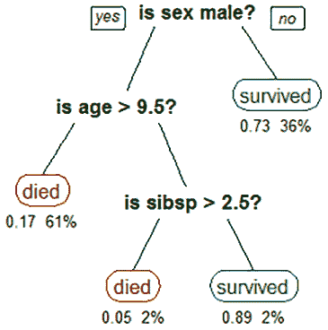

图 7.11 – 决策树模型示例

它们由根节点（位于树的顶部）、中间或决策节点（位于树的中间）和叶节点（底部节点，没有分支）组成。树的深度由根节点和最后一个叶节点之间的差异给出。例如，在前面的图中，树的深度是 3。

树的深度是此类模型最重要的超参数之一，通常被称为**最大深度**。换句话说，最大深度控制决策树可以达到的最大深度。

决策树模型另一个非常重要的超参数被称为叶节点中的最小样本数/观测数。它也用于控制树的生长。

决策树有许多其他类型的超参数，但这两个对于控制模型过拟合尤为重要。深度较高或叶子节点观察值非常少的决策树在预测/外推过程中可能会遇到问题。

原因很简单：决策树使用叶子节点中的数据来做出预测，基于每个观察值/目标变量属于该节点的比例（用于分类任务）或平均值（用于回归任务）。因此，节点应该有足够的数据来在训练集之外做出良好的预测。

如果你在考试中遇到术语**CART**，你应该知道它代表**分类和回归树**，因为决策树可以用于分类和回归任务。

为了选择在树中分割数据的最佳变量，模型将选择最大化节点间目标变量分离的变量。这项任务可以通过不同的方法执行，例如**基尼系数**和**信息增益**。

## 预测模型

**时间序列**，或简称**TS**，指的是按顺序依赖关系定期收集的数据点。时间序列具有度量、事实和时间单位，如下面的图像所示：

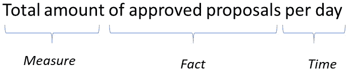

图 7.12 – 时间序列陈述

此外，时间序列可以分为**单变量**或**多变量**。单变量时间序列在一段时间内只有一个变量，而多变量时间序列在一段时间内有两个或更多变量。以下图表显示了我们在前面图像中所示的单变量时间序列：

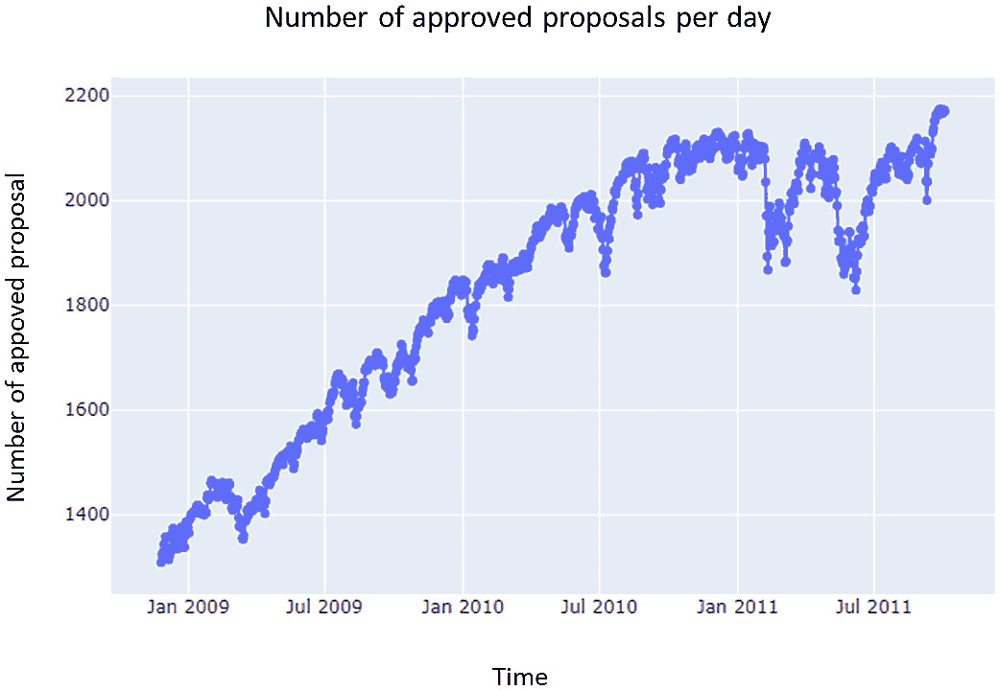

图 7.13 – 时间序列示例

时间序列可以按以下方式分解：

+   **观察值**或**水平**：序列的平均值

+   **趋势**：增加或减少的模式（有时没有趋势）

+   **季节性**：在特定时间段的规律性高峰（有时没有季节性）

+   **噪声**：我们无法解释的东西

有时，我们也可以在序列中找到一些孤立的高峰，这些高峰在预测模型中无法捕捉到。在这种情况下，我们可能希望将这些高峰视为异常值。以下是对前面图表所示时间序列的分解：

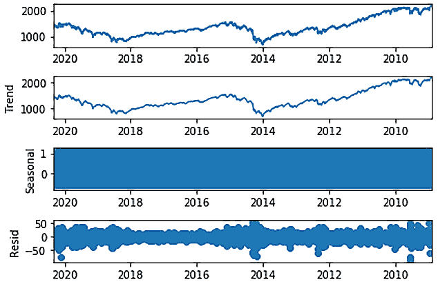

图 7.14 – 时间序列分解

值得强调的是，我们可以使用**加法**或**乘法**方法来分解时间序列。加法模型表明，你的时间序列将每个组成部分**加**起来以解释目标变量；也就是说，**y(t) = 水平 + 趋势 + 季节性 + 噪声**。

乘法模型另一方面表明，你的时间序列将每个组成部分**乘**起来以解释目标变量；也就是说，**y(t) = 水平 * 趋势 * 季节性 * 噪声**。

在下一节中，我们将更详细地研究时间序列的组成部分。

### 检查时间序列的平稳性

分解时间序列并理解它们的组成部分如何通过加法和乘法模型相互作用是一项伟大的成就！然而，我们学得越多，我们对自己的疑问就越多。也许你已经意识到，没有趋势和季节性的时间序列比具有所有这些成分的时间序列更容易预测！

这是自然而然的事情。如果你不需要理解趋势和季节性，如果你无法控制噪声，你所要做的就是探索观察到的值并找到它们的回归关系。

我们将具有在一段时间内保持恒定均值和方差的时序称为**平稳的**。一般来说，具有趋势和季节性的时序**不是**平稳的。可以通过对序列应用数据转换来将其转换为平稳时序，从而使建模任务变得更容易。这种转换被称为**微分**。

当你探索时间序列时，你可以通过应用假设检验来检查平稳性，例如**Dickey-Fuller**、**KPSS**和**Philips-Perron**，仅举几例。如果你发现它是非平稳的，那么你可以应用微分来使其成为平稳时间序列。一些算法已经内置了这种能力。

### 探索，探索，再探索

到目前为止，我确信我无需提醒你，探索任务在数据科学中一直都在发生。这里没有什么不同。当你构建时间序列模型时，你可能想查看数据并检查它是否适合这种类型的建模。

**自相关图**是你可以用于时间序列分析的工具之一。自相关图允许你检查时间序列中滞后之间的相关性。以下图表展示了这种可视化类型的示例：

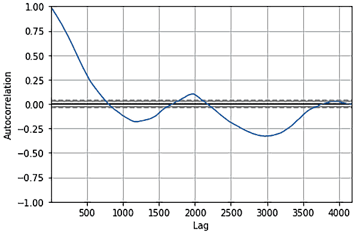


图 7.15 – 自相关图

记住，如果你在处理单变量时间序列，你的时间序列只有一个变量，因此找到你独特变量的滞后之间的自相关对于理解你是否能构建一个好的模型至关重要。

是的，有时候可能会发生这样的情况，你面前没有时间序列。而且，无论你多么努力，你都无法将这类数据建模为时间序列。这类数据通常被称为**白噪声**。

另一种我们无法预测的序列类型被称为**随机游走**。随机游走本质上是随机的，但它们依赖于前一时间步。例如，随机游走的下一个点可能是在 0 和 1 之间的随机数，也可能是序列的最后一个点。

重要提示

如果你在考试中遇到这些术语，请记住将它们与时间序列中的随机性联系起来。

有了这些，我们已经涵盖了时间序列建模的主要理论。你还应该知道，目前最流行的用于处理时间序列的算法被称为**自回归积分移动平均**（**ARIMA**）和**指数平滑**（**ETS**）。我们不会查看这两个模型的细节。相反，我们将看看 AWS 在时间序列建模方面能为我们提供什么。

### 理解 DeepAR

**DeepAR**预测算法是 SageMaker 内置的算法，用于使用**循环神经网络**（**RNN**）预测一维时间序列。

传统的时序算法，如 ARIMA 和 ETS，是为每个时间序列拟合一个模型而设计的。例如，如果你想预测每个地区的销售额，你可能需要为每个地区创建一个模型，因为每个地区可能有自己独特的销售行为。另一方面，DeepAR 允许你在单个模型中操作多个时间序列，这在更复杂的使用案例中似乎是一个巨大的优势。

DeepAR 的输入数据，正如预期的那样，是一个或多个时间序列。这些时间序列中的每一个都可以与以下内容相关联：

+   一个由`cat`字段控制的静态（时间无关性）分类特征向量

+   一个由`dynamic_feat`控制的动态（时间依赖性）时间序列向量

    重要提示

    注意，在多个时间序列上训练和进行预测的能力与静态分类特征向量密切相关。在定义 DeepAR 将要训练的时间序列时，你可以设置分类变量来指定每个时间序列属于哪个组。

DeepAR 的两个主要超参数是`context_length`，它用于控制在训练过程中模型可以看到多远的历史，以及`prediction_length`，它用于控制模型将输出预测的多远未来。

DeepAR 还可以处理缺失值，在这种情况下，指的是时间序列中存在的缺口。DeepAR 的一个非常有趣的功能是它能够从时间序列中创建派生特征。这些派生特征，由基本时间频率创建，有助于算法学习时间依赖性模式。以下表格显示了 DeepAR 根据其训练的每种类型的时间序列创建的所有派生特征：

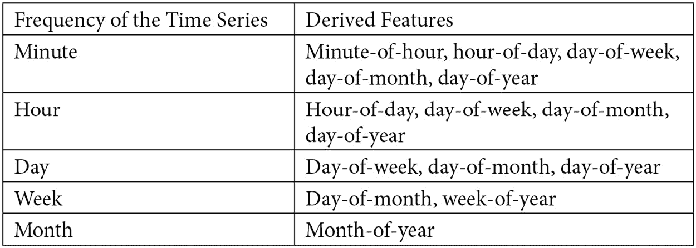

图 7.16 – 按时间序列频率提取的 DeepAR 特征

我们现在已经完成了关于预测模型的这一章节。接下来，我们将查看关于监督学习的最后一个算法；即**Object2Vec**算法。

## Object2Vec

Object2Vec 是 SageMaker 内置算法，它泛化了众所周知的**word2vec**算法。Object2Vec 用于为高维对象创建**嵌入空间**。根据定义，这些嵌入空间是原始对象的压缩表示，可用于多种目的，例如特征工程或对象比较：

![图 7.17 – 嵌入空间的视觉示例

![图片/B16735_07_017.jpg]

图 7.17 – 嵌入空间的视觉示例

上一张图展示了我们所说的嵌入空间。神经网络模型的第一层和最后一层只是将输入数据映射到自身（由相同大小的向量表示）。

当我们深入到模型的内部层时，数据被越来越压缩，直到它达到这个架构中间的层，也就是嵌入层。在这一特定层，我们有一个更小的向量，其目的是准确且压缩地表示来自第一层的高维原始向量。

通过这种方式，我们刚刚完成了关于 AWS 中机器学习算法的第一部分。接下来，我们将查看一些无监督算法。

# 无监督学习

AWS 为以下任务提供了几种无监督学习算法：

+   聚类：

+   K-means 算法

+   维度降低：

+   **主成分分析**（**PCA**）

+   模式识别：

+   IP 洞察

+   异常检测：

+   **随机切割森林算法**（**RCF**）

让我们从讨论聚类以及最流行的聚类算法 K-means 的工作原理开始。

## 聚类

聚类算法在数据科学中非常流行。基本上，它们旨在识别给定数据集中的组。技术上，我们称这些发现或组为**簇**。聚类算法属于非监督学习领域，这意味着它们不需要标签或响应变量来训练。

这真是太棒了，因为以前标记的数据很稀缺。然而，它也有一些限制。主要的一个是，聚类算法为你提供簇，但不提供每个簇的含义。因此，必须有人，作为领域专家，分析每个簇的特性来定义它们的含义。

有许多种聚类方法，例如层次聚类和划分聚类。在每种方法内部，我们会找到几种算法。然而，**K-Means**可能是最流行的聚类算法，你很可能在考试中会遇到它，所以让我们更详细地看看它。

当我们玩 K-means 时，我们必须要指定我们想要创建的簇的数量。然后，我们必须将数据点分配到每个簇中，以便每个数据点只属于一个簇。这正是我们在聚类过程结束时期望得到的结果！

您作为用户，必须指定您想要创建的簇的数量，并将此数字传递给 K-means。然后，算法将随机初始化每个簇的中心点，这也被称为**质心初始化**。

一旦我们得到了每个簇的质心，我们只需要为每个数据点分配一个簇。为此，我们必须使用邻近度或距离度量！让我们采用距离度量的术语。

**距离度量**负责计算数据点与质心之间的距离。根据距离度量，数据点将属于最近的簇质心！

最著名且使用最广泛的距离度量称为**欧几里得距离**，其背后的数学非常简单：想象一下，您的数据集点由两个维度组成，X 和 Y。因此，我们可以将点 a 和 b 考虑如下：

+   a (X=1, Y=1)

+   b (X=2, Y=5)

点 a 和 b 之间的欧几里得距离由以下公式给出，其中 X1 和 Y1 代表点 a 的值，X2 和 Y2 代表点 b 的值：

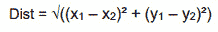

同样的函数可以通过以下方程进行推广！[](img/image18.png)

一旦我们完成这个过程，并为每个数据点分配了一个簇，我们必须重新计算簇质心。这个过程可以通过不同的方法完成，例如**单链**、**平均链**和**完整链**。

由于这种质心更新，我们必须为每个数据点持续检查最近的簇，并持续更新质心。我们必须**迭代地**重新执行步骤 1 和 2，直到簇质心收敛或达到允许的最大迭代次数。

好的；让我们回顾一下构成 K-means 方法的组件：

+   质心初始化、簇分配、质心更新，然后重复最后两个步骤，直到收敛。

+   算法本身：

+   为每个簇分配数据点的距离度量：

+   我们在这里选择了欧几里得距离。

+   以及一种重新计算簇质心的链接方法：

+   为了我们的演示，我们将选择平均链接。

根据这些定义，我们可以一步一步地通过我们的真实示例。就像我们的回归模型一样，也有一些支持材料可供您参考。

### 逐步计算 K-means

在这个例子中，我们将在一个非常小的数据集中模拟 K-means，只有两列（x 和 y）和六个数据点（A、B、C、D、E、F），如下表所示：

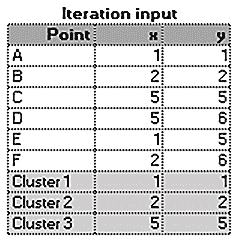

图 7.18 – K-means 的输入数据

在前面的表中，我们创建了三个簇，其质心如下：(1,1)，(2,2)，(5,5)。簇的数量（3）是**预先定义的*，每个簇的质心是随机定义的。以下图表显示了我们现在算法所处的阶段：

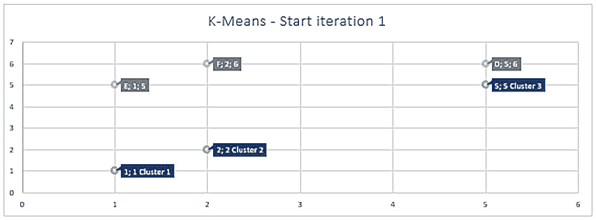

图 7.19 – 在完成第一次迭代前绘制 K-means 结果

在这里，你无法看到点 A、B 和 C，因为它们与聚类中心重叠，但不用担心 – 它们很快就会出现。我们现在必须做的是计算每个数据点到每个聚类中心的距离。然后，我们需要选择每个点最近的聚类：

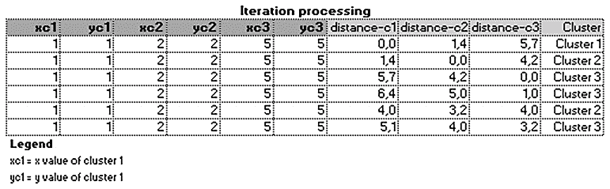

图 7.20 – 处理迭代 1

在前面的表中，我们有以下元素：

+   每一行代表一个数据点。

+   前六列代表每个聚类的质心轴（x 和 y）。

+   接下来的三列代表每个数据点到每个聚类质心的距离。

+   最后一列代表每个数据点最近的聚类。

看数据点 A（第一行），我们可以看到它被分配到聚类 1，因为数据点 A 到聚类 1 的距离是 0（记得我告诉过你们它们是重叠的吗？）。同样的计算发生在所有其他数据点上，以定义每个数据点的聚类。

在我们继续之前，你可能想看看我们是如何计算聚类和数据点之间的距离的。正如我们之前所述，我们使用了欧几里得距离，所以让我们看看它是如何起作用的。为了演示目的，让我们检查一下数据点 A 和聚类 3（图 7.20 的第一行，`distance-c3`列，值 5,7）之间的距离是如何计算出来的。

首先，我们应用了以下公式中的相同方程：

](img/image171.jpg)

这里，我们有以下内容：

+   X1 = 数据点 A 的 X = 1

+   Y1 = 数据点 A 的 Y = 1

+   X2 = 第 3 个聚类的 X = 5

+   Y2 = 第 3 个聚类的 Y = 5

逐步应用公式，我们将得到以下结果：

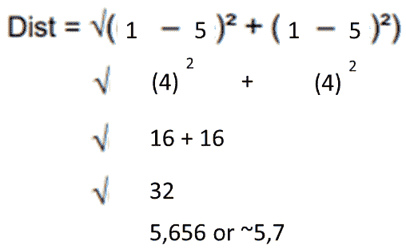

图 7.21 – 逐步计算欧几里得距离

这真是太棒了，不是吗？我们几乎完成了 K-means 的第一次迭代。在迭代 1 的最后一步，我们必须刷新聚类中心。记住：最初，我们随机定义了这些中心，但现在，我们已经将一些数据点分配给每个聚类，这意味着我们应该能够识别出聚类的中心点在哪里。

在这个例子中，我们定义了我们将使用**平均链连接**方法来刷新聚类中心。这是一个非常简单的步骤，结果如下表所示：

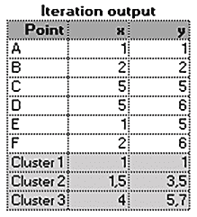

图 7.22 – 第一次迭代后的 K-means 结果

前面的表格显示了我们在处理的数据点（顺便说一句，它们永远不会改变），以及簇 1、2 和 3 的中心。这些中心与*图 7.18*中显示的初始中心相当不同。这是因为它们使用了平均链接来更新！这种方法得到了每个簇的数据点的所有 x 和 y 值的平均值。例如，让我们看看我们是如何得到(1.5, 3.5)作为簇 2 的中心。

如果你查看*图 7.20*，你会看到只有两个数据点分配给了簇 2：B 和 E。这些是图像中的第二行和第五行。如果我们取每个点的 x 轴的平均值，那么我们将得到**(2 + 1) / 2 = 1.5**和**(2 + 5) / 2 = 3.5**。

到此为止，我们已经完成了 K-means 的第一次迭代，我们可以查看结果：

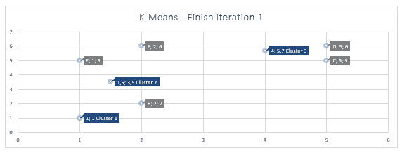

图 7.23 – 第一次迭代后的 K-means 结果

现在，我们可以看到几乎所有的数据点，除了数据点 A，因为它仍然与簇 1 的中心重叠。继续前进，我们必须重新执行以下步骤：

+   重新计算每个数据点与每个簇中心的距离，并在必要时重新分配簇

+   重新计算簇中心

我们会多次执行这两项任务，直到簇中心收敛并且不再改变，或者我们达到允许的最大迭代次数，这可以作为 K-means 的超参数设置。为了演示目的，经过四次迭代后，我们的簇将看起来如下：

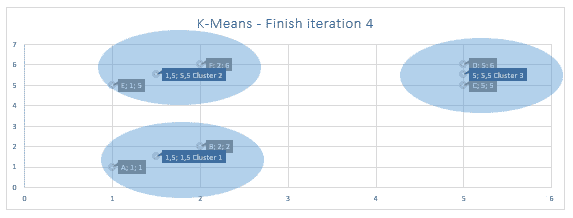

图 7.24 – 第四次迭代后的 K-means 结果

在第四次迭代中，我们的簇中心看起来相当一致，我们可以清楚地看到我们可以根据它们的邻近性将六个数据点分组。

重要提示

在这个例子中，我们只为每个数据点设置了两个维度（维度 x 和 y）。在实际应用中，我们可以看到更多的维度，这就是为什么聚类算法在以更自动化的方式识别数据中的组时扮演着非常重要的角色。

我希望你喜欢从头计算 K-means 的过程！我相信这些知识对你的考试和作为数据科学家的职业生涯都会有所帮助。顺便说一句，我已经告诉你很多次，数据科学家必须持怀疑态度和好奇心，所以你可能想知道为什么我们在这个例子中定义了三个簇而不是两个或四个。你也可能想知道我们如何衡量簇的质量。

你不会认为我不会向你解释这一点，对吧？在下一节中，我们将一起澄清这些点。

### 定义簇的数量和衡量簇的质量

虽然 K-means 是一个在数据中寻找模式的好算法，但它不会提供每个簇的含义，也不会提供你必须创建以最大化簇质量的簇数量。

在聚类中，簇质量意味着我们希望创建具有高同质性的簇内元素和具有高异质性的簇间元素。换句话说，同一簇的元素应该接近/相似，而不同簇的元素应该很好地分离。

计算簇同质性的一个方法是通过使用一个称为**平方误差和**的度量，或简称为**SSE**。这个度量将计算每个数据点与其簇质心的平方差之和。例如，当所有数据点都位于簇质心所在的同一点时，SSE 将为 0。换句话说，我们希望最小化 SSE。以下方程正式定义了 SSE：

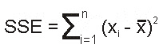

现在我们知道了如何检查簇质量，就更容易理解如何为给定的数据集定义适当的簇数量。我们只需要找到几个最小化 SSE 的簇。一个围绕该逻辑工作的非常流行的方法被称为**肘部方法**。

肘部方法建议多次执行聚类算法。在每次执行中，我们将测试不同数量的簇，*k*。在每次执行后，我们计算与该*k*数量簇相关的 SSE。最后，我们可以绘制这些结果，并选择 SSE 急剧下降的*k*数量。

重要提示

添加更多的簇将自然会降低 SSE。在肘部方法中，我们希望找到这种变化变得更为平滑的点。

在前面的例子中，我们决定创建三个簇。以下图表显示了支持这一决策的肘部分析：

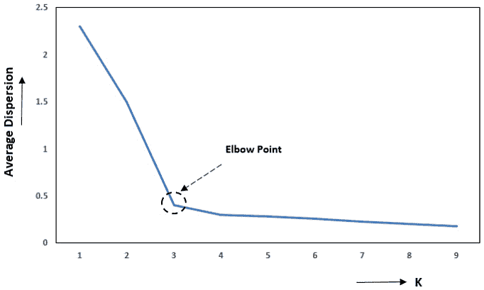

图 7.25 – 肘部方法

我们可以得出结论，添加超过三个或四个簇将给聚类过程增加不必要的复杂性。

当然，在定义簇的数量时，你应该始终考虑业务背景。例如，如果你正在创建客户细分模型，而你的公司已经为四个客户细分准备了商业团队和业务流程，考虑到前面的图表，将簇设置为四个而不是三个是没有害处的。

最后，你应该知道 AWS 已经将 K-means 算法作为其内置算法列表的一部分实现了。换句话说，你不需要使用外部库或自己带来算法来在 AWS 上使用 K-means。

### 结论

那真是一个了不起的成就：你刚刚掌握了聚类算法的基础，现在你应该能够自己开展关于这个主题的项目和研究！对于考试，记住聚类属于机器学习的无监督领域，因此不需要有标记的数据。

此外，确保你知道这个领域最流行的算法是如何工作的；那就是 K-means。尽管聚类算法不提供每个组的含义，但它们在寻找数据中的模式方面非常强大，无论是为了建模特定问题还是仅仅为了探索数据。

接下来，我们将继续研究无监督算法，看看 AWS 是如何构建出目前最强大的异常检测算法之一的，这个算法被称为**随机切割森林**（**RCF**）。

## 异常检测

在建模和数据探索性分析中，发现数据中的异常情况非常常见。有时，你可能只想在拟合回归模型之前找到数据中的异常并去除它们，而有时，你可能想创建一个将识别异常作为最终目标的模型，例如在欺诈检测系统中。

再次强调，我们可以使用许多不同的方法来找到数据中的异常。只要有些创意，可能性是无限的。然而，有一个特定的算法可以解决这个问题，你在考试中应该一定要了解：**随机切割森林**（**RCF**）。

RCF 是一种基于无监督决策树的算法，它使用训练数据的随机子样本创建多个决策树（森林）。技术上，它随机化数据，然后根据树的数量创建样本。最后，这些样本被分配到每个树中。

这些树集被用来为数据点分配一个异常分数。这个异常分数定义为将这个点添加到树中后，树的复杂度预期的变化。

RCF 最重要的超参数是`num_trees`和`num_samples_per_tree`，分别代表森林中的树的数量和每棵树中的样本数量。

## 维度降低

另一个 AWS 在其内置算法列表中实现的非监督算法被称为**主成分分析**，简称**PCA**。PCA 是一种用于减少给定数据集中变量/维度的数量的技术。

PCA 背后的主要思想是将数据点绘制到另一组坐标上，称为**主成分**（**PC**），目的是解释数据中的最大方差。根据定义，第一个成分将比第二个成分捕获更多的方差，然后第二个成分将比第三个成分捕获更多的方差，依此类推。

只要不超过你的数据集中的变量数量，你就可以设置你需要的任何主成分。以下图表显示了这些主成分是如何绘制的：

![图 7.26 – 在 PCA 中找到主成分]

![img/B16735_07_026.jpg]

图 7.26 – 在 PCA 中找到主成分

正如我们之前提到的，第一个主成分将以这种方式绘制，以便它能捕捉到数据中的大部分方差。这就是为什么它在先前的图表中接近大多数数据点。

然后，第二个主成分将垂直于第一个，因此它将成为解释数据中方差的第二组件。如果你想创建更多的组件（从而捕获更多的方差），你只需遵循添加垂直组件的相同规则。**特征向量**和**特征值**是与 PCA 相关的线性代数概念，用于计算主成分。

那么，这里的降维故事是什么呢？如果还不清楚，这些主成分可以用来替换你的原始变量。例如，假设你的数据集中有 10 个变量，你想要将这个数据集减少到三个最能代表其他变量的变量。解决这个问题的潜在方法就是应用 PCA 并提取前三个主成分！

这三个组件能解释你数据集的 100%吗？可能不是，但理想情况下，它们将解释大部分的方差。添加更多的主成分将解释更多的方差，但代价是增加了额外的维度。

### 使用 AWS 内置的 PCA 算法

在 AWS 中，PCA 以两种不同的模式工作：

+   **常规**：对于具有适度观察和特征的集合

+   **随机化**：对于具有大量观察和特征的集合

不同之处在于，在随机模式下，它使用了一个近似算法。

当然，PCA 的主要超参数是你想要提取的组件数量，称为`num_components`。

## IP 洞察

IP 洞察是一种无监督算法，用于模式识别。本质上，它学习 IPv4 地址的使用模式。

这个算法的操作方式非常直观：它是在实体和 IPv4 地址格式的成对事件上训练的，这样它就能理解它所训练的每个实体的模式。

重要提示

例如，我们可以将“实体”理解为用户 ID 或账户号码。

然后，为了进行预测，它接收一对具有相同数据结构（实体，IPv4 地址）的事件，并返回关于该特定 IP 地址相对于输入实体的异常分数。

重要提示

这个由 IP Insight 返回的异常分数推断出事件的模式有多异常。

我们可能会遇到许多与 IP 洞察相关的应用。例如，你可以创建一个基于你的应用程序登录事件（这是你的实体）训练的 IP 洞察模型。你应该能够通过 API 端点公开这个模型以进行实时预测。

然后，在应用程序的认证过程中，你可以调用你的端点并传递尝试登录的 IP 地址。如果你得到了高分（这意味着这种登录模式看起来异常），在授权访问之前（即使密码是正确的），你可以请求更多信息。

这只是你可以考虑的 IP Insights 的许多应用之一。接下来，我们将讨论文本分析。

# 文本分析

现代应用使用**自然语言处理**（**NLP**）进行多种目的，例如**文本翻译**、**文档分类**、**网络搜索**、**命名实体识别**（**NER**）等。

AWS 为大多数 NLP 用例提供了一套算法。在接下来的几个小节中，我们将查看这些内置的文本分析算法。

## Blazing Text 算法

Blazing Text 执行两种不同类型的任务：文本分类，这是一种扩展**fastText**文本分类器的监督学习方法，以及**word2vec**，这是一种无监督学习算法。

Blazing Text 实现这两种算法已针对在大数据集上运行进行优化。例如，你可以在几分钟内训练一个在数十亿个单词之上的模型。

Blazing Text 的这种可扩展性是由于以下原因：

+   它能够利用多核 CPU 和单个 GPU 来加速文本分类

+   它在处理 word2vec 算法时能够使用多核 CPU 或 GPU，并使用定制的 CUDA 内核进行 GPU 加速。

word2vec 选项支持**批量跳字图**模式，这允许 Blazing Text 在多个 CPU 上执行分布式训练。

重要注意事项

Blazing Text 执行的分布式训练采用小批量方法将**一级 BLAS**操作转换为**三级 BLAS**操作。如果在考试中遇到这些术语，你应该知道它们与 Blazing Text 在 word2vec 方面有关。

仍然在 word2vec 模式下，Blazing Text 支持**跳字图**和**连续词袋**（**CBOW**）架构。

最后但同样重要的是，请注意以下 Blazing Text 的配置，因为它们很可能出现在你的考试中：

+   在 word2vec 模式下，只有训练通道可用。

+   Blazing Text 期望一个单独的文本文件，其中包含空格分隔的标记。文件的每一行必须包含一个句子。这意味着在使用 Blazing Text 之前，你通常需要预处理你的数据集。

## 序列到序列算法

这是一个监督算法，它将输入序列转换为输出序列。这个序列可以是文本句子，甚至是音频记录。

序列到序列最常见的用例是机器翻译、文本摘要和语音到文本。你认为的任何序列到序列问题都可以通过这个算法来处理。

从技术上讲，AWS SageMaker 的 Seq2Seq 使用两种类型的神经网络来创建模型：一个**循环神经网络**（**RNN**）和一个具有注意力机制的**卷积神经网络**（**CNN**）。

**潜在狄利克雷分配**，简称**LDA**，用于主题建模。主题建模是一种文本分析技术，可以从文本数据集中提取一组主题。LDA 根据文本数据集中单词的概率分布来学习这些主题。

由于这是一个无监督算法，因此不需要设置目标变量。此外，必须事先指定主题数量，并且您将不得不分析每个主题以找到它们的领域意义。

## 神经主题模型（NTM）算法

就像 LDA 算法一样，**神经主题模型**（**NTM**）也旨在从数据集中提取主题。然而，LDA 和 NTM 之间的区别在于它们的学习逻辑。虽然 LDA 从文档中单词的概率分布中学习，但 NTM 建立在神经网络之上。

NTM 网络架构有一个瓶颈层，它创建了文档的嵌入表示。这个瓶颈层包含预测文档组成所需的所有必要信息，其系数可以被视为主题。

有了这些，我们已经完成了关于文本分析的这一章节。在下一章，我们将学习图像处理算法。

# 图像处理

图像处理在机器学习中是一个非常热门的话题。这个想法相当直观：创建可以分析图像并在其上做出推断的模型。通过推断，您可以将其理解为检测图像中的对象、对图像进行分类等等。

AWS 提供了一套内置算法，我们可以使用这些算法来训练图像处理模型。在接下来的几节中，我们将查看这些算法。

## 图像分类算法

正如其名所示，图像分类算法是使用监督学习对图像进行分类的。换句话说，每个图像都需要一个标签。它支持多标签分类。

它的操作方式很简单：在训练期间，它接收一个图像及其相关的标签。在推理期间，它接收一个图像并返回所有预测的标签。图像分类算法使用 CNN（**ResNet**）进行训练。它可以从头开始训练模型，或者利用迁移学习预先加载神经网络的前几层。

根据 AWS 的文档，支持`.jpg`和`.png`文件格式，但推荐格式是**MXNet RecordIO**。

## 语义分割算法

语义分割算法为创建计算机视觉应用提供了像素级的能力。它将图像的每个像素标记为类别，这对于自动驾驶和医学图像诊断等复杂应用来说是一个重要特征。

在其实现方面，语义分割算法使用**MXNet Gluon 框架**和**Gluon CV 工具包**。你可以选择以下任何算法来训练模型：

+   **全卷积网络**（**FCN**）

+   **金字塔场景解析**（**PSP**）

+   DeepLabV3

所有这些选项都作为**编码器-解码器**神经网络架构工作。网络的输出被称为**分割掩码**。

## 目标检测算法

就像图像分类算法一样，目标检测算法的主要目标也是不言而喻的：它在图像中检测和分类对象。它使用监督方法来训练深度神经网络。

在推理过程中，此算法返回识别的对象和关于预测的置信度分数。目标检测算法使用**单次多框检测器**（**SSD**）并支持两种类型的网络架构：**VGG**和**ResNet**。

# 摘要

这真是一次难忘的旅程！让我们花点时间来强调我们刚刚学到的东西。我们将本章分为四个主要部分：监督学习、无监督学习、文本分析和图像处理。我们所学的所有内容都适合机器学习的这些子领域。

我们研究过的监督学习算法列表包括以下内容：

+   线性学习器算法

+   分解机算法

+   XGBoost 算法

+   K-最近邻算法

+   Object2Vec 算法

+   DeepAR 预测算法

记住，你可以使用线性学习器、分解机、XGBoost 和 KNN 来解决多种目的，包括回归和分类问题。在这四个算法中，线性学习器可能是最简单的一个；分解机扩展了线性学习器，适用于稀疏数据集，XGBoost 使用基于决策树的集成方法，而 KNN 是一个基于索引的算法。

其他两个算法，Object2Vec 和 DeepAR，用于特定目的。Object2Vec 用于创建数据的向量表示，而 DeepAR 用于创建预测模型。

我们研究过的无监督学习算法列表包括以下内容：

+   K-means 算法

+   **主成分分析**（**PCA**）

+   IP 洞察

+   **随机切割森林**（**RCF**）算法

K-means 是一个非常流行的算法，用于聚类。PCA 用于降维，IP 洞察用于模式识别，RCF 用于异常检测。

我们接下来更详细地研究了回归模型和 K-means。我们这样做是因为，作为数据科学家，我们认为你应该至少掌握这两个非常流行的算法，这样你就可以自己深入研究其他算法。

然后，我们继续本章的后半部分，其中我们讨论了文本分析和以下算法：

+   Blazing Text 算法

+   序列到序列算法

+   **潜在狄利克雷分配**（**LDA**）算法

+   **神经** **主题** **模型**（**NTM**）算法

最后，我们讨论了图像处理，并查看以下内容：

+   图像分类算法

+   语义分割算法

+   目标检测算法

由于这是关于 AWS 机器学习专业考试非常重要的一章，我们鼓励您访问 AWS 网站并搜索机器学习算法。在那里，您将找到我们刚刚覆盖的算法的最新信息。

这就结束了这个快速复习和本章的内容。在下一章中，我们将探讨 AWS 提供的现有机制，我们可以使用这些机制来优化这些算法。

# 问题

1.  您正在一家零售公司担任首席数据科学家。您的团队正在构建一个回归模型，并使用内置的线性学习算法来预测特定产品的最优价格。该模型明显对训练数据过拟合，您怀疑这是由于使用了过多的变量。以下哪种方法最适合解决您的怀疑？

    a) 在训练过程中实施交叉验证过程以减少过拟合。

    b) 应用 L1 正则化和改变线性学习算法的`wd`超参数。

    c) 应用 L2 正则化和改变线性学习算法的`wd`超参数。

    d) 应用 L1 和 L2 正则化。

    答案

    C，这个问题涉及到由于使用了过多的特征而导致的过拟合问题。线性学习器中通过`wd`超参数提供的 L2 正则化将作为一个特征选择器。一些不太重要的特征将因获得非常低的权重而受到惩罚，这在实际操作中相当于消除了变量。

1.  RecordIO-protobuf 是一种优化的数据格式，用于训练 AWS 内置算法，其中 SageMaker 将数据集中的每个观测值转换为二进制表示，作为一组 4 字节的浮点数。RecordIO-protobuf 可以在两种模式下操作：管道模式和文件模式。它们之间有什么区别？

    a) 管道模式接受静态加密，而文件模式则不接受。

    b) 在管道模式下，数据将直接从 S3 流式传输，这有助于优化存储。在文件模式下，数据从 S3 复制到训练实例的存储卷。

    c) 在管道模式下，数据从 S3 复制到训练实例存储卷。在文件模式下，数据将直接从 S3 流式传输，这有助于优化存储。

    d) 在管道模式下，数据将直接从 S3 流式传输，这有助于优化存储。在文件模式下，数据从 S3 复制到另一个临时 S3 存储桶。

    答案

    B，请记住，RecordIO-protobuf 具有管道模式，这允许我们直接从 S3 流式传输数据。

1.  您是您公司的云管理员。您在创建和管理用户访问以及控制云中的日常活动方面已经做了大量出色的工作。然而，您希望通过识别尝试从异常 IP 地址创建云资源的账户来添加一个额外的安全层。针对这个用例，什么是最快的解决方案（选择所有正确答案）？

    a) 创建一个 IP 洞察模型来识别异常访问。

    b) 创建一个聚类模型来识别应用程序连接中的异常。

    c) 将您的 IP 洞察与 Amazon Guard Duty 的现有规则集成。

    d) 将您的异常检测模型与 Amazon Guard Duty 的现有规则集成。

    答案

    A,C, 记住：您总是可以想出不同的方法来解决问题。然而，利用 SageMaker 的内置算法通常是做事最快的方式。

1.  您正在为一家大型公司担任数据科学家。您的内部客户之一要求您改进他们在生产中实施的一个回归模型。您已经向模型添加了一些特征，现在您想了解由于这种变化，模型的表现是否有所改善。以下哪个选项最好地描述了您应该使用的评估指标来评估您的更改？

    a) 检查新模型的 R 平方是否优于生产中当前模型的 R 平方。

    b) 检查新模型的调整后的 R 平方是否优于生产中当前模型的 R 平方。

    c) 检查新模型的 R 平方和 RMSE 是否优于生产中当前模型的 R 平方。

    d) 检查新模型的调整后的 R 平方 RMSE 是否优于生产中当前模型的 R 平方。

    答案

    D, 在这种情况下，您已经接触到了回归模型评估的特定行为，即通过添加新特征，您总是会提高 R 平方。您应该使用调整后的 R 平方来了解新特征是否为模型增加了价值。此外，RMSE 将为您提供模型性能的商业视角。尽管选项 b 是正确的，但选项 d 最好地描述了您应该做出的最佳决策。

1.  以下哪个算法是针对稀疏数据进行优化的？

    a) 因子分解机

    b) XGBoost

    c) 线性学习器

    d) KNN

    答案

    A, 因子分解机是一种通用算法，针对稀疏数据进行了优化。

1.  以下哪个算法在训练过程中使用基于决策树的集成方法？

    a) 因子分解机

    b) XGBoost

    c) 线性学习器

    d) KNN

    答案

    B, XGBoost 是一个非常流行的算法，它使用决策树的集成来训练模型。XGBoost 使用提升方法，其中决策树试图纠正先前模型的错误。

1.  以下哪个选项被认为是基于索引的算法？

    a) 因子分解机

    b) XGBoost

    c) 线性学习器

    d) KNN

    答案

    D，我们说 KNN 是一个基于索引的算法，因为它必须计算点之间的距离，为这些点分配索引，然后存储排序后的距离及其索引。有了这种类型的数据结构，KNN 可以轻松选择最接近的 K 个点来进行最终预测。

1.  你是一家大型零售公司的数据科学家，该公司希望预测其按月度区域销售额。你已经进行了一些探索性工作，并发现每个地区的销售模式不同。你的团队已经决定将此项目作为一个时间序列模型来处理，现在你必须选择最佳方法来创建解决方案。以下哪个选项可能会以最少的努力提供一个良好的解决方案？

    a) 使用 ARIMA 算法来解决这个问题。由于每个地区可能有不同的销售行为，你将不得不为每个地区创建一个独立的模型。

    b) 使用 RNN 算法来解决这个问题。由于神经网络具有鲁棒性，你可以创建一个单一模型来预测任何地区的销售额。

    c) 开发一个 DeepAR 模型，并将与每个时间序列相关联的区域设置为一个静态分类特征的向量。你可以使用 **cat** 字段来设置此选项。

    d) 开发一个 DeepAR 模型，并将与每个时间序列相关联的区域设置为一个静态分类特征的向量。你可以使用 **dynamic_feat** 字段来设置此选项。

    答案

    C，选项 a 和 c 可能是正确的。然而，问题指出我们想要的是最省力的解决方案。在这种情况下，设置一个 DeepAR 模型并按区域分离时间序列将是预期的解决方案（选项 c）。我们可以通过将静态分类特征的向量传递到 DeepAR 类模型的 cat 字段来设置这种类型的配置。

1.  你正在处理一个包含九个数值变量的数据集。你想要创建一个散点图来查看这些变量是否可能被潜在地分组在高度相似性的簇中。你该如何实现这个目标？

    a) 执行 K-means 算法。

    b) 使用 PCA 计算两个**主成分**（**PCs**）。然后，在散点图中绘制 PC1 和 PC2。

    c) 执行 KNN 算法。

    d) 使用 PCA 计算三个**主成分**（**PCs**）。然后，在散点图中绘制 PC1、PC2 和 PC3。

    答案

    B，使用 K-means 或 KNN 无法解决这个问题。你必须应用 PCA 来减少特征数量，然后在散点图中绘制结果。由于散点图只接受两个变量，选项 b 是正确的。

1.  你应该如何预处理你的数据，以便在 100 个文本文件上训练一个 Blazing Text 模型？

    a) 你应该创建一个包含空格分隔标记的文本文件。文件的每一行必须包含一个单独的句子。如果你有多个用于训练的文件，你应该将它们全部连接成一个单一的文件。

    b) 你应该创建一个以空格分隔标记的文本文件。文件的每一行必须包含一个句子。如果你有多个用于训练的文件，你应该对每个文件应用相同的转换。

    c) 你应该创建一个以逗号分隔标记的文本文件。文件的每一行必须包含一个句子。如果你有多个用于训练的文件，你应该将它们全部连接成一个单一的文件。

    d) 你应该创建一个以逗号分隔标记的文本文件。文件的每一行必须包含一个句子。如果你有多个用于训练的文件，你应该对每个文件应用相同的转换。

    答案

    选项 a 是正确的。你应该向 Blazing Text 提供一个包含空格分隔标记的单个文件，其中文件的每一行必须包含一个句子。
