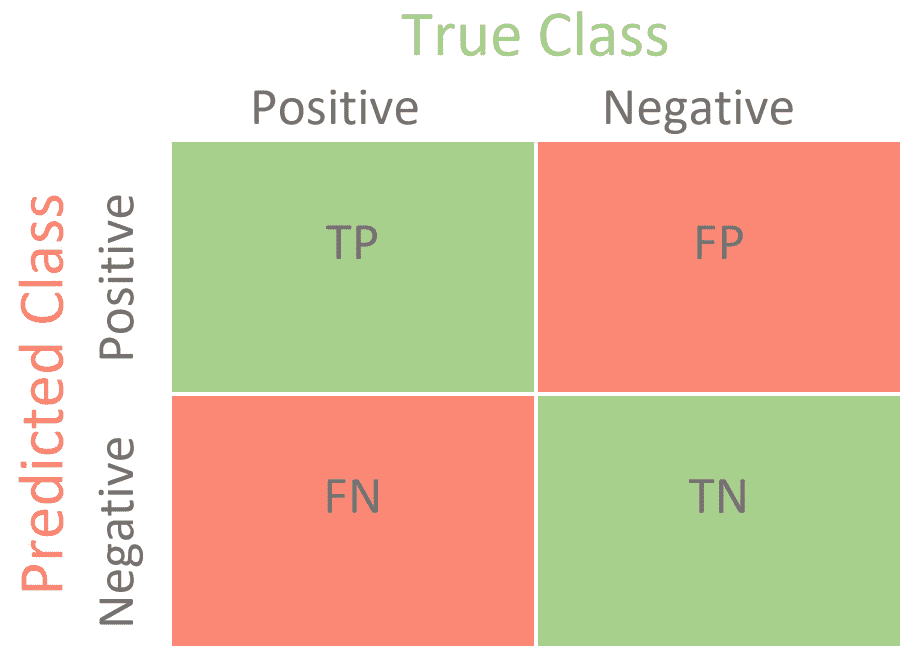
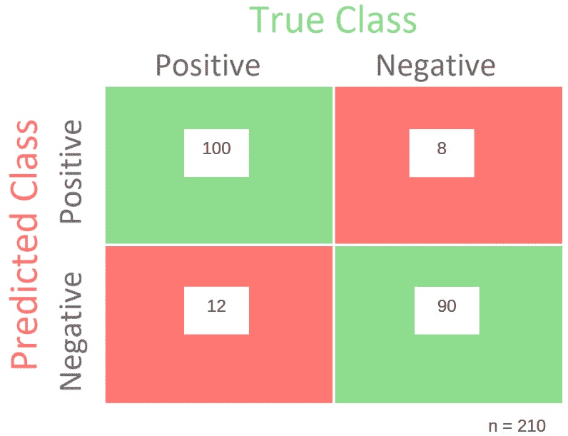
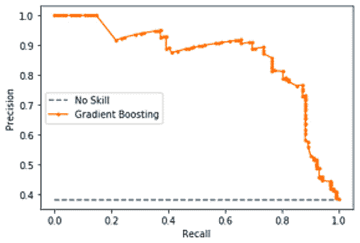
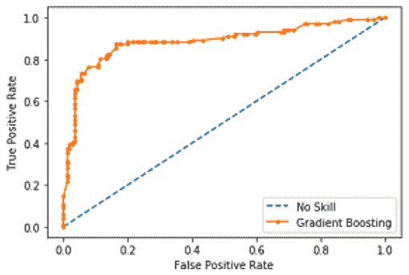
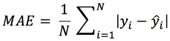
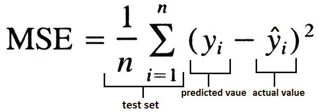
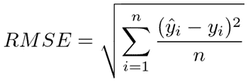
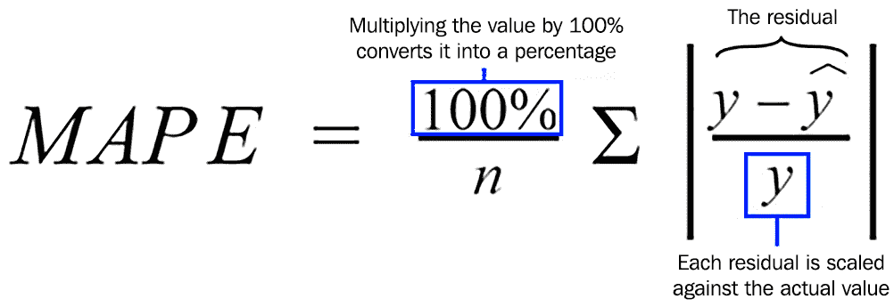
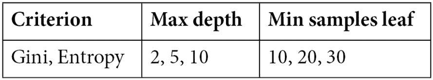

# *第八章*: 评估和优化模型

现在是时候学习如何评估和优化机器学习模型了。在建模过程中，甚至在模型完成后，你可能想要了解你的模型表现如何。每种类型的模型都有其自己的指标集，可以用来评估性能，这正是我们将在本章中研究的。

除了模型评估之外，作为数据科学家，你可能还需要通过调整算法的超参数来提高你的模型性能。我们将探讨这个建模任务的某些细微差别。

在本章中，我们将涵盖以下主题：

+   介绍模型评估

+   评估分类模型

+   评估回归模型

+   模型优化

好的，让我们开始吧！

# 介绍模型评估

有几种不同的场景，我们可能想要评估模型性能，以下是一些例子。

+   你正在创建一个模型并测试不同的方法和/或算法。因此，你需要比较这些模型以选择最佳模型。

+   你刚刚完成了你的模型，你需要记录你的工作，这包括在建模阶段指定你达到的模型性能指标。

+   你的模型正在生产环境中运行，你需要跟踪其性能。如果你遇到模型漂移，那么你可能想要重新训练模型。

    重要提示

    术语**模型漂移**用来指代模型退化的问题。当你构建机器学习模型时，你必须使用数据来训练算法。这组数据被称为训练数据，它反映了特定时间点的业务规则。如果这些业务规则随时间变化，你的模型可能无法适应这种变化。这是因为它是基于另一个数据集训练的，该数据集反映了另一个业务场景。为了解决这个问题，你必须重新训练模型，以便它可以考虑新业务场景的规则。强化学习系统可能不会遇到这个问题，因为它们可以自行适应新数据。

我们通过设计测试方法来进行模型评估。我们之前已经了解过保留验证和交叉验证。然而，这两种测试方法都有相同的要求：它们需要一个指标来评估性能。

这个指标是特定于问题域的，例如，对于回归模型、分类模型、聚类、自然语言处理等都有特定的指标。因此，在设计你的测试方法时，你必须考虑你正在构建哪种类型的模型，以便定义评估指标。

在以下章节中，我们将探讨你评估模型时应该了解的最重要指标和概念。

# 评估分类模型

分类模型是你可能会遇到的最传统的模型类别之一，无论是在考试中还是在作为数据科学家的旅程中。在分类模型评估期间你可能想要生成的一个重要工具被称为**混淆矩阵**。

混淆矩阵比较你的模型预测与每个评估类别的真实值。*图 8.1*展示了在二元分类问题中混淆矩阵的样子：

图 8.1 – 一个混淆矩阵

我们在混淆矩阵中找到了以下组成部分：

+   **TP**：这是**正确阳性**案例的数量。在这里，我们需要计算被预测为真且确实为真的案例数量。例如，在一个欺诈检测系统中，这将是被正确预测为欺诈的欺诈交易数量。

+   **TN**：这是**正确阴性**案例的数量。在这里，我们需要计算被预测为假且确实为假的案例数量。例如，在一个欺诈检测系统中，这将是被正确预测为非欺诈的非欺诈交易数量。

+   **FN**：这是**错误阴性**案例的数量。在这里，我们需要计算被预测为假但实际上是真的案例数量。例如，在一个欺诈检测系统中，这将是被错误预测为非欺诈的欺诈交易数量。

+   **FP**：这是**错误阳性**案例的数量。在这里，我们需要计算被预测为真但实际上是假的案例数量。例如，在一个欺诈检测系统中，这将是被错误预测为欺诈的非欺诈交易数量。

在一个完美的场景中，你的混淆矩阵将只有正确阳性和正确阴性案例，这意味着你的模型准确率为 100%。在实践中，如果发生这种情况，你应该持怀疑态度而不是高兴，因为预期你的模型将包含错误。如果你的模型不包含错误，你很可能是过度拟合问题，所以请小心。

一旦预期到错误阴性和错误阳性，你能做的最多就是优先考虑其中之一。例如，你可以通过增加错误阳性来减少错误阴性的数量，反之亦然。这被称为精确度与召回率的权衡。让我们接下来看看这些指标。

## 从混淆矩阵中提取指标

我们可以从混淆矩阵中提取的最简单指标被称为**准确率**。准确率是通过将正确阳性和正确阴性的数量除以总案例数量来计算的。在*图 8.2*中，我们为了演示的目的填写了混淆矩阵的所有组成部分：

图 8.2 – 填充了一些示例的混淆矩阵

根据图 8.2，准确率将是(100 + 90) / 210，等于 0.90。当使用准确率指标时，会出现一个常见问题，这与每个类别的平衡有关。高度不平衡的类别问题，例如 99%的正例和 1%的负例，将影响准确率分数并使其变得无用。

例如，如果你的训练数据有 99%的正例（多数类），你的模型很可能会正确分类大多数正例，但在负例（少数类）的分类上表现不佳。准确率将非常高（由于正例分类的正确性），无论少数类分类的结果如何。

关键在于在高度不平衡的问题上，我们通常对正确分类少数类而不是多数类更感兴趣。例如，在大多数欺诈检测系统中就是这种情况，少数类对应于欺诈案例。对于不平衡问题，你应该寻找其他类型的指标，我们将在下一节中介绍。

从混淆矩阵中我们可以提取的一个重要指标被称为**召回率**，它是真实正例数与真实正例数加上假负例数的比值。换句话说，召回率由真实正例数和总体正例数给出。召回率也被称为**灵敏度**。

根据图 8.2，召回率由 100 / 112 给出，等于 0.89。另一方面，**精确度**是由真实正例数与真实正例数加上假正例数的比值给出的。换句话说，精确度是由真实正例数和总体预测正例数给出的。精确度也被称为**阳性预测值**。

根据图 8.2，精确度由 100 / 108 给出，等于 0.93。一般来说，我们可以通过降低召回率来提高精确度，反之亦然。还有一个模型评估的伪指标，我们可以在这个精确度与召回率的权衡中玩转。它被称为**精确度-召回率曲线**。

精确度-召回率曲线通过使用不同的概率阈值来总结精确度与召回率的权衡。例如，默认阈值是 0.5，其中任何高于 0.5 的预测将被视为真；否则，它是假的。你可以根据你的需求更改默认阈值，以便你可以优先考虑召回率或精确度。*图 8.3*显示了精确度-召回率曲线的一个示例：

图 8.3 – 精确度-召回率曲线

正如你在*图 8.3*中看到的，提高精确率会减少召回量，反之亦然。*图 8.3*显示了梯度提升模型（由橙色线表示）的每个阈值与无技能模型（由蓝色虚线表示）的精确率/召回率进行比较。一个完美的模型将曲线近似到点（1,1），在图表的右上角形成一个平方角。

我们可以在混淆矩阵之上进行的另一种视觉分析被称为**受试者工作特征**（**ROC**）曲线。ROC 曲线根据不同的阈值总结了**真正例率**和**假正例率**之间的权衡，就像在精确率-召回率曲线中一样。

你已经了解了真正例率，或称为灵敏度，这与我们在精确率-召回率曲线中刚刚学习的内容相同。ROC 曲线的另一个维度是**假正例率**，它是假正例数除以假正例数加上真正例数。

在文献中，你可能会发现假正例率被称为倒置的**特异性**，表示为*1 – 特异性*。特异性给出的是真正例数除以真正例数加上假正例数。此外，假正例率或倒置的特异性是相同的。*图 8.4*显示了 ROC 曲线的形状：

图 8.4 – ROC 曲线

一个完美的模型将曲线近似到点（0,1），在图表的左上角形成一个平方角。橙色线代表梯度提升分类器的真正例率和假正例率之间的权衡。虚线蓝色线代表一个无技能模型，它无法正确预测类别。

总结一下，对于相当平衡的数据集，你可以使用 ROC 曲线，而对于适度到不平衡的数据集，则可以使用精确率-召回率曲线。

## 总结精确率和召回率

有时，我们可能想要使用一个总结精确率和召回率的度量，而不是优先考虑其中一个。两个非常流行的度量可以用来总结精确率和召回率：**F1 分数**和**曲线下面积**（**AUC**）。

F1 分数，也称为**F 度量**，计算精确率和召回率的调和平均值。AUC 总结了精确率-召回率曲线下的近似面积。

这就带我们来到了分类度量标准部分的结尾。现在让我们来看看回归模型的评估度量标准。

# 评估回归模型

回归模型与分类模型相当不同，因为模型的输出是一个连续的数字。因此，围绕回归模型的度量旨在监控实际值和预测值之间的差异。

检查预测值（*yhat*）与其实际值（*y*）之间差异的最简单方法是通过执行简单的减法操作，其中误差将等于*yhat – y*的绝对值。这个指标被称为**平均绝对误差**（**MAE**）。

由于我们通常必须评估每个预测的误差，*i*，我们必须取误差的平均值。以下公式显示了如何正式定义这个误差：

有时候，你可能想要对较大的误差进行惩罚，而不是较小的误差。为了实现这一点，你可以使用另一个指标，被称为**平均平方误差**（**MSE**）。MSE 将每个误差平方并返回平均值。

通过平方误差，MSE 将对较大的误差进行惩罚。以下公式显示了 MSE 是如何正式定义的：

MSE 存在一个潜在的解释问题。由于它必须计算平方误差，从业务角度来看，解释最终结果可能很困难。**均方根误差**（**RMSE**）通过取 MSE 的平方根来解决这个问题。以下是 RMSE 的方程式：

RMSE 可能是回归模型中最常用的指标，因为它既可以惩罚较大的误差，同时仍然容易解释。

## 探索其他回归指标

除了我们刚刚学到的那些之外，还有很多适合回归问题的指标。我们在这里可能无法涵盖它们中的大多数，但还有一些额外的指标可能对你来说很重要。

其中一个指标被称为**平均绝对百分比误差**（**MAPE**）。正如其名称所暗示的，MAPE 将计算每个预测的绝对百分比误差，然后取平均值。以下公式显示了该指标是如何计算的：

MAPE 在预测模型中得到广泛应用，因为它很容易解释，并且提供了关于预测值（从百分比的角度）与实际值之间距离（或接近程度）的良好感觉。

我们现在已经完成了关于回归指标的这一部分。接下来，我们将讨论模型优化。

# 模型优化

正如你所知，为了衡量你的模型性能和记录你的工作，理解评估指标非常重要。同样，当我们想要优化我们当前的模型时，评估指标在定义我们想要挑战的基线性能中也起着非常重要的作用。

模型优化的过程包括为特定数据分布找到机器学习算法的最佳配置（也称为超参数）。我们不希望找到过度拟合训练数据的超参数，就像我们不希望找到欠拟合训练数据的超参数一样。

你在*第一章*《机器学习基础》中学习了过拟合和欠拟合。在同一章中，你也学习了如何避免这两种建模问题。

在本节中，我们将了解一些你可以用来找到特定算法和数据集最佳配置的技术。你可以将这些模型优化技术与其他方法（如交叉验证）结合使用，以找到你模型的最佳超参数集，避免拟合问题。

重要提示

总是记住，你不想优化你的算法以适应底层的训练数据，而是要适应训练数据背后的数据分布。这样，你的模型将在训练数据以及生产数据（即在训练过程中从未暴露给模型的那些数据）上工作。只在训练数据上工作的机器学习模型是无用的。这就是为什么将模型调整技术（如我们接下来将要学习的）与采样技术（如交叉验证）结合起来，在创建一个好的模型时至关重要。

## 网格搜索

**网格搜索**可能是模型优化中最受欢迎的方法。它包括测试算法的不同组合并选择最佳组合。在这里，有两个重要点我们需要注意：

+   如何定义最佳模型？

+   我们应该测试多少种组合？

最佳模型是根据评估指标定义的。换句话说，你必须首先定义你将使用哪个指标来评估模型性能。其次，你必须定义你将如何评估模型。通常，我们使用交叉验证在多个从未用于训练的数据集上评估模型。

在组合数量方面，这是在玩网格搜索时最具挑战性的部分。一个算法的每个超参数可能有多个或有时是无限的可能值。如果你考虑到一个算法通常会有多个超参数，这将成为一个二次成本函数，其中要测试的唯一组合数（也称为测试模型）由*超参数 a 的值*乘以*超参数 b 的值*乘以*超参数 i 的值*给出。*图 8.5*展示了你可以如何设置决策树模型的网格搜索配置：

图 8.5 – 网格搜索配置

在*图 8.5*中，有三个超参数：**标准**、**最大深度**和**最小叶子节点样本数**。每个超参数都有一个用于测试的值列表：分别为 2、3 和 3 个值。这意味着，在网格搜索过程结束时，我们将测试 18 个模型（2 * 3 * 3），其中只有最佳模型将被选中。

如您可能已经注意到，这三个超参数的所有不同组合都将被测试，例如，考虑以下内容：

+   标准差 = Gini，最大深度 = 2，最小叶子样本数 = 10

+   标准差 = Gini，最大深度 = 5，最小叶子样本数 = 10

+   标准差 = Gini，最大深度 = 10，最小叶子样本数 = 10

您可能还想知道的其他问题可能包括以下内容：

+   考虑到某个特定的算法可能有几个超参数，我应该调整哪些？

+   考虑到某个特定的超参数可能接受无限值，我应该测试哪些值？

这些是很好的问题，网格搜索不会直接给出答案。相反，这更接近于一个经验过程，您必须测试足够多的内容以达到您的目标性能。

重要提示

当然，网格搜索不能保证您能达到目标性能。这取决于算法和训练数据。

然而，一个常见的做法是使用**线性空间**或**对数空间**来定义测试值，您可以在其中手动设置要测试的超参数的界限和测试值的数量。然后，中间值将通过线性或对数函数绘制。

如您所想象，网格搜索可能需要很长时间才能运行。已经提出了许多替代方法来解决这个问题。**随机搜索**就是其中之一，其中测试值的列表是从搜索空间中随机选择的。

在整个行业中迅速得到广泛采用的另一种方法是称为**贝叶斯优化**。算法优化，如**梯度下降**，试图通过计算成本函数的导数来找到所谓的**全局最小值**。全局最小值是您找到具有最低相关成本算法配置的点。

当计算导数不是一种选择时，贝叶斯优化是有用的。因此，我们可以使用**贝叶斯定理**，一种概率方法，通过使用最少的步骤来找到全局最小值。

在实际应用中，贝叶斯优化将从整个搜索空间开始测试，以找到最有希望的优化超参数集。然后，它将在全局最小值可能存在的特定位置进行更多测试。

# 摘要

在本章中，您学习了模型评估的主要指标。我们首先从分类问题的指标开始，然后转向回归问题的指标。

在分类指标方面，您已经了解了著名的混淆矩阵，这可能是对分类模型进行模型评估最重要的工具。

除了了解什么是真正例、真反例、假正例和假反例外，我们还学习了如何将这些组件组合起来以提取其他指标，例如准确率、精确率、召回率、F1 分数和 AUC。

我们进一步深入学习了 ROC 曲线以及精确度-召回率曲线。我们了解到，我们可以使用 ROC 曲线来评估相对平衡的数据集，而使用精确度-召回率曲线来评估适度到不平衡的数据集。

顺便说一句，当你处理不平衡数据集时，请记住使用准确率可能不是一个好主意。

在回归指标方面，我们了解到最流行且最可能在*AWS 机器学习专业考试*中出现的指标是 MAE、MSE、RMSE 和 MAPE。在参加考试之前，确保你了解它们的基本知识。

最后，你学习了超参数优化的方法，其中网格搜索和贝叶斯优化是主要方法。在下一章中，我们将探讨 SageMaker，并学习如何将其用于建模。但首先，让我们花点时间练习这些关于模型评估和模型优化的问题。

# 问题

1.  你正在一家制药公司担任数据科学家，与其他团队成员合作创建一个机器学习模型，用于在图像检查中分类某些类型的疾病。公司希望优先考虑正例的确定性率，即使他们必须错误地返回假阴性。你会使用哪种类型的指标来优化底层模型？

    a. 召回率

    b. 精确度

    c. R-squared

    d. RMSE

    答案

    在这个场景中，公司更倾向于以将一些正例错误分类为负例为代价，提高正确预测正例的概率。技术上，他们更倾向于提高精确度，而牺牲召回率。

1.  你正在一家制药公司担任数据科学家，与其他团队成员合作创建一个机器学习模型，用于在图像检查中分类某些类型的疾病。公司希望优先考虑捕获正例，即使他们必须错误地返回假阳性。你会使用哪种类型的指标来优化底层模型？

    a. 召回率

    b. 精确度

    c. R-squared

    d. RMSE

    答案

    在这个场景中，公司更倾向于找到大多数正例，而以将一些负例错误分类为正例为代价。技术上，他们更倾向于提高召回率，而牺牲精确度。

1.  你正在一个欺诈识别系统中工作，其中一个组件是分类模型。你想检查模型的表现。以下哪些指标可以使用，为什么？

    a. 准确度。由于欺诈系统数据集自然是不平衡的，这个指标有助于考虑正负类的确定性。

    b. 精确度。由于欺诈系统数据集自然是不平衡的，这个指标有助于考虑正负类的确定性。

    c. 召回率。由于欺诈系统数据集自然不平衡，这个指标有助于考虑正负类的积极性。

    d. F1 分数。由于欺诈系统数据集自然不平衡，这个指标有助于考虑正负类的积极性。

    答案

    选项“d”是唯一一个与所提出指标的解释相匹配并提供对问题有效度量的选项。由于不平衡问题，准确性不能用于这个问题。精确度和召回率可以潜在地一起使用，以提供对问题的质量视图，但在答案列表中没有这样的选项。

1.  你正在构建一个机器学习模型来预测房价。你将这个问题作为一个回归模型来处理。以下哪个指标不适用于回归模型？（选择所有正确答案。）

    a. 召回率

    b. 精确度

    c. MAPE

    d. RMSE

    答案

    召回率和精确度适用于分类问题；这就是它们是正确答案的原因。另一方面，MAPE 和 RMSE 适用于回归模型。

1.  以下哪个指标有助于我们在回归模型上惩罚较大误差？

    a. 召回率

    b. 精确度

    c. MAPE

    d. RMSE

    答案

    RMSE 计算每个预测的平方误差。然后，它取 MSE 的平方根。通过计算平方误差，RMSE 会对较大误差进行惩罚，而较小误差则不会。

1.  你正在为一家金融服务公司担任数据科学家，并创建了一个回归模型来预测信用利用率。如果你决定在模型中包含更多特征，R-squared 和调整后的 R-squared 会发生什么变化？

    a. 调整后的 R-squared 会增加，而 R-squared 可能增加或减少。

    b. R-squared 会减少，而调整后的 R-squared 可能增加或减少。

    c. R-squared 会增加，而调整后的 R-squared 可能增加或减少。

    d. 调整后的 R-squared 会减少，而 R-squared 可能增加或减少。

    答案

    由于额外信息将帮助模型捕捉到数据中的更多变异性，因此 R-squared 会增加。然而，调整后的 R-squared 可能增加或减少，这取决于添加额外变量的收益。

1.  以下哪个指标将计算错误百分比而不是绝对误差？

    a. 召回率

    b. 精确度

    c. MAPE

    d. RMSE

    答案

    MAPE 适用于回归模型，并且将以百分比数字计算误差。

1.  你是公司的首席数据科学家。你的团队想要优化一个在生产中不再表现良好的模型。团队已经决定使用网格搜索来重新训练超参数；然而，这个过程花费了很长时间并且没有完成。你可以采取什么方法来加快调整过程，同时最大限度地提高找到更好模型的机会？

    a) 减少搜索空间以加快训练过程。

    b) 使用贝叶斯优化而不是网格搜索。

    c) 增加搜索空间以加快训练过程。

    d) 以上皆非。

    答案

    减少网格搜索的搜索空间将有助于加快调整过程，但你将测试 fewer models。这将减少你找到最佳模型的机会。增加搜索空间将增加调整所需的时间。选项 "b" 是最可重用的，因为贝叶斯优化可以专注于最重要的搜索空间，从而可能减少处理时间并增加你找到最佳模型的机会。

1.  你正在使用网格搜索调整机器学习模型。在调整过程中，你获得了良好的性能指标。然而，当你将模型在生产环境中执行时，模型性能不可接受。你必须解决问题。以下哪些选项是此问题的有效原因？（选择所有正确答案。）

    a) 你正在训练数据中调整和评估模型，这导致了过度拟合。

    b) 生产数据与训练数据不具有相同的分布。

    c) 你在训练过程中没有使用交叉验证。

    d) 你没有调整正确的超参数。

    答案

    你不能在同一个数据集上调整和测试模型，以免过度拟合。这就是为什么选项 "a" 是正确的。如果生产数据不遵循训练数据的相同分布，则模型将无法工作，因此选项 "b" 也是正确的。选项 "c" 是无效的，因为交叉验证不是模型评估的强制性要求。如果发现在训练数据中发现不良结果，而不是在生产数据中，则选项 "d" 将是正确的。

1.  你在一家全球金融公司工作。你的团队创建了一个二元分类模型来识别欺诈交易。该模型已投入生产，并自动标记欺诈交易并将它们发送进行进一步筛选。操作团队抱怨这个模型阻止了太多的交易，他们更希望标记更少的交易。根据前面的场景，操作团队有什么期望？

    a) 他们希望将模型阈值校准在 0.5。

    b) 他们希望优先考虑精确度而不是召回率。

    b) 他们希望优先考虑召回率而不是精确度。

    b) 他们希望使用 F-measure。

    答案

    我们总是需要将模型的使用与业务目标和能力相匹配。在这种情况下，模型正在标记大量潜在的欺诈交易，但并没有足够的人力资源来评估所有这些被阻止的交易。此外，更有意义的是将模型“校准”到实际业务场景中，在那里它将标记更少（但更有可能）的欺诈案例以进行进一步筛选。
