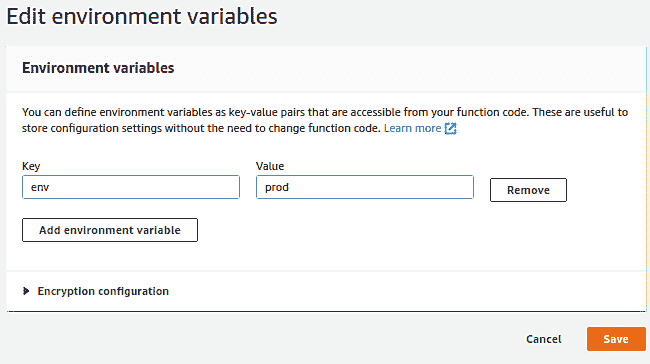
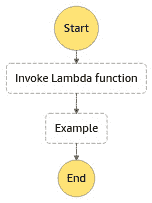

# *第九章*：Amazon SageMaker 建模

在上一章中，我们学习了多种模型优化和评估技术的方法。我们还学习了各种存储数据、处理数据和将不同的统计方法应用于数据的方式。那么，我们如何现在构建一个管道呢？嗯，我们可以读取数据、处理数据，并在处理后的数据上构建机器学习模型。但如果我的第一个机器学习模型表现不佳怎么办？我能微调我的模型吗？答案是*是的*；你可以使用 Amazon SageMaker 执行几乎所有操作。在本章中，我们将使用 Amazon SageMaker 带您了解以下主题：

+   理解 Amazon SageMaker 的不同实例

+   在 Amazon SageMaker 的 Jupyter Notebook 中清理和准备数据

+   在 Amazon SageMaker 中进行模型训练

+   使用 SageMaker 内置的机器学习算法

+   在 SageMaker 中编写自定义训练和推理代码

# 技术要求

你可以从 GitHub 下载本章示例中使用的数据，链接为[`github.com/PacktPublishing/AWS-Certified-Machine-Learning-Specialty-MLS-C01-Certification-Guide/tree/master/Chapter-9`](https://github.com/PacktPublishing/AWS-Certified-Machine-Learning-Specialty-MLS-C01-Certification-Guide/tree/master/Chapter-9)。

# 在 Amazon SageMaker 中创建笔记本

如果你从事机器学习工作，那么你需要执行诸如存储数据、处理数据、准备数据用于模型训练、模型训练以及将模型部署用于推理等操作。这些操作并不容易，每个阶段都需要机器来完成这些任务。使用 Amazon SageMaker，执行这些步骤时生活变得更加简单。

## 什么是 Amazon SageMaker？

SageMaker 提供训练实例来使用数据训练模型，并提供端点实例来使用模型进行推理。它还提供笔记本实例，运行 Jupyter Notebook，以清理和理解数据。如果你对你的清理过程满意，那么你应该将它们存储在 S3 中，作为训练的预置部分。你可以启动训练实例来消耗这些训练数据并生成机器学习模型。机器学习模型可以存储在 S3 中，端点实例可以消耗模型为最终用户提供结果。

如果你将其绘制成框图，那么它将看起来类似于*图 9.1*：


图 9.1 – Amazon SageMaker 实例不同层的图示

现在，让我们来看看 Amazon SageMaker 控制台，并更好地了解它。一旦你登录到你的 AWS 账户并进入 Amazon SageMaker，你会看到类似于*图 9.2*的内容：


图 9.2 – 快速查看 SageMaker 控制台

文档分为三个不同的部分，包括**笔记本**、**训练**和**推理**，这些部分在*图 9.2*中进行了扩展，以便我们能够深入理解。

**笔记本**有三个不同的选项可供使用：

+   **笔记本实例**：这有助于我们创建、打开、启动和停止笔记本实例。这些实例负责运行 Jupyter 笔记本。它们允许我们根据用例的工作负载选择实例类型。最佳实践是使用笔记本实例来编排处理大型数据集的数据管道。例如，从笔记本实例调用 AWS Glue 进行 ETL 服务或 Amazon EMR 运行 Spark 应用程序。如果你被要求在 AWS 外部创建一个安全的笔记本实例，那么你需要注意端点安全、网络安全、启动机器、管理实例上的存储以及管理实例上运行的 Jupyter Notebook 应用程序。用户不需要使用 SageMaker 管理任何这些。

+   `pip install`或`conda install`。然而，一旦笔记本实例终止，自定义设置就会丢失。为了避免这种情况，你可以通过`/home/ec2-user/anaconda3/envs/`提供的脚本来自定义笔记本实例，并根据需要自定义特定环境。

+   **Git 仓库**：AWS CodeCommit、GitHub 或任何其他 Git 服务器都可以与笔记本实例关联，以便持久化你的笔记本。如果提供了访问权限，则其他开发者可以使用相同的笔记本进行协作并以源控制方式保存。Git 仓库可以通过此选项单独添加，或者可以在创建笔记本实例时与之关联。

如你在*图 9.2*中看到的，**训练**提供了**算法**、**训练作业**和**超参数调整作业**。让我们了解它们的用法：

+   **算法**：这是决定在清洗后的数据上运行算法的第一步。你可以选择一个自定义算法，或者根据用例创建一个自定义算法。否则，你可以在清洗后的数据上运行 SageMaker 算法。

+   **训练作业**：你可以通过 API 调用从笔记本实例创建训练作业。你可以设置实例数量，输入数据源详细信息，执行检查点配置，以及输出数据配置。Amazon SageMaker 管理训练实例，并将模型工件作为输出存储在指定的位置。既可以实现增量训练（即，为了获得更好的结果而定期训练模型），也可以实现托管 Spot 训练（即，为了降低成本）。

+   **超参数调整工作**：通常，在训练过程之前，算法的超参数被设置好。在训练过程中，我们让算法找出这些参数的最佳值。通过超参数调整，我们可以获得具有最佳超参数值的最佳模型。这可以通过控制台或通过 API 调用完成。同样，也可以从笔记本实例中执行。

**推理**提供了许多服务，并且每天都在不断发展：

+   **编译工作**：如果你的模型使用 Keras、MXNet、ONNX、PyTorch、TFLite、TensorFlow 或 XGBoost 等机器学习框架进行训练，并且你的模型工件存储在 S3 桶中，那么你可以选择**目标设备**或**目标平台**。目标设备用于部署你的模型，例如 AWS SageMaker 机器学习实例或 AWS IoT Greengrass 设备。目标平台用于确定你希望模型运行的操作系统、架构和加速器。你还可以将编译模块存储在你的 S3 桶中，以供将来使用。这实际上有助于你在跨平台模型部署中。

+   **模型包**：这些用于创建可部署的 SageMaker 模型。你可以创建自己的算法，使用模型包 API 打包它，并将其发布到 AWS Marketplace。

+   **模型**：模型是通过模型工件创建的。它们类似于带有变量的数学方程式；也就是说，你输入变量的值，得到一个输出。这些模型存储在 S3 中，并将由端点用于推理。

+   `VariantWeight` API 可以使端点用旧模型处理 80%的请求，用新模型处理 20%的请求。这是数据变化迅速且模型需要定期训练和调整的最常见生产场景。另一个可能的用例是使用实时数据测试模型结果，然后可以将一定比例的请求路由到新模型，并监控结果以验证模型在实时未见数据上的准确性。

+   **端点**：这些用于创建一个 URL，模型可以通过该 URL 暴露并请求模型结果作为响应。

+   `InputFilter`、`JoinSource`、`OutputFilter` API 可以用来关联输入记录与输出结果。

现在，我们已经对 Amazon SageMaker 有了概述。让我们在下一节中将我们的知识付诸实践。

重要注意事项

Amazon SageMaker 控制台在不断变化。有可能在你阅读这本书的时候，控制台的外观可能有所不同。

## 在 Amazon SageMaker 笔记本实例上动手实践

在本节中，第一步是创建一个 Jupyter Notebook，这需要一个笔记本实例。让我们首先创建一个笔记本实例，如下所示：

1.  登录您的 AWS 账户。

1.  导航到 **服务** > **Amazon SageMaker**。

1.  在左侧导航面板中，点击 **笔记本实例**，然后点击 **创建笔记本实例** 按钮。

1.  提供一个 `notebookinstance` 并保留 `ml.t2.medium` 设置。在 **IAM 角色** 的 **创建新角色** 中。您将被要求指定存储桶名称。为了本例的目的，它被选为任何存储桶。

1.  在角色成功创建后，您应该看到类似于 *图 9.3* 的内容：

    图 9.3 – Amazon SageMaker 角色创建

1.  将其他所有设置保留为默认值，然后点击 **创建笔记本实例** 按钮。

1.  一旦实例处于 `InService` 状态，选择实例。点击 **操作** 下拉菜单并选择 **打开 Jupyter**。这将打开您的 Jupyter Notebook。

1.  现在，我们已经准备好在新建的实例上运行我们的 Jupyter Notebook。我们将执行 **探索性数据分析** (**EDA**) 并绘制不同类型的图表来可视化数据。一旦我们熟悉了 Jupyter Notebook，我们将构建一些模型来预测波士顿的房价。我们将应用之前章节中学到的算法，并将它们进行比较，以找到根据我们的数据提供最佳预测的最佳模型。让我们开始吧。

1.  在 Jupyter Notebook 中，点击 **新建** 并选择 **终端**。在命令提示符中运行以下命令以将代码下载到实例：

    ```py
    sh-4.2$ cd ~/SageMaker/
    sh-4.2$ git clone https://github.com/PacktPublishing/AWS-Certified-Machine-Learning-Specialty-MLS-C01-Certification-Guide.git
    ```

1.  一旦 Git 仓库被克隆到 SageMaker 笔记本实例，在命令提示符中输入 `exit` 以退出。现在，您的代码已准备好执行。

1.  在 Jupyter Notebook 的 **文件** 部分导航到 `Chapter-9`，如图 *9.4* 所示：

    图 9.4 – Jupyter Notebook

1.  点击 *1.* 中的第一个笔记本 `Boston-House-Price-SageMaker-Notebook-Instance-Example.ipynb`。它将提示您选择笔记本的内核。请选择 `conda_python3`，如图 *9.5* 所示：

    图 9.5 – Jupyter Notebook 内核选择

1.  从笔记本中导航到 **内核** > **重启 & 清除输出**。点击播放图标依次运行单元格。请确保您已运行每个单独的单元格并检查每个执行/运行的输出。

1.  您可以通过添加和删除单元格来实验，以便熟悉 Jupyter Notebook 的操作。在其中一个段落中，有一个 bash 命令允许您从笔记本中安装 `xgboost` 库。

1.  最后一个单元格解释了我们是怎样比较不同建模技术的不同分数来得出数学结论的。*图 9.6* 清楚地显示了预测波士顿房价的最佳模型是 XGBoost：

    图 9.6 – 比较模型

1.  一旦您完成此笔记本的执行，请随时从 SageMaker 控制台关闭内核并停止您的笔记本实例。这是节省成本的最佳实践。

在下一节的实际操作中，我们将熟悉 Amazon SageMaker 的训练和推理实例。我们还将使用 Amazon SageMaker API 使此过程更简单。我们将使用与之前示例相同的笔记本实例。

## 亲身体验 Amazon SageMaker 的训练和推理实例

在本节中，我们将学习如何训练模型并将模型托管以生成预测结果。让我们通过使用之前示例中的笔记本实例来深入了解：

1.  在 [`console.aws.amazon.com/sagemaker/home?region=us-east-1#/notebook-instances`](https://console.aws.amazon.com/sagemaker/home?region=us-east-1#/notebook-instances) 登录您的 AWS 账户。

1.  点击 `InService`，在新标签页中打开它，如图 *图 9.7* 所示：![图 9.7 – InService 实例

    ![图片 B16735_09_07.jpg]

    图 9.7 – InService 实例

1.  在 Jupyter Notebook 主页中导航到名为 SageMaker 示例的标签页。

1.  选择 `k_nearest_neighbors_covtype.ipynb` 笔记本。点击 **使用** 并创建一个副本。

1.  当您运行以下段落，如图 n *图 9.8* 所示时，您还可以在 SageMaker 主页的 **训练** > **训练作业** 中检查一个训练作业：![图 9.8 – SageMaker fit API 调用

    ![图片 B16735_09_08.jpg]

    图 9.8 – SageMaker fit API 调用

1.  训练作业看起来类似于 *图 9.9*。它在后端启动一个 ECS 容器，并使用在先前的示例中创建的 IAM 执行角色为此请求运行训练作业：![图 9.9 – 训练 obs

    ![图片 B16735_09_09.jpg]

    图 9.9 – 训练 obs

1.  如果您进入并检查 CloudWatch 中的日志，它会为您提供有关容器及其执行步骤的更多详细信息。作为一名机器学习工程师，进入并检查 CloudWatch 的 Algorithm 指标是值得的。

1.  现在，如果您在笔记本中运行以下段落，如图 *图 9.10* 所示，那么它将创建一个端点配置和一个端点，其中部署了早期训练作业中的模型。

1.  我已将实例类型更改为节省成本。这是将托管您的模型的实例或机器。请明智地选择您的实例。我们将在下一节中学习如何选择实例类型。我还已更改 `endpoint_name` 以便易于识别：![图 9.10 – 使用端点详细信息创建预测对象

    ![图片 B16735_09_010.jpg]

    图 9.10 – 使用端点详细信息创建预测对象

1.  导航到 **推理** > **端点**。这将显示由上一段执行创建的端点。此端点具有配置，可以通过 **推理** > **端点配置** 进行导航和跟踪。

1.  如果您在笔记本中查看**推理**部分，您会注意到它使用测试数据来预测结果。它使用 SageMaker API 的预测器对象进行预测。预测器对象包含端点详情、模型名称和实例类型。

1.  端点的 API 调用发生在**推理**部分，并且通过创建笔记本实例时使用的 IAM 角色进行身份验证。相同的 API 调用可以通过 CloudWatch 调用指标进行追踪。

1.  最后，在笔记本中运行`delete_endpoint`方法将删除端点。要删除端点配置，请导航到**推理** > **端点配置**并选择屏幕上的配置。点击**操作** > **删除** > **删除**。

1.  现在，请随意关闭内核并从 SageMaker 控制台停止您的笔记本实例。这是节省成本的最佳实践。

在本节中，我们学习了如何使用笔记本实例、训练实例、推理端点和端点配置来清理我们的数据、训练模型以及从它们生成预测结果。在下一节中，我们将学习模型调整。

# 模型调整

在*第八章*，“评估和优化模型”，您学习了关于模型调整的许多重要概念。现在，让我们从实际的角度来探讨这个话题。

为了在 SageMaker 上调整模型，我们必须调用`create_hyper_parameter_tuning_job`并传递以下主要参数：

+   `HyperParameterTuningJobName`: 这是调整作业的名称。这对于跟踪代表您的调整作业已启动的训练作业很有用。

+   `HyperParameterTuningJobConfig`: 在这里，您可以配置您的调整选项。例如，您想要调整哪些参数，它们的值范围，优化的类型（例如随机搜索或贝叶斯搜索），您想要启动的最大训练作业数量，等等。

+   `TrainingJobDefinition`: 在这里，您可以配置您的训练作业。例如，数据通道、输出位置、资源配置、评估指标和停止条件。

在 SageMaker 中，我们想要用来评估模型并选择最佳模型的主要指标被称为**目标指标**。

在以下示例中，我们正在为基于决策树的算法配置`HyperParameterTuningJobConfig`。我们想要检查**max_depth**超参数的最佳配置，该参数负责控制树的深度。

在`IntegerParameterRanges`中，我们必须指定以下内容：

+   超参数名称

+   我们想要测试的最小值

+   我们想要测试的最大值

    重要注意事项

    每种超参数类型必须适合参数范围部分之一，例如分类、连续或整数参数。

在 `ResourceLimits` 中，我们指定了要运行的训练作业数量以及并行作业的数量。请记住，调优过程的目标是执行具有不同超参数设置的多个训练作业，以便从中选择最佳的一个用于最终模型。这就是为什么我们必须指定这些训练作业执行规则。

我们然后在 `Strategy` 中设置我们的搜索策略，最后在 `HyperParameterTuningJobObjective` 中设置目标函数：

```py
tuning_job_config = {
    "ParameterRanges": {
      "CategoricalParameterRanges": [],
      "ContinuousParameterRanges": [],
      "IntegerParameterRanges": [
        {
          "MaxValue": "10",
          "MinValue": "1",
          "Name": "max_depth"
        }
      ]
    },
    "ResourceLimits": {
      "MaxNumberOfTrainingJobs": 10,
      "MaxParallelTrainingJobs": 2
    },
    "Strategy": "Bayesian",
    "HyperParameterTuningJobObjective": {
      "MetricName": "validation:auc",
      "Type": "Maximize"
    }
  }
```

我们需要设置的第二个重要配置是 `TrainingJobDefinition`。在这里，我们必须指定将要执行的训练作业的所有详细信息。最重要的设置之一是 `TrainingImage` 设置，它指的是将启动以执行训练过程的容器。正如预期的那样，这个容器必须实现你的训练算法。

这里，我们提供了一个内置算法的示例，**eXtreme Gradient Boosting**，以便你可以按照以下方式设置训练镜像：

```py
training_image = sagemaker.image_uris.retrieve('xgboost', region, '1.0-1')
```

然后，你可以继续设置你的训练定义：

```py
training_job_definition = {
    "AlgorithmSpecification": {
      "TrainingImage": training_image,
      "TrainingInputMode": "File"
    },
```

接下来，我们必须指定数据输入配置，这通常称为数据通道。在下面的代码部分，我们正在设置两个数据通道 – 训练和验证：

```py
    "InputDataConfig": [
      {
        "ChannelName": "train",
        "CompressionType": "None",
        "ContentType": "csv",
        "DataSource": {
          "S3DataSource": {
            "S3DataDistributionType": "FullyReplicated",
            "S3DataType": "S3Prefix",
            "S3Uri": s3_input_train
          }
        }
      },
      {
        "ChannelName": "validation",
        "CompressionType": "None",
        "ContentType": "csv",
        "DataSource": {
          "S3DataSource": {
            "S3DataDistributionType": "FullyReplicated",
            "S3DataType": "S3Prefix",
            "S3Uri": s3_input_validation
          }
        }
      }
    ],
```

我们还需要指定结果将存储的位置：

```py
    "OutputDataConfig": {
      "S3OutputPath": "s3://{}/{}/output".format(bucket,prefix)
    },
```

最后，我们设置了资源配置、角色、静态参数和停止条件。在下面的代码部分，我们想要使用两个类型为 `ml.c4.2xlarge` 且具有 10 GB 存储的实例：

```py
    "ResourceConfig": {
      "InstanceCount": 2,
      "InstanceType": "ml.c4.2xlarge",
      "VolumeSizeInGB": 10
    },
    "RoleArn": <<your_role_name>>,
    "StaticHyperParameters": {
      "eval_metric": "auc",
      "num_round": "100",
      "objective": "binary:logistic",
      "rate_drop": "0.3",
      "tweedie_variance_power": "1.4"
    },
    "StoppingCondition": {
      "MaxRuntimeInSeconds": 43200
    }
}
```

重要提示

请注意，我们在这个配置文件中使用了其他变量，`bucket` 和 `prefix`，分别应该替换为你的存储桶名称和前缀键（如果需要）。我们还引用了 `s3_input_train` 和 `s3_input_validation`，这两个变量指向 S3 中的训练和验证数据集。

一旦你设置了配置，你就可以启动调优过程：

```py
smclient.create_hyper_parameter_tuning_job(
     HyperParameterTuningJobName = "my-tuning-example",
     HyperParameterTuningJobConfig = tuning_job_config,
     TrainingJobDefinition = training_job_definition
)
```

接下来，让我们了解一下如何跟踪此过程的执行。

## 跟踪训练作业和选择最佳模型

一旦你开始了调优过程，你可能还想检查两个额外的步骤：跟踪调优过程和选择最佳模型（即具有最佳超参数集的模型）。

为了找到你的训练作业，你应该前往 SageMaker 控制台，导航到 **超参数训练作业**。然后，你会找到一个已执行调优作业的列表，包括你的作业：

![图 9.11 – 找到你的调优作业

![img/B16735_09_011.jpg]

图 9.11 – 找到你的调优作业

如果你通过点击其名称访问你的调优作业，你将找到一个摘要页面，其中包含有关调优过程的最相关信息。在 **训练作业** 选项卡下，你会看到所有已执行的训练作业：

![图 9.12 – 调优过程中的训练作业摘要

![img/B16735_09_012.jpg]

图 9.12 – 调优过程中训练作业的总结

最后，如果你点击**最佳训练作业**标签页，你将找到适合你模型的最佳超参数集，包括一个方便的按钮，可以根据刚刚找到的最佳超参数创建一个新模型：


]

图 9.13 – 寻找最佳超参数集

如您所见，SageMaker 非常直观，一旦你了解了模型优化的主要概念，使用 SageMaker 应该会更容易。到目前为止，我们已经了解了如何根据我们的特定需求使用 SageMaker。在下一节中，我们将探讨如何为各种用例选择实例类型以及笔记本的安全性。

# 在 Amazon SageMaker 中选择实例类型

SageMaker 是一种按使用付费的模式。它没有最低费用。

当我们考虑 SageMaker 上的实例时，一切始于一个 EC2 实例。这个实例负责你所有的处理。这是一个托管的 EC2 实例。这些实例不会出现在 EC2 控制台中，也不能通过 SSH 访问。实例类型以 `ml` 开头。

SageMaker 提供以下系列的实例：

+   **t** 系列族：这是一个可扩展 CPU 系列。使用这个系列，你得到正常的 CPU 和内存比例。这意味着如果你有一个长时间运行的训练作业，那么随着时间的推移，由于你花费了 CPU 信用额度，你的性能会下降。如果你有非常小的作业，那么它们是成本效益的。例如，如果你想启动一个笔记本实例来运行训练作业，那么这个系列是最相关和成本效益的。

+   **m** 系列族：在之前的系列中，我们看到了由于它们的可扩展性，CPU 信用额度消耗得更快。如果你有一个需要恒定吞吐量的长时间运行的机器学习作业，那么这就是正确的系列。它提供了与 **t** 系列类似的 CPU 和内存比例。

+   **r** 系列族：这是一个内存优化的系列族。*我们何时需要这个？* 好吧，想象一个需要将数据加载到内存中并对数据进行一些数据工程用例。在这种情况下，你需要更多的内存，你的工作将是内存优化的。

+   **c** 系列族：**c** 系列实例是计算优化的。这是需要更高计算能力和较少内存来存储数据的工作的要求。如果你参考以下表格，C5.2x large 有 8 个 vCPU 和 16 GiB 内存，这使得它具有较少内存的计算优化。例如，一个用例需要在较少的记录上进行测试，并且它很擅长计算，那么这个实例系列就是从巨大的数据框中获取一些样本记录并测试你的算法的最佳选择。

+   **p**系列：这是一个支持加速计算作业（如训练和推理）的 GPU 系列。值得注意的是，**p**系列实例非常适合处理大型、分布式训练作业，这导致训练时间减少。因此，这变得具有成本效益。P3/P3dn GPU 计算实例的每秒计算能力可达 1 petaFLOP，配备高达 256 GB 的 GPU 内存和 100 Gbps（千兆比特）的联网速度，使用 8x NVIDIA v100 GPU。它们高度优化于训练，并不完全用于推理。

+   **g**系列：对于成本效益高、小规模训练作业，**g**系列 GPU 实例是理想的。G4 具有 GPU 实例中最低的推理成本。它使用 T4 NVIDIA GPU。G4 GPU 计算实例的算力可达 520 万亿次，配备 8x NVIDIA T4 GPU。这个实例系列最适合简单网络。

在以下表格中，每个系列都选取了 2x 大型实例类型，以便于比较 CPU 和内存比率：

![Table 9.1 – A table showing the CPU and memory ratio of different instance types]

![img/B16735_09_Table_1.jpg]

表 9.1 – 一个显示不同实例类型 CPU 和内存比率的表格

重要提示

为了便于记忆，你可以将 T 视为 Tiny（小型），M 视为 Medium（中型），C 视为 Compute（计算），P 和 G 视为 GPU。CPU 系列实例类型是 T、M、R 和 C。GPU 系列实例类型是 P 和 G。

## 选择训练作业的正确实例类型

没有决定所需实例类型的经验法则。它根据数据的大小、网络的复杂性、机器学习算法以及时间、成本等其他因素而变化。提出正确的问题将节省金钱并使其具有成本效益。

如果决定因素是*实例大小*，那么将问题分类为 CPU 或 GPU 是正确的步骤。一旦这样做，那么考虑是否可以多 GPU 或多 CPU 就很好了。这将解决你的分布式训练问题。这也解决了你的*实例数量*因素。如果是计算密集型，那么检查内存需求也是明智的。

下一个决定因素是*实例系列*。这里正确的问题应该是，“它是为了时间和成本优化的吗？”在前一步中，我们已经确定了要解决的问题是在 CPU 还是 GPU 上，这缩小了选择过程。现在，让我们了解推理作业。

## 选择推理作业的正确实例类型

在生产中，机器学习的成本和复杂性主要在于推理。通常，推理在实时运行单个输入。它们通常计算/内存密集度较低。由于它们一直运行并服务于最终用户请求或作为应用程序的一部分集成，因此它们必须高度可用。

您可以根据工作负载选择我们最近了解到的任何实例类型。除此之外，AWS 还提供**Inf1**和**Elastic Inference**类型的实例用于推理。Elastic Inference 允许您将 GPU 实例的一部分附加到任何 CPU 实例上。

让我们看看一个示例，其中应用程序与推理作业集成，那么应用程序对 CPU 和内存的需求与推理作业不同。对于这些用例，您需要选择正确的实例类型和大小。在这种情况下，在您的应用程序集群和推理集群之间保持分离是好的。这可能需要一些管理。如果这种管理对您的需求来说是个问题，那么选择弹性推理，其中应用程序和推理作业可以放置在一起。这意味着您可以在同一集群上托管多个模型，并且您可以在内存中的不同加速器上加载所有这些不同的模型，并且可以同时处理并发请求。

在决定生产环境中的实例类型和家族之前，始终建议您在较低的环境中运行一些示例。在下一节中，我们将深入了解并理解保护我们的 Amazon SageMaker 笔记本的不同方法。

# 保护 SageMaker 笔记本

如果您正在阅读本章的这一部分，那么您已经学习了如何使用笔记本实例，应该选择哪种类型的训练实例，以及如何配置和使用端点。现在，让我们学习如何保护这些实例。以下方面将有助于保护实例：

+   **加密**：当我们说或想到通过加密来保护时，这完全是关于数据。但这意味着什么？这意味着使用加密保护静态数据，使用加密保护传输中的数据，并使用 KMS 通过 TLS 1.2 加密更好地进行角色分离和互联网流量隐私。可以使用 AWS 管理的 KMS 密钥启动加密卷的 SageMaker 实例。这有助于您默认保护 Jupyter Notebook 服务器。

+   当您调用`CreateNotebookInstance`或`UpdateNotebookInstance`时，将`RootAccess`字段设置为`Disabled`。数据科学家将能够访问他们的用户空间并安装 Python 包。然而，他们不能 sudo 进入 root 用户并更改操作系统。

+   **IAM 角色**：在启动笔记本实例时，创建一个 IAM 角色用于执行或使用现有的角色进行执行是必要的。这用于启动与角色关联的实例配置文件的服务管理 EC2 实例。此角色将根据附加到该角色的策略限制 API 调用。

+   **VPC 连接**：当您启动 SageMaker 笔记本实例时，默认情况下，它将在 SageMaker 服务账户中创建，该账户拥有服务管理的 VPC，并且默认情况下将通过互联网网关访问互联网，该网关由服务管理。如果您只处理 AWS 相关的服务，那么建议您在您的 VPC 私有子网中启动 SageMaker 笔记本实例，并使用一个精心定制的安全组。您可以通过连接到该 VPC 的 VPC 端点从该笔记本实例调用或使用 AWS 服务。最佳实践是通过端点策略来控制它们，以实现更好的 API 控制。这确保了数据流出您 VPC 和安全环境的外部限制。为了捕获所有网络流量，您可以开启 VPC 流量日志，这些日志可以通过 CloudWatch 进行监控和跟踪。

+   在调用 `CreateTrainingJob`、`CreateHyperParameterTuningJob` 或 `CreateModel` 时，将 `EnableNetworkIsolation` 参数设置为 `True`。网络隔离可以与 VPC 一起使用，这确保了容器不能进行任何出站网络调用。

+   **将私有网络连接到您的 VPC**：您可以在您的 VPC 私有子网中启动您的 SageMaker 笔记本实例。这样可以通过与私有网络通信来访问您的私有网络数据，这可以通过使用 Amazon VPN 或 AWS Direct Connect 将您的私有网络连接到您的 VPC 来实现。

在本节中，我们学习了多种保护我们的 SageMaker 笔记本的方法。在下一节中，我们将学习如何使用 Lambda 函数创建 SageMaker 管道。

# 使用 Lambda 函数创建替代管道

事实上，SageMaker 是一个很棒的平台，您可以使用它来创建训练和推理管道。然而，我们总是可以与不同的服务合作，提出类似的解决方案。我们接下来将要了解的一种服务被称为 **Lambda 函数**。

AWS Lambda 是一种无服务器计算服务，您可以在其中将一个函数作为服务运行。换句话说，您可以将精力集中在仅编写您的函数上。然后，您只需告诉 AWS 如何运行它（即环境和服务配置），所有必要的资源都将配置以运行您的代码，并在完成后取消配置。

在 *第六章* *数据处理 AWS 服务* 中，您探讨了 Lambda 函数如何与许多不同的服务集成，例如 Kinesis 和 AWS Batch。事实上，AWS 在将 Lambda 与 140 个服务（且列表持续增加）集成方面做得非常好。这意味着当您与特定的 AWS 服务合作时，您会记得它很可能与 Lambda 集成。

这很重要，因为 Lambda 函数真的可以扩大你创建可扩展和集成架构的可能性。例如，你可以在文件上传到 S3 时触发 Lambda 函数，以便在将其加载到 Redshift 之前预处理数据。或者，你可以创建一个 API，在每个端点执行时触发 Lambda 函数。再次强调，这个强大的服务可能性无限。

还有用处的是，你知道你可以用不同的编程语言编写你的函数，例如 Node.js、Python、Go、Java 等。你的函数不一定要由另一个 AWS 服务触发，也就是说，你可以手动触发它，例如用于你的网页或移动应用程序。

当涉及到部署时，你可以将你的函数作为 ZIP 文件或容器镜像上传。虽然这不适合自动化部署过程，但直接在 AWS Lambda 控制台中编码也是可能的。

就像任何其他服务一样，这个服务也有一些你应该知道的缺点：

+   为你的函数分配的内存：这是从 128 MB 到 10,240 MB（AWS 最近已将此限制从 3 GB 增加到 10 GB，如前所述）。

+   函数超时：这是最多 900 秒（15 分钟）。

+   函数层：这是最多 5 层。

+   爆发并发：这取决于地区，从 500 到 3,000。

+   部署包大小：这是 250 MB 解压后的大小，包括层。

+   容器镜像代码包大小：这是 10 GB。

+   `/tmp` 目录的可用空间：这是 512 MB。

在尝试 Lambda 函数之前，请确保这些限制适合你的用例。将 Lambda 函数与 SageMaker 的替代管道范围更接近，Lambda 的一种潜在用途是为我们的模型创建推理管道。

如你所知，SageMaker 有一个非常方便的 `.deploy()` 方法，它将为模型推理创建端点。这样，你可以调用它来传递输入数据，以便接收预测结果。在这里，我们可以通过使用 API 网关和 Lambda 函数来创建这个推理端点。

如果你不需要推理端点，只想进行预测并将结果存储在某个地方（批量方式），那么我们需要的只是一个 Lambda 函数，它能够获取输入数据，实例化模型对象，进行预测，并将结果存储在适当的位置。当然，它是通过考虑我们之前讨论的所有限制来做到这一点的。

好的，现在我们已经对 Lambda 和一些用例有了很好的了解，让我们来看看我们应该在考试中注意的最重要配置。

## 创建和配置 Lambda 函数

首先，你应该知道你可以用不同的方式创建 Lambda 函数，例如通过 AWS CLI（Lambda API 参考）、AWS Lambda 控制台，甚至是部署框架（例如，*无服务器框架*）。

无服务器框架通常是供应商和编程语言无关的。换句话说，它们通常允许你从一系列云提供商和编程语言中选择你想要部署无服务器基础设施的位置。

重要提示

无服务器架构的概念并不仅限于 AWS。实际上，许多云提供商提供与其他 AWS Lambda 函数类似的服务。这就是为什么构建了这些无服务器框架：帮助开发者和工程师将他们的服务部署到他们想要的地方，包括 AWS。这可能在你的考试中不会出现，但它绝对是你应该知道的事情，这样你就可以意识到作为数据科学家或数据工程师解决挑战的不同方式。

由于我们想要通过 AWS 机器学习专业考试，因此在这里我们采取了遍历 AWS Lambda 控制台的方法。这样做是为了让你更熟悉他们的界面和最重要的配置选项。

当你导航到 Lambda 控制台并请求一个新的 Lambda 函数时，AWS 将为你提供一些起始选项：

+   从零开始：如果你想要从头开始创建你的函数。

+   使用蓝图：如果你想要从示例代码和配置预设的常见用例中创建你的函数。

+   容器镜像：如果你想要选择一个容器镜像来部署你的函数。

+   浏览无服务器应用程序存储库：如果你想要从 AWS 无服务器应用程序存储库部署一个示例 Lambda 应用程序。

从零开始，下一步是设置你的 Lambda 配置。AWS 将这些配置分为基本和高级设置。在基本配置中，你将设置你的函数名称、运行时环境和权限。*图 9.14* 展示了这些配置：

![图 9.14 – 从 AWS Lambda 控制台创建新的 Lambda 函数]

![图片 B16735_09_014.jpg]

![图 9.14 – 从 AWS Lambda 控制台创建新的 Lambda 函数]

在这里，我们有一个在考试期间你应该记住的非常重要的配置：**执行角色**。你的 Lambda 函数可能需要访问其他 AWS 资源的权限，例如 S3、Redshift 等。执行角色授予你的 Lambda 函数所需的权限，以便它可以根据需要访问资源。

你必须记住，你的 VPC 和安全组配置也会影响你的 Lambda 函数的运行方式。例如，如果你想创建一个需要互联网访问来下载内容的函数，那么你必须在这个有互联网访问的 VPC 中部署这个函数。同样的逻辑也适用于其他资源，例如访问关系型数据库、Kinesis、Redshift 等。

此外，为了正确配置 Lambda 函数，我们至少需要编写其代码，设置执行角色，并确保 VPC 和安全组配置符合我们的需求。接下来，让我们看看其他配置。

## 完成你的配置并部署 Lambda 函数

一旦你在 AWS 控制台中创建了 Lambda，你可以在部署函数之前设置额外的配置。其中之一就是事件触发器。如我们之前提到的，你的 Lambda 函数可以从各种服务触发，甚至可以手动触发。

重要提示

一个非常常见的触发器示例是**事件桥接**。这是一个 AWS 服务，你可以在这里安排你的函数执行。

根据你选择的触发器类型，你的函数将能够访问不同的事件元数据。例如，如果你的函数是由 S3 上的**PUT**事件触发的（例如，有人上传文件到特定的 S3 存储桶），那么你的函数将接收到与该事件相关的元数据，例如存储桶名称和对象键。其他类型的触发器将提供不同类型的事件元数据！

你可以通过属于你函数入口点签名的 event 参数访问这些元数据。不够清楚吗？好吧，让我们看看你的函数代码应该如何声明，如下所示：

```py
def lambda_handler(event, context):
TODO   
```

在这里，`lambda_handler` 是代表你的函数入口点的方法。当它被触发时，这个方法将被调用，并且它将通过 `event` 参数接收与事件触发相关的事件元数据。这就是你如何访问与触发你的函数的底层事件相关的信息！`event` 参数是一个类似 JSON 的对象。

如果你想要测试你的函数，但又不想直接从底层事件触发它，那没问题；你可以使用**测试事件**。它们通过准备一个将被传递给函数的 JSON 对象来模拟底层事件。

*图 9.15* 展示了一个非常直观的例子。假设你创建了一个函数，当用户上传文件到 S3 时会触发该函数，现在你想要测试你的函数。你可以上传一个文件到 S3（这将强制触发器）或者创建一个测试事件。

通过创建一个测试事件，你可以准备一个模拟 S3-put 事件的 JSON 对象，然后将此对象传递给你的函数：


图 9.15 – 从 Lambda 控制台创建测试事件

你还可以设置的一种配置类型是**环境变量**，这些变量将在你的函数中可用。*图 9.16* 展示了如何在 Lambda 函数中添加环境变量：



图 9.16 – 向 Lambda 函数添加环境变量

您可以随时返回这些基本配置进行必要的调整。*图 9.17*显示了基本配置部分的内容：


图 9.17 – 修改 Lambda 函数的基本配置

在监控方面，Lambda 函数默认会生成一个**CloudWatch**日志流和标准指标。您可以通过浏览 Lambda 函数监控部分并点击“在 CloudWatch 中查看日志”来访问日志信息。

在 CloudWatch 中，每个 Lambda 函数都将有一个**日志组**，在该日志组内部有许多**日志流**。日志流存储相关函数的执行日志。换句话说，日志流是一系列共享相同来源的日志，在这种情况下，来源是您的 Lambda 函数。日志组是一组共享相同保留、监控和访问控制设置的日志流。

我们即将结束本节，但还没有结束关于 Lambda 函数的主题。正如我们之前提到的，这项 AWS 服务有很多用例，并与许多其他服务集成。在下一节中，我们将探讨另一个 AWS 服务，它将帮助我们编排 Lambda 函数的执行。这些被称为**AWS Step Functions**。

# 与 Step Functions 一起工作

Step Functions 是 AWS 的一项服务，允许您创建工作流程以编排 Lambda 函数的执行。这样，您可以按事件序列将它们连接起来，这些序列被称为**步骤**。这些步骤被分组在一个**状态机**中。

Step Functions 集成了重试功能，这样您就可以配置您的管道仅在特定步骤成功后继续执行。您设置这些重试配置的方式是创建一个**重试策略**。

重要提示

就像 AWS 的大多数服务一样，AWS Step Functions 也与其他服务集成，而不仅仅是 AWS Lambda。

创建状态机相对简单。您只需导航到 AWS Step Functions 控制台，然后创建一个新的状态机。在“创建状态机”页面上，您可以指定您是否想从头开始创建状态机、从模板创建，或者只是运行一个示例项目。

AWS 将帮助您创建状态机，因此即使您选择从头开始创建，您也会找到用于各种任务的代码片段，例如 AWS Lambda 调用、SNS 主题发布、运行 Athena 查询等。

为了演示，我们将创建一个非常简单但仍然有用的示例，说明如何使用带有重试选项激活的 Step Functions 执行 Lambda 函数：

```py
{
  "Comment": "A very handy example of how to call a lamnbda function with retry option",
  "StartAt": "Invoke Lambda function",
  "States": {
    "Invoke Lambda function": {
      "Type": "Task",
      "Resource": "arn:aws:states:::lambda:invoke",
      "Parameters": {
        "FunctionName": "arn:aws:lambda:your-function-identification",
        "Payload": {
          "Input": {
            "env": "STAGE"
          }
        }
      },
      "Retry": [
        {
          "ErrorEquals": ["States.ALL"],
          "IntervalSeconds": 60,
          "MaxAttempts": 5,
          "BackoffRate": 2.0
        }
      ],
      "Next": "Example"
     },
    "Example": {
      "Type": "Pass",
      "Result": "Just to show you how to configure other steps",
      "End": true
    }
  }
}
```

在前面的示例中，我们创建了一个包含两个步骤的状态机：

+   调用 Lambda 函数：这将启动底层 Lambda 的执行。

+   示例：这是一个简单的传递任务，只是为了向您展示如何在管道中连接第二个步骤。

在第一步中，我们还设置了一个重试策略，如果出现任何失败，它将尝试重新执行此任务。我们设置间隔（以秒为单位）以再次尝试，并在此显示尝试次数。*图 9.18*显示了状态机：



图 9.18 – 状态机

我们现在已经到达了这个部分和这一章的结尾。接下来，让我们总结一下我们学到了什么。

# 摘要

在本章中，我们学习了如何使用 SageMaker 创建笔记本实例和训练实例。随着我们的学习，我们学习了如何使用 SageMaker 进行超参数调整作业。由于我们资产在 AWS 的安全性是至关重要的，我们学习了各种保护 SageMaker 实例的方法。通过动手实践，我们创建了步骤函数，并使用 AWS Lambda 编排我们的管道。

每天都有 AWS 产品在不断发展，帮助我们解决 IT 问题。记住所有产品名称并不容易。唯一的学习方式是通过实践。当您解决问题或构建产品时，请专注于您产品的不同技术领域。这些领域可以是 AWS 服务，例如，安排作业、日志记录、跟踪、监控指标、自动扩展等。

计算时间、存储和网络是基础。建议您为每个服务练习一些示例。参考 AWS 文档以澄清任何疑问也是最佳选择。始终重要的是以经济高效的方式设计您的解决方案，因此探索使用这些服务的经济高效方式与构建解决方案同样重要。祝大家一切顺利！

## 问题

1.  以下哪些模型是监督算法？选择两个选项。

    A. 聚类

    B. 分类

    C. 关联规则挖掘

    D. 回归

1.  您希望将您的 Amazon SageMaker 机器学习模型和端点转换为面向客户的应用程序。您决定将这些放在一个可以通过浏览器访问的单个 Web 服务器上。然而，您意识到 Web 服务器本身不具有可扩展性；如果它收到大量流量，可能会耗尽 CPU 或内存。您如何使这种方法更具可扩展性和安全性？选择三个答案。

    A. 创建 IAM 角色，以便 Web 服务器可以访问 SageMaker 端点。

    B. 部署负载均衡器并设置自动扩展。

    C. 将所有客户都设置为 IAM 用户，以便他们可以访问 SageMaker。

    D. 保持 Web 服务器的操作系统和语言运行时安全更新。

1.  对于前述情况，哪个 AWS 服务更适合自动化服务器和操作系统维护、容量配置和自动扩展？

    A. AWS Lambda

    B. AWS Fargate

    C. AWS ELB

1.  Amazon SageMaker 是一项完全托管的服务，它使您能够快速轻松地将基于机器学习的模型集成到您的应用程序中。它还提供笔记本、训练和端点实例等服务，以帮助您完成任务。

    A. 正确

    B. 错误

1.  从以下陈述中选择三个正确的：

    A. 笔记本实例清理和理解数据。

    B. 训练实例使用数据来训练模型。

    C. 端点实例使用模型进行推理。

    D. 笔记本实例清理、理解和构建模型。

    E. 训练实例用于预测结果。

1.  创建笔记本的第一步是什么？

    A. 给它一个名字。

    B. 选择一个核。

    C. 以段落格式开始编写代码。

1.  线性学习者和 XGBoost 算法可用于监督学习模型，如回归和分类。

    A. 正确

    B. 错误

1.  关于超参数调整的以下哪个陈述是正确的？

    A. 超参数调整是提高您模型的一种保证方法。

    B. 超参数调整不需要任何输入值。

    C. 超参数调整使用回归来选择最佳测试值。

    D. 超参数调整是一个无监督的机器学习回归问题。

## 答案

1\. B 和 D

2\. A, B, 和 D

3\. A

4\. A

5\. A, B, 和 C

6\. B

7\. A

8\. C
