# 2

# 在 AMLS 中处理数据

在 **机器学习**（**ML**）中，无论使用案例或使用的算法如何，始终会使用的一个重要组件是数据。没有数据，您无法构建机器学习模型。数据的质量对于构建性能良好的模型至关重要。复杂的模型，如深度神经网络，需要比简单模型更多的数据。在 ML 工作流程中的数据通常来自各种数据源，并需要不同的方法来利用数据处理、清理和特征选择。在这个过程中进行特征工程时，您的 Azure 机器学习工作区将得到利用，使您能够与数据协作工作。这将确保安全地连接到各种数据源，并使您能够注册数据集以用于训练、测试和验证。

作为此工作流程中步骤的示例，我们可能需要获取原始数据，与额外的数据集合并，清理数据以删除重复项，填补缺失值，并对数据进行初步分析以识别异常值和偏斜。这甚至可以在选择算法开始构建用于训练的模型之前完成，利用数据集中的特征和标签。

Azure 机器学习提供了连接到各种数据源并将数据集注册为用于构建模型的方法，因此您可以在业务环境中使用您的数据。

在本章中，我们将涵盖以下主题：

+   Azure 机器学习数据存储概述

+   创建 Blob 存储帐户数据存储

+   创建 Azure 机器学习数据资产

+   使用 Azure 机器学习数据资产

# 技术要求

阅读第 *1 章**介绍 Azure 机器学习服务*，以获取创建用于使用的环境工作区。

本章的先决条件如下：

+   访问互联网。

+   网络浏览器，最好是 Google Chrome 或 Microsoft Edge Chromium。

+   支持的存储服务。

+   访问支持的存储。

+   要访问 Azure 机器学习服务工作区，请访问 [`ml.azure.com`](https://ml.azure.com)。在您的网页浏览器左侧的下拉列表中选择工作区。

# Azure 机器学习数据存储概述

在 Azure 机器学习工作区中，作为数据源的服务存储被注册为数据存储以实现可重用性。数据存储安全地保存了访问与您使用 Azure 机器学习工作区创建的密钥库中数据的连接信息。提供给数据存储的凭据用于访问给定数据服务中的数据。这些数据存储可以通过 Azure 机器学习工作室通过 Azure 机器学习 Python SDK 或 Azure 机器学习 **命令行界面**（**CLI**）创建。数据存储使数据科学家能够通过名称连接到数据，而不是在脚本中传递连接信息。这允许代码在不同环境之间（在不同的环境中，数据存储可能指向不同的服务）的可移植性，并防止敏感凭据泄露。

支持的数据存储包括以下内容：

+   Azure Blob Storage

+   Azure SQL Database

+   Azure Data Lake Gen 1 (已弃用)

+   Azure Data Lake Gen 2

+   Azure 文件共享

+   Azure Database for PostgreSQL

+   Azure Database for MySQL

+   Databricks 文件系统

每个支持的数据存储都将与数据服务关联一个认证类型。在创建数据存储时，认证类型将在 Azure 机器学习工作区中选中并使用。请注意，目前 Azure Database for MySQL 仅支持 `DataTransferStep` 管道，因此无法使用 Azure 机器学习工作室创建。Databricks 文件系统仅支持 `DatabricksStep` 管道，因此无法利用 Azure 机器学习工作室创建。

下表提供了可用于与您的 Azure 机器学习工作区一起使用的 Azure 存储类型的认证选项：

| **存储类型** | **认证** **选项** |
| --- | --- |
| Azure Blob Container | SAS 令牌，账户密钥 |
| Azure SQL Database | 服务主体, SQL 认证 |
| Azure Data Lake Gen 1 | 服务主体 |
| Azure Data Lake Gen 2 | 服务主体 |
| Azure File Share | SAS 令牌，账户密钥 |
| Azure Database for PostgreSQL | SQL 认证 |
| Azure Database for MySQL | SQL 认证 |
| Databricks 文件系统 | 无认证 |

图 2.1 – Azure 存储类型的支持认证

现在您已经了解了支持的数据存储类型，在下一节中，您将学习如何将您的 Azure 机器学习工作区连接到您可以在您的 ML 工作流程中使用的数据存储。最常见且推荐的数据存储是一个 Azure Blob 容器。事实上，在 *第一章*，*介绍 Azure 机器学习服务*，作为工作区部署过程的一部分，为您创建了一个。 

在继续到下一节，使用 Azure Machine Learning Studio、Python SDK 和 Azure Machine Learning CLI 创建数据存储之前，我们将简要回顾为您创建的默认数据存储。

## 默认数据存储回顾

如*第一章*中所述，*介绍 Azure Machine Learning 服务*，左侧导航包括一个**数据**部分，您可以使用它来访问数据存储，如图 *图 2**.2* 所示。

小贴士

在您工作区的左侧导航顶部点击汉堡图标，将在您的导航栏中包含带有图标的文字。

如果您点击**数据存储**选项卡，您可以看到为您的工作区已创建的存储账户：

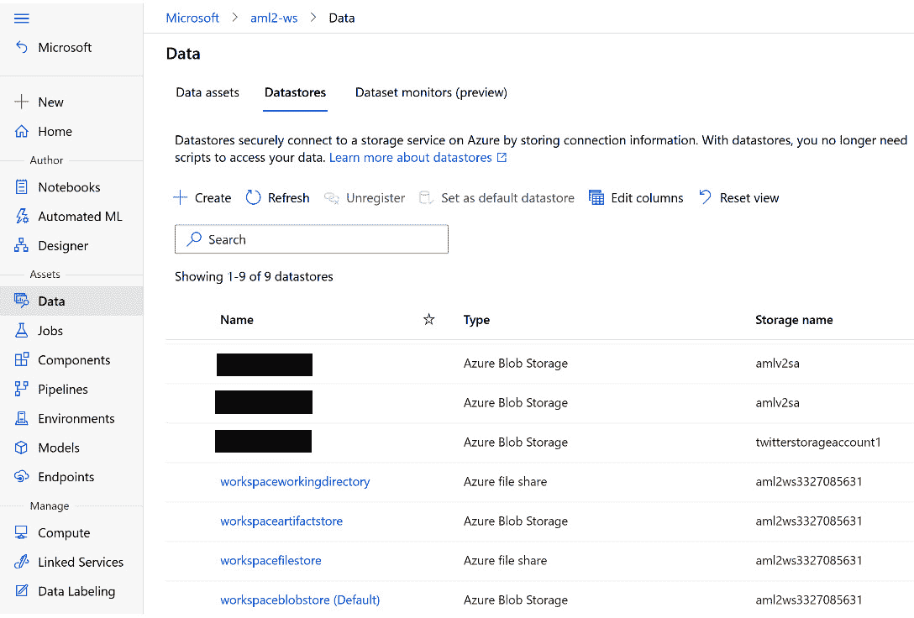

图 2.2 – 数据存储

**workspaceblobstore** 是默认的 Azure Machine Learning 工作区数据存储，包含实验日志以及工作区工件。数据可以上传到这个默认数据存储，将在下一节中介绍。**workspacefilestore** 用于存储您在 Azure Machine Learning 工作区中创建的笔记本。

在下一节中，我们将看到如何通过 Azure Machine Learning Studio、Azure Machine Learning Python SDK 以及 Azure Machine Learning CLI 连接到新的数据存储。这将使您能够使用数据所在的位置的数据，而不是将其带入与您的 Azure Machine Learning 工作区关联的默认数据存储。

# 创建 blob 存储账户数据存储

如前节所述，*默认数据存储回顾*，我们可以通过 Azure Machine Learning Studio、Azure Machine Learning Python SDK 和 Azure Machine Learning CLI 创建数据存储。在下一节中，我们将通过这些方法中的每一个创建 blob 存储账户的数据存储进行操作。

## 通过 Azure Machine Learning Studio 创建 blob 存储账户数据存储

为了创建一个包含 blob 的存储账户数据存储，首先您需要创建一个包含 blob 的存储账户。按照以下步骤创建 Azure 存储账户并在该存储账户中创建 blob 存储：

1.  访问 Azure 门户，请点击[`ms.portal.azure.com/#home`](https://ms.portal.azure.com/#home)。

1.  在**Azure 服务**下找到**存储账户**。

1.  点击 `amlv2sa`。

1.  存储账户创建完成后，您可以在**存储账户**下看到它。

1.  点击新创建的存储账户。

1.  然后从左侧导航点击 `datacontainer`。

现在，返回 Azure Machine Learning Studio，点击左侧导航中的**数据**图标，转到**数据存储**选项卡，如图 *图 2**.2* 所示，然后点击**+创建**。将打开一个新的**创建数据存储**面板，如图 *图 2**.3* 所示：

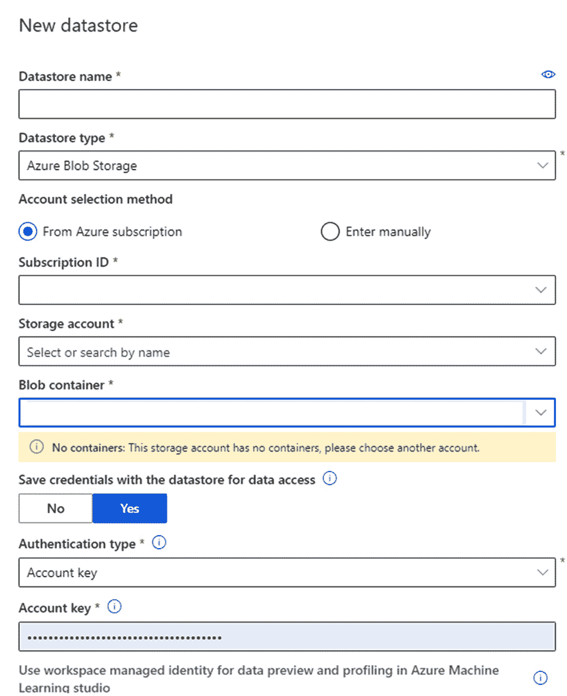

图 2.3 – 创建数据存储

在**创建数据存储**面板上，配置所需的设置：

1.  设置 `azureblobdatastore`。

1.  由于这是一个 Azure blob 存储帐户，请保留 `Azure Blob Storage`。

1.  选择您的 **订阅 ID** – 注意它应该默认为您的 workspace 的 Azure 订阅。

1.  通过点击 **存储帐户** 下拉菜单找到您刚刚创建的存储帐户 (`amlv2sa`)。

1.  通过点击 **Blob 容器** 下拉菜单找到您刚刚创建的 blob 容器 (`datacontainer`)。

1.  将 **使用数据存储保存凭据以进行数据访问** 设置为 **是**。

1.  将 **身份验证类型** 设置为 **帐户密钥**。

1.  通过输入存储帐户 **访问密钥** 部分找到的值来设置 **帐户密钥**。

1.  将 **在 Azure Machine Learning Studio 中使用工作区托管身份进行数据预览和配置文件** 设置为 **是**。

这将授予您的 Azure Machine Learning 服务工作区的托管 **身份读取器** 和 **存储 Blob 数据读取器** 访问权限。

1.  点击 **创建**。

您可以通过查看 *图 2**.2* 中显示的 **数据存储** 选项卡来验证是否为您创建了一个名为 `azureblobdatastore` 的数据存储。

现在我们已经看到如何通过 UI 轻松配置数据存储，我们将继续通过 Python SDK 创建数据存储。

## 通过 Python SDK 创建 blob 存储帐户数据存储

为了使用 Python SDK，您需要在 Jupyter 笔记本中运行 Python 脚本。要启动 Jupyter 笔记本，请点击左侧导航中的 **计算** 选项卡，如图 *图 2**.4* 所示：

图 2.4 – 从计算实例打开 Jupyter 服务器

接下来，从现有的计算实例点击 **Jupyter** 以打开 Jupyter 服务器。在 **新建** 中，点击 **Python 3.10 – SDKV2** 以创建一个新的 Jupyter 笔记本，如图 *图 2**.5* 所示：

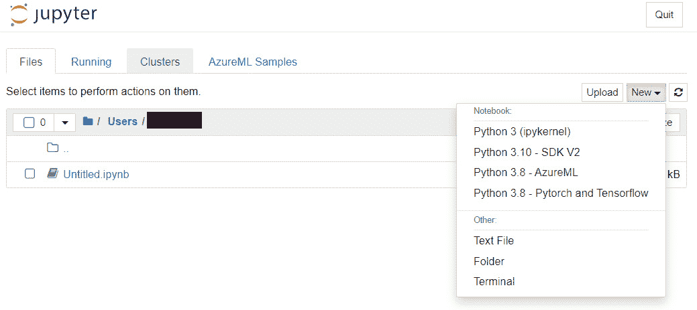

图 2.5 – 创建新的 Jupyter 笔记本

使用 Azure Machine Learning Python SDK，可以通过 *图 2**.6* 中的以下代码将 Azure blob 容器注册到您的 Azure Machine Learning 工作区。回想一下，当我们通过 UI 创建新的数据存储时，帐户密钥的值可以在存储帐户的 **访问密钥** 部分找到：

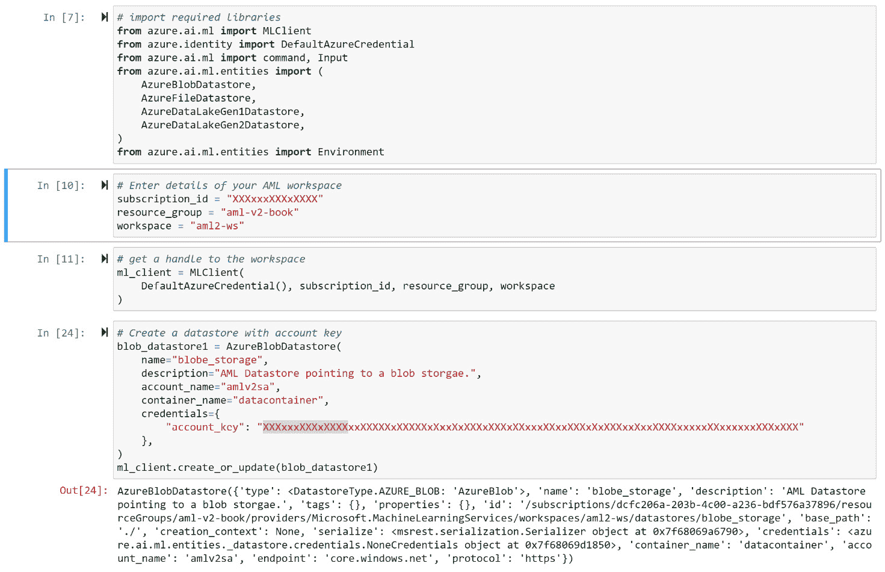

图 2.6 – 使用 Python SDK 创建 blob 存储帐户数据存储

如果您点击左侧导航中的 **数据**，然后选择 **数据存储** 选项，如图 *图 2**.7* 所示，您可以验证是否已创建了一个名为 **blob_storage** 的新 blob 存储数据存储：

图 2.7 – 工作区中创建的数据存储列表

接下来，让我们使用 Azure Machine Learning CLI 创建一个 blob 存储帐户数据存储。

## 通过 Azure Machine Learning CLI 创建 blob 存储帐户数据存储

假设您已按照*第一章*中“介绍 Azure Machine Learning 服务”的说明，在本地环境中安装了 Azure CLI 和机器学习扩展，您可以使用以下命令创建一个 blob 存储数据存储库：

图 2.8 – CLI 命令创建 blob 存储账户数据存储

在前面的命令中，`blobstore.yml`是一个 YAML 文件模式，指定数据存储类型、名称、描述、存储账户名称和存储账户凭据，如图*图 2**.9*所示：

图 2.9 – Blob 数据存储 YAML 模式文件

如果您点击**数据存储**选项卡，如图*图 2**.7*中所示，您可以验证是否已创建一个名为`blob_storage_cli`的新 blob 存储数据存储库。

现在您已成功创建 blob 存储数据存储库，在您的 Azure Machine Learning 工作区中，您将能够使用此数据存储库为多个数据资产提供服务。此数据存储库的连接信息安全地存储在您的 Azure 密钥保管库中，并且您有一个存储生成数据的存储位置。

# 创建 Azure Machine Learning 数据资产

在创建完上一个数据存储库后，下一步是创建数据资产。请注意，在本章中，我们将交替使用“数据资产”和“数据集”这两个术语。数据集是对数据存储的逻辑连接，具有版本控制和模式管理，例如选择要使用的数据列、数据集中列的类型以及一些数据统计信息。数据资产抽象了从配置数据读取的代码。此外，当运行多个模型时，数据资产非常有用，因为每个模型都可以配置为读取数据集名称，而不是配置或编程如何连接到数据集并读取它。这使得模型训练的扩展变得更加容易。

在以下部分，您将学习如何使用 Azure Machine Learning Python SDK、CLI 和 UI 创建数据集。数据集允许我们根据模式更改创建版本，而无需更改存储数据的底层数据存储。可以在代码中使用特定版本。我们还可以为每个创建并存储的数据集创建数据配置文件，以进行进一步的数据分析。

## 使用 UI 创建数据资产

Azure Machine Learning Studio 提供了一个通过引导式 UI 创建数据集的出色界面。为了使用 Azure Machine Learning Studio 创建数据集，请按照以下步骤操作：

1.  访问[`ml.azure.com`](https://ml.azure.com)。

1.  选择您的工作区名称。

1.  在工作区 UI 中，点击**数据**并确保已选择**数据资产**选项。

1.  接下来，点击 **+ 创建** 并填写如图 *图 2.10* 所示的 **创建数据资产** 表单，并确保在 **类型** 字段中选择 **表格**：

图 2.10 – 创建数据资产

1.  在下一屏幕上，选择 **从本地文件** 并点击 **下一步** 以查看如图 *图 2.11* 所示的 **选择数据存储** 屏幕。继续选择您在上一个部分中创建的 **blob_storage** 数据存储。

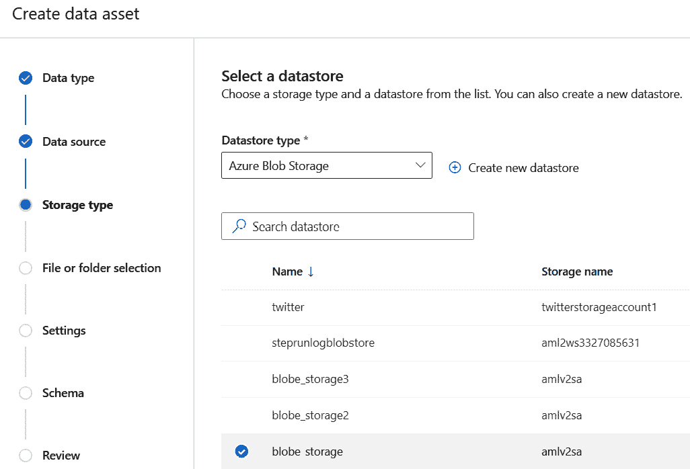

图 2.11 – 选择数据存储

选择数据存储后，您可以选择文件所在的路径，如图 *图 2.12* 所示。在本例中，我们将使用 `titanic.csv` 文件，该文件可以从我们的 GitHub 仓库下载。输入您下载并保存文件的路径，然后点击 **下一步**：

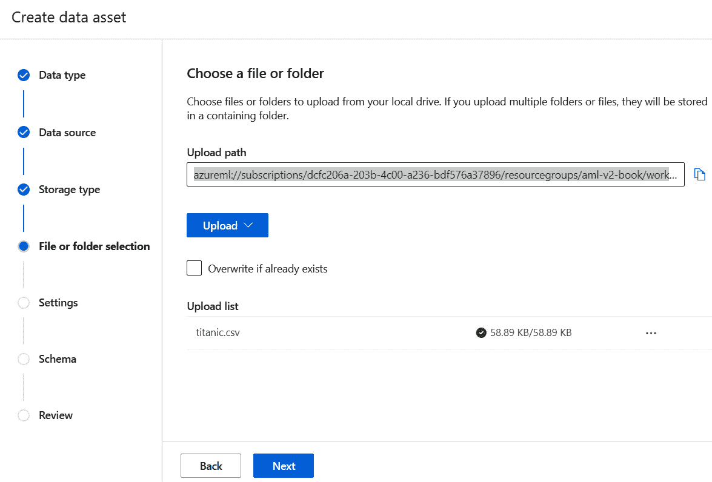

图 2.12 – 上传您的数据文件

1.  下一步是 **设置和预览** 屏幕。在此屏幕上，文件将自动解析，并显示检测到的格式的选项。在我们的案例中，它是一个 CSV 文件，并显示了 CSV 文件格式的设置。检查预览部分以验证数据集是否以正确的格式显示数据，例如识别列、标题和值。如果未检测到格式，则可以更改 **文件格式**、**分隔符**、**编码**、**列标题** 和 **跳过行** 的设置，如图 *图 2.13* 所示。如果数据集包含多行数据，则检查 **数据集包含多行数据** 选项。一旦为您的数据集正确配置了设置，请点击 **下一步** 按钮进入有关架构的下一部分：

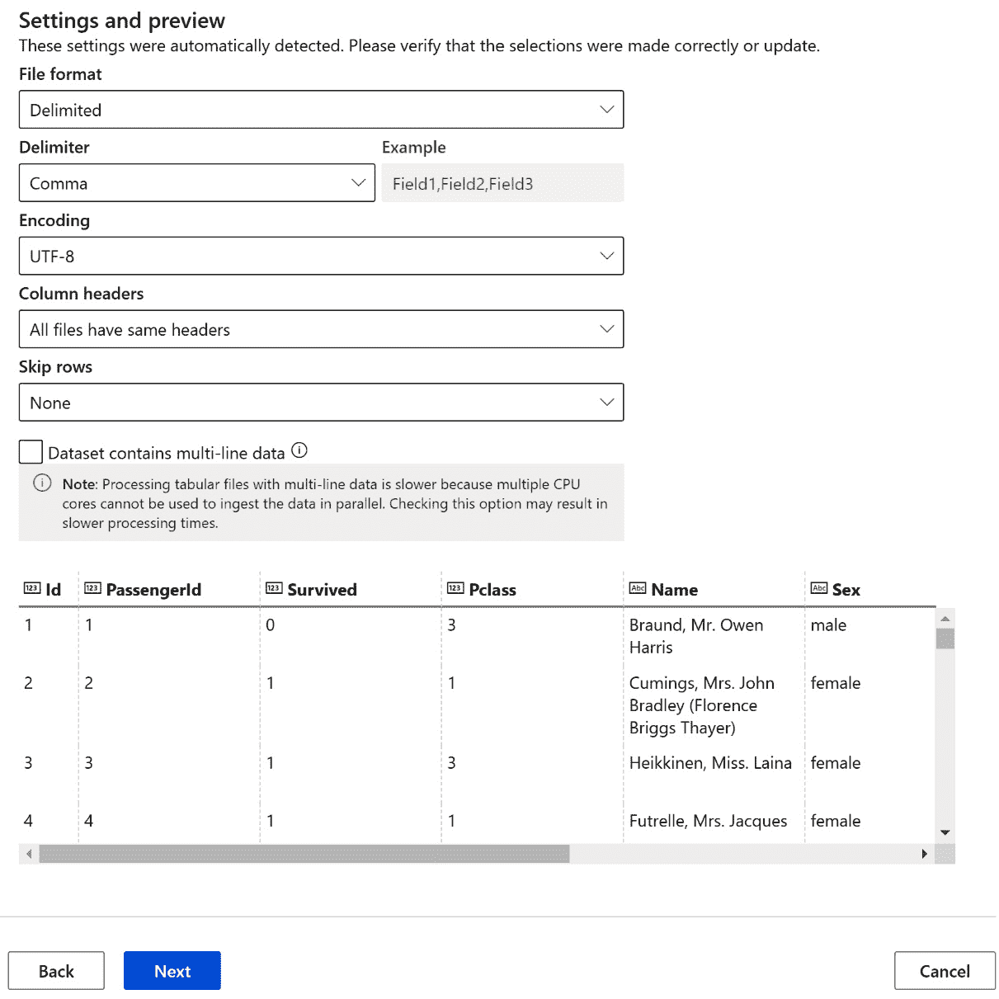

图 2.13 – 设置和预览屏幕

在此屏幕上，系统将识别数据的架构并将其显示以供审查，允许根据需要做出更改。通常，CSV 或文本文件可能需要架构更改。例如，一个列可能具有错误的数据类型，因此请确保选择正确的数据类型。

重要提示

前两行用于检测列类型。如果数据集存在列类型不匹配，请在使用 Jupyter notebook 注册之前考虑清理您的数据集。

这里是可用的数据类型格式：

+   **字符串**

+   **整数**

+   **布尔值**

+   **十进制（****点‘.’）**

+   **十进制（****逗号‘,’）**

+   **日期**

*图 2.14* 展示了数据集的架构信息。检查 **类型** 标题下拉菜单以查看可用的数据类型：

图 2.14 – 架构屏幕

1.  滚动并审查所有列。对于您的已注册数据资产，您可以选择包含或排除特定的列。每个列都有**包含**的选项，如图 2.14 所示。此屏幕还包括**搜索**列的选项。一旦数据资产屏幕配置正确，点击**下一步**。

1.  接下来是**审查**屏幕。确认之前选择的设置是否正确，然后点击**创建**：

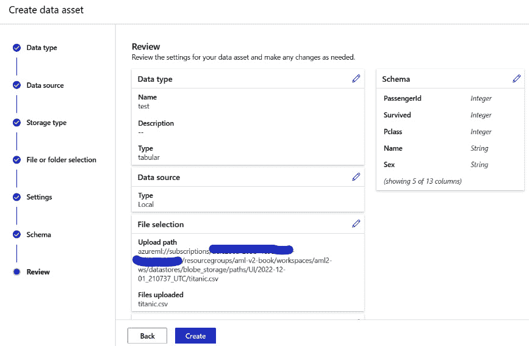

图 2.15 – 确认审查屏幕

在审查过程中，如果需要任何更改，请点击**返回**按钮并更改设置。

1.  一旦数据资产创建完成，您将看到`titanicdataset`数据资产页面，其中包括不同的选项，例如**探索**、**消费**和**生成配置文件**。

1.  点击如图 2.16 所示的**消费**选项，以查看通过名称检索您的已注册数据集的代码，并显示数据集的 pandas 数据框：

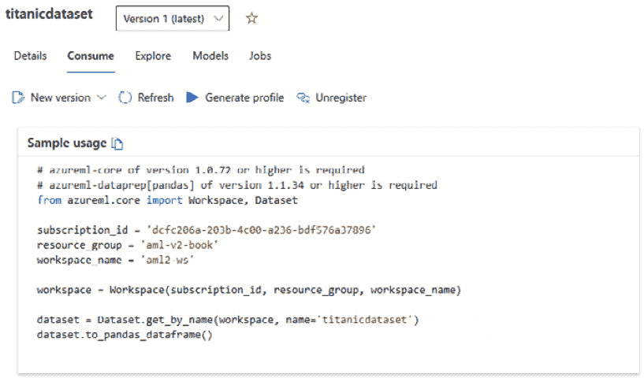

图 2.16 – 使用 Python 消费数据资产

如本章后面所述，图 2.16 中显示的代码可以直接复制粘贴到 Azure Machine Learning 笔记本中，并在您的 Azure Machine Learning 计算实例上运行。

1.  在已注册数据集的**消费**选项中，您可以选择**生成配置文件**选项，开始对数据集进行配置的引导浏览，如图 2.17 所示：

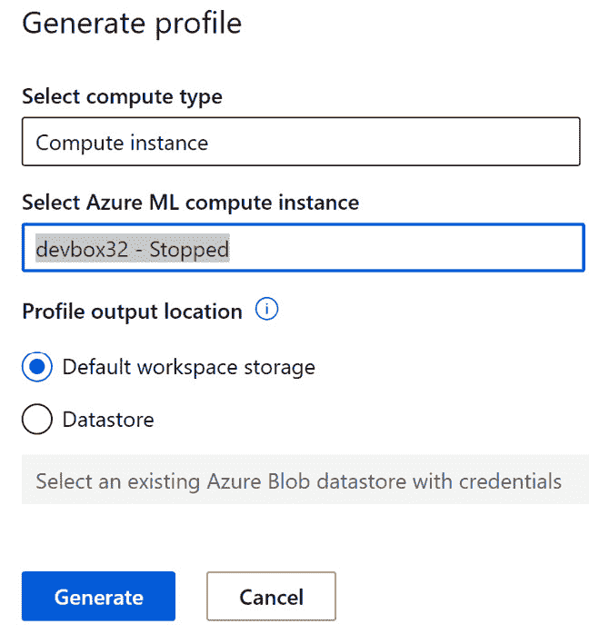

图 2.17 – 生成配置文件屏幕

1.  如果您想创建数据集的新版本，请点击**新版本**。

1.  此外，还有**探索**选项来查看数据集的样本。仅显示前 50 行：

图 2.18 – 探索屏幕

在本节中，我们向您展示了如何使用 UI 创建数据资产。在下一节中，我们将向您展示如何使用 Python SDK 创建数据资产。

# 使用 Python SDK 创建数据资产

在本节中，我们将向您展示如何使用 Python SDK 创建数据资产。如前所述，您可以从数据存储、本地文件和公共 URL 创建数据。从本地文件（例如，`titanic.csv`）创建数据资产的 Python 脚本如图 2.19 所示。

请注意，在下面的代码片段中，`type = AssetTypes.mltable`抽象了表格数据的模式定义，使其更容易共享数据集：

图 2.19 – 通过 Python SDK 创建数据资产

在`my_data`文件夹内，有两个文件：

+   实际的数据文件，在本例中是`titanic.csv`

+   `mltable`文件，这是一个 YAML 文件，指定了数据的模式，以便`mltable`引擎可以使用它来将数据转换为内存中的对象，如 pandas 或 DASK

*图 2**.20*显示了此示例的`mltable` YAML 文件：

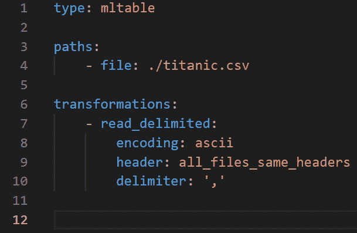

图 2.20 – 创建 mltable 数据资产的 mltable YAML 文件

如果您回到**数据资产**下的**数据**标签页，您将看到已创建了一个名为**titanic-mltable-sdk**的新数据集，其类型设置为**Table(mltable**)，版本为**1**。

在本节中，我们向您展示了如何使用 Python SDK 创建数据资产。在下一节中，您将学习如何消费数据资产。

# 使用 Azure Machine Learning 数据集

在本章中，我们介绍了 Azure Machine Learning 数据存储是什么以及如何连接到各种支持的数据源。我们使用 Azure Machine Learning Studio、Python SDK 和 Azure CLI 创建了到 Azure Machine Learning 数据存储的连接。我们刚刚介绍了 Azure Machine Learning 数据集，这是您 ML 项目中的一个宝贵资产。我们介绍了如何使用 Azure Machine Learning Studio 和 Python SDK 生成 Azure Machine Learning 数据集。一旦创建了 Azure Machine Learning 数据集，它就可以在您的 Azure Machine Learning 实验中整个使用，这些实验被称为**作业**。

*图 2.21*显示了将`mltable`工件转换为 pandas 数据框的代码片段。请注意，您需要在您的环境中安装`mltable`库（使用`pip install mltable`命令）。

图 2.21 – 将 mltable 工件转换为 pandas 数据框

现在，让我们看看如何在 ML 作业中使用数据资产，这将在下一节中介绍。

## 在作业中读取数据

Azure Machine Learning 作业由一个 Python 脚本组成，这可能是一个简单的数据处理或用于模型开发的复杂代码，一个 Bash 命令用于指定要执行的任务，作业的输入和输出，指定运行作业所需的运行时库的 Docker 环境，以及 Docker 容器将运行的计算环境。在作业内部执行的代码可能需要使用数据集。将数据传递给 Azure Machine Learning 作业的主要方式是使用数据集。

让我们带您了解运行一个以数据集为输入的作业所需的步骤：

1.  创建一个 Azure Machine Learning 环境，这是您训练模型或处理数据的过程所在的地方。*图 2**.22*显示了创建一个名为`env_docker_conda`的环境的代码片段，它将在*步骤 4*中使用：

图 2.22 – 创建 Azure Machine Learning 环境

在前面的代码中，`env-mltable.yml`，如 *图 2.22* 所示，是一个 YAML 文件，定义了需要在环境中安装的 Python 库：

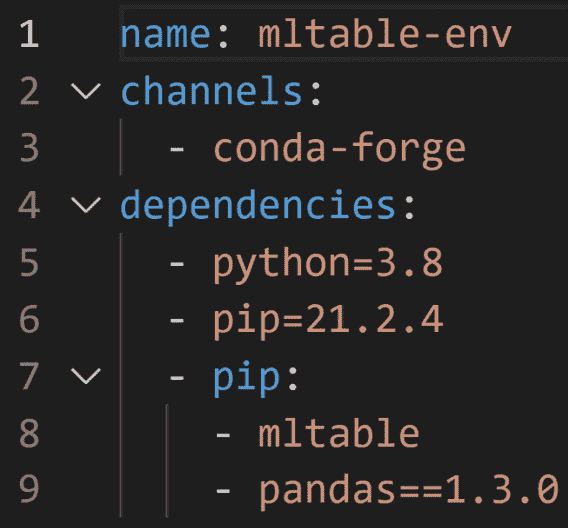

图 2.23 – 环境规范 YAML 文件

1.  编写一个 Python 脚本来处理你的数据并构建模型。对于本章，我们将向你展示一个简单的 Python 脚本，该脚本接受一个输入数据集，将其转换为 pandas 数据框，然后打印它。*图 2.24* 展示了保存为 `read_data.py` 文件的脚本，该脚本将在 *步骤 4* 中使用：

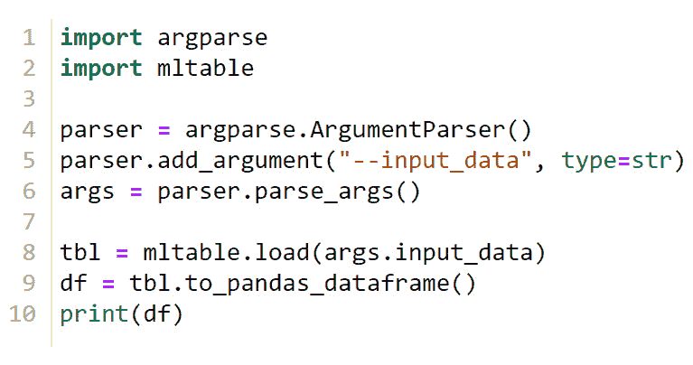

图 2.24 – 处理输入数据集的 Python 脚本

1.  创建一个 Azure Machine Learning 计算集群，其中将提交 Azure Machine Learning 容器化作业。*图 2.25* 展示了创建一个名为 `cpu-cluster` 的计算集群的 Python 脚本，通过指定其类型和最小和最大节点数：

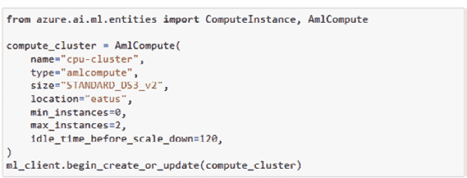

图 2.25 – 创建 Azure Machine Learning 计算集群

1.  现在你已经拥有了构建 Azure Machine Learning 作业并提交执行的所有必要组件。*图 2.26* 展示了创建一个名为 `job` 的 Azure Machine Learning 作业的 Python 脚本。这个作业本质上是一个包含你的 Python 代码（`read_data.py`）的 Docker 容器，该代码正在处理你之前创建的输入数据集，并将其提交到你创建的计算集群：

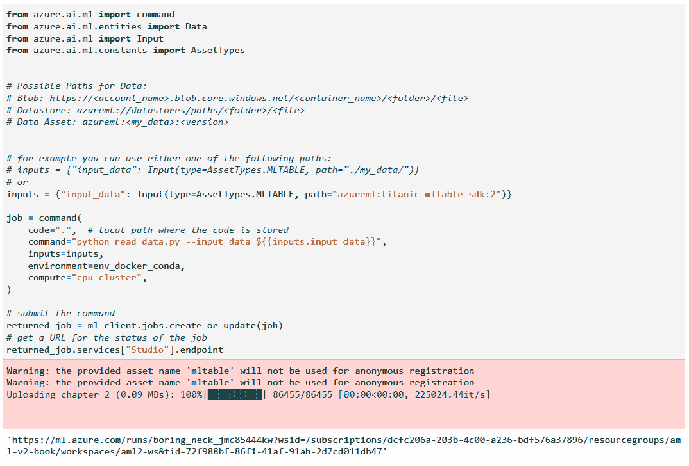

图 2.26 – 创建 Azure Machine Learning 作业

Jupyter 笔记本单元格的输出是一个指向 Azure Machine Learning Studio 中作业的链接，该链接显示作业概述、状态、Python 代码和作业输出。如果你导航到这个链接并点击 **输出 + 日志**，然后点击 **user_logs** 下的 **std_log.txt**，你将看到由 Python 代码生成的输出，该代码将输入数据集打印到标准日志中，如 *图 2.27* 所示：

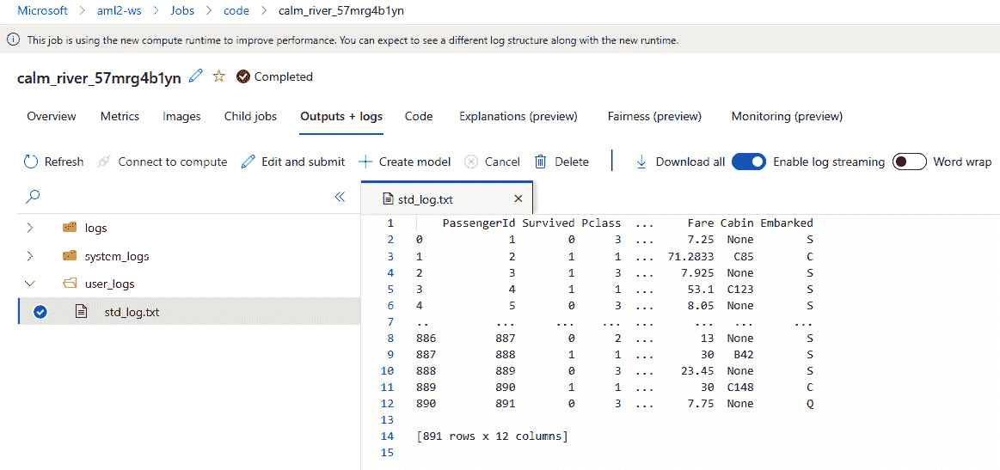

图 2.27 – Azure Machine Learning 作业执行成功后的输出

现在让我们总结本章内容。

# 摘要

在本章中，您已经探索了 Azure 机器学习数据存储，这些数据存储使您能够连接到数据存储服务。您还了解了 Azure 机器学习数据集，这使您能够创建对数据存储中位置的引用。在 Azure 机器学习中，这些资产可以通过 UI 创建以实现低代码体验，也可以通过 Azure 机器学习 Python SDK 或 Azure 机器学习 CLI 创建。一旦创建了这些引用，就可以通过 Azure 机器学习 Python SDK 检索和使用数据集。一旦检索到数据集，就可以轻松将其转换为 pandas dataframe 以在您的代码中使用。您还看到了如何在 Azure 机器学习作业中使用数据集，通过将它们作为作业的输入传递。

在*第三章* *在 AMLS 中训练机器学习模型* 中，您将探索模型训练；实验将成为您工具箱中的关键资产，在您在 AMLS 中构建模型时提供可追溯性。
