# 3

# 在 AMLS 中训练机器学习模型

在 Azure Machine Learning (AML) 中训练**机器学习 (ML**) 模型是启用您的数据科学工作负载的关键。通常，在模型创建过程中，数据会被分成测试集和训练集。然后使用训练数据构建模型，并使用测试集进行评估。在这个过程中，选择了多种算法并使用它们来回答问题：哪个模型将在未见过的数据集上提供最佳结果？AML 具有记录指标的能力，对产生给定模型性能的代码进行快照，以回答这个问题。AML 提供了各种加速能力。在本章中，我们将重点关注创建用于训练模型的实验，以及 AML 实验的基本功能，以解锁使用计算实例、计算集群和已注册数据集。

模型训练可以通过 AML Python SDK 或设计器来实现低代码体验。在模型训练过程中，可以使用不同的计算资源来完成这项任务。在本章中，我们将探讨使用计算实例进行基本模型训练、使用计算集群进行可重复训练环境，以及通过设计器实现低代码体验。

在本章中，我们将学习如何使用数据集通过 AML 计算和数据集构建 ML 模型。

我们将涵盖以下主题：

+   使用设计器训练无代码模型

+   在计算实例上训练

+   在计算集群上训练

# 技术要求

请参阅*第一章*，*介绍 Azure Machine Learning 服务*，以创建用于使用的环境工作区。

本章的先决条件如下：

+   有互联网访问权限。

+   拥有一个网络浏览器，最好是 Google Chrome 或 Microsoft Edge Chromium。

+   要访问 Azure Machine Learning 服务工作区，请访问此地址：[`ml.azure.com`](https://ml.azure.com)。从下拉列表中选择工作区。

# 使用设计器训练无代码模型

在本节中，让我们看看使用**设计器**进行无代码建模可用的选项。设计器使数据科学家能够在不编写代码的情况下创建模型。它使任何数据科学家都能够轻松构建和比较模型。在设计器中，开发环境是一个图形用户界面，允许右键单击以更改给定步骤的设置。该界面不仅允许开发模型，还可以一键部署到各种风格的 API，包括实时或批量端点，这些是其他业务应用或下游应用可以消费的 REST API。

例如，拖动一个任务以连接到数据源，并配置属性以连接到数据源。这些属性包括数据集名称和连接字符串参数，包括用户名和密码。

## 使用用户界面创建数据集

让我们一步步通过使用用户界面创建数据集的步骤：

1.  前往 [`ml.azure.com`](https://ml.azure.com)。

1.  选择你的工作区名称。

1.  在工作区的左侧，选择 **Designer**，如下截图所示：

图 3.1 – 设计师图标

1.  一旦你进入 **Designer** 屏幕，你会看到屏幕分为两部分。顶部部分显示了一些可供任何人测试的示例或样本。所有样本都使用开源数据集，因此任何人都可以测试、开发和从中学习。底部部分显示你创建的实验，如果你点击一个实验，图表将显示在右侧的画布上。

设计师体验如下截图所示：

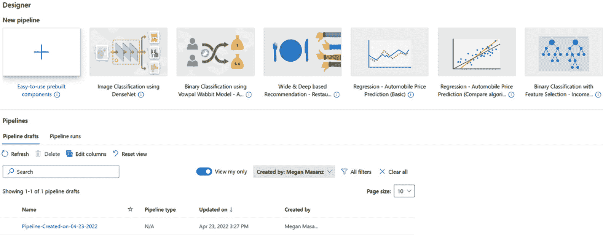

图 3.2 – 设计师体验

1.  在创建实验之前，请确保已创建计算集群，如*第一章*“介绍 Azure 机器学习服务”中所示，或者你也可以在本章中找到它，我们展示了如何为远程作业创建集群。

1.  点击 **+** 按钮创建一个新的实验：

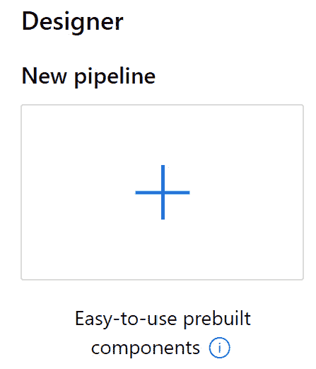

图 3.3 – 创建新的设计实验

1.  点击 `Classificationsample1` 作为名称。现在，我们还需要提供一个计算目标。从下拉菜单中选择 **Compute cluster**，然后选择你已创建的集群。该集群可以是基于 CPU 或 GPU 的。

提示

计算集群提供了一种在多个虚拟机之间扩展计算的方法，以实现横向扩展。根据用例选择 CPU 或 GPU。例如，大多数小于 TB 大小的表格数据集可以使用基于 CPU 的集群。对于基于视觉的工作负载，请选择 GPU 集群。

1.  选择默认的数据存储，通常会是 Azure 机器学习服务底层数据存储。选择 **workspaceblobstore** 作为你的选择，并在 **草稿详情** 部分提供实验详情。然后，点击右侧的 **X** 图标以查看整个画布：

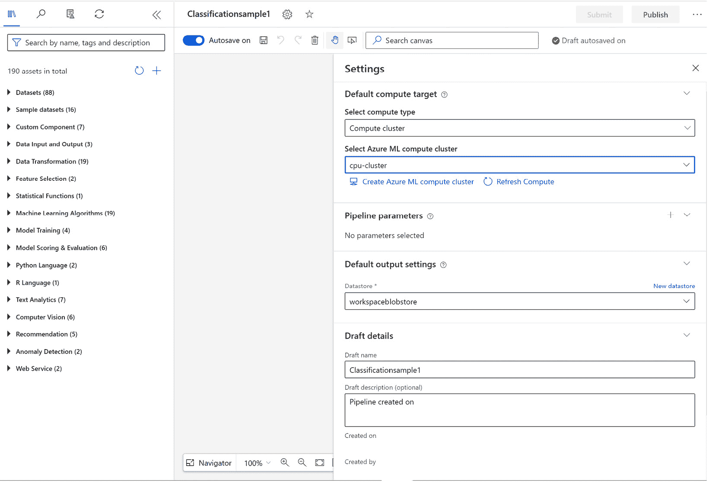

图 3.4 – 创建新的设计实验画布

注意，从图 3.4 中可以看到，在左侧有菜单选项。这是我们所有可以拖放到画布上构建模型的任务的地方。菜单按不同的操作分类，如数据集、数据输入和输出、数据转换和机器学习算法。建议阅读每个任务及其属性和功能的在线产品文档。

让我们构建一个模型。你将要带来的第一件事是你从*第二章*，“在 AMLS 中处理数据”中注册的数据集。在左侧菜单中展开**数据集**，选择要使用的选项，并将其拖放到画布上。

重要提示

在本章中，我将带您了解一个基本的机器学习建模步骤。

1.  对于本章，我创建了一个泰坦尼克号开源数据样本并将其配置为数据集。当你将其拖放到画布上时，它看起来是这样的。右键单击数据集，属性表将显示在屏幕的右侧。选择**输出**并查看数据集样本行。还将提供查看数据概要的选项：

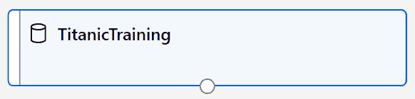

图 3.5 – 画布上的数据集

1.  现在，在左侧菜单的搜索框中输入`数据集中的选择列`并将其拖放到画布上，然后将其连接到**数据集中的选择列**。现在，点击**数据集中的选择列**，转到**选择列**，并选择用于建模的**编辑列**。这个任务允许我们选择我们可以使用的列：

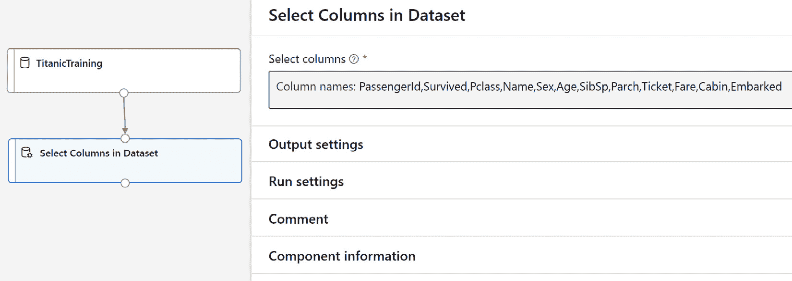

图 3.6 – 数据集中的选择列

在**编辑列**部分，选择我们需要的列。有选项可以选择所有列、所有特征或所有标签，或者通过名称选择。对于前面的示例，我们选择通过列名选择，并从列表中选择列。

1.  下一个转换将是清理数据。这是一个常见的任务，用于去除没有值、空值等不想要的行。在搜索框中输入`清理缺失数据`并将其拖放到画布上，然后将其连接到前面的任务，在这种情况下，是**数据集中的选择列**：

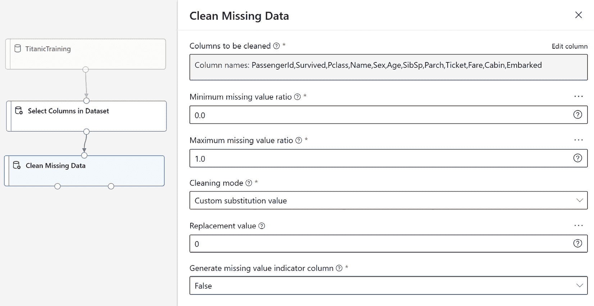

图 3.7 – 清理缺失数据

1.  点击**编辑列**并选择要清理的列或特征。特征或列的选择可以是按规则或按名称。当你点击文本框时，将弹出一个列表，如图 3.8 所示。选择你需要建模的列或特征。在这个例子中，选择所有列：

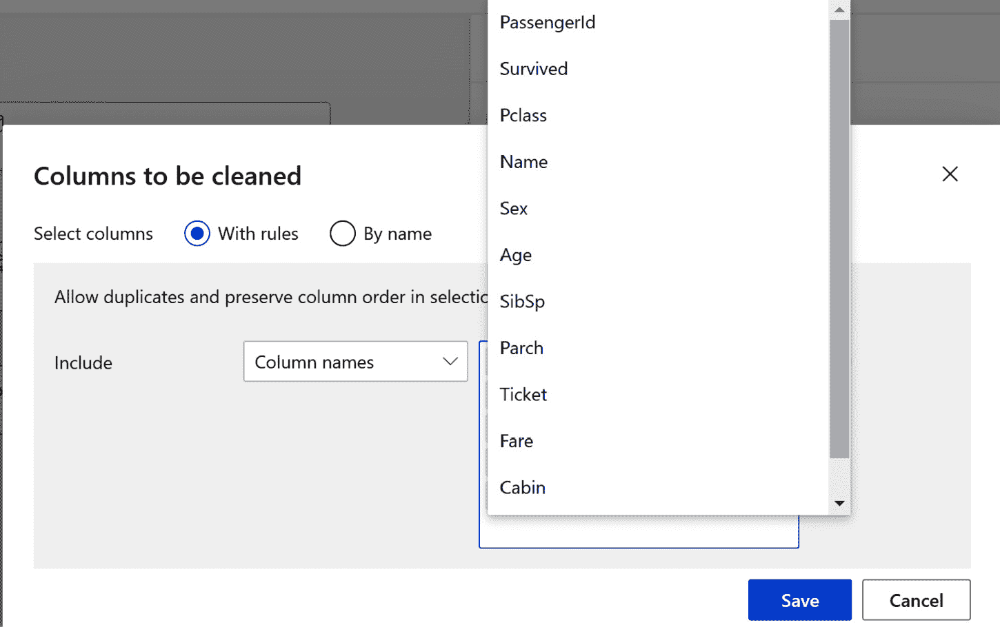

图 3.8 – 编辑列

1.  现在我们已经进行了一些特征工程，是时候将数据分割为训练和测试了。在机器学习中，将数据集分割为训练和测试是一个非常常见的做法。通常，分割是 70% 的训练和 30% 的测试。在搜索框中输入`分割数据`并将其拖放到画布上以连接到前面的任务。属性表将显示在右侧。对于`0.7`，这个设置允许我们将数据集分割为 70% 用于训练，剩余的 30% 用于测试数据集。

**分割数据**活动允许你选择分割方式，分割是否应该随机化，分割使用的种子，以及分割是否应该分层，如以下截图所示：

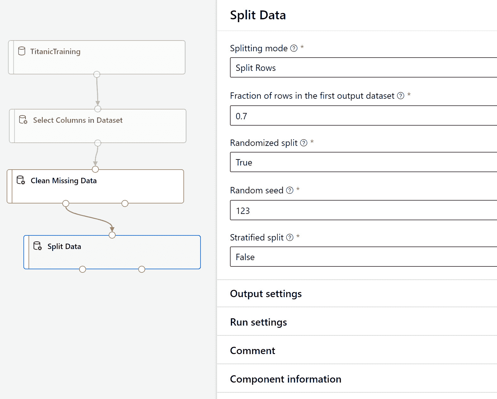

图 3.9 – 分割数据

1.  在**双类提升决策树**后将其拖放到画布上。由于这是一个简单的存活机器学习任务，我们选择双类提升决策树。根据需要，你可以选择另一个双类算法。一旦选择了算法，我们需要配置其参数。通常，你可以将大多数设置为默认值，因为这些参数是基于各种模型运行统计选择的。你应该确保设置你的随机种子，如*图 3.10*所示。

以下截图展示了为**双类提升** **决策树**设置的参数：

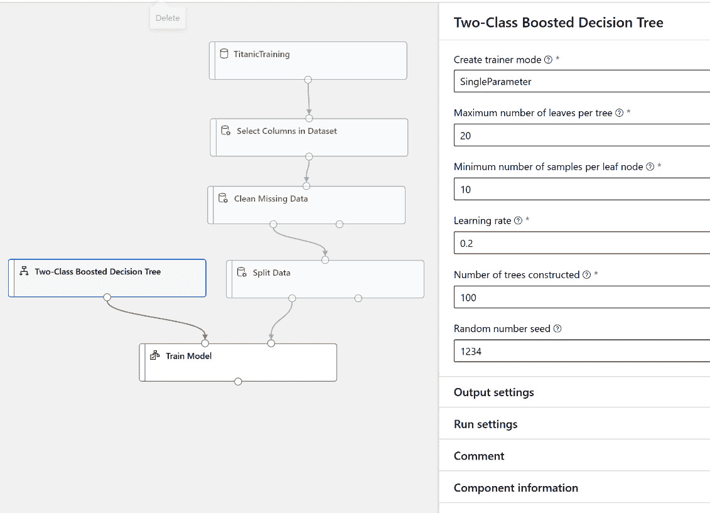

图 3.10 – 双类提升决策树

1.  现在，在左侧菜单中，在搜索框中输入`训练模型`并将其拖放到画布上。对于**训练模型**，我们需要连接到两个输入，一个来自模型输出，另一个来自**分割数据**的第一个输出。确保算法和训练数据已连接。然后，选择**训练模型**和预测的标签列。

1.  选择**编辑列**然后设置**标签列**为**存活**。**模型解释**是一个允许我们启用模型可扩展性的功能：

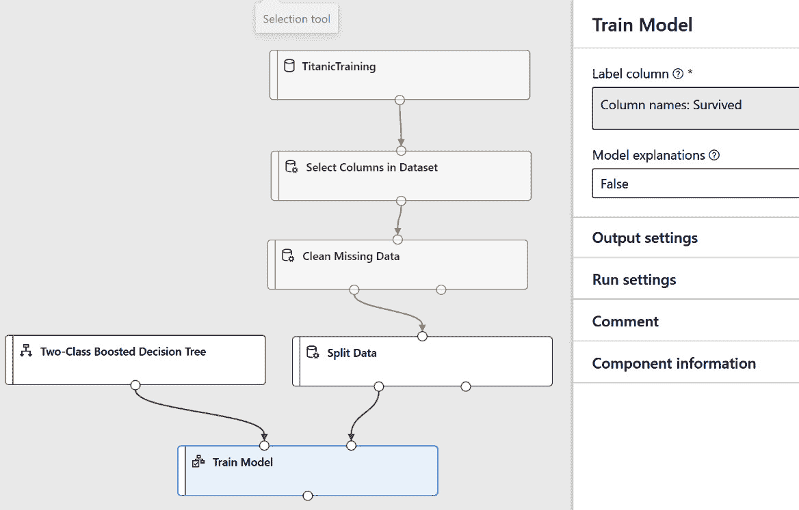

图 3.11 – 训练模型

1.  现在，你可以评分模型。转到左侧菜单，在搜索框中输入`评分模型`并将其拖放到画布上。**评分模型**必须连接到两个输出。第一个输入应该连接到**训练模型**的输出，第二个输入必须连接到**分割数据**的第二个输出。**评分模型**接受训练输出模型，然后消耗测试数据集以评分测试数据集：

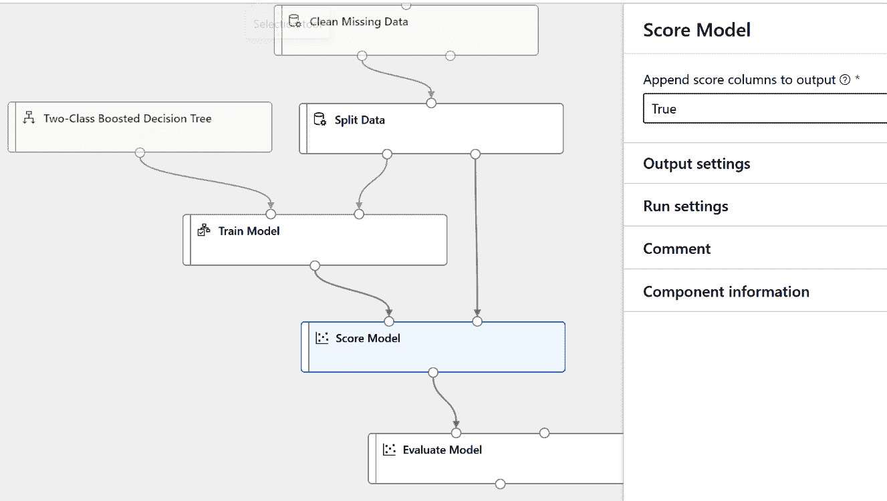

图 3.12 – 评分模型

1.  现在，这里的最后一步是添加**评估模型**输出并获取模型准确度分数。为此，从左侧菜单中，将**评估模型**拖放到画布上。对于**评估模型**，第一个输入应该连接到**评分模型**输出。此任务没有设置：

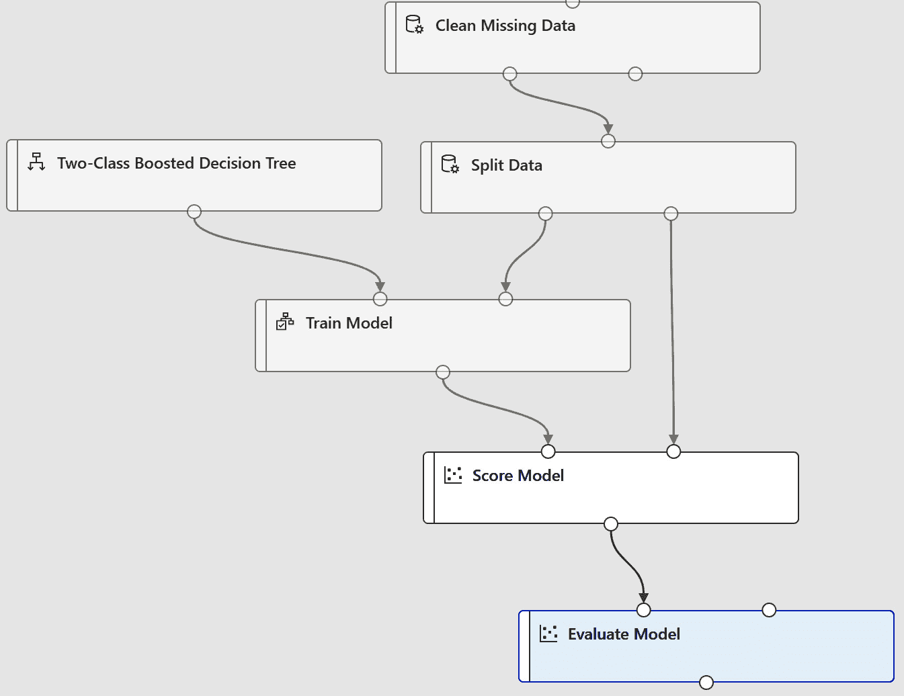

图 3.13 – 评估模型

1.  现在，在画布上点击**保存**。我们现在已经完成了模型开发。在右上角，你会看到一个用于**提交**的按钮：

图 3.14 – 提交实验

1.  点击**提交**并为实验提供一个名称：

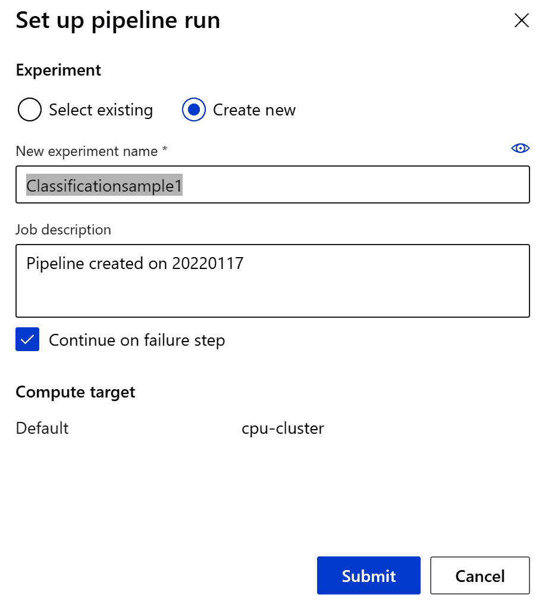

图 3.15 – 新实验

1.  然后，点击`Classificationsample1`。为实验提供作业描述，这是可选的。将**计算目标**保留为**默认**，因为我们已经在实验开始时选择了它。等待实验完成。一旦实验开始，你应该看到以下截图：

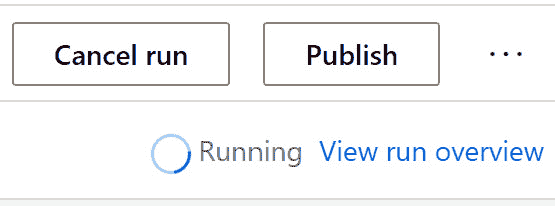

图 3.16 – 实验状态

可选地，你也可以通过点击**作业**来查看运行详情，然后对于**Classificationsample1**，点击其最新的作业。

1.  一旦实验完成，你应该看到所有任务都显示为绿色，如下面的截图所示：

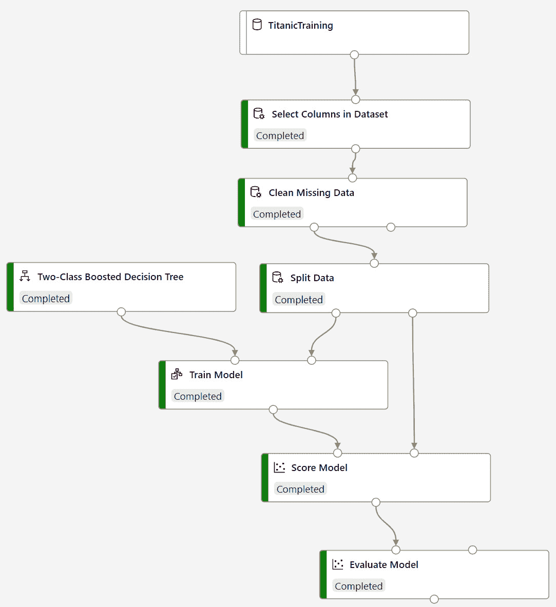

图 3.17 – 实验完成

通过点击**评估模型**任务，我们可以查看**评估模型**任务的结果。在我们的案例中，我将只展示**评估模型**以查看混淆矩阵和**接收者操作特征**（**ROC**）曲线：

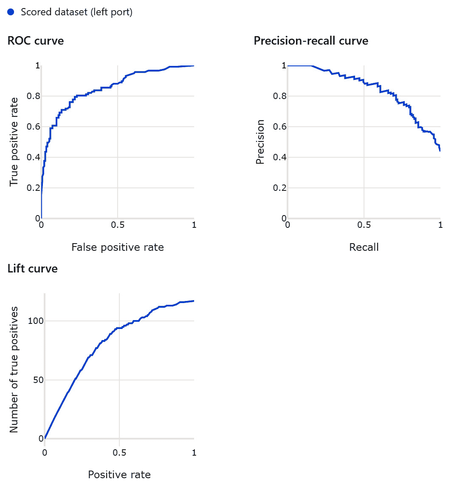

图 3.18 – ROC 曲线

除了审查 ROC 曲线，我们还可以审查混淆矩阵，如下面的截图所示：

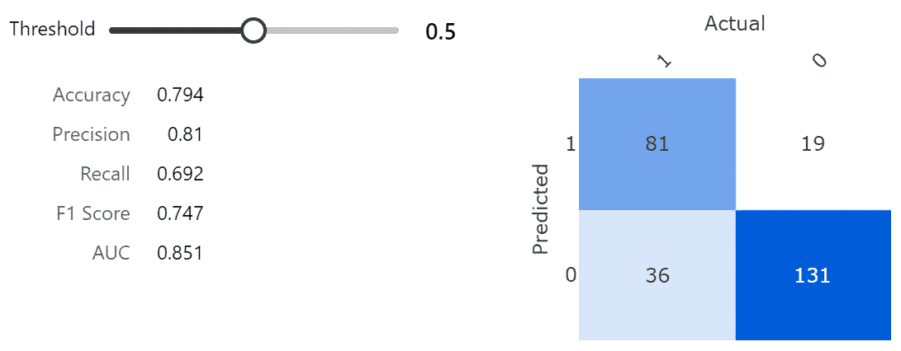

图 3.19 – 混淆矩阵

在本节中，我们看到了如何使用 AMLS 中的设计器来训练模型。使用设计器，我们可以通过拖放界面来训练模型，同时进行特征工程以提供改进的模型。作为后续，查看用户界面中的每个任务。

在下一节中，你将学习如何通过编写 Python 代码并在计算实例上运行它来训练模型。

# 在计算实例上训练

你可以在计算实例或计算集群上训练模型。在本节中，我们将在继续在计算集群上训练之前使用现有的计算实例。

要开始使用计算实例，我们需要打开在*第一章*，“介绍 Azure 机器学习服务”中创建的计算实例。

按照以下步骤在 AMLS 中计算实例上训练模型：

1.  前往[`ml.azure.com`](https://ml.azure.com)。

1.  选择你的工作区名称。

1.  在工作区的左侧，点击**计算**：

图 3.20 – 计算实例图标

1.  在**计算**屏幕上，选择你的计算实例并选择**开始**：

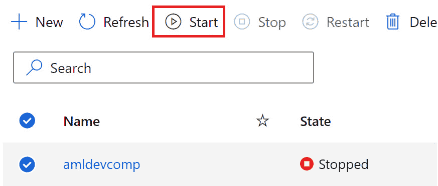

图 3.21 – 开始计算

你的计算实例将从**停止**状态变为**启动**状态。一旦计算实例从**启动**状态变为**运行**状态，它就准备好使用。

1.  在应用程序下点击终端蓝色的超链接。

1.  这将在您的计算实例上打开终端。请注意，您的用户名将包含在目录路径中。在终端中输入以下内容以将示例笔记本克隆到您的工作目录：[`github.com/PacktPublishing/Azure-Machine-Learning-Engineering.git`](https://github.com/PacktPublishing/Azure-Machine-Learning-Engineering.git)。

1.  点击显示在*图 3.22*中的刷新图标，将在您的当前工作目录中显示仓库：

图 3.22 – 刷新

在 AML 中点击刷新图标后，克隆的仓库将显示在您的工作目录中，如下面的截图所示：

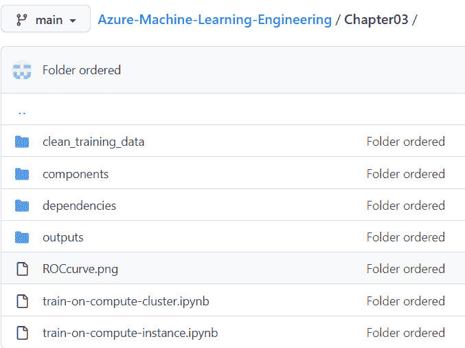

图 3.23 – Azure-Machine-Learning-Engineering

1.  点击**train-on-compute-instance.ipynb**笔记本将打开笔记本。

1.  如*图 3.24*所示的代码片段使您能够连接到计算实例中的 Azure ML 工作区：

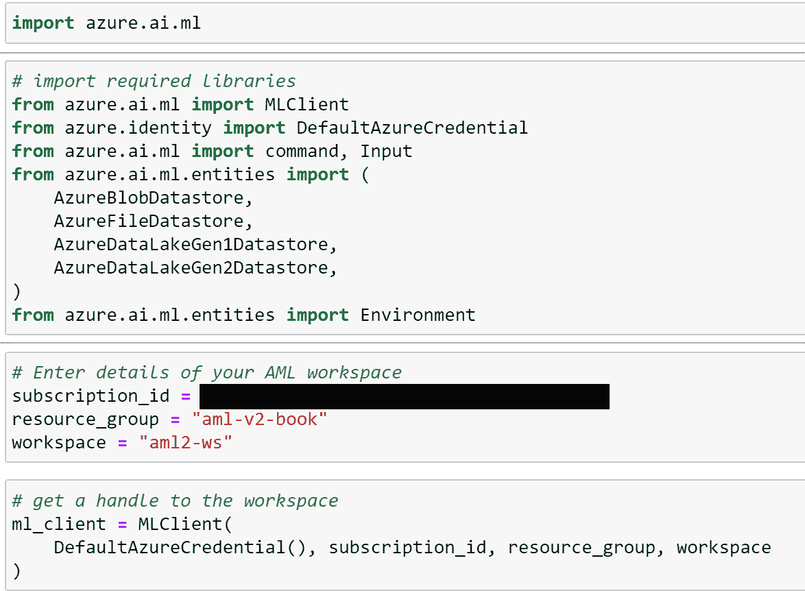

图 3.24 – 连接到工作区

1.  如*图 3.25*所示的代码片段使用 pandas 读取位于`my_data`文件夹中的数据集，然后查看它：

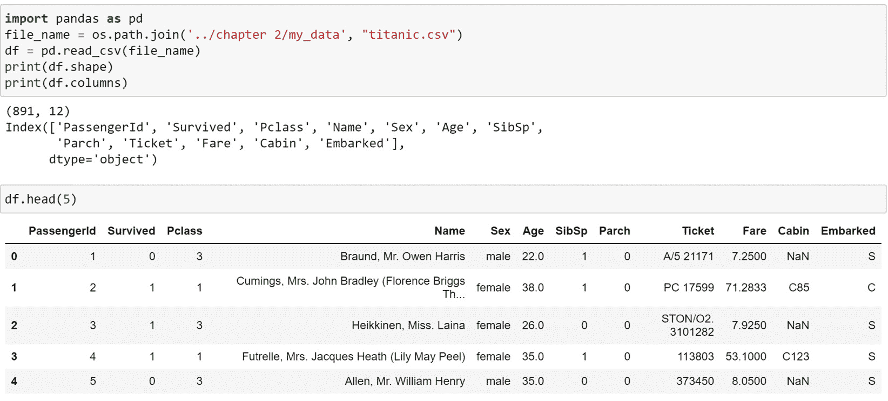

图 3.25 – 数据探索：读取数据集并查看数据

下一个单元格将检查哪些列有空数据，以便我们可以清洗数据集：

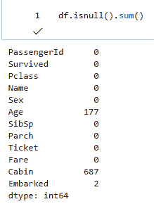

图 3.26 – 数据探索：查看数据集中的空值

1.  当值为`null`时的`Pclass`和`Sex`：

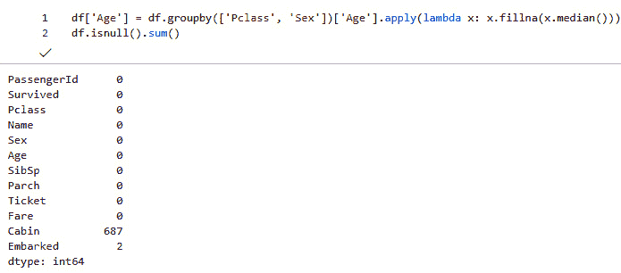

图 3.27 – 数据清洗：用 Pclass 和 Sex 的中位数填充 Age 列的空值

1.  对于`Cabin`，我们可以在创建模型时使用第一个字符，将其视为分类变量来表示船上的位置。如果值为`null`，我们将将其替换为`X`，表示未知的`Cabin`类型，如图*图 3.28*所示：

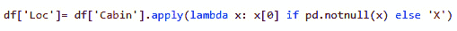

图 3.28 – 特征工程：填充 Loc 列

1.  我们将删除`Cabin`列，因为我们已经从其中检索了有用的信息，并且也将删除`Ticket`列，因为`Loc`列现在将代表船上的位置，如图*图 3.29*所示：

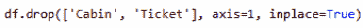

图 3.29 – 数据清洗：删除不必要的列

1.  在继续特征工程时，我们将创建一个名为`GroupSize`的列，因为可能是家庭成员的乘客群体通过合作有更大的生存机会：

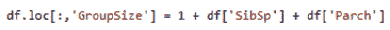

图 3.30 – 特征工程：组大小

1.  由于`'Embarked'`列的值有限，我们只有两行带有空值，我们将任意地将它们设置为`'S'`的值，如图*3.31*所示：

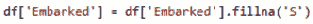

图 3.31 – 数据清洗：用默认值填充空值

如*图 3.32*所示，我们将删除在训练过程中不会使用的列：

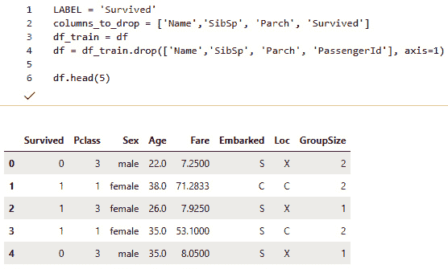

图 3.32 – 数据清洗：删除模型训练不需要的列

1.  我们将创建一个文件夹来存放我们的训练数据，如图*3.33*所示。这不是必需的，但会使我们的目录更清晰：

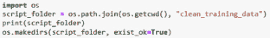

图 3.33 – 创建文件夹

在点击刷新按钮后，可以在*Notebooks*部分的左侧面板中看到目录，如图*3.34*所示：

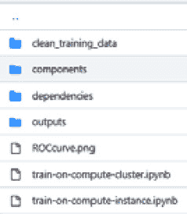

图 3.34 – 在目录中查看 clean_training_data 文件夹

1.  使用新创建的目录，我们可以将数据集保存到`clean_training_data`目录中，如图*3.35*所示：

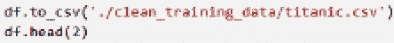

图 3.35 – 保存工程化数据集

1.  我们将开始导入创建逻辑回归模型所需的库，如图*3.36*所示：

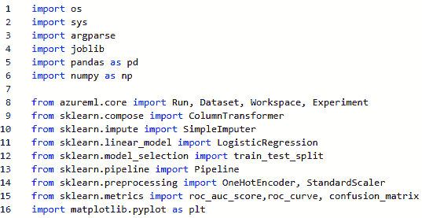

图 3.36 – 导入库

在导入实验所需的库之后，我们将重点关注主方法，该方法将在计算实例上执行代码时被调用：

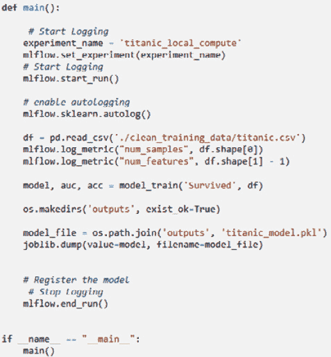

图 3.37 – 实验的主模块

使用 MLflow，这是一个开源的机器学习生命周期管理框架，与 AMLS 完全集成，我们将创建一个名为`'titanic_local_compute'`的实验，如图*3.37*所示，在主方法内部。如果笔记本第一次运行时不存在，它将在 AML 工作区中创建。这个实验可以在`mlflow.start_run()`方法中查看，它将在实验中开始一个新的运行。使用`mlflow.sklearn.autolog()`和`mlflow.log_metric()`方法，我们可以记录当前运行的参数和机器学习指标。

接下来，我们将讨论`model_train`函数，如图*3.38*所示：

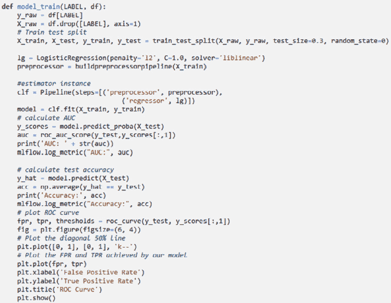

图 3.38 – 模型 _train

在`model_train`函数中创建了一个逻辑回归模型，如图*图 3.38*所示。输入变量和响应变量被分离，并使用`sklearn`库应用了训练-测试分割。模型被拟合，AUC 和准确率作为笔记本中的输出打印出来，同时利用 MLflow 框架，它们也被记录到实验中作为输出。除了将关键指标和参数作为实验的一部分进行记录外，与这些指标相关的图表也将自动使用 MLflow 进行记录，我们将在本节稍后讨论。

由于训练已经处理完毕，我们还想将预处理管道包含在我们的管道中，以处理数据转换，如图中所示：

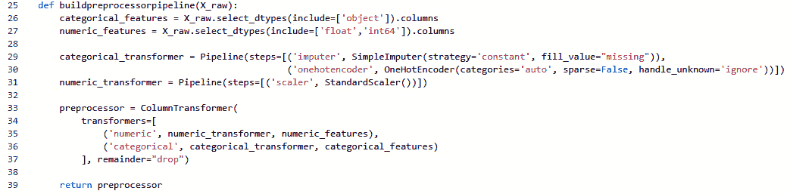

图 3.39 – 预处理程序

1.  我们已经集成了一个预处理管道来处理数据转换，如图*图 3.39*所示。创建一个数据转换的管道确保当我们对未见过的数据进行评分时，应用于我们的训练数据集的相同转换也会应用于测试数据和模型之前未见过的新的数据。这使模型部署能够在到达该步骤时在部署的模型中使用相同的转换。

1.  在`model_train`方法中，在绘制 ROC 曲线之后，我们使用`confusion_Matrix()`方法计算实验运行的混淆矩阵，它也将自动在 AML 中记录，如图中所示。

1.  这个实验直接在 AML 计算实例上运行，因为笔记本中的单元格是逐个执行的。打印语句和`plt.show`命令会在笔记本中直接提供输出，如图*图 3.40*所示。但是，Azure Machine Learning 服务也捕获了实验运行中的这些信息，所以当笔记本被清空时，模型评估的关键指标不会丢失：

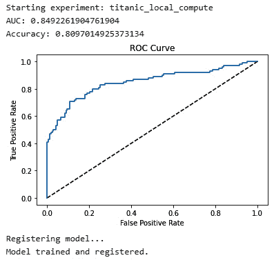

图 3.40 – 笔记本输出

1.  在左侧面板中，通过点击**作业**图标，我们可以在**实验**下看到蓝色的超链接**titanic_local_compute**。通过点击这个实验，我们可以深入了解实验的不同运行情况，如图*图 3.41*所示：

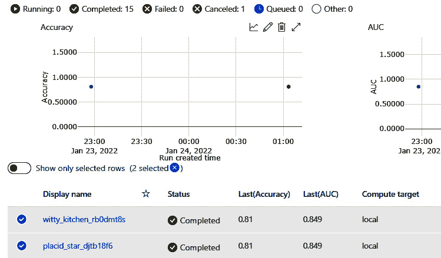

图 3.41 – 实验运行输出

1.  在实验中点击某个运行显示名称，可以提供有关实验运行的详细信息，如图*图 3.42*所示：

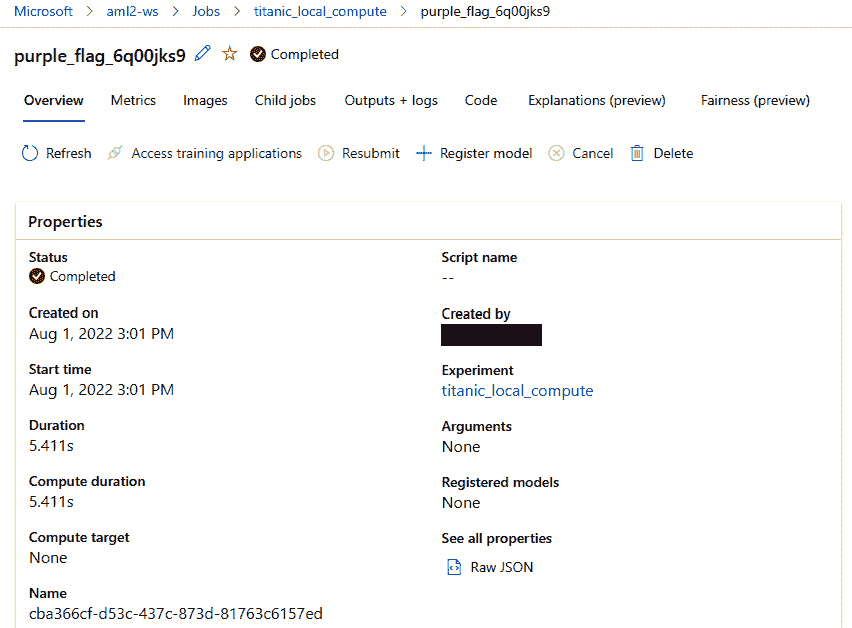

图 3.42 – 运行详情

1.  通过点击**指标**选项卡，我们可以看到我们的**AUC**和**准确率**值，如图*图 3.43*所示。这使数据科学家能够轻松比较模型，了解模型的变化如何影响性能，从而加速模型开发：

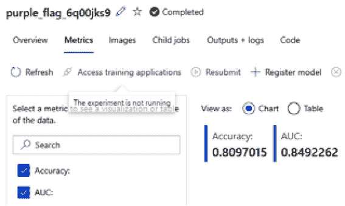

图 3.43 – 运行指标

1.  **图片** 标签页捕获与模型指标相关的图表，例如 ROC 曲线、精确率-召回率曲线和混淆矩阵，如图 *3.44* 所示：

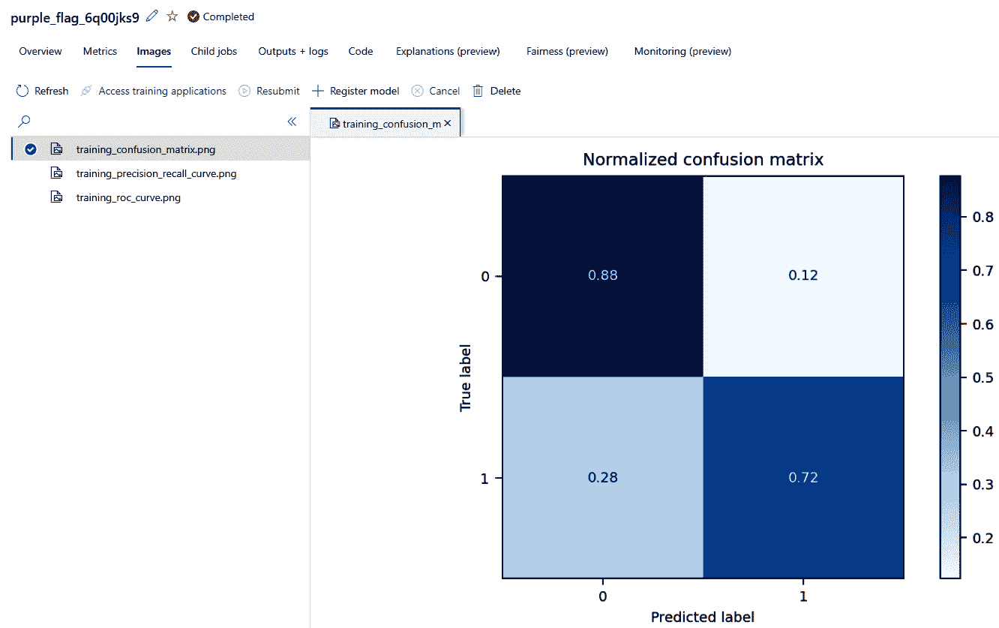

图 3.44 – 图片标签页

本节展示了如何使用 AML 计算实例来训练模型。目标是展示我们如何使用以代码优先的方法，结合常见的开源库来处理数据工程、特征选择和模型开发的任务。

在下一节中，我们将使用计算集群来训练模型。

# 在计算集群上训练

在上一节中，我们展示了如何在计算实例上训练您的模型。在本节中，我们将向您展示如何在需要扩展的训练作业时将训练作业提交到计算集群。AML 使您能够在各种计算目标上运行训练代码变得极其简单，而无需更改训练脚本。您需要创建一个 AML 管道来处理数据处理、模型训练和注册训练好的模型，如本节所述。

以下是在计算集群上训练您的模型的步骤：

1.  转到 [`ml.azure.com`](https://ml.azure.com)。

1.  选择您的工作区名称。

1.  在工作区用户界面的左侧，点击 **计算**：

图 3.45 – 计算图标

1.  在 **计算** 屏幕上，点击 **计算集群** 标签，然后点击 **+ 新建**，如图 *3.46* 所示：

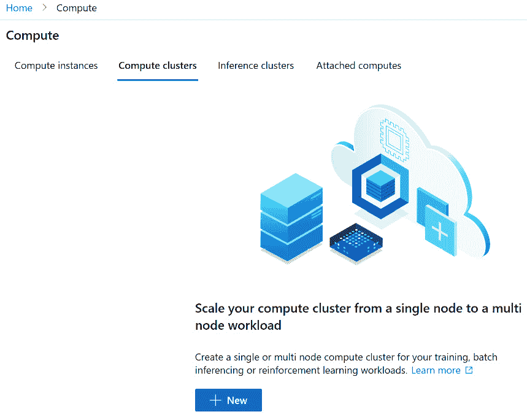

图 3.46 – 创建新的计算集群

1.  接下来的几个屏幕允许您根据需要创建和配置计算集群。完成后，点击 **创建**，如图 *3.47* 所示：

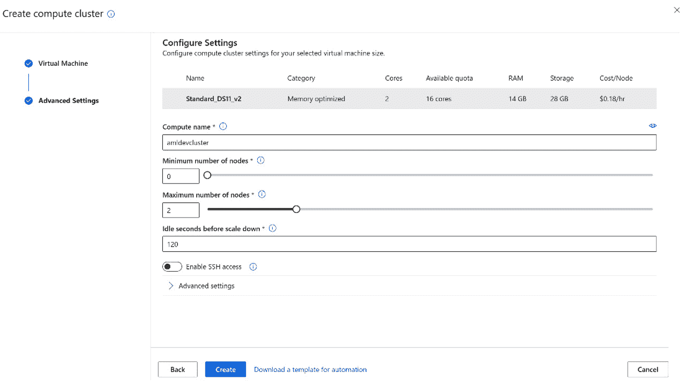

图 3.47 – 配置计算集群

1.  几秒钟后，您的新计算集群将启动，如图 *3.48* 所示：

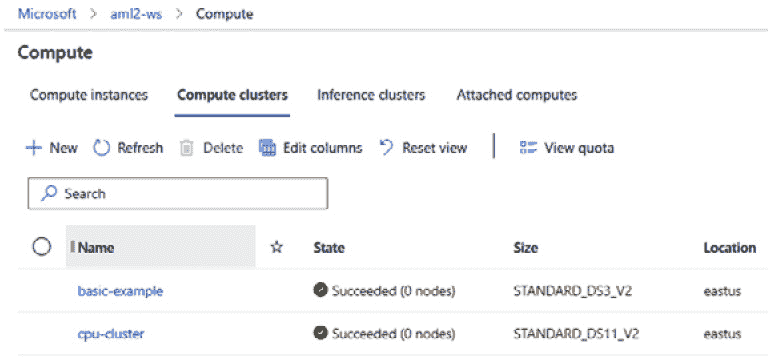

图 3.48 – 计算集群列表

1.  按照如图 *3.49* 所示，转到您的工作目录：

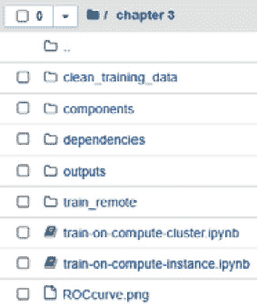

图 3.49 – 工作目录

1.  点击 **train-on-compute-cluster.ipynb** 将会打开笔记本，它与上一节中的笔记本非常相似。我们在此不再重复所有步骤，只介绍如何在您刚刚创建的远程集群上运行训练所需的步骤。要了解更多关于 AML 管道和提交远程作业的信息，请参阅 [`github.com/Azure/azureml-examples`](https://github.com/Azure/azureml-examples)。

图 *3.50* 中所示的代码片段用于创建一个对象以访问您的 AML 工作区：

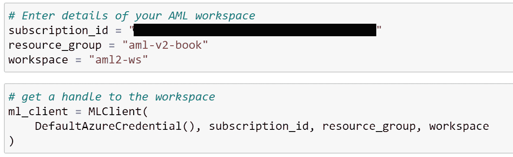

图 3.50 – 工作目录

1.  接下来，我们将创建一个 AML 环境，这是一个封装的 Python 环境，其中 ML 管道的不同步骤，如训练步骤，会发生。*图 3.51* 展示了如何使用 `conda.yaml` 文件为你的作业创建一个 `conda` 环境：

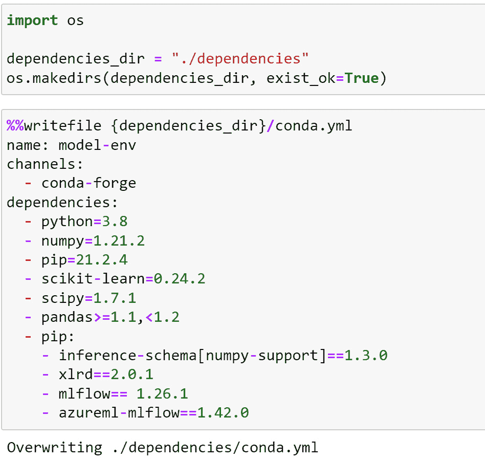

图 3.51 – conda 环境

1.  前面的 `.yaml` 规范文件包含在管道中使用的 Python 包。然后你可以使用这个 `.yaml` 文件在你的 AML 工作区中创建和注册这个自定义环境，如图 *3.52* 所示：

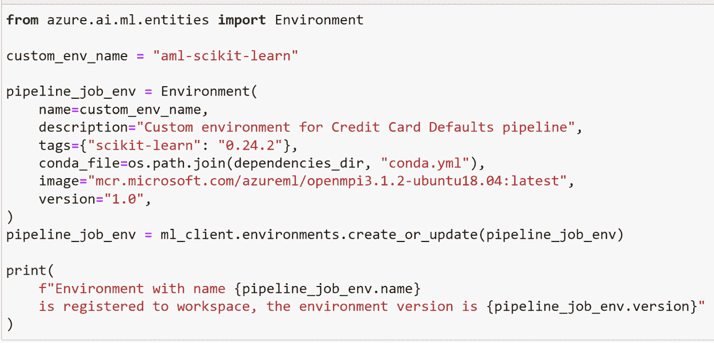

图 3.52 – 在 AML 中创建和注册自定义环境

要创建 AML 组件，你需要编写一个 Python 脚本来实现 ML 任务。此脚本可以接受输入数据和输入参数，这些参数在代码中使用，并将结果（例如，转换后的数据集或训练好的模型）输出到一个持久位置，例如挂载的文件夹。ML 组件的输出可以通过其 ML 组件的输入用作管道中下一步的输入。一旦你有了 Python 脚本，你可以通过编程方式或使用 `.yaml` 定义来创建组件。

1.  接下来，我们需要为管道的数据处理步骤编写一个 Python 脚本，如图 *3.53* 所示：

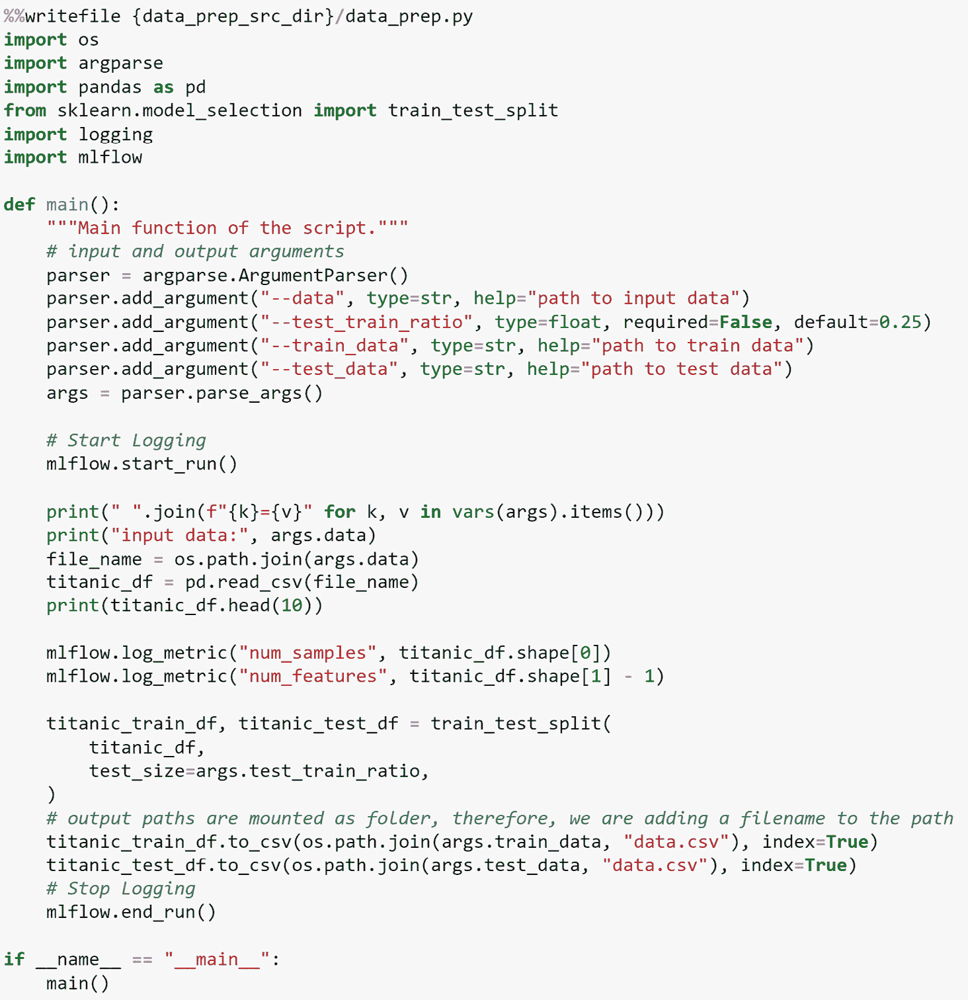

图 3.53 – 管道数据准备步骤的 Python 脚本

1.  现在我们有了执行数据处理任务的脚本，我们可以使用程序定义来创建一个 AML 组件。要创建 ML 组件，我们将使用 `command` 类来指定 Python 脚本的输入和输出、脚本的源代码目录、运行脚本的命令行以及此作业将运行的 Python 环境，如图 *3.54* 所示：

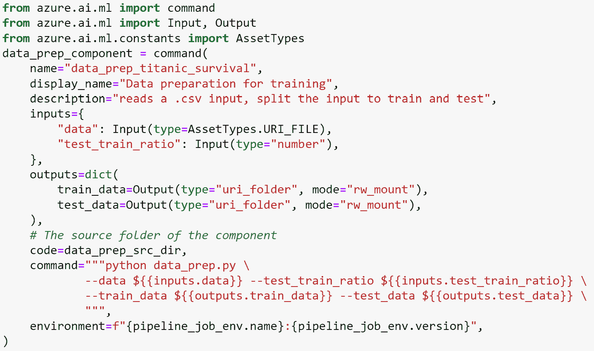

图 3.54 – 使用命令类创建数据处理组件

1.  接下来，我们需要为管道的模型训练步骤编写一个 Python 脚本，然后从中创建一个 AML 组件。请参考我们的 GitHub 以使用模型训练的 Python 代码。要创建 AML 组件，我们将这次使用 `.yaml` 定义，如图 *3.55* 所示：

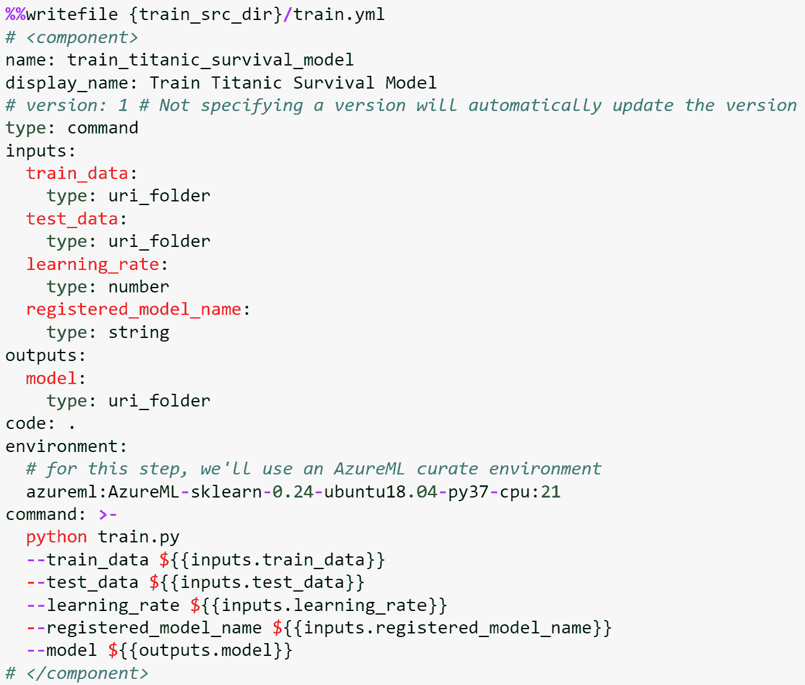

图 3.55 – 使用 yaml 定义创建模型训练组件

1.  我们可以从 `.yaml` 文件中加载训练组件，然后使用图 *3.56* 中所示的代码片段将其注册到工作区：

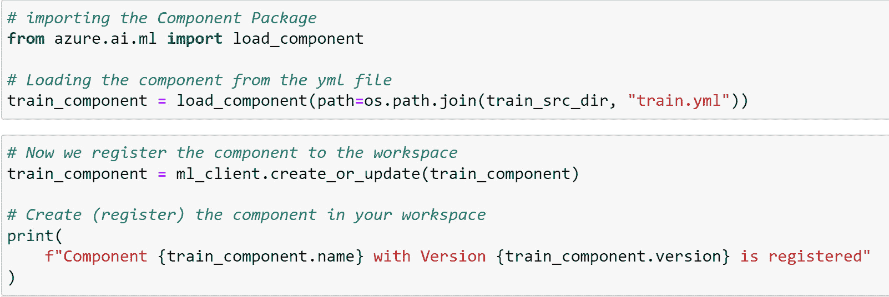

图 3.56 – 加载和注册模型训练组件

1.  现在数据预处理和模型训练组件都已创建，我们可以开始编写管道定义的代码，该代码将在后续步骤中调用。我们将使用`@dsl.pipeline`装饰器来告诉 SDK 我们正在定义一个 AML 管道，如图*图 3**.57*所示。如图所示，这里指定了计算目标，即我们在此节之前创建的计算集群：

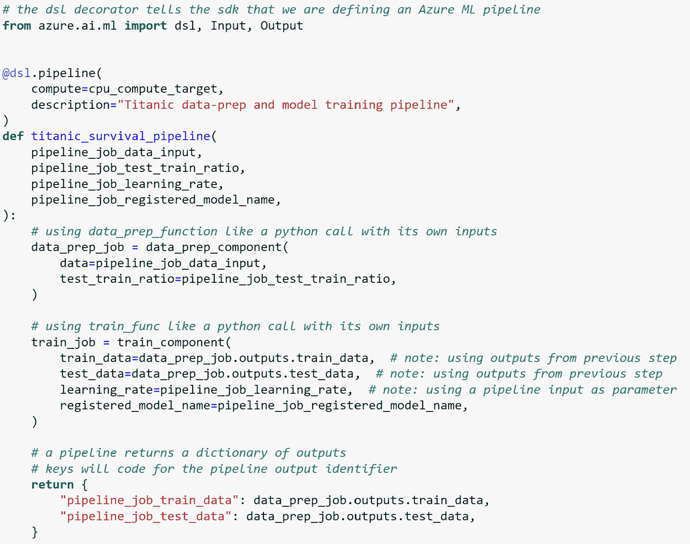

图 3.57 – 使用@dsl.pipeline 装饰器定义 AML 管道

1.  现在我们已经定义了我们的管道，让我们通过传递我们的数据集、分割率和训练模型的名称来实例化它，如图*图 3**.58*所示：

图 3.58 – 通过传递数据和参数实例化管道

1.  现在我们已经实例化了管道对象，我们可以将作业提交到 AML 中运行，AML 使用计算集群来运行管道内的步骤，如图*图 3**.59*所示：

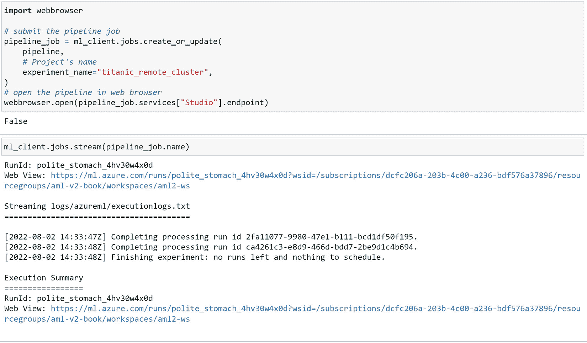

图 3.59 – 将管道作业提交到 AML 中运行

1.  要查看管道进度和每个步骤的详细信息，你可以点击图*图 3**.61*中显示的链接，或者点击**作业**选项卡，这将显示一个包含**titanic_remote_cluster**等实验的列表，如图*图 3**.60*所示：

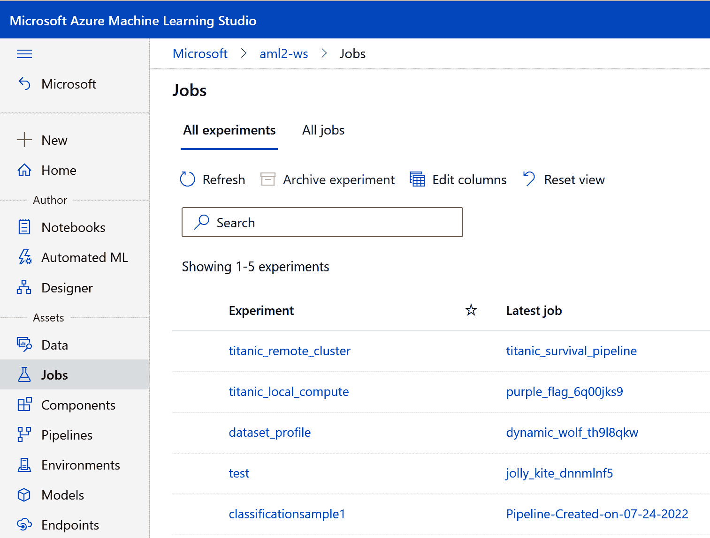

图 3.60 – 将管道作业提交到 AML 中运行

1.  点击**titanic_remote_cluster**实验，查看与该管道作业关联的所有运行的列表。你应该只看到这个作业的一个运行，这是我们刚刚在笔记本中运行的。点击它将带你去一个带有管道图形表示的屏幕，如图*图 3**.61*所示：

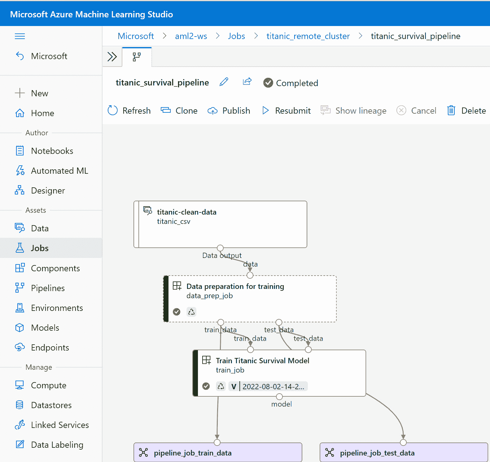

图 3.61 – AML 管道的图形视图

1.  点击管道的不同步骤，查看每个步骤的详细信息。例如，通过点击**训练泰坦尼克号生存模型**步骤，你可以看到模型指标，如准确率、精确率和召回率，如图*图 3**.62*所示：

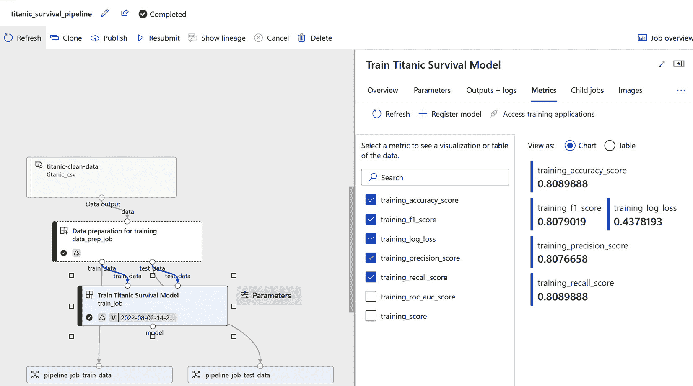

图 3.62 – 管道步骤的详细视图

你已经成功训练了一个模型，并使用 AML 计算集群在你的 AML 工作区中查看了指标。现在，让我们回顾本章。

# 摘要

我们在本章中涵盖了大量的主题。我们向您展示了如何使用 AML Designer 训练一个机器学习模型，这不需要编写代码。这对于希望快速探索不同算法并评估其性能的公民数据科学家或高级数据科学家来说是一个很好的选择。接下来，您学习了如何通过 AML Python SDK 训练一个机器学习模型，该 SDK 可以在计算实例和计算集群上运行，以处理更计算密集型的机器学习任务。

在下一章中，您将学习如何使用 AML HyperDrive 调整您的机器学习模型的超参数。
