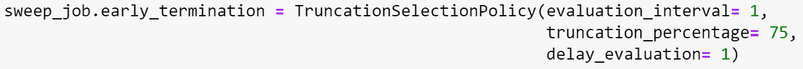

# 使用 AMLS 调整您的模型

**调整您的模型**是您数据科学之旅中的一个重要步骤。数据科学工作负载的目标是在最短的时间内提供最佳的模型，以应对未见过的数据。为了提供可靠的模型，您不仅需要调整作为模型输入的特征，还需要调整模型本身的参数。模型参数，也称为**超参数**，可以对您训练的模型性能产生重大影响。调整模型可能需要大量努力，并涉及试错。可以利用几个框架来自动化此任务。AMLS 提供了这项功能，我们将在本章中探讨。AMLS 允许您定义应调整以找到最佳模型的模型参数，通过使用称为**扫描作业**的特殊类型的工作来实现。这些超参数将为给定的 AMLS 作业定义，并且 AMLS 将在可能定义的值范围内运行许多试验，以确定最佳模型。

在本章中，我们将探讨 AMLS 如何通过扫描作业实现超参数调整。

在本章中，我们将涵盖以下主题：

+   理解模型参数

+   超参数采样

+   理解扫描作业

+   使用网格采样设置扫描作业

+   使用随机采样设置扫描作业

+   使用贝叶斯采样设置扫描作业

+   查看扫描作业的结果

# 技术要求

为了访问您的工作区，回想一下上一章中的步骤：

1.  前往[`ml.azure.com`](https://ml.azure.com)。

1.  选择您的工作区名称。

1.  在工作区**用户界面**（**UI**）的左侧，点击**计算**。

1.  在**计算**屏幕上，选择您的计算实例并选择**启动**：


图 4.1 – 开始计算

1.  您的计算实例将从**停止**状态变为**启动**状态。

1.  在上一章中，我们克隆了 Git 仓库——如果您还没有这样做，请继续遵循这里提供的步骤。如果您已经克隆了仓库，请跳转到*步骤 7*。

在您的计算实例上打开终端。请注意，路径将包括您的用户目录。在终端中输入以下内容以将示例笔记本克隆到您的工作目录：

```py
git clone https://github.com/PacktPublishing/Azure-Machine-Learning-Engineering.git
```

1.  点击*图 4.2*中显示的刷新图标将更新并刷新您屏幕上显示的笔记本：


图 4.2 – 刷新图标

1.  查看您`Azure-Machine-Learning-Engineering`目录中的笔记本。这将显示克隆到您工作目录中的文件，如图*图 4.3*所示：


图 4.3 – Azure-Machine-Learning-Engineering

# 理解模型参数

在你的数据科学工作中，当你定义你的特征时，你确定你的模型应该利用哪些参数。然而，根据所选算法的不同，你可以通过改变模型本身的参数来控制训练行为——这被称为**超参数调整**。使用超参数调整，我们可以探索各种模型参数，以确定建立最佳模型结果的最佳模型参数。为了评估模型结果，选择一个**主要指标**。主要指标被定义为评估模型的关键指标。每次更改超参数时，主要指标的价值要么上升要么下降，基于主要指标，这将产生更好的或更差的模型。

在本章中，我们将利用 `sklearn` 的逻辑回归实现和 `sklearn` 管道创建一个逻辑回归模型。对于一个逻辑回归模型，我们可以调整几个模型参数来提高我们模型的表现。对于一个逻辑回归模型，一个参数是惩罚项。将惩罚项定义为 `l2`，称为岭回归，是逻辑回归估计器在模型过于复杂时对模型应用惩罚所使用的。这使用模型系数的 `l2` 归一化作为惩罚。通常，`l2` 归一化通过惩罚复杂模型来防止模型过拟合。`l2` 范数平方模型系数，求和它们，然后取值的平方根。在创建模型时，我们可以选择 `l1` 范数，称为 lasso 回归，这将是系数绝对值的和作为惩罚项。将代码从利用 `l2` 归一化惩罚更改为 `l1` 归一化惩罚将利用超参数调整或调整模型参数的技术。如果我们不打算依赖超参数调整来选择惩罚项，我们可以说当少数预测变量显著时，lasso 回归通常比岭回归表现更好，而当有多个显著预测变量时，岭回归通常表现更好。

除了惩罚项之外，我们还可以指定 `C` 的值，它是正则化强度的倒数，作为调整我们模型的超参数。

我们将要调整的最后超参数是 `max_iter`，这是求解器在收敛之前可以进行的最大迭代次数。当你考虑在构建模型时想要探索的模型参数时，你正在定义搜索空间。**搜索空间**是一个定义超参数和超参数调整期间可能值的范围的概念。

现在我们已经了解了超参数调优和定义搜索空间，我们将探讨在 AMLS 作业中选择模型超参数组合的方法，以利用这些参数，这被称为**扫描作业**。

# 超参数采样

在搜索空间内，超参数可以是连续值或离散值。连续超参数可以在一个连续的值范围内，而离散超参数只能使用某些特定的值。对于逻辑回归，惩罚项可以有两个离散值之一：`l1` 或 `l2`。AMLS 可以使用列表或范围来设置超参数，正如我们将在深入研究代码时看到的。

对于`C`超参数，我们可以将其定义为离散值，或者我们可以将`C`定义为具有指定分布的连续范围内的值。

对于`max_iter`超参数，`sklearn`逻辑回归模型的默认值是`100`。我们可以将其设置为离散值，如`penality_term`，或均匀值，如`C`。

下面的代码显示在*图 4**.4*中定义了惩罚项、模型的逆正则化强度和最大迭代次数的选择，这些是定义作业命令的离散值：


图 4.4 – 定义搜索空间

一旦定义了搜索空间，我们就可以选择我们的扫描作业想要运行哪种类型的采样。对于搜索空间中定义的每个参数，都会根据采样的模型超参数创建试验。在 AMLS 的扫描作业中有三种可用的采样类型：**随机**、**网格**和**贝叶斯**。

网格采样将为每个超参数组合创建一个试验。例如，如果我们指定搜索空间以检查`l1`和`l2`，并选择`C`为离散值`0.01`、`.1`、`1`和`10`，以及`max_iter`为`10`、`100`、`150`和`200`，那么将创建`2x4x4=32`个试验。由于网格采样将为每个超参数组合创建一个试验，因此网格采样仅支持离散超参数。

当利用随机采样时，超参数值将在试验期间随机选择。

*图 4**.5*显示了在此搜索空间中定义的离散和连续超参数。在此代码中，`C`的值遵循在`0.01`和`10`之间的均匀分布，这是定义作业命令的值，这显示了我们可以如何将`C`定义为连续值，而不是像在*图 4**.5*中显示的那样，当`C`被定义为列表中的值时：


图 4.5 – 离散和连续超参数

在前面的例子中，由于`C`是一个连续超参数，我们无法利用网格采样，但我们可以利用随机或贝叶斯采样。

贝叶斯采样利用前一次试验的主要指标输出，以确定运行下一组超参数。

注意

网格空间采样不支持连续超参数 – 它将仅支持包含离散值的选项超参数。

由于超参数可以是离散的或连续的，我们将定义网格空间搜索的全面性以及如何结束搜索空间以提供给定模型最佳主要指标的作业。在下一节中，我们将探讨如何设置我们的作业以有效地和高效地搜索最佳超参数。

# 理解 sweep 作业

AMLS 中的 sweep 作业允许数据科学家在单个作业中定义要探索的超参数。在作业过程中，这将自动化搜索提供最佳主要指标结果的超参数的任务，创建并评估基于所选采样方法在搜索空间内定义的超参数的多个试验。通过定义搜索空间，我们可以创建单个作业的单一运行，以同时测试多个假设，而不是重写代码和重新运行作业，从而减少探索搜索空间所花费的时间。

为了利用您工作中的超参数，您的代码需要更新以通过 Python 的`ArgumentParser`将这些新参数传递到代码中，如下所示：


图 4.6 – 将参数列表传递到作业中

现在将参数传递到主函数后，它们可以在模型训练脚本中通过传递到`model_train`函数来利用。

这是将参数传递到`model_train`函数的代码：


图 4.7 – 传递模型训练参数

在`model_train`函数中，您可以在构建逻辑回归模型时利用超参数。

这是将参数传递到逻辑回归模型的代码：


图 4.8 – 利用超参数

与所有 AML SDK v2 作业一样，sweep 作业最初定义为`job`命令。在作业命令中，您指定代码、文件位置、带有参数的命令、输入、环境、计算和显示名称，但对于 sweep 作业，我们还会指定如*图 4.4*和*图 4.5*中所示的超参数。

一旦将作业命令更新为包括超参数，你就可以指定命令的扫描参数。在扫描方法中，你指定将要利用的计算资源、抽样算法、主要指标和目标。抽样算法可以设置为`random`、`bayesian`或`grid`，如前所述。主要指标是你希望在作业中记录并评估试验的指标。目标指定了你希望如何评估主要指标。目标可以是最小化或最大化主要指标，这用于评估你的模型性能。

这里展示了扫描作业命令的代码：


图 4.9 – 设置扫描参数

在此处的*图 4.9*中，你可以看到正在设置的扫描参数值。在这种情况下，我们将评估`test_AUC`主要指标，通过在名为`cpu-cluster`的计算集群上利用网格抽样算法来最大化。

要设置扫描作业的限制，我们指定最大总试验次数 – `max_total_trials` – 默认为`1000`。最大并发试验次数 – `max_concurrent_trials` – 如果未设置，则默认为`max_total_trials`指定的数字，将指定在任何给定时间内应运行多少并发试验。另一个需要设置的参数是超时时间：`timeout`。超时时间以秒为单位。超时时间适用于整个扫描作业，默认值为`100800`：


图 4.10 – 设置网格抽样的作业限制

注意，在本章中探索的网格抽样实验中，实际的总运行次数最大为 32，但如果我们添加了额外的选择作为超参数，设置试验限制将确保作业的总试验次数不超过图*4.10*中的 60 次。

使用随机抽样时，超参数是随机选择的，因此在这里设置作业限制将非常重要。正如所述，`max_total_trials`的默认值为`1000`，因此我们可以看到，当`max_total_trials`等于`120`时，将只为特定的作业运行创建`120`次试验。

设置扫描作业的最大限制如下：


图 4.11 – 设置随机抽样的作业限制

当利用贝叶斯抽样时，将利用先前试验的信息来确定搜索空间中要搜索的下一个参数。对于网格和随机抽样，每个试验与其他试验独立。鉴于网格抽样和随机抽样的每个试验都是独立的，一旦在给定试验中确定了主要指标，如果它不会产生最佳模型，则无需代码继续运行。这些试验可以提前终止，以便将计算资源用于下一个试验的主要指标评估。

为了启用早期终止，AMLS 扫描作业结合了**早期终止策略**的概念。如果未满足定义的标准，早期终止策略将在主要指标记录后提前结束一个给定的试验。对于早期终止，AMLS 支持几种策略，包括**无**、**截断**选择策略、**中值**停止策略和**赌博**策略。

如果未选择早期终止策略，试验运行将执行至完成 – 如前所述，这是贝叶斯抽样的要求。然而，当利用网格或随机抽样时，如果选择截断策略，AMLS 将根据所选的早期终止策略终止试验。

## 截断策略

如果选择截断策略，AMLS 将根据`truncation_percentage`中的值取消一部分表现最差的运行。

以下是一个早期终止策略的示例代码，该策略以`1`个间隔开始评估，并使用截断策略终止所有试验中最低的`75`%：



图 4.12 – 截断早期终止策略

当使用截断早期终止策略执行扫描作业时，在 AMLS 的**概览**选项卡中，您可以在**作业概览**屏幕上查看策略。无论选择哪种早期终止策略，都可以在**作业** **概览**屏幕上查看。

早期终止策略在工作区中的显示如下：


图 4.13 – 扫描作业的早期终止策略

除了截断策略之外，我们还可以设置一个中值策略，我们将在下一节中探讨。

## 中值策略

另一种早期终止策略是中值停止策略。该策略将根据所有训练试验的中值提前结束试验。如果给定试验的值低于中值平均值，它将被终止。

下面是早期终止策略的示例代码，该策略以 2 个间隔开始评估，并终止所有试验中低于中值的任何试验：


图 4.14 – 中值早期终止策略

## 赌博策略

一种称为“老虎机策略”的早期终止策略会在主要指标不在当前最成功试验的某个范围内时提前结束运行。这个范围由`slack_factor`定义。在评估时，最佳主要指标值除以（1+`slack_factor`），如果一个试验没有比这个值更好的主要指标，它将被提前终止。如果数据科学家更愿意设置一个值而不是用`slack_factor`设置一个比率，可以使用`slack_amount`代替：


图 4.15 – 老虎机早期终止策略

为了为老虎机策略提供一些背景，让我们假设到目前为止的间隔`2`中，我们的`test_AUC`的最佳指标为`.85`。在这个例子中，如果指标低于`.85`/`1.1`或`.773`，它将被终止。

随着训练变得越来越复杂，建立提前终止试验的能力可以确保在最终无法实现所需结果时不会消耗计算资源。

在下一节中，我们将探讨设置利用网格采样确定最佳模型超参数的扫描作业。

# 设置网格采样扫描作业

在本章的早期部分，我们克隆了我们的示例笔记本以利用这些材料。本章的笔记本，`'Chapter 4 – Hyperparameter Tuning'`，提供了利用`sklearn`管道和`mlflow`功能创建工作命令以创建逻辑回归模型的回顾。

然后更新代码并将其放置到一个新的目录中——`hyperparametertune`文件夹。代码利用 python 的`argparse`模块，该模块允许你将参数传递到脚本中。要运行由这个笔记本生成的脚本，我们将创建一个工作命令并更新工作命令以包括以下代码片段中的超参数：


图 4.16 – 用于网格采样的超参数扫描命令

注意，超参数已被包括在命令的输入中，但它们的值在前面图中的第 22 行添加到命令中。这可以作为一个单独的命令来完成，但为了说明目的，它被单独提供作为对`grid_sampling_job_command`的更新。

一旦准备就绪，我们调用扫描方法，提供计算、采样算法、主要指标和目标。回想一下，我们预计将看到 32 次运行，所以将`max_total_trials`设置为`60`不会产生影响，但如果我们更新超参数以包括更多的选择，我们可能会达到`max_total_trials`：


图 4.17 – 在网格采样期间调用扫描方法

在笔记本的后面，当我们查看随机采样和贝叶斯采样时，我们将`C`的值定义为连续值 - 然而，为了利用网格采样，我们将其定义为选择，即一系列离散值。

要提交`grid_sweep_job`，我们将命令传递给`ml_client`，它是为了管理到 AMLS 的连接而创建的：


图 4.18 – 执行扫描作业

当扫描作业正在执行时，获取正在运行的作业的状态可能会有所帮助。鉴于我们正在利用`mlflow`来记录`sklearn`模型的指标，我们可以请求给定父`run_id`值的所有试验，这是`grid_sweep_job`的运行。

在以下代码片段中，我们传递`experiment_id`和`run_id`值，并获取作业状态：


图 4.19 – 获取扫描作业的状态

我们在运行中搜索给定的`experiment_id`值。我们的`experiment_id`值将是`'chapter4'`，因此我们请求所有为`'chapter4'`创建的运行，并根据`tags.mlflow.parentRunId`进一步精炼该列表，它是与网格采样运行关联的`run_id`值。在*图 4**.19 的第 3 行中，我们请求与网格扫描作业运行关联的`run_id`值的运行。如果我们得到`0`的值，那么我们知道我们必须等待运行在 AMLS 中建立。一旦提供了运行，我们就继续到下一个`while`循环，在那里我们检查是否所有运行都已完成。一旦网格扫描作业的所有运行都已完成，第 24 行的消息将被打印出来。

恭喜你利用了带有网格采样的扫描作业！当你的超参数搜索空间包含离散值时，网格采样效果很好。接下来，我们将探索利用带有随机采样的扫描作业来探索超参数的连续值。

# 设置随机采样的扫描作业

正如我们在设置网格采样命令时看到的那样，随机采样的命令只是一个包含超参数的作业命令。`grid`命令和`random`命令之间有一个区别是，在随机采样扫描作业中，超参数可以是连续的。

这是随机采样的作业命令代码：


图 4.20 – 带有随机采样超参数的扫描作业命令

如第 25 行中的*图 4**.20 所示，`C`的值被定义为从`0.01`到`10.0`的均匀分布，这使得在整个搜索空间中这是一个连续的超参数。

就像网格采样扫描作业一样，我们为扫描设置参数，但如这里所示，我们使用随机采样算法来指定它们：


图 4.21 – 在随机采样期间调用扫描方法

给定扫描作业的参数和限制已设置，我们准备执行扫描作业。为了执行代码，我们再次利用 `ml_client` 方法创建或更新一个作业，如图 *4.18* 所示。

现在您已经完成了网格和随机采样，还有另一种可以应用的超参数采样类型，我们将在下一节中探讨。

# 设置贝叶斯采样扫描作业

在本章早期，我们克隆了我们的样本笔记本以利用这些材料。本章的笔记本 `'``Chapter 4` `- Hyperparameter Tuning'` 提供了创建创建 `sklearn` 管道和 `mlflow` 功能的作业命令的回顾。

然后更新代码并将其放置到一个新的目录中 – `hyperparametertune` 文件夹，该文件夹利用 Python 的 `argparse` 模块，并允许您将参数传递到脚本中。要运行由该笔记本生成的脚本，我们将创建一个作业命令并更新作业命令以包括超参数，如代码片段所示。方便的是，作业命令与 *图 4.16* 中显示的随机采样作业命令相同。

这里的唯一区别是采样算法被定义为 `bayesian`，如图所示：


图 4.22 – 使用贝叶斯采样调用扫描方法

为了执行代码，我们再次利用 `ml_client` 的方法创建或更新一个作业，并继续利用 `get_job_status` 方法，如图 *4.19* 所示。

您现在已经完成了 AMLS 中的网格、随机和贝叶斯超参数调优作业命令。我们将继续在 AMLS 中查看作业结果。

# 查看扫描作业结果

回想一下，对于扫描作业的单次试验，将创建多个试验以确定将提供最佳主要指标的模型。点击 AMLS 工作区左侧菜单面板中的 **作业** 将显示您要查看的作业列表。到目前为止，您已经运行了本章提供的样本笔记本 – 让我们查看您的结果。

点击 **chapter4** 作业将带您到您在本章中执行的作业。选择显示名称将深入查看特定作业的详细信息。让我们首先查看我们已运行的作业结果，如下所示：


图 4.23 – 作业结果

要查看作业结果，请按照以下步骤操作：

1.  点击 **实验** 名称，**Chapter04**，将带我们到本章中执行的不同作业扫描。

1.  点击您实验的给定运行将提供特定作业运行的详细信息，如图 *4.24* 所示：


图 4.24 – 作业扫描详情

关键信息被捕获为元数据，为给定作业运行提供可追溯性。这些信息包括以下内容：

1.  样本策略

1.  参数空间

1.  主要指标

1.  最佳试验

1.  完成的运行次数

1.  点击运行详情中的试验超链接，将显示具有所选主要指标最佳结果的试验：


图 4.25 – 最佳试验运行

1.  点击最佳试验运行的 **指标** 选项卡，可以提供给定试验的评估指标：


图 4.26 – 扫描作业最佳试验运行的指标

1.  要全面审查为作业运行创建的所有试验，您可以点击作业运行并转到如图 *4.27* 所示的 **试验** 选项卡：


图 4.27 – 网格采样扫描作业的试验运行

不仅可以通过 AMLS 工作空间 UI 对给定作业运行的每个指标进行审查，还可以查看一个平行坐标图，显示所选的不同超参数如何影响主要指标。

要全面审查搜索空间及其对主要指标的影响，请查看 **试验** 选项卡中的平行坐标图：


图 4.28 – 网格搜索空间平行坐标图

除了平行坐标图之外，AMLS 还提供了二维散点图和三维散点图来评估超参数调整。

超参数调整的 3D 散点图如下所示：


图 4.29 – 3D 散点图

我们已经看到了如何在 AML Studio 中通过图表图形化地查看和比较模型，但我们并不局限于通过 UI 访问这些有价值的信息。

我们不仅可以通过在实验选项卡中查看结果来通过 AMLS Studio 获取扫描作业的最佳试验，还可以通过利用 AMLS Python SDK v2 来访问这些信息。

将作业运行的输出放入 pandas DataFrame 的示例如下：


图 4.30 – 将作业结果放入 pandas DataFrame

在笔记本的末尾，我们包含了返回完成作业运行的 pandas DataFrame 的代码：


图 4.31 – 对作业试验进行排序以获得最高的 test_AUC

假设我们已经根据主要指标对 pandas DataFrame 进行了适当的排序，我们可以轻松地提取出最佳试验运行的 `run_id` 值，如下所示：


图 4.32 – 从排序的 pandas DataFrame 获取最佳 run_id 值

现在我们已经将最佳运行检索到`best_run_id`变量中，如图所示，我们可以利用扫描作业中的最佳模型。

从最佳扫描作业试验中加载模型如下所示：


图 4.33 – 加载最佳模型

一旦模型被加载，并且我们使用创建模型时使用的虚拟环境，我们就可以使用加载的模型进行推理，如下所示：


图 4.34 – 使用扫描作业中的最佳模型进行推理

恭喜您 – 您已从 SDK v2 中检索到给定扫描作业的最佳试验运行！此运行信息可以在 UI 中查看，也可以通过编程方式查看。

# 摘要

在本章中，我们探讨了模型参数是什么以及如何利用扫描作业来调整给定模型定义的超参数。我们还探讨了基于所选搜索空间和采样方法设置扫描作业的选项。AMLS 提供了在搜索空间中扫描以调整模型的能力，自动化计算集群上的超参数调整过程，在试验完成后，在空闲期间自动关闭，明智地消耗计算资源。

除了设置扫描作业外，您还能够在 Studio 以及代码中查看您的结果 – 提供了对您用例中表现最佳模型的直观洞察。现在您已经完成了本章，请务必关闭您的计算资源以节省成本。

在下一章中，我们将向您展示如何利用 AMLS 来接管模型开发这一耗时任务。此功能不仅可通过 SDK 和 CLI 访问，还可在 AMLS Studio 本身中访问。
