# 5

# Azure 自动化机器学习

**自动化机器学习**，也称为 AutoML，是机器学习模型开发中迭代和时间消耗过程的自动化。AutoML 使数据科学家和机器学习工程师能够以高效的方式开发高性能模型，使他们能够快速扩展和构建最佳模型。数据科学家可以依赖 AutoML 来执行繁琐的模型开发任务，如特征工程、算法选择、超参数调整和模型评估。

在本章中，我们将涵盖以下主题：

+   Azure AutoML 简介

+   AML 中的特征化概念

+   使用 AMLS 进行 AutoML

+   使用 AML Python SDK 进行 AutoML

+   通过 AML 和 AML SDK 解析您的 AutoML 结果

# 技术要求

在本节中，我们将通过逐步操作来展示如何从头到尾创建一个自动化机器学习模型。

为了访问您的 workspace，回顾前一章中的步骤：

1.  前往 [`ml.azure.com`](https://ml.azure.com)。

1.  选择您的 workspace 名称。

1.  在左侧工作区的 **用户** 界面上，点击 **计算**。

1.  在 **计算** 屏幕上，选择您的计算实例并选择 **启动**：

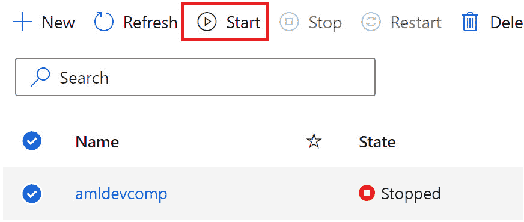

图 5.1 – 开始计算

1.  您的计算实例将从 **停止** 状态变为 **启动** 状态。

1.  在 *第二章*，“在 AMLS 中处理数据”，我们克隆了 Git 仓库 – 如果您还没有这样做，请继续按照这里提供的步骤操作。如果您已经克隆了仓库，请跳转到 *步骤 7*。

1.  在您的计算实例上打开终端。注意路径将包括您的用户目录。在终端中输入以下内容以将示例笔记本克隆到您的工作目录：

    ```py
    git clone (https://github.com/PacktPublishing/Azure-Machine-Learning-Engineering.git)
    ```

1.  点击图 *图 5.2* 中显示的刷新图标将更新并刷新屏幕上显示的笔记本：


图 5.2 – 刷新

1.  查看您 `Azure-Machine-Learning-Engineering` 目录中的笔记本。这将显示克隆到您工作目录中的文件，如图 *图 5.3* 所示：

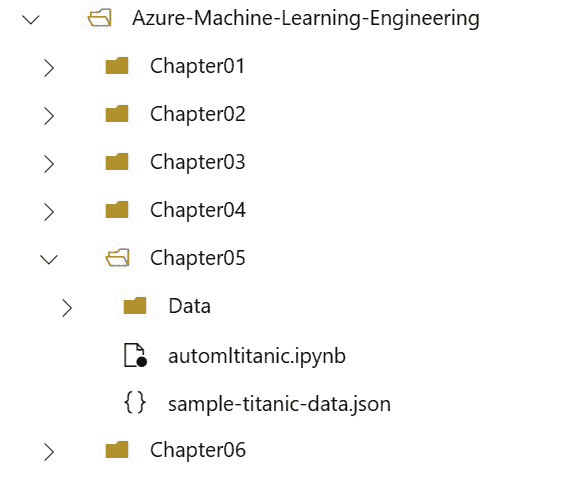

图 5.3 – Azure-Machine-Learning-Engineering

现在，让我们了解 Azure Machine Learning（AML）AutoML 是什么，它的一些好处以及如何使用它们。

# Azure AutoML 简介

AutoML 是一个强大的解决方案，它不仅使数据科学家能够构建机器学习模型，还使公民数据科学家能够构建支持各种用例的机器学习模型。目前，AutoML 支持预览中的分类、回归、时间序列预测和计算机视觉。分类涉及一个响应变量，用于标识一个类别。输入训练数据集将被用来构建一个模型，以预测新样本将落入哪个类别。利用泰坦尼克号数据集，我们可以利用分类模型来预测乘客是否能在泰坦尼克号上幸存。除了支持分类模型创建外，AutoML 还能够生成回归模型。回归模型将提供模型输出的连续值。回归模型的一个例子是预测汽油价格或出租车费用。AutoML 还可以根据时间序列预测预测值。不仅如此，AutoML 还支持使用**AML Studio**（**AMLS**）Python SDK 进行图像分类、目标检测和实例分割。

虽然 AMLS 支持各种 AutoML 任务，但 AMLS Python SDK 支持各种功能，供开发人员和数据科学家利用，这些功能目前仅通过 AMLS 本身无法获得。

使用 Python SDK，我们不仅找到了对计算机视觉任务的支持，还包括查看特征化信息、启用投票集成模型、根据非主要指标显示最佳模型，以及启用和禁用**开放神经网络交换**（**ONNX**）模型兼容性。

# AML 中的特征化概念

为了提供最佳的模型，无论是否利用 AutoML，模型创建的一个重要步骤是特征工程。在 AMLS 中，AutoML 将默认利用特征化。如果特征工程步骤已经完成，可以在 UI 和 SDK 中禁用此功能。这些对您的数据集进行的特征化转换不仅可以启用或禁用，还可以自定义或排除特定列。根据列的类型和数据类型，您的数据集将应用几种特征化步骤。

在训练过程中，AutoML 利用缩放或归一化来确保模型性能。AutoML 利用各种技术，包括缩放到单位方差、按分位数范围缩放、按最大绝对值缩放、按列的最小值和最大值缩放，以及应用**主成分分析**（**PCA**）进行降维、**奇异值分解**（**SVD**）进行降维，以及将每个样本缩放到 1 的范数。

假设特征化已启用，某些列将在训练过程中被删除。没有方差（意味着所有行都有相同的值）的列或具有高基数（意味着它们具有非常高的方差，例如具有 GUID 值的列）的行将被删除。如果一个列具有数值但方差低，AutoML 会将该值转换为分类特征并应用独热编码。如果一个分类列具有高方差，将利用独热哈希编码。

AutoML 还将为每个数值列生成一个 k-means 聚类模型。每个样本将添加其与簇中心的距离到数据集中。

通常，数据集会包含缺失值。如果列是数值型的，AutoML 会用平均值替换缺失值；如果列是分类型的，它会使用给定列中最常见的值来填充。实际上，这可以通过在 AutoML 中利用`FeaturizationConfig`来自定义。缺失值填充器可以用值的均值、中位数或众数来替换值。

对于日期时间值特征，将生成包括年份、月份、日、年中的日、星期几、季度、小时、分钟和秒在内的附加特征。

对于预测任务，利用`TimeIndexFeaturization`类生成许多不同的特征。例如，包括一个整数值，指定是否在某个日期之前或之后（例如 7 月 1 日），年份、日历季度、日历月份、日、小时、分钟、秒、上午或下午指示符、星期几、季度中的天数（1 到 92）、年中的天数（1 到 366），以及由 ISO 8601 标准定义的 ISO 周和年。

对于文本特征，将基于三元组、二元组和单语元添加词频。文本特征被转换为文档特征向量。通过启用深度学习，AutoML 可以在特征化过程中配置利用**双向编码器表示从 Transformer**（**BERT**）。

AutoML 不仅可以处理各种特征化步骤以准备模型进行训练，还可以在 AMLS 中直接处理分类、回归和时间序列预测，并完成相同的建模任务，以及通过 AML Python SDK 完成计算机视觉任务。

在下一节中，我们将探讨如何利用 AMLS 来完成对著名泰坦尼克号数据集的分类。数据集链接将在本书的 GitHub 存储库中提供。

# 使用 AMLS 的 AutoML

如本章前面所述，在 AML 中可以使用两种方式使用 AutoML。对于公民数据科学家或偏好无代码方法的数据科学家，可以使用 AMLS；对于有编码经验的数据科学家，可以使用 AML Python SDK。在本节中，我们将向您展示如何使用 AMLS 在您的泰坦尼克号数据集上训练分类模型，以预测乘客是否能在泰坦尼克号灾难中幸存。

请在 [`ml.azure.com`](https://ml.azure.com) 上登录到 AMLS 并按照以下说明操作：

1.  选择您在整个书中使用的订阅和工作室。

1.  在工作室的左侧，如图 *图 5.4* 所示点击 **自动化机器学习**：

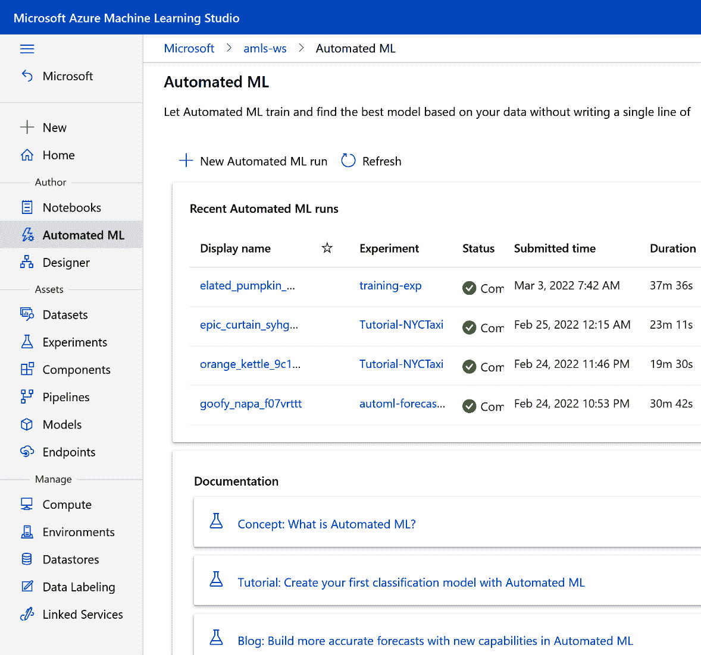

图 5.4 – 导入 AutoMLConfig

1.  从您的本地计算机选择 `titanic.csv` 上传到 Azure，如图 *图 5.5* 所示：

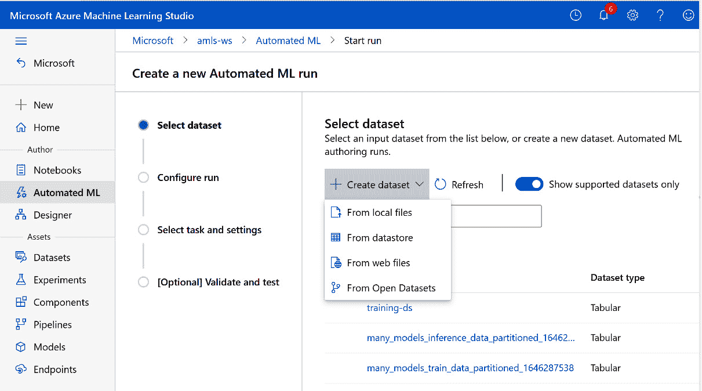

图 5.5 – 通过从本地计算机上传 titanic.csv 创建新的数据集

1.  按如图 *图 5.6* 所示为数据集提供基本信息：

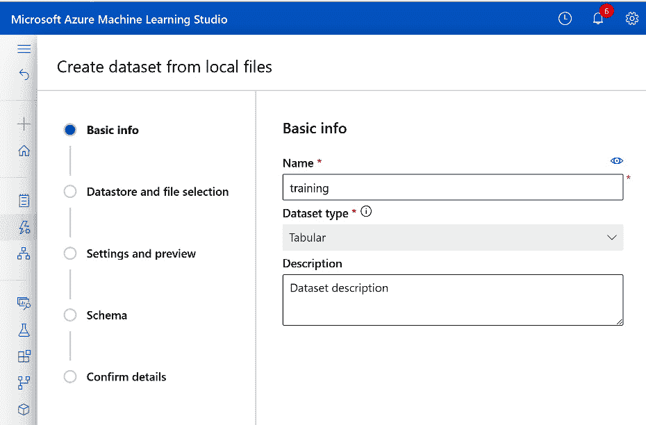

图 5.6 – 为数据集提供基本信息

1.  在下一屏幕上，如图 *图 5.7* 所示点击 `titanic.csv`。数据集可在本书的 GitHub 仓库中找到：

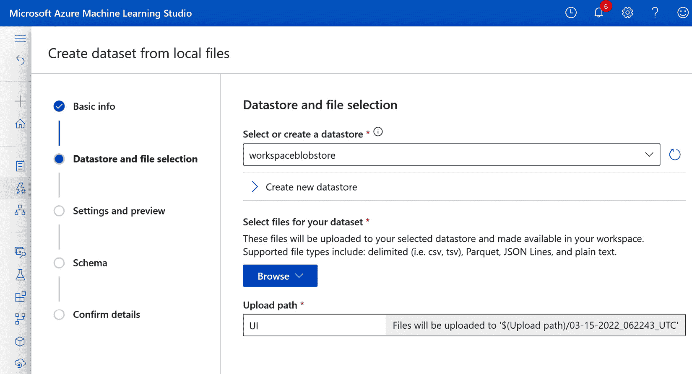

图 5.7 – 提供存储数据文件的位置

1.  上传后，下一屏幕将显示基于上传文件的设置和预览。您唯一需要更改的设置是在 **列标题** 下，您应该将其设置为 **只有第一个文件有标题**，如图 *图 5.8* 所示：

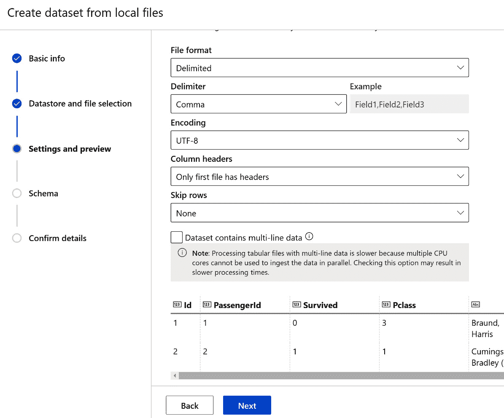

图 5.8 – 数据集预览

1.  下一屏幕将显示数据集的模式，该模式已从文件自动检测到，如图 *图 5.9* 所示：

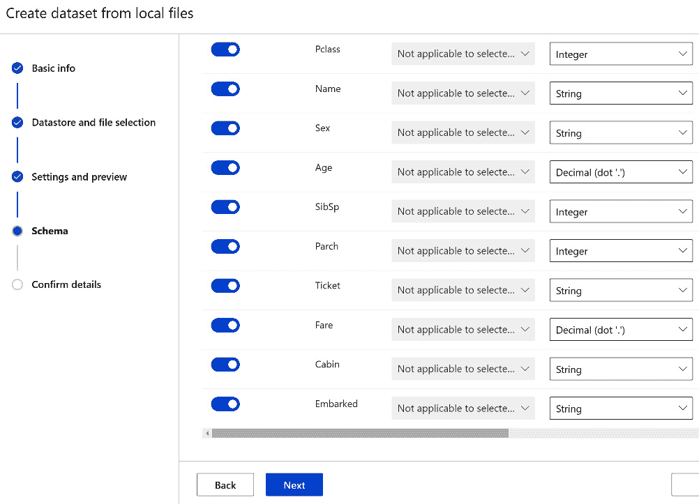

图 5.9 – 数据集设置

1.  最后一步是审查并确认细节，然后如图 *图 5.10* 所示点击 **创建**：

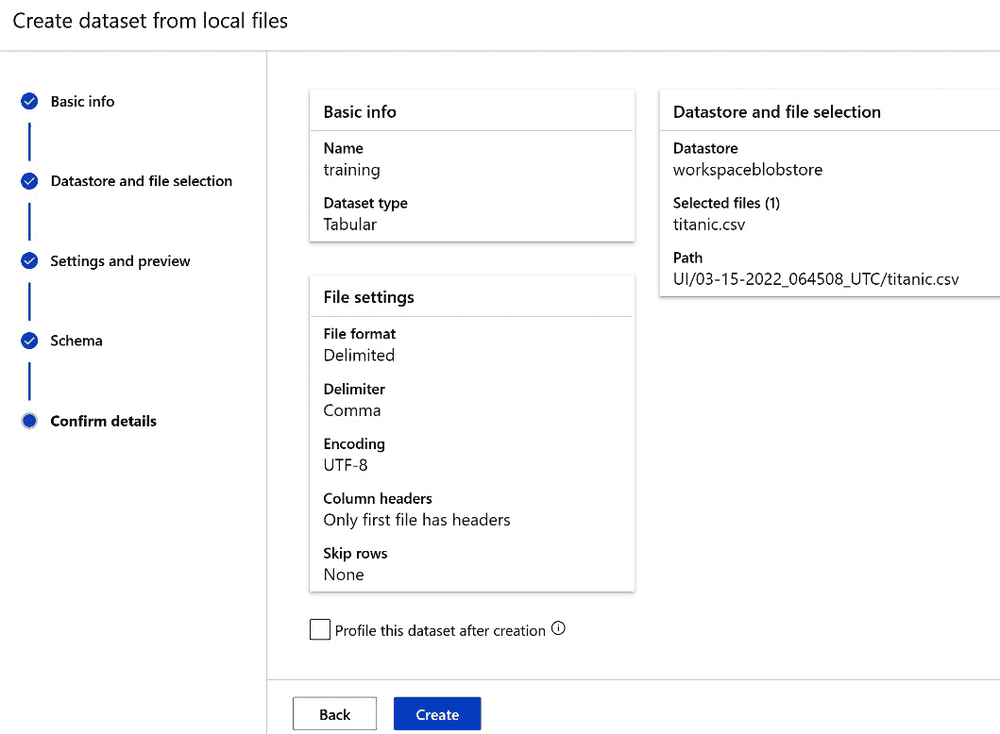

图 5.10 – 审查和确认数据集的创建

1.  您将被带回到数据集列表。您应该在列表顶部看到我们命名为 **训练** 的泰坦尼克号数据集。继续，选择它，然后如图 *图 5.11* 所示点击 **下一步**：

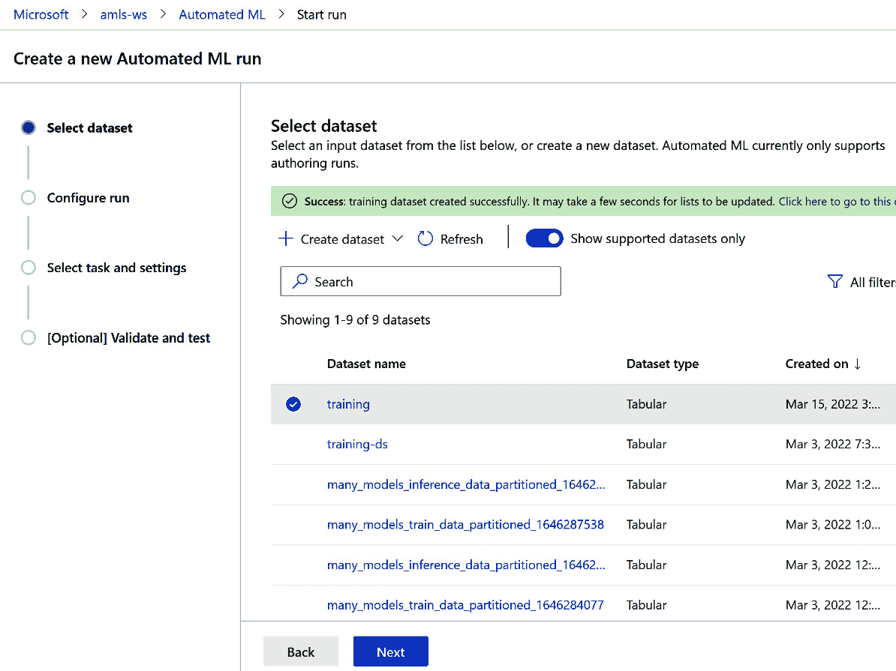

图 5.11 – 选择训练数据集并点击 **下一步**

1.  在此步骤中，您需要为您的 AutoML 运行创建一个实验，然后选择目标列，有时称为 *因变量*，最后选择用于模型训练的计算集群，如图 *图 5.12* 所示：

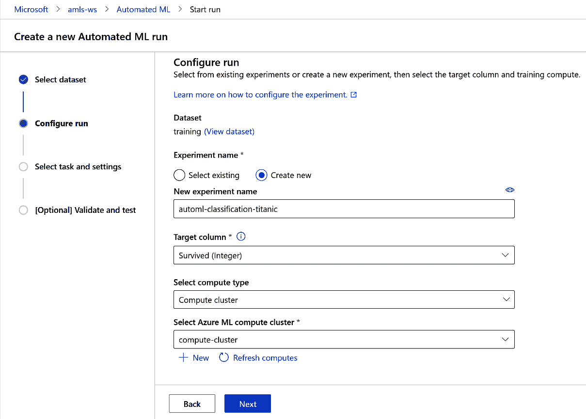

图 5.12 – 创建新的 AutoML 实验，选择目标列和计算集群

1.  在下一屏幕上，您可以选择机器学习任务。AutoML 已根据目标列自动检测到任务。在这种情况下，它应该是 **分类**，如图 *图 5.13* 所示：

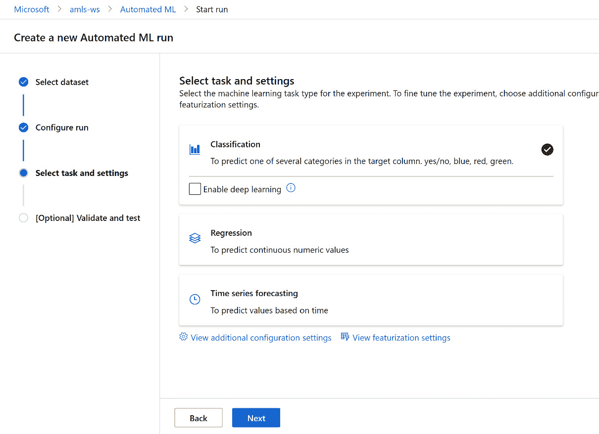

图 5.13 – 选择机器学习任务（例如，在本例中，为分类）

1.  接下来，点击 `0.5` 小时）。点击 **保存** 以退出，如图 *图 5.14* 所示：

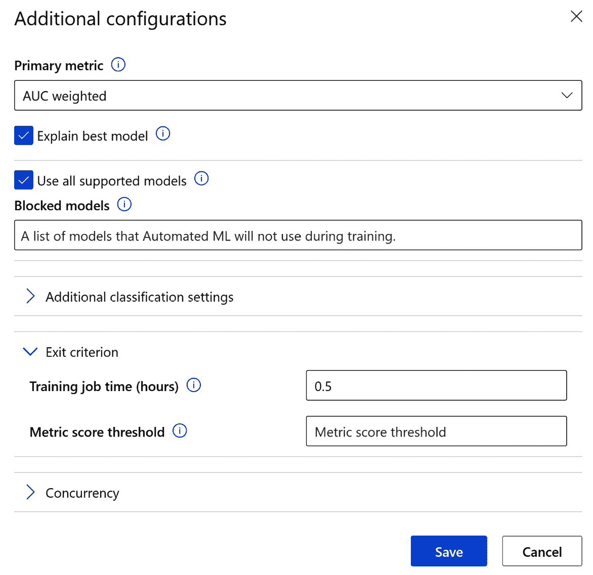

图 5.14 – 配置训练作业设置

1.  点击 `3`。对于 `10`，最后，点击 **完成**，如图 *图 5.15* 所示：

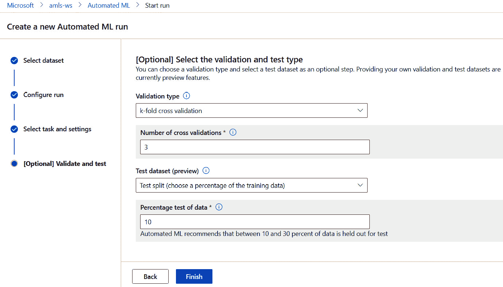

图 5.15 – 设置验证类型和测试数据集

1.  一旦模型训练完成，你将看到一个屏幕，其中总结了训练统计信息，例如训练持续时间、**训练**数据集的链接以及最佳性能模型的摘要，包括其算法名称和性能指标（例如，**AUC 加权**），如图 *图 5.16* 所示：

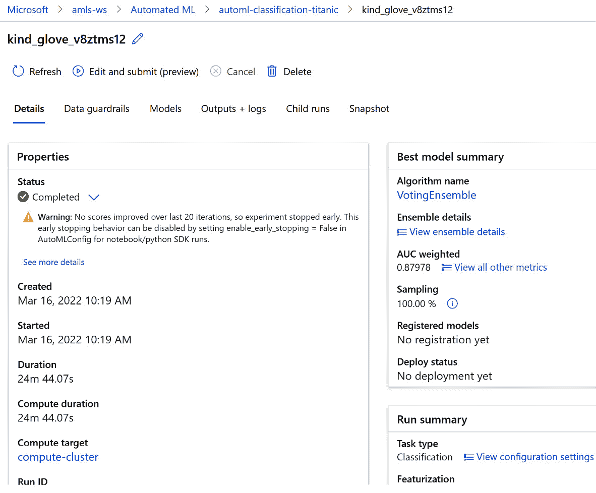

图 5.16 – 训练完成后模型和运行摘要

现在，你已经看到了如何通过 AMLS 利用 AutoML，请花点时间回顾输出，不仅是在 *详细信息* 部分，如图 *图 5.16* 所示，还要查看每个选项卡并探索 AutoML 实验运行期间提供的大量信息。

接下来，我们将探索如何通过 AML Python SDK 利用 AutoML。AML Python SDK 提供了对实验的精细控制，我们将在下一节中看到。

# 使用 AML Python SDK 进行 AutoML

现在，你已经看到了如何在 AMLS 中利用 AutoML，我们将探索如何利用 AML Python SDK 创建模型。

在本章前面的部分，在 *AutoML 简介* 中，我们克隆了我们的示例笔记本以利用这些材料。对于本章，请注意，有一个名为 `Chapter5_Titanic_AutoML` 的单个笔记本。初始代码应该看起来很熟悉，因为数据集的准备没有变化。然而，当我们运行实验时，我们现在将利用一个 AutoML 实验。

为了运行一个 AutoML 实验，我们需要导入 `AutoMLConfig`，如图中 *第 8 行* 所示。

下面是使用 Python SDK 导入 `AutoMLConfig` 的示例：

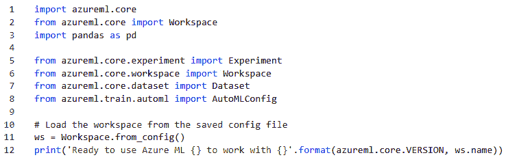

图 5.17 – 导入 AutoMLConfig

作为 AutoML 实验的一部分，我们需要指定一个训练数据集，但不需要指定验证或测试数据集。然而，我们可以指定训练和验证数据集，并在预览中指定测试数据集。在我们的示例中，我们将数据集分为训练、测试和验证数据集。

通过使用 `sklearn` 中的 `train_test_split` 方法，我们将数据集分成三个数据集，分别用于训练、验证和测试。

现在我们来探讨如何分割数据以训练模型，以及测试模型以分析所建模型的准确性：

1.  以下代码将分割数据集用于模型训练和模型评估。我们还指定了用于预测的列 – 在以下情况下，它是`Survived`。然后，我们将打印输出以验证分割是否成功。以下是用于模型训练、测试和验证的数据集分割：

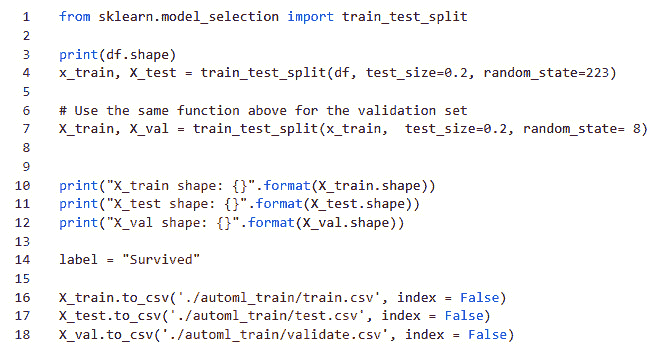

图 5.18 – 数据集分割

一旦数据集被分割，我们可以从本地目录上传数据集，这些数据集被保存在`automl_train`文件夹中，当放置到 blob 存储时，它们将被放置在名为`titanic-auto-ml`的目录中。

1.  在下面的屏幕截图中，目录被上传到默认的数据存储：

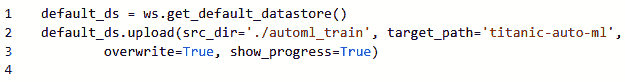

图 5.19 – 将数据集上传到数据存储

1.  由于数据现在在 blob 存储中，我们可以利用这些文件使用 AML Python SDK 创建表格数据集，并注意它们在 blob 存储中的位置，如下所示：

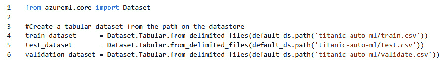

图 5.20 – 创建 AML 表格数据集

1.  使用 AML Python SDK，我们可以在*第 4 行*的代码块中创建一个实验，如下所示：

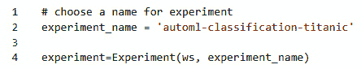

图 5.21 – 创建 Azure ML 实验

AutoML 实验可以在计算实例上运行，但考虑到实验的持续时间将比我们迄今为止看到的要长，我们将它在计算集群上运行。以下代码显示了如何创建计算集群，正如我们在*第一章**，介绍 Azure 机器学习服务*中看到的。

1.  接下来，我们将创建一个计算集群以便我们编写代码：

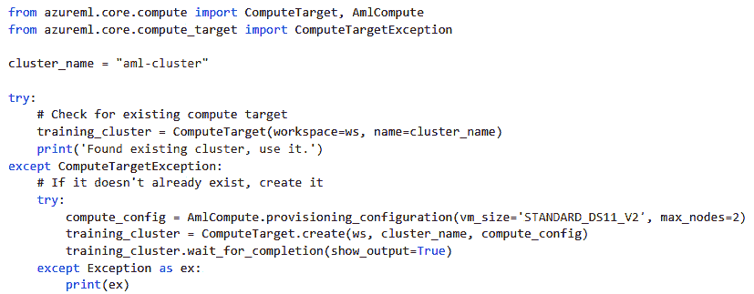

图 5.22 – 为运行 AML 实验运行创建计算集群

对于 AutoML 实验，我们能够通过 Python SDK 提供对正在运行的实验的精细控制。

1.  通过 SDK 运行的 AutoML 实验可以在实验运行期间指定其行为：

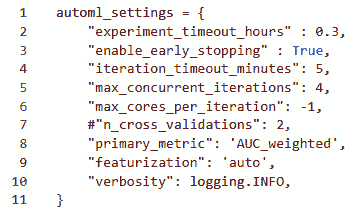

图 5.23 – AutoML 实验设置

如*图 5*.*23*所示，我们可以指定`experiment_time_hours`。如果没有提供值，实验运行将在 6 天后超时。`enable_early_stopping`默认为`True`，如果模型在`n_interations`后没有改进，它将提前停止实验。这种行为确保在实验运行提前停止之前至少运行 20 次迭代。

`iteration_timeout_minutes`是每个迭代可以运行的最长时间，在此之后它将被终止。如果没有指定，将使用默认值 1 个月。另一个可以配置的设置是`max_concurrent_iterations`。AML 计算集群可以处理每个节点一个迭代。指定此值将扩展给定集群中活动节点的数量。如果`max_concurrent_iterations`大于给定集群中的节点数，那么实验运行将被排队，并在集群中有一个节点可用时执行。将`max_cores_per_iteration`设置为`–1`表示应该利用计算运行迭代时所有可用的核心。此值默认为`1`。提供`–1`、`1`或小于或等于运行训练实验的计算上核心数的数值是可以接受的。

我们可以指定`n_cross_validations`，这将确保验证数据集将从训练数据中提取。然而，在我们的实验中，我们明确传递了一个验证数据集，所以这在**图 5**.23 的**第 7 行**被注释掉了。如果既没有设置`n_cross_validations`，也没有提供验证数据集，AutoML 将使用它自己的验证技术。如果两者都没有提供，并且一个 AutoML 实验运行正在使用大于 20,000 行的数据集，那么将使用 10%的数据作为验证数据集。如果数据集小于 20,000 行，则利用交叉验证。如果数据集小于 1,000 行，则使用 10 个折进行交叉验证；如果数据集在 1,000 到 20,000 行之间，则使用 3 个折进行交叉验证。

`primary_metric`是用于评估模型的指标。每个任务类型都有一个有效的指标列表。这里的代码提供了一个可用于分类模型评估的指标列表：

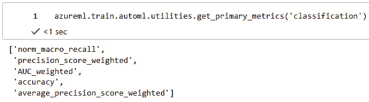

图 5.24 – 分类的主要指标

可以设置的另一个 AutoML 实验运行属性是特征化。这里的值可以是设置为`auto`、`off`或`FeaturizationConfig`。如果指定了`FeaturizationConfig`的值，你可以提供自定义特征化，这将允许你指定支持使用均值、中位数或众数作为填充器的列转换器属性，以及一个热哈希编码。对于我们的示例，我们将保持特征化为`auto`。

通过设置**图 5**.23 中的详细程度值，我们指定了给定实验中记录的信息的粒度。将日志保持在`INFO`级别将在 AutoML 实验的运行中提供细粒度的日志。

下一步需要做的是创建用于运行实验的 `AutoMLConfig` 对象。有许多属性支持 AutoML 实验运行。我们将首先审查的属性是 *任务* 属性。支持的任务类型包括分类、回归和预测。目前，在公共预览版中，多类别和多标签图像分类、目标检测和实例分割是可用的。对于我们的任务类型，我们将选择 `'classification'`，如下面的截图所示：

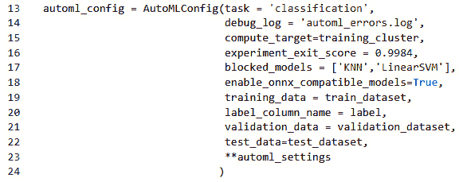

图 5.25 – AutoMLConfig 对象

`debug_log` 属性指定了调试信息写入的日志文件。如果没有指定，则使用 `'automl.log'` 作为日志文件名。

`compute_target` 被指定，可以是计算实例或计算集群。利用计算集群可以实现 AutoML 实验运行的并发运行，而计算实例无法实现这一点。

`blocked_models` 是一个要排除在给定 AutoML 实验运行之外的模型列表。对于分类模型，以下是可以排除在给定实验之外的模型列表：

| **分类模型** | **AutoML 配置值** |
| --- | --- |
| 平均感知器分类器 | `AveragedPerceptronClassifier` |
| 伯努利朴素贝叶斯 | `BernoulliNaiveBayes` |
| 决策树 | `DecisionTree` |
| 极端随机树 | `ExtremeRandomTrees` |
| 梯度提升 | `GradientBoosting` |
| K 近邻分类器 | `KNN` |
| Light GBM 分类 | `LightGBM` |
| 线性支持向量机 | `LinearSVM` |
| 逻辑回归 | `LogisticRegression` |
| 多项式朴素贝叶斯 | `MultinomialNaiveBayes` |
| 随机森林 | `RandomForest` |
| SGD 分类器 | `SGD` |
| 支持向量机 | `SVM` |
| TabNet 分类器 | `TabNetClassifier` |
| TensorFlow DNN 分类器 | `TensorFlowDNN` |
| TensorFlow 线性分类器 | `TensorFlowLinearClassifier` |
| XGBoost 分类器 | `XGBoostClassifier` |

图 5.26 – 可用以阻止的模型列表

`enable_onnx_compatible_models` 的默认值为 `False`。如果将该值设置为 `True`，则可以将模型导出为 ONNX 格式，以便在推理期间利用它们实现高性能提升。

`training_data` 可以是 pandas DataFrame、AML 数据集或表格数据集。*图 5.20* 展示了如何创建表格训练数据集，该数据集在 *图 5.25* 上的第 19 行传递给 `AutoMLConfig` 对象。请注意，训练数据集确实包括响应变量 `Survived`，该变量在第 20 行的 `label_column_name` 属性中指定为响应变量。

注意，验证数据集在 `AutoMLConfig` 中以 `validation_data` 属性名提供，这意味着 `n_cross_validations` 不能在 `automl_settings` 中提供。如前所述，同时提供两者是不合法的。

作为 AML Python SDK 的一部分，您可以指定 `test_data`。此功能目前处于预览阶段。通过使用此数据集来计算指标。

`experiment_exit_score` 是主要指标需要达到的值。如果主要指标达到该值，则实验将提前终止。

为了运行实验，将 `automl_config` 对象提交给实验，如下所示：

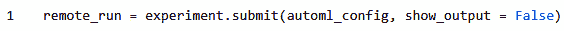

图 5.27 – 提交 AutoML 实验运行

在笔记本中，虽然不是必需的，但我们可以通过执行以下代码来指定在运行完成之前暂停后续单元格的执行：

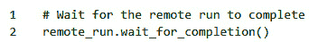

图 5.28 – 等待完成

等待实验完成，然后继续查看模型训练的输出。我们还可以查看指标以了解模型的性能。

# 通过 AMLS 和 AML SDK 解析您的 AutoML 结果

当实验运行完成后，我们可以通过利用 AML Python SDK 从 AutoML 实验运行中提取有价值的信息：

1.  对于 AutoML 实验运行，每个运行都作为 AutoML 实验运行的子运行执行。这意味着我们可以通过查看给定运行的子运行来获取实验运行的最佳运行，如图 *图 5.29* 所示：

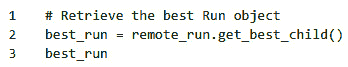

图 5.29 – 检索 AutoML 实验运行的最佳子运行

1.  由于我们可以以编程方式查看信息，我们也能够通过 AMLS 获取最佳模型。在工作室中，通过单击 `automl-classification-titanic` 实验项目，我们可以看到为实验创建的运行。

1.  单击运行超链接将带我们到实验运行的详细信息。如果我们切换到 **模型** 选项卡，我们可以根据主要指标的值查看模型，并查看最佳模型提供的解释：

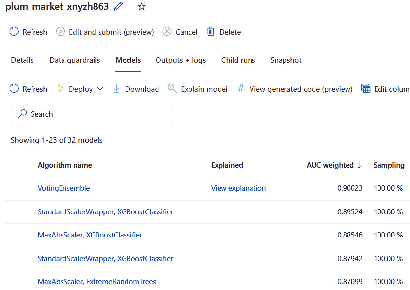

图 5.30 – 在 AMLS 中检索 AutoML 实验运行的最佳子运行

从 *图 5.30*，如果我们单击 **查看解释** 超链接，我们可以探索 AutoML 能够创建的最佳模型的信息。

1.  通过单击 **聚合特征重要性** 选项卡，我们可以看到对模型影响最大的特征。我们可以看到，**性别**、**舱位等级**、**年龄**和**票价**是创建的模型中最重要的前四个特征：

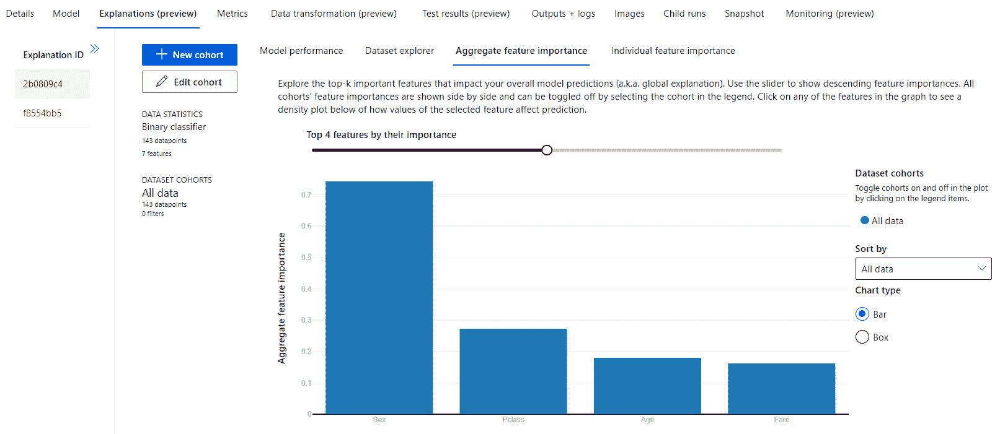

图 5.31 – 聚合特征重要性

1.  从`best_run`对象中，我们可以通过从`outputs`目录下载`featurization summary json`文件来程序化地检索数据集上发生的特征化。这使我们能够了解对数据集进行的自动化特征化，以提供最佳模型：

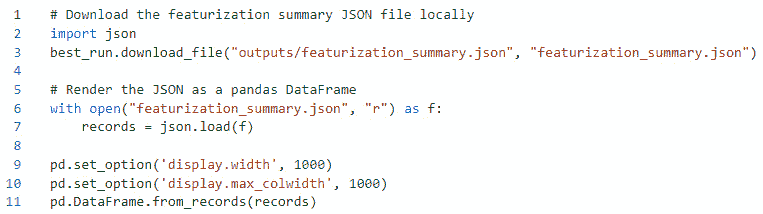

图 5.32 – 获取特征化结果

1.  特征化结果不仅可以程序化地审查，而且 AMLS 中最佳模型的解释也可以审查，如下所示：

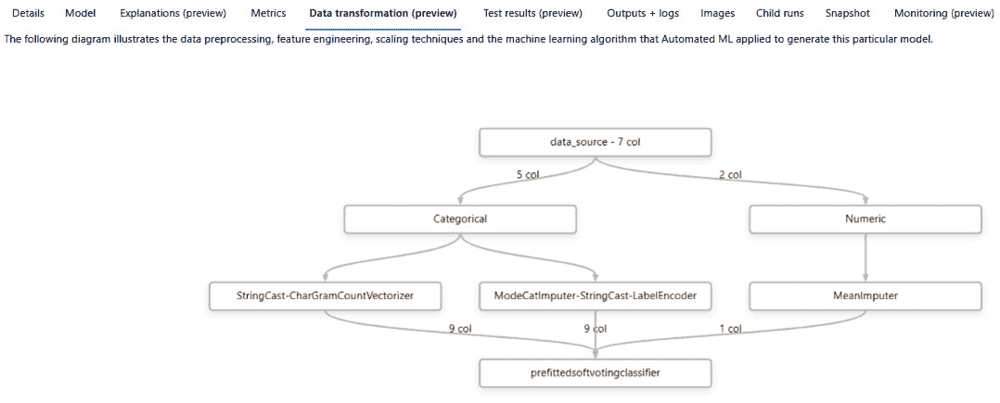

图 5.33 – AutoML 实现的数据转换过程

1.  可以通过利用`RunDetails`小部件直接在笔记本中查看运行详情，如图*图 5.34*中的代码所示：

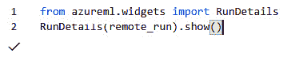

图 5.34 – The RunDetails widget

1.  使用该小部件，您可以在以下图中查看主要指标（以及其他指标）在训练运行每次迭代的指标值：

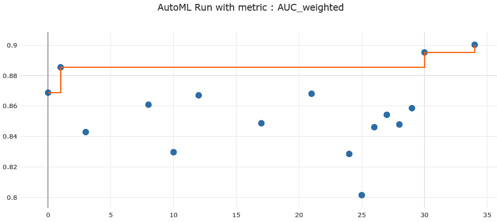

图 5.35 – AutoML 实验运行的训练迭代

1.  对于训练运行，我们能够通过 SDK 程序化地提取最佳运行和拟合的模型，如下所示：

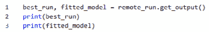

图 5.36 – 获取最佳模型

1.  我们还能够检索 AutoML 使用的估计器，如下所示。`estimator`是一个类，它帮助组织特定运行使用的执行和配置。它还允许我们配置建模使用的规模和计算。`estimator`内部有多个步骤用于代码，而`[-1]`则返回到之前的步骤：

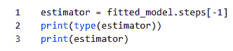

图 5.37 – 获取估计器

1.  由于已经检索到模型，我们可以直接利用它进行预测，如图*图 5.38*所示：

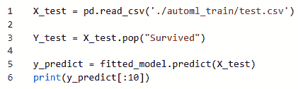

图 5.38 – 直接利用 AutoML 模型

1.  我们可以利用测试数据集获取实验的指标，但也可以查看为最佳模型创建的运行子运行，并检索测试数据集的主要指标：

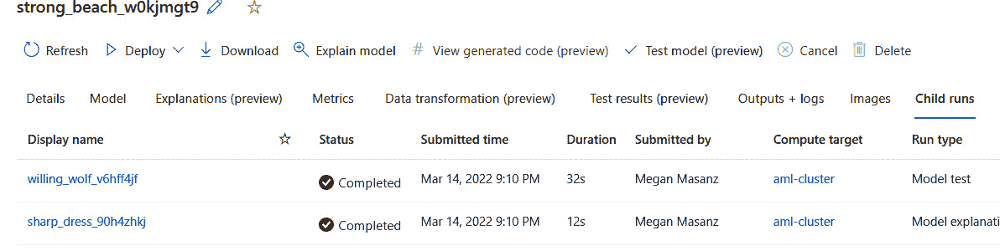

图 5.39 – 最佳模型子运行

1.  点击模型测试的运行，将显示为提供的测试数据集计算的指标。这是在模型创建时未使用的未见数据：

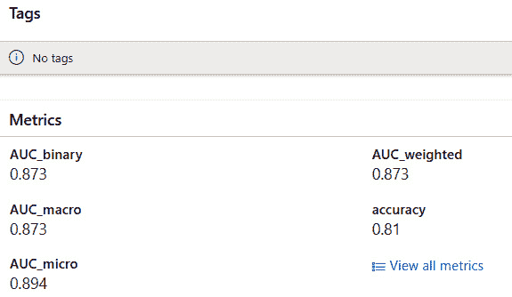

图 5.40 – 最佳模型子运行指标

1.  作为模型输出的结果，会生成一个`scoring`文件，该文件可用于模型部署。这个`score.py`文件可以从*图 5*中显示的最佳运行中下载。41*：

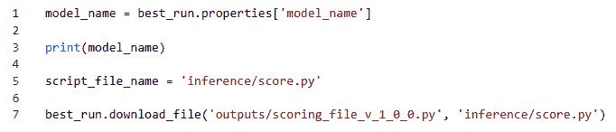

图 5.41 – 下载评分文件

1.  利用 AML Python SDK，可以将模型注册到 AML 工作区，以便像*图 5*中所示的那样进行模型部署：

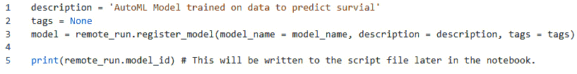

图 5.42 – 注册 AutoML 模型

1.  由于模型已注册且评分脚本已定义，我们可以像*图 5*中所示的那样将模型作为 ACI 服务部署。一旦模型部署完成，通常需要几分钟，我们就可以使用 Postman 或其他基于 REST 或 HTTP 的客户端调用推理 API 进行测试或消费其他应用程序：

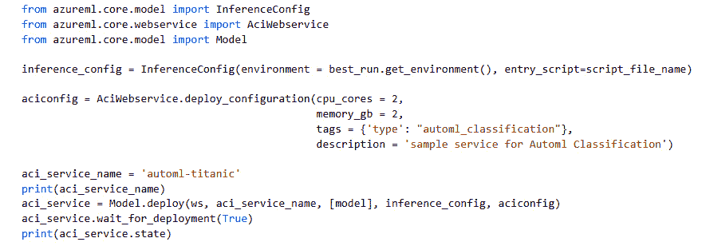

图 5.43 – 模型部署

1.  然后，我们可以调用测试端点进行实时推理，如图*图 5*中所示：

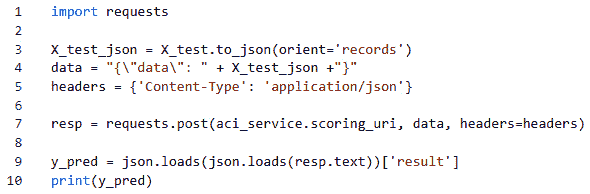

图 5.44 – AutoML 最佳模型部署

接下来，让我们总结本章内容。

# 概述

在本章中，我们为您概述了 Azure AutoML。我们讨论了特征化，这可能是一个耗时极长的任务，是如何由 AutoML 处理的。然后我们探讨了如何通过 AMLS 使用 AutoML 实现无代码体验。最后，我们向您展示了如何使用 AML Python SDK 编写代码，以及如何查看和解析输出。

在下一章中，我们将向您展示如何部署您的 ML 模型进行实时推理——例如，调用暴露训练模型的 REST API——以及批量评分。

# 第二部分：在 AMLS 中部署和解释模型

在*第二部分*中，读者将学习如何在 AMLS 中批量和实时部署模型。此外，他们还将学习如何使用 AMLS 解释 ML 模型并减轻偏差。

本节包含以下章节：

+   *第六章*，*部署 ML 模型进行实时推理*

+   *第七章*，*部署 ML 模型进行批量评分*

+   *第八章*，*负责任的 AI*

+   *第九章*，*使用 MLOps 生产化您的作业*
